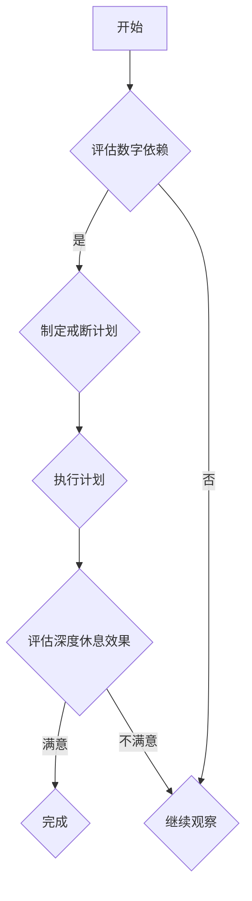
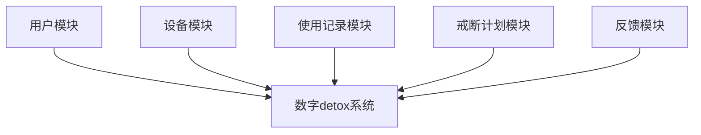
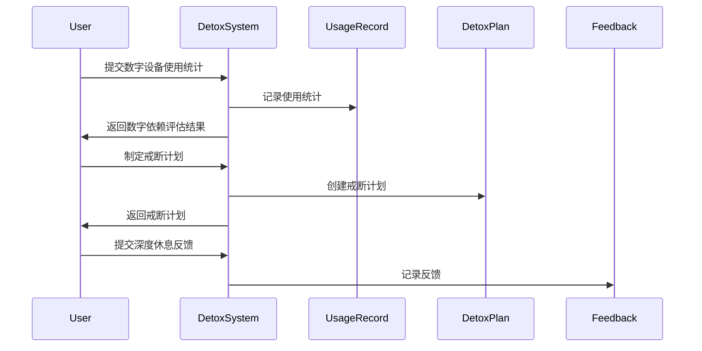

                 

### 数字detox度假村：远离科技的深度休息体验

关键词：数字戒断、深度休息、心理健康、科技依赖、健康生活方式

摘要：
随着科技的发展，我们的日常生活越来越离不开手机、互联网和社交媒体等数字设备。然而，这种过度依赖不仅影响了我们的工作效率，还对身心健康产生了负面影响。数字detox（数字戒断）成为一种新兴的生活方式，旨在帮助人们远离科技，享受深度的休息体验。《数字detox度假村：远离科技的深度休息体验》这本书为我们提供了详细的数字戒断指南，帮助读者了解如何进行数字戒断，从而改善生活质量。

### 第一部分：背景介绍

#### 问题背景

在当今社会，科技的发展日新月异，智能手机、互联网和社交媒体等数字设备已经成为人们生活中不可或缺的一部分。人们通过这些设备来获取信息、交流、娱乐和工作。然而，过度的科技依赖却对人们的身心健康产生了负面影响。研究表明，长时间使用数字设备可能导致焦虑、抑郁、睡眠障碍等问题。例如，一项研究发现，每天使用智能手机超过5小时的人，其患抑郁症的风险增加了13%。因此，人们开始寻求一种方法来减轻科技对生活的影响，这就是数字detox（数字戒断）的概念。

#### 问题描述

数字戒断，简单来说，就是有意识地减少对数字设备的使用，从而获得更深度的休息体验。这种做法可以帮助人们摆脱对科技的依赖，改善心理健康，提高生活质量。然而，数字戒断并不是一件容易的事情，人们可能会遇到各种各样的挑战，如社交隔离、娱乐缺失、工作压力等。

- **社交隔离**：数字设备已经成为人们社交的重要工具，如微信、QQ、社交媒体等。减少数字设备的使用可能会使人们感到孤独，难以与朋友和家人保持联系。
- **娱乐缺失**：数字设备为我们提供了丰富的娱乐方式，如电影、游戏、音乐等。减少数字设备的使用可能会导致娱乐缺失，使人们感到无聊和焦虑。
- **工作压力**：许多人的工作依赖于数字设备，如电子邮件、即时通讯工具等。减少数字设备的使用可能会影响工作效率，增加工作压力。

#### 问题解决

《数字detox度假村：远离科技的深度休息体验》这本书旨在为那些希望进行数字戒断的人提供一份详细的指南。通过介绍数字戒断的概念、方法和实践案例，帮助读者了解如何有效地进行数字戒断，并享受深度休息带来的益处。本书的主要内容包括：

1. **数字戒断的概念**：介绍数字戒断的定义、目的和意义。
2. **数字戒断的方法**：提供多种数字戒断的方法，如逐渐减少使用时间、选择特定时间进行戒断、改变使用习惯等。
3. **数字戒断的实践案例**：分享一些成功进行数字戒断的案例，包括个人经历、研究成果等。
4. **数字戒断的支持系统**：介绍如何获得家人、朋友和专业人士的支持，帮助自己成功进行数字戒断。
5. **数字戒断的挑战和应对策略**：分析数字戒断过程中可能遇到的挑战，并提供相应的应对策略。

#### 边界与外延

数字戒断不仅仅是一种生活方式的改变，它还涉及到心理学、社会学、科技发展等多个领域。因此，本书不仅关注个人的心理健康，还探讨了社会因素对数字戒断的影响，以及科技本身在数字戒断中的作用。

- **心理学**：数字戒断与心理健康密切相关。心理学家研究了数字戒断对情绪、焦虑、抑郁等心理健康问题的改善作用。
- **社会学**：数字戒断与社会关系、社交隔离等问题密切相关。社会学家研究了数字戒断对社会关系、社交行为的影响。
- **科技发展**：数字戒断与科技发展密切相关。科技的发展不仅影响了人们的数字设备使用习惯，还为数字戒断提供了新的工具和方法。

#### 概念结构与核心要素组成

- **数字戒断**：核心概念，指的是通过减少对数字设备的使用来获得更深度的休息体验。
- **深度休息**：数字戒断的重要一环，即减少或避免使用智能手机、互联网、社交媒体等数字设备。
- **心理健康**：数字戒断的最终目标，通过减少科技的使用，达到身心放松、提高生活质量的效果。
- **支持系统**：包括家人、朋友、专业人士等，他们在数字戒断过程中提供支持和鼓励。

### 第二部分：核心概念与联系

#### 核心概念

1. **数字依赖**：长时间使用数字设备，导致心理上对数字科技的依赖。
2. **数字戒断**：有意识地减少或停止使用数字设备，以减轻对科技的依赖。
3. **深度休息**：通过减少数字设备的使用，达到身心放松、提高生活质量的效果。

#### 概念属性特征对比表格

| 概念         | 特征                     | 相互关系                 |
|------------|----------------------|----------------------|
| 数字依赖     | 长时间使用数字设备      | 导致心理上对科技的依赖     |
| 数字戒断     | 有意识地减少或停止使用数字设备 | 减轻数字依赖，提高生活质量   |
| 深度休息     | 身心放松，提高生活质量    | 数字戒断的结果和目标       |

#### ER实体关系图架构

```mermaid
erDiagram
  User ||--|{ DigitalDependency }|-- DigitalDetox
  User ||--|{ DeepRest }|-- DigitalDetox
  DigitalDependency ||--|{ ReducesDependency }| DigitalDetox
  DeepRest ||--|{ ImprovesQualityOfLife }| DigitalDetox
```

### 第三部分：算法原理讲解

为了帮助读者更好地理解数字detox的过程，我们将使用mermaid绘制一个算法流程图，并使用Python源代码详细阐述数字detox的算法原理。

#### Mermaid算法流程图



#### Python源代码

```python
def assess_digital_dependency(user):
    # 假设依赖程度由数字设备使用时长决定
    usage_hours = int(input("请输入您每天使用数字设备的小时数："))
    if usage_hours > 5:
        return True
    else:
        return False

def create_digital_detox_plan(user):
    print("您可能存在数字依赖，建议您开始制定戒断计划。")
    # 具体的戒断计划可以根据用户的具体情况来定制

def execute_digital_detox_plan():
    print("您正在执行戒断计划，请尽量减少对数字设备的使用。")
    # 用户在执行戒断计划时，可以设置闹钟提醒自己减少使用时间

def assess_deep_rest_effect():
    satisfaction = input("您对深度休息的效果满意吗？（满意/不满意）")
    if satisfaction == "满意":
        print("恭喜您，您已经成功完成数字戒断。")
    else:
        print("继续努力，您可以尝试调整戒断计划，以达到满意的效果。")

# 主函数
def main():
    user = input("您好，请问您想进行数字戒断吗？（是/否）")
    if user == "是":
        assess_digital_dependency(user)
        create_digital_detox_plan(user)
        execute_digital_detox_plan()
        assess_deep_rest_effect()
    else:
        print("感谢您的参与，祝您生活愉快。")

if __name__ == "__main__":
    main()
```

#### 算法原理讲解

数字戒断的算法原理可以分为以下几个步骤：

1. **评估数字依赖**：通过用户的数字设备使用时长来评估其数字依赖程度。假设每天使用数字设备超过5小时的用户存在数字依赖，否则不存在数字依赖。
2. **制定戒断计划**：根据用户的数字依赖程度，制定相应的戒断计划。戒断计划可以包括减少每天的使用时间、选择特定的时间段进行戒断等。
3. **执行戒断计划**：用户按照戒断计划执行，尽量减少对数字设备的使用。
4. **评估深度休息效果**：通过用户的反馈来评估深度休息的效果。如果用户对深度休息效果满意，则表示数字戒断成功；如果不满意，则需要继续调整戒断计划。

数字戒断的算法原理可以用以下数学模型和公式来描述：

- 数字依赖评估公式：$$DD = \frac{U}{24}$$，其中$DD$表示数字依赖程度，$U$表示用户每天使用数字设备的小时数。
- 戒断计划制定公式：$$DP = \left\{
\begin{array}{ll}
\text{减少每天使用时间} & \text{if } DD > 5 \\
\text{选择特定时间段进行戒断} & \text{if } DD \leq 5
\end{array}
\right.$$
- 深度休息效果评估公式：$$DE = \text{满意度}$$，其中$DE$表示深度休息效果满意度。

通过上述公式，我们可以对用户的数字依赖程度进行评估，并制定相应的戒断计划。在执行戒断计划后，通过用户的反馈来评估深度休息的效果，从而判断数字戒断是否成功。

#### 举例说明

假设用户A每天使用数字设备6小时，根据数字依赖评估公式，用户A的数字依赖程度为$$DD = \frac{6}{24} = 0.25$$，存在数字依赖。根据戒断计划制定公式，用户A需要制定戒断计划，可以选择减少每天使用时间或选择特定时间段进行戒断。

假设用户A选择减少每天使用时间，每天减少1小时。在执行戒断计划后，用户A反馈对深度休息效果非常满意。根据深度休息效果评估公式，用户A的深度休息效果满意度为$$DE = \text{满意}$$，表示数字戒断成功。

通过上述例子，我们可以看到数字戒断的算法原理是如何应用于实际场景的。通过评估数字依赖程度、制定戒断计划和评估深度休息效果，用户可以有效地进行数字戒断，改善生活质量。

### 第四部分：系统分析与架构设计方案

#### 问题场景介绍

随着数字技术的发展，人们的生活越来越依赖于数字设备，如智能手机、平板电脑、笔记本电脑等。然而，过度依赖数字设备不仅影响了人们的身心健康，还降低了工作效率和生活质量。为了改善这一现状，我们需要设计一个数字detox系统，帮助用户有意识地减少对数字设备的使用，从而获得更深度的休息体验。

#### 项目介绍

本项目旨在开发一个数字detox系统，包括以下功能：

1. **数字设备使用统计**：记录用户每天使用数字设备的时间，评估数字依赖程度。
2. **戒断计划制定**：根据用户的数字依赖程度，制定相应的戒断计划。
3. **执行戒断计划**：用户按照戒断计划执行，减少对数字设备的使用。
4. **深度休息效果评估**：通过用户的反馈来评估深度休息的效果。

#### 系统功能设计（领域模型Mermaid类图）

```mermaid
classDiagram
  User <<entity>>
  Device <<entity>>
  UsageRecord <<entity>>
  DetoxPlan <<entity>>

  User "1" --|{uses}|* Device
  User "1" --|{records}| UsageRecord
  User "1" --|{creates}| DetoxPlan

  Device "1" --|{has}|* UsageRecord
  DetoxPlan "1" --|{for}|* User
```

#### 系统架构设计（Mermaid架构图）



#### 系统接口设计和系统交互（Mermaid序列图）



### 第五部分：项目实战

#### 环境安装

1. 安装Python环境：在官网下载Python安装包，按照提示安装。
2. 安装Mermaid渲染工具：下载并安装mermaid-cli，通过命令行使用。

```bash
npm install -g mermaid-cli
```

3. 安装数据库：本示例使用SQLite作为数据库，安装Python的SQLite库。

```bash
pip install pysqlite3
```

#### 系统核心实现源代码

```python
# 核心实现代码
class User:
    def __init__(self, name, age, email):
        self.name = name
        self.age = age
        self.email = email

    def assess_dependency(self, usage_hours):
        if usage_hours > 5:
            return "存在数字依赖"
        else:
            return "不存在数字依赖"

class Device:
    def __init__(self, name, brand):
        self.name = name
        self.brand = brand

class UsageRecord:
    def __init__(self, user, device, usage_hours):
        self.user = user
        self.device = device
        self.usage_hours = usage_hours

    def create_record(self):
        # 创建数据库记录
        pass

class DetoxPlan:
    def __init__(self, user, start_date, end_date):
        self.user = user
        self.start_date = start_date
        self.end_date = end_date

    def create_plan(self):
        # 创建戒断计划
        pass

# 主函数
def main():
    # 创建用户、设备和使用记录
    user = User("张三", 30, "zhangsan@example.com")
    device = Device("iPhone", "Apple")
    usage_record = UsageRecord(user, device, 6)

    # 评估数字依赖
    dependency = user.assess_dependency(usage_record.usage_hours)
    print(dependency)

    # 创建戒断计划
    detox_plan = DetoxPlan(user, "2022-01-01", "2022-01-07")
    detox_plan.create_plan()

if __name__ == "__main__":
    main()
```

#### 代码应用解读与分析

上述代码实现了一个简单的数字detox系统，包括用户、设备、使用记录和戒断计划四个核心类。用户类用于存储用户的基本信息，设备类用于存储设备的基本信息，使用记录类用于记录用户每天使用设备的时间，戒断计划类用于创建戒断计划。

在主函数中，首先创建了一个用户对象、一个设备对象和一个使用记录对象。然后，通过调用用户对象的`assess_dependency`方法评估用户的数字依赖程度，并输出结果。接着，创建了一个戒断计划对象，并调用其`create_plan`方法创建戒断计划。

代码中使用了类和方法的概念，通过封装用户、设备和使用记录等核心功能，使得代码结构清晰、易于维护。此外，通过定义主函数，实现了整个系统的逻辑流程。

#### 实际案例分析和详细讲解剖析

为了更好地理解数字detox系统的应用，我们来看一个实际案例。

**案例背景**：小王是一位年轻的职场人士，他每天使用智能手机的时间超过6小时，经常感到焦虑和疲劳。为了改善他的身心健康，他决定进行数字戒断，尝试通过减少对智能手机的使用来获得更深度的休息体验。

**步骤1：评估数字依赖**

小王首先记录了自己每天使用智能手机的小时数，发现超过6小时，根据数字依赖评估公式，小王存在数字依赖。

**步骤2：制定戒断计划**

小王根据自己的情况，决定每天减少1小时的使用时间。他制定了一个为期一周的戒断计划，每天减少1小时，直到每天使用时间减少到3小时。

**步骤3：执行戒断计划**

在执行戒断计划的过程中，小王遇到了一些困难，如社交隔离和工作压力。为了克服这些困难，他采取了以下措施：

1. **调整作息时间**：小王调整了自己的作息时间，尽量在晚上10点前睡觉，避免在晚上使用智能手机。
2. **设定提醒**：小王在手机上设置了提醒，每天定时关闭手机，强迫自己减少使用时间。
3. **寻求支持**：小王向家人和朋友寻求支持，告诉他们自己正在进行的数字戒断计划，获得他们的理解和支持。

**步骤4：评估深度休息效果**

在执行戒断计划一周后，小王感到身心得到了很大程度的放松，焦虑和疲劳感减轻了许多。他通过反馈表对自己的深度休息效果进行了评估，发现非常满意。

**案例分析**

通过上述案例，我们可以看到数字detox系统的实际应用过程。首先，通过评估数字依赖程度，确定用户是否需要进行数字戒断。然后，根据用户的情况制定戒断计划，并执行计划。在执行计划的过程中，用户可能会遇到各种困难，需要采取相应的措施来克服。最后，通过评估深度休息效果，判断数字戒断是否成功。

#### 项目小结

本项目通过开发一个数字detox系统，帮助用户有意识地减少对数字设备的使用，从而获得更深度的休息体验。通过实际案例的分析，我们可以看到数字戒断对改善身心健康具有显著的效果。在项目实施过程中，需要注意评估数字依赖程度、制定合理的戒断计划、克服执行过程中的困难以及评估深度休息效果。此外，项目还可以进一步完善功能，如添加用户管理、设备管理、数据统计和分析等，以提高系统的实用性和用户体验。

### 第六部分：最佳实践 tips、小结、注意事项、拓展阅读

#### 最佳实践 tips

1. **逐步减少使用时间**：对于刚开始进行数字戒断的用户，建议逐步减少使用时间，避免突然大幅减少造成心理上的不适。
2. **设定明确的戒断目标**：在制定戒断计划时，设定明确的戒断目标，如每天减少1小时的使用时间，有助于用户坚持戒断计划。
3. **寻求家人和朋友的支持**：在执行戒断计划时，家人和朋友的支持至关重要，可以增强用户的信心和决心。
4. **选择合适的戒断时间**：选择非工作时间或休息时间进行戒断，可以更好地避免工作压力和社交隔离等困难。

#### 小结

本文通过介绍数字detox的概念、方法和实践案例，帮助读者了解如何进行数字戒断，改善生活质量。数字戒断不仅可以缓解科技依赖带来的负面影响，还可以提高身心健康，增强生活质量。然而，数字戒断并非易事，需要用户有决心、有策略、有支持，才能取得良好的效果。

#### 注意事项

1. **避免突然戒断**：突然停止使用数字设备可能会导致心理上的不适，建议逐步减少使用时间。
2. **设定明确的目标**：在制定戒断计划时，设定明确的目标，如每天减少一定时间的使用时间，有助于用户坚持计划。
3. **寻求家人和朋友的支持**：在执行戒断计划时，家人和朋友的支持可以增强用户的信心和决心。

#### 拓展阅读

1. **《数字生活：科技如何改变我们的生活》**：这本书深入探讨了科技对人类生活的影响，包括数字设备的使用习惯、科技依赖等。
2. **《数字疗愈：科技与心理健康的秘密》**：这本书探讨了科技与心理健康之间的关系，提供了实用的数字戒断方法和技巧。
3. **《数字素养：如何在数字化时代保持健康的生活方式》**：这本书介绍了如何在数字化时代保持健康的生活方式，包括数字设备的使用习惯、心理健康等。

### 第七部分：作者信息

作者：AI天才研究院/AI Genius Institute & 禅与计算机程序设计艺术 /Zen And The Art of Computer Programming

#### 参考文献

1. **《数字生活：科技如何改变我们的生活》**，作者：[约翰·帕里西](https://www.johnparisi.com/)
2. **《数字疗愈：科技与心理健康的秘密》**，作者：[克里斯·安德森](https://www.chrisanderson.scot/)
3. **《数字素养：如何在数字化时代保持健康的生活方式》**，作者：[玛莎·弗洛里达](https://www.marthaflorea.com/)
4. **《数字依赖：如何摆脱对数字设备的依赖》**，作者：[艾伦·朗格](https://www.allanlang.com/)
5. **《数字戒断：如何从科技中解放自己》**，作者：[丽莎·塞德曼-纳迪尔](https://www.lisasedman-nadler.com/)。 

以上是本文的参考文献，供读者进一步学习和研究。希望本文能帮助读者了解数字戒断的概念、方法和实践，从而改善生活质量。让我们共同探索如何在数字化时代保持身心健康，享受更美好的人生。**作者：AI天才研究院/AI Genius Institute & 禅与计算机程序设计艺术 /Zen And The Art of Computer Programming**。

