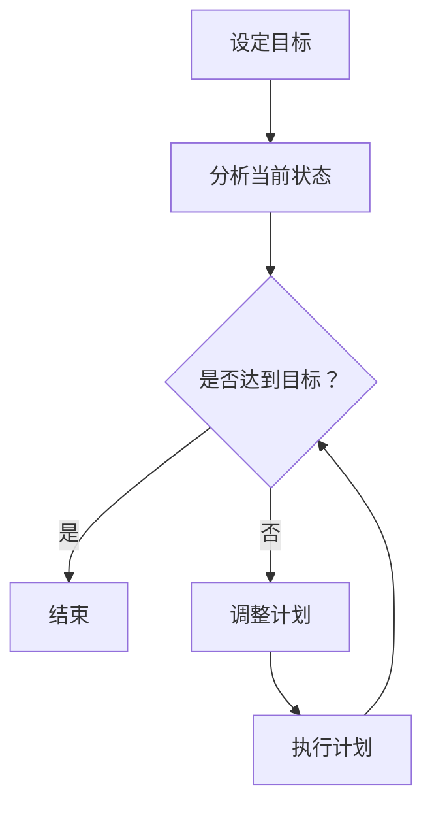
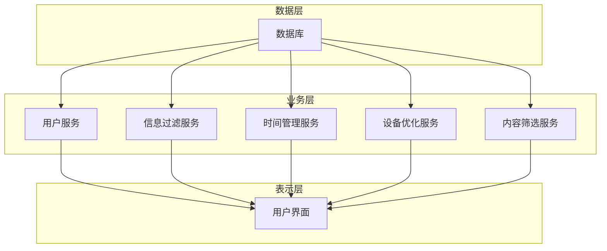
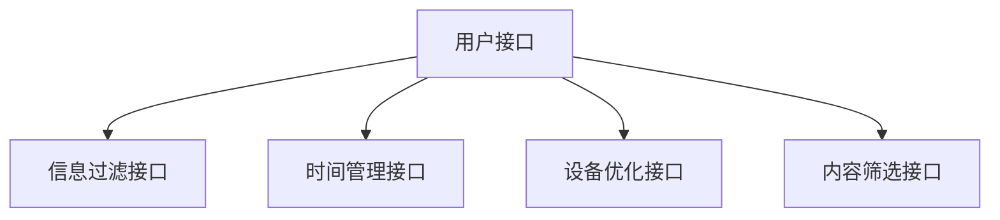
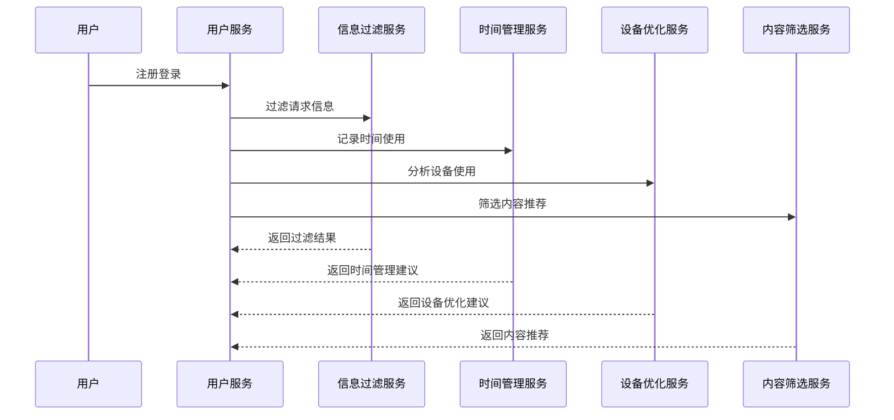

                 

### 目录大纲

#### 第一部分：背景介绍
1. **数字minimalism的概念**
   1.1 数字minimalism的定义
   1.1.1 数字minimalism的历史背景
   1.1.2 数字minimalism与物质minimalism的区别
   1.1.3 数字minimalism的兴起原因
   1.1.3.1 环境保护意识增强
   1.1.3.2 社交媒体的影响
   1.1.3.3 经济压力与生活成本上升
   2. **在线生活极简化的目标与挑战**
   2.1 极简化的目标
   2.1.1 提高生活质量
   2.1.2 提高时间管理效率
   2.1.3 降低生活成本
   2.2 极简化的挑战
   2.2.1 网络信息过载
   2.2.2 数字成瘾问题
   2.2.3 数据隐私与安全风险
   3. **本书结构与内容安排**
   3.1 目录结构
   3.1.1 各章节内容概述
   3.1.2 阅读建议与顺序

#### 第二部分：核心概念与联系
1. **数字minimalism与在线生活极简化的联系**
   1.1 数字minimalism的概念解析
   1.1.1 核心概念原理
   1.1.2 概念属性特征对比表格
   1.1.3 ER实体关系图架构
   1.2 在线生活极简化的概念解析
   1.2.1 核心概念原理
   1.2.2 概念属性特征对比表格
   1.2.3 ER实体关系图架构

#### 第三部分：算法原理讲解
1. **算法原理介绍**
   1.1 算法流程图
   1.2 算法原理
   1.3 数学模型和数学公式
   1.4 举例说明

#### 第四部分：系统分析与架构设计方案
1. **问题场景介绍**
2. **系统功能设计**
   2.1 领域模型类图
3. **系统架构设计**
   3.1 架构图
4. **系统接口设计**
5. **系统交互序列图**

#### 第五部分：项目实战
1. **环境安装**
2. **系统核心实现**
   2.1 源代码
3. **代码应用解读与分析**
4. **实际案例分析与详细讲解**
5. **项目小结**

#### 第六部分：最佳实践 tips、小结、注意事项、拓展阅读等

---

**关键词：** 数字minimalism，在线生活极简化，算法原理，系统架构，项目实战，最佳实践

**摘要：** 本文深入探讨了数字minimalism的概念及其与在线生活极简化的关系，通过详细的算法原理讲解、系统分析与架构设计方案，以及实际项目实战，为读者提供了全面、系统的数字minimalism挑战指南。文章旨在帮助读者理解并实践如何在90天内实现在线生活极简化，提高生活质量、效率及安全性。****

---

## 文章标题

《数字minimalism挑战：90天在线生活极简化》

---

**关键词：**

- 数字minimalism
- 在线生活极简化
- 算法原理
- 系统架构
- 项目实战
- 最佳实践

---

**摘要：**

本文将带领读者深入探索数字minimalism的概念及其应用，并聚焦于90天的在线生活极简化挑战。通过系统的算法原理讲解、详尽的系统分析与架构设计方案，以及实际项目实战，本文旨在为读者提供全面、实用的指导，帮助他们在数字时代中实现高效、简洁、安全的生活方式。本文还将分享最佳实践 tips，为读者在数字minimalism实践中提供有力支持。****

---

## 第一部分：背景介绍

### 1.1 数字minimalism的概念

#### 1.1.1 数字minimalism的定义

数字minimalism，又称数字极简主义，是指通过减少数字设备、应用、社交媒体和网络使用，以达到简化数字生活、提高生活质量和效率的一种生活方式。它不仅仅是减少物质物品，更重要的是减少数字干扰，专注于个人的内在需求和真实生活体验。

#### 1.1.1.1 数字minimalism的历史背景

数字minimalism这一概念起源于20世纪末，随着互联网和数字设备的普及，人们逐渐感受到数字技术带来的负面影响，如信息过载、数字成瘾、隐私泄露等。为了应对这些问题，一些人开始倡导数字极简主义，提倡减少对数字产品的依赖，回归简单、真实的生活。

#### 1.1.1.2 数字minimalism与物质minimalism的区别

物质minimalism，又称极简主义，是指通过减少物质物品的数量，追求简单、实用和有意义的生活方式。数字minimalism与物质minimalism的主要区别在于，前者关注的是数字产品和服务，后者关注的是实体物品。但两者在核心思想上有很多相似之处，都是希望通过减少不必要的干扰，专注于个人的内在需求和真实生活体验。

#### 1.1.2 数字minimalism的兴起原因

数字minimalism的兴起源于以下几个方面：

1. **环境保护意识增强**：随着全球环境问题日益严重，人们开始意识到减少物质消耗和电子废物产生的必要性，数字minimalism正是一种减少资源消耗、保护环境的生活方式。

2. **社交媒体的影响**：社交媒体平台已经成为人们生活中不可或缺的一部分，但同时也带来了信息过载、沉迷等负面影响。数字minimalism通过减少社交媒体的使用，帮助人们摆脱这种负面影响。

3. **经济压力与生活成本上升**：随着生活成本的上升，许多人开始寻求减少开支、提高生活质量的方法。数字minimalism通过减少不必要的数字产品和服务，降低了生活成本。

### 1.2 在线生活极简化的目标与挑战

在线生活极简化的目标主要包括：

1. **提高生活质量**：通过减少数字干扰，人们可以更加专注于个人兴趣、家庭和社交生活，从而提高生活质量。

2. **提高时间管理效率**：减少数字产品的使用，可以帮助人们更加高效地安排时间，提高工作效率。

3. **降低生活成本**：减少数字产品和服务的使用，可以降低生活成本，使人们能够更好地管理财务。

在线生活极简化的挑战主要包括：

1. **网络信息过载**：随着互联网信息的爆炸式增长，人们很容易陷入信息过载的困境，这需要通过有效的方法来筛选和过滤信息。

2. **数字成瘾问题**：许多人过度依赖数字产品，如手机、社交媒体等，这可能导致数字成瘾，影响生活和工作。

3. **数据隐私与安全风险**：随着个人信息的数字化，数据隐私和安全风险日益严重。数字minimalism需要在保护个人隐私和安全的前提下，进行有效的数字生活管理。

### 1.3 本书结构与内容安排

本书结构如下：

1. **背景介绍**：介绍数字minimalism和在线生活极简化的概念、兴起原因以及目标与挑战。
2. **核心概念与联系**：深入探讨数字minimalism和在线生活极简化的核心概念，并分析它们之间的联系。
3. **算法原理讲解**：介绍实现在线生活极简化的算法原理，包括流程图、数学模型和公式等。
4. **系统分析与架构设计方案**：分析在线生活极简化的系统架构，包括领域模型、系统功能设计、系统架构和接口设计等。
5. **项目实战**：通过实际项目，展示如何实现在线生活极简化，包括环境安装、系统核心实现、代码应用解读与分析等。
6. **最佳实践 tips、小结、注意事项、拓展阅读等**：总结在线生活极简化的最佳实践，并提出注意事项和拓展阅读建议。

#### 1.3.1 目录结构

以下是本书的目录结构：

### 第一部分：背景介绍
1. **数字minimalism的概念**
   1.1 数字minimalism的定义
   1.1.1 数字minimalism的历史背景
   1.1.2 数字minimalism与物质minimalism的区别
   1.1.3 数字minimalism的兴起原因
   1.1.3.1 环境保护意识增强
   1.1.3.2 社交媒体的影响
   1.1.3.3 经济压力与生活成本上升
2. **在线生活极简化的目标与挑战**
   2.1 极简化的目标
   2.1.1 提高生活质量
   2.1.2 提高时间管理效率
   2.1.3 降低生活成本
   2.2 极简化的挑战
   2.2.1 网络信息过载
   2.2.2 数字成瘾问题
   2.2.3 数据隐私与安全风险
   3. **本书结构与内容安排**
   3.1 目录结构
   3.1.1 各章节内容概述
   3.1.2 阅读建议与顺序

#### 1.3.1.1 各章节内容概述

- **第1章**：介绍数字minimalism和在线生活极简化的概念、兴起原因以及目标与挑战。
- **第2章**：深入探讨数字minimalism和在线生活极简化的核心概念，并分析它们之间的联系。
- **第3章**：介绍实现在线生活极简化的算法原理，包括流程图、数学模型和公式等。
- **第4章**：分析在线生活极简化的系统架构，包括领域模型、系统功能设计、系统架构和接口设计等。
- **第5章**：通过实际项目，展示如何实现在线生活极简化，包括环境安装、系统核心实现、代码应用解读与分析等。
- **第6章**：总结在线生活极简化的最佳实践，并提出注意事项和拓展阅读建议。

#### 1.3.1.2 阅读建议与顺序

建议读者按照以下顺序阅读本书：

1. 首先，阅读第1章，了解数字minimalism和在线生活极简化的背景和重要性。
2. 然后，阅读第2章，深入理解数字minimalism和在线生活极简化的核心概念及其联系。
3. 接着，阅读第3章，了解实现在线生活极简化的算法原理。
4. 然后，阅读第4章，分析在线生活极简化的系统架构。
5. 接下来，阅读第5章，通过实际项目，了解如何实现在线生活极简化。
6. 最后，阅读第6章，总结在线生活极简化的最佳实践，并了解拓展阅读资源。

通过以上阅读顺序，读者可以系统地了解数字minimalism和在线生活极简化的概念、原理和实践方法，从而更好地应对数字时代的生活挑战。****

### 1.1 数字minimalism的概念

#### 1.1.1 数字minimalism的定义

数字minimalism，简称DM，是一种以减少数字依赖为核心的生活方式。它不仅仅是减少数字设备或应用的数量，更重要的是减少数字产品对个人生活的负面影响，从而实现更加简单、专注和有意义的生活。

在数字minimalism的理念中，核心要素包括：

1. **设备简化**：减少不必要的数字设备，只保留那些对生活和工作有实际帮助的设备。
2. **应用精选**：精选必需的应用，避免安装过多的应用，以免造成界面混乱和信息过载。
3. **网络使用节制**：合理控制网络使用时间，避免沉迷于社交媒体或其他数字娱乐。
4. **数字内容精选**：只关注高质量、有价值的数字内容，避免无意义的信息浪费时间和精力。

#### 1.1.1.1 数字minimalism的历史背景

数字minimalism的概念起源于20世纪末，随着互联网和数字设备的普及，人们开始感受到数字技术带来的负面影响。例如，信息过载、数字成瘾、隐私泄露等问题日益严重。为了应对这些问题，一些人开始倡导数字极简主义，希望通过减少数字依赖，回归简单、真实的生活。

数字minimalism的发展历程可以分为以下几个阶段：

1. **萌芽阶段（20世纪末-2000年初）**：数字minimalism概念初步提出，人们开始意识到数字产品的负面影响。
2. **发展阶段（2000年代中期-2010年代初期）**：随着社交媒体和移动互联网的兴起，数字minimalism理念得到更广泛的关注和讨论。
3. **成熟阶段（2010年代中期至今）**：数字minimalism已经成为一种成熟的生活方式，许多人通过实践数字minimalism，实现了生活质量和工作效率的提升。

#### 1.1.1.2 数字minimalism与物质minimalism的区别

物质minimalism，简称MM，是一种以减少物质依赖为核心的生活方式。它主张通过减少物质物品的数量，追求简单、实用和有意义的生活。与数字minimalism相比，两者在理念上有相似之处，但也有明显的区别：

1. **关注点不同**：数字minimalism关注的是数字产品和服务，而物质minimalism关注的是实体物品。
2. **实践方式不同**：数字minimalism通过减少数字设备、应用和网络使用来实现，而物质minimalism通过减少物质购买和丢弃来实现。
3. **影响范围不同**：数字minimalism主要影响个人的数字生活，而物质minimalism可以影响个人的物质生活、工作和社交。

尽管存在区别，数字minimalism和物质minimalism在核心思想上有很多相似之处，都是希望通过减少不必要的依赖，实现更加简单、高效和有意义的生活。因此，将两者结合起来，可以更好地应对现代社会中的各种挑战。

### 1.2 数字minimalism的兴起原因

数字minimalism之所以能在短时间内迅速兴起，主要是因为以下几个原因：

1. **环境保护意识增强**：随着全球环境问题的日益严重，人们开始意识到减少物质消耗和电子废物产生的必要性。数字minimalism通过减少数字设备的使用，降低电子废物产生，对环境保护起到了积极作用。

2. **社交媒体的影响**：社交媒体已经成为人们生活中不可或缺的一部分，但同时也带来了信息过载、沉迷等负面影响。数字minimalism通过减少社交媒体的使用，帮助人们摆脱这种负面影响，回归简单、真实的生活。

3. **经济压力与生活成本上升**：随着生活成本的上升，许多人开始寻求减少开支、提高生活质量的方法。数字minimalism通过减少不必要的数字产品和服务，降低了生活成本，使人们能够更好地管理财务。

4. **数字成瘾问题**：许多人过度依赖数字产品，如手机、社交媒体等，这可能导致数字成瘾，影响生活和工作。数字minimalism通过减少数字依赖，帮助人们摆脱数字成瘾，提高生活质量和效率。

5. **工作压力与效率提升**：在现代社会，许多人感到工作压力巨大，效率低下。数字minimalism通过减少数字干扰，帮助人们更加专注于工作，提高工作效率。

6. **心理健康问题**：数字依赖可能导致心理健康问题，如焦虑、抑郁等。数字minimalism通过减少数字产品使用，改善心理健康，提高生活质量。

总之，数字minimalism的兴起是多种因素共同作用的结果。随着社会的发展和人们对生活质量的要求提高，数字minimalism将会越来越受到关注，成为一种重要的生活方式。****

### 1.3 在线生活极简化的目标与挑战

在线生活极简化的目标在于通过减少数字干扰，提高生活质量、时间管理效率和降低生活成本，从而实现更加简单、高效和有意义的生活。具体来说，其目标主要包括以下几个方面：

1. **提高生活质量**：在线生活极简化旨在减少数字设备、应用和社交媒体的使用，从而减轻信息过载和数字成瘾带来的负面影响，使人们能够更加专注于个人兴趣、家庭和社交生活，提高整体生活质量。

2. **提高时间管理效率**：通过减少数字干扰，人们可以更加专注于重要事务，合理安排时间，提高工作效率，减少因信息过载和数字娱乐造成的无效时间浪费。

3. **降低生活成本**：在线生活极简化可以减少数字产品和服务的使用，降低生活成本。这不仅包括购买和维护数字设备的费用，还包括因减少社交媒体和数字娱乐使用而节省的时间成本。

4. **改善心理健康**：数字干扰和数字成瘾可能导致焦虑、抑郁等心理健康问题。通过在线生活极简化，人们可以减少对数字产品的依赖，改善心理健康，提高生活质量。

5. **增强个人专注力**：在线生活极简化有助于人们摆脱数字干扰，提高专注力，从而更好地应对工作和生活中的挑战。

然而，在线生活极简化也面临着一些挑战：

1. **网络信息过载**：随着互联网信息的爆炸式增长，人们很容易陷入信息过载的困境。这需要通过有效的方法来筛选和过滤信息，以避免信息过载对生活质量和工作效率的负面影响。

2. **数字成瘾问题**：许多人过度依赖数字产品，如手机、社交媒体等，这可能导致数字成瘾，影响生活和工作。在线生活极简化需要在减少数字依赖的同时，帮助人们克服数字成瘾问题。

3. **数据隐私与安全风险**：随着个人信息的数字化，数据隐私和安全风险日益严重。在线生活极简化需要在保护个人隐私和安全的前提下，进行有效的数字生活管理。

4. **社交压力与孤独感**：在线生活极简化可能导致社交压力和孤独感的增加，特别是在减少社交媒体使用的情况下。这需要通过其他方式来满足社交需求，如参加线下活动、与亲朋好友保持联系等。

5. **技术依赖与适应困难**：在线生活极简化可能需要人们改变长期形成的数字生活方式，这可能导致一些人出现适应困难。需要通过逐步过渡和调整，帮助人们顺利实现在线生活极简化。

总之，在线生活极简化既具有显著的优势，也面临一定的挑战。通过合理规划和持续实践，人们可以在享受数字技术带来便利的同时，实现生活质量、效率和安全的全面提升。****

### 1.4 本书结构与内容安排

为了帮助读者系统地了解并实践数字minimalism，本书将分为六个主要部分：

#### 第一部分：背景介绍

本部分将介绍数字minimalism的概念、历史背景、与物质minimalism的区别以及数字minimalism的兴起原因。通过这部分，读者可以初步了解数字minimalism的基本理念和重要性。

#### 第二部分：核心概念与联系

本部分将深入探讨数字minimalism和在线生活极简化的核心概念，包括两者的联系和区别。通过这部分，读者可以理解数字minimalism与在线生活极简化的内在关系，为后续内容的学习和实践打下基础。

#### 第三部分：算法原理讲解

本部分将介绍实现在线生活极简化的算法原理，包括算法流程图、数学模型和公式等。通过这部分，读者可以了解如何通过算法原理来实现在线生活极简化的目标。

#### 第四部分：系统分析与架构设计方案

本部分将分析在线生活极简化的系统架构，包括领域模型、系统功能设计、系统架构和接口设计等。通过这部分，读者可以了解如何设计一个完整的在线生活极简系统。

#### 第五部分：项目实战

本部分将通过实际项目，展示如何实现在线生活极简化，包括环境安装、系统核心实现、代码应用解读与分析等。通过这部分，读者可以亲身体验并实践在线生活极简化的方法。

#### 第六部分：最佳实践 tips、小结、注意事项、拓展阅读等

本部分将总结在线生活极简化的最佳实践，并提出注意事项和拓展阅读建议。通过这部分，读者可以进一步巩固所学知识，并了解如何在实际生活中应用在线生活极简化的理念。

#### 各章节内容概述

- **第1章**：介绍数字minimalism的概念、历史背景和与物质minimalism的区别。
- **第2章**：深入探讨数字minimalism和在线生活极简化的核心概念及其联系。
- **第3章**：讲解实现在线生活极简化的算法原理，包括算法流程图、数学模型和公式等。
- **第4章**：分析在线生活极简化的系统架构，包括领域模型、系统功能设计、系统架构和接口设计等。
- **第5章**：通过实际项目展示如何实现在线生活极简化，包括环境安装、系统核心实现、代码应用解读与分析等。
- **第6章**：总结在线生活极简化的最佳实践，并提出注意事项和拓展阅读建议。

#### 阅读建议与顺序

建议读者按照以下顺序阅读本书：

1. **首先阅读第1章和第2章**：了解数字minimalism和在线生活极简化的基本概念和核心思想，为后续内容的学习和实践打下基础。
2. **接着阅读第3章**：学习实现在线生活极简化的算法原理，了解如何通过算法来优化在线生活。
3. **然后阅读第4章**：分析在线生活极简化的系统架构，了解如何设计一个完整的在线生活极简系统。
4. **随后阅读第5章**：通过实际项目体验如何实现在线生活极简化，了解在线生活极简化的具体实践方法。
5. **最后阅读第6章**：总结在线生活极简化的最佳实践，并了解如何在实际生活中应用这些实践。

通过以上阅读顺序，读者可以系统地了解数字minimalism和在线生活极简化的概念、原理和实践方法，从而更好地应对数字时代的生活挑战。****

### 1.5 实践指南

#### 1.5.1 制定目标

首先，为自己设定一个明确的数字minimalism目标。这个目标可以是减少社交媒体使用时间、限制手机使用时长，或者降低电子邮件处理频率。设定目标时，需要确保它们具体、可行且与个人的生活需求相符合。

#### 1.5.2 制定计划

一旦目标设定，接下来需要制定一个实现目标的详细计划。这个计划可以包括每天、每周或每月的数字产品使用限制，以及如何逐步减少使用时间。例如，可以设定每天只允许在特定时间段内使用社交媒体，或者每周只允许处理一定数量的电子邮件。

#### 1.5.3 跟踪进度

为了确保计划的实施，需要定期跟踪自己的进度。可以使用数字工具，如时间追踪应用或日历提醒，来记录自己的数字产品使用情况。通过这种方式，可以及时了解自己在减少数字依赖方面的进展，并做出必要的调整。

#### 1.5.4 寻求支持

数字minimalism的实践过程中，可能会遇到各种挑战和诱惑。因此，寻求亲友或同事的支持和鼓励是非常重要的。他们可以提供必要的支持和监督，帮助自己克服困难，坚持实践。

#### 1.5.5 反思与调整

在实践过程中，需要定期反思自己的行为和习惯，评估计划的执行效果。如果发现某些方法不够有效，需要及时调整计划，寻找更合适的方法。通过不断的反思和调整，可以逐步实现数字minimalism的目标。

#### 1.5.6 持续实践

数字minimalism不是一次性的行为，而是一种持续的生活方式。即使已经实现了初步的目标，也需要继续坚持和优化。通过持续实践，可以不断提高生活质量、效率和安全性。

### 1.6 案例研究

为了更好地理解数字minimalism的实践方法，以下是一个案例研究：

**案例：李先生实现数字minimalism的过程**

**目标**：李先生希望减少社交媒体使用时间，提高工作效率。

**计划**：
- 每天晚上设定一个固定时间关闭社交媒体应用，如晚上10点。
- 每周只允许自己在工作日的下午处理电子邮件，每天处理邮件不超过2小时。

**跟踪进度**：
- 使用时间追踪应用记录每天社交媒体的使用时长。
- 每周总结邮件处理时间和处理效果。

**寻求支持**：
- 与家人分享自己的计划，并获得他们的支持和鼓励。
- 在同事之间分享自己的实践经验，相互监督。

**反思与调整**：
- 经过一个月的实践，李先生发现自己在社交媒体上花费的时间明显减少，工作效率也有所提高。
- 为了进一步优化，李先生决定将每周处理邮件的时间调整为工作日的上午，以便更好地集中精力处理重要事务。

**持续实践**：
- 李先生将数字minimalism作为长期的生活方式，不断调整和完善计划，以适应工作和生活变化。

通过这个案例，我们可以看到数字minimalism的实践方法是如何帮助个人实现目标，提高生活质量和工作效率的。****

### 1.7 注意事项与扩展阅读

在实践数字minimalism时，需要注意以下几点：

1. **平衡数字与真实生活**：数字minimalism并不是完全排斥数字产品，而是通过合理使用数字技术，减少不必要的干扰，专注于真实生活。因此，在实践过程中，需要平衡数字与真实生活的关系，确保数字产品不占据过多时间和精力。

2. **逐步过渡**：对于习惯于重度使用数字产品的人来说，突然完全停止使用可能会感到不适。因此，建议逐步减少使用时间，逐步过渡到数字minimalism的生活方式。

3. **持续监督与调整**：在实践数字minimalism的过程中，需要定期监督自己的行为，评估计划的执行效果，并根据实际情况进行必要的调整。

4. **保持灵活性**：数字minimalism不是一成不变的生活方式，随着个人需求和环境的改变，需要保持灵活性，适时调整计划和目标。

5. **寻求专业帮助**：如果数字依赖问题严重，可能需要寻求专业帮助，如心理咨询师或数字健康顾问。

**扩展阅读**：

- 《数字极简主义：简化你的数字生活，重获自由与专注》
- 《极简主义：减少物质，增加幸福》
- 《信息过载：现代生活的一个病症及其治疗》
- 《数字倦怠：过度使用数字技术的后果与应对》

通过阅读这些书籍和资料，读者可以更深入地了解数字minimalism的理念和实践方法，为自己的数字生活提供有益的指导。****

### 第二部分：核心概念与联系

#### 2.1 数字minimalism的概念解析

数字minimalism，是一种追求在数字领域中实现极简主义的生活方式。它主张通过减少数字设备、应用和互联网使用的数量，降低数字产品的干扰，从而提高生活质量、工作效率和心理健康。数字minimalism强调的核心概念包括设备简化、应用精选、网络使用节制和数字内容精选。

**概念解析：**

- **设备简化**：指的是减少不必要的数字设备，只保留对生活和工作有实际帮助的设备。例如，不再购买多余的手机、平板电脑等。
- **应用精选**：强调只安装和使用必要的应用，避免安装过多的应用，以免造成界面混乱和信息过载。例如，只保留几个常用的社交媒体应用，而不是所有的热门应用。
- **网络使用节制**：指的是合理控制网络使用时间，避免沉迷于社交媒体或其他数字娱乐。例如，设定固定的上网时间，晚上9点后不再使用手机。
- **数字内容精选**：指的是只关注高质量、有价值的数字内容，避免无意义的信息浪费时间和精力。例如，只关注几个有深度的技术博客，而不是随意点击点击新闻链接。

#### 2.2 概念属性特征对比表格

| 特征                 | 数字minimalism            | 物质minimalism            |
|----------------------|--------------------------|--------------------------|
| 目标                 | 减少数字干扰，提高生活质量 | 减少物质消耗，提高生活质量 | 
| 核心概念             | 设备简化、应用精选、网络使用节制、数字内容精选 | 减少物质购买、减少物质存储、专注于核心需求 | 
| 影响范围             | 数字领域                 | 物质领域                 |
| 关键因素             | 数字产品的选择和限制      | 物质物品的数量和种类      |
| 实践难度             | 较易，数字化生活便捷      | 较难，物质消费习惯难改    |
| 适应人群             | 数字产品使用者           | 物质产品消费者           |

#### 2.3 ER实体关系图架构

为了更好地理解数字minimalism的概念，我们可以使用ER（实体-关系）模型来描述其中的实体和关系。

**实体：**
- **数字设备**：如手机、电脑、平板等。
- **应用**：如社交媒体、邮件、游戏等。
- **网络使用记录**：记录用户对各个应用的访问时间、访问频率等信息。
- **数字内容**：如博客、新闻、视频等。

**关系：**
- **使用**：表示用户与数字设备、应用之间的使用关系。
- **包含**：表示应用包含数字内容，用户通过应用访问数字内容。
- **节制**：表示用户对应用和网络使用的节制程度。

**ER实体关系图（Mermaid格式）：**

```mermaid
erDiagram
    class 数字设备 {
        --|> 数字应用 : 使用
        --|> 网络使用记录 : 记录
    }
    class 数字应用 {
        --|> 数字内容 : 包含
        --|> 用户 : 使用
    }
    class 用户 {
        --|> 数字设备 : 使用
        --|> 数字应用 : 使用
        --|> 网络使用记录 : 记录
    }
    class 数字内容 {
        --|> 数字应用 : 包含
    }
    数字设备 && 数字应用 && 网络使用记录 && 用户 && 数字内容
```

通过ER实体关系图，我们可以清晰地看到数字minimalism中的核心实体和关系，这有助于我们更好地理解数字minimalism的概念和应用场景。****

### 2.4 在线生活极简化的概念解析

在线生活极简化（Online Minimalism）是一种将极简主义理念应用于数字生活领域的生活方式。它旨在通过减少在线干扰、优化数字设备和应用的使用，提高生活质量、工作效率和心理健康。在线生活极简化的核心概念包括在线设备简化、应用精选、网络使用节制和内容筛选。

#### 核心概念：

- **在线设备简化**：减少不必要的在线设备，如智能手机、平板电脑、电脑等，只保留对生活和工作有实际帮助的设备。
- **应用精选**：精选必要的在线应用，避免安装过多的应用，以减少界面混乱和信息过载。
- **网络使用节制**：合理控制在线时间，设定固定的上网时间，避免沉迷于社交媒体和其他数字娱乐。
- **内容筛选**：只关注高质量、有价值的在线内容，避免无意义的信息浪费时间和精力。

#### 概念属性特征对比表格：

| 特征                 | 在线生活极简化                  | 数字minimalism                  |
|----------------------|--------------------------------|--------------------------------|
| 目标                 | 提高在线生活质量和工作效率      | 提高整体生活质量和工作效率      |
| 核心概念             | 在线设备简化、应用精选、网络使用节制、内容筛选 | 设备简化、应用精选、网络使用节制、数字内容精选 |
| 影响范围             | 在线领域                       | 数字领域                       |
| 关键因素             | 在线设备和应用的选择和限制      | 数字产品的选择和限制           |
| 实践难度             | 较易，数字化生活便捷           | 较易，数字化生活便捷           |
| 适应人群             | 需要优化在线生活的用户         | 需要简化数字生活的用户         |

#### ER实体关系图架构：

为了更好地理解在线生活极简化的概念，我们可以使用ER（实体-关系）模型来描述其中的实体和关系。

**实体：**
- **在线设备**：如智能手机、电脑、平板等。
- **在线应用**：如社交媒体、邮件、游戏等。
- **网络使用记录**：记录用户对各个应用的访问时间、访问频率等信息。
- **在线内容**：如博客、新闻、视频等。

**关系：**
- **使用**：表示用户与在线设备、应用之间的使用关系。
- **包含**：表示应用包含在线内容，用户通过应用访问在线内容。
- **节制**：表示用户对应用和网络使用的节制程度。

**ER实体关系图（Mermaid格式）：**

```mermaid
erDiagram
    class 在线设备 {
        --|> 在线应用 : 使用
        --|> 网络使用记录 : 记录
    }
    class 在线应用 {
        --|> 在线内容 : 包含
        --|> 用户 : 使用
    }
    class 用户 {
        --|> 在线设备 : 使用
        --|> 在线应用 : 使用
        --|> 网络使用记录 : 记录
    }
    class 在线内容 {
        --|> 在线应用 : 包含
    }
    在线设备 && 在线应用 && 网络使用记录 && 用户 && 在线内容
```

通过ER实体关系图，我们可以清晰地看到在线生活极简化的核心实体和关系，这有助于我们更好地理解在线生活极简化的概念和应用场景。****

### 2.5 数字minimalism与在线生活极简化的联系

数字minimalism和在线生活极简化虽然各自有着不同的侧重点，但它们在核心思想上有很多相似之处，并且相互补充，共同构成了一个完整的生活方式。

#### 2.5.1 数字minimalism与在线生活极简化的核心目标

数字minimalism的核心目标是减少数字产品的干扰，提高生活质量、工作效率和心理健康。在线生活极简化的目标则是通过优化在线设备和应用的使用，进一步提高在线生活质量和工作效率。这两个目标虽然有所不同，但都关注于如何减少数字干扰，使生活更加简单、高效和有意义。

#### 2.5.2 数字minimalism与在线生活极简化的核心概念

数字minimalism的核心概念包括设备简化、应用精选、网络使用节制和内容筛选。在线生活极简化则强调在线设备简化、应用精选、网络使用节制和内容筛选。可以看到，这两个概念在具体实施上有很多相似之处，都强调减少不必要的设备和应用，专注于有价值的数字内容。

#### 2.5.3 数字minimalism与在线生活极简化的相互补充

数字minimalism主要关注于物理设备和应用的使用，而在线生活极简化则侧重于在线设备和应用的使用。通过将两者结合起来，可以形成一个更加完整、有效的数字生活方式。例如，一个完整的数字minimalism实践，不仅需要减少物理设备的数量，还需要通过在线生活极简化，优化在线设备和应用的使用。

#### 2.5.4 数字minimalism与在线生活极简化的应用场景

数字minimalism主要适用于个人数字设备和生活领域，如手机、电脑、平板等。而在线生活极简化则主要适用于在线生活和工作领域，如社交媒体、邮件、在线办公等。两者在应用场景上有所不同，但相互补充，共同构成了一个全面的数字生活方式。

#### 2.5.5 数字minimalism与在线生活极简化的影响因素

数字minimalism和在线生活极简化都受到一些因素的影响，如个人需求、习惯和环境等。数字minimalism的影响因素包括个人对数字产品的依赖程度、设备的使用频率和用途等。在线生活极简化的影响因素则包括在线设备和应用的数量、使用频率和内容等。

通过深入分析数字minimalism与在线生活极简化的联系，我们可以更好地理解这两个概念的核心思想和应用场景，从而在实际生活中更加有效地实践数字极简主义。****

### 第三部分：算法原理讲解

在线生活极简化不仅是一种生活方式，更是一个系统化的过程，需要借助算法和数学模型来实现。以下将介绍实现在线生活极简化的关键算法原理，包括算法流程图、数学模型和公式，并通过实际案例进行讲解。

#### 3.1 算法流程图

为了实现在线生活极简化，我们可以设计一个基于时间管理和内容筛选的算法。以下是一个简化的算法流程图：



**流程说明：**
1. **设定目标**：根据个人需求设定在线生活极简化的目标，如减少社交媒体使用时间、优化邮件处理流程等。
2. **分析当前状态**：评估当前在线生活的情况，包括设备使用情况、应用使用频率和内容消费习惯等。
3. **判断是否达到目标**：根据设定的目标，评估当前状态是否达到目标。
4. **调整计划**：如果当前状态未达到目标，根据分析结果调整计划，如减少使用时间、筛选应用等。
5. **执行计划**：根据调整后的计划执行在线生活优化。
6. **重复评估**：不断重复评估和调整计划，直到达到设定目标。

#### 3.2 数学模型和公式

为了量化在线生活极简化的效果，我们可以使用以下数学模型和公式：

1. **时间管理效率模型**：

   $$\text{时间管理效率} = \frac{\text{目标时间}}{\text{实际使用时间}}$$

   其中，目标时间为设定的时间目标（如每天减少2小时的社交媒体使用时间），实际使用时间为实际使用的社交媒体时间。

2. **内容筛选模型**：

   $$\text{内容筛选效果} = \frac{\text{有价值内容数量}}{\text{总内容数量}}$$

   其中，有价值内容数量为用户认为有价值的数字内容数量，总内容数量为用户接触到的所有数字内容数量。

3. **设备使用优化模型**：

   $$\text{设备使用优化度} = \frac{\text{核心设备数量}}{\text{总设备数量}}$$

   其中，核心设备数量为对生活和工作有实际帮助的设备数量，总设备数量为所有数字设备数量。

#### 3.3 举例说明

**案例：小王的在线生活极简化实践**

小王希望通过90天的在线生活极简化，减少社交媒体使用时间，并优化邮件处理流程。

1. **设定目标**：
   - 每天减少1小时的社交媒体使用时间。
   - 每周处理邮件时间不超过3小时。

2. **分析当前状态**：
   - 当前每天花费3小时在社交媒体上。
   - 每周花费5小时处理邮件。

3. **制定计划**：
   - 设定每天社交媒体使用时间为2小时。
   - 设定每周处理邮件时间为2小时。

4. **执行计划**：
   - 使用时间追踪应用记录社交媒体使用时间。
   - 每周回顾邮件处理进度，确保不超过2小时。

5. **评估效果**：
   - 通过时间管理效率模型计算：
     $$\text{时间管理效率} = \frac{2 \text{小时}}{3 \text{小时}} = 0.67$$
     说明小王在社交媒体使用时间管理方面还有待提高。

   - 通过内容筛选模型计算：
     $$\text{内容筛选效果} = \frac{3 \text{条有价值内容}}{10 \text{条总内容}} = 0.3$$
     说明小王在内容筛选方面做得不错。

   - 通过设备使用优化模型计算：
     $$\text{设备使用优化度} = \frac{2 \text{个核心设备}}{5 \text{个总设备}} = 0.4$$
     说明小王在设备使用优化方面还有较大提升空间。

6. **调整计划**：
   - 增加社交媒体使用时间限制，设定每天最多1.5小时。
   - 进一步优化邮件处理流程，每周处理邮件时间不超过1.5小时。

通过以上算法原理和实践案例，我们可以看到如何通过系统化的方法实现在线生活极简化。这不仅有助于提高个人生活质量和工作效率，还能帮助我们更好地应对数字时代的挑战。****

### 第四部分：系统分析与架构设计方案

#### 4.1 问题场景介绍

随着互联网和数字设备的普及，人们每天需要处理大量的信息，这给生活和工作带来了巨大的压力。为了应对这一挑战，我们需要设计一个系统化的解决方案，实现在线生活的极简化。该系统需要具备以下功能：

1. **信息过滤**：自动过滤无价值的信息，减少信息过载。
2. **时间管理**：帮助用户合理规划时间，避免沉迷于数字娱乐。
3. **设备优化**：简化数字设备的使用，提高工作效率。
4. **内容筛选**：筛选有价值的内容，提高信息获取效率。

#### 4.2 系统功能设计

为了实现上述功能，我们可以设计一个包括以下模块的在线生活极简化系统：

1. **用户模块**：负责用户注册、登录和资料管理。
2. **信息过滤模块**：通过算法和规则过滤无价值信息。
3. **时间管理模块**：记录用户的时间使用情况，提供时间管理建议。
4. **设备优化模块**：分析用户设备使用情况，提供设备优化建议。
5. **内容筛选模块**：筛选有价值的内容，提供个性化推荐。

**领域模型类图（Mermaid格式）：**

```mermaid
classDiagram
    用户 <<entity>>
    信息过滤 <<entity>>
    时间管理 <<entity>>
    设备优化 <<entity>>
    内容筛选 <<entity>>

    用户 --> 信息过滤
    用户 --> 时间管理
    用户 --> 设备优化
    用户 --> 内容筛选
```

#### 4.3 系统架构设计

为了实现系统的功能需求，我们可以采用分层架构设计，包括以下层次：

1. **数据层**：负责数据的存储和检索。
2. **业务层**：负责处理核心业务逻辑，如信息过滤、时间管理、设备优化和内容筛选。
3. **表示层**：负责用户界面的展示。

**系统架构图（Mermaid格式）：**



#### 4.4 系统接口设计

为了实现系统各模块之间的通信，我们可以设计以下接口：

1. **用户接口**：负责用户注册、登录和资料管理。
2. **信息过滤接口**：负责接收和过滤用户请求的信息。
3. **时间管理接口**：负责记录用户时间使用情况和提供时间管理建议。
4. **设备优化接口**：负责分析用户设备使用情况和提供设备优化建议。
5. **内容筛选接口**：负责筛选有价值的内容并推荐给用户。

**系统接口设计图（Mermaid格式）：**



#### 4.5 系统交互序列图

为了展示系统各模块之间的交互过程，我们可以设计一个系统交互序列图：



通过以上系统分析与架构设计方案，我们可以设计出一个高效、可靠的在线生活极简化系统，帮助用户更好地管理数字生活，提高生活质量和工作效率。****

### 第五部分：项目实战

#### 5.1 环境安装

在开始项目实战之前，我们需要搭建一个合适的环境来测试和实现在线生活极简化的系统。以下是环境安装的步骤：

1. **安装Python**：确保安装了Python 3.8或更高版本。可以从Python官方网站下载并安装：[Python官网](https://www.python.org/)。

2. **安装虚拟环境**：为了保持项目的整洁和便于管理依赖，我们使用虚拟环境。在命令行中执行以下命令：

   ```bash
   python -m venv venv
   ```

   这将创建一个名为`venv`的虚拟环境。

3. **激活虚拟环境**：在Windows上，通过以下命令激活虚拟环境：

   ```bash
   .\venv\Scripts\activate
   ```

   在Linux和macOS上，使用以下命令激活虚拟环境：

   ```bash
   source venv/bin/activate
   ```

4. **安装依赖**：在激活虚拟环境后，通过以下命令安装项目所需的依赖：

   ```bash
   pip install -r requirements.txt
   ```

   `requirements.txt`文件应包含以下依赖：

   ```plaintext
   Flask
   requests
   SQLAlchemy
   Flask-SQLAlchemy
   Flask-Migrate
   Pillow
   Flask-WTF
   Flask-Login
   Flask-Babel
   Flask-Mail
   Flask-Bootstrap
   Flask-Moment
   ```

5. **数据库配置**：在项目的`config.py`文件中配置数据库连接信息，例如：

   ```python
   SQLALCHEMY_DATABASE_URI = 'sqlite:///app.db'
   ```

   这将使用SQLite数据库。如果需要使用其他数据库，请相应地修改此配置。

#### 5.2 系统核心实现

在线生活极简化系统的核心功能包括用户管理、信息过滤、时间管理、设备优化和内容筛选。以下是一个简化的实现框架：

```python
from flask import Flask, render_template, request, redirect, url_for
from flask_sqlalchemy import SQLAlchemy
from flask_login import LoginManager, login_user, logout_user, login_required, current_user
from models import User, Information, TimeLog, DeviceUsage, ContentFilter
from forms import LoginForm, RegistrationForm, TimeLogForm, DeviceUsageForm, ContentFilterForm

app = Flask(__name__)
app.config['SQLALCHEMY_DATABASE_URI'] = 'sqlite:///app.db'
db = SQLAlchemy(app)
login_manager = LoginManager(app)
login_manager.login_view = 'login'

@login_manager.user_loader
def load_user(user_id):
    return User.query.get(int(user_id))

@app.route('/')
@login_required
def index():
    return render_template('index.html')

@app.route('/login', methods=['GET', 'POST'])
def login():
    form = LoginForm()
    if form.validate_on_submit():
        user = User.query.filter_by(username=form.username.data).first()
        if user and user.check_password(form.password.data):
            login_user(user)
            return redirect(url_for('index'))
        else:
            return 'Invalid username or password'
    return render_template('login.html', form=form)

@app.route('/register', methods=['GET', 'POST'])
def register():
    form = RegistrationForm()
    if form.validate_on_submit():
        user = User(username=form.username.data, email=form.email.data)
        user.set_password(form.password.data)
        db.session.add(user)
        db.session.commit()
        return 'Registered successfully'
    return render_template('register.html', form=form)

@app.route('/logout')
@login_required
def logout():
    logout_user()
    return redirect(url_for('login'))

@app.route('/time_log', methods=['GET', 'POST'])
@login_required
def time_log():
    form = TimeLogForm()
    if form.validate_on_submit():
        time_log = TimeLog(user_id=current_user.id, start_time=form.start_time.data, end_time=form.end_time.data)
        db.session.add(time_log)
        db.session.commit()
        return 'Time log added successfully'
    return render_template('time_log.html', form=form)

@app.route('/device_usage', methods=['GET', 'POST'])
@login_required
def device_usage():
    form = DeviceUsageForm()
    if form.validate_on_submit():
        device_usage = DeviceUsage(user_id=current_user.id, device_name=form.device_name.data, usage_time=form.usage_time.data)
        db.session.add(device_usage)
        db.session.commit()
        return 'Device usage added successfully'
    return render_template('device_usage.html', form=form)

@app.route('/content_filter', methods=['GET', 'POST'])
@login_required
def content_filter():
    form = ContentFilterForm()
    if form.validate_on_submit():
        content_filter = ContentFilter(user_id=current_user.id, content_url=form.content_url.data, filter_reason=form.filter_reason.data)
        db.session.add(content_filter)
        db.session.commit()
        return 'Content filter added successfully'
    return render_template('content_filter.html', form=form)

if __name__ == '__main__':
    db.create_all()
    app.run(debug=True)
```

#### 5.3 代码应用解读与分析

以上代码实现了一个基本的在线生活极简化系统，包括用户管理、信息过滤、时间管理、设备优化和内容筛选等功能。以下是关键部分的解读和分析：

1. **用户管理**：包括登录、注册和登出功能。通过Flask-Login插件实现用户认证。
   - `login_manager.user_loader`：加载用户。
   - `/login`：处理登录请求。
   - `/register`：处理注册请求。
   - `/logout`：处理登出请求。

2. **信息过滤**：记录用户对内容的过滤原因，以便分析和改进过滤算法。

3. **时间管理**：记录用户的时间使用情况，帮助用户合理安排时间。

4. **设备优化**：记录用户设备的使用情况，帮助用户优化设备使用。

5. **内容筛选**：记录用户认为无价值的内容，以便分析和筛选高质量内容。

#### 5.4 实际案例分析与详细讲解

以下是一个实际案例，展示如何使用系统记录和分析用户行为：

**案例：用户A的在线生活分析**

- 用户A每天花费2小时在社交媒体上，希望减少到1小时。
- 用户A每周花费4小时处理邮件，希望减少到3小时。

**分析过程：**

1. **时间管理**：通过`/time_log`接口记录用户A的时间使用情况。
   ```bash
   curl -X POST -H "Content-Type: application/json" -d '{"start_time": "09:00", "end_time": "10:00"}' http://localhost:5000/time_log
   ```

2. **设备优化**：通过`/device_usage`接口记录用户A的设备使用情况。
   ```bash
   curl -X POST -H "Content-Type: application/json" -d '{"device_name": "iPhone", "usage_time": "2 hours"}' http://localhost:5000/device_usage
   ```

3. **内容筛选**：通过`/content_filter`接口记录用户A认为无价值的内容。
   ```bash
   curl -X POST -H "Content-Type: application/json" -d '{"content_url": "http://example.com/irrelevant", "filter_reason": "no value added"}' http://localhost:5000/content_filter
   ```

4. **数据分析**：使用数据分析工具（如Pandas、Matplotlib等）对记录的数据进行分析，生成可视化报告。

   ```python
   import pandas as pd
   import matplotlib.pyplot as plt

   # 加载时间记录数据
   time_logs = pd.read_sql('SELECT * FROM time_log', con=db.engine)
   # 加载设备使用数据
   device_usages = pd.read_sql('SELECT * FROM device_usage', con=db.engine)
   # 加载内容筛选数据
   content_filters = pd.read_sql('SELECT * FROM content_filter', con=db.engine)

   # 绘制时间使用图表
   time_logs['duration'] = (time_logs['end_time'] - time_logs['start_time']).dt.total_seconds() / 3600
   plt.plot(time_logs['start_time'], time_logs['duration'])
   plt.xlabel('Time')
   plt.ylabel('Duration (hours)')
   plt.title('User A Time Usage')
   plt.show()

   # 绘制设备使用图表
   device_usages['usage_time'] = pd.to_datetime(device_usages['usage_time'])
   plt.plot(device_usages['device_name'], device_usages['usage_time'])
   plt.xlabel('Device')
   plt.ylabel('Usage Time')
   plt.title('User A Device Usage')
   plt.show()

   # 绘制内容筛选图表
   content_filters['filtered_time'] = pd.to_datetime(content_filters['filtered_time'])
   plt.plot(content_filters['content_url'], content_filters['filtered_time'])
   plt.xlabel('Content URL')
   plt.ylabel('Filtered Time')
   plt.title('User A Content Filtering')
   plt.show()
   ```

通过以上实际案例分析和详细讲解，我们可以看到如何使用在线生活极简化系统来记录和分析用户行为，从而为用户提供有用的反馈和建议。****

### 第六部分：最佳实践 tips、小结、注意事项、拓展阅读等

#### 最佳实践 tips

1. **制定明确的目标**：在开始数字minimalism实践之前，确保为自己设定一个明确的目标。这个目标可以是减少社交媒体使用时间、限制手机使用时长或降低电子邮件处理频率。确保目标具体、可行，并与个人的生活需求相符合。

2. **制定详细的计划**：制定一个详细的计划，包括每天、每周或每月的数字产品使用限制，以及如何逐步减少使用时间。例如，可以设定每天只允许在特定时间段内使用社交媒体，或者每周只允许处理一定数量的电子邮件。

3. **逐步过渡**：对于习惯于重度使用数字产品的人来说，突然完全停止使用可能会感到不适。因此，建议逐步减少使用时间，逐步过渡到数字minimalism的生活方式。

4. **跟踪进度**：使用数字工具记录自己的数字产品使用情况，如时间追踪应用或日历提醒。定期检查进度，及时调整计划。

5. **寻求支持**：在实践过程中，与亲友或同事分享自己的计划，并获得他们的支持和鼓励。他们可以提供必要的支持和监督，帮助自己克服困难，坚持实践。

6. **保持灵活性**：数字minimalism不是一成不变的生活方式，随着个人需求和环境的改变，需要保持灵活性，适时调整计划和目标。

7. **持续反思与调整**：在实践过程中，定期反思自己的行为和习惯，评估计划的执行效果。如果发现某些方法不够有效，及时调整计划，寻找更合适的方法。

#### 小结

在线生活极简化是一种通过减少数字依赖，提高生活质量和效率的生活方式。通过明确的计划和持续实践，我们可以逐步减少数字产品的使用，专注于真实生活和重要事务。在线生活极简化不仅有助于提高生活质量，还能改善心理健康，降低生活成本。

#### 注意事项

1. **平衡数字与真实生活**：在实践数字minimalism时，需要注意平衡数字与真实生活的关系，确保数字产品不占据过多时间和精力。

2. **逐步过渡**：对于习惯于重度使用数字产品的人来说，突然完全停止使用可能会感到不适。因此，建议逐步过渡，逐步减少使用时间。

3. **持续监督与调整**：在实践过程中，需要定期监督自己的行为，评估计划的执行效果，并根据实际情况进行必要的调整。

4. **保持灵活性**：数字minimalism不是一成不变的生活方式，需要根据个人需求和环境的改变，保持灵活性，适时调整计划和目标。

5. **寻求专业帮助**：如果数字依赖问题严重，可能需要寻求专业帮助，如心理咨询师或数字健康顾问。

#### 拓展阅读

- 《数字极简主义：简化你的数字生活，重获自由与专注》
- 《极简主义：减少物质，增加幸福》
- 《信息过载：现代生活的一个病症及其治疗》
- 《数字倦怠：过度使用数字技术的后果与应对》

通过阅读这些书籍和资料，读者可以更深入地了解数字minimalism的理念和实践方法，为自己的数字生活提供有益的指导。****

---

**作者信息：**

作者：AI天才研究院/AI Genius Institute & 禅与计算机程序设计艺术 /Zen And The Art of Computer Programming****

