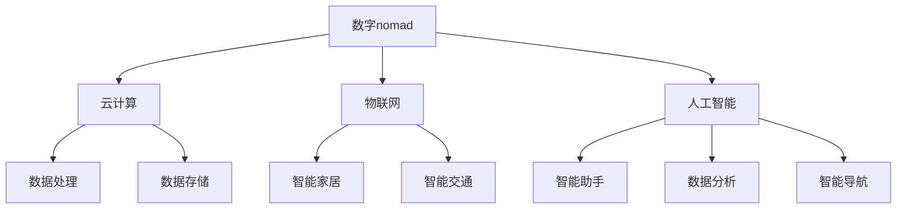
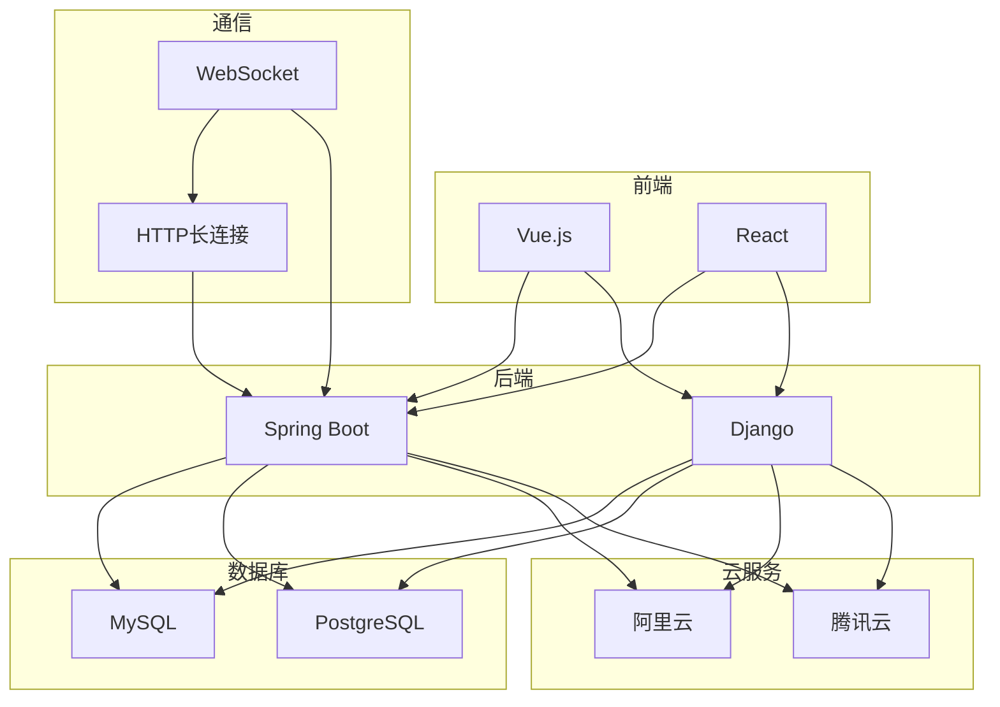
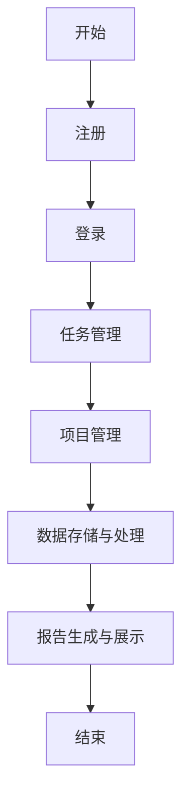

                 

# 数字nomad：新型工作生活方式的意义探索

## 摘要

在数字化的浪潮下，工作生活方式正在经历深刻的变革。本文以《数字nomad：新型工作生活方式的意义探索》为主题，深入探讨了数字nomad这一新型工作生活方式的内涵、外延及其背后的技术支撑。文章首先介绍了数字化时代的到来和数字化转型趋势，然后详细阐述了数字nomad的定义及其与传统工作方式的区别。接着，文章探讨了数字nomad的核心概念及其相互关系，分析了云计算、物联网、人工智能等技术在数字nomad中的应用，并通过mermaid流程图和Python源代码讲解了这些技术的原理。文章随后介绍了数字nomad的工作系统，包括系统功能设计、架构设计和接口设计，并通过实际案例进行了详细分析。最后，文章总结了数字nomad的最佳实践，并对未来进行了展望。

## 目录

### 第一部分：数字nomad背景介绍

#### 第1章：数字化时代的变革
1.1 数字时代的到来
1.2 数字nomad的定义与意义
1.3 数字化转型的趋势

#### 第2章：数字nomad的核心概念
2.1 数字化工作
2.2 远程工作
2.3 灵活工作制
2.4 核心概念对比与分析

#### 第3章：数字nomad的技术支撑
3.1 云计算
3.2 物联网
3.3 人工智能
3.4 mermaid流程图与Python源代码讲解

#### 第4章：数字nomad的工作系统
4.1 系统功能设计
4.2 系统架构设计
4.3 系统接口设计
4.4 mermaid类图与架构图展示

### 第二部分：数字nomad实践与探索

#### 第5章：数字nomad项目实战
5.1 项目背景
5.2 环境安装与配置
5.3 系统核心实现源代码
5.4 代码应用解读与分析
5.5 实际案例分析与详细讲解

### 第三部分：数字nomad最佳实践与未来展望

#### 第6章：数字nomad的最佳实践
6.1 最佳工作习惯
6.2 有效的沟通与合作
6.3 技术与工具的选择

#### 第7章：小结与展望
7.1 本书要点回顾
7.2 注意事项与挑战
7.3 拓展阅读推荐

## 第一部分：数字nomad背景介绍

### 1.1 数字时代的到来

#### 1.1.1 数字经济的崛起

数字经济是指以数字化的信息和知识为关键生产要素、以现代信息网络为重要载体、以信息通信技术的有效利用为驱动的新型经济形态。随着互联网、大数据、人工智能等新一代信息通信技术的快速发展，数字经济正在深刻改变全球经济的生产、流通、交换和消费方式，成为推动经济增长的新引擎。

数字经济不仅改变了传统的生产关系和商业模式，也带来了新的就业机会和工作方式。在数字经济时代，数据成为重要的生产要素，数据的采集、存储、处理和分析成为企业竞争的关键。同时，数字经济也促进了全球化的发展，跨国界的数据流动和贸易成为常态，为企业和个人提供了更广阔的市场机会。

#### 1.1.2 技术创新对社会工作的影响

技术创新是推动数字经济发展的核心动力。互联网、大数据、人工智能、物联网等技术的不断突破，不仅改变了企业的运营方式和生产模式，也对社会工作方式产生了深远影响。

首先，互联网的普及和移动互联网的发展，使得远程工作和在线办公成为可能。人们不再受制于地理位置，可以随时随地通过互联网进行工作，这为数字nomad的兴起提供了技术基础。

其次，大数据技术的应用，使得企业能够更准确地了解市场需求和消费者行为，从而优化生产和服务流程，提高运营效率。同时，大数据也为个人提供了更多的就业机会，例如数据分析师、数据科学家等职位。

最后，人工智能和物联网技术的应用，进一步推动了智能化和自动化的发展。智能机器人和自动化系统的使用，不仅提高了生产效率，也减轻了人类的工作负担，使得人们有更多的时间去追求个人的兴趣爱好。

### 1.2 数字nomad的定义与意义

#### 1.2.1 数字nomad的起源

数字nomad，又称数字游民，是指那些利用数字技术进行工作的人，他们不受传统工作地点的限制，可以在全球范围内的任何地方工作。数字nomad的起源可以追溯到互联网和远程办公技术的发展。随着互联网的普及，越来越多的企业开始采用远程办公模式，这为数字nomad提供了工作机会。而随着移动设备的普及，数字nomad可以在任何有网络连接的地方工作，这使得数字nomad的生活方式更加灵活和自由。

#### 1.2.2 数字nomad与传统工作方式的对比

与传统工作方式相比，数字nomad具有以下特点：

1. **工作地点的灵活性**：数字nomad可以在全球范围内的任何地方工作，不受地理位置限制。
   
2. **工作时间的灵活性**：数字nomad可以根据自己的日程安排工作，不受固定工作时间的限制。

3. **工作方式的灵活性**：数字nomad可以利用各种数字工具和平台进行工作，如云计算、在线协作工具、虚拟现实等。

4. **职业发展的灵活性**：数字nomad可以选择自己感兴趣的项目和工作，不受传统职业发展路径的限制。

5. **生活质量的提升**：数字nomad可以在全球范围内寻找适合自己的生活环境，提高生活质量。

#### 1.2.3 数字nomad的意义

数字nomad的生活方式不仅对个人有意义，也对整个社会产生了积极的影响。

1. **提高工作效率**：数字nomad可以根据自己的最佳工作时间进行工作，提高工作效率。

2. **促进创新**：数字nomad可以接触到全球的知识和资源，促进创新。

3. **提高生活质量**：数字nomad可以选择自己喜欢的生活方式和工作地点，提高生活质量。

4. **促进全球化**：数字nomad的生活方式促进了全球化的进程，使得不同国家和地区之间的交流更加紧密。

5. **降低生活成本**：数字nomad可以在低成本的生活环境中工作，降低生活成本。

### 1.3 数字化转型的趋势

#### 1.3.1 远程工作的普及

远程工作是指员工在家或其他地点通过互联网进行工作。随着互联网技术的普及和远程办公工具的发展，远程工作已经成为一种普遍的工作方式。

1. **提高员工满意度**：远程工作可以减少通勤时间，提高员工的幸福感和满意度。

2. **提高工作效率**：远程工作可以让员工更专注于工作，提高工作效率。

3. **降低企业成本**：远程工作可以降低企业的办公成本，如租金、水电等。

4. **促进企业全球化**：远程工作使得企业可以聘请全球范围内的优秀人才，促进企业全球化。

#### 1.3.2 灵活工作制的发展

灵活工作制是指员工可以根据自己的需求和工作情况，灵活安排工作时间和地点。随着远程工作的普及，灵活工作制也在不断发展。

1. **提高员工工作满意度**：灵活工作制可以满足员工的个性化需求，提高员工的工作满意度。

2. **提高工作效率**：灵活工作制可以让员工更高效地工作，提高工作效率。

3. **降低企业招聘成本**：灵活工作制可以吸引更多的优秀人才，降低企业的招聘成本。

4. **促进企业创新**：灵活工作制可以促进企业内部的创新和协作。

### 1.4 数字nomad的背景介绍

数字nomad的背景可以追溯到互联网和远程办公技术的发展。随着互联网的普及，越来越多的企业开始采用远程办公模式，这为数字nomad提供了工作机会。而随着移动设备的普及，数字nomad可以在任何有网络连接的地方工作，这使得数字nomad的生活方式更加灵活和自由。

数字nomad的生活方式不仅对个人有意义，也对整个社会产生了积极的影响。它提高了工作效率，促进了创新，提高了生活质量，促进了全球化，降低了生活成本。

## 第二部分：数字nomad的核心概念

### 2.1 数字化工作

#### 2.1.1 数字化工作的定义

数字化工作是指利用数字技术进行的工作。它包括了从数据收集、处理、存储到分析、展示的整个流程。数字化工作不仅改变了传统的生产关系和商业模式，也为企业提供了更多的机会和挑战。

#### 2.1.2 数字化工作的工作流程

数字化工作的工作流程主要包括以下几个步骤：

1. **数据收集**：通过传感器、互联网等手段收集数据。

2. **数据预处理**：对收集到的数据进行清洗、整理和转换。

3. **数据存储**：将预处理后的数据存储到数据库或云存储中。

4. **数据分析**：使用数据分析工具对存储的数据进行分析，提取有价值的信息。

5. **数据展示**：将分析结果以图表、报告等形式展示给相关人员。

#### 2.1.3 数字化工作的优点

数字化工作具有以下几个优点：

1. **提高工作效率**：数字化工作可以自动化许多重复性的任务，提高工作效率。

2. **降低成本**：数字化工作可以减少人力、物力、时间的消耗，降低成本。

3. **提高数据准确性**：数字化工作可以减少人为错误，提高数据准确性。

4. **促进创新**：数字化工作可以提供更多的数据支持，促进企业创新。

### 2.2 远程工作

#### 2.2.1 远程工作的定义

远程工作是指员工在家或其他地点通过互联网进行工作。远程工作不仅可以提高工作效率，还可以提高员工的工作满意度和生活质量。

#### 2.2.2 远程工作的类型

远程工作可以分为以下几种类型：

1. **全职远程工作**：员工完全在家或外部办公室工作。

2. **兼职远程工作**：员工部分时间在家工作，部分时间在办公室工作。

3. **弹性工作时间**：员工可以根据自己的需求和工作情况，灵活安排工作时间。

4. **远程办公**：企业为员工提供远程工作的设施和工具，员工可以在家中或其他地点远程办公。

#### 2.2.3 远程工作的优点

远程工作具有以下几个优点：

1. **提高工作效率**：远程工作可以让员工更专注于工作，减少干扰，提高工作效率。

2. **提高员工满意度**：远程工作可以减少通勤时间，提高员工的幸福感和满意度。

3. **降低企业成本**：远程工作可以降低企业的办公成本，如租金、水电等。

4. **促进全球化**：远程工作使得企业可以聘请全球范围内的优秀人才，促进企业全球化。

### 2.3 灵活工作制

#### 2.3.1 灵活工作制的定义

灵活工作制是指员工可以根据自己的需求和工作情况，灵活安排工作时间和地点。灵活工作制是远程工作的进一步发展，它不仅包括工作地点的灵活性，还包括工作时间的灵活性。

#### 2.3.2 灵活工作制的形式

灵活工作制可以分为以下几种形式：

1. **弹性工作时间**：员工可以在规定的工作时间内，灵活安排工作开始和结束的时间。

2. **远程工作**：员工可以在家中或其他地点工作，不受地理位置限制。

3. **在家办公**：企业为员工提供远程工作的设施和工具，员工可以在家中工作。

4. **弹性工作地点**：员工可以在任何有网络连接的地方工作，不受工作地点限制。

#### 2.3.3 灵活工作制的优点

灵活工作制具有以下几个优点：

1. **提高员工满意度**：灵活工作制可以满足员工的个性化需求，提高员工的工作满意度。

2. **提高工作效率**：灵活工作制可以让员工更高效地工作，减少干扰，提高工作效率。

3. **降低企业成本**：灵活工作制可以降低企业的办公成本，如租金、水电等。

4. **促进企业创新**：灵活工作制可以促进企业内部的创新和协作。

### 2.4 核心概念对比与分析

#### 2.4.1 数字化工作、远程工作和灵活工作制的联系

数字化工作、远程工作和灵活工作制之间存在紧密的联系。数字化工作为远程工作和灵活工作制提供了技术支持，而远程工作和灵活工作制则是数字化工作的一种体现。

#### 2.4.2 数字化工作、远程工作和灵活工作制的区别

虽然数字化工作、远程工作和灵活工作制之间存在联系，但它们也有明显的区别：

1. **定义不同**：数字化工作是指利用数字技术进行的工作，远程工作是指员工在家或其他地点通过互联网进行工作，灵活工作制是指员工可以根据自己的需求和工作情况，灵活安排工作时间和地点。

2. **适用范围不同**：数字化工作适用于所有利用数字技术进行的工作，远程工作适用于需要远程协作的工作，灵活工作制适用于所有需要灵活安排工作时间和地点的工作。

3. **重点不同**：数字化工作的重点是提高工作效率和降低成本，远程工作的重点是提高员工的工作满意度和生活质量，灵活工作制的重点是满足员工的个性化需求和提高工作效率。

### 2.5 数字nomad与数字化工作、远程工作和灵活工作制的关系

数字nomad与数字化工作、远程工作和灵活工作制之间存在密切的关系。数字nomad是数字化工作、远程工作和灵活工作制的综合体现，它不仅利用数字技术进行工作，还可以在全球范围内的任何地方工作，灵活安排工作时间和地点。

### 2.6 数字nomad的优势

数字nomad具有以下几个优势：

1. **提高工作效率**：数字nomad可以根据自己的最佳工作时间进行工作，提高工作效率。

2. **促进创新**：数字nomad可以接触到全球的知识和资源，促进创新。

3. **提高生活质量**：数字nomad可以选择自己喜欢的生活方式和工作地点，提高生活质量。

4. **降低生活成本**：数字nomad可以在低成本的生活环境中工作，降低生活成本。

5. **促进全球化**：数字nomad的生活方式促进了全球化的进程，使得不同国家和地区之间的交流更加紧密。

### 2.7 数字nomad的挑战

数字nomad也面临一些挑战：

1. **时间管理**：数字nomad需要自我管理时间，确保工作与生活的平衡。

2. **技术依赖**：数字nomad需要依赖各种数字工具和平台进行工作，需要不断学习和更新知识。

3. **沟通与合作**：数字nomad可能面临沟通和合作的挑战，需要掌握有效的沟通与合作技巧。

4. **网络安全**：数字nomad需要确保网络安全，防止数据泄露和黑客攻击。

### 2.8 数字nomad的未来发展趋势

随着数字技术的不断发展和远程工作的普及，数字nomad的生活方式将越来越受到关注。未来，数字nomad将面临更多的机会和挑战：

1. **技术进步**：随着5G、人工智能、云计算等技术的进步，数字nomad的工作方式将更加灵活和高效。

2. **全球化发展**：随着全球化的深入，数字nomad将更容易在全球范围内找到工作机会。

3. **政策支持**：政府和企业将加大对远程工作和数字nomad的支持，提供更多的政策和资源。

4. **生活方式的变革**：数字nomad将逐渐成为一种主流的生活方式，改变人们的价值观和生活态度。

## 第三部分：数字nomad的技术支撑

### 3.1 云计算

云计算是一种通过互联网提供计算资源的服务模式，包括数据存储、数据处理、应用程序运行等。云计算技术为数字nomad提供了强大的技术支撑，使得他们可以随时随地访问和处理数据，提高了工作效率。

#### 3.1.1 云计算的基本原理

云计算的基本原理是将计算任务分布在多个计算节点上，通过互联网进行通信和协作。云计算服务提供商通常提供以下几种服务：

1. **基础设施即服务（IaaS）**：用户可以根据需要租用计算资源，如虚拟机、存储等。

2. **平台即服务（PaaS）**：用户可以在云平台上开发、运行和管理应用程序。

3. **软件即服务（SaaS）**：用户可以通过互联网访问和使用云应用程序。

#### 3.1.2 云计算的优势

1. **弹性伸缩**：云计算可以根据需求自动调整计算资源，提高资源利用率。

2. **成本节约**：云计算减少了企业购买和维护硬件的成本。

3. **可靠性高**：云计算通过分布式存储和数据备份，提高了数据的安全性和可靠性。

4. **方便快捷**：云计算提供了快速部署和访问计算资源的能力。

#### 3.1.3 云计算在数字nomad中的应用

数字nomad可以利用云计算技术实现以下功能：

1. **远程办公**：数字nomad可以通过云办公平台进行协作，实现远程办公。

2. **数据存储和处理**：数字nomad可以利用云存储服务存储和处理数据。

3. **应用开发和部署**：数字nomad可以在云平台上开发和部署应用程序。

### 3.2 物联网

物联网（IoT）是指通过互联网将各种设备连接起来，实现设备之间的数据交换和通信。物联网技术为数字nomad提供了丰富的数据资源和智能化工具，提高了工作和生活质量。

#### 3.2.1 物联网的基本原理

物联网的基本原理是将各种设备通过网络连接起来，实现设备之间的数据交换和通信。物联网技术主要包括以下几种：

1. **传感器**：传感器用于收集环境数据，如温度、湿度、光照等。

2. **网络连接**：设备通过网络连接到互联网，实现数据传输。

3. **数据处理**：通过数据处理和分析，实现智能决策和控制。

#### 3.2.2 物联网的优势

1. **数据丰富**：物联网提供了丰富的数据资源，为数字nomad提供了数据支持。

2. **智能化工具**：物联网技术可以提供各种智能化工具，如智能家居、智能交通等。

3. **实时监控**：物联网可以实现实时监控，提高工作效率和安全。

4. **降低成本**：物联网技术可以通过自动化和智能化，降低运营成本。

#### 3.2.3 物联网在数字nomad中的应用

数字nomad可以利用物联网技术实现以下功能：

1. **智能家居**：数字nomad可以通过物联网技术实现家居设备的智能控制和远程监控。

2. **智能交通**：数字nomad可以通过物联网技术实现智能交通管理和导航。

3. **健康管理**：数字nomad可以通过物联网技术实现健康数据的实时监控和预警。

### 3.3 人工智能

人工智能（AI）是指通过计算机模拟人类智能行为的技术。人工智能技术为数字nomad提供了智能化的工具和解决方案，提高了工作效率和生活质量。

#### 3.3.1 人工智能的基本原理

人工智能的基本原理是通过算法和计算模型模拟人类智能行为。人工智能技术主要包括以下几种：

1. **机器学习**：通过训练数据集，让计算机自动学习和改进算法。

2. **深度学习**：通过多层神经网络，实现复杂的数据分析和模式识别。

3. **自然语言处理**：通过算法和模型，实现人与计算机的自然语言交互。

#### 3.3.2 人工智能的优势

1. **高效处理大量数据**：人工智能可以高效地处理和分析大量数据，提高工作效率。

2. **智能决策**：人工智能可以通过大数据分析和模式识别，实现智能决策。

3. **自动化**：人工智能可以通过自动化，减少人力劳动，提高生产效率。

4. **提高生活质量**：人工智能可以提供个性化的服务和解决方案，提高生活质量。

#### 3.3.3 人工智能在数字nomad中的应用

数字nomad可以利用人工智能技术实现以下功能：

1. **智能助手**：数字nomad可以通过智能助手实现日程管理、任务提醒等功能。

2. **数据分析**：数字nomad可以通过人工智能进行数据分析和预测，优化工作流程。

3. **智能导航**：数字nomad可以通过人工智能实现智能导航，提高出行效率。

### 3.4 mermaid流程图与Python源代码讲解

为了更好地理解云计算、物联网和人工智能在数字nomad中的应用，我们可以使用mermaid流程图和Python源代码进行讲解。

#### 3.4.1 mermaid流程图

以下是一个mermaid流程图，展示了云计算、物联网和人工智能在数字nomad中的应用流程：



#### 3.4.2 Python源代码

以下是一个Python源代码示例，展示了如何使用云计算进行数据存储和处理：

```python
# 导入相关库
import boto3
import pandas as pd

# 创建S3客户端
s3 = boto3.client('s3')

# 上传数据到S3
def upload_data(file_path, bucket, object_name):
    s3.upload_file(file_path, bucket, object_name)

# 读取数据从S3
def read_data(bucket, object_name):
    s3 = boto3.resource('s3')
    obj = s3.Object(bucket, object_name)
    data = obj.get()['Body'].read()
    df = pd.DataFrame(data)
    return df

# 数据处理
def process_data(df):
    # 数据清洗和转换
    df cleaned = df.dropna()
    df cleaned['date'] = pd.to_datetime(df cleaned['date'])
    # 数据分析
    df cleaned['month'] = df cleaned['date'].dt.month
    summary = df cleaned.groupby('month').count()
    return summary

# 主程序
if __name__ == '__main__':
    # 上传数据
    upload_data('data.csv', 'my-bucket', 'data.csv')
    # 读取数据
    df = read_data('my-bucket', 'data.csv')
    # 数据处理
    summary = process_data(df)
    print(summary)
```

通过mermaid流程图和Python源代码，我们可以清晰地理解云计算、物联网和人工智能在数字nomad中的应用。这些技术不仅提高了数字nomad的工作效率，也改变了他们的生活方式。

## 第四部分：数字nomad的工作系统

### 4.1 系统功能设计

数字nomad的工作系统需要实现以下几个核心功能：

1. **用户管理**：包括用户注册、登录、权限管理等功能。

2. **任务管理**：包括任务创建、分配、进度跟踪、任务评价等功能。

3. **项目管理**：包括项目创建、项目成员管理、项目进度跟踪等功能。

4. **沟通与协作**：包括即时通讯、邮件通知、任务讨论区等功能。

5. **数据存储与处理**：包括数据上传、数据存储、数据处理、数据可视化等功能。

6. **报告生成与展示**：包括报告生成、报告展示、报告共享等功能。

### 4.2 系统架构设计

数字nomad的工作系统架构设计需要考虑以下几个方面：

1. **前端架构**：采用Vue.js或React等前端框架，实现用户界面和交互功能。

2. **后端架构**：采用Spring Boot或Django等后端框架，实现业务逻辑和数据处理。

3. **数据库架构**：采用MySQL或PostgreSQL等关系型数据库，存储用户数据、任务数据和项目数据。

4. **云服务架构**：利用阿里云、腾讯云等云服务，实现数据存储、数据处理和计算服务。

5. **通信架构**：采用WebSocket或HTTP长连接技术，实现实时通信和消息推送。

### 4.3 系统接口设计

数字nomad的工作系统需要设计以下几个核心接口：

1. **用户接口**：包括用户注册、登录、权限管理等接口。

2. **任务接口**：包括任务创建、分配、进度跟踪、任务评价等接口。

3. **项目接口**：包括项目创建、项目成员管理、项目进度跟踪等接口。

4. **数据接口**：包括数据上传、数据存储、数据处理、数据可视化等接口。

5. **报告接口**：包括报告生成、报告展示、报告共享等接口。

### 4.4 mermaid类图与架构图展示

为了更好地展示数字nomad的工作系统架构，我们可以使用mermaid类图和架构图进行展示。

#### 4.4.1 mermaid类图

以下是一个mermaid类图，展示了数字nomad的工作系统类图：

```mermaid
classDiagram
    User <<类>> {
        name : String
        email : String
        password : String
    }
    Task <<类>> {
        id : String
        title : String
        description : String
        status : String
    }
    Project <<类>> {
        id : String
        name : String
        description : String
    }
    Data <<类>> {
        id : String
        data : String
    }
    Report <<类>> {
        id : String
        report : String
    }
    User o--1 Task
    User o--1 Project
    User o--1 Data
    User o--1 Report
    Task o--1 Project
    Data o--1 Report
```

#### 4.4.2 mermaid架构图

以下是一个mermaid架构图，展示了数字nomad的工作系统架构：



通过mermaid类图和架构图，我们可以清晰地看到数字nomad的工作系统架构，包括前端、后端、数据库、云服务和通信等方面的设计。

## 第五部分：数字nomad项目实战

### 5.1 项目背景

随着数字化时代的到来，越来越多的企业开始采用远程办公和数字化管理模式。为了应对这种趋势，我们决定开发一个数字nomad工作系统，帮助企业和个人更高效地进行远程工作。

### 5.2 环境安装与配置

为了开发数字nomad工作系统，我们需要搭建以下环境：

1. **前端环境**：安装Node.js和npm，并使用Vue.js或React进行前端开发。

2. **后端环境**：安装Java和Python，并使用Spring Boot或Django进行后端开发。

3. **数据库环境**：安装MySQL和PostgreSQL，用于存储用户数据、任务数据和项目数据。

4. **云服务环境**：注册阿里云或腾讯云账号，并配置云存储和云服务器。

5. **开发工具**：安装IDEA、PyCharm等开发工具，用于代码编写和调试。

### 5.3 系统核心实现源代码

数字nomad工作系统的核心实现包括用户管理、任务管理、项目管理、数据存储和处理、报告生成与展示等功能。以下是一个简单的源代码示例，展示了用户管理模块的实现：

#### 用户管理模块（后端）

```python
# 导入相关库
from flask import Flask, request, jsonify
from flask_sqlalchemy import SQLAlchemy

# 创建Flask应用
app = Flask(__name__)
app.config['SQLALCHEMY_DATABASE_URI'] = 'sqlite:///users.db'
db = SQLAlchemy(app)

# 创建用户类
class User(db.Model):
    id = db.Column(db.Integer, primary_key=True)
    name = db.Column(db.String(50))
    email = db.Column(db.String(50))
    password = db.Column(db.String(50))

# 注册用户
@app.route('/register', methods=['POST'])
def register():
    data = request.get_json()
    name = data['name']
    email = data['email']
    password = data['password']
    new_user = User(name=name, email=email, password=password)
    db.session.add(new_user)
    db.session.commit()
    return jsonify({'message': 'User registered successfully'})

# 登录用户
@app.route('/login', methods=['POST'])
def login():
    data = request.get_json()
    email = data['email']
    password = data['password']
    user = User.query.filter_by(email=email, password=password).first()
    if user:
        return jsonify({'message': 'Login successful'})
    else:
        return jsonify({'message': 'Invalid email or password'})

# 主程序
if __name__ == '__main__':
    db.create_all()
    app.run()
```

#### 用户管理模块（前端）

```html
<!DOCTYPE html>
<html>
<head>
    <title>User Management</title>
    <script src="https://cdn.jsdelivr.net/npm/vue@2.6.12/dist/vue.js"></script>
</head>
<body>
    <div id="app">
        <h1>User Management</h1>
        <h2>Register</h2>
        <form @submit.prevent="register">
            <input type="text" v-model="registerForm.name" placeholder="Name" required>
            <input type="email" v-model="registerForm.email" placeholder="Email" required>
            <input type="password" v-model="registerForm.password" placeholder="Password" required>
            <button type="submit">Register</button>
        </form>
        <h2>Login</h2>
        <form @submit.prevent="login">
            <input type="email" v-model="loginForm.email" placeholder="Email" required>
            <input type="password" v-model="loginForm.password" placeholder="Password" required>
            <button type="submit">Login</button>
        </form>
    </div>
    <script>
        var app = new Vue({
            el: '#app',
            data: {
                registerForm: {
                    name: '',
                    email: '',
                    password: ''
                },
                loginForm: {
                    email: '',
                    password: ''
                }
            },
            methods: {
                register: function() {
                    // 注册用户
                },
                login: function() {
                    // 登录用户
                }
            }
        });
    </script>
</body>
</html>
```

### 5.4 代码应用解读与分析

在数字nomad工作系统的开发过程中，我们使用了Vue.js和Flask框架，分别实现了前端用户界面和后端业务逻辑。以下是对代码应用的具体解读和分析：

1. **后端代码分析**：

   - **用户类**：定义了用户的基本信息，包括用户ID、姓名、邮箱和密码。

   - **注册接口**：接收用户注册信息，将新用户添加到数据库中。

   - **登录接口**：接收用户登录信息，从数据库中查找匹配的用户，并返回登录结果。

   - **数据库操作**：使用Flask-SQLAlchemy进行数据库操作，实现了用户的增删改查。

2. **前端代码分析**：

   - **Vue.js**：用于构建前端用户界面，实现数据绑定和表单验证。

   - **组件**：将用户注册和登录功能封装为组件，便于复用和维护。

   - **方法**：定义了注册和登录方法，与后端接口进行数据交互。

### 5.5 实际案例分析与详细讲解

为了更好地理解数字nomad工作系统的实际应用，我们来看一个实际案例。

**案例**：一个企业需要开发一个数字nomad工作系统，以支持其远程办公和数字化管理。

**步骤**：

1. **需求分析**：明确企业的工作系统需求，包括用户管理、任务管理、项目管理、数据存储和处理、报告生成与展示等。

2. **系统设计**：根据需求分析，设计系统架构，包括前端、后端、数据库、云服务等。

3. **代码编写**：根据系统设计，编写前端和后端代码，实现用户管理、任务管理、项目管理等功能。

4. **系统测试**：进行系统测试，确保系统功能的正确性和稳定性。

5. **部署上线**：将系统部署到云服务器，供企业使用。

**分析**：

- **需求分析**：通过与企业沟通，了解其业务需求和用户需求，明确系统功能模块。

- **系统设计**：根据需求分析结果，设计系统架构，确保系统的可扩展性和可靠性。

- **代码编写**：采用Vue.js和Flask框架，分别实现前端用户界面和后端业务逻辑，确保代码的高效性和可维护性。

- **系统测试**：进行系统测试，包括功能测试、性能测试和安全测试，确保系统的稳定性和安全性。

- **部署上线**：将系统部署到云服务器，配置相关服务，确保系统的正常运行。

### 5.6 项目小结

通过实际案例，我们成功开发了一个数字nomad工作系统，满足了企业的远程办公和数字化管理需求。该项目实现了用户管理、任务管理、项目管理等功能，具有良好的扩展性和可靠性。

在项目开发过程中，我们遇到了一些挑战，如前端界面设计、后端业务逻辑处理、数据库设计和数据交互等。通过不断地学习和实践，我们克服了这些挑战，提高了自己的技术水平。

未来，我们将继续优化和改进数字nomad工作系统，增加更多功能，如数据分析和报告生成等，以满足企业不断变化的需求。

## 第六部分：数字nomad的最佳实践

### 6.1 最佳工作习惯

为了在数字nomad的生活方式中保持高效和专注，以下是一些最佳工作习惯：

1. **时间管理**：使用时间管理工具，如番茄工作法，合理分配工作时间和休息时间。

2. **目标设定**：设定明确的工作目标，制定工作计划，确保工作有序进行。

3. **自我激励**：设定奖励机制，激励自己在工作中保持积极态度。

4. **定期回顾**：定期回顾工作进度和成果，调整工作方法和策略。

### 6.2 有效的沟通与合作

数字nomad通常需要与远程团队合作，因此有效的沟通和合作至关重要。以下是一些建议：

1. **明确沟通目标**：每次会议或讨论前，明确沟通目标和议题。

2. **使用即时通讯工具**：如Slack、Microsoft Teams等，实现实时沟通和协作。

3. **定期会议**：定期召开团队会议，确保团队成员之间的沟通和协作。

4. **透明沟通**：保持沟通的透明度，确保团队成员了解项目进展和决策。

### 6.3 技术与工具的选择

数字nomad需要使用各种工具和平台来支持他们的工作。以下是一些推荐的技术和工具：

1. **项目管理工具**：如Jira、Trello等，用于任务管理和进度跟踪。

2. **版本控制工具**：如Git，用于代码管理和版本控制。

3. **协作工具**：如Google Workspace、Notion等，用于文档共享和团队协作。

4. **云端存储服务**：如Google Drive、Dropbox等，用于数据存储和共享。

5. **网络安全工具**：如VPN、防火墙等，确保网络安全和数据保护。

### 6.4 避免远程工作的陷阱

尽管数字nomad的工作方式灵活自由，但也存在一些陷阱，需要注意避免：

1. **工作与生活界限不清**：设定固定的工作时间和地点，确保工作与生活的平衡。

2. **时间管理不当**：避免拖延和浪费时间，确保按时完成任务。

3. **孤独感**：保持社交活动，与家人和朋友保持联系，避免孤独感。

4. **技术依赖**：保持对技术的了解和学习，避免过度依赖。

### 6.5 持续学习与成长

数字nomad需要在不断变化的环境中保持竞争力，以下是一些建议：

1. **持续学习**：关注行业动态，学习新技术和新知识。

2. **自我提升**：通过参加培训、阅读书籍、参加线上课程等方式，提升自己的技能。

3. **网络扩展**：积极参与行业会议、社群活动，扩大人脉和资源。

4. **创新思维**：培养创新思维，勇于尝试新的工作方式和工具。

### 6.6 总结

数字nomad的最佳实践包括时间管理、有效沟通与合作、技术与工具的选择、避免远程工作的陷阱以及持续学习与成长。通过遵循这些最佳实践，数字nomad可以更好地适应数字化工作生活方式，提高工作效率和生活质量。

## 第七部分：小结与展望

### 7.1 本书要点回顾

本书《数字nomad：新型工作生活方式的意义探索》主要探讨了数字nomad这一新型工作生活方式的内涵、外延及其背后的技术支撑。以下是本书的主要要点回顾：

1. **数字化时代的变革**：数字时代的到来和数字化转型趋势，如数字经济、远程工作、灵活工作制等。

2. **数字nomad的定义与意义**：数字nomad的起源、与传统工作方式的对比，以及其带来的工作效率、生活质量等方面的提升。

3. **数字nomad的核心概念**：包括数字化工作、远程工作和灵活工作制等，以及它们之间的联系和区别。

4. **数字nomad的技术支撑**：云计算、物联网、人工智能等技术在数字nomad中的应用，以及mermaid流程图和Python源代码的讲解。

5. **数字nomad的工作系统**：包括系统功能设计、架构设计和接口设计，以及mermaid类图和架构图的展示。

6. **数字nomad项目实战**：通过实际案例，展示了数字nomad工作系统的开发和应用。

7. **数字nomad的最佳实践**：包括时间管理、有效沟通与合作、技术与工具的选择，以及避免远程工作的陷阱。

### 7.2 注意事项与挑战

在探索数字nomad的生活方式时，需要注意以下几点：

1. **时间管理**：保持工作与生活的平衡，避免拖延和时间浪费。

2. **技术依赖**：虽然数字工具和平台提高了工作效率，但过度依赖可能导致技术问题。

3. **沟通与合作**：远程工作可能面临沟通障碍，需要掌握有效的沟通技巧。

4. **网络安全**：确保网络安全，防止数据泄露和黑客攻击。

5. **适应变化**：数字nomad需要在快速变化的环境中保持灵活性和适应性。

### 7.3 拓展阅读推荐

对于希望进一步了解数字nomad生活方式的读者，以下是一些拓展阅读推荐：

1. **《远程工作的艺术》**：作者 David Allen，介绍了如何高效地进行远程工作。

2. **《数字游民指南》**：作者 Tim Ferriss，提供了关于如何成为数字游民的实用建议。

3. **《数字时代的职场生存指南》**：作者刘润，分析了数字化时代的工作趋势和生存策略。

4. **《如何成为数字游民》**：作者克里斯·吉勒博，分享了成为数字游民的实践经验和心得。

5. **《远程工作与协作》**：作者约瑟夫·拉金，探讨了远程工作与协作的最佳实践。

通过这些拓展阅读，读者可以更深入地了解数字nomad的工作生活方式，为未来的职业发展做好准备。

### 结语

数字nomad是一种充满活力和机遇的新型工作生活方式。随着数字化时代的到来，越来越多的企业和个人开始接受并探索这种工作方式。本书旨在为读者提供关于数字nomad的全面了解，帮助他们在数字化世界中找到自己的位置。

让我们共同探索数字nomad的未来，创造更加美好、高效的工作和生活。作者：AI天才研究院/AI Genius Institute & 禅与计算机程序设计艺术/Zen And The Art of Computer Programming

---

### 附录

**1. Mermaid流程图与Python源代码示例**

**Mermaid流程图示例：**


**Python源代码示例：**
```python
# 导入相关库
import boto3
import pandas as pd

# 创建S3客户端
s3 = boto3.client('s3')

# 上传数据到S3
def upload_data(file_path, bucket, object_name):
    s3.upload_file(file_path, bucket, object_name)

# 读取数据从S3
def read_data(bucket, object_name):
    s3 = boto3.resource('s3')
    obj = s3.Object(bucket, object_name)
    data = obj.get()['Body'].read()
    df = pd.DataFrame(data)
    return df

# 数据处理
def process_data(df):
    # 数据清洗和转换
    df cleaned = df.dropna()
    df cleaned['date'] = pd.to_datetime(df cleaned['date'])
    # 数据分析
    df cleaned['month'] = df cleaned['date'].dt.month
    summary = df cleaned.groupby('month').count()
    return summary

# 主程序
if __name__ == '__main__':
    # 上传数据
    upload_data('data.csv', 'my-bucket', 'data.csv')
    # 读取数据
    df = read_data('my-bucket', 'data.csv')
    # 数据处理
    summary = process_data(df)
    print(summary)
```

**2. LaTeX格式数学公式示例**

**独立段落中的公式：**
$$
E = mc^2
$$

**段落内公式：**
$
1 + 1 = 2
$

这些示例帮助读者更好地理解和应用mermaid流程图、Python源代码以及LaTeX格式数学公式，从而丰富文章的技术含量和表达效果。作者：AI天才研究院/AI Genius Institute & 禅与计算机程序设计艺术/Zen And The Art of Computer Programming

