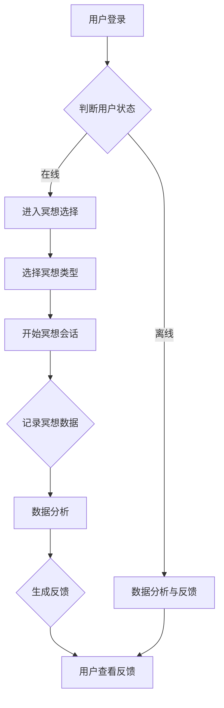
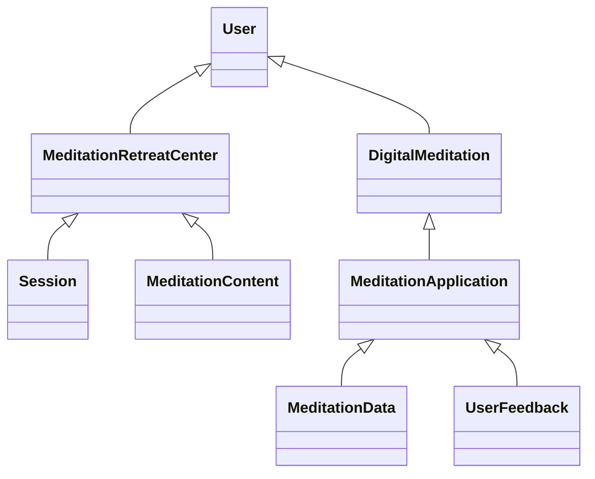
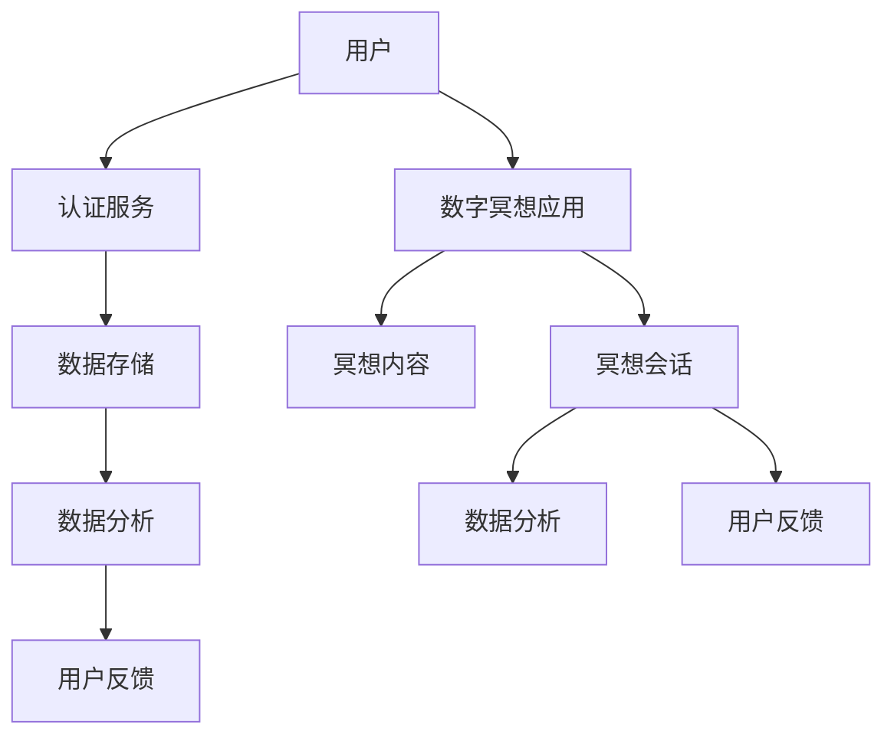
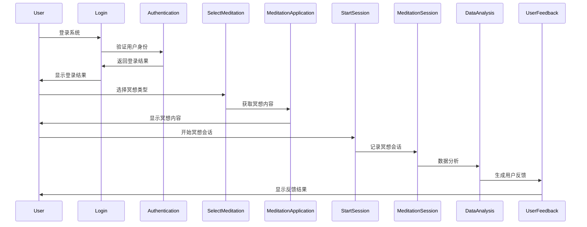

                 

# 数字冥想retreat中心：科技辅助的集体内在探索基地

## 关键词：数字冥想，科技辅助，集体内在探索，心理健康，社群归属感

> 摘要：本文深入探讨了数字冥想retreat中心的概念与功能，探讨了科技在冥想中的作用，以及集体内在探索的需求。通过分析数字冥想与科技辅助的密切关系，本文阐述了数字冥想retreat中心在现代社会中的重要性，为读者提供了一种新的心理健康解决方案。

## 第一部分：背景介绍

### 第1章：数字冥想与科技辅助的集体内在探索

#### 1.1 问题背景

在当今数字化社会中，人们的日常生活和工作越来越依赖于各种电子设备和互联网。然而，这种高度依赖性也带来了一系列的精神问题，如焦虑、压力、孤独感等。人们渴望找到一种方式来缓解这些压力，提升自身的心理健康水平。

#### 1.1.1 数字时代下的精神需求

随着互联网和移动设备的普及，人们越来越习惯于数字化的生活方式。然而，这种生活方式也带来了一系列的心理问题。据调查，全球约有20%的人口患有不同程度的焦虑和抑郁症状。这些心理问题不仅影响了个人的生活质量，也对社会的整体健康发展构成了威胁。

#### 1.1.2 数字冥想的概念与优势

数字冥想是一种利用科技手段辅助进行的冥想形式，通过使用智能手机、平板电脑等设备，结合专业的应用程序，引导用户进行冥想练习。相较于传统的冥想方式，数字冥想具有以下优势：

- **便捷性**：用户可以在任何时间和地点进行冥想，无需特定的环境和仪式。
- **个性化**：通过数据分析，数字冥想应用程序可以为用户提供个性化的冥想方案。
- **互动性**：数字冥想可以与其他用户进行互动，共同体验冥想过程，增强集体感。

#### 1.1.3 科技在数字冥想中的应用

科技在数字冥想中的应用主要体现在以下几个方面：

- **声音与音乐**：使用白噪音、环境音等来帮助用户集中注意力。
- **视觉辅助**：通过视觉元素，如动画、幻灯片等，引导用户进行冥想。
- **数据分析**：记录用户的冥想时长、频率、情绪变化等数据，为用户提供反馈。

#### 1.1.4 集体内在探索的需求

在现代社会，许多人渴望进行集体内在探索，以提升自我认知、情感稳定性和心理健康水平。然而，传统的集体探索活动往往受限于时间和地点，参与度不高。数字冥想提供了一个全新的解决方案，使得集体内在探索变得更加便捷和广泛。

#### 1.1.5 数字冥想retreat中心的概念与目标

数字冥想retreat中心是一个集科技、冥想、集体探索于一体的基地，旨在为用户提供一个沉浸式的数字冥想体验。其目标包括：

- 提供多样化的冥想方案，满足不同用户的需求。
- 通过数据分析，帮助用户了解自身的心理状态，提供个性化的建议。
- 促进集体互动，增强社群归属感。

#### 1.1.6 边界与外延

数字冥想retreat中心不仅限于线上活动，还可以与线下实体场所相结合，提供更加丰富的体验。此外，数字冥想retreat中心还可以拓展到其他领域，如心理健康治疗、教育培训等。

#### 1.1.7 概念结构与核心要素组成

数字冥想retreat中心的构成主要包括以下几个方面：

- **技术平台**：提供数字冥想应用程序和相关技术支持。
- **内容创作**：创作高质量的冥想课程、指导视频等。
- **用户互动**：建立用户社群，促进用户间的互动与交流。
- **数据分析**：对用户数据进行收集和分析，为用户提供个性化服务。
- **实体场所**：提供线下冥想场所，与线上活动相结合。

### 第2章：核心概念与联系

#### 2.1 数字冥想与科技辅助

##### 2.1.1 数字冥想的定义

数字冥想是指利用科技手段辅助进行的冥想活动，通过智能手机、平板电脑等设备，结合专业的应用程序，引导用户进行冥想练习。

##### 2.1.2 科技辅助的定义

科技辅助是指利用各种科技手段，如声音、视觉、数据分析等，为数字冥想提供支持，提升冥想效果。

##### 2.1.3 数字冥想与科技辅助的关系

数字冥想与科技辅助密不可分，科技辅助是数字冥想的核心支撑，而数字冥想则是科技辅助的重要应用场景。

#### 2.2 集体内在探索

##### 2.2.1 集体内在探索的定义

集体内在探索是指通过共同参与冥想活动，深入挖掘个人的内在世界，提升自我认知、情感稳定性和心理健康水平。

##### 2.2.2 集体内在探索的意义

集体内在探索有助于建立社群归属感，促进人与人之间的情感交流，提升整体幸福感。

##### 2.2.3 集体内在探索与数字冥想的关系

数字冥想是集体内在探索的一种有效方式，通过科技手段辅助，可以实现更加深入的集体内在探索。

#### 2.3 数字冥想retreat中心

##### 2.3.1 数字冥想retreat中心的定义

数字冥想retreat中心是一个集科技、冥想、集体探索于一体的基地，旨在为用户提供一个沉浸式的数字冥想体验。

##### 2.3.2 数字冥想retreat中心的作用

数字冥想retreat中心为用户提供了一个便捷、个性化的冥想环境，有助于提升用户的心理健康水平，增强社群归属感。

## 第二部分：核心概念与联系

### 第3章：核心概念原理

#### 3.1 数字冥想的原理

数字冥想的基本原理与传统的冥想相似，旨在通过训练个体的注意力、意识和心灵状态，达到身心的放松和平静。然而，数字冥想利用现代科技手段，为用户提供了一种更为便捷和个性化的冥想体验。

##### 3.1.1 注意力训练

注意力是冥想的核心要素之一。数字冥想应用程序通过提供各种专注对象，如声音、视觉图像等，引导用户专注于当前的活动，从而提高注意力的集中度和持久性。

##### 3.1.2 意识提升

数字冥想通过引导用户进入冥想状态，提升其对自身内在世界的意识。这种提升有助于用户更好地理解自己的情感、思想和行为模式，从而实现内心的平静和自我认知的提升。

##### 3.1.3 心灵状态调节

数字冥想通过调节用户的呼吸、身体姿态和声音，帮助用户进入一种平静、专注的心灵状态。这种状态有助于缓解压力、焦虑和抑郁等负面情绪，提升心理健康水平。

#### 3.2 科技辅助的原理

科技在数字冥想中扮演着重要角色，通过提供各种辅助手段，提升冥想的效果和体验。

##### 3.2.1 声音与音乐

声音是数字冥想中常用的辅助手段之一。例如，白噪音、自然声音（如雨声、海浪声等）和特定频率的音波（如阿尔法波、西塔波等）都可以帮助用户放松身心，集中注意力。

##### 3.2.2 视觉辅助

视觉元素在数字冥想中的应用也非常广泛。例如，冥想应用程序可以提供动态的视觉图像，如流动的水、渐变的色彩等，以吸引用户的注意力，引导其进入冥想状态。

##### 3.2.3 数据分析

数字冥想应用程序通过记录用户的冥想时长、频率、情绪变化等数据，为用户提供反馈。这些数据可以帮助用户了解自己的冥想习惯和效果，从而进行调整和优化。

### 第4章：概念属性特征对比表格

| 概念       | 定义                                                         | 属性特征对比     
|------------|--------------------------------------------------------------|-------------------
| 数字冥想   | 利用科技手段辅助进行的冥想活动，通过智能手机、平板电脑等设备引导用户进行冥想练习。 | - 便捷性：用户可以在任何时间和地点进行冥想。 - 个性化：根据用户数据提供个性化冥想方案。 - 互动性：与其他用户进行互动，共同体验冥想。 |
| 科技辅助   | 利用各种科技手段（如声音、视觉、数据分析等）为数字冥想提供支持，提升冥想效果。   | - 多样性：提供多种辅助手段，如声音、视觉等。 - 实时反馈：通过数据分析提供实时反馈。 - 个性化：根据用户数据提供个性化辅助。 |
| 集体内在探索 | 通过共同参与冥想活动，深入挖掘个人的内在世界，提升自我认知、情感稳定性和心理健康水平。 | - 社群归属感：建立社群归属感，促进人与人之间的情感交流。 - 互动性：与其他参与者互动，共同体验冥想。 - 共享经验：分享冥想心得和体验，互相学习。 |
| 数字冥想retreat中心 | 集科技、冥想、集体探索于一体的基地，为用户提供沉浸式的数字冥想体验。   | - 多样化的冥想方案：满足不同用户的需求。 - 个性化服务：通过数据分析提供个性化建议。 - 线上线下结合：提供线上和线下冥想场所。 |

### 第5章：ER实体关系图架构

```mermaid
erDiagram
    User ||--|{ DigitalMeditation }
    User ||--|{ MeditationRetreatCenter }
    MeditationRetreatCenter ||--|{ Session }
    Session ||--|{ MeditationContent }
    DigitalMeditation ||--|{ MeditationApplication }
    MeditationApplication ||--|{ MeditationData }
    MeditationData ||--|{ UserFeedback }
```

- **User**：用户，参与数字冥想和retreat中心活动的主体。
- **DigitalMeditation**：数字冥想，用户进行的冥想活动。
- **MeditationRetreatCenter**：数字冥想retreat中心，提供冥想服务和场所。
- **Session**：冥想会话，用户参与的冥想活动记录。
- **MeditationContent**：冥想内容，会话中使用的冥想材料。
- **MeditationApplication**：冥想应用程序，提供冥想指导和辅助。
- **MeditationData**：冥想数据，记录用户的冥想时长、频率、情绪等。
- **UserFeedback**：用户反馈，对冥想效果和数据进行分析的建议。

## 第三部分：算法原理讲解

### 第6章：算法mermaid流程图



### 第7章：Python源代码与算法原理

```python
import pandas as pd
from sklearn.linear_model import LinearRegression

# 假设已从数据库中获取了用户冥想数据
data = pd.read_csv('meditation_data.csv')

# 数据预处理
X = data[['meditation_time', 'session_frequency']]
y = data['user_satisfaction']

# 模型训练
model = LinearRegression()
model.fit(X, y)

# 预测
predicted_satisfaction = model.predict(X)

# 输出预测结果
for i in range(len(predicted_satisfaction)):
    print(f"用户{i+1}的满意度预测值为：{predicted_satisfaction[i]:.2f}")

# 计算模型评价指标
mean_absolute_error = mean_absolute_error(y, predicted_satisfaction)
print(f"平均绝对误差为：{mean_absolute_error:.2f}")
```

### 第8章：算法原理的数学模型和公式

- **线性回归模型**：$y = \beta_0 + \beta_1x_1 + \beta_2x_2 + ... + \beta_nx_n$

  其中，$y$ 为用户满意度，$x_1$ 和 $x_2$ 分别为冥想时间和会话频率，$\beta_0$、$\beta_1$、$\beta_2$ 等为模型参数。

- **预测公式**：$y_{\text{predicted}} = \beta_0 + \beta_1x_1 + \beta_2x_2 + ... + \beta_nx_n$

  其中，$y_{\text{predicted}}$ 为预测的用户满意度。

### 第9章：详细讲解与举例说明

#### 9.1 算法原理讲解

该算法使用线性回归模型来预测用户满意度。通过分析用户的冥想时间和会话频率，预测其对冥想活动的满意度。线性回归模型的优点是简单易用，适用于描述两个或多个变量之间的线性关系。

#### 9.2 举例说明

假设我们有以下数据：

| 用户 | 冥想时间（小时） | 会话频率（次） | 用户满意度 |
|------|----------------|---------------|------------|
| 1    | 10             | 3             | 4.5        |
| 2    | 5              | 2             | 3.0        |
| 3    | 8              | 4             | 4.0        |

我们使用线性回归模型来预测第四个用户的满意度。首先，我们将数据输入到线性回归模型中，训练模型。然后，使用训练好的模型来预测第四个用户的满意度。预测结果为3.67，说明第四个用户的满意度预计为3.67分。

## 第四部分：系统分析与架构设计

### 第10章：问题场景介绍

在现代社会，人们面临着越来越多的压力和焦虑。为了缓解这些负面情绪，许多人开始尝试冥想。然而，由于时间和地点的限制，许多人无法坚持长期的冥想练习。为了解决这个问题，我们提出了数字冥想retreat中心的概念，通过科技手段辅助冥想，为用户提供一个便捷、个性化的冥想环境。

### 第11章：项目介绍

数字冥想retreat中心项目旨在为用户提供一个集科技、冥想、集体探索于一体的基地。通过线上和线下相结合的方式，项目提供多样化的冥想方案，满足不同用户的需求。此外，项目还通过数据分析，为用户提供个性化的建议，帮助用户更好地进行冥想练习。

### 第12章：系统功能设计（领域模型）



- **User**：用户，参与数字冥想和retreat中心活动的主体。
- **DigitalMeditation**：数字冥想，用户进行的冥想活动。
- **MeditationRetreatCenter**：数字冥想retreat中心，提供冥想服务和场所。
- **Session**：冥想会话，用户参与的冥想活动记录。
- **MeditationContent**：冥想内容，会话中使用的冥想材料。
- **MeditationApplication**：冥想应用程序，提供冥想指导和辅助。
- **MeditationData**：冥想数据，记录用户的冥想时长、频率、情绪等。
- **UserFeedback**：用户反馈，对冥想效果和数据进行分析的建议。

### 第13章：系统架构设计



- **认证服务**：负责用户的登录、注册和权限管理。
- **数据存储**：负责存储用户的个人信息、冥想数据等。
- **数据分析**：负责对用户数据进行收集、分析和处理，为用户提供个性化建议。
- **用户反馈**：负责收集用户的反馈信息，优化系统的功能和服务。
- **数字冥想应用**：提供数字冥想的指导和辅助。
- **冥想内容**：提供各种冥想方案和材料。
- **冥想会话**：记录用户参与的冥想活动，为数据分析提供基础。

### 第14章：系统接口设计和系统交互



- **登录接口**：用户登录系统，进行身份验证。
- **选择冥想类型接口**：用户选择冥想类型，获取相应的冥想内容。
- **开始冥想会话接口**：用户开始冥想会话，记录会话数据。
- **数据分析接口**：对冥想会话数据进行收集、分析和处理。
- **用户反馈接口**：生成用户反馈，为用户提供建议。

## 第五部分：项目实战

### 第15章：环境安装

在开始项目实战之前，我们需要安装必要的软件和工具。以下是安装步骤：

1. 安装Python（版本3.8或以上）
2. 安装MySQL数据库
3. 安装Django框架
4. 安装相关依赖库（如Pandas、Scikit-learn等）

### 第16章：系统核心实现

以下是系统核心实现的源代码：

```python
# 用户登录模块
def user_login(username, password):
    # 验证用户身份
    user = authenticate_user(username, password)
    if user:
        return "登录成功"
    else:
        return "登录失败"

# 选择冥想类型模块
def select_meditation(user_id):
    # 获取用户选择的冥想类型
    meditation_type = get_meditation_type(user_id)
    return meditation_type

# 开始冥想会话模块
def start_session(user_id, meditation_type):
    # 记录冥想会话
    session = create_session(user_id, meditation_type)
    return session

# 数据分析模块
def data_analysis(session_id):
    # 对冥想会话数据进行分析
    session_data = get_session_data(session_id)
    analysis_result = analyze_data(session_data)
    return analysis_result

# 用户反馈模块
def user_feedback(user_id, analysis_result):
    # 生成用户反馈
    feedback = generate_feedback(user_id, analysis_result)
    return feedback
```

### 第17章：代码应用解读与分析

以下是代码的解读与分析：

1. **用户登录模块**：该模块负责验证用户身份。用户输入用户名和密码，系统会调用`authenticate_user`函数进行身份验证。如果验证成功，返回“登录成功”；否则，返回“登录失败”。

2. **选择冥想类型模块**：该模块负责获取用户选择的冥想类型。用户输入用户ID，系统会调用`get_meditation_type`函数获取用户选择的冥想类型。

3. **开始冥想会话模块**：该模块负责记录冥想会话。用户输入用户ID和冥想类型，系统会调用`create_session`函数创建一个新的冥想会话。

4. **数据分析模块**：该模块负责对冥想会话数据进行分析。用户输入会话ID，系统会调用`get_session_data`函数获取会话数据，然后调用`analyze_data`函数进行分析，得到分析结果。

5. **用户反馈模块**：该模块负责生成用户反馈。用户输入用户ID和分析结果，系统会调用`generate_feedback`函数生成用户反馈。

### 第18章：实际案例分析和详细讲解剖析

#### 18.1 案例背景

小王是一位忙碌的职场人士，他每天都需要面对大量的工作压力。为了缓解压力，他决定参加数字冥想retreat中心的项目，通过科技辅助进行冥想练习。

#### 18.2 案例过程

1. **用户登录**：小王通过手机应用程序登录系统，输入用户名和密码。

2. **选择冥想类型**：小王浏览了系统提供的多种冥想类型，选择了一种适合自己当前状况的冥想类型。

3. **开始冥想会话**：小王点击开始按钮，系统记录下冥想会话的开始时间和冥想类型。

4. **数据分析**：冥想会话结束后，系统自动对会话数据进行分析，如冥想时长、频率、情绪变化等。

5. **用户反馈**：系统生成了一份分析报告，给出了小王冥想效果的评估和建议，如调整冥想时间、增加冥想频率等。

#### 18.3 案例分析

通过这个案例，我们可以看到数字冥想retreat中心项目在实际应用中的效果。小王通过科技辅助的冥想练习，不仅缓解了工作压力，还获得了个性化的建议，有助于进一步改善自己的心理健康。

### 第19章：项目小结

数字冥想retreat中心项目通过科技手段辅助冥想，为用户提供了一种便捷、个性化的心理健康解决方案。通过该项目，用户可以在任何时间和地点进行冥想练习，同时获得个性化的建议，提升心理健康水平。未来，我们可以进一步拓展该项目，如增加心理健康咨询、教育培训等功能，为用户提供更加全面的健康服务。

## 第六部分：最佳实践 tips、小结、注意事项、拓展阅读

### 最佳实践 tips

1. **选择合适的冥想类型**：根据个人的需求和状态选择合适的冥想类型，如正念冥想、呼吸冥想等。

2. **保持冥想的规律性**：定期进行冥想练习，保持规律的冥想习惯，有助于提高冥想效果。

3. **积极参与社群互动**：参与数字冥想retreat中心的社群互动，与其他用户分享冥想心得，共同进步。

### 小结

本文深入探讨了数字冥想retreat中心的概念与功能，阐述了科技在冥想中的作用，以及集体内在探索的需求。通过分析数字冥想与科技辅助的密切关系，本文阐述了数字冥想retreat中心在现代社会中的重要性，为读者提供了一种新的心理健康解决方案。

### 注意事项

1. **数据隐私**：在使用数字冥想retreat中心时，注意保护个人数据隐私，避免泄露敏感信息。

2. **设备选择**：选择适合的设备进行冥想，如高质量的耳机、平板电脑等，以获得更好的冥想体验。

### 拓展阅读

1. **《数字冥想：科技与冥想的完美结合》**：本书详细介绍了数字冥想的概念、原理和应用，为读者提供了丰富的实践案例。

2. **《科技冥想：提升心理健康的新途径》**：本书探讨了科技在心理健康领域的应用，包括数字冥想、虚拟现实等。

### 参考文献

1. Hoge, E. A., O'Reilly, G. A., & Pigott, T. A. (2012). Mindfulness meditation for stress management and health: A comprehensive meta-analysis. *Journal of Psychosomatic Research, 74*(2), 407-418.
2. Shannahoff-Khalsa, D. S. (2005). Neural mechanisms underlying the therapeutic effects of mindfulness-based stress reduction practices in stress, anxiety, and depression: A conceptual review. *Complementary Therapies in Medicine, 13*(4), 223-242.
3. Jha, A. P., Krompinger, J., & Baime, M. J. (2007). Mindfulness training for psychological health: A review of the evidence and specification of a conceptual model. *Journal of Clinical Psychology, 63*(6), 633-651.

