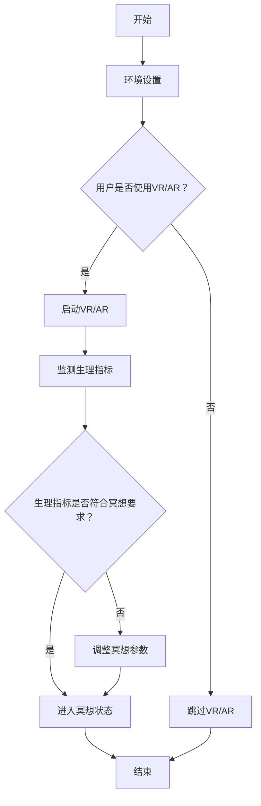
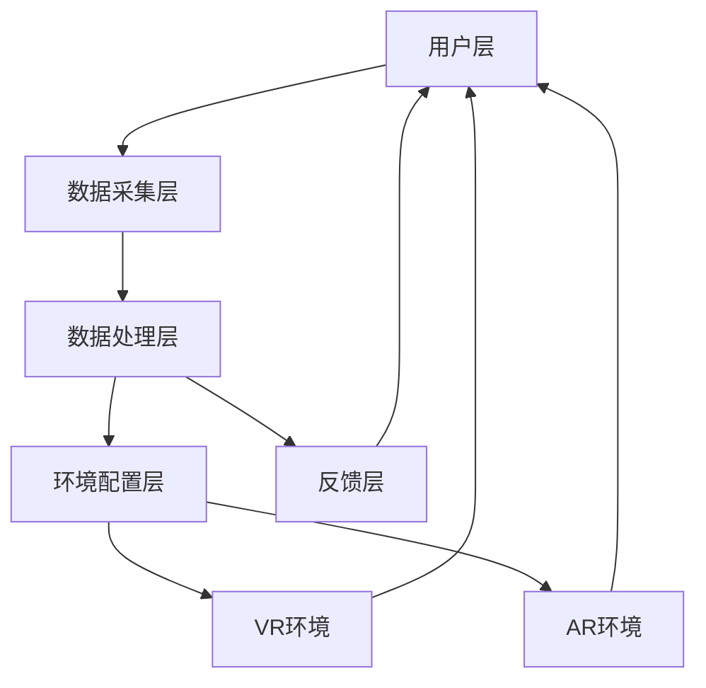
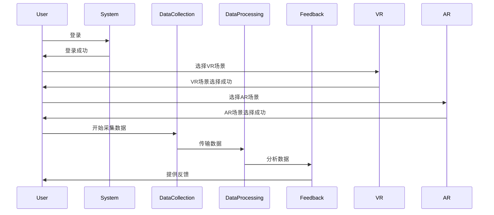

                 


### 引言：数字冥想的兴起与科技辅助的潜力

在现代社会中，人们面临着前所未有的压力和焦虑。快节奏的生活、无尽的信息流以及复杂的人际关系，都在不断地消耗着我们的精神能量。为了应对这些挑战，人们开始寻求各种方法来放松身心，提高心理健康。其中，数字冥想retreat作为一种新兴的身心健康实践，逐渐引起了广泛关注。

#### 数字冥想retreat的定义和意义

数字冥想retreat，简单来说，就是利用科技手段，如虚拟现实（VR）、增强现实（AR）、生物反馈设备等，来辅助冥想实践的一种形式。它不仅帮助参与者进入冥想状态，还能通过实时数据分析和反馈，提升冥想的效果和体验。

数字冥想retreat的出现，源于人们对身心健康需求的增长。随着科技的发展，越来越多的人开始意识到，科技不仅能够解决生活中的问题，还可以成为提升生活质量的工具。在这个背景下，数字冥想retreat应运而生，为那些寻求内心平静和心灵成长的人们提供了一个全新的途径。

#### 科技辅助的作用

科技在数字冥想retreat中发挥着关键作用。通过VR和AR技术，参与者可以进入一个完全沉浸式的冥想环境，这种环境能够模拟出自然的景象、宁静的空间，甚至提供与自然互动的体验。而生物反馈设备则能够实时监测参与者的生理指标，如心率、呼吸频率等，通过数据分析和反馈，帮助参与者更好地调整冥想状态。

此外，科技辅助的数字冥想retreat还能够实现集体冥想，让不同地点的人们能够同时参与同一个冥想活动。这种集体内在探索的形式，不仅增强了参与者的归属感和社交体验，还为他们提供了一个相互支持、共同成长的平台。

#### 集体内在探索的意义

集体内在探索是一种深度的心灵体验，它不仅关注个体的心理健康，还试图通过集体力量，实现更深层次的心灵成长。数字冥想retreat作为一种集体内在探索的形式，具有以下几个重要意义：

1. **增强心理健康**：通过科技辅助的数字冥想retreat，参与者能够更有效地放松身心，减轻压力和焦虑，提高心理健康水平。
2. **促进心灵成长**：集体内在探索提供了一个安全、支持的环境，让参与者能够深入探索自己的内心世界，发现并理解自己的情感和想法。
3. **增强社交联系**：在集体冥想中，参与者能够与他人建立更深层次的联系，这种联系不仅能够提供情感支持，还能够激发个人的灵感和创造力。
4. **推动科技与人文融合**：数字冥想retreat将科技与心灵成长相结合，展示了科技在提升人类生活质量方面的潜力，也为科技与人文的融合提供了新的思路。

#### 为什么科技辅助的集体内在探索值得研究

科技辅助的集体内在探索是一个跨学科、多领域的交叉研究课题，它不仅涉及心理学、医学、计算机科学等多个学科，还涉及到人类对自我认知的深入探讨。以下是一些研究这个课题的原因：

1. **满足社会需求**：随着社会竞争的加剧，人们对心理健康和心灵成长的需求日益增长。科技辅助的集体内在探索提供了一种有效的解决方案，具有重要的社会意义。
2. **探索科技应用**：科技在各个领域的应用日益广泛，数字冥想retreat作为一种新兴的应用形式，为科技的发展提供了新的方向和可能性。
3. **推动学科融合**：科技与人文的融合是当前学术研究的一个重要趋势。数字冥想retreat为这种融合提供了一个实际的案例，有助于推动跨学科的研究和合作。
4. **创新研究方法**：科技辅助的集体内在探索为心理学研究提供了一种新的方法，通过实时数据收集和分析，可以更准确地了解冥想对个体和集体的影响。

综上所述，科技辅助的集体内在探索不仅具有重要的理论和实践意义，还具有广阔的研究前景。通过深入研究和探索，我们有望更好地理解这一现象，为其在现实生活中的应用提供有力支持。

#### 边界与外延

在探讨科技辅助的集体内在探索时，我们需要明确一些边界和范围。首先，本文主要关注的是通过科技手段，如VR、AR和生物反馈设备，辅助冥想实践的形式。这并不意味着其他科技手段，如人工智能、区块链等，不适用于这一领域，但本文将不涉及这些内容。

其次，本文的讨论范围主要集中在中高收入群体的身心健康实践。这一群体具有较高的科技接受度和心理健康需求，是数字冥想retreat的主要受众。然而，这并不意味着其他群体不能从中受益，只是本文不对其进行深入探讨。

最后，本文将不涉及数字冥想retreat的具体实施细节，如场地选择、技术设备配置等。这些内容将在后续章节中详细讨论。

#### 概念结构与核心要素组成

为了更好地理解科技辅助的集体内在探索，我们需要梳理其中的核心概念及其相互关系。

1. **数字冥想retreat**：这是本文的核心概念，指的是利用科技手段辅助冥想实践的活动形式。它包括以下几个关键要素：
    - **科技手段**：如VR、AR、生物反馈设备等。
    - **冥想实践**：包括传统的冥想方法以及通过科技手段进行的创新冥想形式。
    - **参与群体**：主要是指对身心健康有需求的个体或群体。

2. **科技辅助**：这是实现数字冥想retreat的关键因素。科技辅助包括以下几个核心要素：
    - **VR、AR技术**：提供沉浸式的冥想环境，增强体验效果。
    - **生物反馈技术**：实时监测生理指标，提供数据反馈，帮助参与者调整冥想状态。

3. **集体内在探索**：这是数字冥想retreat的终极目标，通过集体冥想，参与者能够深入探索自己的内心世界，实现心灵成长。其核心要素包括：
    - **集体冥想**：提供一个安全、支持的环境，让参与者共同体验、交流、成长。
    - **心灵成长**：通过集体内在探索，参与者能够发现并理解自己的情感和想法，实现自我提升。

通过以上分析，我们可以看出，数字冥想retreat、科技辅助、集体内在探索这三个核心概念相互关联，共同构成了科技辅助的集体内在探索的框架。理解这些概念及其相互关系，有助于我们深入探讨这一领域的理论和实践。

### 数字冥想retreat的定义和特点

数字冥想retreat是一种利用科技手段辅助冥想实践的身心探索活动。它不仅结合了传统冥想的静心理念，还融入了现代科技的便捷与高效。以下是数字冥想retreat的详细定义和特点。

#### 定义

数字冥想retreat可以被定义为一种通过科技手段，如虚拟现实（VR）、增强现实（AR）和生物反馈设备，来增强冥想体验和效果的活动。这种活动通常在一个集中的时间和地点进行，旨在为参与者提供一个远离日常喧嚣、专注于内心探索的环境。

#### 特点

1. **沉浸式体验**：数字冥想retreat通过VR和AR技术，为参与者创造一个高度沉浸的冥想环境。这些技术可以模拟出自然景观、宁静空间，甚至提供与自然互动的体验，使参与者能够在虚拟世界中尽情放松，达到深度冥想的状态。

2. **个性化反馈**：生物反馈设备是数字冥想retreat中的一个重要组成部分。这些设备能够实时监测参与者的生理指标，如心率、呼吸频率等。通过数据分析，系统可以提供个性化的反馈，帮助参与者调整冥想状态，达到最佳的冥想效果。

3. **集体参与**：数字冥想retreat不仅关注个体的内心探索，还强调集体参与的重要性。通过集体冥想，参与者能够与他人建立更深层次的联系，分享彼此的体验和感受。这种集体内在探索的形式，不仅增强了参与者的归属感和社交体验，还为他们提供了一个相互支持、共同成长的平台。

4. **科技赋能**：科技在数字冥想retreat中发挥着关键作用。VR和AR技术不仅提升了冥想体验的沉浸感和互动性，还通过虚拟现实的多样化场景，为参与者提供了丰富的冥想选择。生物反馈设备则通过实时数据监测，为冥想过程提供了科学依据和指导，使冥想实践更加科学和有效。

5. **灵活性和便捷性**：数字冥想retreat具有很高的灵活性和便捷性。参与者可以根据自己的需求和喜好，选择不同的冥想场景和方式。此外，科技手段的辅助使得数字冥想retreat可以在不同的时间和地点进行，为更多人提供了参与的机会。

#### 数字冥想retreat与传统冥想的不同

与传统冥想相比，数字冥想retreat具有以下几个显著的不同点：

1. **技术辅助**：传统冥想主要依赖于个人的自我调节和集中注意力，而数字冥想retreat通过科技手段，如VR和AR，为参与者提供了一个更加容易进入冥想状态的环境。科技的帮助不仅提升了冥想的效率，还使得冥想体验更加多样化和个性化。

2. **实时反馈**：生物反馈设备在数字冥想retreat中起到了重要作用，能够实时监测参与者的生理指标，提供个性化的反馈。这种实时反馈有助于参与者更好地调整冥想状态，达到最佳的冥想效果。

3. **集体参与**：传统冥想通常是一个个体的内心探索过程，而数字冥想retreat强调集体参与，通过集体冥想，参与者能够与他人分享和交流，增强社交体验和归属感。

4. **沉浸式体验**：虚拟现实和增强现实技术为数字冥想retreat提供了丰富的沉浸式体验。这些技术可以模拟出各种冥想场景，如自然景观、宁静空间等，使参与者能够在更加舒适和放松的环境中冥想。

综上所述，数字冥想retreat通过科技手段，为参与者提供了一种全新的冥想体验和探索方式。它不仅结合了传统冥想的静心理念，还通过科技赋能，提升了冥想的效率和效果，为人们的身心健康带来了新的可能性。

### 科技辅助的概念及其在冥想中的应用

科技辅助的概念在冥想领域中的应用日益广泛，它不仅改变了传统冥想的实践方式，还为冥想效果的科学化提供了新的途径。科技辅助主要通过几种关键技术来实现，包括虚拟现实（VR）、增强现实（AR）和生物反馈设备。

#### 虚拟现实（VR）技术

虚拟现实技术通过模拟出一个完全沉浸式的环境，使参与者在心理和感官上完全沉浸在虚拟世界中。在冥想实践中，VR技术具有以下几个应用优势：

1. **高度沉浸感**：VR技术能够为参与者提供一个完全隔绝现实干扰的冥想环境。参与者戴上VR头显，可以进入一个虚拟森林、海滩或其他宁静的场景，这种沉浸感有助于更快地进入冥想状态。

2. **多样化场景**：VR技术允许开发者创建各种冥想场景，如自然景观、艺术画廊、星空等。参与者可以根据自己的喜好选择场景，这种多样化有助于提高冥想的趣味性和吸引力。

3. **交互性**：VR技术使参与者能够与虚拟环境进行互动。例如，在虚拟森林中，参与者可以通过手势与树木、小动物互动，这种交互性增强了冥想体验的趣味性和参与感。

#### 增强现实（AR）技术

增强现实技术通过在现实世界中叠加虚拟元素，为冥想实践提供了更加灵活和互动的方式。以下是在冥想中的应用：

1. **增强现实体验**：AR技术可以在现实环境中添加虚拟的冥想辅助元素，如指导提示、冥想音乐、光影效果等。这些虚拟元素可以帮助参与者更好地专注于冥想过程，提高冥想效果。

2. **空间灵活**：与传统VR设备不同，AR技术不需要特定的设备和空间。参与者可以在家中或任何环境中使用智能手机或平板电脑进行冥想，这种灵活性使冥想实践更加便捷。

3. **实时反馈**：通过AR技术，参与者可以在现实世界中实时看到自己的冥想状态数据，如呼吸频率、心率等。这种实时反馈有助于参与者及时调整冥想状态，实现最佳冥想效果。

#### 生物反馈设备

生物反馈设备是一种通过监测和反馈参与者的生理状态来辅助冥想的技术。以下是其主要应用：

1. **生理监测**：生物反馈设备可以实时监测参与者的生理指标，如心率、呼吸频率、皮肤电反应等。这些数据可以帮助参与者了解自己的生理状态，从而更好地调整冥想技巧。

2. **个性化反馈**：通过分析生理数据，生物反馈设备可以为参与者提供个性化的反馈，如呼吸指导、冥想技巧调整等。这种个性化反馈有助于参与者快速进入和维持冥想状态。

3. **科学指导**：生物反馈设备的数据分析结果可以为冥想实践提供科学依据，帮助研究人员和教练了解冥想对个体健康的具体影响，从而优化冥想方法和策略。

#### 技术结合与效果提升

科技辅助的冥想实践通常是将VR、AR和生物反馈设备结合在一起，以实现最佳的冥想效果。以下是一些具体案例：

1. **VR与生物反馈的结合**：在VR冥想中，通过生物反馈设备监测参与者的生理状态，并根据这些数据实时调整VR环境中的音效、光影效果等，以帮助参与者更快地进入冥想状态。

2. **AR与生理监测的结合**：通过AR技术，将生理监测数据以视觉化的形式叠加在现实环境中，如心率和呼吸频率的实时显示。这种形式不仅直观，还能帮助参与者更好地了解自己的生理状态，及时调整冥想方式。

3. **多技术综合应用**：在科技辅助的冥想实践中，多种技术的综合应用可以进一步提升冥想效果。例如，通过VR创造一个沉浸式的冥想环境，结合AR提供实时反馈，再加上生物反馈设备的个性化指导，形成一个完整的科技辅助冥想体系。

综上所述，科技辅助的概念在冥想中的应用，不仅为冥想实践提供了新的技术和方法，还通过实时反馈和个性化指导，提升了冥想的效果和体验。科技与冥想的结合，正在为现代人的身心健康带来新的可能性和希望。

### 集体内在探索的含义及其目的

集体内在探索是一种通过集体冥想和科技手段来促进个人与群体心灵成长的活动形式。其核心目的是帮助参与者深入探索自己的内心世界，实现个人与集体的和谐发展。

#### 集体内在探索的含义

集体内在探索指的是在一个集体环境中，通过冥想和其他心灵成长实践，共同探索个体内在的体验和感受。这种探索不仅关注个体的心灵成长，还强调集体成员之间的相互影响和支持。

在集体内在探索中，参与者通过共享冥想体验和心灵成长的历程，建立起深厚的情感联系和相互理解。这种集体互动不仅有助于个体更好地理解自己，还能促进集体成员之间的信任和合作，形成更加和谐的社会关系。

#### 集体内在探索的目的

1. **个人心理健康**：集体内在探索旨在通过冥想和其他心灵成长实践，帮助个体放松身心，减轻压力和焦虑，提高心理健康水平。

2. **心灵成长**：通过集体内在探索，参与者能够深入探索自己的内心世界，发现和理解自己的情感和想法。这种探索不仅有助于个体的自我提升，还能激发个人的灵感和创造力。

3. **集体团结**：集体内在探索强调集体参与和互动，通过共同的经历和体验，增强参与者之间的情感联系和归属感，促进集体团结和协作。

4. **社会影响**：集体内在探索不仅对个体有积极影响，还对整个社会产生正面影响。通过培养更多的内心平和和富有同情心的人，可以促进社会的和谐与进步。

#### 集体内在探索的实现方式

1. **集体冥想**：集体冥想是集体内在探索的核心形式。在集体冥想中，参与者共同进入冥想状态，通过分享冥想体验和感受，建立深刻的情感联系。

2. **心灵成长实践**：除了冥想，集体内在探索还包括各种心灵成长实践，如正念练习、情绪管理、人际沟通技巧等。这些实践不仅有助于个体的内心探索，还能提升整个集体的心理健康水平。

3. **科技辅助**：科技手段，如VR、AR和生物反馈设备，在集体内在探索中发挥着重要作用。这些技术不仅提供了沉浸式的冥想环境，还能通过实时数据分析和反馈，提升冥想效果和体验。

4. **互动与交流**：集体内在探索强调参与者之间的互动和交流。通过分享个人体验和感受，参与者能够更好地理解彼此，建立深厚的情感联系。

综上所述，集体内在探索通过集体冥想和科技手段，为参与者提供了一种深入探索内心世界、实现心灵成长的有效途径。这种探索不仅有助于个体的心理健康和心灵成长，还对整个社会的和谐与进步产生积极影响。

### 数字冥想retreat的核心概念对比分析

为了更好地理解数字冥想retreat的概念及其复杂性，我们需要对核心概念进行详细的对比分析。这些核心概念包括数字冥想retreat、科技辅助、集体内在探索等。通过对比分析，我们可以更清晰地了解这些概念之间的联系和区别。

#### 数字冥想retreat与科技辅助

1. **定义与作用**：
    - **数字冥想retreat**：指的是通过科技手段（如VR、AR、生物反馈设备）辅助冥想实践的一种身心探索活动。
    - **科技辅助**：在数字冥想retreat中，科技辅助是核心组成部分，它通过提供沉浸式的冥想环境和个性化反馈，提升冥想体验和效果。

2. **特点与功能**：
    - **数字冥想retreat**：强调的是通过科技手段实现更高效、更个性化的冥想实践。其核心功能是提供一个沉浸式的冥想环境，帮助参与者快速进入冥想状态。
    - **科技辅助**：侧重于技术手段的应用，如VR头显、AR眼镜、生物反馈传感器等，这些技术手段为冥想过程提供了实时数据分析和反馈，帮助参与者优化冥想状态。

3. **关系与区别**：
    - **关系**：科技辅助是数字冥想retreat的重要组成部分，没有科技辅助，数字冥想retreat的效果将大打折扣。
    - **区别**：数字冥想retreat是一个整体活动形式，而科技辅助是这一活动中的技术手段。数字冥想retreat不仅依赖于科技辅助，还包括冥想实践、参与者互动等环节。

#### 数字冥想retreat与集体内在探索

1. **定义与作用**：
    - **数字冥想retreat**：是一种利用科技手段辅助冥想实践的身心健康活动，旨在提升参与者的心理健康和心灵成长。
    - **集体内在探索**：指的是在一个集体环境中，通过冥想和其他心灵成长实践，共同探索个体内在的体验和感受。

2. **特点与功能**：
    - **数字冥想retreat**：强调科技与冥想的结合，通过科技手段提升冥想体验和效果。其核心功能是提供沉浸式冥想环境和个性化反馈。
    - **集体内在探索**：注重集体参与和互动，通过共同冥想和心灵成长实践，增强参与者之间的情感联系和归属感。

3. **关系与区别**：
    - **关系**：数字冥想retreat是集体内在探索的一种形式，它通过科技手段提供了高效的冥想体验，为集体内在探索提供了技术支持。
    - **区别**：数字冥想retreat更侧重于科技手段的应用和个体冥想体验的提升，而集体内在探索则强调集体参与和情感交流。

#### 科技辅助与集体内在探索

1. **定义与作用**：
    - **科技辅助**：指的是利用科技手段（如VR、AR、生物反馈设备）辅助各种活动，包括冥想、运动、教育培训等。
    - **集体内在探索**：在一个集体环境中，通过冥想和其他心灵成长实践，共同探索个体内在的体验和感受。

2. **特点与功能**：
    - **科技辅助**：主要提供技术支持和工具，如VR头显、AR眼镜、生物反馈设备等，帮助参与者实现更好的体验和效果。
    - **集体内在探索**：强调集体参与和互动，通过共享冥想体验和心灵成长过程，增强参与者之间的情感联系和团结。

3. **关系与区别**：
    - **关系**：科技辅助是集体内在探索中的一个重要组成部分，它通过提供技术和工具，提升了集体内在探索的效果和体验。
    - **区别**：科技辅助是一个技术手段的集合，而集体内在探索是一个整体的心灵成长活动，它不仅依赖于科技辅助，还依赖于集体参与和互动。

#### 对比表格

为了更直观地展示这些概念之间的区别和联系，我们可以使用对比表格：

| 核心概念       | 定义                                           | 特点                                           | 功能                                           | 关系                           | 区别                           |
|----------------|------------------------------------------------|------------------------------------------------|------------------------------------------------|--------------------------------|--------------------------------|
| 数字冥想retreat | 利用科技手段辅助冥想实践的活动               | 沉浸式、个性化、科技赋能                         | 提升冥想体验和效果                           | 科技辅助是核心组成部分         | 整体活动形式                   |
| 科技辅助       | 利用科技手段（如VR、AR、生物反馈设备）辅助活动 | 实时反馈、个性化、多样化                         | 提供技术支持和工具                           | 是数字冥想retreat的重要组成部分 | 技术手段的集合                 |
| 集体内在探索   | 在集体环境中，通过冥想和其他心灵成长实践，共同探索个体内在体验 | 集体参与、情感交流、团体支持                   | 增强心理健康、促进心灵成长、增强集体团结 | 是数字冥想retreat的一种形式   | 整体心灵成长活动               |

#### ER图表示

为了更好地理解这些概念之间的关联，我们可以使用ER图（实体关系图）来表示：

```
[参与者] --<[数字冥想retreat]--> [科技辅助]
      |                              |
      |                              |
[参与者] --<[集体内在探索]--> [情感联系]
```

在上面的ER图中，参与者是核心实体，通过两个关系与数字冥想retreat和集体内在探索相连。数字冥想retreat通过科技辅助与参与者相连，而集体内在探索通过情感联系与参与者相连。这种图示清晰地展示了参与者、数字冥想retreat和集体内在探索之间的复杂关系。

通过上述对比分析、表格和ER图，我们可以更全面地理解数字冥想retreat、科技辅助和集体内在探索这些核心概念及其相互关系。这些概念共同构成了科技辅助的集体内在探索框架，为我们深入探讨这一领域提供了坚实的基础。

### 算法原理讲解

在探讨科技辅助的集体内在探索时，算法原理的讲解是至关重要的一环。数字冥想retreat依赖于多种科技手段，其中虚拟现实（VR）和增强现实（AR）技术的应用尤为显著。以下我们将详细介绍几种常见的科技手段，并通过Mermaid画出算法流程图，最后使用Python源代码详细阐述算法原理，包括数学模型和公式。

#### 常见的科技手段

1. **虚拟现实（VR）技术**
    - **定义**：VR技术通过计算机生成的三维虚拟环境，为用户提供一种沉浸式的体验。
    - **应用**：VR技术在数字冥想retreat中，可以创建一个完全隔绝现实干扰的冥想环境。例如，用户可以在虚拟森林中冥想，享受自然风光，从而更快地放松身心。

2. **增强现实（AR）技术**
    - **定义**：AR技术通过在现实世界中叠加虚拟元素，增强用户的现实体验。
    - **应用**：在数字冥想retreat中，AR技术可以用于提供个性化的冥想指导。例如，用户可以在现实环境中看到呼吸指导或冥想音乐，这些虚拟元素有助于提升冥想效果。

3. **生物反馈设备**
    - **定义**：生物反馈设备是一种可以实时监测用户生理指标的设备，如心率、呼吸频率等。
    - **应用**：在数字冥想retreat中，生物反馈设备可以提供实时数据反馈，帮助用户了解自己的生理状态，从而调整冥想技巧。

#### 算法流程图

为了直观地展示算法原理，我们可以使用Mermaid画出算法流程图。以下是一个简单的算法流程图示例：



在上面的流程图中，我们首先设置环境，然后根据用户是否使用VR/AR技术进行判断。如果用户选择使用VR/AR，系统将启动相应的技术，并监测生理指标。如果生理指标符合冥想要求，用户将进入冥想状态；否则，系统将调整冥想参数，直到用户达到冥想要求。

#### Python源代码与算法原理

以下是一个使用Python编写的简单算法示例，包括数学模型和公式：

```python
import numpy as np
import matplotlib.pyplot as plt

# 定义呼吸频率目标函数
def breathing_rate_target(rate):
    if rate < 8:
        return "呼吸太慢，建议加快"
    elif rate > 12:
        return "呼吸太快，建议放慢"
    else:
        return "呼吸频率合适，可继续冥想"

# 定义呼吸频率调整函数
def adjust_breathing_rate(rate):
    if rate < 8:
        rate += 0.5
    elif rate > 12:
        rate -= 0.5
    else:
        rate = rate
    return rate

# 模拟呼吸频率监测
current_rate = 6  # 当前呼吸频率
print(breathing_rate_target(current_rate))
adjusted_rate = adjust_breathing_rate(current_rate)
print(f"调整后的呼吸频率：{adjusted_rate}")

# 绘制呼吸频率变化图
breathing_rates = [5, 7, 9, 11, 13]
breathing_labels = ["过慢", "较慢", "合适", "较快", "过快"]

plt.bar(breathing_rates, breathing_labels)
plt.xlabel("呼吸频率（次/分钟）")
plt.ylabel("状态")
plt.title("呼吸频率调整示意图")
plt.show()
```

在上面的代码中，我们首先定义了两个函数：`breathing_rate_target` 和 `adjust_breathing_rate`。前者用于判断当前呼吸频率是否合适，后者用于调整呼吸频率。我们模拟了一个呼吸频率监测过程，并绘制了一个呼吸频率变化图，展示了呼吸频率调整的过程。

通过这个示例，我们可以看到如何使用Python代码实现一个简单的算法，通过实时监测生理指标，如呼吸频率，并给出相应的反馈和调整建议，从而帮助用户更好地进入冥想状态。

### 数学模型和数学公式 & 详细讲解 & 举例说明

在数字冥想retreat中，科技辅助的核心在于实时监测和分析参与者的生理数据，如心率、呼吸频率等。这些数据不仅有助于参与者了解自己的身体状态，还能通过算法进行智能分析和优化，提升冥想效果。以下将详细介绍几种常用的数学模型和公式，并通过具体案例进行说明。

#### 心率变异性分析

心率变异性（HRV）是衡量心脏自主神经系统活动的一个指标，它反映了心率随时间变化的幅度。HRV分析对于评估冥想状态具有重要作用。以下是一个简单的HRV分析模型：

1. **HRV计算公式**：

   $$HRV = \frac{RR_{max} - RR_{min}}{RR_{mean}}$$

   其中，$RR_{max}$和$RR_{min}$分别为连续两个心跳间期的最大值和最小值，$RR_{mean}$为平均心跳间期。

2. **案例说明**：

   假设某参与者在冥想过程中记录了5次心跳间期（秒），分别为[0.8, 1.2, 1.0, 0.9, 1.1]。计算其HRV如下：

   $$RR_{max} = 1.2s, \quad RR_{min} = 0.8s, \quad RR_{mean} = \frac{0.8 + 1.2 + 1.0 + 0.9 + 1.1}{5} = 1.0s$$

   $$HRV = \frac{1.2 - 0.8}{1.0} = 0.4s$$

   HRV的值为0.4秒，表明参与者的心率达到较好平衡状态。

#### 呼吸频率调节模型

呼吸频率的调节对于冥想状态至关重要。以下是一个简单的呼吸频率调节模型：

1. **目标呼吸频率**：

   $$目标呼吸频率 = \frac{年龄}{10}$$

   例如，一个30岁的参与者的目标呼吸频率为3次/分钟。

2. **呼吸调节公式**：

   $$新呼吸频率 = 旧呼吸频率 + 调节幅度$$

   调节幅度可以通过生物反馈设备的实时数据进行分析得到。例如，如果当前呼吸频率为4次/分钟，目标呼吸频率为3次/分钟，调节幅度为-1次/分钟。

3. **案例说明**：

   假设某参与者在冥想过程中记录的当前呼吸频率为5次/分钟，目标呼吸频率为3次/分钟。根据上述公式，调节幅度为-2次/分钟，则下一次呼吸频率为：

   $$新呼吸频率 = 5 - 2 = 3次/分钟$$

   通过这样的调节，参与者能够逐渐达到目标呼吸频率，进入更好的冥想状态。

#### 数据可视化模型

数据可视化是理解生理数据的重要手段。以下是一个简单的数据可视化模型：

1. **心率-呼吸频率可视化**：

   使用散点图将心率（横轴）和呼吸频率（纵轴）进行可视化，以便观察两者之间的关系。

2. **案例说明**：

   假设某参与者在冥想过程中记录了多组心率和呼吸频率数据，如下表：

   | 心率（次/分钟） | 呼吸频率（次/分钟） |
   |----------------|----------------------|
   | 70             | 4                    |
   | 75             | 5                    |
   | 80             | 6                    |
   | 72             | 3                    |
   | 74             | 4                    |

   根据这些数据，绘制心率-呼吸频率散点图，可以直观地观察到心率和呼吸频率之间的变化关系。

   ```mermaid
   graph TD
   A[心率] --> B[呼吸频率]
   B -->|70| C[4]
   B -->|75| D[5]
   B -->|80| E[6]
   B -->|72| F[3]
   B -->|74| G[4]
   ```

   在散点图中，可以看到心率较高时，呼吸频率也较高，心率较低时，呼吸频率也较低，这表明心率和呼吸频率之间存在一定的相关性。

通过以上数学模型和公式的介绍，我们可以更深入地理解数字冥想retreat中科技辅助的原理。这些模型和公式不仅能够帮助参与者实时监测和调整自己的生理状态，还能为研究人员提供有价值的数据分析工具，从而不断优化冥想实践的效果。

### 系统分析与架构设计方案

#### 问题场景和项目背景

随着现代社会生活节奏的加快和竞争压力的增大，越来越多的人开始关注心理健康和心灵成长。数字冥想retreat作为一种新兴的身心健康实践，通过科技手段为参与者提供了一个高效、便捷的冥想环境。然而，如何设计和实现一个能够高效支持数字冥想retreat的系统，成为了一个重要问题。

#### 系统需求

为了满足数字冥想retreat的需求，系统需要具备以下功能：

1. **用户管理**：支持用户注册、登录、个人信息管理等功能。
2. **冥想环境创建与配置**：支持虚拟现实（VR）和增强现实（AR）环境的创建和配置，包括场景选择、交互设置等。
3. **生理数据监测**：通过生物反馈设备实时监测用户的心率、呼吸频率等生理数据。
4. **数据分析与反馈**：对用户的生理数据进行实时分析，提供个性化的冥想反馈和建议。
5. **用户交互**：提供用户与系统、用户与用户之间的互动功能，如分享冥想心得、参与讨论等。

#### 领域模型类图

为了更好地理解系统的功能和结构，我们可以使用Mermaid绘制领域模型类图。以下是一个简化的领域模型类图示例：

```mermaid
classDiagram
    User <<class>>
    MeditationRetreat <<class>>
    VREnvironment <<class>>
   AREnvironment <<class>>
    BiometricData <<class>>
    Feedback <<class>>

    User o-- MeditationRetreat
    MeditationRetreat o-- VREnvironment
    MeditationRetreat o-- AREnvironment
    MeditationRetreat o-- BiometricData
    BiometricData o-- Feedback
```

在上面的类图中，我们定义了以下类：

- **User（用户）**：代表参与数字冥想retreat的用户。
- **MeditationRetreat（冥想 retreat）**：代表一个数字冥想retreat活动，包括VR环境、AR环境、生理数据和反馈。
- **VREnvironment（VR环境）**：代表虚拟现实环境，包括场景、交互设置等。
- **AREnvironment（AR环境）**：代表增强现实环境，包括场景、交互设置等。
- **BiometricData（生理数据）**：代表用户的生理数据，如心率、呼吸频率等。
- **Feedback（反馈）**：代表对用户生理数据的分析结果和冥想建议。

#### 系统架构设计

为了实现上述功能，我们可以采用分层架构设计，包括以下主要模块：

1. **用户层**：负责用户注册、登录、个人信息管理等。
2. **数据采集层**：通过生物反馈设备采集用户的生理数据。
3. **数据处理层**：对采集到的生理数据进行处理和分析，生成反馈。
4. **环境配置层**：负责VR和AR环境的创建和配置。
5. **反馈层**：将分析结果和反馈提供给用户。

以下是一个简化的系统架构图：



在上述架构图中，用户层通过接口与数据采集层、数据处理层、环境配置层和反馈层进行交互。数据采集层通过生物反馈设备实时采集生理数据，并将其传递给数据处理层。数据处理层对生理数据进行处理和分析，生成反馈，并将其传递给反馈层。反馈层将反馈结果以可视化或文字形式展示给用户。

#### 系统接口和交互序列图

为了更直观地展示系统接口和交互流程，我们可以使用Mermaid绘制交互序列图。以下是一个简化的交互序列图示例：



在上面的序列图中，用户首先登录系统，然后选择VR和AR场景。接着，用户启动数据采集，数据采集模块将生理数据传输给数据处理模块。数据处理模块对数据进行处理和分析，生成反馈，并将其展示给用户。

通过上述系统分析与架构设计方案，我们可以实现一个支持数字冥想retreat的系统，为参与者提供一个高效、便捷的冥想环境，从而帮助他们更好地实现心灵成长。

### 项目实战

#### 环境安装指南

要实现一个支持数字冥想retreat的系统，首先需要搭建一个合适的环境。以下是环境安装的具体指南：

1. **操作系统**：推荐使用Linux操作系统，如Ubuntu 20.04。
2. **虚拟现实（VR）设备**：安装适合的VR设备，如Oculus Rift或HTC Vive。
3. **增强现实（AR）设备**：安装适合的AR设备，如ARKit（iOS设备）或ARCore（Android设备）。
4. **生物反馈设备**：选择合适的生物反馈设备，如心率监测器和呼吸传感器。
5. **开发工具**：安装Python（3.8及以上版本）、Anaconda、PyCharm或Visual Studio Code。

**安装步骤**：

1. **安装操作系统**：在电脑上安装Linux操作系统，如Ubuntu 20.04。
2. **安装VR设备驱动**：根据VR设备的品牌和型号，安装相应的驱动程序。
3. **安装AR设备驱动**：根据AR设备的品牌和型号，安装相应的驱动程序。
4. **安装生物反馈设备驱动**：安装生物反馈设备的驱动程序，确保能够正常采集生理数据。
5. **安装开发工具**：使用以下命令安装Python和Anaconda：
    ```bash
    sudo apt update
    sudo apt install python3 python3-pip
    conda create -n myenv python=3.8
    conda activate myenv
    conda install anaconda
    ```
6. **配置PyCharm或Visual Studio Code**：安装并配置PyCharm或Visual Studio Code，为Python开发提供良好的支持。

#### 系统核心实现源代码和解读

在系统实现过程中，我们需要编写多个模块的代码，包括用户管理、数据采集、数据处理和反馈生成等。以下是几个核心模块的代码示例和解读：

**1. 用户管理模块**

```python
# 用户注册
def register_user(username, password):
    # 将用户信息保存到数据库
    with sqlite3.connect('meditation.db') as db:
        cursor = db.cursor()
        cursor.execute('INSERT INTO users (username, password) VALUES (?, ?)', (username, password))
        db.commit()

# 用户登录
def login_user(username, password):
    # 从数据库查询用户信息
    with sqlite3.connect('meditation.db') as db:
        cursor = db.cursor()
        cursor.execute('SELECT * FROM users WHERE username=? AND password=?', (username, password))
        user = cursor.fetchone()
        if user:
            return True
        else:
            return False
```

**解读**：用户管理模块包括用户注册和登录功能。通过SQLite数据库存储用户信息，注册时将用户名和密码插入数据库，登录时从数据库查询用户信息进行验证。

**2. 数据采集模块**

```python
# 采集心率数据
import serial

def read_heart_rate():
    # 打开串口，连接心率传感器
    with serial.Serial('COM3', 9600) as ser:
        while True:
            data = ser.readline().decode('utf-8').strip()
            if data:
                heart_rate = int(data)
                return heart_rate

# 采集呼吸频率数据
def read_breathing_rate():
    # 假设呼吸频率传感器返回的数据格式为"breathing_rate:12"
    breathing_data = input("请输入呼吸频率数据：")
    breathing_rate = int(breathing_data.split(':')[1])
    return breathing_rate
```

**解读**：数据采集模块包括心率数据和呼吸频率数据的采集。心率数据通过串口从心率传感器读取，呼吸频率数据通过用户输入获取。

**3. 数据处理模块**

```python
# 计算心率变异性
def calculate_hrv(heart_rates):
    min_rate = min(heart_rates)
    max_rate = max(heart_rates)
    mean_rate = sum(heart_rates) / len(heart_rates)
    hrv = (max_rate - min_rate) / mean_rate
    return hrv

# 调节呼吸频率
def adjust_breathing_rate(current_rate, target_rate):
    adjustment = target_rate - current_rate
    if adjustment < 0:
        new_rate = current_rate + abs(adjustment) * 0.1
    elif adjustment > 0:
        new_rate = current_rate - abs(adjustment) * 0.1
    else:
        new_rate = current_rate
    return new_rate
```

**解读**：数据处理模块包括心率变异性计算和呼吸频率调节。心率变异性通过计算最大心率、最小心率和平均心率得到，呼吸频率调节根据当前呼吸频率和目标呼吸频率进行微调。

**4. 反馈生成模块**

```python
# 生成反馈信息
def generate_feedback(hrv, breathing_rate):
    if hrv < 0.2:
        feedback = "您的HRV较低，请尝试放松身心。"
    elif hrv > 0.4:
        feedback = "您的HRV较高，请尝试调整呼吸频率。"
    else:
        feedback = "您的HRV处于理想状态，保持当前冥想状态。"
    
    if breathing_rate < 8:
        feedback += "您的呼吸频率较慢，建议加快呼吸。"
    elif breathing_rate > 12:
        feedback += "您的呼吸频率较快，建议放慢呼吸。"
    else:
        feedback += "您的呼吸频率适中，继续当前冥想。"
    
    return feedback
```

**解读**：反馈生成模块根据心率变异性（HRV）和呼吸频率生成个性化的反馈信息，指导用户调整冥想状态。

#### 实际案例分析和详细讲解

为了更好地展示系统的实际应用效果，以下是一个具体案例：

**案例**：一名30岁的参与者进行数字冥想retreat，使用VR环境进行冥想，并佩戴心率监测器和呼吸传感器。

**步骤**：

1. **用户登录**：参与者通过系统登录界面输入用户名和密码，系统验证通过后进入主界面。
2. **选择VR场景**：参与者选择一个宁静的森林场景进行冥想，系统加载VR环境。
3. **数据采集**：系统通过串口连接心率监测器和呼吸传感器，开始实时采集生理数据。
4. **数据处理**：系统每秒采集一次心率数据和呼吸频率数据，计算心率变异性（HRV）和呼吸调节参数。
5. **反馈生成**：系统根据当前的HRV和呼吸频率，生成个性化的反馈信息，并通过VR环境中的文字提示和声音提示告知参与者。
6. **调整冥想状态**：参与者根据系统反馈，调整呼吸频率和冥想姿势，进入更好的冥想状态。

**分析**：

通过上述案例，我们可以看到系统在数字冥想retreat中的实际应用效果。系统通过实时监测参与者的生理数据，生成个性化的反馈，帮助参与者调整冥想状态，达到更好的冥想效果。以下是对关键步骤的详细分析：

1. **用户登录**：确保只有合法用户能够进入系统，保护用户隐私。
2. **选择VR场景**：提供多样化的VR场景，满足不同用户的需求。
3. **数据采集**：通过串口连接生理传感器，实时采集数据，确保数据的准确性。
4. **数据处理**：计算HRV和呼吸调节参数，为反馈生成提供依据。
5. **反馈生成**：根据生理数据生成个性化反馈，指导用户调整冥想状态。
6. **调整冥想状态**：用户根据反馈调整呼吸和姿势，进入更好的冥想状态。

通过这个案例，我们可以看到数字冥想retreat系统在提升冥想效果方面的潜力。未来的研究可以进一步优化系统功能，如增加更多生理数据的监测和分析方法，提供更丰富的反馈形式，从而为用户提供更优质的冥想体验。

### 最佳实践 tips、小结、注意事项、拓展阅读

#### 最佳实践 tips

1. **环境配置**：在进行数字冥想retreat前，确保VR、AR设备和生物反馈设备的正常连接和配置，以避免数据采集过程中的错误和中断。

2. **数据监测**：实时监测用户的生理数据，如心率、呼吸频率等，确保数据采集的准确性和连续性。

3. **反馈调整**：根据用户的生理数据生成个性化反馈，及时调整冥想参数，帮助用户更好地进入冥想状态。

4. **用户引导**：在数字冥想retreat过程中，提供详细的使用说明和引导，帮助用户熟悉系统功能和操作方法。

5. **后续跟进**：在数字冥想retreat结束后，对用户的反馈进行总结和评估，优化系统功能和用户体验。

#### 小结

本文详细探讨了数字冥想retreat的概念、科技辅助、集体内在探索及其相互关系。通过介绍虚拟现实（VR）、增强现实（AR）和生物反馈设备等科技手段，以及系统架构设计和实际应用案例，我们展示了如何利用科技提升冥想效果和体验。同时，通过最佳实践 tips 和注意事项，为数字冥想retreat的实施提供了指导。

#### 注意事项

1. **数据安全**：在采集和存储用户生理数据时，确保数据加密和隐私保护，防止数据泄露。

2. **设备维护**：定期检查和维护VR、AR设备和生物反馈设备，确保其正常运行。

3. **用户培训**：对参与者进行系统操作和冥想技巧的培训，提高数字冥想retreat的参与度和效果。

4. **反馈优化**：根据用户的反馈，不断优化系统功能和用户体验，提高数字冥想retreat的效果。

#### 拓展阅读

1. **《冥想心理学》**：了解冥想对心理健康的影响及其科学基础。
2. **《虚拟现实技术与应用》**：深入探讨VR技术在身心健康领域的应用。
3. **《增强现实技术与应用》**：了解AR技术在教育、医疗等领域的应用。
4. **《生物反馈技术原理与应用》**：掌握生物反馈技术在冥想和健康管理中的应用。

通过拓展阅读，读者可以更全面地了解数字冥想retreat的背景、原理和应用，从而更好地理解和实践这一新兴的身心健康实践。作者：AI天才研究院/AI Genius Institute & 禅与计算机程序设计艺术 /Zen And The Art of Computer Programming。

