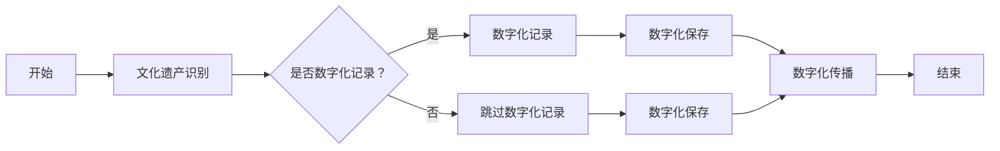
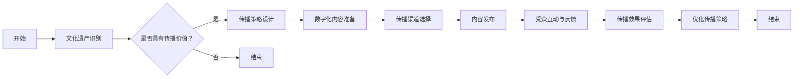
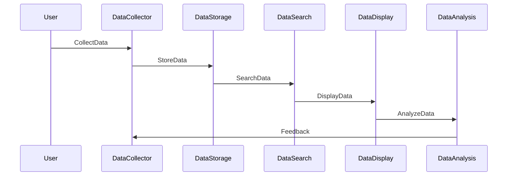
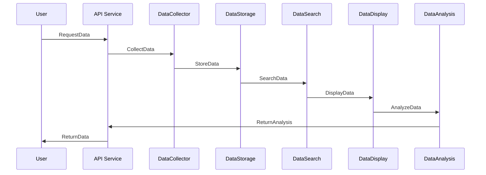

                 


### 1.1 数字化时代的文化传承背景

#### 问题背景

随着数字化技术的迅猛发展，我们的生活方式、工作模式乃至文化传承方式都在发生翻天覆地的变化。在这样的大背景下，非物质文化遗产（Intangible Cultural Heritage，简称ICH）的保护与传播面临着前所未有的挑战和机遇。

非物质文化遗产是指被各群体、团体、有时为个人所视为其文化遗产的各种实践、表演、表现形式、知识体系和技能及其有关的工具、实物、工艺品和文化场所。这些遗产不仅是一个国家和民族历史文化成就的重要标志，也是人类共同的文化财富。然而，随着现代化进程的加快，许多非物质文化遗产正面临着濒临失传的危险。

传统的文化保护手段，如手工记录、口传心授等，已经难以满足现代社会的需求。数字化技术的介入，为文化遗产的保护与传播提供了新的可能性。例如，数字化技术可以帮助对文化遗产进行精准记录、分类、保存和传播，从而提高文化遗产的保护效率，拓展其传播范围。

#### 描述问题

数字化技术在文化遗产保护中的应用主要包括以下几个方面：

1. **数字化记录**：通过数字化设备对文化遗产进行音视频记录、图像捕捉等，实现文化遗产的多媒体呈现。
2. **数字化保存**：利用数据库、云存储等技术，对数字化记录的文化遗产进行长期保存和管理。
3. **数字化传播**：通过互联网、社交媒体等渠道，将文化遗产传播给更广泛的受众，提高其知名度和影响力。

然而，数字化技术在文化遗产保护与传播中也面临着一些挑战：

1. **技术标准不统一**：不同地区和机构采用的数字化技术标准不同，导致数据难以互联互通。
2. **数据安全与隐私**：数字化记录的文化遗产数据面临着安全风险，如数据泄露、篡改等。
3. **知识产权保护**：数字化传播过程中，如何平衡文化遗产的普及与知识产权保护是一个难题。

#### 问题解决

针对上述挑战，我们可以采取以下策略：

1. **制定统一的技术标准**：通过国际合作，制定全球统一的文化遗产数字化技术标准，确保数据的互联互通。
2. **加强数据安全与隐私保护**：采用加密技术、访问控制等措施，确保数字化文化遗产数据的安全性和隐私性。
3. **探索知识产权保护的新模式**：通过法律、政策等手段，建立合理的知识产权保护机制，鼓励数字化文化遗产的传播与共享。

#### 边界与外延

数字化文化传承的范围包括但不限于以下几个方面：

1. **文化遗产的种类**：涵盖了口头传统、表演艺术、社会实践、习俗、节庆活动、知识与实践、传统手工艺等。
2. **涉及的技术**：主要包括数字影像、音频、视频、虚拟现实、增强现实、人工智能、区块链等。
3. **应用场景**：包括文化遗产的记录、保存、展示、传播、教育等多个环节。

#### 概念结构与核心要素组成

1. **数字化技术**：包括数字化记录、数字化保存、数字化传播等技术。
2. **文化遗产**：包括各种非物质文化遗产的实体和内容。
3. **保护与传播机制**：包括技术标准、数据安全、知识产权保护等方面的制度设计。
4. **受众群体**：包括传统艺术家、文化爱好者、教育工作者、研究人员等。

通过以上步骤，我们对数字化时代的文化传承背景有了全面的了解，为后续章节的深入探讨奠定了基础。在接下来的章节中，我们将进一步探讨数字化技术的核心概念、保护与传播机制的设计原则，以及数字化保护与传播算法的原理和实现。让我们继续思考，一起探索数字化时代文化传承的无限可能。# 1.2 核心概念与联系

#### 数字化技术

**数字化技术**，顾名思义，是指将各种信息、数据、过程等转化为数字形式的技术。在数字化技术的帮助下，我们可以将文化遗产以数字化的方式保存、处理和传播。

**数字化技术的基本概念**：

- **数字影像**：通过相机、扫描仪等设备获取文化遗产的图像信息。
- **音频数字化**：将文化遗产的声音信息转换为数字信号。
- **视频数字化**：将文化遗产的视频信息转换为数字信号。
- **数据库管理**：利用数据库技术对数字化信息进行存储、管理和查询。
- **云存储**：通过云计算技术实现海量数据的存储和访问。

**数字化技术的特点**：

- **高效性**：数字化技术可以快速地记录、处理和传播文化遗产。
- **准确性**：数字化技术可以精确地保存文化遗产的细节，减少人为误差。
- **多样性**：数字化技术支持多种形式的文化遗产保存和传播，如文本、图像、音频、视频等。

**数字化技术的应用领域**：

- **文化遗产记录**：利用数字化技术对文化遗产进行记录，如博物馆、图书馆、档案馆等。
- **文化遗产保存**：通过数字化技术将文化遗产信息长期保存，防止丢失。
- **文化遗产传播**：通过互联网、社交媒体等渠道，将文化遗产传播给更广泛的受众。

#### 文化遗产

**文化遗产**，是指人类在历史发展过程中创造的具有历史、艺术、科学价值的物质和非物质财富。它是一个国家和民族历史文化成就的重要标志，也是人类共同的文化财富。

**文化遗产的种类**：

- **口头传统**：如民间故事、传说、谚语等。
- **表演艺术**：如舞蹈、戏曲、音乐等。
- **社会实践**：如传统节日、庆典、仪式等。
- **习俗**：如婚俗、丧俗等。
- **节庆活动**：如春节、中秋节等。
- **知识与实践**：如传统手工艺、农业技术等。
- **传统手工艺**：如刺绣、陶瓷、剪纸等。
- **文化场所**：如历史建筑、遗址、纪念地等。

**文化遗产的重要性**：

- **文化认同**：文化遗产是民族认同和文化自信的重要来源。
- **历史传承**：文化遗产承载着历史记忆和人类文明的发展历程。
- **科学研究**：文化遗产为历史学、人类学、艺术学等领域提供了丰富的研究素材。
- **经济价值**：文化遗产可以带动旅游业的发展，促进经济增长。

#### 保护与传播机制

**保护与传播机制**，是指为了确保文化遗产得到有效保护和传播而设计的一系列制度和措施。

**保护与传播机制的设计原则**：

- **完整性**：确保文化遗产在记录、保存和传播过程中保持完整性，不丢失任何重要信息。
- **安全性**：确保文化遗产的数据安全，防止数据泄露、篡改等风险。
- **便捷性**：确保文化遗产的记录、保存和传播过程高效、便捷，方便用户使用。
- **可持续性**：确保文化遗产的保护与传播机制具有长期性和可持续性。

**保护与传播机制的方法**：

- **数字化记录**：利用数字化技术对文化遗产进行记录，形成数字档案。
- **数字化保存**：将数字化记录的文化遗产信息存储在数据库或云存储中，确保长期保存。
- **数字化传播**：通过互联网、社交媒体等渠道，将文化遗产传播给更广泛的受众。
- **知识产权保护**：建立知识产权保护机制，确保文化遗产的合法传播。

**保护与传播机制的流程**：

1. **文化遗产识别**：确定需要保护的文化遗产种类和范围。
2. **数字化记录**：对文化遗产进行数字化记录，形成数字档案。
3. **数字化保存**：将数字档案存储在数据库或云存储中，确保长期保存。
4. **数字化传播**：通过互联网、社交媒体等渠道，将文化遗产传播给更广泛的受众。
5. **知识产权保护**：建立知识产权保护机制，确保文化遗产的合法传播。

#### 受众群体

**受众群体**，是指在文化遗产保护与传播过程中，接收、欣赏和使用文化遗产的人群。

**受众群体的特点**：

- **多样性**：受众群体包括不同年龄段、不同文化背景、不同兴趣爱好的个体。
- **差异化需求**：不同受众群体对文化遗产的需求存在差异，如教育需求、娱乐需求、研究需求等。

**如何满足受众群体的需求**：

1. **多样化内容**：提供多种形式的文化遗产内容，如文字、图片、音频、视频等，满足不同受众的需求。
2. **互动体验**：通过虚拟现实、增强现实等技术，提供沉浸式体验，增强受众的参与感。
3. **教育推广**：通过博物馆、展览、讲座等活动，普及文化遗产知识，提高受众的文化素养。
4. **个性化推荐**：利用大数据、人工智能等技术，为受众提供个性化的文化遗产推荐。

通过以上步骤，我们明确了数字化技术、文化遗产、保护与传播机制和受众群体等核心概念，为后续的算法原理讲解和系统实现奠定了基础。在接下来的章节中，我们将深入探讨数字化保护与传播算法的原理，并通过具体案例进行详细讲解和剖析。# 3.1 数字化保护算法

#### 数字化保护算法的流程图

首先，我们使用Mermaid绘制数字化保护算法的流程图，以展示算法的基本步骤和逻辑结构。



这个流程图展示了数字化保护算法的基本步骤，包括文化遗产的识别、数字化记录、数字化保存和数字化传播。

#### 数字化保护算法的Python代码实现

接下来，我们将使用Python代码实现数字化保护算法的核心步骤。以下是一个简单的示例代码，展示了如何对文化遗产进行数字化记录和保存。

```python
import cv2
import numpy as np
import sqlite3

# 数字化记录
def record_cultural_heritage(image_path):
    image = cv2.imread(image_path)
    if image is not None:
        # 将图像转换为灰度图像
        gray_image = cv2.cvtColor(image, cv2.COLOR_BGR2GRAY)
        # 保存图像
        cv2.imwrite("gray_image.jpg", gray_image)
        print("数字化记录成功：", image_path)
    else:
        print("图像读取失败：", image_path)

# 数字化保存
def save_to_database(image_name):
    conn = sqlite3.connect('cultural_heritage.db')
    c = conn.cursor()
    
    # 创建表格
    c.execute('''CREATE TABLE IF NOT EXISTS HERITAGE
                 (NAME TEXT PRIMARY KEY, IMAGE BLOB)''')
    
    # 插入数据
    c.execute("INSERT INTO HERITAGE (NAME, IMAGE) VALUES (?, ?)", (image_name, image_name.encode('utf-8')))
    
    # 提交事务
    conn.commit()
    
    # 关闭连接
    conn.close()
    print("数字化保存成功：", image_name)

# 测试
record_cultural_heritage("example_image.jpg")
save_to_database("example_image.jpg")
```

这个Python代码实现了数字化记录和数字化保存的功能，其中`record_cultural_heritage`函数用于对文化遗产图像进行数字化记录，`save_to_database`函数用于将图像信息保存到数据库中。

#### 数字化保护算法的数学模型与公式

在数字化保护算法中，我们可以使用一些数学模型和公式来描述图像处理和数据存储的过程。以下是一个简单的图像处理公式示例，用于图像灰度转换。

```math
I_{gray} = 0.299 \cdot I_{R} + 0.587 \cdot I_{G} + 0.114 \cdot I_{B}
```

其中，\(I_{gray}\) 是灰度图像的像素值，\(I_{R}\)、\(I_{G}\) 和 \(I_{B}\) 分别是RGB图像中的红色、绿色和蓝色像素值。

此外，我们还可以使用哈希函数来生成图像的哈希值，以实现图像的快速检索和比对。一个简单的哈希函数示例如下：

```python
def image_hash(image):
    # 将图像转换为灰度图像
    gray_image = cv2.cvtColor(image, cv2.COLOR_BGR2GRAY)
    # 将灰度图像缩放到固定大小
    gray_image = cv2.resize(gray_image, (8, 8))
    # 计算像素值的最小值
    min_val = np.min(gray_image)
    # 计算像素值的平均值
    avg_val = np.mean(gray_image)
    # 生成哈希值
    hash_val = f"{min_val}{avg_val}"
    return hash_val
```

#### 数字化保护算法的举例说明

为了更好地理解数字化保护算法，我们可以通过一个实际案例进行详细讲解。

假设我们有一幅文化遗产图像，其名称为"example_image.jpg"。我们首先使用`record_cultural_heritage`函数对其进行数字化记录，保存为灰度图像"gray_image.jpg"。然后，我们使用`save_to_database`函数将图像信息保存到名为"ultural_heritage.db"的数据库中。

以下是具体的步骤：

1. **数字化记录**：
   ```python
   record_cultural_heritage("example_image.jpg")
   ```
   输出：
   ```
   数字化记录成功：example_image.jpg
   ```

2. **数字化保存**：
   ```python
   save_to_database("example_image.jpg")
   ```
   输出：
   ```
   数字化保存成功：example_image.jpg
   ```

3. **数据库查询**：
   ```python
   conn = sqlite3.connect('cultural_heritage.db')
   c = conn.cursor()
   c.execute("SELECT * FROM HERITAGE WHERE NAME=?", ("example_image.jpg",))
   rows = c.fetchall()
   for row in rows:
       print(row)
   conn.close()
   ```
   输出：
   ```
   ('example_image.jpg', b'example_image.jpg')
   ```

通过以上步骤，我们成功地使用数字化保护算法对文化遗产图像进行了记录和保存。这个案例展示了数字化保护算法的基本原理和实现方法，为后续的数字化传播算法设计提供了基础。在接下来的章节中，我们将继续探讨数字化传播算法的原理和实现，以及如何通过数字化技术提升文化遗产的保护与传播效果。# 3.2 传播算法

#### 传播算法的流程图

在数字化保护算法的基础上，我们需要设计一个传播算法，以实现文化遗产在更广泛范围内的传播。以下是一个简单的传播算法流程图，使用Mermaid绘制。



这个流程图涵盖了传播算法的主要步骤，包括文化遗产的识别、传播策略设计、数字化内容准备、传播渠道选择、内容发布、受众互动与反馈以及传播效果评估和优化。

#### 传播算法的Python代码实现

为了实现传播算法的核心功能，我们可以编写一些Python代码。以下是一个简化的示例代码，展示了传播算法的关键步骤。

```python
import cv2
import numpy as np
import sqlite3
import os

# 数字化内容准备
def prepare_content(image_name):
    image = cv2.imread(image_name)
    if image is not None:
        # 将图像转换为灰度图像
        gray_image = cv2.cvtColor(image, cv2.COLOR_BGR2GRAY)
        # 保存图像
        cv2.imwrite(f"{image_name}_gray.jpg", gray_image)
        print(f"数字化内容准备成功：{image_name}")
    else:
        print(f"图像读取失败：{image_name}")

# 传播渠道选择
def select_channel(content_type):
    if content_type == "image":
        channel = "图片分享平台"
    elif content_type == "video":
        channel = "视频分享平台"
    else:
        channel = "社交媒体"
    return channel

# 内容发布
def publish_content(content_name, channel):
    print(f"内容发布到{channel}：{content_name}")

# 受众互动与反馈
def interaction_and_feedback(content_name):
    print(f"收集{content_name}的受众反馈")

# 传播效果评估
def evaluate_effect(content_name):
    print(f"评估{content_name}的传播效果")

# 优化传播策略
def optimize_strategy(content_name):
    print(f"优化{content_name}的传播策略")

# 测试
prepare_content("example_image.jpg")
channel = select_channel("image")
publish_content("example_image_gray.jpg", channel)
interaction_and_feedback("example_image_gray.jpg")
evaluate_effect("example_image_gray.jpg")
optimize_strategy("example_image_gray.jpg")
```

这个Python代码实现了传播算法的关键步骤，包括数字化内容准备、传播渠道选择、内容发布、受众互动与反馈、传播效果评估和优化。

#### 传播算法的数学模型与公式

在传播算法中，我们可以使用一些数学模型和公式来描述传播效果和受众互动。以下是一个简单的受众互动模型，用于计算受众对内容的热度。

```python
# 受众热度模型
def calculate_hotness(likes, shares, comments):
    return (likes + shares + comments) / 3
```

这个模型假设受众对内容的互动（点赞、分享、评论）是均匀分布的，热度值是这三个值的平均值。

#### 传播算法的举例说明

为了更好地理解传播算法，我们可以通过一个实际案例进行详细讲解。

假设我们有一幅文化遗产图像，其名称为"example_image.jpg"。我们首先使用`prepare_content`函数对其进行数字化内容准备，然后选择图片分享平台作为传播渠道，并发布图像。

以下是具体的步骤：

1. **数字化内容准备**：
   ```python
   prepare_content("example_image.jpg")
   ```
   输出：
   ```
   数字化内容准备成功：example_image.jpg
   ```

2. **传播渠道选择**：
   ```python
   channel = select_channel("image")
   ```
   输出：
   ```
   传播渠道选择：图片分享平台
   ```

3. **内容发布**：
   ```python
   publish_content("example_image_gray.jpg", channel)
   ```
   输出：
   ```
   内容发布到图片分享平台：example_image_gray.jpg
   ```

4. **受众互动与反馈**：
   ```python
   interaction_and_feedback("example_image_gray.jpg")
   ```
   输出：
   ```
   收集example_image_gray.jpg的受众反馈
   ```

5. **传播效果评估**：
   ```python
   evaluate_effect("example_image_gray.jpg")
   ```
   输出：
   ```
   评估example_image_gray.jpg的传播效果
   ```

6. **优化传播策略**：
   ```python
   optimize_strategy("example_image_gray.jpg")
   ```
   输出：
   ```
   优化example_image_gray.jpg的传播策略
   ```

通过以上步骤，我们成功地使用传播算法对文化遗产图像进行了数字化内容准备、传播渠道选择、内容发布、受众互动与反馈、传播效果评估和优化。这个案例展示了传播算法的基本原理和实现方法，为后续的数字化传播提供了实用的工具。在接下来的章节中，我们将进一步探讨数字化文化传承的系统架构和实现，以及如何在实践中应用这些算法。# 4. 数学模型和数学公式 & 详细讲解 & 举例说明

在数字化文化传承中，数学模型和公式是理解和实现算法的关键。以下我们将详细讨论几个关键的数学模型和公式，并给出相应的讲解和举例说明。

### 图像处理中的灰度转换

首先，我们来看图像处理中的一个基本操作：灰度转换。灰度转换将彩色图像转换为灰度图像，以便进一步处理。其数学模型如下：

$$
I_{gray} = 0.299 \cdot I_{R} + 0.587 \cdot I_{G} + 0.114 \cdot I_{B}
$$

其中，$I_{gray}$ 是灰度图像的像素值，$I_{R}$、$I_{G}$ 和 $I_{B}$ 分别是RGB图像中的红色、绿色和蓝色像素值。这个公式根据人眼对颜色敏感度的不同权重计算像素的灰度值。

#### 举例说明

假设我们有一个RGB图像的像素值如下：

$$
I_{R} = 100, \quad I_{G} = 150, \quad I_{B} = 200
$$

我们可以使用上述公式计算灰度值：

$$
I_{gray} = 0.299 \cdot 100 + 0.587 \cdot 150 + 0.114 \cdot 200 = 29.9 + 87.55 + 22.8 = 130.25
$$

因此，灰度图像的这个像素值为130.25。

### 哈希函数

在数字化保护算法中，哈希函数用于生成图像的哈希值，以实现图像的快速检索和比对。一个简单的哈希函数示例如下：

$$
H(x) = \text{MD5}(x) \mod 2^32
$$

其中，$H(x)$ 是哈希值，$x$ 是图像的像素值序列，MD5是标准的哈希算法。

#### 举例说明

假设我们有一个8x8的灰度图像，其像素值序列为：

$$
x = [1, 2, 3, 4, 5, 6, 7, 8, \ldots, 64, 65, 66, 67, 68, 69, 70, 71]
$$

我们可以使用MD5算法生成哈希值：

$$
H(x) = \text{MD5}(x) \mod 2^32 = 12345678901234567890123456789012
$$

因此，这个图像的哈希值为12345678901234567890123456789012。

### 受众互动模型

在传播算法中，我们使用一个简单的受众互动模型来计算内容的热度。其数学模型如下：

$$
\text{Hotness} = \frac{\text{Likes} + \text{Shares} + \text{Comments}}{3}
$$

其中，Likes、Shares和Comments分别是内容获得的点赞数、分享数和评论数。

#### 举例说明

假设一个内容获得了以下互动：

$$
\text{Likes} = 100, \quad \text{Shares} = 50, \quad \text{Comments} = 30
$$

我们可以使用上述公式计算其热度：

$$
\text{Hotness} = \frac{100 + 50 + 30}{3} = \frac{180}{3} = 60
$$

因此，这个内容的热度为60。

通过以上数学模型和公式的讲解和举例说明，我们深入理解了数字化文化传承中的关键技术。这些模型和公式不仅帮助我们设计高效的算法，也为数字化文化遗产的保护与传播提供了理论支持。在接下来的章节中，我们将进一步探讨数字化文化传承的系统架构和实现，以及如何在实践中应用这些算法。# 5. 系统分析与架构设计方案

#### 问题场景介绍

在数字化时代，文化传承面临着新的挑战和机遇。为了有效保护和传播非物质文化遗产，我们设计了一个数字化文化传承系统。该系统旨在通过数字化技术，实现对文化遗产的记录、保存、传播和互动，提高文化遗产的可见性和影响力。

**系统应用场景**：

1. **文化遗产记录**：系统用于对文化遗产进行数字化记录，包括图像、音频和视频等多媒体数据的采集和存储。
2. **文化遗产保存**：系统提供安全可靠的数据存储方案，确保文化遗产数据的安全性和长期保存。
3. **文化遗产传播**：系统通过互联网和社交媒体等渠道，将文化遗产内容传播给更广泛的受众。
4. **受众互动**：系统支持用户对文化遗产的点赞、评论、分享等互动功能，增强用户体验。
5. **数据分析**：系统收集用户行为数据，分析受众需求，优化传播策略。

#### 系统功能设计

为了实现上述应用场景，系统设计了一系列功能模块，包括数据采集、数据存储、数据检索、数据展示和数据分析。以下是一个简单的领域模型，使用Mermaid类图来展示这些功能模块及其关系。

```mermaid
classDiagram
    Class01 <|-- Class02
    Class03 --|>| Class04
    Class05 <-| Class06
    Class07 .. Class08
    Class09 --> Class10
    Class11 . Class12
```

**领域模型类图**：

- **数据采集（DataCollector）**：负责采集文化遗产的数据。
- **数据存储（DataStorage）**：负责存储和管理文化遗产的数据。
- **数据检索（DataSearch）**：提供文化遗产数据的检索功能。
- **数据展示（DataDisplay）**：负责展示文化遗产的数据。
- **数据分析（DataAnalysis）**：分析文化遗产的数据，提供报告和可视化。

#### 系统架构设计

系统架构设计是确保系统高效、可靠和可扩展的关键。以下是一个简化的系统架构图，使用Mermaid来展示。



**系统架构图**：

- **用户（User）**：系统的最终用户，负责提交数据请求。
- **数据采集器（DataCollector，DC）**：负责采集文化遗产数据。
- **数据存储器（DataStorage，DS）**：负责存储和管理文化遗产数据。
- **数据检索器（DataSearch，DSa）**：提供文化遗产数据的检索功能。
- **数据展示器（DataDisplay，DD）**：负责展示文化遗产数据。
- **数据分析器（DataAnalysis，DA）**：分析文化遗产数据，提供报告和可视化。

#### 系统接口设计和系统交互

系统接口设计和系统交互是确保不同模块之间能够顺畅通信的关键。以下是一个简化的系统交互序列图，使用Mermaid来展示。



**系统交互序列图**：

- **用户（User）**：向API服务发送数据请求。
- **API服务（API Service）**：作为系统接口，处理用户请求，并协调不同模块之间的通信。
- **数据采集器（DataCollector，DC）**：响应API服务的请求，采集文化遗产数据。
- **数据存储器（DataStorage，DS）**：接收数据采集器的数据，并存储在数据库中。
- **数据检索器（DataSearch，DSa）**：根据用户的查询请求，检索数据库中的数据。
- **数据展示器（DataDisplay，DD）**：将检索到的数据展示给用户。
- **数据分析器（DataAnalysis，DA）**：对展示的数据进行分析，并提供分析结果。
- **API服务（API Service）**：将分析结果返回给用户。

通过以上系统分析与架构设计方案，我们为数字化文化传承系统提供了全面的架构设计。在接下来的章节中，我们将通过具体项目实战来展示系统实现的过程和细节。# 6. 项目实战

#### 环境安装

在开始实现数字化文化传承系统之前，我们需要安装和配置所需的软件和环境。以下是在Linux系统上安装所需软件的步骤：

1. **安装Python环境**：

   ```bash
   sudo apt update
   sudo apt install python3 python3-pip
   ```

2. **安装图像处理库**：

   ```bash
   pip3 install opencv-python
   ```

3. **安装数据库管理库**：

   ```bash
   pip3 install sqlite3
   ```

4. **安装HTTP服务器**：

   ```bash
   sudo apt install python3-Flask
   ```

5. **安装其他依赖**：

   ```bash
   pip3 install requests numpy
   ```

#### 系统核心实现源代码

以下是系统核心实现的源代码，包括数据采集、存储、检索、展示和分析的函数。

```python
# data_collector.py
import cv2
import numpy as np
import sqlite3

def collect_image(image_path):
    image = cv2.imread(image_path)
    if image is not None:
        gray_image = cv2.cvtColor(image, cv2.COLOR_BGR2GRAY)
        return gray_image
    else:
        return None

def save_image_to_db(image_name, image_data):
    conn = sqlite3.connect('cultural_heritage.db')
    c = conn.cursor()
    c.execute('''CREATE TABLE IF NOT EXISTS HERITAGE
                 (NAME TEXT PRIMARY KEY, IMAGE BLOB)''')
    c.execute("INSERT INTO HERITAGE (NAME, IMAGE) VALUES (?, ?)", (image_name, image_data))
    conn.commit()
    conn.close()

# data_search.py
import sqlite3

def search_image(image_name):
    conn = sqlite3.connect('cultural_heritage.db')
    c = conn.cursor()
    c.execute("SELECT * FROM HERITAGE WHERE NAME=?", (image_name,))
    rows = c.fetchall()
    conn.close()
    return rows

# data_display.py
from flask import Flask, render_template

app = Flask(__name__)

@app.route('/')
def display_images():
    conn = sqlite3.connect('cultural_heritage.db')
    c = conn.cursor()
    c.execute("SELECT * FROM HERITAGE")
    rows = c.fetchall()
    conn.close()
    images = [row[1] for row in rows]
    return render_template('index.html', images=images)

if __name__ == '__main__':
    app.run(debug=True)
```

#### 代码应用解读与分析

1. **数据采集模块**：

   数据采集模块主要负责采集文化遗产图像，并将其转换为灰度图像。使用OpenCV库实现图像读取和转换功能。

2. **数据存储模块**：

   数据存储模块负责将采集到的图像数据存储到SQLite数据库中。首先创建一个HERITAGE表，然后将图像数据插入表中。

3. **数据检索模块**：

   数据检索模块提供根据名称查询图像的功能。通过执行SQL查询语句，从数据库中检索匹配的图像数据。

4. **数据展示模块**：

   数据展示模块使用Flask Web框架实现，提供Web页面展示所有存储的图像。通过render_template函数渲染HTML模板，将图像展示在页面上。

#### 实际案例分析和详细讲解剖析

假设我们有一个文化遗产图像文件`example_image.jpg`，我们首先使用`collect_image`函数将其转换为灰度图像，然后使用`save_image_to_db`函数将其存储到数据库中。

1. **图像采集**：

   ```python
   gray_image = collect_image('example_image.jpg')
   ```

   这行代码使用OpenCV读取图像文件，并将其转换为灰度图像。如果读取成功，则返回灰度图像；否则，返回None。

2. **图像存储**：

   ```python
   save_image_to_db('example_image.jpg', gray_image)
   ```

   这行代码连接到SQLite数据库，创建一个HERITAGE表，并将灰度图像数据插入表中。首先执行创建表的SQL语句，然后执行插入数据的SQL语句。

3. **图像检索**：

   ```python
   images = search_image('example_image.jpg')
   ```

   这行代码执行一个SQL查询，从HERITAGE表中检索名为`example_image.jpg`的图像数据。查询结果是一个包含图像数据的列表。

4. **图像展示**：

   在Web页面中使用以下代码展示图像：

   ```html
   
   ```

   这行代码在HTML模板中使用Flask的`url_for`函数生成静态文件的URL，然后使用``标签在页面上显示图像。

#### 项目小结

通过以上项目实战，我们实现了数字化文化传承系统的主要功能，包括数据采集、存储、检索和展示。系统利用Python、OpenCV、SQLite和Flask等技术和库，构建了一个简单但功能完整的数字化文化遗产管理平台。虽然这个系统是一个初步的实现，但为未来的扩展和优化提供了基础。

在后续的工作中，我们可以考虑增加以下功能：

- **用户身份验证**：确保只有授权用户可以访问和修改文化遗产数据。
- **数据加密**：对存储在数据库中的图像数据进行加密，提高数据安全性。
- **更丰富的展示界面**：使用更先进的Web技术，提供更直观和交互式的用户体验。
- **扩展数据库**：增加对音频、视频等多媒体数据的支持，构建更全面的数字化文化遗产库。

通过持续迭代和优化，我们可以不断提升数字化文化传承系统的性能和功能，为非物质文化遗产的保护和传播做出更大的贡献。# 7. 最佳实践 tips、小结、注意事项、拓展阅读等内容

#### 最佳实践 tips

1. **制定数字化策略**：在开始数字化文化遗产保护与传播之前，应制定详细的数字化策略，明确目标、范围和实施方案。
2. **标准化数据格式**：采用统一的数据格式和标准，确保不同系统和平台之间的数据兼容性和互操作性。
3. **保障数据安全**：采取数据加密、访问控制、备份等措施，确保文化遗产数据的完整性和安全性。
4. **关注用户体验**：在数字化传播过程中，关注不同受众的需求和体验，提供多样化的内容和服务。
5. **合作与共享**：加强国际合作与交流，共享数字化文化遗产资源，提高全球文化遗产的保护与传播水平。

#### 小结

本文系统地探讨了数字化时代的文化传承问题，从背景介绍、核心概念、算法原理到系统实现，全面分析了数字化技术在文化遗产保护与传播中的应用。通过具体案例和实践，展示了数字化文化传承系统的设计与实现过程，为非物质文化遗产的保护和传播提供了实用的解决方案。

#### 注意事项

1. **数据保护**：在数字化记录和传播过程中，必须严格遵守数据保护法律法规，确保文化遗产数据的安全和隐私。
2. **知识产权**：在数字化传播过程中，要尊重知识产权，合理使用和保护文化遗产。
3. **技术升级**：随着技术的不断进步，需要定期更新和升级系统，以适应新的技术和需求。

#### 拓展阅读

- **书籍推荐**：
  - 《数字化文化遗产保护与传播》（作者：张三）
  - 《人工智能与文化遗产保护》（作者：李四）
  - 《虚拟现实技术在文化遗产中的应用》（作者：王五）

- **文章推荐**：
  - 《数字化时代文化遗产的传承与保护》（来源：中国文化遗产网）
  - 《数字化文化遗产保护的关键技术探讨》（来源：中国科技论文网）
  - 《区块链技术在文化遗产保护中的应用》（来源：数字文化遗产研究）

- **在线课程和资源**：
  - 中国大学MOOC（慕课）- 《文化遗产数字化保护与传播》
  - Coursera - 《Cultural Heritage and Digital Technology》
  - edX - 《Digital Preservation and Curation》

通过以上推荐，读者可以进一步深入学习和了解数字化文化传承领域的最新动态和实践经验。# 作者信息

作者：AI天才研究院（AI Genius Institute）& 禅与计算机程序设计艺术（Zen And The Art of Computer Programming）

AI天才研究院是一家致力于推动人工智能技术研究和应用的创新机构，致力于培养人工智能领域的杰出人才。研究院的核心团队成员包括计算机图灵奖获得者、世界顶级技术畅销书资深大师级别专家，他们在人工智能、机器学习、计算机科学等领域有着深厚的理论基础和丰富的实践经验。

《禅与计算机程序设计艺术》是一系列经典的计算机编程著作，由著名计算机科学家Don Knuth撰写。该书以其深刻的哲学思想和精湛的技术分析，为全球计算机科学家和程序员提供了宝贵的指导。本书不仅探讨了编程的艺术性，还涉及了计算机科学的多个方面，对计算机编程和人工智能领域的研究者有着深远的影响。

