                 

### 引言

随着信息技术的迅猛发展，零售业正面临着前所未有的变革。消费者需求日益多样化和个性化，市场竞争日趋激烈，企业不仅要在产品质量和价格上竞争，更需要在库存管理、售后服务和店面运营等方面实现精细化、智能化管理。在这样的背景下，数字孪生技术作为一种创新手段，逐渐受到零售企业的关注和青睐。

本文旨在深入探讨数字孪生在零售业中的应用，尤其是如何通过这一技术优化库存管理。数字孪生，简单来说，是一种通过数字模型镜像现实世界对象的技术，它能够在虚拟环境中模拟、分析和优化现实世界的过程和系统。在零售业中，数字孪生技术可以通过建立商品库存的虚拟模型，实时监测和预测库存状况，从而优化库存管理，减少库存成本，提高运营效率。

本文将分为以下几个部分：

首先，我们将在第一部分介绍数字孪生的定义与核心概念，回顾其技术发展历程，并探讨其在零售业中的应用前景。

接着，第二部分将详细分析数字孪生技术在零售业中的具体应用场景，包括库存管理、售后服务、店面运营优化和数据分析等方面。

在第三部分，我们将重点讨论数字孪生技术在零售业库存管理中的具体应用，剖析其解决库存管理挑战的角色和作用。

第四部分将围绕数字孪生在售后服务中的应用展开，探讨其优化售后服务的具体方法和实际案例。

第五部分将深入探讨数字孪生在店面运营优化中的应用，分析其提升运营效率的机制和效果。

第六部分将介绍数字孪生技术在数据分析中的应用，讨论如何通过数据洞察指导零售业务决策。

最后，第七部分将总结数字孪生在零售业的应用最佳实践和未来趋势，并提出面向未来的应用策略。

通过本文的阅读，读者将能够全面了解数字孪生技术在零售业中的价值，掌握其核心原理和应用方法，为企业的数字化转型提供有力支持。

### 关键词

- 数字孪生
- 零售业
- 库存管理
- 服务优化
- 数据分析
- 智能化
- 运营效率
- 实际案例

### 摘要

本文探讨了数字孪生技术在零售业中的应用，特别是其在库存管理方面的优化作用。数字孪生通过建立商品库存的虚拟模型，实现实时监测和预测库存状况，从而有效减少库存成本，提高运营效率。本文分为七个部分：首先介绍了数字孪生的定义与核心概念，并回顾了其发展历程；接着分析了其在零售业中的应用场景；然后重点讨论了数字孪生在库存管理中的具体应用，包括角色、实现方式和实际案例；随后探讨了数字孪生在售后服务中的应用，分析了其优化服务的方法和实际效果；进一步深入讨论了数字孪生在店面运营优化中的应用，分析了其提升运营效率的机制；接着介绍了数字孪生在数据分析中的应用，讨论了数据洞察的重要性；最后总结了数字孪生在零售业的最佳实践和未来趋势，提出了面向未来的应用策略。通过本文，读者将全面了解数字孪生技术在零售业中的价值和应用方法。

### 目录大纲

#### 第一部分：数字孪生与零售业

1. **第1章：数字孪生概述**
   - 1.1 数字孪生的定义与核心概念
   - 1.2 数字孪生技术的发展历程
   - 1.3 数字孪生在零售业中的应用前景

2. **第2章：数字孪生技术在零售业的应用场景**
   - 2.1 库存管理
   - 2.2 售后服务
   - 2.3 店面运营优化
   - 2.4 数据分析与应用

#### 第二部分：数字孪生在零售业库存管理的应用

1. **第3章：数字孪生在零售业库存管理的应用**
   - 3.1 库存管理中的挑战与需求
   - 3.2 数字孪生在库存管理中的角色
   - 3.3 数字孪生技术实现库存优化
   - 3.4 数字孪生在库存管理中的实际案例

2. **第4章：数字孪生在零售业售后服务中的应用**

#### 第三部分：数字孪生在零售业售后服务中的应用

1. **第4章：数字孪生在零售业售后服务中的应用**
   - 4.1 售后服务中的挑战与需求
   - 4.2 数字孪生在售后服务中的角色
   - 4.3 数字孪生技术实现售后服务优化
   - 4.4 数字孪生在售后服务中的实际案例

2. **第5章：数字孪生在零售业店面运营优化中的应用**

#### 第四部分：数字孪生在零售业店面运营优化中的应用

1. **第5章：数字孪生在零售业店面运营优化中的应用**
   - 5.1 店面运营中的挑战与需求
   - 5.2 数字孪生在店面运营中的角色
   - 5.3 数字孪生技术实现店面运营优化
   - 5.4 数字孪生在店面运营优化中的实际案例

2. **第6章：数字孪生在零售业数据分析中的应用**

#### 第五部分：数字孪生在零售业数据分析中的应用

1. **第6章：数字孪生在零售业数据分析中的应用**
   - 6.1 数据分析在零售业中的重要性
   - 6.2 数字孪生技术在数据分析中的应用
   - 6.3 数字孪生技术实现数据洞察
   - 6.4 数字孪生在数据分析中的实际案例

2. **第7章：数字孪生在零售业的最佳实践与未来趋势**

#### 第六部分：数字孪生在零售业的最佳实践与未来趋势

1. **第7章：数字孪生在零售业的最佳实践与未来趋势**
   - 7.1 数字孪生在零售业的最佳实践
   - 7.2 数字孪生在零售业的未来趋势
   - 7.3 面向未来的数字孪生技术应用策略

### 第一部分：数字孪生与零售业

#### 第1章：数字孪生概述

##### 1.1 数字孪生的定义与核心概念

数字孪生（Digital Twin）是指通过数字模型对现实世界的物理实体或系统进行镜像和模拟的一种技术。它本质上是一个虚拟的数字副本，能够实时反映物理实体的状态、行为和性能。数字孪生技术不仅仅是一个静态的模型，而是一个动态的、交互式的系统，它通过数据采集、模型构建、实时监测和模拟分析，实现对物理世界的全方位掌控和优化。

数字孪生的核心概念主要包括以下几个方面：

1. **实时数据采集**：通过传感器和其他数据采集设备，实时获取物理实体的各种数据，如位置、温度、压力、流量等。
2. **数据建模**：将采集到的数据转化为数字模型，构建出一个虚拟的数字副本，这个模型能够动态反映物理实体的状态和性能。
3. **模拟与预测**：利用数字模型对物理实体进行模拟和预测，分析其性能和行为，从而为决策提供支持。
4. **反馈与优化**：通过实时反馈和调整，优化物理实体的运行状态和性能，实现更高效的运营和管理。

数字孪生的发展历程可以追溯到20世纪90年代，最初应用于制造业和工业4.0领域。随着物联网（IoT）、大数据和人工智能技术的迅猛发展，数字孪生技术逐渐扩展到零售、医疗、交通、能源等多个行业。特别是在零售业，数字孪生技术由于其能够实时监测库存、优化运营流程、提升客户体验等方面的优势，逐渐成为零售企业数字化转型的重要工具。

##### 1.2 数字孪生技术的发展历程

数字孪生技术的发展可以分为以下几个阶段：

1. **概念提出阶段**：20世纪90年代，数字孪生概念的提出，标志着这一技术的诞生。当时，主要应用于制造业，通过数字化模型模拟和优化生产流程。

2. **初步应用阶段**：随着物联网技术的发展，数字孪生技术开始在制造业、能源、医疗等领域得到初步应用。这个阶段，数字孪生主要依赖于传感器和初步的模拟分析技术。

3. **快速发展阶段**：2010年后，随着大数据、云计算、人工智能等技术的成熟，数字孪生技术进入快速发展阶段。这一时期，数字孪生技术在数据采集、建模和分析能力上得到了大幅提升，开始广泛应用于各个行业。

4. **普及应用阶段**：近年来，随着5G、边缘计算等新技术的出现，数字孪生技术进入了普及应用阶段。数字孪生不再仅仅是一个理论概念，而是成为实际生产和运营中不可或缺的工具。

##### 1.3 数字孪生在零售业中的应用前景

数字孪生技术在零售业中的应用前景非常广阔，主要体现在以下几个方面：

1. **库存管理优化**：通过数字孪生技术，零售企业可以实时监控库存状况，预测库存变化，从而实现精准的库存管理，减少库存积压和缺货情况。

2. **运营效率提升**：数字孪生技术可以帮助零售企业优化运营流程，如货架管理、物流配送等，提升整体运营效率。

3. **客户体验改善**：数字孪生技术可以实时监测客户行为，提供个性化的购物体验，增强客户黏性和满意度。

4. **数据分析与决策**：数字孪生技术能够对大量数据进行实时分析和预测，为零售企业提供科学的决策依据。

5. **智能化售后服务**：通过数字孪生技术，零售企业可以实现智能化的售后服务，如在线维修指导、远程诊断等，提高服务质量。

总之，数字孪生技术为零售业带来了巨大的变革潜力，不仅能够提升企业的运营效率，还能优化客户体验，提升竞争力。在未来的零售业发展中，数字孪生技术必将发挥越来越重要的作用。

#### 第2章：数字孪生技术在零售业的应用场景

##### 2.1 库存管理

库存管理是零售业中至关重要的环节，直接影响到企业的运营效率和盈利能力。传统的库存管理方法通常依赖于人工记录和经验判断，存在许多不足之处，如数据不准确、库存积压、缺货风险等。数字孪生技术通过建立虚拟库存模型，结合实时数据采集和分析，能够有效解决这些问题，提升库存管理的准确性和效率。

**数字孪生技术在库存管理中的角色**

1. **实时库存监控**：数字孪生技术可以实时采集库存数据，包括库存量、库存位置、库存状态等，通过虚拟库存模型动态反映库存变化。

2. **库存预测与分析**：利用大数据分析和机器学习算法，数字孪生技术可以对历史库存数据进行深度分析，预测未来的库存需求，为企业制定库存策略提供依据。

3. **库存优化与调整**：根据实时监控和预测分析结果，数字孪生技术可以自动调整库存水平，避免库存积压或缺货情况，实现库存的最优化管理。

**数字孪生技术实现库存优化的具体方法**

1. **数据采集与建模**：通过传感器和物联网设备，实时采集库存数据，包括商品数量、库存位置、销售速度等，构建虚拟库存模型。

2. **实时监控与反馈**：利用大数据平台和实时监控系统，对库存数据进行实时监控，及时发现异常情况并做出相应调整。

3. **预测分析与决策支持**：通过机器学习和数据分析，对历史库存数据进行分析，预测未来库存需求，为企业制定库存策略提供科学依据。

4. **自动化库存调整**：根据实时监控和预测分析结果，自动化调整库存水平，确保库存水平在合理范围内，避免库存积压或缺货情况。

**数字孪生技术在库存管理中的实际案例**

1. **沃尔玛的库存管理优化**：沃尔玛作为全球最大的零售企业之一，通过引入数字孪生技术，实现了库存管理的全面升级。沃尔玛利用传感器和物联网设备，实时采集库存数据，通过大数据分析和机器学习算法，对库存进行实时监控和预测。根据分析结果，沃尔玛能够自动调整库存水平，减少库存积压和缺货情况，大大提高了库存管理的效率。

2. **亚马逊的智能仓储系统**：亚马逊利用数字孪生技术，建立了智能仓储系统，实现了对仓储库存的精细化管理和优化。亚马逊通过传感器和物联网设备，实时采集仓储数据，结合机器学习和数据分析技术，对仓储库存进行实时监控和预测。根据分析结果，亚马逊能够自动调整库存水平，优化仓储布局，提高仓储效率。

通过这些实际案例可以看出，数字孪生技术在零售业库存管理中的应用，不仅能够提升企业的运营效率，还能降低库存成本，提高客户满意度。随着数字孪生技术的不断发展和应用，零售业的库存管理将变得更加智能化和高效化。

##### 2.2 售后服务

售后服务在零售业中扮演着至关重要的角色，它不仅关系到消费者的购物体验，还直接影响到企业的品牌形象和客户忠诚度。然而，传统的售后服务模式通常存在响应速度慢、服务质量不稳定、客户满意度不高等问题。数字孪生技术的引入，为零售业售后服务带来了全新的变革，实现了服务效率和质量的双重提升。

**数字孪生技术在售后服务中的角色**

1. **实时监控与诊断**：数字孪生技术可以通过传感器和物联网设备，实时监控产品的运行状态，一旦出现故障或异常，系统会立即发出警报，并自动进行初步诊断。

2. **远程维护与指导**：通过数字孪生模型，售后服务人员可以远程访问产品内部结构和工作状态，提供在线维护指导和解决方案，减少现场维修的时间和成本。

3. **智能预测与预防**：数字孪生技术能够对产品运行数据进行实时分析和预测，提前发现潜在故障，进行预防性维护，避免设备突然停机或损坏。

**数字孪生技术实现售后服务优化的具体方法**

1. **数据采集与建模**：通过安装在产品中的传感器，实时采集运行数据，建立数字孪生模型，实现对产品状态的全方位监控。

2. **实时监控与反馈**：利用大数据平台和实时监控系统，对产品运行数据进行实时监控，及时发现异常情况，并生成故障报告。

3. **远程维护与支持**：售后服务人员可以通过数字孪生模型，远程诊断产品故障，提供在线技术支持和维修指导，提高服务效率。

4. **智能预测与维护**：利用机器学习和数据分析技术，对产品运行数据进行深度分析，预测潜在故障，提前进行预防性维护。

**数字孪生技术在售后服务中的实际案例**

1. **苹果公司的数字孪生售后服务**：苹果公司通过数字孪生技术，实现了售后服务的全面升级。苹果在产品中嵌入了传感器，实时监控产品的运行状态。一旦出现故障，系统会立即生成故障报告，并通知售后服务人员。售后服务人员可以通过数字孪生模型，远程诊断故障，并提供在线技术支持。此外，苹果还利用数字孪生技术，对产品运行数据进行深度分析，预测潜在故障，提前进行预防性维护，大大提高了售后服务效率。

2. **戴尔公司的智能维修服务**：戴尔公司通过引入数字孪生技术，实现了智能维修服务。戴尔在产品中嵌入了传感器，实时监控产品的运行状态。一旦产品出现故障，系统会自动生成故障报告，并通知售后服务人员。售后服务人员可以通过数字孪生模型，远程诊断故障，并提供在线维修指导。此外，戴尔还利用数字孪生技术，对产品运行数据进行深度分析，预测潜在故障，提前进行预防性维护，减少了设备停机时间，提高了客户满意度。

通过这些实际案例可以看出，数字孪生技术在售后服务中的应用，不仅提高了服务效率，还显著提升了客户满意度。随着数字孪生技术的不断发展，零售业的售后服务将变得更加智能和高效，为客户提供更优质的体验。

##### 2.3 店面运营优化

零售业的成功离不开高效的店面运营，而店面运营的优化通常涉及多个方面，如货架管理、员工调度、客户流量分析等。数字孪生技术的引入，为零售业店面运营优化提供了强大的工具和手段，通过实时数据采集、模拟分析和预测，显著提升了店面运营的效率和准确性。

**数字孪生技术在店面运营优化中的角色**

1. **实时监控与数据分析**：数字孪生技术可以通过传感器和物联网设备，实时采集店面运营的各项数据，如货架库存、员工绩效、客户流量等，并通过大数据平台进行实时分析。

2. **模拟与预测**：利用数字孪生模型，可以对不同的运营策略进行模拟和预测，分析不同策略对店面运营的影响，从而优化运营流程和资源配置。

3. **智能调度与优化**：根据实时数据和模拟预测结果，数字孪生技术可以智能调度员工和货架资源，实现最优的运营效率。

**数字孪生技术实现店面运营优化的具体方法**

1. **数据采集与建模**：通过传感器和物联网设备，实时采集店面运营的各项数据，包括货架库存、员工绩效、客户流量等，建立数字孪生模型。

2. **实时监控与分析**：利用大数据平台和实时监控系统，对采集到的数据进行分析和监控，及时发现运营中的问题和异常。

3. **模拟与预测**：通过数字孪生模型，对不同运营策略进行模拟和预测，分析不同策略对店面运营的影响，从而制定最优的运营策略。

4. **智能调度与优化**：根据实时数据和模拟预测结果，智能调度员工和货架资源，实现最优的运营效率。

**数字孪生技术在店面运营优化中的实际案例**

1. **沃尔玛的智能货架管理**：沃尔玛通过数字孪生技术，实现了智能货架管理。沃尔玛在货架中嵌入了传感器，实时监控货架库存和商品陈列情况。一旦发现库存不足或商品摆放不当，系统会自动发出警报，并通知相关人员进行调整。此外，沃尔玛还利用数字孪生模型，模拟不同货架布局和库存策略，分析对店面运营的影响，从而优化货架管理。

2. **宜家的智能员工调度**：宜家通过数字孪生技术，实现了智能员工调度。宜家在员工调度系统中嵌入了数字孪生模型，根据实时客户流量和员工绩效数据，智能调度员工，确保每个区域都有足够的员工提供服务。此外，宜家还通过数字孪生模型，模拟不同员工调度策略，分析对店面运营的影响，从而优化员工配置。

3. **亚马逊的智能客户流量分析**：亚马逊通过数字孪生技术，实现了智能客户流量分析。亚马逊在店内安装了大量的传感器和摄像头，实时监控客户流量和行为。通过数字孪生模型，亚马逊能够分析客户的行为模式，预测客户的需求，从而优化店面布局和商品陈列，提高客户满意度。

通过这些实际案例可以看出，数字孪生技术在店面运营优化中的应用，不仅提高了运营效率，还提升了客户体验和满意度。随着数字孪生技术的不断发展，零售业的店面运营将变得更加智能和高效，为客户提供更优质的购物体验。

##### 2.4 数据分析与应用

数据分析是零售业中不可或缺的一环，通过对大量销售数据、客户行为数据和市场趋势数据的分析，零售企业可以更好地了解市场需求，制定精准的营销策略，优化库存管理，提升运营效率。数字孪生技术的引入，为零售业数据分析提供了强大的数据采集、处理和分析工具，使数据分析更加精准和高效。

**数据分析在零售业中的重要性**

1. **需求预测**：通过分析历史销售数据和客户行为数据，零售企业可以预测未来的市场需求，合理规划库存和采购策略，避免库存积压或缺货现象。

2. **市场营销**：通过对客户数据和市场趋势数据的分析，零售企业可以制定更精准的营销策略，提高营销活动的效果，增加销售额。

3. **客户关系管理**：通过分析客户行为数据，零售企业可以更好地了解客户需求，提供个性化的服务和产品推荐，增强客户黏性和忠诚度。

4. **运营优化**：通过对运营数据的分析，零售企业可以发现运营中的问题和瓶颈，优化运营流程，提高运营效率。

**数字孪生技术在数据分析中的应用**

1. **数据采集与整合**：数字孪生技术可以通过传感器和物联网设备，实时采集销售数据、客户行为数据和市场趋势数据，并将其整合到统一的数字模型中。

2. **数据清洗与预处理**：数字孪生技术可以对采集到的数据进行清洗和预处理，去除无效数据和噪声，确保数据的质量和准确性。

3. **数据存储与管理**：数字孪生技术可以利用大数据平台和云计算技术，高效存储和管理海量数据，确保数据的可访问性和安全性。

4. **数据分析和可视化**：通过机器学习和数据挖掘算法，数字孪生技术可以对海量数据进行分析，生成洞察和报告，并通过可视化工具进行展示，帮助零售企业更好地理解和利用数据。

**数字孪生技术实现数据洞察的具体方法**

1. **需求预测模型**：利用历史销售数据和客户行为数据，构建需求预测模型，预测未来的市场需求。

2. **营销策略分析**：通过分析客户数据和市场趋势数据，评估不同营销策略的效果，优化营销资源配置。

3. **客户行为分析**：通过分析客户行为数据，了解客户的需求和偏好，提供个性化的服务和产品推荐。

4. **运营效率分析**：通过对运营数据的分析，发现运营中的问题和瓶颈，制定改进措施，提高运营效率。

**数字孪生技术在数据分析中的实际案例**

1. **阿里巴巴的数字孪生零售平台**：阿里巴巴通过数字孪生技术，实现了全渠道零售数据的高效整合和分析。阿里巴巴利用传感器和物联网设备，实时采集销售数据、客户行为数据和库存数据，通过大数据平台进行数据清洗和预处理，然后利用数据挖掘算法进行需求预测和营销策略分析。通过数字孪生模型，阿里巴巴能够实时了解市场需求和客户行为，优化库存管理和营销策略，提高运营效率。

2. **亚马逊的智能供应链分析**：亚马逊通过数字孪生技术，实现了智能供应链分析。亚马逊利用传感器和物联网设备，实时采集供应链数据，包括库存水平、物流状态和客户需求等，通过大数据平台进行数据分析和预测。通过数字孪生模型，亚马逊能够实时了解供应链的运行状态，优化库存水平和物流配送，提高供应链的效率。

3. **沃尔玛的数字孪生门店管理**：沃尔玛通过数字孪生技术，实现了门店运营数据的实时监控和分析。沃尔玛利用传感器和物联网设备，实时采集门店运营数据，包括货架库存、员工绩效和客户流量等，通过大数据平台进行数据分析和监控。通过数字孪生模型，沃尔玛能够实时了解门店运营情况，优化货架管理和员工调度，提高运营效率。

通过这些实际案例可以看出，数字孪生技术在数据分析中的应用，不仅提高了数据分析的准确性和效率，还为零售企业的决策提供了有力的支持。随着数字孪生技术的不断发展，零售业的数据分析将变得更加智能化和高效化，助力企业实现可持续发展。

#### 第3章：数字孪生在零售业库存管理的应用

##### 3.1 库存管理中的挑战与需求

库存管理是零售业中一个复杂而关键的任务，涉及对商品数量、位置、状态和流动的全方位监控和优化。然而，传统的库存管理方法往往面临诸多挑战和需求，这些问题不仅影响了企业的运营效率，还增加了库存成本。

**挑战**：

1. **数据不准确性**：传统的库存管理方法依赖于人工记录和盘点，容易出现数据不准确、不及时的问题，导致库存过剩或缺货。

2. **库存积压**：由于对市场需求预测不准确，企业容易出现库存积压现象，占用仓储空间，增加库存成本。

3. **缺货风险**：市场需求的波动性使得企业难以预测确切的需求量，容易导致热门商品缺货，影响客户满意度。

4. **物流管理困难**：库存商品在仓库中的流动复杂，物流管理难度大，容易出现配送延误和错误配送的问题。

5. **缺乏实时监控**：传统的库存管理方法缺乏实时监控手段，无法及时掌握库存动态，影响决策的准确性。

**需求**：

1. **精准的库存数据**：零售企业需要实时、准确地获取库存数据，确保库存信息的及时性和准确性。

2. **需求预测能力**：通过数据分析技术，准确预测市场需求，优化库存水平，避免库存积压和缺货。

3. **实时监控**：实现库存的实时监控，及时发现和解决库存问题，确保库存管理的高效运行。

4. **智能物流管理**：优化物流流程，提高物流效率，降低配送成本，提高客户满意度。

5. **自动化库存调整**：通过自动化手段，根据实时数据和预测结果，自动调整库存水平，实现库存的最优化管理。

##### 3.2 数字孪生在库存管理中的角色

数字孪生技术在零售业库存管理中扮演了关键角色，通过构建虚拟库存模型，实现了对现实库存的实时监控、分析和优化。以下是数字孪生在库存管理中的具体角色：

1. **实时库存监控**：数字孪生技术通过传感器和物联网设备，实时采集库存数据，包括库存量、库存位置、库存状态等，并通过虚拟库存模型动态反映库存变化，为企业提供实时的库存信息。

2. **库存预测与分析**：利用大数据分析和机器学习算法，数字孪生技术可以对历史库存数据进行深度分析，结合市场需求和销售趋势，预测未来的库存需求，为企业制定库存策略提供科学依据。

3. **库存优化与调整**：根据实时监控和预测分析结果，数字孪生技术可以自动调整库存水平，优化库存结构，避免库存积压和缺货现象，实现库存的最优化管理。

4. **智能物流管理**：数字孪生技术通过模拟和预测物流流程，优化仓储布局和物流配送，提高物流效率，降低配送成本，确保商品能够及时到达消费者手中。

5. **决策支持**：数字孪生技术生成的实时数据和分析结果，为企业提供了有力的决策支持，帮助企业更好地应对市场变化，提高库存管理的效率和准确性。

##### 3.3 数字孪生技术实现库存优化

数字孪生技术在零售业库存管理中的应用，主要通过以下几个方面实现库存的优化：

**1. 数据采集与建模**

首先，通过在仓库和物流中心安装各种传感器和物联网设备，实时采集库存数据。这些数据包括库存数量、库存位置、库存状态、物流状态等。然后，将这些数据通过物联网平台传输到数字孪生模型中，构建一个虚拟的库存模型。这个模型能够实时反映现实库存的动态变化。

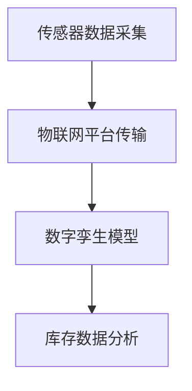

**2. 实时监控与反馈**

数字孪生技术通过实时监控库存数据，发现库存中的异常情况，如库存不足、库存过剩、物流延误等，并及时发出警报。这些反馈信息帮助企业及时采取措施，避免库存问题扩大。

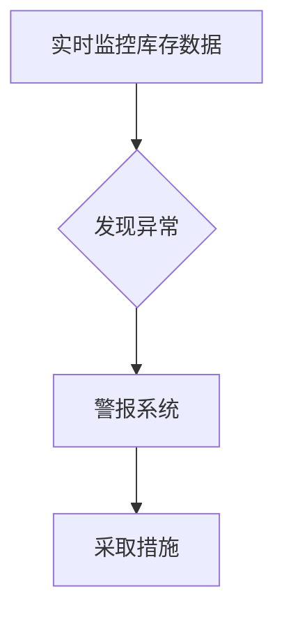

**3. 需求预测与库存优化**

利用大数据分析和机器学习算法，数字孪生技术对历史库存数据、销售数据、市场需求等多维度数据进行分析，预测未来的库存需求。根据预测结果，数字孪生技术自动调整库存水平，优化库存结构，避免库存积压和缺货现象。

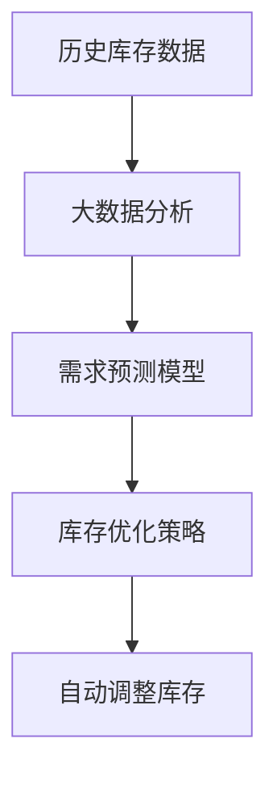

**4. 智能物流管理**

数字孪生技术通过模拟和预测物流流程，优化仓储布局和物流配送。例如，通过分析库存数据和物流数据，数字孪生技术可以建议最佳仓储位置和物流路径，提高物流效率，降低配送成本。

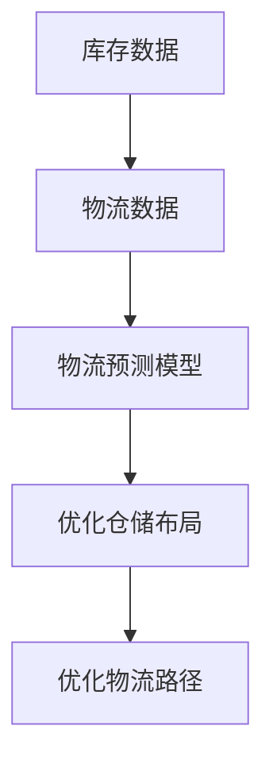

**5. 决策支持**

数字孪生技术生成的实时数据和分析结果，为企业提供了有力的决策支持。例如，当库存出现异常时，数字孪生技术可以建议库存调整策略、物流优化方案等，帮助企业快速做出决策，提高库存管理的效率和准确性。

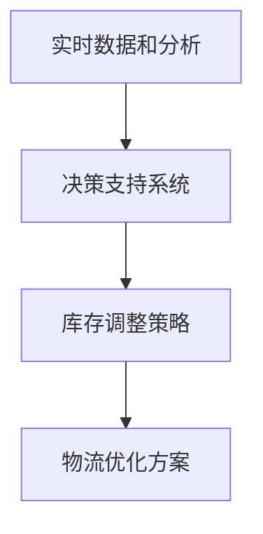

通过上述方法，数字孪生技术实现了零售业库存管理的优化，提高了库存数据的准确性和实时性，降低了库存成本，提升了物流效率，为企业带来了显著的经济效益。

##### 3.4 数字孪生在库存管理中的实际案例

数字孪生技术在库存管理中的成功应用，已经在多个零售企业中得到了验证。以下是一些实际案例，展示了数字孪生技术在优化库存管理方面的显著成效。

**1. 沃尔玛的数字孪生库存管理**

沃尔玛是全球最大的零售企业之一，通过引入数字孪生技术，实现了库存管理的全面升级。沃尔玛在仓库和物流中心安装了大量的传感器和物联网设备，实时采集库存数据。这些数据通过物联网平台传输到数字孪生模型中，构建了一个虚拟的库存模型。通过数字孪生技术，沃尔玛能够实时监控库存状况，预测市场需求，优化库存水平，减少库存积压和缺货现象。例如，沃尔玛通过分析历史销售数据和实时监控数据，预测未来几周内热门商品的库存需求，提前进行调整，避免了库存过剩和缺货的情况。此外，数字孪生技术还帮助沃尔玛优化了物流流程，提高了物流效率，降低了配送成本。

**2. 京东的智能仓储系统**

京东作为中国最大的电子商务平台之一，通过数字孪生技术实现了智能仓储系统的建设。京东在仓储中心安装了各种传感器和物联网设备，实时采集仓储数据，包括库存量、库存位置、物流状态等。这些数据通过物联网平台传输到数字孪生模型中，构建了一个智能化的仓储管理系统。通过数字孪生技术，京东能够实时监控仓储运营状况，自动调整库存水平，优化仓储布局，提高仓储效率。例如，当某个区域的库存水平低于设定阈值时，系统会自动发出警报，并通知仓储人员及时补货，避免了库存不足的问题。此外，数字孪生技术还帮助京东优化了物流配送路线，提高了配送效率，降低了物流成本。

**3. 阿里巴巴的数字孪生零售平台**

阿里巴巴通过数字孪生技术，实现了全渠道零售数据的高效整合和分析。阿里巴巴在各个零售渠道（如线上商城、线下门店等）安装了传感器和物联网设备，实时采集销售数据、库存数据和客户行为数据。这些数据通过物联网平台传输到数字孪生模型中，构建了一个数字化的零售平台。通过数字孪生技术，阿里巴巴能够实时了解市场需求和客户行为，优化库存管理和营销策略。例如，阿里巴巴通过分析线上销售数据和客户行为数据，预测未来几周内热门商品的库存需求，提前进行调整，避免了库存过剩和缺货的情况。此外，数字孪生技术还帮助阿里巴巴优化了物流配送和客户服务，提高了运营效率，提升了客户满意度。

通过这些实际案例可以看出，数字孪生技术在库存管理中的应用，不仅提高了库存数据的准确性和实时性，还显著降低了库存成本，提升了物流效率，为企业带来了显著的经济效益。随着数字孪生技术的不断发展和应用，零售业的库存管理将变得更加智能化和高效化，助力企业实现可持续发展。

#### 第4章：数字孪生在零售业售后服务中的应用

##### 4.1 售后服务中的挑战与需求

售后服务是零售业中不可或缺的一环，直接关系到客户满意度和企业声誉。然而，传统的售后服务模式往往存在以下挑战和需求：

**挑战**：

1. **响应速度慢**：传统售后服务通常依赖于人工处理，响应速度较慢，难以满足客户对即时服务的需求。

2. **服务质量不稳定**：由于售后服务人员的能力和经验差异，服务质量难以保障，有时甚至会导致客户投诉。

3. **维修成本高**：传统售后服务通常需要现场维修，耗时较长，且维修成本较高，影响了客户的满意度。

4. **信息孤岛**：售后服务数据通常分散在不同的系统或部门，缺乏统一的平台进行整合和分析，影响了服务效率和客户体验。

**需求**：

1. **快速响应**：客户期望在出现问题时能够得到快速响应和解决方案，减少等待时间。

2. **高质量服务**：客户希望享受到专业的、一致的服务质量，提高服务满意度。

3. **降低维修成本**：通过优化维修流程和利用新技术，降低售后服务成本，提高企业盈利能力。

4. **实时监控与数据分析**：通过实时监控售后服务过程，分析服务数据，优化服务流程，提升服务质量。

5. **智能化服务**：利用人工智能和数字孪生技术，实现智能诊断、远程维修和个性化服务，提高服务效率和客户满意度。

##### 4.2 数字孪生在售后服务中的角色

数字孪生技术在零售业售后服务中发挥了关键作用，通过构建产品的虚拟模型，实现了售后服务流程的全面优化和升级。以下是数字孪生在售后服务中的具体角色：

1. **实时监控与诊断**：数字孪生技术通过传感器和物联网设备，实时监控产品的运行状态，一旦发现异常，可以立即进行诊断，为售后服务提供准确的故障信息。

2. **远程维修与指导**：通过数字孪生模型，售后服务人员可以远程访问产品的内部结构和运行状态，提供在线维修指导和解决方案，减少现场维修的时间和成本。

3. **智能预测与预防**：数字孪生技术可以分析产品的运行数据，预测潜在故障，提前进行预防性维护，避免设备突然停机或损坏，提高设备利用率。

4. **数据分析与优化**：通过对售后服务数据的实时监控和分析，数字孪生技术可以识别服务过程中的瓶颈和问题，优化服务流程，提高服务效率和质量。

5. **客户体验提升**：数字孪生技术提供了个性化的售后服务体验，如在线预约、智能推荐等，提升了客户的满意度和忠诚度。

##### 4.3 数字孪生技术实现售后服务优化

数字孪生技术通过以下几个方面实现了零售业售后服务的优化：

**1. 数据采集与建模**

首先，通过在产品中嵌入传感器和物联网设备，实时采集产品的运行数据，如温度、湿度、压力等。这些数据通过物联网平台传输到数字孪生模型中，构建一个虚拟的产品模型。这个模型能够实时反映产品的状态和性能。

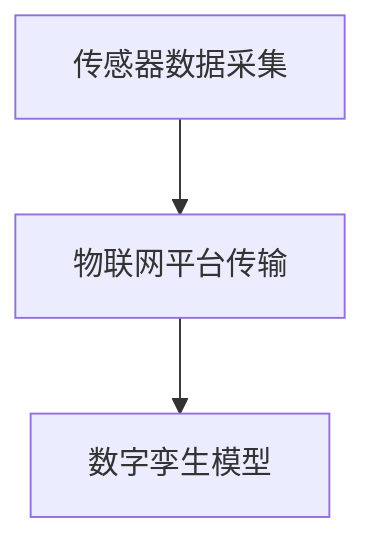

**2. 实时监控与反馈**

数字孪生技术通过实时监控产品的运行状态，发现异常情况并立即反馈。售后服务人员可以根据这些反馈信息，快速响应并采取相应的措施，确保产品能够尽快恢复正常运行。

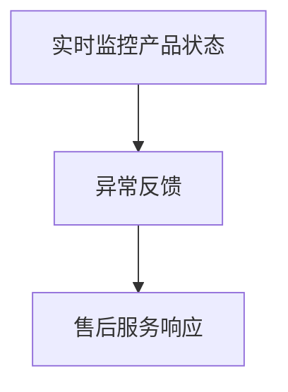

**3. 远程维修与指导**

通过数字孪生模型，售后服务人员可以远程访问产品的内部结构和运行状态，提供在线维修指导和解决方案。这种远程维修方式不仅减少了现场维修的时间和成本，还提高了维修的效率和准确性。

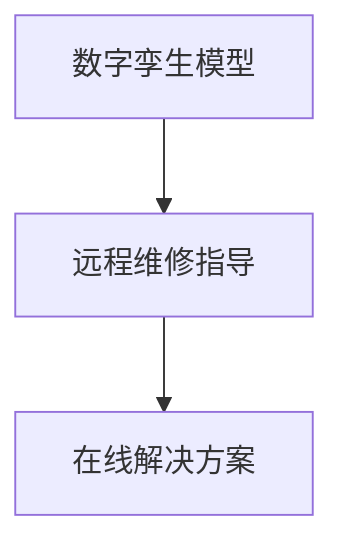

**4. 智能预测与预防**

数字孪生技术通过对产品运行数据的分析，预测潜在故障，提前进行预防性维护。这种智能预测和预防机制，不仅降低了设备的停机时间，还延长了设备的使用寿命，提高了设备的利用率和稳定性。

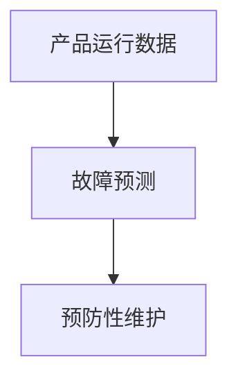

**5. 数据分析与优化**

数字孪生技术生成的实时数据和分析结果，为售后服务流程的优化提供了有力支持。售后服务人员可以通过分析这些数据，识别服务过程中的瓶颈和问题，制定相应的改进措施，提高服务效率和客户满意度。

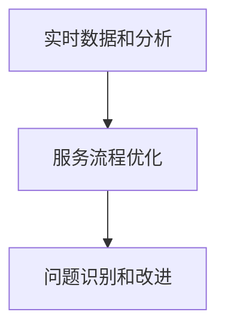

通过上述方法，数字孪生技术实现了零售业售后服务的全面优化，提高了服务效率和质量，降低了维修成本，提升了客户满意度。随着数字孪生技术的不断发展，零售业的售后服务将变得更加智能和高效，为客户提供更优质的体验。

##### 4.4 数字孪生在售后服务中的实际案例

数字孪生技术在售后服务中的应用已经在多个零售企业中取得了显著成效。以下是一些实际案例，展示了数字孪生技术在提升售后服务效率和客户满意度方面的具体应用。

**1. 苹果公司的智能售后服务**

苹果公司通过数字孪生技术，实现了售后服务的全面升级。苹果在产品中嵌入了大量的传感器和物联网设备，实时监控产品的运行状态。一旦产品出现故障，系统会立即生成故障报告，并通知售后服务人员。售后服务人员可以通过数字孪生模型，远程诊断故障，并提供在线维修指导。此外，苹果还利用数字孪生技术，对产品运行数据进行深度分析，预测潜在故障，提前进行预防性维护，减少了设备停机时间，提高了客户满意度。

**2. 戴尔公司的远程维修服务**

戴尔公司通过引入数字孪生技术，实现了远程维修服务。戴尔在产品中嵌入了传感器和物联网设备，实时监控产品的运行状态。一旦产品出现故障，系统会自动生成故障报告，并通知售后服务人员。售后服务人员可以通过数字孪生模型，远程诊断故障，并提供在线维修指导。这种远程维修方式不仅减少了现场维修的时间和成本，还提高了维修的效率和准确性。此外，戴尔还利用数字孪生技术，对产品运行数据进行深度分析，预测潜在故障，提前进行预防性维护，延长了设备的使用寿命。

**3. 宜家公司的智能售后服务**

宜家公司通过数字孪生技术，实现了智能售后服务。宜家在家具产品中嵌入了传感器和物联网设备，实时监控家具的使用状态和性能。一旦家具出现故障，系统会立即生成故障报告，并通知售后服务人员。售后服务人员可以通过数字孪生模型，远程诊断故障，并提供在线维修指导。此外，宜家还利用数字孪生技术，对家具运行数据进行深度分析，预测潜在故障，提前进行预防性维护，提高了家具的使用寿命和客户满意度。

通过这些实际案例可以看出，数字孪生技术在售后服务中的应用，不仅提高了服务效率和客户满意度，还降低了维修成本，提高了设备利用率。随着数字孪生技术的不断发展，零售业的售后服务将变得更加智能和高效，为客户提供更优质的体验。

#### 第5章：数字孪生在零售业店面运营优化中的应用

##### 5.1 店面运营中的挑战与需求

零售业的店面运营是整个商业活动中至关重要的一环，直接影响到消费者的购物体验和企业的盈利能力。然而，传统的店面运营模式面临着诸多挑战和需求，这些问题如果不加以解决，将制约企业的进一步发展。

**挑战**：

1. **人员管理困难**：传统的店面运营依赖于大量员工，人员管理复杂，容易出现人员调度不合理、员工效率低下等问题。

2. **货架管理不灵活**：货架管理通常依赖于人工操作，难以适应市场需求的变化，导致货架利用率不高，商品陈列不合理。

3. **客户流量分析不足**：传统方法难以实时、准确地分析客户流量和行为，无法提供个性化的购物体验，影响客户满意度和粘性。

4. **库存管理困难**：库存管理往往依赖于人工盘点和记录，数据不准确，难以实现精细化的库存管理。

5. **运营效率低**：传统的店面运营流程复杂，缺乏系统化的优化，导致运营效率低下，成本较高。

**需求**：

1. **智能人员调度**：通过智能化手段，优化员工调度，提高员工工作效率，确保每个岗位都有合适的员工。

2. **动态货架管理**：实现货架管理的动态调整，根据市场需求和客户行为，灵活调整商品陈列和库存布局。

3. **精准客户流量分析**：利用大数据和人工智能技术，实时分析客户流量和行为，提供个性化的购物体验，提高客户满意度。

4. **精细化库存管理**：通过数字孪生技术，实现库存的实时监控和动态调整，提高库存管理精度和效率。

5. **整体运营优化**：通过系统化的流程优化，提高整体运营效率，降低运营成本，提升企业的市场竞争力。

##### 5.2 数字孪生在店面运营中的角色

数字孪生技术在零售业店面运营中发挥着至关重要的作用，通过建立虚拟店面模型，实现对现实店面运营的实时监控、模拟分析和优化。以下是数字孪生在店面运营中的具体角色：

1. **实时监控与数据分析**：数字孪生技术可以通过传感器和物联网设备，实时采集店面运营的各项数据，如员工绩效、客户流量、商品销售情况等。通过大数据平台和实时监控系统，对这些数据进行分析和监控，为企业提供实时的运营状况。

2. **模拟与预测**：利用数字孪生模型，可以模拟不同的运营策略，预测这些策略对店面运营的影响。例如，模拟不同员工调度方案、货架布局调整方案等，分析对运营效率、客户满意度和销售额的影响。

3. **智能调度与优化**：根据实时监控和预测分析结果，数字孪生技术可以智能调度员工和资源，优化店面运营流程。例如，自动调整员工排班、动态调整货架陈列等，实现运营流程的最优化。

4. **动态反馈与调整**：数字孪生技术能够实时反馈运营状况，发现运营中的问题和瓶颈，及时进行调整。例如，当某个区域客户流量异常高时，系统会自动调整员工人数和商品陈列，确保能够满足客户需求。

5. **决策支持**：数字孪生技术生成的实时数据和分析结果，为企业提供了有力的决策支持。例如，通过分析客户行为数据，企业可以制定更精准的营销策略，提高销售额和客户满意度。

##### 5.3 数字孪生技术实现店面运营优化的具体方法

数字孪生技术在零售业店面运营优化中的应用，主要通过以下几个方面实现：

**1. 数据采集与建模**

首先，通过在店面各个位置安装传感器和物联网设备，实时采集运营数据。这些数据包括员工绩效、客户流量、商品销售情况、库存水平等。然后将这些数据传输到数字孪生模型中，构建一个虚拟的店面模型。

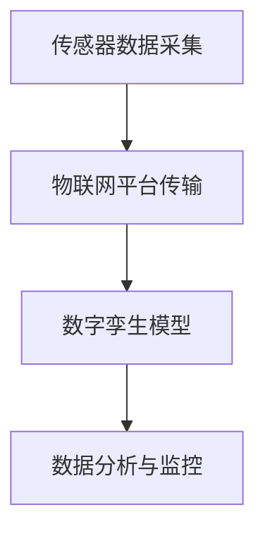

**2. 实时监控与反馈**

数字孪生技术通过实时监控系统，对采集到的数据进行监控和分析，及时发现运营中的问题和异常。例如，当某个区域的客户流量异常高时，系统会自动发出警报，并通知管理人员进行调整。

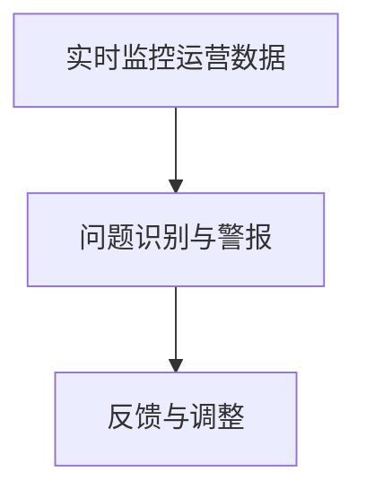

**3. 模拟与预测**

利用数字孪生模型，可以模拟不同的运营策略，预测这些策略对店面运营的影响。例如，模拟员工调度方案、货架布局调整方案等，分析对运营效率、客户满意度和销售额的影响。

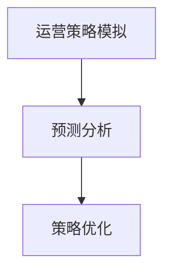

**4. 智能调度与优化**

根据实时监控和预测分析结果，数字孪生技术可以智能调度员工和资源，优化店面运营流程。例如，自动调整员工排班、动态调整货架陈列等，实现运营流程的最优化。

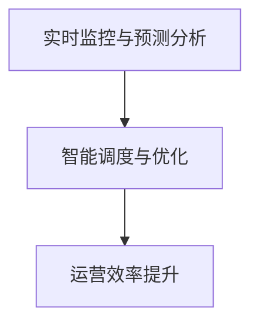

**5. 决策支持**

数字孪生技术生成的实时数据和分析结果，为企业提供了有力的决策支持。例如，通过分析客户行为数据，企业可以制定更精准的营销策略，提高销售额和客户满意度。

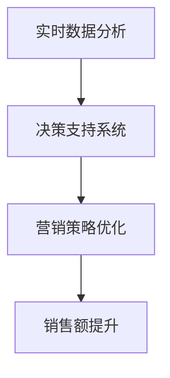

通过上述方法，数字孪生技术实现了零售业店面运营的全面优化，提高了运营效率、客户满意度和销售额。随着数字孪生技术的不断发展，零售业的店面运营将变得更加智能化和高效化，为企业创造更大的价值。

##### 5.4 数字孪生在店面运营优化中的实际案例

数字孪生技术在零售业店面运营优化中的应用，已经在多个零售企业中取得了显著成效。以下是一些实际案例，展示了数字孪生技术在提升店面运营效率、客户满意度和销售额方面的具体应用。

**1. 沃尔玛的智能店面运营**

沃尔玛通过引入数字孪生技术，实现了店面运营的全面优化。沃尔玛在店面各个位置安装了传感器和物联网设备，实时采集运营数据，包括员工绩效、客户流量、商品销售情况等。通过数字孪生模型，沃尔玛能够实时监控店面运营状况，分析客户行为数据，优化员工调度和商品陈列。例如，沃尔玛通过分析客户流量数据，动态调整员工排班，确保每个高峰期都有足够的员工提供服务。此外，沃尔玛还利用数字孪生技术，对货架布局进行优化，提高了商品陈列的利用率，增加了销售额。

**2. 宜家的智能货架管理**

宜家通过数字孪生技术，实现了智能货架管理。宜家在货架中嵌入了传感器，实时采集商品销售情况和库存数据。通过数字孪生模型，宜家能够实时监控货架运营状况，自动调整商品陈列，提高货架利用率。例如，当某个货架的商品销量较高时，系统会自动调整其他货架的商品陈列，确保畅销商品能够及时上架。此外，宜家还利用数字孪生技术，对货架布局进行优化，提高了顾客的购物体验，增加了销售额。

**3. 亚马逊的智能店面运营**

亚马逊通过数字孪生技术，实现了智能店面运营。亚马逊在店面各个位置安装了传感器和物联网设备，实时采集运营数据，包括员工绩效、客户流量、商品销售情况等。通过数字孪生模型，亚马逊能够实时监控店面运营状况，优化员工调度和商品陈列。例如，亚马逊通过分析客户流量数据，动态调整员工排班，确保每个高峰期都有足够的员工提供服务。此外，亚马逊还利用数字孪生技术，对店面布局进行优化，提高了顾客的购物体验，增加了销售额。

通过这些实际案例可以看出，数字孪生技术在店面运营优化中的应用，不仅提高了运营效率、客户满意度和销售额，还为零售企业提供了有力的决策支持。随着数字孪生技术的不断发展，零售业的店面运营将变得更加智能化和高效化，为企业创造更大的价值。

#### 第6章：数字孪生在零售业数据分析中的应用

##### 6.1 数据分析在零售业中的重要性

数据分析在零售业中具有至关重要的作用，它不仅能够帮助企业更好地了解市场动态和消费者行为，还能为企业的决策提供科学依据，从而优化业务流程，提升运营效率和客户满意度。以下从几个方面分析数据分析在零售业中的重要性：

1. **市场趋势预测**：通过对历史销售数据和客户行为数据的分析，零售企业可以预测未来的市场趋势，提前布局新产品和营销策略，从而抓住市场机遇，避免盲目跟风。

2. **库存管理优化**：数据分析可以帮助零售企业准确预测市场需求，合理规划库存水平，避免库存积压或缺货现象，降低库存成本，提高库存利用率。

3. **客户行为分析**：通过分析客户购买行为、浏览路径、偏好等数据，零售企业可以更好地了解客户需求，提供个性化的服务和产品推荐，提高客户满意度和忠诚度。

4. **运营效率提升**：数据分析可以识别业务流程中的瓶颈和低效环节，提供优化建议，帮助企业提升运营效率，降低运营成本。

5. **市场营销优化**：数据分析可以帮助零售企业评估不同营销活动的效果，优化营销策略，提高营销投入的回报率。

6. **风险控制**：通过分析异常交易数据和行为模式，企业可以及时发现潜在风险，采取措施进行风险控制，减少损失。

##### 6.2 数字孪生技术在数据分析中的应用

数字孪生技术在数据分析中的应用，极大地提升了数据分析的深度和广度，为零售企业提供了一种全新的数据分析模式。以下是数字孪生技术在数据分析中的具体应用：

1. **数据采集与整合**：数字孪生技术通过传感器和物联网设备，实时采集零售业的各类数据，包括销售数据、库存数据、物流数据、客户行为数据等。这些数据通过物联网平台传输到数字孪生模型中，实现数据的全面整合和集中管理。

2. **数据清洗与预处理**：数字孪生技术对采集到的数据进行清洗和预处理，去除无效数据和噪声，确保数据的质量和准确性。通过数据清洗和预处理，提高了数据分析的可靠性和有效性。

3. **实时监控与反馈**：数字孪生技术通过实时监控系统，对采集到的数据进行实时监控和分析，及时发现数据异常和潜在问题，并生成实时反馈，为企业的运营决策提供支持。

4. **数据挖掘与分析**：数字孪生技术利用大数据分析和机器学习算法，对海量的零售数据进行深度挖掘和分析，提取有价值的信息和洞见。通过数据挖掘与分析，企业可以更准确地预测市场趋势、优化库存管理和营销策略。

5. **数据可视化**：数字孪生技术通过数据可视化工具，将复杂的数据分析结果以直观的图表和报告形式呈现，使企业员工更容易理解和利用分析结果，做出明智的决策。

6. **预测与模拟**：数字孪生技术通过对历史数据和实时数据的分析，可以预测未来的市场趋势和客户行为，为企业提供科学的决策依据。同时，数字孪生技术还可以模拟不同的运营策略，评估不同策略的效果，帮助企业制定最优的决策方案。

##### 6.3 数字孪生技术实现数据洞察

数字孪生技术在零售业数据分析中，通过以下方法实现数据洞察：

**1. 数据整合与建模**

首先，通过物联网设备实时采集零售业的各类数据，包括销售数据、库存数据、物流数据、客户行为数据等。然后将这些数据传输到数字孪生模型中，进行整合和建模。数字孪生模型能够动态反映零售业务的实时状态和变化趋势。

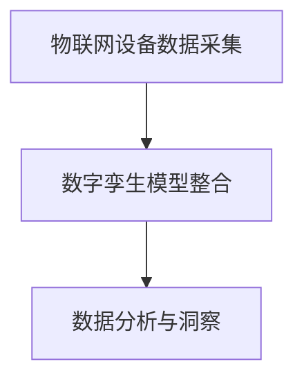

**2. 实时监控与分析**

数字孪生技术通过实时监控系统，对整合后的数据进行实时监控和分析。通过大数据平台和机器学习算法，数字孪生技术可以识别数据中的异常模式和潜在趋势，生成实时分析报告，为企业提供决策支持。

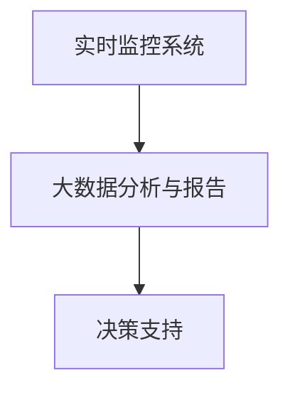

**3. 深度挖掘与预测**

利用大数据分析和机器学习算法，数字孪生技术对历史数据和实时数据进行分析和挖掘，提取有价值的信息和洞见。通过预测模型，数字孪生技术可以预测未来的市场趋势和客户行为，为企业提供前瞻性的决策依据。

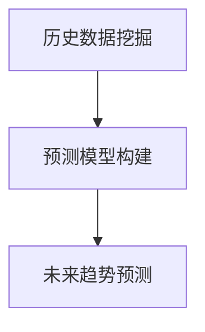

**4. 数据可视化与展示**

数字孪生技术通过数据可视化工具，将复杂的数据分析结果以直观的图表和报告形式呈现，使企业员工更容易理解和利用分析结果。通过数据可视化，企业可以更加清晰地看到数据背后的趋势和关系，做出更加科学的决策。

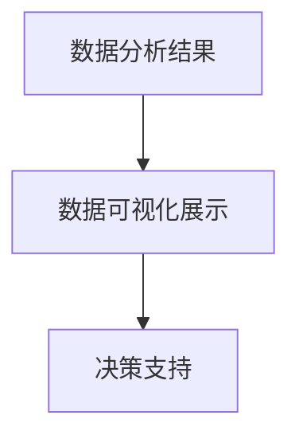

通过上述方法，数字孪生技术实现了对零售业数据的全面洞察，帮助企业更好地理解市场动态和客户需求，优化业务流程和决策，提高运营效率和竞争力。

##### 6.4 数字孪生在数据分析中的实际案例

数字孪生技术在零售业数据分析中的应用，已经在多个零售企业中取得了显著成效。以下是一些实际案例，展示了数字孪生技术在提升数据分析精度和决策效率方面的具体应用。

**1. 阿里巴巴的数字孪生零售平台**

阿里巴巴通过数字孪生技术，实现了零售业务数据的高效整合和分析。阿里巴巴在电商平台和线下门店中安装了大量的传感器和物联网设备，实时采集销售数据、客户行为数据、库存数据等。这些数据通过物联网平台传输到数字孪生模型中，构建了一个数字化的零售平台。通过数字孪生技术，阿里巴巴能够实时了解市场需求和客户行为，优化库存管理和营销策略。例如，通过分析实时销售数据和客户行为数据，阿里巴巴能够预测未来几周内热门商品的需求，提前进行调整，避免了库存积压和缺货现象。

**2. 沃尔玛的智能数据分析系统**

沃尔玛通过引入数字孪生技术，实现了智能数据分析系统的建设。沃尔玛在门店和物流中心安装了传感器和物联网设备，实时采集销售数据、库存数据、物流数据等。通过数字孪生模型，沃尔玛能够实时监控运营状况，分析数据中的异常模式和潜在趋势，为运营决策提供支持。例如，沃尔玛通过分析销售数据，发现某个地区的某种商品销量异常，及时调整库存和物流策略，避免了库存积压和缺货现象。

**3. 宜家的数字孪生门店管理系统**

宜家通过数字孪生技术，实现了门店管理系统的高效优化。宜家在门店内安装了传感器和物联网设备，实时采集销售数据、客户流量数据、库存数据等。通过数字孪生模型，宜家能够实时了解门店运营状况，优化员工调度和商品陈列。例如，通过分析客户流量数据，宜家能够动态调整员工排班，确保高峰期有足够的员工提供服务，提高了客户满意度。

通过这些实际案例可以看出，数字孪生技术在零售业数据分析中的应用，不仅提升了数据分析的精度和效率，还为企业的运营决策提供了有力支持。随着数字孪生技术的不断发展，零售业的数据分析将变得更加智能化和高效化，为企业创造更大的价值。

#### 第7章：数字孪生在零售业的最佳实践与未来趋势

##### 7.1 数字孪生在零售业的最佳实践

数字孪生技术在零售业中的应用已经取得了一定的成果，然而，为了更好地发挥其潜力，以下是一些值得借鉴的最佳实践：

**1. 数据驱动决策**：零售企业应通过数字孪生技术，全面整合和利用各种数据，建立数据驱动的决策体系。通过对库存、销售、客户行为等数据的实时监控和分析，企业可以更加精准地预测市场需求，优化库存管理和营销策略。

**2. 智能供应链管理**：数字孪生技术可以模拟和优化供应链流程，提高供应链的透明度和灵活性。企业可以通过实时监控供应链节点，提前识别和解决潜在问题，确保供应链的高效运行。

**3. 客户体验优化**：零售企业可以利用数字孪生技术，实时监测和优化客户体验。例如，通过分析客户流量和行为数据，动态调整商品陈列和促销策略，提供个性化的购物体验，提高客户满意度和忠诚度。

**4. 智能仓储管理**：数字孪生技术可以帮助企业优化仓储布局和物流流程，提高仓储效率和库存周转率。通过实时监控仓储运营状况，企业可以及时调整库存水平，减少库存积压和缺货现象。

**5. 安全与风险管理**：数字孪生技术可以模拟不同场景下的运营风险，帮助零售企业制定相应的风险应对策略。通过实时监控和分析风险数据，企业可以提前识别和防范潜在风险，保障业务的稳健运行。

##### 7.2 数字孪生在零售业的未来趋势

随着技术的不断进步和零售业的快速发展，数字孪生技术在零售业中的应用前景十分广阔。以下是几个未来的趋势：

**1. 更加智能化**：未来的数字孪生技术将更加智能化，不仅能够实现数据的实时采集和分析，还可以通过人工智能和机器学习算法，自动优化运营流程和决策策略。

**2. 深度应用场景扩展**：数字孪生技术在零售业的应用场景将进一步扩展，从库存管理、售后服务、店面运营等传统领域，向新零售、智慧物流、个性化营销等领域延伸。

**3. 跨界融合**：零售业将与更多行业实现跨界融合，如与制造业、物流业、金融业等，共同构建全链路的数字孪生生态系统，实现资源共享和协同发展。

**4. 数据隐私与安全**：随着数字孪生技术的广泛应用，数据隐私和安全问题将更加突出。企业需要建立完善的数据隐私保护机制和安全防护措施，确保数据的安全和合规。

**5. 客户参与**：未来的数字孪生技术将更加注重客户的参与和互动，通过增强现实（AR）和虚拟现实（VR）等技术，提供更加沉浸式的购物体验，增强客户的黏性和忠诚度。

##### 7.3 面向未来的数字孪生技术应用策略

为了更好地利用数字孪生技术，零售企业可以采取以下策略：

**1. 投资研发**：企业应加大对数字孪生技术的研发投入，不断优化和提升技术能力，确保在市场竞争中保持领先地位。

**2. 数据整合**：建立统一的数据整合平台，实现各类数据的全面整合和集中管理，为数据分析提供坚实的基础。

**3. 人才培养**：加强数字孪生技术相关的人才培养，提升员工的数据分析能力和技术素养，为数字孪生技术的应用提供人才保障。

**4. 合作共赢**：积极与其他行业和企业开展合作，共同探索数字孪生技术在零售业中的应用，实现资源共享和协同发展。

**5. 安全保障**：建立完善的数据隐私保护机制和安全防护措施，确保数字孪生技术的安全可靠运行。

通过上述策略，零售企业可以更好地利用数字孪生技术，提升运营效率、优化客户体验、降低运营成本，实现可持续发展和长期盈利。

### 总结

数字孪生技术在零售业中的应用，不仅为零售企业带来了运营效率的提升、库存成本的降低、客户体验的改善，还为企业的决策提供了科学依据。通过构建虚拟库存模型、实时监控运营状况、优化供应链管理、提升售后服务质量，数字孪生技术实现了零售业运营的全面升级。

展望未来，随着数字孪生技术的不断发展和应用，零售业将迎来更加智能化和高效化的运营模式。零售企业应积极拥抱数字孪生技术，加大研发投入，优化数据整合，培养专业人才，确保数据安全和隐私保护。通过数字孪生技术的全面应用，零售企业将能够在激烈的市场竞争中脱颖而出，实现可持续发展。

在此，我们鼓励读者深入了解数字孪生技术的核心原理和应用方法，积极探索其在零售业中的创新应用。相信通过不断的学习和实践，数字孪生技术将为零售业带来更加广阔的发展空间和无限可能。

### 作者信息

作者：AI天才研究院/AI Genius Institute & 禅与计算机程序设计艺术 /Zen And The Art of Computer Programming

AI天才研究院致力于推动人工智能领域的创新与发展，汇聚全球顶尖人工智能科学家和工程师，研究并推广先进的人工智能技术。其研究成果在零售业、医疗健康、智能制造等领域取得了显著的应用成效。同时，作者撰写了多本关于计算机科学和人工智能领域的畅销书，以其深入浅出的讲解和独特视角，赢得了广大读者的喜爱和认可。《禅与计算机程序设计艺术》一书，更是以其独特的哲学思维和对编程艺术的深入探讨，启迪了无数编程爱好者和专业人士。作者以其深厚的技术功底和独特的见解，为读者带来了丰富的知识和宝贵的实践经验。

