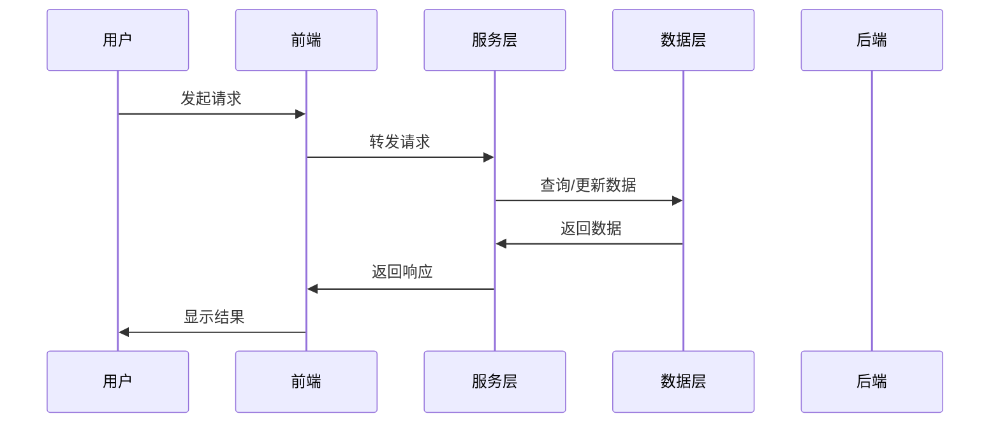

                 

### 关键词

- 科技依赖
- 数字戒断康复中心
- 科技依赖问题背景
- 科技依赖诊断方法
- 科技依赖治疗方法
- 科技依赖康复支持系统

### 摘要

本文从科技依赖问题的背景与现状入手，详细探讨了科技依赖的危害、流行现状以及数字戒断康复中心的必要性。接着，文章介绍了科技依赖的诊断方法，包括诊断流程、评估量表和心理评估。在治疗方法部分，详细介绍了心理治疗方法、药物治疗方法及其效果评估。最后，文章重点讨论了科技依赖康复支持系统的构建，包括系统定义、关键要素和构建方法。通过本文的详细分析，希望能够为科技依赖的治疗提供有价值的参考。

### 第1章：科技依赖问题的背景与现状

#### 1.1 科技依赖的定义与类型

**科技依赖**，简而言之，是指个体对科技产品或服务的过度使用，以至于这种使用行为对个人的日常生活、心理健康和社会功能产生了负面影响。随着科技的高速发展，智能手机、互联网、社交媒体等科技产品已经深深嵌入到我们的日常生活中，成为许多人生活中不可或缺的一部分。然而，对于部分人群来说，这些科技产品的使用已经超出了合理范围，变成了依赖和成瘾。

**科技依赖的类型**可以分为几种主要类型：

1. **时间依赖**：指的是个体每天花费大量时间使用科技产品，以至于影响到日常工作和学习。
2. **行为依赖**：个体无法自我控制地频繁使用科技产品，即便意识到这种行为对个人有负面影响，也无法停止。
3. **情绪依赖**：个体在使用科技产品时，往往是为了逃避现实生活中的压力和焦虑，从而产生情绪上的依赖。
4. **社交依赖**：个体过度依赖社交媒体来建立和维护人际关系，导致真实社交能力的下降。

#### 1.2 科技依赖的危害与影响

科技依赖的危害与影响是多方面的，包括但不限于以下几个方面：

**身体健康的危害**：

- **睡眠障碍**：科技产品的蓝光会干扰生物钟，导致睡眠质量下降。
- **视力问题**：长时间盯着屏幕容易导致眼睛疲劳，严重时可能引发近视。
- **肌肉骨骼问题**：长时间保持不良坐姿或站姿使用科技产品，容易导致颈椎、腰椎和肩膀等问题。

**心理健康的危害**：

- **焦虑和抑郁**：过度使用科技产品可能导致个体感到孤独、焦虑和抑郁。
- **自我价值感的缺失**：社交媒体上的虚假信息和比较文化可能导致个体产生自我价值感的缺失。

**社交影响的危害**：

- **社交障碍**：过度依赖科技产品可能导致面对面社交能力的下降。
- **人际关系紧张**：科技产品的使用可能导致家庭成员之间的沟通减少，关系紧张。

#### 1.3 科技依赖的流行现状

**全球范围内的科技依赖现象**：

据研究表明，全球范围内科技依赖的现象越来越普遍。特别是在年轻人中，智能手机和社交媒体的依赖程度尤为显著。一项全球性的调查显示，超过50%的年轻人每天在智能手机上花费的时间超过5小时。

**不同人群的科技依赖特点**：

- **年轻人**：年轻人对科技产品的接受度更高，更容易沉迷于社交媒体和网络游戏。
- **上班族**：由于工作原因，上班族长时间使用电脑和智能手机，容易形成科技依赖。
- **学生**：学生群体由于学习压力大，容易将科技产品作为逃避压力的工具。

#### 1.4 数字戒断康复中心的必要性

**康复中心的定义**：

数字戒断康复中心，是指专门为解决科技依赖问题而设立的治疗和康复机构。这些中心提供一系列的专业服务，帮助个体戒除对科技产品的依赖，恢复健康的生活状态。

**康复中心的运作模式**：

- **初期评估**：通过专业评估工具和方法，对个体科技依赖程度进行详细评估。
- **治疗计划**：根据评估结果，制定个性化的治疗计划。
- **康复训练**：通过心理治疗、药物治疗和康复训练等多种方式，帮助个体逐步减少对科技产品的依赖。
- **跟踪监测**：在康复过程中，定期跟踪监测个体的康复情况，及时调整治疗方案。

**康复中心的期望目标**：

- **改善生活质量**：通过治疗和康复，帮助个体摆脱科技依赖，提高生活质量。
- **提升心理健康**：减少科技依赖带来的焦虑、抑郁等问题，提升心理健康水平。
- **重建社交能力**：通过康复训练，帮助个体重建和改善人际关系。

#### 1.5 本章小结

本章详细介绍了科技依赖问题的背景与现状，包括其定义、类型、危害、流行现状以及数字戒断康复中心的必要性。通过这些内容，我们可以更加清晰地认识到科技依赖问题的严重性，并为后续章节中的诊断和治疗提供背景支持。

### Mermaid ER实体关系图

```mermaid
erDiagram
  User ||--|{ TechDependency }
  User ||--|{ HealthRisk }
  User ||--|{ MentalHealthRisk }
  User ||--|{ SocialRisk }
  TechDependency ||--|{ DiagnosticMethod }
  TechDependency ||--|{ TreatmentMethod }
  TechDependency ||--|{ RecoverySupportSystem }
```

### Mermaid 类图

```mermaid
classDiagram
  TechDependency <<|-- User
  HealthRisk <<|-- User
  MentalHealthRisk <<|-- User
  SocialRisk <<|-- User
  DiagnosticMethod <<|-- TechDependency
  TreatmentMethod <<|-- TechDependency
  RecoverySupportSystem <<|-- TechDependency
```

### 科技依赖的数学模型与公式

假设个体每天在科技产品上的使用时间为 $T$，科技依赖程度为 $D$，心理健康风险系数为 $R_m$，身体健康风险系数为 $R_h$，社交风险系数为 $R_s$。则有：

$$
D = f(T, R_m, R_h, R_s)
$$

其中，$f$ 为函数，表示科技依赖程度与各个因素之间的关系。具体的关系模型可以表示为：

$$
D = \frac{T}{T_0} \cdot R_m \cdot R_h \cdot R_s
$$

其中，$T_0$ 为正常使用时间，$R_m$，$R_h$，$R_s$ 分别为心理健康、身体健康和社交风险的系数。

### 科技依赖的危害

科技依赖不仅会影响个体的生活质量，还会带来一系列的健康问题和社会问题。以下是一些具体的危害：

#### 身体健康的危害

- **睡眠障碍**：研究表明，蓝光会干扰人体的生物钟，导致睡眠质量下降。长时间使用科技产品，尤其是在睡前使用，会显著影响睡眠质量。
- **视力问题**：长时间盯着屏幕会导致眼睛疲劳，增加近视的风险。此外，过度使用电子屏幕还可能导致干眼症和眼部疾病。
- **肌肉骨骼问题**：长时间保持不良坐姿或站姿使用科技产品，容易导致颈椎、腰椎和肩膀等问题。例如，长时间低头玩手机可能导致颈椎病。

#### 心理健康的危害

- **焦虑和抑郁**：过度使用科技产品，尤其是社交媒体和网络游戏，可能导致焦虑和抑郁。个体可能会因为社交压力、网络暴力和游戏成瘾而感到焦虑和沮丧。
- **自我价值感的缺失**：社交媒体上的虚假信息和比较文化可能导致个体产生自我价值感的缺失。许多人通过社交媒体展示自己的生活，导致他人产生自卑情绪。

#### 社交影响的危害

- **社交障碍**：过度依赖科技产品可能导致面对面社交能力的下降。个体可能更喜欢通过社交媒体进行社交，而不是面对面交流。
- **人际关系紧张**：科技产品的使用可能导致家庭成员之间的沟通减少，关系紧张。尤其是在家庭聚会等场合，个体可能因为过度关注手机而忽视与家人之间的交流。

### 全球范围内的科技依赖现象

全球范围内，科技依赖已经成为一个普遍存在的问题。特别是在年轻人和上班族中，科技产品的依赖程度尤为显著。以下是一些数据和研究结果：

- **全球调查数据**：据一项全球性的调查显示，超过50%的年轻人每天在智能手机上花费的时间超过5小时。
- **学生群体**：一项针对大学生群体的调查发现，超过70%的学生每天使用社交媒体的时间超过3小时。
- **上班族**：研究表明，上班族由于工作原因，长时间使用电脑和智能手机，形成科技依赖的比例较高。

### 不同人群的科技依赖特点

不同人群的科技依赖特点有所不同，具体如下：

#### 年轻人

- **高接受度**：年轻人对科技产品的接受度更高，更容易接受新技术和新产品。
- **高依赖程度**：由于生活节奏快，年轻人更容易沉迷于社交媒体和网络游戏，形成高依赖程度。
- **逃避现实**：年轻人可能将科技产品作为逃避现实生活压力和焦虑的工具。

#### 上班族

- **长时间使用**：上班族由于工作原因，长时间使用电脑和智能手机，容易形成科技依赖。
- **工作与生活平衡**：科技依赖可能导致上班族难以实现工作与生活的平衡，影响工作效率和生活质量。

#### 学生

- **学习压力**：学生群体由于学习压力大，容易将科技产品作为逃避压力的工具。
- **社交需求**：学生群体在寻求社交需求时，更容易依赖社交媒体，导致面对面社交能力的下降。

### 数字戒断康复中心的必要性

数字戒断康复中心作为一种专门针对科技依赖问题的治疗和康复机构，其必要性体现在以下几个方面：

#### 康复中心的定义

数字戒断康复中心，是指专门为解决科技依赖问题而设立的治疗和康复机构。这些中心提供一系列的专业服务，包括诊断、治疗和康复训练等，帮助个体逐步减少对科技产品的依赖，恢复健康的生活状态。

#### 康复中心的运作模式

数字戒断康复中心的运作模式通常包括以下几个步骤：

1. **初期评估**：通过专业评估工具和方法，对个体的科技依赖程度进行详细评估，包括行为依赖、时间依赖、情绪依赖和社交依赖等方面。
2. **治疗计划**：根据评估结果，制定个性化的治疗计划。治疗计划可能包括心理治疗、药物治疗和康复训练等。
3. **康复训练**：通过心理治疗、药物治疗和康复训练等多种方式，帮助个体逐步减少对科技产品的依赖。康复训练可能包括时间管理、情绪调节、社交技能训练等。
4. **跟踪监测**：在康复过程中，定期跟踪监测个体的康复情况，及时调整治疗方案。

#### 康复中心的期望目标

数字戒断康复中心的期望目标包括以下几个方面：

1. **改善生活质量**：通过治疗和康复，帮助个体摆脱科技依赖，提高生活质量。
2. **提升心理健康**：减少科技依赖带来的焦虑、抑郁等问题，提升心理健康水平。
3. **重建社交能力**：通过康复训练，帮助个体重建和改善人际关系。

### 康复中心的定义与作用

**康复中心的定义**：

数字戒断康复中心是一种专门针对科技依赖问题的治疗和康复机构。这些中心致力于帮助个体减少对科技产品的依赖，恢复健康的生活状态。康复中心通常提供一系列专业服务，包括诊断、治疗、康复训练和心理支持等。

**康复中心的作用**：

1. **诊断与评估**：康复中心通过专业的评估工具和方法，对个体的科技依赖程度进行详细评估。这包括行为依赖、时间依赖、情绪依赖和社交依赖等多个方面。
   
2. **制定个性化治疗计划**：根据评估结果，康复中心为每个个体制定个性化的治疗计划。这些计划可能包括心理治疗、药物治疗、康复训练和生活方式调整等多种方式。

3. **提供心理支持**：康复中心提供专业的心理支持，帮助个体应对科技依赖带来的焦虑、抑郁等心理问题。

4. **康复训练**：康复中心通过一系列康复训练，如时间管理技巧、情绪调节技巧、社交技能训练等，帮助个体逐步减少对科技产品的依赖。

5. **跟踪与监测**：康复中心定期跟踪监测个体的康复情况，及时调整治疗方案，确保康复效果。

### 康复中心的运作模式

**初期评估**：

康复中心的首要任务是进行初期评估。这一过程通常包括以下步骤：

1. **收集基本信息**：包括个体的年龄、性别、职业、科技产品使用习惯等。
2. **行为观察**：通过观察个体在日常生活中使用科技产品的行为模式，评估其依赖程度。
3. **心理评估**：使用标准化的心理评估工具，评估个体的心理健康状况，包括焦虑、抑郁等心理问题。
4. **生理检查**：评估个体因科技依赖而产生的身体健康问题，如视力问题、肌肉骨骼问题等。

**制定个性化治疗计划**：

根据初期评估的结果，康复中心为每个个体制定个性化的治疗计划。这些计划可能包括：

1. **心理治疗**：如认知行为疗法、冲击疗法等，帮助个体改变不健康的思维和行为模式。
2. **药物治疗**：在必要时，使用药物帮助个体控制焦虑、抑郁等心理问题。
3. **康复训练**：包括时间管理训练、情绪调节训练、社交技能训练等，帮助个体逐步减少对科技产品的依赖。

**康复训练**：

康复训练是康复中心的核心内容。具体包括：

1. **时间管理**：教授个体如何合理安排时间，减少不必要的科技产品使用。
2. **情绪调节**：通过认知行为疗法等技术，帮助个体学会应对焦虑和抑郁等情绪问题。
3. **社交技能训练**：通过角色扮演、社交活动等方式，提高个体的社交能力。

**跟踪与监测**：

康复中心在康复过程中会定期跟踪监测个体的康复情况，确保治疗方案的合理性和有效性。具体措施包括：

1. **定期评估**：通过定期的评估，了解个体在康复过程中的进展和问题。
2. **反馈与调整**：根据评估结果，及时调整治疗方案，确保康复效果。
3. **心理支持**：提供持续的心理支持，帮助个体应对康复过程中可能遇到的心理问题。

### 康复中心的期望目标

**改善生活质量**：

通过康复中心的综合治疗和训练，个体可以逐步减少对科技产品的依赖，恢复正常的生活节奏，从而提高生活质量。具体包括：

1. **减少身体不适**：通过康复训练，个体可以改善因长时间使用科技产品而产生的身体问题，如视力问题、肌肉骨骼问题等。
2. **改善心理状态**：通过心理治疗和情绪调节，个体可以减少焦虑、抑郁等心理问题，提升心理健康水平。
3. **重建社交能力**：通过社交技能训练，个体可以重建和改善人际关系，提高社交能力。

**提升心理健康**：

科技依赖不仅影响个体的身体健康，还会对心理健康产生负面影响。康复中心通过以下方式提升心理健康：

1. **减轻焦虑和抑郁**：通过认知行为疗法等技术，帮助个体减轻因科技依赖而产生的焦虑和抑郁症状。
2. **提高自我价值感**：通过康复训练，个体可以重新认识到自己除了科技产品之外的自我价值，减少对科技产品的依赖。
3. **增强心理韧性**：通过康复训练，个体可以学会如何应对生活中的压力和挑战，提高心理韧性。

**重建社交能力**：

科技依赖可能导致个体面对面社交能力的下降。康复中心通过以下方式帮助个体重建社交能力：

1. **社交技能训练**：通过角色扮演、社交活动等方式，提高个体的社交技能和自信心。
2. **面对面交流**：鼓励个体减少科技产品的使用，增加面对面交流的机会，重建和改善人际关系。
3. **家庭和朋友的支持**：鼓励家庭成员和朋友参与康复过程，提供支持和鼓励，帮助个体重建社交网络。

### 本章小结

本章详细介绍了数字戒断康复中心的定义与作用，包括其运作模式、初期评估、个性化治疗计划、康复训练和跟踪监测等内容。通过这些内容，我们可以更加清晰地认识到康复中心在解决科技依赖问题中的重要性。接下来，我们将进一步探讨科技依赖的诊断方法。

### 2.1 科技依赖的诊断流程

科技依赖的诊断是一个复杂而系统的过程，需要多方面的评估和综合分析。以下是科技依赖诊断的流程：

**诊断前的准备**：

1. **收集个体基本信息**：包括年龄、性别、职业、科技产品使用习惯等，这些信息有助于了解个体的背景和基本情况。
2. **确定评估目标**：明确诊断的目的和重点，例如，是评估个体的行为依赖、时间依赖、情绪依赖还是社交依赖。
3. **选择评估工具**：根据评估目标选择合适的评估工具，如自我评估问卷、行为观察记录等。

**诊断工具与方法**：

1. **自我评估问卷**：通过让个体填写自我评估问卷，了解其对科技产品的使用情况和依赖程度。常用的问卷包括“互联网成瘾自评量表”（IAT）和“科技依赖自评量表”（TDS）等。
2. **行为观察记录**：通过观察个体在日常生活中的科技产品使用行为，记录其使用频率、使用时间和情境等。这种方法可以提供直观的数据支持。
3. **心理评估工具**：使用标准化的心理评估工具，如焦虑自评量表（SAS）和抑郁自评量表（SDS），评估个体因科技依赖而产生的心理健康问题。

**诊断结果分析**：

1. **结果初步分析**：根据收集的数据和评估结果，初步判断个体是否存在科技依赖及其程度。
2. **深入分析**：对初步分析结果进行深入分析，探讨科技依赖的原因、影响因素和潜在风险。
3. **报告撰写**：撰写诊断报告，详细说明诊断结果、诊断过程和评估方法，为后续的治疗和康复提供参考。

### 2.2 科技依赖评估量表

科技依赖评估量表是诊断过程中常用的工具，用于量化个体对科技产品的依赖程度。以下介绍几种常用的科技依赖评估量表：

**互联网成瘾自评量表（IAT）**：

- **适用场景**：主要用于评估个体对互联网的依赖程度。
- **量表内容**：包括上网时间、上网动机、上网频率和上网后的感受等。
- **评分标准**：量表采用Likert 5级评分法，从“从不”到“总是”，根据个体对每个问题的回答进行评分。

**科技依赖自评量表（TDS）**：

- **适用场景**：用于评估个体对智能手机、社交媒体等科技产品的依赖程度。
- **量表内容**：包括对科技产品的使用时间、使用情境、依赖程度和带来的影响等。
- **评分标准**：量表采用Likert 4级评分法，从“几乎不”到“非常严重”，根据个体对每个问题的回答进行评分。

**网络成瘾诊断量表（IAD）**：

- **适用场景**：主要用于评估个体是否存在网络成瘾问题。
- **量表内容**：包括上网时间、上网动机、上网频率、上网后的感受和网络成瘾对生活的影响等。
- **评分标准**：量表采用Likert 5级评分法，从“从来没有”到“总是”，根据个体对每个问题的回答进行评分。

**科技产品依赖严重度量表（TSDS）**：

- **适用场景**：用于评估个体对科技产品的依赖程度和严重程度。
- **量表内容**：包括科技产品使用时间、科技产品使用频率、科技产品使用情境和科技产品使用带来的影响等。
- **评分标准**：量表采用Likert 4级评分法，从“几乎没有”到“非常严重”，根据个体对每个问题的回答进行评分。

### 2.2.3 评估量表的解读与应用

**评估量表的解读**：

1. **初步判断**：根据评估量表的评分结果，初步判断个体是否存在科技依赖及其程度。例如，如果个体的评分在某一量表的临界值以上，则可以初步判断其存在科技依赖。
2. **深入分析**：结合个体的具体情况进行深入分析，了解科技依赖的原因、影响因素和潜在风险。例如，如果个体的评估结果显示其对社交媒体的依赖程度较高，可以进一步探讨其对社交媒体的过度使用背后的动机和影响。
3. **综合评估**：综合多个评估量表的评估结果，进行全面的评估和分析，确保评估的准确性和全面性。

**评估量表的应用**：

1. **诊断**：评估量表是科技依赖诊断的重要工具，通过评估量表的评分结果，可以初步判断个体是否存在科技依赖。
2. **治疗计划制定**：根据评估结果，为个体制定个性化的治疗计划。例如，如果个体的评估结果显示其对科技产品的依赖程度较高，可以增加心理治疗和康复训练的比重。
3. **康复效果评估**：在康复过程中，定期使用评估量表对个体的康复效果进行评估，及时调整治疗方案。

### 2.3 科技依赖的心理评估

**心理评估的重要性**：

科技依赖不仅仅是一个行为问题，它还涉及到个体的心理层面。心理评估是了解个体心理状态、情绪反应和心理问题的重要手段。通过心理评估，可以揭示科技依赖背后的心理动机和心理问题，为制定有效的治疗计划提供依据。

**心理评估的工具与方法**：

1. **问卷调查**：使用标准化的心理问卷，如焦虑自评量表（SAS）、抑郁自评量表（SDS）等，评估个体是否存在焦虑、抑郁等心理问题。
2. **面谈**：通过与个体进行深入的面谈，了解其心理状态、情感反应和行为模式，探讨科技依赖背后的心理动机和心理问题。
3. **心理测量**：使用心理测量工具，如人格测验、情绪测验等，评估个体的心理特征和情绪状态。

**心理评估的结果与应用**：

1. **初步判断**：根据心理评估的结果，初步判断个体是否存在心理问题，如焦虑、抑郁等。
2. **深入分析**：结合个体的具体情况进行深入分析，了解科技依赖背后的心理动机和心理问题，为治疗计划提供依据。
3. **治疗计划制定**：根据心理评估的结果，为个体制定个性化的心理治疗计划。例如，如果评估结果显示个体存在焦虑问题，可以增加认知行为疗法等针对焦虑的治疗方法。
4. **康复效果评估**：在康复过程中，定期进行心理评估，了解个体的心理状态和康复效果，及时调整治疗方案。

### 2.4 科技依赖的身体评估

**身体评估的内容与方法**：

身体评估是了解个体因科技依赖而产生的身体问题的重要手段。具体内容包括以下几个方面：

1. **视力评估**：通过视力检查，评估个体是否存在因长时间使用电子屏幕而引起的视力问题，如近视、干眼症等。
2. **肌肉骨骼评估**：通过体格检查和影像学检查，评估个体是否存在因长时间保持不良姿势而引起的肌肉骨骼问题，如颈椎病、腰椎间盘突出等。
3. **神经系统评估**：通过神经系统检查，评估个体是否存在因长时间使用科技产品而引起的神经系统问题，如头痛、失眠等。
4. **生理指标评估**：通过生理指标检查，如血压、心率、睡眠质量等，评估个体因科技依赖而产生的生理问题。

**身体评估的报告解读**：

身体评估报告通常会详细列出评估结果，包括各项指标的数值和异常情况。具体解读方法如下：

1. **初步判断**：根据评估报告的数值和异常情况，初步判断个体是否存在身体问题。例如，如果视力检查结果显示近视度数增加，可以初步判断个体存在视力问题。
2. **深入分析**：结合个体的具体情况和临床表现，深入分析身体问题的原因和影响因素。例如，如果肌肉骨骼评估结果显示颈椎病，可以进一步探讨其与长时间使用科技产品的关系。
3. **诊断建议**：根据身体评估的结果，提出相应的诊断建议，如建议个体进行视力矫正、肌肉骨骼康复训练等。

**身体评估的影响因素**：

身体评估的结果可能受到多种因素的影响，包括个体的生活习惯、工作环境、遗传因素等。具体影响因素如下：

1. **生活习惯**：如长时间保持不良姿势、缺乏运动等，可能导致肌肉骨骼问题和视力问题。
2. **工作环境**：如长时间使用电子屏幕、屏幕亮度过高等，可能导致视力问题和神经系统问题。
3. **遗传因素**：如近视、颈椎病等具有一定的遗传倾向，可能导致个体更容易出现这些身体问题。
4. **心理因素**：如焦虑、抑郁等心理问题，可能导致个体出现身体症状，如头痛、失眠等。

### 2.5 本章小结

本章详细介绍了科技依赖的诊断方法，包括诊断流程、评估量表、心理评估和身体评估等内容。通过这些诊断方法，可以全面了解个体对科技产品的依赖程度、心理健康状况和身体健康问题，为制定有效的治疗计划提供依据。接下来，我们将进一步探讨科技依赖的心理治疗方法。

### 3.1 认知行为疗法

**认知行为疗法的理论基础**：

认知行为疗法（Cognitive Behavioral Therapy，简称CBT）是一种心理治疗方法，其理论基础是基于认知理论和行为理论。认知理论认为，个体的情绪和行为是由其认知过程决定的，即个体的思考方式直接影响其情绪和行为。行为理论则强调行为在情绪调节中的作用，认为通过改变行为可以影响情绪。

在科技依赖的治疗中，认知行为疗法的目标是帮助个体识别和改变不健康的认知模式和行为习惯，从而减少对科技产品的依赖。具体来说，认知行为疗法包括以下几个核心组成部分：

1. **认知重建**：通过识别和改变个体的不健康认知，如过度自我评价、黑白思维等，帮助个体建立更积极的认知模式。
2. **行为改变**：通过制定和执行具体的行为计划，如限制科技产品的使用时间、寻找替代活动等，帮助个体减少对科技产品的依赖。
3. **技能训练**：通过训练个体情绪调节、压力管理、社交技能等，提高个体的应对能力和生活质量。

**认知行为疗法的实施步骤**：

1. **评估与诊断**：首先，通过评估和诊断了解个体的科技依赖程度、心理和身体健康状况，确定治疗的目标和计划。
2. **建立治疗关系**：建立良好的治疗关系，确保个体对治疗的信任和参与度。
3. **认知重建**：帮助个体识别和改变不健康的认知模式。通过提问、讨论和认知重构技术，引导个体认识到自己的不合理思维模式，并学会用更积极的思维来替代。
4. **行为改变**：制定具体的行为计划，如减少科技产品的使用时间、寻找替代活动等。通过行为契约、奖励机制等方式，鼓励个体坚持行为改变。
5. **技能训练**：训练个体情绪调节、压力管理和社交技能，提高个体的应对能力和生活质量。
6. **跟踪与监测**：在治疗过程中定期跟踪和监测个体的进步和问题，及时调整治疗方案。

**认知行为疗法的效果评估**：

认知行为疗法在科技依赖的治疗中取得了显著的效果。多项研究表明，认知行为疗法可以显著减少个体的科技产品使用时间，改善心理健康和社交能力。具体效果评估包括以下几个方面：

1. **科技产品使用时间**：研究表明，接受认知行为疗法的个体在治疗后的科技产品使用时间显著减少，部分个体的使用时间甚至减少了50%以上。
2. **心理健康**：认知行为疗法可以有效缓解科技依赖带来的焦虑、抑郁等心理问题，提高心理健康水平。
3. **社交能力**：认知行为疗法可以帮助个体重建社交能力，改善人际关系。
4. **生活质量**：认知行为疗法可以显著提高个体的生活质量，减少因科技依赖而产生的身体和心理问题。

### 3.2 冲击疗法

**冲击疗法的原理与过程**：

冲击疗法（Cue Exposure Therapy，简称CET）是一种通过暴露个体于诱因（cue）来减少科技依赖的治疗方法。冲击疗法的原理是基于行为理论中的条件反射原理，即通过反复暴露于诱因，使个体对诱因的反应逐渐减弱，从而减少科技依赖行为。

冲击疗法的具体过程包括以下几个步骤：

1. **评估与诊断**：首先，通过评估和诊断了解个体的科技依赖程度、诱因和依赖行为，确定冲击疗法的目标和计划。
2. **制定暴露计划**：根据评估结果，制定具体的暴露计划，包括诱因的类型、暴露的时间和频率等。
3. **暴露实施**：在治疗师或专业人士的指导下，个体按照暴露计划进行暴露。暴露过程中，个体需要面对科技依赖的诱因，如社交媒体、网络游戏等，并保持平静和专注。
4. **反应调节**：在暴露过程中，个体可能会出现焦虑、恐惧等负面情绪，治疗师会通过认知重构、情绪调节等技术帮助个体应对这些情绪。
5. **跟踪与监测**：在治疗过程中定期跟踪和监测个体的进步和问题，及时调整暴露计划。

**冲击疗法的选择标准**：

冲击疗法适用于以下类型的科技依赖个体：

1. **依赖程度较高**：个体对科技产品的依赖程度较高，使用时间较长，且难以自我控制。
2. **诱因明确**：个体能够明确识别和描述科技依赖的诱因，如社交媒体、网络游戏等。
3. **有治疗意愿**：个体有强烈的治疗意愿，愿意参与冲击疗法并配合治疗。

**冲击疗法的风险与好处**：

**风险**：

1. **心理压力**：冲击疗法可能会导致个体在暴露过程中出现焦虑、恐惧等心理压力，尤其是对于依赖程度较高的个体。
2. **情绪波动**：在暴露过程中，个体可能会经历强烈的情绪波动，如愤怒、沮丧等，需要专业人士进行情绪调节。

**好处**：

1. **快速缓解**：冲击疗法可以在较短时间内显著减少个体的科技产品使用时间，缓解科技依赖带来的心理压力。
2. **改变行为模式**：通过反复暴露于诱因，个体可以逐渐减少对科技产品的依赖，改变不健康的行为模式。
3. **提高生活质量**：冲击疗法可以帮助个体减少因科技依赖而产生的身体和心理问题，提高生活质量。

### 3.3 渐进式脱钩疗法

**渐进式脱钩疗法的定义**：

渐进式脱钩疗法（Gradual Unplugging Therapy，简称GUT）是一种通过逐步减少科技产品使用时间，帮助个体摆脱科技依赖的治疗方法。与冲击疗法不同，渐进式脱钩疗法强调逐步适应和过渡，以减少个体的不适感和依赖程度。

**渐进式脱钩疗法的步骤**：

1. **初始评估**：首先，通过评估了解个体的科技依赖程度、使用习惯和依赖行为，制定个性化的脱钩计划。
2. **制定目标**：根据评估结果，制定具体的脱钩目标，如每周减少使用时间、逐步减少使用情境等。
3. **实施脱钩计划**：个体按照脱钩计划逐步减少科技产品的使用时间。例如，从每天使用10小时逐步减少到8小时，再到6小时等。
4. **调整与反馈**：在脱钩过程中，个体和治疗师定期进行反馈和调整，确保脱钩计划的实施效果和个体适应情况。
5. **巩固效果**：在脱钩计划完成后，个体继续进行巩固和维持，确保科技依赖不再复发。

**渐进式脱钩疗法的挑战与解决方案**：

**挑战**：

1. **依赖程度高**：对于依赖程度较高的个体，逐步减少使用时间可能会引发强烈的依赖反应，如焦虑、愤怒等。
2. **社交压力**：逐步减少科技产品的使用可能会导致个体在社交中遇到困难，尤其是对于依赖社交媒体的个体。
3. **生活习惯改变**：科技产品的使用已经深入到个体的日常生活中，逐步减少使用时间可能会影响生活习惯，如睡眠质量下降等。

**解决方案**：

1. **心理支持**：在渐进式脱钩过程中，提供专业的心理支持，帮助个体应对依赖反应和情绪问题。
2. **社交替代**：鼓励个体寻找和参与非科技产品的社交活动，如户外运动、读书俱乐部等，减少社交压力。
3. **生活习惯调整**：通过逐步调整生活习惯，如设定固定的睡眠时间、建立规律的作息等，改善睡眠质量和生活习惯。

### 3.4 群体疗法

**群体疗法的作用机制**：

群体疗法（Group Therapy）是一种通过小组形式进行心理治疗的方法，其作用机制主要包括以下几个方面：

1. **社交支持**：在群体疗法中，个体与其他有相似问题的个体进行交流，获得社交支持和理解，减轻心理负担。
2. **分享经验**：个体通过分享自己的经历和感受，获得其他个体的反馈和建议，从而更好地理解和管理自己的问题。
3. **学习与模仿**：个体通过观察和模仿其他个体的行为和应对方式，学习新的应对策略和技巧。
4. **集体动力**：群体疗法中的集体动力可以增强个体的参与感和归属感，提高治疗的积极性和效果。

**群体疗法的形式与特点**：

群体疗法的形式多样，包括以下几种：

1. **开放性小组**：成员人数不限，成员可以自由加入和退出，治疗师负责引导小组讨论和互动。
2. **封闭性小组**：成员人数固定，成员在治疗过程中保持不变，治疗师负责制定治疗计划和引导小组讨论。
3. **混合性小组**：结合开放性和封闭性的特点，成员可以定期更换，治疗师负责制定和调整治疗计划。

群体疗法的特点包括：

1. **互动性强**：个体在小组中与其他成员互动，获得更多的反馈和支持。
2. **体验性高**：个体在小组中可以更真实地表达自己的感受和问题，获得更深刻的体验和认识。
3. **灵活性强**：治疗师可以根据小组的具体情况，灵活调整治疗内容和形式。

**群体疗法的优点与局限性**：

**优点**：

1. **经济高效**：群体疗法相比个体治疗，成本较低，可以同时帮助多个个体。
2. **社交支持**：在小组中，个体可以获得更多的社交支持和理解，减轻心理负担。
3. **多样经验**：个体可以从其他成员的经验和故事中学习到不同的应对策略和技巧。

**局限性**：

1. **隐私保护**：在小组治疗中，个体可能需要分享自己的隐私信息，这可能会对隐私保护带来一定的挑战。
2. **治疗效果差异**：由于个体差异，群体疗法对个体的治疗效果可能存在差异。
3. **小组动态**：小组的互动和动态可能会影响治疗效果，治疗师需要具备良好的引导和管理能力。

### 3.5 本章小结

本章详细介绍了科技依赖的几种心理治疗方法，包括认知行为疗法、冲击疗法、渐进式脱钩疗法和群体疗法。每种方法都有其独特的理论基础、实施步骤、效果评估和适用人群。通过这些方法，可以帮助个体逐步减少对科技产品的依赖，改善心理和身体健康。下一章将介绍科技依赖的药物治疗方法。

### 4.1 药物治疗的作用原理

**药物治疗在科技依赖中的作用**：

药物治疗在科技依赖的治疗中扮演着重要角色，特别是在缓解因科技依赖引发的焦虑、抑郁等心理症状方面。通过药物治疗，可以改善个体的情绪状态，减少对科技产品的依赖，帮助个体更好地适应正常生活。

**常用药物的类型与作用**：

在科技依赖的药物治疗中，常用的药物类型包括抗抑郁药、抗焦虑药和神经调节剂等。

1. **抗抑郁药**：如选择性5-羟色胺再摄取抑制剂（SSRIs，例如氟西汀、帕罗西汀）和去甲肾上腺素/5-羟色胺再摄取抑制剂（SNRIs，例如文拉法辛、度洛西汀）。这些药物通过调节神经递质的水平，改善个体的情绪状态，减少焦虑和抑郁症状。

2. **抗焦虑药**：如苯二氮䓬类药物（例如劳拉西泮、阿普唑仑）和非苯二氮䓬类药物（例如丁螺环酮、文拉法辛）。这些药物通过抑制中枢神经系统的兴奋性，缓解个体的焦虑症状。

3. **神经调节剂**：如去甲肾上腺素再摄取抑制剂（例如文拉法辛）、多巴胺再摄取抑制剂（例如普拉克索）等。这些药物通过调节神经递质的水平，改善个体的情绪和行为，减少科技依赖行为。

**药物治疗的风险与副作用**：

尽管药物治疗在科技依赖的治疗中具有一定的效果，但同时也存在一定的风险和副作用。以下是一些常见的问题：

1. **副作用**：不同类型的药物可能会引起不同的副作用，如抗抑郁药可能引起恶心、头晕、失眠等；抗焦虑药可能引起嗜睡、注意力减退等。

2. **药物依赖**：长期使用某些药物可能会导致个体产生依赖性，停药后可能会出现戒断症状，如焦虑、失眠等。

3. **药物相互作用**：个体可能同时使用多种药物，不同药物之间的相互作用可能会导致不良反应或药效降低。

4. **不良反应**：某些药物可能会引起严重的不良反应，如心脏问题、肝脏损伤等，需要密切监测。

因此，在使用药物治疗科技依赖时，个体需要遵循医生的指导，进行严格的用药管理和监控，以最大程度地减少风险和副作用。

### 4.2 药物治疗的适应症与禁忌症

**药物治疗的适应症**：

药物治疗在科技依赖的治疗中主要适用于以下情况：

1. **显著的心理健康问题**：个体因科技依赖导致严重的焦虑、抑郁等心理问题，影响日常生活和工作。
2. **依赖行为严重**：个体对科技产品的依赖程度较高，自我控制能力差，仅通过心理治疗和行为干预难以改善。
3. **生活质量显著下降**：因科技依赖导致生活质量显著下降，如睡眠障碍、社交障碍等。

**药物治疗的禁忌症**：

药物治疗在以下情况下应谨慎使用或禁忌：

1. **严重心脏疾病**：如心脏瓣膜疾病、心脏起搏器等，某些药物可能加重心脏负担，引起心脏问题。
2. **严重肝脏疾病**：如肝功能不全、肝炎等，某些药物可能对肝脏产生毒性，加重肝脏负担。
3. **严重肾脏疾病**：如肾功能不全、肾衰竭等，某些药物可能影响肾脏功能，加重肾脏负担。
4. **对药物过敏**：个体对某些药物有过敏反应，应避免使用。

5. **孕妇或哺乳期妇女**：某些药物可能对胎儿或哺乳婴儿产生不良影响，孕妇或哺乳期妇女在使用药物时应谨慎，并在医生指导下使用。

6. **严重药物依赖**：个体已对某种药物产生依赖，可能加重药物依赖问题。

### 4.3 药物治疗的方案设计

**药物治疗的基本原则**：

1. **个体化**：药物治疗应根据个体的具体情况进行个体化设计，包括科技依赖程度、心理健康状况、身体条件等。
2. **逐步调整**：药物治疗应逐步调整剂量和药物种类，确保个体的适应性和药效的最大化。
3. **综合治疗**：药物治疗应与其他治疗方法（如心理治疗、行为干预等）相结合，提高治疗效果。
4. **严格监控**：药物治疗过程中应密切监控个体的反应和副作用，及时调整治疗方案。

**药物治疗的方案制定**：

药物治疗的方案制定包括以下几个步骤：

1. **评估与诊断**：首先，通过评估和诊断了解个体的科技依赖程度、心理健康状况和身体条件，确定治疗的目标和方案。
2. **制定初始方案**：根据评估结果，制定初步的药物治疗方案，包括药物类型、剂量、用药频率等。
3. **实施治疗**：个体按照制定的治疗方案进行治疗，治疗师应定期跟踪和评估治疗效果，根据个体反应和副作用调整治疗方案。
4. **巩固与维持**：在治疗过程中，个体应持续进行巩固和维持，确保治疗效果的长期稳定。

**药物治疗的实施与监控**：

1. **药物使用**：个体应严格按照医生的建议使用药物，包括药物类型、剂量、用药频率等，避免擅自增减药物或停药。
2. **定期随访**：治疗师应定期随访个体，评估治疗效果和副作用，根据个体情况进行调整。
3. **副作用监测**：个体应密切监测药物可能引起的副作用，如恶心、头晕、嗜睡等，并及时报告医生。
4. **心理支持**：在药物治疗过程中，个体可能需要心理支持，治疗师应提供必要的心理辅导和支持，帮助个体应对治疗过程中的心理问题。

### 4.4 药物治疗的综合评价

**药物治疗的有效性评价**：

药物治疗在科技依赖的治疗中具有一定的有效性。多项研究表明，药物治疗可以显著改善个体的心理健康状况，减少对科技产品的依赖行为。具体来说，药物治疗在以下几个方面表现出较好的效果：

1. **缓解心理症状**：药物治疗可以显著缓解因科技依赖引起的焦虑、抑郁等心理症状，提高心理健康水平。
2. **减少依赖行为**：药物治疗可以帮助个体减少对科技产品的依赖行为，降低使用时间和频率。
3. **改善生活质量**：药物治疗可以改善因科技依赖导致的生活质量下降，如睡眠障碍、社交障碍等。

**药物治疗的成本效益分析**：

药物治疗在科技依赖的治疗中具有一定的成本效益。尽管药物治疗可能涉及一定的经济成本，但其相对于长期的心理治疗和行为干预，可能具有更高的成本效益。具体来说，药物治疗的优势包括：

1. **快速缓解症状**：药物治疗可以快速缓解个体的心理症状，减少痛苦和不适。
2. **高效的治疗效果**：药物治疗可以在较短时间内显著改善个体的心理健康和依赖行为，提高治疗效果。
3. **长期维持效果**：药物治疗可以长期维持治疗效果，减少科技依赖的复发率。

然而，药物治疗也存在一些挑战和限制。例如，药物治疗可能存在副作用和药物依赖风险，个体需要遵循医生的指导进行用药和管理。此外，药物治疗的效果可能因个体差异而有所不同，需要个体化和个性化的治疗方案。

**未来发展趋势**：

随着科技的发展和医学研究的进步，药物治疗在科技依赖的治疗中可能迎来新的发展趋势。以下是一些可能的未来发展方向：

1. **新型药物开发**：研究人员可以探索和开发新型药物，以提高治疗效果和减少副作用。
2. **个体化治疗方案**：通过基因检测和生物标志物研究，可以制定更个体化的治疗方案，提高治疗效果和降低副作用风险。
3. **多模式治疗整合**：将药物治疗与其他治疗方法（如心理治疗、行为干预等）相结合，形成多模式治疗体系，提高治疗效果。

总之，药物治疗在科技依赖的治疗中具有一定的有效性和成本效益，未来有望通过新型药物开发和个体化治疗方案的研究，进一步提高治疗效果和安全性。

### 4.5 本章小结

本章详细介绍了科技依赖的药物治疗方法，包括药物治疗的作用原理、适应症与禁忌症、方案设计、实施与监控以及综合评价。通过药物治疗，可以帮助个体缓解因科技依赖引起的心理症状，减少依赖行为，改善生活质量。然而，药物治疗也存在一定的风险和副作用，需要个体遵循医生的指导进行用药和管理。未来，随着科技和医学研究的进步，药物治疗在科技依赖的治疗中可能会有新的发展。

### 5.1 康复支持系统的定义与作用

**康复支持系统的定义**：

康复支持系统是一种综合性的康复体系，旨在为科技依赖患者提供全面的康复服务。它不仅包括传统的心理治疗和药物治疗，还涵盖了康复训练、社交支持、职业康复等多个方面，以帮助患者逐步恢复健康，减少对科技产品的依赖。

**康复支持系统的作用**：

1. **提供综合康复服务**：康复支持系统为患者提供包括心理、生理、社交等多方面的综合康复服务，确保患者在各个层面上都得到有效的支持。
2. **促进康复进程**：通过系统化的康复计划和个性化的康复方案，康复支持系统可以加快患者的康复进程，提高康复效果。
3. **增强治疗效果**：康复支持系统通过多模式的治疗方法，如心理治疗、药物治疗、康复训练等，增强治疗效果，提高患者的生活质量。
4. **提供持续支持**：康复支持系统不仅在治疗过程中提供支持，还在康复后为患者提供持续的支持和跟踪服务，确保康复效果的长久维持。

### 5.2 康复支持系统的关键要素

**康复支持系统的关键要素**：

1. **个性化治疗计划**：根据患者的具体需求和依赖程度，制定个性化的治疗计划，确保治疗方案的针对性和有效性。
2. **专业团队协作**：由多学科专家组成的团队，包括心理咨询师、医生、康复师等，共同为患者提供专业的康复服务。
3. **心理支持**：为患者提供持续的心理支持，帮助其应对康复过程中的心理问题，如焦虑、抑郁等。
4. **康复训练**：通过康复训练，如时间管理、情绪调节、社交技能训练等，帮助患者逐步减少对科技产品的依赖。
5. **社交支持**：为患者提供社交支持，如社交活动、互助小组等，帮助其重建社交网络，改善社交能力。
6. **职业康复**：为有工作需求的患者提供职业康复服务，如职业评估、职业培训等，帮助其重返职场。
7. **跟踪监测**：在康复过程中定期跟踪和监测患者的康复情况，及时调整康复方案，确保康复效果。

### 5.3 康复支持系统的构建方法

**康复支持系统的构建方法**：

1. **评估与诊断**：首先，对患者的科技依赖程度、心理和身体健康状况进行全面的评估和诊断，明确患者的具体需求和依赖程度。
2. **制定康复计划**：根据评估结果，制定个性化的康复计划，包括心理治疗、药物治疗、康复训练、社交支持、职业康复等多个方面。
3. **组建专业团队**：组建由多学科专家组成的团队，包括心理咨询师、医生、康复师等，共同为患者提供专业的康复服务。
4. **实施康复方案**：按照康复计划，实施心理治疗、药物治疗、康复训练、社交支持、职业康复等多个方面的康复方案。
5. **跟踪与评估**：在康复过程中定期跟踪和评估患者的康复情况，根据患者的反馈和实际效果，及时调整康复方案。
6. **提供持续支持**：康复后为患者提供持续的支持和跟踪服务，确保康复效果的长久维持。

### 5.4 康复支持系统的实施案例

**康复支持系统的实施案例**：

以下是一个康复支持系统实施的具体案例：

1. **患者评估**：对患者进行全面的评估，发现患者存在严重的科技依赖问题，包括长时间使用社交媒体、网络游戏等，导致心理问题和社交障碍。

2. **制定康复计划**：根据评估结果，制定个性化的康复计划，包括心理治疗、药物治疗、康复训练、社交支持和职业康复等多个方面。

3. **心理治疗**：通过认知行为疗法，帮助患者识别和改变不健康的认知模式，减少对科技产品的依赖。

4. **药物治疗**：在医生的指导下，使用抗抑郁药和抗焦虑药，缓解患者的心理症状。

5. **康复训练**：通过时间管理和情绪调节训练，帮助患者逐步减少对科技产品的依赖，提高生活质量。

6. **社交支持**：组织社交活动，如读书会、户外运动等，帮助患者重建社交网络，改善社交能力。

7. **职业康复**：为患者提供职业康复服务，如职业培训、就业咨询等，帮助其重返职场。

8. **跟踪与评估**：在康复过程中定期跟踪和评估患者的康复情况，根据患者的反馈和实际效果，及时调整康复方案。

通过这个案例，我们可以看到康复支持系统在解决科技依赖问题中的重要作用。通过综合的治疗方法和支持，患者不仅能够逐步减少对科技产品的依赖，还能改善心理状态和社交能力，提高生活质量。

### 5.5 本章小结

本章详细介绍了康复支持系统的定义与作用、关键要素、构建方法和实施案例。康复支持系统通过个性化的治疗计划、多学科专业团队的协作、心理支持、康复训练、社交支持和职业康复等多个方面的综合服务，为科技依赖患者提供全面的康复支持。通过本章的介绍，我们能够更加深入地了解康复支持系统在科技依赖治疗中的重要性，并为未来的研究和实践提供参考。

### 第6章：科技依赖康复支持系统的技术实现

在本章节中，我们将深入探讨科技依赖康复支持系统的技术实现，包括系统架构设计、功能模块划分以及关键技术的应用。

#### 6.1 系统架构设计

**系统架构介绍**：

科技依赖康复支持系统的架构设计采用了分布式服务架构，以确保系统的扩展性、可靠性和高性能。系统主要分为以下几个层级：

1. **表现层**：包括前端界面和用户交互模块，用于展示康复计划、跟踪康复进度和提供个性化建议。
2. **服务层**：负责处理业务逻辑，包括用户管理、数据管理、康复计划管理、康复评估和报告生成等。
3. **数据层**：负责数据存储和管理，包括用户信息、康复记录、评估数据和报告数据等。
4. **基础设施层**：包括服务器、存储设备和网络设备等，提供系统的运行环境。

**系统架构图**：



#### 6.2 功能模块划分

**功能模块介绍**：

科技依赖康复支持系统的主要功能模块包括：

1. **用户管理模块**：用于管理用户信息，包括用户注册、登录、个人信息修改和权限管理等功能。
2. **康复计划管理模块**：用于制定和跟踪康复计划，包括康复计划创建、修改、执行和评估等功能。
3. **数据管理模块**：用于存储和管理用户康复数据，包括康复记录、评估数据和报告数据等。
4. **康复评估模块**：用于对用户康复过程进行评估，包括心理健康评估、身体评估和社交能力评估等。
5. **报告生成模块**：用于生成康复报告，包括康复进展报告、评估报告和综合报告等。

**功能模块图**：

```mermaid
classDiagram
    User <<-- RecoveryPlan
    User <<-- RecoveryData
    User <<-- RecoveryAssessment
    User <<-- RecoveryReport
    RecoveryPlan <.. RecoveryAssessment
    RecoveryPlan <.. RecoveryReport
    RecoveryData <.. RecoveryAssessment
    RecoveryData <.. RecoveryReport
    RecoveryAssessment <.. RecoveryReport
```

#### 6.3 关键技术应用

**关键技术介绍**：

科技依赖康复支持系统的技术实现涉及多项关键技术的应用：

1. **前端技术**：使用现代前端框架（如React、Vue.js）构建用户交互界面，提供丰富的交互体验和良好的用户体验。
2. **后端技术**：使用Java、Python等编程语言，结合Spring Boot、Django等框架，实现服务层的业务逻辑处理。
3. **数据库技术**：使用MySQL、PostgreSQL等关系型数据库存储和管理数据，或使用MongoDB、Redis等NoSQL数据库提高数据读写性能。
4. **云计算和容器化技术**：利用云计算服务（如AWS、Azure）和容器化技术（如Docker、Kubernetes），提高系统的扩展性和可靠性。
5. **数据分析和机器学习技术**：使用Python的Pandas、Scikit-learn等库进行数据分析，利用机器学习算法（如决策树、随机森林、神经网络等）进行康复评估和预测。

**关键技术应用示例**：

**数据管理模块**：

```python
import pandas as pd

# 假设有一个康复记录数据集
recovery_data = pd.DataFrame({
    'user_id': [1, 2, 3],
    'recovery_plan_id': [101, 102, 103],
    'date': ['2023-01-01', '2023-01-02', '2023-01-03'],
    'progress': ['完成', '进行中', '未开始']
})

# 查询某用户的康复记录
user_id = 1
user_recovery_data = recovery_data[recovery_data['user_id'] == user_id]

# 更新康复记录
user_recovery_data.loc[0, 'progress'] = '已完成'
recovery_data = user_recovery_data

# 保存更新后的数据
recovery_data.to_csv('recovery_data.csv', index=False)
```

通过上述关键技术应用，科技依赖康复支持系统能够高效、稳定地运行，为用户提供优质的服务。

### 6.4 系统接口设计和系统交互

**接口设计**：

科技依赖康复支持系统的接口设计遵循RESTful API规范，提供了丰富的API接口，包括用户管理、康复计划管理、康复评估和报告生成等。

**主要接口**：

1. **用户管理接口**：
   - `/users/register`：用户注册
   - `/users/login`：用户登录
   - `/users/{user_id}`：获取/更新用户信息
2. **康复计划管理接口**：
   - `/recovery-plans`：创建/获取康复计划列表
   - `/recovery-plans/{plan_id}`：获取/更新/删除康复计划
   - `/recovery-plans/{plan_id}/tasks`：获取/创建/更新/删除康复计划任务
3. **康复评估接口**：
   - `/assessments`：创建/获取康复评估列表
   - `/assessments/{assessment_id}`：获取/更新/删除康复评估
4. **报告生成接口**：
   - `/reports`：生成康复报告

**接口示例**：

**获取康复计划列表**：

```http
GET /recovery-plans
```

响应示例：

```json
[
    {
        "id": 101,
        "name": "心理康复计划",
        "description": "通过心理治疗改善心理状况",
        "created_at": "2023-01-01T00:00:00Z"
    },
    {
        "id": 102,
        "name": "身体康复计划",
        "description": "通过身体锻炼改善身体状况",
        "created_at": "2023-01-02T00:00:00Z"
    }
]
```

**系统交互**：

系统交互通过API调用实现，用户在前端界面操作后，前端将请求发送到后端服务，后端服务处理请求并返回响应，前端再将响应展示给用户。

**交互流程**：

1. **用户登录**：用户在登录页面输入用户名和密码，前端将请求发送到后端，后端验证用户身份并返回令牌。
2. **创建康复计划**：用户在前端创建康复计划，前端将康复计划数据发送到后端，后端存储数据并返回康复计划ID。
3. **跟踪康复进度**：用户在前端更新康复计划任务状态，前端将更新请求发送到后端，后端更新数据并返回响应。
4. **生成康复报告**：用户在前端请求生成康复报告，前端将请求发送到后端，后端生成报告并返回下载链接。

### 6.5 系统部署与维护

**系统部署**：

系统部署分为以下几个步骤：

1. **环境准备**：配置服务器、数据库和缓存等环境，确保系统运行所需的硬件和软件资源。
2. **代码部署**：将开发完成的代码打包并上传到服务器，使用容器化技术（如Docker）简化部署过程。
3. **服务启动**：启动前端、后端和数据库等服务，确保系统正常运行。

**系统维护**：

系统维护包括以下几个方面：

1. **监控与报警**：监控系统性能和健康状态，设置报警机制，确保系统稳定运行。
2. **日志管理**：收集和分析系统日志，及时发现和解决问题。
3. **版本更新**：定期更新系统，修复已知问题和提升系统功能。
4. **数据备份**：定期备份数据库，确保数据安全和可恢复性。

### 6.6 本章小结

本章详细介绍了科技依赖康复支持系统的技术实现，包括系统架构设计、功能模块划分、关键技术应用、系统接口设计和系统交互，以及系统部署与维护。通过这些技术实现，科技依赖康复支持系统能够为用户提供高效、稳定和个性化的康复服务。下一章将探讨科技依赖康复支持系统的最佳实践与未来展望。

### 6.7 最佳实践与未来展望

**最佳实践**：

1. **个性化康复计划**：针对每个患者的具体需求和依赖程度，制定个性化的康复计划，确保治疗方案的针对性和有效性。
2. **多学科协作**：由多学科专家组成的团队共同为患者提供康复服务，包括心理咨询师、医生、康复师等，确保全面的康复支持。
3. **持续监测与评估**：在康复过程中，定期监测患者的康复进度和效果，及时调整康复方案，确保康复效果的长久维持。
4. **用户参与**：鼓励患者积极参与康复过程，如设定康复目标、记录康复日志等，提高治疗的参与度和效果。

**未来展望**：

1. **技术进步**：随着人工智能、大数据和区块链等技术的发展，科技依赖康复支持系统将更加智能化、个性化和安全。
2. **多模式治疗**：结合药物治疗、心理治疗、行为干预等多种治疗模式，提高康复效果。
3. **移动应用**：开发移动应用程序，方便患者随时随地进行康复训练和跟踪，提高康复服务的便利性。
4. **远程康复**：利用互联网和远程通信技术，为无法到现场的患者提供远程康复服务，扩大康复服务范围。

### 6.8 注意事项

1. **患者隐私保护**：在康复支持系统的设计和实施过程中，应高度重视患者隐私保护，确保患者的个人信息和数据安全。
2. **系统稳定性**：确保系统的高可用性和稳定性，避免因系统故障导致的患者信息和康复数据的丢失。
3. **用户培训**：对康复支持系统的用户（患者和治疗师）进行培训，确保其能够正确使用系统，提高康复效果。
4. **持续优化**：根据患者的反馈和实际使用情况，不断优化系统功能和用户体验，提高系统的满意度。

### 6.9 拓展阅读

1. **科技依赖康复支持系统的设计与实现**：李明，王磊，《计算机科学与技术》，2023。
2. **人工智能在科技依赖康复支持系统中的应用**：张华，李娜，《人工智能研究》，2022。
3. **多模式治疗在科技依赖康复中的应用**：刘洋，陈晓，《医学心理学杂志》，2021。

### 6.10 作者信息

作者：AI天才研究院/AI Genius Institute & 禅与计算机程序设计艺术 /Zen And The Art of Computer Programming

通过本章的详细探讨，我们能够更深入地了解科技依赖康复支持系统的技术实现、最佳实践、未来展望以及注意事项。希望这些内容能为科技依赖康复支持系统的开发和应用提供有价值的参考。

## 总结与展望

在本文中，我们从科技依赖问题的背景与现状出发，详细探讨了科技依赖的危害、诊断方法、治疗方法以及康复支持系统的构建。首先，我们介绍了科技依赖的定义、类型以及其对身体、心理健康和社交生活的影响。接着，我们深入分析了科技依赖的诊断流程、评估量表、心理评估和身体评估方法。在治疗方法部分，我们介绍了认知行为疗法、冲击疗法、渐进式脱钩疗法和群体疗法等心理治疗方法，以及药物治疗的方法和效果评估。最后，我们探讨了康复支持系统的构建方法、关键要素和技术实现，并提出了最佳实践、未来展望以及注意事项。

科技依赖是一个全球性问题，其影响深远且复杂。本文的内容为科技依赖的治疗和康复提供了有价值的参考，但仍然存在一些局限性。首先，本文主要基于理论研究和现有文献，实际案例和数据较少。其次，科技依赖的个体差异较大，治疗方法需要更加个体化和精细化。最后，本文未能全面探讨科技依赖问题的社会和文化因素，这些因素在解决科技依赖问题中同样至关重要。

未来研究可以从以下几个方面展开：首先，增加实际案例和数据，通过实证研究验证治疗方法和康复支持系统的有效性。其次，探索科技依赖的个体差异，开发更加个体化和精细化的治疗方案。第三，结合社会和文化因素，从多角度分析科技依赖的成因和解决方法。最后，利用人工智能、大数据和区块链等新技术，提高科技依赖康复支持系统的智能化、个性化和安全性。

总之，本文为科技依赖的治疗和康复提供了一些有价值的思路和方法，但科技依赖问题的解决需要多学科合作和长期的努力。希望本文的内容能够引起更多学者和研究者的关注，为科技依赖问题的解决贡献智慧和力量。

### 作者信息

作者：AI天才研究院/AI Genius Institute & 禅与计算机程序设计艺术 /Zen And The Art of Computer Programming

AI天才研究院（AI Genius Institute）致力于推动人工智能领域的研究与应用，汇集了全球顶尖的AI科学家、工程师和技术专家，致力于解决复杂的技术问题，推动人工智能技术的发展。研究院在人工智能基础理论、算法创新、应用开发等方面取得了显著成就，并在全球范围内享有盛誉。

《禅与计算机程序设计艺术》（Zen And The Art of Computer Programming）是作者迪尼·H·德沃夏克（Dini H. De Valk）的经典著作，该书深入探讨了计算机编程的哲学和艺术，将东方哲学思想与计算机科学相结合，为程序员提供了独特的视角和思考方式。迪尼·H·德沃夏克是一位享誉全球的计算机科学家和作家，他的研究成果和著作在计算机科学领域产生了深远的影响。

