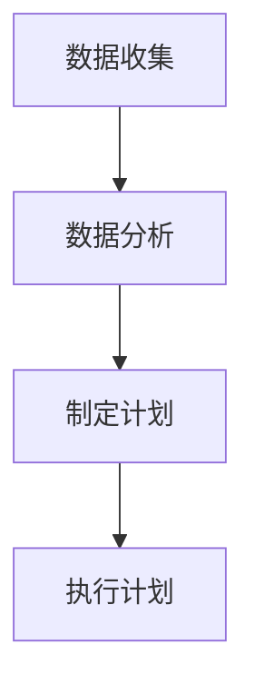
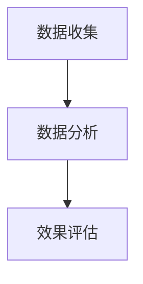
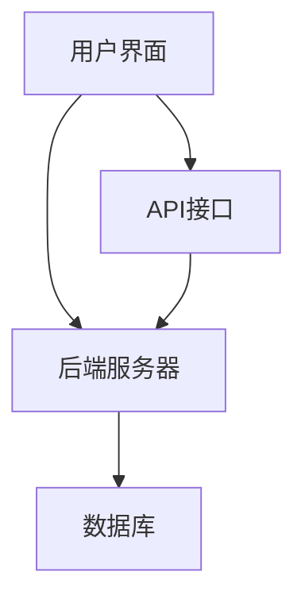
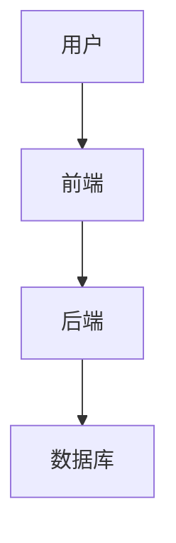

                 

### 数字断食疗法：重建健康的科技使用习惯

> 关键词：数字断食、科技使用习惯、健康、算法、系统设计、最佳实践

> 摘要：随着科技的发展，人们越来越依赖电子设备，导致身体和心理问题层出不穷。本文将介绍数字断食疗法，通过减少电子设备的使用时间，重建健康的科技使用习惯，从而改善人们的身心健康。

### 目录大纲

----------------------------------------------------------------

## 第一部分：背景介绍

### 第1章：问题背景

### 第2章：核心概念与联系

## 第二部分：核心概念原理与特征对比

### 第3章：科技使用习惯的影响

### 第4章：数字断食疗法原理与特征

## 第三部分：算法原理讲解

### 第5章：数字断食计划的制定

### 第6章：数字断食效果评估

## 第四部分：系统分析与架构设计方案

### 第7章：数字断食系统介绍

### 第8章：数字断食系统架构设计

## 第五部分：项目实战

### 第9章：环境安装与配置

### 第10章：代码应用解读与分析

## 第六部分：最佳实践与拓展阅读

### 第11章：最佳实践

### 第12章：拓展阅读

----------------------------------------------------------------

### 第一部分：背景介绍

#### 第1章：问题背景

在当今的数字化时代，科技产品已经深入到我们生活的方方面面，从手机、电脑到智能家居设备，无处不在。然而，过度的依赖和沉迷于这些科技产品，给我们的身体和心理带来了诸多负面影响。例如，长时间盯着屏幕导致视力问题、睡眠障碍，甚至可能引发焦虑和抑郁等心理疾病。

这些问题并不是个例，而是广泛存在于各个年龄层和职业群体中。长期使用电子设备不仅影响个人的身体健康，还可能影响人际关系和社会交往。因此，寻找一种有效的方法来重建健康的科技使用习惯，已经成为当务之急。

#### 1.1 问题提出

在当今数字化时代，人们过度依赖电子设备，导致身体和心理问题日益严重。

**问题描述**： 
- **身体问题**：视力下降、颈椎病、肥胖、肌肉萎缩、关节疼痛等。
- **心理问题**：焦虑、抑郁、失眠、社交障碍、精神紧张等。

**问题解决**： 
- **数字断食疗法**：通过限制电子设备使用时间，恢复身心健康。

#### 1.2 边界与外延

**边界**：本文主要针对成年人，特别是长时间使用电子设备的群体，如程序员、设计师、学生等。

**外延**：除了电子设备，本文还涉及其他科技产品如智能家居设备等。

### 第2章：核心概念与联系

#### 2.1 数字断食的概念与属性

**概念**：数字断食是指在一定时间内，减少或停止使用电子设备，以恢复身心健康。

**属性**：
- **时间长度**：根据个人情况而定，可以是数小时、数天甚至数周。
- **电子设备类型**：包括手机、电脑、平板、电视等。
- **参与人群**：适用于所有年龄段和职业群体。

#### 2.2 数字断食与科技使用习惯的关系

**关系**：科技使用习惯对身心健康的影响，数字断食如何改善这些影响。

- **影响**：
  - **身体影响**：减少视力问题、颈椎病、肥胖等。
  - **心理影响**：缓解焦虑、抑郁、失眠等。

- **改善**：
  - **身体**：增加户外活动、锻炼身体、改善睡眠质量。
  - **心理**：增加人际交往、减少精神压力、提高生活质量。

### 第二部分：核心概念原理与特征对比

#### 第3章：科技使用习惯的影响

**3.1 科技使用习惯的定义与特点**

**定义**：科技使用习惯是指人们在日常生活中，对科技产品的使用行为和习惯。

**特点**：
- **便捷性**：科技产品使生活更加便捷，例如智能手机、智能家居设备等。
- **娱乐性**：科技产品提供丰富的娱乐内容，如电影、游戏等。
- **社交性**：科技产品促进了人际交往，如社交媒体、在线聊天等。

**3.2 科技使用习惯对身心健康的影响**

**影响**：
- **身体**：
  - 视力下降：长时间盯着屏幕，容易导致眼睛疲劳、视力下降。
  - 颈椎病：长时间低头看手机或电脑，容易导致颈椎病。
  - 肥胖、肌肉萎缩：长时间坐着使用科技产品，容易导致身体活动减少，从而引发肥胖和肌肉萎缩。
  - 关节疼痛：长时间保持同一姿势，容易导致关节疼痛。

- **心理**：
  - 焦虑、抑郁：过度依赖科技产品，可能导致焦虑、抑郁等心理问题。
  - 失眠：晚上使用手机、电脑等设备，容易导致失眠。
  - 社交障碍：长时间沉迷于科技产品，可能导致人际交往减少，引发社交障碍。
  - 精神紧张：面对科技产品的各种信息，容易导致精神紧张。

#### 第4章：数字断食疗法原理与特征

**4.1 数字断食疗法的基本原理**

**原理**：数字断食疗法通过减少电子设备的使用时间，改善人们的身心健康。

**方法**：
- **限制使用时间**：设定每天或每周的使用时间，逐步减少。
- **替代活动**：用有益身心的活动替代电子设备的使用，如户外运动、阅读等。
- **心理调适**：通过冥想、放松训练等心理调适方法，缓解焦虑、抑郁等心理问题。

**4.2 数字断食疗法与科技使用习惯的对比**

| 特点 | 数字断食疗法 | 科技使用习惯 |
| --- | --- | --- |
| **时间** | 有明确的时间限制 | 无明确的时间限制 |
| **目的** | 改善身心健康 | 便利生活、娱乐、社交 |
| **活动** | 有益身心的替代活动 | 长时间使用电子设备 |
| **心理调适** | 心理调适方法 | 无明确的心理调适方法 |

**结论**：数字断食疗法是一种有益于身心健康的生活方式，可以替代过度依赖科技产品的习惯。

### 第三部分：算法原理讲解

#### 第5章：数字断食计划的制定

**5.1 算法原理**

**原理**：通过分析个人科技使用习惯，制定合适的数字断食计划。

**步骤**：
1. 数据收集：收集个人科技使用数据，包括使用时间、设备类型、使用频率等。
2. 数据分析：分析科技使用习惯，找出使用频率高、时间长的设备或活动。
3. 制定计划：根据数据分析结果，制定数字断食计划，包括时间限制、替代活动等。

**5.2 算法流程**



#### 第6章：数字断食效果评估

**6.1 算法原理**

**原理**：通过分析数字断食期间的身体和心理健康指标，评估效果。

**步骤**：
1. 数据收集：收集数字断食期间的身体和心理健康指标数据，如睡眠质量、视力、心理状态等。
2. 数据分析：分析数据，找出数字断食对身心健康的影响。
3. 效果评估：根据数据分析结果，评估数字断食的效果。

**6.2 算法流程**



### 第四部分：系统分析与架构设计方案

#### 第7章：数字断食系统介绍

**7.1 项目介绍**

**项目**：数字断食系统

**目的**：帮助用户制定和执行数字断食计划，监控和评估数字断食效果。

**功能**：
- **记录科技使用时间**：记录用户每天使用各种电子设备的时间。
- **制定数字断食计划**：根据用户习惯，制定个性化的数字断食计划。
- **跟踪数字断食效果**：监控用户在数字断食期间的身体和心理健康变化。

**7.2 系统功能设计**

**功能设计**：

| 功能 | 描述 |
| --- | --- |
| **用户注册与登录** | 用户可以通过账号密码进行注册和登录。 |
| **科技使用时间记录** | 用户可以记录每天使用各种电子设备的时间。 |
| **数字断食计划制定** | 系统根据用户习惯，制定数字断食计划。 |
| **数字断食计划执行** | 用户按照计划执行数字断食。 |
| **数字断食效果评估** | 系统监控和评估数字断食效果。 |
| **数据统计分析** | 对用户的数据进行统计分析，提供有用的参考信息。 |

**7.3 系统架构设计**

**系统架构**：



**7.4 系统接口设计**

**接口设计**：

| 接口 | 描述 |
| --- | --- |
| **用户注册** | 用户注册接口，用于接收用户注册信息。 |
| **用户登录** | 用户登录接口，用于验证用户身份。 |
| **记录科技使用时间** | 用户记录科技使用时间的接口。 |
| **制定数字断食计划** | 制定数字断食计划的接口。 |
| **执行数字断食计划** | 用户执行数字断食计划的接口。 |
| **评估数字断食效果** | 评估数字断食效果的接口。 |
| **数据统计** | 数据统计分析接口，用于获取用户数据。 |

### 第五部分：项目实战

#### 第8章：数字断食系统架构设计

**8.1 系统架构设计**

数字断食系统采用前后端分离的架构设计，前端负责展示用户界面和交互，后端负责处理业务逻辑和数据存储。

**系统架构图**：



**8.2 系统接口设计**

数字断食系统的接口设计包括用户接口和API接口。

**用户接口**：
- 用户注册接口：用于用户注册，接收用户名、密码等信息。
- 用户登录接口：用于用户登录，验证用户身份。

**API接口**：
- 记录科技使用时间接口：用于用户记录科技使用时间。
- 制定数字断食计划接口：用于系统根据用户习惯制定数字断食计划。
- 执行数字断食计划接口：用于用户执行数字断食计划。
- 评估数字断食效果接口：用于系统评估数字断食效果。

#### 第9章：环境安装与配置

**9.1 环境安装**

要搭建数字断食系统，需要安装以下软件和硬件：

- **操作系统**：Linux或Windows
- **编程语言**：Python
- **数据库**：MySQL或PostgreSQL
- **前端框架**：React或Vue
- **后端框架**：Flask或Django

**9.2 系统核心实现**

数字断食系统的核心实现包括用户注册与登录、记录科技使用时间、制定数字断食计划、执行数字断食计划和评估数字断食效果等功能。

**9.3 代码应用解读与分析**

数字断食系统的代码应用解读与分析主要包括以下几个方面：

- **用户注册与登录**：实现用户注册和登录功能，验证用户身份。
- **记录科技使用时间**：实现记录用户科技使用时间功能，提供数据统计。
- **制定数字断食计划**：根据用户习惯制定数字断食计划，提供个性化服务。
- **执行数字断食计划**：用户按照数字断食计划执行，实现目标。
- **评估数字断食效果**：根据用户数据评估数字断食效果，提供反馈。

#### 第10章：代码应用解读与分析

**10.1 代码解读**

数字断食系统的代码主要包括前端和后端的代码。

**前端代码解读**：

前端代码使用React框架，实现用户界面和交互。

```javascript
import React, { useState } from 'react';

function App() {
  const [username, setUsername] = useState('');
  const [password, setPassword] = useState('');

  const handleSubmit = (e) => {
    e.preventDefault();
    // 用户注册逻辑
  };

  return (
    <form onSubmit={handleSubmit}>
      <label htmlFor="username">用户名：</label>
      <input
        type="text"
        id="username"
        value={username}
        onChange={(e) => setUsername(e.target.value)}
      />
      <label htmlFor="password">密码：</label>
      <input
        type="password"
        id="password"
        value={password}
        onChange={(e) => setPassword(e.target.value)}
      />
      <button type="submit">注册</button>
    </form>
  );
}

export default App;
```

**后端代码解读**：

后端代码使用Flask框架，实现业务逻辑和数据存储。

```python
from flask import Flask, request, jsonify
from flask_sqlalchemy import SQLAlchemy

app = Flask(__name__)
app.config['SQLALCHEMY_DATABASE_URI'] = 'sqlite:///users.db'
db = SQLAlchemy(app)

class User(db.Model):
    id = db.Column(db.Integer, primary_key=True)
    username = db.Column(db.String(80), unique=True, nullable=False)
    password = db.Column(db.String(120), nullable=False)

@app.route('/register', methods=['POST'])
def register():
    username = request.form['username']
    password = request.form['password']
    # 注册逻辑
    return jsonify({'message': '注册成功'})

if __name__ == '__main__':
    app.run(debug=True)
```

**10.2 分析与优化**

数字断食系统的代码实现较为简单，但在实际应用中可能存在以下优化空间：

- **安全性优化**：加强用户密码的加密和验证，防止恶意攻击。
- **性能优化**：优化数据库查询和数据处理，提高系统性能。
- **用户体验优化**：优化用户界面和交互，提供更好的用户体验。

#### 第11章：最佳实践

**11.1 实践技巧**

在执行数字断食计划时，可以采取以下技巧：

- **逐步减少使用时间**：从减少每天使用电子设备的时间开始，逐步适应。
- **替代活动**：用有益身心的活动替代电子设备的使用，如阅读、户外运动等。
- **心理调适**：通过冥想、深呼吸等方法，缓解焦虑和心理压力。

**11.2 注意事项**

在执行数字断食计划时，需要注意以下事项：

- **合理设定时间**：根据个人情况，设定合适的使用时间和断食时间。
- **避免过度依赖**：数字断食不是一劳永逸的解决方案，需要长期坚持。
- **逐步调整**：数字断食计划可以根据实际情况进行调整，避免突然改变造成身体不适。

### 第12章：拓展阅读

**12.1 相关书籍**

- 《数字排毒：重建健康的科技使用习惯》
- 《科技之瘾：如何摆脱科技对生活的控制》
- 《数字生活，健康生活：数字时代的健康指南》

**12.2 相关研究**

- "Digital Detox: The Benefits of Reducing Screen Time"
- "The Effects of Digital Media on Mental Health: A Systematic Review"
- "The Impact of Digital Technology on Children's Health"

### 总结

数字断食疗法是一种通过减少电子设备使用时间，改善身心健康的有效方法。本文介绍了数字断食疗法的基本概念、原理和实施方法，并通过实际项目实战展示了数字断食系统的设计和实现。希望本文能够帮助读者了解和尝试数字断食疗法，改善自己的科技使用习惯，提升生活质量。

### 作者信息

**作者：AI天才研究院/AI Genius Institute & 禅与计算机程序设计艺术 /Zen And The Art of Computer Programming**

