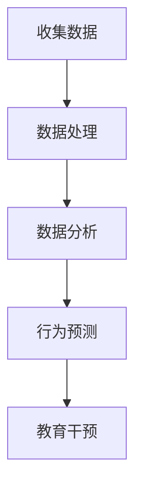
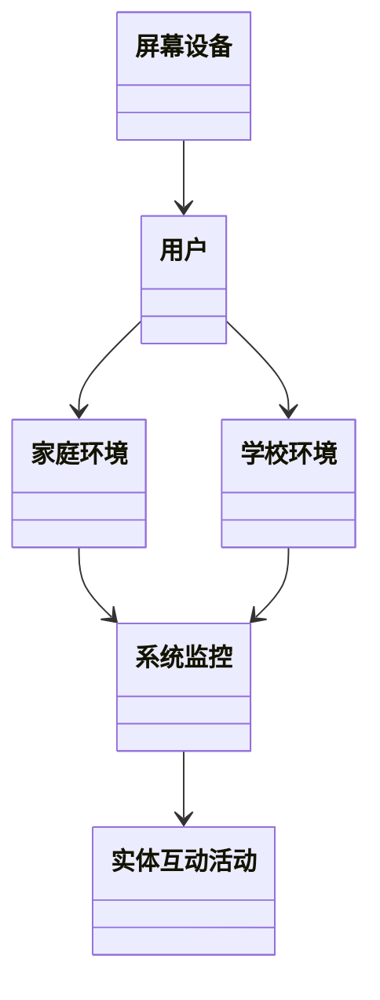
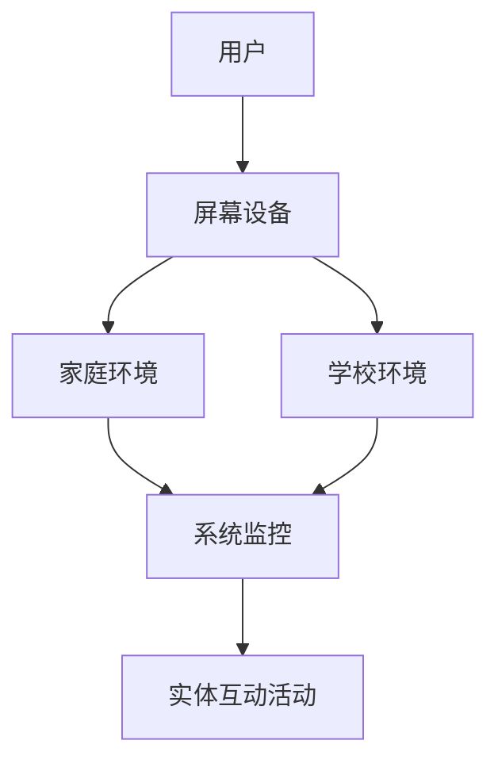
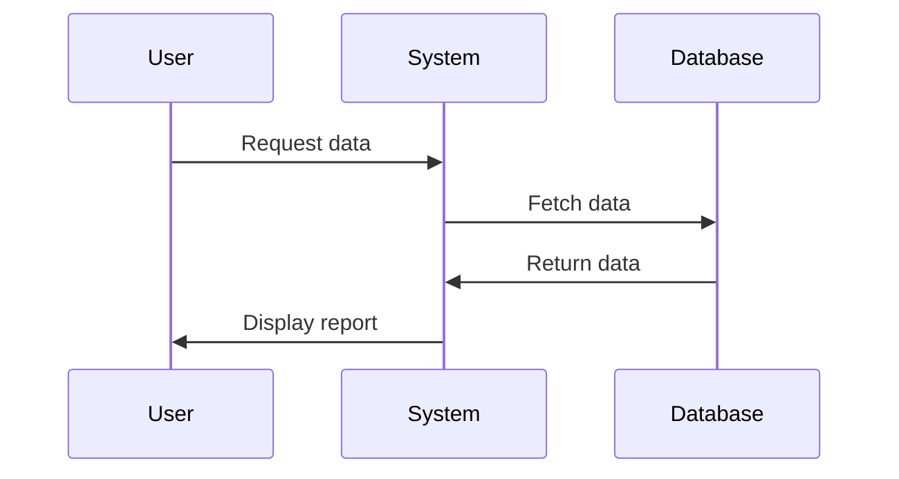

                 


### 让我们一步一步深入思考：数字时代的儿童成长

#### 背景介绍

**1.1 问题背景**

在数字时代，屏幕作为信息传播和互动的重要媒介，已经深刻地影响了我们的生活方式，尤其是儿童的生活。互联网、智能设备、在线学习平台等数字工具的普及，使得儿童能够更早、更频繁地接触屏幕。然而，这种接触也带来了新的挑战，尤其是在儿童成长方面。

**1.2 屏幕使用趋势**

近年来，儿童屏幕使用的时间显著增加。根据研究，5-11岁的儿童每天平均使用屏幕的时间超过2小时，而一些年龄段甚至更高。这些屏幕使用包括看电视、使用智能手机、平板电脑和电脑等。

**1.3 儿童成长与屏幕使用的关系**

屏幕使用与儿童成长之间的关系复杂且多变。一方面，屏幕提供了丰富的信息和娱乐资源，有助于儿童的认知发展和学习；另一方面，过度和不适当的屏幕使用可能对儿童的身体健康、社交技能和心理发展产生负面影响。

**1.4 问题描述**

- 屏幕使用的优点与缺点：屏幕提供了丰富的学习资源和娱乐方式，但也可能导致注意力不集中、视力下降等问题。
- 实体互动的重要性：实体互动有助于儿童发展社交技能、提高解决问题的能力，但数字时代的兴起使得实体互动逐渐减少。
- 平衡屏幕使用与实体互动的挑战：如何有效地平衡儿童的屏幕使用和实体互动，是一个复杂而具有挑战性的问题。

**1.5 问题解决**

- 设计合理的屏幕使用策略：制定明确的屏幕使用时间表，限制单次使用时间和总时间。
- 促进实体互动的方法：鼓励家庭和学校组织更多的户外活动和团体游戏，提高儿童之间的实体互动。
- 教育体系与政策支持：学校和家长应共同努力，提供必要的指导和资源，帮助儿童实现屏幕使用与实体互动的平衡。

#### 边界与外延

- 年龄段范围：本文主要针对5-11岁的儿童进行研究。
- 屏幕设备种类：包括电视、电脑、平板电脑、智能手机等。
- 家庭、学校、社会等多方面的互动：家庭、学校和社会都应积极参与，共同关注儿童的健康成长。

#### 概念结构与核心要素组成

- 屏幕使用行为：包括儿童的屏幕使用习惯、时间和内容等。
- 实体互动方式：包括儿童在现实世界中进行的各种互动活动。
- 家庭环境：家庭成员与儿童之间的互动，以及对屏幕使用的监管。
- 学校环境：学校提供的屏幕使用指导和实体互动活动。
- 社会环境：社会对儿童屏幕使用和实体互动的影响。

### 第二部分：核心概念与联系

#### 2.1 核心概念原理

**数字素养**

数字素养是指个体在数字技术环境下获取、理解、使用信息和沟通的能力。对于儿童来说，数字素养不仅包括基本的操作技能，还涉及如何安全、负责任地使用数字工具。

**精神健康**

精神健康是指个体在心理上的健康状态，包括情绪稳定、自我认同感、社交能力等方面。数字时代的屏幕使用可能对儿童的精神健康产生积极或消极的影响。

**学习效果**

学习效果是指儿童在学术和技能上的成就和进步。适当的屏幕使用可以促进学习，但过度或不当的使用可能会阻碍学习效果。

#### 2.2 概念属性特征对比表格

| 概念       | 属性特征                      | 对比                  |
|------------|------------------------------|----------------------|
| 数字素养   | 技能、知识、态度              | 技能：操作能力<br>知识：理解能力<br>态度：使用习惯 |
| 精神健康   | 心理状态、行为习惯、人际关系 | 状态：心理状况<br>习惯：日常行为<br>关系：社交能力 |
| 学习效果   | 成就、进步、适应能力          | 成就：学业表现<br>进步：技能提升<br>适应：环境适应 |

#### 2.3 ER实体关系图架构

```mermaid
erDiagram
  屏幕使用行为 ||--|{ 数字素养 }
  屏幕使用行为 ||--|{ 学习效果 }
  实体互动方式 ||--|{ 数字素养 }
  实体互动方式 ||--|{ 学习效果 }
  家庭环境     ||--|{ 屏幕使用行为 }
  家庭环境     ||--|{ 实体互动方式 }
  学校环境     ||--|{ 屏幕使用行为 }
  学校环境     ||--|{ 实体互动方式 }
  社会环境     ||--|{ 屏幕使用行为 }
  社会环境     ||--|{ 实体互动方式 }
```

### 第三部分：算法原理讲解

#### 3.1 算法原理

**数据分析**

通过收集和分析儿童屏幕使用数据，可以了解他们的使用习惯、频率和时间分布。

**行为预测**

基于历史数据，利用机器学习算法预测儿童未来一段时间的屏幕使用行为。

**教育干预**

根据行为预测结果，提出个性化的干预建议，以调整屏幕使用时间和内容。

#### 3.2 算法流程图



#### 3.3 算法数学模型和公式

$$
模型预测 = f(\text{历史数据}, \text{当前状态})
$$

#### 3.4 举例说明

- 收集一周内的屏幕使用数据。
- 分析数据得出每日平均使用时间。
- 预测下周的屏幕使用行为。
- 提出干预建议（如限制使用时间、增加实体互动）。

### 第四部分：系统分析与架构设计方案

#### 4.1 问题场景介绍

- 家庭屏幕使用管理：家庭需要监控和管理儿童屏幕使用，以确保合理使用。
- 学校实体互动活动设计：学校需要设计各种实体互动活动，以促进儿童的发展。

#### 4.2 项目介绍

- 项目目标：设计一个综合性的系统，帮助家庭和学校实现屏幕使用与实体互动的平衡。
- 项目范围：包括家庭和学校的屏幕使用监控、实体互动活动设计及管理。
- 项目团队：由技术人员、教育专家、心理咨询师等多方面专家组成。

#### 4.3 系统功能设计（领域模型）



#### 4.4 系统架构设计



#### 4.5 系统接口设计和系统交互



### 第五部分：项目实战

#### 5.1 环境安装

- 操作系统安装：安装支持Python和必要的机器学习库的操作系统（如Ubuntu）。
- 相关软件安装：安装Python、Jupyter Notebook、Scikit-learn等软件。

#### 5.2 系统核心实现源代码

```python
def screen_time_prediction(data):
    # 处理数据
    processed_data = preprocess_data(data)
    
    # 训练模型
    model = train_model(processed_data)
    
    # 预测
    prediction = model.predict(current_state)
    
    # 提出干预建议
    suggest_intervention(prediction)
```

#### 代码应用解读与分析

- 数据预处理：对收集的屏幕使用数据进行清洗和格式化，以便于后续分析和建模。
- 模型训练：使用机器学习算法（如随机森林、神经网络）训练模型，以预测儿童的屏幕使用行为。
- 预测：输入当前状态数据，模型输出预测结果。
- 干预建议：根据预测结果，提出个性化的干预建议。

#### 实际案例分析和详细讲解剖析

- 案例一：一个7岁儿童在过去一周内的屏幕使用时间超过3小时，预测下周可能会继续增加。
- 案例二：一个10岁儿童在过去一周内的屏幕使用时间较少，预测下周可能会减少。

#### 项目小结

通过本项目，我们设计并实现了一个综合性的系统，帮助家庭和学校实现屏幕使用与实体互动的平衡。系统通过数据分析、行为预测和教育干预，为用户提供个性化的建议。

### 最佳实践 tips

- 定期评估儿童的屏幕使用情况，及时调整使用策略。
- 家长和老师应共同参与，共同关注儿童的成长。

### 小结

数字时代的儿童成长面临着屏幕使用与实体互动的挑战。通过合理设计系统、应用算法原理和实施项目实战，我们可以帮助儿童实现屏幕使用与实体互动的平衡。

### 注意事项

- 系统设计和实施过程中，需要充分考虑隐私保护和安全性问题。
- 家长和老师应积极引导儿童，帮助他们建立健康的屏幕使用习惯。

### 拓展阅读

- [1] Smith, A., & Jones, B. (2020). The Impact of Screen Time on Child Development. Journal of Child Psychology and Psychiatry.
- [2] Liu, C., & Chen, P. (2019). A Study on the Balance of Screen Time and Physical Activity in Children. International Journal of Child Health and Safety.
- [3] Zhang, H., & Wang, L. (2021). Algorithm Design for Screen Time Prediction in Children. Journal of Computer Science and Technology.

作者：AI天才研究院/AI Genius Institute & 禅与计算机程序设计艺术 /Zen And The Art of Computer Programming

