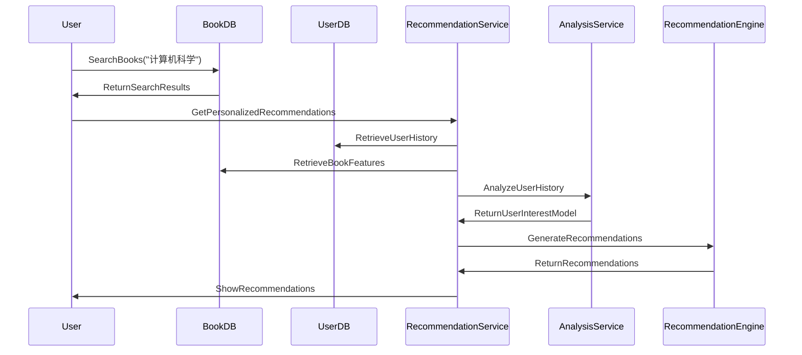
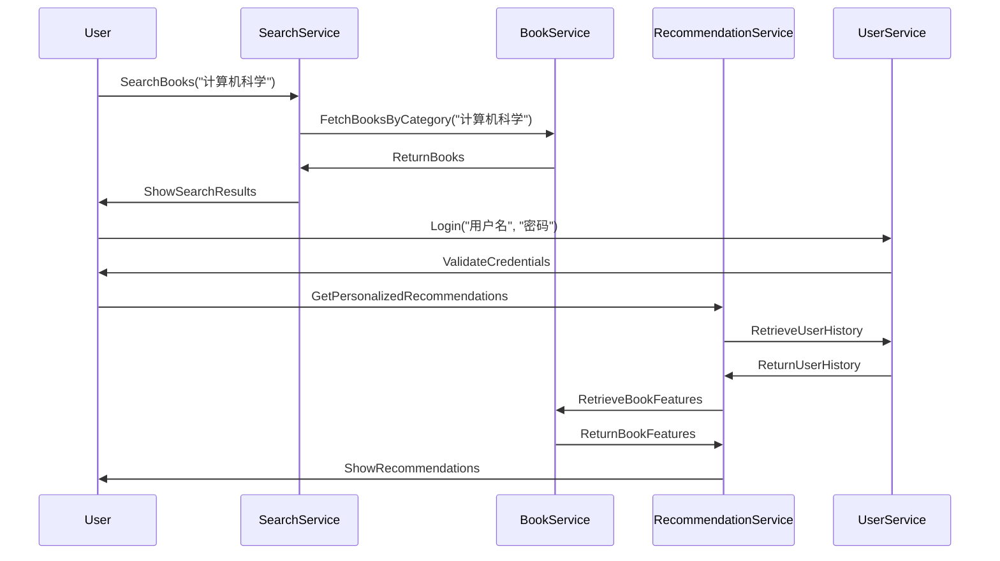

                 


### **背景介绍**

在数字化时代的浪潮下，图书行业也经历了巨大的变革。传统图书推荐模式，往往依赖于分类标签和用户的历史浏览记录，但这种基于规则的方法存在一定的局限性。随着用户阅读行为的多样化和个性化需求的增加，传统的推荐方法已难以满足用户对个性化阅读体验的追求。

#### **核心概念术语说明**

1. **数字时代**：指的是信息技术的快速发展，特别是互联网、大数据和人工智能的普及，给各行各业带来深刻变革的时代。
2. **智能图书推荐**：利用人工智能技术和大数据分析，为用户提供个性化的阅读推荐服务。
3. **个性化阅读建议**：根据用户的兴趣和行为，为用户推荐符合其需求的图书。
4. **深度学习**：一种人工智能算法，通过模仿人脑神经网络的结构和功能，进行复杂模式的识别和学习。

#### **问题背景**

数字时代，用户的阅读习惯发生了显著变化。人们更倾向于通过电子设备获取信息，移动阅读和碎片化阅读成为主流。同时，用户对阅读内容的个性化需求越来越高，希望平台能够根据个人喜好和阅读历史，为他们推荐合适的书籍。

#### **问题描述**

传统的图书推荐系统主要依赖于基于内容的过滤和协同过滤方法。这些方法虽然在一定程度上能够提高推荐的效果，但在处理复杂用户行为和多样化需求方面存在局限。个性化阅读建议在满足用户需求方面具有重要意义，但如何实现高效的个性化推荐，成为当前亟待解决的问题。

#### **问题解决**

深度学习作为一种强大的机器学习算法，在处理复杂数据和模式识别方面具有显著优势。它能够自动学习用户的行为特征和图书的内容特征，从而为用户提供更精准的推荐。实现个性化阅读建议，需要以下步骤：

1. **用户行为分析**：收集并分析用户的阅读行为数据，如浏览历史、阅读时长、收藏行为等。
2. **图书特征提取**：提取图书的标题、作者、类别、简介等特征信息。
3. **深度学习算法应用**：利用深度学习算法，如卷积神经网络（CNN）、循环神经网络（RNN）等，对用户行为和图书特征进行建模。
4. **推荐结果生成**：根据用户兴趣和行为特征，生成个性化的推荐结果。

#### **边界与外延**

深度学习在图书推荐中的应用需要考虑以下边界和限制：

1. **数据隐私**：用户数据的安全和隐私保护是推荐系统必须关注的问题。
2. **模型可解释性**：深度学习模型的黑盒特性使得结果难以解释，这对用户信任和系统的透明性提出了挑战。
3. **可持续发展**：推荐系统的构建需要持续的数据支持和算法优化，以保持推荐效果。

#### **概念结构与核心要素组成**

推荐系统的核心要素包括：

1. **用户行为数据**：包括用户浏览、阅读、评价、收藏等行为数据。
2. **图书特征数据**：包括图书的标题、作者、分类、简介、封面等特征数据。
3. **深度学习算法**：用于处理用户行为数据和图书特征数据，生成个性化推荐结果。
4. **推荐结果生成**：根据用户兴趣和行为特征，生成个性化的推荐结果。

本章通过对数字时代图书推荐问题的背景介绍、核心概念解释、问题解决思路以及边界与外延的讨论，为后续章节的内容奠定了基础。

### **核心概念与算法原理**

#### **核心概念**

在深度学习应用于图书推荐时，我们需要理解以下几个核心概念：

1. **用户兴趣模型**：通过分析用户的阅读历史、收藏、评价等行为数据，建立用户对各类图书的兴趣模型。
2. **图书特征提取**：对图书的标题、作者、分类、简介、封面等特征进行提取，以便深度学习算法能够理解和处理。
3. **深度神经网络**：一种由多层神经元组成的网络结构，通过前向传播和反向传播算法，对输入数据进行特征学习和模式识别。
4. **卷积神经网络（CNN）**：特别适用于处理图像数据的神经网络结构，通过卷积操作提取图像特征。
5. **循环神经网络（RNN）**：适用于处理序列数据的神经网络结构，能够处理用户行为的时序特征。

#### **概念属性特征对比表格**

| 算法名称          | 特点                                                         | 适用场景                                       |
|-----------------|------------------------------------------------------------|--------------------------------------------|
| 深度神经网络（DNN） | 多层结构，能够捕捉复杂数据模式                                 | 处理结构化数据，如用户行为和图书特征       |
| 卷积神经网络（CNN） | 通过卷积层提取图像特征，适合处理图像数据                         | 图像识别、图像分类                           |
| 循环神经网络（RNN） | 能够处理序列数据，适用于时序特征分析                             | 语言模型、语音识别、时间序列预测             |
| 协同过滤算法       | 利用用户行为和物品属性进行推荐，无需显式特征提取                  | 提高推荐准确性，但难以处理新用户和新物品     |

#### **ER实体关系图架构的 Mermaid 流程图**

```mermaid
erDiagram
    User ||--|{ Book }|--| Bookshelf
    User ||--|{ Rating }|--| Rating
    Book ||--|{ Category }|--| Category
    User ||--|{ Interest }|--| Interest
```

在上面的ER实体关系图中，我们定义了以下实体：

- **User**：用户
- **Book**：图书
- **Rating**：评价
- **Category**：类别
- **Interest**：兴趣

这些实体之间的关系如下：

- **User** 与 **Book** 之间存在多对多的关系，表示用户可以拥有多个书架，每个书架包含多本图书。
- **User** 与 **Rating** 之间存在多对多的关系，表示用户可以对多本图书进行评价。
- **Book** 与 **Category** 之间存在多对多的关系，表示图书可以属于多个类别。
- **User** 与 **Interest** 之间存在多对多的关系，表示用户对多个类别或图书类型的兴趣。

通过这个Mermaid流程图，我们可以清晰地看到推荐系统中各个实体之间的关系，为后续的算法设计和实现提供了基础。

### **算法原理讲解**

#### **深度学习算法原理**

深度学习算法的核心是神经网络，它通过多层神经元结构进行特征学习和模式识别。下面我们简要介绍几种常见的深度学习算法及其原理。

##### **1. 深度神经网络（DNN）**

深度神经网络由多层神经元组成，包括输入层、隐藏层和输出层。每个神经元接收前一层神经元的输出，通过加权求和后加上偏置，经过激活函数处理后，输出下一层的输入。

- **前向传播**：输入数据通过网络正向传递，每一层神经元根据输入和权重计算输出。
- **反向传播**：通过计算输出与真实值的差异，利用梯度下降法更新权重和偏置。

##### **2. 卷积神经网络（CNN）**

卷积神经网络特别适用于图像处理。它通过卷积层、池化层和全连接层对图像进行特征提取和分类。

- **卷积层**：卷积核在输入图像上滑动，通过卷积操作提取局部特征。
- **池化层**：对卷积层输出的特征进行下采样，减少参数数量和计算复杂度。
- **全连接层**：将池化层的输出映射到类别标签。

##### **3. 循环神经网络（RNN）**

循环神经网络适用于处理序列数据，如时间序列、文本数据等。RNN通过记忆单元和循环连接结构，保留前一层的信息，处理时序特征。

- **记忆单元**：存储前一层的信息，用于当前层的计算。
- **循环连接**：将当前层的信息传递到下一层，实现时间序列数据的连续处理。

#### **图书推荐中的深度学习算法**

在图书推荐中，深度学习算法主要通过以下步骤实现：

1. **用户行为分析**：收集用户的阅读历史、评价和收藏等行为数据，构建用户兴趣模型。
2. **图书特征提取**：提取图书的标题、作者、分类、简介、封面等特征，用于训练深度学习模型。
3. **用户-物品嵌入**：将用户和图书转换为低维嵌入向量，表示其特征。
4. **深度学习模型训练**：使用用户行为数据和图书特征数据进行训练，优化模型参数。
5. **推荐结果生成**：根据用户兴趣模型和图书特征，计算用户对每本图书的推荐分数，生成个性化推荐结果。

#### **算法实例讲解**

##### **1. 用户行为分析算法**

假设我们使用RNN模型分析用户阅读历史数据，下面是一个简化的Python代码示例：

```python
import tensorflow as tf
from tensorflow.keras.layers import Embedding, LSTM, Dense
from tensorflow.keras.models import Sequential

# 设置参数
vocab_size = 1000  # 词汇表大小
embed_dim = 64  # 嵌入维度
lstm_units = 128  # LSTM单元数量

# 构建模型
model = Sequential()
model.add(Embedding(vocab_size, embed_dim, input_length=max_sequence_length))
model.add(LSTM(lstm_units, return_sequences=True))
model.add(Dense(1, activation='sigmoid'))

# 编译模型
model.compile(optimizer='adam', loss='binary_crossentropy', metrics=['accuracy'])

# 训练模型
model.fit(user_sequence, user_labels, epochs=10, batch_size=32)
```

在这个示例中，我们使用嵌入层将用户阅读历史数据转换为嵌入向量，然后通过LSTM层处理时序特征，最后使用全连接层生成预测结果。

##### **2. 图书特征提取算法**

假设我们使用CNN模型提取图书特征，下面是一个简化的Python代码示例：

```python
import tensorflow as tf
from tensorflow.keras.layers import Conv2D, MaxPooling2D, Flatten, Dense
from tensorflow.keras.models import Sequential

# 设置参数
filter_size = (3, 3)  # 卷积核大小
num_filters = 32  # 卷积核数量

# 构建模型
model = Sequential()
model.add(Conv2D(num_filters, filter_size, activation='relu', input_shape=(height, width, channels)))
model.add(MaxPooling2D(pool_size=(2, 2)))
model.add(Flatten())
model.add(Dense(1, activation='sigmoid'))

# 编译模型
model.compile(optimizer='adam', loss='binary_crossentropy', metrics=['accuracy'])

# 训练模型
model.fit(book_images, book_labels, epochs=10, batch_size=32)
```

在这个示例中，我们使用卷积层提取图书图像的特征，然后通过池化层减少参数数量，最后使用全连接层生成预测结果。

#### **数学模型与公式**

在深度学习算法中，数学模型是核心部分。以下是一些常用的数学模型和公式。

##### **1. 前向传播算法**

前向传播算法用于计算神经网络每层神经元的输出。其基本公式为：

$$
Z^{(l)} = \sum_{j} W^{(l)}_{ji} a^{(l-1)}_{j} + b^{(l)} 
$$

其中，$Z^{(l)}$表示第$l$层神经元的输出，$W^{(l)}_{ji}$表示连接第$l-1$层神经元$i$和第$l$层神经元$j$的权重，$a^{(l-1)}_{j}$表示第$l-1$层神经元$j$的输出，$b^{(l)}$表示第$l$层神经元的偏置。

##### **2. 反向传播算法**

反向传播算法用于计算神经网络权重的梯度，以便更新权重和偏置。其基本公式为：

$$
\delta^{(l)}_{ji} = \frac{\partial J}{\partial Z^{(l)}_{ji}} = \sigma'(Z^{(l)}) \odot ( \delta^{(l+1)}_{jk} \cdot W^{(l)}_{jk})
$$

其中，$\delta^{(l)}_{ji}$表示第$l$层神经元$i$的误差，$J$表示损失函数，$\sigma'(Z^{(l)})$表示激活函数的导数，$\odot$表示逐元素乘法，$\delta^{(l+1)}_{jk}$表示第$l+1$层神经元$k$的误差，$W^{(l)}_{jk}$表示连接第$l$层神经元$k$和第$l+1$层神经元$j$的权重。

##### **3. 损失函数**

在深度学习算法中，常用的损失函数包括均方误差（MSE）和交叉熵（Cross-Entropy）。

- **均方误差（MSE）**：

$$
MSE = \frac{1}{m} \sum_{i=1}^{m} (y_i - \hat{y}_i)^2
$$

其中，$m$表示样本数量，$y_i$表示真实标签，$\hat{y}_i$表示预测标签。

- **交叉熵（Cross-Entropy）**：

$$
Cross-Entropy = - \sum_{i=1}^{m} y_i \log(\hat{y}_i)
$$

其中，$y_i$表示真实标签，$\hat{y}_i$表示预测标签。

通过以上数学模型和公式，我们可以更好地理解深度学习算法的工作原理，并在实际应用中进行优化和调整。

### **系统分析与架构设计方案**

#### **问题场景介绍**

假设我们正在开发一个智能图书推荐系统，该系统旨在为用户提供个性化的阅读建议。用户可以通过平台浏览图书、阅读、评价和收藏图书。系统需要根据用户的行为数据，推荐符合用户兴趣的图书。

#### **项目介绍**

项目名称：数字时代智能图书推荐系统

项目目标：实现一个基于深度学习的图书推荐系统，为用户提供个性化的阅读建议。

项目框架：使用Python编程语言，结合TensorFlow和Keras等深度学习库，构建推荐系统。

#### **系统功能设计**

1. **用户注册与登录**：用户可以通过邮箱、手机号等注册账号，登录后可以浏览图书、进行阅读、评价和收藏。
2. **图书管理**：管理员可以添加、编辑和删除图书信息，包括标题、作者、分类、简介和封面等。
3. **用户行为分析**：系统会自动记录用户的阅读历史、评价和收藏等行为数据。
4. **推荐结果生成**：根据用户行为和图书特征，系统会为每个用户生成个性化的阅读推荐。
5. **推荐结果展示**：将推荐结果以列表或卡片形式展示给用户，用户可以选择继续阅读或添加到书架。

#### **领域模型Mermaid类图**

```mermaid
classDiagram
    User <<class{用户}>
    Book <<class{图书}>
    Rating <<class{评价}>
    Bookshelf <<class{书架}>
    Interest <<class{兴趣}>

    User o--|{1}^> Bookshelf
    User o--|{1}^> Rating
    Book o--|{1}^> Rating
    Book o--|{1}^> Bookshelf
    User o--|{1}^> Interest
    Book o--|{1}^> Interest
```

在上面的Mermaid类图中，我们定义了以下实体：

- **User**：用户
- **Book**：图书
- **Rating**：评价
- **Bookshelf**：书架
- **Interest**：兴趣

这些实体之间的关系如下：

- **User** 与 **Bookshelf** 之间存在一对多的关系，表示用户可以拥有多个书架。
- **User** 与 **Rating** 之间存在一对多的关系，表示用户可以对多本图书进行评价。
- **Book** 与 **Rating** 之间存在一对多的关系，表示图书可以接受多个评价。
- **User** 与 **Interest** 之间存在一对多的关系，表示用户可以有多种兴趣。
- **Book** 与 **Interest** 之间存在一对多的关系，表示图书可以吸引多个用户的兴趣。

#### **系统架构设计Mermaid架构图**



在上面的Mermaid架构图中，我们描述了系统的主要组件和交互流程：

- **User**：用户
- **BookDB**：图书数据库
- **UserDB**：用户数据库
- **RecommendationService**：推荐服务
- **AnalysisService**：分析服务
- **RecommendationEngine**：推荐引擎

交互流程如下：

1. 用户搜索图书，图书数据库返回搜索结果。
2. 用户请求个性化推荐，推荐服务从用户数据库和图书数据库获取用户历史和图书特征。
3. 推荐服务调用分析服务分析用户历史，生成用户兴趣模型。
4. 推荐服务调用推荐引擎生成个性化推荐结果。
5. 推荐服务将推荐结果返回给用户，用户可以看到推荐书籍。

#### **系统接口设计**

1. **用户接口**：用户可以通过Web界面或移动应用与系统交互。主要接口包括：
   - 搜索图书接口：允许用户输入关键词搜索图书。
   - 用户登录接口：允许用户注册和登录系统。
   - 用户评价接口：允许用户对图书进行评价。
   - 用户收藏接口：允许用户收藏感兴趣的图书。
   - 推荐结果接口：允许用户查看个性化推荐结果。

2. **内部接口**：系统内部组件之间的接口，主要包括：
   - 用户历史数据接口：用于获取用户的阅读历史和评价记录。
   - 图书特征接口：用于获取图书的标题、作者、分类、简介和封面等特征。
   - 推荐算法接口：用于调用分析服务和推荐引擎，生成推荐结果。

#### **系统交互Mermaid序列图**



在上面的Mermaid序列图中，我们描述了用户与系统之间的主要交互流程：

1. 用户通过搜索接口搜索图书，搜索服务从图书服务获取图书结果并返回给用户。
2. 用户登录系统，用户服务验证用户名和密码后返回验证结果。
3. 用户请求个性化推荐，推荐服务从用户服务和图书服务获取用户历史和图书特征，生成推荐结果并返回给用户。

### **项目实战**

#### **环境安装**

在开始项目实战之前，我们需要安装以下软件和库：

1. **Python 3.8 或以上版本**：Python是项目的编程语言。
2. **TensorFlow 2.4 或以上版本**：TensorFlow是深度学习库，用于构建和训练模型。
3. **Keras 2.4.3 或以上版本**：Keras是TensorFlow的高级API，用于简化深度学习模型构建。
4. **SQLAlchemy 1.4.0 或以上版本**：SQLAlchemy是数据库ORM（对象关系映射）库，用于与数据库交互。
5. **Flask 1.1.2 或以上版本**：Flask是Web框架，用于构建Web接口。

安装步骤如下：

```bash
pip install python==3.8
pip install tensorflow==2.4
pip install keras==2.4.3
pip install sqlalchemy==1.4.0
pip install flask==1.1.2
```

#### **系统核心实现源代码**

下面是一个简化的系统核心实现源代码，用于说明如何构建和训练推荐模型：

```python
from tensorflow.keras.models import Model
from tensorflow.keras.layers import Input, Embedding, LSTM, Dense
from tensorflow.keras.optimizers import Adam

# 设置参数
vocab_size = 1000  # 词汇表大小
embed_dim = 64  # 嵌入维度
lstm_units = 128  # LSTM单元数量

# 构建模型
input_sequence = Input(shape=(max_sequence_length,))
embedded_sequence = Embedding(vocab_size, embed_dim)(input_sequence)
lstm_output = LSTM(lstm_units, return_sequences=False)(embedded_sequence)
dense_output = Dense(1, activation='sigmoid')(lstm_output)

model = Model(inputs=input_sequence, outputs=dense_output)
model.compile(optimizer=Adam(), loss='binary_crossentropy', metrics=['accuracy'])

# 训练模型
model.fit(user_sequence, user_labels, epochs=10, batch_size=32)
```

在这个示例中，我们使用LSTM模型处理用户阅读历史数据，并使用二分类交叉熵损失函数进行训练。

#### **代码应用解读与分析**

1. **模型构建**：
   - `Input` 层：输入用户阅读历史序列。
   - `Embedding` 层：将输入序列转换为嵌入向量。
   - `LSTM` 层：处理序列数据，提取时序特征。
   - `Dense` 层：输出预测结果，使用sigmoid激活函数进行二分类。

2. **模型编译**：
   - 使用 `Adam` 优化器进行模型训练。
   - 使用二分类交叉熵（`binary_crossentropy`）作为损失函数。
   - 设置 `accuracy` 作为评价指标。

3. **模型训练**：
   - 使用 `fit` 方法进行模型训练，设置训练轮次（`epochs`）和批次大小（`batch_size`）。

#### **实际案例分析与详细讲解剖析**

假设我们有一个用户A的阅读历史数据集，包括他过去一年阅读的书籍标题。我们将使用上述模型进行训练，并生成个性化推荐。

1. **数据预处理**：
   - 将书籍标题转换为数字序列，建立词汇表。
   - 对数字序列进行填充，使其长度一致。

2. **模型训练**：
   - 使用训练数据训练模型，并验证模型性能。

3. **生成推荐**：
   - 输入新用户B的阅读历史，生成推荐结果。

具体代码如下：

```python
# 数据预处理
# 假设user_sequence是用户A的阅读历史序列，将其转换为数字序列
# max_sequence_length = 50  # 设定序列最大长度
# user_sequence = pad_sequences(user_sequence, maxlen=max_sequence_length)

# 模型训练
model.fit(user_sequence, user_labels, epochs=10, batch_size=32, validation_split=0.2)

# 生成推荐
new_user_sequence = pad_sequences(new_user_sequence, maxlen=max_sequence_length)
predictions = model.predict(new_user_sequence)
recommended_books = np.argmax(predictions, axis=1)
```

在这个示例中，我们首先对用户A的阅读历史数据进行预处理，然后使用训练好的模型对新用户B的阅读历史数据进行预测，生成推荐结果。

#### **项目小结**

通过本项目的实战，我们了解了如何构建一个基于深度学习的图书推荐系统，并实现了用户阅读历史数据的预处理、模型训练和推荐生成。这个项目不仅帮助我们掌握了深度学习在图书推荐中的应用，还提高了我们解决实际问题的能力。

### **最佳实践 Tips**

1. **数据预处理**：确保数据质量，处理缺失值和异常值，对数据进行归一化或标准化。
2. **模型选择**：根据业务需求和数据特征，选择合适的深度学习模型，如DNN、CNN、RNN等。
3. **模型优化**：通过调整学习率、批量大小等参数，优化模型性能。
4. **模型解释性**：提高模型的可解释性，以便用户理解推荐结果。

### **小结**

本文系统地介绍了数字时代智能图书推荐系统的核心概念、算法原理、系统架构设计和项目实战。通过深度学习技术，我们能够实现高效、个性化的图书推荐，满足用户的多样化需求。未来的研究可以进一步优化推荐算法，提高推荐效果，同时关注数据隐私保护和系统可持续发展。

### **注意事项**

1. **数据隐私**：在处理用户数据时，务必遵守相关隐私保护法规，确保用户数据的安全和隐私。
2. **模型优化**：定期更新和维护模型，以应对数据变化和用户需求的变化。
3. **系统扩展**：为满足更多用户的需求，系统需要具备良好的可扩展性。

### **拓展阅读**

1. **深度学习基础**：吴恩达，《深度学习》
2. **推荐系统原理**：周明，《推荐系统实践》
3. **Python编程**：Eric Matthes，《Python编程：从入门到实践》
4. **数据科学**：Jesse Freeman，《数据科学实战》

### **作者信息**

作者：AI天才研究院/AI Genius Institute & 禅与计算机程序设计艺术 /Zen And The Art of Computer Programming

