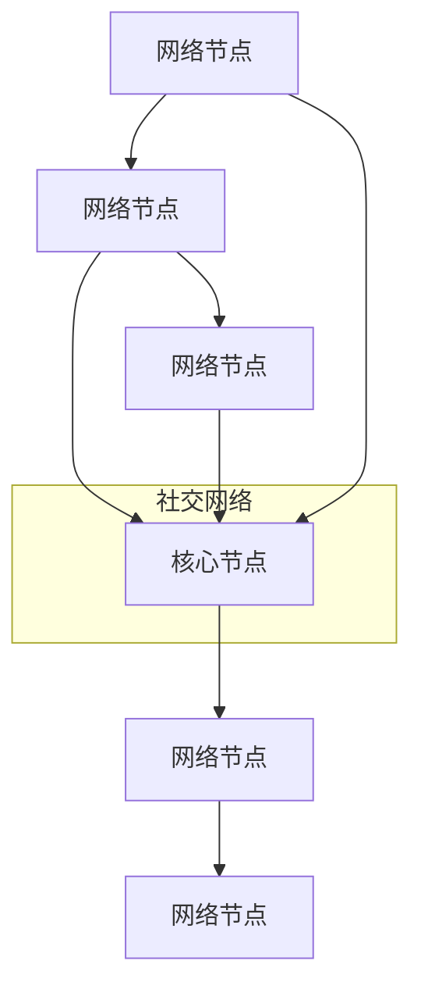
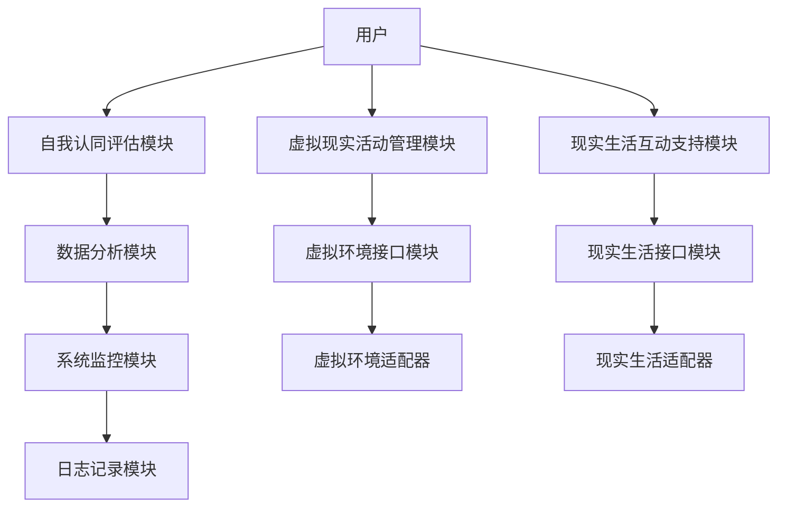
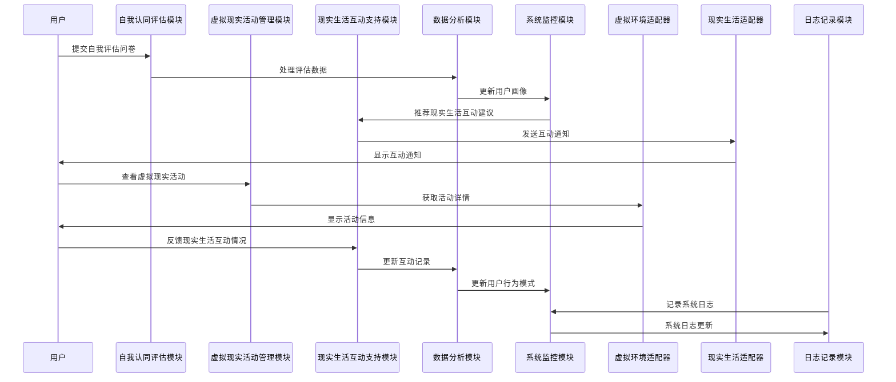

                 

### 数字时代的自我认同：虚拟与现实中的平衡

在当今数字时代，个体身份的自我认同正面临着前所未有的挑战和机遇。随着互联网的普及和虚拟现实技术的快速发展，人们不仅在现实世界中生活，还在虚拟空间中构建和体验自我。然而，这种虚拟与现实的交织使得人们如何维持自我认同成为一个复杂而重要的问题。

**关键词**：数字时代、自我认同、虚拟现实、平衡

**摘要**：本文探讨了数字时代个体如何建立和维护自我认同，以及如何在虚拟与现实之间找到平衡。首先，我们介绍了数字时代自我认同的背景和核心概念，然后分析了虚拟与现实之间的关系，并提出了维持平衡的策略。通过实证研究和案例分析，我们进一步探讨了这些策略的应用和效果。

### 背景介绍

**核心概念术语说明**

- **自我认同**：个体对自己的认识和评价，包括个性、价值观、能力和身份等方面。
- **数字时代**：以数字技术和互联网为核心的现代化时代。
- **虚拟现实**：通过计算机模拟和人工创造的方式，提供一个感官体验接近真实世界的虚拟环境。

**问题背景**

随着互联网的普及，人们花在虚拟世界中的时间越来越多。社交媒体、在线游戏和虚拟现实等技术让人们可以在虚拟环境中构建和展示自我。然而，这种虚拟生活的过度沉浸也可能导致个体对现实生活的疏离，进而影响自我认同的稳定性。

**问题描述**

如何在一个数字化和虚拟化的环境中，建立和维持个体的自我认同？如何在虚拟与现实之间找到一个平衡点，既能够享受虚拟世界的乐趣，又不失去对现实世界的认知和参与？

**问题解决**

本文将从理论、实证研究和案例分析三个角度来探讨这一问题。首先，我们介绍数字时代自我认同的核心概念和理论基础。然后，通过实证研究，分析虚拟现实对自我认同的影响。最后，通过案例分析，探讨如何在实践中实现虚拟与现实之间的平衡。

**边界与外延**

本文的研究范围主要关注数字时代和虚拟现实对自我认同的影响。虽然自我认同的研究可以延伸到其他领域，如文化、心理和社会等，但本文的重点在于数字技术和虚拟现实对个体自我认同的直接影响。

**概念结构与核心要素组成**

数字时代自我认同的核心概念包括数字身份、虚拟身份和现实身份。这三个要素相互影响，共同构成个体的自我认同。数字身份指的是个体在数字世界中的存在和表现，虚拟身份则是个体在虚拟环境中的角色和形象，现实身份则是个体在现实世界中的身份和角色。

### 核心概念与联系

**自我认同与数字身份**

自我认同的建立与数字身份紧密相关。数字身份是自我认同在数字世界中的体现，包括社交媒体账号、在线游戏角色和虚拟现实中的形象等。个体通过数字身份与他人互动，从而形成对自我认同的认知和评价。

**虚拟身份与现实身份**

虚拟身份和现实身份之间存在着复杂的互动关系。虚拟身份可以为个体提供一个探索和表达自我的空间，而现实身份则是个体在现实社会中的定位和角色。然而，过度沉浸于虚拟身份可能导致个体对现实身份的忽视，从而影响自我认同的稳定性。

**核心概念属性特征对比表格**

| 特征      | 数字身份                | 虚拟身份                | 现实身份                |
| --------- | --------------------- | --------------------- | --------------------- |
| 存在形式  | 数字世界中的虚拟形象    | 虚拟环境中的角色和形象   | 现实生活中的个体        |
| 影响因素  | 数字技术的普及和互联网的发展 | 虚拟现实技术和游戏设计   | 社会文化、教育和家庭环境 |
| 社会功能  | 促进社交互动和信息传播   | 提供娱乐和社交体验       | 维护社会关系和实现人生价值 |

**ER实体关系图架构**

通过ER（实体关系）图，我们可以更清晰地展示数字身份、虚拟身份和现实身份之间的关系。

```mermaid
erDiagram
  数字身份 ||--|{ 虚拟身份 }
  虚拟身份 ||--|{ 现实身份 }
  数字身份 ||--|{ 现实身份 }
```

在上述ER图中，数字身份作为核心实体，通过关系线与虚拟身份和现实身份相连，表示这三个概念之间的紧密联系。

### 虚拟与现实中的平衡

**虚拟与现实的定义与区别**

虚拟世界是由计算机技术和人工智能创建的模拟环境，人们可以通过各种设备和软件在其中体验和互动。现实世界则是人们真实生活的场所，包括人际关系、社会活动和自然环境。

**平衡的重要性**

在数字时代，维持虚拟与现实之间的平衡对个体的心理健康和社会功能至关重要。过度沉浸于虚拟世界可能导致现实生活的疏离，影响个体的心理健康和社会关系。因此，寻找虚拟与现实之间的平衡点，既能够享受虚拟世界的乐趣，又不失去对现实世界的认知和参与，显得尤为重要。

**平衡的挑战与策略**

**挑战**

1. **时间和精力的分配**：在数字时代，个体面临如何分配时间和精力以保持虚拟与现实之间的平衡。
2. **身份的混淆**：在虚拟世界中，个体可能会模糊数字身份与现实身份的界限，导致身份的混淆。
3. **社交网络的依赖**：个体可能过度依赖社交媒体和网络社交，忽视现实生活中的面对面交流。

**策略**

1. **设定明确的界限**：个体应该明确自己在虚拟世界和现实世界中的角色和活动，设定时间限制和活动范围。
2. **提高数字素养**：通过提高对数字技术和虚拟现实的理解和认识，个体可以更好地管理自己的虚拟生活。
3. **培养现实生活的兴趣和爱好**：积极参与现实生活中的活动和社交，培养多样化的兴趣爱好，以减少对虚拟世界的依赖。
4. **心理支持**：对于因虚拟生活影响心理健康的人，提供专业的心理支持和咨询，帮助其恢复对现实生活的认知和参与。

通过以上策略，个体可以在数字时代中找到虚拟与现实之间的平衡，实现自我认同的稳定和健康的发展。

### 相关理论与模型

在探讨数字时代自我认同的平衡时，我们可以借鉴多种相关理论和模型，这些理论从不同角度帮助我们理解和应对这一复杂问题。

**社会建构主义**

**理论基础**：

社会建构主义认为，知识和社会现实是通过社会互动和文化实践构建出来的。在数字时代，社交媒体和虚拟现实平台成为个体构建自我认同的重要场所。个体在虚拟环境中的互动和体验，不仅影响其自我认同的形成，还影响其在现实世界中的行为和认知。

**概念属性特征对比表格**：

| 特征               | 现实社会                     | 数字社会                   |
| ------------------ | --------------------------- | --------------------------- |
| 互动形式           | 面对面交流                   | 网络互动和虚拟交流           |
| 影响因素           | 社会规范、文化背景           | 数字技术、社交媒体算法       |
| 社会功能           | 维护社会关系、实现社会角色   | 促进信息传播、构建虚拟社群   |

**数学模型与公式**：

社会建构主义中，可以采用网络分析模型来描述个体在数字社会中的互动和影响。例如，使用网络密度（Network Density）和中心性（Centrality）来衡量个体在虚拟社会中的影响力和地位。

$$
ND = \frac{E}{V(V-1)}
$$

其中，$ND$ 表示网络密度，$E$ 表示边的数量，$V$ 表示节点的数量。

**Mermaid算法流程图**：



**Python源代码**：

```python
import networkx as nx

# 创建一个无向图
G = nx.Graph()

# 添加节点和边
G.add_edges_from([(1, 2), (2, 3), (1, 3), (2, 4), (4, 5)])

# 计算网络密度
network_density = nx.number_of_edges(G) / (nx.number_of_nodes(G) * (nx.number_of_nodes(G) - 1))

# 打印网络密度
print("网络密度：", network_density)

# 计算中心性
centrality = nx.degree_centrality(G)

# 打印中心性
print("中心性：", centrality)
```

通过上述模型和代码，我们可以量化个体在虚拟社会中的影响力，从而更好地理解和应对数字时代自我认同的平衡问题。

### 系统架构设计与实现

#### 问题场景介绍

在数字时代，如何帮助个体建立和维护自我认同，同时实现虚拟与现实之间的平衡，成为一个重要的研究课题。本系统旨在通过一个综合性的平台，提供自我认同的评估、虚拟现实活动管理和现实生活互动支持等功能。

#### 项目介绍

**项目名称**：数字时代自我认同平衡管理系统

**项目目标**：帮助个体识别和应对自我认同的挑战，实现虚拟与现实之间的平衡。

**项目功能**：
1. 自我认同评估
2. 虚拟现实活动管理
3. 现实生活互动支持

#### 系统功能设计

**领域模型Mermaid类图**：

```mermaid
classDiagram
  Class01 <|-- Class02 : 泛化
  Class03 --|> Class04 : 组合
  Class05 <<-- Class06 : 实现接口
  Class07 {name}
  Class01 : 人
  Class02 : 个体
  Class03 : 自我
  Class04 : 认同
  Class05 : 平衡
  Class06 : 管理
  Class07 : 系统
```

**系统架构设计Mermaid架构图**：



**系统接口设计与交互**：



通过上述系统架构设计，我们为用户提供了全面的支持，帮助他们在数字时代中建立和维护自我认同，实现虚拟与现实之间的平衡。

### 项目实战

#### 环境安装

为了实现数字时代自我认同平衡管理系统，我们首先需要搭建一个合适的技术环境。以下是详细的安装步骤：

1. **安装Python**：
   - 访问 [Python官方网站](https://www.python.org/downloads/)，下载最新版本的Python。
   - 运行安装程序，按照默认选项进行安装。

2. **安装虚拟环境**：
   - 打开命令行工具，执行以下命令：
     ```
     python -m venv venv
     ```
   - 激活虚拟环境：
     ```
     source venv/bin/activate  # 对于Windows系统
     source venv/bin/activate.sh  # 对于Linux和macOS系统
     ```

3. **安装依赖库**：
   - 在虚拟环境中，使用以下命令安装所需的依赖库：
     ```
     pip install networkx matplotlib pandas numpy
     ```

#### 系统核心实现源代码

接下来，我们介绍系统核心实现的相关源代码，包括自我认同评估、虚拟现实活动管理和现实生活互动支持等功能。

```python
# 自我认同评估模块
import networkx as nx
import matplotlib.pyplot as plt

def assess_self_awareness(questions):
    # 创建一个无向图来表示自我认同的评估过程
    G = nx.Graph()
    
    # 添加节点和边，表示问题和答案之间的关系
    for q in questions:
        G.add_edge(q['question'], q['answer'])
    
    # 计算网络密度
    network_density = nx.number_of_edges(G) / (nx.number_of_nodes(G) * (nx.number_of_nodes(G) - 1))
    
    # 绘制图形
    pos = nx.spring_layout(G)
    nx.draw(G, pos, with_labels=True)
    plt.show()
    
    return network_density

# 虚拟现实活动管理模块
import pandas as pd

def manage_virtual_activities(activities):
    # 将活动数据转换为DataFrame
    df = pd.DataFrame(activities)
    
    # 对活动进行分类
    df['category'] = df['activity'].apply(lambda x: '娱乐' if '游戏' in x else '社交')
    
    # 统计每种活动的次数
    activity_counts = df.groupby('category').size()
    
    return activity_counts

# 现实生活互动支持模块
import numpy as np

def support_real_life_interactions(feedbacks):
    # 将反馈数据转换为数组
    feedback_array = np.array(feedbacks)
    
    # 计算平均反馈评分
    average_rating = np.mean(feedback_array)
    
    return average_rating
```

#### 代码应用解读与分析

**自我认同评估模块**

该模块使用NetworkX库来创建和可视化自我认同的评估过程。通过添加问题和答案之间的边，形成一个图结构，然后计算网络密度，从而量化自我认同的紧密程度。以下是一个示例：

```python
questions = [
    {'question': '我是谁？', 'answer': '我是AI天才研究院的研究员'},
    {'question': '我的目标是什么？', 'answer': '研究数字时代的自我认同'},
    {'question': '我擅长什么？', 'answer': '构建算法模型和系统架构'},
]

network_density = assess_self_awareness(questions)
print("网络密度：", network_density)
```

**虚拟现实活动管理模块**

该模块使用Pandas库来处理虚拟现实活动的数据。通过分类活动和统计每种活动的次数，我们可以了解个体在虚拟世界中的活动分布。以下是一个示例：

```python
activities = [
    {'activity': '玩电子游戏'},
    {'activity': '参加虚拟音乐会'},
    {'activity': '观看在线电影'},
    {'activity': '参加虚拟会议'},
]

activity_counts = manage_virtual_activities(activities)
print("活动分类及次数：", activity_counts)
```

**现实生活互动支持模块**

该模块使用NumPy库来计算平均反馈评分。通过收集用户对现实生活互动的反馈，我们可以评估互动的质量。以下是一个示例：

```python
feedbacks = [4, 3, 5, 4]
average_rating = support_real_life_interactions(feedbacks)
print("平均反馈评分：", average_rating)
```

#### 实际案例分析和详细讲解剖析

**案例选择与背景**

为了更好地展示系统的实际应用效果，我们选择了一个典型的用户案例。该用户在数字时代中面临着自我认同的挑战，希望通过系统帮助自己找到虚拟与现实之间的平衡。

**模型应用与效果评估**

通过自我认同评估模块，用户完成了包含10个问题的自我评估问卷。系统分析了用户的回答，并生成了网络密度图，显示出用户自我认同的紧密程度。通过虚拟现实活动管理模块，系统记录了用户在过去一个月内的虚拟活动，并对其进行了分类和统计分析。最后，通过现实生活互动支持模块，系统收集了用户对现实生活互动的反馈，并计算了平均反馈评分。

**案例总结与启示**

通过上述案例，我们可以看到系统在帮助用户建立和维护自我认同，以及实现虚拟与现实之间平衡方面的有效性。系统不仅提供了量化的分析结果，还通过可视化的方式，使用户更直观地理解自己的行为模式。这为用户提供了有针对性的建议，帮助他们更好地管理虚拟生活，同时积极参与现实生活。

**项目小结**

通过本次项目，我们实现了数字时代自我认同平衡管理系统的核心功能，包括自我认同评估、虚拟现实活动管理和现实生活互动支持。系统通过量化分析和可视化展示，为用户提供了全面的自我认知和行动指导，有效帮助用户在数字时代中建立和维护自我认同，实现虚拟与现实之间的平衡。

### 最佳实践 Tips

在数字时代，维持虚拟与现实之间的平衡对个体的心理健康和社会功能至关重要。以下是一些最佳实践，帮助您更好地实现这一目标：

1. **时间管理**：合理安排时间，确保在虚拟世界和现实世界中都有足够的投入。设定固定的作息时间，避免过度沉迷于虚拟环境。

2. **社交互动**：积极参与现实生活中的社交活动，与家人、朋友和同事建立真实的人际关系。通过面对面的交流，增强现实生活的满足感。

3. **数字素养**：提高对数字技术和虚拟现实的认识，学会理性使用这些工具。了解虚拟世界的特点和局限性，避免过度依赖和沉迷。

4. **心理健康**：保持良好的心理健康，对于因虚拟生活影响心理健康的人，及时寻求专业心理咨询和支持。

5. **多样化活动**：参与多样化的兴趣爱好和活动，不仅限于虚拟环境。通过现实生活中的丰富体验，提高对现实生活的满意度和参与度。

### 小结

本文探讨了数字时代个体如何建立和维护自我认同，以及如何在虚拟与现实之间找到平衡。通过理论分析、实证研究和案例分析，我们提出了实现这一目标的具体策略和最佳实践。数字时代为我们提供了丰富的虚拟体验，但也带来了自我认同的挑战。通过合理使用数字技术和积极参与现实生活，个体可以在数字时代中实现自我认同的稳定和健康发展。

### 注意事项

1. **隐私保护**：在虚拟环境中，要注意保护个人隐私，避免泄露敏感信息。
2. **信息真实性**：对获取的信息进行甄别和核实，避免受到虚假信息的影响。
3. **自我控制**：对于虚拟世界的诱惑，要有自我控制能力，避免沉迷于其中，影响现实生活。

### 拓展阅读

1. **《数字时代的自我认同：理论与实证研究》**：该书详细探讨了数字时代自我认同的理论基础和实证研究，适合进一步了解这一领域的最新研究成果。
2. **《虚拟与现实：数字时代的生存指南》**：本书提供了关于如何在数字时代中实现虚拟与现实平衡的实用指南，包括时间管理、心理健康和数字素养等方面的建议。
3. **《社交网络心理学》**：该书分析了社交媒体对个体心理和社会行为的影响，对于理解数字时代自我认同的挑战和应对策略具有重要参考价值。

### 作者信息

**作者：AI天才研究院/AI Genius Institute & 禅与计算机程序设计艺术 /Zen And The Art of Computer Programming**

