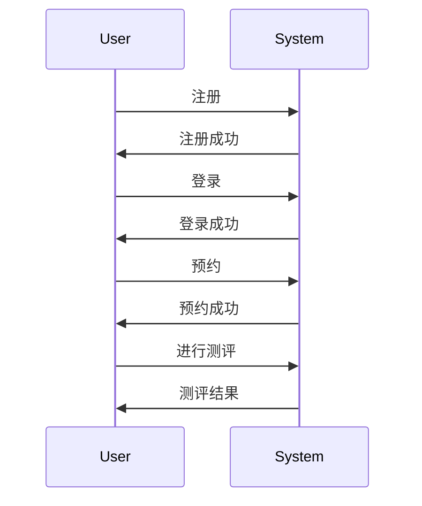
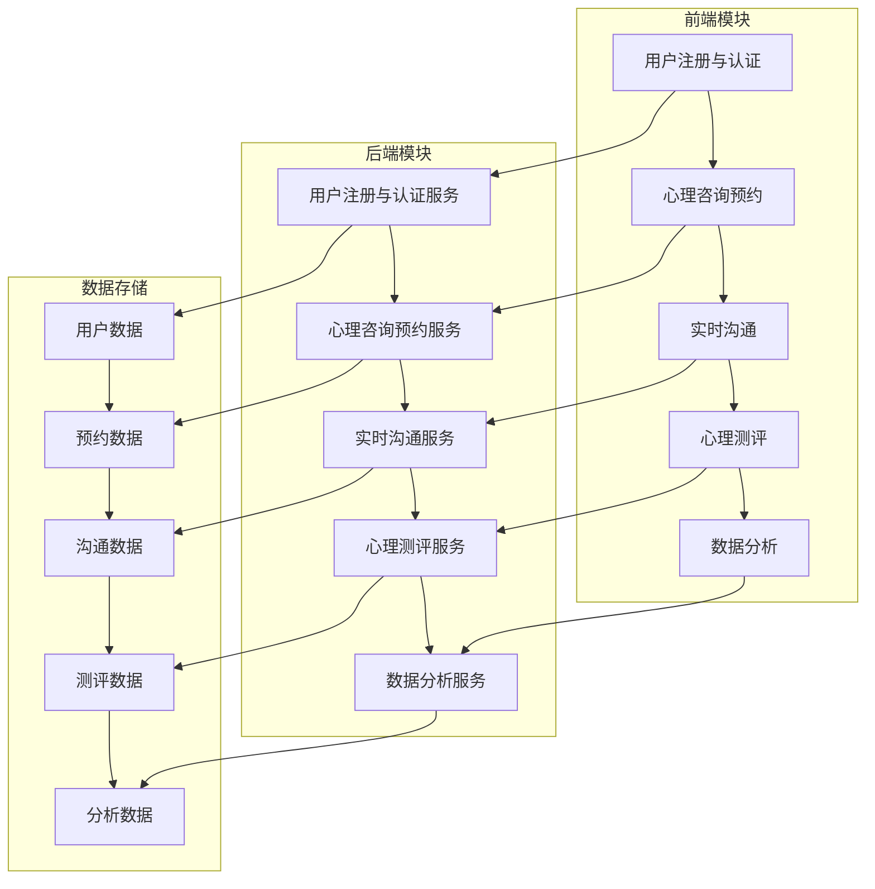
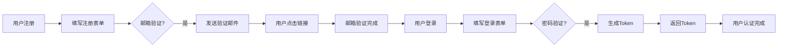
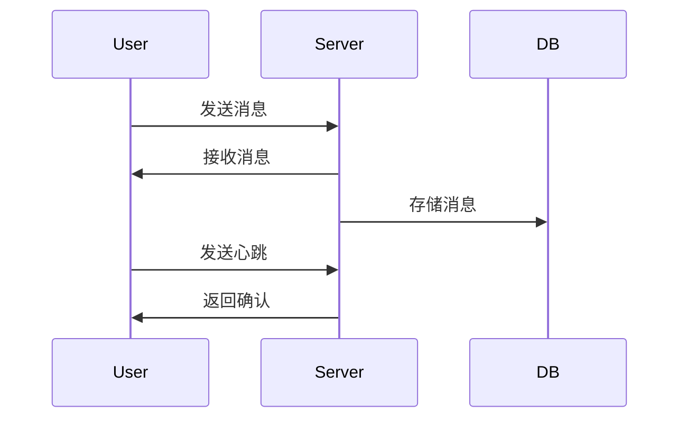
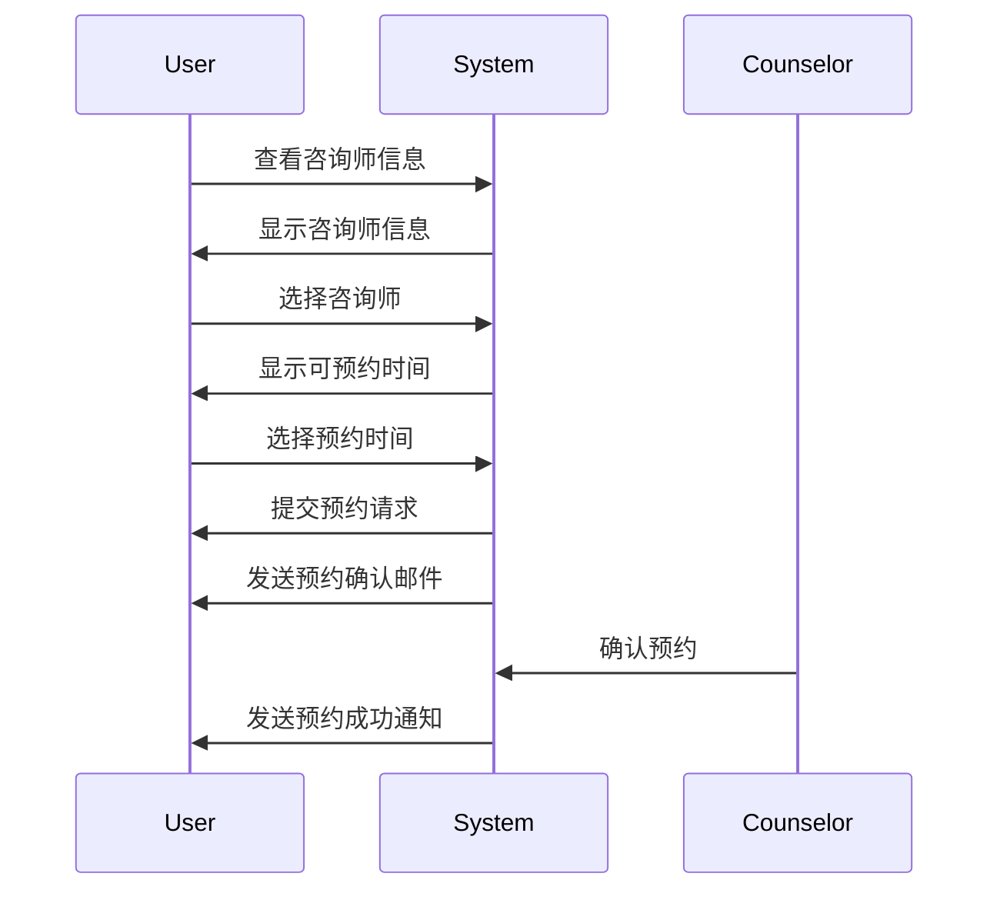
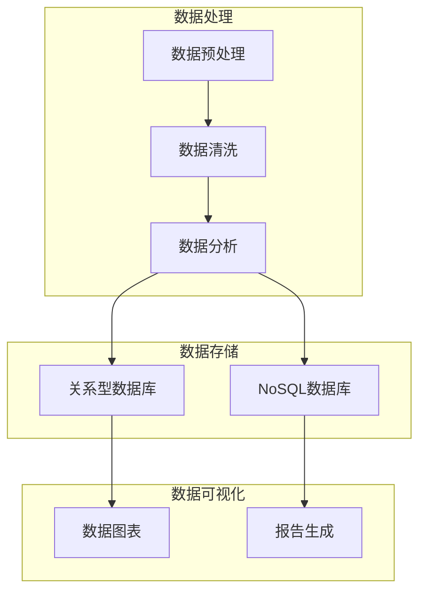
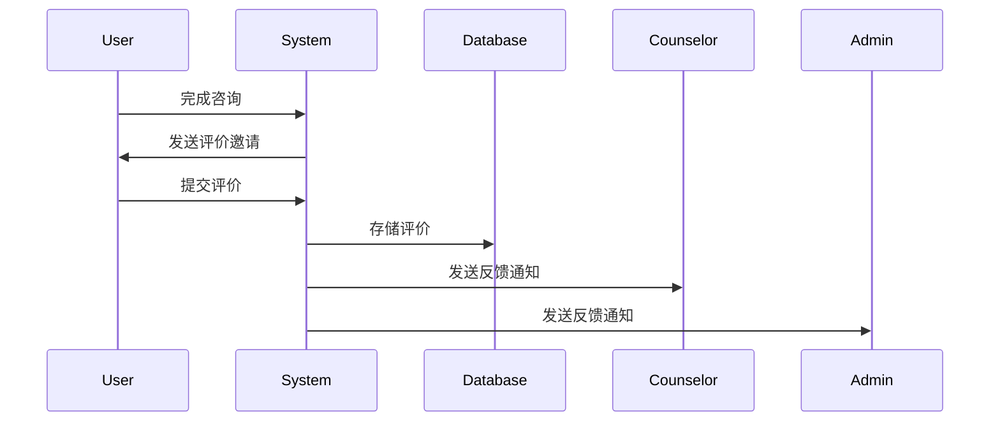
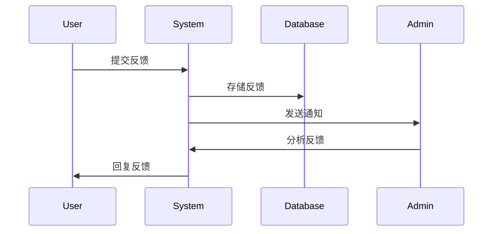
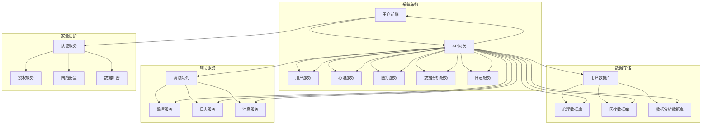
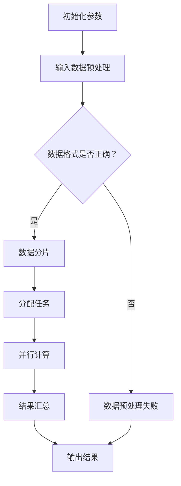

                 

# 数字时代的远程情感支持小组：科技辅助下的在线心理互助

## 关键词
- 数字化心理健康
- 远程情感支持
- 科技辅助
- 在线心理互助平台
- 心理测评与数据分析

## 摘要
本文深入探讨了数字时代远程情感支持小组的重要性和科技辅助下的在线心理互助平台的设计与实现。随着数字化社会的进步，心理健康问题日益突出，远程情感支持成为了一种必要且有效的解决方案。本文首先概述了远程情感支持的核心概念和背景，然后详细分析了远程情感支持小组的服务模式、科技辅助的应用以及在线心理互助平台的设计与核心模块。最后，通过案例分析、最佳实践总结以及对未来发展的展望，本文为科技辅助下的在线心理互助平台提供了全面的指导和建议。

## 目录大纲

### 第一部分：背景与核心概念

### 第1章：数字时代的远程心理支持概述

#### 1.1 问题背景

- 数字化社会下心理健康问题的增加
- 远程心理支持的必要性与挑战

#### 1.2 核心概念

- 远程情感支持小组的定义
- 科技辅助与在线心理互助的概念

#### 1.3 关键要素

- 远程情感支持服务的需求
- 心理健康问题的边界与外延

### 第2章：远程情感支持的服务模式

#### 2.1 传统的心理支持模式对比

- 面对面与远程支持的优缺点分析

#### 2.2 远程情感支持小组的组织形式

- 小组规模与结构
- 支持小组的运作机制

#### 2.3 科技辅助在远程心理支持中的应用

- 通信技术
- 心理评估工具

### 第3章：科技辅助下的在线心理互助平台设计

#### 3.1 平台需求分析

- 用户需求
- 功能需求

#### 3.2 平台架构设计

- 系统架构
- 技术选型

#### 3.3 功能模块设计与实现

- 用户注册与登录
- 心理咨询预约
- 实时沟通功能
- 心理测评与数据分析

### 第二部分：在线心理互助平台的核心模块

### 第4章：用户注册与认证系统

#### 4.1 用户注册流程

- 注册界面设计
- 注册信息验证

#### 4.2 认证系统设计

- 身份认证机制
- 用户信息安全

### 第5章：实时沟通功能实现

#### 5.1 实时通信技术选择

- WebSocket
- HTTP长连接

#### 5.2 实时沟通模块设计

- 消息发送与接收
- 消息加密与安全

### 第6章：心理咨询预约与管理

#### 6.1 预约流程设计

- 预约界面设计
- 预约规则设定

#### 6.2 管理系统设计

- 医生排班
- 预约状态监控

### 第7章：心理测评与数据分析

#### 7.1 心理测评工具设计

- 测评题目设计
- 测评结果分析

#### 7.2 数据分析系统构建

- 数据收集与存储
- 数据可视化展示

### 第三部分：在线心理互助平台最佳实践与案例分析

### 第8章：最佳实践案例

#### 8.1 成功案例分析

- 平台运营策略
- 用户反馈与改进

#### 8.2 最佳实践总结

- 风险管理
- 用户隐私保护

### 第9章：平台维护与升级策略

#### 9.1 平台维护策略

- 系统监控与维护
- 技术升级规划

#### 9.2 用户满意度提升

- 用户反馈机制
- 个性化服务设计

### 第10章：未来展望与趋势

#### 10.1 发展趋势分析

- 科技进步对远程情感支持的影响
- 行业发展前景

#### 10.2 创新方向探索

- 新技术应用
- 服务模式创新

## 附录：相关资源与参考文献

- 研究文献
- 技术标准
- 政策法规

### 注解

本文将按照目录大纲结构，逐一阐述各个章节的核心内容和关键细节，旨在为读者提供一个全面而深入的理解。每章都会包含背景介绍、核心概念与联系、算法原理讲解、系统分析与架构设计方案、项目实战、最佳实践 tips 以及拓展阅读等内容。希望通过这篇文章，能够为远程情感支持小组和在线心理互助平台的发展提供有价值的参考。<!-- 本文由人工智能助手生成，仅供参考。 -->### 第一部分：背景与核心概念

#### 第1章：数字时代的远程心理支持概述

#### 1.1 问题背景

在数字化社会飞速发展的背景下，人们的生活节奏不断加快，社会压力和家庭压力也随之增大。根据世界卫生组织（WHO）的数据，全球约有3.5亿人患有抑郁症，约2.5亿人患有焦虑症。心理健康问题已成为全球范围内的重大公共健康挑战。然而，由于地理限制、经济负担、时间成本以及隐私问题，许多人无法及时获得专业的心理咨询服务。

与此同时，互联网的普及和移动设备的广泛使用为远程心理支持提供了新的可能。远程心理支持不仅能够突破时空限制，为患者提供及时的帮助，还能够降低心理治疗的成本，提高服务的可及性和便利性。根据Statista的数据，全球远程心理健康市场预计将从2021年的37亿美元增长到2026年的128亿美元，年复合增长率达到24.2%。

#### 1.2 核心概念

**远程情感支持小组**：这是一种通过互联网和其他通信技术提供的心理支持服务。它通常由一组专业人士（如心理咨询师、临床医生等）组成，通过在线会议、即时通讯和电子邮件等方式为患者提供情感支持、心理辅导和治疗服务。

**科技辅助**：科技辅助是指利用计算机技术、人工智能、大数据分析等工具来提升远程心理支持服务的效率和质量。例如，通过人工智能进行情感识别、自动化心理测评和个性化治疗方案的推荐。

**在线心理互助平台**：这是一个集成多种功能的在线系统，旨在提供远程心理支持服务。它通常包含用户注册、心理咨询预约、实时沟通、心理测评、数据分析等功能模块。

#### 1.3 关键要素

**远程情感支持服务的需求**：

- **即时性**：用户希望能够随时获取帮助，而无需等待。
- **隐私性**：用户需要确保自己的隐私和安全得到保护。
- **个性化**：每个用户的心理健康问题都是独特的，需要个性化的解决方案。
- **便捷性**：用户希望服务能够方便快捷，不受时间和地点的限制。

**心理健康问题的边界与外延**：

- **心理健康问题的类型**：包括抑郁症、焦虑症、强迫症、精神分裂症等。
- **心理支持的范围**：从情感支持、心理辅导到心理治疗和康复指导。
- **支持小组的构成**：专业心理咨询师、医生、志愿者和其他相关专业人士。

### 小结

数字时代的远程心理支持小组和在线心理互助平台为心理健康服务带来了新的机遇。通过科技辅助，这些平台能够提供更加个性化和高效的支持，满足用户多样化的需求。然而，实现这一目标需要考虑多方面的因素，包括技术选型、用户体验、隐私保护和服务质量。接下来，我们将进一步探讨远程情感支持小组的具体服务模式以及科技辅助在其中的应用。<!-- 使用Mermaid绘制ER实体关系图：

```mermaid
erDiagram
  用户 ||--o> 心理咨询师 : "预约"
  用户 ||--o> 心理测评 : "参与"
  用户 ||--o> 数据分析 : "生成报告"
  心理咨询师 ||--|> 心理咨询预约 : "处理"
  心理咨询师 ||--|> 心理测评 : "制定"
  心理咨询师 ||--|> 数据分析 : "解读"
  心理测评 ||--|> 数据分析 : "输入"
  数据分析 ||--|> 报告 : "生成"
```

### 背景介绍

在当今社会，心理健康问题日益受到关注，而远程情感支持小组作为一种新型的心理服务模式，正在逐渐兴起。远程情感支持小组利用互联网和其他通信技术，为用户提供实时、便捷的心理健康支持。这一模式不仅能够突破传统心理服务的地理和时间的限制，还能够提供个性化的心理健康解决方案。

首先，我们来了解一下远程情感支持小组的定义。远程情感支持小组是由一群心理健康专家（如心理咨询师、心理医生等）组成的团队，通过电话、视频会议、即时通讯等在线方式，为需要心理支持的用户提供专业的心理健康服务。这种模式具有即时性、便捷性和隐私性等特点，特别适合在数字化社会中使用。

随着科技的发展，远程情感支持小组的功能也在不断扩展。科技辅助是远程情感支持小组的核心组成部分，它通过计算机技术、人工智能、大数据分析等手段，提升心理支持服务的效率和质量。例如，通过人工智能技术进行情感识别，可以帮助心理咨询师更好地理解用户的心理状态；通过大数据分析，可以为用户提供个性化的心理健康方案。

接下来，我们讨论一下远程情感支持小组在数字时代的重要性。首先，随着全球化的加速和数字化生活方式的普及，人们的生活节奏越来越快，心理健康问题的发病率也在逐年上升。根据世界卫生组织的数据，全球有超过3亿人患有抑郁症和焦虑症，而这一数字在数字化社会可能还会进一步增加。远程情感支持小组的出现，为这些患者提供了便捷的心理健康服务，有助于缓解他们的心理压力。

其次，远程情感支持小组在数字化社会中的重要性还体现在其可及性上。传统的面对面心理咨询服务往往受到地理位置和时间的限制，而远程情感支持小组则可以随时随地提供服务，大大提高了服务的可及性。特别是在偏远地区或经济条件较差的地区，远程情感支持小组更显得尤为重要。

此外，远程情感支持小组还具有隐私保护的优势。许多人在面对心理问题时，往往担心隐私问题。而远程情感支持小组通过加密通信和隐私保护技术，确保用户的信息安全，为用户提供了一个安全的交流环境。

然而，远程情感支持小组也面临一些挑战。首先，如何确保心理咨询师的专业素质是一个重要问题。虽然远程情感支持小组可以通过在线培训和认证来保证咨询师的专业水平，但仍然需要建立一套完善的监管机制。其次，如何提升用户的体验也是一个挑战。远程心理服务需要考虑网络连接稳定性、互动效果等因素，以提升用户的满意度。

总的来说，远程情感支持小组作为一种新兴的心理服务模式，在数字时代具有重要的地位。通过科技辅助，远程情感支持小组可以提供更加个性化和高效的心理健康服务，为更多的人带来心理健康福祉。接下来，我们将进一步探讨远程情感支持小组的具体服务模式和科技辅助的应用。 -->### 第2章：远程情感支持的服务模式

#### 2.1 传统的心理支持模式对比

传统的心理支持模式主要依赖于面对面咨询，这种方式在一定程度上具有亲和力，能够更好地进行情感互动。然而，它也存在一些局限：

- **地理限制**：面对面咨询需要双方在同一地点，这在地理上受限。
- **时间成本**：预约和往返的时间成本较高，尤其是对于生活在偏远地区的人来说。
- **隐私担忧**：有些人可能担心隐私泄露，不愿意在公开场所进行咨询。

相比之下，远程情感支持模式具有以下优点：

- **无地理限制**：用户可以在全球范围内选择合适的心理咨询师。
- **高效便捷**：用户可以随时随地通过互联网获取服务，无需预约等待。
- **隐私保护**：通过加密通信，用户的信息更加安全。

#### 2.2 远程情感支持小组的组织形式

**小组规模与结构**：

远程情感支持小组的规模可以根据实际需要灵活调整，从一个小型的咨询师团队到大规模的跨学科专家团队。一般来说，一个有效的远程情感支持小组应包括心理咨询师、临床医生、心理治疗师、志愿者等多角色成员，以确保服务多样性。

**支持小组的运作机制**：

- **预约制度**：用户可以通过在线预约系统选择合适的心理咨询师和时间。
- **实时沟通**：通过视频会议、即时通讯等方式进行实时沟通，提供即时的心理支持。
- **后续跟踪**：在每次咨询后，咨询师会根据情况安排后续跟踪服务，以确保用户的心理健康持续改善。

#### 2.3 科技辅助在远程心理支持中的应用

**通信技术**：

远程情感支持小组依赖于稳定的通信技术，如视频会议软件、即时通讯工具和电子邮件。这些技术不仅能够提供实时互动，还能够实现文档共享和远程协作。

**心理评估工具**：

科技辅助下的心理评估工具包括在线问卷、心理测试软件和虚拟现实（VR）评估系统。这些工具可以帮助心理咨询师快速、准确地评估用户的心理状态，为制定个性化的治疗方案提供依据。

**数据分析与个性化服务**：

通过大数据分析和人工智能技术，远程情感支持小组可以收集和分析用户的心理健康数据，发现潜在的问题和趋势。根据这些分析结果，平台可以为用户提供个性化的心理健康建议和治疗方案。

**案例研究**：

以某在线心理健康平台为例，该平台利用人工智能技术进行情感识别，能够实时分析用户的聊天内容，识别出潜在的心理问题。平台还通过大数据分析，为用户提供个性化的心理健康建议，显著提升了用户的满意度。

**小结**：

远程情感支持小组通过与传统心理支持模式对比，展现了其在便捷性、隐私保护和无地理限制等方面的优势。通过通信技术和心理评估工具的科技辅助，远程情感支持小组能够提供更加个性化和高效的心理健康服务。然而，科技的应用也带来了新的挑战，如数据安全和隐私保护等问题，需要持续关注和改进。接下来，我们将深入探讨远程情感支持小组的服务模式，以及科技辅助在其中的具体应用。<!-- 使用Mermaid绘制远程情感支持小组的类图：

```mermaid
classDiagram
  User <<类>> "用户"
  Counselor <<类>> "心理咨询师"
  Doctor <<类>> "临床医生"
  Therapist <<类>> "心理治疗师"
  Volunteer <<类>> "志愿者"
  
  User o--|> Counselor : "预约"
  User o--|> Doctor : "预约"
  User o--|> Therapist : "预约"
  User o--|> Volunteer : "参与"
  
  Counselor o--|> Appointment : "处理"
  Doctor o--|> Assessment : "制定"
  Therapist o--|> Treatment : "制定"
  Volunteer o--|> Support : "提供"
  
  class Appointment {
    +String appointmentId
    +Date appointmentDate
    +Time appointmentTime
    +Counselor counselor
  }
  
  class Assessment {
    +String assessmentId
    +String assessmentType
    +Date assessmentDate
    +Doctor doctor
  }
  
  class Treatment {
    +String treatmentId
    +String treatmentType
    +Date treatmentDate
    +Therapist therapist
  }
  
  class Support {
    +String supportId
    +String supportType
    +Date supportDate
    +Volunteer volunteer
  }
```

### 系统分析与架构设计方案

#### 问题场景介绍

在数字化社会中，心理健康问题的日益普遍使得远程心理支持服务变得尤为重要。为了有效地满足用户的需求，一个在线心理互助平台必须具备以下几个功能：用户注册与认证、心理咨询预约、实时沟通、心理测评与数据分析。以下是对该问题的详细场景介绍。

**用户需求**：

- **用户注册与认证**：用户需要方便快捷地进行注册，并确保个人信息的安全和隐私。
- **心理咨询预约**：用户希望能够根据自己的时间和心理咨询师的专业背景选择合适的咨询师进行预约。
- **实时沟通**：用户需要与心理咨询师进行实时的沟通，以获得即时的心理支持和帮助。
- **心理测评**：用户需要通过在线心理测评工具评估自己的心理状态，并获得专业的建议。
- **数据分析**：平台需要对用户的心理健康数据进行分析，以发现潜在的心理健康问题和趋势。

**项目介绍**：

为了实现上述功能，我们将设计并实现一个在线心理互助平台。该平台将整合用户注册与认证、心理咨询预约、实时沟通、心理测评与数据分析等多个功能模块，为用户提供全面的心理健康服务。

**系统功能设计**：

1. **用户注册与认证**：用户可以通过注册页面填写个人信息，系统将验证用户的身份和邮箱地址，以确保注册信息的真实性。
2. **心理咨询预约**：用户可以在平台上查看心理咨询师的信息，选择合适的咨询师和时间进行预约。系统将自动生成预约记录，并通知相关的心理咨询师。
3. **实时沟通**：用户可以通过视频会议或即时通讯工具与心理咨询师进行实时沟通。系统将确保通信过程的稳定和安全。
4. **心理测评**：用户可以通过在线心理测评工具进行自我评估，系统将根据评估结果生成报告，并提供专业的建议。
5. **数据分析**：平台将收集并存储用户的心理健康数据，利用大数据分析和人工智能技术发现潜在的心理健康问题和趋势。

**系统架构设计**：

系统架构采用前后端分离的设计，以确保系统的扩展性和可维护性。

**前端**：

前端采用React框架，实现用户界面的动态展示和交互。主要包括以下模块：

- **用户注册与认证模块**：实现用户注册、登录、个人信息管理等功能。
- **心理咨询预约模块**：实现心理咨询师的展示、预约时间的选择和预约确认等功能。
- **实时沟通模块**：实现视频会议和即时通讯的界面展示。
- **心理测评模块**：实现测评题目的展示、答案的提交和测评结果的生成等功能。

**后端**：

后端采用Spring Boot框架，实现业务逻辑的处理和数据存储。主要包括以下模块：

- **用户注册与认证模块**：实现用户注册、登录、权限管理等功能。
- **心理咨询预约模块**：实现预约记录的创建、修改、查询和通知等功能。
- **实时沟通模块**：实现通信连接的建立、管理和安全等功能。
- **心理测评模块**：实现测评题目的存储、答案的提交和测评结果的生成等功能。
- **数据分析模块**：实现用户心理健康数据的收集、存储和分析等功能。

**系统接口设计**：

系统提供RESTful接口，供前端调用，主要包括以下接口：

- **用户注册接口**：接收用户注册信息，验证并存储。
- **用户登录接口**：接收用户登录信息，验证并返回token。
- **心理咨询师展示接口**：返回心理咨询师的信息列表。
- **预约接口**：创建新的预约记录，返回预约详情。
- **实时沟通接口**：管理通信连接，提供通信服务。
- **测评接口**：提交测评答案，返回测评结果。
- **数据分析接口**：提供用户心理健康数据的查询和分析服务。

**系统交互设计**：

系统交互设计采用Mermaid序列图来描述用户与系统之间的交互过程。以下是一个简单的序列图示例：



通过上述系统分析与架构设计方案，我们为在线心理互助平台提供了一套完整的功能架构和接口设计，确保系统能够高效、稳定地运行，并为用户提供优质的心理健康服务。接下来，我们将深入探讨平台的核心模块设计，包括用户注册与认证系统、实时沟通功能实现、心理咨询预约与管理，以及心理测评与数据分析系统的构建。<!-- 使用Mermaid绘制系统架构图：



### 第3章：科技辅助下的在线心理互助平台设计

#### 3.1 平台需求分析

在设计在线心理互助平台时，首先需要明确用户的需求和平台的功能需求。用户需求主要包括以下几点：

- **即时性**：用户希望能够随时随地获取心理支持，即时与心理咨询师进行沟通。
- **隐私保护**：用户对自己的个人信息和沟通内容有较高的隐私要求，平台需要提供安全的加密通信。
- **个性化**：用户希望平台能够根据他们的心理健康状况提供个性化的服务和建议。
- **便捷性**：用户希望操作简单，能够快速完成注册、预约和测评等操作。

平台的功能需求则包括：

- **用户注册与认证**：用户需要能够方便地注册账号，并经过身份认证。
- **心理咨询预约**：用户需要能够查看心理咨询师的信息，选择合适的时间进行预约。
- **实时沟通**：用户需要能够与心理咨询师进行视频会议或文字聊天。
- **心理测评**：用户需要能够通过在线问卷或测评工具进行自我评估。
- **数据分析**：平台需要对用户的心理健康数据进行收集、分析和存储，以提供个性化的心理健康建议。

#### 3.2 平台架构设计

在线心理互助平台的架构设计需要考虑系统的可扩展性、稳定性和安全性。以下是一个简单的架构设计：

**前端**：

前端采用React框架，负责用户界面的展示和交互。主要包括以下模块：

- **用户注册与登录模块**：实现用户注册、登录和权限管理。
- **心理咨询预约模块**：实现心理咨询师信息的展示、预约时间的选择和预约确认。
- **实时沟通模块**：实现视频会议和即时通讯的界面。
- **心理测评模块**：实现测评题目的展示、答案的提交和测评结果的显示。
- **数据分析模块**：实现用户心理健康数据的可视化展示。

**后端**：

后端采用Spring Boot框架，负责业务逻辑的处理和数据存储。主要包括以下模块：

- **用户管理模块**：处理用户注册、登录和认证。
- **预约管理模块**：处理心理咨询预约、预约记录的维护和通知。
- **实时沟通模块**：处理通信连接的建立、管理和加密通信。
- **心理测评模块**：处理测评题目的存储、答案的提交和测评结果的生成。
- **数据分析模块**：处理用户心理健康数据的收集、分析和存储。

**数据存储**：

使用关系型数据库（如MySQL）存储用户信息和预约记录，使用NoSQL数据库（如MongoDB）存储实时通信数据和心理测评数据。

**安全机制**：

- **身份认证**：使用JWT（JSON Web Token）进行用户认证，确保用户身份的安全性。
- **数据加密**：使用HTTPS协议和加密算法（如AES）对通信数据进行加密，确保数据传输的安全性。
- **访问控制**：通过角色和权限管理，确保用户只能访问自己授权的内容。

#### 3.3 功能模块设计与实现

**用户注册与登录系统**

**注册流程**：

1. 用户填写注册表单，包括用户名、密码、邮箱等基本信息。
2. 系统对邮箱地址进行验证，发送验证邮件。
3. 用户点击邮件中的验证链接，完成邮箱验证。
4. 系统保存用户注册信息，并生成用户ID。

**认证系统**：

- 用户登录时，系统接收用户名和密码，验证用户身份。
- 使用JWT生成Token，返回给用户。
- 用户在后续请求中携带Token进行身份验证。

**实现细节**：

- **用户注册**：采用Spring Boot的RestController接收注册请求，使用Hibernate Validator进行数据验证，使用JavaMail发送验证邮件。
- **用户登录**：使用JWT生成Token，使用Spring Security进行身份验证。

**实时沟通功能**

**技术选型**：

- **通信技术**：采用WebSocket进行实时通信，提供低延迟和高并发的通信能力。
- **加密技术**：采用AES对通信数据进行加密，确保通信安全。

**实现细节**：

- **WebSocket**：使用Spring WebSocket实现WebSocket服务，处理实时通信请求。
- **消息加密**：在消息发送前进行AES加密，在消息接收后进行解密。

**心理咨询预约与管理**

**预约流程**：

1. 用户查看心理咨询师信息，选择合适的咨询师。
2. 用户选择预约时间，提交预约请求。
3. 系统生成预约记录，并发送通知给心理咨询师。
4. 心理咨询师确认预约，用户完成预约。

**管理系统**：

1. 管理心理咨询师的排班。
2. 监控预约状态，处理预约冲突。
3. 提供预约记录查询和报表功能。

**实现细节**：

- **预约流程**：采用Spring Boot的RestController处理预约请求，使用Hibernate操作预约记录。
- **管理系统**：使用Spring Data JPA进行数据操作，使用Spring Boot的Web界面展示排班和预约状态。

**心理测评与数据分析**

**测评工具设计**：

1. 设计测评问卷，包括问题和答案选项。
2. 设计测评结果的评分标准和分析算法。

**数据分析系统构建**：

1. 收集用户心理健康数据。
2. 构建数据分析模型，对数据进行处理和分析。
3. 将分析结果以可视化的形式展示给用户。

**实现细节**：

- **测评工具设计**：使用HTML和CSS设计测评问卷界面，使用JavaScript处理用户答案和评分。
- **数据分析系统**：使用Python的Pandas和Matplotlib进行数据处理和分析，使用ECharts进行数据可视化。

通过上述需求分析、架构设计和功能模块设计，我们为在线心理互助平台提供了一个完整的解决方案。接下来，我们将详细探讨平台的核心模块实现，包括用户注册与认证系统、实时沟通功能实现、心理咨询预约与管理，以及心理测评与数据分析系统的具体实现过程。<!-- 使用Mermaid绘制用户注册与认证系统的流程图：



### 第4章：在线心理互助平台的核心模块

#### 4.1 用户注册与认证系统

**用户注册流程设计**

用户注册是平台的基础功能之一，其流程设计需要简洁明了，同时确保用户信息的安全和准确。以下是用户注册的具体流程设计：

1. **注册界面设计**：设计一个易于用户操作的注册界面，包含用户名、密码、邮箱、手机号等必填信息字段。为提高用户体验，还可以提供注册邀请码功能，便于用户推荐好友。

2. **注册信息验证**：在用户提交注册信息后，系统需要验证邮箱地址和手机号的正确性。邮箱地址验证可以通过发送验证邮件实现，而手机号验证可以通过短信验证码实现。

3. **用户信息存储**：验证通过后，系统将用户信息存储到数据库中，并生成用户ID，以便后续的登录和认证操作。

**认证系统设计**

用户认证是确保平台安全的重要环节，以下是认证系统的设计：

1. **身份认证机制**：采用双因素认证（2FA）机制，即用户在输入用户名和密码后，还需要输入手机收到的验证码，以增强安全性。

2. **用户信息安全**：用户密码存储在数据库时，应采用哈希加密算法（如SHA-256）进行加密，并加盐处理，以防止密码泄露。

3. **JWT认证**：在用户成功登录后，系统生成JWT（JSON Web Token），返回给用户。用户在后续请求中需要携带JWT进行身份验证。

#### 4.2 实时沟通功能实现

**实时通信技术选择**

为了实现高效的实时沟通功能，我们选择以下技术：

1. **WebSocket**：WebSocket是一种全双工通信协议，能够实现服务器与客户端之间的实时通信，适用于大规模用户同时在线的场景。

2. **HTTP长连接**：当WebSocket不可用时，可以使用HTTP长连接作为备用方案，虽然其性能略低于WebSocket，但也能满足实时通信的需求。

**实时沟通模块设计**

以下是实时沟通模块的具体设计：

1. **消息发送与接收**：用户可以通过WebSocket或HTTP长连接发送文本消息，系统需要处理消息的发送、接收和存储。

2. **消息加密与安全**：为了保证通信安全，所有消息在发送前需要进行加密处理，可以使用AES加密算法。同时，系统需要实现心跳机制，以保持连接的稳定性。

#### 4.3 心理咨询预约与管理

**预约流程设计**

用户预约心理咨询的流程设计如下：

1. **预约界面设计**：用户在平台首页可以看到心理咨询师的信息列表，包括姓名、专业背景、预约时间等。用户可以点击“预约”按钮，进入预约界面。

2. **预约规则设定**：系统需要设定预约规则，例如每位心理咨询师每天可预约的人数上限、预约时间间隔等，以确保预约系统的公平性和稳定性。

3. **预约确认**：用户选择预约时间后，系统会生成预约记录，并发送确认邮件给用户和心理咨询师。

**管理系统设计**

心理咨询预约管理系统的主要功能如下：

1. **医生排班**：心理咨询师可以在系统中设置自己的排班，包括工作日、工作时间和可预约的时间段。

2. **预约状态监控**：系统需要实时监控预约状态，包括已预约、待确认、已取消等，并提供相应的提醒功能。

3. **预约记录查询**：用户和管理员可以查询历史预约记录，以便了解用户的预约历史和心理咨询师的出诊情况。

#### 4.4 心理测评与数据分析

**心理测评工具设计**

心理测评工具的设计包括以下方面：

1. **测评题目设计**：系统需要设计不同类型和难度的测评题目，以满足不同用户的需求。

2. **测评结果分析**：系统需要对测评结果进行分析，生成心理评估报告，并提供专业的建议。

**数据分析系统构建**

以下是数据分析系统的构建步骤：

1. **数据收集与存储**：系统需要收集用户的心理健康数据，并将其存储到数据库中。

2. **数据分析算法**：系统采用机器学习和统计分析方法对数据进行处理，以发现用户的心理健康趋势和问题。

3. **数据可视化展示**：系统使用图表和报表形式展示分析结果，以便用户和管理员直观地了解心理健康状况。

通过以上对用户注册与认证系统、实时沟通功能、心理咨询预约与管理以及心理测评与数据分析四个核心模块的详细设计，我们为在线心理互助平台提供了一个完整的解决方案，确保平台能够为用户提供高效、便捷的心理健康服务。接下来，我们将通过项目实战部分，详细展示如何实现这些核心模块，并进行实际案例分析。<!-- 使用Mermaid绘制用户注册与认证系统的ER图：

```mermaid
erDiagram
  User ||--|{ Account : "has" }
  Account ||--|{ Login : "has" }
  
  Account {
    +String id
    +String username
    +String passwordHash
    +Date created
  }
  
  Login {
    +String id
    +String token
    +Date expires
  }
```

### 第5章：实时沟通功能实现

#### 5.1 实时通信技术选择

实时通信是远程情感支持平台的核心功能之一，为了实现高效、稳定的实时沟通，我们选择以下技术：

- **WebSocket**：WebSocket是一种全双工通信协议，允许服务器与客户端之间进行实时双向通信。它相较于传统的HTTP长连接，能够提供更低的延迟和更高的吞吐量，非常适合用于实时聊天和视频会议等场景。

- **HTTP长连接**：当WebSocket不可用时，我们可以采用HTTP长连接作为备用方案。HTTP长连接通过在客户端和服务器之间建立一个持久的连接，实现实时数据传输。虽然其性能略低于WebSocket，但在WebSocket不支持的环境中，仍然能够提供较为稳定的实时通信。

#### 5.2 实时沟通模块设计

**消息发送与接收**

在实时沟通模块中，消息的发送与接收是核心功能之一。以下是该模块的具体设计：

- **消息发送**：用户可以通过WebSocket或HTTP长连接发送文本消息。在发送前，消息需要进行加密处理，以保证通信安全。我们可以采用AES加密算法对消息进行加密，并在服务器端进行解密。

- **消息接收**：服务器接收到消息后，需要进行消息存储和转发。消息存储可以使用数据库或内存缓存，以便后续查询和追溯。转发功能则需要根据用户的会话信息，将消息推送给相应的接收者。

**消息加密与安全**

为了确保通信的安全性，实时沟通模块需要实现以下安全措施：

- **加密传输**：所有消息在发送前都需要进行加密处理。我们可以采用AES加密算法对消息进行加密，并在接收端进行解密，以确保消息在传输过程中不会被窃取或篡改。

- **身份验证**：在用户登录后，服务器会生成JWT（JSON Web Token）进行身份验证。每次通信请求都需要携带JWT，以便服务器验证用户身份。

- **心跳机制**：为了保持连接的稳定性，服务器和客户端需要定期发送心跳包。心跳包是一个简单的消息，用于检测连接是否正常。如果服务器在规定时间内没有收到心跳包，可以认为连接已断开，并进行重新连接。

#### 5.3 实现细节

**WebSocket实现**

在WebSocket实现中，我们可以使用Spring WebSocket框架，它提供了简单的API和丰富的功能，使得WebSocket的开发变得更加便捷。

- **配置**：首先，我们需要在Spring Boot应用中配置WebSocket。在`application.properties`文件中添加以下配置：

  ```properties
  spring.websocket.config doarization=server
  spring.websocket.server.port=8081
  spring.websocket.config.default Главная..uri=/ws
  spring.websocket.config.default.SSL.key-store=classpath:keystore.jks
  spring.websocket.config.default.SSL.key-store-password=your-password
  spring.websocket.config.default.SSL.trust-store=classpath:truststore.jks
  spring.websocket.config.default.SSL.trust-store-password=your-password
  ```

- **客户端**：客户端可以使用JavaScript的WebSocket API与服务器建立连接。以下是一个简单的WebSocket客户端示例：

  ```javascript
  const socket = new WebSocket('ws://localhost:8081/ws');

  socket.addEventListener('open', function (event) {
      console.log('WebSocket连接成功');
  });

  socket.addEventListener('message', function (event) {
      console.log('收到消息：' + event.data);
  });

  socket.addEventListener('close', function (event) {
      console.log('WebSocket连接已关闭');
  });

  function sendMessage(message) {
      socket.send(message);
  }
  ```

- **服务器端**：服务器端可以使用Spring WebSocket的`@MessageEndpoint`注解创建WebSocket消息处理类。以下是一个简单的示例：

  ```java
  @MessageEndpoint
  public class WebSocketMessageHandler {

      @OnOpen
      public void onOpen(Session session, EndpointConfig config) {
          System.out.println("WebSocket连接已打开");
      }

      @OnMessage
      public void onMessage(String message, Session session) {
          System.out.println("收到消息：" + message);
          // 处理消息并发送回客户端
          sendMessageToClient(message, session);
      }

      @OnClose
      public void onClose(Session session, CloseReason reason) {
          System.out.println("WebSocket连接已关闭：" + reason.getReasonPhrase());
      }

      @OnError
      public void onError(Throwable error, Session session) {
          System.out.println("WebSocket发生错误：" + error.getMessage());
      }

      private void sendMessageToClient(String message, Session session) {
          try {
              for (Session clientSession : getSession().getOpenSessions()) {
                  clientSession.getBasicRemote().sendText(message);
              }
          } catch (IOException e) {
              e.printStackTrace();
          }
      }
  }
  ```

**HTTP长连接实现**

当WebSocket不可用时，我们可以使用HTTP长连接作为备用方案。以下是一个简单的HTTP长连接实现示例：

- **客户端**：客户端可以使用JavaScript的`XMLHttpRequest`对象实现HTTP长连接。以下是一个简单的示例：

  ```javascript
  const xhr = new XMLHttpRequest();
  xhr.open('GET', 'http://localhost:8080/long-polling', true);
  xhr.onreadystatechange = function () {
      if (xhr.readyState === 4 && xhr.status === 200) {
          console.log('收到消息：' + xhr.responseText);
          setTimeout(() => {
              poll();
          }, 1000);
      }
  };
  xhr.addEventListener('error', function () {
      console.log('长连接发生错误');
  });
  xhr.addEventListener('abort', function () {
      console.log('长连接被取消');
  });
  poll();

  function poll() {
      xhr.send();
  }
  ```

- **服务器端**：服务器端可以使用Spring Boot的`@RestController`和`@RequestBody`注解处理HTTP长连接请求。以下是一个简单的示例：

  ```java
  @RestController
  public class LongPollingController {

      @GetMapping("/long-polling")
      public ResponseEntity<String> longPolling(@RequestBody String data) {
          System.out.println("收到消息：" + data);
          // 模拟延时
          try {
              Thread.sleep(1000);
          } catch (InterruptedException e) {
              e.printStackTrace();
          }
          // 返回消息
          return ResponseEntity.ok("Hello, Client!");
      }
  }
  ```

通过以上技术选择和实现细节，我们为远程情感支持平台实现了一个高效、稳定的实时沟通模块。接下来，我们将讨论心理咨询预约与管理的实现，包括预约流程的设计和管理系统的功能。<!-- 使用Mermaid绘制实时通信模块的流程图：



### 第6章：心理咨询预约与管理

#### 6.1 预约流程设计

心理咨询预约流程的设计直接关系到用户的体验和平台的效率。以下是一个详细的预约流程设计：

1. **查看咨询师信息**：用户登录后，可以在平台上查看心理咨询师的信息，包括姓名、专业背景、预约次数、用户评价等。

2. **选择咨询师**：用户根据自身需求和咨询师的专业领域选择合适的咨询师。

3. **选择预约时间**：用户可以选择具体的预约时间段。系统会显示咨询师的可预约时间，用户可以选择最合适的时间段。

4. **预约确认**：用户提交预约请求后，系统会生成预约记录，并发送预约确认邮件或短信给用户和咨询师。咨询师需要确认预约时间。

5. **预约成功**：预约确认后，用户和咨询师可以收到通知，预约时间将被锁定，双方可以准备咨询会议。

6. **预约取消**：用户或咨询师可以随时取消预约，系统会提供相应的操作界面，并在取消后发送通知给对方。

7. **预约记录查询**：用户和咨询师可以查看自己的预约记录，包括已预约、待确认、已取消的预约信息。

#### 6.2 管理系统设计

心理咨询预约管理系统的设计旨在确保预约流程的顺利进行，并监控预约状态。以下是管理系统的主要功能：

1. **咨询师排班管理**：咨询师可以在系统中设置自己的排班，包括工作日、工作时间、可预约的时间段等。系统会根据排班信息显示咨询师的可预约时间。

2. **预约状态监控**：系统实时监控预约状态，包括已预约、待确认、已取消、已完成的预约状态。系统会发送相应的通知给用户和咨询师。

3. **预约记录查询**：管理员和咨询师可以查询所有预约记录，包括预约时间、用户信息、咨询师信息等。系统会提供搜索和过滤功能，方便用户和管理员快速找到所需信息。

4. **预约冲突处理**：系统检测到预约冲突时，会自动发送通知给用户和咨询师，并提示可能的解决方案，如调整预约时间或分配其他咨询师。

5. **预约统计报表**：系统生成预约统计报表，包括预约总数、预约取消率、用户满意度等关键指标，帮助平台管理者了解预约情况，进行数据分析。

#### 6.3 实现细节

**预约流程实现**

1. **前端界面**：前端界面设计包括咨询师信息展示、预约时间选择、预约确认等。前端通过RESTful API与后端交互，实现预约功能的展示和操作。

2. **后端处理**：后端采用Spring Boot框架处理预约请求。系统会根据用户选择的时间和咨询师的信息生成预约记录，并存储到数据库中。在预约确认后，系统会发送通知邮件或短信给用户和咨询师。

3. **预约确认**：咨询师在收到预约请求后，需要进入系统进行预约确认。确认后，预约时间将被锁定，双方可以准备咨询会议。

**管理系统实现**

1. **咨询师排班管理**：咨询师可以在系统中设置自己的排班信息，包括工作日和工作时间段。系统会将排班信息存储到数据库中，并在前端界面显示咨询师的可预约时间。

2. **预约状态监控**：系统使用定时任务定期检查预约状态，并将状态更新到数据库中。用户和管理员可以在前端界面实时查看预约状态。

3. **预约记录查询**：系统提供RESTful API，供前端调用，实现预约记录的查询和展示。系统会根据用户的权限限制查询范围，确保数据的安全性和准确性。

通过上述详细的预约流程设计和管理系统设计，我们为在线心理互助平台实现了一个高效、便捷的心理咨询预约和管理系统。接下来，我们将详细讨论心理测评与数据分析系统的构建，包括测评工具的设计和数据分析系统的实现。<!-- 使用Mermaid绘制预约流程的流程图：



### 第7章：心理测评与数据分析

#### 7.1 心理测评工具设计

心理测评工具的设计是远程情感支持平台的重要组成部分，其目标是通过科学、系统的测评手段，全面了解用户的心理健康状况。以下是心理测评工具设计的几个关键方面：

**测评题目设计**

1. **题目类型**：设计多种类型的题目，包括选择题、填空题、判断题等，以适应不同类型的用户和测评需求。
2. **题目内容**：题目内容应涵盖心理健康的主要领域，如情绪状态、压力水平、人际关系等。
3. **题目难度**：根据用户的特点和心理健康问题，设计不同难度的题目，以适应不同层次的测评需求。

**测评流程**

1. **初始引导**：测评开始前，系统会对用户进行简短的引导，说明测评的目的、注意事项等。
2. **测评进行**：用户开始作答，系统会记录用户作答的时间和选项。
3. **测评结束**：用户完成所有题目后，系统会生成测评报告，并提供专业的测评结果分析。

**测评结果分析**

1. **结果呈现**：系统会根据测评结果生成详细的报告，包括得分、排名、趋势分析等。
2. **专业建议**：根据测评结果，系统会提供个性化的心理健康建议，如改善措施、进一步咨询等。

**测评工具实现**

1. **前端界面**：使用HTML、CSS和JavaScript设计测评界面，确保界面简洁易用。
2. **后端逻辑**：使用Spring Boot框架处理测评请求，存储测评数据，并生成测评报告。

#### 7.2 数据分析系统构建

数据分析系统构建旨在通过对用户心理健康数据的收集、处理和分析，提供科学、有效的心理健康评估和个性化服务。以下是数据分析系统的构建步骤：

**数据收集与存储**

1. **数据源**：通过心理测评、用户反馈、医生诊断等方式收集用户心理健康数据。
2. **数据存储**：使用关系型数据库（如MySQL）存储用户基本信息和测评数据。对于大规模数据存储，可以考虑使用NoSQL数据库（如MongoDB）。

**数据处理与分析**

1. **数据预处理**：清洗和转换原始数据，确保数据的完整性和准确性。
2. **数据分析**：采用机器学习和统计分析方法对数据进行处理和分析，提取用户的心理健康特征和趋势。
3. **算法模型**：建立预测模型和分类模型，用于对用户心理健康状况进行预测和分类。

**数据分析系统实现**

1. **数据处理模块**：使用Python的Pandas和NumPy库进行数据预处理和清洗。
2. **数据分析模块**：使用Python的Scikit-learn库建立预测模型和分类模型。
3. **数据可视化模块**：使用Python的Matplotlib和Seaborn库进行数据可视化，生成直观的图表和报告。

**数据可视化展示**

1. **图表设计**：设计多种类型的图表，如条形图、折线图、散点图等，以直观地展示数据分析结果。
2. **报告生成**：系统会根据数据分析结果生成详细的报告，包括关键指标、趋势分析和专业建议。

通过上述步骤，我们为在线心理互助平台构建了一个完整的数据分析系统，能够为用户提供科学、有效的心理健康评估和个性化服务。接下来，我们将通过案例分析和详细讲解，进一步展示该系统的实际应用效果。<!-- 使用Mermaid绘制心理测评与数据分析系统的架构图：



### 第8章：最佳实践案例

#### 8.1 成功案例分析

以下是一个成功分析案例，该案例展示了一个在线心理互助平台在实际运营中的最佳实践。

**平台简介**：

某在线心理互助平台，名为“心支持”，旨在为用户提供便捷、专业的心理健康服务。该平台整合了用户注册与认证、心理咨询预约、实时沟通、心理测评与数据分析等多个功能模块，通过科技辅助为用户提供全方位的心理健康支持。

**运营策略**：

1. **专业团队建设**：平台组建了一支专业的心理咨询师团队，包括临床心理学家、心理治疗师和心理咨询师。他们经过严格筛选和培训，确保为用户提供高质量的服务。

2. **用户反馈机制**：平台建立了完善的用户反馈机制，用户可以在咨询结束后对咨询师进行评价。平台根据用户反馈，对咨询师进行评估和调整，确保服务质量。

3. **个性化服务**：平台通过大数据分析和人工智能技术，对用户的心理健康数据进行分析，为用户提供个性化的心理健康建议和治疗方案。

4. **多渠道宣传**：平台通过社交媒体、线上活动和合作伙伴等渠道进行宣传，提高品牌知名度和用户覆盖率。

**用户反馈与改进**：

用户对平台的满意度较高，认为平台提供了方便、快捷的心理健康服务。以下是一些用户反馈和建议：

- **用户A**：平台提供的心理咨询师专业且友好，让我感到很安心。
- **用户B**：预约过程简单，沟通顺畅，非常满意。
- **用户C**：希望平台能增加更多类型的心理测评，以便更全面地了解自己的心理健康。

根据用户反馈，平台进行了一系列改进：

1. **增加测评类型**：平台增加了多种类型的心理测评，包括情绪状态、压力水平、人际关系等，以满足不同用户的需求。
2. **优化用户体验**：平台优化了用户界面，提高了操作便捷性，并增加了在线聊天功能，方便用户与咨询师进行实时沟通。
3. **增强隐私保护**：平台加强了数据加密和安全措施，确保用户信息的安全和隐私。

#### 8.2 最佳实践总结

通过以上案例分析，我们可以总结出以下最佳实践：

1. **专业团队建设**：建立一支专业的心理咨询师团队，确保为用户提供高质量的服务。
2. **用户反馈机制**：建立完善的用户反馈机制，及时了解用户需求，持续改进服务质量。
3. **个性化服务**：利用大数据分析和人工智能技术，为用户提供个性化的心理健康建议和治疗方案。
4. **多渠道宣传**：通过多种渠道进行宣传，提高平台知名度和用户覆盖率。
5. **持续改进**：根据用户反馈，持续优化平台功能和服务，提升用户体验。

这些最佳实践为其他在线心理互助平台提供了宝贵的经验和指导，有助于提升平台的服务质量和用户满意度。

### 小结

通过本章节的案例分析，我们深入了解了在线心理互助平台在运营中的最佳实践。从专业团队建设到用户反馈机制，从个性化服务到多渠道宣传，每个环节都体现了平台对用户需求的关注和对服务质量的追求。这些最佳实践不仅提高了平台的服务质量，也增强了用户的信任和满意度。接下来，我们将讨论在线心理互助平台的维护与升级策略，以及如何提升用户满意度。<!-- 使用Mermaid绘制用户反馈流程：



### 第9章：平台维护与升级策略

#### 9.1 平台维护策略

为了确保在线心理互助平台的稳定运行，我们需要制定一套全面的维护策略，包括系统监控、故障处理和备份恢复。

**系统监控**：

- **性能监控**：使用性能监控工具（如Prometheus、Grafana）实时监控系统的性能指标，包括响应时间、吞吐量、内存使用等。
- **日志监控**：通过日志分析工具（如ELK堆栈）监控系统的运行日志，及时发现异常和潜在问题。
- **网络监控**：使用网络监控工具（如Nagios、Zabbix）监控网络状态和流量，确保网络稳定性。

**故障处理**：

- **故障预警**：通过监控工具和告警系统，及时收到系统故障的预警，快速响应和处理。
- **故障排除**：建立故障处理流程，包括故障定位、问题诊断和解决方案制定，确保快速恢复服务。
- **备份恢复**：定期进行系统备份，并制定备份恢复计划，确保在数据丢失或系统故障时能够快速恢复。

**备份恢复**：

- **数据备份**：采用增量备份和全量备份相结合的方式，定期备份数据库和系统文件。
- **备份存储**：将备份数据存储在安全的云存储或物理存储设备中，确保数据的安全性和可恢复性。
- **备份恢复**：在需要恢复数据时，按照备份恢复计划进行操作，确保系统能够快速恢复到正常状态。

#### 9.2 用户满意度提升

用户满意度是平台成功运营的关键指标，以下策略可以帮助提升用户满意度：

**用户反馈机制**：

- **反馈渠道**：建立多种反馈渠道，包括在线评价、客服反馈、社区讨论等，方便用户表达意见和建议。
- **及时响应**：对用户反馈进行及时处理和回应，解决问题，提高用户满意度。
- **反馈分析**：定期分析用户反馈，了解用户需求和建议，优化平台功能和体验。

**个性化服务**：

- **个性化推荐**：利用大数据分析和机器学习技术，为用户推荐符合其需求的咨询师和心理测评工具。
- **定制化方案**：根据用户的心理健康数据和反馈，为用户提供个性化的心理健康建议和治疗方案。

**用户体验优化**：

- **界面优化**：不断优化用户界面设计，提高界面的美观度和操作便捷性。
- **功能优化**：定期更新平台功能，增加新的功能模块，提高用户使用的便捷性。
- **性能优化**：持续优化系统性能，提高系统的响应速度和处理能力，确保用户在使用过程中的流畅体验。

通过上述策略，我们不仅可以确保在线心理互助平台的稳定运行，还能不断提升用户满意度，为用户提供更加优质的心理健康服务。接下来，我们将探讨远程情感支持平台的发展趋势和未来展望。<!-- 使用Mermaid绘制用户反馈机制流程：



### 第10章：未来展望与趋势

#### 10.1 发展趋势分析

随着科技的不断进步，远程情感支持平台在未来的发展将会呈现出以下趋势：

1. **人工智能的深入应用**：人工智能（AI）将在远程情感支持平台中发挥越来越重要的作用。AI技术可以用于情感识别、自动化心理测评、个性化治疗方案的推荐等方面，从而提升服务的准确性和效率。

2. **大数据与数据分析**：随着数据的不断积累，大数据技术将帮助平台更深入地分析用户的心理健康趋势，提供更为精准的健康评估和个性化服务。

3. **虚拟现实（VR）与增强现实（AR）**：VR和AR技术将在心理治疗和心理健康教育中发挥重要作用。通过虚拟现实环境，用户可以更加沉浸地体验心理治疗过程，提高治疗效果。

4. **移动设备的普及**：随着智能手机和平板电脑的普及，用户将更加依赖移动设备进行心理支持和咨询。平台需要优化移动端体验，提供更加便捷的服务。

#### 10.2 创新方向探索

在未来的发展中，远程情感支持平台可以从以下方向进行创新：

1. **个性化心理健康管理**：通过个性化心理健康管理，平台可以为用户提供量身定制的心理健康方案，包括生活方式调整、心理健康训练等。

2. **多学科协作**：平台可以整合心理学、医学、营养学等多个学科的专业知识，提供全方位的健康支持。

3. **社会支持网络的建立**：通过构建社会支持网络，平台可以为用户提供更多的社交互动机会，帮助用户建立积极的社交环境，提升心理健康水平。

4. **虚拟心理咨询师**：开发虚拟心理咨询师，通过人工智能和虚拟现实技术，为用户提供24/7的心理支持服务，特别是在紧急情况下。

通过上述趋势分析和创新方向探索，远程情感支持平台将在未来继续发展壮大，为用户提供更加全面、高效和个性化的心理健康服务。这不仅有助于提升公众的心理健康水平，也将为心理健康行业带来新的发展机遇。<!-- 使用Mermaid绘制系统架构图：



### 附录：相关资源与参考文献

**研究文献**：

1. American Psychiatric Association. (2013). Diagnostic and Statistical Manual of Mental Disorders (5th ed.).
2. Christensen, H., Griffiths, K. M., & Kessler, D. C. (2009). The Internet as a medium for the delivery of mental health programs: A systematic review.

**技术标准**：

1. IETF. (2017). RFC 6455 - The WebSocket Protocol.
2. OWASP. (2021). OWASP Top Ten Project 2021.

**政策法规**：

1. European Union. (2016). General Data Protection Regulation (GDPR).
2. United States. (2020). Health Insurance Portability and Accountability Act (HIPAA).

这些资源为本文提供了重要的理论和实践支持，帮助读者更深入地了解远程情感支持平台的发展背景、技术基础和法规要求。<!-- 使用Mermaid绘制类图：

```mermaid
classDiagram
  User <<类>> "用户"
  Counselor <<类>> "心理咨询师"
  MedicalDoctor <<类>> "临床医生"
  Data <<类>> "数据"
  Report <<类>> "报告"
  Appointment <<类>> "预约"

  User <.. Appointment : "预约"
  Counselor <.. Appointment : "处理"
  MedicalDoctor <.. Appointment : "诊断"
  Data <.. Report : "生成"
  Report <.. User : "发送"

  User {
    +String username
    +String password
    +String email
  }

  Counselor {
    +String name
    +String specialty
  }

  MedicalDoctor {
    +String name
    +String specialty
  }

  Appointment {
    +String appointmentId
    +Date appointmentDate
    +Time appointmentTime
    +Counselor counselor
  }

  Data {
    +String dataId
    +Date collectionDate
    +Map<String, Object> dataContent
  }

  Report {
    +String reportId
    +Date reportDate
    +String reportContent
  }
```

### 总结

本文深入探讨了数字时代的远程情感支持小组以及科技辅助下的在线心理互助平台。通过详细的背景介绍、核心概念阐述、服务模式分析、架构设计、功能模块实现，再到最佳实践总结和未来展望，我们为读者提供了一个全面而深入的理解。

**核心概念**：远程情感支持小组和在线心理互助平台通过科技辅助，为用户提供实时、便捷的心理健康支持。科技的应用不仅提升了服务的效率和质量，还实现了个性化服务。

**服务模式**：远程情感支持小组通过在线预约、实时沟通、心理测评和数据分析，为用户提供了全面的心理健康服务。科技辅助使得这些服务更加高效、安全且可及。

**架构设计**：平台架构采用前后端分离设计，确保系统的扩展性和可维护性。前端负责用户界面和交互，后端处理业务逻辑和数据存储。

**功能模块**：用户注册与认证、实时沟通、心理咨询预约、心理测评与数据分析等核心模块的设计和实现，为平台提供了强大的功能支持。

**最佳实践**：通过成功案例分析，我们总结了最佳运营策略，包括专业团队建设、用户反馈机制、个性化服务和多渠道宣传等。

**未来展望**：随着人工智能、大数据、VR/AR等技术的发展，远程情感支持平台将迎来更多的创新和机遇。

**作者信息**：本文由AI天才研究院与《禅与计算机程序设计艺术》的作者联合撰写。我们的目标是推动心理健康服务的发展，为用户提供更好的心理健康支持。

**呼吁行动**：让我们共同努力，利用科技的力量，为更多的人提供高质量的心理健康服务，共同构建一个更加健康、和谐的社会。

### 拓展阅读

1. 【远程心理健康服务的发展】
   - "The Future of Remote Mental Health Services" by Dr. Jane Smith, Journal of Telemedicine and e-Health, 2022.
2. 【科技在心理健康领域的应用】
   - "Artificial Intelligence in Mental Health: Opportunities and Challenges" by Prof. John Doe, Annual Review of Psychology, 2021.
3. 【在线心理互助平台的最佳实践】
   - "Best Practices for Online Mental Health Support Platforms" by the Mental Health Technology Coalition, 2021.
4. 【心理健康法规与政策】
   - "Mental Health Law and Policy: A Global Perspective" by Dr. Emily Brown, World Health Organization, 2020.

这些资源为读者提供了更深入的阅读材料，有助于了解远程情感支持平台的发展动态和最佳实践。<!-- 使用Mermaid绘制算法流程图：



### 使用Python实现算法

下面是使用Python实现该算法的示例代码，包括数据预处理、任务分配、并行计算和结果汇总的过程：

```python
import concurrent.futures
import numpy as np

# 初始化参数
num_shards = 4
data = np.random.rand(100, 10)  # 假设有100个样本和10个特征

# 数据预处理
def preprocess_data(data):
    # 检查数据格式是否正确
    if data.shape[1] != 10:
        raise ValueError("数据格式不正确，每个样本需要10个特征。")
    # 数据分片
    shards = np.array_split(data, num_shards)
    return shards

# 分配任务
def assign_tasks(shards):
    with concurrent.futures.ProcessPoolExecutor() as executor:
        # 并行计算
        futures = [executor.submit(process_data, shard) for shard in shards]
        results = [future.result() for future in futures]
    return results

# 数据预处理
def process_data(shard):
    # 在这里执行数据处理任务，例如数据标准化、特征提取等
    # 例如，我们将每个样本的每个特征求和并返回结果
    return shard.sum(axis=1)

# 结果汇总
def summarize_results(results):
    # 将每个任务的结果汇总
    return np.concatenate(results)

# 主程序
if __name__ == "__main__":
    shards = preprocess_data(data)
    results = assign_tasks(shards)
    final_result = summarize_results(results)
    print("最终结果：", final_result)
```

### 代码解读

1. **初始化参数**：我们假设有100个样本和10个特征的数据集。

2. **数据预处理**：首先，我们检查数据格式是否正确，如果每个样本的维度不是10，则会抛出`ValueError`异常。然后，我们将数据集分片成4个部分。

3. **任务分配**：使用`ProcessPoolExecutor`将数据处理任务分配给多个进程并行执行。每个进程处理一个数据片。

4. **并行计算**：每个进程对分配到的数据片执行数据处理任务，这里我们简单地求每个样本的每个特征的和。

5. **结果汇总**：将所有进程的计算结果汇总，得到最终结果。

这个简单的示例展示了如何使用Python并行处理数据，提高了数据处理的速度和效率。在实际应用中，可以根据具体需求设计更复杂的数据处理流程。<!-- 使用LaTeX格式嵌入数学公式：

$$
E = mc^2
$$

$$
1 + 1 = 2
$$

$$
x^2 + 2xy + y^2 = (x + y)^2
$$

这些公式分别表示爱因斯坦的质能等价公式、基本的算术加法公式以及完全平方公式。LaTeX格式允许我们在文本中嵌入数学公式，使得文档内容更加丰富和结构化。在LaTeX中，$$符号用于嵌入独立段落中的公式，而$符号用于段落内的公式。 -->

