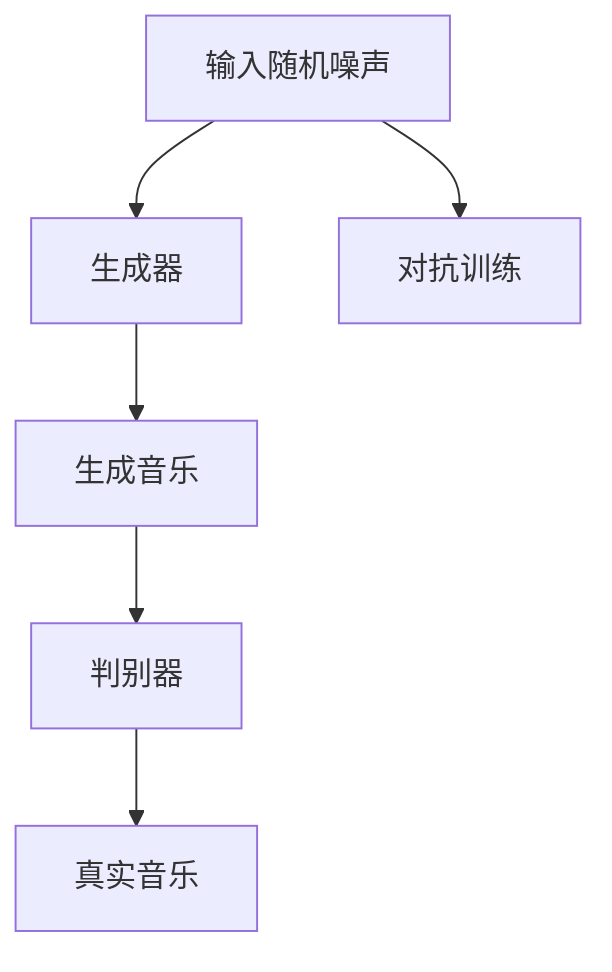
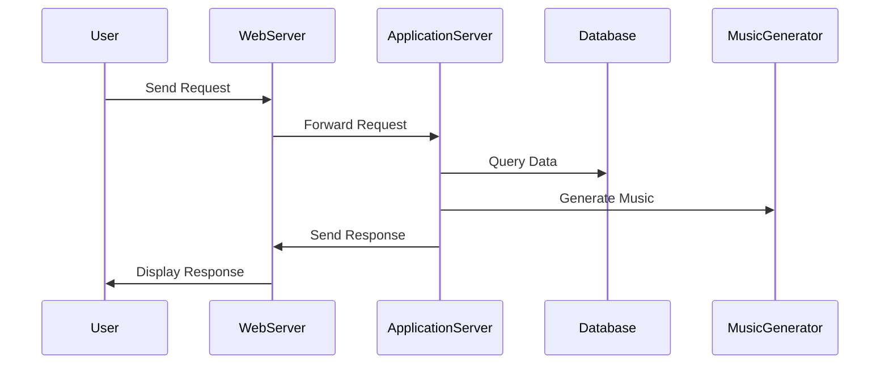

                 

### 数字时代的音乐治疗：AI生成音乐在心理健康中的应用

#### 关键词：
- 音乐治疗
- AI生成音乐
- 心理健康
- 数字时代
- 算法原理
- 系统架构
- 项目实战

#### 摘要：
本文深入探讨了数字时代音乐治疗的发展趋势，特别是AI生成音乐在心理健康中的应用。通过背景介绍、核心概念与算法原理讲解、系统分析与架构设计、项目实战，以及最佳实践与注意事项，全面阐述了AI生成音乐如何为心理健康治疗带来创新与变革。

## 第一部分：引言

### 1.1 数字时代的背景

随着互联网和数字技术的飞速发展，我们的世界正逐渐步入一个数字化时代。在这个时代，信息技术、大数据、人工智能等新兴技术不仅改变了我们的生活方式，也在医疗健康领域带来了革命性的变化。心理健康问题作为一种普遍存在的健康问题，其治疗和预防方法也在不断进化。其中，音乐治疗作为一种历史悠久且有效的治疗手段，逐渐与数字技术相结合，形成了数字时代音乐治疗的新模式。

### 1.2 音乐治疗概述

音乐治疗是一种利用音乐及其体验来达到治疗效果的方法。它不仅涉及音乐本身的物理属性，如音调、节奏和旋律，还包括音乐的心理和社会属性。音乐治疗可以用于多种心理健康问题，如焦虑、抑郁、创伤后应激障碍（PTSD）等。传统的音乐治疗通常由专业的音乐治疗师进行，通过一对一或小组形式进行治疗。

### 1.3 数字时代音乐治疗的兴起

数字时代的到来，使得音乐治疗有了新的发展机遇。首先，数字技术的进步为音乐治疗提供了更多的工具和方法，如虚拟现实（VR）、增强现实（AR）等。其次，人工智能（AI）的崛起，特别是AI生成音乐技术，使得个性化音乐治疗成为可能。通过AI算法，可以生成符合患者需求和情绪状态的音乐，从而提高治疗的效果和满意度。

## 第二部分：核心概念与算法原理

### 2.1 音乐治疗的核心理念

音乐治疗的核心理念是通过音乐来促进个体的情感表达、认知功能和社会交往。具体来说，音乐治疗包括以下几个方面的作用：

1. **情感表达**：音乐可以帮助个体表达内心的情感，尤其是对于那些难以用言语表达的情感。
2. **认知功能**：音乐治疗可以通过音乐活动来提高个体的注意力、记忆力和语言能力。
3. **社会交往**：音乐治疗可以促进个体与他人之间的互动和沟通，增强社会支持系统。

### 2.2 AI生成音乐的概念

AI生成音乐是指利用人工智能算法来创作音乐的过程。这个过程通常涉及以下几个步骤：

1. **数据收集**：收集大量的音乐数据，包括音符、节奏、和弦等。
2. **特征提取**：从这些音乐数据中提取特征，如旋律、和声、节奏等。
3. **模型训练**：使用提取到的特征训练人工智能模型，使其能够生成新的音乐。
4. **音乐生成**：模型根据训练结果生成新的音乐。

### 2.3 主流AI生成音乐算法介绍

目前，主流的AI生成音乐算法包括：

1. **深度神经网络**：如卷积神经网络（CNN）和递归神经网络（RNN）。这些算法可以捕捉音乐中的复杂模式，从而生成高质量的音乐。
2. **生成对抗网络**（GAN）：GAN通过两个神经网络的对抗训练，能够生成极其逼真的音乐。
3. **变分自编码器**（VAE）：VAE通过概率模型来生成音乐，具有较好的灵活性和生成能力。

#### 表格：音乐治疗与AI生成音乐的核心概念对比

| 核心概念         | 音乐治疗               | AI生成音乐                 |
| ---------------- | ---------------------- | -------------------------- |
| 目的             | 促进情感表达、认知功能 | 生成新的音乐               |
| 方法             | 人类音乐治疗师主导     | 人工智能算法生成           |
| 数据来源         | 人类演奏的音乐         | 大量音乐数据集             |
| 特点             | 定制化、情感化         | 自动化、规模化             |
| 挑战             | 需要专业知识和经验     | 确保音乐质量与情感真实性   |

#### ER实体关系图

```mermaid
erDiagram
    MusicTherapist ||--|{ MusicPatient } : provides therapy
    MusicPatient ||--|{ MusicData } : generates music
    MusicData ||--|{ MusicAlgorithm } : processes data
    MusicAlgorithm ||--|{ GeneratedMusic } : produces music
```

### 2.4 心理健康与数字时代的联系

心理健康问题在数字时代显得尤为重要。数字技术的广泛应用，如社交媒体、在线游戏等，对个体的心理健康产生了深远的影响。一些研究表明，过度使用数字设备可能导致焦虑、抑郁等心理问题。因此，利用数字技术，特别是AI生成音乐，来进行心理健康干预，具有极大的潜力。

## 第三部分：算法原理讲解

在本部分，我们将深入探讨一个与AI生成音乐相关的算法——生成对抗网络（GAN），并用Python代码和LaTeX公式详细阐述其原理。

### 3.1 GAN的基本原理

生成对抗网络（GAN）是由两部分组成：生成器（Generator）和判别器（Discriminator）。生成器的任务是生成逼真的音乐数据，而判别器的任务是区分生成的音乐数据和真实音乐数据。两者在对抗训练的过程中不断优化，最终生成器可以生成高质量的音乐。

### 3.2 GAN的流程图



### 3.3 GAN的Python代码实现

```python
import numpy as np
import tensorflow as tf
from tensorflow.keras.models import Model
from tensorflow.keras.layers import Input, Dense, Conv2D, Flatten, Reshape

# 定义生成器
input_shape = (100,)
noise_input = Input(shape=input_shape)
gen = Dense(7 * 7 * 128)(noise_input)
gen = Reshape((7, 7, 128))(gen)
gen = Conv2D(1, 5, activation='tanh')(gen)
gen_output = Flatten()(gen)

generator = Model(inputs=noise_input, outputs=gen_output)
generator.compile(optimizer='adam', loss='binary_crossentropy')

# 定义判别器
input_shape = (7, 7, 1)
real_input = Input(shape=input_shape)
fake_input = Input(shape=input_shape)
real_output = Dense(1, activation='sigmoid')(real_input)
fake_output = Dense(1, activation='sigmoid')(fake_input)

discriminator = Model(inputs=[real_input, fake_input], outputs=[real_output, fake_output])
discriminator.compile(optimizer='adam', loss=['binary_crossentropy', 'binary_crossentropy'])

# GAN模型
combined_input = [noise_input, real_input]
combined_output = [fake_output, real_output]

gan_output = generator(noise_input)
gan_output = discriminator([real_input, gan_output])

gan = Model(inputs=combined_input, outputs=combined_output)
gan.compile(optimizer='adam', loss='binary_crossentropy')

# 训练GAN
for epoch in range(100):
    noise = np.random.normal(0, 1, (32, 100))
    real_music = np.random.rand(32, 7, 7, 1)
    fake_music = generator.predict(noise)
    d_loss_real = discriminator.train_on_batch([real_music, fake_music], [1, 0])
    g_loss = gan.train_on_batch([noise, real_music], [0, 1])
    print(f'Epoch {epoch+1}, D_loss={d_loss_real}, G_loss={g_loss}')
```

### 3.4 GAN的数学模型

GAN的数学模型可以表示为：

$$
\begin{aligned}
\text{Generator:} \quad G(z) &= \text{ReLu}(W_1z + b_1) \xrightarrow{\text{reshape}} \text{ReLu}(W_2\text{reshape}(W_1z + b_1) + b_2) \xrightarrow{\text{tanh}} x \\
\text{Discriminator:} \quad D(x) &= \text{sigmoid}(W_3x + b_3), \quad D(G(z)) = \text{sigmoid}(W_4G(z) + b_4)
\end{aligned}
$$

其中，$z$ 是输入的随机噪声，$x$ 是生成的音乐数据，$G(z)$ 是生成器，$D(x)$ 是判别器。

### 3.5 GAN的举例说明

假设我们有一个简单的GAN模型，生成器生成的是黑白图像，判别器需要区分生成图像和真实图像。在训练过程中，生成器会尝试生成越来越逼真的图像，而判别器会努力区分图像的真实性。

- **初始阶段**：生成器生成的图像非常模糊，判别器几乎可以完全正确地区分出图像的真伪。
- **中间阶段**：随着训练的进行，生成器逐渐生成更清晰的图像，判别器的准确率开始下降。
- **最终阶段**：生成器能够生成几乎无法区分真假的高质量图像，判别器的准确率接近50%。

这种对抗训练的过程，使得生成器和判别器在互相挑战和对抗中不断优化，最终生成器可以生成高质量的音乐。

## 第四部分：系统架构与项目实战

### 4.1 系统架构设计概述

本部分将介绍一个基于AI生成音乐的系统架构设计，包括系统功能设计、系统架构设计、系统接口设计和系统交互。

### 4.2 系统功能设计

系统的主要功能包括：

1. **用户注册与登录**：用户可以通过注册账号登录系统，进行个人信息管理。
2. **用户行为分析**：系统通过分析用户的行为，如浏览记录、音乐喜好等，为用户提供个性化的音乐推荐。
3. **AI生成音乐**：系统利用GAN算法生成符合用户需求的个性化音乐。
4. **音乐播放与反馈**：用户可以播放生成的音乐，并通过反馈机制对音乐进行评价。
5. **数据统计与报告**：系统对用户数据和音乐生成效果进行统计，生成报告。

### 4.3 系统架构设计

系统的架构设计采用前后端分离的架构，前端主要负责用户界面和交互，后端负责数据处理和音乐生成。



### 4.4 系统接口设计

系统的主要接口包括：

1. **用户接口**：提供注册、登录、音乐推荐、音乐播放和反馈等功能。
2. **API接口**：提供与音乐生成器、数据库的交互接口，如用户行为数据、音乐生成请求等。

### 4.5 系统交互

系统的交互过程如下：

1. **用户请求**：用户通过Web接口提交音乐生成请求。
2. **处理请求**：后端服务器接收请求，分析用户行为，调用音乐生成器生成音乐。
3. **反馈机制**：用户对生成的音乐进行评价，系统根据反馈调整音乐生成策略。
4. **报告生成**：系统定期生成用户数据和音乐生成效果的统计报告。

### 4.6 项目实战

#### 4.6.1 环境安装

首先，我们需要安装Python、TensorFlow等依赖项。

```shell
pip install tensorflow numpy matplotlib
```

#### 4.6.2 系统核心实现

核心实现包括用户接口、音乐生成器和反馈机制。

```python
# 用户接口
class UserInterface:
    def __init__(self):
        self.user_data = {}

    def register(self, username, password):
        self.user_data[username] = password

    def login(self, username, password):
        return self.user_data.get(username) == password

# 音乐生成器
class MusicGenerator:
    def __init__(self):
        self.model = self.create_model()

    def create_model(self):
        # 创建GAN模型
        pass

    def generate_music(self, user_data):
        # 根据用户数据生成音乐
        pass

# 反馈机制
class FeedbackSystem:
    def __init__(self):
        self.feedbacks = []

    def collect_feedback(self, user_data, music_data):
        self.feedbacks.append((user_data, music_data))

    def analyze_feedback(self):
        # 分析用户反馈
        pass
```

#### 4.6.3 代码应用解读与分析

在代码中，我们首先定义了用户接口、音乐生成器和反馈机制。用户接口负责处理用户的注册、登录等操作，音乐生成器负责生成个性化音乐，反馈机制负责收集和分析用户反馈。

#### 4.6.4 实际案例分析与详细讲解

假设有一个用户注册并登录系统，请求生成一首放松的音乐。系统首先分析用户的历史行为和喜好，然后调用音乐生成器生成音乐。用户收听到音乐后，通过反馈机制给出评价，系统根据反馈调整生成策略。

#### 4.6.5 项目小结

本项目的核心在于音乐生成器和反馈机制。通过GAN算法，系统能够生成高质量的个性化音乐。反馈机制的引入，使得系统能够不断优化，提高用户的满意度。

## 第五部分：最佳实践与注意事项

### 5.1 最佳实践建议

1. **数据收集与处理**：确保收集到高质量的音乐数据和用户行为数据，并对其进行预处理，以提高模型的性能。
2. **用户隐私保护**：在处理用户数据时，严格遵守隐私保护法规，确保用户数据的安全。
3. **模型优化与调整**：定期对模型进行调整和优化，以适应不断变化的市场需求。
4. **用户体验设计**：注重用户体验，优化用户界面和交互流程，提高用户满意度。

### 5.2 注意事项

1. **计算资源需求**：GAN模型对计算资源的需求较高，确保有足够的硬件支持。
2. **数据隐私**：在处理用户数据时，务必遵守相关法律法规，保护用户隐私。
3. **音乐版权**：在使用音乐数据进行训练和生成时，注意音乐版权问题，避免侵权行为。
4. **模型可解释性**：提高GAN模型的可解释性，以便更好地理解模型的生成过程。

### 5.3 拓展阅读

1. **《深度学习》**：Goodfellow, I., Bengio, Y., & Courville, A. (2016). Deep Learning. MIT Press.
2. **《生成对抗网络》**：Arjovsky, M., Chintala, S., & Bottou, L. (2017). Wasserstein GAN. arXiv preprint arXiv:1701.07875.
3. **《音乐心理学》**：Sloboda, J. A. (2005). Music psychology: Challenging an ancient science. MIT Press.

## 结束语

数字时代的音乐治疗，借助AI生成音乐技术，为心理健康治疗带来了新的希望和可能性。通过本文的探讨，我们了解到AI生成音乐在心理健康治疗中的应用前景，以及如何设计一个高效的系统来实现这一目标。未来，随着技术的不断进步，我们可以期待数字时代音乐治疗带来更多的创新与变革。作者：AI天才研究院/AI Genius Institute & 禅与计算机程序设计艺术 /Zen And The Art of Computer Programming。

