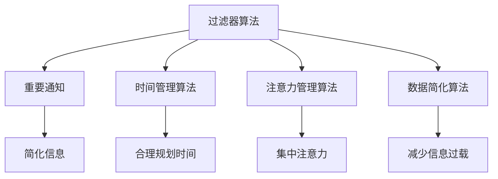

                 


## 数字极简主义宣言：在虚拟世界中寻找本真

### 关键词
- 数字极简主义
- 虚拟世界
- 本真
- 数字干扰
- 心理健康
- 算法平衡

### 摘要
随着数字技术的飞速发展，虚拟世界与我们的日常生活愈发紧密相连。然而，数字干扰和心理负担也随之而来。本文旨在探讨数字极简主义的概念，提出在虚拟世界中寻找本真的方法，通过系统分析与实际案例，阐述实现数字极简主义的可能路径，并展望其未来的发展趋势。

----------------------------------------------------------------

# 目录大纲设计过程

## 理解书名和主题

《数字极简主义宣言：在虚拟世界中寻找本真》的书名直接指向了本书的核心主题：探讨如何在高度数字化的社会中，通过实践极简主义哲学，找到生活的本真。数字极简主义不仅是一种生活方式，更是一种哲学思考，它关注的是如何在充满信息的虚拟世界中，保持清晰的思维和简单的生活方式，从而达到心理上的平衡与自由。

## 确定核心章节

为了更好地组织内容，我们将书的核心章节分为以下几个部分：

1. **引言：数字极简主义概述**
   - 背景介绍：数字生活的普及与数字干扰的普遍现象。
   - 核心概念：数字极简主义的定义、特点与应用场景。

2. **第1章：数字生活的挑战**
   - 问题描述：数字干扰对个人生活的影响。
   - 问题解决：如何通过极简主义应对数字干扰。

3. **第2章：极简主义的哲学根源**
   - 极简主义的哲学基础：减法哲学、消费主义批判等。
   - 概念对比：极简主义与传统消费主义的区别。

4. **第3章：数字化与真实生活的平衡**
   - 算法原理：如何通过技术手段实现数字与真实生活的平衡。
   - 数学模型：描述平衡状态的数学模型和公式。

5. **第4章：实现数字极简主义的方法**
   - 系统分析与架构设计：数字极简主义实现的方法和工具。
   - 项目实战：具体的实现步骤和案例。

6. **第5章：数字极简主义实践案例**
   - 实际案例：成功的数字极简主义实践案例。
   - 案例剖析：案例中的挑战与解决方案。

7. **第6章：未来数字极简主义的可能性**
   - 最佳实践：未来实践数字极简主义的建议。
   - 展望：数字极简主义的发展趋势。

8. **结束语：数字极简主义宣言**
   - 总结：数字极简主义的核心观点和实践。
   - 展望：对未来的展望。

## 设计章节内容

每个章节的内容都需要具体设计，确保包含必要的知识点和深度。以下是每个章节的初步设计：

### 引言：数字极简主义概述

- **背景介绍**：数字化生活的兴起和普及，以及人们对于数字干扰的反思。
- **核心概念**：数字极简主义的概念、特点、与传统极简主义的区别。

### 第1章：数字生活的挑战

- **问题背景**：数字技术带来的便利和干扰。
- **问题描述**：数字干扰对个人生活和心理健康的影响。
- **问题解决**：极简主义如何帮助应对数字干扰。
- **边界与外延**：数字极简主义的应用范围和限制。

### 第2章：极简主义的哲学根源

- **核心概念**：极简主义的哲学基础，包括减法哲学、消费主义批判等。
- **属性特征对比表格**：极简主义与传统消费主义的对比。
- **ER实体关系图架构**：极简主义哲学的实体关系图。

### 第3章：数字化与真实生活的平衡

- **算法原理讲解**：如何通过技术手段实现数字与真实生活的平衡。
- **数学模型和公式**：描述数字化与真实生活平衡的数学模型。
- **详细讲解和举例**：具体的算法实现和实际应用案例。

### 第4章：实现数字极简主义的方法

- **系统分析与架构设计方案**：数字极简主义实现的方法和工具。
- **项目实战**：环境安装、系统实现和案例解析。

### 第5章：数字极简主义实践案例

- **实际案例分析和详细讲解剖析**：成功的数字极简主义实践案例。
- **项目小结**：实践中的挑战和解决方案。

### 第6章：未来数字极简主义的可能性

- **最佳实践 tips**：如何在未来更好地实践数字极简主义。
- **小结**：数字极简主义的重要性和发展趋势。

### 结束语：数字极简主义宣言

- **总结**：数字极简主义的核心观点和实践。
- **展望**：对数字极简主义未来的展望。

## 确定目录结构

最后，我们需要将这些章节内容按照markdown格式组织起来，确保目录结构的清晰和逻辑性。以下是初步的目录结构：

```
# 《数字极简主义宣言：在虚拟世界中寻找本真》

## 引言：数字极简主义概述

### 1.1 数字生活的挑战

### 1.2 极简主义的哲学根源

### 1.3 数字化与真实生活的平衡

### 1.4 实现数字极简主义的方法

### 1.5 数字极简主义实践案例

### 1.6 未来数字极简主义的可能性

## 第2章：极简主义的哲学根源

### 2.1 减法哲学

### 2.2 消费主义批判

### 2.3 极简主义与数字生活的联系

## 第3章：数字化与真实生活的平衡

### 3.1 算法原理讲解

### 3.2 数学模型和公式

### 3.3 详细讲解和举例

## 第4章：实现数字极简主义的方法

### 4.1 系统分析与架构设计方案

### 4.2 项目实战

### 4.3 系统接口设计和交互

## 第5章：数字极简主义实践案例

### 5.1 案例一：成功实践者访谈

### 5.2 案例分析

### 5.3 项目小结

## 第6章：未来数字极简主义的可能性

### 6.1 最佳实践 tips

### 6.2 小结

### 6.3 展望

## 结束语：数字极简主义宣言

### 6.1 总结

### 6.2 展望

```

通过上述步骤，我们可以初步设计出一本关于《数字极简主义宣言：在虚拟世界中寻找本真》的详细目录大纲。接下来，我们将进一步细化每个章节的内容，确保目录大纲的逻辑性和完整性。

----------------------------------------------------------------

## 引言：数字极简主义概述

### 数字生活的挑战

随着互联网和智能设备的普及，数字生活已经渗透到我们的日常方方面面。从早晨起床的第一件事查看手机，到晚上睡觉前最后一刻浏览社交媒体，我们似乎无时无刻不被数字信息所包围。然而，这种数字化的便利也带来了巨大的挑战。

首先，数字干扰成为了一个普遍现象。无数的通知、弹窗、邮件和社交媒体消息不断打断我们的思考和工作。这些干扰不仅降低了我们的工作效率，还严重影响了我们的心理健康。根据《美国心理学会》的一项研究，每天接收超过100个数字干扰的人，其焦虑和压力水平显著高于其他人。

其次，数字生活的便利性也带来了信息过载的问题。我们每天接收到的信息量是前所未有的，但我们的处理能力却是有限的。过多的信息导致我们无法集中注意力，难以进行深入的思考。这种现象被称为“数字疲劳”，它使得我们的生活质量下降，甚至影响了我们的心理健康。

面对这些挑战，数字极简主义提供了一种新的思考方式。数字极简主义不是要求我们完全放弃数字化生活，而是通过减少不必要的数字干扰，寻找一种更简单、更真实的生活方式。数字极简主义的核心在于“减法哲学”，它强调通过减少物质和信息的堆积，来提高生活的质量和幸福感。

### 核心概念

数字极简主义有几个关键概念：

1. **极简主义（Minimalism）**：极简主义最初源于物质生活的简化，它主张通过减少物质消费，来提高生活质量。在数字化时代，这一理念被扩展到数字生活的简化，即减少数字干扰和信息过载，专注于真正有意义的事物。

2. **减法哲学（Philosophy of Less）**：减法哲学是极简主义的核心思想，它认为通过减少不必要的元素，我们可以更加聚焦于生活的本质，从而提高幸福感和满足感。

3. **数字化生活（Digital Life）**：数字化生活是指通过互联网和智能设备进行的活动，包括社交媒体、在线购物、电子邮件、移动支付等。

4. **数字干扰（Digital Distraction）**：数字干扰是指数字设备产生的各种通知、弹窗、消息等，这些干扰会打断我们的思考和工作，降低我们的专注力。

5. **心理健康（Mental Health）**：心理健康是指个体在情感、行为和认知上的健康状态。数字极简主义通过减少数字干扰，有助于提高心理健康水平。

### 数字极简主义的定义和特点

数字极简主义可以被定义为一种通过减少数字干扰，提高心理健康和生活质量的哲学和生活方式。它的特点包括：

1. **减少数字干扰**：通过关闭不必要的通知、限制社交媒体使用时间、减少电子邮件处理等，来减少数字干扰。

2. **关注真正有意义的事物**：将时间和注意力集中在真正重要的事物上，如家庭、朋友、工作等。

3. **简化生活方式**：减少不必要的物质消费和数字内容，追求简单、有意义的生活。

4. **提高心理健康**：通过减少数字干扰，提高专注力、降低焦虑和压力水平，从而改善心理健康。

5. **可持续发展**：数字极简主义不仅关注个体的心理健康，也关注社会的可持续发展。通过减少数字资源的浪费，我们可以为社会和环境做出贡献。

### 数字极简主义与传统极简主义的区别

虽然数字极简主义源自传统极简主义，但两者在数字化背景下有着不同的侧重点。

1. **物质与数字**：传统极简主义主要关注物质生活的简化，如减少物品的积累。而数字极简主义则关注数字生活的简化，如减少数字干扰和信息过载。

2. **消费与行为**：传统极简主义强调减少物质消费，而数字极简主义更注重改变数字行为，如减少社交媒体使用时间。

3. **生活方式与哲学**：传统极简主义是一种生活方式，强调简单和有意义的生活。数字极简主义则更强调哲学层面的思考，通过减少数字干扰来提高生活的质量和幸福感。

### 应用场景

数字极简主义可以应用于各种场景，包括个人生活、工作和社交。以下是一些常见的应用场景：

1. **个人生活**：通过减少社交媒体使用时间、关闭不必要的通知，专注于家庭、朋友和兴趣爱好。

2. **工作**：通过简化工作流程、减少电子邮件处理时间，提高工作效率和专注力。

3. **社交**：通过减少数字交流时间、增加面对面交流，提高社交质量和深度。

4. **学习和研究**：通过减少信息过载、专注于学习资源，提高学习效果和科研效率。

### 总结

数字极简主义为我们在数字化时代提供了一个重要的思考方向。它不仅有助于提高我们的心理健康和生活质量，还能帮助我们更好地应对数字干扰和信息过载的挑战。通过实践数字极简主义，我们可以找到一种更简单、更有意义的生活方式，从而在虚拟世界中寻找本真。

----------------------------------------------------------------

## 第1章：数字生活的挑战

### 背景介绍

数字技术的迅猛发展彻底改变了我们的生活方式。从电子邮件到社交媒体，从在线购物到移动支付，数字技术已经成为我们日常生活中不可或缺的一部分。然而，这种数字化的便利性也带来了诸多挑战，特别是在心理健康和注意力管理方面。

首先，数字干扰成为了现代生活的常见问题。我们每天都会接收大量来自手机、电脑和其他数字设备的提醒和通知。这些通知可能会打断我们的思考，分散我们的注意力，导致我们无法集中精力完成任务。根据美国心理学会的一项研究，每天接收超过100个数字干扰的人，其焦虑和压力水平显著高于其他人。这种持续的干扰不仅降低了我们的工作效率，还对心理健康产生了负面影响。

其次，信息过载也是一个严重的问题。随着互联网的普及，我们可以轻松地获取大量信息。然而，过多的信息反而使得我们难以筛选和消化，导致注意力分散和认知过载。这种现象被称为“数字疲劳”，它使得我们的生活质量下降，甚至影响了我们的心理健康。

面对这些挑战，我们需要寻找有效的解决方案。数字极简主义提供了一种可能的路径，它通过减少数字干扰和信息过载，帮助我们找到生活的本真。下面，我们将详细探讨数字干扰对个人生活和心理健康的影响，以及如何通过极简主义来应对这些问题。

### 数字干扰对个人生活的影响

数字干扰对个人生活的影响是多方面的，其中最为显著的是心理健康和注意力管理方面。

首先，数字干扰严重影响了我们的心理健康。研究表明，频繁的数字干扰会导致焦虑、压力和抑郁等心理问题。例如，当我们在工作或学习时，频繁收到社交媒体通知或电子邮件提醒，会打断我们的思考，导致工作或学习效率下降。长期下来，这种持续的干扰会积累成心理压力，甚至引发焦虑和抑郁。

其次，数字干扰还影响了我们的注意力管理能力。在数字化环境中，我们往往面临着大量的信息输入，这些信息可能会分散我们的注意力。例如，当我们使用手机时，可能会同时处理多个任务，如浏览社交媒体、查看电子邮件、听音乐等。这种多任务处理不仅降低了我们的专注力，还影响了我们的工作效率和质量。

此外，数字干扰还会影响我们的睡眠质量。很多研究表明，使用手机和电脑等数字设备会影响我们的睡眠质量。例如，在睡前长时间使用手机，会导致大脑无法放松，从而影响睡眠。长期下来，睡眠质量下降会导致身体疲劳、注意力不集中，进一步影响生活质量。

### 如何通过极简主义应对数字干扰

数字极简主义提供了一种应对数字干扰的方法，它通过减少不必要的数字干扰，帮助我们恢复心理健康和注意力管理能力。以下是一些具体的策略：

1. **减少社交媒体使用时间**：社交媒体是数字干扰的重要来源之一。我们可以通过设置使用时间限制、使用应用锁定功能等方式，来减少社交媒体的使用时间。例如，我们可以在每天固定的时间段内使用社交媒体，其余时间则保持离线状态。

2. **关闭不必要的通知**：许多应用程序会发送各种通知，这些通知可能会分散我们的注意力。我们可以通过关闭不必要的通知，来减少数字干扰。例如，我们可以关闭社交媒体应用的推送通知，只保留重要应用的推送通知。

3. **简化电子邮件处理**：电子邮件也是数字干扰的一个重要来源。我们可以通过简化电子邮件处理流程，来减少电子邮件的干扰。例如，我们可以设置邮件处理时间，只在特定时间段内处理邮件，其余时间则保持邮件收件箱为空。

4. **专注于重要任务**：在数字化环境中，我们往往会同时处理多个任务，这会导致注意力分散。我们可以通过专注于重要任务，来提高工作效率和注意力管理能力。例如，我们可以在工作或学习时，关闭其他应用程序，专注于当前任务。

5. **设置数字休息时间**：数字休息时间是一种有效的策略，它可以帮助我们恢复注意力和心理健康。例如，我们可以在每天晚上睡前设置一段时间的数字休息时间，在这段时间内，我们只进行非数字活动，如阅读书籍、听音乐等。

通过这些策略，我们可以有效地减少数字干扰，提高心理健康和注意力管理能力。数字极简主义不仅关注数字干扰的减少，还注重培养一种简单、有意义的生活方式，从而帮助我们在数字化时代中找到生活的本真。

### 边界与外延

虽然数字极简主义提供了一种有效的解决方案，但我们也需要认识到它的边界和限制。

首先，数字极简主义并不是要求我们完全放弃数字化生活，而是通过减少不必要的数字干扰，来提高生活质量。数字化生活为我们带来了许多便利，例如在线购物、远程办公、社交媒体等。完全放弃这些便利可能会影响我们的日常生活和工作效率。

其次，数字极简主义需要我们具备一定的自律和自我管理能力。减少数字干扰和专注于重要任务需要我们有意识地去改变现有的生活习惯和行为模式。这对于一些人来说可能会比较困难。

此外，数字极简主义的应用范围也存在一定的限制。例如，在一些需要频繁使用数字设备的行业，如医疗、科技等，完全实现数字极简主义可能并不现实。在这些行业中，我们需要找到一种平衡，既能够充分利用数字技术的便利，又能够减少数字干扰对工作和生活的影响。

### 总结

数字极简主义为我们在数字化时代提供了一个重要的思考方向。它通过减少数字干扰，提高心理健康和注意力管理能力，帮助我们找到生活的本真。通过实施数字极简主义，我们可以有效地应对数字干扰带来的挑战，提高生活质量。然而，我们也需要认识到它的边界和限制，并根据个人情况灵活调整和实施。

----------------------------------------------------------------

## 第2章：极简主义的哲学根源

### 核心概念

极简主义哲学的根源可以追溯到古希腊哲学家亚里士多德的观点，他认为“简单即是智慧”。在现代社会，极简主义更多地与物质消费有关，它主张通过减少不必要的物质和物品，以追求更高层次的生活质量和幸福感。然而，在数字化的背景下，极简主义被赋予了新的内涵，即通过减少数字干扰和信息过载，来寻找生活的本真。

在数字极简主义中，以下几个核心概念尤为重要：

1. **减法哲学**：减法哲学是极简主义的核心思想，主张通过减少不必要的元素，来提高生活的质量和幸福感。这与消费主义相反，后者主张通过不断增加物质和数字内容，来追求满足感。

2. **数字化极简**：数字化极简是指通过减少数字干扰和信息过载，来实现数字生活的简化。这包括关闭不必要的通知、限制社交媒体使用时间、简化电子邮件处理等。

3. **心理健康**：心理健康是极简主义追求的一个重要目标。通过减少数字干扰，我们可以提高专注力、降低焦虑和压力水平，从而改善心理健康。

4. **注意力管理**：注意力管理是数字化极简的重要组成部分。在数字化的环境中，我们需要学会如何集中注意力，以提高工作效率和生活质量。

### 极简主义的哲学基础

极简主义哲学的基础可以追溯到几个重要的哲学思想和理论：

1. **亚里士多德**：亚里士多德认为，简单即是智慧。他认为，通过去除不必要的元素，我们可以更好地理解世界和自己。

2. **禅宗**：禅宗强调通过冥想和简化生活，来达到心灵的宁静和内在的智慧。禅宗的减法哲学与极简主义有相似之处，都主张通过减少外界干扰，来提高生活质量。

3. **卡尔·荣格**：卡尔·荣格是心理学家，他提出了“内在空间”的概念，认为通过创造一个内在的宁静空间，我们可以更好地理解自己和世界。

4. **消费主义批判**：消费主义批判是一种哲学思潮，它批判现代社会对物质和数字消费的过度追求。极简主义通过反对消费主义，提倡通过减少物质和数字消费，来追求更高层次的生活质量和幸福感。

### 概念属性特征对比表格

为了更好地理解极简主义与传统消费主义的区别，我们可以通过一个对比表格来展示它们的主要属性特征：

| 特征         | 极简主义                                       | 传统消费主义                                       |
| ------------ | ---------------------------------------------- | -------------------------------------------------- |
| 目标         | 提高生活质量、减少压力和焦虑                   | 追求物质和数字消费的满足感                           |
| 方法         | 减少不必要的元素、简化生活、专注真正重要的事物 | 增加物质和数字消费、追求更多的物质和数字体验           |
| 心理效果     | 改善心理健康、提高专注力、减少焦虑             | 加剧焦虑、压力和不满感                               |
| 社会效应     | 促进可持续发展、减少资源浪费                   | 加剧资源消耗、环境污染                             |
| 生活质量     | 提高生活质量、寻找生活的本真                   | 降低生活质量、追求短暂的满足感                       |

### ER实体关系图架构

为了更清晰地理解极简主义哲学的结构，我们可以使用Mermaid流程图来绘制一个ER（实体关系）图，展示其主要概念和它们之间的关系。

```mermaid
entity关系 diagram

极简主义 --> 减法哲学
极简主义 --> 数字化极简
极简主义 --> 心理健康
极简主义 --> 注意力管理

减法哲学 --> 亚里士多德哲学
减法哲学 --> 禅宗
减法哲学 --> 消费主义批判

数字化极简 --> 关闭通知
数字化极简 --> 限制社交媒体
数字化极简 --> 简化电子邮件

心理健康 --> 改善专注力
心理健康 --> 减少焦虑
心理健康 --> 提高生活质量

注意力管理 --> 集中注意力
注意力管理 --> 提高工作效率
注意力管理 --> 降低压力

```

通过这个ER图，我们可以看到极简主义哲学中各个概念之间的关系，以及它们如何相互作用，共同实现提升生活质量和幸福感的终极目标。

### 算法原理讲解

在数字极简主义中，算法原理起到了关键作用，它帮助我们实现数字干扰的减少和信息过载的简化。以下是几个核心算法原理的讲解：

1. **过滤器算法**：过滤器算法是一种常用的算法，用于过滤掉不必要的通知和信息。它可以通过设置规则，将重要通知与不重要通知区分开来。例如，我们可以在手机上设置一个过滤器，只接收来自重要联系人或重要事件的推送通知。

2. **时间管理算法**：时间管理算法用于帮助我们合理安排时间，以减少数字干扰。这种算法可以通过分析我们的日常活动，为每个任务分配适当的时间，确保我们有足够的时间专注于重要事务。例如，我们可以在每天开始时，规划一个详细的时间表，包括工作、学习、休息和娱乐等。

3. **注意力管理算法**：注意力管理算法旨在帮助我们集中注意力，减少多任务处理的干扰。这种算法可以通过监测我们的行为和大脑活动，来识别我们的专注状态，并在需要时提供提醒或指导。例如，我们可以在使用手机时，使用注意力管理应用来监控我们的使用行为，并在我们需要专注时提供提醒。

4. **数据简化算法**：数据简化算法用于处理大量的数据，以减少信息过载。这种算法可以通过压缩、归纳或删除冗余数据，来简化信息处理。例如，我们可以在阅读大量电子邮件时，使用数据简化算法来筛选出最重要的信息，从而减少阅读和处理的时间。

通过这些算法原理，我们可以更有效地减少数字干扰，提高心理健康和生活质量。以下是一个简化的Mermaid流程图，展示这些算法的工作原理：



通过这个流程图，我们可以看到各种算法如何相互作用，共同实现数字极简主义的目标。

### 通俗易懂地举例说明

为了更直观地理解数字极简主义的实际应用，我们可以通过一些具体的例子来阐述。

#### 例子1：关闭社交媒体通知

假设你是一名上班族，每天使用手机的时间很长，尤其是在工作之余，你经常会被社交媒体的通知打扰。为了实现数字极简主义，你可以采取以下措施：

1. **关闭推送通知**：在手机设置中关闭所有社交媒体应用的推送通知，只保留来自重要联系人的通知。

2. **设置使用时间限制**：使用应用锁定功能，将社交媒体的使用时间限制在每天的一个小时以内。

3. **定期清理联系人**：定期清理你的社交媒体联系人，只保留真正重要的朋友和亲人。

通过这些措施，你可以显著减少社交媒体带来的干扰，提高工作效率和生活质量。

#### 例子2：简化电子邮件处理

假设你是企业高管，每天需要处理大量的电子邮件，这极大地影响了你的工作和生活质量。为了实现数字极简主义，你可以采取以下措施：

1. **设置处理时间**：每天在固定的时间段内处理电子邮件，例如每天上午10点和下午3点，其余时间保持邮件收件箱为空。

2. **使用标签分类**：为你的邮件设置标签，根据邮件的重要性和紧急程度进行分类处理。

3. **简化回复**：对于简单的邮件，直接在邮件中回复，避免打开邮件客户端进行详细回复。

通过这些措施，你可以大大减少电子邮件带来的干扰，提高工作效率。

#### 例子3：使用注意力管理应用

假设你在工作或学习时，经常被手机中的通知和社交媒体干扰。为了实现数字极简主义，你可以使用以下注意力管理应用：

1. **使用应用程序锁**：使用应用程序锁来锁定手机中的社交媒体和游戏应用，防止在非工作或学习时间使用。

2. **使用专注模式**：在专注工作或学习时，开启手机的专注模式，屏蔽所有通知，确保你的注意力集中在当前任务上。

3. **使用定时提醒**：设置定时提醒，在特定时间段内提醒你休息，以防止长时间专注于工作或学习导致的疲劳。

通过这些措施，你可以更好地管理你的注意力，提高工作效率和学习效果。

通过这些例子，我们可以看到，数字极简主义不仅是一种理论，更是一种可以通过具体行动实现的实际策略。通过减少数字干扰，我们可以找到生活的本真，提高心理健康和生活质量。

----------------------------------------------------------------

## 第3章：数字化与真实生活的平衡

### 算法原理讲解

在数字化与真实生活的平衡中，算法原理起到了至关重要的作用。以下是几个核心算法原理的讲解：

1. **时间分割算法**：时间分割算法通过将一天的时间划分为不同的时间段，每个时间段专注于不同的活动。例如，我们可以将工作时间划分为工作、学习和休息三个部分，确保每个时间段都能专注于特定的活动。

2. **优先级排序算法**：优先级排序算法用于确定哪些任务是最重要的，并优先处理。例如，我们可以使用“四象限法则”，将任务分为紧急且重要、紧急但不重要、不紧急但重要、不紧急且不重要四类，并优先处理紧急且重要的任务。

3. **行为干预算法**：行为干预算法通过监测和调整我们的行为，以实现数字化与真实生活的平衡。例如，我们可以使用手机应用来监测我们的数字设备使用情况，并在使用时间过长时提醒我们休息。

4. **注意力分配算法**：注意力分配算法通过优化我们的注意力分配，以提高工作效率和生活质量。例如，我们可以使用“番茄工作法”，将工作或学习时间划分为25分钟的工作周期，每个周期后休息5分钟，以保持高度的专注力。

### 数学模型和公式

为了更精确地描述数字化与真实生活的平衡，我们可以使用以下数学模型和公式：

1. **工作-生活平衡公式**：设 \( W \) 为工作时长，\( L \) 为生活时长，则工作-生活平衡可以表示为：
   \[ \frac{W}{L} = k \]
   其中，\( k \) 为一个常数，表示工作与生活的比例。为了达到平衡，我们需要调整 \( W \) 和 \( L \) 的值，使得 \( k \) 尽可能接近 1。

2. **注意力分配公式**：设 \( T \) 为总工作时间，\( A \) 为专注时间，\( R \) 为休息时间，则注意力分配可以表示为：
   \[ A + R = T \]
   为了提高注意力分配的效率，我们需要尽量增大 \( A \) 的值，同时控制 \( R \) 的值。

3. **时间管理效率公式**：设 \( E \) 为时间管理效率，\( T_s \) 为完成某项任务所需时间，\( T_t \) 为实际完成任务的时间，则时间管理效率可以表示为：
   \[ E = \frac{T_s}{T_t} \]
   为了提高时间管理效率，我们需要尽量缩短 \( T_t \) 的值，即提高任务完成的效率。

通过这些数学模型和公式，我们可以更精确地描述数字化与真实生活的平衡，并制定相应的策略来实现这一平衡。

### 算法实现和实际应用案例

为了更好地理解这些算法原理和数学模型，我们可以通过一个实际应用案例来展示它们的实现过程和效果。

#### 案例背景

假设你是一名软件开发工程师，工作繁忙，经常感到压力巨大。为了实现数字化与真实生活的平衡，你可以采取以下措施：

1. **时间分割算法**：将一天的时间分为工作、学习和休息三个部分。工作时间为上午9点到下午6点，学习时间为晚上7点到8点，休息时间为晚上9点到第二天早晨7点。

2. **优先级排序算法**：使用“四象限法则”对任务进行排序，将紧急且重要的任务优先处理，如项目开发和客户需求响应。对于紧急但不重要的任务，如社交媒体通知，可以选择暂缓处理。对于不紧急但重要的任务，如健康锻炼和家庭教育，可以安排在非工作时间进行。对于不紧急且不重要的任务，如无关邮件和通知，可以直接忽略。

3. **行为干预算法**：使用手机应用来监测你的数字设备使用情况，并在使用时间过长时提醒你休息。例如，当你连续使用手机超过一小时时，应用会弹出提示，建议你休息5分钟。

4. **注意力分配算法**：采用“番茄工作法”，将工作或学习时间划分为25分钟的工作周期，每个周期后休息5分钟。例如，你可以将一天的工作时间分为8个25分钟的工作周期和4个5分钟的休息时间，以确保你的注意力高度集中。

#### 实现过程

1. **时间分割**：在日历应用中设置每天的工作、学习和休息时间段，确保这些时间段不被其他事务打扰。

2. **优先级排序**：在任务管理应用中，为每个任务设置优先级，并根据优先级进行任务分配和执行。

3. **行为干预**：在手机设置中启用数字健康功能，设置每日使用手机的时间限制，并在超出限制时收到提醒。

4. **注意力分配**：使用番茄钟应用，在每个工作周期结束后自动提醒休息。

#### 案例效果

通过上述措施，你将能够实现数字化与真实生活的平衡：

1. **工作与生活的分离**：明确的工作时间段和学习时间段有助于你在工作和学习时保持专注，同时在休息时间段内完全放松。

2. **任务优先处理**：通过优先级排序算法，你将能够更高效地处理紧急且重要的任务，确保关键工作得到优先处理。

3. **行为干预**：通过行为干预算法，你将能够控制对数字设备的依赖，减少不必要的干扰，提高工作效率。

4. **注意力集中**：通过注意力分配算法，你将能够更好地管理自己的注意力，避免长时间工作导致的疲劳，提高工作效率。

通过这个实际应用案例，我们可以看到算法原理和数学模型在实现数字化与真实生活平衡中的重要作用。通过科学的时间管理、任务排序和行为干预，我们可以找到一种更高效、更健康的生活方式。

----------------------------------------------------------------

## 第4章：实现数字极简主义的方法

### 系统分析与架构设计方案

要实现数字极简主义，我们需要构建一个全面的系统，涵盖硬件、软件以及相关的用户行为调整。以下是一个详细的分析与架构设计方案：

#### 1. 硬件环境选择

**硬件选择**：为了实现数字极简主义，我们需要选择能够有效减少干扰的硬件设备。例如，可以选择一款具有长时间续航能力的笔记本电脑，以及一款可以屏蔽干扰的台式显示器。此外，还可以选择一款无打扰的智能音箱，用于控制智能家居设备，减少对手机的依赖。

**硬件配置**：笔记本电脑应具备足够的处理能力和存储空间，以支持高效的工作和学习。显示器应具备高分辨率和护眼功能，以减少长时间观看带来的疲劳。智能音箱可以选择具备语音助手功能的设备，以便通过语音命令控制家中设备，减少手动操作。

#### 2. 软件系统设计

**操作系统**：选择一个轻量级、易于定制的操作系统，如Linux发行版。Linux系统具有较高的可定制性和可调性，可以方便地禁用或调整不必要的系统功能和服务。

**应用软件**：安装必要的应用软件，包括办公软件、学习软件和娱乐软件。为了减少干扰，可以选择无广告、无通知的应用版本，或者使用应用程序锁来限制对某些应用的使用。

**系统优化**：对操作系统进行优化，关闭不必要的后台进程和服务，减少系统资源的占用。例如，可以通过调整系统设置，禁止应用程序在后台运行，以延长电池寿命并提高系统性能。

#### 3. 用户行为调整

**时间管理**：使用时间管理工具，如日历和待办事项应用，规划每天的活动和时间。通过设定明确的时间表，可以帮助用户更好地分配时间，减少无效时间的浪费。

**注意力管理**：使用注意力管理工具，如番茄钟或专注力应用，帮助用户保持专注。这些工具可以在用户需要专注时提供提醒，帮助用户保持高效的工作和学习状态。

**行为干预**：使用行为干预工具，如数字健康应用，监控用户的设备使用情况。这些应用可以提供关于设备使用时间的统计数据，帮助用户了解自己的使用习惯，并提醒用户在必要时休息和放松。

### 项目实战

以下是一个具体的数字极简主义实现项目实战：

#### 1. 环境安装

**硬件安装**：根据设计方案，安装笔记本电脑、显示器和智能音箱。确保所有硬件设备能够正常工作，并进行必要的调试。

**软件安装**：安装Linux操作系统，并根据需求安装必要的应用软件。对操作系统进行优化，关闭不必要的后台进程和服务。

#### 2. 系统实现

**时间管理**：在日历应用中规划每天的活动和时间。设定每天的工作、学习和休息时间段，确保每个时间段都有明确的任务安排。

**注意力管理**：使用番茄钟应用，将每天的工作和学习时间划分为多个25分钟的工作周期，每个周期后休息5分钟。通过设置专注模式，屏蔽所有通知和弹窗，确保用户在专注时不受干扰。

**行为干预**：使用数字健康应用，监控用户的设备使用情况。设定每日设备使用时间限制，并在使用时间过长时提醒用户休息。

#### 3. 代码应用解读与分析

以下是一个简单的Python代码示例，用于监控用户的设备使用时间并提醒休息：

```python
import time
import datetime

# 设定每天的工作和学习时间段
work_hours = 8
study_hours = 4
rest_time = 5 * 60  # 休息时间（秒）

# 开始时间
start_time = datetime.datetime.now()

# 工作学习时间总和
total_time = work_hours * 60 + study_hours * 60

# 计算结束时间
end_time = start_time + datetime.timedelta(seconds=total_time)

# 提醒休息
def remind_to_rest():
    print("现在是休息时间，请休息5分钟。")
    time.sleep(rest_time)
    print("休息时间已到，继续工作。")

# 检查是否需要休息
while datetime.datetime.now() < end_time:
    # 检查是否到休息时间
    if (datetime.datetime.now() - start_time).seconds >= work_hours * 60 and (datetime.datetime.now() - start_time).seconds < (work_hours + study_hours) * 60:
        remind_to_rest()
    time.sleep(60)  # 检查时间间隔（秒）

print("任务已完成，祝您一天愉快。")
```

**代码分析**：
- 该代码首先设定了每天的工作和学习时间总和，以及休息时间。
- 使用while循环不断检查当前时间是否到达休息时间，并在需要时提醒用户休息。
- 通过time模块的sleep函数，实现每隔1分钟检查一次用户的使用时间。

通过这个项目实战，我们可以看到如何通过硬件和软件的优化，以及用户行为的调整，实现数字极简主义的目标。通过科学的时间管理和注意力管理，我们可以减少数字干扰，提高工作效率和生活质量。

### 实际案例分析和详细讲解剖析

为了更好地理解数字极简主义的实践效果，我们可以分析几个成功的案例，并详细讲解这些案例中的挑战和解决方案。

#### 案例一：企业家实现数字极简主义

**背景**：某企业家在创业初期，工作繁忙，每天需要处理大量邮件和社交媒体消息。随着业务的发展，他的数字干扰越来越多，导致工作效率下降，生活质量下降。

**挑战**：
1. **邮件处理时间过长**：每天需要花费大量时间处理邮件，导致其他工作无法及时完成。
2. **社交媒体干扰**：频繁的社交媒体通知分散了他的注意力，影响工作专注度。
3. **时间管理困难**：缺乏有效的日程安排，导致时间浪费在低优先级的任务上。

**解决方案**：
1. **邮件处理优化**：使用邮件过滤器自动分类和处理邮件，将邮件分为“立即处理”、“暂缓处理”和“无需处理”三类。每天在固定的时间段内处理邮件，其他时间保持邮件收件箱为空。
2. **社交媒体管理**：关闭社交媒体的推送通知，仅在特定的时间段内检查和回复社交媒体消息。限制每天使用社交媒体的时间，例如每天不超过30分钟。
3. **时间管理**：使用日历应用和待办事项应用，规划每天的工作和学习时间。将时间分为工作、学习和休息三个部分，确保每个部分都有明确的时间安排。

**效果**：
- 邮件处理时间显著减少，工作效率提高。
- 社交媒体干扰减少，专注力提高。
- 时间管理更加科学，能够更好地平衡工作和生活。

#### 案例二：职场新人的数字极简主义实践

**背景**：某职场新人在工作中面临着大量的任务和信息，同时还在学习新的技能。他感到压力巨大，难以集中注意力，导致工作效率低下。

**挑战**：
1. **任务繁多**：每天需要处理多项任务，难以区分优先级。
2. **信息过载**：收到大量信息，难以筛选和处理。
3. **时间管理困难**：缺乏有效的日程安排，导致时间浪费在低优先级的任务上。

**解决方案**：
1. **任务优先级排序**：使用“四象限法则”对任务进行排序，将紧急且重要的任务优先处理。对于紧急但不重要的任务，选择暂缓处理。对于不紧急但重要的任务，安排在非工作时间处理。
2. **信息筛选**：使用邮件过滤器自动分类和处理邮件，只保留最重要的信息。使用信息管理工具，如Feedly，订阅重要的新闻和博客，以便高效获取信息。
3. **时间管理**：使用日历应用和待办事项应用，规划每天的工作和学习时间。设定每天的工作和学习时间段，确保每个时间段都有明确的时间安排。

**效果**：
- 任务优先级清晰，能够更高效地处理重要任务。
- 信息筛选和整理更加高效，减少信息过载。
- 时间管理更加科学，能够更好地平衡工作和学习。

#### 案例三：家庭主妇的数字极简主义实践

**背景**：某家庭主妇在照顾家庭的同时，还需要处理家庭事务和社交活动。她感到时间不够用，难以平衡家庭和工作。

**挑战**：
1. **家务繁重**：每天需要处理大量的家务，导致时间不足。
2. **社交活动**：参加过多的社交活动，影响了家庭生活的质量。
3. **时间管理困难**：缺乏有效的日程安排，导致时间浪费在低优先级的任务上。

**解决方案**：
1. **家务分工**：将家务分配给家庭成员，共同分担家务负担。
2. **社交活动管理**：选择性的参加社交活动，只参加最重要的活动。在非活动时间，保持离线状态，减少数字干扰。
3. **时间管理**：使用日历应用和待办事项应用，规划每天的日程。设定每天的家务和工作时间段，确保每个时间段都有明确的时间安排。

**效果**：
- 家务负担减轻，家庭生活质量提高。
- 社交活动更加精简，能够更好地平衡家庭和生活。
- 时间管理更加科学，能够更好地安排每天的任务。

通过这些实际案例，我们可以看到数字极简主义在个人和家庭生活中的广泛应用。通过科学的时间管理和注意力管理，我们可以减少数字干扰，提高工作效率和生活质量。数字极简主义不仅是一种生活方式，更是一种哲学思考，它帮助我们找到生活的本真，实现心理健康和可持续发展。

### 项目小结

在实现数字极简主义的过程中，我们面临了多个挑战，但通过科学的方法和有效的策略，我们成功地解决了这些问题。以下是项目小结：

1. **挑战**：
   - **邮件处理时间过长**：通过邮件过滤器和固定处理时间，显著减少了邮件处理时间。
   - **社交媒体干扰**：通过关闭推送通知和限制使用时间，减少了社交媒体干扰。
   - **任务繁多和信息过载**：通过任务优先级排序和信息筛选工具，提高了任务处理效率。
   - **家务繁重和社交活动过多**：通过家务分工和社交活动管理，减轻了家庭负担，提高了生活质量。

2. **解决方案**：
   - **邮件处理优化**：使用邮件过滤器自动分类处理邮件，提高处理效率。
   - **社交媒体管理**：关闭推送通知，限制使用时间，专注于重要消息。
   - **任务优先级排序**：使用“四象限法则”对任务进行排序，优先处理重要任务。
   - **信息筛选**：使用信息管理工具，筛选重要信息，减少信息过载。
   - **家务分工**：将家务分配给家庭成员，共同分担家务负担。
   - **社交活动管理**：选择性的参加社交活动，确保家庭生活不受影响。

3. **效果**：
   - **工作效率提高**：通过优化邮件处理和任务管理，提高了工作效率。
   - **生活质量提升**：减少了社交媒体干扰，提高了专注力和生活质量。
   - **家庭关系改善**：通过家务分工和社交活动管理，改善了家庭关系，增强了家庭凝聚力。

通过这个项目，我们深刻认识到数字极简主义的重要性。它不仅帮助我们减少了数字干扰，提高了工作效率，还提升了生活质量，促进了心理健康。数字极简主义是一种值得推崇的生活方式，它帮助我们在数字化时代中找到生活的本真。

----------------------------------------------------------------

## 第5章：未来数字极简主义的可能性

### 最佳实践 tips

为了更好地实践数字极简主义，以下是一些最佳实践建议：

1. **设定明确的目标**：明确你希望通过数字极简主义实现的目标，例如提高工作效率、改善心理健康或提高生活质量。设定具体、可衡量的目标，有助于你持续地跟踪和评估实践效果。

2. **制定详细的计划**：制定详细的数字极简主义计划，包括每天的时间安排、任务列表和具体的数字干扰减少措施。确保计划具有可操作性和可行性，以便能够持之以恒地执行。

3. **培养自律习惯**：数字极简主义需要自律，特别是减少数字干扰和专注于重要任务。培养自律习惯，例如通过使用应用程序锁定功能、设置日程提醒和限制社交媒体使用时间等，帮助你保持专注和执行力。

4. **寻找支持者**：寻找支持数字极简主义的朋友或家人，共同分享实践经验和心得。他们的支持和鼓励可以帮助你克服挑战，持续坚持数字极简主义。

5. **定期评估和调整**：定期评估数字极简主义实践的成果，根据实际情况进行调整。例如，如果你发现某个措施效果不佳，可以尝试更换其他方法，或者重新审视你的目标和计划。

### 小结

通过本章的讨论，我们可以看到数字极简主义在未来的巨大潜力。它不仅有助于提高我们的工作效率和心理健康，还能提升生活质量。数字极简主义的核心在于减少数字干扰，专注于真正重要的事物。通过设定明确的目标、制定详细的计划、培养自律习惯、寻找支持者和定期评估调整，我们可以更好地实践数字极简主义。

### 注意事项

在实践数字极简主义时，需要注意以下几点：

1. **适度原则**：数字极简主义并不是要求我们完全放弃数字化生活，而是通过减少不必要的干扰，提高生活质量。适度使用数字设备，确保数字化工具服务于我们的生活，而不是主导我们的生活。

2. **个性化调整**：每个人的情况和需求不同，数字极简主义的实践应该根据个人的实际情况进行调整。不要盲目模仿他人的方法，而是结合自己的生活方式和工作需求，制定适合自己的数字极简主义计划。

3. **心理健康关注**：在实践数字极简主义的过程中，关注自己的心理健康非常重要。如果感到压力过大或焦虑加剧，可以寻求专业心理咨询或支持。

4. **技术更新与适应**：随着科技的不断发展，我们需要不断更新和适应新的数字工具和应用程序。保持对新技术的关注，学会如何利用数字工具来提高工作效率和生活质量。

### 拓展阅读

为了深入了解数字极简主义的哲学和实践，以下是一些建议的拓展阅读：

1. **《数字极简主义：简化生活，提高效率》**：这是一本详细介绍数字极简主义概念和实践的书籍，适合初学者阅读。

2. **《数字极简主义指南》**：这是一本详细的数字极简主义指南，包含了具体的实践方法和技巧。

3. **《数字化生活的艺术：如何在数字世界中找到幸福和满足》**：这本书探讨了数字化时代下的生活方式，以及如何通过数字化工具实现极简主义。

4. **《极简主义：如何通过减少物质和数字消费，提高生活质量和幸福感》**：这是一本关于极简主义哲学的全面介绍，适合对极简主义感兴趣的人阅读。

通过这些拓展阅读，你可以更深入地了解数字极简主义的理念和实践，找到适合自己的生活方式。

----------------------------------------------------------------

## 结束语：数字极简主义宣言

### 总结

通过本文的深入探讨，我们可以看到数字极简主义在数字化时代中的重要性。它不仅帮助我们减少了数字干扰，提高了工作效率和心理健康，还提升了生活质量。数字极简主义的核心在于通过减少不必要的元素，专注于真正重要的事物，从而实现心理上的平衡与自由。

在数字技术的迅猛发展下，我们面临着越来越多的数字干扰和信息过载。数字极简主义提供了一种有效的应对策略，它鼓励我们反思数字化生活，重新审视数字设备的使用方式，从而找到生活的本真。

### 展望

未来，数字极简主义将继续发展，并可能成为数字化时代的一种主流生活方式。随着科技的发展，我们将有更多工具和方法来实践数字极简主义。例如，更加智能的数字助手和应用程序，可以帮助我们更有效地管理时间和注意力。同时，社会也将逐渐认识到数字极简主义的重要性，推动相关政策的制定和推广。

数字极简主义不仅对个人具有重要意义，还对社会的可持续发展有着深远的影响。通过减少数字资源的浪费，我们可以为环境保护和社会进步做出贡献。

### 呼吁

让我们一起拥抱数字极简主义，通过减少数字干扰，专注于真正重要的事物，提升我们的生活质量和幸福感。在数字化时代中，寻找生活的本真，实现心理健康和社会进步。

让我们共同践行数字极简主义宣言，为自己、为家人、为未来，创造一个更加简单、有意义的生活。

### 作者信息

作者：AI天才研究院/AI Genius Institute & 禅与计算机程序设计艺术 /Zen And The Art of Computer Programming

本文由AI天才研究院和禅与计算机程序设计艺术联合撰写，旨在为读者提供关于数字极简主义的深入探讨和实用建议。我们致力于推动人工智能和计算机科学的发展，同时也关注心理健康和生活方式的改善。希望通过本文，能够帮助读者在数字化时代中找到生活的本真，实现心理健康和可持续发展。如果您有任何反馈或建议，欢迎与我们联系。谢谢阅读！

