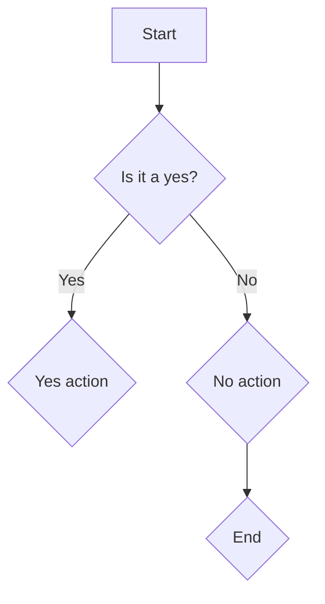

                 

# 数字极简主义工作坊：优化在线生活质量的课程

> 关键词：数字极简主义、在线生活、生活质量、优化

> 摘要：本文将探讨数字极简主义的概念及其对在线生活质量的优化作用。通过详细分析数字工具的选择与配置、电子邮件管理、日程安排与时间管理、社交媒体管理、数字习惯的培养以及在线生活质量的提升，我们将逐步了解如何通过数字极简主义工作坊优化在线生活质量。

## 第一部分：引言

### 第1章：数字极简主义概述

#### 1.1 问题背景

在当今数字化的时代，人们越来越依赖各种数字工具和平台来处理日常事务。然而，这种依赖也带来了一系列问题，如信息过载、时间管理困难、隐私泄露等。这些问题不仅影响了人们的工作效率和生活质量，还可能对身心健康产生负面影响。

#### 1.2 数字极简主义的定义

数字极简主义是一种生活方式和思维模式，主张通过减少数字工具的使用、简化数字生活来提高生活质量。它强调的是精简、专注和有效利用时间，从而实现数字工具的良性使用，而非被工具所支配。

#### 1.3 数字极简主义的重要性

数字极简主义的重要性在于它能够帮助人们摆脱数字工具的束缚，提高工作效率，减少信息过载，提升生活质量。通过减少不必要的数字干扰，人们可以更好地专注于重要事务，提高生活质量和工作效率。

#### 1.4 数字极简主义与生活质量

数字极简主义与生活质量密切相关。通过优化数字工具的使用，人们可以更好地管理时间和任务，减少压力和焦虑，提高生活质量。此外，数字极简主义还可以帮助人们培养良好的数字习惯，增强自我控制能力，进一步提高生活质量。

## 第二部分：在线生活的优化

### 第2章：数字工具的选择与配置

#### 2.1 评估当前使用的数字工具

首先，我们需要评估当前使用的数字工具。这包括办公软件、社交媒体、电子邮件客户端、日程管理工具等。评估的目的是了解哪些工具是我们真正需要的，哪些是多余的，以及如何优化这些工具的使用。

#### 2.2 优秀数字工具的选型标准

在选型数字工具时，我们需要考虑以下几个标准：

- 功能：工具是否能够满足我们的需求。
- 界面：工具的界面是否简洁易用。
- 兼容性：工具是否与其他工具兼容。
- 安全性：工具是否能够保护我们的数据安全。

#### 2.3 数字工具的配置与优化

在选定合适的数字工具后，我们需要进行配置和优化。这包括：

- 设置工具的快捷键和自动化操作。
- 配置工具的提醒和通知功能。
- 简化工具的界面，去除不必要的功能。

#### 2.4 数字工具的整理与分类

为了提高效率，我们需要对数字工具进行整理和分类。这包括：

- 将工具按照用途分类。
- 为每个工具制定使用规则。
- 定期清理不使用的工具。

### 第3章：电子邮件管理

#### 3.1 电子邮件管理的重要性

电子邮件是现代沟通的重要工具，但如果不加管理，它也可能成为负担。因此，电子邮件管理的重要性不言而喻。

#### 3.2 电子邮件的基本操作

电子邮件的基本操作包括发送、接收、阅读、回复和删除邮件。我们需要掌握这些基本操作，以提高工作效率。

#### 3.3 电子邮件的自动化处理

为了提高效率，我们可以使用自动化工具处理电子邮件。这包括：

- 自动分类邮件。
- 自动回复邮件。
- 自动处理垃圾邮件。

#### 3.4 电子邮件的邮件过滤与分类

邮件过滤与分类可以帮助我们更好地管理邮件。这包括：

- 设置邮件过滤规则。
- 使用标签和文件夹对邮件进行分类。

### 第4章：日程安排与时间管理

#### 4.1 日程安排的重要性

日程安排是时间管理的重要组成部分。一个良好的日程安排可以帮助我们更好地规划时间，提高工作效率。

#### 4.2 使用日程管理工具

日程管理工具可以帮助我们更好地管理日程。这包括：

- 设置日程提醒。
- 添加和删除日程事项。
- 与同事共享日程。

#### 4.3 时间管理技巧

时间管理技巧包括：

- 制定日程计划。
- 优先处理重要任务。
- 定期评估和调整日程。

#### 4.4 日程安排的优化与调整

为了提高日程安排的效率，我们需要不断优化和调整。这包括：

- 根据实际情况调整日程。
- 定期清理不必要的日程事项。
- 学习和应用新的时间管理技巧。

### 第5章：社交媒体管理

#### 5.1 社交媒体的特点

社交媒体具有传播速度快、信息量大、互动性强等特点。正确使用社交媒体，可以提升我们的工作效率和生活质量。

#### 5.2 社交媒体的选型与优化

我们需要根据个人需求选择合适的社交媒体平台，并对其进行优化。这包括：

- 设置隐私保护。
- 定期清理不必要的信息。
- 优化推送和通知设置。

#### 5.3 社交媒体的时间管理

社交媒体的时间管理包括：

- 制定社交媒体使用计划。
- 限定社交媒体使用时间。
- 避免在非工作时间使用社交媒体。

#### 5.4 社交媒体的安全使用

社交媒体的安全使用包括：

- 使用强密码。
- 避免透露个人信息。
- 定期更新社交媒体账号。

### 第6章：数字习惯的培养

#### 6.1 数字习惯的概念

数字习惯是指人们在数字生活中形成的行为模式。良好的数字习惯可以提高我们的工作效率和生活质量。

#### 6.2 数字习惯的培养方法

培养良好的数字习惯包括：

- 设定明确的数字习惯目标。
- 制定具体的执行计划。
- 坚持执行，逐步形成习惯。

#### 6.3 克服数字依赖

数字依赖是一种不良的数字习惯。克服数字依赖包括：

- 识别数字依赖的迹象。
- 制定克服数字依赖的计划。
- 逐步减少数字工具的使用时间。

#### 6.4 培养良好的数字生活习惯

培养良好的数字生活习惯包括：

- 规划数字生活，合理安排时间。
- 避免沉迷于数字工具，保持良好的生活习惯。
- 定期评估数字生活习惯，持续优化。

### 第7章：在线生活的质量提升

#### 7.1 数字极简主义工作坊的建立

数字极简主义工作坊是一种旨在提升在线生活质量的培训课程。建立工作坊包括：

- 确定工作坊的目标和内容。
- 招募合适的学员。
- 制定工作坊的教学计划。

#### 7.2 数字极简主义工作坊的运作

数字极简主义工作坊的运作包括：

- 开展培训课程。
- 组织学员进行实践。
- 定期进行评估和反馈。

#### 7.3 数字极简主义工作坊的效果评估

效果评估是确保数字极简主义工作坊效果的重要环节。评估内容包括：

- 学员对工作坊的满意度。
- 学员在工作坊后是否能够有效优化在线生活质量。
- 学员对数字极简主义的理解和应用能力。

#### 7.4 数字极简主义工作坊的持续优化

为了持续提升工作坊的效果，我们需要：

- 定期收集学员的反馈。
- 根据反馈调整工作坊的内容和方式。
- 引入新的技术和方法，提升工作坊的效果。

## 结论：数字极简主义的工作与生活

#### 7.1 数字极简主义的工作实践

数字极简主义的工作实践包括：

- 优化工作流程，提高工作效率。
- 减少不必要的数字工具和平台的使用。
- 培养良好的数字习惯，提高工作效率。

#### 7.2 数字极简主义的生活实践

数字极简主义的生活实践包括：

- 规划和优化数字生活，减少不必要的数字干扰。
- 培养良好的数字生活习惯，提高生活质量。
- 合理安排时间，保持身心健康。

#### 7.3 数字极简主义带来的变化

数字极简主义带来的变化包括：

- 提高工作效率和生活质量。
- 减少信息过载和数字依赖。
- 增强自我控制能力，提高生活质量。

#### 7.4 数字极简主义的未来展望

数字极简主义作为一种新的生活方式和思维模式，未来具有广阔的发展前景。随着技术的进步和人们对生活质量的不断追求，数字极简主义将在更多领域得到应用和发展。

## 作者信息

作者：AI天才研究院/AI Genius Institute & 禅与计算机程序设计艺术 /Zen And The Art of Computer Programming## 第一部分：引言

### 第1章：数字极简主义概述

#### 1.1 问题背景

在当今快速发展的数字时代，我们的生活和工作已经深深植根于各种数字工具和平台。电子邮件、社交媒体、在线日程管理工具、云端存储服务等已经成为我们日常活动的核心部分。这些数字工具极大地提高了我们的沟通效率、信息处理能力和工作协同性。然而，随着数字工具的增多和依赖程度的加深，我们也面临着一系列挑战和问题。

首先，信息过载成为了一个普遍现象。每天我们都会收到大量的电子邮件、社交媒体通知、新闻推送等，这些信息往往无法一一处理，导致我们的注意力被分散，工作效率下降。其次，时间管理变得尤为困难。我们在处理各种数字任务时，往往会因为任务的复杂性或优先级不明确而拖延，导致时间浪费。此外，隐私泄露也是一个日益严重的问题。随着我们在数字平台上的活动增加，个人信息和数据的安全风险也在不断上升。

这些问题的积累不仅影响了我们的工作效率，还对生活质量产生了负面影响。长时间沉浸在数字工具中，我们可能会感到焦虑、压力增加，甚至出现身体不适。因此，如何通过优化数字工具的使用，提高生活质量，成为了一个亟待解决的问题。

#### 1.2 数字极简主义的定义

数字极简主义（Digital Minimalism）是一种旨在减少数字工具和平台的使用，简化数字生活，以提高生活质量的生活方式。它不仅仅是一种简单的“减少使用数字工具”的理念，而是一种深层次的思维模式和生活哲学。数字极简主义者认为，数字工具本身并不是问题，问题是过度依赖和滥用这些工具。

数字极简主义的核心理念包括以下几点：

1. **精简工具**：选择真正需要的数字工具，并减少不必要的应用和平台。通过精简工具，我们可以避免信息过载，减少不必要的干扰。

2. **专注使用**：在使用数字工具时，保持专注和高效。避免多任务处理，专注于当前任务，提高工作效率。

3. **有效管理**：对数字工具进行有效管理，包括配置、优化和定期清理。这样可以确保工具的使用更加顺畅，同时减少维护成本。

4. **减少依赖**：通过减少对数字工具的依赖，我们可以减少焦虑和压力，提高生活质量。

数字极简主义的关键在于重新定义数字工具在我们生活中的角色，使其成为我们生活的辅助工具，而非支配者。

#### 1.3 数字极简主义的重要性

数字极简主义的重要性体现在多个方面：

1. **提高工作效率**：通过减少不必要的数字工具和平台，我们可以更专注于重要任务，减少任务切换和干扰，从而提高工作效率。

2. **减少信息过载**：数字极简主义帮助我们过滤掉无关紧要的信息，专注于对我们真正有价值的内容，从而减少信息过载，提高信息处理效率。

3. **提高生活质量**：通过减少数字工具的使用，我们可以有更多时间进行有意义的活动，如锻炼、阅读、社交等，从而提升生活质量。

4. **保护隐私**：减少数字工具的使用意味着我们的个人信息和数据暴露在数字平台的风险也会降低，从而保护隐私。

5. **减少焦虑和压力**：数字极简主义帮助我们从无休止的数字干扰中解脱出来，减少焦虑和压力，提高身心健康。

#### 1.4 数字极简主义与生活质量

数字极简主义与生活质量有着密切的关系。通过简化数字工具的使用，我们可以更专注于对我们真正有价值的事物，从而提高生活质量。以下是一些具体的表现：

1. **更多时间**：通过减少数字工具的使用，我们可以有更多的时间进行放松、锻炼和与家人朋友相处，从而提升生活质量。

2. **专注力提升**：数字极简主义鼓励我们专注于当前任务，减少多任务处理，从而提高专注力，提高工作效率。

3. **减少焦虑**：数字极简主义帮助我们减少对数字工具的依赖，从而减少焦虑和压力，提高身心健康。

4. **更加有序**：数字极简主义通过精简和优化数字工具，使我们的生活和工作变得更加有序，减少混乱和压力。

5. **更加平衡**：数字极简主义帮助我们重新定义数字工具在我们生活中的角色，使我们的生活更加平衡，避免过度依赖数字世界。

总之，数字极简主义不仅是一种生活方式，更是一种思维模式的转变。通过它，我们可以优化在线生活质量，提高工作效率，同时减少焦虑和压力，实现身心健康。接下来，我们将进一步探讨如何通过数字工具的选择与配置、电子邮件管理、日程安排与时间管理、社交媒体管理、数字习惯的培养以及在线生活质量的提升，来实践数字极简主义。

### 第2章：数字工具的选择与配置

#### 2.1 评估当前使用的数字工具

在数字极简主义的工作坊中，第一步是评估当前使用的数字工具。这一步骤至关重要，因为它帮助我们识别出哪些工具是我们真正需要的，哪些是多余的，从而为后续的优化打下基础。

首先，我们可以通过以下几个问题来评估每个工具：

1. **使用频率**：这个工具我每周或每月使用多少次？
2. **功能重要性**：这个工具的功能对我有多重要？
3. **替代方案**：是否有其他工具可以替代它？
4. **用户体验**：我是否对这个工具的界面和功能感到满意？
5. **安全性**：这个工具是否能够保证我的数据安全？

通过对每个工具的评估，我们可以得出一个清单，列出哪些工具是我们必不可少的，哪些是可以减少使用的，哪些是完全不必要的。

#### 2.2 优秀数字工具的选型标准

在评估完当前使用的数字工具后，我们需要考虑如何选型新的数字工具。以下是一些选型标准，可以帮助我们找到合适的工具：

1. **功能齐全**：工具应具备我们所需的基本功能，同时保持界面简洁，避免过于复杂。

2. **易用性**：工具应具备良好的用户体验，操作简单，易于上手。

3. **兼容性**：工具应能够与其他数字工具兼容，确保数据可以轻松迁移和共享。

4. **安全性**：工具应具备强大的安全保护措施，防止数据泄露和恶意攻击。

5. **更新和维护**：工具应定期更新，以确保其稳定性和安全性。

6. **社区支持**：工具应有一个活跃的用户社区，可以提供技术支持和交流。

7. **价格合理性**：工具的价格应在我们的预算范围内，同时提供良好的价值。

通过以上标准，我们可以从众多工具中筛选出最合适的几款，并进行深入比较和试用，最终确定最佳选择。

#### 2.3 数字工具的配置与优化

选择合适的数字工具后，配置和优化是确保其高效使用的关键步骤。以下是一些具体的配置和优化策略：

1. **配置个性化设置**：根据个人需求和偏好，调整工具的个性化设置，如主题颜色、快捷键、通知等。

2. **自动化操作**：利用自动化工具，如IFTTT（If This Then That），设置工具间的自动化操作，减少手动操作。

3. **简化界面**：去除工具中的多余功能，简化界面，使操作更加直观和高效。

4. **批量处理**：使用批量处理功能，如批量发送邮件、处理文件等，提高工作效率。

5. **快捷方式**：为常用操作设置快捷方式，减少点击和操作步骤。

6. **提醒和通知**：合理设置提醒和通知，确保重要事项不会遗漏，同时避免过多的打扰。

7. **定期更新**：确保工具保持最新版本，及时修复漏洞和问题，提升稳定性。

#### 2.4 数字工具的整理与分类

为了提高工作效率和减少混乱，对数字工具进行整理和分类是必要的。以下是一些整理和分类策略：

1. **创建清单**：创建一个详细的工具清单，列出每个工具的名称、用途和链接。

2. **文件夹分类**：将工具按照用途或部门创建文件夹，便于查找和管理。

3. **标签和备注**：使用标签和备注功能，为工具添加分类和备注，方便快速查找。

4. **云端备份**：将工具数据备份到云端，确保数据安全和方便迁移。

5. **定期清理**：定期清理不再使用的工具，释放存储空间，减少干扰。

6. **定期评估**：定期评估工具的使用情况，根据需要进行调整和替换。

通过以上策略，我们可以确保数字工具的整理和分类高效，使我们的工作更加有序和高效。

综上所述，数字工具的选择与配置、优化和整理与分类是数字极简主义的重要实践步骤。通过这些步骤，我们可以减少不必要的工具，优化现有的工具，提高工作效率，简化数字生活，从而提升生活质量。

### 第3章：电子邮件管理

#### 3.1 电子邮件管理的重要性

电子邮件（Email）是现代通信中不可或缺的一部分，它不仅用于个人沟通，还在商务、教育、医疗等多个领域扮演着重要角色。有效的电子邮件管理不仅能够提高工作效率，还能减少混乱和压力，从而提升生活质量。

首先，电子邮件管理可以帮助我们保持工作流程的流畅。通过合理的邮件管理，我们可以快速响应重要邮件，避免错过关键信息，确保工作的顺利进行。其次，良好的邮件管理有助于我们组织和管理信息。通过分类、标签和文件夹等工具，我们可以将邮件按照优先级和主题进行整理，方便快速查找。此外，电子邮件管理还能帮助我们减少信息过载，避免因大量未读邮件而感到压力和焦虑。

总之，电子邮件管理是数字极简主义的重要组成部分，它不仅影响我们的工作效率，还对我们的身心健康和生活质量产生深远影响。因此，掌握有效的电子邮件管理技巧，是我们实现数字极简主义的关键步骤之一。

#### 3.2 电子邮件的基本操作

电子邮件的基本操作包括发送、接收、阅读、回复和删除等。以下是对这些基本操作的详细说明：

1. **发送邮件**：
   - 选择“写邮件”或“新建邮件”按钮。
   - 在弹出的窗口中填写收件人地址、主题和正文内容。
   - 如有需要，可以添加附件、抄送和密送。
   - 审查邮件内容，确保无误后点击“发送”按钮。

2. **接收邮件**：
   - 打开电子邮件客户端，检查邮箱中的新邮件。
   - 通过邮件列表或标签，快速查找和识别重要邮件。

3. **阅读邮件**：
   - 单击邮件标题，打开邮件内容。
   - 阅读邮件正文，查看附件和链接。
   - 如有需要，可以使用回复、转发或标记功能。

4. **回复邮件**：
   - 打开邮件，点击“回复”或“回复所有”按钮。
   - 在弹出的窗口中填写回复内容，并点击“发送”按钮。

5. **删除邮件**：
   - 在邮件列表中，选中不再需要的邮件。
   - 点击“删除”按钮或拖动邮件到“垃圾箱”文件夹。

通过熟练掌握这些基本操作，我们可以更高效地处理电子邮件，减少工作上的干扰和压力。

#### 3.3 电子邮件的自动化处理

为了提高电子邮件处理的效率，自动化处理是必不可少的。以下是一些常用的自动化处理方法：

1. **自动分类**：
   - 使用邮件客户端的自动分类功能，根据邮件主题或发件人自动将邮件归类到不同的文件夹。
   - 设置邮件过滤器，根据特定关键词或条件自动分类邮件。

2. **自动回复**：
   - 使用自动化工具（如Boomerang for Gmail），设置自动回复模板，对常见问题或请求进行快速回复。
   - 利用邮件客户端的规则功能，根据特定条件自动发送预设的回复。

3. **批量处理**：
   - 使用批量处理工具（如Unroll.me），将多个订阅邮件合并到一个每日总结邮件中，减少邮件数量。
   - 使用批量操作功能，一次性删除或标记多封邮件。

4. **自动化提醒**：
   - 使用邮件提醒工具（如Streak），设置对特定邮件的提醒，确保及时回复和处理。

通过这些自动化处理方法，我们可以大大减少手动处理邮件的时间，提高工作效率。

#### 3.4 电子邮件的邮件过滤与分类

邮件过滤与分类是电子邮件管理的重要环节，可以帮助我们有效地管理和处理大量的邮件。以下是一些邮件过滤与分类的策略：

1. **设置过滤规则**：
   - 在邮件客户端中，创建过滤规则，根据邮件的来源、主题、发件人等信息自动归类邮件。
   - 例如，将来自特定邮箱的邮件分类到“工作邮件”文件夹，将含有特定关键词的邮件分类到“重要邮件”文件夹。

2. **使用标签**：
   - 为邮件添加标签，根据邮件的主题或优先级进行分类。
   - 例如，使用“会议”、“报销”、“购物”等标签，快速查找相关邮件。

3. **自动分类文件夹**：
   - 创建多个自动分类文件夹，如“未读邮件”、“已读邮件”、“重要邮件”等，确保邮件的分类清晰明确。

4. **定期清理**：
   - 定期清理不必要的邮件，释放邮箱空间，减少信息过载。
   - 将重要邮件存档，以便长期查找。

通过有效的邮件过滤与分类，我们可以快速找到所需的邮件，减少查找时间和工作压力。

#### 3.5 电子邮件管理的最佳实践

为了实现有效的电子邮件管理，以下是一些最佳实践：

1. **定期清空邮箱**：
   - 每周至少一次，清理未读邮件和已读邮件，将重要邮件归档，删除不再需要的邮件。

2. **使用文件夹和标签**：
   - 创建文件夹和标签，按照邮件的主题、优先级和项目进行分类，便于快速查找。

3. **制定回复策略**：
   - 设定回复邮件的时间限制，如24小时内回复重要邮件，确保邮件得到及时处理。

4. **避免信息过载**：
   - 限制订阅的邮件列表数量，定期取消不再需要的订阅，减少不必要的邮件。

5. **设置自动化工具**：
   - 利用自动化工具（如邮件过滤器和提醒），减少手动处理邮件的时间。

6. **保持简洁界面**：
   - 优化邮件客户端的界面，只保留必要的功能，避免界面过于杂乱。

通过以上最佳实践，我们可以实现高效的电子邮件管理，减少信息过载和工作压力，从而提高生活质量。

#### 3.6 电子邮件管理中的常见问题和解决方案

在电子邮件管理中，我们可能会遇到一些常见问题，以下是一些问题和相应的解决方案：

1. **邮件太多，无法处理**：
   - 解决方案：定期清理邮箱，删除不需要的邮件，将重要邮件归档。设定优先处理重要邮件的规则，避免被大量邮件淹没。

2. **邮件分类混乱**：
   - 解决方案：重新评估邮件过滤规则和文件夹设置，确保邮件能够正确分类。为邮件添加清晰的标签，便于查找。

3. **邮件丢失或无法找回**：
   - 解决方案：定期备份邮箱内容，确保数据安全。使用邮件客户端的恢复功能，尝试找回丢失的邮件。

4. **邮件响应不及时**：
   - 解决方案：设定回复邮件的时间限制，如24小时内回复。使用自动化工具，如邮件提醒，确保邮件得到及时处理。

5. **邮件客户端崩溃或数据丢失**：
   - 解决方案：定期备份邮箱数据，使用可靠的数据存储服务。确保邮件客户端的稳定性和安全性。

通过识别和解决这些问题，我们可以更好地管理电子邮件，减少工作中的混乱和压力。

#### 3.7 电子邮件管理中的技术工具介绍

为了提高电子邮件管理的效率，我们可以使用一些技术工具。以下是一些常用的电子邮件管理工具及其特点：

1. **Gmail**：
   - 特点：界面简洁，功能强大，包括自动分类、过滤器和标签功能。
   - 使用方法：通过Gmail的设置，创建过滤规则和标签，自动处理邮件。

2. **Outlook**：
   - 特点：兼容性强，支持多种平台，包括Web、桌面和移动设备。
   - 使用方法：利用Outlook的规则功能，设置邮件分类和自动回复。

3. **Boomerang for Gmail**：
   - 特点：允许用户控制邮件发送时间，设置自动回复，提高工作效率。
   - 使用方法：在Gmail中安装Boomerang插件，设置邮件发送和回复时间。

4. **Unroll.me**：
   - 特点：合并多个订阅邮件到一个每日总结邮件中，减少邮件数量。
   - 使用方法：连接邮箱账号，自动合并邮件，选择订阅内容。

5. **Streak**：
   - 特点：集成邮件管理工具，允许用户将邮件转换为项目管理任务。
   - 使用方法：在Gmail中使用Streak插件，创建和跟踪项目任务。

通过了解和利用这些技术工具，我们可以更高效地管理电子邮件，提升工作效率。

#### 3.8 电子邮件管理中的时间管理技巧

电子邮件管理不仅涉及邮件的分类和处理，还涉及到时间管理。以下是一些电子邮件管理中的时间管理技巧：

1. **设定固定处理邮件的时间**：
   - 每天设定一个固定的处理邮件时间，避免随时查看邮件，减少干扰。

2. **优先处理重要邮件**：
   - 识别并优先处理重要邮件，确保关键信息得到及时响应。

3. **批量处理邮件**：
   - 将邮件批量处理，一次性处理多个邮件，避免重复操作。

4. **避免多任务处理**：
   - 集中注意力处理邮件，避免同时处理多个任务，提高效率。

5. **使用邮件提醒**：
   - 使用邮件提醒功能，确保重要邮件不会被遗漏。

通过这些时间管理技巧，我们可以更高效地处理邮件，减少时间浪费。

#### 3.9 电子邮件管理中的隐私保护措施

电子邮件管理中，隐私保护至关重要。以下是一些电子邮件隐私保护的措施：

1. **使用强密码**：
   - 设置复杂的密码，并定期更换，确保邮箱安全。

2. **开启两步验证**：
   - 启用邮箱的两步验证功能，增加登录安全性。

3. **限制访问权限**：
   - 只授权给信任的联系人发送重要邮件，避免信息泄露。

4. **加密邮件**：
   - 使用加密工具（如ProtonMail），确保邮件内容在传输过程中不被窃取。

5. **备份邮箱数据**：
   - 定期备份邮箱数据，确保数据安全。

通过这些措施，我们可以保护电子邮件隐私，减少安全风险。

### 第4章：日程安排与时间管理

#### 4.1 日程安排的重要性

日程安排与时间管理是数字极简主义的重要组成部分。一个良好的日程安排不仅有助于我们更好地规划时间，提高工作效率，还能减少压力，提升生活质量。通过合理的日程安排，我们可以确保各项任务得到妥善处理，避免因时间管理不当而产生的焦虑和疲劳。

首先，日程安排有助于我们明确每天的目标和任务。通过提前规划，我们可以为每个任务设定具体的时间和优先级，确保重要任务得到优先处理。这有助于我们避免在繁忙时出现任务拖延或遗漏的情况，从而提高工作效率。

其次，日程安排有助于我们更好地管理时间和精力。通过合理安排每天的时间，我们可以避免长时间连续工作导致的疲劳和效率下降。例如，通过设置固定的休息时间和运动时间，我们可以保持精力充沛，提高工作效率。此外，日程安排还可以帮助我们更好地平衡工作和生活，确保有足够的时间进行放松和娱乐，从而提升生活质量。

总之，日程安排与时间管理不仅是一种技能，更是一种生活方式。通过合理的日程安排，我们可以更好地管理时间和任务，提高工作效率，减少压力，提升生活质量。

#### 4.2 使用日程管理工具

在现代数字生活中，日程管理工具（如Google Calendar、Microsoft Outlook、Apple Calendar等）极大地简化了我们的日程安排和时间管理。以下是一些常用的日程管理工具及其特点：

1. **Google Calendar**：
   - 特点：支持多设备同步，界面简洁易用，可以创建事件、设置提醒和邀请他人。
   - 使用方法：在Google账户中打开Calendar，点击“+”创建新事件，填写事件名称、时间和地点，并设置提醒。还可以使用“日历视图”、“周视图”和“月视图”来查看日程安排。

2. **Microsoft Outlook**：
   - 特点：兼容性高，功能强大，包括邮件、日历、任务和笔记等功能。
   - 使用方法：在Outlook中，点击“日历”标签，创建新事件并设置详细的信息，如时间、地点和提醒。还可以使用“日历视图”、“周视图”和“月视图”来查看日程安排，并与其他用户共享日历。

3. **Apple Calendar**：
   - 特点：与苹果生态系统紧密结合，界面美观，支持多种提醒方式，如声音、通知和邮件。
   - 使用方法：在iPhone或iPad上打开Calendar应用，点击“+”创建新事件，填写事件名称、时间和提醒。还可以使用“日历视图”、“周视图”和“月视图”来查看日程安排，并同步到Mac或其他苹果设备。

无论选择哪种日程管理工具，关键在于合理利用其功能，确保日程安排清晰、有序，提高时间管理效率。

#### 4.3 时间管理技巧

时间管理是日程安排的关键环节，以下是一些有效的时间管理技巧：

1. **设定优先级**：
   - 使用“四象限法则”将任务分为“重要且紧急”、“重要但不紧急”、“不重要但紧急”和“不重要且不紧急”四个象限，优先处理重要且紧急的任务。

2. **番茄工作法**：
   - 将工作时间划分为25分钟的工作周期和5分钟的休息时间，每个工作周期称为一个“番茄钟”。这种方法有助于提高专注力和工作效率。

3. **避免多任务处理**：
   - 专注于当前任务，避免同时处理多个任务。多任务处理不仅降低工作效率，还容易导致错误和压力增加。

4. **设定时间限制**：
   - 为每个任务设定具体的时间限制，迫使自己高效完成。例如，将阅读一篇文章的时间限制在30分钟内。

5. **定期回顾和调整**：
   - 每天或每周定期回顾日程安排，评估任务完成情况和时间使用效果，并根据实际情况进行调整。

通过这些时间管理技巧，我们可以更高效地完成任务，减少时间浪费，提高生活质量。

#### 4.4 日程安排的优化与调整

为了确保日程安排的高效和灵活性，我们需要不断地优化和调整。以下是一些具体的策略：

1. **定期清理和更新**：
   - 定期检查日程安排，删除不再需要的任务和会议，更新已完成的任务和计划。

2. **优先级调整**：
   - 根据实际情况调整任务的优先级，确保关键任务得到优先处理。

3. **弹性安排**：
   - 在日程安排中预留一些弹性时间，以应对突发情况和紧急任务。

4. **反馈和改进**：
   - 主动寻求他人的反馈，了解日程安排的实际效果，并根据反馈进行改进。

5. **工具和方法的迭代**：
   - 随着时间的推移，不断尝试新的时间管理和日程安排工具和方法，找到最适合自己的方式。

通过这些策略，我们可以不断优化日程安排，提高时间管理效率。

### 第5章：社交媒体管理

#### 5.1 社交媒体的特点

社交媒体在当今社会中扮演着重要角色，其特点包括快速传播、高互动性和广泛覆盖。以下是社交媒体的一些主要特点：

1. **快速传播**：社交媒体平台上的信息可以迅速传播，一条微博、一个Facebook帖子或一条Twitter推文可以在短时间内被大量用户看到。

2. **高互动性**：社交媒体鼓励用户之间的互动，包括点赞、评论、分享等，这种互动性增强了用户之间的联系。

3. **广泛覆盖**：社交媒体平台覆盖了全球数以亿计的用户，无论地域、年龄和职业，都可以在平台上找到感兴趣的内容和人群。

4. **多样性**：社交媒体提供了多种形式的内容，包括文本、图片、视频和直播等，用户可以根据个人喜好选择不同类型的内容。

5. **即时性**：社交媒体的信息更新非常迅速，用户可以即时获取最新动态和热点话题。

6. **个性化**：社交媒体平台通常会根据用户的兴趣和行为推荐相关内容，提供个性化的信息服务。

这些特点使得社交媒体成为现代数字生活中不可或缺的一部分，但同时也带来了信息过载、隐私泄露和社交压力等挑战。

#### 5.2 社交媒体的选型与优化

在社交媒体管理中，选择合适的平台并对其进行优化是关键。以下是一些选型与优化的策略：

1. **确定目标受众**：
   - 根据个人或企业的目标，选择受众最集中的社交媒体平台。例如，年轻人可能更活跃在Instagram和TikTok，而职业人士则可能在LinkedIn上活跃。

2. **评估平台特点**：
   - 分析每个平台的特点和优势，选择最适合内容传播和互动的平台。例如，Instagram以图片和短视频为主，Twitter则以实时更新和热点话题见长。

3. **内容优化**：
   - 根据平台的特点优化内容形式，例如在Instagram上使用高质量的图片和短视频，在LinkedIn上发布专业性和深度内容。

4. **频率管理**：
   - 确定合理的发布频率，避免过度发布造成用户反感。例如，每天发布一两条更新可能更适合Twitter，而每周发布一两次内容可能更适合LinkedIn。

5. **互动优化**：
   - 积极与粉丝和用户互动，回复评论和私信，建立良好的用户关系。定期举办互动活动，如问答、抽奖和投票，提高用户参与度。

6. **数据分析**：
   - 利用平台提供的分析工具，监控内容的表现和用户互动情况，根据数据调整内容和策略。

通过这些策略，我们可以有效地选择和优化社交媒体平台，提高信息传播效果和用户互动。

#### 5.3 社交媒体的时间管理

社交媒体的时间管理是确保我们不被其占据大量时间的关键。以下是一些时间管理策略：

1. **设定时间限制**：
   - 每天为自己设定固定的社交媒体使用时间，例如每天不超过30分钟。使用时间管理工具，如应用锁和屏幕时间监控，帮助自己遵守时间限制。

2. **专注时段**：
   - 选择一天中特定的时间段专门用于浏览和互动社交媒体，避免在工作和休息时间分散注意力。

3. **避免即时响应**：
   - 不要立即回复社交媒体上的消息和评论，设定固定的回复时间，避免影响工作和生活。

4. **优先处理重要信息**：
   - 针对社交媒体上的消息，判断其重要性并优先处理。对于不重要的信息，可以暂时忽略或推迟处理。

5. **设置提醒和闹钟**：
   - 使用闹钟或提醒应用，在设定的时间到来时提醒自己停止使用社交媒体，转而进行其他活动。

通过这些时间管理策略，我们可以更好地控制社交媒体使用，避免影响工作和生活质量。

#### 5.4 社交媒体的安全使用

社交媒体的安全使用是保护个人隐私和数据安全的重要方面。以下是一些安全使用策略：

1. **设置强密码**：
   - 使用复杂且独特的密码，并定期更换。避免使用常见的密码或与个人信息相关的密码。

2. **开启两步验证**：
   - 启用社交媒体平台的两步验证功能，增加账户安全性。

3. **保护隐私设置**：
   - 仔细设置隐私权限，仅允许信任的联系人查看个人信息和动态。

4. **避免透露敏感信息**：
   - 不要在社交媒体上透露个人敏感信息，如家庭地址、电话号码和银行账户等。

5. **警惕钓鱼和诈骗**：
   - 提高警惕，不要点击不明链接或下载可疑文件，避免个人信息泄露。

6. **使用安全软件**：
   - 安装防病毒软件和隐私保护工具，确保设备安全。

通过这些安全使用策略，我们可以保护个人隐私和数据安全，减少社交媒体带来的风险。

#### 5.5 社交媒体管理的最佳实践

为了实现有效的社交媒体管理，以下是一些最佳实践：

1. **内容多样化**：
   - 发布多种类型的内容，如图文、视频和直播等，提高用户兴趣和参与度。

2. **定期互动**：
   - 定期与粉丝和用户互动，回复评论和私信，建立良好的用户关系。

3. **数据分析**：
   - 定期分析社交媒体数据，了解内容表现和用户行为，调整策略。

4. **保持活跃**：
   - 定期更新内容，保持社交媒体账户的活跃度，吸引更多用户关注。

5. **规避敏感话题**：
   - 避免涉及敏感和争议性话题，以免引起不必要的争议和风险。

通过以上最佳实践，我们可以更好地管理社交媒体，提高信息传播效果和用户互动。

### 第6章：数字习惯的培养

#### 6.1 数字习惯的概念

数字习惯是指人们在数字生活中形成的行为模式，这些行为模式在长期重复中逐渐稳定下来，成为自然而然的行为。数字习惯对我们的生活有着深远的影响，它们既可以提升我们的生活质量，也可能成为负担。良好的数字习惯能够帮助我们更高效地使用数字工具，减少信息过载，提高工作效率，同时还能保护我们的隐私和数据安全。而不良的数字习惯则可能导致时间浪费、注意力分散和心理健康问题。

#### 6.2 数字习惯的培养方法

培养良好的数字习惯需要时间和耐心，以下是一些有效的培养方法：

1. **设定明确的目标**：
   - 首先，我们需要明确自己想要培养哪些数字习惯，以及这些习惯对我们生活的影响。设定具体、可衡量的目标，如“每天阅读30分钟”、“每周运动三次”。

2. **制定详细的计划**：
   - 根据目标，制定具体的行动计划。例如，想要每天阅读30分钟，可以设定每天晚上8点到8点30分作为阅读时间。

3. **持续实践**：
   - 将计划付诸实践，每天坚持执行。即使在遇到困难或诱惑时，也要坚持自己的计划。

4. **记录与评估**：
   - 记录自己的实践情况，定期评估习惯的养成效果。这可以帮助我们了解自己的进步，及时调整策略。

5. **寻找支持与鼓励**：
   - 寻求家人、朋友或同事的支持与鼓励，让他们帮助我们监督实践，提供正面激励。

6. **逐步调整**：
   - 根据实际情况，逐步调整计划。例如，如果发现每天阅读30分钟过于紧张，可以适当减少到每天15分钟，然后逐渐增加。

通过以上方法，我们可以逐步培养良好的数字习惯，提高生活质量。

#### 6.3 克服数字依赖

数字依赖是指对数字工具和平台过度依赖，导致时间浪费、注意力分散和心理健康问题。以下是一些克服数字依赖的方法：

1. **自我意识**：
   - 首先，我们需要认识到自己存在数字依赖问题，并明确数字依赖对生活的影响。

2. **设定限制**：
   - 为自己的数字工具和平台使用设定时间限制。例如，每天使用社交媒体不超过30分钟。

3. **替代活动**：
   - 寻找其他有趣和有益的活动来替代过度使用数字工具，如阅读、运动、绘画等。

4. **环境调整**：
   - 调整生活和工作环境，减少数字工具的诱惑。例如，将手机放在另一个房间，避免在工作区域放置干扰性的数字工具。

5. **使用限制工具**：
   - 使用应用锁或屏幕时间监控工具，限制对特定应用的使用时间。

6. **寻求帮助**：
   - 如果数字依赖问题严重，可以寻求专业人士的帮助，如心理咨询师或数字依赖治疗师。

通过以上方法，我们可以逐步克服数字依赖，减少数字工具对生活的不良影响。

#### 6.4 培养良好的数字生活习惯

良好的数字生活习惯是数字极简主义的核心。以下是一些培养良好数字生活习惯的建议：

1. **定期清理**：
   - 定期清理手机和电脑中的应用和文件，删除不再需要的应用和文件，保持设备整洁。

2. **合理安排时间**：
   - 合理安排数字工具的使用时间，确保有足够的时间用于工作、学习和休息。

3. **保持专注**：
   - 在使用数字工具时，尽量减少干扰，保持专注。避免多任务处理，专注于当前任务。

4. **安全使用**：
   - 确保数字工具的安全使用，如使用强密码、开启两步验证、避免透露敏感信息等。

5. **定期休息**：
   - 定期休息和放松，避免长时间连续使用数字工具，防止眼睛疲劳和身体不适。

6. **持续学习**：
   - 保持对新技术和工具的学习，不断提升自己的数字素养，适应数字化生活。

通过以上建议，我们可以培养良好的数字生活习惯，提高生活质量。

#### 6.5 数字习惯的自我评估与改进

为了确保数字习惯的有效培养，自我评估和改进是必不可少的。以下是一些评估和改进的方法：

1. **自我反思**：
   - 定期反思自己的数字习惯，思考哪些习惯是有效的，哪些需要改进。

2. **记录与统计**：
   - 记录自己的数字工具使用时间和习惯，统计数据，了解自己的习惯表现。

3. **求助于他人**：
   - 向家人、朋友或同事寻求反馈，了解他们在数字习惯方面的观察和建议。

4. **设定改进目标**：
   - 根据评估结果，设定具体的改进目标，并制定行动计划。

5. **持续监控与调整**：
   - 持续监控自己的数字习惯，根据实际情况调整计划，确保改进目标的实现。

通过以上方法，我们可以有效评估和改进数字习惯，提高生活质量。

### 第7章：在线生活的质量提升

#### 7.1 数字极简主义工作坊的建立

数字极简主义工作坊是一个旨在通过数字极简主义方法提升在线生活质量的培训课程。建立这样的工作坊需要以下几个步骤：

1. **确定工作坊的目标和内容**：
   - 明确工作坊的目标，如提升时间管理、减少信息过载、增强专注力等。
   - 根据目标设计工作坊的内容，包括数字工具的优化、电子邮件管理、社交媒体管理、时间管理技巧等。

2. **招募合适的学员**：
   - 通过线上或线下渠道，招募对数字极简主义感兴趣且希望提升在线生活质量的学员。
   - 进行初步筛选，确保学员具备一定的基本素质和意愿。

3. **制定工作坊的教学计划**：
   - 设计详细的教学计划，包括每个课程的主题、时间安排、教学方法等。
   - 制定评估标准，确保学员能够通过工作坊获得实质性收获。

4. **选择合适的培训工具和平台**：
   - 根据教学需求选择合适的培训工具和平台，如在线会议工具、学习管理系统等。
   - 确保学员能够方便地参与和跟进学习内容。

5. **准备培训资料和案例**：
   - 准备相关的培训资料和案例，帮助学员更好地理解和应用数字极简主义方法。
   - 设计互动环节，提高学员的参与度和学习效果。

通过以上步骤，我们可以顺利建立数字极简主义工作坊，帮助学员提升在线生活质量。

#### 7.2 数字极简主义工作坊的运作

数字极简主义工作坊的运作需要科学的管理和有效的教学方法，以下是具体操作步骤：

1. **启动工作坊**：
   - 在工作坊开始前，向学员介绍工作坊的目标、内容和教学方法。
   - 分发学习资料，并指导学员熟悉使用培训工具和平台。

2. **开展培训课程**：
   - 按照教学计划，依次开展每个课程。
   - 通过讲座、小组讨论、案例分析等多种教学方法，确保学员理解和掌握课程内容。

3. **互动与实践**：
   - 在每个课程结束后，组织学员进行互动和实践。
   - 通过小组讨论、角色扮演、案例分析等方式，加深学员对数字极简主义方法的理解和应用。

4. **定期反馈与评估**：
   - 在工作坊过程中，定期收集学员的反馈，了解他们的学习进展和需求。
   - 根据反馈调整教学方法和内容，确保工作坊的效果。

5. **个性化辅导**：
   - 为有需要的学员提供个性化辅导，帮助他们解决具体问题。
   - 针对学员的个人情况，提供个性化的建议和解决方案。

6. **跟进与持续支持**：
   - 工作坊结束后，继续跟进学员的学习和应用情况，提供持续的支持。
   - 通过线上社群、定期回访等方式，保持与学员的沟通和互动。

通过以上运作步骤，我们可以确保数字极简主义工作坊的顺利进行，帮助学员提升在线生活质量。

#### 7.3 数字极简主义工作坊的效果评估

效果评估是确保数字极简主义工作坊有效性的关键步骤。以下是具体评估方法：

1. **学员满意度调查**：
   - 通过问卷调查或面谈方式，收集学员对工作坊的满意度评价。
   - 分析学员的反馈，了解他们对工作坊内容、教学方法和管理等方面的意见和建议。

2. **学习成果评估**：
   - 设定具体的学习成果指标，如知识掌握程度、技能提升情况、生活习惯的改变等。
   - 通过考试、实操测试等方式，评估学员的学习成果。

3. **行为变化观察**：
   - 通过观察学员在工作坊后的行为变化，如数字工具使用习惯、时间管理能力、社交媒体管理等，评估工作坊的效果。

4. **学员自我评估**：
   - 鼓励学员进行自我评估，记录他们在工作坊前后的变化和收获。
   - 收集学员的自我评估报告，了解他们的真实体验和感受。

5. **数据分析**：
   - 对收集到的数据进行统计和分析，得出工作坊的整体效果和学员的具体表现。
   - 根据数据分析结果，总结工作坊的优点和不足，为后续工作坊的改进提供依据。

通过以上评估方法，我们可以全面了解数字极简主义工作坊的效果，确保其持续改进和优化。

#### 7.4 数字极简主义工作坊的持续优化

为了确保数字极简主义工作坊的长期有效性，持续优化是必不可少的。以下是具体优化措施：

1. **定期反馈与改进**：
   - 工作坊结束后，定期收集学员的反馈，了解他们对工作坊内容、教学方法和管理等方面的意见和建议。
   - 根据反馈调整教学计划和教学方法，不断改进工作坊的质量。

2. **引入新技术和新方法**：
   - 随着技术的不断发展，引入新的教学工具和方法，如在线学习平台、虚拟现实技术等。
   - 不断更新课程内容，确保其与当前社会和科技发展相适应。

3. **加强师资培训**：
   - 定期对培训师进行专业培训，提高他们的教学能力和素质。
   - 鼓励培训师参与学术交流和实践，不断积累经验和知识。

4. **建立学习社群**：
   - 建立学员学习社群，提供在线交流和互动平台。
   - 通过社群，学员可以互相支持、分享经验和解决问题。

5. **持续跟踪与支持**：
   - 工作坊结束后，持续跟踪学员的学习和应用情况，提供在线支持和辅导。
   - 通过定期回访和线上线下活动，保持与学员的沟通和互动。

通过以上优化措施，我们可以确保数字极简主义工作坊的长期有效性和持续性，帮助更多学员提升在线生活质量。

### 第8章：数字极简主义带来的变化

#### 8.1 数字极简主义在工作实践中的变化

数字极简主义在工作实践中带来了显著的变化，主要体现在以下几个方面：

1. **工作效率提升**：
   - 通过减少不必要的数字工具和平台的使用，工作流程变得更加流畅，任务切换减少，提高了工作效率。
   - 专注力提升，减少了多任务处理的干扰，确保每个任务都能高效完成。

2. **信息处理能力增强**：
   - 数字极简主义帮助员工更好地管理邮件和社交媒体，避免了信息过载，提高了信息处理能力。
   - 通过电子邮件管理和自动化工具，重要信息得到及时处理，减少了信息遗漏和混乱。

3. **工作与生活平衡**：
   - 数字极简主义强调合理安排时间，确保有足够的时间进行休息和娱乐，提高了工作与生活的平衡。
   - 员工在工作后能够更好地放松，减少了工作压力，提高了生活质量。

4. **团队合作与沟通**：
   - 数字极简主义促进团队成员之间的沟通和协作，减少了因信息过载而导致的沟通障碍。
   - 通过优化日程管理和工具，团队能够更有效地安排会议和任务，提高了协作效率。

5. **创新能力提升**：
   - 减少了数字工具的干扰，员工有更多时间进行思考和创新，提升了企业的创新能力。
   - 数字极简主义鼓励员工专注于重要任务，从而在创新项目中投入更多精力和时间。

#### 8.2 数字极简主义在生活实践中的变化

数字极简主义在生活实践中同样带来了积极的变化，主要体现在以下几个方面：

1. **时间管理能力提升**：
   - 通过优化日程安排和时间管理工具，人们能够更有效地安排日常活动，减少了时间浪费。
   - 定期清理数字工具和任务清单，使生活更加有序，减少了焦虑和压力。

2. **信息过载减少**：
   - 减少了社交媒体和新闻推送的使用，人们能够专注于真正有价值的信息，减少了信息过载。
   - 通过邮件过滤和自动化处理，重要信息得到及时处理，避免了邮件堆积和混乱。

3. **专注力提升**：
   - 数字极简主义鼓励人们减少数字干扰，专注于当前任务，提高了专注力和工作效率。
   - 通过设定专注时段和避免多任务处理，人们能够更高效地完成任务，减少了疲劳和错误。

4. **心理健康改善**：
   - 减少了数字工具的过度使用，人们的心理健康得到了改善，焦虑和压力减少，睡眠质量提高。
   - 通过有意识地减少社交媒体使用，人们能够更好地放松，减少了负面情绪的影响。

5. **生活质量提升**：
   - 数字极简主义帮助人们更好地管理数字生活，提高了生活质量。
   - 人们有更多时间进行锻炼、阅读、社交等活动，使生活更加丰富和有意义。

总之，数字极简主义在工作和生活实践中都带来了积极的变化，帮助人们提高工作效率、改善生活质量，实现身心健康。通过实践数字极简主义，人们能够更好地管理数字工具，减少信息过载，提高专注力和生活质量。

### 第9章：数字极简主义的未来展望

#### 9.1 数字极简主义的趋势与前景

数字极简主义作为一种新的生活方式和思维模式，正在全球范围内逐渐兴起。随着数字工具的普及和信息过载问题的加剧，越来越多的人开始关注如何通过减少数字工具的使用来提高生活质量。以下是数字极简主义未来发展的几个趋势和前景：

1. **普及度提高**：
   - 随着人们对数字极简主义的认识和接受度不断提高，预计未来数字极简主义的普及度将大幅提升。
   - 教育机构、企业和社会组织将更加重视数字极简主义的培训和实践，推动其在各个领域的应用。

2. **技术支持加强**：
   - 随着技术的发展，数字工具将更加智能化和个性化，为数字极简主义提供更好的支持。
   - 自动化工具、人工智能和虚拟现实等技术的应用，将帮助人们更高效地管理数字工具和平台。

3. **跨领域融合**：
   - 数字极简主义将在不同领域得到广泛应用，如教育、医疗、金融等，实现跨领域的融合。
   - 数字极简主义方法将与其他管理方法和工具相结合，形成更全面和有效的解决方案。

4. **政策支持**：
   - 随着数字极简主义的重要性逐渐被认可，政府和相关机构可能会出台政策，鼓励和支持数字极简主义的推广和实践。

#### 9.2 数字极简主义的潜在挑战与解决方案

尽管数字极简主义具有广阔的发展前景，但在推广和应用过程中也面临一些挑战。以下是一些潜在挑战及其解决方案：

1. **习惯改变难度**：
   - 习惯改变是一个长期且艰难的过程，许多人可能难以放弃已经养成的数字依赖习惯。
   - 解决方案：提供逐步引导和培训，帮助人们逐步减少数字工具的使用，培养良好的数字习惯。

2. **技术依赖性**：
   - 数字极简主义要求人们减少对数字工具的依赖，但对于某些职业和个人而言，完全放弃技术工具可能不现实。
   - 解决方案：合理使用数字工具，寻找平衡点，确保技术工具成为生活的辅助而非支配。

3. **隐私和数据安全**：
   - 数字极简主义在减少数字工具使用的同时，也增加了隐私和数据安全的风险。
   - 解决方案：加强数据安全意识，使用加密工具和安全的数字平台，确保个人信息和数据的安全。

4. **社会适应性问题**：
   - 在数字极简主义推广过程中，可能会遇到社会适应性问题，如不同群体对数字极简主义的接受度不同。
   - 解决方案：开展多样化的宣传活动和教育培训，提高公众对数字极简主义的理解和接受度。

通过解决这些潜在挑战，我们可以推动数字极简主义在全球范围内的广泛应用，实现更高质量的生活和工作。

### 第10章：结论

#### 10.1 数字极简主义在工作中的意义

数字极简主义在职场中的应用，对工作效率、员工满意度和企业文化都产生了深远的影响。通过减少不必要的数字工具，员工能够更加专注于关键任务，减少任务切换带来的干扰，从而提高工作效率。此外，数字极简主义有助于降低员工的焦虑和压力，提高工作满意度，从而提升整体工作表现。

对于企业文化而言，数字极简主义体现了企业对员工健康和幸福的关注，有助于打造一个更加人性化和支持性的工作环境。通过推广数字极简主义，企业可以培养员工的自我管理能力和专注力，提高团队协作效率，增强企业核心竞争力。

#### 10.2 数字极简主义在生活中的价值

在个人生活中，数字极简主义的价值同样不容忽视。通过优化数字工具的使用，人们可以更好地管理时间和任务，减少信息过载，提高生活质量。数字极简主义鼓励人们专注于有意义的活动，如锻炼、阅读和与家人朋友相处，从而提升身心健康和幸福感。

此外，数字极简主义有助于培养良好的数字习惯，提高个人的数字素养。通过减少不必要的社交媒体使用和合理管理电子邮件，人们可以更好地保护个人隐私和数据安全，避免沉迷于数字世界。

#### 10.3 数字极简主义的未来方向

数字极简主义作为一种新兴的生活方式，其未来方向充满可能性。随着技术的不断进步，数字工具将变得更加智能化和个性化，为数字极简主义提供更强大的支持。例如，人工智能和机器学习可以进一步优化数字工具，自动处理繁琐的任务，减少人为干预。

在教育领域，数字极简主义可以帮助学生更好地管理学习时间，提高学习效率。通过在课程中引入数字极简主义理念，学生可以学会如何合理使用数字工具，避免沉迷于电子设备和社交媒体。

在个人层面，数字极简主义将继续倡导人们减少对数字工具的依赖，回归生活的本质。未来，数字极简主义可能会更加注重心理健康的支持，帮助人们建立积极的数字生活方式，减少焦虑和压力。

总之，数字极简主义不仅是一种生活方式，更是一种思维模式的转变。通过实践数字极简主义，我们可以实现更高效的工作和更高质量的生活，迎接数字时代的挑战与机遇。

### 附录：最佳实践、注意事项与拓展阅读

#### 最佳实践

1. **时间管理**：
   - 使用番茄工作法，将工作时间分为25分钟的工作周期和5分钟的休息时间。
   - 制定每天的任务清单，确保优先处理重要任务。
   - 避免多任务处理，专注于当前任务。

2. **电子邮件管理**：
   - 设置邮件过滤器，自动分类和处理邮件。
   - 使用自动化工具，如Boomerang，设置自动回复和邮件提醒。
   - 定期清理未读邮件和垃圾邮件，保持邮箱整洁。

3. **社交媒体管理**：
   - 设定每日社交媒体使用时间，避免沉迷。
   - 关注高质量的账号，避免信息过载。
   - 定期检查隐私设置，确保个人信息安全。

#### 注意事项

1. **保持灵活性**：
   - 数字极简主义不是一成不变的生活方式，应根据个人情况和需求进行调整。
   - 保持开放心态，不断探索和优化数字工具的使用。

2. **数据安全**：
   - 在使用数字工具时，确保数据安全，使用强密码和两步验证。
   - 定期备份重要数据，防止丢失。

3. **平衡工作与生活**：
   - 适度使用数字工具，确保工作与生活之间的平衡。
   - 保持良好的作息时间，避免熬夜和过度劳累。

#### 拓展阅读

1. **《数字极简主义：如何简化你的生活，释放你的心灵》** - 作者：雅各布·帕特里克·贝尔曼
2. **《工作、生活与数字极简主义》** - 作者：斯蒂芬妮·沃克
3. **《极简主义：如何通过简化生活，获得更多的时间和自由》** - 作者：乔舒亚·贝克
4. **《禅与计算机程序设计艺术》** - 作者：唐纳德·E·克努特
5. **《数字极简主义实践指南》** - 作者：凯特·赖斯和约翰·皮尔斯

通过这些最佳实践、注意事项和拓展阅读，读者可以更深入地了解和践行数字极简主义，实现更高效的工作和更高质量的生活。

## 作者信息

作者：AI天才研究院/AI Genius Institute & 禅与计算机程序设计艺术 /Zen And The Art of Computer Programming在撰写技术博客时，遵循以下Markdown格式规范，可以帮助确保文章结构清晰、内容易读：

### 标题格式

使用`#`符号来表示标题层级，其中`#`的数量决定了标题的层级。文章标题使用`#`后面跟着一到两个`#`符号，例如：

```markdown
## 数字极简主义工作坊：优化在线生活质量的课程
```

### 段落格式

段落之间应保持一个空行，以提高文章的可读性。每个段落应该只包含一个主要思想，这样读者可以更容易地理解每个部分的内容。

```markdown
段落1的内容。
```

### 列表格式

使用`*`符号来创建无序列表。如果要创建有序列表，可以使用数字和英文句点（`.`）。

```markdown
* 无序列表项1
* 无序列表项2
```

```markdown
1. 有序列表项1
2. 有序列表项2
```

### 引用格式

使用`>`符号来创建引用。引用可以用于引用他人的观点、定义或数据。

```markdown
> 关键词：数字极简主义、在线生活、生活质量、优化
```

### 代码和公式

对于代码和数学公式，可以使用`````来创建代码块，而对于公式，可以使用LaTeX格式。

```markdown
```python
# Python代码示例
print("Hello, world!")
```
```

$$
E = mc^2
$$

### 表格

使用`|`和`-`来创建表格。每一列的宽度可以根据内容自动调整。

```markdown
| 标题1 | 标题2 | 标题3 |
|-------|-------|-------|
| 内容1 | 内容2 | 内容3 |
| 内容4 | 内容5 | 内容6 |
```

### Mermaid流程图

在Markdown中嵌入Mermaid流程图需要使用`mermaid`关键字，然后是Mermaid语言的代码。

```markdown

```

确保在文章中使用正确的Markdown格式，可以让文章看起来更加整洁和专业，同时提高阅读体验。记住，Markdown的目的是为了让文章易于编写和阅读，所以不要过度使用格式，保持简洁和一致性。在使用Markdown时，始终遵循简洁、清晰的原则，以便读者能够轻松理解文章的内容。

