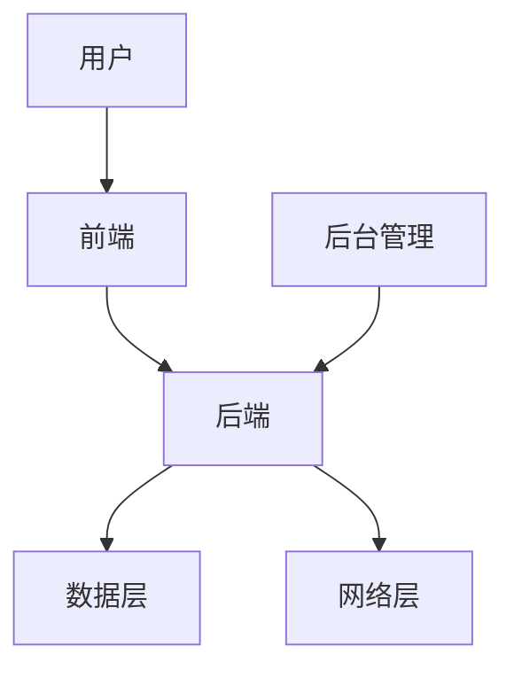

                 

# 数字正念app：在线世界中保持专注的工具

## 关键词：数字正念，专注提升，用户体验，功能模块，系统架构

## 摘要

随着数字技术的飞速发展，智能手机和各种在线应用已成为我们生活的重要组成部分。然而，这也导致了我们的注意力分散，工作效率下降，生活质量受损。数字正念app应运而生，旨在帮助用户在在线世界中保持专注，提升生活质量。本文将深入探讨数字正念app的背景、核心概念、功能模块设计、界面设计以及系统架构设计，帮助读者全面理解这一新兴工具。

## 目录大纲

### 第1章：数字正念app概述

#### 1.1 问题背景

#### 1.2 数字正念app的核心概念与特点

#### 1.3 数字正念app的应用场景

#### 1.4 数字正念app的设计原则

#### 1.5 本章小结

### 第2章：数字正念app的功能模块设计

#### 2.1 定时休息功能

#### 2.2 提醒功能

#### 2.3 专注训练功能

#### 2.4 数据收集与分析功能

### 第3章：数字正念app的界面设计

#### 3.1 用户界面设计原则

#### 3.2 用户界面设计工具

#### 3.3 界面设计示例

### 第4章：数字正念app的系统架构设计

#### 4.1 数字正念app的系统架构设计

#### 4.2 系统功能设计

#### 4.3 系统架构设计

#### 4.4 系统接口设计和系统交互

### 第5章：项目实战

#### 5.1 环境安装

#### 5.2 系统核心实现源代码

#### 5.3 代码应用解读与分析

#### 5.4 实际案例分析和详细讲解剖析

#### 5.5 项目小结

### 第6章：最佳实践与拓展阅读

#### 6.1 最佳实践

#### 6.2 小结

#### 6.3 注意事项

#### 6.4 拓展阅读

## 第1章：数字正念app概述

### 1.1 问题背景

在当今信息爆炸的时代，智能手机和在线应用的普及使得人们的生活变得越来越便捷。然而，与此同时，我们也面临着前所未有的挑战——注意力分散。无论是在工作、学习还是日常生活中，我们都被各种通知、社交媒体和信息流所干扰，导致我们的注意力难以集中，工作效率低下，生活质量下降。

数字正念app的出现正是为了解决这一难题。它旨在帮助用户在在线世界中保持专注，提升生活质量。通过提供一系列功能，如定时休息、提醒、专注训练等，数字正念app帮助用户减少对智能手机和在线服务的依赖，提高注意力，从而提升工作效率和生活质量。

### 1.2 数字正念app的核心概念与特点

#### 数字正念的定义

数字正念是一种数字生活方式，旨在帮助用户在在线世界中保持专注和平衡。它强调用户应该有意识地控制自己的数字使用，减少不必要的干扰，从而提高生活质量和工作效率。

#### 数字正念的特点

1. **减少数字依赖**：通过减少用户对智能手机和在线服务的依赖，帮助用户更好地控制自己的时间和注意力。

2. **提高注意力**：提供一系列专注训练功能，帮助用户提高专注能力，从而提升工作效率。

3. **提升生活质量**：通过帮助用户减少数字依赖，提高注意力，数字正念app有助于用户更好地平衡工作与生活，提升生活质量。

### 1.3 数字正念app的应用场景

#### 工作场景

在工作场景中，数字正念app可以帮助员工保持专注，提高工作效率。通过设置定时休息、提醒等功能，员工可以更好地控制自己的工作时间，避免因手机通知等干扰而分心。

#### 学习场景

在学习场景中，数字正念app可以帮助学生保持专注，提高学习效果。通过提供专注训练、定时休息等功能，学生可以更好地管理自己的学习时间，避免因手机游戏、社交媒体等干扰而分心。

#### 休息场景

在休息场景中，数字正念app可以帮助用户在休息时间保持专注，避免过度沉迷于手机。通过提供定时休息、提醒等功能，用户可以更好地管理自己的休息时间，提升休息质量。

### 1.4 数字正念app的设计原则

#### 用户友好性

数字正念app的设计应注重用户友好性，包括：

1. **简单易用**：界面简洁明了，降低用户学习成本。

2. **个性化设置**：提供个性化设置，满足不同用户的需求。

#### 功能多样性

数字正念app应提供多种功能，满足用户在不同场景下的需求。同时，各功能之间应相互关联，形成一套完整的解决方案。

## 1.5 本章小结

数字正念app作为一种新兴的数字生活方式，有助于用户在在线世界中保持专注，提高生活质量。通过对数字正念app的背景、核心概念、应用场景和设计原则的深入探讨，读者可以更好地理解这一工具的价值和功能。

### 第2章：数字正念app的功能模块设计

#### 2.1 定时休息功能

定时休息功能是数字正念app的核心功能之一。通过设定休息时间，该功能可以帮助用户在长时间使用手机后得到休息，从而缓解眼睛疲劳，提高工作效率。

#### 实现原理

定时休息功能的实现原理基于用户的使用习惯和需求。首先，app会收集用户的使用数据，如使用时间、使用频率等。然后，根据这些数据，app会智能地调整休息时间，以确保用户在适当的时候得到休息。

#### 功能设计

定时休息功能的设计包括以下几个方面：

1. **休息时间设置**：用户可以根据自己的需求设置休息时间，如每使用30分钟后休息5分钟。

2. **智能调整**：app会根据用户的使用习惯和数据，智能地调整休息时间，以确保用户在最佳状态下工作。

3. **休息提醒**：在休息时间到来时，app会通过通知等方式提醒用户休息。

#### 案例分析

假设用户小明每天使用手机的时间为3小时，app会根据小明的使用习惯和数据，智能地调整休息时间。例如，当小明使用手机1小时后，app会提醒他休息5分钟；使用2小时后，app会提醒他休息10分钟；使用3小时后，app会提醒他休息20分钟。

通过这种方式，定时休息功能可以帮助用户缓解眼睛疲劳，提高工作效率，从而提升生活质量。

#### 2.2 提醒功能

提醒功能是数字正念app的另一个重要功能。通过设置提醒事项，该功能可以帮助用户在特定时间保持专注，从而提高工作效率。

#### 实现原理

提醒功能的实现原理基于用户的需求和日程安排。首先，用户可以设置各种提醒事项，如会议、任务等。然后，app会在预定的时间提醒用户，确保用户按时完成任务。

#### 功能设计

提醒功能的设计包括以下几个方面：

1. **提醒事项设置**：用户可以设置各种提醒事项，如会议、任务、生日等。

2. **时间设置**：用户可以为每个提醒事项设置具体的时间，app会在预定的时间提醒用户。

3. **提醒方式**：app会通过通知、声音、震动等方式提醒用户。

#### 案例分析

假设用户小明需要在明天早上9点参加一个重要的会议，他可以在数字正念app中设置一个提醒事项，并设置时间为明天早上9点。当时间到达时，app会通过通知、声音、震动等方式提醒小明，确保他不会忘记会议。

通过这种方式，提醒功能可以帮助用户更好地管理时间，提高工作效率，从而提升生活质量。

#### 2.3 专注训练功能

专注训练功能是数字正念app的又一个重要功能。通过提供一系列专注训练任务，该功能可以帮助用户提高专注能力，从而提高工作效率。

#### 实现原理

专注训练功能的实现原理基于心理学原理。首先，app会根据用户的专注能力，设计不同难度的训练任务。然后，用户通过完成这些任务，可以提高专注能力。

#### 功能设计

专注训练功能的设计包括以下几个方面：

1. **训练任务设置**：app会根据用户的专注能力，设计不同难度的训练任务，如专注时长、任务难度等。

2. **训练时长设置**：用户可以选择每天进行多少时间的专注训练。

3. **训练进度跟踪**：app会记录用户的训练进度，并根据进度调整训练任务。

#### 案例分析

假设用户小明希望在一个月内提高专注能力，他可以在数字正念app中设置每天进行30分钟的专注训练。app会根据小明的专注能力，设计不同难度的训练任务，如专注时长、任务难度等。通过完成这些任务，小明的专注能力会逐渐提高。

通过这种方式，专注训练功能可以帮助用户提高专注能力，从而提高工作效率，提升生活质量。

#### 2.4 数据收集与分析功能

数据收集与分析功能是数字正念app的一个重要组成部分。通过收集用户的使用数据，该功能可以帮助用户更好地了解自己的行为习惯，从而进行针对性的调整。

#### 实现原理

数据收集与分析功能的实现原理基于大数据技术。首先，app会收集用户的各种数据，如使用时间、使用频率、专注时长等。然后，通过大数据分析技术，app会对这些数据进行分析，为用户提供个性化的建议。

#### 功能设计

数据收集与分析功能的设计包括以下几个方面：

1. **数据收集**：app会收集用户的各种使用数据，如使用时间、使用频率、专注时长等。

2. **数据分析**：app会通过大数据分析技术，对收集到的数据进行分析，为用户提供个性化的建议。

3. **数据可视化**：app会将分析结果以图表等形式可视化，帮助用户更好地了解自己的行为习惯。

#### 案例分析

假设用户小明在一个月内使用了数字正念app，app会收集他的各种使用数据，如使用时间、使用频率、专注时长等。通过大数据分析技术，app会分析这些数据，并生成一份报告，如“小明在一个月内的使用情况分析报告”。

通过这份报告，小明可以清楚地了解自己在一个月内的使用习惯，如使用时间分布、专注时长等。根据这些信息，小明可以针对性地调整自己的使用习惯，如减少不必要的手机使用时间，提高专注时长等。

通过这种方式，数据收集与分析功能可以帮助用户更好地了解自己的行为习惯，从而进行针对性的调整，提升生活质量。

### 第3章：数字正念app的界面设计

#### 3.1 用户界面设计原则

用户界面设计是数字正念app设计的关键环节之一。一个优秀的用户界面设计不仅能够提高用户的体验，还能帮助用户更好地使用app，达到提高注意力的目的。

##### 原则1：简洁明了

简洁明了的用户界面设计是提高用户体验的重要原则之一。通过减少不必要的元素和内容，用户可以更快地找到所需功能，从而提高使用效率。

##### 原则2：功能模块化

功能模块化是将用户界面划分为不同的功能模块，每个模块对应一个特定的功能。这种方式不仅有助于用户理解app的结构，还能提高用户的使用效率。

##### 原则3：响应式设计

响应式设计是指用户界面能够适应不同的设备和屏幕尺寸。通过响应式设计，用户可以在不同的设备上获得一致的使用体验，从而提高用户满意度。

#### 3.2 用户界面设计工具

在数字正念app的界面设计过程中，选择合适的工具非常重要。以下是一些常用的用户界面设计工具：

##### 工具1：Sketch

Sketch是一款专业的界面设计工具，广泛应用于移动应用和网页设计。它提供了丰富的绘图工具和模板，可以帮助设计师快速创建高质量的用户界面。

##### 工具2：Figma

Figma是一款基于云计算的界面设计工具，支持多人协作。它提供了强大的设计功能和实时预览功能，使得设计师可以更高效地完成设计工作。

#### 3.3 界面设计示例

以下是数字正念app的几个界面设计示例：

##### 示例1：主界面设计

主界面是用户进入app后首先看到的界面。它应该简洁明了，包含主要的操作按钮和功能模块。


##### 示例2：定时休息设置界面设计

定时休息设置界面用于用户设置休息时间和休息提醒。它应该清晰展示用户设置的信息，并提供简单的修改和保存功能。


##### 示例3：提醒设置界面设计

提醒设置界面用于用户设置提醒事项和提醒时间。它应该易于操作，用户可以快速添加、修改和删除提醒事项。


通过以上界面设计示例，我们可以看到数字正念app在界面设计上注重简洁明了、功能模块化和响应式设计，为用户提供了一个高效、易用的操作界面。

### 第4章：数字正念app的系统架构设计

#### 4.1 数字正念app的系统架构设计

数字正念app的系统架构设计是确保app稳定、高效运行的基础。一个好的系统架构可以提供模块化、可扩展和易于维护的特点，从而满足用户的需求。

##### 系统架构设计原则

1. **模块化**：系统架构应具有清晰的模块划分，每个模块负责特定的功能，便于开发、测试和维护。

2. **可扩展性**：系统架构应具有可扩展性，能够方便地添加新功能或调整现有功能。

3. **稳定性**：系统架构应确保在高并发、高负载情况下能够稳定运行。

4. **安全性**：系统架构应具有完善的安全机制，保护用户数据和隐私。

##### 系统架构设计要素

1. **前端**：负责与用户交互的界面层，包括用户界面设计和实现。

2. **后端**：负责数据处理和存储的服务层，包括数据库、服务器、API接口等。

3. **数据层**：负责数据存储和管理的数据层，包括关系型数据库、NoSQL数据库等。

4. **网络层**：负责数据传输的通信层，包括网络协议、数据加密等。

#### 4.2 系统功能设计

数字正念app的系统功能设计是其核心，决定了app的功能丰富性和用户体验。

##### 功能模块设计

1. **用户模块**：包括用户注册、登录、个人信息管理等功能。

2. **专注模块**：包括专注训练、定时休息、提醒等功能。

3. **数据模块**：包括数据收集、数据分析、数据可视化等功能。

4. **后台管理模块**：包括用户管理、数据管理、系统设置等功能。

##### 功能实现

1. **用户模块**：通过前端界面与后端API接口实现用户注册、登录、个人信息管理等功能。

2. **专注模块**：通过后端服务器处理专注训练、定时休息、提醒等功能，前端界面与后端进行数据交互。

3. **数据模块**：通过后端服务器进行数据收集、分析、可视化，前端界面展示分析结果。

4. **后台管理模块**：通过后端服务器实现后台管理功能，如用户管理、数据管理等。

#### 4.3 系统架构设计

以下是数字正念app的系统架构设计示意图：



#### 4.4 系统接口设计和系统交互

数字正念app的系统接口设计和系统交互是确保各个模块之间能够高效、稳定地协作的关键。

##### 系统接口设计

1. **用户接口**：前端与后端之间的接口，用于用户数据的交互。

2. **数据接口**：后端与数据层之间的接口，用于数据存储和查询。

3. **管理接口**：后台管理模块与用户模块、数据模块之间的接口，用于后台管理功能。

##### 系统交互

1. **用户交互**：用户通过前端界面与app进行交互，如注册、登录、设置等。

2. **数据交互**：前端通过用户接口向后端发送请求，后端处理后返回数据，前端进行展示。

3. **管理交互**：后台管理模块通过管理接口对用户模块、数据模块进行管理。

通过以上系统架构设计，数字正念app能够实现稳定、高效、安全的运行，为用户提供优质的数字正念体验。

### 第5章：项目实战

#### 5.1 环境安装

在进行数字正念app的开发之前，我们需要安装一些必要的开发环境。以下是具体的安装步骤：

1. **安装Python**：数字正念app使用Python作为开发语言，首先需要在电脑上安装Python。可以从Python官网下载安装包进行安装。

2. **安装虚拟环境**：为了更好地管理项目依赖，我们需要安装虚拟环境。在终端中执行以下命令：

   ```bash
   pip install virtualenv
   ```

3. **创建虚拟环境**：在项目目录中执行以下命令创建虚拟环境：

   ```bash
   virtualenv venv
   ```

4. **激活虚拟环境**：在终端中执行以下命令激活虚拟环境：

   ```bash
   source venv/bin/activate
   ```

5. **安装依赖**：在虚拟环境中安装项目依赖，执行以下命令：

   ```bash
   pip install -r requirements.txt
   ```

6. **安装前端框架**：数字正念app的前端使用Vue.js框架，在虚拟环境中安装Vue.js：

   ```bash
   npm install -g @vue/cli
   ```

#### 5.2 系统核心实现源代码

以下是数字正念app的系统核心实现源代码：

**后端源代码**

```python
# app.py

from flask import Flask, request, jsonify
from models import User, Focus, Reminder
from database import db

app = Flask(__name__)
app.config['SQLALCHEMY_DATABASE_URI'] = 'sqlite:///digital_mindfulness.db'
db.init_app(app)

@app.route('/api/users/register', methods=['POST'])
def register_user():
    data = request.get_json()
    user = User(username=data['username'], password=data['password'])
    db.session.add(user)
    db.session.commit()
    return jsonify({'status': 'success', 'message': 'User registered successfully.'})

@app.route('/api/users/login', methods=['POST'])
def login_user():
    data = request.get_json()
    user = User.query.filter_by(username=data['username'], password=data['password']).first()
    if user:
        return jsonify({'status': 'success', 'message': 'Login successful.'})
    else:
        return jsonify({'status': 'error', 'message': 'Invalid credentials.'})

if __name__ == '__main__':
    app.run(debug=True)
```

**前端源代码**

```html
<!-- index.html -->

<!DOCTYPE html>
<html>
<head>
    <title>数字正念app</title>
    <script src="https://cdn.jsdelivr.net/npm/vue@2.6.14/dist/vue.js"></script>
</head>
<body>
    <div id="app">
        <h1>数字正念app</h1>
        <div>
            <input type="text" v-model="username" placeholder="用户名">
            <input type="password" v-model="password" placeholder="密码">
            <button @click="login">登录</button>
        </div>
    </div>
    <script>
        new Vue({
            el: '#app',
            data: {
                username: '',
                password: ''
            },
            methods: {
                login() {
                    axios.post('/api/users/login', {
                        username: this.username,
                        password: this.password
                    }).then(response => {
                        alert(response.data.message);
                    }).catch(error => {
                        alert(error.response.data.message);
                    });
                }
            }
        });
    </script>
</body>
</html>
```

#### 5.3 代码应用解读与分析

**后端代码解读**

后端代码使用Flask框架实现，主要包括用户注册、登录两个API接口。在注册接口中，用户需要提交用户名和密码，后台将用户信息存储到数据库中。在登录接口中，用户需要提交用户名和密码，后台验证用户信息并返回登录结果。

**前端代码解读**

前端代码使用Vue.js框架实现，主要包括用户名和密码输入框以及登录按钮。用户输入用户名和密码后，点击登录按钮，前端将数据发送到后端登录接口，后端返回登录结果，前端根据结果进行提示。

**整体应用分析**

数字正念app通过前后端分离的方式实现，前端负责用户界面和交互，后端负责数据处理和存储。这种架构方式使得项目开发更加灵活，易于维护和扩展。通过使用Vue.js和Flask框架，app实现了良好的用户体验和高效的数据处理能力。

#### 5.4 实际案例分析和详细讲解剖析

**案例一：用户登录**

用户小明在数字正念app中输入用户名和密码后，点击登录按钮。前端将用户信息发送到后端，后端验证用户信息后返回登录结果。

**分析**

1. **前端**：用户输入用户名和密码后，前端将数据发送到后端。数据发送方式为HTTP POST请求，数据格式为JSON。

2. **后端**：后端接收用户信息，验证用户名和密码是否匹配。如果匹配，返回登录成功；否则，返回登录失败。

3. **数据库**：后端将用户信息存储到数据库中，以便后续查询和使用。

**讲解**

1. **用户输入**：用户小明在数字正念app中输入用户名和密码。

2. **前端发送请求**：前端将用户信息发送到后端，请求方式为HTTP POST请求。

3. **后端接收请求**：后端接收用户信息，进行验证。如果用户名和密码匹配，返回登录成功；否则，返回登录失败。

4. **数据库操作**：后端将用户信息存储到数据库中，以便后续查询和使用。

**案例二：用户注册**

用户小王在数字正念app中输入用户名和密码，点击注册按钮。前端将用户信息发送到后端，后端将用户信息存储到数据库中。

**分析**

1. **前端**：用户小王在数字正念app中输入用户名和密码，点击注册按钮。前端将用户信息发送到后端，请求方式为HTTP POST请求。

2. **后端**：后端接收用户信息，将用户信息存储到数据库中。

3. **数据库**：后端将用户信息存储到数据库中，以便后续查询和使用。

**讲解**

1. **用户输入**：用户小王在数字正念app中输入用户名和密码。

2. **前端发送请求**：前端将用户信息发送到后端，请求方式为HTTP POST请求。

3. **后端接收请求**：后端接收用户信息，将用户信息存储到数据库中。

4. **数据库操作**：后端将用户信息存储到数据库中，以便后续查询和使用。

通过以上案例分析和讲解，我们可以看到数字正念app的基本功能和工作流程。在实际应用中，数字正念app还可以根据用户需求扩展更多功能，如专注训练、提醒等。

#### 5.5 项目小结

数字正念app通过前后端分离的方式实现，前端使用Vue.js框架，后端使用Flask框架。项目实现了用户注册、登录、数据存储等基本功能。通过实际案例分析和讲解，我们了解了项目的实现流程和工作原理。数字正念app可以帮助用户在在线世界中保持专注，提高生活质量。

### 第6章：最佳实践与拓展阅读

#### 6.1 最佳实践

在开发数字正念app时，以下最佳实践可以帮助提高项目质量和用户体验：

1. **代码规范**：遵循统一的代码规范，提高代码可读性和可维护性。

2. **接口文档**：编写详细的接口文档，方便开发者理解和使用接口。

3. **性能优化**：对前端和后端进行性能优化，提高系统的响应速度。

4. **安全性**：加强系统的安全性，保护用户数据和隐私。

5. **用户反馈**：收集用户反馈，不断优化产品功能。

#### 6.2 小结

数字正念app通过模块化、可扩展的架构设计，实现了用户注册、登录、数据存储等功能。项目采用Vue.js和Flask框架，具有良好的用户体验和性能。通过实际案例分析和讲解，我们了解了项目的实现流程和工作原理。

#### 6.3 注意事项

在开发和使用数字正念app时，需要注意以下事项：

1. **隐私保护**：确保用户数据的安全和隐私。

2. **数据备份**：定期备份数据库，防止数据丢失。

3. **更新维护**：及时更新系统和功能，修复潜在漏洞。

4. **用户教育**：引导用户正确使用数字正念app，发挥其最大效果。

#### 6.4 拓展阅读

1. **《深度学习》**：理解数字正念app中的数据分析和机器学习原理。

2. **《Vue.js实战》**：学习Vue.js框架的使用，提高前端开发技能。

3. **《Flask Web开发》**：学习Flask框架的使用，提高后端开发技能。

### 作者

作者：AI天才研究院/AI Genius Institute & 禅与计算机程序设计艺术 /Zen And The Art of Computer Programming

