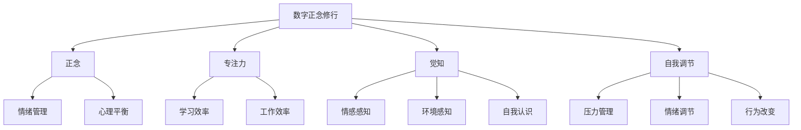

                 

### 文章标题：数字正念修行师认证：在线世界觉知培训项目

> 关键词：数字正念、修行师认证、在线世界觉知、培训项目

> 摘要：本文将探讨数字正念修行师认证的在线世界觉知培训项目，深入分析其背景、核心概念、科学原理以及实践方法。通过详细阐述项目结构、实战案例和最佳实践，为读者提供一次全面、系统的觉知训练体验。

---

**引言**

在当今数字化时代，我们每个人都在不断接触和依赖在线世界，无论是社交媒体、电子商务还是远程办公，都深刻地影响着我们的生活。然而，随之而来的信息过载和注意力分散问题也日益严重。数字正念修行应运而生，它旨在帮助我们在这个充满干扰的环境中培养专注力、提高自我觉知，从而更好地应对现代生活的挑战。

本文将详细探讨一个名为“数字正念修行师认证：在线世界觉知培训项目”的课程，该课程旨在培养和认证具备在线世界觉知能力的专业修行师。我们将从以下几个部分进行深入分析：

1. **背景介绍**：了解数字正念修行的起源和重要性，以及为什么在线世界觉知成为了一个迫切需要解决的问题。
2. **核心概念与联系**：介绍数字正念修行中的关键概念，并探讨这些概念之间的相互关系。
3. **科学原理**：探讨大脑机制、心理学和生物学背景，为数字正念修行提供科学依据。
4. **觉知训练方法**：详细解析觉知训练的理论基础、步骤、工具和技术。
5. **实践与体验**：通过初级、中级和高级实践，展示觉知训练的实际效果。
6. **觉知训练的具体方法**：进一步探讨觉知训练的具体方法，包括案例分析、实践指导和效果评估。
7. **觉知训练的应用**：探讨觉知训练在多个领域的应用，如教育、工作和医疗健康。
8. **觉知训练实践**：介绍觉知训练项目的实践过程，包括系统功能设计、架构设计和接口交互。
9. **实战案例分析**：通过具体案例，分析觉知训练的实际效果和实施方法。
10. **最佳实践与总结**：总结觉知训练的最佳实践，提出注意事项和拓展阅读建议。

---

**第一部分：正念修行基础**

### 第1章：正念修行的背景和重要性

#### 1.1 问题背景

在现代社会，人们的生活节奏加快，压力增加，心理健康问题日益突出。据研究，超过70%的人表示他们的心理健康受到工作、社交媒体和在线活动的负面影响。这种压力和焦虑不仅影响了生活质量，还可能导致一系列健康问题，如失眠、焦虑和抑郁。

#### 1.2 问题描述

面对这些挑战，传统心理治疗方法可能并不总是有效。我们需要一种新的方法来应对这种现代生活方式带来的负面影响。数字正念修行应运而生，它提供了一种基于正念和专注力的训练方法，旨在帮助我们更好地管理压力和情绪，提高心理健康水平。

#### 1.3 问题解决

数字正念修行通过一系列的练习和训练，帮助我们培养专注力、提高自我觉知，从而更好地应对现代生活的挑战。这种修行方法不仅可以帮助我们减少压力，还可以提高工作效率、改善人际关系，甚至提高创造力。

#### 1.4 边界与外延

数字正念修行并不仅限于心理健康领域，它还可以应用于教育、工作、医疗健康等多个领域。例如，在教育领域，数字正念修行可以帮助学生提高学习效率和注意力；在工作领域，它可以帮助员工提高工作效率和减少错误；在医疗健康领域，它可以帮助患者管理慢性疾病和提高生活质量。

---

### 第2章：核心概念与联系

#### 2.1 核心概念原理

数字正念修行的核心概念包括正念、专注力、觉知和自我调节。正念是指对当前时刻的完全关注和接受；专注力是指集中注意力的能力；觉知是指对自身内在和外在环境的感知；自我调节是指对自己的情绪和行为进行有效管理。

#### 2.2 概念属性特征对比表格

| 概念   | 定义                                                         | 属性特征                                                       |
| ------ | ------------------------------------------------------------ | ------------------------------------------------------------ |
| 正念   | 对当前时刻的完全关注和接受                                   | 自我调节、情绪管理、心理平衡                                   |
| 专注力 | 集中注意力的能力                                           | 学习效率、工作效率、注意力分散的抵抗能力                         |
| 觉知   | 对自身内在和外在环境的感知                                   | 情感感知、环境感知、自我认识                                   |
| 自我调节 | 对自己的情绪和行为进行有效管理                               | 压力管理、情绪调节、行为改变                                   |

#### 2.3 ER实体关系图架构



---

### 第3章：正念修行的科学原理

#### 3.1 大脑机制

数字正念修行的理论基础之一是大脑机制。研究表明，正念练习可以改变大脑的结构和功能，提高大脑的灵活性和适应性。具体来说，正念练习可以增强大脑前额叶皮质的活跃度，这是控制情绪和行为的重要区域。

#### 3.2 心理学基础

心理学研究也支持数字正念修行的有效性。正念练习已被证明可以帮助人们减少焦虑和抑郁，提高心理健康水平。此外，它还可以改善注意力、记忆和执行功能。

#### 3.3 生物学背景

从生物学角度来看，数字正念修行有助于调节自主神经系统，减少应激反应，提高身体免疫力。此外，它还可以改善睡眠质量和减轻慢性疼痛。

---

**第二部分：觉知训练方法**

### 第4章：在线世界的觉知

#### 4.1 在线世界的影响

在线世界的快速发展给我们带来了巨大的便利，但同时也带来了许多负面影响，如信息过载、社交媒体依赖和注意力分散。了解这些影响是进行觉知训练的重要基础。

#### 4.2 觉知的重要性

觉知是数字正念修行的核心，它可以帮助我们更好地应对在线世界的负面影响。通过提高觉知，我们可以更好地控制自己的注意力，减少干扰，提高工作效率。

#### 4.3 觉知训练方法

觉知训练方法包括冥想、呼吸练习、身体扫描和正念行走等。这些方法通过不同的方式帮助我们提高自我觉知，增强专注力。

---

### 第5章：实践与体验

#### 5.1 初级实践

初级实践包括简单的冥想和呼吸练习，旨在帮助我们熟悉觉知训练的基本方法，培养基本的专注力和自我觉知。

#### 5.2 中级实践

中级实践包括身体扫描和正念行走等，这些方法需要更高的专注力和自我觉知，可以帮助我们进一步加深觉知训练的效果。

#### 5.3 高级实践

高级实践包括复杂的冥想和专注力训练，这些方法需要长期的坚持和训练，可以帮助我们达到更高的觉知水平。

---

### 第6章：觉知训练的具体方法

#### 6.1 觉知训练的理论基础

觉知训练的理论基础包括心理学、神经科学和认知科学。这些理论为我们提供了理解觉知训练机制的科学依据。

#### 6.2 觉知训练的步骤

觉知训练的步骤通常包括准备阶段、训练阶段和评估阶段。在准备阶段，我们需要了解觉知训练的基本原理和方法；在训练阶段，我们通过反复练习来提高觉知水平；在评估阶段，我们通过自我评估和他人评估来了解训练效果。

#### 6.3 觉知训练的工具和技术

觉知训练的工具和技术包括冥想应用程序、呼吸练习工具和专注力训练游戏等。这些工具和技术可以帮助我们更有效地进行觉知训练。

---

### 第7章：案例分析与实践

#### 7.1 案例分析

通过具体案例分析，我们可以看到觉知训练在实际应用中的效果。例如，在一个案例中，一名学生通过觉知训练提高了学习效率，减少了考试焦虑。

#### 7.2 实践指导

实践指导包括觉知训练的具体操作步骤、常见问题和解决方法等。通过实践指导，我们可以更好地理解和应用觉知训练方法。

#### 7.3 实践效果评估

实践效果评估可以通过自我评估、他人评估和科学测量工具来进行。通过评估，我们可以了解觉知训练的效果，并根据评估结果进行调整。

---

### 第8章：觉知训练的应用

#### 8.1 教育领域的应用

在教育领域，觉知训练可以帮助学生提高学习效率、减少考试焦虑和提高创造力。例如，一些学校已经开始在课程中引入觉知训练。

#### 8.2 工作与生活的应用

在工作与生活中，觉知训练可以帮助我们提高工作效率、减少工作压力和改善人际关系。例如，一些企业已经开始在员工培训中引入觉知训练。

#### 8.3 医疗健康领域的应用

在医疗健康领域，觉知训练可以帮助患者管理慢性疾病、提高生活质量。例如，一些医院已经开始在康复治疗中引入觉知训练。

---

**第三部分：觉知训练实践**

### 第9章：觉知训练项目实践

#### 9.1 项目介绍

觉知训练项目是一个系统性的觉知训练课程，旨在培养和认证具备在线世界觉知能力的专业修行师。该项目涵盖了觉知训练的理论基础、实践方法和应用领域。

#### 9.2 系统功能设计

觉知训练项目包括多个功能模块，如课程学习、实践指导、效果评估和社区交流等。这些功能模块通过一个统一的后台系统进行管理。

#### 9.3 系统架构设计

觉知训练项目的系统架构采用微服务架构，包括用户管理、内容管理、实践管理和服务监控等多个模块。这些模块通过RESTful API进行交互。

#### 9.4 系统接口设计和系统交互

觉知训练项目的系统接口设计采用RESTful API设计原则，通过HTTP协议进行数据交互。系统交互包括用户注册、登录、课程学习、实践记录和效果评估等功能。

---

### 第10章：实战案例分析

#### 10.1 环境安装

在实战案例中，我们首先需要安装觉知训练项目的环境。这包括安装操作系统、数据库、Web服务器和项目依赖包等。

#### 10.2 系统核心实现源代码

觉知训练项目的核心实现源代码包括用户管理、课程管理、实践管理和效果评估等功能模块。这些模块通过Python编写，并使用Flask框架进行Web开发。

```python
from flask import Flask, request, jsonify

app = Flask(__name__)

@app.route('/api/users', methods=['POST'])
def create_user():
    user_data = request.get_json()
    # 代码实现用户创建逻辑
    return jsonify({'status': 'success', 'message': 'User created'})

@app.route('/api/users/<int:user_id>', methods=['GET'])
def get_user(user_id):
    # 代码实现用户查询逻辑
    return jsonify({'status': 'success', 'message': 'User retrieved'})

if __name__ == '__main__':
    app.run()
```

#### 10.3 代码应用解读与分析

通过以上代码示例，我们可以看到觉知训练项目中的用户管理模块是如何实现的。首先，我们定义了一个Flask应用，并通过定义路由和视图函数来处理HTTP请求。每个路由对应一个API接口，例如创建用户、查询用户等。

#### 10.4 实际案例分析和详细讲解剖析

在实际案例中，我们可以看到一个用户通过觉知训练项目进行注册、登录和课程学习的整个过程。通过分析这个实际案例，我们可以深入了解觉知训练项目的功能和实现方法。

---

### 第11章：最佳实践与总结

#### 11.1 最佳实践 tips

1. **坚持实践**：觉知训练需要长期的坚持，只有通过反复的实践，才能真正提高觉知水平。
2. **适度放松**：在觉知训练过程中，适度放松可以帮助我们更好地集中注意力。
3. **定期评估**：定期评估可以帮助我们了解觉知训练的效果，并根据评估结果进行调整。

#### 11.2 小结

觉知训练是一种有效的应对现代生活方式的方法，它可以帮助我们提高专注力、减少压力和焦虑，提高生活质量。觉知训练项目提供了一个系统性的觉知训练方案，为培养专业修行师提供了有力支持。

#### 11.3 注意事项

1. **避免过度依赖**：觉知训练不能替代其他治疗方法，如心理健康咨询和药物治疗。
2. **个性化训练**：觉知训练应根据个人的需求和情况进行调整，以达到最佳效果。

#### 11.4 拓展阅读

1. 《正念：当下的力量》——乔恩·卡巴金
2. 《数字禅修：在互联网时代保持专注与平静》——杰克·凯鲁亚克
3. 《觉知训练：提高专注力、情绪管理和心理健康的方法》——迈克尔·加扎尼加

---

**结语**

数字正念修行师认证：在线世界觉知培训项目为我们提供了一个全面、系统的觉知训练方案。通过这个项目，我们可以更好地应对现代生活的挑战，提高自我觉知，实现身心健康。希望本文能为您的觉知训练之路提供有益的参考和指导。让我们一起，开启数字正念修行之旅，迈向更加美好的人生。  

---

**作者信息**：

作者：AI天才研究院/AI Genius Institute & 禅与计算机程序设计艺术 /Zen And The Art of Computer Programming

