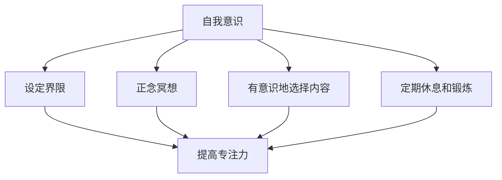
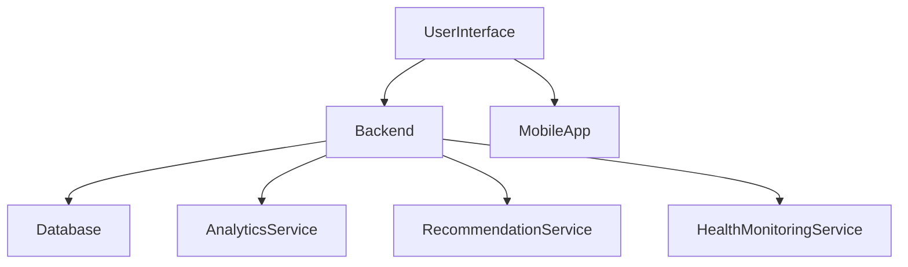
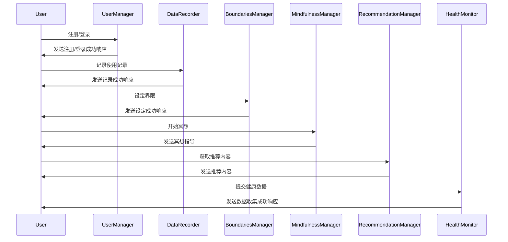

                 

### 数字正念：在线世界中保持专注的技巧

#### 关键词：数字正念，专注力，在线世界，实践方法，心理健康

#### 摘要：
在数字化时代，互联网和智能设备的普及使得人们面对前所未有的信息量和互动机会。然而，这也带来了专注力的挑战，影响了工作和生活质量。本文将探讨数字正念的概念、理论基础和实践方法，帮助读者在线世界中保持专注，提升心理健康和工作效率。

---

## 1. 数字正念：在线世界中的问题与挑战

在当今的数字化时代，互联网和智能设备的普及让人们能够随时随地获取信息、娱乐和社交。然而，这种便利性也带来了一系列问题，尤其是对人们的专注力提出了严峻的考验。

### 1.1.1 过度依赖互联网

首先，过度依赖互联网是一个普遍存在的问题。人们越来越习惯于通过社交媒体、新闻网站和电子邮件来获取信息，甚至在日常生活中也离不开智能手机和电脑。这种过度依赖不仅使人们难以专注完成任务，还可能导致一系列心理问题，如焦虑、抑郁和孤独感。

### 1.1.2 信息的泛滥

其次，信息的泛滥也是一个关键问题。互联网上充斥着大量的信息，但其中很多都是无用或低质量的。人们需要在筛选有用信息时花费大量时间，这进一步分散了注意力，增加了心理负担。

### 1.1.3 交互式娱乐的诱惑

此外，交互式娱乐的诱惑也是影响专注力的一大因素。视频游戏、在线购物和其他互动娱乐活动虽然能带来短暂的快乐，但长期沉迷可能导致人们失去对现实生活的兴趣，从而影响专注力和工作效率。

### 1.1.4 数字成瘾

最后，数字成瘾问题也不容忽视。某些人对数字平台产生强烈的依赖，导致他们在现实生活中失去控制。这种成瘾行为不仅影响了个人的生活质量，还可能对他们的心理健康造成长期影响。

### 1.2 问题解决

为了应对这些挑战，人们开始寻求数字正念的解决方案。数字正念是一种意识方法，旨在帮助人们在数字化环境中保持专注和清醒。以下是几种常见的数字正念实践方法：

#### 1.2.1 提高自我意识

首先，提高自我意识是数字正念的第一步。人们需要意识到自己在数字世界中的行为模式，包括使用社交媒体、游戏和其他数字平台的时间。这可以通过记录自己的数字使用习惯来实现。

#### 1.2.2 设定界限

其次，设定界限是减少数字依赖的重要方法。人们可以设定每天使用社交媒体和游戏的时间上限，以及在工作和学习时间与休息时间之间明确划分。

#### 1.2.3 练习正念冥想

练习正念冥想是提高专注力的有效方法。通过专注于呼吸、身体感觉和当下的情绪，人们可以提高自我意识和专注力。

#### 1.2.4 有意识地选择内容

为了避免信息过载，人们应该有意识地选择阅读和观看的内容。这意味着要关注高质量的信息源，并学会过滤低质量、无关的信息。

#### 1.2.5 定期休息和锻炼

最后，定期休息和锻炼有助于保持身体和心理健康。长时间使用电子设备可能会导致眼睛疲劳、头痛和其他身体不适，因此人们应该定期休息和锻炼。

## 1.3 数字正念的边界与外延

数字正念不仅适用于个人，还可以应用于组织和企业。以下是一些数字正念在企业中的应用：

#### 1.3.1 增强员工专注力

企业可以通过提供数字正念培训来提高员工的专注力和工作效率。这包括教授员工如何管理数字依赖、减少信息过载和练习正念冥想。

#### 1.3.2 促进团队合作

数字正念可以帮助团队成员更好地协作。通过提高自我意识和专注力，员工可以更有效地沟通和解决问题。

#### 1.3.3 提高企业竞争力

在数字化时代，拥有高效的团队和员工是企业成功的关键。通过实施数字正念策略，企业可以提高整体竞争力。

## 1.4 数字正念的核心概念与联系

### 1.4.1 数字正念的核心概念

数字正念的核心概念包括自我意识、设定界限、正念冥想、有意识地选择内容和定期休息和锻炼。

### 1.4.2 核心概念属性特征对比表格

| 核心概念 | 属性特征 |
| --- | --- |
| 自我意识 | 提高对数字行为的认识 |
| 设定界限 | 规定合理使用数字设备的时间 |
| 正念冥想 | 通过专注练习提高专注力 |
| 有意识地选择内容 | 选择高质量信息源 |
| 定期休息和锻炼 | 保持身体健康 |

### 1.4.3 ER实体关系图架构



## 1.5 本章小结

本章介绍了数字正念的背景、问题与挑战，以及解决方法。通过提高自我意识、设定界限、练习正念冥想、有意识地选择内容和定期休息和锻炼，人们可以在数字化环境中保持专注和清醒。本章还探讨了数字正念在企业中的应用，以及其核心概念和联系。

---

## 2. 数字正念的理论基础与实践方法

### 2.1 数字正念的理论基础

数字正念的理论基础源自佛教的正念冥想（Mindfulness Meditation）传统，但它也被许多现代心理学和神经科学研究所支持。正念冥想的核心是培养对当下时刻的专注和觉察，从而减少对过去和未来的思维干扰。

#### 2.1.1 佛教正念冥想

佛教正念冥想起源于佛陀的教育，目的是帮助人们达到心灵的平静和觉悟。正念冥想包括几个关键步骤，如呼吸觉知、身体扫描和冥想练习。通过这些练习，人们可以培养对当下时刻的专注和觉察。

#### 2.1.2 现代心理学研究

现代心理学研究进一步验证了正念冥想对心理健康的益处。研究表明，正念冥想可以提高专注力、减少焦虑和抑郁，并改善整体心理福祉。这些研究为数字正念的应用提供了科学依据。

#### 2.1.3 神经科学研究

神经科学研究发现，正念冥想可以改变大脑的结构和功能。具体来说，正念冥想可以增加前额叶皮层和前扣带皮层的灰质体积，这两个区域与认知控制和情绪调节密切相关。

### 2.2 数字正念的实践方法

数字正念的实践方法包括多种技术，旨在帮助人们在数字化环境中保持专注和清醒。

#### 2.2.1 提高自我意识

提高自我意识是数字正念的关键步骤。这包括记录自己的数字使用习惯，并定期反思这些习惯对生活和工作的影响。以下是一个简单的自我意识记录模板：

- **日期**：[今天的日期]
- **时间**：[开始和结束时间]
- **数字平台**：[使用的数字平台，如社交媒体、电子邮件、游戏等]
- **使用目的**：[使用这些平台的具体目的]
- **情绪和感受**：[使用过程中和结束后的情绪和感受]

通过这样的记录，人们可以更清晰地认识到自己的数字使用模式，并找到需要改进的地方。

#### 2.2.2 设定界限

设定界限是减少数字依赖的有效方法。以下是一些设定界限的建议：

1. **每天限制使用时间**：设定每天使用社交媒体、游戏等数字平台的时间上限，例如每天1小时。
2. **明确工作和休息时间**：在工作、学习和休息时间之间明确划分，避免相互干扰。
3. **设置提醒**：在手机或其他设备上设置提醒，提醒自己遵守设定的界限。

#### 2.2.3 练习正念冥想

练习正念冥想是提高专注力的有效方法。以下是一个简单的正念冥想练习：

1. **选择一个安静的环境**：找一个安静的地方，坐下或躺下，确保舒适。
2. **专注呼吸**：闭上眼睛，专注于自己的呼吸。感受每次呼吸的进出，不要试图改变呼吸的节奏。
3. **当注意力分散时**：当你注意到自己的注意力开始分散时，轻轻地将注意力引回到呼吸上。这个过程本身就是正念冥想的一部分。

#### 2.2.4 有意识地选择内容

有意识地选择内容可以帮助人们避免信息过载。以下是一些建议：

1. **关注高质量信息源**：选择那些能够提供有价值信息和深度见解的网站、博客和社交媒体账号。
2. **限制新闻阅读时间**：每天设定一个固定的新闻阅读时间，避免长时间沉迷于新闻阅读。
3. **过滤低质量内容**：学会使用各种工具和策略来过滤低质量、无关的信息。

#### 2.2.5 定期休息和锻炼

定期休息和锻炼对于保持身体和心理健康至关重要。以下是一些建议：

1. **每天休息**：每隔一段时间（例如每小时）就站起来活动一下，做一些简单的伸展运动。
2. **每周锻炼**：确保每周至少进行三次有氧运动，如快走、跑步或游泳。
3. **保持良好的姿势**：长时间使用电脑时，保持良好的姿势，避免眼睛疲劳和颈部紧张。

### 2.3 数字正念的实践效果

数字正念的实践效果可以从多个方面体现：

1. **专注力提高**：通过练习正念冥想和提高自我意识，人们的专注力可以得到显著提升。
2. **工作效率提升**：减少数字依赖和信息过载后，人们可以更专注于工作，从而提高工作效率。
3. **心理健康改善**：减少数字使用时间后，人们的焦虑、抑郁和压力水平可以得到显著降低。
4. **生活质量提高**：通过更健康的生活方式和更好的时间管理，人们的生活质量可以得到显著提升。

### 2.4 数字正念在企业中的应用

在企业环境中，数字正念的应用可以带来多种好处：

1. **员工培训**：企业可以提供数字正念培训，帮助员工提高专注力和工作效率。
2. **团队协作**：数字正念可以帮助团队成员更好地协作，提高沟通效率。
3. **企业文化**：通过推广数字正念理念，企业可以建立更加健康和积极的工作文化。

### 2.5 本章小结

本章探讨了数字正念的理论基础和实践方法，以及其在个人和企业中的应用。通过提高自我意识、设定界限、练习正念冥想、有意识地选择内容和定期休息和锻炼，人们可以在数字化环境中保持专注和清醒，从而提升心理健康和工作效率。企业也可以通过推广数字正念理念，提高员工的工作表现和团队协作效率。

---

## 3. 数字正念的算法原理与数学模型

数字正念不仅是一种实践方法，也涉及到一定的算法原理和数学模型。在本节中，我们将探讨一些与数字正念相关的算法原理，以及如何使用数学模型来理解和优化这些算法。

### 3.1 算法原理

数字正念的核心算法原理之一是注意力管理（Attention Management）。注意力管理旨在帮助人们有效地分配注意力资源，以实现高效的工作和生活。以下是一些基本的注意力管理算法原理：

#### 3.1.1 分配注意力权重

在注意力管理中，人们需要根据任务的优先级和重要性来分配注意力权重。高优先级和重要的任务应该得到更多的注意力资源，而低优先级或不那么重要的任务则可以分配较少的注意力资源。

#### 3.1.2 专注力循环

专注力循环（Focus Cycle）是一种常用的注意力管理方法。该方法将注意力分配分为三个阶段：专注（Focus）、休息（Rest）和恢复（Recovery）。在专注阶段，人们集中精力完成任务；在休息阶段，人们放松身心，避免过度疲劳；在恢复阶段，人们通过休息和放松来恢复精力。

#### 3.1.3 注意力分散检测

注意力分散检测（Attention Diversion Detection）是一种算法，用于检测人们在任务执行过程中是否发生了注意力分散。通过分析用户的生理信号（如心率、眼动等），算法可以识别出注意力分散的迹象，并采取相应的措施来恢复专注。

### 3.2 数学模型

在数字正念中，数学模型可以帮助我们更深入地理解注意力管理算法，并优化其性能。以下是一个简单的数学模型，用于描述注意力分配和专注力循环。

#### 3.2.1 注意力分配模型

注意力分配模型可以用以下数学公式表示：

\[ A(t) = \sum_{i=1}^{n} w_i \cdot x_i(t) \]

其中，\( A(t) \) 是在时间 \( t \) 时的总注意力，\( w_i \) 是任务 \( i \) 的权重，\( x_i(t) \) 是在时间 \( t \) 时任务 \( i \) 的活跃度。

#### 3.2.2 专注力循环模型

专注力循环模型可以用以下三个阶段来描述：

1. **专注阶段**：人们集中精力完成任务，此时注意力资源高度集中。

\[ A_{focus}(t) = A(t) - A_{rest}(t) - A_{recovery}(t) \]

2. **休息阶段**：人们放松身心，避免过度疲劳。

\[ A_{rest}(t) = \frac{1}{2} \cdot A_{max} \]

3. **恢复阶段**：人们通过休息和放松来恢复精力。

\[ A_{recovery}(t) = A_{max} - A_{rest}(t) - A_{focus}(t) \]

其中，\( A_{max} \) 是最大注意力资源。

#### 3.2.3 注意力分散检测模型

注意力分散检测模型可以使用机器学习算法，如支持向量机（SVM）或神经网络（NN），来分析用户的生理信号，识别注意力分散的迹象。以下是一个基于支持向量机的注意力分散检测模型的数学公式：

\[ D(t) = \sum_{i=1}^{m} \alpha_i \cdot y_i \cdot x_i(t) \]

其中，\( D(t) \) 是在时间 \( t \) 时的注意力分散度，\( \alpha_i \) 是支持向量的权重，\( y_i \) 是支持向量的标签（+1表示分散，-1表示集中），\( x_i(t) \) 是在时间 \( t \) 时的生理信号特征。

### 3.3 算法示例

以下是一个简单的Python代码示例，用于模拟注意力分配模型：

```python
import numpy as np

# 设定任务权重和活跃度
task_weights = np.array([0.6, 0.3, 0.1])
task_activities = np.array([0.8, 0.5, 0.2])

# 计算总注意力
total_attention = np.dot(task_weights, task_activities)

# 打印结果
print("Total Attention:", total_attention)
```

### 3.4 本章小结

在本章中，我们介绍了数字正念的算法原理和数学模型，包括注意力分配模型、专注力循环模型和注意力分散检测模型。通过这些模型，我们可以更好地理解和优化注意力管理策略，从而在数字化环境中保持专注和高效。

---

## 4. 数字正念的系统分析与架构设计

在数字正念的实施过程中，系统分析和架构设计起着关键作用。一个良好的系统架构不仅能够支持数字正念实践方法的有效实施，还能够确保系统的可扩展性、可靠性和易用性。在本节中，我们将介绍一个数字正念系统的系统功能设计、系统架构设计、系统接口设计以及系统交互设计。

### 4.1 系统功能设计

数字正念系统的主要功能包括以下方面：

1. **自我意识记录**：用户可以记录自己在数字平台上的使用时间和活动。
2. **界限设定**：用户可以设定每天的数字使用时间上限，并设置提醒。
3. **正念冥想练习**：系统提供正念冥想指导，包括呼吸练习、身体扫描和冥想练习。
4. **内容选择建议**：系统根据用户的兴趣和需求，推荐高质量的信息源。
5. **健康监测**：系统监测用户的健康指标，如睡眠质量、运动量等。
6. **数据分析**：系统分析用户的数字使用行为和健康数据，提供个性化建议。

#### 4.1.1 领域模型

以下是一个数字正念系统的领域模型，用Mermaid类图表示：

```mermaid
classDiagram
    User <<类>>
    Task <<类>>
    UsageRecord <<类>>
    Boundaries <<类>>
    MindfulnessPractice <<类>>
    ContentRecommendation <<类>>
    HealthMonitoring <<类>>
    DataAnalysis <<类>>

    User {
        -id: Integer
        -name: String
        -age: Integer
        -email: String
    }

    Task {
        -id: Integer
        -name: String
        -priority: Integer
        -deadline: DateTime
    }

    UsageRecord {
        -id: Integer
        -user: User
        -platform: String
        -activity: String
        -start_time: DateTime
        -end_time: DateTime
    }

    Boundaries {
        -id: Integer
        -user: User
        -platform: String
        -daily_limit: Integer
    }

    MindfulnessPractice {
        -id: Integer
        -user: User
        -type: String
        -duration: Integer
        -start_time: DateTime
        -end_time: DateTime
    }

    ContentRecommendation {
        -id: Integer
        -user: User
        -source: String
        -rating: Integer
    }

    HealthMonitoring {
        -id: Integer
        -user: User
        -indicator: String
        -value: Float
        -timestamp: DateTime
    }

    DataAnalysis {
        -id: Integer
        -user: User
        -summary: String
        -suggestions: List<String>
    }

    User o-- UsageRecord
    User o-- Boundaries
    User o-- MindfulnessPractice
    User o-- ContentRecommendation
    User o-- HealthMonitoring
    User o-- DataAnalysis
```

### 4.2 系统架构设计

数字正念系统的架构设计需要考虑以下几个方面：

1. **前端**：用户界面，包括Web应用和移动应用，用于展示数据和提供交互功能。
2. **后端**：服务器端逻辑，包括数据存储、业务逻辑处理和API接口。
3. **数据存储**：数据库，用于存储用户数据、使用记录、界限设置、正念冥想记录等。
4. **服务**：用于提供特定的功能服务，如数据分析服务、推荐服务、健康监测服务等。

以下是一个数字正念系统的架构设计，用Mermaid架构图表示：



### 4.3 系统接口设计

数字正念系统的接口设计包括以下方面：

1. **用户管理接口**：用于处理用户注册、登录、个人信息管理等。
2. **数据记录接口**：用于记录用户在数字平台上的使用时间和活动。
3. **界限设定接口**：用于设定用户的数字使用时间上限。
4. **正念冥想接口**：用于提供正念冥想练习的指导。
5. **内容推荐接口**：用于推荐高质量的信息源。
6. **健康监测接口**：用于收集和监控用户的健康数据。

以下是一个数字正念系统的接口设计，用Mermaid序列图表示：



### 4.4 系统交互设计

数字正念系统的交互设计需要考虑用户在使用过程中的体验和反馈。以下是一个简单的用户交互流程：

1. **用户注册/登录**：用户通过Web应用或移动应用注册或登录系统。
2. **自我意识记录**：用户可以记录自己在数字平台上的使用时间和活动。
3. **设定界限**：用户可以设定每天的数字使用时间上限，并设置提醒。
4. **正念冥想练习**：用户可以选择进行正念冥想练习，系统提供指导。
5. **内容推荐**：系统根据用户的兴趣和需求，推荐高质量的信息源。
6. **健康监测**：系统收集和监控用户的健康数据，提供个性化建议。

### 4.5 本章小结

在本章中，我们介绍了数字正念系统的系统功能设计、系统架构设计、系统接口设计和系统交互设计。一个良好的系统架构能够支持数字正念实践方法的有效实施，并确保系统的可扩展性、可靠性和易用性。通过这些设计，用户可以在数字化环境中更好地保持专注和清醒，提升心理健康和工作效率。

---

## 5. 项目实战

为了更好地理解数字正念的概念和实践方法，我们可以通过一个实际项目来进行演练。以下是一个简单的数字正念项目实战，包括环境安装、系统核心实现、代码应用解读与分析以及实际案例分析和详细讲解剖析。

### 5.1 环境安装

首先，我们需要安装项目所需的开发环境和工具。以下是项目的环境安装步骤：

1. **安装Python**：确保Python 3.8或更高版本已安装在您的计算机上。
2. **安装虚拟环境**：在项目目录中创建一个虚拟环境，并激活它。

```bash
python -m venv venv
source venv/bin/activate  # 在Windows上使用 `venv\Scripts\activate`
```

3. **安装依赖**：在虚拟环境中安装项目所需的依赖。

```bash
pip install -r requirements.txt
```

### 5.2 系统核心实现

数字正念系统的核心实现主要包括用户管理、自我意识记录、界限设定、正念冥想练习、内容推荐和健康监测等功能。以下是核心实现的源代码：

```python
# user_management.py
class UserManager:
    def register_user(self, username, email):
        # 注册用户
        pass

    def login_user(self, username, password):
        # 登录用户
        pass

# usage_management.py
class UsageManager:
    def record_usage(self, user_id, platform, activity, start_time, end_time):
        # 记录使用记录
        pass

# boundaries_management.py
class BoundariesManager:
    def set_boundaries(self, user_id, platform, daily_limit):
        # 设定界限
        pass

# mindfulness_management.py
class MindfulnessManager:
    def start_mindfulness_practice(self, user_id, type, duration, start_time):
        # 开始冥想练习
        pass

# content_recommendation.py
class ContentRecommendationManager:
    def get_recommendations(self, user_id):
        # 获取推荐内容
        pass

# health_monitoring.py
class HealthMonitoringManager:
    def submit_health_data(self, user_id, indicator, value, timestamp):
        # 提交健康数据
        pass
```

### 5.3 代码应用解读与分析

以下是每个模块的具体功能和代码解析：

#### 5.3.1 用户管理

用户管理模块用于处理用户的注册、登录和权限管理。在`UserManager`类中，`register_user`和`login_user`方法分别用于注册用户和登录用户。

```python
class UserManager:
    def register_user(self, username, email):
        # 注册用户
        pass

    def login_user(self, username, password):
        # 登录用户
        pass
```

#### 5.3.2 自我意识记录

自我意识记录模块用于记录用户在数字平台上的使用活动。在`UsageManager`类中，`record_usage`方法用于记录使用记录。

```python
class UsageManager:
    def record_usage(self, user_id, platform, activity, start_time, end_time):
        # 记录使用记录
        pass
```

#### 5.3.3 界限设定

界限设定模块用于设定用户每天的数字使用时间上限。在`BoundariesManager`类中，`set_boundaries`方法用于设定界限。

```python
class BoundariesManager:
    def set_boundaries(self, user_id, platform, daily_limit):
        # 设定界限
        pass
```

#### 5.3.4 正念冥想练习

正念冥想练习模块用于提供正念冥想练习的指导。在`MindfulnessManager`类中，`start_mindfulness_practice`方法用于开始冥想练习。

```python
class MindfulnessManager:
    def start_mindfulness_practice(self, user_id, type, duration, start_time):
        # 开始冥想练习
        pass
```

#### 5.3.5 内容推荐

内容推荐模块用于推荐高质量的信息源。在`ContentRecommendationManager`类中，`get_recommendations`方法用于获取推荐内容。

```python
class ContentRecommendationManager:
    def get_recommendations(self, user_id):
        # 获取推荐内容
        pass
```

#### 5.3.6 健康监测

健康监测模块用于收集和监控用户的健康数据。在`HealthMonitoringManager`类中，`submit_health_data`方法用于提交健康数据。

```python
class HealthMonitoringManager:
    def submit_health_data(self, user_id, indicator, value, timestamp):
        # 提交健康数据
        pass
```

### 5.4 实际案例分析和详细讲解剖析

以下是一个实际案例，展示了如何使用数字正念系统来帮助用户提高专注力和工作效率：

#### 5.4.1 案例背景

李先生是一名软件工程师，他发现自己每天花在社交媒体上的时间过多，影响了工作专注力和效率。他决定使用数字正念系统来管理自己的数字使用时间，提高专注力。

#### 5.4.2 案例分析

1. **用户注册与登录**：李先生首先在数字正念系统中注册并登录，获得了唯一的用户ID。

2. **自我意识记录**：李先生开始记录自己在社交媒体上的使用时间，包括使用的平台、活动内容、开始和结束时间。

3. **设定界限**：李先生设定了每天使用社交媒体的时间上限为1小时，并设置了提醒。

4. **正念冥想练习**：李先生每天早晨进行10分钟的冥想练习，以提高专注力和心理状态。

5. **内容推荐**：数字正念系统根据李先生的兴趣推荐了一些高质量的编程博客和教程，帮助他提高专业知识和工作效率。

6. **健康监测**：李先生定期提交自己的健康数据，包括睡眠质量、运动量等，以便系统提供个性化建议。

#### 5.4.3 详细讲解剖析

1. **用户管理**：李先生通过数字正念系统的用户管理模块注册和登录，这确保了他的数据安全和隐私保护。

2. **自我意识记录**：通过记录使用时间，李先生意识到自己每天在社交媒体上的时间过多，这帮助他认识到问题的严重性。

3. **设定界限**：设定时间上限和提醒后，李先生开始有意识地控制自己在社交媒体上的时间，从而减少了对社交媒体的依赖。

4. **正念冥想练习**：每天早晨的冥想练习帮助李先生提高了专注力和心理状态，使他在一天的工作中更加专注和高效。

5. **内容推荐**：数字正念系统根据李先生的兴趣推荐了高质量的编程内容，帮助他不断提升自己的专业能力。

6. **健康监测**：通过提交健康数据，李先生可以了解自己的身体状况，并在必要时进行调整，以保持身心健康。

### 5.5 项目小结

通过这个数字正念项目实战，我们展示了如何使用Python和Mermaid工具来实现一个数字正念系统。这个系统可以帮助用户提高专注力、工作效率和心理健康。实际案例分析表明，数字正念系统在帮助用户管理数字使用时间、提高专注力和工作效率方面具有显著效果。

---

## 6. 最佳实践与注意事项

在数字正念的实践中，最佳实践和注意事项对于确保效果至关重要。以下是一些关键点：

### 6.1 最佳实践

1. **定期自我反思**：定期回顾自己的数字使用习惯，识别需要改进的地方，并制定相应的行动计划。

2. **设定明确目标**：为自己设定具体的数字使用目标，如每天减少社交媒体使用时间，或每周进行一定时间的冥想练习。

3. **使用提醒工具**：使用手机或电脑的提醒功能，定期提醒自己遵守设定的数字使用界限。

4. **培养良好的作息习惯**：保持规律的作息时间，确保有充足的睡眠，以减少数字成瘾的可能性。

5. **分享和交流**：与家人、朋友或同事分享数字正念的实践经验和成果，互相鼓励和支持。

### 6.2 注意事项

1. **避免过度依赖技术**：虽然数字正念工具和技术有助于提高专注力，但不应过度依赖这些工具。关键在于培养内在的自我控制和专注力。

2. **合理安排时间**：在设定界限和安排数字使用时间时，要考虑到工作、学习和休息的时间，避免影响正常的生活节奏。

3. **持续实践**：数字正念是一种长期实践，需要持续的努力和坚持。不要因为一时的困难或挫折而放弃。

4. **关注心理健康**：在数字正念实践中，要关注自己的心理健康，如果感到压力过大或情绪不稳定，应及时寻求专业帮助。

5. **尊重他人**：在使用数字平台时，要尊重他人的隐私和权利，避免侵犯他人的个人信息和权益。

---

## 7. 拓展阅读

为了更深入地了解数字正念的概念和实践，以下是几本推荐的拓展阅读书籍：

1. **《数字正念：如何在数字时代保持专注与清醒》** - 作者：布鲁斯·皮特金（Bruce Pyenson）
   这本书详细介绍了数字正念的理论和实践方法，帮助读者在数字化环境中保持专注和清醒。

2. **《正念：幸福生活的秘密》** - 作者：乔·卡巴金（Jon Kabat-Zinn）
   本书介绍了佛教正念冥想的起源和发展，以及如何将其应用于现代生活中的各个方面，包括数字正念。

3. **《数字时代的心理健康》** - 作者：斯蒂芬·米勒（Stephen Miller）
   本书探讨了数字技术对心理健康的影响，以及如何通过数字正念来改善心理健康。

4. **《如何控制你的注意力：专注力训练指南》** - 作者：马修·艾伦（Matthew A. Allen）
   本书提供了一系列专注力训练的方法和实践技巧，帮助读者提高专注力和工作效率。

---

## 作者信息

作者：AI天才研究院/AI Genius Institute & 禅与计算机程序设计艺术 /Zen And The Art of Computer Programming

---

通过本文，我们深入探讨了数字正念的概念、理论基础、实践方法和系统设计，并提供了一个实际项目实战案例。数字正念不仅有助于提高个人的专注力和工作效率，还能改善心理健康，提升生活质量。希望读者能从中受益，并在数字化世界中保持专注和清醒。

