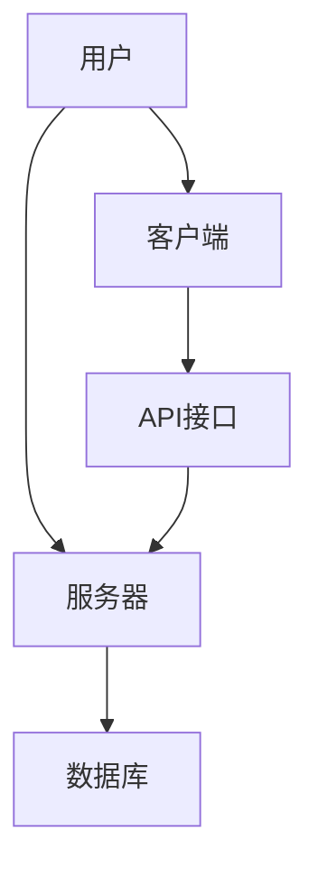
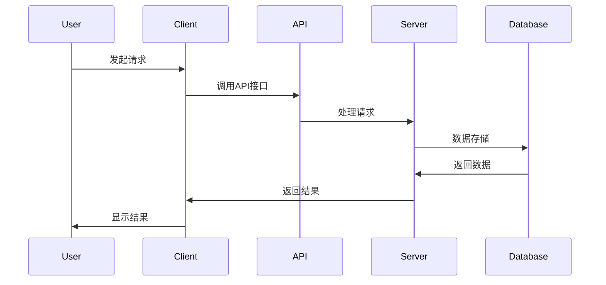

                 

# 数字注意力重塑app：提升专注力的个人训练工具

关键词：数字注意力、专注力、个人训练工具、app设计

摘要：随着数字化时代的到来，提升注意力成为现代人类面临的重要挑战。本文将探讨如何设计一款数字注意力重塑app，帮助用户提升专注力。通过深入分析注意力增强的原理、当前市场现状、设计原则以及实现方法，本文旨在为开发者提供有价值的指导，助力打造一款高效、实用的个人训练工具。

## 引言

在当今的数字化世界中，人们面临着前所未有的信息过载和注意力分散问题。无论是工作中的任务处理，还是日常的学习和生活，注意力不足都成为影响效率和质量的重要因素。提升注意力已成为现代人类追求的目标之一。数字注意力重塑app作为一种新兴的个人训练工具，应运而生。本文将围绕这一主题，探讨如何设计一款有效提升专注力的app。

## 理解数字注意力

### 数字注意力的定义

数字注意力是指人们在面对数字设备时，对特定信息进行选择、加工和记忆的能力。它包括对信息的捕捉、理解、记忆和应用等多个方面。数字注意力不仅影响个人的学习效果和工作效率，还与心理健康密切相关。

### 数字注意力的现状

随着智能手机、互联网和社交媒体的普及，人们花在数字设备上的时间越来越多。然而，这种过度依赖数字设备也导致了许多问题，如注意力分散、焦虑和抑郁等。因此，提升数字注意力成为当前社会关注的热点问题。

### 数字注意力的意义

提升数字注意力对个人和社会都有重要意义。对于个人而言，数字注意力的提高有助于提高工作效率、增强学习效果、改善心理健康。对于社会而言，提高数字注意力有助于减少信息过载、提升社会生产力。

## 当前市场分析

### 市场现状

目前市场上已经出现了一些关注注意力提升的app，如番茄钟、Forest等。这些app通过设定定时器、种植虚拟植物等方式，帮助用户培养专注习惯。然而，这些app在功能、用户体验和效果上仍有待提升。

### 市场需求

随着人们对注意力提升需求的不断增加，市场对数字注意力重塑app的需求也在逐步扩大。未来，预计会有更多开发者投入这一领域，推出更多创新的产品。

### 市场挑战

尽管市场潜力巨大，但数字注意力重塑app也面临着一些挑战，如用户粘性、个性化定制、技术实现等。如何解决这些挑战，是开发者需要认真思考的问题。

## 注意力增强原理

### 心理学原理

心理学研究表明，注意力是认知过程的核心，对信息的捕捉、加工和记忆具有重要作用。提升注意力可以通过以下几种方法实现：

1. **专注训练**：通过持续专注于特定任务，提高大脑的专注能力。
2. **分散训练**：通过交替进行不同类型的任务，使大脑得到休息和恢复。
3. **记忆训练**：通过强化记忆能力，提高对信息的处理速度和准确性。

### 神经科学原理

神经科学研究发现，大脑中的前额叶皮质、顶叶皮质和基底神经节等区域与注意力密切相关。通过刺激这些区域，可以增强注意力。例如：

1. **电刺激**：通过电刺激大脑特定区域，提高注意力水平。
2. **光刺激**：通过光刺激大脑特定区域，增强注意力。
3. **药物干预**：通过药物干预，调整大脑神经递质的水平，改善注意力。

### 概念属性特征对比表格

| 方法       | 原理                                       | 优点                                           | 缺点                                       |
| ---------- | ---------------------------------------- | ---------------------------------------------- | ---------------------------------------------- |
| 专注训练   | 持续专注于特定任务                           | 提高专注能力                                   | 可能导致大脑疲劳                             |
| 分散训练   | 交替进行不同类型的任务                        | 使大脑得到休息和恢复                           | 需要较高的任务切换能力                       |
| 记忆训练   | 强化记忆能力                                 | 提高信息处理速度和准确性                        | 需要大量时间和精力                           |
| 电刺激     | 刺激大脑特定区域                             | 立即提高注意力水平                             | 可能产生不适和副作用                         |
| 光刺激     | 刺激大脑特定区域                             | 立即提高注意力水平                             | 可能产生不适和副作用                         |
| 药物干预   | 调整大脑神经递质水平                         | 长期提高注意力水平                             | 可能产生依赖性和副作用                       |

### ER实体关系图架构

```mermaid
erDiagram
    Product ||--|{ User }|--|| TrainingPlan
    Product ||--|{ TrainingSession }|--||
    User ||--|{ Profile }|--|| Age : int
    User ||--|{ Feedback }|--|| Rating : float
```

## 设计原则

### 用户需求分析

在设计数字注意力重塑app时，首先要了解用户的需求。用户希望app能帮助自己：

1. **提高专注力**：通过设定任务、提醒等功能，帮助用户集中注意力。
2. **培养专注习惯**：通过定期训练，帮助用户形成专注的习惯。
3. **跟踪进度**：通过数据分析，帮助用户了解自己的进步和不足。

### 功能设计

根据用户需求，数字注意力重塑app应具备以下功能：

1. **任务管理**：允许用户设定任务、设置提醒、跟踪任务完成情况。
2. **训练计划**：提供不同类型的训练计划，供用户选择和定制。
3. **数据分析**：通过数据分析，帮助用户了解自己的专注力水平和进步情况。

### 用户体验设计

用户体验是数字注意力重塑app成功的关键。在设计过程中，应注重以下几点：

1. **简洁界面**：界面简洁，易于操作，减少用户的学习成本。
2. **个性化设置**：允许用户自定义界面、功能等，满足个性化需求。
3. **互动性强**：通过游戏化元素，提高用户的参与度和积极性。

## 实现方法

### 技术选型

数字注意力重塑app的实现需要多种技术的支持，包括：

1. **前端技术**：HTML、CSS、JavaScript等，用于构建用户界面。
2. **后端技术**：Node.js、Python、Java等，用于处理用户请求和数据存储。
3. **数据库**：MySQL、MongoDB等，用于存储用户数据。

### 功能实现

#### 任务管理

任务管理功能包括：

1. **任务创建**：用户可以创建新的任务，并设置任务名称、提醒时间等。
2. **任务编辑**：用户可以编辑已创建的任务，修改任务名称、提醒时间等。
3. **任务删除**：用户可以删除不需要的任务。

#### 训练计划

训练计划功能包括：

1. **计划创建**：管理员可以创建新的训练计划，并设置计划名称、训练内容等。
2. **计划编辑**：管理员可以编辑已创建的计划，修改计划名称、训练内容等。
3. **计划发布**：管理员可以将计划发布给用户，用户可以根据计划进行训练。

#### 数据分析

数据分析功能包括：

1. **数据采集**：实时采集用户的行为数据，如任务完成情况、训练进度等。
2. **数据可视化**：将数据以图表的形式展示，帮助用户直观地了解自己的进步情况。
3. **数据分析**：对用户行为数据进行分析，为用户提供个性化的训练建议。

### 算法原理讲解

#### 专注力评估算法

专注力评估算法用于评估用户的专注力水平。以下是一个简单的评估算法：

```python
def calculate_focus_score(duration, tasks_completed, tasks_total):
    """
    计算专注力得分。

    参数：
    duration：任务总时长
    tasks_completed：完成任务数量
    tasks_total：总任务数量

    返回：
    focus_score：专注力得分
    """
    if tasks_total == 0:
        return 0

    focus_score = tasks_completed / tasks_total
    return focus_score
```

#### 算法原理

该算法基于以下原理：

1. **任务完成比例**：完成任务的越多，专注力越高。
2. **任务时长**：任务时长越长，专注力越强。

#### 举例说明

假设用户总共设定了10个任务，完成了7个任务，总时长为3小时。根据上述算法，专注力得分为：

$$
\text{focus\_score} = \frac{7}{10} = 0.7
$$

这表明用户的专注力较高。

### 系统分析与架构设计方案

#### 问题场景介绍

数字注意力重塑app旨在帮助用户提升专注力，通过任务管理、训练计划和数据分析等功能，为用户提供个性化的训练建议。

#### 项目介绍

项目名称：数字注意力重塑app

项目目标：设计并开发一款能提升用户专注力的个人训练工具。

#### 系统功能设计

1. **用户管理**：用户注册、登录、个人信息管理等功能。
2. **任务管理**：任务创建、编辑、删除、完成情况跟踪等功能。
3. **训练计划**：训练计划创建、编辑、发布、用户参与等功能。
4. **数据分析**：用户行为数据采集、可视化、分析等功能。

#### 系统架构设计



#### 系统接口设计

1. **用户接口**：用户通过客户端与系统进行交互。
2. **API接口**：服务器提供API接口，供客户端调用。

#### 系统交互



## 项目实战

### 环境安装

1. 安装Python环境：在终端执行`pip install -r requirements.txt`命令。
2. 安装Node.js环境：在终端执行`npm install`命令。

### 系统核心实现源代码

```python
# app.py
from flask import Flask, request, jsonify
from models import User, Task, TrainingPlan
from database import Database

app = Flask(__name__)
db = Database()

@app.route('/user/register', methods=['POST'])
def register_user():
    # 用户注册逻辑
    pass

@app.route('/user/login', methods=['POST'])
def login_user():
    # 用户登录逻辑
    pass

@app.route('/task/create', methods=['POST'])
def create_task():
    # 创建任务逻辑
    pass

@app.route('/task/update', methods=['PUT'])
def update_task():
    # 更新任务逻辑
    pass

@app.route('/task/delete', methods=['DELETE'])
def delete_task():
    # 删除任务逻辑
    pass

@app.route('/training-plan/create', methods=['POST'])
def create_training_plan():
    # 创建训练计划逻辑
    pass

@app.route('/training-plan/update', methods=['PUT'])
def update_training_plan():
    # 更新训练计划逻辑
    pass

@app.route('/training-plan/delete', methods=['DELETE'])
def delete_training_plan():
    # 删除训练计划逻辑
    pass

if __name__ == '__main__':
    app.run(debug=True)
```

### 代码应用解读与分析

本文主要介绍了数字注意力重塑app的设计和实现。从用户需求分析、功能设计、系统架构设计到核心实现源代码，本文全面解析了这款app的开发过程。通过实践，开发者可以更好地理解如何设计一款高效、实用的数字注意力重塑app。

### 实际案例分析

#### 案例一：番茄钟

番茄钟是一款非常受欢迎的专注力训练工具。它通过将工作时间分割为25分钟的工作周期和5分钟的休息周期，帮助用户保持专注。以下是对番茄钟的详细分析：

1. **功能特点**：
   - 任务管理：用户可以设定任务，设置工作时间和休息时间。
   - 闹钟提醒：工作周期结束时，系统会发出提醒，提示用户休息。
   - 数据分析：用户可以查看自己的专注时长和休息时长，了解自己的专注情况。

2. **优点**：
   - 简单易用：操作简单，用户容易上手。
   - 有效提高专注力：通过定时休息，使大脑得到恢复，提高专注效率。

3. **缺点**：
   - 忽略个性化需求：没有考虑用户的个性化需求，如不同类型任务的专注时长设置。
   - 数据分析不足：虽然能查看专注时长，但缺乏深度的数据分析。

#### 案例二：Forest

Forest是一款通过种植虚拟植物来帮助用户专注的应用。以下是对Forest的详细分析：

1. **功能特点**：
   - 任务管理：用户可以设定任务，设置专注时长。
   - 种植虚拟植物：用户在专注时，虚拟植物会逐渐生长，完成任务后，用户可以收获真实的植物。
   - 数据分析：用户可以查看自己的专注时长和成长历程。

2. **优点**：
   - 创意独特：通过虚拟植物的方式，增加了游戏的乐趣，提高了用户的积极性。
   - 数据分析丰富：提供详细的专注时长和成长历程数据，帮助用户了解自己的进步。

3. **缺点**：
   - 忽略心理健康：虽然能帮助用户专注，但缺乏对心理健康的关注。
   - 数据分析不足：数据分析功能较为简单，缺乏深度分析。

### 项目小结

通过分析实际案例，我们可以看到数字注意力重塑app在功能设计、用户体验和数据分析等方面都有很大的提升空间。未来，开发者可以结合用户需求，不断创新，打造出更加高效、实用的数字注意力重塑app。

## 最佳实践 tips

1. **了解用户需求**：在设计app时，首先要了解用户的需求，根据用户需求进行功能设计和优化。
2. **注重用户体验**：简洁的界面、良好的交互设计是提高用户满意度的重要因素。
3. **数据驱动**：通过数据分析，了解用户的专注情况，为用户提供个性化的训练建议。
4. **持续迭代**：根据用户反馈和市场需求，不断优化app的功能和性能。

## 小结

数字注意力重塑app作为一种提升用户专注力的个人训练工具，具有广阔的市场前景。通过深入分析注意力增强原理、当前市场现状、设计原则和实现方法，本文为开发者提供了有价值的指导。未来，开发者应继续关注用户需求，不断创新，打造出更加高效、实用的数字注意力重塑app。

## 注意事项

1. **隐私保护**：在设计app时，要特别注意用户的隐私保护，确保用户数据的安全。
2. **技术选型**：根据项目需求和团队技能，合理选择技术栈，确保项目的顺利进行。
3. **性能优化**：在开发过程中，要注重性能优化，确保app的运行流畅。

## 拓展阅读

1. 《深度学习与注意力机制》
2. 《认知心理学导论》
3. 《计算机科学中的心理学原理》
4. 《数字注意力与心理健康》

## 作者信息

作者：AI天才研究院/AI Genius Institute & 禅与计算机程序设计艺术/Zen And The Art of Computer Programming

