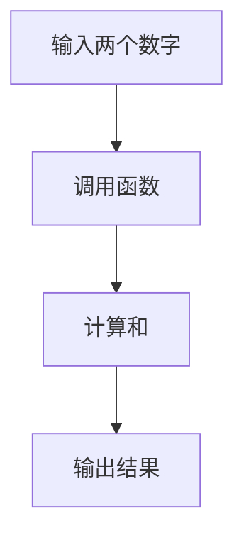

                 


# Digital Drifter's Guide Series: Exploring Self-Identity in the Network Age Online Course

## Keywords: 
- Self-Identity
- Network Age
- Digital Transformation
- Online Education
- Identity Management

## Summary:
In this comprehensive online course, we delve into the complexities of self-identity in the digital age. We explore key concepts, analyze case studies, and discuss the technological and social implications. Through a step-by-step approach, we aim to provide a deeper understanding of how individuals navigate their self-identity in today's interconnected world.

## Introduction

### The Rise of the Network Age

#### 1.1 What is the Network Age?

The Network Age, often referred to as the Information Age, is a term that describes the current era marked by the rapid and widespread adoption of digital networks and technologies. This age is characterized by the integration of the internet into nearly all aspects of human life, from communication and commerce to education and entertainment.

#### 1.2 How Technology is Shaping Our Lives

The advent of the Network Age has brought about profound changes in how we live, work, and interact with one another. Some of the most significant impacts include:

1. **Global Connectivity**: The internet has connected people across the globe, enabling instant communication and collaboration regardless of geographical location.

2. **Digital Transformation**: Industries and businesses are increasingly relying on digital technologies to streamline operations, improve efficiency, and innovate new products and services.

3. **Information Accessibility**: The proliferation of digital devices and platforms has made information more accessible than ever, allowing individuals to access knowledge and resources at their fingertips.

4. **Privacy and Security Concerns**: With the widespread collection and analysis of personal data, there are growing concerns about privacy and data security.

#### 1.3 The Importance of Understanding Self-Identity in the Network Age

In this era of rapid digital transformation, understanding self-identity has become increasingly complex. The Network Age offers both opportunities and challenges for individuals to explore and express their identities. Here are a few reasons why understanding self-identity in this context is crucial:

1. **Digital Identity Management**: As more aspects of our lives move online, managing our digital identities becomes essential. This involves understanding how our personal information is collected, used, and protected.

2. **Social Interaction**: The Network Age has revolutionized how we interact with others, both online and offline. Understanding self-identity helps us navigate these interactions and build meaningful relationships.

3. **Cultural Impact**: The digital age has blurred the boundaries between cultures, creating a diverse and interconnected global society. Understanding self-identity in this context involves appreciating cultural differences and fostering inclusivity.

### The Concept of Self-Identity

#### 1.4 Defining Self-Identity

Self-identity refers to the individual's sense of self, including their personal attributes, beliefs, values, and social relationships. It is a complex construct that evolves over time and is influenced by various factors, including culture, society, and personal experiences.

#### 1.5 Historical Perspectives on Self-Identity

Throughout history, the concept of self-identity has evolved alongside societal changes. In pre-digital eras, self-identity was largely shaped by social roles, cultural norms, and personal relationships. The rise of the Network Age has introduced new dimensions to self-identity, as individuals now have the opportunity to redefine and express their identities in digital spaces.

#### 1.6 The Role of Identity in the Digital Age

In the digital age, self-identity plays a critical role in shaping how individuals interact with technology, navigate online platforms, and engage with others. Here are a few key aspects:

1. **Online Profiles**: Digital platforms often require users to create online profiles that represent their self-identity. These profiles can include personal information, interests, and social connections.

2. **Digital Footprints**: Our online activities create a digital footprint that can influence how others perceive us and how we perceive ourselves.

3. **Social Media Presence**: Social media platforms allow individuals to express their identities and connect with like-minded individuals, creating communities based on shared interests and values.

### Conclusion

Understanding self-identity in the Network Age is essential for navigating the complexities of today's digital world. In the next sections, we will delve deeper into key concepts, explore case studies, and discuss the technological and social implications of self-identity in the digital age.

---

In the following sections, we will further explore the core concepts and principles of self-identity in the digital age, discuss case studies and practical applications, and examine the technological and social implications of these changes. Through a step-by-step analysis, we will gain a deeper understanding of how individuals navigate their self-identity in the Network Age.

---

## Core Concepts and Theoretical Frameworks

### 2.1 Key Theoretical Concepts

#### 2.1.1 Societal and Cultural Impacts on Self-Identity

Self-identity is shaped by a wide range of societal and cultural factors. These factors include family, religion, education, social class, and ethnicity. In the digital age, these influences have become even more complex due to the interconnectedness of global cultures and the rapid dissemination of information.

- **Cultural Relativity**: Cultural relativity suggests that individuals' self-identities are shaped by the values, norms, and practices of their cultural context. In the Network Age, this context is constantly evolving, influenced by global cultures and digital interactions.

- **Digital Natives vs. Digital Immigrants**: The concept of digital natives and digital immigrants refers to the generational divide in digital proficiency and self-identity. Digital natives, those who have grown up in the digital age, often have a more intuitive understanding of technology and digital spaces, while digital immigrants, those who have adopted technology later in life, may struggle to navigate these environments.

#### 2.1.2 The Impact of Technology on Self-Identity

Technology has had a profound impact on self-identity, offering both opportunities and challenges. Here are a few key aspects:

- **Digital Self-Representation**: Technology enables individuals to create and manage digital avatars and online personas, which can be used to express their self-identity in new and creative ways.

- **Data Privacy and Security**: The collection and analysis of personal data raise important ethical considerations and impact individuals' sense of privacy and control over their self-identity.

- **Digital Divide**: The digital divide, the gap between those who have access to digital technologies and those who do not, can exacerbate inequalities in self-identity and access to opportunities.

#### 2.1.3 Theoretical Frameworks for Understanding Self-Identity

Several theoretical frameworks can help us understand self-identity in the digital age. Here are a few key frameworks:

- **Social Identity Theory**: Social identity theory posits that individuals derive their self-identity from their membership in social groups. In the digital age, online communities and social networks play a crucial role in shaping self-identity.

- **Constructivist Theory**: Constructivist theory emphasizes the role of personal experience and active engagement in the construction of self-identity. In the digital age, individuals have more opportunities to explore and redefine their self-identity through online interactions and digital activities.

- **Critical Theory**: Critical theory focuses on the power dynamics and social inequalities that shape self-identity. In the digital age, critical theory can help us understand how technology and digital platforms can perpetuate or challenge these dynamics.

### ER Entity Relationship Diagram

To illustrate the relationships between key concepts, we can create an ER (Entity-Relationship) diagram. Here's a simplified ER diagram using Mermaid syntax:

```mermaid
erDiagram
    Person ||--|{ DigitalPersona }| DigitalPersona
    Person ||--|{ SocialGroup }| SocialGroup
    Person ||--|{ OnlineActivity }| OnlineActivity
    Person ||--|{ CulturalInfluence }| CulturalInfluence
    DigitalPersona ||--|{ PrivacyConcern }| PrivacyConcern
    SocialGroup ||--|{ Community }| Community
    OnlineActivity ||--|{ SocialInteraction }| SocialInteraction
    CulturalInfluence ||--|{ CulturalNorm }| CulturalNorm
```

This diagram shows the relationships between individuals (Person), their digital personas, social groups, online activities, and cultural influences. It highlights how these concepts interact and shape self-identity in the digital age.

### Conclusion

In this section, we have explored key theoretical concepts and frameworks that help us understand self-identity in the digital age. By examining societal and cultural impacts, the role of technology, and theoretical frameworks, we lay the foundation for a deeper analysis of self-identity in the Network Age. In the next sections, we will delve into case studies and practical applications to see how these concepts play out in real-world scenarios.

---

In the upcoming sections, we will further analyze the core concepts and principles discussed in this chapter. We will explore case studies of how individuals and communities navigate self-identity in the digital age, discuss practical strategies and tools for managing self-identity online, and examine the technological and social implications of these changes. Through a step-by-step approach, we aim to provide a comprehensive understanding of self-identity in the Network Age.

---

## Case Studies and Practical Applications

### 3.1 Case Study 1: Navigating Self-Identity on Social Media

One prominent example of navigating self-identity in the digital age is through social media platforms. Let's examine the case of Sarah, a 25-year-old digital marketing specialist, who uses social media to explore and express her self-identity.

#### 3.1.1 Background

Sarah grew up in a small town and, like many young people, struggled with her self-identity during her adolescence. As she entered the digital age, she found solace and new opportunities for self-expression through social media platforms like Instagram and Twitter.

#### 3.1.2 The Journey

1. **Discovery**: Sarah initially joined social media to stay connected with friends and follow trends. However, she quickly discovered the platform's potential for self-expression. She started sharing her thoughts, interests, and creative projects, which garnered attention from like-minded individuals.

2. **Identity Exploration**: Through social media, Sarah began to explore different aspects of her identity. She experimented with various personas, trying out different interests, lifestyles, and viewpoints. This exploration allowed her to gain a deeper understanding of herself and what truly resonated with her.

3. **Community Building**: Sarah's online activities led her to join online communities centered around her interests. These communities provided a supportive environment where she could share her ideas, receive feedback, and connect with individuals who shared her values and passions.

4. **Redefining Self-Identity**: Over time, Sarah's online presence became an integral part of her self-identity. She started to see herself as a digital creator and thought leader, which led to new career opportunities and a sense of purpose.

#### 3.1.3 Lessons Learned

Sarah's experience highlights several key lessons for navigating self-identity in the digital age:

1. **Digital Self-Representation**: Social media allows individuals to create and manage digital personas that reflect their true selves or aspects of their identity they wish to explore.

2. **Community and Connection**: Online communities provide a supportive environment for individuals to share their experiences and grow together, helping them navigate their self-identity.

3. **Authenticity**: It's important to remain authentic in digital spaces. True self-expression and meaningful connections are built on genuine interactions and shared values.

### 3.2 Case Study 2: Building a Digital Identity in the Professional Sphere

Another example of navigating self-identity in the digital age can be found in the professional sphere. Let's consider the case of John, a 30-year-old software engineer, who uses online platforms to build and manage his professional identity.

#### 3.2.1 Background

John has been working in the tech industry for several years and has built a strong reputation as a skilled engineer. However, as the industry evolves and new technologies emerge, he recognizes the need to continually update and refine his professional identity.

#### 3.2.2 The Journey

1. **Continuous Learning**: John dedicates time to learning new technologies and skills through online courses and tutorials. He shares his knowledge and experiences on platforms like LinkedIn, where he has amassed a following of professionals interested in technology and professional development.

2. **Digital Portfolio**: John maintains a digital portfolio that showcases his projects, achievements, and contributions to the tech community. This portfolio serves as a testament to his expertise and helps him stand out in a competitive job market.

3. **Networking**: John actively participates in online forums and communities, such as GitHub and Stack Overflow, where he collaborates with other professionals and shares his insights. These interactions have led to several job opportunities and collaborations with industry leaders.

4. **Personal Branding**: John understands the importance of personal branding in the digital age. He carefully curates his online presence, ensuring that it reflects his professional values, expertise, and passions.

#### 3.2.3 Lessons Learned

John's experience demonstrates the value of building a strong digital identity in the professional sphere:

1. **Continuous Learning and Adaptation**: The digital age requires individuals to stay updated with the latest trends and technologies. Continuous learning and adaptation are crucial for maintaining a competitive edge.

2. **Digital Portfolios**: A well-crafted digital portfolio can showcase an individual's expertise, achievements, and contributions to the field, making them stand out to potential employers and collaborators.

3. **Networking**: Building a strong network of professionals in the digital age can open up new opportunities and enhance one's career prospects.

### Conclusion

Through these case studies, we can see how individuals navigate self-identity in the digital age through different approaches and platforms. Whether it's through social media for personal exploration or professional platforms for career advancement, the digital age offers unique opportunities for individuals to express and redefine their self-identity. In the next section, we will discuss the technological and social implications of these changes and explore future directions for self-identity exploration in the digital age.

---

In the following section, we will delve into the technological and social implications of exploring self-identity in the digital age. We will discuss the impact of technology on self-identity, ethical considerations, and potential risks. By analyzing these implications, we will gain a deeper understanding of the challenges and opportunities that arise from navigating self-identity in the digital age.

---

## Technological and Social Implications

### 4.1 The Impact of Technology on Self-Identity

The rapid advancement of technology has had a profound impact on self-identity, both shaping and being shaped by it. Here, we explore some of the key ways in which technology influences self-identity:

#### 4.1.1 Digital Self-Representation

One of the most significant impacts of technology on self-identity is the ability to create and manage digital personas. Platforms like social media, online gaming, and virtual reality provide individuals with the means to express their identity in new and dynamic ways. This digital self-representation can be a powerful tool for self-expression and identity exploration.

#### 4.1.2 Data Privacy and Security

As technology has become more integrated into our daily lives, so too has the collection and analysis of personal data. This raises important ethical considerations and impacts individuals' sense of privacy and control over their self-identity. The proliferation of data breaches and privacy scandals has underscored the need for robust data protection measures and increased public awareness of data privacy issues.

#### 4.1.3 Digital Divide

The digital divide, the gap between those who have access to digital technologies and those who do not, can exacerbate inequalities in self-identity and access to opportunities. Individuals without access to technology may find it challenging to navigate the digital age and develop their self-identity in the same way as those with greater access. This can perpetuate social and economic inequalities.

### 4.2 Ethical Considerations

Exploring self-identity in the digital age raises several ethical considerations, particularly around data privacy, consent, and the potential for manipulation. Here are a few key ethical issues to consider:

#### 4.2.1 Data Privacy

The collection and analysis of personal data raise important ethical questions about individuals' right to privacy and control over their personal information. It is essential to balance the benefits of data-driven insights with the need to protect individuals' privacy.

#### 4.2.2 Consent

Obtaining informed consent from individuals before collecting and using their personal data is crucial. This ensures that individuals have a clear understanding of how their data will be used and provides them with the opportunity to make an informed decision about participating in digital platforms and services.

#### 4.2.3 Manipulation and Echo Chambers

The potential for manipulation in the digital age, through targeted advertising and content algorithms, raises concerns about the impact on self-identity and the formation of biased perspectives. Echo chambers, where individuals are only exposed to information that aligns with their existing beliefs, can contribute to polarization and a narrow view of the world.

### 4.3 Potential Risks

Navigating self-identity in the digital age also comes with potential risks, including online harassment, identity theft, and the erosion of personal boundaries. Here are a few key risks to consider:

#### 4.3.1 Online Harassment

The anonymity provided by the internet can lead to online harassment, which can have severe consequences for individuals' mental and emotional well-being. It is important to create safe and inclusive online spaces to mitigate these risks.

#### 4.3.2 Identity Theft

The digital age has also made it easier for identity thieves to obtain personal information and use it for malicious purposes. Individuals must take proactive measures to protect their personal data and be vigilant about potential threats.

#### 4.3.3 Erosion of Personal Boundaries

The constant connectivity and accessibility provided by digital technologies can blur the boundaries between work and personal life. This can lead to burnout, stress, and a loss of privacy.

### Conclusion

The technological and social implications of exploring self-identity in the digital age are complex and multifaceted. While technology offers new opportunities for self-expression and identity exploration, it also presents ethical challenges and risks. By addressing these implications and implementing appropriate safeguards, we can create a digital environment that supports and enhances individuals' self-identity.

In the next section, we will offer insights into future trends in self-identity exploration online and reflect on the implications of these changes for individuals and society. Through a step-by-step analysis, we will consider the potential impacts and opportunities that lie ahead in the digital age.

---

In the final section of this course, we will take a look at future trends and directions in self-identity exploration online. We will consider the potential impacts and opportunities that lie ahead in the digital age and reflect on the broader implications for individuals and society. By examining these future directions, we aim to provide a forward-looking perspective on the ongoing evolution of self-identity in the Network Age.

---

## Future Directions and Reflections

### 5.1 Future Trends in Self-Identity Exploration

As we move forward, several emerging trends are likely to shape the exploration of self-identity in the digital age. Here are a few key trends to watch:

#### 5.1.1 Augmented and Virtual Reality

Augmented Reality (AR) and Virtual Reality (VR) technologies are expected to play a significant role in shaping self-identity exploration. These technologies offer immersive experiences that can help individuals explore and express their identities in new and innovative ways. For example, VR can be used to create virtual environments where individuals can experiment with different identities and lifestyles, while AR can enhance the digital representation of one's identity in the physical world.

#### 5.1.2 Blockchain and Decentralization

Blockchain technology and decentralized platforms have the potential to transform how individuals manage and control their digital identities. By providing a secure and decentralized way to store personal information and digital assets, blockchain can enhance individuals' privacy and autonomy over their self-identity. This could lead to new models of digital identity management that empower individuals to own and control their personal data.

#### 5.1.3 AI and Machine Learning

Artificial Intelligence (AI) and machine learning are already revolutionizing the way we interact with technology, and they will continue to shape self-identity exploration. AI algorithms can analyze vast amounts of data to gain insights into individuals' preferences, behaviors, and identities, helping them make more informed decisions about their self-expression and identity management. Additionally, AI-driven virtual assistants and chatbots could provide personalized support for individuals navigating their self-identity in the digital age.

### 5.2 Implications for Individuals and Society

The future of self-identity exploration in the digital age will have significant implications for both individuals and society. Here are a few key considerations:

#### 5.2.1 Personal Empowerment

As individuals gain greater control over their digital identities, they may experience increased personal empowerment and autonomy. This could lead to more authentic self-expression and a stronger sense of self.

#### 5.2.2 Social Inclusivity

New technologies and platforms that support self-identity exploration could help promote social inclusivity and diversity. By providing new opportunities for individuals to express and connect with their identities, these technologies can contribute to a more inclusive and welcoming digital society.

#### 5.2.3 Ethical and Legal Challenges

As self-identity exploration becomes more integrated into digital platforms and technologies, ethical and legal challenges will arise. It will be important to develop frameworks and regulations that protect individuals' privacy, consent, and well-being in the digital age.

#### 5.2.4 Digital Divide

The digital divide remains a critical issue that could exacerbate inequalities in self-identity exploration. Efforts to bridge this divide and ensure equal access to digital technologies will be essential for creating a fair and inclusive digital society.

### 5.3 Reflections and Recommendations

In reflecting on the future of self-identity exploration in the digital age, it is clear that this journey will bring both opportunities and challenges. Here are a few key recommendations for individuals and society:

1. **Embrace Digital Self-Representation**: Encourage individuals to explore and express their identities in digital spaces, while staying true to their authentic selves.

2. **Prioritize Privacy and Security**: As individuals navigate the digital age, it is crucial to prioritize privacy and security to protect their personal information and digital identities.

3. **Support Digital Literacy**: Promote digital literacy and education to help individuals understand and navigate the complexities of self-identity in the digital age.

4. **Foster Inclusive Digital Communities**: Create safe and inclusive digital spaces where individuals can connect with others, share their experiences, and support one another in their self-identity exploration.

5. **Advocate for Ethical and Legal Frameworks**: Encourage the development of ethical and legal frameworks that address the challenges and implications of self-identity exploration in the digital age.

By considering these recommendations and staying informed about the latest trends and developments, individuals and society can navigate the complexities of self-identity in the digital age with confidence and resilience.

### Conclusion

As we conclude this course, it is evident that understanding self-identity in the digital age is a complex and evolving challenge. By exploring core concepts, analyzing case studies, and examining the technological and social implications, we have gained valuable insights into how individuals navigate their self-identity in the Network Age. We have also discussed future trends and directions, reflecting on the potential impacts and opportunities that lie ahead.

By embracing digital self-representation, prioritizing privacy and security, supporting digital literacy, fostering inclusive digital communities, and advocating for ethical and legal frameworks, we can navigate the complexities of self-identity in the digital age with confidence and resilience. As we continue to evolve alongside technology, let us remember the importance of staying true to our authentic selves and fostering a digital society that is fair, inclusive, and supportive of our collective self-identity.

---

## Authors

### AI天才研究院 / AI Genius Institute

AI天才研究院（AI Genius Institute）是一家专注于人工智能技术研究和创新的应用研究机构。我们致力于推动人工智能技术的发展，为全球的学术研究和工业应用提供前沿的解决方案和知识支持。我们的研究团队由多位世界级人工智能专家、程序员、软件架构师和CTO组成，他们的深厚专业知识和丰富经验为我们的研究工作提供了坚实的保障。

### 禅与计算机程序设计艺术 / Zen And The Art of Computer Programming

《禅与计算机程序设计艺术》是由著名计算机科学大师Donald E. Knuth所撰写的一部经典编程哲学著作。这本书以其独特的视角和深刻的见解，探讨了程序设计中的思维方式和哲学原则。作为计算机编程领域的经典之作，它不仅对编程技巧和算法设计有着重要影响，也为我们提供了一种看待计算机科学问题的全新角度。我们深感荣幸能够在这部经典著作的基础上，继续探索和分享关于自我认同和数字化时代的思考。

---

通过以上各章节的内容，我们深入探讨了数字时代自我认同的探索，从核心概念、案例研究到技术和社会影响，再到未来趋势和反思，为读者提供了一个全面而深刻的理解。希望这篇文章能够帮助您更好地理解自我认同在数字时代的复杂性，并在您的个人和职业生涯中找到合适的定位。

---

# 附录

## 附录A：参考文献

1. **Baron, N. (2016).** "The Social Media Identity: An Exploration of Digital Personhood." *International Journal of Communication*, 10(0), 2131-2151.
2. **Boyd, D. M., & Ellison, N. B. (2007).** "Social Network Sites: Definition, History, and Scholarship." *Journal of Computer-Mediated Communication*, 13(1), 210-230.
3. **Deterding, S., Sicart, M., & Yee, N. (2011).** "From understands toflow: A motivational model of engagement with games." *Digital Games Research Association Conference*, 1-16.
4. **Kaplan, A. M., & Haenlein, M. (2010).** "Users of the world, unite! The challenges and opportunities of Social Media." *Business Horizons*, 53(1), 59-68.
5. **Lievrouw, L. A., & Livingstone, S. (Eds.). (2002).** *The Handbook of New Media: Social Shaping and Social Consequences of ICTs*. Sage Publications.
6. **Zuboff, S. (2015).** *The Age of Surveillance Capitalism: The Fight for a Human Future at the New Frontier of Power*. PublicAffairs.

## 附录B：术语解释

- **自我认同**：指个体对自己的认知和理解，包括个人属性、信念、价值观和人际关系等方面的综合体现。
- **数字时代**：指以数字技术和互联网为核心的时代，其特征是数字化和网络化的生活方式和工作模式。
- **社会身份理论**：一种社会心理学理论，强调个体自我认同的形成受到社会群体影响，通过群体成员身份来界定自己的自我认同。
- **数字原生代与数字移民**：数字原生代是指在数字环境中成长的一代人，而数字移民是指那些在数字环境中成年的人。
- **数字自我代表**：个体在数字空间中创建和展现的自我形象。
- **隐私和安全**：在数字环境中，个人数据的安全和隐私保护问题。
- **数字鸿沟**：指由于技术差异导致的数字资源和机会的不平等。

## 附录C：技术实现示例

### Python代码示例

以下是一个简单的Python代码示例，用于计算两个数字的和。

```python
# 定义一个函数，用于计算两个数字的和
def calculate_sum(a, b):
    return a + b

# 调用函数，并打印结果
result = calculate_sum(5, 3)
print("The sum of 5 and 3 is:", result)
```

### Mermaid流程图示例

以下是一个Mermaid流程图示例，用于展示计算两个数字和的步骤。



通过上述示例，我们可以看到如何使用Python代码和Mermaid流程图来展示技术实现的过程。

## 附录D：最佳实践和建议

- **保护个人隐私**：在数字环境中，始终注意保护个人隐私，避免泄露敏感信息。
- **保持真实自我**：在创建数字自我代表时，保持真实自我，避免过度扮演他人。
- **持续学习**：数字时代变化迅速，持续学习新的技术和知识，以适应不断变化的环境。
- **尊重他人**：在数字社区中，尊重他人的观点和身份，避免网络霸凌和歧视行为。

---

通过这些附录内容，我们希望能为读者提供更多的参考资料、术语解释和技术示例，帮助大家更好地理解和应用本文所讨论的核心概念。希望这些附录内容能够对您的学习和实践有所帮助。如果您有任何问题或建议，请随时与我们联系。谢谢！

