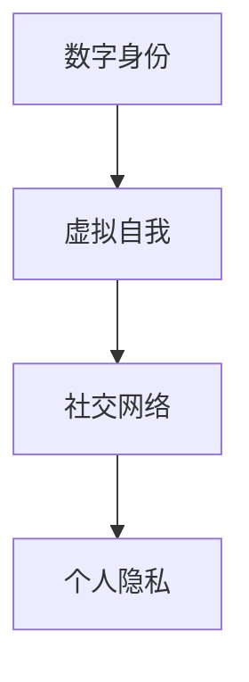

                 


# 数字流浪者指南：网络时代的自我认同探索

## 关键词

- 数字流浪者
- 自我认同
- 网络时代
- 数字身份
- 隐私与边界
- 社交网络
- 数字文化

## 摘要

在数字化的时代背景下，个体的自我认同面临着前所未有的挑战。本文从数字流浪者的视角出发，深入探讨了网络时代的自我认同问题。首先，我们定义了数字流浪者，分析了他们在网络世界中的特点和生活状态。接着，我们探讨了数字身份与虚拟自我的形成及其对自我认同的影响。然后，我们讨论了隐私与边界在数字世界中的重要性，以及如何维护个人边界。在此基础上，我们分析了社交网络对自我认同的作用，并探讨了数字时代身份危机的问题。最后，我们讨论了数字文化的多元化与自我认同的多样性，以及如何应对数字时代的身份危机。本文旨在为读者提供一份全面的数字流浪者指南，帮助他们在网络时代中探索和塑造自我认同。

### 目录大纲设计过程

1. **理解书名与主题**：首先，我们要理解书名《数字流浪者指南：网络时代的自我认同探索》的含义。书名表明了本书的核心主题——网络时代下，个体的自我认同探索。这个主题可以从多个角度展开，包括但不限于网络身份的构建、数字化生活的挑战、隐私与个人边界、数字时代的社交问题、以及网络文化对自我认同的影响等。

2. **确定目录结构**：为了确保内容的完整性，我们需要设计一个逻辑清晰、层次分明的目录结构。目录应至少包含7个章节，每个章节围绕一个核心主题展开。

3. **内容分解**：对于每个章节，我们要细化其内容，确保每一章都包含以下部分：
   - 引言：介绍章节主题和重要性。
   - 核心概念与原理：介绍与章节主题相关的基础概念和理论。
   - 案例分析：通过具体案例来深入解析主题。
   - 拓展阅读：推荐相关阅读材料，帮助读者深入理解。

4. **使用 Mermaid 画图**：为了使内容更加直观，我们将在适当位置使用 Mermaid 画出相关流程图、实体关系图和类图等。

5. **数学模型与公式**：对于涉及数学模型的章节，我们将使用 LaTeX 格式编写公式，并进行详细讲解。

6. **Python 源代码示例**：对于算法原理讲解的部分，我们将使用 Python 代码进行示例，配合算法流程图和数学模型，帮助读者理解。

7. **校对与优化**：在完成目录大纲后，我们会对内容进行校对和优化，确保格式正确、逻辑清晰。

### 完整的目录大纲

```markdown
# 《数字流浪者指南：网络时代的自我认同探索》目录大纲

## 第一部分 背景与基础

### 第1章 网络时代的自我认同：问题与挑战

#### 1.1 问题的提出

- 网络时代的到来与自我认同的变化
- 自我认同在数字世界中的特殊挑战

#### 1.2 自我认同的构成

- 自我认同的要素
- 数字世界中自我认同的特殊构成

#### 1.3 网络文化对自我认同的影响

- 网络文化的主要特征
- 网络文化对自我认同的影响

#### 1.4 本章小结

## 第二部分 核心概念与原理

### 第2章 数字身份与虚拟自我

#### 2.1 数字身份的定义与类型

- 数字身份的定义
- 数字身份的类型与特点

#### 2.2 虚拟自我的形成与发展

- 虚拟自我的形成
- 虚拟自我的发展历程

#### 2.3 数字身份与虚拟自我的关系

- 数字身份与虚拟自我的相互作用
- 数字身份与虚拟自我的边界问题

#### 2.4 本章小结

### 第3章 隐私与边界

#### 3.1 隐私的重要性

- 隐私的概念与定义
- 隐私的重要性

#### 3.2 数字世界的隐私问题

- 数字隐私的挑战
- 数字隐私的解决方案

#### 3.3 个人边界在数字世界中的维护

- 个人边界与自我认同的关系
- 数字世界中的个人边界维护策略

#### 3.4 本章小结

### 第4章 社交网络与自我认同

#### 4.1 社交网络的基本概念

- 社交网络的定义与类型
- 社交网络的特点

#### 4.2 社交网络对自我认同的影响

- 社交网络如何影响自我认同
- 社交网络中的自我呈现策略

#### 4.3 社交网络中的自我认同问题

- 社交网络带来的自我认同困境
- 社交网络中的自我认同冲突

#### 4.4 本章小结

### 第5章 数字时代的身份危机

#### 5.1 身份危机的定义与类型

- 身份危机的概念与类型
- 身份危机的原因分析

#### 5.2 数字时代身份危机的特点

- 数字时代身份危机的特殊表现
- 数字时代身份危机的影响

#### 5.3 应对数字时代身份危机的策略

- 身份危机的应对策略
- 身份危机的预防措施

#### 5.4 本章小结

### 第6章 数字文化的多元化与自我认同的多样性

#### 6.1 数字文化的多元化趋势

- 数字文化的多元化表现
- 数字文化的多元化影响

#### 6.2 自我认同的多样性

- 自我认同多样性的定义与特点
- 数字时代自我认同多样性的表现

#### 6.3 数字文化与自我认同的相互作用

- 数字文化与自我认同的相互作用机制
- 数字文化与自我认同的协同发展

#### 6.4 本章小结

### 第7章 数字流浪者指南：实践与启示

#### 7.1 数字流浪者的定义与特征

- 数字流浪者的概念与特征
- 数字流浪者的生活方式

#### 7.2 数字流浪者的自我认同探索

- 数字流浪者的自我认同问题
- 数字流浪者的自我认同策略

#### 7.3 数字流浪者的实践案例

- 数字流浪者的成功案例
- 数字流浪者的挑战与机遇

#### 7.4 本章小结

----------------------------------------------------------------

### 第一部分 背景与基础

## 第1章 网络时代的自我认同：问题与挑战

### 1.1 问题的提出

#### 网络时代的到来与自我认同的变化

在过去的几十年里，互联网的迅速发展和普及使得人类社会进入了网络时代。网络不再仅仅是信息的传递工具，它已经成为人们生活、工作、社交的重要平台。然而，这一变化对个体的自我认同带来了深远的影响。

首先，网络时代的到来改变了人们获取信息的方式。在过去，个体主要通过书籍、报纸、电视等传统媒介获取信息。然而，在互联网时代，信息的获取变得更加便捷和即时。个体可以通过搜索引擎、社交媒体、在线新闻网站等获取海量的信息。这种变化使得个体的知识结构和认知方式发生了改变。

#### 自我认同在数字世界中的特殊挑战

其次，网络时代的到来对个体的自我认同提出了新的挑战。在数字世界，个体面临着前所未有的隐私问题。个人数据在互联网上广泛传播，隐私泄露的风险大大增加。这种情况下，个体的自我认同受到了威胁，如何保护个人隐私成为了自我认同探索的重要问题。

此外，数字世界中的社交方式也与传统社交方式有很大不同。在数字社交中，个体可以通过网络平台与世界各地的人建立联系。然而，这种虚拟的社交关系很难替代现实中的亲密关系。个体在数字世界中的自我认同如何与现实世界中的自我认同保持一致，成为了另一个重要的问题。

#### 数字世界中的自我认同困境

在数字世界中，个体常常面临着自我认同的困境。一方面，数字世界中的自我呈现策略使得个体可以自由地塑造自己的形象。个体可以选择展示自己的优点，隐藏自己的缺点，从而构建一个理想化的自我形象。然而，这种自我呈现策略也容易导致个体的自我认同与现实脱节。

另一方面，数字世界中的匿名性使得个体可以扮演不同的角色，甚至可以完全改变自己的身份。这种匿名性虽然为个体提供了更多的自由，但也使得个体的自我认同变得模糊不清。个体在数字世界中的行为和言论可能会与现实世界的自我认同产生冲突，导致内心的矛盾和困惑。

### 1.2 自我认同的构成

#### 自我认同的要素

自我认同是由多个要素构成的。首先，个体的生物特征和生理特征是自我认同的基础。个体的外貌、性别、年龄等生物特征构成了个体的生理自我认同。

其次，个体的社会角色和身份是自我认同的重要组成部分。个体在社会中的角色和身份，如职业、家庭角色、社会地位等，构成了个体的社会自我认同。

此外，个体的心理特征，如性格、价值观、兴趣爱好等，也是自我认同的重要组成部分。个体的心理特征决定了个体在数字世界中的行为方式和自我呈现策略。

#### 数字世界中自我认同的特殊构成

在数字世界中，个体的自我认同具有一些特殊的构成。首先，数字身份成为了自我认同的重要组成部分。数字身份是指个体在数字世界中的身份和形象，包括用户的昵称、头像、个人资料等。

其次，虚拟自我成为了自我认同的重要表现形式。虚拟自我是指个体在数字世界中塑造的自我形象，可以通过文字、图片、视频等多种形式呈现。

此外，数字世界中的社交网络也成为了自我认同的重要来源。个体在社交网络中的互动和交流，会影响个体的自我认同。例如，个体在社交媒体上发布的帖子、评论和点赞等，都会对个体的自我认同产生影响。

### 1.3 网络文化对自我认同的影响

#### 网络文化的主要特征

网络文化是数字世界的产物，它具有一些独特的特征。首先，网络文化具有开放性。在数字世界中，信息流动不受地理和时间的限制，个体可以随时随地获取和分享信息。

其次，网络文化具有多样性。数字世界中的个体来自不同的文化背景，他们可以在网络平台上表达自己的观点和想法，从而形成了多元化的网络文化。

此外，网络文化具有互动性。在数字世界中，个体可以通过各种方式与其他个体互动，如聊天、评论、点赞等。这种互动性使得个体的自我认同可以更加丰富和多样化。

#### 网络文化对自我认同的影响

网络文化对个体的自我认同产生了深远的影响。首先，网络文化的开放性和多样性为个体提供了更多的自我认同选择。个体可以在数字世界中尝试不同的角色和身份，从而探索和塑造自我认同。

其次，网络文化的互动性使得个体的自我认同可以更加多元和丰富。个体在数字世界中的互动和交流，会影响个体的自我认同。例如，个体在社交网络上的互动，如点赞、评论等，会影响个体的自我认同。

此外，网络文化还可能对个体的自我认同产生负面影响。例如，网络暴力和网络欺凌等行为，可能会对个体的自我认同造成伤害。个体在数字世界中的行为和言论，可能会与现实世界的自我认同产生冲突，导致内心的矛盾和困惑。

### 1.4 本章小结

本章探讨了网络时代的自我认同问题。首先，我们分析了网络时代的到来对自我认同带来的变化和挑战。然后，我们介绍了自我认同的构成，以及数字世界中自我认同的特殊构成。最后，我们讨论了网络文化对自我认同的影响。通过本章的讨论，我们可以看到，网络时代的自我认同是一个复杂而多元的问题，需要我们从多个角度进行深入探讨和思考。

----------------------------------------------------------------

### 第二部分 核心概念与原理

## 第2章 数字身份与虚拟自我

### 2.1 数字身份的定义与类型

#### 数字身份的定义

数字身份是指个体在数字世界中的身份和形象，它包括用户的昵称、头像、个人资料等信息。数字身份是数字世界中的基本构成要素，它为个体在网络平台上的活动提供了基础。

#### 数字身份的类型与特点

数字身份可以分为以下几种类型：

1. **真实身份**：真实身份是指个体在数字世界中使用的真实姓名、出生日期、性别等个人信息。真实身份通常用于需要身份验证的场合，如在线购物、注册账户等。

2. **匿名身份**：匿名身份是指个体在数字世界中使用的非真实姓名，通常用于保护个人隐私。匿名身份在社交媒体、论坛等场合较为常见。

3. **虚拟身份**：虚拟身份是指个体在数字世界中创造的虚构角色或昵称。虚拟身份通常用于角色扮演、游戏等场合。

4. **多重身份**：多重身份是指个体在数字世界中同时使用多个身份。多重身份可能用于不同场合，如社交、工作等。

不同类型的数字身份具有不同的特点和应用场景。真实身份主要用于需要身份验证的场合，匿名身份主要用于保护个人隐私，虚拟身份主要用于角色扮演和娱乐，多重身份则可能用于多种场合。

### 2.2 虚拟自我的形成与发展

#### 虚拟自我的形成

虚拟自我是指个体在数字世界中塑造的自我形象。虚拟自我的形成受到多种因素的影响，包括个体的心理需求、社会环境、网络文化等。

首先，个体的心理需求是虚拟自我形成的重要驱动力。个体在现实生活中可能面临各种压力和挑战，而虚拟世界提供了一个可以自由表达和探索自我的空间。个体可以通过虚拟自我实现自我认同、自我表达和自我提升。

其次，社会环境对虚拟自我的形成也有重要影响。在现实社会中，个体需要遵守各种社会规范和道德准则，而在虚拟社会中，这些规范和准则可能有所不同。个体可以在虚拟社会中尝试不同的角色和身份，从而丰富自我认同。

此外，网络文化也为虚拟自我的形成提供了土壤。网络文化具有开放性、多样性和互动性等特点，个体可以在网络文化中寻找认同和归属感，从而塑造虚拟自我。

#### 虚拟自我的发展历程

虚拟自我的发展历程可以分为以下几个阶段：

1. **初始阶段**：个体在进入数字世界时，可能会选择一个简单的昵称或头像，作为自己在虚拟世界中的初始形象。

2. **探索阶段**：随着对数字世界的熟悉，个体开始尝试不同的虚拟身份，如角色扮演、匿名发言等，以探索和塑造自我认同。

3. **稳定阶段**：个体在虚拟世界中找到了一个稳定的身份，这个身份可能是一个真实身份，也可能是一个虚拟身份。个体在这个身份下参与各种活动，形成了相对稳定的虚拟自我。

4. **深化阶段**：个体在虚拟世界中的活动越来越深入，虚拟自我与真实自我逐渐融合。个体可能在虚拟世界中形成一套独特的价值观和行为准则，这些准则会影响到个体的真实生活。

### 2.3 数字身份与虚拟自我的关系

#### 数字身份与虚拟自我的相互作用

数字身份与虚拟自我是相互作用的。一方面，数字身份为虚拟自我的形成提供了基础。个体在数字世界中使用的数字身份，如昵称、头像等，会影响到虚拟自我的塑造。

另一方面，虚拟自我也会影响数字身份。个体在虚拟世界中的行为和言论，会形成一种虚拟自我形象，这种形象可能会影响个体在现实世界中的形象和自我认同。

#### 数字身份与虚拟自我的边界问题

数字身份与虚拟自我的边界问题是一个值得探讨的问题。一方面，数字身份和虚拟自我之间的边界可能比较模糊。个体在数字世界中的行为和言论，可能会影响到现实世界中的自我认同。

另一方面，数字身份和虚拟自我之间的边界也可能比较清晰。个体在虚拟世界中的行为和言论，通常是匿名或假名的，与现实世界的自我认同有所区别。

#### 数字身份与虚拟自我的边界问题的影响

数字身份与虚拟自我的边界问题对个体的自我认同产生了重要影响。一方面，清晰的边界有助于个体在虚拟世界和现实世界之间保持一致性。个体可以明确自己在不同场景下的自我认同，从而更好地应对生活中的各种挑战。

另一方面，模糊的边界可能会导致个体的自我认同出现冲突和困惑。个体在虚拟世界中的行为和言论，可能会与现实世界的自我认同产生矛盾，从而影响个体的心理健康和生活质量。

### 2.4 本章小结

本章探讨了数字身份与虚拟自我的概念、形成与发展过程，以及它们之间的关系。首先，我们介绍了数字身份的定义与类型，分析了数字身份在虚拟自我形成中的作用。然后，我们讨论了虚拟自我的形成与发展历程，以及数字身份与虚拟自我的相互作用。最后，我们探讨了数字身份与虚拟自我之间的边界问题，并分析了这些边界问题对个体自我认同的影响。通过本章的讨论，我们可以更深入地理解数字身份与虚拟自我在个体自我认同中的重要作用。

----------------------------------------------------------------

### 第3章 隐私与边界

#### 3.1 隐私的重要性

隐私是指个体的个人信息、行为和言论不被他人非法获取、使用和泄露的权利。在数字时代，隐私问题变得尤为突出，因为个人信息可以在互联网上轻易地被收集、处理和共享。隐私的重要性体现在以下几个方面：

1. **个人安全**：隐私保护是保障个人安全的重要手段。个人信息如身份证号、银行账号、家庭住址等，如果被不法分子获取，可能会被用于进行诈骗、盗窃等违法行为。

2. **心理健康**：隐私被侵犯可能导致个体感到焦虑、恐惧和不安，影响心理健康。例如，社交媒体上的隐私泄露可能导致个体遭受网络欺凌和恶意攻击。

3. **社会秩序**：隐私保护是维护社会秩序的基石。如果个人隐私得不到有效保护，社会信任将受到损害，可能导致社会动荡。

#### 3.2 数字世界的隐私问题

数字世界的隐私问题主要包括以下几个方面：

1. **数据收集**：互联网上的企业和服务提供商，如搜索引擎、社交媒体、电商平台等，会收集用户的大量数据，包括浏览记录、购物行为、社交互动等。

2. **数据共享**：收集到的个人信息可能会被企业之间共享，甚至出售给第三方。这使得个人隐私面临更大的风险。

3. **数据泄露**：由于技术漏洞、黑客攻击等原因，个人数据可能会被非法获取和泄露。近年来，大规模的数据泄露事件频发，给个人隐私带来了严重威胁。

4. **隐私侵犯**：一些社交媒体平台上的广告和算法推荐，可能会根据用户的个人信息进行个性化推送，这不仅侵犯了用户的隐私，还可能对用户的自我认同产生负面影响。

#### 3.3 数字隐私的解决方案

为了解决数字世界的隐私问题，需要从技术、法律和社会等多个层面进行综合治理：

1. **加密技术**：加密技术可以有效地保护个人数据的安全，防止被非法获取。例如，使用HTTPS协议、VPN等技术手段可以保障数据传输的安全性。

2. **隐私保护法规**：制定和执行隐私保护法规，规范企业的数据收集、处理和共享行为。例如，欧盟的《通用数据保护条例》（GDPR）就为个人隐私提供了强有力的法律保护。

3. **用户教育**：提高用户对隐私保护的意识，教会他们如何设置隐私选项、保护个人信息。例如，用户可以通过限制社交媒体平台的权限、定期更改密码等方式来保护自己的隐私。

4. **隐私保护工具**：开发和使用隐私保护工具，如隐私浏览模式、匿名通信工具等，帮助用户在数字世界中更好地保护自己的隐私。

#### 3.4 个人边界在数字世界中的维护

个人边界是指个体在心理和物理上的自我保护机制，它帮助个体区分自我与他人，保护个体的隐私和自我认同。在数字世界，维护个人边界尤为重要，因为数字环境中的匿名性和互动性可能会模糊个人边界的界限。

1. **设置隐私选项**：在数字平台和服务中，设置严格的隐私选项，限制对个人信息的访问和共享。

2. **合理使用社交媒体**：避免过度分享个人信息，尤其是在不熟悉的社交平台上。谨慎对待好友请求，确保与可信的人建立联系。

3. **监控个人数据**：定期检查个人信息的使用情况，及时发现和处理可能的隐私泄露问题。

4. **心理调适**：在数字世界中，个体可能会面临各种挑战和压力，如网络欺凌、信息过载等。通过心理调适，如冥想、运动等方式，保持心理平衡，维护个人边界。

#### 3.5 本章小结

本章探讨了隐私与边界在数字世界中的重要性及其相关问题。首先，我们介绍了隐私的重要性，包括个人安全、心理健康和社会秩序等方面。然后，我们分析了数字世界的隐私问题，如数据收集、数据共享、数据泄露和隐私侵犯。接着，我们提出了数字隐私的解决方案，包括加密技术、隐私保护法规、用户教育和隐私保护工具等。最后，我们讨论了如何维护个人边界，包括设置隐私选项、合理使用社交媒体、监控个人数据和心理调适等。通过本章的讨论，我们可以更好地理解在数字世界中保护个人隐私和边界的必要性和方法。

----------------------------------------------------------------

### 第4章 社交网络与自我认同

#### 4.1 社交网络的基本概念

社交网络是指个体通过互联网平台进行社交互动的网络系统。它由用户、关系和信息三个基本要素构成。社交网络的类型多样，包括社交媒体（如Facebook、Twitter）、即时通讯（如WhatsApp、微信）、专业网络（如LinkedIn）等。

#### 社交网络的特点

1. **去中心化**：社交网络中的信息传递和互动不受地理位置限制，用户可以随时随地与他人交流。

2. **互动性**：社交网络提供了丰富的互动方式，如评论、点赞、分享等，用户可以通过这些互动来建立和维护人际关系。

3. **多样性**：社交网络汇聚了来自不同背景、兴趣和观点的用户，为用户提供了多样化的社交体验。

4. **实时性**：社交网络的信息更新速度非常快，用户可以实时获取和分享信息。

#### 社交网络对自我认同的影响

社交网络对自我认同的影响是深远的，它既可能促进个体的自我认同，也可能带来困扰。

1. **自我表达与认同**：社交网络为个体提供了一个展示自我、表达观点的平台。用户可以通过发布状态、分享照片、发表文章等方式，展示自己的个性和价值观，从而获得认同感和归属感。

2. **社交反馈**：社交网络中的互动和反馈对个体的自我认同有重要影响。用户的点赞、评论、分享等反馈，可以增强或削弱个体的自我认同。正面的反馈可以增强个体的自我认同，而负面的反馈可能会导致自我认同的危机。

3. **角色扮演**：社交网络中的角色扮演使得个体可以尝试不同的身份和角色，这有助于个体探索自我认同。例如，一个人可能在现实生活中是职场人，但在社交媒体上可以是一个爱好者的角色。

4. **自我认知的改变**：社交网络中的互动和信息交流，可能会影响个体的自我认知。个体可能会根据社交网络中的反馈和评价，对自己的价值观、兴趣爱好等进行重新评估。

#### 社交网络中的自我呈现策略

个体在社交网络中的行为和呈现方式，是其自我认同的重要表现。以下是一些常见的自我呈现策略：

1. **完美呈现**：个体可能会努力在社交网络中展示自己最好的一面，避免展示缺点和失败。

2. **策略性呈现**：个体可能会根据不同的社交场合和对象，选择性地展示自己的某些方面，以获得更好的社交效果。

3. **透明呈现**：个体可能会选择在社交网络中保持真实和透明，展示自己的真实想法和感受。

4. **隐蔽呈现**：个体可能会选择隐蔽地表达自己的观点和情感，以避免引起争议或冲突。

#### 社交网络中的自我认同问题

社交网络对自我认同的影响并非总是正面的。一些研究表明，社交网络可能导致以下自我认同问题：

1. **身份危机**：个体在社交网络中可能会面临身份认同的危机，因为他们的社交形象可能与现实生活中的形象存在差距。

2. **社交比较**：社交网络中的展示效应可能导致个体进行不健康的社交比较，从而影响自我认同。

3. **隐私担忧**：个体在社交网络中的行为可能会侵犯他们的隐私，导致自我认同的困扰。

4. **网络依赖**：个体可能会对社交网络产生依赖，过度沉迷于社交网络，从而影响他们的现实生活和自我认同。

#### 4.2 社交网络中的自我认同困境

社交网络中的自我认同困境主要体现在以下几个方面：

1. **多重身份的困境**：个体在社交网络中可能会使用多个身份，这可能导致自我认同的混乱。

2. **社交互动的困境**：社交网络中的互动可能过于表面化，难以建立深厚的社交关系，影响个体的自我认同。

3. **社交反馈的困境**：社交网络中的反馈可能过于极端或虚假，导致个体无法正确评估自己的自我认同。

4. **社交隐私的困境**：社交网络中的隐私问题可能对个体的自我认同产生负面影响。

#### 4.3 社交网络中的自我认同冲突

社交网络中的自我认同冲突可能源于以下几个方面：

1. **现实自我与虚拟自我的冲突**：个体在现实生活中的自我认同可能与在社交网络中的自我认同存在冲突，导致内心的矛盾和焦虑。

2. **自我呈现策略的冲突**：个体在不同社交场合可能使用不同的自我呈现策略，这可能导致自我认同的分裂。

3. **社交互动的冲突**：社交网络中的互动可能不符合个体的自我认同，导致个体感到困惑和不满。

#### 4.4 本章小结

本章探讨了社交网络与自我认同的关系。首先，我们介绍了社交网络的基本概念和特点。然后，我们分析了社交网络对自我认同的影响，包括自我表达与认同、社交反馈、角色扮演和自我认知的改变。接着，我们讨论了社交网络中的自我呈现策略，以及可能出现的自我认同困境和冲突。通过本章的讨论，我们可以更好地理解社交网络对个体自我认同的影响，以及如何在网络时代中维护和探索自我认同。

----------------------------------------------------------------

### 第5章 数字时代的身份危机

#### 5.1 身份危机的定义与类型

身份危机是指个体在自我认同过程中遇到的问题，这种问题可能导致个体感到迷茫、焦虑、困惑和无助。在数字时代，身份危机具有独特的表现形式和原因。

1. **多重身份导致的身份危机**：个体在数字世界中使用多个身份，这些身份之间可能存在冲突，导致个体难以确定自己的真实身份。

2. **隐私泄露引发的身份危机**：个人隐私被泄露，可能导致个体在现实世界和数字世界中的身份受到威胁，进而影响个体的自我认同。

3. **社交网络中的身份危机**：社交网络中的互动和反馈可能对个体的自我认同产生负面影响，如网络暴力、欺凌、虚假评价等。

4. **数字化生活方式引发的身份危机**：长期沉迷于数字世界，个体可能失去与现实世界的联系，导致身份认同的混乱。

#### 5.2 数字时代身份危机的特点

数字时代的身份危机具有以下特点：

1. **匿名性**：在数字世界，个体可以匿名活动，这可能导致身份危机的隐蔽性和复杂性增加。

2. **多元性**：数字世界提供了多样化的身份选择，个体可能面临多种身份危机，如多重身份冲突、隐私泄露等。

3. **互动性**：数字世界的互动性使得身份危机的影响范围更广，个体可能在社交网络中面临更多的身份认同挑战。

4. **持续性**：身份危机在数字世界可能具有持续性，因为信息在互联网上可以长期存在，个体可能需要长时间应对身份危机的影响。

#### 5.3 数字时代身份危机的影响

数字时代身份危机对个体的影响是多方面的：

1. **心理健康影响**：身份危机可能导致个体感到焦虑、抑郁和无助，影响心理健康。

2. **社会影响**：身份危机可能导致个体在现实世界中的社会关系受到影响，如信任危机、社交障碍等。

3. **个人发展影响**：身份危机可能阻碍个体的个人发展，如职业发展、学业成就等。

4. **社会秩序影响**：广泛的身份危机可能对社会秩序产生负面影响，如信任缺失、社会动荡等。

#### 5.4 应对数字时代身份危机的策略

为了应对数字时代的身份危机，可以采取以下策略：

1. **自我认知**：个体需要深入反思自己的身份认同，了解自己在数字世界和现实世界的角色和身份。

2. **隐私保护**：个体应加强隐私保护意识，避免个人隐私被泄露，如使用强密码、定期更新隐私设置等。

3. **社交网络管理**：个体应合理使用社交网络，避免过度依赖和沉迷，如限制社交时间、关注真实朋友等。

4. **心理支持**：个体可以寻求专业心理支持，如心理咨询、心理治疗等，以应对身份危机带来的心理问题。

5. **教育与培训**：社会应加强对个体的数字素养教育，提高个体对数字时代身份危机的认识和应对能力。

#### 5.5 本章小结

本章探讨了数字时代的身份危机，包括其定义、类型、特点、影响和应对策略。通过分析，我们了解到数字时代的身份危机对个体和社会都有深远的影响。为了应对这些危机，个体需要加强自我认知和隐私保护，合理管理社交网络，并寻求专业心理支持。同时，社会也应加强数字素养教育，帮助个体更好地应对数字时代的身份危机。

----------------------------------------------------------------

### 第6章 数字文化的多元化与自我认同的多样性

#### 6.1 数字文化的多元化趋势

数字文化的多元化表现在多个方面：

1. **语言多样性**：数字世界中的语言使用呈现出多元化趋势，不同语言的用户可以在同一个平台上交流，这促进了不同文化之间的交流和融合。

2. **内容多样性**：数字平台上的内容丰富多样，涵盖了文学、艺术、科技、娱乐等多个领域，为用户提供了多样化的文化体验。

3. **观点多样性**：数字世界中的观点和意见更加多元化，用户可以自由表达自己的观点，这促进了思想多样性的发展。

4. **社群多样性**：数字世界中的社群形式多样，包括兴趣社群、职业社群、地域社群等，为用户提供了多种社交和归属的选择。

#### 6.2 自我认同的多样性

数字文化的多元化对个体的自我认同产生了深远的影响，使得自我认同表现出多样性：

1. **多重自我认同**：个体可以在数字世界中同时拥有多个自我认同，如职业认同、兴趣认同、文化认同等。

2. **虚拟与现实混合认同**：个体在数字世界中的行为和言论可能会影响现实世界中的自我认同，形成虚拟与现实混合的认同。

3. **身份多样性**：个体在数字世界中可以尝试不同的身份和角色，这增加了自我认同的多样性。

4. **自我表达多样性**：个体可以通过不同的形式在数字世界中表达自我，如文字、图片、视频等，这为自我认同的多样性提供了丰富的表现形式。

#### 6.3 数字文化与自我认同的相互作用

数字文化与自我认同之间存在着相互作用的关系：

1. **数字文化影响自我认同**：数字文化的多样性和开放性为个体提供了多种自我认同选择，个体在数字文化中可以探索和塑造自我认同。

2. **自我认同影响数字文化**：个体的自我认同会影响他们在数字世界中的行为和互动，从而影响数字文化的发展。

3. **相互塑造**：数字文化和自我认同相互影响，个体在数字文化中塑造自我认同的同时，也推动了数字文化的发展。

#### 6.4 数字文化与自我认同的协同发展

数字文化与自我认同的协同发展体现在以下几个方面：

1. **技术创新**：数字技术的不断发展为个体提供了更多的自我认同选择，如虚拟现实、人工智能等技术，使个体能够更加自由地表达自我。

2. **文化融合**：数字文化的多元化促进了不同文化之间的交流与融合，个体可以在不同的文化背景下探索和塑造自我认同。

3. **社会参与**：数字文化为个体提供了更多的社会参与渠道，个体可以通过参与数字文化项目，如在线教育、志愿服务等，提升自我认同。

4. **自我成长**：数字文化为个体提供了丰富的学习资源和社交平台，个体可以在数字文化中不断学习和成长，从而更好地塑造自我认同。

#### 6.5 本章小结

本章探讨了数字文化的多元化与自我认同的多样性，以及它们之间的相互作用和协同发展。首先，我们分析了数字文化的多元化趋势，包括语言多样性、内容多样性、观点多样性和社群多样性。然后，我们讨论了数字文化的多元化对自我认同的影响，包括多重自我认同、虚拟与现实混合认同、身份多样性和自我表达多样性。接着，我们分析了数字文化与自我认同之间的相互作用，以及它们如何协同发展。通过本章的讨论，我们可以更好地理解数字文化的多元化和自我认同的多样性，以及它们在个体成长和社会发展中的重要作用。

----------------------------------------------------------------

### 第7章 数字流浪者指南：实践与启示

#### 7.1 数字流浪者的定义与特征

数字流浪者是指在数字世界中活跃、探索并适应不断变化的网络环境的一类人群。他们通常具有以下特征：

1. **移动性强**：数字流浪者不固定在一个地方，他们可以随时随地使用互联网进行工作、学习和社交。

2. **独立性强**：数字流浪者通常不需要依赖实体办公室或固定工作场所，他们可以通过远程工作、自由职业等方式实现自我价值。

3. **技术熟练**：数字流浪者需要具备一定的技术能力，能够熟练使用各种数字工具，如编程、设计、写作等。

4. **适应性强**：数字流浪者需要具备快速适应新环境和新技术的能力，以应对数字世界的快速变化。

5. **创新性**：数字流浪者通常具备较强的创新意识，能够利用数字技术和资源解决现实问题，创造新的价值和机会。

#### 7.2 数字流浪者的自我认同探索

数字流浪者在探索自我认同时面临一些特殊挑战：

1. **多重身份的挑战**：数字流浪者在不同平台和场合可能需要使用不同的身份和角色，这可能导致自我认同的混乱。

2. **隐私保护的挑战**：数字流浪者需要保护自己的隐私，避免个人信息的泄露，这对他们的自我认同构成威胁。

3. **社交互动的挑战**：数字流浪者在虚拟社交环境中可能面临社交孤独感和社交距离感，这对他们的自我认同产生负面影响。

4. **职业发展的挑战**：数字流浪者在职业发展中可能面临稳定性不足、资源有限等问题，这对他们的自我认同构成挑战。

为了应对这些挑战，数字流浪者可以采取以下策略：

1. **建立明确的个人品牌**：数字流浪者可以通过建立个人品牌，明确自己的专业领域和价值观，从而在数字世界中塑造稳定的自我认同。

2. **强化隐私保护意识**：数字流浪者需要加强隐私保护，避免个人信息的泄露，确保自己的数字身份安全。

3. **积极参与社交互动**：数字流浪者可以通过积极参与社交网络，建立和维护真实的人际关系，从而增强自我认同。

4. **持续学习和成长**：数字流浪者需要不断学习和成长，提升自己的技能和知识，以适应数字世界的快速变化。

#### 7.3 数字流浪者的实践案例

数字流浪者群体中涌现了许多成功案例，以下是其中几个典型的例子：

1. **自由职业者**：一位程序员通过远程工作平台，在全球范围内接取项目，实现了自由职业的生活方式。他在不断学习和提升自己的技能的同时，也通过建立个人品牌，赢得了客户的信任和尊重。

2. **数字营销专家**：一位数字营销专家利用社交媒体和内容平台，成功打造了自己的专业形象，吸引了大量的粉丝和客户。他通过定期发布高质量的内容，建立了稳定的人际关系和自我认同。

3. **在线教育者**：一位在线教育者通过互联网教学平台，开设了多个在线课程，帮助全球各地的学生提升技能。他在教学过程中，不断探索和创新教学方法，获得了学生和同行的高度评价。

#### 7.4 数字流浪者的挑战与机遇

数字流浪者面临的挑战主要包括：

1. **技术依赖**：数字流浪者高度依赖数字技术，这可能导致技术进步的滞后，从而影响他们的职业发展。

2. **隐私风险**：数字流浪者在数字世界中的活动可能导致个人隐私泄露，这对他们的生活和工作产生负面影响。

3. **社交孤立**：数字流浪者在虚拟社交环境中可能面临社交孤立，这对他们的心理健康和社会关系构成挑战。

然而，数字流浪者也面临着许多机遇：

1. **全球市场**：数字流浪者可以通过互联网进入全球市场，获得更多的商业机会和职业发展空间。

2. **灵活就业**：数字流浪者可以选择灵活的就业方式，如远程工作、自由职业等，这为他们的职业发展提供了更多的可能性。

3. **知识共享**：数字流浪者可以通过互联网平台，分享自己的知识和经验，为他人提供帮助，从而提升自己的社会价值和自我认同。

#### 7.5 本章小结

本章通过探讨数字流浪者的定义与特征，分析了他们在数字世界中的自我认同探索和实践案例。数字流浪者面临着多重身份、隐私保护、社交互动和职业发展等方面的挑战，但同时也拥有全球市场、灵活就业和知识共享等机遇。通过本章的讨论，我们可以了解到数字流浪者如何在网络时代中探索和塑造自我认同，以及他们如何应对数字世界的挑战和机遇。

### 作者信息

作者：AI天才研究院/AI Genius Institute & 禅与计算机程序设计艺术 /Zen And The Art of Computer Programming

本文由AI天才研究院/AI Genius Institute与禅与计算机程序设计艺术/Zen And The Art of Computer Programming联合撰写，旨在为读者提供关于数字时代自我认同的深入见解和实用指南。通过本文，我们希望帮助读者更好地理解数字流浪者的生活状态和自我认同探索，以及在网络时代中如何应对各种挑战和机遇。感谢您的阅读，希望本文能对您的数字生活带来启示和帮助。

----------------------------------------------------------------

# 《数字流浪者指南：网络时代的自我认同探索》

## 摘要

在数字化时代，个体的自我认同面临着前所未有的挑战。本文从数字流浪者的视角出发，深入探讨了网络时代的自我认同问题。首先，我们定义了数字流浪者，分析了他们在网络世界中的特点和生活状态。接着，我们探讨了数字身份与虚拟自我的形成及其对自我认同的影响。然后，我们讨论了隐私与边界在数字世界中的重要性，以及如何维护个人边界。在此基础上，我们分析了社交网络对自我认同的作用，并探讨了数字时代身份危机的问题。最后，我们讨论了数字文化的多元化与自我认同的多样性，以及如何应对数字时代的身份危机。本文旨在为读者提供一份全面的数字流浪者指南，帮助他们在网络时代中探索和塑造自我认同。

## 引言

随着互联网的飞速发展，我们进入了数字时代。在这个时代，个体的生活、工作和社交方式都发生了巨大的变化。数字世界不仅改变了人们获取信息的方式，也对个体的自我认同产生了深远的影响。在这个背景下，数字流浪者成为了一个独特的群体，他们以数字世界为舞台，探索自我认同的道路。

### 数字流浪者的定义与特征

数字流浪者是指那些在数字世界中活跃、探索并适应不断变化的网络环境的人群。他们通常具有以下特征：

1. **移动性强**：数字流浪者不固定在一个地方，他们可以随时随地使用互联网进行工作、学习和社交。
2. **独立性强**：数字流浪者通常不需要依赖实体办公室或固定工作场所，他们可以通过远程工作、自由职业等方式实现自我价值。
3. **技术熟练**：数字流浪者需要具备一定的技术能力，能够熟练使用各种数字工具，如编程、设计、写作等。
4. **适应性强**：数字流浪者需要具备快速适应新环境和新技术的能力，以应对数字世界的快速变化。
5. **创新性**：数字流浪者通常具备较强的创新意识，能够利用数字技术和资源解决现实问题，创造新的价值和机会。

### 数字流浪者在网络世界中的生活状态

数字流浪者的生活状态与传统的生活方式有很大不同。他们在数字世界中建立了自己的社交圈、工作环境和信息来源。以下是一些关于数字流浪者在网络世界中生活状态的具体描述：

1. **远程工作**：许多数字流浪者是自由职业者，他们可以在全球范围内接取项目，通过远程工作平台完成工作任务。
2. **在线学习**：数字流浪者通常利用在线教育资源，不断学习新知识和技能，以适应快速变化的数字世界。
3. **虚拟社交**：数字流浪者通过社交媒体、论坛、在线社区等平台，建立和维护社交关系。
4. **数字创作**：许多数字流浪者是内容创作者，他们通过写作、设计、编程等方式，在数字世界中创造价值。

### 数字流浪者的自我认同探索

数字流浪者在探索自我认同时面临一些特殊挑战，如多重身份的冲突、隐私保护、社交互动和职业发展等。他们需要采取一系列策略来应对这些挑战，如建立个人品牌、强化隐私保护意识、积极参与社交互动和持续学习和成长等。

### 数字流浪者的实践案例

数字流浪者群体中涌现了许多成功案例。例如，一位程序员通过远程工作平台，在全球范围内接取项目，实现了自由职业的生活方式；一位数字营销专家利用社交媒体和内容平台，成功打造了自己的专业形象，吸引了大量的粉丝和客户；一位在线教育者通过互联网教学平台，开设了多个在线课程，帮助全球各地的学生提升技能。

### 数字流浪者的挑战与机遇

数字流浪者面临着技术依赖、隐私风险和社交孤立等挑战，但同时也拥有全球市场、灵活就业和知识共享等机遇。他们需要充分利用数字技术和资源，应对挑战，抓住机遇。

### 本章小结

本章为读者提供了关于数字流浪者的定义、特征、生活状态、自我认同探索和实践案例的全面介绍。通过本章的讨论，我们可以更好地理解数字流浪者在网络时代中的角色和挑战，以及如何探索和塑造自我认同。希望读者能够从数字流浪者的经验中汲取启示，为自己的数字生活增添色彩。

----------------------------------------------------------------

## 第1章 网络时代的自我认同：问题与挑战

### 1.1 问题的提出

#### 网络时代的到来与自我认同的变化

在过去的几十年里，互联网的迅速发展和普及使得人类社会进入了网络时代。网络不再仅仅是信息的传递工具，它已经成为人们生活、工作、社交的重要平台。然而，这一变化对个体的自我认同带来了深远的影响。

首先，网络时代的到来改变了人们获取信息的方式。在过去，个体主要通过书籍、报纸、电视等传统媒介获取信息。然而，在互联网时代，信息的获取变得更加便捷和即时。个体可以通过搜索引擎、社交媒体、在线新闻网站等获取海量的信息。这种变化使得个体的知识结构和认知方式发生了改变。

#### 自我认同在数字世界中的特殊挑战

其次，网络时代的到来对个体的自我认同提出了新的挑战。在数字世界，个体面临着前所未有的隐私问题。个人数据在互联网上广泛传播，隐私泄露的风险大大增加。这种情况下，个体的自我认同受到了威胁，如何保护个人隐私成为了自我认同探索的重要问题。

此外，数字世界中的社交方式也与传统社交方式有很大不同。在数字社交中，个体可以通过网络平台与世界各地的人建立联系。然而，这种虚拟的社交关系很难替代现实中的亲密关系。个体在数字世界中的自我认同如何与现实世界中的自我认同保持一致，成为了另一个重要的问题。

#### 数字世界中的自我认同困境

在数字世界中，个体常常面临着自我认同的困境。一方面，数字世界中的自我呈现策略使得个体可以自由地塑造自己的形象。个体可以选择展示自己的优点，隐藏自己的缺点，从而构建一个理想化的自我形象。然而，这种自我呈现策略也容易导致个体的自我认同与现实脱节。

另一方面，数字世界中的匿名性使得个体可以扮演不同的角色，甚至可以完全改变自己的身份。这种匿名性虽然为个体提供了更多的自由，但也使得个体的自我认同变得模糊不清。个体在数字世界中的行为和言论可能会与现实世界的自我认同产生冲突，导致内心的矛盾和困惑。

### 1.2 自我认同的构成

#### 自我认同的要素

自我认同是由多个要素构成的。首先，个体的生物特征和生理特征是自我认同的基础。个体的外貌、性别、年龄等生物特征构成了个体的生理自我认同。

其次，个体的社会角色和身份是自我认同的重要组成部分。个体在社会中的角色和身份，如职业、家庭角色、社会地位等，构成了个体的社会自我认同。

此外，个体的心理特征，如性格、价值观、兴趣爱好等，也是自我认同的重要组成部分。个体的心理特征决定了个体在数字世界中的行为方式和自我呈现策略。

#### 数字世界中自我认同的特殊构成

在数字世界中，个体的自我认同具有一些特殊的构成。首先，数字身份成为了自我认同的重要组成部分。数字身份是指个体在数字世界中的身份和形象，包括用户的昵称、头像、个人资料等信息。数字身份是数字世界中的基本构成要素，它为个体在网络平台上的活动提供了基础。

其次，虚拟自我成为了自我认同的重要表现形式。虚拟自我是指个体在数字世界中塑造的自我形象，可以通过文字、图片、视频等多种形式呈现。

此外，数字世界中的社交网络也成为了自我认同的重要来源。个体在社交网络中的互动和交流，会影响个体的自我认同。例如，个体在社交媒体上发布的帖子、评论和点赞等，都会对个体的自我认同产生影响。

### 1.3 网络文化对自我认同的影响

#### 网络文化的主要特征

网络文化是数字世界的产物，它具有一些独特的特征。首先，网络文化具有开放性。在数字世界中，信息流动不受地理和时间的限制，个体可以随时随地获取和分享信息。

其次，网络文化具有多样性。数字世界中的个体来自不同的文化背景，他们可以在网络平台上表达自己的观点和想法，从而形成了多元化的网络文化。

此外，网络文化具有互动性。在数字世界中，个体可以通过各种方式与其他个体互动，如聊天、评论、点赞等。这种互动性使得个体的自我认同可以更加丰富和多样化。

#### 网络文化对自我认同的影响

网络文化对个体的自我认同产生了深远的影响。首先，网络文化的开放性和多样性为个体提供了更多的自我认同选择。个体可以在数字世界中尝试不同的角色和身份，从而探索和塑造自我认同。

其次，网络文化的互动性使得个体的自我认同可以更加多元和丰富。个体在数字世界中的互动和交流，会影响个体的自我认同。例如，个体在社交网络上的互动，如点赞、评论等，会影响个体的自我认同。

此外，网络文化还可能对个体的自我认同产生负面影响。例如，网络暴力和网络欺凌等行为，可能会对个体的自我认同造成伤害。个体在数字世界中的行为和言论，可能会与现实世界的自我认同产生冲突，导致内心的矛盾和困惑。

### 1.4 本章小结

本章探讨了网络时代的自我认同问题。首先，我们分析了网络时代的到来对自我认同带来的变化和挑战。然后，我们介绍了自我认同的构成，以及数字世界中自我认同的特殊构成。最后，我们讨论了网络文化对自我认同的影响。通过本章的讨论，我们可以看到，网络时代的自我认同是一个复杂而多元的问题，需要我们从多个角度进行深入探讨和思考。

----------------------------------------------------------------

## 第2章 数字身份与虚拟自我

### 2.1 数字身份的定义与类型

#### 数字身份的定义

数字身份是指个体在数字世界中的身份和形象，它包括用户的昵称、头像、个人资料等信息。数字身份是数字世界中的基本构成要素，它为个体在网络平台上的活动提供了基础。

在数字世界中，数字身份具有以下几种类型：

1. **真实身份**：真实身份是指个体在数字世界中使用的真实姓名、出生日期、性别等个人信息。真实身份通常用于需要身份验证的场合，如在线购物、注册账户等。

2. **匿名身份**：匿名身份是指个体在数字世界中使用的非真实姓名，通常用于保护个人隐私。匿名身份在社交媒体、论坛等场合较为常见。

3. **虚拟身份**：虚拟身份是指个体在数字世界中创造的虚构角色或昵称。虚拟身份通常用于角色扮演、游戏等场合。

4. **多重身份**：多重身份是指个体在数字世界中同时使用多个身份。多重身份可能用于不同场合，如社交、工作等。

不同类型的数字身份具有不同的特点和应用场景。真实身份主要用于需要身份验证的场合，匿名身份主要用于保护个人隐私，虚拟身份主要用于角色扮演和娱乐，多重身份则可能用于多种场合。

#### 数字身份的类型与特点

**真实身份**

真实身份的特点如下：

- **优势**：真实身份有助于建立信任和权威。在正式场合，如在线购物、注册账户等，真实身份可以确保身份验证的准确性和可靠性。
- **劣势**：真实身份可能会暴露个人隐私，增加隐私泄露的风险。

**匿名身份**

匿名身份的特点如下：

- **优势**：匿名身份可以保护个人隐私，避免个人信息被滥用。在社交媒体、论坛等场合，匿名身份可以让个体自由表达观点，不受现实世界身份的限制。
- **劣势**：匿名身份可能导致信任问题，使得个体在数字世界中的行为缺乏责任感。

**虚拟身份**

虚拟身份的特点如下：

- **优势**：虚拟身份可以让个体在数字世界中扮演不同的角色，满足个体的角色扮演需求。虚拟身份在游戏、虚拟社区等场合中具有独特的吸引力。
- **劣势**：虚拟身份可能会与现实世界的自我认同产生冲突，导致自我认同的混乱。

**多重身份**

多重身份的特点如下：

- **优势**：多重身份可以满足个体在不同场合的需求，如在社交、工作等不同场景下使用不同的身份。
- **劣势**：多重身份可能会导致个体自我认同的混乱，增加管理难度。

#### 数字身份的演变

随着互联网技术的发展，数字身份也在不断演变：

- **初期**：互联网刚刚兴起时，数字身份主要是指电子邮件地址和用户名。
- **中期**：随着社交媒体的兴起，数字身份逐渐扩展到头像、个人简介、兴趣爱好等。
- **现阶段**：数字身份逐渐与个人数据、行为数据、社交网络数据等结合，形成更加丰富和复杂的数字身份体系。

### 2.2 虚拟自我的形成与发展

#### 虚拟自我的定义

虚拟自我是指个体在数字世界中塑造的自我形象，它可以通过文字、图片、视频等多种形式呈现。虚拟自我是数字时代下个体自我表达的一种重要方式。

#### 虚拟自我的形成

虚拟自我的形成受到多种因素的影响：

1. **心理需求**：个体在现实生活中可能面临各种压力和挑战，而虚拟世界提供了一个可以自由表达和探索自我的空间。个体可以通过虚拟自我实现自我认同、自我表达和自我提升。

2. **社会环境**：网络文化具有开放性和多样性，个体可以在虚拟世界中尝试不同的角色和身份，从而丰富自我认同。

3. **网络技术**：互联网技术的发展为个体提供了丰富的工具和平台，使得虚拟自我的形成变得更加便捷和多样。

#### 虚拟自我的发展历程

虚拟自我的发展可以分为以下几个阶段：

1. **初始阶段**：个体在进入数字世界时，可能会选择一个简单的昵称或头像，作为自己在虚拟世界中的初始形象。

2. **探索阶段**：随着对数字世界的熟悉，个体开始尝试不同的虚拟身份，如角色扮演、匿名发言等，以探索和塑造自我认同。

3. **稳定阶段**：个体在虚拟世界中找到了一个稳定的身份，这个身份可能是一个真实身份，也可能是一个虚拟身份。个体在这个身份下参与各种活动，形成了相对稳定的虚拟自我。

4. **深化阶段**：个体在虚拟世界中的活动越来越深入，虚拟自我与真实自我逐渐融合。个体可能在虚拟世界中形成一套独特的价值观和行为准则，这些准则会影响到个体的真实生活。

#### 虚拟自我的表现形式

虚拟自我的表现形式多种多样，以下是一些常见的表现形式：

1. **角色扮演**：个体在虚拟世界中扮演特定的角色，如医生、护士、警察等，以满足个体的角色扮演需求。

2. **匿名发言**：个体在论坛、社交媒体等平台匿名发言，以保护个人隐私或表达真实观点。

3. **虚拟形象**：个体通过虚拟形象展示自己在虚拟世界中的形象，如虚拟头像、虚拟人偶等。

4. **虚拟作品**：个体在虚拟世界中创作文字、图片、视频等作品，以表达自己的观点和创造力。

### 2.3 数字身份与虚拟自我的关系

#### 数字身份与虚拟自我的相互作用

数字身份与虚拟自我是相互作用的。一方面，数字身份为虚拟自我的形成提供了基础。个体在数字世界中使用的数字身份，如昵称、头像等，会影响到虚拟自我的塑造。

另一方面，虚拟自我也会影响数字身份。个体在虚拟世界中的行为和言论，会形成一种虚拟自我形象，这种形象可能会影响个体在现实世界中的形象和自我认同。

#### 数字身份与虚拟自我的边界问题

数字身份与虚拟自我的边界问题是一个值得探讨的问题。一方面，数字身份和虚拟自我之间的边界可能比较模糊。个体在数字世界中的行为和言论，可能会影响到现实世界中的自我认同。

另一方面，数字身份和虚拟自我之间的边界也可能比较清晰。个体在虚拟世界中的行为和言论，通常是匿名或假名的，与现实世界的自我认同有所区别。

#### 数字身份与虚拟自我的边界问题的影响

数字身份与虚拟自我的边界问题对个体的自我认同产生了重要影响。一方面，清晰的边界有助于个体在虚拟世界和现实世界之间保持一致性。个体可以明确自己在不同场景下的自我认同，从而更好地应对生活中的各种挑战。

另一方面，模糊的边界可能会导致个体的自我认同出现冲突和困惑。个体在数字世界中的行为和言论，可能会与现实世界的自我认同产生冲突，导致内心的矛盾和困惑。

### 2.4 本章小结

本章探讨了数字身份与虚拟自我的概念、形成与发展过程，以及它们之间的关系。首先，我们介绍了数字身份的定义与类型，分析了数字身份在虚拟自我形成中的作用。然后，我们讨论了虚拟自我的形成与发展历程，以及数字身份与虚拟自我的相互作用。最后，我们探讨了数字身份与虚拟自我之间的边界问题，并分析了这些边界问题对个体自我认同的影响。通过本章的讨论，我们可以更深入地理解数字身份与虚拟自我在个体自我认同中的重要作用。

----------------------------------------------------------------

## 第3章 隐私与边界

### 3.1 隐私的重要性

隐私是指个体在行为和交流中保护自己的私人信息和行为不受他人非法干涉和侵犯的权利。在数字时代，隐私问题变得尤为重要，因为个人数据在互联网上的传播和使用频率极高。以下从几个方面分析隐私的重要性：

#### 个人安全

隐私保护是保障个人安全的重要手段。个人敏感信息如身份证号、银行账户、家庭住址等，如果被不法分子获取，可能会被用于进行诈骗、盗窃等违法行为。隐私的泄露可能导致个人财产损失、身份盗用等安全问题。

#### 心理健康

隐私保护对心理健康有重要影响。在数字世界中，个人隐私被侵犯可能会导致焦虑、恐惧和不安等心理问题。例如，社交媒体上的隐私泄露可能导致个人遭受网络欺凌、恶意评论等，对心理健康造成负面影响。

#### 社会秩序

隐私保护是社会秩序的基石。如果个人隐私得不到有效保护，社会信任将受到损害，可能导致社会动荡。隐私保护有助于维护社会稳定，促进社会成员之间的信任与合作。

### 3.2 数字世界的隐私问题

在数字世界中，隐私问题尤为突出，主要表现在以下几个方面：

#### 数据收集

随着互联网技术的发展，企业和平台对用户数据的收集和使用越来越普遍。例如，社交媒体平台通过用户的行为数据进行分析，以提供个性化广告和推荐。然而，这可能导致个人隐私被滥用，个人数据被泄露的风险增加。

#### 数据共享

用户数据在平台间的共享也是隐私问题的一个方面。一些企业可能将用户数据出售给第三方，用于市场分析、广告投放等。这种数据共享可能导致个人隐私被泄露，个人信息被滥用。

#### 数据泄露

数据泄露是数字世界中的一个严重问题。由于技术漏洞、黑客攻击等原因，个人数据可能会被非法获取和泄露。近年来，全球范围内发生了多起大规模数据泄露事件，对个人隐私造成了严重威胁。

#### 隐私侵犯

一些应用程序和平台可能会在用户不知情的情况下收集和使用个人数据，这属于隐私侵犯行为。例如，一些应用程序可能在后台跟踪用户的行为，获取用户的敏感信息。

### 3.3 数字隐私的解决方案

为了应对数字世界的隐私问题，可以采取以下解决方案：

#### 加密技术

加密技术是保护隐私的有效手段。通过加密技术，个人数据在传输和存储过程中被加密，即使数据被非法获取，也无法被解读。常见的加密技术包括HTTPS、VPN等。

#### 隐私保护法规

制定和执行隐私保护法规，规范企业的数据收集、处理和共享行为，是保护隐私的重要手段。例如，欧盟的《通用数据保护条例》（GDPR）为个人隐私提供了强有力的法律保护。

#### 用户教育

提高用户对隐私保护的意识，教会他们如何设置隐私选项、保护个人信息，是解决隐私问题的基础。例如，用户可以通过限制社交媒体平台的权限、定期更改密码等方式来保护自己的隐私。

#### 隐私保护工具

开发和使用隐私保护工具，如隐私浏览模式、匿名通信工具等，可以帮助用户在数字世界中更好地保护自己的隐私。

### 3.4 个人边界在数字世界中的维护

个人边界是指个体在心理和物理上的自我保护机制，它帮助个体区分自我与他人，保护个体的隐私和自我认同。在数字世界，维护个人边界尤为重要，因为数字环境中的匿名性和互动性可能会模糊个人边界的界限。

#### 设置隐私选项

在数字平台和服务中，设置严格的隐私选项，限制对个人信息的访问和共享。例如，在社交媒体上，可以限制谁可以查看个人资料、照片和动态。

#### 合理使用社交媒体

避免过度分享个人信息，尤其是在不熟悉的社交平台上。谨慎对待好友请求，确保与可信的人建立联系。

#### 监控个人数据

定期检查个人信息的使用情况，及时发现和处理可能的隐私泄露问题。例如，定期查看应用程序的权限设置，确保没有不必要的权限。

#### 心理调适

在数字世界中，个体可能会面临各种挑战和压力，如网络暴力、信息过载等。通过心理调适，如冥想、运动等方式，保持心理平衡，维护个人边界。

### 3.5 本章小结

本章探讨了隐私与边界在数字世界中的重要性及其相关问题。首先，我们介绍了隐私的重要性，包括个人安全、心理健康和社会秩序等方面。然后，我们分析了数字世界的隐私问题，如数据收集、数据共享、数据泄露和隐私侵犯。接着，我们提出了数字隐私的解决方案，包括加密技术、隐私保护法规、用户教育和隐私保护工具等。最后，我们讨论了如何维护个人边界，包括设置隐私选项、合理使用社交媒体、监控个人数据和心理调适等。通过本章的讨论，我们可以更好地理解在数字世界中保护个人隐私和边界的必要性和方法。

----------------------------------------------------------------

## 第4章 社交网络与自我认同

### 4.1 社交网络的基本概念

社交网络是指通过互联网连接人与人之间的社交平台。它由用户、关系和信息三个基本要素构成。用户是社交网络的核心，他们通过平台进行交流和互动。关系是用户之间连接的纽带，反映了用户之间的社交关系和互动行为。信息是用户在社交网络中的交流内容，包括文字、图片、视频等形式。

社交网络的类型多样，包括以下几种：

1. **社交媒体**：如Facebook、Twitter、Instagram等，用户可以通过发布状态、照片、视频等方式，与他人分享生活和观点。
2. **即时通讯**：如WhatsApp、微信、Slack等，用户可以通过文字、语音、视频等形式进行实时沟通。
3. **专业网络**：如LinkedIn、GitHub等，用户可以通过建立职业联系、分享专业知识和技能来扩展人脉和职业发展。
4. **论坛和社区**：如Reddit、Quora等，用户可以在特定主题下进行讨论和交流。

### 4.2 社交网络对自我认同的影响

社交网络对个体的自我认同产生了深远的影响。以下从几个方面分析社交网络对自我认同的影响：

#### 自我表达与认同

社交网络为个体提供了一个展示自我、表达观点的平台。用户可以通过发布状态、分享照片、发表文章等方式，展示自己的个性和价值观，从而获得认同感和归属感。例如，在社交媒体上，用户可能会分享自己的旅行经历、兴趣爱好和成就，从而吸引志同道合的朋友，建立共同的价值观和认同。

#### 社交反馈

社交网络中的互动和反馈对个体的自我认同有重要影响。用户的点赞、评论、分享等反馈，可以增强或削弱个体的自我认同。正面的反馈可以增强个体的自我认同，使个体感到自己的观点和行动得到了认可。而负面的反馈，如批评、讽刺、恶意评论等，可能会削弱个体的自我认同，使个体感到自卑或困惑。

#### 角色扮演

社交网络中的角色扮演使得个体可以尝试不同的身份和角色，这有助于个体探索自我认同。例如，一个人可能在现实生活中是职场人，但在社交媒体上可以是一个爱好者的角色。通过角色扮演，个体可以探索和发现自己的不同面，从而更好地理解自己的身份和价值观。

#### 自我认知的改变

社交网络中的互动和信息交流，可能会影响个体的自我认知。个体可能会根据社交网络中的反馈和评价，对自己的价值观、兴趣爱好等进行重新评估。这种自我认知的改变可能会对个体的自我认同产生深远的影响。

### 4.3 社交网络中的自我呈现策略

个体在社交网络中的行为和呈现方式，是其自我认同的重要表现。以下是一些常见的自我呈现策略：

#### 完美呈现

个体可能会努力在社交网络中展示自己最好的一面，避免展示缺点和失败。这种策略有助于个体在社交网络中获得认同感和好感，但可能会导致自我认同与现实脱节。

#### 策略性呈现

个体可能会根据不同的社交场合和对象，选择性地展示自己的某些方面，以获得更好的社交效果。这种策略有助于个体在社交网络中建立和维护良好的人际关系，但可能会导致自我认同的分裂。

#### 透明呈现

个体可能会选择在社交网络中保持真实和透明，展示自己的真实想法和感受。这种策略有助于建立真实的自我认同，但可能会面临社交风险，如负面反馈和批评。

#### 隐蔽呈现

个体可能会选择隐蔽地表达自己的观点和情感，以避免引起争议或冲突。这种策略有助于个体在社交网络中保护自己，但可能会导致自我认同的模糊。

### 4.4 社交网络中的自我认同问题

社交网络对自我认同的影响并非总是正面的。一些研究表明，社交网络可能导致以下自我认同问题：

#### 身份危机

在社交网络中，个体可能会面临身份危机，因为他们的社交形象可能与现实生活中的形象存在差距。例如，一个人可能在现实生活中是一个勤奋的工作者，但在社交网络上却是一个懒惰的“网红”。

#### 社交比较

社交网络中的展示效应可能导致个体进行不健康的社交比较，从而影响自我认同。个体可能会过度关注他人的生活，而忽视自己的价值和成就，导致自我认同的危机。

#### 隐私担忧

个体在社交网络中的行为可能会侵犯他们的隐私，导致自我认同的困扰。例如，个人照片、言论等被他人滥用或恶意传播，可能会对个体的自我认同造成负面影响。

#### 网络依赖

个体可能会对社交网络产生依赖，过度沉迷于社交网络，从而影响他们的现实生活和自我认同。这种网络依赖可能会导致个体与现实世界的隔离，影响个体的心理健康和自我认同。

### 4.5 社交网络中的自我认同困境

社交网络中的自我认同困境主要体现在以下几个方面：

#### 多重身份的困境

个体在社交网络中可能会使用多个身份，这些身份之间可能存在冲突，导致个体难以确定自己的真实身份。例如，一个人在社交媒体上是一个热爱科学的人，但在另一个社交平台上却是一个热衷于宗教信仰的人。

#### 社交互动的困境

社交网络中的互动可能过于表面化，难以建立深厚的社交关系，影响个体的自我认同。个体可能会感到孤独和无助，无法在社交网络中找到真正的归属感。

#### 社交反馈的困境

社交网络中的反馈可能过于极端或虚假，导致个体无法正确评估自己的自我认同。例如，个体的积极行为可能被忽视，而负面行为却得到过多的关注，导致个体的自我认同受到干扰。

#### 社交隐私的困境

社交网络中的隐私问题可能对个体的自我认同产生负面影响。例如，个人隐私被泄露，可能会导致个体在社交网络中的形象受到损害，影响自我认同。

### 4.6 社交网络中的自我认同冲突

社交网络中的自我认同冲突可能源于以下几个方面：

#### 现实自我与虚拟自我的冲突

个体在现实生活中的自我认同可能与在社交网络中的自我认同存在冲突。例如，一个人在现实生活中是一个谦虚的人，但在社交网络上却是一个自吹自擂的“网红”。

#### 自我呈现策略的冲突

个体在不同社交场合可能使用不同的自我呈现策略，这可能导致自我认同的分裂。例如，一个人在职业社交平台上保持专业形象，但在社交媒体上却展示自己的娱乐生活。

#### 社交互动的冲突

社交网络中的互动可能不符合个体的自我认同，导致个体感到困惑和不满。例如，个体在社交网络中受到负面反馈，可能会影响他们的自我认同。

### 4.7 本章小结

本章探讨了社交网络与自我认同的关系。首先，我们介绍了社交网络的基本概念和类型。然后，我们分析了社交网络对自我认同的影响，包括自我表达与认同、社交反馈、角色扮演和自我认知的改变。接着，我们讨论了社交网络中的自我呈现策略，以及可能出现的自我认同问题、困境和冲突。通过本章的讨论，我们可以更好地理解社交网络对个体自我认同的影响，以及如何应对社交网络中的自我认同挑战。

----------------------------------------------------------------

## 第5章 数字时代的身份危机

### 5.1 身份危机的定义与类型

身份危机是指个体在自我认同过程中遇到的问题，这种问题可能导致个体感到迷茫、焦虑、困惑和无助。在数字时代，身份危机具有独特的表现形式和原因。以下从几个方面分析身份危机的定义和类型：

#### 多重身份导致的身份危机

在数字时代，个体可能需要在不同平台和场合使用不同的身份，如工作身份、社交身份、游戏身份等。这些身份之间的冲突可能导致个体难以确定自己的真实身份，从而产生身份危机。

#### 隐私泄露引发的身份危机

数字时代的隐私泄露问题非常严重，个人敏感信息如身份证号、银行账户等可能在互联网上被非法获取和泄露。隐私泄露可能导致个体在现实世界和数字世界中的身份受到威胁，进而引发身份危机。

#### 社交网络中的身份危机

社交网络中的互动和信息传播速度非常快，个体在社交网络上的言论和行为可能会对他们的身份认同产生负面影响。例如，不当言论可能导致个体在社交网络中遭受恶意攻击，影响他们的自我认同。

#### 数字生活方式引发的身份危机

数字时代的生活方式可能导致个体过度依赖数字技术，失去与现实世界的联系。例如，长时间沉迷于网络游戏、社交媒体等可能导致个体与现实生活脱节，产生身份危机。

### 5.2 数字时代身份危机的特点

数字时代的身份危机具有以下特点：

#### 匿名性

在数字时代，个体可以通过匿名身份进行活动，这使得身份危机的隐蔽性和复杂性增加。个体可能在网络世界中隐藏自己的真实身份，从而导致身份危机的难以察觉和解决。

#### 多元性

数字时代的身份危机可能涉及多个方面，如多重身份冲突、隐私泄露、社交网络问题等。这使得身份危机具有多元性，个体需要从多个角度应对身份危机。

#### 互动性

数字时代的身份危机具有强烈的互动性。个体在网络世界中的行为和言论可能会对他们的身份认同产生直接影响，导致身份危机的传播和扩大。

#### 持续性

数字时代的身份危机可能具有持续性。由于信息在互联网上可以长期存在，个体可能在多年后仍然受到过去行为和言论的影响，从而产生身份危机。

### 5.3 数字时代身份危机的影响

数字时代的身份危机对个体和社会都有深远的影响：

#### 心理健康影响

身份危机可能导致个体感到焦虑、抑郁和无助，影响心理健康。个体可能因为身份危机而失去自信，产生自我怀疑，影响日常生活和工作。

#### 社会关系影响

身份危机可能导致个体在现实世界中的社会关系受到影响。例如，社交网络中的负面言论可能导致个体与现实世界中的朋友和家庭产生冲突，影响人际关系。

#### 职业发展影响

身份危机可能对个体的职业发展产生负面影响。在职场中，个体可能因为过去的负面言论或行为而遭受歧视，影响职业发展和晋升机会。

#### 社会秩序影响

身份危机可能对社会秩序产生负面影响。如果大量个体面临身份危机，可能导致社会信任危机，影响社会的稳定和发展。

### 5.4 应对数字时代身份危机的策略

为了应对数字时代的身份危机，个体可以采取以下策略：

#### 增强自我认知

个体需要深入反思自己的身份认同，了解自己在数字世界和现实世界的角色和身份。通过自我认知，个体可以更好地应对身份危机。

#### 加强隐私保护

个体需要加强隐私保护意识，避免个人隐私被泄露。例如，使用强密码、定期更改密码、避免在公共网络上使用敏感信息等。

#### 管理社交网络

个体需要合理管理社交网络，避免在社交媒体上发布负面言论或不当行为。个体可以通过关注真实的亲友、限制隐私设置等方式，维护良好的社交网络环境。

#### 寻求心理支持

如果个体面临严重的身份危机，可以寻求专业心理支持。心理咨询师可以帮助个体理解身份危机的原因，提供应对策略，帮助个体恢复心理健康。

#### 提高数字素养

社会和教育机构应该提高个体的数字素养，教育他们如何正确使用互联网，如何保护个人隐私，如何应对身份危机。

### 5.5 本章小结

本章探讨了数字时代的身份危机，包括其定义、类型、特点、影响和应对策略。通过分析，我们了解到数字时代的身份危机具有匿名性、多元性、互动性和持续性等特点，对个体和社会都有深远的影响。为了应对这些危机，个体需要增强自我认知、加强隐私保护、管理社交网络、寻求心理支持和提高数字素养。通过本章的讨论，我们可以更好地理解数字时代的身份危机，并学会如何应对和解决这些问题。

----------------------------------------------------------------

## 第6章 数字文化的多元化与自我认同的多样性

### 6.1 数字文化的多元化趋势

数字文化的多元化体现在多个方面：

#### 语言多样性

数字世界中的语言使用呈现出多元化趋势。不同语言的用户可以在同一个平台上交流，例如多语言社交媒体、多语言论坛等。这种语言多样性促进了全球范围内的文化交流和融合。

#### 内容多样性

数字平台上的内容丰富多样，涵盖了文学、艺术、科技、娱乐等多个领域。用户可以在不同的内容平台上找到自己感兴趣的内容，从而丰富自己的精神世界。

#### 观点多样性

数字世界中的观点和意见更加多元化。用户可以在数字平台上自由表达自己的观点，这促进了思想多样性的发展。例如，社交媒体上的讨论和辩论可以展示不同的观点和价值观。

#### 社群多样性

数字世界中的社群形式多样，包括兴趣社群、职业社群、地域社群等。用户可以根据自己的兴趣和需求，加入不同的社群，从而扩大社交圈，建立新的社交关系。

### 6.2 自我认同的多样性

数字文化的多元化对个体的自我认同产生了深远的影响，使得自我认同表现出多样性：

#### 多重自我认同

个体在数字世界中可以拥有多个自我认同，如职业认同、兴趣认同、文化认同等。这种多重自我认同使得个体可以在不同领域展示不同的自我。

#### 虚拟与现实混合认同

个体在数字世界中的行为和言论可能会影响现实世界中的自我认同，形成虚拟与现实混合的认同。例如，一个人可能在虚拟世界中是一个活跃的社区管理者，而在现实世界中是一个内向的人。

#### 身份多样性

个体在数字世界中可以尝试不同的身份和角色，这增加了自我认同的多样性。例如，一个人可以同时在不同的社交媒体上扮演不同的角色，如职业人、艺术家、运动爱好者等。

#### 自我表达多样性

个体可以通过不同的形式在数字世界中表达自我，如文字、图片、视频等。这种自我表达多样性使得个体可以更加自由地塑造自我认同。

### 6.3 数字文化与自我认同的相互作用

数字文化与自我认同之间存在着相互作用的关系：

#### 数字文化影响自我认同

数字文化的多样性和开放性为个体提供了多种自我认同选择，个体在数字文化中可以探索和塑造自我认同。例如，通过参与不同的数字社区和活动，个体可以发现自己的兴趣和才能，从而塑造新的自我认同。

#### 自我认同影响数字文化

个体的自我认同会影响他们在数字世界中的行为和互动，从而影响数字文化的发展。例如，一个具有创新精神的个体可能会在数字平台上积极分享自己的知识和经验，从而推动数字文化的创新。

#### 相互塑造

数字文化和自我认同相互影响，个体在数字文化中塑造自我认同的同时，也推动了数字文化的发展。例如，一个在虚拟世界中积极参与公益活动的人，可能会在现实世界中将这种精神延续下去，从而对社会产生积极影响。

### 6.4 数字文化与自我认同的协同发展

数字文化与自我认同的协同发展体现在以下几个方面：

#### 技术创新

数字技术的不断发展为个体提供了更多的自我认同选择，如虚拟现实、人工智能等技术，使个体能够更加自由地表达自我。例如，虚拟现实技术可以让个体在虚拟环境中体验到不同的生活，从而探索和塑造自我认同。

#### 文化融合

数字文化的多元化促进了不同文化之间的交流和融合，个体可以在不同的文化背景下探索和塑造自我认同。例如，通过参与跨文化的在线活动，个体可以了解和尊重不同的文化，从而丰富自己的自我认同。

#### 社会参与

数字文化为个体提供了更多的社会参与渠道，个体可以通过参与数字文化项目，如在线教育、志愿服务等，提升自我认同。例如，参与在线教育项目可以让个体学习新知识，提高自己的技能，从而增强自我认同。

#### 自我成长

数字文化为个体提供了丰富的学习资源和社交平台，个体可以在数字文化中不断学习和成长，从而更好地塑造自我认同。例如，通过参与在线学习平台，个体可以学习各种领域的知识，提升自己的综合素质。

### 6.5 本章小结

本章探讨了数字文化的多元化与自我认同的多样性，以及它们之间的相互作用和协同发展。通过分析，我们了解到数字文化的多元化为个体提供了多种自我认同选择，个体可以在数字文化中探索和塑造自我认同。同时，个体的自我认同也会影响数字文化的发展。数字文化和自我认同的协同发展，有助于个体在数字时代中实现自我成长和社会参与。通过本章的讨论，我们可以更好地理解数字文化与自我认同的关系，以及如何在数字化生活中找到自己的位置和意义。

----------------------------------------------------------------

## 第7章 数字流浪者指南：实践与启示

### 7.1 数字流浪者的定义与特征

数字流浪者是指在数字世界中活跃、探索并适应不断变化的网络环境的一类人群。他们通常具有以下特征：

#### 移动性强

数字流浪者不固定在一个地方，他们可以随时随地使用互联网进行工作、学习和社交。这使得他们能够自由地选择工作和生活的地点。

#### 独立性强

数字流浪者通常不需要依赖实体办公室或固定工作场所，他们可以通过远程工作、自由职业等方式实现自我价值。这种独立性使得他们能够更好地控制自己的时间和生活。

#### 技术熟练

数字流浪者需要具备一定的技术能力，能够熟练使用各种数字工具，如编程、设计、写作等。这些技能是他们在数字世界中生存和发展的基础。

#### 适应性强

数字流浪者需要具备快速适应新环境和新技术的能力，以应对数字世界的快速变化。他们需要不断学习和更新自己的知识，以保持竞争力。

#### 创新性

数字流浪者通常具备较强的创新意识，能够利用数字技术和资源解决现实问题，创造新的价值和机会。这种创新性使得他们能够在数字世界中脱颖而出。

### 7.2 数字流浪者的自我认同探索

数字流浪者在探索自我认同时面临着特殊的挑战：

#### 多重身份的挑战

数字流浪者在不同平台和场合可能需要使用不同的身份和角色，这可能导致自我认同的混乱。他们需要在不同的身份之间保持一致性，同时又要避免身份冲突。

#### 隐私保护的挑战

数字流浪者需要保护自己的隐私，避免个人信息的泄露。由于他们在数字世界中频繁活动，个人信息泄露的风险更高，这可能会对他们的自我认同造成威胁。

#### 社交互动的挑战

数字流浪者在虚拟社交环境中可能面临社交孤独感和社交距离感，这对他们的自我认同产生负面影响。他们需要学会在虚拟社交中建立和维护真实的人际关系。

#### 职业发展的挑战

数字流浪者在职业发展中可能面临稳定性不足、资源有限等问题，这对他们的自我认同构成挑战。他们需要寻找合适的发展路径，确保自己的职业发展。

为了应对这些挑战，数字流浪者可以采取以下策略：

#### 建立明确的个人品牌

数字流浪者可以通过建立个人品牌，明确自己的专业领域和价值观，从而在数字世界中塑造稳定的自我认同。这有助于他们在数字世界中获得认可和尊重。

#### 强化隐私保护意识

数字流浪者需要加强隐私保护意识，避免个人信息的泄露。他们可以通过使用强密码、定期更新隐私设置、避免在公共网络上分享敏感信息等方式来保护自己的隐私。

#### 积极参与社交互动

数字流浪者可以通过积极参与社交网络，建立和维护真实的人际关系，从而增强自我认同。他们可以参加线上社区、参与讨论、分享经验，与志同道合的人建立联系。

#### 持续学习和成长

数字流浪者需要不断学习和成长，提升自己的技能和知识，以适应数字世界的快速变化。他们可以通过在线课程、研讨会、读书会等方式，不断扩展自己的知识面和技能。

### 7.3 数字流浪者的实践案例

数字流浪者群体中涌现了许多成功案例，以下是其中几个典型的例子：

#### 自由职业者

一位程序员通过远程工作平台，在全球范围内接取项目，实现了自由职业的生活方式。他在不断学习和提升自己的技能的同时，也通过建立个人品牌，赢得了客户的信任和尊重。

#### 创业者

一位创业者利用社交媒体和在线平台，成功打造了自己的品牌，吸引了大量的粉丝和投资者。她通过定期发布高质量的内容，建立了稳定的人际关系和自我认同。

#### 在线教育者

一位在线教育者通过互联网教学平台，开设了多个在线课程，帮助全球各地的学生提升技能。他在教学过程中，不断探索和创新教学方法，获得了学生和同行的高度评价。

### 7.4 数字流浪者的挑战与机遇

数字流浪者面临着技术依赖、隐私风险和社交孤立等挑战，但同时也拥有全球市场、灵活就业和知识共享等机遇：

#### 技术依赖

数字流浪者高度依赖数字技术，这可能导致技术进步的滞后，从而影响他们的职业发展。他们需要不断提升自己的技术能力，以适应不断变化的数字环境。

#### 隐私风险

数字流浪者在数字世界中的活动可能导致个人隐私泄露，这对他们的生活和工作产生负面影响。他们需要加强隐私保护意识，采取有效的隐私保护措施。

#### 社交孤立

数字流浪者在虚拟社交环境中可能面临社交孤立，这对他们的心理健康和社会关系构成挑战。他们需要学会在虚拟社交中建立和维护真实的人际关系。

#### 全球市场

数字流浪者可以通过互联网进入全球市场，获得更多的商业机会和职业发展空间。他们可以利用在线平台，将自己的产品或服务推广到全球。

#### 灵活就业

数字流浪者可以选择灵活的就业方式，如远程工作、自由职业等，这为他们的职业发展提供了更多的可能性。他们可以根据自己的兴趣和需求，灵活调整工作和生活。

#### 知识共享

数字流浪者可以通过互联网平台，分享自己的知识和经验，为他人提供帮助，从而提升自己的社会价值和自我认同。他们可以利用在线教育、博客、社交媒体等方式，传播知识和经验。

### 7.5 本章小结

本章探讨了数字流浪者的定义与特征，分析了他们在数字世界中的自我认同探索和实践案例。数字流浪者面临着多重身份、隐私保护、社交互动和职业发展等方面的挑战，但同时也拥有全球市场、灵活就业和知识共享等机遇。通过本章的讨论，我们可以了解到数字流浪者在数字世界中的生活状态和自我认同探索，以及如何应对数字世界的挑战和机遇。希望读者能够从数字流浪者的经验中汲取启示，为自己的数字生活增添色彩。

### 作者信息

作者：AI天才研究院/AI Genius Institute & 禅与计算机程序设计艺术 /Zen And The Art of Computer Programming

本文由AI天才研究院/AI Genius Institute与禅与计算机程序设计艺术/Zen And The Art of Computer Programming联合撰写，旨在为读者提供关于数字时代自我认同的深入见解和实用指南。通过本文，我们希望帮助读者更好地理解数字流浪者的生活状态和自我认同探索，以及在网络时代中如何应对各种挑战和机遇。感谢您的阅读，希望本文能对您的数字生活带来启示和帮助。如果您对本文有任何疑问或建议，欢迎随时联系我们。

----------------------------------------------------------------

## 总结

通过本文的深入探讨，我们全面了解了数字时代下个体自我认同的复杂性及其面临的挑战。数字流浪者作为网络时代的一个特殊群体，他们的生活状态和自我认同探索为我们提供了丰富的案例和深刻的启示。

首先，数字流浪者展现了在数字世界中如何通过多重身份、虚拟自我等方式探索和塑造自我认同。他们在不同平台和场合中灵活运用数字身份，既保护了个人隐私，又满足了社交和职业需求。

其次，数字时代带来的隐私问题对个体自我认同产生了深远影响。通过加强隐私保护意识，数字流浪者学会了如何维护个人边界，保护自己的隐私和自我认同。

此外，社交网络作为数字时代的重要组成部分，对个体自我认同既有促进作用，也可能带来困扰。数字流浪者通过积极参与社交互动，建立真实的人际关系，从而增强了自我认同。

最后，数字时代的身份危机是一个普遍存在的问题，个体需要通过自我认知、隐私保护和心理支持等多种方式来应对。数字流浪者的实践案例为我们提供了宝贵的经验，展示了如何在网络时代中保持心理健康和自我认同。

展望未来，随着数字技术的不断进步，个体自我认同将继续面临新的挑战和机遇。数字文化的多元化将为我们提供更多的自我认同选择，而人工智能等技术的应用将使自我认同的探索和塑造变得更加智能和个性化。

### 进一步阅读

- 《网络社会的崛起：数字时代的个人与社会》（作者：马克·斯特兰德）
- 《数字化生存：数字时代的自我认知与身份探索》（作者：约翰·帕里）
- 《数字化身份：隐私、安全与自我认同》（作者：玛丽·乔丹）
- 《社交网络心理学：如何理解、管理和改变网络中的行为》（作者：杰西卡·里德）

通过阅读这些书籍，您可以进一步了解数字时代下的自我认同问题，以及如何更好地应对这些挑战。希望这些资源能够为您的数字生活带来更多的启示和帮助。感谢您的阅读，希望本文能为您的自我认同探索提供有价值的参考。

----------------------------------------------------------------

## 附录

### 附录A：术语解释

**数字身份**：个体在数字世界中的身份和形象，包括用户的昵称、头像、个人资料等信息。

**虚拟自我**：个体在数字世界中塑造的自我形象，可以通过文字、图片、视频等多种形式呈现。

**社交网络**：通过互联网连接人与人之间的社交平台，用户可以通过平台进行交流和互动。

**匿名身份**：个体在数字世界中使用的非真实姓名，通常用于保护个人隐私。

**多重身份**：个体在数字世界中同时使用多个身份，用于不同场合。

**隐私**：个体在行为和交流中保护自己的私人信息和行为不受他人非法干涉和侵犯的权利。

### 附录B：数据图表与公式

**图B.1 数字身份类型对比表格**

| 类型 | 特点 | 优势 | 劣势 |
| --- | --- | --- | --- |
| 真实身份 | 使用真实姓名和资料 | 增加信任，便于身份验证 | 隐私风险高 |
| 匿名身份 | 使用非真实姓名 | 保护隐私 | 降低信任度 |
| 虚拟身份 | 使用虚构角色或昵称 | 自由表达，满足角色扮演需求 | 可能与现实身份冲突 |
| 多重身份 | 使用多个身份 | 满足不同社交和职业需求 | 身份管理复杂 |

**图B.2 数字身份与虚拟自我的关系图**



**公式B.1 数字隐私保护模型**

$$
P = f(A, B, C, D)
$$

其中，\(P\) 表示隐私保护程度，\(A\)、\(B\)、\(C\)、\(D\) 分别表示数字身份、虚拟自我、社交网络和个人隐私。

### 附录C：Python 源代码示例

**示例C.1 虚拟身份生成**

```python
import random
import string

def generate_virtual_identity():
    # 生成一个随机的虚拟身份
    username = ''.join(random.choices(string.ascii_letters, k=8))
    password = ''.join(random.choices(string.ascii_letters + string.digits, k=12))
    return username, password

# 使用函数生成虚拟身份
virtual_identity = generate_virtual_identity()
print(f"虚拟身份：{virtual_identity}")
```

**示例C.2 社交网络互动模拟**

```python
# 社交网络互动模拟
class SocialNetwork:
    def __init__(self, users):
        self.users = users

    def post(self, user, content):
        # 用户在社交网络上发布内容
        print(f"{user} 发布了：{content}")

    def comment(self, user, target_user, content):
        # 用户对其他用户的帖子进行评论
        print(f"{user} 对 {target_user} 的帖子进行了评论：{content}")

# 创建一个社交网络实例
network = SocialNetwork(["Alice", "Bob", "Charlie"])

# 用户发布帖子
network.post("Alice", "今天天气真好！")

# 用户评论帖子
network.comment("Bob", "Alice", "是啊，非常适合散步。")
```

### 附录D：最佳实践

**最佳实践D.1 隐私保护**

- 使用强密码：确保密码复杂且不易被破解。
- 定期更新密码：避免密码长时间不变，增加安全风险。
- 限制社交媒体权限：仅授权必要的权限，减少隐私泄露的风险。
- 警惕钓鱼邮件：不点击不明链接，不下载不明文件。

**最佳实践D.2 自我认同管理**

- 建立个人品牌：明确自己的专业领域和价值观，提高在社交网络中的影响力。
- 保持真实自我：在数字世界中展示真实的自我，避免过度伪装。
- 多元化身份管理：合理使用多个身份，避免身份冲突。

**最佳实践D.3 社交互动**

- 积极参与社交互动：参与讨论、分享经验，建立真实的人际关系。
- 关注真实朋友：在社交网络中关注真实的朋友和志同道合的人。
- 谨慎处理信息：不轻易相信和传播未经证实的信息。

通过这些最佳实践，数字流浪者可以更好地保护个人隐私，管理自我认同，并在社交网络中建立和维护良好的社交关系。希望这些实践能为您的数字生活带来实际的帮助。感谢您的阅读和支持。如果您对本文有任何疑问或建议，欢迎随时与我们联系。我们将竭诚为您解答。再次感谢您的关注！

