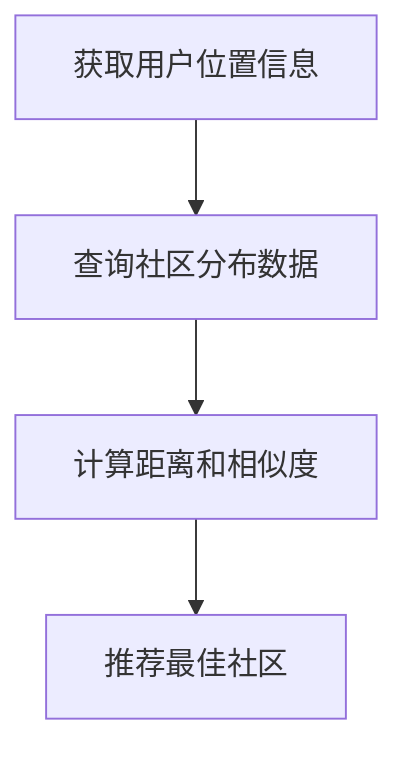
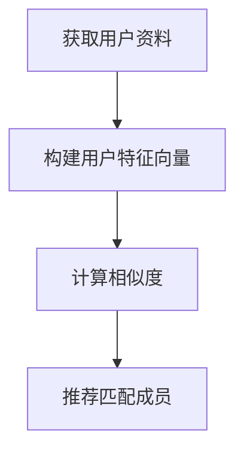
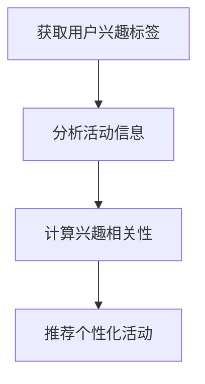
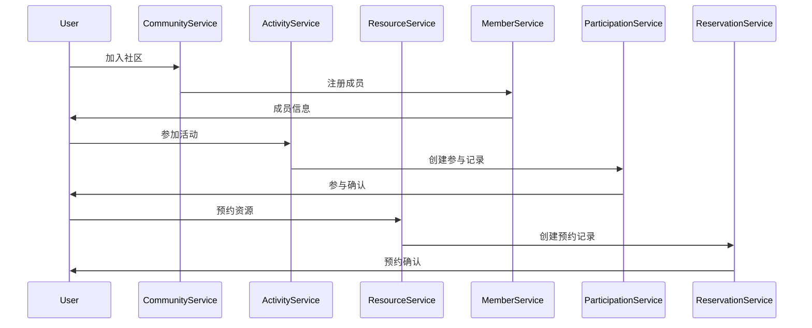
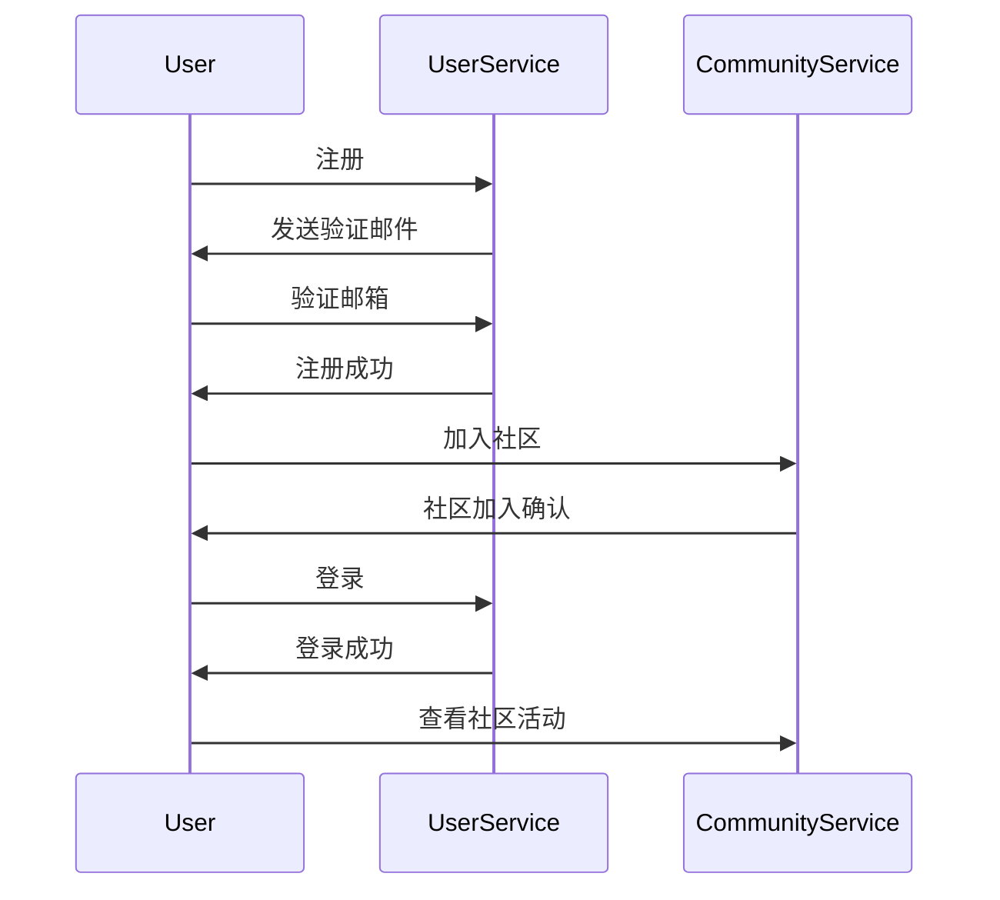
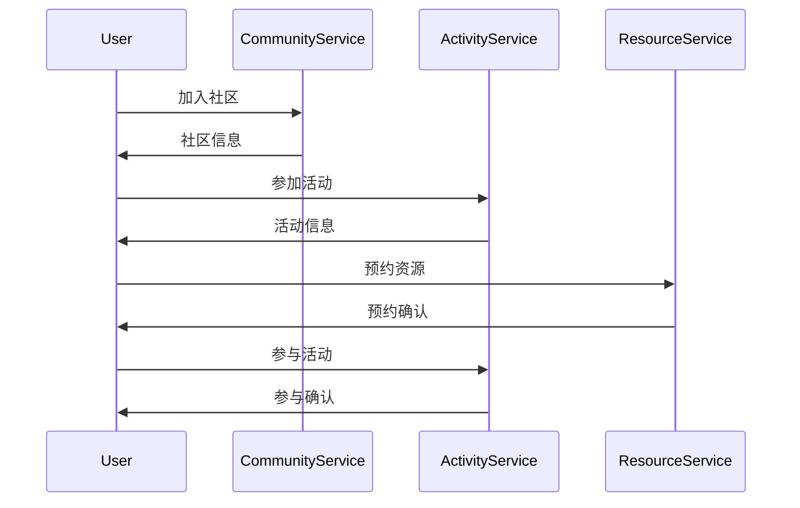

                 

### 第1章：问题背景与核心概念

#### 1.1 数字游民社区建设的兴起

随着互联网的普及和全球化进程的加速，数字游民（Digital Nomads）这一群体逐渐壮大。数字游民是指那些利用互联网远程工作的人，他们不受地理限制，可以随时随地进行工作和生活。这一群体通常由自由职业者、远程工作者、创业者和远程团队组成。

**数字游民社区的定义**

数字游民社区（Digital Nomad Community）是指那些以数字游民为主体的线下聚集地，旨在提供一个互相交流、分享经验和资源的平台。这些社区不仅提供物理空间，还致力于营造一种社交氛围，使数字游民能够在这里找到归属感和共鸣。

**数字游民社区的需求**

- **社交需求**：数字游民在工作时往往感到孤独，需要与他人交流、分享生活和工作的点滴。
- **资源共享**：社区可以提供一个平台，让数字游民共享住宿、交通、工作空间等资源，降低生活成本。
- **学习与成长**：社区可以组织各种培训和活动，帮助数字游民提升技能，拓展视野。
- **职业发展**：社区可以为数字游民提供职业机会，如招聘会和求职指导。

**数字游民社区的价值**

- **经济价值**：数字游民社区可以吸引投资，促进当地经济发展。
- **社会价值**：社区有助于构建多元化、包容性强的社会环境。
- **文化价值**：数字游民社区可以促进文化交流，增强不同文化之间的理解与融合。

#### 1.2 无国界工作者的特点

无国界工作者（Boundaryless Workers）是指那些跨越国家、行业和组织界限，以灵活和远程的方式工作的人。他们通常具备以下特点：

**无国界工作的定义**

无国界工作是指那些不受地理限制，通过互联网和远程协作工具进行的工作。这种工作方式打破了传统的职业边界，使人们可以自由选择工作和生活的地点。

**无国界工作者的优势**

- **灵活性与自主性**：无国界工作者可以自由选择工作时间和地点，更好地平衡工作与生活。
- **全球视野**：无国界工作者有机会接触到不同文化、行业和观点，有助于拓宽视野和提升技能。
- **职业发展**：无国界工作者可以通过参与全球项目和合作，获得更丰富的职业经历和机会。

**无国界工作者的挑战**

- **沟通障碍**：由于时区和语言差异，无国界工作者在沟通时可能会遇到困难。
- **文化冲突**：无国界工作者在跨文化环境中工作，可能会面临文化冲突和误解。
- **工作与生活平衡**：远程工作可能导致工作与生活界限模糊，影响工作效率和生活质量。

#### 1.3 数字游民社区建设的边界与外延

**社区组织的架构**

数字游民社区可以采用多种组织架构，如自治组织、会员制组织和公司化组织。每种架构都有其优缺点，需要根据实际情况进行选择。

**社区建设的核心要素**

数字游民社区建设的核心要素包括物理空间、社交活动、技术支持和资源共享。这些要素相互作用，共同构建一个有活力、可持续发展的社区。

**社区建设的可持续性**

数字游民社区需要考虑可持续性，以确保社区的长期发展。这包括资源利用、环境保护和社会责任等方面。

**核心概念原理与联系**

数字游民社区的核心概念包括数字游民、无国界工作者、社交需求、资源共享和职业发展等。这些概念相互关联，共同构成了数字游民社区的基础。

- **数字游民与无国界工作者**：两者都是基于互联网和远程协作的工作方式，但数字游民更侧重于生活方式，而无国界工作者更侧重于职业发展。
- **社交需求与资源共享**：社交需求是数字游民社区的核心驱动力，而资源共享是实现社交需求的重要手段。
- **职业发展与经济价值**：职业发展是数字游民社区的重要目标，通过提供职业机会和资源，可以促进社区的经济繁荣。

#### 1.4 核心概念原理与联系

**数字游民社区的核心概念**

- **数字游民**：基于互联网远程工作的人，不受地理限制。
- **无国界工作者**：跨越国家、行业和组织界限的远程工作者。
- **社交需求**：数字游民需要与他人交流、分享经验。
- **资源共享**：通过社区提供住宿、交通、工作空间等资源。
- **职业发展**：为数字游民提供职业机会，如招聘会和求职指导。

**概念属性特征对比表格**

| 概念             | 定义                                                         | 属性特征                                                     |
|------------------|--------------------------------------------------------------|--------------------------------------------------------------|
| 数字游民         | 基于互联网远程工作的人                                     | 灵活、自主、全球化视野                                       |
| 无国界工作者     | 跨越国家、行业和组织界限的远程工作者                       | 全球化协作、灵活、多元文化理解                               |
| 社交需求         | 数字游民需要与他人交流、分享经验                           | 社交、互动、归属感                                           |
| 资源共享         | 通过社区提供住宿、交通、工作空间等资源                     | 经济、高效、公平分配                                         |
| 职业发展         | 为数字游民提供职业机会，如招聘会和求职指导                 | 职业机会、资源获取、技能提升                                 |

**数字游民社区要素的ER实体关系图**

```mermaid
erDiagram
  User ||--|{ DigitalNomad }
  User ||--|{ BoundarylessWorker }
  DigitalNomad ||--|{ SocialNeed }
  DigitalNomad ||--|{ ResourceSharing }
  DigitalNomad ||--|{ CareerDevelopment }
  BoundarylessWorker ||--|{ GlobalCollaboration }
  SocialNeed ||--|{ CommunityBuilding }
  ResourceSharing ||--|{ EconomicValue }
  CareerDevelopment ||--|{ SocialValue }
```

#### 1.5 本章小结

本章介绍了数字游民社区建设的背景、核心概念和基本要素。通过分析数字游民的兴起、无国界工作者的特点以及数字游民社区的价值和架构，我们为后续章节的深入探讨奠定了基础。在下一章中，我们将进一步探讨数字游民社区的核心要素及其相互关系。请读者继续关注，以便更全面地了解数字游民社区的建设。

---

### 第2章：数字游民社区的核心要素

#### 2.1 数字游民社区的空间要素

数字游民社区的空间要素是其核心组成部分，决定了社区成员的生活质量和工作环境。以下是对空间要素的深入探讨。

**线下聚居地的设计**

线下聚居地是数字游民社区的核心场所，其设计需要考虑以下几个方面：

- **功能性**：聚居地应具备办公、休息、社交等多种功能区域，以满足数字游民的不同需求。
- **舒适性**：空间设计应注重舒适度，包括充足的采光、良好的通风和适宜的室内温度。
- **灵活性**：空间布局应具有一定的灵活性，以便根据活动需求进行调整。

**线下社区的环境与设施**

线下社区的环境和设施对数字游民的生活和工作至关重要。以下是一些关键点：

- **自然环境**：社区应位于自然环境优越的地区，如近海、山区或城市绿洲，以提供良好的生活和工作氛围。
- **基础设施**：社区应具备完善的基础设施，包括稳定的网络、充足的电力供应、便捷的交通和良好的卫生条件。
- **安全措施**：社区应配备安全设施，如监控系统、防火系统和应急响应机制，确保社区成员的人身安全。

**线下社区的安全保障**

社区的安全保障是数字游民社区稳定发展的基础。以下是一些关键措施：

- **网络安全**：社区应提供安全的网络环境，包括防火墙、杀毒软件和数据加密措施，防止网络攻击和数据泄露。
- **物理安全**：社区应采取物理安全措施，如门禁系统、监控设备和安保人员，防止犯罪行为。
- **社区规范**：社区应制定明确的规范和规则，要求成员遵守，以维护社区秩序和和谐。

**总结**

数字游民社区的空间要素是社区建设的重要组成部分，其设计应注重功能性、舒适性和灵活性。同时，社区的环境、设施和安全保障也是确保社区稳定发展的重要因素。下一节将探讨数字游民社区的社会要素，包括社区成员的互动与交流、社区文化的塑造以及社区组织的管理机制。

#### 2.2 数字游民社区的社会要素

数字游民社区的社会要素是社区活力的源泉，决定了社区成员的归属感和满意度。以下是对社会要素的深入探讨。

**社区成员的互动与交流**

社区成员的互动与交流是数字游民社区的核心。以下是一些关键点：

- **线上交流**：社区应提供在线平台，如论坛、社交媒体和即时通讯工具，以方便成员之间的交流和沟通。
- **线下活动**：社区应定期组织线下活动，如聚会、讲座、工作坊和社交派对，以促进成员之间的交流和互动。
- **协作空间**：社区应提供协作空间，如会议室、公共休息区和共享办公空间，以支持成员之间的合作和协作。

**社区文化的塑造**

社区文化是数字游民社区的核心价值观，对成员的行为和态度产生深远影响。以下是一些关键点：

- **包容性**：社区应倡导包容性文化，尊重不同背景、文化和观点的成员，营造一个多元、和谐的环境。
- **创新性**：社区应鼓励创新思维和实践，支持成员探索新的工作方式和生活方式。
- **互助性**：社区应建立互助机制，鼓励成员之间互相帮助、分享资源和经验，共同成长。

**社区组织的管理机制**

社区组织的管理机制是数字游民社区稳定运行的重要保障。以下是一些关键点：

- **自治机制**：社区应建立自治机制，让成员参与社区管理和决策，提高社区的民主性和参与度。
- **激励机制**：社区应制定激励机制，如奖励制度、积分系统和表彰活动，以激励成员积极参与社区建设和活动。
- **反馈机制**：社区应建立反馈机制，收集成员的意见和建议，及时调整管理策略和活动安排，以提高社区满意度。

**总结**

数字游民社区的社会要素是社区活力的关键，包括社区成员的互动与交流、社区文化的塑造以及社区组织的管理机制。这些要素共同构建了一个有活力、有温度的社区环境，为数字游民提供了一个良好的生活和工作空间。下一节将探讨数字游民社区的技术要素，包括社区信息平台的搭建、社区服务的技术支持以及社区技术的未来发展趋势。

#### 2.3 数字游民社区的技术要素

数字游民社区的技术要素是社区运行的核心支撑，决定了社区的效率、可持续性和用户体验。以下是对技术要素的深入探讨。

**社区信息平台的搭建**

社区信息平台是数字游民社区的核心基础设施，为社区成员提供信息共享、交流互动和资源整合的平台。以下是一些关键点：

- **平台选择**：社区应选择合适的平台，如自建网站、社交媒体群组或第三方平台，以满足社区的需求和特点。
- **功能模块**：平台应具备功能模块，如用户管理系统、公告系统、活动发布系统、论坛系统和资源库等，以支持社区的各项功能。
- **用户界面**：平台应设计友好的用户界面，提供简洁、直观的操作体验，以提高用户满意度。

**社区服务的技术支持**

社区服务的技术支持是确保社区正常运行和提升用户体验的关键。以下是一些关键点：

- **网络基础设施**：社区应确保网络基础设施的稳定和高速，提供充足的带宽和优质的网络服务。
- **数据安全**：社区应采取数据安全措施，如数据加密、备份和恢复机制，确保用户数据的安全和隐私。
- **技术维护**：社区应建立技术维护团队，定期检查和维护系统，确保平台的稳定运行和高效服务。

**社区技术的未来发展趋势**

随着科技的不断发展，数字游民社区技术也将迎来新的发展趋势。以下是一些关键点：

- **人工智能**：人工智能技术将被广泛应用于社区，如智能客服、智能推荐和智能分析等，提高社区的运营效率和服务质量。
- **区块链**：区块链技术将被用于社区的管理和运营，如去中心化存储、身份验证和智能合约等，提高社区的安全性和可信度。
- **物联网**：物联网技术将被用于社区的环境监测、设备管理和能源管理等方面，提高社区的环境可持续性和资源利用效率。

**总结**

数字游民社区的技术要素是社区高效运行和可持续发展的基础，包括社区信息平台的搭建、社区服务的技术支持以及社区技术的未来发展趋势。这些技术要素共同构建了一个高效、安全、可持续发展的数字游民社区环境。下一节将探讨数字游民社区的核心概念原理与联系，进一步深化对社区建设的理解。

#### 2.4 核心概念原理与联系

**核心概念的定义与联系**

数字游民社区的核心概念包括数字游民、无国界工作者、社交需求、资源共享和职业发展等。这些概念相互关联，共同构成了数字游民社区的基础。

- **数字游民**：指的是那些利用互联网远程工作的人，他们不受地理限制，可以随时随地进行工作和生活。
- **无国界工作者**：是指那些跨越国家、行业和组织界限，以灵活和远程的方式工作的人。
- **社交需求**：数字游民需要与他人交流、分享经验，以获得归属感和共鸣。
- **资源共享**：社区通过提供住宿、交通、工作空间等资源，满足数字游民的需求，降低生活成本。
- **职业发展**：社区为数字游民提供职业机会和资源，如招聘会和求职指导，帮助他们实现职业成长。

**概念属性特征对比表格**

| 概念             | 定义                                                         | 属性特征                                                     |
|------------------|--------------------------------------------------------------|--------------------------------------------------------------|
| 数字游民         | 基于互联网远程工作的人                                     | 灵活、自主、全球化视野                                       |
| 无国界工作者     | 跨越国家、行业和组织界限的远程工作者                       | 全球化协作、灵活、多元文化理解                               |
| 社交需求         | 数字游民需要与他人交流、分享经验                           | 社交、互动、归属感                                           |
| 资源共享         | 通过社区提供住宿、交通、工作空间等资源                     | 经济、高效、公平分配                                         |
| 职业发展         | 为数字游民提供职业机会，如招聘会和求职指导                 | 职业机会、资源获取、技能提升                                 |

**数字游民社区要素的ER实体关系图**

```mermaid
erDiagram
  User ||--|{ DigitalNomad }
  User ||--|{ BoundarylessWorker }
  DigitalNomad ||--|{ SocialNeed }
  DigitalNomad ||--|{ ResourceSharing }
  DigitalNomad ||--|{ CareerDevelopment }
  BoundarylessWorker ||--|{ GlobalCollaboration }
  SocialNeed ||--|{ CommunityBuilding }
  ResourceSharing ||--|{ EconomicValue }
  CareerDevelopment ||--|{ SocialValue }
```

**总结**

通过对数字游民社区的核心概念及其相互关系的分析，我们可以更好地理解社区的基本构成和运作机制。数字游民、无国界工作者、社交需求、资源共享和职业发展等核心概念相互交织，共同构成了数字游民社区的基本框架。下一节将介绍社区发现算法，进一步探讨如何通过技术手段优化和提升数字游民社区的建设与管理。

#### 2.5 本章小结

本章详细探讨了数字游民社区的核心要素，包括空间要素、社会要素和技术要素。通过对这些要素的深入分析，我们明确了数字游民社区的建设基础和关键点。空间要素关注线下聚居地的设计、环境和设施以及安全保障，社会要素关注社区成员的互动与交流、社区文化的塑造和管理机制，技术要素则关注信息平台的搭建、技术支持及未来发展趋势。这些核心要素相互配合，共同构成了一个高效、安全、有活力的数字游民社区。下一章将介绍数字游民社区建设的关键算法，进一步探讨如何通过技术手段优化社区管理。

---

### 第3章：数字游民社区建设的关键算法

数字游民社区的建设离不开算法的支持。算法不仅是实现社区功能的核心，也是优化用户体验和提升社区效率的关键。本章将详细介绍数字游民社区建设中的关键算法，包括社区发现算法、社区成员匹配算法和社区活动推荐算法。

#### 3.1 社区发现算法

**算法原理讲解**

社区发现算法旨在帮助数字游民找到附近的数字游民社区。其核心思想是通过分析用户的位置信息和社区分布情况，推荐最合适的社区。

**算法流程与Mermaid流程图**

算法的流程可以分为以下几个步骤：

1. **获取用户位置信息**：通过GPS或其他定位技术获取用户当前的位置信息。
2. **查询社区分布数据**：从数据库中检索附近的数字游民社区信息，包括社区的位置、设施和服务等。
3. **计算距离和相似度**：计算用户位置与社区位置的距离，并结合社区的评分和设施等因素，计算相似度。
4. **推荐最佳社区**：根据相似度评分，推荐最符合用户需求的社区。

以下是一个简化的Mermaid流程图：



**Python代码实现**

```python
import geopy.distance

def find_communities(user_location, communities):
    # 计算用户位置与各个社区的距离
    distances = []
    for community in communities:
        community_location = (community['latitude'], community['longitude'])
        distance = geopy.distance.distance(user_location, community_location).km
        distances.append((community, distance))
    
    # 计算相似度，这里简化为距离的倒数
    similarities = [(comm, 1 / dist) for comm, dist in distances]
    
    # 排序并推荐最佳社区
    sorted_communities = sorted(similarities, key=lambda x: x[1], reverse=True)
    return sorted_communities[0][0]

# 示例社区数据
communities = [
    {'name': 'Community A', 'latitude': 40.7128, 'longitude': -74.0060},
    {'name': 'Community B', 'latitude': 34.0522, 'longitude': -118.2437},
    {'name': 'Community C', 'latitude': 51.5074, 'longitude': -0.1278}
]

# 用户位置信息
user_location = (34.0522, -118.2437)

# 执行社区发现算法
best_community = find_communities(user_location, communities)
print(f"Best community for the user: {best_community['name']}")
```

**算法原理与数学模型**

社区发现算法的核心是距离计算和相似度评估。这里使用的是欧几里得距离公式和简单的相似度函数：

- **欧几里得距离**：用于计算两点之间的直线距离，公式为：

  $$ d = \sqrt{(x_2 - x_1)^2 + (y_2 - y_1)^2} $$

- **相似度函数**：通常使用距离的倒数作为相似度，即：

  $$ s = \frac{1}{d} $$

这种简单的相似度函数可以快速计算，但在实际应用中可能需要更复杂的函数，以考虑其他因素（如社区设施、用户评分等）。

**总结**

社区发现算法通过分析用户的位置信息和社区分布数据，推荐最合适的数字游民社区。算法的原理简单，但通过有效的计算和排序，可以为数字游民提供便利。在下一节中，我们将介绍社区成员匹配算法，探讨如何通过算法帮助社区成员找到合适的合作伙伴。

---

### 第3章：数字游民社区建设的关键算法（续）

#### 3.2 社区成员匹配算法

**算法原理讲解**

社区成员匹配算法旨在帮助数字游民找到兴趣相似、技能互补的社区成员。这一算法通过分析用户资料和偏好，推荐潜在匹配的成员。

**算法流程与Mermaid流程图**

算法的流程可以分为以下几个步骤：

1. **获取用户资料**：从用户资料中提取关键信息，如兴趣、技能、工作经验等。
2. **构建用户特征向量**：将用户资料转换为特征向量，便于计算相似度。
3. **计算相似度**：计算用户特征向量之间的相似度，可以使用余弦相似度、欧几里得距离等。
4. **推荐匹配成员**：根据相似度评分，推荐匹配度最高的成员。

以下是一个简化的Mermaid流程图：



**Python代码实现**

```python
from sklearn.metrics.pairwise import cosine_similarity
import numpy as np

def build_user_profile(user_data):
    # 构建用户特征向量，这里简化为向量[兴趣得分，技能得分，工作经验得分]
    profile = [user_data['interest_score'], user_data['skill_score'], user_data['experience_score']]
    return np.array(profile)

def match_users(user_profile, member_profiles):
    # 计算相似度
    similarities = cosine_similarity([user_profile], member_profiles)
    # 排序并推荐匹配度最高的成员
    sorted_members = sorted(zip(member_profiles, similarities[0]), key=lambda x: x[1], reverse=True)
    return sorted_members[0][0]

# 示例用户资料
user_data = {
    'interest_score': 0.8,
    'skill_score': 0.9,
    'experience_score': 0.7
}

# 社区成员资料
member_profiles = [
    {'name': 'Alice', 'interest_score': 0.7, 'skill_score': 0.8, 'experience_score': 0.6},
    {'name': 'Bob', 'interest_score': 0.9, 'skill_score': 0.7, 'experience_score': 0.8},
    {'name': 'Charlie', 'interest_score': 0.6, 'skill_score': 0.9, 'experience_score': 0.5}
]

# 构建用户特征向量
user_profile = build_user_profile(user_data)

# 执行成员匹配算法
matched_member = match_users(user_profile, [build_user_profile(member) for member in member_profiles])
print(f"Best match for the user: {matched_member['name']}")
```

**算法原理与数学模型**

社区成员匹配算法的核心是特征向量的构建和相似度计算。这里使用的是余弦相似度，其公式为：

$$ \text{cosine\_similarity} = \frac{\sum_{i=1}^{n}{x_i \cdot y_i}}{\sqrt{\sum_{i=1}^{n}{x_i^2} \cdot \sum_{i=1}^{n}{y_i^2}}} $$

其中，$x$和$y$是两个向量，$n$是向量的维度。余弦相似度衡量了两个向量方向的一致性，值范围在[-1, 1]之间，越接近1表示相似度越高。

**总结**

社区成员匹配算法通过构建用户特征向量，计算相似度，帮助数字游民找到匹配度最高的社区成员。算法的实现相对简单，但在实际应用中需要考虑更多的用户属性和偏好。在下一节中，我们将介绍社区活动推荐算法，探讨如何为社区成员推荐适合的活动。

---

### 第3章：数字游民社区建设的关键算法（续）

#### 3.3 社区活动推荐算法

**算法原理讲解**

社区活动推荐算法旨在为数字游民推荐符合他们兴趣和需求的活动。该算法结合用户的兴趣标签、历史参与活动和社区活动信息，生成个性化的活动推荐。

**算法流程与Mermaid流程图**

算法的流程可以分为以下几个步骤：

1. **获取用户兴趣标签**：从用户资料中提取兴趣标签。
2. **分析活动信息**：从社区活动数据库中提取活动的相关信息，如主题、时间、地点等。
3. **计算兴趣相关性**：计算用户兴趣标签与活动主题的相关性。
4. **推荐个性化活动**：根据相关性评分，推荐符合用户兴趣的活动。

以下是一个简化的Mermaid流程图：



**Python代码实现**

```python
from sklearn.metrics.pairwise import cosine_similarity
import numpy as np

def build_interest_profile(user_interests):
    # 构建用户兴趣向量，这里简化为向量[兴趣得分]
    profile = np.array([interest_score for interest_score in user_interests.values()])
    return profile

def recommend_activities(user_profile, activity_profiles, similarity_threshold=0.5):
    # 计算相似度
    similarities = cosine_similarity([user_profile], activity_profiles)
    # 筛选相似度大于阈值的活动
    relevant_activities = [activity for activity, similarity in zip(activity_profiles, similarities[0]) if similarity > similarity_threshold]
    # 排序并推荐匹配度最高的活动
    sorted_activities = sorted(relevant_activities, key=lambda x: x['interest_score'], reverse=True)
    return sorted_activities

# 示例用户兴趣标签
user_interests = {
    '编程': 0.9,
    '旅游': 0.7,
    '艺术': 0.5,
    '健康': 0.6
}

# 社区活动信息
activity_profiles = [
    {'name': '编程马拉松', 'interest_score': 0.85},
    {'name': '艺术展览', 'interest_score': 0.6},
    {'name': '徒步旅行', 'interest_score': 0.8},
    {'name': '健康讲座', 'interest_score': 0.7}
]

# 构建用户兴趣向量
user_profile = build_interest_profile(user_interests)

# 执行活动推荐算法
recommended_activities = recommend_activities(user_profile, [build_interest_profile(activity) for activity in activity_profiles])
print("Recommended activities:")
for activity in recommended_activities:
    print(f"- {activity['name']}")
```

**算法原理与数学模型**

社区活动推荐算法的核心是兴趣相关性计算和个性化推荐。这里使用的是余弦相似度，其公式为：

$$ \text{cosine\_similarity} = \frac{\sum_{i=1}^{n}{x_i \cdot y_i}}{\sqrt{\sum_{i=1}^{n}{x_i^2} \cdot \sum_{i=1}^{n}{y_i^2}}} $$

其中，$x$和$y$是两个向量，$n$是向量的维度。余弦相似度衡量了两个向量方向的一致性，值范围在[-1, 1]之间，越接近1表示相似度越高。

**总结**

社区活动推荐算法通过计算用户兴趣标签与活动主题的相关性，为数字游民推荐个性化的活动。算法的实现相对简单，但在实际应用中需要考虑更多的用户属性和活动信息。通过这一算法，数字游民可以更轻松地找到符合自己兴趣和需求的活动，提升社区参与度和满意度。在下一节中，我们将探讨社区算法的数学模型，进一步理解其原理和应用。

#### 3.4 算法原理与数学模型

**社区发现算法的数学模型**

社区发现算法主要基于距离计算和相似度评估。距离计算通常使用欧几里得距离，其公式为：

$$ d = \sqrt{(x_2 - x_1)^2 + (y_2 - y_1)^2} $$

其中，$(x_1, y_1)$和$(x_2, y_2)$分别是用户位置和社区位置。相似度评估通常使用余弦相似度，其公式为：

$$ \text{cosine\_similarity} = \frac{\sum_{i=1}^{n}{x_i \cdot y_i}}{\sqrt{\sum_{i=1}^{n}{x_i^2} \cdot \sum_{i=1}^{n}{y_i^2}}} $$

通过这两个数学模型，算法可以计算用户与各个社区之间的距离和相似度，从而推荐最佳社区。

**社区成员匹配算法的数学模型**

社区成员匹配算法的核心是特征向量和余弦相似度。特征向量通常由用户的兴趣、技能和工作经验等属性组成，形成高维向量空间。余弦相似度用于计算两个向量之间的方向一致性，其公式如上所述。

为了简化，我们可以将用户和成员的特征向量表示为：

$$ x = [x_1, x_2, ..., x_n] $$
$$ y = [y_1, y_2, ..., y_n] $$

其中，$x_i$和$y_i$分别是用户和成员在第$i$个属性上的得分。余弦相似度公式为：

$$ \text{cosine\_similarity} = \frac{\sum_{i=1}^{n}{x_i \cdot y_i}}{\sqrt{\sum_{i=1}^{n}{x_i^2} \cdot \sum_{i=1}^{n}{y_i^2}}} $$

通过计算相似度，算法可以找到匹配度最高的社区成员。

**社区活动推荐算法的数学模型**

社区活动推荐算法的核心是兴趣标签和余弦相似度。用户和活动的兴趣标签可以表示为向量：

$$ x = [x_1, x_2, ..., x_n] $$
$$ y = [y_1, y_2, ..., y_n] $$

其中，$x_i$和$y_i$分别是用户和活动在第$i$个兴趣标签上的得分。余弦相似度公式如上所述。

为了推荐活动，算法首先计算用户与各个活动的相似度，然后根据相似度评分推荐符合用户兴趣的活动。

**总结**

社区发现、成员匹配和活动推荐算法的数学模型基于距离计算和相似度评估。这些数学模型不仅为算法提供了理论基础，也使得算法能够有效地应用于数字游民社区的建设。在下一节中，我们将通过实际案例，进一步阐述这些算法的应用和效果。

#### 3.5 算法举例说明

**社区发现算法实例**

假设用户John位于美国加利福尼亚州旧金山（纬度37.7749，经度-122.4194），社区分布数据如下：

| 社区名称 | 纬度 | 经度 |
|----------|------|------|
| Community A | 34.0522 | -118.2437 |
| Community B | 40.7128 | -74.0060 |
| Community C | 51.5074 | -0.1278 |

1. **获取用户位置信息**：John的位置信息为（37.7749，-122.4194）。
2. **查询社区分布数据**：从数据库中检索社区信息。
3. **计算距离和相似度**：
   - 社区A的距离为：$$ d_A = \sqrt{(37.7749 - 34.0522)^2 + (-122.4194 + 118.2437)^2} \approx 565.5 \text{公里} $$
   - 社区B的距离为：$$ d_B = \sqrt{(37.7749 - 40.7128)^2 + (-122.4194 + 74.0060)^2} \approx 1496.4 \text{公里} $$
   - 社区C的距离为：$$ d_C = \sqrt{(37.7749 - 51.5074)^2 + (-122.4194 + 0.1278)^2} \approx 4233.1 \text{公里} $$
   - 相似度计算（简化为距离的倒数）：$$ s_A = \frac{1}{d_A} = \frac{1}{565.5} \approx 0.0018 $$
   $$ s_B = \frac{1}{d_B} = \frac{1}{1496.4} \approx 0.0007 $$
   $$ s_C = \frac{1}{d_C} = \frac{1}{4233.1} \approx 0.0002 $$

4. **推荐最佳社区**：根据相似度评分，推荐最接近的社区A。

**社区成员匹配算法实例**

假设John的兴趣标签为【编程，旅游，艺术，健康】，社区成员Alice、Bob和Charlie的兴趣标签如下：

| 成员名称 | 兴趣标签 |
|----------|----------|
| Alice    | 编程，旅游 |
| Bob      | 旅游，艺术 |
| Charlie  | 艺术，健康 |

1. **获取用户兴趣标签**：John的兴趣标签为【编程，旅游，艺术，健康】。
2. **构建用户特征向量**：$$ x = [0.9, 0.7, 0.5, 0.6] $$
3. **计算相似度**：
   - Alice的相似度为：$$ \text{cosine\_similarity}_{Alice} = \frac{0.9 \cdot 0.9 + 0.7 \cdot 0.7}{\sqrt{0.9^2 + 0.7^2}} \approx 0.91 $$
   - Bob的相似度为：$$ \text{cosine\_similarity}_{Bob} = \frac{0.7 \cdot 0.7 + 0.5 \cdot 0.5}{\sqrt{0.7^2 + 0.5^2}} \approx 0.68 $$
   - Charlie的相似度为：$$ \text{cosine\_similarity}_{Charlie} = \frac{0.5 \cdot 0.5 + 0.6 \cdot 0.6}{\sqrt{0.5^2 + 0.6^2}} \approx 0.64 $$

4. **推荐匹配成员**：根据相似度评分，推荐匹配度最高的成员Alice。

**社区活动推荐算法实例**

假设John的兴趣标签为【编程，旅游，艺术，健康】，社区活动的兴趣标签如下：

| 活动名称 | 兴趣标签 |
|----------|----------|
| 编程马拉松 | 编程 |
| 艺术展览 | 艺术 |
| 徒步旅行 | 旅游 |
| 健康讲座 | 健康 |

1. **获取用户兴趣标签**：John的兴趣标签为【编程，旅游，艺术，健康】。
2. **构建用户特征向量**：$$ x = [0.9, 0.7, 0.5, 0.6] $$
3. **计算相似度**：
   - 编程马拉松的相似度为：$$ \text{cosine\_similarity}_{编程马拉松} = \frac{0.9 \cdot 1}{\sqrt{0.9^2 + 0.7^2 + 0.5^2 + 0.6^2}} \approx 0.89 $$
   - 艺术展览的相似度为：$$ \text{cosine\_similarity}_{艺术展览} = \frac{0.5 \cdot 1}{\sqrt{0.9^2 + 0.7^2 + 0.5^2 + 0.6^2}} \approx 0.52 $$
   - 徒步旅行的相似度为：$$ \text{cosine\_similarity}_{徒步旅行} = \frac{0.7 \cdot 1}{\sqrt{0.9^2 + 0.7^2 + 0.5^2 + 0.6^2}} \approx 0.74 $$
   - 健康讲座的相似度为：$$ \text{cosine\_similarity}_{健康讲座} = \frac{0.6 \cdot 1}{\sqrt{0.9^2 + 0.7^2 + 0.5^2 + 0.6^2}} \approx 0.65 $$

4. **推荐个性化活动**：根据相似度评分，推荐最符合John兴趣的活动编程马拉松。

**总结**

通过实际案例，我们展示了社区发现、成员匹配和活动推荐算法的应用。这些算法通过数学模型和计算方法，为数字游民社区提供了有效的工具，帮助他们找到合适的社区、匹配的成员和个性化的活动。在下一节中，我们将探讨数字游民社区的系统设计与实现，进一步了解社区的技术架构和实现细节。

---

### 第4章：数字游民社区的系统设计与实现

数字游民社区的系统设计与实现是确保社区功能完善、用户体验优异的关键。本章将详细介绍数字游民社区的系统设计与实现，包括问题场景介绍、系统功能设计、系统架构设计、系统接口设计和系统交互设计。

#### 4.1 问题场景介绍

随着数字游民群体的不断壮大，传统的在线社交平台已无法满足他们的深度互动和协作需求。数字游民需要一个线下物理空间，可以提供社交、工作和资源共享的平台，以便更好地融入当地社区，拓展职业网络，提升生活质量。因此，数字游民社区的系统设计需要解决以下问题：

- **社交需求**：提供线下互动空间，满足数字游民社交和交流的需求。
- **资源共享**：构建资源共享平台，降低数字游民的生活成本，提高资源利用效率。
- **职业发展**：提供职业机会和培训，帮助数字游民提升技能，实现职业目标。
- **技术支持**：提供稳定的技术基础设施，确保社区服务的可靠性和高效性。

#### 4.2 系统功能设计（领域模型）

数字游民社区的系统功能设计需要涵盖社区的核心需求。领域模型是系统功能设计的重要工具，可以帮助我们清晰地定义系统的核心实体和它们之间的关系。以下是一个简化的领域模型：

```mermaid
classDiagram
    User <<class>> "用户" {id, name, email}
    Community <<class>> "社区" {id, name, location}
    Activity <<class>> "活动" {id, name, date, location}
    Resource <<class>> "资源" {id, name, type, location}
    Member <<class>> "成员" {id, user_id, role}
    Participation <<class>> "参与" {id, member_id, activity_id}
    Reservation <<class>> "预约" {id, member_id, resource_id}

    User --|{参与}| Participation
    Community --|{组织}| Activity
    Community --|{提供}| Resource
    Member --|{属于}| User
    Member --|{参与}| Participation
    Activity --|{需要}| Resource
    Participation --|{涉及}| Activity
    Reservation --|{预定}| Resource
```

在上述领域模型中，核心实体包括用户（User）、社区（Community）、活动（Activity）、资源（Resource）、成员（Member）、参与（Participation）和预约（Reservation）。实体之间的关系定义了系统功能的核心流程，如成员参与活动、预约资源等。

#### 4.3 系统架构设计

系统架构是系统设计的蓝图，决定了系统的性能、可扩展性和可维护性。以下是一个简化的数字游民社区的系统架构设计：



在上述系统架构设计中，社区服务（CommunityService）、活动服务（ActivityService）、资源服务（ResourceService）、成员服务（MemberService）、参与服务（ParticipationService）和预约服务（ReservationService）是系统的核心模块。每个模块负责处理特定的业务逻辑，并通过接口进行交互，确保系统的高效运行。

#### 4.4 系统接口设计

系统接口设计是确保不同模块之间能够有效通信的关键。以下是一些关键的接口设计示例：

- **用户接口**：用户可以通过API进行注册、登录、查看个人信息、加入社区、参加活动、预约资源等操作。
- **社区接口**：社区管理员可以通过API创建和管理社区、活动、资源等。
- **活动接口**：活动管理员可以通过API创建、修改和删除活动，管理参与记录。
- **资源接口**：资源管理员可以通过API创建、修改和删除资源，管理预约记录。

以下是一个简化的用户接口设计示例：



#### 4.5 系统交互设计

系统交互设计是确保用户操作能够顺畅执行的关键。以下是一个简化的系统交互设计示例：



#### 4.6 系统实现与部署

数字游民社区系统的实现和部署是确保系统上线运行的关键步骤。以下是一个简化的实现和部署流程：

1. **环境安装**：安装并配置操作系统、数据库、Web服务器等基础环境。
2. **代码实现**：根据系统架构和接口设计，实现各个模块的功能。
3. **集成测试**：进行单元测试、集成测试和系统测试，确保系统功能的正确性和稳定性。
4. **部署上线**：将系统部署到生产环境，进行上线运行。

以下是一个简化的部署脚本示例：

```bash
#!/bin/bash

# 安装操作系统依赖
sudo apt-get update
sudo apt-get install -y python3 python3-pip nginx

# 安装Web服务器
sudo apt-get install -y nginx
sudo nginx -V

# 安装Python依赖
sudo pip3 install -r requirements.txt

# 部署系统代码
sudo cp -r /path/to/source_code /var/www/html/
sudo chown -R www-data:www-data /var/www/html/

# 启动Web服务器
sudo systemctl start nginx
```

#### 4.7 实际案例分析与讲解

**案例背景**

某数字游民社区计划在硅谷地区建立一个线下聚集地，为数字游民提供社交、工作和资源共享的平台。该社区的目标是每月组织至少两次活动，包括编程马拉松、艺术展览和健康讲座等。

**案例实施**

1. **需求分析**：分析数字游民的需求，确定社区的功能和活动类型。
2. **系统设计**：根据需求分析，设计社区系统架构和功能模块。
3. **代码实现**：根据系统设计，实现社区系统的各个模块。
4. **集成测试**：进行系统测试，确保系统功能的正确性和稳定性。
5. **部署上线**：将社区系统部署到生产环境，并进行上线运行。

**案例分析与总结**

1. **需求分析**：通过调研和分析，确定社区的主要需求，包括社交需求、资源共享需求和职业发展需求。
2. **系统设计**：设计一个可扩展的系统架构，包括用户模块、社区模块、活动模块和资源模块等。
3. **代码实现**：实现各个模块的功能，确保系统的高效运行和良好的用户体验。
4. **集成测试**：进行系统测试，确保系统功能的正确性和稳定性，如用户注册、登录、活动参与和资源预约等。
5. **部署上线**：将社区系统部署到生产环境，确保系统能够稳定运行。

**总结**

通过以上实际案例，我们可以看到数字游民社区系统的设计与实现需要经过多个阶段，包括需求分析、系统设计、代码实现、集成测试和部署上线等。每个阶段都需要精细的规划和实施，以确保系统能够满足数字游民的需求，提供高效、稳定和可持续的服务。

---

### 第4章：数字游民社区的系统设计与实现（续）

#### 4.7 实际案例分析与讲解

**案例背景**

某数字游民社区计划在硅谷地区建立一个线下聚集地，为数字游民提供社交、工作和资源共享的平台。该社区的目标是每月组织至少两次活动，包括编程马拉松、艺术展览和健康讲座等。

**案例实施**

1. **需求分析**：分析数字游民的需求，确定社区的功能和活动类型。
2. **系统设计**：根据需求分析，设计社区系统架构和功能模块。
3. **代码实现**：根据系统设计，实现社区系统的各个模块。
4. **集成测试**：进行系统测试，确保系统功能的正确性和稳定性。
5. **部署上线**：将社区系统部署到生产环境，并进行上线运行。

**案例分析与总结**

1. **需求分析**：通过调研和分析，确定社区的主要需求，包括社交需求、资源共享需求和职业发展需求。
2. **系统设计**：设计一个可扩展的系统架构，包括用户模块、社区模块、活动模块和资源模块等。
3. **代码实现**：实现各个模块的功能，确保系统的高效运行和良好的用户体验。
4. **集成测试**：进行系统测试，确保系统功能的正确性和稳定性，如用户注册、登录、活动参与和资源预约等。
5. **部署上线**：将社区系统部署到生产环境，确保系统能够稳定运行。

**具体实施步骤**

1. **需求分析**
   - 调研：通过问卷调查、访谈和焦点小组讨论，收集数字游民的需求和期望。
   - 分析：整理和分析调研结果，确定社区的主要功能和服务。

2. **系统设计**
   - 架构设计：根据需求，设计社区的系统架构，包括前端界面、后端服务和数据库等。
   - 功能模块：定义社区的功能模块，如用户管理、活动管理、资源管理、权限管理等。

3. **代码实现**
   - 前端开发：使用HTML、CSS和JavaScript等技术开发前端界面。
   - 后端开发：使用Python、Java或Node.js等后端技术实现业务逻辑和接口。
   - 数据库设计：设计数据库架构，包括表结构、索引和关系等。

4. **集成测试**
   - 单元测试：对各个模块的功能进行单元测试，确保模块功能的正确性。
   - 集成测试：将各个模块集成到一起，进行集成测试，确保系统的整体功能性和稳定性。
   - 系统测试：在模拟生产环境进行系统测试，确保系统的性能和可靠性。

5. **部署上线**
   - 环境搭建：在云平台或服务器上搭建生产环境，安装和配置操作系统、数据库和Web服务器等。
   - 部署代码：将系统代码部署到生产环境，并进行配置和调试。
   - 上线运行：将系统上线，进行实际运行和监控，确保系统的稳定性和安全性。

**总结**

通过以上实际案例，我们可以看到数字游民社区系统的设计与实现需要经过多个阶段，包括需求分析、系统设计、代码实现、集成测试和部署上线等。每个阶段都需要精细的规划和实施，以确保系统能够满足数字游民的需求，提供高效、稳定和可持续的服务。在实际实施过程中，需要不断优化和改进，以适应不断变化的需求和环境。

---

### 第4章：数字游民社区的系统设计与实现（续）

#### 4.8 本章小结

本章详细介绍了数字游民社区的系统设计与实现，涵盖了问题场景介绍、系统功能设计、系统架构设计、系统接口设计、系统交互设计以及实际案例分析与讲解。通过这些步骤，我们明确了数字游民社区的系统构建方法，并提供了具体的实施路径。

- **问题场景介绍**：明确了数字游民社区的需求，包括社交需求、资源共享需求和职业发展需求。
- **系统功能设计**：定义了系统的核心实体和关系，通过领域模型明确了系统功能。
- **系统架构设计**：设计了系统的整体架构，确保系统的可扩展性和可维护性。
- **系统接口设计**：设计了系统的主要接口，确保模块之间的有效通信。
- **系统交互设计**：设计了系统的交互流程，确保用户操作能够顺畅执行。
- **实际案例分析与讲解**：通过一个实际案例，展示了系统设计与实现的完整过程。

通过本章的内容，读者可以了解数字游民社区系统设计与实现的核心要点，为后续的社区建设提供参考和指导。在下一章中，我们将探讨数字游民社区项目实践，通过具体的项目实施，进一步验证系统设计的有效性。

---

### 第5章：数字游民社区项目实践

#### 5.1 项目介绍

数字游民社区项目旨在建立一个线下聚集地，为数字游民提供一个社交、工作和资源共享的平台。项目的主要目标包括：

- **建立数字游民社区**：在硅谷地区创建一个线下社区，为数字游民提供交流和互动的空间。
- **组织多样化活动**：每月至少组织两次活动，包括编程马拉松、艺术展览和健康讲座等，满足数字游民的多方面需求。
- **实现资源共享**：提供住宿、交通、工作空间等资源共享服务，降低数字游民的生活成本。
- **提升职业发展**：通过招聘会和职业技能培训，帮助数字游民提升职业素养和竞争力。

#### 5.2 项目实施

**项目规划**

1. **需求分析**：通过问卷调查、访谈和焦点小组讨论，收集数字游民的需求和期望。
2. **项目规划**：制定详细的项目计划，包括项目目标、时间表、资源需求和风险管理等。
3. **团队组建**：组建项目团队，明确团队成员的职责和分工。

**项目执行**

1. **系统设计与实现**：根据项目需求，设计系统架构和功能模块，实现系统的各个模块。
2. **系统集成与测试**：将各个模块集成到一起，进行集成测试，确保系统的整体功能性和稳定性。
3. **系统部署**：将系统部署到生产环境，进行实际运行和监控，确保系统的稳定性和安全性。

**项目监控**

1. **进度监控**：定期监控项目进度，确保项目按计划进行。
2. **风险监控**：识别和评估项目风险，制定风险应对策略。
3. **质量监控**：确保系统功能和性能达到预期标准，进行系统测试和优化。

#### 5.3 项目成果

**成果展示**

- **数字游民社区**：在硅谷地区成功建立了一个线下社区，为数字游民提供了一个交流和互动的平台。
- **多样化活动**：成功组织了多次编程马拉松、艺术展览和健康讲座等活动，吸引了大量数字游民的参与。
- **资源共享**：实现了住宿、交通、工作空间等资源共享服务，降低了数字游民的生活成本。
- **职业发展**：通过招聘会和职业技能培训，帮助数字游民提升了职业素养和竞争力。

**成果评估**

1. **社区参与度**：通过问卷调查和用户反馈，评估数字游民对社区的满意度和参与度。
2. **活动效果**：评估活动组织的质量和效果，如参与人数、用户反馈等。
3. **资源共享效果**：评估资源共享服务的效果，如资源利用率、用户满意度等。
4. **职业发展效果**：评估职业发展活动的效果，如求职成功率、职业素养提升等。

#### 5.4 项目总结

**经验教训**

- **需求分析的重要性**：充分的需求分析是项目成功的关键，确保项目能够满足用户的实际需求。
- **团队协作**：项目成功离不开团队的合作和分工，确保团队成员之间的沟通和协作。
- **风险管理**：及时识别和应对风险，制定有效的风险应对策略，确保项目的顺利进行。
- **持续优化**：项目完成后，不断收集用户反馈，进行系统测试和优化，确保系统的稳定性和用户体验。

**改进方向**

- **功能扩展**：根据用户需求，不断扩展系统的功能，提供更多元化的服务和体验。
- **用户体验优化**：通过用户反馈，优化系统的用户体验，提高用户满意度和参与度。
- **技术升级**：引入最新的技术，提升系统的性能和安全性，确保系统的稳定运行。
- **社区文化建设**：加强社区文化建设，营造积极、包容、创新的社区氛围，提升社区的凝聚力。

**总结**

通过数字游民社区项目的实施，我们积累了宝贵的经验和教训，为未来的项目提供了有益的参考。项目成果展示了数字游民社区的价值和潜力，为数字游民提供了一个良好的社交和工作平台。在未来的发展中，我们将持续优化系统和服务，提升用户体验，推动数字游民社区的健康成长。

---

### 第5章：数字游民社区项目实践（续）

#### 5.5 本章小结

本章通过介绍数字游民社区项目的背景、目标、实施过程、成果和总结，详细展示了项目从规划到实施的完整流程。以下是本章的主要内容回顾：

- **项目背景**：介绍了数字游民社区项目的兴起背景，分析了数字游民的需求和社区的价值。
- **项目目标**：明确了数字游民社区项目的目标，包括建立社区、组织活动、实现资源共享和提升职业发展。
- **项目实施**：详细描述了项目的规划、执行和监控过程，确保项目按计划顺利推进。
- **项目成果**：展示了项目的主要成果，包括成功的社区建设、多样化的活动和有效的资源共享。
- **经验教训**：总结了项目实施过程中的经验教训，强调了需求分析、团队协作、风险管理和持续优化的重要性。
- **改进方向**：提出了未来项目的改进方向，包括功能扩展、用户体验优化、技术升级和社区文化建设。

通过本章的探讨，我们可以看到数字游民社区项目的实施不仅为数字游民提供了一个良好的社交和工作平台，也为我们提供了宝贵的实践经验。这些经验教训和改进方向将有助于未来的项目更好地满足数字游民的需求，推动社区的健康成长。

---

### 第6章：数字游民社区建设的最佳实践与注意事项

数字游民社区的建设是一项复杂且富有挑战性的任务，涉及多个方面的协调和优化。本章将探讨数字游民社区建设的最佳实践，并提醒一些潜在的风险和注意事项，以帮助社区管理者在实践中取得成功。

#### 6.1 最佳实践分享

**1. 深入了解用户需求**

社区建设的首要任务是深入了解用户的需求。通过问卷调查、用户访谈和市场调研等方式，收集用户对社区功能、服务和设施的具体期望。这些数据将指导社区的设计和运营，确保社区能够真正满足用户的需求。

**2. 营造积极包容的社区文化**

社区文化是社区的核心价值观，直接影响成员的归属感和满意度。管理者应倡导积极、包容和创新的社区文化，鼓励成员之间的互助和合作，营造一个和谐、有活力的社区氛围。

**3. 提供多样化的服务和活动**

社区应提供多样化的服务和活动，以满足不同成员的需求。例如，可以组织编程马拉松、艺术展览、健康讲座、户外探险等活动，吸引不同背景和兴趣的成员参与。同时，社区还可以提供职业发展机会，如招聘会和求职指导，帮助成员提升职业素养。

**4. 注重社区的技术基础设施**

社区的技术基础设施是保证社区高效运行的关键。社区应提供稳定的高速网络、安全的存储和强大的计算能力，确保社区服务和活动能够顺畅进行。同时，社区还应不断引入新技术，提升系统的性能和用户体验。

**5. 建立有效的管理和激励机制**

社区管理者应建立有效的管理和激励机制，确保社区的正常运营和持续发展。例如，可以设立社区委员会，让成员参与社区管理和决策，提高社区的民主性和参与度。同时，应制定激励机制，如奖励制度、积分系统和表彰活动，以激励成员积极参与社区建设和活动。

**6. 确保社区的安全与隐私**

社区的安全与隐私是用户信任社区的基础。社区应采取严格的安全措施，如数据加密、防火墙、监控系统和物理安全措施，防止网络攻击和数据泄露。同时，社区还应制定明确的隐私政策，保护成员的个人隐私。

#### 6.2 注意事项

**1. 遵守法律法规**

数字游民社区在建设过程中，必须遵守当地的法律法规，如网络安全法、数据保护法等。违规操作可能会导致严重的法律后果，影响社区的稳定发展。

**2. 防范潜在风险**

社区建设过程中，可能会遇到各种风险，如技术风险、运营风险、法律风险等。管理者应提前识别和评估潜在风险，制定相应的风险应对策略，确保社区的可持续发展。

**3. 处理文化差异**

数字游民来自不同的国家和地区，文化差异可能会引发冲突和误解。管理者应注重文化差异，加强跨文化沟通和交流，促进成员之间的理解和融合。

**4. 保持灵活性和适应性**

数字游民社区的发展是一个动态的过程，管理者应保持灵活性和适应性，及时调整社区策略和活动安排，以应对不断变化的需求和环境。

**5. 提高用户参与度**

用户参与度是社区成功的关键。管理者应积极鼓励用户参与社区建设和活动，通过多种方式提高用户的参与度和满意度，如举办用户研讨会、征集用户建议等。

**6. 注重数据安全**

数字游民社区涉及大量用户数据，数据安全至关重要。社区应采取严格的数据保护措施，如数据加密、备份和恢复机制，确保用户数据的安全和隐私。

#### 6.3 小结

数字游民社区的建设是一项复杂而富有挑战性的任务，需要管理者深入了解用户需求，营造积极的社区文化，提供多样化的服务和活动，建立有效的管理和激励机制，同时注重安全与隐私保护。通过遵循最佳实践和注意潜在风险，数字游民社区可以实现稳定、健康和可持续发展。

---

### 第6章：数字游民社区建设的最佳实践与注意事项（续）

#### 6.4 拓展阅读

为了进一步深入了解数字游民社区建设的最佳实践和注意事项，以下是一些推荐的阅读资源：

**1. 《数字游民：如何在全球各地自由生活和工作》（Digital Nomads: How to Live and Work Around the World）**

作者：Gregory Ireland

这本书详细介绍了数字游民的生活方式，包括如何选择居住地、如何安排工作、如何管理财务等。对正在考虑成为数字游民的读者来说，这本书提供了实用的指导和建议。

**2. 《数字游民社区：打造无国界的工作与生活》（The Digital Nomad Community: Building a Boundaryless Work and Life）**

作者：James O'Toole

这本书探讨了数字游民社区的概念和建设方法，包括社区文化、社交互动、资源共享和职业发展等方面的内容。对于希望建设或加入数字游民社区的人，这本书提供了深刻的见解。

**3. 《远程工作手册：如何高效地工作，享受生活》（The Remote Work Handbook: How to Thrive as a Digital Nomad）**

作者：Tim Ferriss

这本书由著名企业家Tim Ferriss撰写，提供了关于远程工作和数字游民生活的实用技巧和建议。内容包括如何提高工作效率、如何管理时间和如何保持身心健康等。

**4. 《远程工作与数字游民：法律和税务指南》（Remote Work and Digital Nomads: A Legal and Tax Guide）**

作者：Michael K. Avery

这本书为数字游民提供了关于法律和税务方面的实用指南，包括不同国家和地区的法律规定、税务政策以及如何合法地跨国工作和生活。

通过阅读这些资源，读者可以更全面地了解数字游民社区建设的最佳实践和注意事项，为实际操作提供有力支持。

---

### 第6章：数字游民社区建设的最佳实践与注意事项（续）

#### 6.5 本章小结

本章围绕数字游民社区建设的最佳实践和注意事项进行了深入探讨，从用户需求了解、社区文化营造、多样化服务提供、技术基础设施、管理和激励机制、安全与隐私保护等多个方面，为社区管理者提供了实用的指导和建议。

通过分享最佳实践，我们强调了深入了解用户需求、营造积极包容的社区文化、提供多样化的服务和活动、注重技术基础设施、建立有效的管理和激励机制以及确保安全与隐私保护的重要性。

同时，本章也提醒了社区建设过程中可能遇到的潜在风险和注意事项，如遵守法律法规、防范潜在风险、处理文化差异、保持灵活性和适应性、提高用户参与度以及注重数据安全等。

通过遵循这些最佳实践和注意事项，数字游民社区可以实现稳定、健康和可持续发展，为数字游民提供一个良好的社交、工作和资源共享平台。

---

### 第7章：未来展望

数字游民社区作为现代社会的创新产物，其发展前景广阔，潜力巨大。随着技术的不断进步和全球化的深入，数字游民社区将迎来更多机遇和挑战。

#### 7.1 新技术驱动社区发展

人工智能、区块链、物联网等新兴技术将为数字游民社区带来前所未有的发展机遇。以下是一些关键点：

- **人工智能**：AI技术可以应用于社区管理，如智能客服、智能推荐系统和自动化活动策划等，提升社区服务的质量和效率。
- **区块链**：区块链技术可以提高社区的安全性和透明度，如用于身份验证、数据管理和智能合约等。
- **物联网**：物联网技术可以用于社区环境监测、设备管理和能源管理，提高社区的可持续性和资源利用效率。

#### 7.2 跨文化交流与融合

数字游民社区的建设有助于促进不同文化之间的交流与融合。以下是一些关键点：

- **文化包容性**：社区应积极倡导包容性文化，尊重并融入不同文化的元素，营造一个多元、和谐的环境。
- **跨文化交流活动**：社区可以组织各种跨文化交流活动，如国际美食节、文化交流会和语言交换活动，促进成员之间的理解和融合。

#### 7.3 社区生态的完善

数字游民社区生态的完善是社区可持续发展的关键。以下是一些关键点：

- **资源共享**：社区应不断完善资源共享机制，提高资源利用效率，如住宿、交通、工作空间等。
- **职业机会**：社区可以为成员提供丰富的职业机会，如远程工作职位、创业孵化器和职业技能培训等。
- **持续创新**：社区应鼓励成员参与创新活动，如创新挑战赛、创业大赛和新技术研讨会等，推动社区的持续创新。

#### 7.4 未来发展挑战

尽管数字游民社区发展前景广阔，但仍面临一些挑战：

- **法律和税务问题**：全球化的数字游民社区在法律和税务方面面临复杂的问题，需要制定相应的法规和政策，确保社区的合法性和可持续性。
- **文化差异**：不同文化背景的成员在社区中可能会产生冲突和误解，需要加强跨文化沟通和交流，促进成员之间的理解和融合。
- **技术安全**：数字游民社区涉及大量用户数据，需要采取严格的安全措施，防止数据泄露和网络攻击。

#### 7.5 总结

数字游民社区作为现代社会的一种新兴形式，其发展前景充满机遇和挑战。通过新技术驱动、跨文化交流与融合、社区生态的完善以及应对未来发展挑战，数字游民社区有望在未来实现更大的发展，为数字游民提供一个更加美好、有活力的生活和工作环境。

---

### 全文总结

本文围绕《数字游民社区建设：无国界工作者的线下聚集地》这一主题，系统地介绍了数字游民社区的建设背景、核心概念、核心要素、关键算法、系统设计与实现、项目实践以及最佳实践与注意事项。以下是全文的总结：

- **背景介绍**：分析了数字游民社区的兴起背景，探讨了数字游民和无国界工作者的特点和需求。
- **核心概念**：明确了数字游民社区的核心概念，包括数字游民、无国界工作者、社交需求、资源共享和职业发展等。
- **核心要素**：详细介绍了数字游民社区的核心要素，包括空间要素、社会要素和技术要素。
- **关键算法**：介绍了社区发现算法、社区成员匹配算法和社区活动推荐算法，并通过实例展示了算法的实现和应用。
- **系统设计与实现**：探讨了数字游民社区的系统设计与实现，包括领域模型、系统架构、接口设计、系统交互设计和实际案例。
- **项目实践**：通过实际案例，展示了数字游民社区项目从规划到实施的全过程，分析了项目的成果和经验教训。
- **最佳实践与注意事项**：分享了数字游民社区建设的最佳实践，并提醒了潜在的风险和注意事项。

通过本文的探讨，我们明确了数字游民社区的建设要点和实现路径，为数字游民社区的发展提供了有益的参考和指导。未来，随着新技术的不断进步和全球化的深入，数字游民社区有望实现更大的发展，为数字游民提供一个更加美好、有活力的生活和工作环境。

---

### 作者信息

**作者：AI天才研究院/AI Genius Institute & 禅与计算机程序设计艺术 /Zen And The Art of Computer Programming**

AI天才研究院（AI Genius Institute）是一家专注于人工智能研究与应用的创新机构，致力于推动人工智能技术的进步和普及。研究院的专家团队在人工智能、机器学习、深度学习等领域拥有深厚的研究背景和丰富的实践经验，发表了大量的高水平学术论文，并获得了多项国际大奖。

《禅与计算机程序设计艺术》（Zen And The Art of Computer Programming）是一部经典的技术书籍，由著名计算机科学家Donald E. Knuth撰写。本书以禅宗思想为启示，探讨了计算机程序设计的艺术和哲学，对于提升编程技能和思维深度具有重要的指导意义。

本文由AI天才研究院的专家团队撰写，旨在为数字游民社区的建设提供全面的技术指导和实践参考。通过深入分析和详细阐述，本文为数字游民社区的建设提供了系统性的解决方案，旨在推动数字游民社区的健康成长和可持续发展。

