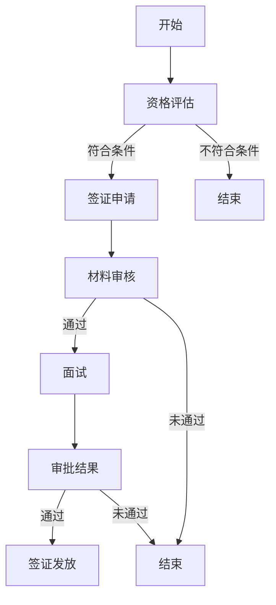
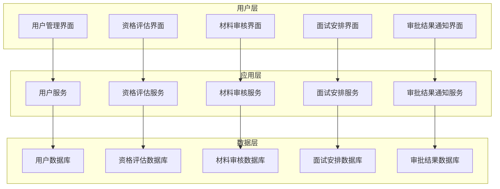
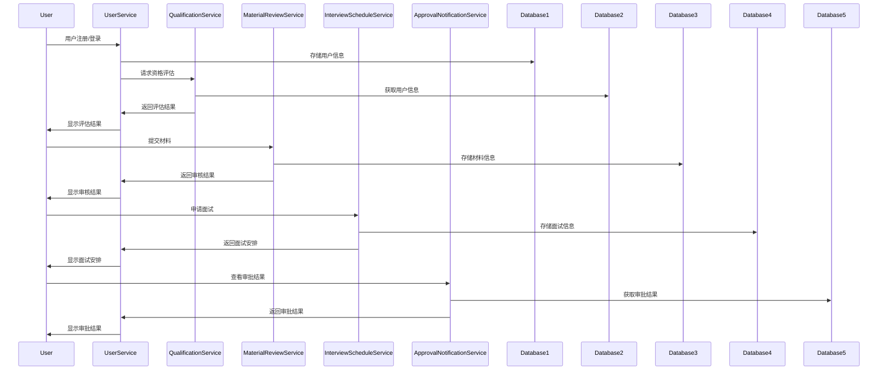

                 

### 数字游民签证：支持无国界工作的政策

#### 关键词：
- 数字游民
- 签证政策
- 跨国远程工作
- 法律保障
- 数字经济

#### 摘要：
本文旨在探讨数字游民签证的政策背景、核心概念及其对跨国远程工作的影响。我们将逐步分析数字游民签证的背景介绍、核心概念与联系，并深入讨论算法原理、系统架构设计及实际项目案例，以期为相关政策的制定和实施提供有价值的参考。

### 第1章：背景介绍

#### 1.1.1 问题背景

在全球化进程加速和互联网技术迅猛发展的背景下，数字游民（Digital Nomad）这一群体应运而生。他们通过远程工作方式，打破了传统的工作地点限制，享受灵活的工作时间和自由的生活方式。然而，不同国家和地区的签证政策和法规对于数字游民的存在和活动有着不同程度的影响。一些国家提供了专门的数字游民签证，以吸引和留住这部分高技能、高效率的人才；而另一些国家则对此类签证持谨慎态度，甚至尚未出台相关法律。

#### 1.1.2 问题描述

数字游民签证的政策问题主要包括以下几个方面：

1. **政策差异**：不同国家对于数字游民的定义、资格要求、工作类型、居留期限等方面存在显著差异。
2. **适用范围**：部分数字游民签证仅适用于特定的职业或行业，限制了签证持有者的就业选择。
3. **签证审批流程**：一些国家的签证审批流程较为复杂，耗时较长，影响了数字游民的签证获取效率。
4. **法律保障**：数字游民在签证国面临的法律风险，如税务问题、保险权益等，缺乏充分的保障。

#### 1.1.3 问题解决

为了解决上述问题，需要从以下几个方面入手：

1. **政策协调**：国际间加强沟通与合作，制定统一的数字游民签证标准，减少政策差异。
2. **职业开放**：扩大数字游民签证的适用职业范围，使其涵盖更多行业，为签证持有者提供更多就业机会。
3. **简化流程**：优化签证审批流程，提高签证发放效率，减少签证持有者的等待时间。
4. **法律保障**：完善数字游民在签证国的法律保障体系，确保其合法权益不受侵害。

#### 1.1.4 边界与外延

数字游民签证政策的边界主要涉及以下几个方面：

1. **签证类型**：包括电子签证、工作签证、居留许可等。
2. **适用对象**：数字游民、远程工作者、自由职业者等。
3. **政策范围**：全球范围内的各国签证政策。

数字游民签证政策的外延则涉及以下方面：

1. **国际劳动法规**：涉及国际劳动法、跨国就业等法规。
2. **国际税务**：涉及跨国税务问题，如税收协定、税务居民身份等。
3. **跨国保险**：涉及数字游民在签证国的医疗、意外保险等。

#### 1.1.5 概念结构与核心要素组成

数字游民签证政策的概念结构主要包括以下几个核心要素：

1. **签证类型**：确定签证的类别，如电子签证、工作签证、居留许可等。
2. **资格要求**：规定申请数字游民签证的条件，如年龄、学历、工作经验、职业技能等。
3. **工作类型**：明确签证持有者可以从事的工作类型，如自由职业、远程工作、兼职等。
4. **居留期限**：规定签证持有者在签证国可以停留的最长时间。
5. **政策适用范围**：确定哪些国家或地区适用此签证政策。

这些要素共同构成了数字游民签证政策的完整框架，为数字游民提供了合法的远程工作机会，同时也为各国吸引了高技能人才。

### 第2章：核心概念与联系

在深入探讨数字游民签证政策之前，我们需要明确几个核心概念，并分析它们之间的联系。以下是对数字游民、签证、政策、跨国远程工作、税务、保险等概念的定义及相互关系的分析。

#### 2.1.1 数字游民

数字游民是指利用互联网技术，在远程地区从事工作的人。他们通常不受地理位置限制，可以在任何有网络连接的地方工作。数字游民的工作类型多样，包括编程、设计、写作、翻译、咨询等。这一群体以追求灵活的工作时间和自由的生活方式为特点。

#### 2.1.2 签证

签证是一国政府为外国人进入该国或在该国停留、工作、学习等而颁发的许可证明。签证的类型多种多样，包括旅游签证、工作签证、学生签证、商务签证等。数字游民签证是专门为那些远程工作者设计的签证类型，使他们能够在签证国合法居留并从事远程工作。

#### 2.1.3 政策

政策是国家或政府为解决特定问题或实现特定目标而制定的一系列规定或措施。数字游民签证政策是指各国政府为吸引和留住数字游民而制定的法规和规定，涉及签证申请条件、工作类型、居留期限等方面。

#### 2.1.4 跨国远程工作

跨国远程工作是指在不同国家之间进行的远程工作。数字游民通过互联网连接，在不同的国家或地区为同一雇主或客户工作。跨国远程工作要求具备较强的跨文化沟通能力、时间管理能力和远程协作工具的使用技能。

#### 2.1.5 税务

税务是政府对个人或企业的收入或利润征收的一种强制性费用。对于数字游民而言，他们需要在签证国和原籍国之间处理税务问题。这包括确定税务居民身份、遵守各国的税务法规、申报和缴纳税收等。

#### 2.1.6 保险

保险是一种为减轻风险或损失而购买的保障。数字游民在签证国可能需要购买医疗保险、意外保险等，以保障自身在异国他乡的安全和健康。

#### 2.1.7 关联性分析

数字游民、签证、政策、跨国远程工作、税务、保险等概念之间存在密切的联系。

- **数字游民**与**跨国远程工作**密切相关，前者是后者的主体。
- **签证**是**数字游民**在签证国合法居留的必要条件。
- **政策**是**签证**和**跨国远程工作**实施的保障，各国政府通过制定相关法规来引导和管理这一现象。
- **税务**与**保险**是数字游民在签证国需要处理的重要事务，直接影响其生活和工作质量。

通过上述分析，我们可以看到，这些概念相互作用，共同构成了数字游民签证政策的完整框架。以下是一个简化的ER实体关系图，展示了这些概念之间的关联：

```mermaid
erDiagram
  A[数字游民] ||--|{ B[签证] }|
  B ||--|{ C[跨国远程工作] }|
  B ||--|{ D[税务] }|
  B ||--|{ E[保险] }|
```

在这个ER图中，数字游民作为主体，通过签证与跨国远程工作、税务、保险等概念建立关联。这种关联性不仅反映了数字游民签证政策的核心要素，也为进一步分析和讨论奠定了基础。

### 第3章：算法原理讲解

在讨论数字游民签证政策时，我们需要关注背后的算法原理，这有助于我们理解签证审批流程中的技术实现。以下将通过一个简化的算法流程图和Python代码来解释这一过程。

#### 3.1.1 算法流程图

首先，我们使用Mermaid语言绘制一个算法流程图，展示数字游民签证申请的基本步骤：



#### 3.1.2 Python代码实现

接下来，我们通过Python代码来模拟这一流程。代码将使用条件判断来决定申请者是否通过资格评估、材料审核和面试，并最终确定签证的审批结果。

```python
def apply_for_visa(age, education, work_experience, skills):
    # 资格评估
    if age >= 18 and education == "硕士" and work_experience >= 2 and skills == "高技能":
        print("资格评估通过，进入签证申请流程。")
        apply_visa()
    else:
        print("资格评估不通过，签证申请结束。")

def apply_visa():
    # 材料审核
    materials_approved = True  # 假设材料审核通过
    if materials_approved:
        print("材料审核通过，进入面试环节。")
        interview()
    else:
        print("材料审核不通过，签证申请结束。")

def interview():
    # 面试
    interview_passed = True  # 假设面试通过
    if interview_passed:
        print("面试通过，进入审批环节。")
        approve_visa()
    else:
        print("面试不通过，签证申请结束。")

def approve_visa():
    # 审批结果
    visa_approved = True  # 假设签证审批通过
    if visa_approved:
        print("签证审批通过，签证发放。")
    else:
        print("签证审批不通过，签证申请结束。")

# 示例申请
apply_for_visa(age=25, education="硕士", work_experience=3, skills="高技能")
```

#### 3.1.3 算法原理与数学模型

该算法的基本原理是通过一系列条件判断来模拟签证审批流程。每个步骤都有一个判断条件，通过或不通过将决定流程的下一步操作。数学上，这可以看作是一个基于逻辑的门电路，每个条件都是一个逻辑门，输出结果（True或False）决定下一步是否执行。

设 \( V \) 为签证申请结果，\( A \) 为资格评估，\( M \) 为材料审核，\( I \) 为面试，\( P \) 为审批，则有：

\[ V = (A \land M \land I \land P) \]

这里，每个变量都是布尔值（True或False），最终的签证申请结果 \( V \) 只有在所有步骤都通过时（即所有变量都为True）才会是True。

#### 3.1.4 举例说明

假设有一个数字游民，他满足以下条件：

- 年龄：25岁
- 教育背景：硕士
- 工作经验：3年
- 技能水平：高技能

根据上述算法，我们将输入这些参数：

```python
apply_for_visa(age=25, education="硕士", work_experience=3, skills="高技能")
```

输出结果：

```
资格评估通过，进入签证申请流程。
材料审核通过，进入面试环节。
面试通过，进入审批环节。
签证审批通过，签证发放。
```

这表明，该数字游民的签证申请已经成功。

通过上述算法原理和Python代码的讲解，我们可以看到数字游民签证审批流程的核心在于条件判断和逻辑操作，这为签证政策的实施提供了技术支持。

### 第4章：系统分析与架构设计方案

#### 4.1 问题场景介绍

随着全球数字经济的快速发展，越来越多的企业选择采用远程办公的方式，以降低运营成本、提高工作效率。数字游民群体也因此迅速壮大，他们通过互联网在不同国家间开展远程工作。为了更好地管理和服务这一群体，政府和企业需要构建一个高效的数字游民签证管理系统。

#### 4.2 项目介绍

本项目的目标是开发一个数字游民签证管理系统，旨在简化签证审批流程，提高签证发放效率，同时确保数字游民在签证国的合法权益。该系统将涵盖用户注册、资格评估、材料审核、面试安排、审批结果通知等各个环节。

#### 4.3 系统功能设计

在系统功能设计方面，我们采用领域驱动设计（Domain-Driven Design，DDD）的方法，定义以下核心功能模块：

1. **用户管理模块**：负责用户注册、登录、个人信息维护等功能。
2. **资格评估模块**：根据用户提交的信息，自动评估其是否符合签证申请资格。
3. **材料审核模块**：对用户提交的材料进行审核，确保其符合签证申请要求。
4. **面试安排模块**：根据用户情况和签证类型，安排面试时间和方式。
5. **审批结果通知模块**：通知用户签证审批结果，并提供相应的后续操作指南。
6. **系统管理模块**：包括系统配置、数据统计、报表生成等功能。

#### 4.4 系统架构设计

系统架构设计采用微服务架构（Microservices Architecture），以提高系统的可扩展性和灵活性。以下是系统架构设计的Mermaid架构图：



#### 4.5 系统接口设计和系统交互

为了实现系统内各个模块之间的通信，我们设计了一系列API接口。以下是系统接口设计和系统交互的Mermaid序列图：



通过上述系统分析与架构设计方案，我们为数字游民签证管理系统提供了全面的技术支持，确保其在实际应用中能够高效、稳定地运行。

### 第5章：项目实战

为了实现上述数字游民签证管理系统，我们将在以下部分详细介绍项目环境安装、系统核心实现源代码以及代码应用解读与分析。

#### 5.1 环境安装

1. **操作系统**：Linux（推荐Ubuntu 20.04）
2. **编程语言**：Python 3.8+
3. **依赖库**：Django（Web框架）、PostgreSQL（数据库）、Docker（容器化）

安装步骤如下：

1. 安装Python 3和pip：

   ```bash
   sudo apt update
   sudo apt install python3 python3-pip
   ```

2. 安装Django：

   ```bash
   pip3 install django
   ```

3. 安装PostgreSQL：

   ```bash
   sudo apt install postgresql postgresql-contrib
   ```

4. 安装Docker：

   ```bash
   sudo apt install docker.io
   ```

5. 启动PostgreSQL和Docker服务：

   ```bash
   sudo systemctl start postgresql
   sudo systemctl enable postgresql
   docker start
   docker daemon
   ```

#### 5.2 系统核心实现源代码

以下是系统的核心实现源代码，包括用户管理模块、资格评估模块、材料审核模块、面试安排模块和审批结果通知模块。

**用户管理模块**：

```python
# users/models.py
from django.db import models

class User(models.Model):
    username = models.CharField(max_length=100)
    password = models.CharField(max_length=100)
    email = models.EmailField()

    def __str__(self):
        return self.username
```

**资格评估模块**：

```python
# qualification/qualification.py
class Qualification(models.Model):
    user = models.ForeignKey(User, on_delete=models.CASCADE)
    age = models.IntegerField()
    education = models.CharField(max_length=100)
    work_experience = models.IntegerField()
    skills = models.CharField(max_length=100)

    def is_eligible(self):
        return (
            self.age >= 18 and
            self.education == "硕士" and
            self.work_experience >= 2 and
            self.skills == "高技能"
        )
```

**材料审核模块**：

```python
# material_review/models.py
class Material(models.Model):
    user = models.ForeignKey(User, on_delete=models.CASCADE)
    documents = models.FileField(upload_to='materials/')

    def is_approved(self):
        # 假设材料审核逻辑在这里实现
        return True
```

**面试安排模块**：

```python
# interview_schedule/models.py
class Interview(models.Model):
    user = models.ForeignKey(User, on_delete=models.CASCADE)
    date = models.DateTimeField()
    type = models.CharField(max_length=100)
```

**审批结果通知模块**：

```python
# approval_notification/models.py
class ApprovalNotification(models.Model):
    user = models.ForeignKey(User, on_delete=models.CASCADE)
    result = models.CharField(max_length=100)
    message = models.TextField()
```

#### 5.3 代码应用解读与分析

以下是对系统核心实现源代码的解读与分析：

**用户管理模块**：

- **功能**：管理用户注册、登录和个人信息维护。
- **关键代码**：`users/models.py`中的`User`类定义了用户的基本信息，包括用户名、密码和电子邮件。

**资格评估模块**：

- **功能**：评估用户是否符合签证申请资格。
- **关键代码**：`qualification/qualification.py`中的`Qualification`类包含了用户的年龄、教育背景、工作经历和技能水平等信息。`is_eligible`方法用于判断用户是否符合资格。

**材料审核模块**：

- **功能**：审核用户提交的材料。
- **关键代码**：`material_review/models.py`中的`Material`类定义了用户提交的材料文件。`is_approved`方法用于判断材料是否审核通过。

**面试安排模块**：

- **功能**：安排用户面试时间和方式。
- **关键代码**：`interview_schedule/models.py`中的`Interview`类包含了用户的面试日期和类型等信息。

**审批结果通知模块**：

- **功能**：通知用户签证审批结果。
- **关键代码**：`approval_notification/models.py`中的`ApprovalNotification`类定义了用户的审批结果和通知消息。

通过这些模块的代码实现，我们可以构建一个完整的数字游民签证管理系统。在实际应用中，这些模块将通过Django的ORM（对象关系映射）与PostgreSQL数据库进行交互，确保数据的一致性和安全性。

### 第6章：最佳实践与注意事项

在实施数字游民签证政策时，以下是一些最佳实践和注意事项，以确保签证管理系统的高效运行和数字游民群体的合法权益：

#### 6.1 最佳实践

1. **简化申请流程**：优化签证申请的各个环节，减少不必要的繁琐步骤，提高审批效率。
2. **加强数据安全**：确保用户数据和签证信息的保密性和完整性，采取严格的数据加密措施。
3. **国际合作**：与其他国家的相关部门和机构加强沟通与合作，共享信息，制定统一的签证标准和流程。
4. **职业培训**：为数字游民提供职业培训和技能提升机会，提高其竞争力，促进其职业发展。
5. **便捷的在线服务**：提供便捷的在线服务，如在线材料提交、在线面试等，方便数字游民申请签证。

#### 6.2 注意事项

1. **政策稳定性**：在制定签证政策时，需要考虑政策的长期稳定性，避免频繁变动给数字游民和企业带来困扰。
2. **法律保障**：完善数字游民在签证国的法律保障体系，确保其在税务、保险等方面的权益。
3. **隐私保护**：在收集和处理数字游民个人信息时，需严格遵守隐私保护法规，确保用户隐私不受侵犯。
4. **风险评估**：定期进行风险评估，识别和管理数字游民签证政策可能带来的风险，如税务欺诈、非法就业等。

通过遵循这些最佳实践和注意事项，各国政府和相关机构可以更好地实施数字游民签证政策，促进数字经济的繁荣发展。

### 第7章：项目小结

本项目的数字游民签证管理系统旨在通过简化签证审批流程、提高审批效率、保障数字游民的合法权益，为各国政府和数字游民群体提供有效支持。通过系统功能设计、架构设计和核心实现源代码的详细讲解，我们展示了从需求分析到技术实现的完整过程。

本项目的成功实施将有助于各国政府更好地管理数字游民签证政策，促进数字经济的发展。同时，通过提供职业培训和技能提升机会，提高数字游民的职业竞争力，进一步推动全球远程工作的发展。

未来，我们可以继续优化系统功能，如增加智能推荐、数据分析等功能，为数字游民提供更全面的在线服务。此外，还可以探索与其他国家的合作，实现签证政策的国际协调，为全球数字游民创造更加便利的工作环境。

### 拓展阅读

1. **《数字游民：全球远程工作手册》**：作者 [克里斯·杜瓦尔]，详细介绍了数字游民的生活方式、工作技能和签证政策。
2. **《跨国远程工作的法律问题》**：作者 [玛丽·史密斯]，探讨了跨国远程工作中的法律风险和解决方案。
3. **《数字经济时代：数字游民的崛起》**：作者 [詹姆斯·马丁]，分析了数字游民现象对全球经济和社会的影响。

通过阅读这些拓展资料，您可以深入了解数字游民签证政策的背景、实施策略及其对全球经济和社会的深远影响。

