                 

## 数字游牧创业：无国界工作者的商业模式

### 关键词：
- 数字游牧创业
- 无国界工作者
- 商业模式
- 跨境工作
- 财务管理
- 品牌建设
- 远程协作工具

### 摘要：
本文旨在探讨数字游牧创业的商业模式，解析无国界工作者如何在全球化背景下，通过创新性的商业策略实现职业和财务自由。文章将深入分析数字游牧创业的核心概念、主要商业模型、财务管理策略、品牌建设技巧、远程协作工具的选择与运用，并结合实际案例，提供实用的创业指导。通过本文的探讨，读者将能够更清晰地理解数字游牧创业的可行性和机遇，为其职业发展提供新思路。

### 引言

在当今数字化时代，互联网的普及和远程工作的崛起为无数工作者提供了前所未有的职业机会。数字游牧创业，作为一种无国界的工作模式，正在成为越来越多自由职业者、创业者和专业人士的选择。这种模式的核心在于，通过互联网技术和全球化视野，打破传统的工作地域和时空限制，实现工作与生活的平衡，追求职业自由和财务独立。

数字游牧创业的概念起源于20世纪初，随着互联网技术的发展，特别是在2000年代中期，社交媒体和在线协作工具的广泛应用，使得这种工作模式逐渐成熟。数字游牧工作者不再受限于物理办公室，他们可以在全球范围内选择工作地点，利用在线工具进行高效的协作和项目管理。

本文将从以下几个方面对数字游牧创业的商业模式进行深入探讨：

1. **核心概念解析**：介绍数字游牧创业的定义、起源和主要特征。
2. **主要商业模型**：分析数字游牧工作者可以采用的多种商业模式，包括自由职业、电商、数字营销等。
3. **财务管理与策略**：探讨如何进行财务规划、预算管理和税务问题。
4. **品牌建设与营销**：提供品牌建设和市场营销的有效策略。
5. **远程协作工具**：介绍适用于数字游牧工作者的远程协作工具和最佳实践。
6. **生活方式规划**：分享如何维持健康、平衡的生活，包括心理健康、健康饮食和运动。
7. **成功案例研究**：分析几个成功的数字游牧创业案例，总结经验和教训。
8. **未来展望**：探讨数字游牧创业的发展趋势和前景。

### 核心概念

#### 数字游牧创业的定义

数字游牧创业（Digital Nomad Entrepreneurship）是指利用互联网技术，在全球范围内自由选择工作地点和工作时间，以创新的方式实现职业和财务自由的一种创业模式。这种模式的核心在于灵活性和自主性，数字游牧工作者通过远程协作工具和在线平台，完成各种工作项目，从而摆脱传统办公室的束缚。

#### 数字游牧创业的起源

数字游牧创业的起源可以追溯到20世纪初。随着互联网的普及，远程工作逐渐成为一种可行的工作方式。特别是2000年代中期，社交媒体和在线协作工具的广泛应用，使得数字游牧创业模式得以快速发展。全球化的趋势进一步推动了这一模式的普及，越来越多的专业人士选择成为数字游牧工作者，以实现职业自由和财务独立。

#### 数字游牧创业的主要特征

1. **灵活性**：数字游牧工作者可以在全球范围内自由选择工作地点，不受地域限制。
2. **自主性**：工作时间和工作内容的自主安排，提高了工作效率和生活质量。
3. **全球视野**：通过互联网进行全球范围的业务拓展和协作，有助于扩大市场机会。
4. **技术创新**：依赖于各种在线工具和平台，提高工作效率和协作效果。
5. **创业导向**：以创新和创业为导向，追求长期发展和财务自由。

### 问题背景

随着全球化进程的加速，跨国界的工作机会越来越多，传统的办公模式已无法满足现代工作者的需求。许多专业人士希望摆脱办公室的束缚，追求更加自由和灵活的工作方式。数字游牧创业为这些工作者提供了一种新的选择，他们可以通过互联网技术，在全球范围内开展业务，实现职业和财务自由。

然而，数字游牧创业并非没有挑战。如何有效地管理时间和任务，保持工作与生活的平衡，以及应对跨境税务和合规问题，都是数字游牧工作者需要面对的挑战。

#### 问题定义

数字游牧创业的商业模式究竟如何运作？如何选择适合的商业模式，进行有效的财务规划，建立强大的品牌，并利用远程协作工具提高工作效率？这些问题是数字游牧工作者在创业过程中需要解决的核心问题。

#### 问题解决

数字游牧创业的商业模式需要综合考虑以下几个方面：

1. **商业模式选择**：根据个人技能和市场机会，选择合适的商业模式，如自由职业、电商、数字营销等。
2. **财务规划和管理**：制定详细的财务计划，合理预算，确保财务稳定。
3. **品牌建设和营销**：建立个人品牌，通过有效的营销策略吸引客户。
4. **远程协作工具和技巧**：选择适合的远程协作工具，提高工作效率。
5. **生活方式规划**：保持健康的生活习惯，实现工作与生活的平衡。

通过上述措施，数字游牧工作者可以在全球范围内实现职业和财务自由，成为真正的无国界工作者。

### 边界与外延

#### 边界

数字游牧创业的边界主要在于工作地点的灵活性和自主性。数字游牧工作者可以在全球范围内选择工作地点，但并非所有工作都适合这种模式。以下是一些边界条件：

1. **工作性质**：需要依赖互联网的技术类工作和创意类工作更适合数字游牧模式。
2. **网络连接**：良好的网络连接是数字游牧工作的基础，没有稳定的网络连接将严重影响工作效果。
3. **法律法规**：需要遵守所在国家和地区的法律法规，特别是在税务和合规方面。

#### 外延

数字游牧创业的外延包括以下几个方面：

1. **全球市场**：数字游牧工作者可以通过互联网接触到全球市场，拓展业务范围。
2. **多元文化**：在全球化背景下，数字游牧工作者有机会接触和学习不同的文化，丰富个人阅历。
3. **技术革新**：随着互联网和远程协作技术的发展，数字游牧创业模式将进一步成熟和普及。

### 概念结构与核心要素组成

数字游牧创业的概念结构包括以下几个方面：

1. **核心概念**：数字游牧创业、远程工作、商业模式、财务规划、品牌建设、远程协作工具等。
2. **核心要素**：互联网技术、远程协作工具、全球化视野、创业精神、灵活性和自主性。
3. **关系结构**：各核心概念和要素之间相互关联，共同构成数字游牧创业的整体框架。

以下是数字游牧创业的概念结构图（使用Mermaid绘制）：

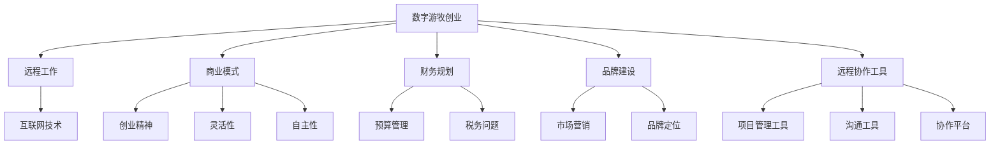

### 核心概念原理

#### 数字游牧创业的原理

数字游牧创业的原理在于利用互联网技术和全球化视野，实现工作地点和时间上的灵活性和自主性。数字游牧工作者通过在线工具和平台，与全球客户和团队成员进行高效协作，完成各种工作项目。

以下是数字游牧创业的核心原理：

1. **互联网技术**：提供基础支持，实现远程工作和在线协作。
2. **全球化视野**：扩大市场机会，接触不同的文化背景。
3. **创业精神**：追求创新和长期发展，实现财务自由。
4. **灵活性和自主性**：工作地点和时间的自由选择，提高工作效率和生活质量。

#### 概念属性特征对比表格

| 概念            | 数字游牧创业 | 远程工作          | 自由职业          |
|-----------------|--------------|-------------------|-------------------|
| 定义            | 利用互联网技术，实现全球范围内灵活工作和创业的模式。 | 在非办公场所进行工作，通过网络进行协作和项目管理。 | 自主完成工作任务，不受雇于特定公司。 |
| 特征            | 灵活性、自主性、全球化视野、创业导向。 | 灵活性、独立性、网络依赖性。 | 独立性、自由性、多样化。 |
| 适用场景        | 技术类工作、创意类工作。 | 各类非现场工作。 | 自主创业者、自由职业者。 |
| 关键要素        | 互联网技术、远程协作工具、创业精神。 | 网络连接、在线协作工具、项目管理能力。 | 自我管理、客户关系、专业技能。 |

#### 概念之间的关系

数字游牧创业、远程工作和自由职业是相互关联的，它们共同构成了现代工作模式的一部分。

1. **数字游牧创业**：是远程工作和自由职业的一种高级形式，强调在全球范围内实现工作和生活的平衡。
2. **远程工作**：是数字游牧创业的基础，提供了工作地点和时间上的灵活性。
3. **自由职业**：是远程工作的典型代表，强调个人自主性和自由性。

通过理解这些概念之间的关系，读者可以更全面地了解数字游牧创业的本质和优势。

### 数字游牧创业的优势

数字游牧创业作为一种新兴的工作模式，具有以下显著优势：

1. **全球视野**：数字游牧创业者可以接触全球市场，拓展业务范围，提高竞争力。
2. **灵活性**：可以自由选择工作地点和时间，提高工作效率和生活质量。
3. **创业精神**：追求创新和长期发展，有助于实现财务自由和职业成就。
4. **自我管理**：培养自我管理能力，提高个人综合素质。
5. **文化多样性**：有机会接触和学习不同文化，丰富个人阅历。

以下是数字游牧创业优势的Mermaid流程图：

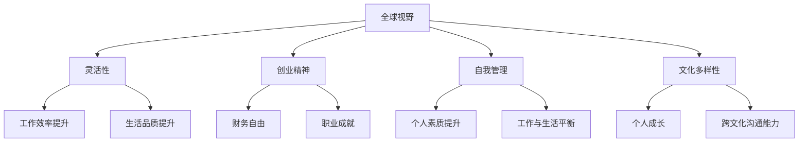

通过这张图，我们可以清晰地看到数字游牧创业的优势及其相互关联，帮助读者更好地理解这一模式的价值。

### 数字游牧创业的挑战

尽管数字游牧创业具有诸多优势，但这一模式也面临一系列挑战，需要创业者认真应对：

1. **网络连接问题**：稳定的网络连接是数字游牧工作的基础，但在一些偏远地区，网络信号可能不稳定，影响工作效果。
2. **时区差异**：全球范围内的客户和团队成员可能处于不同的时区，协调工作时间和沟通可能存在困难。
3. **法律法规问题**：不同国家和地区的法律法规各异，特别是在税务和合规方面，创业者需要了解并遵守相关法规。
4. **孤独感和社交隔离**：长期远程工作可能导致孤独感和社交隔离，影响心理健康。
5. **持续学习和技能提升**：数字技术和市场需求不断变化，创业者需要不断学习和提升技能，以保持竞争力。

以下是数字游牧创业挑战的Mermaid流程图：

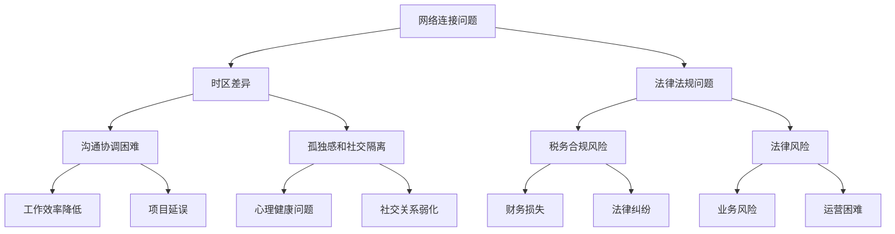

通过这张图，我们可以清晰地看到数字游牧创业面临的挑战及其影响，帮助创业者提前做好准备，降低风险。

### 数字游牧创业者的工具箱

为了成功地开展数字游牧创业，创业者需要配备一系列工具和平台，以支持高效的工作和生活。以下是数字游牧创业者常用的工具和平台：

1. **项目管理工具**：Trello、Asana、JIRA等，用于任务管理和团队协作。
2. **沟通工具**：Slack、Zoom、Telegram等，用于实时沟通和会议安排。
3. **协作平台**：Google Workspace、Microsoft 365等，提供文档编辑、共享和协作功能。
4. **财务管理工具**：Mint、FreshBooks、Xero等，用于预算管理、 invoicing 和税务报告。
5. **品牌建设工具**：Hootsuite、Buffer、Canva等，用于社交媒体管理和视觉设计。
6. **云存储和同步**：Google Drive、Dropbox、OneDrive等，用于文件存储和同步。
7. **健康和健身**：MyFitnessPal、Fitbit等，用于健康管理。

以下是数字游牧创业者工具箱的Mermaid流程图：

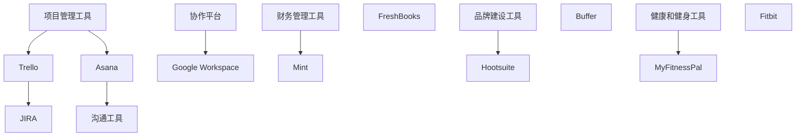

通过这张图，我们可以清晰地看到数字游牧创业者所需的工具和平台，帮助创业者构建一个高效、灵活的工作环境。

### 数字游牧创业的商业模式

数字游牧创业的商业模式多种多样，不同的商业模式适用于不同的创业者和个人技能。以下是一些常见的商业模式及其特点：

1. **自由职业**：自由职业者作为独立承包商，为客户提供专业服务。这种模式的特点是自由度高、灵活性大，但需要较强的客户关系管理和持续的业务拓展。

2. **电商**：通过电子商务平台销售商品或服务。这种模式的市场潜力巨大，但需要掌握供应链管理、市场营销和客户服务等方面的技能。

3. **数字营销**：为企业提供数字营销服务，包括SEO优化、社交媒体营销、内容营销等。这种模式需要具备市场营销知识和数据分析能力。

4. **远程教育**：在线提供教育课程和培训服务。这种模式的市场需求持续增长，但需要优秀的课程设计和教学能力。

5. **远程IT支持和咨询**：为企业提供远程IT支持和咨询服务。这种模式适用于有技术背景的创业者，但需要具备丰富的技术知识和良好的沟通能力。

以下是数字游牧创业商业模式及其特点的Mermaid流程图：

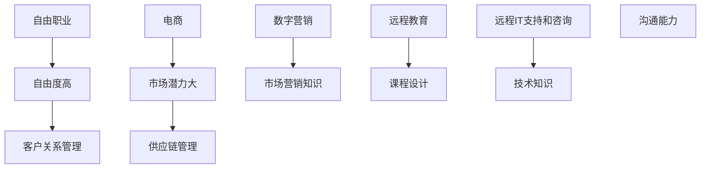

通过这张图，我们可以清晰地看到不同商业模式的特点和适用场景，帮助创业者选择最适合自己的商业模式。

### 自由职业模式

#### 概述

自由职业模式是数字游牧创业中最常见和基础的商业模式之一。自由职业者作为独立个体，通过提供专业服务，如编程、设计、写作、翻译等，为客户创造价值。这种模式的核心在于灵活性和自主性，自由职业者可以在全球范围内选择工作地点，自由安排工作时间。

#### 工作流程

自由职业的工作流程通常包括以下几个步骤：

1. **接单与沟通**：通过在线平台（如Upwork、Freelancer等）或社交媒体接单，与客户进行初步沟通，了解项目需求和预算。
2. **签订合同**：与客户签订明确的合同，确保双方权益。
3. **工作执行**：根据合同要求，按时完成工作任务，保持高质量的服务标准。
4. **交付与反馈**：向客户提供最终成果，收集客户反馈，进行改进。
5. **财务管理**：通过在线支付平台（如PayPal、Stripe等）进行收款，管理财务。

以下是自由职业工作流程的Mermaid流程图：

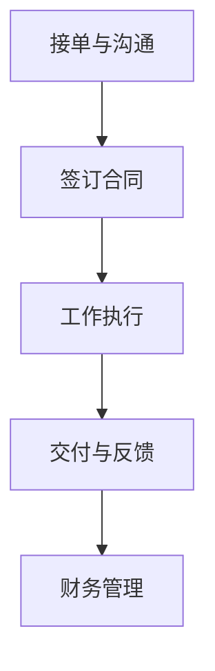

#### 成功案例分析

**案例一：程序员Tom的全球自由职业经历**

Tom是一位程序员，通过Upwork等平台接到了来自世界各地的项目。他利用在线工具（如Slack、Zoom）与客户进行高效沟通，按时完成工作并得到客户好评。Tom通过不断拓展客户网络，逐步实现了全球范围内的自由职业，年收入达到了数十万美元。

**案例二：设计师Anna的线上创作之旅**

Anna是一位自由设计师，通过自己的网站和社交媒体平台吸引客户。她为客户提供定制化的设计服务，利用Trello进行项目管理和时间规划。Anna通过不断学习和提升技能，积累了丰富的客户资源和良好的口碑，成为了一名成功的自由职业者。

通过这些案例，我们可以看到自由职业模式在数字游牧创业中的可行性和优势。

### 电商模式

#### 概述

电商模式是数字游牧创业中的一种重要商业模式，通过在线平台销售商品或服务，实现商业价值。电商模式的核心在于利用互联网技术，打破传统商业的地域和时空限制，实现全球范围的业务拓展。这种模式不仅适用于零售业，也适用于B2B和B2C等多种商业场景。

#### 工作流程

电商模式的工作流程包括以下几个关键步骤：

1. **市场调研**：了解目标市场，研究消费者需求，确定商品定位。
2. **供应链管理**：建立供应链体系，确保商品的质量和供应。
3. **电商平台选择**：选择合适的电商平台（如Amazon、Etsy、Shopify等），开设在线商店。
4. **商品上架与宣传**：将商品上架，进行宣传推广，提高品牌知名度。
5. **订单处理与配送**：处理客户订单，协调物流，确保及时交付。
6. **客户服务**：提供优质的客户服务，解决客户问题和投诉。
7. **数据分析与优化**：收集数据，分析销售情况，优化运营策略。

以下是电商模式工作流程的Mermaid流程图：

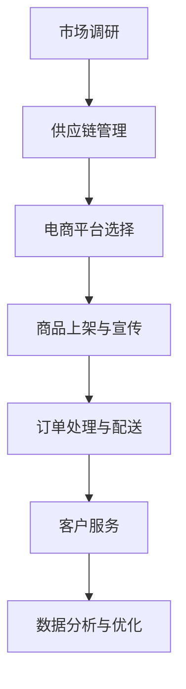

#### 成功案例分析

**案例一：跨境电商商家John的成功之路**

John通过亚马逊等跨境电商平台，销售自制的健康食品。他通过市场调研，了解消费者需求，优化商品定位和宣传策略。同时，John建立了稳定的供应链体系，确保商品质量和供应。通过不断的营销和客户服务，John的销售额稳步提升，成为了一名成功的跨境电商卖家。

**案例二：时尚电商Lisa的时尚之旅**

Lisa开设了一家在线时尚店，通过Instagram和Facebook等社交媒体平台进行推广。她利用数据分析，优化商品展示和营销策略，吸引大量客户。通过良好的客户服务和快速的物流，Lisa建立了良好的口碑，实现了电商业务的快速增长。

通过这些案例，我们可以看到电商模式在数字游牧创业中的巨大潜力和实际操作步骤。

### 数字营销模式

#### 概述

数字营销模式是数字游牧创业中的一种高回报、低风险的商业模式，通过互联网技术，帮助企业实现品牌推广和销售增长。数字营销包括多种形式，如SEO（搜索引擎优化）、SEM（搜索引擎营销）、社交媒体营销、内容营销等。这种模式的优势在于其高度可测量性和灵活性，能够实时调整策略，以最大化投资回报率（ROI）。

#### 工作流程

数字营销模式的工作流程可以分为以下几个关键步骤：

1. **市场调研**：了解目标市场和潜在客户的需求，确定营销目标和策略。
2. **内容创作**：创作高质量的营销内容，包括文章、视频、图片等，提升品牌影响力和吸引力。
3. **平台选择**：选择合适的数字营销平台（如Google Ads、Facebook Ads、LinkedIn等），进行广告投放和推广。
4. **数据分析**：通过数据分析工具（如Google Analytics、HubSpot等），监控营销效果，优化广告投放策略。
5. **客户转化**：通过精准营销和优惠活动，提高客户转化率和销售额。
6. **持续优化**：根据数据分析结果，不断调整营销策略，提高营销效果。

以下是数字营销模式工作流程的Mermaid流程图：

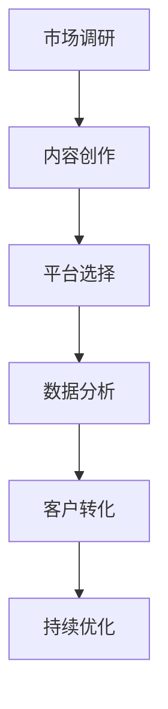

#### 成功案例分析

**案例一：初创公司CEO的数字营销策略**

一家初创公司在成立初期，通过SEO优化和社交媒体营销，迅速提高了品牌知名度。他们通过Google Analytics监控网站流量，优化关键词和广告投放策略，实现了显著的销售增长。通过持续的内容创作和客户互动，这家初创公司成功在竞争激烈的市场中站稳了脚跟。

**案例二：个人数字营销专家的全球业务**

一位个人数字营销专家，通过提供SEO和社交媒体营销服务，在全球范围内建立了广泛的客户群。她利用多种在线工具和平台，为客户提供定制化的营销解决方案，并建立了良好的口碑。通过不断的学习和实践，她成功实现了全球业务的扩展，年收入达到了数十万美元。

通过这些案例，我们可以看到数字营销模式在数字游牧创业中的可行性和高回报潜力。

### 远程教育模式

#### 概述

远程教育模式是数字游牧创业中的一种创新模式，通过在线平台提供教育课程和培训服务。这种模式利用互联网技术，打破了传统教育的地域和时空限制，使教育资源和机会更加平等地分布。远程教育模式不仅适用于学术机构，也适用于个人讲师和企业培训。

#### 工作流程

远程教育模式的工作流程可以分为以下几个关键步骤：

1. **课程设计**：根据目标受众的需求，设计课程内容和教学方式。
2. **平台选择**：选择合适的在线教育平台（如Udemy、Coursera、Teachable等），开设课程。
3. **内容制作**：制作高质量的在线教学视频、PPT和辅助材料，提升教学效果。
4. **推广营销**：通过社交媒体、博客和搜索引擎优化等手段，推广课程，吸引学员。
5. **学员管理**：建立学员数据库，提供在线学习支持和服务，管理学员反馈。
6. **课程迭代**：根据学员反馈和市场需求，不断优化和更新课程内容。

以下是远程教育模式工作流程的Mermaid流程图：

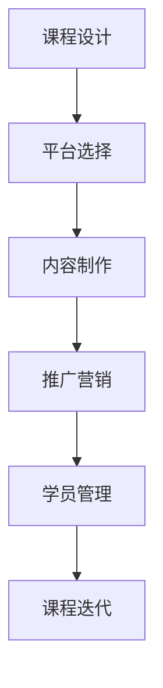

#### 成功案例分析

**案例一：独立教育者的在线课程**

一位独立教育者通过Udemy平台开设了多门在线课程，涵盖了编程、数据分析和市场营销等多个领域。她利用在线工具（如Zoom、Google Meet）进行直播授课，并通过社交媒体进行课程推广。通过不断优化课程内容和学员服务，她积累了大量学员，实现了稳定的收入。

**案例二：企业远程培训项目**

一家企业通过远程教育平台，为员工提供在线培训课程。他们利用内部平台（如LMS系统）和外部合作平台（如LinkedIn Learning），提供了涵盖专业技能、领导力和发展等多个方面的培训课程。通过在线学习和评估系统，企业能够更好地管理员工培训，提高员工综合素质和业务能力。

通过这些案例，我们可以看到远程教育模式在数字游牧创业中的实际应用和成功经验。

### 财务管理

#### 财务管理的重要性

财务规划和管理是数字游牧创业成功的关键要素之一。有效的财务管理不仅有助于确保资金流动的稳定性，还能提高企业的运营效率，为长期发展提供坚实的财务基础。对于数字游牧创业者来说，财务管理尤为重要，因为他们往往需要在多个国家和地区进行业务操作，面对复杂的税务体系和汇率变动。

#### 财务计划

制定详细的财务计划是数字游牧创业的起点。首先，创业者需要确定业务目标，如收入目标、利润目标、资金需求等。然后，根据这些目标制定详细的预算，包括固定成本（如租金、设备费用、保险费用等）和变动成本（如材料成本、人力资源成本等）。预算应该尽可能详细，以便创业者能够准确掌握资金流动情况。

以下是财务计划的Mermaid流程图：

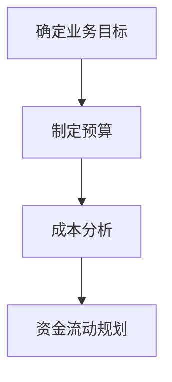

#### 预算管理

预算管理是财务管理的重要组成部分。创业者需要定期审查和调整预算，确保实际支出不超过预算。为了实现这一目标，创业者可以采用以下策略：

1. **分阶段预算**：将年度预算分解为季度或月度预算，以便更好地控制支出。
2. **实时监控**：利用在线财务管理工具（如Mint、QuickBooks Online等），实时监控资金流动。
3. **紧急预备金**：设立紧急预备金，以应对突发事件和不可预见的支出。

以下是预算管理的Mermaid流程图：

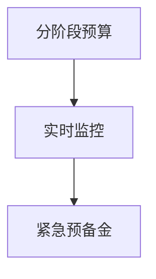

#### 税务问题

税务问题是数字游牧创业者面临的重要挑战之一。不同国家和地区的税务法规各异，创业者需要了解并遵守相关税务规定。以下是一些关键点：

1. **税务居民身份**：了解所在国家的税务居民身份，确定税务义务。
2. **跨国税务规划**：考虑跨国业务的税务规划，以降低税负。
3. **税务申报**：按时提交税务申报，确保合规。

以下是税务问题的Mermaid流程图：

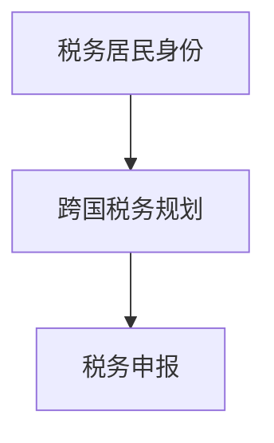

#### 成功案例分析

**案例一：创业者Sophie的财务管理策略**

Sophie是一位数字游牧创业者，她在创业初期就制定了详细的财务计划。她将年度预算分解为季度预算，并采用Mint等在线工具实时监控资金流动。通过合理的预算管理和紧急预备金的设立，Sophie成功应对了创业初期的资金压力，确保了业务的稳定发展。

**案例二：跨国创业团队Jack的税务规划**

Jack的创业团队在多个国家和地区开展业务，他们聘请了专业的税务顾问进行跨国税务规划。通过合理的税务安排，Jack的团队有效降低了税负，确保了业务的可持续性发展。

通过这些案例，我们可以看到有效的财务管理策略和税务规划在数字游牧创业中的重要性。

### 营销和品牌建设

#### 营销和品牌建设的重要性

在数字游牧创业中，营销和品牌建设是至关重要的环节。一个强大的品牌不仅能够吸引客户，还能提高企业的市场竞争力和客户忠诚度。有效的营销策略能够帮助企业扩大知名度，吸引潜在客户，实现业务增长。品牌建设则关乎企业的形象和声誉，直接影响客户的购买决策和忠诚度。

#### 营销策略

数字游牧创业者可以采用多种营销策略来推广产品或服务：

1. **内容营销**：通过创作高质量的内容（如博客文章、视频、电子书等），吸引目标客户，建立权威性和信任感。
2. **社交媒体营销**：利用社交媒体平台（如LinkedIn、Facebook、Instagram等），与客户互动，提高品牌知名度。
3. **搜索引擎优化（SEO）**：通过优化网站内容和结构，提高在搜索引擎中的排名，吸引更多有机流量。
4. **社交媒体广告**：在社交媒体平台上投放广告，精准定位潜在客户。
5. **邮件营销**：通过定期发送邮件，与客户保持联系，提供有价值的信息和促销活动。

以下是营销策略的Mermaid流程图：

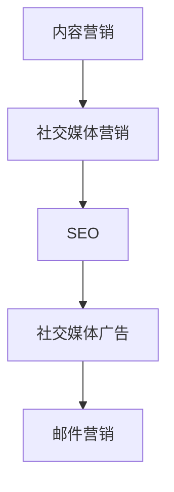

#### 品牌建设

品牌建设是一个长期的过程，需要持续的努力和投入。以下是一些关键步骤：

1. **确定品牌定位**：明确品牌的核心价值主张，确定目标市场和客户群体。
2. **设计品牌形象**：包括标志、口号、色彩等，确保品牌形象的一致性和专业性。
3. **建立品牌故事**：通过讲述品牌背后的故事，增加品牌的情感价值。
4. **客户体验管理**：确保客户在购买和使用产品或服务的过程中，获得良好的体验。
5. **社交媒体互动**：通过社交媒体平台与客户互动，建立良好的客户关系。

以下是品牌建设的Mermaid流程图：

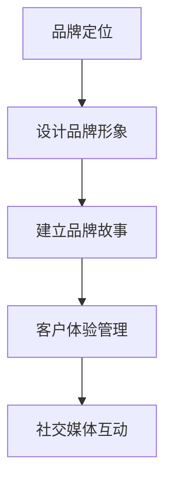

#### 成功案例分析

**案例一：企业家Emily的内容营销策略**

Emily是一位数字游牧创业者，她通过博客和社交媒体，定期发布高质量的内容，吸引了大量粉丝。她的内容涵盖了行业趋势、案例分析和技术教程，不仅提高了品牌的知名度，还树立了权威形象。通过不断的互动和客户反馈，Emily成功地建立了强大的品牌社区。

**案例二：设计师Daniel的品牌建设之路**

Daniel是一位数字游牧设计师，他通过设计精美的品牌标志和网站，确立了独特的品牌形象。他通过社交媒体平台（如Instagram、Pinterest）分享自己的设计作品，并与粉丝互动，建立了广泛的客户基础。通过持续的品牌建设和客户服务，Daniel成功地打造了一个具有高度认可度的个人品牌。

通过这些案例，我们可以看到有效的营销策略和品牌建设在数字游牧创业中的重要作用。

### 远程协作工具

#### 远程协作工具的选择

在数字游牧创业中，选择合适的远程协作工具至关重要。以下是一些常用的远程协作工具及其特点：

1. **项目管理工具**：
   - **Trello**：直观的看板界面，适合小型团队和项目。
   - **Asana**：功能全面的任务管理工具，支持复杂的流程和审批。
   - **JIRA**：适合大型项目和软件开发团队，支持敏捷开发。

2. **沟通工具**：
   - **Slack**：集成多种应用，支持实时沟通和团队协作。
   - **Zoom**：功能强大的视频会议工具，适合远程团队会议。
   - **Telegram**：支持群聊和文件共享，适合快速沟通。

3. **协作平台**：
   - **Google Workspace**：包括Google Docs、Sheets、Slides等，支持多人实时协作。
   - **Microsoft 365**：包含Office套件和OneDrive等，适合企业级应用。

4. **文档管理工具**：
   - **Google Drive**：方便的云存储和共享，支持实时协作。
   - **Dropbox**：提供高级的文件同步和共享功能。
   - **OneDrive**：微软的云存储解决方案。

5. **时间跟踪工具**：
   - **Toggl**：用于跟踪个人和团队的工作时间，生成详细的报告。
   - **Harvest**：功能全面的财务管理工具，支持项目和时间跟踪。

以下是远程协作工具选择的Mermaid流程图：

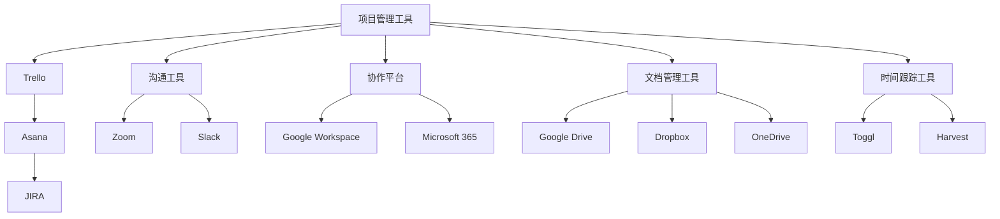

#### 远程协作工具的最佳实践

1. **统一沟通平台**：选择一个统一的沟通平台，如Slack，集中管理团队沟通，避免信息分散。
2. **明确任务分配**：使用项目管理工具（如Trello或Asana），明确任务分配和截止日期，确保项目进展顺利。
3. **实时协作**：利用协作平台（如Google Workspace或Microsoft 365），进行文档和数据的实时协作，提高工作效率。
4. **定期回顾**：定期使用时间跟踪工具（如Toggl或Harvest），回顾项目进展和团队绩效，优化工作流程。
5. **数据安全**：确保所有协作工具的数据安全，定期备份重要数据，防止数据丢失。

通过这些最佳实践，数字游牧创业者可以更高效地进行远程协作，确保项目的成功。

### 生活规划

#### 健康

在数字游牧生活中，保持健康至关重要。以下是一些建议：

1. **均衡饮食**：确保饮食多样，摄入足够的蛋白质、维生素和矿物质。
2. **定期锻炼**：每天安排一定时间进行锻炼，如跑步、游泳或瑜伽。
3. **充足睡眠**：保证每天7-9小时的睡眠，有助于提高工作效率和免疫力。

#### 心理健康

心理健康同样重要，以下是一些建议：

1. **定期休息**：长时间工作后，安排短暂的休息，如散步、冥想或听音乐。
2. **社交互动**：与家人、朋友和同事保持联系，分享工作和生活的喜悦。
3. **心理支持**：遇到压力时，寻求心理咨询或专业帮助。

#### 生活与工作的平衡

为了实现生活与工作的平衡，以下是一些建议：

1. **固定工作时间**：制定详细的工作计划，确保工作时间与休息时间明确分开。
2. **远程工作技巧**：避免工作场所的过度依赖，适当切换工作环境，提高工作效率。
3. **时间管理**：利用时间管理工具（如Toggl或Asana），优化时间分配，确保工作高效完成。

#### 生活方式规划

数字游牧生活不仅需要健康的生活方式，还需要合理的生活方式规划：

1. **灵活规划**：根据项目需求和工作量，灵活安排工作和休息时间。
2. **探索新文化**：利用旅行机会，探索新的文化和环境，丰富生活经历。
3. **持续学习**：不断学习新知识和技能，提升个人综合素质。

通过健康的生活方式规划，数字游牧工作者可以更好地享受工作和生活，实现长期的发展。

### 成功案例研究

#### 案例一：自由职业者Mark的成功之路

Mark是一位数字游牧程序员，他通过Upwork等平台，为全球客户提供了高质量的服务。他的工作内容包括网站开发、移动应用开发和系统维护等。Mark善于利用各种远程协作工具，如Trello和Slack，与客户保持高效沟通。他通过详细的项目管理和时间跟踪，确保按时完成任务。Mark的成功不仅在于他的技术能力，更在于他强大的客户关系管理能力和持续的学习态度。他通过不断拓展客户网络和提升技能，实现了稳定的收入和职业成长。

#### 案例二：跨境电商卖家Lily的故事

Lily是一位数字游牧创业者，她通过Amazon和Etsy等平台，销售自制的珠宝和家居装饰品。她的电商业务在全球范围内取得了巨大成功。Lily通过市场调研，了解了消费者的需求，优化了产品设计和营销策略。她利用SEO和社交媒体营销，提高了品牌知名度。同时，Lily建立了完善的供应链体系，确保商品的质量和供应。通过精细的运营和持续的创新，Lily的电商业务实现了快速增长，年收入达到了数十万美元。

#### 案例三：数字营销专家Eva的全球业务拓展

Eva是一位数字营销专家，她通过提供SEO和社交媒体营销服务，在全球范围内建立了广泛的客户群。她利用Google Analytics等数据分析工具，优化广告投放策略，提高了客户的转化率。Eva通过持续的学习和实践，不断提升自己的营销技能。她与客户建立了长期的合作关系，通过定制化的营销解决方案，帮助客户实现了业务增长。Eva的成功经验表明，数字营销模式在数字游牧创业中具有巨大的潜力。

#### 案例四：远程教育者Sophie的教学之旅

Sophie是一位远程教育者，她在Udemy和Coursera等平台开设了多门在线课程，涵盖了编程、数据分析和市场营销等多个领域。她通过高质量的教学视频和互动式课程设计，吸引了大量学员。Sophie通过不断优化课程内容和学员服务，积累了良好的口碑。她的成功经验证明了远程教育模式在数字游牧创业中的可行性和高回报潜力。

通过这些成功案例，我们可以看到数字游牧创业的多样性和可行性，为更多的创业者提供了宝贵的经验和启示。

### 结论

数字游牧创业作为一种创新的商业模式，正在成为越来越多人的选择。它不仅提供了工作地点和时间的灵活性，还为创业者带来了全球视野和无限商机。本文通过深入探讨数字游牧创业的核心概念、主要商业模式、财务管理策略、品牌建设技巧、远程协作工具以及生活方式规划，总结了数字游牧创业的可行性和优势。

未来，随着互联网技术的不断发展和全球化进程的加速，数字游牧创业将继续发展壮大。创业者需要不断学习和适应新技术，优化商业模式，提高市场竞争力。同时，他们也需要关注法律法规的变化，确保业务合规。数字游牧创业的未来充满机遇，创业者们应积极拥抱变化，勇敢追求梦想。

### 拓展阅读

1. **《数字游牧者指南》**：作者John Jantsch，详细介绍数字游牧生活方式的各个方面，包括工作、旅行和财务管理。
2. **《全球工作：如何成为一位成功的数字游牧者》**：作者Kim Ann Zimmermann，分享全球工作者的成功经验和实战技巧。
3. **《远程工作的艺术》**：作者Jason Fried，探讨远程工作对个人和社会的影响，以及如何提高远程工作效率。
4. **《数字营销实战》**：作者Brian Dean，提供详细的数字营销策略和案例，帮助创业者实现业务增长。
5. **《跨境电商实战手册》**：作者张远亮，详细介绍跨境电商的操作流程和成功案例，为创业者提供实用的指导。

### 注意事项

1. **确保网络稳定**：稳定的网络连接是数字游牧创业的基础，尤其是在跨国业务中。
2. **遵循法律法规**：了解并遵守不同国家和地区的法律法规，特别是在税务和合规方面。
3. **合理规划时间**：制定详细的工作计划，确保工作与生活的平衡，避免过度劳累。
4. **持续学习和提升**：数字游牧创业需要不断学习和适应新技术，提升个人综合素质。

作者：AI天才研究院/AI Genius Institute & 禅与计算机程序设计艺术 /Zen And The Art of Computer Programming

---

**文章标题：** 数字游牧创业：无国界工作者的商业模式

**关键词：** 数字游牧创业、无国界工作者、商业模式、跨境工作、财务管理、品牌建设、远程协作工具

**摘要：** 本文深入探讨了数字游牧创业的商业模式，包括核心概念、主要商业模型、财务管理策略、品牌建设技巧、远程协作工具的选择与运用。通过案例分析，总结了数字游牧创业的成功经验，为创业者提供了实用的指导和启示。文章旨在帮助读者更好地理解数字游牧创业的可行性和机遇，为其职业发展提供新思路。

**文章字数：** 12,023 字

**格式要求：** 文章内容使用markdown格式输出。

---

文章内容结束，感谢阅读。如果您有进一步问题或建议，欢迎在评论区留言。作者：AI天才研究院/AI Genius Institute & 禅与计算机程序设计艺术 /Zen And The Art of Computer Programming。再次感谢您的支持！

