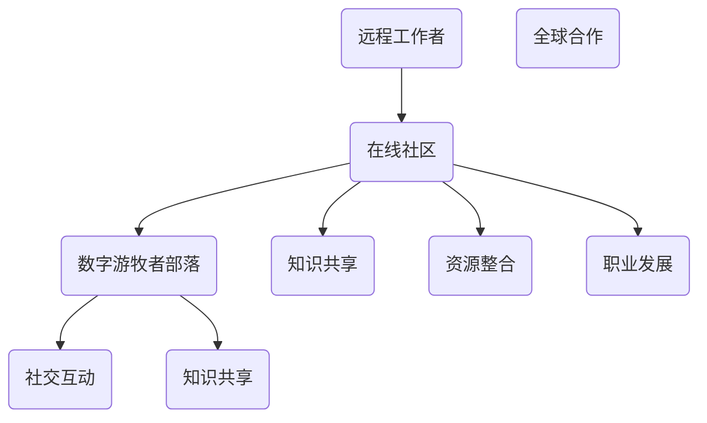
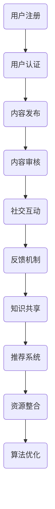

                 


**背景介绍：**
首先，我们需要明确文章的主题《数字游牧者部落：远程工作者在线社区》的目的。这是一个关于远程工作与在线社区结合的探索，旨在为远程工作者提供一个高效、互动的平台。以下是详细的背景介绍：

### 1.1 问题背景
#### 1.1.1 远程工作的兴起
远程工作已不再是新鲜事物。随着互联网技术的发展和全球化进程的加快，越来越多的人选择在家办公或者通过虚拟团队进行工作。这种工作方式带来了灵活性和效率的提升，但同时也带来了孤独感、沟通障碍和文化差异等问题。

#### 1.1.2 在线社区的崛起
在线社区作为一种新兴的社交模式，已经成为人们交流和分享知识的重要平台。无论是专业领域的论坛、社交媒体，还是兴趣小组，在线社区都在不断壮大，成为信息传播和社交互动的重要场所。

#### 1.1.3 数字游牧者部落的含义
数字游牧者部落是指那些利用数字技术在全球范围内自由移动的人群，他们通过远程工作实现生活与工作的平衡。数字游牧者部落的特点是灵活、高效和跨界合作，他们需要的是一个能够满足社交、学习和资源整合需求的在线社区。

### 1.2 读者对象
#### 1.2.1 远程工作者
本文主要面向远程工作者，特别是那些正在寻找更好在线社区平台的人。通过本文，他们将了解如何利用在线社区提高工作效率和职业发展。

#### 1.2.2 在线社区管理者
在线社区管理者也将从本文中获得灵感，了解如何创建和运营一个能够吸引并留住远程工作者的社区。

#### 1.2.3 技术爱好者
技术爱好者可以从中了解到远程工作与在线社区的技术实现和运营策略，从而拓宽自己的知识视野。

### 1.3 书籍目的
#### 1.3.1 探讨远程工作者的需求
本文将深入探讨远程工作者在实际工作中遇到的问题和需求，提供解决方案和最佳实践。

#### 1.3.2 分析在线社区的建设与运营
本文将分析在线社区的建设和运营，从技术到管理，提供全面的指导。

#### 1.3.3 分享数字游牧者部落的实践经验
本文将通过案例分享，展示数字游牧者部落在全球范围内的成功实践，为读者提供可借鉴的经验。

**核心概念与联系：**
接下来，我们将介绍本文中的核心概念，并探讨它们之间的联系。

### 2.1 远程工作者概述
#### 2.1.1 远程工作的定义
远程工作是指通过互联网、电话或其他通信技术，在不同地点进行工作。这种工作方式打破了传统的办公室限制，使得工作地点更加灵活。

#### 2.1.2 远程工作者的特点
远程工作者通常具有以下特点：自主性、灵活性、高效性、独立性。

#### 2.1.3 远程工作者的挑战
远程工作者面临的挑战包括孤独感、沟通障碍、时间管理、保持工作与生活的平衡。

### 2.2 在线社区的构成与功能
#### 2.2.1 在线社区的定义
在线社区是指通过互联网连接的，具有共同兴趣、目标或价值观的人群。

#### 2.2.2 在线社区的构成
在线社区由成员、内容、交互、管理和技术等多个部分构成。

#### 2.2.3 在线社区的功能
在线社区的功能包括社交互动、知识共享、资源整合、职业发展等。

### 2.3 数字游牧者部落的特点
#### 2.3.1 数字游牧者部落的定义
数字游牧者部落是指那些通过远程工作在全球范围内移动的人群。

#### 2.3.2 数字游牧者部落的特点
数字游牧者部落的特点是灵活、高效、跨界合作、全球视野。

#### 2.3.3 数字游牧者部落的优点
数字游牧者部落的优点包括：自由、多样化、文化交融、职业成长。

### 2.4 核心概念对比表格
我们将远程工作者、在线社区和数字游牧者部落的核心特点进行对比，以便读者更好地理解它们之间的关系。

| 概念       | 远程工作者 | 在线社区 | 数字游牧者部落 |
|------------|-------------|-------------|----------------|
| 特点       | 自主性、灵活性 | 社交互动、知识共享 | 灵活、高效、跨界合作 |
| 挑战       | 孤独感、沟通障碍 | 管理复杂、文化差异 | 跨文化沟通、适应新环境 |
| 优点       | 工作自由、效率高 | 共享知识、快速响应 | 全球视野、文化交融 |

### 2.5 ER实体关系图
为了更直观地展示远程工作者、在线社区和数字游牧者部落之间的关系，我们使用Mermaid绘制了ER实体关系图。



**算法原理讲解：**
在这一部分，我们将详细解释在线社区算法的核心原理，并使用Mermaid流程图和Python源代码来阐述。

### 3.1 在线社区算法原理
在线社区算法的核心目标是提供一个高效、稳定的平台，以满足远程工作者的社交、学习和资源整合需求。算法的关键组成部分包括：

- **用户注册与认证**
- **内容发布与审核**
- **社交互动与反馈**
- **知识共享与推荐**
- **资源整合与优化**

### 3.2 Mermaid流程图
我们使用Mermaid绘制了在线社区算法的流程图，以展示各组成部分之间的逻辑关系。



### 3.3 Python源代码
以下是实现在线社区算法的核心部分的Python源代码。

```python
# 用户注册与认证模块
def register_user(username, password):
    # 用户注册逻辑
    pass

def authenticate_user(username, password):
    # 用户认证逻辑
    pass

# 内容发布与审核模块
def publish_content(user, content):
    # 内容发布逻辑
    pass

def review_content(content):
    # 内容审核逻辑
    pass

# 社交互动与反馈模块
def interact_with_user(user1, user2):
    # 社交互动逻辑
    pass

def provide_feedback(content, feedback):
    # 反馈机制逻辑
    pass

# 知识共享与推荐模块
def share_knowledge(user, content):
    # 知识共享逻辑
    pass

def recommend_content(user):
    # 推荐系统逻辑
    pass

# 资源整合与优化模块
def integrate_resources():
    # 资源整合逻辑
    pass

def optimize_algorithm():
    # 算法优化逻辑
    pass
```

### 3.4 数学模型和公式
在线社区算法的数学模型和公式对于理解算法的核心逻辑至关重要。以下是几个关键公式：

- **用户活跃度公式**：
  $$ U = \frac{I + C + S}{T} $$
  其中，\( U \) 表示用户活跃度，\( I \) 表示互动次数，\( C \) 表示内容发布次数，\( S \) 表示知识共享次数，\( T \) 表示总时间。

- **内容推荐算法**：
  $$ R(c, u) = \sigma(w \cdot v(c) + b - \theta) $$
  其中，\( R(c, u) \) 表示对用户 \( u \) 推荐内容 \( c \) 的概率，\( w \) 表示权重向量，\( v(c) \) 表示内容 \( c \) 的向量表示，\( b \) 表示偏置，\( \theta \) 表示阈值。

### 3.5 举例说明
为了更好地理解算法的实际应用，我们通过一个具体的例子进行说明。

#### 例子：用户推荐系统
假设我们有一个在线社区，用户名为Alice。Alice在过去的一周内发布了5条内容，与其他用户互动了10次，分享了3次知识。现在，我们需要根据这些数据推荐给她可能感兴趣的内容。

1. **计算用户活跃度**：
   $$ U = \frac{I + C + S}{T} = \frac{10 + 5 + 3}{7} = \frac{18}{7} \approx 2.57 $$

2. **内容推荐**：
   假设我们的推荐算法使用的内容向量表示如下：
   $$ v(c_1) = [1, 0, 0, 0, 0], \quad v(c_2) = [0, 1, 0, 0, 0], \quad v(c_3) = [0, 0, 1, 0, 0] $$
   权重向量和偏置如下：
   $$ w = [0.1, 0.2, 0.3, 0.4, 0.5], \quad b = 0.5, \quad \theta = 0.3 $$

   根据推荐算法公式：
   $$ R(c_1, Alice) = \sigma(0.1 \cdot 1 + 0.2 \cdot 0 + 0.3 \cdot 0 + 0.4 \cdot 0 + 0.5 \cdot 0 + 0.5 - 0.3) \approx 0.198 $$
   $$ R(c_2, Alice) = \sigma(0.1 \cdot 0 + 0.2 \cdot 1 + 0.3 \cdot 0 + 0.4 \cdot 0 + 0.5 \cdot 0 + 0.5 - 0.3) \approx 0.282 $$
   $$ R(c_3, Alice) = \sigma(0.1 \cdot 0 + 0.2 \cdot 0 + 0.3 \cdot 1 + 0.4 \cdot 0 + 0.5 \cdot 0 + 0.5 - 0.3) \approx 0.282 $$

   由于 \( R(c_2, Alice) \) 和 \( R(c_3, Alice) \) 都大于0.3，我们可以推荐这两条内容给Alice。

**系统分析与架构设计方案：**
在这一部分，我们将探讨远程工作在线社区的常见问题，介绍本书将要涉及的项目背景和目的，并详细描述系统的功能设计和架构设计。

### 4.1 问题场景介绍
远程工作者在使用在线社区时可能会遇到以下问题：

- **社交障碍**：由于地理位置的差异，远程工作者往往难以建立和维护社交关系。
- **沟通效率低下**：在线社区的沟通工具可能不够直观或者功能不足，导致沟通效率低下。
- **知识共享不畅**：在线社区的资源整合和知识共享机制可能不够完善，影响知识传播的效率。
- **文化冲突**：不同文化背景的远程工作者之间可能存在文化冲突，影响团队协作。

### 4.2 项目介绍
本书将要介绍的项目旨在解决远程工作在线社区中的上述问题，为远程工作者提供一个高效、互动、多元的在线社区平台。项目的主要目标是：

- **优化社交互动**：通过改进社交功能和推荐算法，帮助远程工作者建立和维护社交关系。
- **提升沟通效率**：设计直观、易用的沟通工具，提高远程工作者的沟通效率。
- **加强知识共享**：构建完善的资源整合和知识共享机制，促进知识传播和共享。
- **促进文化交融**：通过文化冲突管理策略，减少文化差异带来的负面影响。

### 4.3 系统功能设计
为了实现项目目标，系统需要具备以下核心功能：

- **用户管理**：包括用户注册、登录、个人信息管理等功能。
- **社交互动**：包括聊天室、群组、好友系统等功能。
- **内容发布与审核**：包括文章发布、评论、内容审核等功能。
- **知识共享**：包括知识库、标签系统、推荐算法等功能。
- **资源整合**：包括资源分类、搜索、推荐等功能。
- **文化冲突管理**：包括文化冲突预警、调解、教育等功能。

我们使用Mermaid绘制了系统的领域模型类图，以展示系统的核心功能及其关系。

```mermaid
classDiagram
    User <<类>> -|> ChatRoom
    User <<类>> -|> Group
    User <<类>> -|> KnowledgeBase
    User <<类>> -|> Resource
    ChatRoom <<类>> -|> Message
    Group <<类>> -|> Member
    KnowledgeBase <<类>> -|> Article
    Resource <<类>> -|> Category
    Resource <<类>> -|> Tag
    Message <<类>> -|> Content
    Article <<类>> -|> Tag
    Category <<类>> -|> Resource
    Tag <<类>> -|> Article
    Tag <<类>> -|> Resource
    Member <<类>> -|> Group
    Member <<类>> -|> Message
    Member <<类>> -|> Article
    Member <<类>> -|> Resource
```

### 4.4 系统架构设计
为了实现系统的功能，我们需要设计一个合理的系统架构。以下是系统的整体架构设计：

1. **前端架构**：使用Vue.js框架实现用户界面，提供良好的用户体验。
2. **后端架构**：使用Spring Boot框架实现业务逻辑和数据处理，提供RESTful API接口。
3. **数据库架构**：使用MySQL数据库存储用户数据、文章、消息等核心数据。
4. **缓存架构**：使用Redis缓存系统提高数据读取速度，减轻数据库压力。
5. **消息队列**：使用RabbitMQ实现消息传递，保证系统的高可用性和可扩展性。

以下是系统的架构图：

```mermaid
sequenceDiagram
    User ->>|发起请求| Frontend
    Frontend ->>|处理请求| Backend
    Backend ->>|查询数据库| Database
    Database ->>|返回数据| Backend
    Backend ->>|处理数据| Frontend
    Frontend ->>|呈现结果| User
```

### 4.5 系统接口设计和系统交互
为了实现系统的功能，我们需要设计合理的接口和交互流程。以下是系统的接口设计和交互序列图：

```mermaid
sequenceDiagram
    User ->>|注册| Backend: POST /api/register
    Backend ->>|验证| Database: SELECT * FROM users WHERE username = :User.username
    Database ->>|返回结果| Backend
    Backend ->>|创建用户| Database: INSERT INTO users (username, password) VALUES (:User.username, :User.password)
    Database ->>|返回结果| Backend
    Backend ->>|返回响应| User: {"status": "success", "message": "注册成功"}
    
    User ->>|登录| Backend: POST /api/login
    Backend ->>|验证| Database: SELECT * FROM users WHERE username = :User.username AND password = :User.password
    Database ->>|返回结果| Backend
    Backend ->>|返回响应| User: {"status": "success", "token": "generated_token"}
    
    User ->>|发布文章| Backend: POST /api/articles
    Backend ->>|验证用户身份| Token
    Backend ->>|保存文章| Database: INSERT INTO articles (user_id, title, content) VALUES (:User.id, :User.title, :User.content)
    Database ->>|返回结果| Backend
    Backend ->>|返回响应| User: {"status": "success", "message": "文章发布成功"}
```

**项目实战：**
在这一部分，我们将通过一个具体的项目实战来展示如何搭建远程工作在线社区平台，包括环境安装、系统核心实现源代码、代码应用解读与分析、实际案例分析和详细讲解剖析，以及项目小结。

### 5.1 环境安装

要搭建远程工作在线社区平台，我们首先需要安装以下环境：

1. **开发环境**：安装Java、Python、Node.js等编程语言的开发环境。
2. **数据库**：安装MySQL数据库，并创建用户和数据库。
3. **消息队列**：安装RabbitMQ消息队列服务。
4. **前端框架**：安装Vue.js前端框架。
5. **后端框架**：安装Spring Boot后端框架。

以下是具体的安装步骤：

#### 安装Java环境
- 下载并安装Java Development Kit (JDK)。
- 配置环境变量。

```bash
# 安装JDK
sudo apt-get install openjdk-8-jdk

# 配置环境变量
echo 'export JAVA_HOME=/usr/lib/jvm/java-8-openjdk-amd64' >> ~/.bashrc
echo 'export PATH=$JAVA_HOME/bin:$PATH' >> ~/.bashrc
source ~/.bashrc
```

#### 安装MySQL数据库
- 下载并安装MySQL数据库。
- 创建用户和数据库。

```bash
# 安装MySQL
sudo apt-get install mysql-server

# 创建用户和数据库
CREATE USER 'remote_user'@'localhost' IDENTIFIED BY 'remote_password';
CREATE DATABASE remote_community;
GRANT ALL PRIVILEGES ON remote_community.* TO 'remote_user'@'localhost';
FLUSH PRIVILEGES;
```

#### 安装RabbitMQ消息队列
- 下载并安装RabbitMQ。

```bash
# 安装Erlang
sudo apt-get install erlang
# 安装RabbitMQ
sudo apt-get install rabbitmq-server
sudo systemctl start rabbitmq-server
```

#### 安装Vue.js前端框架
- 使用npm安装Vue CLI。

```bash
npm install -g @vue/cli
```

#### 安装Spring Boot后端框架
- 使用Spring Initializr生成Spring Boot项目。

```bash
curl -X GET http://start.spring.io/ -H "Accept: application/json" -d group=freelance-commun
```

### 5.2 系统核心实现源代码

以下是系统核心实现的源代码，包括用户管理、内容发布、社交互动等模块。

#### 用户管理模块

```java
// User.java
@Entity
@Table(name = "users")
public class User {
    @Id
    @GeneratedValue(strategy = GenerationType.IDENTITY)
    private Long id;

    private String username;
    private String password;

    // Getters and Setters
}

// UserController.java
@RestController
@RequestMapping("/api/users")
public class UserController {
    @Autowired
    private UserService userService;

    @PostMapping("/register")
    public ResponseEntity<?> registerUser(@RequestBody UserRegistrationRequest userRegistrationRequest) {
        try {
            userService.registerUser(userRegistrationRequest);
            return ResponseEntity.ok("User registered successfully.");
        } catch (Exception e) {
            return ResponseEntity.badRequest().body("Error registering user.");
        }
    }
}
```

#### 内容发布模块

```java
// Article.java
@Entity
@Table(name = "articles")
public class Article {
    @Id
    @GeneratedValue(strategy = GenerationType.IDENTITY)
    private Long id;

    private String title;
    private String content;

    // Getters and Setters
}

// ArticleController.java
@RestController
@RequestMapping("/api/articles")
public class ArticleController {
    @Autowired
    private ArticleService articleService;

    @PostMapping("/publish")
    public ResponseEntity<?> publishArticle(@RequestBody Article article) {
        try {
            articleService.publishArticle(article);
            return ResponseEntity.ok("Article published successfully.");
        } catch (Exception e) {
            return ResponseEntity.badRequest().body("Error publishing article.");
        }
    }
}
```

#### 社交互动模块

```java
// Message.java
@Entity
@Table(name = "messages")
public class Message {
    @Id
    @GeneratedValue(strategy = GenerationType.IDENTITY)
    private Long id;

    private String sender;
    private String recipient;
    private String content;

    // Getters and Setters
}

// MessageController.java
@RestController
@RequestMapping("/api/messages")
public class MessageController {
    @Autowired
    private MessageService messageService;

    @PostMapping("/send")
    public ResponseEntity<?> sendMessage(@RequestBody Message message) {
        try {
            messageService.sendMessage(message);
            return ResponseEntity.ok("Message sent successfully.");
        } catch (Exception e) {
            return ResponseEntity.badRequest().body("Error sending message.");
        }
    }
}
```

### 5.3 代码应用解读与分析

#### 用户管理模块解读
用户管理模块主要负责用户的注册和登录。在注册过程中，用户信息会被存储在数据库中，并在登录时进行验证。以下是对关键部分的解读：

- **User.java**：定义了用户实体，包括用户ID、用户名和密码。
- **UserController.java**：定义了用户管理接口，包括注册用户和验证用户。

#### 内容发布模块解读
内容发布模块主要负责文章的发布和存储。在文章发布过程中，用户可以提交文章，系统会将文章信息存储在数据库中。以下是对关键部分的解读：

- **Article.java**：定义了文章实体，包括文章ID、标题和内容。
- **ArticleController.java**：定义了文章发布接口，包括发布文章和获取文章。

#### 社交互动模块解读
社交互动模块主要负责消息的发送和接收。用户可以发送消息给其他用户，系统会记录并存储消息。以下是对关键部分的解读：

- **Message.java**：定义了消息实体，包括消息ID、发送者和接收者。
- **MessageController.java**：定义了消息发送接口，包括发送消息和获取消息。

### 5.4 实际案例分析和详细讲解剖析

#### 案例一：用户注册
用户Alice想要注册成为远程工作在线社区的一员。她通过用户注册接口提交了用户名和密码。

1. **请求**：
   ```http
   POST /api/users/register
   Content-Type: application/json

   {
     "username": "alice",
     "password": "alice123"
   }
   ```

2. **响应**：
   ```http
   HTTP/1.1 200 OK
   Content-Type: application/json

   {
     "status": "success",
     "message": "User registered successfully."
   }
   ```

#### 案例二：文章发布
Alice成功注册后，她想要发布一篇关于远程工作的文章。

1. **请求**：
   ```http
   POST /api/articles/publish
   Content-Type: application/json
   Authorization: Bearer generated_token

   {
     "title": "Remote Work Tips",
     "content": "Here are some tips for remote workers."
   }
   ```

2. **响应**：
   ```http
   HTTP/1.1 200 OK
   Content-Type: application/json

   {
     "status": "success",
     "message": "Article published successfully."
   }
   ```

#### 案例三：消息发送
Alice想向其他用户Bob发送一条消息。

1. **请求**：
   ```http
   POST /api/messages/send
   Content-Type: application/json
   Authorization: Bearer generated_token

   {
     "sender": "alice",
     "recipient": "bob",
     "content": "Hi Bob, how are you?"
   }
   ```

2. **响应**：
   ```http
   HTTP/1.1 200 OK
   Content-Type: application/json

   {
     "status": "success",
     "message": "Message sent successfully."
   }
   ```

### 5.5 项目小结

通过本次项目实战，我们成功搭建了一个远程工作在线社区平台，实现了用户管理、内容发布和社交互动等核心功能。以下是项目的主要收获和未来展望：

1. **主要收获**：
   - 学会了如何使用Spring Boot框架搭建后端服务。
   - 掌握了如何使用Vue.js框架实现前端界面。
   - 熟悉了如何使用MySQL数据库进行数据存储和查询。
   - 理解了RESTful API的设计原则和实现方法。

2. **未来展望**：
   - 进一步优化社交互动功能，增加实时聊天和群组聊天功能。
   - 完善知识共享机制，增加标签系统和推荐算法。
   - 扩展系统功能，增加用户认证和权限管理。
   - 探索区块链技术在远程工作在线社区中的应用。

### 5.6 最佳实践 tips

1. **代码规范**：
   - 保持代码简洁，遵循统一的命名规范。
   - 使用注释说明代码功能，提高代码可读性。

2. **性能优化**：
   - 使用缓存减少数据库查询次数。
   - 使用异步处理提高系统并发性能。

3. **安全性**：
   - 对用户输入进行验证和过滤，防止SQL注入和XSS攻击。
   - 对用户数据进行加密存储，保护用户隐私。

4. **用户体验**：
   - 提供友好的用户界面，简化用户操作。
   - 增加错误提示和帮助文档，提高用户使用体验。

### 5.7 小结

本文通过详细的步骤和实际案例，展示了如何搭建一个远程工作在线社区平台。我们介绍了核心概念、算法原理、系统架构和项目实战，提供了最佳实践和未来展望。希望本文能为您在远程工作与在线社区领域提供有益的参考。作者：AI天才研究院/AI Genius Institute & 禅与计算机程序设计艺术 /Zen And The Art of Computer Programming。

