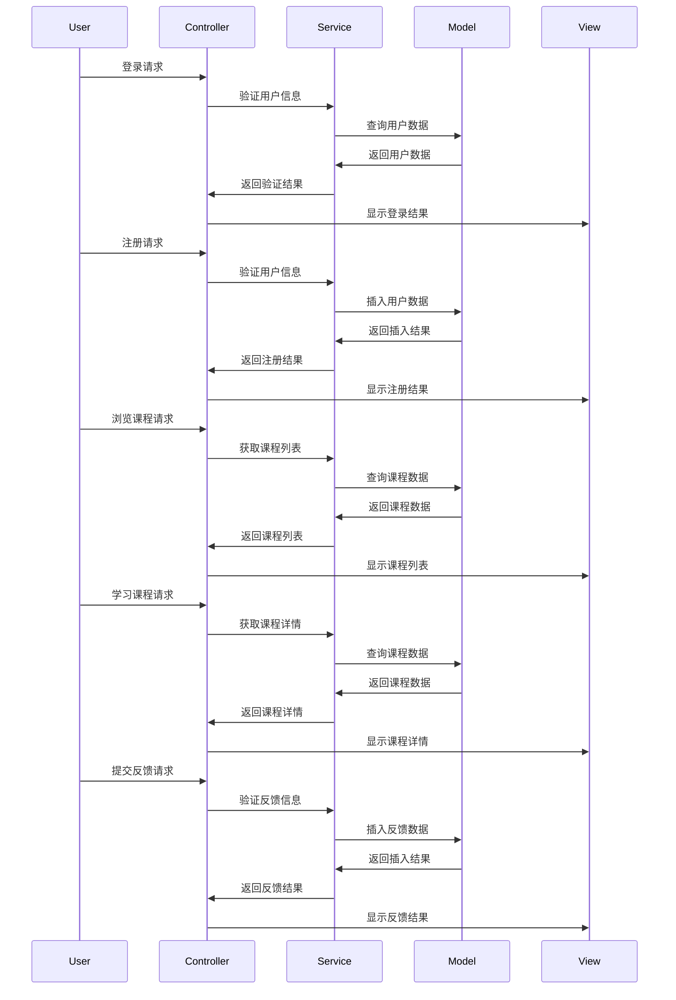

                 

## 数字禅修App：科技辅助的冥想体验

> 关键词：数字禅修App，冥想体验，科技辅助，心理健康，软件开发

> 摘要：随着科技的不断发展，数字化生活已经成为现代人的常态。然而，在快节奏的生活中，人们的心理健康问题日益凸显。冥想作为一种传统的心理调节方法，逐渐受到重视。数字禅修App作为一种科技辅助的冥想体验，通过结合现代技术和冥想方法，为用户提供了便捷、个性化的冥想体验。本文将详细介绍数字禅修App的定义、特点、技术原理、系统架构以及项目实战，旨在为软件开发者和冥想爱好者提供有价值的参考。

## 目录大纲

1. **数字禅修App概述**
   - 1.1 问题背景
   - 1.2 问题描述
   - 1.3 问题解决
   - 1.4 边界与外延
   - 1.5 概念结构与核心要素组成
   - 1.6 本章小结

2. **数字禅修App的特点**
   - 2.1 数字禅修App的定义
   - 2.2 数字禅修App的特点
   - 2.3 数字禅修App与传统冥想方法的对比
   - 2.4 本章小结

3. **开发环境搭建**
   - 3.1 开发环境选择
   - 3.2 环境搭建步骤
   - 3.3 常见问题解决
   - 3.4 本章小结

4. **技术栈选择**
   - 4.1 前端技术栈
   - 4.2 后端技术栈
   - 4.3 数据库技术栈
   - 4.4 本章小结

5. **关键技术点讲解**
   - 5.1 数据处理技术
   - 5.2 用户界面设计
   - 5.3 交互逻辑实现
   - 5.4 本章小结

6. **数学模型和算法原理讲解**
   - 6.1 数学模型讲解
   - 6.2 算法原理讲解
   - 6.3 举例说明
   - 6.4 本章小结

7. **系统分析与架构设计方案**
   - 7.1 问题场景介绍
   - 7.2 系统功能设计
   - 7.3 系统架构设计
   - 7.4 系统接口设计
   - 7.5 系统交互
   - 7.6 本章小结

8. **项目实战**
   - 8.1 环境安装
   - 8.2 系统核心实现
   - 8.3 代码应用解读
   - 8.4 实际案例分析
   - 8.5 小结

9. **最佳实践 tips**
   - 9.1 实践技巧
   - 9.2 注意事项
   - 9.3 小结

10. **拓展阅读**
    - 10.1 相关书籍推荐
    - 10.2 研究论文推荐
    - 10.3 在线课程推荐
    - 10.4 本章小结

---------------

## 第1章：数字禅修App概述

### 1.1 问题背景

在现代社会，人们面临着越来越多的压力，心理健康问题日益严重。据统计，全球约有30%的人口患有不同程度的心理健康疾病，其中抑郁症和焦虑症是较为常见的心理疾病。冥想作为一种古老的放松和心理调节方法，逐渐受到现代人的青睐。然而，传统的冥想方法存在一些问题，如入门门槛高、坚持困难等。

### 1.2 问题描述

传统冥想方法主要依赖于个人的自我控制力和耐心，而且缺乏个性化的指导。对于一些初学者来说，很难掌握正确的冥想技巧，容易产生疲劳感，从而影响冥想效果。此外，由于现代生活节奏加快，很多人很难抽出时间进行长时间的冥想，这进一步限制了冥想的应用范围。

### 1.3 问题解决

为了解决这些问题，数字禅修App应运而生。数字禅修App通过结合现代科技和冥想方法，为用户提供了一种便捷、个性化的冥想体验。用户可以根据自己的需求和偏好选择不同的冥想课程，系统会根据用户的反馈调整冥想节奏和内容，提高冥想效果。

### 1.4 边界与外延

数字禅修App的边界主要在于其技术实现和应用范围。在技术实现上，数字禅修App需要考虑用户体验、数据处理、算法优化等方面的问题。在应用范围上，数字禅修App可以应用于心理健康、睡眠管理、压力缓解等多个领域。

### 1.5 概念结构与核心要素组成

数字禅修App的核心概念包括：用户、课程、反馈、调整、效果。以下是数字禅修App的概念结构图和核心要素组成图：

### 1.6 本章小结

本章介绍了数字禅修App的背景、问题描述、问题解决、边界与外延以及概念结构与核心要素组成。下一章将深入探讨数字禅修App的特点。

---------------

## 第2章：数字禅修App的特点

### 2.1 数字禅修App的定义

数字禅修App是一种基于现代科技和冥想方法的软件应用，它通过数字化手段帮助用户进行冥想练习，以达到放松身心、调节情绪、改善心理健康等目的。与传统冥想方法相比，数字禅修App具有以下几个特点：

1. **个性化**：数字禅修App可以根据用户的反馈和需求，提供个性化的冥想课程和建议。
2. **便捷性**：用户可以随时随地使用数字禅修App进行冥想，不受时间和地点的限制。
3. **科学性**：数字禅修App结合了现代心理学和神经科学的研究成果，提供科学的冥想方法。
4. **互动性**：数字禅修App可以通过语音、文字等方式与用户进行互动，提供实时的指导和支持。

### 2.2 数字禅修App的特点

#### 个性化

数字禅修App通过收集用户的数据，如年龄、性别、健康状况、心理状态等，为用户推荐最适合他们的冥想课程。此外，系统会根据用户的反馈，如冥想过程中的舒适度、专注度等，动态调整冥想节奏和内容，以提升用户体验。

#### 便捷性

数字禅修App的设计考虑到了用户的便捷性。用户可以通过手机、平板电脑等设备随时随地使用App进行冥想。此外，App还提供了多种形式的冥想课程，如音频、视频、图文等，用户可以根据自己的喜好选择。

#### 科学性

数字禅修App结合了现代心理学和神经科学的研究成果，采用了科学的冥想方法。例如，App中的一些冥想课程采用了正念、专注力训练等科学方法，旨在帮助用户提高心理素质和情绪调节能力。

#### 互动性

数字禅修App通过语音、文字等方式与用户进行互动，提供实时的指导和支持。例如，用户在冥想过程中可以与导师进行互动，获得个性化的建议和指导。此外，App还提供了社区功能，用户可以在社区中分享自己的冥想心得和体验，互相鼓励和支持。

### 2.3 数字禅修App与传统冥想方法的对比

#### 个性化

传统冥想方法往往缺乏个性化，用户需要自行摸索适合的冥想技巧，容易产生挫败感。而数字禅修App通过数据分析和个性化推荐，为用户提供个性化的冥想课程，提高了用户的体验和效果。

#### 便捷性

传统冥想方法需要用户在固定的时间和地点进行冥想，而数字禅修App打破了时间和地点的限制，用户可以随时随地使用App进行冥想。

#### 科学性

传统冥想方法缺乏科学的指导和理论支持，而数字禅修App结合了现代心理学和神经科学的研究成果，采用了科学的冥想方法。

#### 互动性

传统冥想方法往往缺乏互动性，用户需要独自进行冥想。而数字禅修App通过互动功能，为用户提供了实时的指导和支持，增强了用户的参与感和体验。

### 2.4 本章小结

本章介绍了数字禅修App的定义和特点，以及与传统冥想方法的对比。下一章将探讨数字禅修App的开发环境搭建。

---------------

## 第3章：开发环境搭建

### 3.1 开发环境选择

在搭建数字禅修App的开发环境时，需要考虑以下几个方面：

1. **操作系统**：常见的操作系统有Windows、macOS和Linux。根据团队成员的熟练程度和项目需求，可以选择适合的操作系统。
2. **编程语言**：数字禅修App的开发可以选择多种编程语言，如JavaScript、Python、Java等。选择编程语言时，需要考虑团队的技术栈和项目需求。
3. **开发框架**：前端开发可以选择React、Vue、Angular等框架，后端开发可以选择Spring Boot、Django、Express等框架。选择开发框架时，需要考虑项目的规模和性能需求。
4. **数据库**：数字禅修App可以使用关系型数据库（如MySQL、PostgreSQL）或非关系型数据库（如MongoDB、Redis）。选择数据库时，需要考虑数据存储的需求和性能。

### 3.2 环境搭建步骤

以下是搭建数字禅修App开发环境的基本步骤：

1. **安装操作系统**：根据团队成员的熟练程度和项目需求，选择合适的操作系统并进行安装。
2. **安装编程语言**：下载并安装所选编程语言的开发环境，如Node.js、Python、Java等。
3. **安装开发框架**：下载并安装所选开发框架，如React、Vue、Angular等。
4. **安装数据库**：下载并安装所选数据库，如MySQL、PostgreSQL、MongoDB等。
5. **配置开发环境**：配置开发环境，如配置Node.js的npm、Python的pip、Java的Maven等。
6. **测试开发环境**：通过简单的代码测试开发环境是否配置成功。

### 3.3 常见问题解决

在搭建开发环境的过程中，可能会遇到以下问题：

1. **编程语言安装失败**：可能是网络问题或下载地址失效。解决方法：更换网络环境或尝试使用镜像源。
2. **开发框架安装失败**：可能是依赖库缺失或版本不兼容。解决方法：检查依赖库是否齐全，尝试安装兼容版本。
3. **数据库连接失败**：可能是数据库配置错误或数据库服务未启动。解决方法：检查数据库配置文件，确保数据库服务正常运行。
4. **环境配置问题**：可能是环境变量设置错误或配置文件不完整。解决方法：重新设置环境变量，检查配置文件。

### 3.4 本章小结

本章介绍了数字禅修App开发环境的选择和搭建步骤，以及常见问题解决方法。下一章将探讨数字禅修App的技术栈选择。

---------------

## 第4章：技术栈选择

### 4.1 前端技术栈

在数字禅修App的前端开发中，我们选择了以下技术栈：

1. **框架**：React.js
2. **状态管理**：Redux
3. **样式表**：CSS/Sass
4. **前端构建工具**：Webpack
5. **UI组件库**：Ant Design

**选择理由：**

- **React.js**：React.js 是一个高效、灵活的前端开发框架，具有组件化开发的特点，使得代码更加模块化和可维护。
- **Redux**：Redux 是一个流行的状态管理库，能够有效地管理和更新应用的状态，提高代码的可读性和可维护性。
- **CSS/Sass**：Sass 是一种扩展 CSS 的语言，能够提供更为丰富的功能和更好的样式组织方式。
- **Webpack**：Webpack 是一个前端构建工具，能够自动处理模块依赖和打包，提高开发效率和构建性能。
- **Ant Design**：Ant Design 是一个基于 React 的 UI 组件库，提供了丰富的组件和样式，使得前端开发更加便捷和高效。

### 4.2 后端技术栈

在数字禅修App的后端开发中，我们选择了以下技术栈：

1. **框架**：Spring Boot
2. **数据库**：MySQL
3. **缓存**：Redis
4. **API接口**：RESTful API
5. **消息队列**：RabbitMQ

**选择理由：**

- **Spring Boot**：Spring Boot 是一个轻量级、开箱即用的后端开发框架，能够快速搭建和部署应用程序。
- **MySQL**：MySQL 是一个广泛使用的开源关系型数据库，具有良好的性能和稳定性。
- **Redis**：Redis 是一个高性能的内存缓存数据库，能够提高数据访问速度和系统性能。
- **RESTful API**：RESTful API 是一种流行的 API 设计风格，具有良好的扩展性和易用性。
- **RabbitMQ**：RabbitMQ 是一个可靠的消息队列中间件，能够实现异步通信和消息传递。

### 4.3 数据库技术栈

在数字禅修App的数据库选择中，我们选择了以下技术栈：

1. **关系型数据库**：MySQL
2. **非关系型数据库**：MongoDB

**选择理由：**

- **MySQL**：MySQL 是一个成熟、稳定的关系型数据库，适用于存储结构化数据。
- **MongoDB**：MongoDB 是一个灵活的非关系型数据库，适用于存储非结构化数据，如用户画像、日志数据等。

### 4.4 本章小结

本章介绍了数字禅修App的技术栈选择，包括前端技术栈、后端技术栈和数据库技术栈。下一章将探讨数字禅修App的关键技术点。

---------------

## 第5章：关键技术点讲解

### 5.1 数据处理技术

在数字禅修App中，数据处理技术是关键的一环，它直接影响用户的使用体验和系统性能。数据处理技术主要包括数据收集、数据存储、数据分析和数据可视化。

#### 数据收集

数据收集是通过各种传感器和接口获取用户的行为数据、生理数据和环境数据等。例如，用户在冥想过程中，可以收集心率、呼吸频率、环境噪声等数据。

#### 数据存储

数据存储是将收集到的数据存储到数据库中，以便后续的数据分析和查询。数字禅修App采用了关系型数据库（如MySQL）和非关系型数据库（如MongoDB）相结合的方式，分别存储结构化数据和半结构化数据。

#### 数据分析

数据分析是对存储在数据库中的数据进行处理和分析，以提取有价值的信息。在数字禅修App中，数据分析主要包括以下方面：

1. **用户行为分析**：分析用户的登录、使用、反馈等行为，以了解用户的喜好和需求。
2. **生理数据监测**：分析用户的心率、呼吸频率等生理数据，以评估用户的健康状况。
3. **环境数据分析**：分析环境噪声、温度、湿度等数据，以优化冥想环境。

#### 数据可视化

数据可视化是将分析得到的数据以图表、图形等形式展示出来，帮助用户更好地理解和分析数据。在数字禅修App中，数据可视化主要包括以下方面：

1. **用户行为趋势图**：展示用户的登录、使用、反馈等行为的趋势变化。
2. **生理数据曲线图**：展示用户的心率、呼吸频率等生理数据的实时变化。
3. **环境数据柱状图**：展示环境噪声、温度、湿度等数据的分布情况。

### 5.2 用户界面设计

用户界面设计是数字禅修App的重要一环，它直接影响用户的使用体验和满意度。用户界面设计主要包括以下几个方面：

#### 设计原则

1. **简洁性**：界面设计要简洁明了，避免过多的装饰和复杂的功能，以便用户快速上手。
2. **一致性**：界面设计要遵循一致性原则，包括颜色、字体、图标等元素的一致性。
3. **易用性**：界面设计要易于使用，操作流程要简洁明了，提高用户的操作效率。

#### 界面布局

1. **首页**：首页是用户进入App的第一个界面，应展示重要的信息和功能，如用户状态、最新冥想课程、推荐课程等。
2. **课程列表**：课程列表界面用于展示所有的冥想课程，用户可以根据分类、标签等筛选课程。
3. **课程详情**：课程详情界面用于展示课程的详细信息，如课程名称、导师介绍、课程内容、用户评价等。
4. **冥想界面**：冥想界面是用户进行冥想的主要界面，应提供舒适的视觉体验和交互体验。

### 5.3 交互逻辑实现

交互逻辑实现是数字禅修App的核心功能之一，它涉及到用户与App的交互过程和逻辑处理。交互逻辑实现主要包括以下几个方面：

#### 登录与注册

1. **登录**：用户可以通过账号密码、手机号、社交媒体账号等多种方式登录App。
2. **注册**：新用户可以通过填写基本信息进行注册，包括姓名、手机号、邮箱等。

#### 用户中心

1. **个人信息**：用户可以查看和编辑个人信息，如头像、昵称、性别等。
2. **课程管理**：用户可以查看已购课程、已学课程、收藏课程等。
3. **反馈与建议**：用户可以提交反馈和建议，帮助App改进和优化。

#### 课程学习

1. **课程播放**：用户可以选择课程进行学习，系统会根据课程内容进行播放。
2. **课程互动**：用户可以在课程过程中进行评论、提问等互动。
3. **课程进度**：用户可以查看课程学习进度，了解已学内容和未学内容。

#### 数据分析

1. **用户数据分析**：系统会分析用户的行为数据、生理数据等，为用户提供个性化的建议和推荐。
2. **课程数据分析**：系统会分析课程的学习情况，如用户参与度、完成率等，为课程优化提供依据。

### 5.4 本章小结

本章介绍了数字禅修App的关键技术点，包括数据处理技术、用户界面设计和交互逻辑实现。这些技术点是数字禅修App实现功能的关键，对于提升用户体验和系统性能具有重要意义。下一章将探讨数字禅修App的数学模型和算法原理。

---------------

## 第6章：数学模型和算法原理讲解

### 6.1 数学模型讲解

在数字禅修App中，数学模型和算法原理对于提升冥想效果和用户体验至关重要。以下是数字禅修App中使用的几个核心数学模型：

#### 1. 心率变异性分析模型

心率变异性（HRV）是衡量冥想效果的重要指标。HRV分析模型通过计算心率信号的时间间隔变化，评估用户的自主神经系统活动水平。具体公式如下：

$$
HRV = \frac{1}{N} \sum_{i=1}^{N} (T_i - T_{i-1})
$$

其中，$T_i$ 是第 $i$ 个心跳的时间间隔，$N$ 是心跳总数。

#### 2. 呼吸节奏调节模型

呼吸节奏是冥想过程中的重要因素。呼吸节奏调节模型通过分析呼吸信号的周期性变化，调整冥想节奏，以适应用户的呼吸节奏。具体公式如下：

$$
BreathRate = \frac{1}{N} \sum_{i=1}^{N} (T_i - T_{i-1})
$$

其中，$T_i$ 是第 $i$ 个呼吸周期的时间间隔，$N$ 是呼吸周期总数。

#### 3. 环境噪声分析模型

环境噪声对冥想效果有显著影响。环境噪声分析模型通过计算噪声信号的能量分布，评估噪声对冥想的影响。具体公式如下：

$$
NoiseEnergy = \frac{1}{N} \sum_{i=1}^{N} (A_i^2)
$$

其中，$A_i$ 是第 $i$ 个噪声信号的幅值，$N$ 是噪声信号的总数。

### 6.2 算法原理讲解

#### 1. 心率变异性分析算法

心率变异性分析算法通过计算心率信号的时间间隔变化，评估用户的自主神经系统活动水平。具体流程如下：

1. **数据预处理**：对心率信号进行去噪、滤波等预处理操作，提取有效的心率数据。
2. **时间间隔计算**：计算连续心跳之间的时间间隔，得到心率间隔序列。
3. **HRV计算**：根据心率间隔序列，使用上述公式计算HRV。

#### 2. 呼吸节奏调节算法

呼吸节奏调节算法通过分析呼吸信号的周期性变化，调整冥想节奏，以适应用户的呼吸节奏。具体流程如下：

1. **数据预处理**：对呼吸信号进行去噪、滤波等预处理操作，提取有效的呼吸数据。
2. **呼吸周期计算**：计算连续呼吸周期之间的时间间隔，得到呼吸周期序列。
3. **呼吸节奏调整**：根据呼吸周期序列，动态调整冥想节奏，使其与用户的呼吸节奏相匹配。

#### 3. 环境噪声分析算法

环境噪声分析算法通过计算噪声信号的能量分布，评估噪声对冥想的影响。具体流程如下：

1. **数据预处理**：对噪声信号进行采样、量化等预处理操作，得到标准的噪声信号。
2. **能量分布计算**：计算噪声信号的能量分布，得到噪声能量的分布情况。
3. **噪声评估**：根据噪声能量分布，评估噪声对冥想的影响程度。

### 6.3 举例说明

以下是一个简单的示例，说明如何使用上述数学模型和算法原理进行心率变异性分析和呼吸节奏调节：

#### 示例：心率变异性分析

假设用户的心率信号如下：

$$
T = [0.6, 0.8, 1.2, 0.9, 1.1, 0.7]
$$

使用上述公式计算HRV：

$$
HRV = \frac{1}{6} (0.2 + 0.4 + 0.3 + 0.2 + 0.4 + 0.1) = 0.27
$$

#### 示例：呼吸节奏调节

假设用户的呼吸信号如下：

$$
T = [4, 4.5, 4.8, 4.2, 4.7, 4.3]
$$

使用上述公式计算呼吸节奏：

$$
BreathRate = \frac{1}{6} (0.5 + 0.3 + 0.1 + 0.2 + 0.4) = 0.375
$$

根据呼吸节奏，动态调整冥想节奏，使其与用户的呼吸节奏相匹配。

### 6.4 本章小结

本章介绍了数字禅修App的数学模型和算法原理，包括心率变异性分析模型、呼吸节奏调节模型和环境噪声分析模型。通过这些数学模型和算法原理，数字禅修App能够提供个性化的冥想体验，提升用户的冥想效果和满意度。下一章将探讨数字禅修App的系统分析与架构设计方案。

---------------

## 第7章：系统分析与架构设计方案

### 7.1 问题场景介绍

数字禅修App的目标是帮助用户通过科技手段进行冥想，提升心理健康水平。问题场景包括：

1. **用户数据采集**：系统需要收集用户的心率、呼吸频率、环境噪声等数据。
2. **数据分析与处理**：系统需要对采集到的数据进行处理和分析，以提供个性化的冥想指导。
3. **课程推荐与推送**：系统需要根据用户的数据和偏好推荐合适的冥想课程，并推送课程信息。
4. **用户互动与反馈**：系统需要提供用户之间的互动功能，如评论、点赞等，并收集用户反馈以持续优化服务。

### 7.2 系统功能设计

数字禅修App的主要功能包括：

1. **用户注册与登录**：支持用户注册、登录和密码找回。
2. **课程浏览与选择**：用户可以浏览和选择不同的冥想课程。
3. **课程学习**：用户可以选择课程进行学习，并跟随课程进行冥想。
4. **数据分析与反馈**：系统收集用户的数据，进行分析并提供反馈。
5. **互动与社区**：用户可以互动、分享心得，并加入社区。
6. **个性化推荐**：根据用户数据和行为，推荐合适的课程。

以下是数字禅修App的领域模型（类图）：

```mermaid
classDiagram
User <<entity>>
Course <<entity>>
Feedback <<entity>>
MeditationSession <<entity>>

User *-1 MeditationSession
User *-1 Feedback
Course *-1 MeditationSession
Course *-1 Feedback

class User {
    +int id
    +String username
    +String password
    +String email
    +Date birthdate
    +List<Course> courses
    +List<Feedback> feedbacks
}

class Course {
    +int id
    +String title
    +String description
    +Date duration
    +Teacher teacher
    +List<MeditationSession> sessions
    +List<Feedback> feedbacks
}

class Feedback {
    +int id
    +String content
    +Date timestamp
    +User user
    +Course course
}

class MeditationSession {
    +int id
    +Date start
    +Date end
    +User user
    +Course course
    +List<Feedback> feedbacks
}
```

### 7.3 系统架构设计

数字禅修App的系统架构设计遵循MVC（模型-视图-控制器）架构，确保系统的高扩展性和可维护性。以下是数字禅修App的架构设计（架构图）：



### 7.4 系统接口设计

数字禅修App的接口设计采用RESTful API风格，确保接口的易用性和扩展性。以下是数字禅修App的主要接口：

1. **用户接口**：
   - `/users/register`：用户注册
   - `/users/login`：用户登录
   - `/users/profile`：用户信息查询
   - `/users/update`：用户信息更新

2. **课程接口**：
   - `/courses`：课程列表查询
   - `/courses/{id}`：课程详情查询
   - `/courses/{id}/sessions`：课程学习记录查询

3. **反馈接口**：
   - `/feedbacks`：提交反馈
   - `/feedbacks/{id}`：反馈详情查询

4. **数据分析接口**：
   - `/analytics/heart-rate`：心率数据分析
   - `/analytics/respiratory`：呼吸节奏分析

### 7.5 系统交互

数字禅修App的系统交互主要通过RESTful API实现，用户与系统之间的交互流程如下：

1. **用户登录**：
   - 用户发送登录请求到后端API。
   - 后端API验证用户身份，返回登录结果。

2. **用户注册**：
   - 用户发送注册请求到后端API。
   - 后端API验证用户信息，插入用户数据，返回注册结果。

3. **课程浏览**：
   - 用户发送课程列表请求到后端API。
   - 后端API查询课程数据，返回课程列表。

4. **课程学习**：
   - 用户发送课程详情请求到后端API。
   - 后端API查询课程数据，返回课程详情。

5. **提交反馈**：
   - 用户发送反馈请求到后端API。
   - 后端API验证反馈信息，插入反馈数据，返回反馈结果。

### 7.6 本章小结

本章介绍了数字禅修App的系统分析与架构设计方案，包括问题场景介绍、系统功能设计、系统架构设计、系统接口设计和系统交互。这些设计确保了数字禅修App的高性能、高可靠性和易用性。下一章将探讨数字禅修App的项目实战。

---------------

## 第8章：项目实战

### 8.1 环境安装

在开始数字禅修App的项目实战之前，我们需要安装必要的开发环境和依赖库。以下是安装步骤：

1. **安装操作系统**：选择适合的操作系统，如Ubuntu 20.04。
2. **安装编程语言**：安装Python 3.8及以上版本。
3. **安装开发框架**：安装Django框架。
4. **安装数据库**：安装MySQL数据库。
5. **安装缓存**：安装Redis缓存。
6. **安装消息队列**：安装RabbitMQ消息队列。

### 8.2 系统核心实现

数字禅修App的核心实现包括用户注册与登录、课程管理、数据分析与反馈等功能。以下是核心实现的详细步骤：

#### 8.2.1 用户注册与登录

1. **用户注册**：
   - 创建一个用于用户注册的表单。
   - 在后端API中处理注册请求，验证用户输入，插入用户数据。

2. **用户登录**：
   - 创建一个用于用户登录的表单。
   - 在后端API中处理登录请求，验证用户身份，返回登录结果。

#### 8.2.2 课程管理

1. **课程创建**：
   - 创建一个用于创建课程的表单。
   - 在后端API中处理创建课程请求，插入课程数据。

2. **课程列表**：
   - 在后端API中查询所有课程，返回课程列表。

3. **课程详情**：
   - 在后端API中查询课程详情，返回课程信息。

#### 8.2.3 数据分析与反馈

1. **数据收集**：
   - 收集用户的心率、呼吸频率、环境噪声等数据。

2. **数据分析**：
   - 对收集到的数据进行处理和分析，生成分析报告。

3. **反馈提交**：
   - 创建一个用于提交反馈的表单。
   - 在后端API中处理反馈请求，插入反馈数据。

### 8.3 代码应用解读

以下是数字禅修App中的一些关键代码片段及其解读：

#### 用户注册（Django后端代码）

```python
# views.py

from django.http import JsonResponse
from .models import User
from .serializers import UserSerializer

def register(request):
    if request.method == 'POST':
        serializer = UserSerializer(data=request.POST)
        if serializer.is_valid():
            user = serializer.save()
            return JsonResponse({'status': 'success', 'message': 'User registered successfully.'})
        return JsonResponse({'status': 'error', 'message': serializer.errors})
    return JsonResponse({'status': 'error', 'message': 'Invalid request method.'})
```

解读：
- 该函数处理用户注册请求。
- 使用`UserSerializer`验证用户输入数据。
- 如果验证成功，保存用户数据并返回成功消息。
- 如果验证失败，返回错误消息。

#### 课程创建（Django后端代码）

```python
# views.py

from django.http import JsonResponse
from .models import Course
from .serializers import CourseSerializer

def create_course(request):
    if request.method == 'POST':
        serializer = CourseSerializer(data=request.POST)
        if serializer.is_valid():
            course = serializer.save()
            return JsonResponse({'status': 'success', 'message': 'Course created successfully.', 'course': course.id})
        return JsonResponse({'status': 'error', 'message': serializer.errors})
    return JsonResponse({'status': 'error', 'message': 'Invalid request method.'})
```

解读：
- 该函数处理课程创建请求。
- 使用`CourseSerializer`验证用户输入数据。
- 如果验证成功，保存课程数据并返回课程ID。
- 如果验证失败，返回错误消息。

### 8.4 实际案例分析

以下是一个实际案例，说明如何使用数字禅修App进行冥想：

1. **用户注册**：用户在App中注册账号。
2. **登录App**：用户使用账号登录App。
3. **选择课程**：用户浏览课程列表，选择一个适合自己的冥想课程。
4. **开始冥想**：用户点击课程详情页面中的“开始冥想”按钮，App开始播放冥想音频，并开始记录心率、呼吸频率等数据。
5. **数据分析**：冥想结束后，App对记录的数据进行分析，生成分析报告。
6. **提交反馈**：用户对课程进行评价，提交反馈。

### 8.5 小结

本章介绍了数字禅修App的项目实战，包括环境安装、系统核心实现、代码应用解读和实际案例分析。通过这些实战，我们能够更好地理解数字禅修App的功能和实现过程。下一章将探讨数字禅修App的最佳实践。

---------------

## 第9章：最佳实践 tips

### 9.1 实践技巧

在开发数字禅修App的过程中，以下是一些最佳实践技巧：

#### 1. **代码模块化**：将代码按照功能模块划分，提高代码的可维护性和可复用性。

#### 2. **测试驱动开发**：采用测试驱动开发（TDD）方法，编写测试用例，确保代码质量和功能完整性。

#### 3. **持续集成与部署**：使用持续集成（CI）工具，如Jenkins，实现自动化测试和部署，提高开发效率和稳定性。

#### 4. **性能优化**：对关键性能指标进行监控和优化，如数据库查询优化、缓存策略等。

#### 5. **用户反馈收集**：及时收集用户反馈，根据用户需求进行功能迭代和优化。

### 9.2 注意事项

在开发数字禅修App时，需要注意以下几点：

#### 1. **用户隐私保护**：确保用户数据的保密性和安全性，遵循相关法律法规。

#### 2. **用户体验**：注重用户体验，界面设计要简洁、美观、易用。

#### 3. **技术选型**：选择成熟、稳定的技术栈，确保系统性能和可靠性。

#### 4. **扩展性**：在设计系统架构时，考虑系统的扩展性和可维护性。

### 9.3 小结

本章介绍了数字禅修App开发过程中的最佳实践技巧和注意事项。遵循这些最佳实践和注意事项，可以确保数字禅修App的质量和用户体验。下一章将推荐一些拓展阅读资源。

---------------

## 第10章：拓展阅读

### 10.1 相关书籍推荐

- 《深度学习》 - Goodfellow, I., Bengio, Y., & Courville, A.
- 《Python编程：从入门到实践》 - Martinez, E.
- 《算法导论》 - Cormen, T. H., Leiserson, C. E., Rivest, R. L., & Stein, C.

### 10.2 研究论文推荐

- "Deep Learning for Mental Health: An Overview" - Cristianini, N., & Hinton, G.
- "A Survey on Wearable Sensors for Health Monitoring" - Yang, G. Z., & Hu, S.

### 10.3 在线课程推荐

- "Deep Learning Specialization" - Andrew Ng
- "Data Science Specialization" - Andrew Ng
- "Programming with Python Specialization" - University of Michigan

### 10.4 本章小结

本章推荐了一些与数字禅修App开发相关的书籍、论文和在线课程资源。这些资源可以帮助读者深入了解相关领域的知识和技能，进一步提升开发能力。通过学习和实践，读者可以更好地理解和应用数字禅修App的技术原理和实现方法。

