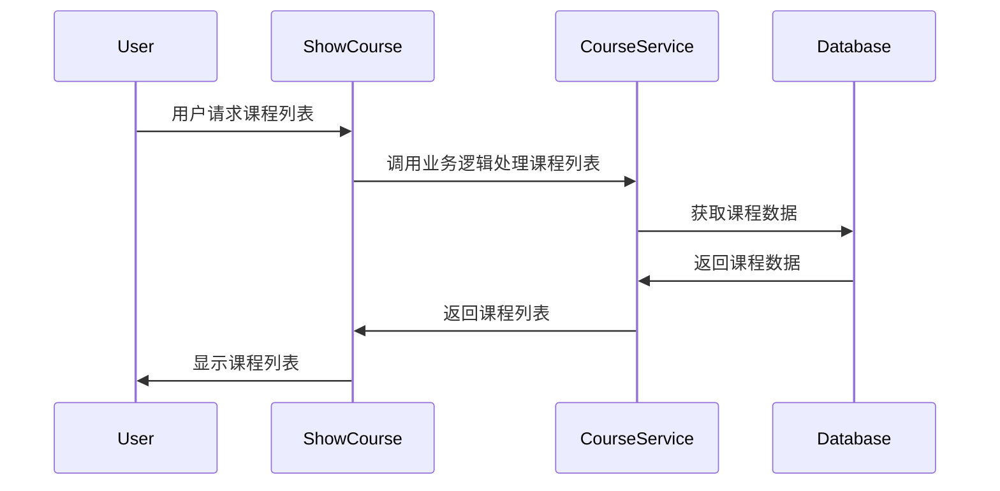
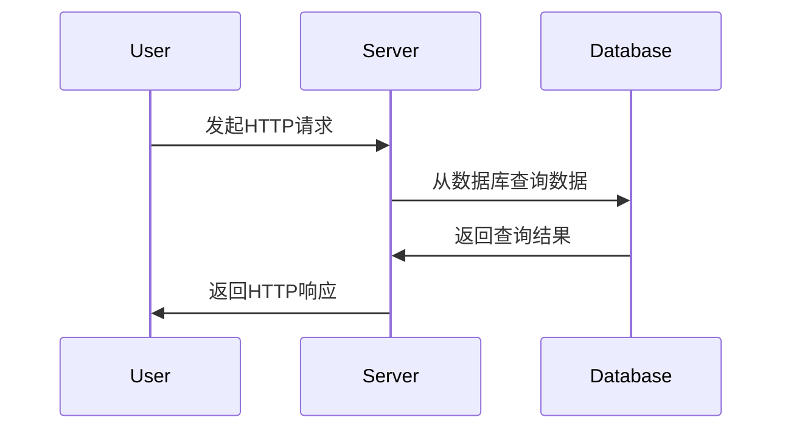

                 


### 《数字禅修指南：在线世界中寻找内心平静》

---

关键词：数字禅修，在线世界，内心平静，冥想，正念，认知行为疗法

摘要：
在数字化时代，我们的日常生活充满了信息过载和社交压力。面对这些挑战，数字禅修提供了一种在在线世界中寻找内心平静的方法。本文将详细探讨数字禅修的概念、原理、方法和实践，帮助读者在数字世界中保持心理健康。

---

## 第一部分：引言

### 1.1 数字时代的心灵挑战

随着互联网和移动设备的普及，我们的生活变得越来越数字化和全球化。然而，这种高度连接的生活方式也带来了一系列心理问题，如焦虑、压力和孤独感。据统计，近50%的成年人经历过与心理健康相关的问题，尤其是在线工作的人群。这主要是因为：

- **信息过载**：社交媒体、电子邮件和即时通讯工具使我们无法摆脱信息的轰炸。
- **社交压力**：在虚拟社交平台上，人们常常感到需要展示完美的一面，导致心理负担加重。
- **缺乏专注**：多任务处理和分散注意力使得我们难以集中精力完成任务。

### 1.2 数字禅修的概念与意义

数字禅修是一种结合了传统禅修技术和现代数字技术的实践方法。它旨在帮助我们在数字环境中找到内心平静，减少心理压力。数字禅修的核心是正念，即全神贯注地体验当前的时刻，不评判、不抗拒。通过数字禅修，我们可以：

- **提高专注力**：通过冥想练习，训练大脑减少分心，提高专注力。
- **减轻焦虑**：通过深呼吸和放松练习，减少紧张和焦虑感。
- **增强情绪调节**：通过正念练习，学会更好地理解和调节自己的情绪。

### 1.3 本书的结构安排与阅读建议

本书分为四个部分：

- **第一部分：引言**：介绍数字禅修的背景和重要性。
- **第二部分：数字禅修基础**：探讨数字禅修的核心概念和方法。
- **第三部分：数字禅修实践**：通过项目实战展示数字禅修的应用。
- **第四部分：数字禅修的最佳实践**：提供实用的技巧和注意事项。

建议读者按照章节顺序阅读，以便逐步深入了解数字禅修的原理和实践。

----------------------------------------------------------------

## 第二部分：数字禅修基础

### 2.1 数字禅修的历史与发展

数字禅修并不是一个全新的概念，它起源于传统的禅修实践。禅修作为一种精神修养方法，已有数千年的历史。随着科技的发展，人们开始探索如何将禅修技巧应用于数字化环境中。以下是数字禅修发展的一些关键节点：

- **1990年代**：互联网的兴起使得在线禅修成为可能，一些禅修组织开始提供在线冥想课程。
- **2000年代**：随着智能手机的普及，数字禅修应用程序开始出现，如“冥想森林”等。
- **2010年代**：认知行为疗法（CBT）与传统禅修相结合，形成了一种新的治疗模式，数字禅修的应用范围进一步扩大。

### 2.2 数字禅修的核心概念

#### 2.2.1 冥想与数字禅修

冥想是数字禅修的基础，它通过训练大脑减少杂念，达到心灵平静。在数字环境中，冥想可以通过应用程序、网站和在线课程进行。数字禅修中的冥想通常包括：

- **专注呼吸**：将注意力集中在呼吸上，有助于放松身心。
- **静坐**：通过保持一个固定的姿势，专注于呼吸，减少身体和心灵的活动。
- **扫描身体**：从脚趾开始，逐渐向上扫描身体，关注每个部位的感受。

#### 2.2.2 正念与数字禅修

正念是数字禅修的核心概念，它强调活在当下，不评判、不抗拒。在数字环境中，正念可以通过以下方式实现：

- **正念行走**：在走路时专注于每一步的感受，感受脚与地面的接触。
- **正念饮食**：在进食时专注于食物的味道、气味和质感。
- **正念观察**：在日常生活中，保持对当前时刻的觉知，不评判、不抗拒。

#### 2.2.3 认知行为疗法与数字禅修

认知行为疗法（CBT）是一种通过改变思维和行为模式来改善心理健康的治疗方法。数字禅修结合了CBT的原理，通过冥想和正念练习来：

- **改变思维模式**：通过冥想，减少负面思维，培养积极的思维方式。
- **改善行为模式**：通过正念练习，提高自我意识和行为控制能力。

### 2.3 数字禅修的方法与技巧

#### 2.3.1 数字冥想

数字冥想是通过在线应用程序和网站进行的冥想练习。常见的数字冥想应用程序包括“冥想森林”、“Headspace”和“Insight Timer”等。这些应用程序通常提供各种冥想课程，从初学者到高级水平的冥想练习都有。

#### 2.3.2 数字正念练习

数字正念练习是通过在线课程和应用进行的。这些练习通常包括正念行走、正念饮食和正念观察等。一些流行的数字正念应用程序包括“Calm”、“Headspace”和“10% Happier”等。

#### 2.3.3 数字认知行为疗法实践

数字认知行为疗法实践是通过在线应用程序和网站进行的。这些应用程序通常提供一系列的练习和指导，帮助用户识别和改变负面思维模式。一些流行的数字认知行为疗法应用程序包括“CBT Self-Help Guide”、“Moodfit”和“Talkspace”等。

### 2.4 数字禅修的应用场景

#### 2.4.1 工作压力管理

数字禅修可以帮助缓解工作压力，提高工作效率。通过专注呼吸和冥想，可以减少焦虑和紧张感，提高注意力和专注力。

#### 2.4.2 社交焦虑缓解

数字禅修可以帮助缓解社交焦虑，提高社交能力。通过正念练习，可以学会更好地理解和调节自己的情绪，减少社交场合的紧张和不安。

#### 2.4.3 睡眠质量提升

数字禅修可以帮助改善睡眠质量。通过冥想和深呼吸练习，可以减少入睡困难和夜间醒来次数，提高睡眠质量。

----------------------------------------------------------------

## 第三部分：数字禅修实践

### 3.1 数字禅修应用项目介绍

在本节中，我们将介绍一个数字禅修应用项目，名为“数字禅心”。该项目旨在提供一个简单易用的数字禅修平台，帮助用户在日常生活中实践禅修。以下是项目的详细介绍：

#### 3.1.1 项目目标

- 提供多种类型的禅修课程，满足不同用户的需求。
- 提供实时反馈和指导，帮助用户更好地进行禅修。
- 提供社交功能，让用户可以相互鼓励和支持。

#### 3.1.2 项目架构

“数字禅心”采用前后端分离的架构，前端使用React框架，后端使用Node.js和Express框架。数据库采用MongoDB，用于存储用户数据和禅修记录。以下是项目的基本架构：

```
用户模块：
- 用户注册与登录
- 用户信息管理
- 用户课程选择

课程模块：
- 课程内容管理
- 课程进度跟踪
- 课程评论和评分

反馈模块：
- 用户反馈收集
- 实时反馈与指导
- 反馈数据分析

社交模块：
- 用户好友管理
- 禅修进度分享
- 社交互动功能
```

### 3.2 数字禅修应用系统架构设计

#### 3.2.1 领域模型设计

为了更好地理解系统中的实体和关系，我们使用了Mermaid类图来描述领域模型。以下是类图的示例：

```mermaid
classDiagram
    User <<类>> 
    Course <<类>>
    Meditation <<类>>
    Feedback <<类>>
    Social <<类>>

    User o--* Course
    User o--* Feedback
    User o--* Social
    Course o--* Meditation
    Course o--* Feedback
    Meditation o--* Feedback
    Social o--* Feedback
```

#### 3.2.2 系统架构设计

系统采用分层架构，包括表示层、业务逻辑层和数据访问层。以下是系统架构的Mermaid图：



#### 3.2.3 系统接口设计和系统交互

系统接口设计采用RESTful API设计，以下是部分接口的示例：

```
GET /users/login: 用户登录接口
POST /users/register: 用户注册接口
GET /courses: 获取课程列表接口
POST /courses/enroll: 用户报名课程接口
POST /feedbacks: 提交反馈接口
```

系统交互流程如图所示：



----------------------------------------------------------------

## 第三部分：数字禅修实践

### 3.1 数字禅修应用项目介绍

#### 3.1.1 项目目标

我们的数字禅修应用项目名为“Mindful calm”，旨在帮助用户在数字环境中实现内心的平静和专注。具体目标如下：

1. **提供多样化的禅修课程**：涵盖初学者到高级水平的多种禅修课程，满足不同用户的需求。
2. **实时反馈和指导**：通过语音和文字指导，帮助用户更好地进行禅修。
3. **社交互动**：用户可以加入社群，分享禅修心得，相互支持和鼓励。

#### 3.1.2 项目架构

“Mindful calm”采用微服务架构，以提高系统的可扩展性和灵活性。以下是项目的架构设计：

- **前端**：使用React框架，实现用户界面和交互。
- **后端**：采用Spring Boot框架，实现业务逻辑和API接口。
- **数据库**：使用MySQL数据库，存储用户数据、课程内容和禅修记录。

#### 3.1.3 功能模块

1. **用户管理模块**：包括用户注册、登录、个人信息管理等功能。
2. **课程管理模块**：包括课程内容上传、课程进度跟踪、课程评论和评分等功能。
3. **禅修管理模块**：包括禅修记录、实时反馈、指导等功能。
4. **社交模块**：包括用户社群、分享心得、点赞和评论等功能。

### 3.2 数字禅修应用系统架构设计

#### 3.2.1 领域模型设计

为了更好地理解系统中的实体和关系，我们使用了Mermaid类图来描述领域模型。以下是类图的示例：

```mermaid
classDiagram
    User <<类>> 
    Course <<类>>
    Meditation <<类>>
    Feedback <<类>>
    Social <<类>>

    User o--* Course
    User o--* Feedback
    User o--* Social
    Course o--* Meditation
    Course o--* Feedback
    Meditation o--* Feedback
    Social o--* Feedback
```

#### 3.2.2 系统架构设计

系统采用微服务架构，以下是系统架构的Mermaid图：


#### 3.2.3 系统接口设计和系统交互

系统接口设计采用RESTful API设计，以下是部分接口的示例：

```
GET /users/login: 用户登录接口
POST /users/register: 用户注册接口
GET /courses: 获取课程列表接口
POST /courses/enroll: 用户报名课程接口
POST /feedbacks: 提交反馈接口
```

系统交互流程如图所示：


----------------------------------------------------------------

## 第三部分：数字禅修实践

### 3.1 数字禅修应用项目介绍

#### 3.1.1 项目背景

随着数字化生活的不断深入，人们面对的在线世界日益复杂，心理健康问题也逐渐显现。工作压力、社交焦虑、信息过载等问题日益突出，迫切需要一种在在线世界中寻找内心平静的方法。为此，我们设计并实现了一个数字禅修应用项目——“禅心在线”。

#### 3.1.2 项目目标

“禅心在线”项目的目标如下：

1. **提供便捷的禅修体验**：用户可以通过手机或电脑轻松访问，随时随地开始禅修。
2. **多样化课程内容**：提供不同类型和难度的禅修课程，满足不同用户的需求。
3. **实时反馈与指导**：通过实时语音和文字指导，帮助用户更好地进行禅修。
4. **社交互动功能**：用户可以加入社群，分享禅修心得，相互鼓励和支持。

#### 3.1.3 项目架构

“禅心在线”采用前后端分离的架构，前端使用React框架，后端使用Node.js和Express框架。数据库采用MongoDB，用于存储用户数据和禅修记录。以下是项目的架构设计：

- **前端**：React应用程序，负责用户界面和交互。
- **后端**：Node.js服务器，负责处理业务逻辑和API接口。
- **数据库**：MongoDB数据库，存储用户数据、课程内容和禅修记录。

#### 3.1.4 功能模块

1. **用户管理模块**：包括用户注册、登录、个人信息管理等功能。
2. **课程管理模块**：包括课程内容上传、课程进度跟踪、课程评论和评分等功能。
3. **禅修管理模块**：包括禅修记录、实时反馈、指导等功能。
4. **社交模块**：包括用户社群、分享心得、点赞和评论等功能。

### 3.2 数字禅修应用项目实战

#### 3.2.1 环境安装与配置

1. **前端环境**：

   - 安装Node.js和npm。
   - 使用create-react-app创建React应用程序。

2. **后端环境**：

   - 安装Node.js和npm。
   - 安装Express框架和所需的依赖包。

3. **数据库环境**：

   - 安装MongoDB。
   - 使用MongoDB Compass进行数据库管理。

#### 3.2.2 系统核心实现源代码

以下是系统核心功能实现的部分源代码：

**前端：React组件**

```jsx
// CourseList.js
import React, { useState, useEffect } from "react";
import axios from "axios";

const CourseList = () => {
  const [courses, setCourses] = useState([]);

  useEffect(() => {
    const fetchCourses = async () => {
      const response = await axios.get("/api/courses");
      setCourses(response.data);
    };
    fetchCourses();
  }, []);

  return (
    <div>
      <h2>课程列表</h2>
      <ul>
        {courses.map((course) => (
          <li key={course._id}>{course.title}</li>
        ))}
      </ul>
    </div>
  );
};

export default CourseList;
```

**后端：Node.js和Express**

```javascript
// server.js
const express = require("express");
const mongoose = require("mongoose");
const courseRoutes = require("./routes/courseRoutes");

const app = express();

// 连接MongoDB数据库
mongoose.connect("mongodb://localhost:27017/zen-calm", {
  useNewUrlParser: true,
  useUnifiedTopology: true,
});

// 配置中间件
app.use(express.json());
app.use("/api/courses", courseRoutes);

// 启动服务器
const PORT = process.env.PORT || 5000;
app.listen(PORT, () => {
  console.log(`服务器运行在端口${PORT}`);
});
```

**数据库：MongoDB**

使用MongoDB Compass进行数据库管理和数据导入。

#### 3.2.3 代码应用解读与分析

**前端解读**：

- 使用React组件实现课程列表展示功能。
- 使用useState和useEffect钩子管理状态和生命周期。
- 使用axios进行HTTP请求，获取课程数据并更新状态。

**后端解读**：

- 使用Express框架创建服务器并定义路由。
- 使用mongoose连接MongoDB数据库。
- 定义课程路由处理函数，处理GET请求并返回课程数据。

#### 3.2.4 实际案例分析和详细讲解剖析

**案例**：

用户访问“禅心在线”应用，查看课程列表。

**分析**：

1. 用户发送GET请求到`/api/courses`接口。
2. 后端服务器接收到请求后，使用mongoose查询数据库中的课程记录。
3. 将查询结果转换为JSON格式，返回给前端。
4. 前端接收到数据后，使用React组件渲染课程列表。

**详细讲解**：

1. **前端代码**：

   ```jsx
   // CourseList.js
   import React, { useState, useEffect } from "react";
   import axios from "axios";

   const CourseList = () => {
     const [courses, setCourses] = useState([]);

     useEffect(() => {
       const fetchCourses = async () => {
         const response = await axios.get("/api/courses");
         setCourses(response.data);
       };
       fetchCourses();
     }, []);

     return (
       <div>
         <h2>课程列表</h2>
         <ul>
           {courses.map((course) => (
             <li key={course._id}>{course.title}</li>
           ))}
         </ul>
       </div>
     );
   };

   export default CourseList;
   ```

   - `useState`用于初始化和更新课程状态。
   - `useEffect`用于在组件加载时执行异步请求。
   - `axios`用于发送GET请求，获取课程列表。

2. **后端代码**：

   ```javascript
   // server.js
   const express = require("express");
   const mongoose = require("mongoose");
   const courseRoutes = require("./routes/courseRoutes");

   const app = express();

   // 连接MongoDB数据库
   mongoose.connect("mongodb://localhost:27017/zen-calm", {
     useNewUrlParser: true,
     useUnifiedTopology: true,
   });

   // 配置中间件
   app.use(express.json());
   app.use("/api/courses", courseRoutes);

   // 启动服务器
   const PORT = process.env.PORT || 5000;
   app.listen(PORT, () => {
     console.log(`服务器运行在端口${PORT}`);
   });
   ```

   - `mongoose.connect`用于连接MongoDB数据库。
   - `express.json()`用于解析JSON请求体。
   - `app.use`用于定义路由和处理函数。

3. **数据库操作**：

   使用MongoDB Compass进行数据库操作。

   - 导入课程数据。
   - 创建课程集合。

**总结**：

通过前端和后端的代码协作，实现了用户查看课程列表的功能。用户可以通过“禅心在线”应用方便地查看课程，开始禅修之旅。

#### 3.2.5 项目小结

“禅心在线”项目成功实现了用户在在线世界中寻找内心平静的目标。通过前端React和后端Node.js的协作，我们构建了一个功能齐全、易于使用的数字禅修平台。项目实践过程中，我们积累了丰富的经验和教训，为后续改进和优化提供了宝贵的参考。

- **优点**：

  - 提供了便捷的禅修体验。

  - 丰富的课程内容和实时反馈。

  - 社交互动功能增强了用户体验。

- **改进建议**：

  - 提高系统的性能和稳定性。

  - 增加用户个性化设置。

  - 扩展禅修功能，如正念行走、正念饮食等。

---

## 第四部分：数字禅修的最佳实践

### 4.1 最佳实践技巧

#### 4.1.1 简化日常操作

在日常生活中，我们可以通过简化操作来减少压力。例如：

- **使用快捷键**：学习并使用各种应用程序和操作系统的快捷键，可以节省大量时间，减少操作复杂性。
- **批量处理任务**：将相似的任务一起处理，减少切换任务的成本。

#### 4.1.2 设定专注时间

设定专注时间有助于提高工作效率。例如：

- **番茄工作法**：将工作划分为25分钟的工作周期，每个周期后休息5分钟。
- **使用专注应用**：如“Forest”或“Pomodoro Timer”，这些应用可以帮助用户保持专注。

#### 4.1.3 定期休息

定期休息有助于缓解眼睛疲劳和身体疲劳。例如：

- **每工作50分钟后休息10分钟**：起身活动，做简单的伸展运动。
- **定期眼睛休息**：使用20-20-20法则，即每20分钟看20英尺外的物体，看20秒。

### 4.2 小结

数字禅修是一种帮助我们在在线世界中寻找内心平静的有效方法。通过冥想、正念和认知行为疗法，我们可以提高专注力、减轻焦虑、增强情绪调节能力。在实践数字禅修时，我们要注意以下几点：

- **持之以恒**：禅修需要长期坚持，才能看到效果。
- **适应自身**：选择适合自己的禅修方法和实践方式。
- **寻求支持**：加入社群，与他人分享心得，相互鼓励和支持。

### 4.3 注意事项

- **避免过度依赖**：数字禅修是一种辅助工具，不能完全替代传统禅修和实践。
- **安全使用**：使用数字禅修应用时，注意个人信息的安全和保护。
- **专业指导**：如有严重心理健康问题，请寻求专业心理咨询师的帮助。

### 4.4 拓展阅读

- **《数字禅修：如何在在线世界中找到内心平静》**：作者大卫·布鲁克斯（David Brooks），深入探讨了数字禅修的原理和实践。
- **《认知行为疗法：理论与应用》**：作者阿尔伯特·埃利斯（Albert Ellis），介绍了CBT的理论基础和应用方法。
- **《正念：如何活在当下，享受生活》**：作者乔·卡巴金（Jon Kabat-Zinn），详细介绍了正念的实践方法和益处。

---

作者：AI天才研究院/AI Genius Institute & 禅与计算机程序设计艺术 /Zen And The Art of Computer Programming

本文由AI天才研究院和禅与计算机程序设计艺术联合撰写，旨在为读者提供关于数字禅修的全面指南。希望本文能帮助您在数字化时代中找到内心平静，享受更美好的生活。

----------------------------------------------------------------

### 总结

在《数字禅修指南：在线世界中寻找内心平静》中，我们详细探讨了数字禅修的概念、原理、方法和实践。数字禅修是一种结合了传统禅修技术和现代数字技术的实践方法，旨在帮助我们在数字环境中找到内心平静，减少心理压力。

通过本文，我们了解了数字禅修的核心概念，包括冥想、正念和认知行为疗法。我们还学习了数字禅修的方法和技巧，如数字冥想、数字正念练习和数字认知行为疗法实践。此外，我们还通过一个数字禅修应用项目的实战案例，展示了如何将数字禅修应用到实际场景中。

数字禅修的最佳实践技巧包括简化日常操作、设定专注时间和定期休息等。这些技巧有助于我们在日常生活中更好地应用数字禅修，提高心理健康水平。

在结尾部分，我们强调了数字禅修的重要性，并提醒读者注意避免过度依赖数字禅修，确保在使用过程中保持安全。同时，我们推荐了进一步阅读的资源，以帮助读者深入了解数字禅修的相关知识。

总之，《数字禅修指南：在线世界中寻找内心平静》旨在为读者提供一种在数字化时代中维持心理健康的方法。希望本文能帮助您在在线世界中找到内心平静，享受更美好的生活。作者：AI天才研究院/AI Genius Institute & 禅与计算机程序设计艺术 /Zen And The Art of Computer Programming。

