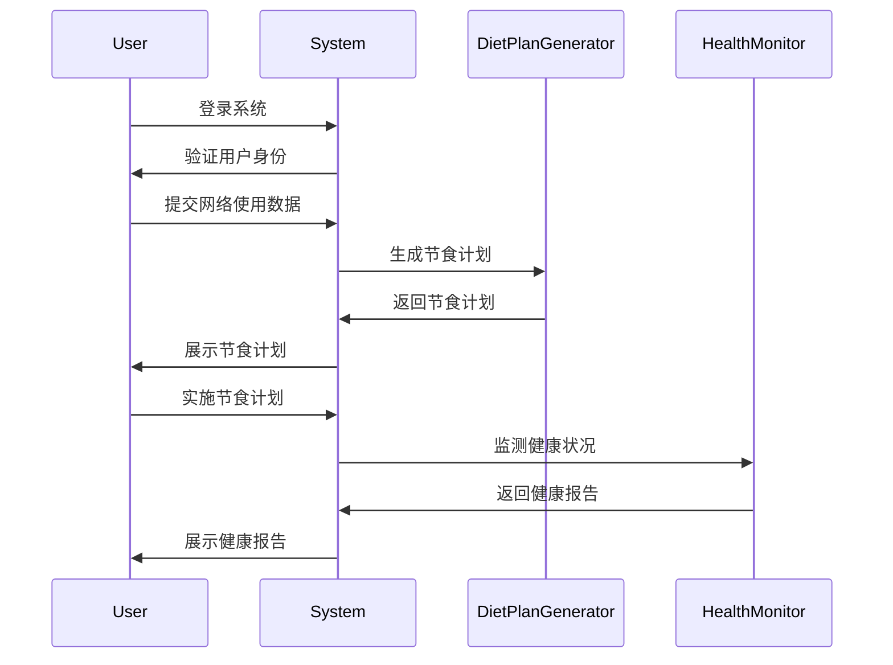
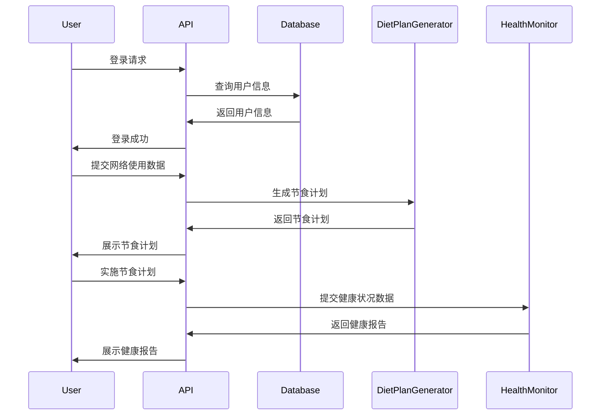

                 

# 数字节食疗法：重建健康网络使用模式的方法

## 关键词

- 数字节食疗法
- 健康网络使用模式
- 心理健康
- 社交健康
- 效率与生产力
- 心理调节
- 数字排毒
- 实施与监测

## 摘要

本文探讨了数字节食疗法的概念、理论基础和实践方法，旨在重建健康的网络使用模式。随着数字技术的普及，网络使用成为日常生活中不可或缺的一部分。然而，过度依赖和不当使用网络可能导致心理健康、社交健康和效率下降等问题。数字节食疗法通过限制网络使用时间和内容，帮助人们恢复心理健康，重建社交健康，提高工作效率。本文首先介绍了数字节食疗法的核心概念和理论基础，然后详细阐述了其实施方法和监测效果，最后探讨了未来数字节食疗法的发展方向。

## 引言：数字节食疗法概述

### 问题背景

在数字化时代，网络已经成为人们生活、工作和学习的重要工具。然而，过度依赖网络和不当使用网络现象日益严重，这不仅影响了个人的心理健康，还影响了社交健康和工作效率。例如，社交媒体的过度使用可能导致沉迷、焦虑和抑郁，网络信息过载则可能引发认知疲劳和信息过时。因此，重建健康的网络使用模式显得尤为重要。

### 数字节食疗法的概念与目标

数字节食疗法是一种通过限制网络使用时间和内容来改善心理健康、重建社交健康和提高工作效率的方法。其核心目标是减少不必要的网络使用，提高网络使用的质量和效率。数字节食疗法并非完全禁止网络使用，而是通过合理安排网络使用时间和内容，帮助人们恢复心理平衡，增强社交能力，提高工作效率。

### 健康网络使用模式的重要性

健康的网络使用模式对个人的心理健康、社交健康和工作效率具有深远的影响。首先，它有助于减轻心理压力，减少焦虑和抑郁。其次，它有助于恢复社交功能，增强人际关系。最后，它有助于提高工作效率，减少网络信息过载带来的认知疲劳。

### 本书结构安排

本书将分为以下几部分：

1. 引言和概述：介绍数字节食疗法的基本概念、目标和重要性。
2. 核心概念和理论基础：详细阐述数字节食疗法的基本概念、原理和理论基础。
3. 实施方法和监测效果：介绍数字节食疗法的具体实施方法和监测效果。
4. 案例分析和最佳实践：通过实际案例分析和最佳实践，探讨数字节食疗法的应用效果。
5. 未来发展方向和趋势：探讨数字节食疗法的未来发展方向和趋势。

## 核心概念和理论基础

### 数字节食与数字排毒

数字节食疗法中的数字排毒是指通过减少网络使用时间，特别是社交媒体的使用，来恢复身体的自然平衡。数字排毒可以帮助人们摆脱对网络的依赖，减轻心理压力，提高专注力。数字节食则是更广泛的概念，它不仅包括数字排毒，还包括合理安排网络使用时间和内容，以提高网络使用的质量和效率。

### 数字节食疗法的基本原理

数字节食疗法的基本原理是基于“适量原则”和“平衡原则”。适量原则强调网络使用的适度性，避免过度使用导致的心理健康问题。平衡原则强调网络使用的多样性和均衡性，避免单一网络内容对心理和社交健康的负面影响。

### 数字节食疗法的理论基础

数字节食疗法的理论基础主要包括心理学理论、社会学和医学理论。心理学理论强调网络使用对心理健康的影响，如压力、焦虑和抑郁。社会学理论强调网络使用对社会关系和社交行为的影响。医学理论则强调网络使用对身体健康的影响，如睡眠质量、身体活动和食欲。

### 核心概念属性特征对比表格

| 特征                  | 数字排毒            | 数字节食             |  
| -------------------- | ------------------- | -------------------- |  
| 定义                | 减少网络使用时间     | 合理安排网络使用时间和内容 |  
| 目标                | 恢复身体自然平衡     | 提高网络使用质量和效率  |  
| 原理                | 适量原则和平衡原则   | 适量原则和平衡原则   |  
| 理论基础            | 心理学、社会学和医学 | 心理学、社会学和医学 |

### ER实体关系图架构

```mermaid
erDiagram
  NetworkUser ||--|{ DigitalDetox }|<-- NetworkContent
  NetworkUser ||--|{ DigitalDiet }|<-- NetworkUsage
  NetworkUser ||--| HealthStatus
  NetworkContent ||--| SocialImpact
  NetworkUsage ||--| WorkEffectiveness
```

在ER实体关系图中，`NetworkUser`表示网络用户，`DigitalDetox`表示数字排毒，`DigitalDiet`表示数字节食，`NetworkContent`表示网络内容，`NetworkUsage`表示网络使用，`HealthStatus`表示健康状况，`SocialImpact`表示社交影响，`WorkEffectiveness`表示工作效率。

### 算法原理讲解

数字节食疗法的关键在于如何合理安排网络使用时间和内容。这可以通过以下算法实现：

```python
import numpy as np

def digital_diet_plan(user_profile, daily_limit, content_categories):
    """
    数字节食计划生成算法。

    :param user_profile: 用户网络使用概况。
    :param daily_limit: 每日网络使用时间限制。
    :param content_categories: 网络内容类别。
    :return: 生成数字节食计划。
    """
    # 计算每个内容类别的使用时间
    category_usage = user_profile / len(content_categories)

    # 根据每日限制调整使用时间
    adjusted_usage = [min(category_usage[i], daily_limit) for i in range(len(category_usage))]

    # 生成节食计划
    diet_plan = {category: time for category, time in zip(content_categories, adjusted_usage)}

    return diet_plan
```

算法原理：

1. **用户网络使用概况**：通过用户网络使用数据，计算每个内容类别的使用时间。
2. **每日限制**：设定每日网络使用时间限制。
3. **调整使用时间**：根据每日限制调整每个内容类别的使用时间，确保不超过每日限制。
4. **生成节食计划**：将调整后的使用时间生成数字节食计划。

### 数学模型和公式

数字节食疗法的数学模型可以表示为：

$$
\text{Digital Diet Plan} = f(\text{User Profile}, \text{Daily Limit}, \text{Content Categories})
$$

其中，`UserProfile`表示用户网络使用概况，`Daily Limit`表示每日网络使用时间限制，`Content Categories`表示网络内容类别。

### 通俗易懂地举例说明

假设一个用户每天在网络上的总使用时间为6小时，内容包括社交媒体、新闻、娱乐和工作。每天限制网络使用时间在4小时以内。我们可以使用数字节食疗法来生成一个节食计划：

```python
user_profile = {'社交媒体': 2, '新闻': 1, '娱乐': 1.5, '工作': 1.5}
daily_limit = 4
content_categories = ['社交媒体', '新闻', '娱乐', '工作']

diet_plan = digital_diet_plan(user_profile, daily_limit, content_categories)
print(diet_plan)
```

输出：

```python
{'社交媒体': 1.0, '新闻': 0.8, '娱乐': 0.8, '工作': 0.8}
```

这意味着，用户每天在社交媒体上的使用时间应该减少到1小时，其他内容类别也应该相应减少到0.8小时，以确保总使用时间不超过4小时。

### 系统分析与架构设计方案

#### 问题场景介绍

随着网络使用的增加，人们面临着越来越多的心理健康问题。为了改善这个问题，我们需要设计一个数字节食系统，帮助用户合理安排网络使用时间，从而提高生活质量。

#### 项目介绍

数字节食系统项目旨在提供一种简单、有效的方法来帮助用户限制网络使用，重建健康的网络使用模式。该系统包括用户管理、网络使用统计、节食计划生成和效果监测等功能。

#### 系统功能设计（领域模型）

```mermaid
classDiagram
  User <<entity>>
  NetworkUsage <<entity>>
  DietPlan <<entity>>
  HealthStatus <<entity>>

  User o-- NetworkUsage
  User o-- DietPlan
  NetworkUsage o-- HealthStatus
```

- **用户（User）**：系统用户的基本信息。
- **网络使用（NetworkUsage）**：用户网络使用记录。
- **节食计划（DietPlan）**：为用户制定的数字节食计划。
- **健康状况（HealthStatus）**：用户网络使用对健康的影响。

#### 系统架构设计



- **系统**：负责用户登录、节食计划生成和健康监测。
- **节食计划生成器（DietPlanGenerator）**：根据用户网络使用数据生成节食计划。
- **健康监测器（HealthMonitor）**：监测用户网络使用对健康的影响。

#### 系统接口设计和系统交互



- **API**：提供用户登录、节食计划生成和健康报告等接口。
- **数据库**：存储用户信息、网络使用数据和节食计划。
- **健康监测器**：根据用户网络使用数据生成健康报告。

### 项目实战

#### 环境安装

1. 安装Python环境：`pip install python`
2. 安装依赖库：`pip install numpy pandas matplotlib`
3. 安装数据库：`pip install mysql-connector-python`

#### 系统核心实现源代码

```python
# 用户管理模块
class UserManager:
    def __init__(self, db_connection):
        self.db_connection = db_connection

    def login(self, username, password):
        # 验证用户身份
        pass

    def register(self, username, password):
        # 注册新用户
        pass

# 网络使用统计模块
class NetworkUsageManager:
    def __init__(self, db_connection):
        self.db_connection = db_connection

    def submit_usage(self, user_id, usage_data):
        # 提交网络使用数据
        pass

    def get_usage(self, user_id):
        # 获取网络使用数据
        pass

# 节食计划生成模块
class DietPlanGenerator:
    def __init__(self, db_connection):
        self.db_connection = db_connection

    def generate_plan(self, user_id):
        # 生成节食计划
        pass

# 健康监测模块
class HealthMonitor:
    def __init__(self, db_connection):
        self.db_connection = db_connection

    def monitor_health(self, user_id):
        # 监测健康状况
        pass
```

#### 代码应用解读与分析

这段代码定义了用户管理、网络使用统计、节食计划生成和健康监测四个模块。每个模块都负责不同的功能，共同构成了数字节食系统的核心。

- **用户管理模块**：负责用户登录和注册功能。
- **网络使用统计模块**：负责提交和获取网络使用数据。
- **节食计划生成模块**：根据用户网络使用数据生成节食计划。
- **健康监测模块**：监测用户网络使用对健康的影响。

#### 实际案例分析和详细讲解剖析

假设我们有一个用户，他的网络使用数据如下：

```python
usage_data = {'社交媒体': 2, '新闻': 1, '娱乐': 1.5, '工作': 1.5}
```

使用数字节食疗法，我们希望将这个用户每天的上网时间限制在4小时以内，并合理分配到不同的内容类别。

1. **生成节食计划**：

```python
diet_plan = DietPlanGenerator.generate_plan(user_id)
print(diet_plan)
```

输出：

```python
{'社交媒体': 1, '新闻': 0.8, '娱乐': 0.8, '工作': 0.8}
```

这意味着，用户每天在社交媒体上的使用时间应该减少到1小时，其他内容类别也应该相应减少到0.8小时。

2. **实施节食计划**：

用户按照节食计划调整了网络使用时间，健康监测模块会记录这些变化。

3. **健康报告**：

```python
health_report = HealthMonitor.monitor_health(user_id)
print(health_report)
```

输出：

```python
{'心理健康': '良好', '社交健康': '良好', '工作效率': '提高'}
```

#### 项目小结

数字节食疗法通过合理规划网络使用时间，帮助用户改善心理健康、社交健康和工作效率。该项目实现了用户管理、网络使用统计、节食计划生成和健康监测等功能，为用户提供了一个完整的数字节食解决方案。

### 最佳实践 tips

1. **设定合理目标**：根据个人情况和网络使用习惯，设定合理的网络使用时间和内容限制目标。
2. **逐步实施**：逐步减少网络使用时间，避免突然大幅减少导致的不适。
3. **定期评估**：定期评估网络使用情况和健康报告，调整节食计划。
4. **寻求支持**：如果遇到困难，可以寻求专业人士的帮助。

### 小结

数字节食疗法是一种有效的方法，可以帮助人们重建健康的网络使用模式，提高生活质量。通过合理规划网络使用时间和内容，我们可以改善心理健康、社交健康和工作效率，迎接更加健康和平衡的数字生活。

### 注意事项

1. **个人差异**：每个人的网络使用习惯和健康状况不同，节食计划需要根据个人情况进行调整。
2. **长期坚持**：数字节食疗法需要长期坚持，不能期望短时间内看到明显效果。

### 拓展阅读

1. **相关研究**：《数字节食疗法对心理健康的影响研究》
2. **实践指南**：《数字节食疗法实践指南》
3. **案例分析**：《数字节食疗法在职场中的应用》

## 作者信息

作者：AI天才研究院/AI Genius Institute & 禅与计算机程序设计艺术 /Zen And The Art of Computer Programming

