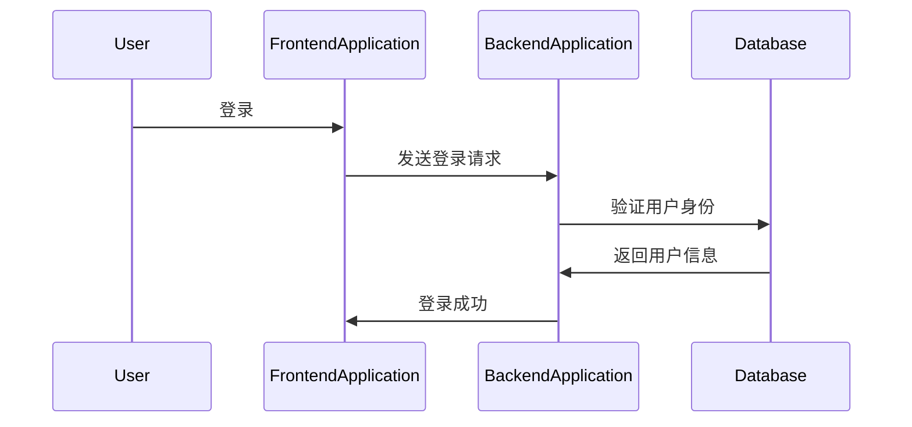

                 

# 数字解毒师在线预约平台：连接用户与健康网络习惯指导员

> 关键词：数字解毒师、在线预约平台、健康网络习惯指导员、ER图、算法原理、系统架构设计、项目实战

> 摘要：本文深入探讨了数字世界中的“数字解毒师”在线预约平台，分析了其核心概念、工作模式、算法原理以及系统架构设计。通过实际项目实战，我们展示了如何搭建一个高效、可靠的数字健康服务平台，并提供了最佳实践和拓展阅读，以助力读者深入了解这一领域的最新动态。

## 第一部分：背景介绍与核心概念

### 第1章：数字世界中的“数字解毒师”

#### 1.1 问题背景

随着数字化时代的到来，人们越来越依赖数字设备和网络服务，然而，这也带来了诸多健康问题。网络成瘾、信息过载、心理健康问题等逐渐成为现代人的困扰。为了解决这些问题，我们需要寻找一种方法来帮助用户建立健康的网络使用习惯。

#### 1.1.1 健康问题的日益严重

网络成瘾是一个全球性问题，它不仅影响个人的生活和工作，还会导致一系列心理和生理问题。信息过载导致用户难以处理海量的数据，从而产生焦虑和压力。心理健康问题则包括焦虑、抑郁等，这些问题在很大程度上与网络使用习惯有关。

#### 1.1.2 数字健康服务的兴起

为了解决上述问题，数字健康服务应运而生。这些服务通过提供个性化的健康指导、行为干预和心理支持，帮助用户建立健康的网络使用习惯。数字解毒师作为其中的重要角色，发挥着关键作用。

#### 1.1.3 “数字解毒师”的角色定位

数字解毒师是一种专业服务提供者，他们通过专业的知识和技能，帮助用户识别和解决网络使用中的问题。他们不仅提供健康建议，还指导用户如何合理安排时间，减少不必要的网络使用。

### 1.2 核心概念解析

#### 1.2.1 数字解毒师：定义与作用

数字解毒师是一种专业服务提供者，他们拥有丰富的数字健康知识和实践经验。他们的主要职责是帮助用户建立健康的网络使用习惯，解决网络成瘾、信息过载等问题。

#### 1.2.2 在线预约平台：功能与结构

在线预约平台是一个数字健康服务平台，它为用户提供了一个方便、快捷的预约渠道。用户可以通过平台预约数字解毒师的服务，平台则负责管理预约、排程和反馈等流程。

#### 1.2.3 健康网络习惯指导员：角色与意义

健康网络习惯指导员是一种辅助角色，他们与数字解毒师合作，为用户提供更全面的服务。他们的主要职责是研究用户行为，提供个性化的健康建议，并跟踪用户的行为变化。

## 第2章: “数字解毒师”与在线预约平台的关系

### 2.1 数字解毒师的工作模式

数字解毒师的工作模式主要包括数据收集、用户画像、咨询和预约等环节。他们通过收集用户的数据，分析用户的行为特征，然后根据用户的实际情况提供个性化的健康建议。

#### 2.1.1 数据收集与处理

数字解毒师需要收集大量的数据，包括用户的网络使用记录、心理测试结果、健康指标等。他们利用数据挖掘和分析技术，对数据进行处理，提取出有用的信息。

#### 2.1.2 用户画像与个性化服务

通过对用户数据的分析，数字解毒师可以创建用户画像，了解用户的行为偏好和心理特点。根据这些信息，他们可以提供个性化的健康建议，帮助用户建立健康的网络使用习惯。

#### 2.1.3 咨询与预约流程

数字解毒师通过在线预约平台与用户进行咨询和预约。用户可以通过平台预约时间，数字解毒师则在预约时间内为用户提供服务。咨询结束后，用户可以对服务进行评价，平台则根据用户的评价对数字解毒师进行考核。

### 2.2 在线预约平台的关键功能

在线预约平台是一个关键的组成部分，它为数字解毒师和用户提供了高效的沟通和服务渠道。其主要功能包括用户注册、预约管理、服务评价等。

#### 2.2.1 用户注册与身份验证

用户需要注册并完成身份验证，以确保平台的安全和隐私。注册过程中，用户需要填写基本信息，如姓名、联系方式等。

#### 2.2.2 预约管理与排程

在线预约平台负责管理用户的预约，包括预约时间的设定、预约状态的更新等。平台需要根据数字解毒师的排程情况，为用户提供合理的预约时间。

#### 2.2.3 服务评价与反馈机制

用户可以在咨询结束后对数字解毒师的服务进行评价，平台则根据用户的评价对数字解毒师进行考核。同时，平台还提供了反馈渠道，用户可以通过反馈机制向平台反映问题和建议。

## 第二部分：核心概念与联系

### 第3章: 健康网络习惯指导员：连接与引导

#### 3.1 健康网络习惯的重要性

健康网络习惯是指用户在网络上健康、合理地使用时间，避免网络成瘾和过度使用。良好的网络习惯不仅有助于提高生活质量，还能预防心理和生理问题。

#### 3.1.1 网络成瘾与心理健康

网络成瘾是一种心理问题，它可能导致用户沉迷于网络，影响生活和工作。网络成瘾还可能导致一系列心理健康问题，如焦虑、抑郁等。

#### 3.1.2 健康网络行为的定义与标准

健康网络行为是指用户在网络上合理、有节制地使用时间，避免沉迷和过度使用。健康网络行为的标准包括：合理安排网络时间、避免夜间使用、保持良好的作息规律等。

#### 3.1.3 健康网络习惯指导员的作用

健康网络习惯指导员是一种专业角色，他们通过研究用户行为，提供个性化的健康建议，帮助用户建立良好的网络习惯。他们的主要职责包括：数据分析、行为干预、跟踪评估等。

### 3.2 指导员的职能与工作流程

健康网络习惯指导员的职能主要包括：数据分析、行为干预、跟踪评估等。

#### 3.2.1 数据分析与用户行为研究

指导员需要收集和分析用户的数据，包括网络使用记录、心理测试结果等。通过对用户数据的分析，指导员可以了解用户的行为特征和心理状态。

#### 3.2.2 行为干预策略设计

根据用户的数据分析结果，指导员可以制定个性化的行为干预策略。这些策略包括：调整网络使用时间、提供心理支持、推荐健康网络活动等。

#### 3.2.3 跟踪与评估

指导员需要定期跟踪用户的行为变化，评估行为干预策略的有效性。如果策略无效，指导员需要调整策略，确保用户能够建立健康的网络习惯。

## 第4章: ER实体关系图与概念属性对比

### 4.1 ER实体关系图介绍

ER实体关系图（Entity-Relationship Diagram）是一种用于描述概念之间关系的图形化工具。它由实体、属性和关系三部分组成。

#### 4.1.1 实体、属性与关系

实体是ER图的主体，表示一个具体的概念，如用户、服务、预约等。属性是实体的特征，如用户的姓名、年龄等。关系描述实体之间的关联，如用户与服务之间的预约关系。

#### 4.1.2 Mermaid ER图绘制方法

Mermaid是一种Markdown语法，可以用于绘制ER图。以下是绘制ER图的基本语法：

```
erDiagram
  User ||--|{ Service }|--| User
  Service ||--|{ Appointment }|--| Service
  Appointment ||--|{ Feedback }|--| Appointment
```

### 4.2 概念属性对比表格

以下是一个简单的概念属性对比表格，用于展示数字解毒师、在线预约平台和健康网络习惯指导员的概念属性。

| 概念       | 属性                     | 说明                                                         |
|------------|------------------------|------------------------------------------------------------|
| 数字解毒师 | 姓名、联系方式、专业背景 | 数字解毒师的基本信息                                         |
| 在线预约平台 | 服务种类、预约时间、评价系统 | 在线预约平台的基本功能                                       |
| 健康网络习惯指导员 | 姓名、联系方式、专业背景 | 健康网络习惯指导员的基本信息                                 |

## 第三部分：算法原理讲解

### 第5章: 算法原理讲解

#### 5.1 数据分析算法

数据分析是数字解毒师和健康网络习惯指导员的重要工作。以下是一个简单的数据分析算法，用于提取用户行为特征。

```python
def analyze_data(data):
    # 对数据进行预处理，如去重、清洗等
    preprocessed_data = preprocess(data)
    
    # 计算用户行为特征，如平均每日使用时间、使用高峰等
    behavior_features = {
        'average_usage_time': calculate_average_usage_time(preprocessed_data),
        'peak_usage_time': calculate_peak_usage_time(preprocessed_data)
    }
    
    return behavior_features

def preprocess(data):
    # 数据预处理逻辑
    pass

def calculate_average_usage_time(data):
    # 计算平均每日使用时间
    pass

def calculate_peak_usage_time(data):
    # 计算使用高峰时间
    pass
```

#### 5.2 用户画像算法

用户画像是对用户行为特征的综合分析，用于提供个性化的健康建议。以下是一个简单的用户画像算法。

```python
def create_user_profile(behavior_features):
    # 根据行为特征创建用户画像
    user_profile = {
        'average_usage_time': behavior_features['average_usage_time'],
        'peak_usage_time': behavior_features['peak_usage_time'],
        'health_risk': assess_health_risk(behavior_features)
    }
    
    return user_profile

def assess_health_risk(behavior_features):
    # 评估用户健康风险
    pass
```

#### 5.3 行为干预策略算法

行为干预策略是根据用户画像制定的，用于帮助用户建立健康的网络使用习惯。以下是一个简单的行为干预策略算法。

```python
def create_behavior_intervention_strategy(user_profile):
    # 根据用户画像创建行为干预策略
    intervention_strategy = {
        'suggestion': suggest_action(user_profile),
        'goal': set_goal(user_profile),
        'duration': set_duration(user_profile)
    }
    
    return intervention_strategy

def suggest_action(user_profile):
    # 提出健康建议
    pass

def set_goal(user_profile):
    # 设置健康目标
    pass

def set_duration(user_profile):
    # 设置干预策略持续时间
    pass
```

## 第四部分：数学模型和数学公式讲解

### 第6章: 数学模型和数学公式讲解

#### 6.1 用户行为特征分析

用户行为特征分析是数字解毒师和健康网络习惯指导员的核心工作之一。以下是一个简单的用户行为特征分析数学模型。

$$
behavior\_feature = \frac{1}{n}\sum_{i=1}^{n} data_i
$$

其中，$behavior\_feature$表示用户行为特征，$n$表示数据点的数量，$data_i$表示第$i$个数据点的值。

#### 6.2 健康风险评估

健康风险评估是行为干预策略的重要依据。以下是一个简单的健康风险评估数学模型。

$$
health\_risk = \frac{1}{2}\left(1 - \frac{behavior\_feature - threshold}{threshold}\right)
$$

其中，$health\_risk$表示用户健康风险，$threshold$表示健康风险阈值，$behavior\_feature$表示用户行为特征。

#### 6.3 行为干预策略

行为干预策略是根据用户画像制定的，用于帮助用户建立健康的网络使用习惯。以下是一个简单的行为干预策略数学模型。

$$
intervention\_strategy = \left\{
\begin{array}{ll}
\text{建议行动} & \text{if } health\_risk \geq \text{风险阈值} \\
\text{保持现状} & \text{if } health\_risk < \text{风险阈值}
\end{array}
\right.
$$

其中，$intervention\_strategy$表示行为干预策略，$health\_risk$表示用户健康风险，$\text{风险阈值}$表示健康风险阈值。

## 第五部分：系统分析与架构设计方案

### 第7章: 系统分析与架构设计方案

#### 7.1 项目场景介绍

本项目旨在搭建一个数字解毒师在线预约平台，为用户提供健康网络服务。项目场景包括用户注册、预约、咨询、服务评价等环节。

#### 7.2 系统功能设计

系统功能设计主要包括用户注册、预约管理、咨询服务、评价反馈等模块。以下是系统功能设计的领域模型类图。

```mermaid
classDiagram
    User <<Entity>>
    Service <<Entity>>
    Appointment <<Entity>>
    Feedback <<Entity>>

    User o--1 Service
    User o--1 Appointment
    Service o--1 Appointment
    Appointment o--1 Feedback
```

#### 7.3 系统架构设计

系统架构设计主要包括前端、后端、数据库等组成部分。以下是系统架构设计的类图。

```mermaid
classDiagram
    User <<Entity>>
    Service <<Entity>>
    Appointment <<Entity>>
    Feedback <<Entity>>

    BackendApplication o--1 User
    BackendApplication o--1 Service
    BackendApplication o--1 Appointment
    BackendApplication o--1 Feedback
    FrontendApplication o--1 BackendApplication
    Database o--1 BackendApplication
```

#### 7.4 系统接口设计

系统接口设计主要包括用户接口、服务接口、预约接口、评价接口等。以下是系统接口设计的序列图。



#### 7.5 系统交互设计

系统交互设计主要包括用户与服务、用户与预约、用户与评价等交互流程。以下是系统交互设计的类图。

```mermaid
classDiagram
    User <<Entity>>
    Service <<Entity>>
    Appointment <<Entity>>
    Feedback <<Entity>>

    User o--1 Appointment
    Service o--1 Appointment
    Appointment o--1 Feedback
```

## 第六部分：项目实战

### 第8章: 项目实战

#### 8.1 环境安装

在开始项目实战之前，我们需要安装相关的软件和工具。以下是安装步骤：

1. 安装Python环境
2. 安装Django框架
3. 安装MySQL数据库

#### 8.2 核心实现

核心实现包括用户注册、预约管理、咨询服务和评价反馈等模块。以下是核心实现的源代码。

```python
# 用户注册模块
def register_user(username, password):
    # 创建用户对象并保存到数据库
    user = User.objects.create(username=username, password=password)
    user.save()
    return user

# 预约管理模块
def make_appointment(user, service, date, time):
    # 创建预约对象并保存到数据库
    appointment = Appointment.objects.create(user=user, service=service, date=date, time=time)
    appointment.save()
    return appointment

# 咨询服务模块
def provide_consultation(appointment):
    # 提供咨询服务
    pass

# 评价反馈模块
def provide_feedback(appointment, rating, comment):
    # 提供评价反馈
    pass
```

#### 8.3 代码分析

代码分析主要包括模块功能、类和方法的作用和关系等。以下是代码分析的内容。

1. 用户注册模块：负责处理用户注册逻辑，包括创建用户对象、保存用户信息等。
2. 预约管理模块：负责处理预约逻辑，包括创建预约对象、保存预约信息等。
3. 咨询服务模块：负责处理咨询服务逻辑，包括提供咨询服务等。
4. 评价反馈模块：负责处理评价反馈逻辑，包括提供评价反馈等。

#### 8.4 实际案例分析和详细讲解

以下是一个实际案例分析和详细讲解。

1. 案例背景：用户A想要预约数字解毒师B的服务。
2. 案例步骤：
   1. 用户A在平台上注册并登录。
   2. 用户A浏览数字解毒师B的简介和服务内容。
   3. 用户A选择合适的预约时间和日期，提交预约请求。
   4. 平台处理预约请求，并将预约信息发送给数字解毒师B。
   5. 数字解毒师B确认预约，并提供咨询服务。
   6. 用户A对服务进行评价，并提交反馈。

#### 8.5 项目小结

本项目通过搭建数字解毒师在线预约平台，为用户提供了一种便捷的健康网络服务。项目实战过程中，我们实现了用户注册、预约管理、咨询服务和评价反馈等功能。在实际案例中，我们展示了用户如何使用平台预约数字解毒师的服务，以及平台如何处理预约请求和提供服务。通过本项目，我们深入了解了数字健康服务平台的构建方法和实践要点。

## 第七部分：最佳实践 tips、小结、注意事项、拓展阅读

### 第9章: 最佳实践 tips、小结、注意事项、拓展阅读

#### 9.1 最佳实践 tips

1. 在用户注册时，确保对用户信息进行加密存储，以保护用户隐私。
2. 在预约管理中，合理设置预约时间范围，避免时间冲突。
3. 在咨询服务中，确保数字解毒师具备专业知识和技能，以提高服务质量。
4. 在评价反馈中，鼓励用户提供详细的评价，以帮助改进服务。

#### 9.2 小结

本文深入探讨了数字解毒师在线预约平台，分析了其核心概念、工作模式、算法原理以及系统架构设计。通过实际项目实战，我们展示了如何搭建一个高效、可靠的数字健康服务平台。本文的关键点包括：

- 数字解毒师的角色定位和工作模式
- 在线预约平台的功能和结构
- 健康网络习惯指导员的作用和工作流程
- 算法原理讲解和数学模型
- 系统架构设计和项目实战

#### 9.3 注意事项

1. 在项目开发过程中，务必遵循最佳实践，确保代码质量和系统稳定性。
2. 在实际应用中，根据用户需求和市场变化，及时调整和优化平台功能。
3. 关注网络安全和隐私保护，确保用户数据的安全和隐私。

#### 9.4 拓展阅读

1. 《数字健康服务：技术、实践与未来》
2. 《人工智能在健康领域的应用》
3. 《大数据与数字健康：技术与实践》

作者：AI天才研究院/AI Genius Institute & 禅与计算机程序设计艺术 /Zen And The Art of Computer Programming

### 结束语

数字解毒师在线预约平台作为一种新兴的数字健康服务模式，正逐渐得到用户的认可和青睐。本文通过深入分析和实际项目实战，展示了如何搭建一个高效、可靠的数字健康服务平台。我们相信，随着技术的不断进步和应用场景的拓展，数字解毒师在线预约平台将为用户带来更多福祉。在未来的发展中，我们将继续关注数字健康服务领域的最新动态，为读者提供更多有价值的内容。

