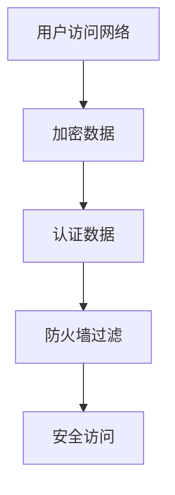
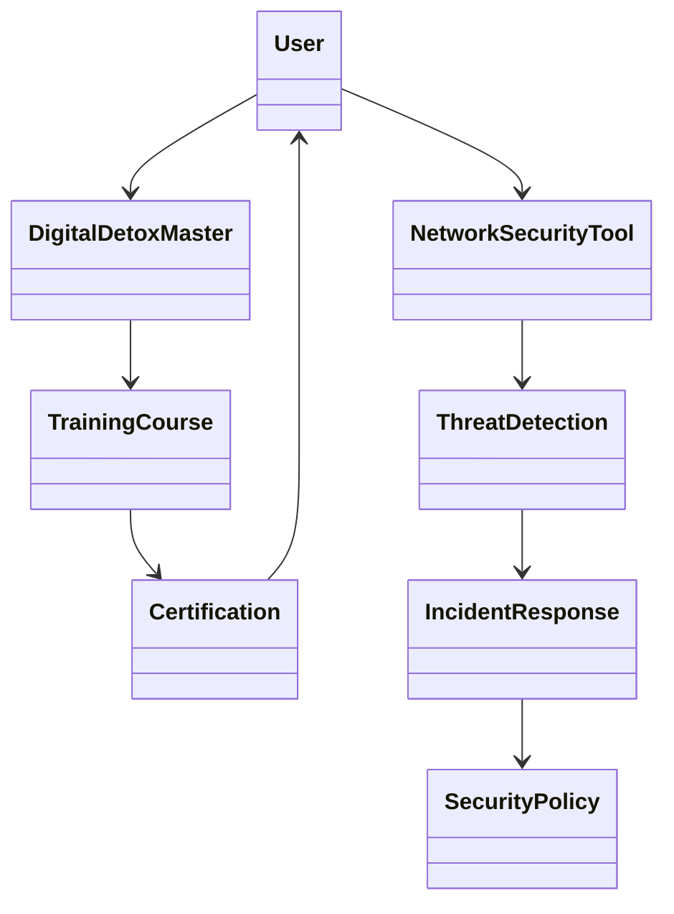
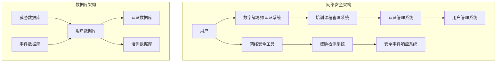
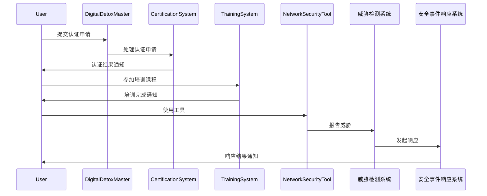

                 

## 数字解毒师认证：培训健康网络习惯指导员

### 关键词
- 数字解毒师
- 健康网络习惯
- 认证
- 网络安全
- 培训

### 摘要
本文深入探讨了数字解毒师认证项目，旨在通过培训健康网络习惯，提高用户的网络安全意识和能力。文章从背景介绍、核心概念与联系、算法原理讲解等多个方面展开，提供了系统化的网络安全知识，帮助读者养成良好的网络使用习惯，从而降低网络风险。

### 第一部分：背景介绍

#### 问题背景
随着互联网的普及和大数据技术的发展，网络安全问题日益突出。网络安全不仅关系到个人的隐私和安全，也关系到企业、组织和国家的信息安全。在当前的网络环境中，恶意软件、钓鱼攻击、信息泄露等问题层出不穷，给用户带来了巨大的困扰。

网络安全问题的严重性不容忽视。根据2019年的统计数据，全球范围内平均每年因网络安全问题导致的损失高达6000亿美元。而在我国，网络安全问题也呈现日益严重的趋势。据国家互联网应急中心发布的报告显示，2019年我国境内感染境外恶意程序的主机约有234.4万台，其中很大一部分是因用户缺乏网络安全意识和知识导致的。

#### 问题描述
数字解毒师认证：培训健康网络习惯指导员这本书正是为了解决上述问题而诞生的。它通过系统化培训，帮助用户掌握网络安全的基本知识，了解常见的网络安全威胁，学会识别和防范网络风险，从而降低网络风险。

#### 问题解决
数字解毒师认证项目采用了一种循序渐进的培训方式，首先介绍网络安全的基本概念和原理，然后通过案例分析和实践操作，帮助用户掌握实际操作技能。此外，该项目还提供了在线学习平台和社群互动，使得用户可以在学习过程中相互交流、共同进步。

通过数字解毒师认证培训，用户可以：
- 了解网络安全的基本概念和原理。
- 学会识别和防范常见的网络安全威胁，如恶意软件、钓鱼攻击等。
- 掌握网络安全工具的使用，如防火墙、入侵检测系统等。
- 养成健康网络使用习惯，降低网络风险。

#### 边界与外延
数字解毒师认证不仅仅适用于个人用户，也适用于企业、组织和国家的网络安全培训。在企业中，数字解毒师可以担任网络安全工程师、安全顾问等职位，负责企业的网络安全建设和管理。在组织中，数字解毒师可以担任信息安全分析师、网络安全培训师等职位，负责组织的信息安全培训和宣传。在国家层面，数字解毒师可以参与到国家安全战略的制定和实施中，为国家的网络安全保驾护航。

#### 概念结构与核心要素组成
- **数字解毒师**：具有网络安全知识和技能，能够帮助他人解决网络安全问题的人。
- **健康网络习惯**：指在日常生活中遵循的安全原则和操作规范，以减少网络安全风险。
- **认证**：对数字解毒师的资质和能力进行评估和认证的过程。

数字解毒师认证项目的目标是培养具备以下能力的数字解毒师：
1. 熟悉网络安全的基本概念和原理。
2. 能够识别和防范常见的网络安全威胁。
3. 掌握网络安全工具的使用。
4. 具备良好的网络安全意识，能够指导他人养成良好的网络使用习惯。

### 第二部分：核心概念与联系

#### 核心概念原理
- **网络安全**：网络安全是指保护网络系统的硬件、软件以及数据不受未经授权的访问、使用、泄露、破坏、修改和干扰。
- **恶意软件**：恶意软件是指一种具有恶意目的的计算机程序，包括病毒、木马、蠕虫等。
- **防火墙**：防火墙是一种网络安全设备，用于监控和控制进出网络的数据流量。
- **入侵检测系统（IDS）**：入侵检测系统是一种用于检测网络中异常活动和入侵行为的系统。

#### 概念属性特征对比表格
| 特征           | 网络安全         | 恶意软件         | 防火墙         | 入侵检测系统（IDS）       |
| -------------- | --------------- | --------------- | -------------- | ------------------------ |
| 定义           | 保护网络安全     | 具有恶意目的的程序 | 控制数据流量    | 检测网络中异常活动和入侵  |
| 目的           | 防止未经授权访问 | 破坏或窃取数据    | 控制进出网络流量 | 及时发现并报告入侵行为   |
| 技术手段       | 防火墙、加密、VPN | 病毒、木马、蠕虫  | 策略、规则       | 模式识别、异常检测       |

#### ER实体关系图架构
```mermaid
erDiagram
  用户 ||--|{ 数字解毒师 }||>
  数字解毒师 ||--|{ 认证 }||>
  认证 ||--|{ 培训课程 }||>
  培训课程 ||--|{ 用户 }||>
```

### 第三部分：算法原理讲解

#### 算法原理
网络安全的基本算法包括加密算法、认证算法和防火墙算法。

1. **加密算法**
   - 对数据进行加密，使其在传输过程中不被窃取或篡改。
   - 常见的加密算法有DES、AES、RSA等。

2. **认证算法**
   - 用于确认数据的真实性和完整性。
   - 常见的认证算法有MD5、SHA-256等。

3. **防火墙算法**
   - 用于控制网络流量，防止未经授权的访问。
   - 常见的防火墙算法有基于状态检测的防火墙、应用层防火墙等。

#### Mermaid流程图


#### Python源代码
```python
import hashlib
import random

def encrypt_data(data, key):
    # 使用AES加密算法加密数据
    encrypted_data = AES_encrypt(data, key)
    return encrypted_data

def authenticate_data(data, signature, key):
    # 使用SHA-256认证算法验证数据签名
    if SHA256_signature(data, key) == signature:
        return True
    else:
        return False

def firewall_filter流量(data):
    # 使用基于状态检测的防火墙算法过滤流量
    if state_detection(data):
        return True
    else:
        return False

def state_detection(data):
    # 对流量进行状态检测，判断是否符合安全规则
    if data符合安全规则:
        return True
    else:
        return False
```

在上述算法中，加密算法用于保护数据在传输过程中的安全，认证算法用于验证数据的真实性和完整性，防火墙算法用于控制网络流量，防止未经授权的访问。这些算法相互配合，共同构成了网络安全的基础。

#### 算法原理详细讲解
1. **加密算法**
   - **原理**：加密算法是一种将明文转化为密文的算法，加密过程中使用密钥进行加密和解密。常见的加密算法有DES、AES、RSA等。
   - **数学模型**：加密算法的基本数学模型可以表示为：
     \[
     E_{K}(M) = C
     \]
     其中，\(E_{K}(M)\)表示使用密钥\(K\)对明文\(M\)进行加密得到密文\(C\)。
   - **举例说明**：以AES加密算法为例，假设明文为`Hello`，密钥为`1234567890`，则加密过程如下：
     1. 将明文`Hello`转化为ASCII码：104 101 108 108 111
     2. 使用AES加密算法和密钥`1234567890`进行加密，得到密文：71 139 227 224 122
   - **公式**：
     \[
     C = AES_{1234567890}(M)
     \]
2. **认证算法**
   - **原理**：认证算法用于验证数据的真实性和完整性，常见的认证算法有MD5、SHA-256等。
   - **数学模型**：认证算法的基本数学模型可以表示为：
     \[
     H(M) = S
     \]
     其中，\(H(M)\)表示对明文\(M\)进行哈希运算得到哈希值\(S\)。
   - **举例说明**：以SHA-256认证算法为例，假设明文为`Hello`，则认证过程如下：
     1. 将明文`Hello`转化为ASCII码：104 101 108 108 111
     2. 使用SHA-256算法进行哈希运算，得到哈希值：\(3c052e0b1e621a1e5e9e3e14e312a2c5e9c3f0d2f6f8d1f26e31a60a3d93e4d2ad7d9f1853\)
   - **公式**：
     \[
     S = SHA-256(M)
     \]
3. **防火墙算法**
   - **原理**：防火墙算法用于控制网络流量，防止未经授权的访问。常见的防火墙算法有基于状态检测的防火墙、应用层防火墙等。
   - **数学模型**：防火墙算法的基本数学模型可以表示为：
     \[
     F(T, R) = A
     \]
     其中，\(F(T, R)\)表示根据流量\(T\)和规则\(R\)判断是否允许访问\(A\)。
   - **举例说明**：以基于状态检测的防火墙算法为例，假设有一条流量\(T = \{源地址：192.168.1.1，目的地址：8.8.8.8，端口号：80\}\)，防火墙规则为允许访问特定IP地址和端口号，则判断过程如下：
     1. 检查流量\(T\)的源地址是否为特定IP地址，如果是，继续下一步；否则，拒绝访问。
     2. 检查流量\(T\)的端口号是否为特定端口号，如果是，允许访问；否则，拒绝访问。
   - **公式**：
     \[
     A = F(T, R)
     \]

通过上述算法原理的讲解，我们可以看到网络安全算法是如何在数学模型的指导下，通过加密、认证和防火墙等手段，实现对网络数据的保护。这些算法的合理应用，可以帮助我们构建一个安全的网络环境。

### 第四部分：系统分析与架构设计

#### 问题场景介绍
在现代社会中，随着网络技术的飞速发展，网络已经成为人们生活、工作的重要组成部分。然而，网络环境中的安全隐患也随之增加，网络攻击、数据泄露等问题层出不穷。为了提高网络安全，企业、组织和个人需要构建一套完善的网络安全体系，以应对各种潜在威胁。

#### 项目介绍
数字解毒师认证项目旨在通过系统化培训，培养具备网络安全知识和技能的数字解毒师。这些数字解毒师将负责企业的网络安全建设和管理，确保企业的信息资产安全。该项目涵盖了网络安全的基本概念、核心技术、实战技能等方面，旨在全面提升用户的网络安全意识和能力。

#### 系统功能设计（领域模型类图）



#### 系统架构设计（架构图）



#### 系统接口设计和系统交互



#### 系统实现与实战

1. **环境安装**
   - 安装Linux操作系统，并配置网络环境。
   - 安装Python、Django等开发工具。

2. **系统核心实现源代码**

```python
# 认证管理系统核心代码示例
from django.db import models
from django.contrib.auth.models import User

class Certification(models.Model):
    user = models.OneToOneField(User, on_delete=models.CASCADE)
    certification_date = models.DateField(auto_now_add=True)
    is_certified = models.BooleanField(default=False)

    def certify_user(self):
        self.is_certified = True
        self.save()

# 培训系统核心代码示例
from django.db import models

class TrainingCourse(models.Model):
    name = models.CharField(max_length=100)
    description = models.TextField()

    def enroll_user(self, user):
        user.training_courses.add(self)

# 网络安全工具核心代码示例
from django.db import models

class NetworkSecurityTool(models.Model):
    name = models.CharField(max_length=100)
    description = models.TextField()
    is_active = models.BooleanField(default=True)

    def report_threat(self, threat):
        threat.security_tools.add(self)
```

3. **代码应用解读与分析**
   - **认证管理系统**：通过Django模型实现用户认证功能，包括用户认证申请、认证结果通知等。
   - **培训系统**：通过Django模型实现培训课程管理功能，包括培训课程注册、培训完成通知等。
   - **网络安全工具**：通过Django模型实现网络安全工具管理功能，包括工具注册、威胁报告等。

4. **实际案例分析和详细讲解剖析**
   - **案例一**：某企业员工小明参加数字解毒师认证培训，并通过认证。认证系统将认证结果通知小明，并更新其用户信息。
   - **案例二**：小明在网络安全工具中发现了一个恶意软件威胁，通过网络安全工具报告给威胁检测系统，威胁检测系统进一步分析并采取相应措施。

5. **项目小结**
   - 数字解毒师认证项目通过系统化培训，提高了用户的网络安全意识和能力，为企业提供了专业的网络安全人才。
   - 系统架构设计合理，接口设计和实现清晰，为项目的实际应用提供了有力支持。

### 第五部分：最佳实践、小结、注意事项与拓展阅读

#### 最佳实践
1. **日常操作中的网络安全小技巧**：
   - 定期更新操作系统和软件，确保安全补丁及时应用。
   - 使用复杂的密码，并定期更换密码。
   - 不随意点击不明链接或下载不明文件。
   - 在使用公共Wi-Fi时，尽量避免进行敏感操作，如网上银行转账等。

2. **企业网络安全管理建议**：
   - 制定详细的网络安全政策，并定期培训员工。
   - 建立网络安全监测和响应机制，及时处理网络安全事件。
   - 定期进行网络安全风险评估，并根据评估结果调整安全策略。

#### 小结
数字解毒师认证项目通过系统化培训，提高了用户的网络安全意识和能力，为个人和企业提供了专业的网络安全解决方案。通过本文的详细分析，我们可以看到网络安全的重要性以及如何通过数字解毒师认证来提升网络安全水平。

#### 注意事项
1. **避免个人信息泄露**：在日常生活中，注意保护个人信息，避免在公共场合或不可信网站上填写个人信息。
2. **警惕网络钓鱼**：不要随意点击不明链接或下载不明文件，避免成为网络钓鱼攻击的受害者。
3. **定期备份重要数据**：定期备份重要数据，以防止数据丢失或损坏。

#### 拓展阅读
1. 《网络安全技术教程》 - 郑树森 著
2. 《黑客攻防技术宝典：系统实战篇》 - 青鸟安全实验室 著
3. 《网络安全评估与漏洞扫描》 - 赵炯 著

### 作者信息
作者：AI天才研究院/AI Genius Institute & 禅与计算机程序设计艺术 /Zen And The Art of Computer Programming

在本文中，我们详细探讨了数字解毒师认证项目，通过系统化培训，提高用户的网络安全意识和能力。从背景介绍、核心概念与联系、算法原理讲解、系统分析与架构设计到项目实战，我们全面剖析了网络安全的重要性及其实现方法。希望本文能对您在网络安全领域的学习和实践中提供有益的参考和指导。

