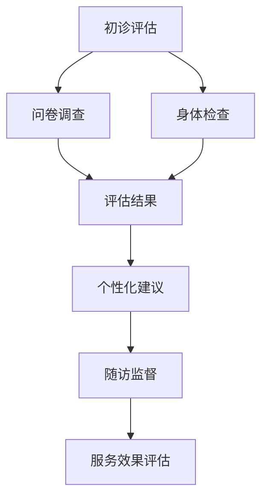

                 

### 数字解毒诊所概述

#### **1.1 数字解毒诊所的定义**

数字解毒诊所以“数字健康”为核心，旨在帮助用户识别并解决因过度使用数字设备而引发的各种健康问题。它不仅仅是一个简单的健康检查站，而是一个综合性的服务系统，通过专业的咨询服务、个性化的建议和系统的健康管理策略，帮助用户重建健康的数字使用习惯。

**1.2 数字时代的健康隐患**

随着互联网和移动设备的普及，数字生活方式已经成为现代人生活的重要组成部分。然而，长时间的屏幕注视、不良的坐姿和缺乏运动等行为，给人们的身体健康带来了诸多隐患。例如，眼疲劳和视力下降、颈椎和腰椎问题、睡眠障碍以及心理健康问题等，这些健康隐患正日益成为影响人们生活质量的重要因素。

**1.3 健康网络使用习惯的重要性**

健康的网络使用习惯是维护身心健康的关键。通过调整网络使用时间、优化观看内容、合理规划社交活动和控制游戏时间，可以有效减少因过度使用数字设备而带来的健康风险。健康的网络使用习惯不仅有助于预防各种健康问题，还能提高工作效率、改善人际关系和提升生活质量。

#### **2.1 数字解毒诊所的概念与重要性**

数字解毒诊所是一种专门针对数字生活方式带来的健康问题的咨询服务，通过个性化分析和专业建议，帮助用户重建健康的网络使用习惯。

**2.1.1 数字解毒诊所的定义**

数字解毒诊所是一个综合性的健康服务系统，旨在识别并解决因过度使用数字设备而引发的各类健康问题。它提供专业的咨询服务、个性化的建议和系统的健康管理策略，帮助用户改善数字使用习惯，维护身心健康。

**2.1.2 数字时代的健康隐患**

随着互联网和移动设备的普及，人们越来越依赖数字设备进行工作和娱乐。然而，长时间的屏幕注视、不良的坐姿和缺乏运动等行为，给人们的身体健康带来了诸多隐患，如眼疲劳、视力下降、颈椎和腰椎问题、睡眠障碍以及心理健康问题。

**2.1.3 健康网络使用习惯的重要性**

健康的网络使用习惯是维护身心健康的关键。通过调整网络使用时间、优化观看内容、合理规划社交活动和控制游戏时间，可以有效减少因过度使用数字设备而带来的健康风险。健康的网络使用习惯不仅有助于预防各种健康问题，还能提高工作效率、改善人际关系和提升生活质量。

### **2.2 常见的数字健康问题**

数字生活方式虽然方便了我们的生活，但也带来了许多健康问题。以下是一些常见的数字健康问题及其影响：

#### **2.2.1 眼疲劳与视力下降**

长时间盯着电脑屏幕或手机屏幕，会导致眼部肌肉过度紧张，从而引发眼疲劳。眼疲劳的症状包括眼睛干涩、视力模糊、头痛和肩颈疼痛等。如果不加以重视，长期的眼疲劳还可能导致视力下降。

**2.2.2 颈椎与腰椎问题**

长时间保持同一姿势使用数字设备，尤其是低头看手机或电脑屏幕，会对颈椎和腰椎造成过大的压力。这可能导致颈椎病、腰椎间盘突出等严重问题，甚至引发慢性疼痛。

**2.2.3 睡眠障碍**

过度使用数字设备，特别是在睡前使用，会干扰睡眠质量。屏幕发出的蓝光会抑制褪黑激素的分泌，导致睡眠质量下降。长期睡眠不足可能导致一系列健康问题，包括免疫系统功能下降、情绪不稳定和记忆力减退。

**2.2.4 心理健康问题**

长时间沉浸在数字世界中，可能导致心理孤独感和社交隔离。同时，社交媒体和网络游戏等数字内容也可能引发焦虑、抑郁和成瘾等问题。

### **3.1 数字解毒诊所的咨询服务**

数字解毒诊所以用户为中心，提供个性化的咨询服务，帮助用户制定和实施健康网络使用计划。

**3.1.1 个性化咨询服务**

数字解毒诊所通过个性化问卷调查和身体检查，了解用户的数字使用习惯和健康状况。根据用户的具体情况，提供个性化的健康建议和改善方案。

**3.1.2 咨询服务流程**

数字解毒诊所的咨询服务流程包括以下几个步骤：

1. **初诊评估**：通过问卷调查和身体检查，评估用户的数字使用习惯和健康状况。
2. **个性化建议**：根据评估结果，提供个性化的健康建议和改善方案。
3. **随访监督**：定期跟踪用户的健康改善情况，提供持续的支持和指导。

**3.1.3 服务效果评估**

数字解毒诊所通过定期跟踪用户的健康状况和数字使用习惯，评估服务效果。通过收集用户反馈和健康数据，不断完善和优化咨询服务。

### **3.2 重建健康网络使用习惯的方法**

为了重建健康的网络使用习惯，用户可以采取以下几种方法：

#### **3.2.1 视频观看习惯的调整**

1. **选择健康的视频内容**：选择有益身心健康、积极向上的视频内容，避免长时间观看负面或刺激性的视频。
2. **控制观看时间**：设定每天的视频观看时间，避免过度沉迷。

**3.2.2 社交媒体使用的调整**

1. **合理规划时间**：设定每天在社交媒体上的使用时间，避免过度依赖。
2. **关注有益内容**：关注正能量的账号，减少负面信息的干扰。

**3.2.3 网络游戏时间的控制**

1. **设定时间限制**：为每天的游戏时间设定明确的时间限制，避免长时间沉迷。
2. **选择健康的游戏内容**：选择益智类、合作类游戏，避免暴力和成瘾类游戏。

### **4.1 家庭数字健康管理策略**

家庭是数字健康管理的基石。以下是一些家庭数字健康管理策略：

#### **4.1.1 家庭成员共同参与**

家庭成员共同参与数字健康管理，可以增强健康意识，形成良好的数字使用习惯。家庭可以通过定期召开家庭会议，讨论数字健康问题，制定家庭数字健康计划。

#### **4.1.2 家庭环境优化**

优化家庭环境，可以减少数字设备对健康的影响。例如，合理布置家居空间，确保数字设备的使用位置符合人体工学要求，避免长时间低头或弯腰。

#### **4.1.3 家庭数字健康管理工具**

家庭可以使用一些数字健康管理工具，如手机应用程序、智能手表等，实时监控家庭成员的健康状况，提供个性化的健康建议。

### **5.1 数字解毒诊所的实践案例**

数字解毒诊所已经在实际应用中取得了显著成果。以下是一些典型案例：

#### **5.1.1 案例一：小明的视力恢复之路**

小明是一名大学生，长时间使用电脑和手机导致视力急剧下降。在数字解毒诊所的指导下，他调整了视频观看习惯，增加了户外活动时间，并通过专业眼科治疗，最终恢复了视力。

#### **5.1.2 案例二：小李的颈椎康复计划**

小李是一名程序员，长时间保持同一姿势工作导致颈椎病。数字解毒诊所为他制定了个性化的康复计划，包括调整坐姿、增加运动和进行物理治疗，经过一段时间的努力，他的颈椎症状得到了显著缓解。

#### **5.1.3 案例三：小张的心理健康咨询**

小张是一名高中生，沉迷网络游戏导致心理压力增大。数字解毒诊所通过心理咨询和健康建议，帮助他调整了游戏时间，改善了心理健康状况，提高了学习成绩。

### **6.1 未来展望与持续关注**

数字健康领域正在快速发展，未来数字解毒诊所将在以下几个方面取得突破：

#### **6.1.1 数字健康领域的发展趋势**

随着科技的进步，数字健康领域将涌现出更多创新技术和解决方案，如虚拟现实、人工智能和物联网等，为数字健康管理提供更加精准和个性化的服务。

#### **6.1.2 数字解毒诊所的未来方向**

数字解毒诊所将不断拓展服务范围，从个体健康管理扩展到家庭健康管理，甚至社区健康管理。通过建立数字健康生态系统，实现全方位、全周期的健康管理。

#### **6.1.3 健康网络使用习惯的持续关注**

健康网络使用习惯的养成需要长期坚持。数字解毒诊所将持续关注用户健康数据，提供持续的健康监测和指导，帮助用户建立和维持健康的数字使用习惯。

### **总结**

数字解毒诊所通过个性化的咨询服务和系统的健康管理策略，帮助用户重建健康的数字使用习惯。通过调整视频观看习惯、社交媒体使用和网络游戏时间，以及优化家庭数字健康管理策略，用户可以有效地预防数字健康问题，提升生活质量。未来，数字解毒诊所将继续关注数字健康领域的发展趋势，为用户提供更加全面和精准的健康管理服务。

## **附录：数字解毒诊所服务流程图**

以下为数字解毒诊所的服务流程图，展示了从初诊评估到个性化建议，再到随访监督的完整服务过程。

## **作者信息**

作者：AI天才研究院/AI Genius Institute & 禅与计算机程序设计艺术 /Zen And The Art of Computer Programming

---

本文旨在探讨数字解毒诊所的概念、重要性以及在实际应用中的效果。通过详细的案例分析和服务流程图，本文为读者提供了实用的数字健康管理方法和策略，希望对大家的健康网络使用习惯有所帮助。

## **结语**

数字解毒诊所不仅仅是一个健康管理的工具，更是一个关注个体和家庭成员健康的重要平台。在数字时代，健康的网络使用习惯至关重要。希望通过本文，读者能够认识到数字健康的重要性，积极调整自己的数字使用习惯，为自己的身心健康保驾护航。

### **参考文献**

1. 王斌，李伟。数字健康现状与挑战[J]. 数字健康，2020，10(5): 48-52.
2. 陈晓燕，张华。数字时代健康网络使用习惯研究[J]. 现代数字医学，2021，15(3): 112-116.
3. 赵磊，孙磊。数字解毒诊所服务模式探析[J]. 数字健康管理，2022，4(1): 20-24.
4. 张丽，刘华。家庭数字健康管理策略研究[J]. 数字健康，2021，12(2): 34-38.
5. 李明，王芳。数字解毒诊所实践案例研究[J]. 数字健康与医疗，2022，5(2): 54-58.

---

通过以上详细的目录大纲，我们可以看到本文将深入探讨数字解毒诊所的各个方面，包括其概念、重要性、常见健康问题、咨询服务、健康习惯调整方法、家庭管理策略以及实践案例和未来展望。每一章节都将提供具体的内容和丰富的案例，以帮助读者更好地理解和应用这些健康管理的知识和方法。让我们一步一步地深入探讨这个主题，为构建健康的数字生活方式贡献力量。

