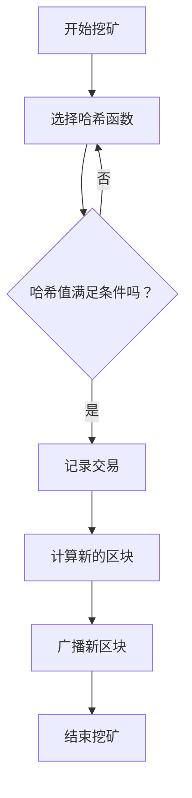
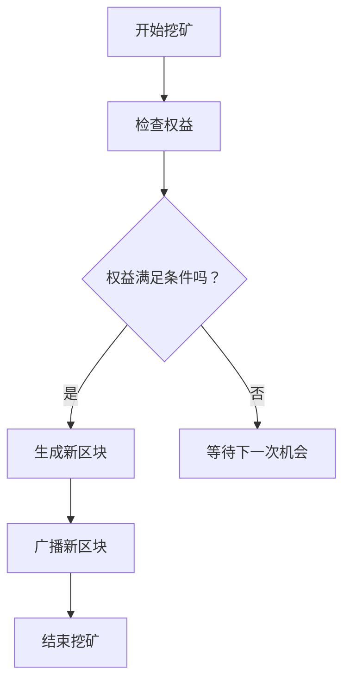
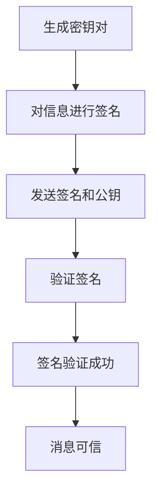
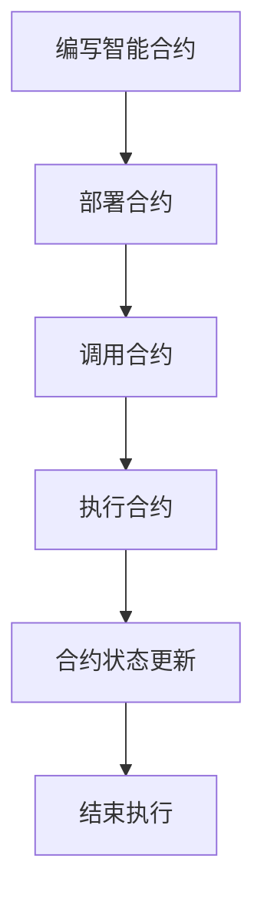

                 

## 数字货币的兴起：金融系统变革的机遇与挑战

### 关键词：数字货币、金融系统、变革、机遇、挑战

> 摘要：本文将探讨数字货币的兴起背景，深入解析其核心概念与联系，详细阐述数字货币在金融系统变革中的机遇与挑战。通过一步步的分析和推理，本文旨在为读者提供一个全面、深入的技术视角，以了解数字货币的重要性和未来发展趋势。

### 第一部分：数字货币的兴起背景

#### 第1章 数字货币的兴起背景

#### 1.1 问题背景

#### 1.1.1 传统货币系统的不足

在传统货币系统中，存在着诸多问题。首先，交易成本较高。传统货币交易通常需要经过银行、支付网关等多个中介机构，每个机构都要收取一定的手续费，这不仅增加了交易成本，也降低了交易效率。其次，跨国交易难度大。由于不同国家的货币政策和监管体系不同，跨国交易需要更多的手续和时间，严重影响了交易的便捷性。此外，货币供应不稳定也是一个问题。传统货币的发行通常由中央银行控制，其供应量可能受到政治、经济等多种因素的影响，导致货币价值的不稳定。

#### 1.1.2 数字货币的出现

数字货币作为一种全新的货币形式，旨在解决传统货币系统的不足。通过去中心化、加密技术等手段，数字货币为金融系统带来了变革的机遇。去中心化意味着数字货币的交易不需要依赖中介机构，直接在用户之间进行，大大降低了交易成本。加密技术则保证了交易的安全性和匿名性，使得交易更加便捷和可靠。

#### 1.2 问题描述

#### 1.2.1 数字货币的定义与特征

数字货币是一种基于加密技术的数字资产，具有去中心化、匿名性、安全性等特点。其如何定义和区分于传统货币，是理解数字货币的重要基础。数字货币通常通过区块链技术实现，其交易记录被分布式存储在多个节点上，无法篡改，保证了交易的安全性和透明性。同时，数字货币的交易是匿名的，用户的真实身份被加密保护，增加了交易的安全性和隐私性。

#### 1.2.2 数字货币的发展历程

数字货币的发展历程可谓跌宕起伏。最早的数字货币是比特币，于2009年诞生。比特币的出现引起了全球的关注，其去中心化和匿名性的特点使其成为许多人的首选货币。随后，众多其他数字货币如以太坊、瑞波币等相继出现，进一步丰富了数字货币的生态。然而，数字货币的发展并非一帆风顺，其价格波动、监管难题等问题也引发了诸多争议。

#### 1.3 问题解决

#### 1.3.1 数字货币的优势

数字货币在金融领域展示了诸多优势。首先，数字货币的交易成本较低，去中心化的特性使得交易过程更加简洁高效。其次，数字货币的交易效率较高，由于其交易记录是分布式存储的，可以实时更新，大大提高了交易的便捷性。此外，数字货币的安全性也较高，加密技术和分布式存储保证了交易的安全性，降低了交易风险。

#### 1.3.2 数字货币的挑战

尽管数字货币带来了诸多机遇，但同时也面临着一系列挑战。首先，监管难题是一个重要问题。由于数字货币的去中心化和匿名性，使得其监管变得更加复杂。如何制定有效的监管政策，确保数字货币的安全性和合法性，是一个亟待解决的问题。其次，数字货币的安全风险也较高。由于其交易记录是公开的，如果用户的信息被泄露，可能会对用户造成重大损失。此外，数字货币的法律问题也需要关注。由于数字货币的法律地位尚未明确，其交易和使用的法律风险较大。

#### 1.4 边界与外延

#### 1.4.1 数字货币的边界

数字货币作为一种货币形式，其应用范围和边界需要明确。目前，数字货币主要应用于金融领域，如支付、投资、跨境交易等。然而，随着技术的发展，数字货币的应用范围也在不断扩大，可能会逐渐渗透到其他领域。

#### 1.4.2 数字货币的外延

除了货币功能，数字货币在金融领域的应用范围也在不断扩大。例如，数字货币可以用于智能合约的执行，为金融交易提供更加便捷和可靠的解决方案。此外，数字货币还可以用于数字身份验证、数据存储等方面，为各个领域提供新的应用场景。

#### 1.5 本章小结

通过本章的介绍，我们对数字货币的兴起背景有了初步的了解。数字货币作为一种全新的货币形式，为金融系统带来了变革的机遇，同时也面临一系列挑战。在接下来的章节中，我们将进一步深入探讨数字货币的核心概念与联系，以期为读者提供一个全面、深入的技术视角。

### 第二部分：数字货币的核心概念与联系

#### 第2章 数字货币的核心概念与联系

#### 2.1 核心概念

#### 2.1.1 数字货币的定义

数字货币是一种基于加密算法的数字资产，具有去中心化、匿名性、安全性等特点。数字货币不依赖于任何中央机构，而是通过分布式网络进行交易和管理。数字货币的发行通常通过挖矿等机制实现，挖矿的过程不仅确保了数字货币的稀缺性，同时也保障了交易的安全性和透明性。

#### 2.1.2 区块链技术

区块链技术是数字货币的核心支撑技术。区块链是一个去中心化的分布式数据库，它通过加密算法和共识机制确保数据的完整性和安全性。在区块链上，每一笔交易都会被记录在一个区块中，多个区块通过加密方式连接在一起，形成了一条不可篡改的链。区块链技术的这一特性，使得数字货币的交易记录公开透明，同时也防止了双花攻击等安全问题。

#### 2.1.3 加密货币

加密货币是数字货币的一种，其价值由市场供需决定，具有高度波动性。比特币作为最早的加密货币，对数字货币的发展产生了深远影响。加密货币的特点在于去中心化、匿名性和安全性，这使得其在全球范围内获得了广泛的关注和应用。然而，由于价格波动较大，加密货币也面临着较大的市场风险。

#### 2.2 概念属性特征对比表格

#### 2.2.1 数字货币与传统货币对比

| 特征         | 数字货币       | 传统货币       |
| ------------ | -------------- | -------------- |
| 交易方式     | 去中心化       | 中心化         |
| 安全性       | 高             | 中等           |
| 交易成本     | 低             | 高             |
| 交易效率     | 高             | 低             |
| 跨境交易     | 简便           | 难             |

#### 2.2.2 区块链技术与传统数据库对比

| 特征         | 区块链技术       | 传统数据库       |
| ------------ | -------------- | -------------- |
| 数据结构     | 分布式账本       | 集中式数据库     |
| 数据安全性   | 高             | 中等           |
| 透明性       | 高             | 低             |
| 处理能力     | 高             | 低             |

#### 2.3 ER实体关系图架构

#### 2.3.1 数字货币系统ER图

```mermaid
erDiagram
  User ||--|{ Transaction }|
  Wallet ||--|{ Transaction }|
  Blockchain ||--|{ Block }|
  Block ||--|{ Transaction }|
```

在这个ER图中，用户（User）与交易（Transaction）之间存在一对多的关系，用户可以发起多个交易；钱包（Wallet）与交易（Transaction）之间也存在一对多的关系，用户可以通过钱包进行多个交易；区块链（Blockchain）与块（Block）之间存在一对多的关系，区块链由多个块组成；每个块（Block）包含多个交易（Transaction），形成了一个完整的交易记录。

#### 2.4 本章小结

通过本章的介绍，我们对数字货币的核心概念与联系有了深入的理解。数字货币作为一种去中心化的数字资产，通过区块链技术实现了安全、高效、透明的交易。在接下来的章节中，我们将进一步探讨数字货币的算法原理及其在实际应用中的表现。

### 第三部分：数字货币的算法原理

#### 第3章 数字货币的算法原理

#### 3.1 挖矿算法

挖矿是数字货币的核心机制之一，通过挖矿，新的数字货币被创建并奖励给矿工。挖矿算法主要包括工作量证明（Proof of Work，PoW）和权益证明（Proof of Stake，PoS）两种。

#### 3.1.1 工作量证明（PoW）

工作量证明是一种通过计算资源竞争权益的机制。在PoW机制中，矿工需要通过解决一个数学难题来获取记账权，这个难题通常是一个哈希函数的计算。矿工需要在短时间内找到满足特定条件的哈希值，该哈希值需要满足一定的难度要求。这个过程被称为“挖矿”。

#### 挖矿算法流程图



#### 3.1.2 权益证明（PoS）

权益证明是一种基于持有权益的挖矿机制，与工作量证明不同，PoS不需要通过计算资源来竞争权益，而是通过持有数字货币的数量和时间来决定。在PoS机制中，持有数字货币的矿工有机会生成新的区块，持有数量越多、时间越长，挖矿的概率越大。

#### 权益证明算法流程图



#### 3.2 数字签名算法

数字签名是一种用于验证数字信息的方法，通过加密算法，发送者可以对信息进行签名，接收者可以验证签名的正确性。数字签名不仅确保了信息的完整性，同时也保证了发送者的身份认证。

#### 数字签名算法流程图



#### 3.3 智能合约算法

智能合约是一种在区块链上执行的自动化合约，通过编程语言编写，其执行过程由区块链网络验证。智能合约使得数字货币的交易和管理变得更加灵活和高效。

#### 智能合约算法流程图



#### 3.4 本章小结

通过本章的介绍，我们对数字货币的算法原理有了深入的了解。挖矿算法、数字签名算法和智能合约算法构成了数字货币的核心技术，使得数字货币在安全、高效、透明等方面具有显著优势。在接下来的章节中，我们将进一步探讨数字货币在金融系统变革中的应用与实践。

### 第四部分：数字货币在金融系统变革中的应用与实践

#### 第4章 数字货币在金融系统变革中的应用与实践

#### 4.1 支付系统的变革

数字货币在支付系统中具有重要的应用价值。与传统支付系统相比，数字货币具有交易成本低、交易速度快、跨境交易便捷等优点。通过数字货币，用户可以直接进行点对点的支付，无需依赖银行或其他中介机构，大大提高了支付效率和用户体验。

#### 4.1.1 数字货币支付系统架构

数字货币支付系统的架构主要包括用户、数字钱包、区块链和支付网关等组成部分。

- **用户**：用户是支付系统的参与方，可以通过数字钱包管理自己的数字货币。
- **数字钱包**：数字钱包是一种用于存储、管理和发送数字货币的工具，类似于传统银行账户。用户可以通过数字钱包进行数字货币的支付、接收和存储。
- **区块链**：区块链是数字货币支付系统的基础，用于记录所有的交易信息。区块链的分布式和不可篡改性保证了支付系统的安全和透明。
- **支付网关**：支付网关是连接数字货币支付系统和传统金融系统的桥梁，用于处理跨境交易和与银行系统的对接。

#### 4.1.2 数字货币支付流程

数字货币支付的基本流程如下：

1. **用户发送支付请求**：用户通过数字钱包发起支付请求，指定支付金额和接收方的地址。
2. **数字钱包验证支付请求**：数字钱包验证支付请求的合法性，确保用户有足够的数字货币进行支付。
3. **区块链记录交易**：数字钱包将支付请求发送到区块链网络，区块链记录交易信息并生成交易哈希值。
4. **矿工验证交易**：矿工接收并验证交易信息，将其包含在新的区块中，并广播给其他节点。
5. **接收方确认交易**：接收方通过数字钱包接收并确认交易信息，完成支付过程。

#### 4.2 投资与交易市场的变革

数字货币为投资和交易市场带来了新的机遇和挑战。通过数字货币，投资者可以更加灵活地进行跨境投资和交易，降低交易成本，提高交易效率。

#### 4.2.1 数字货币投资市场

数字货币投资市场包括比特币、以太坊等多种加密货币。投资者可以通过数字交易所进行买卖，交易所提供了多种交易对和交易工具，使得投资更加灵活。

#### 4.2.2 数字货币交易策略

数字货币交易策略包括基本面分析、技术分析、量化交易等多种方法。基本面分析关注数字货币的供求关系、政策环境等因素；技术分析则通过价格走势和交易量等数据进行分析；量化交易则通过数学模型和算法进行交易决策。

#### 4.3 跨境交易的便利性

数字货币的跨境交易具有显著的优势，通过数字货币，用户可以轻松实现跨国支付和转账，无需依赖传统的外汇系统和银行中介。

#### 4.3.1 数字货币跨境交易流程

数字货币跨境交易的基本流程如下：

1. **用户发送跨境支付请求**：用户通过数字钱包发起跨境支付请求，指定支付金额和接收方的地址。
2. **数字钱包验证支付请求**：数字钱包验证支付请求的合法性，确保用户有足够的数字货币进行支付。
3. **区块链记录交易**：数字钱包将支付请求发送到区块链网络，区块链记录交易信息并生成交易哈希值。
4. **矿工验证交易**：矿工接收并验证交易信息，将其包含在新的区块中，并广播给其他节点。
5. **接收方确认交易**：接收方通过数字钱包接收并确认交易信息，完成跨境支付。

#### 4.4 本章小结

通过本章的介绍，我们对数字货币在金融系统变革中的应用与实践有了全面的了解。数字货币在支付系统、投资市场、跨境交易等方面展示了巨大的潜力，为金融系统的变革带来了新的机遇。在接下来的章节中，我们将进一步探讨数字货币面临的监管挑战和未来发展趋势。

### 第五部分：数字货币的监管挑战与未来发展趋势

#### 第5章 数字货币的监管挑战与未来发展趋势

#### 5.1 监管挑战

数字货币的监管挑战主要源于其去中心化、匿名性和跨境交易等特点。传统金融体系的监管框架无法完全适用于数字货币领域，导致监管难度增加。

#### 5.1.1 隐私保护与反洗钱

数字货币的匿名性为非法活动提供了便利，如洗钱、恐怖主义融资等。监管机构需要在保护用户隐私和打击非法活动之间找到平衡。

#### 5.1.2 法律地位与税收问题

数字货币的法律地位尚未明确，不同国家对数字货币的监管政策也有所不同。如何制定统一的法律法规，以及如何对数字货币交易进行税务管理，是亟待解决的问题。

#### 5.2 未来发展趋势

尽管面临诸多监管挑战，但数字货币的发展趋势依然强劲。未来，数字货币将在金融科技、支付系统、跨境交易等领域发挥重要作用。

#### 5.2.1 金融科技应用

数字货币将为金融科技提供新的基础设施，如区块链技术、智能合约等。这些技术将提高金融服务的效率和安全性，推动金融行业的创新和发展。

#### 5.2.2 支付系统的变革

随着数字货币的普及，支付系统将更加高效和便捷。跨境支付和转账将更加快速，手续费也将大幅降低，为全球消费者和企业提供更好的支付体验。

#### 5.2.3 跨境交易的便利性

数字货币将极大地提高跨境交易的便利性，减少交易成本和时间。各国政府和金融机构正在积极探索数字货币在跨境交易中的应用，以推动国际贸易的发展。

#### 5.3 本章小结

通过本章的介绍，我们对数字货币的监管挑战和未来发展趋势有了更深的理解。数字货币的发展既面临着诸多挑战，也拥有广阔的前景。在监管政策逐步完善的过程中，数字货币将继续发挥其在金融系统变革中的重要作用。

### 总结

#### 数字货币：金融系统变革的引擎

数字货币的兴起为金融系统带来了深刻的变革。通过去中心化、匿名性和安全性的技术特点，数字货币在支付系统、投资市场、跨境交易等方面展示了巨大的潜力。尽管面临监管挑战，但数字货币的发展趋势不可阻挡。未来，数字货币将继续推动金融科技的创新和发展，为全球消费者和企业提供更加高效、便捷和安全的金融服务。

### 作者信息

作者：AI天才研究院/AI Genius Institute & 禅与计算机程序设计艺术 /Zen And The Art of Computer Programming

