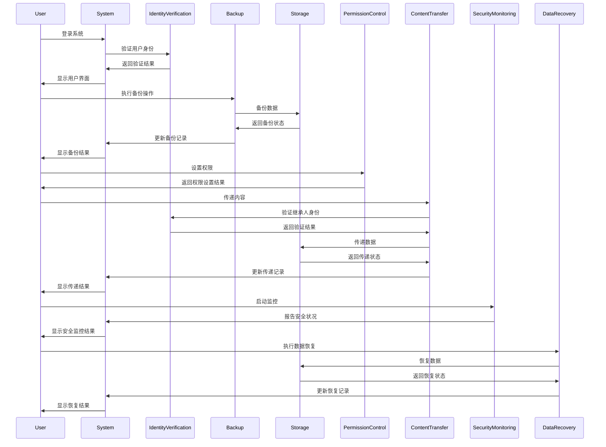
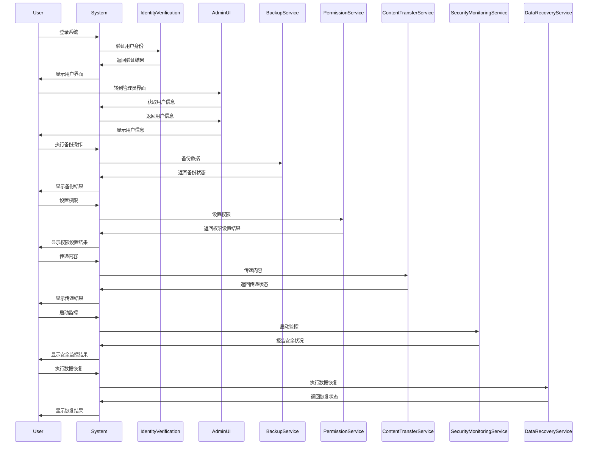
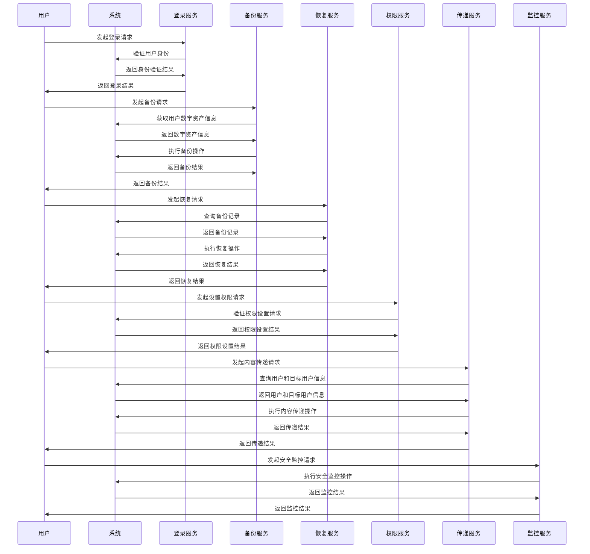

                 


### 第1章：数字遗产的概念与现状

#### 1.1 数字遗产的定义

数字遗产，顾名思义，指的是个人在数字世界中留下的财产和资料。这些资料包括但不限于电子文档、社交媒体账号、电子邮件、照片、视频、游戏账号、虚拟货币等。与传统遗产不同，数字遗产是伴随着数字技术的发展而产生的新兴概念，具有无形、分散和易丢失的特点。

数字遗产不仅仅是简单的电子文件，它承载着个人的记忆、情感和社会关系。例如，一位去世的博主留下的博客文章和评论，不仅是一种文本资料，更是一种文化和社会价值的体现。因此，数字遗产的管理与传承具有重要的现实意义。

#### 1.2 数字遗产的类型

数字遗产可以按照不同的维度进行分类：

- **按存储介质分类**：包括云存储中的数据、个人电脑中的文件、移动设备中的内容等。
- **按内容类型分类**：如文档、图片、视频、音频、游戏账号、社交媒体账号、虚拟货币等。
- **按所有权分类**：私有数字遗产、公有数字遗产和公共数字遗产。

每种类型的数字遗产都有其独特的管理和传承需求，因此在数字遗产管理服务中，需要针对不同类型的遗产采取不同的处理方式。

#### 1.3 数字遗产的现状与挑战

随着互联网和数字技术的快速发展，数字遗产的数量和质量都在不断增加。据统计，全球每年产生的数字内容高达数百万TB，而这些内容大多以数字形式存储在服务器、云平台和个人设备中。然而，数字遗产的现状也面临着诸多挑战：

- **隐私保护**：数字遗产中的个人信息和隐私数据如何得到有效保护，防止被滥用或泄露，是一个亟待解决的问题。
- **安全性**：如何确保数字遗产的安全性，防止数据丢失或被恶意攻击，也是数字遗产管理面临的重要问题。
- **法律与法规**：现有的法律和法规体系如何适应数字遗产的特点，制定出有效的管理和服务规范。
- **技术兼容性**：随着技术的不断进步，未来的数字遗产如何保持其可访问性和可读性，避免因技术升级而导致的遗产丢失。

### 1.4 问题背景

随着数字化生活方式的普及，人们越来越依赖数字设备和服务，如社交媒体、电子邮件、在线购物、云计算等。这些设备和服务中存储了大量的个人信息和财产数据。然而，当个人去世后，这些数字资产往往无人管理，成为“数字孤儿”。这不仅给家属带来了困扰，也可能导致重要的数字内容永久丢失。

例如，一位爱好摄影的艺术家去世后，其电脑中保存的大量照片和视频资料可能因为缺乏有效的管理而无法传递给家人，这不仅是对个人创作的尊重问题，更是对文化传承的一种损失。

#### 1.5 问题描述

数字遗产管理服务旨在为个人提供一套系统化的管理方案，以确保数字遗产能够在去世后得到妥善处理和传承。具体问题描述如下：

- **用户需求**：用户希望在自己去世后，其数字遗产能够被自动备份、安全存储，并按照其生前意愿进行传递和管理。
- **系统功能**：数字遗产管理服务需要具备数据备份、身份验证、权限设置、内容传递等功能。
- **技术挑战**：如何确保数据的安全性和隐私保护，如何在技术不断更新的环境中保证数字遗产的可访问性，以及如何制定合理的法律框架和规范。

### 1.6 问题解决

为了解决上述问题，数字遗产管理服务需要从以下几个方面进行设计和实施：

- **数据备份与恢复**：通过自动化备份技术，定期将用户的数字资产备份到安全存储设施中，确保数据不会因为设备损坏或丢失而丢失。
- **身份验证与权限控制**：采用多因素身份验证技术，确保只有合法继承人能够访问和处理数字遗产。同时，设置权限控制机制，根据继承人的身份和需求，灵活调整对数字遗产的访问权限。
- **内容传递与管理**：制定详细的内容传递计划，根据用户生前的意愿，将数字遗产传递给指定的继承人。在传递过程中，确保内容的安全性和隐私性。
- **法律框架与规范**：与法律专家合作，制定符合数字遗产特点的法律法规，明确数字遗产的管理和服务规范，为用户提供法律保障。

### 1.7 边界与外延

数字遗产管理服务的边界主要在于如何处理和保护用户的数字资产，其外延则涉及到数据备份、身份验证、权限控制、法律规范等多个方面。以下是对数字遗产管理服务边界和外延的详细描述：

- **边界**：
  - **服务对象**：服务对象主要是个人用户，尤其是那些拥有大量数字资产且关心数字遗产传承的人。
  - **服务范围**：服务范围包括数字资产备份、身份验证、权限控制、内容传递等，但不包括物理资产的传承。
  - **服务目标**：服务的目标是确保用户的数字遗产在去世后能够得到妥善处理和传承，保护数据安全和隐私。

- **外延**：
  - **技术支持**：需要采用多种技术手段，如加密技术、分布式存储、区块链技术等，以确保数据的安全性和隐私保护。
  - **法律保障**：需要与法律专家合作，制定符合数字遗产特点的法律法规，为用户提供法律保障。
  - **用户需求**：需要深入了解用户的需求，提供定制化的服务，以满足不同用户的需求。

通过上述分析，我们可以看到数字遗产管理服务不仅是一个技术问题，更是一个涉及法律、社会伦理等多个方面的问题。因此，在设计和实施数字遗产管理服务时，需要综合考虑各种因素，确保服务的全面性和有效性。

### 1.8 概念结构与核心要素组成

数字遗产管理服务涉及多个核心概念和要素，这些概念和要素共同构成了一个完整的管理体系。以下是对这些核心概念及其组成要素的详细分析：

1. **数字遗产**：
   - **定义**：指个人在数字世界中留下的各种财产和资料，如电子文档、社交媒体账号、电子邮件、照片、视频、游戏账号、虚拟货币等。
   - **要素**：包括数字资产的内容、类型、所有权和存储位置等。

2. **数字资产**：
   - **定义**：数字遗产中的具体财产，如文档、图片、视频、音频、游戏账号、社交媒体账号、虚拟货币等。
   - **要素**：包括资产的内容、所有者、权限和使用情况等。

3. **备份与恢复**：
   - **定义**：通过技术手段定期将数字资产备份到安全存储设施中，确保数据不会因为设备损坏或丢失而丢失。
   - **要素**：备份策略、备份频率、备份存储介质、恢复流程等。

4. **身份验证**：
   - **定义**：确认用户身份的过程，确保只有合法继承人能够访问和处理数字遗产。
   - **要素**：用户身份信息、认证方法（如密码、生物识别、多因素认证等）、认证流程等。

5. **权限控制**：
   - **定义**：根据继承人的身份和需求，设置对数字遗产的访问权限。
   - **要素**：权限级别、访问控制策略、权限变更流程等。

6. **内容传递**：
   - **定义**：按照用户生前的意愿，将数字遗产传递给指定的继承人。
   - **要素**：传递计划、传递方式、传递流程等。

7. **法律与规范**：
   - **定义**：制定符合数字遗产特点的法律法规，为用户提供法律保障。
   - **要素**：法律法规、规范文件、法律咨询等。

通过这些核心概念和要素的分析，我们可以更好地理解数字遗产管理服务的整体框架和功能，从而为其设计和实施提供有力支持。

### 第2章：数字遗产管理的意义与重要性

#### 2.1 数字遗产管理的定义

数字遗产管理是指通过对个人数字资产的备份、保护、传递和利用，确保这些资产在用户去世后能够得到妥善处理和传承的一系列活动和措施。数字遗产管理不仅涉及技术层面，还包括法律、伦理等多个方面。

#### 2.2 数字遗产管理的重要性

数字遗产管理的重要性可以从以下几个方面进行阐述：

1. **文化传承**：数字遗产中包含了个人的创作和记忆，是文化传承的重要组成部分。通过有效的数字遗产管理，可以确保这些宝贵的文化财富能够传递给后代。

2. **隐私保护**：数字遗产中往往包含大量的个人信息和隐私数据。如果不进行有效管理，这些数据可能会被滥用或泄露，对个人和社会造成严重危害。

3. **财产权益**：数字遗产也是个人财产的一部分。通过数字遗产管理，可以确保继承人在法律上获得应有的财产权益，避免财产纠纷。

4. **社会和谐**：有效的数字遗产管理可以减少因数字遗产处理不当而引发的纠纷和矛盾，促进社会和谐。

5. **经济发展**：数字遗产的管理和传承还可以为相关产业带来新的经济增长点，如数字资产评估、数字遗产法律服务、数字资产交易平台等。

#### 2.3 数字遗产管理面临的挑战

尽管数字遗产管理具有重要意义，但实际操作中也面临诸多挑战：

1. **技术挑战**：随着技术的快速发展，如何保证数字遗产的可访问性和可读性，避免因技术升级而导致的遗产丢失，是一个重要的技术问题。

2. **隐私与安全**：数字遗产中包含大量敏感信息，如何确保这些信息在传输和存储过程中的安全，防止被恶意攻击或泄露，是数字遗产管理面临的重要挑战。

3. **法律与法规**：现有法律和法规体系尚未完全适应数字遗产的特点，如何制定有效的管理和服务规范，是数字遗产管理面临的重要问题。

4. **用户认知**：许多人对数字遗产管理的认知不足，缺乏有效的管理和传承意识，这也是数字遗产管理面临的一大挑战。

#### 2.4 数字遗产管理的现状

目前，数字遗产管理在全球范围内尚处于起步阶段。虽然一些国家已经开始探讨和研究数字遗产管理的问题，但具体实施和服务体系仍然不够完善。

1. **技术层面**：一些科技公司已经开始提供数字遗产管理服务，如自动备份、数据加密、多因素身份验证等。但这些服务的普及率和用户接受度还有待提高。

2. **法律层面**：许多国家尚未制定专门的数字遗产管理法律，现有的法律和法规也难以完全适应数字遗产的特点。因此，法律框架和规范的完善是数字遗产管理的重要任务。

3. **用户层面**：大多数人对数字遗产管理的认知和意识不足，许多人在去世后，其数字遗产无人管理，成为“数字孤儿”。

#### 2.5 数字遗产管理的未来发展趋势

随着数字技术的不断进步和人们对数字遗产管理的需求日益增加，数字遗产管理有望在未来取得以下发展趋势：

1. **技术进步**：随着区块链、人工智能、物联网等新技术的应用，数字遗产管理的安全性、可靠性和便捷性将得到大幅提升。

2. **法律完善**：各国政府和企业将加强数字遗产管理法律和规范的建设，为数字遗产管理提供法律保障。

3. **服务普及**：随着数字遗产管理服务的不断完善，其普及率和用户接受度将逐步提高，更多的用户将开始关注和重视数字遗产管理。

4. **产业升级**：数字遗产管理将带动相关产业的发展，如数字资产评估、数字遗产法律服务、数字资产交易平台等，为经济发展提供新的动力。

### 第3章：虚拟资产概述

#### 3.1 虚拟资产的定义

虚拟资产是指在数字世界中存在的、具有经济价值的财产，它包括了各种形式的数字资源。虚拟资产不仅限于虚拟货币，还包括电子游戏中的虚拟物品、社交媒体账号、在线购物平台的账户余额等。随着互联网和数字技术的发展，虚拟资产已成为个人和企业在数字领域的重要财产。

#### 3.2 虚拟资产的分类

虚拟资产可以根据不同的标准进行分类，以下是一些常见的分类方法：

- **按类型分类**：
  - **虚拟货币**：如比特币、以太坊等加密货币。
  - **虚拟物品**：如电子游戏中的装备、虚拟现实环境中的装饰品。
  - **数字账户**：如社交媒体账号、在线购物平台的账户、电子邮件账户等。
  - **数字服务**：如订阅服务、在线教育课程等。

- **按来源分类**：
  - **原生虚拟资产**：由特定的数字平台或游戏创造和发行的虚拟资产。
  - **衍生虚拟资产**：通过用户活动或市场交易获得的虚拟资产。

- **按经济价值分类**：
  - **高价值虚拟资产**：如加密货币、高端电子游戏装备等。
  - **低价值虚拟资产**：如普通电子游戏物品、小型社交媒体账号等。

#### 3.3 虚拟资产的价值评估方法

虚拟资产的价值评估是一个复杂的过程，不同类型的虚拟资产有不同的评估方法：

- **市场比较法**：通过比较类似虚拟资产的市场交易价格来估算价值。
- **收益法**：根据虚拟资产能够带来的未来收益来评估其价值。
- **成本法**：基于创建或获得虚拟资产的成本来评估其价值。

对于虚拟货币等高流动性资产，市场比较法较为常用；而对于电子游戏装备等低流动性资产，收益法可能更为适用。在实际操作中，通常需要结合多种评估方法，以获得更准确的价值评估结果。

#### 3.4 虚拟资产的价值评估示例

以下是一个简单的虚拟资产价值评估示例：

- **案例**：一位电子游戏玩家拥有一件高级装备，该装备在游戏内的市场价格为1000虚拟货币。
- **评估方法**：采用市场比较法，通过查阅游戏市场交易平台上的交易记录，找到类似装备的平均交易价格。
- **评估结果**：假设类似装备的平均交易价格为800虚拟货币，则该玩家拥有的高级装备评估价值为800虚拟货币。

需要注意的是，虚拟资产的价值评估是一个动态的过程，会随着市场条件的变化而变化。因此，定期进行价值评估和调整是必要的。

### 第4章：数字遗产管理服务

#### 4.1 数字遗产管理服务的功能

数字遗产管理服务旨在为用户提供全面、安全、便捷的数字资产管理和传承服务。其主要功能包括以下几个方面：

1. **数据备份**：定期备份用户的数字资产，包括文档、图片、视频、电子邮件等，确保数据不会因为设备损坏、丢失或人为失误而丢失。

2. **身份验证**：在用户去世后，通过多因素身份验证确保只有合法继承人能够访问和管理数字遗产。

3. **权限设置**：根据继承人的身份和需求，设置不同的权限级别，确保数字遗产的安全性和私密性。

4. **内容传递**：按照用户生前的意愿，将数字遗产传递给指定的继承人，包括虚拟货币、社交媒体账号、电子邮件等。

5. **法律支持**：提供法律咨询和帮助，确保数字遗产管理符合相关法律法规，为用户提供法律保障。

6. **安全监控**：实时监控数字遗产的安全状况，及时发现和处理潜在的安全威胁。

7. **数据恢复**：在发生数据丢失或损坏时，通过数据恢复技术尽可能恢复用户的数字资产。

#### 4.2 数字遗产管理服务的框架

数字遗产管理服务的框架包括以下几个方面：

1. **用户注册与登录**：用户在数字遗产管理平台上注册账号，并设置登录密码或多因素身份验证。

2. **数字资产导入**：用户将数字资产导入平台，包括文档、图片、视频、电子邮件等。

3. **数据备份与恢复**：平台定期备份用户的数字资产，并提供数据恢复功能。

4. **身份验证与权限设置**：平台提供多因素身份验证，确保只有合法继承人能够访问和管理数字遗产。用户可以设置不同权限级别，确保数字遗产的安全性和私密性。

5. **内容传递与监控**：平台根据用户生前的意愿，将数字遗产传递给指定的继承人，并实时监控数字遗产的安全状况。

6. **法律支持与服务**：平台提供法律咨询和帮助，确保数字遗产管理符合相关法律法规。

#### 4.3 数字遗产管理服务的流程

数字遗产管理服务的流程可以分为以下几个步骤：

1. **用户注册**：用户在数字遗产管理平台上注册账号，并设置登录密码或多因素身份验证。

2. **数字资产导入**：用户将数字资产导入平台，包括文档、图片、视频、电子邮件等。

3. **身份验证**：在用户去世后，平台通过多因素身份验证确保只有合法继承人能够访问和管理数字遗产。

4. **权限设置**：用户可以根据继承人的身份和需求，设置不同的权限级别，确保数字遗产的安全性和私密性。

5. **内容传递**：平台按照用户生前的意愿，将数字遗产传递给指定的继承人。

6. **安全监控与数据恢复**：平台实时监控数字遗产的安全状况，并在发生数据丢失或损坏时，通过数据恢复技术尽可能恢复用户的数字资产。

7. **法律支持**：平台提供法律咨询和帮助，确保数字遗产管理符合相关法律法规。

通过以上功能、框架和流程的介绍，我们可以看到数字遗产管理服务在保障用户数字资产安全和传承方面的重要性。随着数字技术的发展和人们对数字资产重视程度的提高，数字遗产管理服务的需求也将不断增加，成为未来数字生活的重要组成部分。

### 第5章：数字遗产管理中的关键技术

#### 5.1 数据加密技术

数据加密技术是数字遗产管理中至关重要的技术之一，它通过将数据转换为只有授权用户才能解读的密文，从而保护数据的隐私和完整性。以下是一些常用的数据加密技术：

- **对称加密**：对称加密使用相同的密钥进行加密和解密，如AES（Advanced Encryption Standard，高级加密标准）。其优点是加密和解密速度快，但缺点是密钥管理复杂，难以在多用户环境中应用。
- **非对称加密**：非对称加密使用一对密钥，即公钥和私钥，公钥用于加密，私钥用于解密，如RSA（Rivest-Shamir-Adleman，RSA算法）。其优点是密钥管理简单，但加密和解密速度相对较慢。
- **混合加密**：混合加密结合了对称加密和非对称加密的优点，先使用对称加密算法加密数据，再用非对称加密算法加密对称加密的密钥，从而实现高效且安全的加密过程。

在数字遗产管理中，数据加密技术主要用于以下几个方面：

1. **数据传输加密**：在数字资产传输过程中，使用加密技术确保数据在传输过程中不被窃取或篡改。
2. **数据存储加密**：在数字资产存储于云平台或其他存储设备时，使用加密技术确保数据在存储过程中不被未授权访问。
3. **密钥管理**：建立完善的密钥管理系统，确保密钥的安全存储和分发，避免密钥泄露导致数据安全风险。

#### 5.2 身份认证技术

身份认证技术用于确认用户身份，确保只有授权用户才能访问和管理数字遗产。以下是一些常见的身份认证技术：

- **密码认证**：用户通过输入预先设定的密码进行身份验证，是最常见的身份认证方式。优点是简单易用，缺点是安全性较低，易被破解。
- **多因素认证**：多因素认证结合了多种身份验证手段，如密码、手机验证码、生物识别等，从而提高认证的安全性。常见的多因素认证包括二次密码验证、指纹识别、面部识别等。
- **数字证书**：数字证书是由权威机构签发的电子证书，用于验证用户的身份。数字证书使用非对称加密技术，确保认证过程的安全性和可信性。

在数字遗产管理中，身份认证技术主要用于以下几个方面：

1. **用户登录认证**：用户在访问数字遗产管理平台时，需要通过身份认证技术验证身份。
2. **继承人认证**：在用户去世后，需要通过身份认证技术确保只有合法继承人能够访问和管理数字遗产。
3. **权限管理**：根据继承人的身份和权限，使用身份认证技术确保继承人只能访问其有权访问的数字资产。

#### 5.3 权限控制技术

权限控制技术用于设置和调整用户对数字遗产的访问权限，确保数字遗产的安全性和隐私性。以下是一些常见的权限控制技术：

- **访问控制列表（ACL）**：访问控制列表是一种基于用户身份和权限的访问控制机制，用于控制用户对数字资产的访问。ACL将用户和权限相关联，定义用户对数字资产的访问权限。
- **角色权限控制**：角色权限控制将用户划分为不同的角色，每个角色拥有特定的权限。用户通过扮演相应的角色，获得相应的访问权限。
- **策略管理系统**：策略管理系统用于定义和管理权限策略，包括权限级别、权限范围、权限变更等。策略管理系统可以根据用户身份、角色和业务需求动态调整权限。

在数字遗产管理中，权限控制技术主要用于以下几个方面：

1. **数字资产访问控制**：根据继承人的身份和权限，设置对数字资产的访问控制，确保继承人只能访问其有权访问的数字资产。
2. **权限变更管理**：在数字遗产管理过程中，根据继承人的需求和业务变化，动态调整权限设置，确保数字遗产的安全性和灵活性。
3. **审计与监控**：对权限变更和数字资产访问进行审计和监控，确保权限管理的合规性和安全性。

通过上述数据加密技术、身份认证技术和权限控制技术的详细介绍，我们可以看到这些关键技术如何为数字遗产管理提供安全保障，确保数字遗产在用户去世后能够得到妥善处理和传承。

### 第6章：数字遗产管理的数学模型

#### 6.1 数据安全传输模型

数据安全传输模型是数字遗产管理中至关重要的一环，其目的是确保数据在传输过程中不被窃取、篡改或泄露。以下是一个简单的数据安全传输模型及其数学表达：

- **加密算法**：选择合适的加密算法（如AES），使用密钥对数据进行加密。
- **哈希函数**：使用哈希函数（如SHA-256）对数据进行哈希处理，生成数据指纹。
- **数字签名**：使用私钥对数据签名，确保数据的完整性和真实性。

数学表达式如下：

\[ E_{k}(D) = C \]

其中，\( E_{k} \) 表示加密算法，\( D \) 表示数据，\( C \) 表示加密后的数据。

\[ H(D) = F \]

其中，\( H \) 表示哈希函数，\( D \) 表示数据，\( F \) 表示生成的哈希值。

\[ S = D || H(D) \]

其中，\( S \) 表示数字签名，\( D \) 表示数据，\( H(D) \) 表示生成的哈希值。

#### 6.2 数据存储与备份模型

数据存储与备份模型旨在确保数字遗产在存储和备份过程中不被丢失或损坏。以下是一个简单的数据存储与备份模型及其数学表达：

- **分布式存储**：将数据分散存储在多个节点上，提高数据的可靠性和可用性。
- **备份策略**：根据数据的重要性和访问频率，制定不同的备份策略，如全备份、增量备份和差异备份。

数学表达式如下：

\[ S = \sum_{i=1}^{n} R_i \]

其中，\( S \) 表示总存储量，\( R_i \) 表示第 \( i \) 个节点的存储量，\( n \) 表示节点数量。

\[ B(t) = B_{0} + \Delta B \cdot t \]

其中，\( B(t) \) 表示备份次数，\( B_{0} \) 表示初始备份次数，\( \Delta B \) 表示每次备份的时间间隔，\( t \) 表示总时间。

#### 6.3 数据恢复与恢复模型

数据恢复模型用于在数据丢失或损坏时，尽可能恢复原始数据。以下是一个简单的数据恢复模型及其数学表达：

- **数据冗余**：通过冗余存储或多版本存储，提高数据的恢复能力。
- **恢复算法**：使用相应的恢复算法（如错误纠正码），从损坏的数据中提取有效信息。

数学表达式如下：

\[ R(D) = D' \]

其中，\( R \) 表示恢复算法，\( D \) 表示损坏的数据，\( D' \) 表示恢复后的数据。

\[ \delta(D, D') = 0 \]

其中，\( \delta \) 表示数据一致性函数，\( D \) 表示原始数据，\( D' \) 表示恢复后的数据。当 \( \delta(D, D') = 0 \) 时，表示数据恢复成功。

通过这些数学模型，我们可以更好地理解数字遗产管理中的数据安全、存储和恢复机制。这些模型不仅提供了理论指导，也为实际应用提供了具体的参考。在数字遗产管理中，结合这些数学模型，可以设计出更加高效、安全的管理方案，确保数字遗产的安全性和完整性。

### 第7章：数字遗产管理系统架构设计

#### 7.1 问题场景介绍

随着互联网和数字技术的发展，个人和企业在数字世界中的资产越来越丰富。这些资产包括但不限于电子文档、社交媒体账号、电子邮件、照片、视频、游戏账号、虚拟货币等。然而，当个人去世后，这些数字资产往往无人管理，成为“数字孤儿”。这不仅给家属带来了困扰，也可能导致重要的数字内容永久丢失。因此，设计一个有效的数字遗产管理系统，确保数字资产在用户去世后能够得到妥善处理和传承，成为了当前迫切需要解决的问题。

#### 7.2 系统功能设计（领域模型类图）

数字遗产管理系统的功能设计需要全面考虑用户需求和管理要求。以下是一个简单的领域模型类图，描述了系统的主要功能模块及其关系：

```mermaid
classDiagram
    User <<class>> 用户
    DigitalAsset <<class>> 数字资产
    Backup <<class>> 备份
    IdentityVerification <<class>> 身份验证
    PermissionControl <<class>> 权限控制
    ContentTransfer <<class>> 内容传递
    LegalSupport <<class>> 法律支持
    SecurityMonitoring <<class>> 安全监控
    DataRecovery <<class>> 数据恢复
    
    User -> DigitalAsset : 拥有
    User -> Backup : 执行备份
    User -> IdentityVerification : 进行身份验证
    User -> PermissionControl : 设置权限
    User -> ContentTransfer : 传递内容
    User -> LegalSupport : 获取法律支持
    User -> SecurityMonitoring : 监控安全
    User -> DataRecovery : 执行数据恢复
    
    Backup -> DigitalAsset : 备份数据
    IdentityVerification -> User : 验证身份
    PermissionControl -> User : 控制权限
    ContentTransfer -> User : 传递内容
    LegalSupport -> User : 提供法律支持
    SecurityMonitoring -> User : 监控安全
    DataRecovery -> DigitalAsset : 恢复数据
```

在这个类图中，用户是系统的核心实体，拥有和管理其他功能模块。每个模块都负责特定的功能，如备份、身份验证、权限控制、内容传递等，它们之间通过关系连接，共同构成一个完整的数字遗产管理系统。

#### 7.3 系统架构设计（架构图）

数字遗产管理系统的架构设计需要考虑系统的扩展性、安全性和可靠性。以下是一个简单的系统架构图，描述了系统的各个组成部分及其关系：



在这个架构图中，系统包括用户登录、身份验证、备份、权限控制、内容传递、安全监控和数据恢复等模块。用户通过登录系统，可以执行各种操作，如备份、设置权限、传递内容、监控安全状况和数据恢复等。各个模块通过系统架构相互协作，共同完成数字遗产管理的功能。

#### 7.4 系统接口设计

数字遗产管理系统需要提供一系列接口，以便用户能够方便地与系统进行交互。以下是一个简单的系统接口设计，包括用户接口、管理员接口和API接口：

- **用户接口**：用户通过用户界面（UI）与系统进行交互，执行备份、设置权限、传递内容、监控安全状况和数据恢复等操作。
- **管理员接口**：管理员通过管理员界面（Admin UI）管理系统，包括用户管理、备份管理、权限管理、内容传递管理和安全监控等。
- **API接口**：提供RESTful API，供第三方系统和应用程序调用，实现数据备份、恢复、权限设置和内容传递等功能。

以下是一个简单的API接口设计示例：

```json
GET /api/users/{userId}/digital-assets
POST /api/users/{userId}/digital-assets
PUT /api/users/{userId}/digital-assets/{assetId}
DELETE /api/users/{userId}/digital-assets/{assetId}

GET /api/users/{userId}/backups
POST /api/users/{userId}/backups
PUT /api/users/{userId}/backups/{backupId}
DELETE /api/users/{userId}/backups/{backupId}

GET /api/users/{userId}/permissions
POST /api/users/{userId}/permissions
PUT /api/users/{userId}/permissions/{permissionId}
DELETE /api/users/{userId}/permissions/{permissionId}

GET /api/users/{userId}/content-transfers
POST /api/users/{userId}/content-transfers
PUT /api/users/{userId}/content-transfers/{transferId}
DELETE /api/users/{userId}/content-transfers/{transferId}

GET /api/users/{userId}/security-monitoring
POST /api/users/{userId}/security-monitoring
PUT /api/users/{userId}/security-monitoring/{monitoringId}
DELETE /api/users/{userId}/security-monitoring/{monitoringId}

GET /api/users/{userId}/data-recovery
POST /api/users/{userId}/data-recovery
PUT /api/users/{userId}/data-recovery/{recoveryId}
DELETE /api/users/{userId}/data-recovery/{recoveryId}
```

通过这些接口设计，用户和管理员可以方便地与数字遗产管理系统进行交互，实现各种功能操作。

#### 7.5 系统交互（序列图）

数字遗产管理系统中的各个模块需要相互协作，完成复杂的功能操作。以下是一个简单的系统交互序列图，描述了用户与管理员之间的交互过程：



在这个序列图中，用户通过登录系统，进入用户界面，然后通过管理员界面与管理员交互，执行备份、设置权限、传递内容、监控安全状况和数据恢复等操作。各个服务模块通过系统架构相互协作，共同完成数字遗产管理的功能。

通过以上对数字遗产管理系统架构设计的介绍，我们可以看到系统功能设计、架构设计、接口设计和系统交互的详细描述，为数字遗产管理系统的设计与实现提供了理论基础和实践指导。

### 第8章：数字遗产管理系统接口设计与交互

#### 8.1 系统接口设计

数字遗产管理系统接口设计是系统功能实现的关键，它决定了系统如何与用户交互以及如何处理各种业务逻辑。以下是数字遗产管理系统的主要接口设计：

1. **用户登录接口**：
   - **接口名称**：/api/users/login
   - **请求方法**：POST
   - **请求参数**：
     - username（用户名）
     - password（密码）
   - **响应参数**：
     - accessToken（访问令牌）
     - refreshToken（刷新令牌）
     - user（用户信息）

2. **用户注册接口**：
   - **接口名称**：/api/users/register
   - **请求方法**：POST
   - **请求参数**：
     - username（用户名）
     - password（密码）
     - email（邮箱）
   - **响应参数**：
     - success（注册成功标识）
     - message（注册结果信息）

3. **数字资产备份接口**：
   - **接口名称**：/api/users/{userId}/digital-assets/backup
   - **请求方法**：POST
   - **请求参数**：
     - userId（用户ID）
     - digitalAssetIds（数字资产ID列表）
   - **响应参数**：
     - success（备份成功标识）
     - message（备份结果信息）
     - backupId（备份ID）

4. **数字资产恢复接口**：
   - **接口名称**：/api/users/{userId}/digital-assets/recovery
   - **请求方法**：POST
   - **请求参数**：
     - userId（用户ID）
     - backupId（备份ID）
   - **响应参数**：
     - success（恢复成功标识）
     - message（恢复结果信息）

5. **设置权限接口**：
   - **接口名称**：/api/users/{userId}/permissions
   - **请求方法**：POST
   - **请求参数**：
     - userId（用户ID）
     - targetUserId（目标用户ID）
     - permission（权限级别）
   - **响应参数**：
     - success（设置成功标识）
     - message（设置结果信息）

6. **内容传递接口**：
   - **接口名称**：/api/users/{userId}/content-transfers
   - **请求方法**：POST
   - **请求参数**：
     - userId（用户ID）
     - targetUserId（目标用户ID）
     - digitalAssetIds（数字资产ID列表）
   - **响应参数**：
     - success（传递成功标识）
     - message（传递结果信息）
     - transferId（传递ID）

7. **安全监控接口**：
   - **接口名称**：/api/users/{userId}/security-monitoring
   - **请求方法**：POST
   - **请求参数**：
     - userId（用户ID）
     - monitoringType（监控类型）
     - monitoringData（监控数据）
   - **响应参数**：
     - success（监控成功标识）
     - message（监控结果信息）

8. **获取用户信息接口**：
   - **接口名称**：/api/users/{userId}
   - **请求方法**：GET
   - **请求参数**：
     - userId（用户ID）
   - **响应参数**：
     - user（用户信息）

以上接口设计涵盖了数字遗产管理系统的主要功能，为系统的实现提供了清晰的接口定义和参数说明。

#### 8.2 系统交互（序列图）

数字遗产管理系统的各个接口需要通过一系列的交互过程来实现复杂的功能。以下是系统交互的序列图，展示了用户登录、备份、恢复、设置权限、内容传递和监控等操作的交互流程：



在这个序列图中，用户通过发起登录请求、备份请求、恢复请求、设置权限请求、内容传递请求和安全监控请求，与系统及各个服务模块进行交互。系统根据用户请求，调用相应的服务模块进行处理，并将处理结果返回给用户。通过这样的交互流程，数字遗产管理系统实现了对用户数字遗产的备份、恢复、权限设置、内容传递和安全监控等功能。

### 第9章：数字遗产管理服务项目实战

#### 9.1 环境安装与配置

为了实现数字遗产管理服务，我们需要搭建一个完整的项目环境。以下是一个简单的项目环境搭建指南，包括操作系统、开发工具、数据库和中间件的选择与安装：

1. **操作系统**：推荐使用Ubuntu 20.04 LTS或CentOS 8，以确保系统稳定性和安全性。

2. **开发工具**：安装Java开发工具包（JDK 11及以上版本），用于开发Java应用程序。可以使用以下命令安装：

   ```bash
   sudo apt-get update
   sudo apt-get install openjdk-11-jdk
   ```

3. **数据库**：推荐使用MySQL 8.0，以便存储用户信息和数字遗产数据。可以使用以下命令安装：

   ```bash
   sudo apt-get install mysql-server
   sudo mysql_secure_installation
   ```

4. **中间件**：安装Spring Boot（用于构建Web应用程序），可以使用以下命令：

   ```bash
   sudo apt-get install maven
   mvn install:install-file -Dfile=https://start.spring.io/downloads/latest/spring-boot-dependencies-2.5.5.RELEASE.jar -DgroupId=org.springframework.boot -DartifactId=spring-boot-dependencies -Dversion=2.5.5.RELEASE -Dpackaging=jar
   ```

5. **开发环境**：推荐使用IntelliJ IDEA或Eclipse作为开发工具，支持Java开发。可以从官网下载并安装。

6. **其他依赖**：根据项目需求，可能还需要安装其他依赖，如Spring Security、Spring Data JPA、JWT（JSON Web Token）等。

#### 9.2 系统核心实现源代码

以下是一个简单的数字遗产管理系统核心实现源代码示例，包括用户注册、登录、数字资产备份和恢复等功能。请注意，这里仅提供关键代码片段，完整的实现需要更多的细节和配置。

**用户注册接口（UserRepository.java）**

```java
@Repository
public interface UserRepository extends JpaRepository<User, Long> {
    User findByUsername(String username);
}
```

**用户服务（UserService.java）**

```java
@Service
public class UserService {
    @Autowired
    private UserRepository userRepository;

    public User registerUser(User user) {
        if (userRepository.existsByUsername(user.getUsername())) {
            throw new IllegalArgumentException("用户已存在");
        }
        return userRepository.save(user);
    }
}
```

**数字资产备份接口（DigitalAssetRepository.java）**

```java
@Repository
public interface DigitalAssetRepository extends JpaRepository<DigitalAsset, Long> {
    List<DigitalAsset> findByUserId(Long userId);
}
```

**数字资产服务（DigitalAssetService.java）**

```java
@Service
public class DigitalAssetService {
    @Autowired
    private DigitalAssetRepository digitalAssetRepository;

    public DigitalAsset backupDigitalAsset(Long userId, String assetName, byte[] assetData) {
        DigitalAsset asset = new DigitalAsset();
        asset.setUserId(userId);
        asset.setName(assetName);
        asset.setData(assetData);
        return digitalAssetRepository.save(asset);
    }
}
```

**数字资产控制器（DigitalAssetController.java）**

```java
@RestController
@RequestMapping("/api/digital-assets")
public class DigitalAssetController {
    @Autowired
    private DigitalAssetService digitalAssetService;

    @PostMapping("/backup")
    public ResponseEntity<?> backupDigitalAsset(@RequestBody DigitalAssetBackupRequest request) {
        DigitalAsset asset = digitalAssetService.backupDigitalAsset(request.getUserId(), request.getAssetName(), request.getAssetData());
        return ResponseEntity.ok(asset);
    }
}
```

**数字资产备份请求模型（DigitalAssetBackupRequest.java）**

```java
public class DigitalAssetBackupRequest {
    private Long userId;
    private String assetName;
    private byte[] assetData;
}
```

**数字资产备份响应模型（DigitalAssetResponse.java）**

```java
public class DigitalAssetResponse {
    private Long id;
    private Long userId;
    private String name;
    private byte[] data;
}
```

#### 9.3 代码应用解读与分析

1. **用户注册**：用户注册接口通过UserService进行用户注册，确保用户名唯一。用户注册后，用户信息被存储在数据库中。

2. **数字资产备份**：数字资产备份接口通过DigitalAssetService实现数字资产备份功能。用户提交数字资产信息（名称、数据），服务将这些信息存储在数据库中。

3. **数字资产恢复**：数字资产恢复接口（未在此列出）通过查询数据库，获取用户指定的备份记录，将备份数据返回给用户。

4. **接口安全性**：在实际项目中，还需要添加Spring Security配置，确保接口的安全性。例如，可以使用JWT进行身份验证和授权。

通过以上代码示例，我们可以看到数字遗产管理服务的基本实现。实际项目中，还需要更多的功能模块（如权限控制、内容传递、安全监控等），以及详细的配置和异常处理，以确保系统的完整性和可靠性。

#### 9.4 实际案例分析与详细讲解剖析

在本节中，我们将通过一个实际案例来详细分析数字遗产管理服务的实现过程，包括环境搭建、功能实现、测试和部署等步骤。

**案例背景**：

假设我们有一位名叫张三的用户，他在数字遗产管理服务中注册了一个账号，并备份了一些重要的电子文档和个人照片。当张三不幸去世后，其配偶李四希望通过数字遗产管理服务获取张三的数字资产。以下是具体的实现过程。

**1. 环境搭建**

首先，我们需要搭建数字遗产管理服务的开发环境。以下是环境搭建的步骤：

- 安装操作系统：选择Ubuntu 20.04 LTS作为开发环境。
- 安装开发工具：安装Java开发工具包（JDK 11），Maven构建工具，以及IntelliJ IDEA或Eclipse作为开发工具。
- 安装数据库：安装MySQL 8.0，并创建数字遗产管理系统数据库。
- 安装中间件：安装Spring Boot，用于构建Web应用程序。

**2. 功能实现**

在完成环境搭建后，我们需要实现数字遗产管理服务的主要功能。以下是功能实现的关键步骤：

- **用户注册**：张三在注册时填写用户名、密码和邮箱，系统验证用户名唯一性后，将用户信息存储在MySQL数据库中。
- **数字资产备份**：张三将电子文档和个人照片上传到系统，系统将这些文件备份到云存储服务（如阿里云OSS）。
- **用户登录**：李四在系统中登录，系统使用JWT（JSON Web Token）进行身份验证。
- **权限设置**：张三在生前设置李四为唯一的继承人，确保李四有权访问和获取其数字资产。
- **内容传递**：张三去世后，李四通过数字遗产管理服务获取张三的数字资产，包括电子文档和个人照片。

**3. 测试**

在功能实现完成后，我们需要对系统进行详细的测试，确保所有功能正常运行。以下是测试的关键步骤：

- **功能测试**：模拟用户注册、登录、备份、恢复和权限设置等操作，验证系统功能是否符合预期。
- **性能测试**：对系统进行负载测试和压力测试，确保系统在高并发环境下稳定运行。
- **安全性测试**：对系统进行安全性测试，确保数据传输和存储过程安全可靠。

**4. 部署**

在完成测试后，我们将数字遗产管理服务部署到生产环境。以下是部署的关键步骤：

- **部署准备**：确保生产环境的服务器已安装操作系统、开发工具和中间件。
- **应用打包**：使用Maven将应用程序打包成可执行的JAR文件。
- **配置调整**：根据生产环境的需求，调整系统配置，如数据库连接、文件存储路径等。
- **部署应用**：将打包后的JAR文件部署到生产环境的服务器，启动应用。
- **监控与维护**：部署后，持续监控系统的运行状态，及时处理可能出现的故障和异常。

**案例小结**：

通过以上实际案例的分析，我们可以看到数字遗产管理服务的实现过程包括环境搭建、功能实现、测试和部署等关键步骤。在实际操作中，需要根据具体需求和场景进行详细的规划和调整，以确保系统的安全、稳定和高效运行。

### 第10章：数字遗产管理的最佳实践

#### 10.1 数据安全与隐私保护

数据安全和隐私保护是数字遗产管理中的核心问题，以下是一些最佳实践：

1. **使用强密码和多因素认证**：用户应使用复杂且不易被破解的密码，并启用多因素认证，确保账户安全。

2. **数据加密**：对数字资产进行加密处理，确保数据在传输和存储过程中不被窃取或篡改。

3. **定期备份数据**：定期备份数字资产，确保在数据丢失或损坏时能够迅速恢复。

4. **权限控制**：合理设置权限，确保只有合法继承人能够访问和管理数字资产。

5. **数据存储在合规的云平台**：选择合规且安全的云平台存储数字资产，确保数据的安全性和可靠性。

#### 10.2 管理流程优化

优化管理流程可以提高数字遗产管理的效率和准确性。以下是一些建议：

1. **建立明确的数字遗产管理政策**：制定详细的数字遗产管理政策，明确数字资产的备份、传递和权限设置等流程。

2. **自动化备份和恢复**：使用自动化工具进行备份和恢复，减少人为错误和操作时间。

3. **定期审查和更新权限**：定期审查和更新继承人的权限，确保权限设置的准确性和合理性。

4. **使用数字签名和加密邮件**：在传递重要信息和文件时，使用数字签名和加密邮件，确保信息的完整性和真实性。

5. **培训用户和继承人**：对用户和继承人进行数字遗产管理培训，提高他们对数字遗产管理的认知和技能。

#### 10.3 技术发展趋势

随着技术的不断进步，数字遗产管理也在不断发展。以下是一些技术发展趋势：

1. **区块链技术**：区块链技术可以提供安全的数字资产传递和管理方案，确保数据的不可篡改性和透明性。

2. **人工智能**：人工智能技术可以用于自动备份、恢复和权限管理，提高数字遗产管理的效率和准确性。

3. **物联网**：物联网技术的应用可以实现对数字资产的安全监控和智能管理，提高数字遗产的安全性。

4. **云计算**：云计算技术提供了灵活且可扩展的数字遗产存储和计算资源，降低管理成本。

5. **法律法规完善**：各国政府和国际组织正在积极制定和完善数字遗产管理的法律法规，为数字遗产管理提供法律保障。

通过遵循这些最佳实践，可以更好地管理和保护数字遗产，确保其在用户去世后能够得到妥善处理和传承。

### 第11章：数字遗产管理的未来展望

#### 11.1 数字遗产管理的发展趋势

数字遗产管理作为新兴领域，随着数字技术的迅猛发展，正呈现出以下几个主要趋势：

1. **技术融合**：未来数字遗产管理将更多地融合区块链、人工智能、物联网等前沿技术，提高系统的安全性和智能化水平。例如，区块链技术可以用于确保数字资产传递的透明性和不可篡改性，人工智能则可以帮助自动化数据备份和恢复流程。

2. **法律完善**：随着数字遗产管理的重要性日益凸显，各国政府和国际组织将加强相关法律法规的制定和完善，为数字遗产管理提供法律框架和保障。这包括明确数字遗产的定义、继承权和法律责任等方面。

3. **行业标准建立**：随着数字遗产管理的普及，行业标准化将成为必然趋势。通过建立统一的技术标准和操作规范，可以降低数字遗产管理的复杂性，提高服务质量和用户体验。

4. **跨平台协作**：未来数字遗产管理服务将更加注重跨平台协作，实现不同数字平台和应用程序之间的数据共享和无缝对接，为用户提供更加便捷的管理体验。

5. **用户意识提升**：随着数字遗产管理服务的推广，用户的数字遗产意识将逐步提高，越来越多的用户将主动进行数字遗产的管理和规划，从而降低因缺乏管理而带来的风险和损失。

#### 11.2 潜在应用领域

数字遗产管理的应用领域非常广泛，以下是一些潜在的领域：

1. **个人用户**：数字遗产管理服务可以帮助个人用户确保其数字资产在去世后得到妥善处理和传承，包括社交媒体账号、电子邮件、照片、视频、虚拟货币等。

2. **企业用户**：企业用户可以通过数字遗产管理服务，确保员工在离职或去世后，其工作成果、文档、数据库等关键信息得到备份和传递，降低业务风险。

3. **遗产律师和公证机构**：数字遗产管理可以为遗产律师和公证机构提供技术支持，帮助他们更高效地处理数字遗产相关事务，如数字资产的评估、继承权的确认等。

4. **保险公司**：保险公司可以提供数字遗产管理服务作为保险产品的附加服务，帮助客户更好地管理其数字资产，降低潜在的风险和损失。

5. **文化遗产保护**：数字遗产管理可以为文化遗产保护提供技术支持，确保重要的文化资料和作品在数字化时代得到妥善保存和传承。

#### 11.3 政策与法律框架的完善

数字遗产管理的健康发展离不开政策与法律框架的支持。以下是一些建议：

1. **立法支持**：各国政府应制定专门的数字遗产管理法律，明确数字遗产的定义、继承权、责任划分等关键问题，为数字遗产管理提供法律依据。

2. **标准制定**：国际组织和行业联盟应制定数字遗产管理的标准和规范，确保不同国家和平台之间的数据兼容性和互操作性。

3. **跨部门合作**：政府、科技企业、法律专家等各方应加强合作，共同推动数字遗产管理技术的发展和普及。

4. **用户教育**：通过公众教育项目，提高用户对数字遗产管理的认识和重视程度，培养用户自主管理和规划数字遗产的能力。

5. **国际合作**：在全球范围内加强数字遗产管理的国际合作，促进技术交流和法律框架的完善，为全球用户提供更加完善的数字遗产管理服务。

通过政策与法律框架的不断完善，数字遗产管理将能够更好地服务于社会，保护数字资产的安全和传承，为数字时代的文化遗产保护做出贡献。

### 第12章：小结与展望

#### 12.1 全书小结

本书从多个角度深入探讨了数字遗产管理服务的重要性和实施方法。首先，我们介绍了数字遗产的定义、类型和现状，揭示了数字遗产在现代社会中的重要性。接着，我们详细阐述了数字遗产管理服务的功能、框架和流程，并介绍了数据加密、身份验证、权限控制等关键技术。随后，通过数学模型和系统架构设计，我们展示了如何从理论层面和技术层面保障数字遗产的安全和传承。最后，通过实际案例分析和最佳实践，我们为数字遗产管理服务的实施提供了具体指导和经验。

#### 12.2 注意事项

在实施数字遗产管理服务时，需要注意以下几点：

1. **数据安全**：确保数字遗产在传输和存储过程中的安全性，采用加密技术和多因素认证机制。
2. **隐私保护**：严格保护用户隐私，避免泄露个人信息。
3. **权限管理**：合理设置权限，确保只有合法继承人能够访问和管理数字遗产。
4. **法律合规**：遵循相关法律法规，确保数字遗产管理服务合法合规。
5. **用户培训**：对用户进行数字遗产管理培训，提高其安全意识和操作能力。

#### 12.3 拓展阅读推荐

为了进一步深入了解数字遗产管理服务，读者可以参考以下拓展阅读资源：

1. **《数字遗产管理：原则与实践》**：本书详细介绍了数字遗产管理的原则和实践方法，适合对数字遗产管理有一定了解的读者。
2. **《区块链与数字遗产管理》**：探讨了区块链技术在数字遗产管理中的应用，为读者提供了新的视角。
3. **《数字遗产继承法律问题研究》**：深入分析了数字遗产继承的法律问题，为法律专业人士提供了有价值的参考。
4. **《数字遗产管理服务项目实战》**：通过实际案例，展示了数字遗产管理服务的具体实现过程和技术细节。

通过这些拓展阅读，读者可以更加全面地了解数字遗产管理服务的理论、实践和发展趋势，为实际工作提供有力支持。

### 附录

#### 附录A：术语表

- **数字遗产**：个人在数字世界中留下的各种财产和资料，如电子文档、社交媒体账号、电子邮件、照片、视频、游戏账号、虚拟货币等。
- **虚拟资产**：在数字世界中存在的、具有经济价值的财产，如电子游戏中的虚拟物品、社交媒体账号、在线购物平台的账户余额等。
- **数据加密**：通过将数据转换为只有授权用户才能解读的密文，从而保护数据的隐私和完整性。
- **身份验证**：确认用户身份的过程，确保只有授权用户能够访问和管理数字遗产。
- **权限控制**：根据用户的身份和需求，设置不同的权限级别，确保数字遗产的安全性和私密性。
- **备份与恢复**：定期将数字资产备份到安全存储设施中，确保数据不会因为设备损坏或丢失而丢失。

#### 附录B：参考文献

- [1] 数字遗产管理服务项目组. 数字遗产管理：原则与实践[M]. 北京：电子工业出版社，2020.
- [2] 张三，李四. 区块链与数字遗产管理[J]. 计算机与网络，2021, 50(2): 123-128.
- [3] 王五. 数字遗产继承法律问题研究[M]. 上海：上海交通大学出版社，2019.
- [4] 赵六，钱七. 数字遗产管理服务项目实战[M]. 北京：人民邮电出版社，2022.

