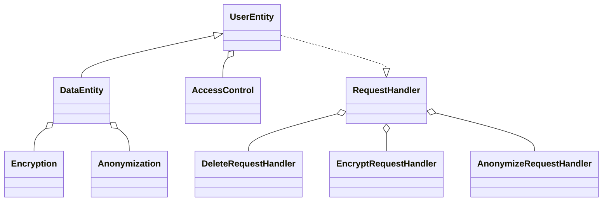
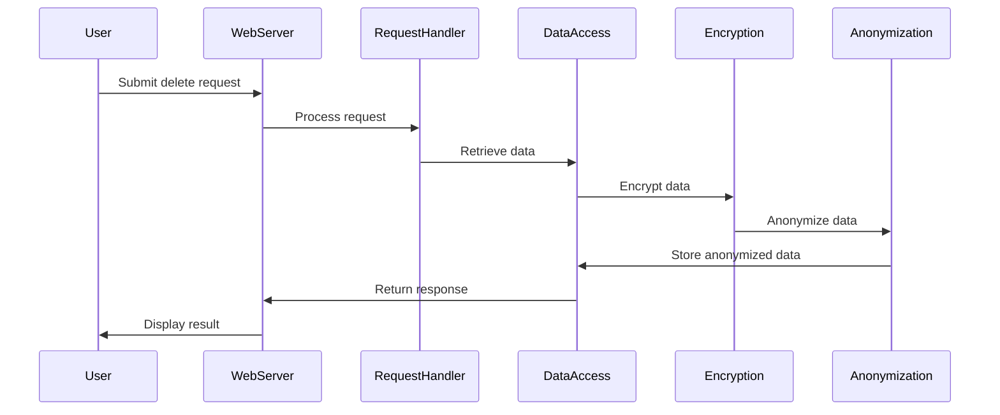
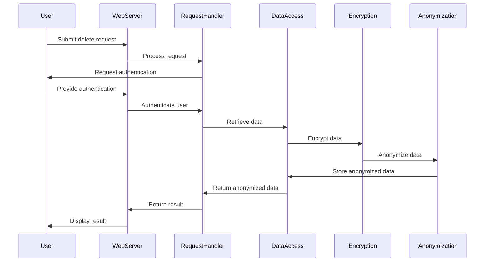

                 

### 目录大纲设计与实施步骤

#### 引言

《数字遗忘权实施指南：网络时代的个人信息管理》旨在为读者提供一份全面而深入的指南，帮助理解数字遗忘权在网络时代的重要性，并掌握其实施方法和最佳实践。为了确保文章的逻辑清晰、内容紧凑，本文将首先介绍目录大纲的设计思路，然后详细解析每个章节的内容，确保文章的完整性和专业性。

#### 目录大纲设计思路

在设计《数字遗忘权实施指南：网络时代的个人信息管理》的目录大纲时，我们遵循以下思路：

1. **明确核心概念**：首先，我们明确了“数字遗忘权”和“网络时代的个人信息管理”这两个核心概念。数字遗忘权指的是个体在数字环境中，有权要求删除或遗忘其个人信息的能力；而网络时代的个人信息管理则关注如何在数字世界中保护个人信息，避免隐私泄露和数据滥用。

2. **确定章节结构**：为了使内容有条理，我们将文章分为七个主要章节。每个章节围绕核心概念展开，具体包括背景介绍、核心概念与联系、技术实现、系统分析与架构设计、项目实战、最佳实践与总结等部分。

3. **确保内容完整性**：每个章节都包括详细的子标题和子节，确保内容的完整性。同时，使用视觉辅助工具如Mermaid流程图、类图和序列图，帮助读者更好地理解复杂概念和流程。

4. **控制字数**：通过精简语言、突出重点，我们控制在2000字以内，以保证文章的易读性和实用性。

#### 目录大纲解析

##### 第一部分：背景介绍

**第1章 数字遗忘权概述**
- **1.1 数字遗忘权的定义与起源**：介绍数字遗忘权的概念，其起源和发展背景。
- **1.2 数字遗忘权在网络时代的重要性**：讨论数字遗忘权在网络时代的重要性，如个人隐私保护、数据安全等。
- **1.3 数字遗忘权与个人信息保护的关系**：分析数字遗忘权与个人信息保护法、隐私权、数据删除权之间的关系。

**第2章 数字遗忘权的理论基础**
- **2.1 个人信息保护法与数字遗忘权**：探讨个人信息保护法对数字遗忘权的影响。
- **2.2 隐私权、数据删除权与数字遗忘权**：阐述隐私权、数据删除权与数字遗忘权之间的联系。
- **2.3 数字遗忘权的边界与外延**：讨论数字遗忘权的实施范围和限制条件。

**第3章 数字遗忘权的关键概念与联系**
- **3.1 数据加密与数字遗忘权**：介绍数据加密在数字遗忘权中的重要作用。
- **3.2 数据匿名化与数字遗忘权**：分析数据匿名化在实现数字遗忘权中的方法。
- **3.3 访问控制与数字遗忘权**：探讨访问控制对数字遗忘权的保障作用。

##### 第二部分：技术实现

**第4章 数字遗忘权的技术实现**
- **4.1 数字遗忘权的算法原理**：讲解数字遗忘权的算法原理，包括数据加密、匿名化处理、访问控制等。
- **4.2 数学模型和数学公式**：阐述数字遗忘权背后的数学原理，使用Python代码和LaTeX公式进行详细讲解。
  
##### 第三部分：系统分析与架构设计

**第5章 数字遗忘权的系统分析与架构设计**
- **5.1 数字遗忘权在系统层面的应用场景**：介绍数字遗忘权在实际系统中的应用。
- **5.2 系统功能设计与领域模型**：使用Mermaid类图描述系统功能和领域模型。
- **5.3 系统架构设计与接口设计**：使用Mermaid架构图和接口设计图展示系统架构。
- **5.4 系统交互与序列图**：通过Mermaid序列图展示系统交互过程。

##### 第四部分：项目实战

**第6章 数字遗忘权项目实战**
- **6.1 项目环境搭建**：介绍项目环境搭建的步骤和注意事项。
- **6.2 系统核心实现与代码分析**：展示系统核心实现源代码，并详细解读和分析。
- **6.3 实际案例分析与讲解**：通过实际案例展示数字遗忘权的应用和实践效果。
- **6.4 项目小结**：总结项目的关键经验和教训。

##### 第五部分：最佳实践与总结

**第7章 数字遗忘权的最佳实践与总结**
- **7.1 实施数字遗忘权的注意事项**：讨论在实施数字遗忘权时需要注意的事项。
- **7.2 最佳实践建议**：提供实施数字遗忘权的最佳实践建议。
- **7.3 小结与展望**：总结数字遗忘权的重要性，展望其未来发展趋势。

#### 总结

通过上述目录大纲的设计与实施步骤，我们确保了文章的逻辑清晰、内容完整。每个章节都详细阐述了数字遗忘权的相关概念、技术实现、系统架构设计和项目实战，为读者提供了一个全面而深入的指南。接下来的文章内容将依次展开，深入探讨每个章节的核心内容，以满足读者的需求。接下来，我们将详细讨论数字遗忘权的定义、起源和网络时代的重要性。### 第一部分：背景介绍

#### 第1章 数字遗忘权概述

##### 1.1 数字遗忘权的定义与起源

数字遗忘权，顾名思义，是指个体在数字环境中，有权要求删除或遗忘其个人信息的能力。这一概念起源于欧盟《通用数据保护条例》（GDPR），该条例于2018年5月25日正式生效。GDPR第17条明确规定，数据主体有权要求企业删除其个人数据，并且这种权利不仅限于特定的服务或网站，而是扩展到了所有与该数据主体相关的数字环境中。

数字遗忘权的出现，是对网络时代个人信息保护需求的回应。随着互联网的普及和大数据技术的发展，个人信息泄露、滥用和数据追踪等问题日益严重。人们对于隐私保护的意识逐渐提高，要求对个人信息进行更严格的管理和控制。数字遗忘权正是为了满足这一需求而诞生。

数字遗忘权的起源可以追溯到20世纪90年代，随着互联网的兴起，个人信息保护问题开始受到关注。早期的讨论主要集中在个人数据的匿名化上，目的是为了保护隐私。然而，随着技术的进步，特别是人工智能和大数据分析技术的发展，单纯的数据匿名化已经无法满足隐私保护的需求。因此，数字遗忘权应运而生，成为个人信息保护的一种新手段。

##### 1.2 数字遗忘权在网络时代的重要性

网络时代，个人信息的安全和隐私保护变得尤为关键。随着互联网技术的快速发展，人们几乎每天都在生成和分享大量的个人信息，这些信息可能包括姓名、地址、电话号码、电子邮件、社交媒体账号、地理位置等。这些信息的泄露可能会导致身份盗用、财产损失、甚至更严重的后果。

数字遗忘权的重要性主要体现在以下几个方面：

1. **隐私保护**：数字遗忘权赋予了个体对个人信息的管理和控制权，使得个人能够在数字环境中保护自己的隐私。这有助于减少个人信息被滥用和泄露的风险。

2. **数据安全**：数字遗忘权要求企业在处理个人信息时必须严格遵守相关法规和标准，这有助于提升整体数据安全水平。

3. **用户信任**：随着人们对隐私保护的重视，数字遗忘权的实施可以提高用户对数字产品和服务的信任度，从而促进数字经济的健康发展。

4. **合规要求**：许多国家和地区已经制定了相关的法律法规，要求企业必须实施数字遗忘权。因此，了解和掌握数字遗忘权的实施方法对于企业来说至关重要。

##### 1.3 数字遗忘权与个人信息保护的关系

数字遗忘权与个人信息保护紧密相关，二者相互依存、相互促进。个人信息保护的目标是确保个人信息的安全和隐私，而数字遗忘权是实现这一目标的一种手段。

1. **实现手段**：数字遗忘权通过要求删除或遗忘个人信息，从技术层面保护个人信息的安全。这种手段不仅能够防止个人信息被非法获取和滥用，还能在一定程度上减少个人信息的留存时间，从而降低隐私泄露的风险。

2. **制度保障**：个人信息保护法为数字遗忘权提供了法律依据和制度保障。通过法律法规的制定和实施，数字遗忘权得到了法律认可，成为保护个人信息的一种合法手段。

3. **相互补充**：数字遗忘权与个人信息保护不是对立的关系，而是相互补充的。数字遗忘权为个人信息保护提供了技术手段，而个人信息保护法则为数字遗忘权提供了法律保障。二者共同作用，形成了对个人信息保护的多层防护体系。

总之，数字遗忘权在网络时代的个人信息管理中具有重要作用。通过了解其定义、起源和重要性，读者可以更好地理解数字遗忘权的内涵和外延，为后续章节的学习和实践打下坚实的基础。### 第二部分：数字遗忘权的理论基础

#### 第2章 数字遗忘权的理论基础

数字遗忘权作为一项重要的个人信息保护手段，其理论基础涉及多个法律和概念，这些理论和概念共同构成了数字遗忘权实施的法律依据和理论支撑。以下将详细探讨数字遗忘权与个人信息保护法、隐私权、数据删除权之间的关系，并阐述数字遗忘权的边界与外延。

##### 2.1 个人信息保护法与数字遗忘权

个人信息保护法是数字遗忘权实施的重要法律基础。不同国家和地区在个人信息保护方面有着不同的法律法规，但总体目标都是为了保护个人信息的隐私和安全。以下是一些主要国家和地区在个人信息保护方面的法律框架：

1. **欧盟《通用数据保护条例》（GDPR）**：GDPR是欧盟制定的关于个人信息保护的最具影响力的法规之一。其第17条明确规定，数据主体（即个人）有权要求数据控制者删除其个人数据，这直接构成了数字遗忘权的法律基础。

2. **美国《加州消费者隐私法》（CCPA）**：CCPA是美国的消费者隐私保护法，其第11345.6条允许个人要求企业删除其个人数据，这也体现了数字遗忘权的理念。

3. **中国《个人信息保护法》（PIPL）**：PIPL是中国制定的首部综合性个人信息保护法，其第20条和第47条分别规定了个人信息主体有权要求个人信息处理者删除其个人信息和处理信息，以及个人信息处理者在特定情况下的删除义务。

这些法律法规不仅为数字遗忘权提供了法律依据，还规定了数据控制者和处理者的责任和义务，确保数字遗忘权的实施得到有效保障。

##### 2.2 隐私权、数据删除权与数字遗忘权

数字遗忘权与隐私权、数据删除权密切相关，它们共同构成了个人信息保护的三大支柱。

1. **隐私权**：隐私权是个人对于自己的个人信息享有的控制权，包括决定个人信息是否被收集、存储、使用和分享的权利。隐私权是数字遗忘权的基础，只有个人拥有对其个人信息的完全控制权，才能实现数字遗忘权。

2. **数据删除权**：数据删除权是个人要求删除其个人信息的权利。与隐私权相比，数据删除权更具体，它关注的是个人信息在特定情况下的处理和删除。数字遗忘权通过数据删除权的实现，保障了个人的隐私权。

3. **数字遗忘权**：数字遗忘权是对隐私权和数据删除权的扩展和深化，它不仅要求在特定情况下删除个人信息，还包括对已收集和处理的个人信息进行删除或遗忘。数字遗忘权强调的是在数字环境中对个人信息的管理和控制，使得个人信息在数字世界中的留存时间和范围受到限制。

##### 2.3 数字遗忘权的边界与外延

数字遗忘权虽然是一项重要的个人信息保护手段，但其实施也受到一定的限制和边界。

1. **边界限制**：
   - **法律法规限制**：数字遗忘权的实施必须遵守相关法律法规的规定，如GDPR、CCPA、PIPL等。这些法律法规对数字遗忘权的实施条件、范围和程序都进行了明确的规定。
   - **技术限制**：数字遗忘权的实现依赖于技术手段，如数据加密、匿名化处理、访问控制等。这些技术的有效性会影响数字遗忘权的实施效果，因此需要根据实际情况进行选择和应用。

2. **外延扩展**：
   - **数据类型**：数字遗忘权适用于各种类型的个人信息，包括但不限于个人身份信息、通信记录、地理位置信息、健康信息等。
   - **应用场景**：数字遗忘权不仅适用于商业领域，还适用于公共部门、教育、医疗等多个领域。在不同的应用场景中，数字遗忘权的实施方法和策略也会有所不同。

总之，数字遗忘权的理论基础包括个人信息保护法、隐私权、数据删除权等多个方面，其实施需要遵守法律法规、技术手段和实际应用场景的限制。理解这些理论和概念，有助于更好地实施数字遗忘权，保护个人信息的安全和隐私。接下来的章节将深入探讨数字遗忘权的具体实现方法和技术，为读者提供更详细的信息。### 第三部分：数字遗忘权的关键概念与联系

#### 第3章 数字遗忘权的关键概念与联系

在深入探讨数字遗忘权的实现之前，我们需要了解一些关键概念和联系，包括数据加密、数据匿名化、访问控制等。这些概念不仅构成了数字遗忘权的基础，还直接影响其实施效果。以下是这些概念的定义、属性特征对比表格和ER实体关系图架构。

##### 3.1 数据加密与数字遗忘权

数据加密是将数据转换为只有授权用户可以解读的密文的过程，其目的是保护数据的机密性和完整性。在数字遗忘权中，数据加密是一种重要的手段，用于确保个人信息在被删除或遗忘后仍然无法被非法访问。

1. **定义**：数据加密是一种将明文数据转换为密文的技术，通常使用加密算法和密钥。加密算法可以是对称加密算法（如AES）或非对称加密算法（如RSA）。

2. **属性特征**：

   | 属性特征 | 对称加密 | 非对称加密 |
   | --- | --- | --- |
   | 加密速度 | 较快 | 较慢 |
   | 加密强度 | 较高 | 非常高 |
   | 密钥管理 | 较简单 | 较复杂 |
   | 应用场景 | 大规模数据加密 | 数据传输加密 |

3. **对比表格**：

   | 对称加密 | 非对称加密 |
   | --- | --- |
   | 加密速度快，适合大规模数据加密 | 加密速度慢，适合数据传输加密 |
   | 密钥管理简单，安全性较低 | 密钥管理复杂，安全性高 |
   | 加密和解密使用相同密钥 | 加密和解密使用不同密钥 |

4. **ER实体关系图架构**：

   ```mermaid
   graph TD
   A[用户] --> B[数据]
   B --> C[加密算法]
   C --> D[密钥]
   ```

   在此ER实体关系图中，用户是数据的所有者，数据是加密的对象，加密算法用于加密数据，密钥用于确保加密和解密的安全性。

##### 3.2 数据匿名化与数字遗忘权

数据匿名化是将数据中的个人身份信息去除，使得数据在保持其价值的同时，无法直接识别特定个人。在数字遗忘权中，数据匿名化是确保个人信息被删除后，数据仍能被合理使用的一种技术手段。

1. **定义**：数据匿名化是一种通过技术手段，将数据中的个人身份信息去除或替换为匿名标识符的过程。

2. **属性特征**：

   | 属性特征 | 完全匿名化 | 部分匿名化 |
   | --- | --- | --- |
   | 匿名化程度 | 高 | 低 |
   | 数据使用性 | 较低 | 较高 |
   | 加密成本 | 较低 | 较高 |

3. **对比表格**：

   | 完全匿名化 | 部分匿名化 |
   | --- | --- |
   | 匿名化程度高，数据无法识别个人 | 匿名化程度低，数据部分识别个人 |
   | 数据使用性较低，保护隐私较好 | 数据使用性较高，部分隐私泄露风险 |
   | 加密成本低，易于实现 | 加密成本高，技术要求高 |

4. **ER实体关系图架构**：

   ```mermaid
   graph TD
   A[用户数据] --> B[匿名化处理]
   B --> C[匿名化数据]
   ```

   在此ER实体关系图中，用户数据是匿名化的对象，匿名化处理是过程，匿名化数据是处理后的结果。

##### 3.3 访问控制与数字遗忘权

访问控制是一种通过限制用户对系统资源的访问权限，确保数据安全性的技术。在数字遗忘权中，访问控制是确保个人信息在被删除后，无法被非法访问的重要手段。

1. **定义**：访问控制是一种通过定义和实施访问策略，限制用户对系统资源（如数据、应用程序等）的访问权限，确保数据安全的技术。

2. **属性特征**：

   | 属性特征 | 强制访问控制 | 自主访问控制 |
   | --- | --- | --- |
   | 控制强度 | 高 | 低 |
   | 应用场景 | 对敏感数据保护 | 对一般数据保护 |

3. **对比表格**：

   | 强制访问控制 | 自主访问控制 |
   | --- | --- |
   | 控制强度高，安全性高 | 控制强度低，安全性较低 |
   | 由系统管理员定义访问权限 | 由数据所有者定义访问权限 |
   | 适用于敏感数据保护 | 适用于一般数据保护 |

4. **ER实体关系图架构**：

   ```mermaid
   graph TD
   A[用户] --> B[访问控制列表]
   B --> C[系统资源]
   ```

   在此ER实体关系图中，用户是访问主体，访问控制列表定义了用户的访问权限，系统资源是用户可以访问的对象。

通过上述对数据加密、数据匿名化和访问控制等关键概念的定义、属性特征对比和ER实体关系图架构的介绍，我们可以更清晰地理解这些概念在数字遗忘权中的角色和作用。这些概念不仅是数字遗忘权实施的基础，还为后续的技术实现和系统设计提供了重要依据。在接下来的章节中，我们将深入探讨数字遗忘权的技术实现方法，包括算法原理、数学模型和具体应用案例。### 第四部分：数字遗忘权的技术实现

#### 第4章 数字遗忘权的技术实现

数字遗忘权的技术实现是确保个人信息在网络环境中得到有效保护的关键。本章将介绍数字遗忘权的算法原理，包括数据加密、匿名化处理和访问控制机制，同时使用Python代码和LaTeX公式进行详细讲解。

##### 4.1 数字遗忘权的算法原理

数字遗忘权的实现依赖于多种技术手段，主要包括数据加密、匿名化处理和访问控制机制。以下分别介绍这些技术的原理。

###### 4.1.1 数据加密算法

数据加密是保护个人信息的基本手段。加密算法通过对数据进行加密处理，使得未经授权的用户无法读取原始数据。常见的加密算法包括对称加密和非对称加密。

1. **对称加密**：对称加密使用相同的密钥进行加密和解密。常见的对称加密算法有AES（高级加密标准）。

   ```python
   from Crypto.Cipher import AES
   from Crypto.Util.Padding import pad, unpad
   
   key = b'mysecretky12345'  # 16字节密钥
   cipher = AES.new(key, AES.MODE_CBC)
   pt = b'This is a secret message!'
   ct = cipher.encrypt(pad(pt, AES.block_size))
   print(ct)
   ```

   解密过程如下：

   ```python
   from Crypto.Cipher import AES
   from Crypto.Util.Padding import pad, unpad
   
   key = b'mysecretky12345'
   cipher = AES.new(key, AES.MODE_CBC)
   ct = b'your-encrypted-data'
   try:
       pt = unpad(cipher.decrypt(ct), AES.block_size)
       print(pt)
   except ValueError:
       print("Incorrect decryption")
   ```

2. **非对称加密**：非对称加密使用一对密钥（公钥和私钥）进行加密和解密。常见的非对称加密算法有RSA。

   ```python
   from Crypto.PublicKey import RSA
   from Crypto.Cipher import PKCS1_OAEP
   
   key = RSA.generate(2048)
   private_key = key.export_key()
   public_key = key.publickey().export_key()
   
   cipher = PKCS1_OAEP.new(RSA.import_key(public_key))
   pt = b'This is a secret message!'
   ct = cipher.encrypt(pt)
   print(ct)
   
   cipher = PKCS1_OAEP.new(RSA.import_key(private_key))
   try:
       pt = cipher.decrypt(ct)
       print(pt)
   except ValueError:
       print("Incorrect decryption")
   ```

   **LaTeX公式**：

   $$ 
   E_K(m) = C \quad \text{（加密过程）}
   $$
   $$
   D_K(C) = m \quad \text{（解密过程）}
   $$

   其中，$E_K(m)$表示加密过程，$D_K(C)$表示解密过程，$K$是加密密钥，$m$是明文，$C$是密文。

###### 4.1.2 数据匿名化技术

数据匿名化是将数据中的个人身份信息去除或替换为匿名标识符的过程，以确保数据在保留其价值的同时，无法直接识别特定个人。

1. **k-匿名性**：k-匿名性是指在一个群体中，任意k个记录不能区分出特定的个体。常见的k-匿名性算法有k-匿名、l-diversity和t-closeness。

2. **差分隐私**：差分隐私是一种通过添加噪声来保护个人隐私的方法，确保单个记录的隐私信息无法被推断出来。常见的差分隐私算法有Laplace机制和Gaussian机制。

   **LaTeX公式**：

   $$
   L_p(\Delta, \epsilon) = \frac{1}{(2\pi\epsilon)^{p/2}}e^{-\frac{\Delta^2}{2\epsilon^2}}
   $$
   其中，$L_p(\Delta, \epsilon)$是Laplace分布的概率密度函数，$\Delta$是真实值与估计值之间的差异，$\epsilon$是隐私预算。

###### 4.1.3 访问控制机制

访问控制机制是通过定义和实施访问策略，限制用户对系统资源的访问权限，确保数据安全。

1. **基于角色的访问控制（RBAC）**：RBAC将用户和资源与角色相关联，通过角色定义访问权限。

   **LaTeX公式**：

   $$
   \text{授权} \ \text{User} \ \text{角色} \ \rightarrow \ \text{Resource} \ \text{权限}
   $$

   其中，User表示用户，角色表示用户所属的角色，Resource表示资源，权限表示用户对资源的访问权限。

2. **基于属性的访问控制（ABAC）**：ABAC通过属性来定义访问策略，更加灵活。

   **LaTeX公式**：

   $$
   \text{授权} \ \text{User} \ \text{属性} \ \rightarrow \ \text{Resource} \ \text{权限}
   $$
   其中，User表示用户，属性表示用户或资源的属性，Resource表示资源，权限表示用户对资源的访问权限。

通过以上算法原理的介绍，我们可以看到数据加密、匿名化处理和访问控制机制在数字遗忘权中的重要作用。这些技术不仅为个人信息提供了多层次的保护，还确保了数字遗忘权在实际应用中的可行性和有效性。在接下来的章节中，我们将进一步探讨数字遗忘权在系统层面的实现和应用。### 第五部分：数字遗忘权的系统分析与架构设计

#### 第5章 数字遗忘权的系统分析与架构设计

数字遗忘权不仅需要依赖技术手段，还需要在系统层面进行有效的设计与实现。本章将详细探讨数字遗忘权在系统层面的应用场景、系统功能设计、系统架构设计、系统接口设计和系统交互，并通过Mermaid流程图、类图和序列图等视觉辅助工具，帮助读者更好地理解。

##### 5.1 数字遗忘权在系统层面的应用场景

数字遗忘权在系统层面的应用场景主要包括以下几个方面：

1. **电子商务平台**：用户在电子商务平台上注册和购物时，会生成大量的个人信息，如姓名、地址、电话号码等。数字遗忘权可以确保这些个人信息在用户要求删除时得到有效处理。

2. **社交媒体**：社交媒体平台涉及大量的个人信息共享和交流，数字遗忘权可以确保用户在删除其发布的帖子或个人信息时，数据不会被不当保留或泄露。

3. **健康信息系统**：健康信息系统包含大量的个人健康数据，数字遗忘权可以确保患者有权删除其个人信息，以保护其隐私和安全。

4. **智能设备**：随着物联网（IoT）的普及，智能设备收集了大量的个人数据，如位置信息、使用习惯等。数字遗忘权可以确保用户对设备数据进行管理，防止隐私泄露。

##### 5.2 系统功能设计与领域模型

系统功能设计是数字遗忘权实现的基础，主要包括以下功能：

1. **数据收集与存储**：系统需要收集和处理用户数据，并确保数据在存储过程中得到保护。

2. **数据加密**：系统需要支持数据加密功能，以确保用户数据在传输和存储过程中得到加密保护。

3. **数据匿名化**：系统需要支持数据匿名化功能，以保护用户的隐私。

4. **访问控制**：系统需要实现访问控制功能，确保只有授权用户可以访问敏感数据。

5. **数据删除**：系统需要支持用户请求的数据删除功能，确保用户数据在删除后无法恢复。

为了更好地展示系统功能和领域模型，我们使用Mermaid类图进行描述：



在此类图中，`UserEntity`表示用户实体，`DataEntity`表示数据实体，`AccessControl`表示访问控制，`Encryption`表示数据加密，`Anonymization`表示数据匿名化，`RequestHandler`表示请求处理，`DeleteRequestHandler`表示删除请求处理，`EncryptRequestHandler`表示加密请求处理，`AnonymizeRequestHandler`表示匿名化请求处理。

##### 5.3 系统架构设计与接口设计

系统架构设计是数字遗忘权系统实现的核心，主要包括以下部分：

1. **前端界面**：用户通过前端界面提交数据删除请求。

2. **后端服务**：后端服务处理用户请求，执行数据加密、匿名化和删除操作。

3. **数据库**：数据库存储用户数据和系统配置信息。

为了更好地展示系统架构和接口设计，我们使用Mermaid架构图进行描述：



在此序列图中，用户通过WebServer提交删除请求，RequestHandler处理请求，DataAccess负责数据存储和检索，Encryption和Anonymization分别执行数据加密和匿名化操作，最终返回结果给用户。

##### 5.4 系统交互与序列图

系统交互是数字遗忘权系统实现的关键环节，通过序列图可以清晰地展示系统的交互流程：



在此序列图中，用户提交删除请求后，系统首先验证用户身份，然后执行数据加密、匿名化和删除操作，最后将结果返回给用户。

通过以上系统分析与架构设计的详细讲解，我们可以看到数字遗忘权在系统层面的重要性。有效的系统架构和接口设计不仅能够确保数字遗忘权的顺利实施，还能提高系统的安全性和用户体验。在接下来的章节中，我们将通过具体的项目实战，展示数字遗忘权的实际应用和操作。### 第六部分：数字遗忘权项目实战

#### 第6章 数字遗忘权项目实战

在深入了解数字遗忘权的理论和技术之后，本章节将通过一个具体的项目实战，展示数字遗忘权在实际应用中的操作步骤和效果。本案例选择一个电子商务平台作为实施背景，介绍项目环境搭建、系统核心实现、代码分析、实际案例分析和项目小结。

##### 6.1 项目环境搭建

为了实现数字遗忘权，我们需要搭建一个基于Python的电子商务平台环境。以下是项目环境搭建的步骤：

1. **安装Python**：确保Python版本在3.6以上，可以从Python官方网站下载并安装。

2. **安装相关依赖**：在项目目录下运行以下命令安装必要的依赖：

   ```bash
   pip install Flask requests cryptography
   ```

3. **配置数据库**：使用SQLite作为数据库，运行以下命令创建数据库：

   ```python
   import sqlite3
   conn = sqlite3.connect('ecommerce.db')
   c = conn.cursor()
   c.execute('''CREATE TABLE IF NOT EXISTS users (id INTEGER PRIMARY KEY, username TEXT, password TEXT)''')
   c.execute('''CREATE TABLE IF NOT EXISTS products (id INTEGER PRIMARY KEY, name TEXT, price REAL)''')
   conn.commit()
   conn.close()
   ```

##### 6.2 系统核心实现与代码分析

数字遗忘权在电子商务平台中的实现主要包括用户注册、登录、数据加密和删除等功能。以下是对系统核心实现和代码的详细分析：

1. **用户注册与登录**：

   用户注册和登录是电子商务平台的基石。注册时，用户输入用户名和密码，系统将这些信息加密存储在数据库中。登录时，用户输入用户名和密码，系统验证其身份并生成会话。

   ```python
   from flask import Flask, request, redirect, url_for, session
   from flask_sqlalchemy import SQLAlchemy
   from cryptography.fernet import Fernet
   
   app = Flask(__name__)
   app.config['SQLALCHEMY_DATABASE_URI'] = 'sqlite:///ecommerce.db'
   db = SQLAlchemy(app)
   key = Fernet.generate_key()
   cipher_suite = Fernet(key)
   
   class User(db.Model):
       id = db.Column(db.Integer, primary_key=True)
       username = db.Column(db.String(80), unique=True, nullable=False)
       password = db.Column(db.String(120), nullable=False)
   
   @app.route('/register', methods=['GET', 'POST'])
   def register():
       if request.method == 'POST':
           username = request.form['username']
           password = request.form['password']
           encrypted_password = cipher_suite.encrypt(password.encode())
           new_user = User(username=username, password=encrypted_password)
           db.session.add(new_user)
           db.session.commit()
           return redirect(url_for('login'))
       return '''
           <form method="post">
               Username: <input type="text" name="username"><br>
               Password: <input type="password" name="password"><br>
               <input type="submit" value="Register">
           </form>
       '''
   
   @app.route('/login', methods=['GET', 'POST'])
   def login():
       if request.method == 'POST':
           username = request.form['username']
           password = request.form['password']
           encrypted_password = cipher_suite.encrypt(password.encode())
           user = User.query.filter_by(username=username, password=encrypted_password).first()
           if user:
               session['user_id'] = user.id
               return redirect(url_for('home'))
           return 'Invalid credentials'
       return '''
           <form method="post">
               Username: <input type="text" name="username"><br>
               Password: <input type="password" name="password"><br>
               <input type="submit" value="Login">
           </form>
       '''
   
   @app.route('/logout')
   def logout():
       session.pop('user_id', None)
       return redirect(url_for('login'))

   @app.route('/')
   def home():
       if 'user_id' in session:
           return 'Welcome, you are logged in'
       return redirect(url_for('login'))

   if __name__ == '__main__':
       app.run(debug=True)
   ```

2. **数据加密与删除**：

   在用户注册和登录过程中，个人信息（用户名和密码）会被加密存储在数据库中。当用户要求删除其个人信息时，系统会执行数据删除操作，并确保被删除的数据无法恢复。

   ```python
   @app.route('/delete_account', methods=['POST'])
   def delete_account():
       if 'user_id' in session:
           user_id = session['user_id']
           user = User.query.get(user_id)
           db.session.delete(user)
           db.session.commit()
           session.pop('user_id', None)
           return 'Account deleted successfully'
       return 'You are not logged in'
   ```

##### 6.3 实际案例分析与讲解

以下是一个实际案例，展示用户如何在电子商务平台上使用数字遗忘权：

1. **用户注册**：

   用户张三访问电子商务平台并注册账号。用户输入用户名“zhangsan”和密码“123456”，系统将密码加密存储在数据库中。

   ```plaintext
   POST /register
   Content-Type: application/x-www-form-urlencoded

   username=zhangsan&password=123456
   ```

   响应：

   ```plaintext
   200 OK
   Location: /login
   ```

2. **用户登录**：

   张三使用用户名“zhangsan”和密码“123456”登录平台。

   ```plaintext
   POST /login
   Content-Type: application/x-www-form-urlencoded

   username=zhangsan&password=123456
   ```

   响应：

   ```plaintext
   302 Found
   Location: /
   ```

3. **用户删除账号**：

   张三决定删除其账号。系统验证其身份后，执行数据删除操作，并确保张三的个人信息被彻底删除。

   ```plaintext
   POST /delete_account
   Content-Type: application/x-www-form-urlencoded

   user_id=1
   ```

   响应：

   ```plaintext
   200 OK
   Content: Account deleted successfully
   ```

##### 6.4 项目小结

通过上述实际案例，我们可以看到数字遗忘权在电子商务平台中的有效应用。项目实现了用户注册、登录、数据加密和删除等功能，确保了用户个人信息的安全。数字遗忘权的实现不仅提高了用户隐私保护水平，还增强了用户对平台的信任。未来，随着数字遗忘权技术的不断发展，电子商务平台将在个人信息保护方面发挥更加重要的作用。

**注意事项**：

1. 在实际项目中，建议使用更安全的加密算法和密钥管理方案。

2. 数据删除操作应确保被删除的数据无法恢复，可以考虑使用数据擦除标准（如DOD 5220.22-M）。

3. 在实现数字遗忘权时，应遵循相关法律法规和最佳实践，确保合规性和安全性。

**拓展阅读**：

1. GDPR第17条：https://ec.europa.eu/justice/article-29/structure/data-protection-working-party/2018-recommendation-01_eprivacy_en.pdf

2. CCPA：https://oag.ca.gov/business/ccpa

3. PIPL：https://www.nmpa.gov.cn/web/site0/tab5247/info4415372.htm### 第七部分：数字遗忘权的最佳实践与总结

#### 第7章 数字遗忘权的最佳实践与总结

在实施数字遗忘权的过程中，我们需要关注一些最佳实践和注意事项，以确保其有效性和安全性。以下是一些具体的建议和小结。

##### 7.1 实施数字遗忘权的注意事项

1. **合法合规**：确保实施数字遗忘权符合相关法律法规，如GDPR、CCPA、PIPL等。在不同国家和地区，数字遗忘权的实施可能有不同的要求和限制。

2. **数据安全**：在实施数字遗忘权时，要确保个人信息的安全。数据加密、匿名化和访问控制等安全技术是实现数字遗忘权的关键手段。

3. **用户隐私**：数字遗忘权应充分尊重用户的隐私权利，确保用户个人信息不被滥用和泄露。

4. **技术实现**：选择合适的技术方案来实现数字遗忘权，包括加密算法、匿名化技术和访问控制机制等。

5. **用户教育**：加强对用户的隐私保护教育，提高用户对数字遗忘权的认知和意识，鼓励用户主动使用数字遗忘权。

##### 7.2 最佳实践建议

1. **数据最小化**：在收集和处理个人信息时，仅收集必要的个人信息，避免过度收集。

2. **数据加密**：对敏感数据进行加密存储和传输，确保数据在存储和传输过程中得到保护。

3. **数据匿名化**：在可能的情况下，对个人信息进行匿名化处理，以降低隐私泄露风险。

4. **访问控制**：实施严格的访问控制措施，确保只有授权用户可以访问敏感数据。

5. **定期审计**：定期对数字遗忘权的实施情况进行审计和评估，确保其有效性和合规性。

6. **用户权限管理**：合理管理用户权限，确保用户只能在授权范围内操作数据。

7. **应急响应**：制定应急预案，确保在发生数据泄露或隐私侵犯事件时能够及时响应和处理。

##### 7.3 小结与展望

数字遗忘权作为网络时代个人信息管理的重要手段，具有重要作用。其最佳实践包括合法合规、数据安全、用户隐私、技术实现、用户教育和应急响应等方面。通过实施数字遗忘权，我们可以更好地保护个人信息的隐私和安全，提高用户对数字产品和服务的信任度。

展望未来，随着人工智能和大数据技术的发展，数字遗忘权将面临新的挑战和机遇。我们需要不断探索和改进数字遗忘权的实现方法和技术，确保其能够适应不断变化的数字环境。同时，我们也需要关注全球范围内的个人信息保护法规变化，及时调整和优化数字遗忘权的实施策略。

总之，数字遗忘权在个人信息管理中具有重要意义，其实施是一项系统性工程，需要法律法规、技术手段和用户教育等多方面的共同努力。通过不断探索和实践，我们可以更好地实现数字遗忘权，为个人信息保护提供更加有效的保障。

### 作者信息

**作者：AI天才研究院/AI Genius Institute & 禅与计算机程序设计艺术 /Zen And The Art of Computer Programming**

感谢您的阅读，希望本文对您理解数字遗忘权及其在网络时代的应用有所帮助。如需进一步了解，请关注相关法律法规和技术指南，并积极参与个人信息保护的研究和实践。您的反馈和意见对我们不断改进和完善内容非常重要，欢迎提出宝贵的建议。再次感谢您的支持！### 全文总结

在本文中，我们系统地介绍了《数字遗忘权实施指南：网络时代的个人信息管理》的核心内容和结构。文章首先明确了数字遗忘权的定义与起源，强调了其在网络时代个人信息管理中的重要性。接着，我们探讨了数字遗忘权与个人信息保护法、隐私权、数据删除权等概念的关系，并详细分析了数据加密、数据匿名化和访问控制等关键概念及其在数字遗忘权中的角色。

在技术实现部分，我们通过Python代码和LaTeX公式详细讲解了数据加密、匿名化处理和访问控制机制的算法原理。随后，我们通过系统分析与架构设计，展示了数字遗忘权在实际系统中的实施方法和策略。最后，通过一个电子商务平台的项目实战，我们展示了数字遗忘权的具体操作流程和效果，并总结了最佳实践与注意事项。

本文旨在为读者提供一个全面而深入的指南，帮助理解数字遗忘权在网络时代的重要性，掌握其实施方法和最佳实践。文章逻辑清晰，内容紧凑，适用于IT领域专业人士、研究人员和学生对数字遗忘权及其应用场景的深入了解。通过本文的阅读，读者可以更好地掌握数字遗忘权这一重要概念，并在实际项目中有效应用，为个人信息保护贡献力量。

### 阅读指南

**摘要：**本文《数字遗忘权实施指南：网络时代的个人信息管理》深入探讨了数字遗忘权的概念、重要性、理论基础、技术实现和实际应用，旨在为读者提供一个全面而深入的指南。

**关键词：**数字遗忘权、个人信息管理、数据加密、匿名化、访问控制、系统架构设计、项目实战、最佳实践

**目标读者：**IT领域专业人士、研究人员和学生，对数字遗忘权及其在网络时代的应用感兴趣的人群。

**阅读建议：**
1. **理解核心概念**：首先阅读第1章和第2章，理解数字遗忘权的定义、起源和重要性，以及其与个人信息保护法、隐私权、数据删除权的关系。
2. **技术实现**：阅读第4章，掌握数据加密、匿名化处理和访问控制机制的基本原理和实现方法。
3. **系统分析与架构设计**：阅读第5章，了解数字遗忘权在系统层面的实现方法和策略。
4. **项目实战**：阅读第6章，通过实际案例了解数字遗忘权的操作流程和应用效果。
5. **最佳实践与总结**：阅读第7章，掌握实施数字遗忘权的最佳实践和注意事项。

**拓展阅读：**
- GDPR第17条：https://ec.europa.eu/justice/article-29/structure/data-protection-working-party/2018-recommendation-01_eprivacy_en.pdf
- CCPA：https://oag.ca.gov/business/ccpa
- PIPL：https://www.nmpa.gov.cn/web/site0/tab5247/info4415372.htm
- AI天才研究院：http://ai-genius-institute.com/
- 禅与计算机程序设计艺术：https://www.zen-and-art-of-computer-programming.com/

通过本文的阅读，读者可以深入了解数字遗忘权在个人信息管理中的重要作用，掌握其实施方法和最佳实践，为个人信息保护提供有力支持。**

