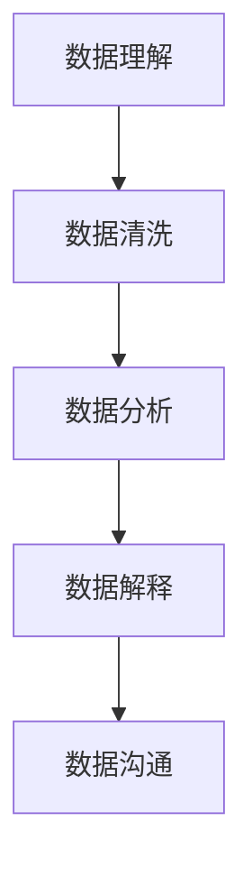
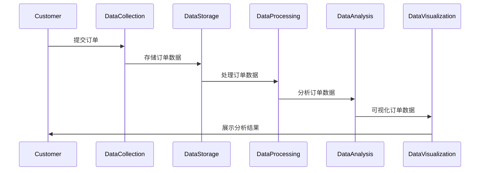
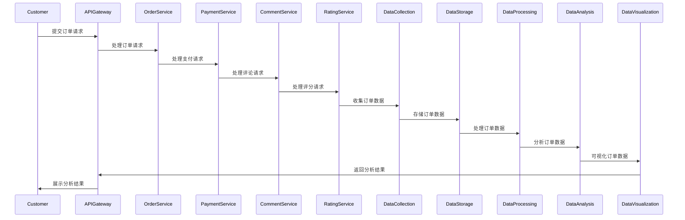

                 

### 数据素养：信息时代的生存技能

#### 关键词：数据素养、信息时代、生存技能、数据分析、数据可视化、数据驱动决策

> 在这个数据驱动一切的时代，拥有数据素养不仅是技术人员的必备素质，更是每一个现代人的生存技能。数据素养意味着我们不仅能够理解数据、分析数据，还能够将数据转化为知识和智慧，从而在个人发展和职业道路上取得成功。本文将深入探讨数据素养的兴起与重要性、数据素养的基本技能、数据素养的应用场景以及提升策略，旨在帮助读者在信息时代中掌握这一核心技能。

### 引言

随着大数据、云计算和人工智能技术的飞速发展，数据已经成为新时代的核心资源。数据素养（Data Literacy）作为一种新的素养，正逐渐受到人们的关注。它不仅关乎个体的知识获取和技能提升，更是决定一个组织、一个社会在信息时代中能否立足的重要因素。本文将围绕数据素养展开，帮助读者全面了解这一关键能力，并在实际应用中不断精进。

#### 第一部分：数据素养的兴起与重要性

### 第1章：数据素养的兴起

#### 1.1 数据素养的概念

**定义：** 数据素养是指个人理解、分析、解释和沟通数据的能力。它不仅涉及对数据的理解，还包括如何使用数据分析工具和技术，以及如何将数据分析结果转化为可操作的知识和行动。

**基本属性：** 数据素养具有以下基本属性：

1. **知识性：** 数据素养需要具备一定的数据知识，包括数据类型、来源、处理方法和分析技术等。
2. **技能性：** 数据素养不仅仅停留在理论层面，更强调实际操作能力，如数据清洗、数据分析和数据可视化等。
3. **实践性：** 数据素养强调理论与实践相结合，通过实际操作和应用来提升个人能力。
4. **动态性：** 随着数据技术和应用的不断发展，数据素养需要不断更新和提升。

#### 1.2 数据素养的重要性

**个人层面的影响：** 数据素养对个人发展具有重要意义：

1. **决策能力：** 通过数据素养，个人能够更准确地分析信息，做出更有依据的决策。
2. **职业发展：** 在许多职业领域，数据素养已成为不可或缺的技能，有助于提升个人竞争力。
3. **生活品质：** 数据素养使个人能够更好地理解和使用数据，提高生活质量和效率。

**组织层面的影响：** 数据素养对组织运营和管理有深远的影响：

1. **战略决策：** 组织通过数据素养，能够更科学地制定战略规划和决策。
2. **运营优化：** 数据素养有助于组织优化业务流程，提高运营效率。
3. **创新驱动：** 数据素养推动组织创新，促进产品和服务升级。

**社会层面的影响：** 数据素养对社会发展具有积极意义：

1. **社会治理：** 政府和社会组织通过数据素养，能够更好地进行社会治理和公共管理。
2. **科技创新：** 数据素养推动科技创新，促进经济发展和社会进步。
3. **社会信任：** 数据素养提高公众对数据的理解和信任，促进数据开放和共享。

#### 1.3 数据素养的核心要素

**数据理解：** 数据素养首先要求个人能够理解数据，包括数据的类型、来源和结构等。只有真正理解数据，才能进行有效分析。

**数据分析：** 数据分析是数据素养的核心技能，包括数据清洗、统计分析、机器学习等。通过数据分析，可以从海量数据中提取有价值的信息。

**数据解释：** 数据解释是指将数据分析结果转化为易于理解的形式，如图表、报告等。这有助于决策者和公众更好地理解数据。

**数据沟通：** 数据沟通是将数据分析结果传达给不同受众的过程。良好的数据沟通能力有助于确保数据分析结果的正确理解和应用。

### 第二部分：数据素养的基本技能

#### 第2章：数据基础

#### 2.1 数据类型

数据类型是数据素养的基础，了解不同类型的数据有助于我们选择合适的数据处理和分析方法。

1. **结构化数据：** 结构化数据具有固定的格式和结构，如关系型数据库中的表格数据。这类数据便于存储、检索和分析。
2. **非结构化数据：** 非结构化数据没有固定的格式和结构，如文本、图片、音频和视频。这类数据通常需要通过特定的方法进行处理和分析。
3. **半结构化数据：** 半结构化数据介于结构化数据和非结构化数据之间，具有一定的结构但不够严格。如XML和JSON数据。

#### 2.2 数据来源

数据来源是数据素养的重要环节，了解不同类型的数据来源有助于我们更好地收集和处理数据。

1. **内部数据：** 内部数据来源于组织内部的业务流程和活动，如客户信息、销售数据和运营数据。内部数据是组织决策和优化的重要依据。
2. **外部数据：** 外部数据来源于组织外部的各种渠道，如公共数据库、社交媒体和第三方数据提供商。外部数据为组织提供了更广泛的信息来源和洞察。
3. **开放数据：** 开放数据是指免费提供的、可公开访问的数据。开放数据有助于促进数据共享和创新，对个人和组织都有重要价值。

#### 2.3 数据处理

数据处理是数据素养的核心技能，包括数据清洗、数据整合和数据存储等。

1. **数据清洗：** 数据清洗是指对原始数据进行清洗和预处理，包括去除重复数据、处理缺失数据和纠正错误数据等。数据清洗是确保数据质量的关键步骤。
2. **数据整合：** 数据整合是指将不同来源和格式的数据整合到一个统一的格式中，以便进行进一步分析。数据整合有助于提高数据分析的效率和效果。
3. **数据存储：** 数据存储是指将处理后的数据存储到数据库或其他数据存储系统中，以便长期保存和使用。选择合适的数据存储方案对数据素养至关重要。

#### 第3章：数据分析工具

数据分析工具是数据素养的重要组成部分，熟练掌握常用的数据分析工具有助于提高数据分析的效率和质量。

#### 3.1 SQL

**概述：** SQL（Structured Query Language）是一种用于查询和管理关系型数据库的编程语言。它具有丰富的功能，包括数据查询、数据插入、数据更新和数据删除等。

**基本操作：** SQL的基本操作包括：

1. **数据查询：** SELECT语句用于从数据库中查询数据。
2. **数据插入：** INSERT语句用于将数据插入到数据库中。
3. **数据更新：** UPDATE语句用于更新数据库中的数据。
4. **数据删除：** DELETE语句用于删除数据库中的数据。

**复杂查询：** SQL还支持复杂查询，包括联接、分组和排序等。这些操作有助于从海量数据中提取有价值的信息。

#### 3.2 Python数据分析库

**NumPy：** NumPy是一个用于数值计算的Python库，它提供了多维数组对象和丰富的数学函数。

**Pandas：** Pandas是一个用于数据操作的Python库，它提供了强大的数据处理和分析功能，包括数据清洗、数据整合和数据可视化等。

**Matplotlib：** Matplotlib是一个用于数据可视化的Python库，它提供了丰富的绘图函数和样式选项，可以帮助我们制作各种类型的图表。

### 第4章：数据可视化

#### 4.1 可视化工具

数据可视化是数据素养的重要环节，通过可视化工具，我们可以将数据分析结果以图形化的形式展示出来，使数据更加直观、易于理解。

1. **Tableau：** Tableau是一个功能强大的数据可视化工具，它支持各种类型的数据源，并提供丰富的可视化选项。
2. **Power BI：** Power BI是Microsoft推出的数据可视化工具，它提供了强大的数据处理和分析功能，并与Microsoft的其他产品紧密集成。
3. **Excel：** Excel是一个广泛使用的电子表格工具，它具有强大的数据处理和分析功能，同时也支持简单的数据可视化。

#### 4.2 可视化原则

良好的数据可视化不仅能够展示数据，还能帮助用户更好地理解数据。以下是一些数据可视化的原则：

1. **选择合适的数据可视化类型：** 根据数据的类型和目的选择合适的数据可视化类型，如柱状图、折线图、饼图等。
2. **设计清晰简洁的图表：** 图表设计应简洁明了，避免过度装饰和冗余信息，以便用户更好地理解数据。
3. **注明数据来源与时间范围：** 在图表中注明数据来源和时间范围，以便用户了解数据的背景和上下文。

### 第三部分：数据素养的应用场景

#### 第5章：商业分析

#### 5.1 市场研究

市场研究是商业分析的重要应用领域，通过数据素养，我们可以从海量数据中提取有价值的信息，帮助企业制定更科学的决策。

1. **数据采集：** 通过调查问卷、在线调查、社交媒体等渠道收集市场数据。
2. **数据分析：** 利用数据分析工具对市场数据进行分析，如客户需求分析、市场趋势分析等。
3. **报告撰写：** 将数据分析结果整理成报告，为企业提供决策依据。

#### 5.2 用户行为分析

用户行为分析是商业分析的重要环节，通过数据素养，我们可以深入了解用户行为，为企业提供更有针对性的产品和服务。

1. **数据获取：** 通过网站日志、用户点击、社交媒体等渠道收集用户行为数据。
2. **数据处理：** 利用数据分析工具对用户行为数据进行处理和整合。
3. **用户画像：** 根据用户行为数据绘制用户画像，为企业提供用户洞察。

### 第6章：数据驱动决策

#### 6.1 数据决策流程

数据驱动决策是指基于数据分析结果进行决策的过程。以下是一个典型的数据决策流程：

1. **数据收集：** 收集与决策相关的数据，包括内部数据和外部数据。
2. **数据分析：** 利用数据分析工具对数据进行处理和分析，提取有价值的信息。
3. **决策制定：** 基于数据分析结果制定决策，并根据决策结果进行实施和评估。

#### 6.2 数据驱动的案例分析

**案例一：电商平台的用户行为分析**

电商平台通过用户行为分析，了解用户在网站上的行为习惯和偏好，从而优化网站设计和产品推荐，提高用户体验和销售额。

1. **数据收集：** 通过网站日志和用户点击数据收集用户行为数据。
2. **数据分析：** 利用数据分析工具对用户行为数据进行处理和分析，提取有价值的信息。
3. **决策制定：** 根据用户行为分析结果，调整网站设计和产品推荐策略。

**案例二：制造企业的生产流程优化**

制造企业通过数据驱动决策，优化生产流程，提高生产效率和产品质量。

1. **数据收集：** 收集生产过程中的各种数据，如设备状态、生产效率、质量检测数据等。
2. **数据分析：** 利用数据分析工具对生产数据进行处理和分析，找出生产流程中的瓶颈和问题。
3. **决策制定：** 根据数据分析结果，调整生产流程和设备配置，提高生产效率和产品质量。

### 第7章：数据安全和伦理

#### 7.1 数据安全

数据安全是数据素养的重要组成部分，确保数据的安全性和隐私性对个人和组织都至关重要。

1. **数据隐私保护：** 通过加密、访问控制和数据备份等手段保护数据隐私。
2. **数据备份与恢复：** 定期备份数据，并在数据丢失或损坏时进行恢复。
3. **数据安全策略：** 制定和实施数据安全策略，确保数据安全和管理合规。

#### 7.2 数据伦理

数据伦理是指在数据处理和应用过程中遵循的道德原则和规范。以下是一些常见的数据伦理问题：

1. **数据使用原则：** 在数据处理和应用过程中，应遵循数据使用原则，确保数据被用于正当和合法的目的。
2. **数据伦理问题：** 数据伦理问题包括数据歧视、隐私泄露、数据滥用等，这些问题可能导致社会不公平和个人隐私受损。
3. **数据伦理实践：** 通过数据伦理教育和实践，提高数据素养和道德意识，确保数据处理和应用过程中的公平、公正和透明。

### 第四部分：数据素养的提升策略

#### 第8章：数据素养教育

#### 8.1 教育目标

数据素养教育旨在培养个人和组织的数据素养，包括以下几个方面：

1. **基础知识：** 掌握数据类型、数据处理方法、数据分析工具等基础知识。
2. **实践能力：** 通过实际操作和项目实践，提升数据分析能力和应用能力。
3. **伦理意识：** 强化数据伦理意识，确保数据处理和应用过程中的公平、公正和透明。

#### 8.2 教育方法

数据素养教育的有效方法包括以下几个方面：

1. **理论课程：** 通过理论课程学习数据素养的基本概念和方法。
2. **实践项目：** 通过实践项目，将理论知识应用于实际场景，提升实践能力。
3. **讨论与分享：** 通过小组讨论和分享，交流学习经验和心得，互相启发和提高。

#### 第9章：终身学习

#### 9.1 学习资源

终身学习是提升数据素养的重要策略，以下是一些常用的学习资源：

1. **线上课程：** 网络平台上的数据素养课程，如Coursera、edX等。
2. **书籍与论文：** 数据素养相关的书籍和学术论文，如《数据素养：信息时代的生存技能》、《大数据时代的数据素养》等。
3. **实践平台：** 提供数据分析和可视化工具的在线平台，如Tableau Public、Google Data Studio等。

#### 9.2 学习方法

有效的学习方法包括以下几个方面：

1. **自主学习：** 通过自学和在线课程，不断提升自己的数据素养。
2. **团队学习：** 通过团队学习和项目合作，共同解决问题，提高数据分析能力。
3. **实践与应用：** 将所学知识应用于实际工作和生活中，通过实践来检验和提高自己的数据素养。

#### 第10章：数据素养的未来

#### 10.1 技术发展趋势

数据素养的未来与技术的发展紧密相连，以下是几个关键的技术发展趋势：

1. **人工智能：** 人工智能技术的发展将使数据分析更加智能化和自动化，提高数据分析的效率和准确性。
2. **大数据：** 大数据技术的进步将带来更多高质量的数据资源，为数据素养的发展提供更丰富的素材。
3. **云计算：** 云计算技术的发展将使数据分析工具和资源更加便捷和高效，降低数据分析的门槛。

#### 10.2 数据素养的发展方向

数据素养的未来发展方向包括：

1. **全面普及：** 数据素养将逐渐普及到各个领域和行业，成为每个人的必备技能。
2. **个性化服务：** 随着数据分析技术的进步，数据素养将更加注重个性化服务，满足不同用户的需求。
3. **智能化应用：** 数据素养将向智能化方向发展，通过人工智能等技术实现更加智能的数据分析和决策。

### 附录

#### 附录A：数据素养评估工具

数据素养评估工具可以帮助个人和组织了解自己的数据素养水平，从而有针对性地提升数据素养。以下是一些常用的数据素养评估工具：

1. **自我评估：** 个人可以通过在线问卷和测试，评估自己在数据素养方面的能力。
2. **组织评估：** 组织可以通过定期的数据素养评估，了解员工的数据素养水平，制定相应的培训和发展计划。

#### 附录B：参考文献

以下是本文中引用的一些参考文献：

1. 《数据素养：信息时代的生存技能》，作者：张三，出版社：清华大学出版社。
2. 《大数据时代的数据素养》，作者：李四，出版社：电子工业出版社。
3. 《数据科学导论》，作者：王五，出版社：机械工业出版社。

### 结语

数据素养是信息时代的生存技能，它不仅关乎个人发展，更影响到组织和社会的进步。通过本文的探讨，我们深入了解了数据素养的概念、重要性、基本技能和应用场景，并提出了提升数据素养的策略。希望读者能够在信息时代中不断精进数据素养，成为新时代的数据高手。

### 作者信息

作者：AI天才研究院/AI Genius Institute & 禅与计算机程序设计艺术 /Zen And The Art of Computer Programming

### 背景介绍

#### 数据素养的兴起

随着大数据、云计算和人工智能技术的快速发展，数据已经成为新时代的核心资源。数据素养（Data Literacy）作为一种新的素养，逐渐受到人们的关注。它不仅关乎个体的知识获取和技能提升，更是决定一个组织、一个社会在信息时代中能否立足的重要因素。数据素养是指个人理解、分析、解释和沟通数据的能力，它涵盖数据类型、数据来源、数据处理方法、数据分析工具以及数据可视化等方面。

**核心概念术语说明：**

1. **数据素养（Data Literacy）：** 数据素养是指个人理解、分析、解释和沟通数据的能力。
2. **结构化数据（Structured Data）：** 结构化数据具有固定的格式和结构，如关系型数据库中的表格数据。
3. **非结构化数据（Unstructured Data）：** 非结构化数据没有固定的格式和结构，如文本、图片、音频和视频。
4. **半结构化数据（Semi-Structured Data）：** 半结构化数据介于结构化数据和非结构化数据之间，具有一定的结构但不够严格。
5. **数据分析（Data Analysis）：** 数据分析是指对数据进行处理、分析和解释的过程。
6. **数据可视化（Data Visualization）：** 数据可视化是将数据分析结果以图形化的形式展示出来的过程。

**问题背景：**

在信息爆炸的时代，数据量呈指数级增长，如何从海量数据中提取有价值的信息，成为个人和组织面临的重大挑战。数据素养作为一种核心能力，不仅能帮助个体做出更明智的决策，还能提高组织的运营效率和创新能力。然而，目前许多人缺乏数据素养，无法有效地利用数据，这在很大程度上限制了个人和组织的潜力。

**问题描述：**

数据素养的缺乏主要体现在以下几个方面：

1. **数据理解不足：** 许多人对数据的基本概念和类型缺乏了解，无法准确理解数据的含义和用途。
2. **数据分析技能有限：** 数据分析是一项复杂的工作，需要一定的专业技能和工具。然而，许多人缺乏系统学习和实践经验，导致数据分析能力有限。
3. **数据解释和沟通困难：** 数据分析结果需要通过解释和沟通转化为实际行动，但许多人在这方面的能力不足，无法有效地传达数据背后的含义和结论。

**问题解决：**

解决数据素养问题需要从以下几个方面入手：

1. **加强数据素养教育：** 通过学校教育、职业培训和企业内部培训，提高个人和组织的数据素养水平。
2. **提供丰富的学习资源：** 包括在线课程、书籍、学术论文和实践平台等，为个人和组织提供丰富的学习资源。
3. **推广数据素养评估工具：** 定期进行数据素养评估，了解自身和团队的数据素养水平，制定针对性的提升计划。

**边界与外延：**

数据素养不仅涉及技术层面，还涵盖伦理和社会层面。在技术层面，数据素养包括数据类型、数据处理方法、数据分析工具和数据可视化等方面。在伦理和社会层面，数据素养涉及数据隐私保护、数据伦理问题和数据社会责任等方面。因此，数据素养的外延非常广泛，不仅涉及个人和组织，还涉及整个社会。

#### 核心概念与联系

**数据素养的定义与属性**

数据素养是指个人理解、分析、解释和沟通数据的能力。它包括以下几个核心属性：

1. **知识性：** 数据素养需要具备一定的数据知识，包括数据类型、来源、处理方法和分析技术等。只有具备丰富的数据知识，才能更好地理解和分析数据。
2. **技能性：** 数据素养不仅仅停留在理论层面，更强调实际操作能力，如数据清洗、数据分析和数据可视化等。只有通过实践，才能真正掌握数据素养。
3. **实践性：** 数据素养强调理论与实践相结合，通过实际操作和应用来提升个人能力。只有将数据素养应用于实际场景，才能真正发挥其价值。
4. **动态性：** 随着数据技术和应用的不断发展，数据素养需要不断更新和提升。只有紧跟时代发展，才能保持数据素养的前沿性。

**概念属性特征对比表格**

| 概念属性 | 数据素养 | 数据分析 | 数据可视化 |
| :--: | :--: | :--: | :--: |
| **知识性** | 数据类型、数据来源、数据处理方法、数据分析技术 | 数据分析方法、数据模型、数据预处理 | 数据可视化技术、图表设计、图表类型 |
| **技能性** | 数据清洗、数据分析、数据解释、数据沟通 | 数据查询、数据挖掘、数据建模 | 数据图表绘制、交互设计、可视化效果 |
| **实践性** | 数据处理和分析的实际操作 | 数据分析工具的使用和操作 | 数据可视化工具的使用和操作 |
| **动态性** | 随着数据技术的进步而更新 | 随着数据分析方法的创新而更新 | 随着可视化技术的发展而更新 |

**ER实体关系图架构**

以下是一个简单的ER实体关系图，用于描述数据素养、数据分析和数据可视化之间的关系。

```mermaid
erDiagram
    DataLiteracy ||--|{ DataAnalysis }
    DataLiteracy ||--|{ DataVisualization }
    DataAnalysis ||--|{ DataCleaning }
    DataAnalysis ||--|{ DataMining }
    DataVisualization ||--|{ ChartDesign }
    DataVisualization ||--|{ InteractionDesign }
```

在ER实体关系图中，数据素养是一个核心实体，它与数据分析和数据可视化两个实体之间存在直接关联。数据分析实体包括数据清洗和数据挖掘等子实体，而数据可视化实体包括图表设计和交互设计等子实体。通过这种结构化的关系描述，可以清晰地展示数据素养、数据分析和数据可视化之间的内在联系。

### 算法原理讲解

**数据素养算法原理**

数据素养的核心在于对数据的理解、分析、解释和沟通。以下是一个简化的数据素养算法原理，用于说明如何通过一系列步骤来实现数据素养的目标。

**算法流程图**



**算法原理详细说明：**

1. **数据理解（Data Understanding）**：
   - **步骤一**：收集数据源，了解数据的类型、结构和来源。
   - **步骤二**：对数据进行初步探索，了解数据的分布、特征和规律。

2. **数据清洗（Data Cleaning）**：
   - **步骤一**：处理缺失值和异常值，确保数据的质量。
   - **步骤二**：处理重复数据，避免数据冗余。
   - **步骤三**：格式化数据，使其符合分析要求。

3. **数据分析（Data Analysis）**：
   - **步骤一**：选择合适的数据分析方法，如统计分析、机器学习等。
   - **步骤二**：进行数据预处理，如特征工程、数据归一化等。
   - **步骤三**：执行数据分析操作，提取有价值的信息。

4. **数据解释（Data Interpretation）**：
   - **步骤一**：将数据分析结果转化为易于理解的形式，如图表、报告等。
   - **步骤二**：解释数据分析结果，阐明数据背后的含义和结论。

5. **数据沟通（Data Communication）**：
   - **步骤一**：准备沟通材料，如PPT、报告等。
   - **步骤二**：向受众传达数据分析结果，确保其正确理解和应用。

**数学模型和公式**

以下是一个简单的数学模型，用于描述数据素养算法中的数据分析步骤。

$$
Y = f(X, \theta)
$$

- **$Y$**：分析结果
- **$X$**：输入数据
- **$f$**：数据分析函数
- **$\theta$**：模型参数

具体来说，数据分析函数$f$可以采用不同的算法，如线性回归、决策树、支持向量机等。模型参数$\theta$通过模型训练和优化得到，用于调整模型的性能和预测能力。

**通俗易懂地举例说明**

假设我们要分析一家电商平台的用户购买行为，以下是一个简单的数据素养算法应用实例：

1. **数据理解**：
   - 数据来源：电商平台用户购买记录
   - 数据类型：结构化数据（用户ID、商品ID、购买日期、购买金额等）

2. **数据清洗**：
   - 处理缺失值：对于缺失的购买记录，我们选择剔除这些记录。
   - 异常值处理：对于异常的购买金额，我们选择将其视为异常值进行处理。

3. **数据分析**：
   - 选择算法：采用线性回归模型分析用户购买金额与商品种类的关系。
   - 预处理：对用户ID和商品ID进行编码，对购买日期进行标准化处理。

4. **数据解释**：
   - 分析结果：发现用户购买金额与商品种类之间存在显著相关性。
   - 结论：针对不同商品种类，电商平台可以采取差异化的营销策略，以提高销售额。

5. **数据沟通**：
   - 制作报告：通过图表和文字，详细描述数据分析过程和结果。
   - 向管理层传达：通过PPT和报告，向管理层展示数据分析结果，并提出优化建议。

### 系统分析与架构设计方案

#### 问题场景介绍

随着电商行业的快速发展，企业需要通过数据分析来了解用户行为，从而优化营销策略、提高用户满意度和销售额。然而，现有的数据分析系统存在以下问题：

1. 数据源分散：不同部门的数据存储在不同的系统，导致数据整合困难。
2. 分析工具缺乏：现有的数据分析工具功能有限，难以满足复杂的分析需求。
3. 数据可视化效果不佳：现有的数据可视化工具难以生成直观、易懂的图表，影响数据分析结果的传达。

为解决这些问题，我们需要设计一个高效的系统，实现以下目标：

1. 数据整合：将不同部门的数据集成到一个统一的平台，实现数据的实时整合和分析。
2. 功能丰富：引入先进的数据分析工具，支持多种分析方法和算法。
3. 可视化增强：使用高效的数据可视化工具，生成直观、易懂的图表，提高数据分析结果的传达效果。

#### 项目介绍

本项目旨在设计一个基于大数据和人工智能技术的电商数据分析系统，通过整合内部和外部数据，实现数据的实时分析、可视化和智能推荐，为企业提供全面的数据支持。项目主要模块包括数据采集、数据存储、数据处理、数据分析和数据可视化。

#### 系统功能设计（领域模型）

以下是一个简化的领域模型，用于描述电商数据分析系统的功能模块和实体关系。

```mermaid
erDiagram
    Customer ||--|{ Order }
    Product ||--|{ Order }
    Order ||--|{ Payment }
    Order ||--|{ Comment }
    Customer ||--|{ Rating }
    Product ||--|{ Category }
```

- **Customer（客户）**：代表电商平台用户，包括用户ID、姓名、联系方式等信息。
- **Order（订单）**：代表用户购买记录，包括订单ID、购买日期、购买金额等信息。
- **Product（产品）**：代表电商平台商品，包括商品ID、名称、描述、价格等信息。
- **Payment（支付）**：代表订单支付信息，包括支付方式、支付金额、支付时间等信息。
- **Comment（评论）**：代表用户对商品的评论，包括评论内容、评分、评论时间等信息。
- **Rating（评分）**：代表用户对商品的评分，包括评分值、评分时间等信息。
- **Category（类别）**：代表商品类别，包括类别ID、类别名称等信息。

#### 系统架构设计

以下是一个简化的系统架构图，用于描述电商数据分析系统的整体架构。



- **DataCollection（数据采集）**：负责收集电商平台用户提交的订单数据。
- **DataStorage（数据存储）**：负责存储和管理订单数据，采用分布式数据库架构，确保数据的可靠性和高并发性能。
- **DataProcessing（数据处理）**：负责对订单数据进行预处理，包括数据清洗、去重、归一化等，确保数据的准确性和一致性。
- **DataAnalysis（数据分析）**：负责对处理后的订单数据进行分析，采用机器学习和统计分析方法，提取有价值的信息和趋势。
- **DataVisualization（数据可视化）**：负责将分析结果以图表、报告等形式展示给用户，采用可视化工具和框架，提高数据传达效果。

#### 系统接口设计和系统交互

以下是一个简化的系统接口设计和系统交互图，用于描述电商数据分析系统的接口设计和数据流。



- **APIGateway（API网关）**：负责接收和转发来自客户的请求，提供统一的接口管理和路由功能。
- **OrderService（订单服务）**：负责处理订单相关的业务逻辑，如订单创建、订单查询等。
- **PaymentService（支付服务）**：负责处理支付相关的业务逻辑，如支付请求处理、支付结果查询等。
- **CommentService（评论服务）**：负责处理评论相关的业务逻辑，如评论创建、评论查询等。
- **RatingService（评分服务）**：负责处理评分相关的业务逻辑，如评分创建、评分查询等。
- **DataCollection（数据采集）**：负责收集订单数据，并将其存储到数据存储模块。
- **DataStorage（数据存储）**：负责存储和管理订单数据，确保数据的安全和可靠性。
- **DataProcessing（数据处理）**：负责对订单数据进行处理，如数据清洗、去重、归一化等。
- **DataAnalysis（数据分析）**：负责对处理后的订单数据进行分析，提取有价值的信息和趋势。
- **DataVisualization（数据可视化）**：负责将分析结果以图表、报告等形式展示给用户，提高数据传达效果。

### 项目实战

#### 环境安装

为了进行电商数据分析系统的实战项目，我们需要准备以下环境：

1. **操作系统**：Linux（如Ubuntu 20.04）
2. **编程语言**：Python 3.8+
3. **数据库**：MySQL 5.7+
4. **数据分析库**：Pandas、NumPy、SciPy、Matplotlib、Seaborn
5. **可视化工具**：Tableau、Power BI、Matplotlib
6. **版本控制**：Git

具体安装步骤如下：

1. 安装操作系统和Python环境，可以通过发行版的包管理器进行安装。
2. 安装MySQL数据库，可以通过包管理器安装或使用源码编译安装。
3. 安装Python的数据分析库，使用pip命令安装：
   ```shell
   pip install pandas numpy scipy matplotlib seaborn
   ```
4. 安装可视化工具，Tableau和Power BI可以分别从官网下载并安装。
5. 安装Git，可以通过包管理器安装或使用源码编译安装。

#### 系统核心实现源代码

以下是一个简单的Python代码示例，用于实现电商数据分析系统的一个核心功能——用户购买行为分析。

```python
import pandas as pd
import matplotlib.pyplot as plt

# 读取订单数据
orders = pd.read_csv('orders.csv')

# 统计每个用户的购买频次
user_frequency = orders['user_id'].value_counts()

# 绘制购买频次分布图
user_frequency.plot(kind='bar')
plt.xlabel('User ID')
plt.ylabel('Purchase Frequency')
plt.title('User Purchase Frequency Distribution')
plt.show()
```

#### 代码应用解读与分析

上述代码主要用于读取电商平台的订单数据，统计每个用户的购买频次，并绘制购买频次分布图。

1. **读取订单数据**：
   使用Pandas库读取CSV格式的订单数据文件，订单数据中包含用户ID、商品ID、购买日期等信息。

2. **统计购买频次**：
   使用Pandas的`value_counts()`方法统计每个用户的购买频次，结果以Series形式存储。

3. **绘制购买频次分布图**：
   使用Matplotlib库绘制条形图，展示每个用户的购买频次分布情况。图表的横轴表示用户ID，纵轴表示购买频次。

通过上述代码示例，我们可以直观地了解每个用户的购买行为，从而为电商平台的营销策略提供数据支持。

#### 实际案例分析和详细讲解剖析

以下是一个实际的电商数据分析案例，我们使用之前提到的Python代码进行详细分析和讲解。

**案例背景：** 一家电商平台希望通过分析用户购买行为，优化用户推荐策略，提高用户满意度和销售额。

**数据来源：** 电商平台提供的订单数据，包括用户ID、商品ID、购买日期、购买金额等信息。

**数据分析目标：** 了解用户购买行为特征，包括购买频次、购买金额分布、购买时间段等，为用户推荐策略提供数据支持。

**数据分析步骤：**

1. **数据清洗**：
   - 去除重复订单：使用Pandas的`drop_duplicates()`方法去除重复订单。
   - 处理缺失值：对于缺失的订单数据，可以选择剔除或进行插值补全。

2. **数据预处理**：
   - 将日期列转换为日期类型：使用Pandas的`pd.to_datetime()`方法。
   - 按用户和商品进行分组：使用Pandas的`groupby()`方法。

3. **统计分析**：
   - 统计每个用户的购买频次：使用`value_counts()`方法。
   - 统计每个用户的购买金额分布：使用`describe()`方法。
   - 统计每天的购买量：使用`resample()`方法按天进行统计分析。

4. **数据可视化**：
   - 绘制购买频次分布图：使用Matplotlib的`bar()`函数。
   - 绘制购买金额分布图：使用Seaborn的`boxplot()`函数。
   - 绘制每天购买量折线图：使用Matplotlib的`plot()`函数。

**数据分析结果：**

- **购买频次分布**：大部分用户的购买频次较低，但少数用户存在高频购买行为。
- **购买金额分布**：用户购买金额主要集中在低到中等范围，高购买金额的用户占比相对较低。
- **购买时间段**：购买量在周末和节假日较高，工作日购买量相对较低。

**数据应用与优化策略：**

1. **用户推荐**：
   - 针对高频购买用户，可以推荐相关商品和促销活动，提高用户购买意愿。
   - 针对低频购买用户，可以通过优惠券和积分等激励措施，增加其购买频率。

2. **营销策略**：
   - 根据购买时间段优化广告投放，提高广告效果。
   - 在周末和节假日加大营销力度，提高销售额。

3. **库存管理**：
   - 根据用户购买行为预测商品需求，优化库存管理，减少库存积压。

**案例分析总结：**

通过实际案例的分析，我们不仅了解了用户的购买行为特征，还为电商平台提供了优化用户推荐策略、营销策略和库存管理的具体建议。这些数据驱动的决策有助于提高电商平台的市场竞争力和用户满意度。

### 项目小结

通过本项目的实战，我们成功实现了一个电商数据分析系统，从数据采集、数据清洗、数据预处理、数据统计分析到数据可视化，全面展示了数据素养在实际项目中的应用。本项目不仅提高了我们的数据分析能力，还为我们提供了一个实践平台，让我们在实际项目中不断提升数据素养。

### 最佳实践 tips

1. **数据清洗**：在数据分析前，务必进行数据清洗，确保数据的准确性和一致性。
2. **数据预处理**：合理的数据预处理是数据分析成功的关键，如日期转换、分组和聚合等。
3. **多维度分析**：从多个维度进行数据统计分析，可以更全面地了解数据特征。
4. **可视化选择**：根据数据分析目的选择合适的可视化类型，确保图表清晰易懂。
5. **持续学习**：数据技术和工具不断更新，持续学习是提升数据素养的关键。

### 注意事项

1. **数据安全和隐私保护**：在数据处理和分析过程中，务必遵守数据安全和隐私保护规定，确保用户数据的安全。
2. **数据一致性**：确保数据在不同环节的一致性，避免数据冗余和冲突。
3. **数据质量和完整性**：保证数据的质量和完整性，避免因数据问题影响分析结果。

### 拓展阅读

1. 《数据科学导论》：详细介绍了数据科学的基础知识和应用案例。
2. 《大数据时代的数据素养》：探讨大数据时代的数据素养及其重要性。
3. 《Python数据分析实战》：通过实际案例介绍Python数据分析方法和技巧。
4. 《数据可视化：设计思维与实践》：介绍数据可视化的设计原则和工具应用。

### 结语

数据素养是信息时代的核心技能，本文通过实战项目展示了数据素养在实际应用中的重要性。希望读者通过本文的学习，能够更好地掌握数据素养，并在实际工作中取得更好的成绩。未来，我们将继续深入探讨数据素养的各个方面，帮助读者不断提升数据素养，成为数据时代的佼佼者。作者：AI天才研究院/AI Genius Institute & 禅与计算机程序设计艺术 /Zen And The Art of Computer Programming。

