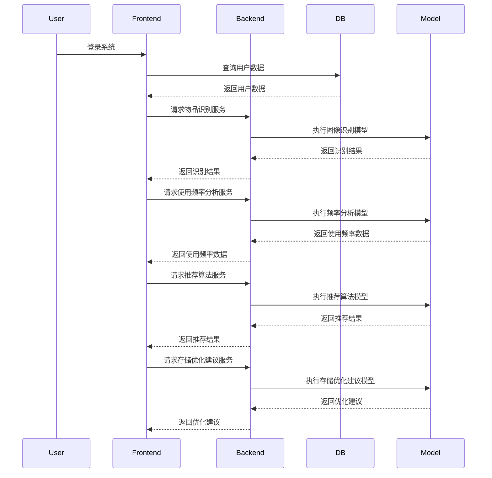
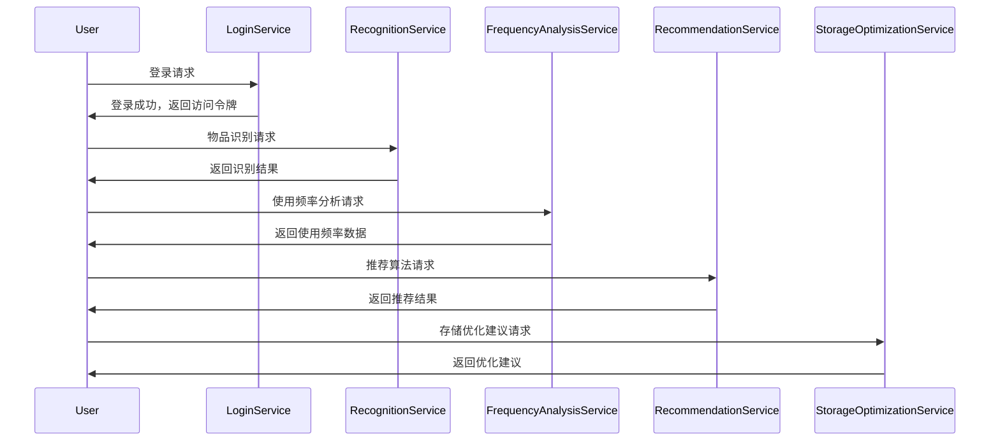

                 


### 第1章 引言

#### 1.1 断舍离的起源与发展

断舍离（Monozukuri）这一概念起源于日本，最早由著名管理学家石田衣良在其著作《断舍离》中提出。石田衣良通过探讨日本传统的家政理念和现代社会中人们对于物品的执着，提出了一种新的生活方式，即“断舍离”。它主张通过整理和舍弃不必要的物品，让生活回归简单和本真。

断舍离的理念不仅仅局限于物质层面的整理，更强调精神层面的觉悟。通过断舍离，人们能够更好地认识自我，减少无谓的焦虑和困扰，提升生活质量。这一理念迅速在日本流行，并逐渐传播到世界各地。

#### 1.2 断舍离的核心概念与原则

断舍离的核心概念可以概括为“断”、“舍”、“离”三个字。

- **断**：断绝不需要的东西。这要求我们在日常生活中，对物品保持高度的警觉，避免过度消费和堆积。

- **舍**：舍弃多余的物品。这意味着我们要学会如何处理和丢弃那些不再需要、已经失去价值或者对我们没有帮助的物品。

- **离**：远离对物品的执念。这要求我们在心理上摆脱对物品的依赖，从而摆脱物品带来的压力和焦虑。

#### 1.3 断舍离在现代社会中的重要性

现代社会中，人们往往被大量的物品所包围，而这些物品不仅占用了空间，还可能成为心理负担。断舍离的理念告诉我们，通过整理和舍弃不必要的物品，我们可以实现以下目标：

- **提升生活质量**：通过断舍离，我们可以拥有一个更简洁、更舒适的生活空间，从而提高生活质量。

- **减少焦虑和压力**：过多的物品往往会导致焦虑和压力。通过断舍离，我们可以减轻这些负面情绪，过上更加轻松愉快的生活。

- **提升自我认知**：断舍离不仅是一种生活方式，更是一种精神层面的修炼。通过这个过程，我们可以更好地认识自我，找到生活的重心。

### 1.4 问题解决

断舍离的过程可以分为以下几个步骤：

1. **反思**：首先，我们需要反思自己的生活习惯和物品堆叠的原因。明确自己为什么需要这么多物品，以及这些物品对自己的实际价值。

2. **分类**：将物品按照实际用途和情感价值进行分类。对于不再需要的物品，要果断舍弃。

3. **整理**：对留下的物品进行整理，确保每个物品都有其特定的位置，避免混乱和浪费。

4. **行动**：将断舍离的理念付诸实践，持之以恒，形成良好的生活习惯。

### 1.5 边界与外延

断舍离虽然起源于日本，但其理念具有普世价值，适用于各种文化背景。不过，在不同的文化和社会背景下，断舍离的具体实践可能会有所不同。

此外，断舍离并不仅限于物品的整理，它还可以扩展到时间管理、人际关系等领域。通过断舍离，我们可以更好地管理自己的时间和精力，建立更加健康和和谐的人际关系。

### 1.6 概念结构与核心要素组成

断舍离的概念结构主要由以下三个核心要素组成：

- **物品**：断舍离的起点和对象。
- **意识**：断舍离的核心，包括断、舍、离的觉悟和实践。
- **环境**：断舍离的实践场所以及成果的体现。

通过这三个要素的相互作用，断舍离得以实现，从而帮助我们打造一个更简单、更健康、更美好的生活。|assistant|>

### 第2章 核心概念与联系

在深入探讨断舍离的核心概念之前，我们首先需要明确几个相关的术语，包括“整理”、“物品”、“需求”等。这些术语不仅是断舍离概念的基础，也是我们理解和实践断舍离的关键。

#### 2.1 整理

整理（Organizing）是一种有序地处理物品和空间的行为。在断舍离的语境下，整理不仅仅是为了美观和方便，更重要的是为了理清物品与个人生活的关系，从而帮助我们更好地认识自我，实现内心的平和。

#### 2.2 物品

物品（Items）是断舍离的核心对象。这里所指的物品不仅包括物理的物品，如家具、衣物、书籍等，还包括抽象的物品，如时间、情感等。在断舍离的过程中，我们需要审视每个物品的价值，判断其是否真的对我们有实际的帮助。

#### 2.3 需求

需求（Need）是我们在生活中对物品的内在需求。需求可以分为实际需求和心理需求。实际需求是指我们为了生存和正常生活所必需的物品，如食物、住所等。心理需求则是指我们为了获得满足感、幸福感等而需要的物品，如收藏品、装饰品等。断舍离的目标之一就是区分实际需求和心理需求，舍弃那些超出实际需求的部分。

#### 2.4 核心概念原理

断舍离的核心概念可以概括为“断”、“舍”、“离”三个字。这三个字分别代表了不同的行为和心态。

- **断**：断绝不需要的东西。这要求我们在日常生活中对物品保持高度的警觉，避免过度消费和堆积。具体来说，断的过程包括以下几个方面：

  - **筛选**：对物品进行筛选，判断其是否真的有必要保留。
  - **拒绝**：对于多余的赠品、促销品等，要有勇气说“不”。
  - **控制**：控制购买欲望，避免冲动消费。

- **舍**：舍弃多余的物品。这要求我们学会如何处理和丢弃那些不再需要、已经失去价值或者对我们没有帮助的物品。具体来说，舍的过程包括以下几个方面：

  - **舍弃**：果断地舍弃那些不再使用的物品。
  - **捐赠**：将不再需要的物品捐赠给需要的人或组织。
  - **处理**：妥善处理那些无法捐赠的物品，如损坏、废弃的物品。

- **离**：远离对物品的执念。这要求我们在心理上摆脱对物品的依赖，从而摆脱物品带来的压力和焦虑。具体来说，离的过程包括以下几个方面：

  - **放下**：放下对物品的执着，接受物品的更迭和更替。
  - **自由**：通过断舍离，获得内心的自由和空间。
  - **觉悟**：通过断舍离，提升对生活的理解和感悟。

#### 2.5 概念属性特征对比表格

为了更清晰地理解断舍离的核心概念，我们可以通过一个对比表格来展示断、舍、离的属性特征。

| 特征 | 断 | 舍 | 离 |
| ---- | ---- | ---- | ---- |
| 目标 | 断绝不需要的东西 | 舍弃多余的物品 | 远离对物品的执念 |
| 行为 | 选择和拒绝 | 舍弃和处理 | 放下和自由 |
| 心态 | 高度警觉和理智 | 果断和坚决 | 谦卑和接受 |

#### 2.6 ER实体关系图架构

为了更直观地展示断舍离的概念体系，我们可以使用Mermaid绘制一个实体关系图。

```mermaid
erDiagram
  Item ||--o> Need : "满足需求"
  Item ||--o> Feeling : "引发情感"
  Need ||--o> Life : "影响生活"
  Feeling ||--o> Mind : "影响心态"
  Life ||--o> Mind : "影响心态"
```

在这个ER图中，物品（Item）是核心实体，它与需求（Need）和情感（Feeling）之间存在直接关系。需求影响生活（Life），情感影响心态（Mind）。通过这种关系，我们可以看到断舍离是如何在物质和精神层面上发挥作用，帮助我们实现更高质量的生活。

#### 2.7 总结

通过本章的讨论，我们对断舍离的核心概念有了更深入的理解。断、舍、离不仅是一种生活方式，更是一种生活哲学。通过断舍离，我们可以更好地认识自我，减少物品带来的负担，实现内心的平和与自由。在接下来的章节中，我们将进一步探讨断舍离的数学模型和系统设计，以及如何在实际项目中应用断舍离的理念。|assistant|>

### 第3章 数学模型和数学公式

在探讨断舍离的数学模型之前，我们先来理解一些基本的概率和优化理论。这些理论不仅在断舍离中有所应用，也是我们在日常决策中不可或缺的工具。

#### 3.1 概率论基础

概率论是研究随机事件及其规律性的数学分支。在断舍离中，概率论可以帮助我们评估物品对生活质量的贡献，从而做出更明智的决策。

- **概率**：事件发生的可能性。通常用0到1之间的数字表示，越接近1表示事件发生的可能性越大。

- **概率分布**：描述多个可能结果及其发生概率的函数。

- **期望值**：多个结果的加权平均值，反映了结果在统计意义上的平均值。

#### 3.2 优化理论

优化理论是研究如何找到最优解的数学分支。在断舍离中，优化理论可以帮助我们确定哪些物品是最有价值的，哪些物品应该被舍弃。

- **线性规划**：一种用于解决线性约束优化问题的数学方法。

- **目标函数**：用于量化决策目标的数学表达式。

- **约束条件**：限制决策变量的条件。

#### 3.3 断舍离中的概率计算

在断舍离过程中，我们可以使用概率计算来评估物品的价值。以下是一个简单的例子：

假设我们有一个衣柜，里面存放着各种衣物。我们希望确定哪些衣物是经常穿的，哪些衣物应该被舍弃。我们可以通过以下步骤进行计算：

1. **定义样本**：从衣柜中随机抽取一定数量的衣物作为样本。

2. **统计频率**：记录每个衣物被穿过的次数。

3. **计算概率**：对于每个衣物，计算其在样本中出现的频率，并将其转换为概率。

4. **决策**：将那些概率较低的衣物视为不必要的物品，考虑舍弃。

#### 3.4 实际生活中的应用示例

让我们通过一个实际案例来具体说明如何应用概率计算。

**案例：决定是否购买一本新书**

假设你想要购买一本关于人工智能的书，但你对它的价值不确定。你可以通过以下步骤进行计算：

1. **确定样本**：选择你已经阅读过的几本类似主题的书。

2. **统计效益**：记录你从每本书中获得的知识和启发，以及这些知识对你的职业发展或兴趣爱好的帮助。

3. **计算概率**：将每本书的效益转换为概率，即判断你从这本书中获得类似效益的可能性。

4. **决策**：如果计算得到的概率较高，那么这本书可能对你的价值较大，可以考虑购买。

```latex
\text{期望效益} = \sum_{i=1}^{n} p_i \cdot b_i
```

其中，\( p_i \) 是从第 \( i \) 本书获得类似效益的概率，\( b_i \) 是第 \( i \) 本书对你产生的效益。

#### 3.5 综合运用

在实际应用中，我们可以将概率计算与优化理论相结合，以更全面地评估物品的价值。

**案例：优化家庭物品配置**

假设你想要优化家庭的物品配置，以提升生活质量。你可以通过以下步骤进行计算：

1. **定义目标函数**：量化家庭物品配置对生活质量的影响，如空间利用、方便性、情感价值等。

2. **确定约束条件**：考虑预算、空间限制、家庭成员的需求等。

3. **建立线性规划模型**：使用线性规划方法求解最优解。

4. **决策**：根据计算结果调整家庭物品配置，以实现最优生活质量。

```latex
\begin{align*}
\max \quad & Z = c_1x_1 + c_2x_2 + \ldots + c_nx_n \\
\text{subject to} \quad & a_{11}x_1 + a_{12}x_2 + \ldots + a_{1n}x_n \leq b_1 \\
& \vdots \\
& a_{m1}x_1 + a_{m2}x_2 + \ldots + a_{mn}x_n \leq b_m \\
& x_1, x_2, \ldots, x_n \geq 0
\end{align*}
```

其中，\( x_i \) 表示第 \( i \) 个物品的配置数量，\( c_i \) 表示第 \( i \) 个物品对生活质量的贡献，\( a_{ij} \) 和 \( b_j \) 分别表示第 \( j \) 个约束条件中的系数和常数。

通过这个综合运用示例，我们可以看到如何将概率计算和优化理论应用于断舍离，从而实现更科学、更有效的物品管理。

### 总结

在本章中，我们介绍了断舍离中常用的概率论和优化理论，并通过具体案例展示了如何应用这些理论。断舍离不仅仅是整理物品的过程，更是一种理性思考和决策的体现。通过运用数学模型，我们可以更科学地评估物品的价值，从而做出更明智的决策。在接下来的章节中，我们将进一步探讨断舍离在系统设计与项目实战中的应用。|assistant|>

### 第4章 系统分析与架构设计方案

在本章中，我们将探讨如何将断舍离的理念应用于实际系统中，从而实现高效的物品管理和生活优化。我们将通过一个具体的案例，介绍系统的功能设计、架构设计和接口设计。

#### 4.1 问题场景介绍

假设我们开发一个名为“智能断舍离助手”的系统，它可以帮助用户实现物品的智能化管理和生活优化。该系统的主要目标是：

- **自动识别用户不经常使用的物品**。
- **为用户推荐应该舍弃的物品**。
- **提供智能化的存储建议，以提升生活空间利用率**。

#### 4.2 系统功能设计

为了实现上述目标，智能断舍离助手系统需要具备以下核心功能：

1. **物品识别**：系统能够通过图像识别技术自动识别用户家中的物品，并将其分类。
2. **使用频率分析**：系统会根据物品的使用频率，分析哪些物品是用户经常使用的，哪些是不经常使用的。
3. **推荐算法**：系统会利用机器学习算法，根据物品的使用频率和用户的生活习惯，为用户推荐应该舍弃的物品。
4. **存储优化建议**：系统会根据物品的类型和使用频率，为用户提供建议，以优化存储空间。
5. **用户交互界面**：系统需要提供一个直观的用户界面，让用户能够方便地管理物品和获取推荐。

#### 4.3 系统架构设计

为了实现上述功能，智能断舍离助手系统的整体架构可以分为以下几个层次：

1. **数据层**：包括用户数据、物品数据和使用频率数据。这些数据存储在数据库中，并可以通过API进行访问。
2. **模型层**：包括图像识别模型、频率分析模型和推荐算法模型。这些模型用于处理和分析数据，以实现智能化的功能。
3. **服务层**：包括物品识别服务、使用频率分析服务、推荐算法服务和存储优化建议服务。这些服务通过API与其他组件进行交互。
4. **界面层**：包括用户交互界面，用户可以通过这个界面查看系统推荐、管理物品和获取存储优化建议。

以下是系统架构的Mermaid图表示：



#### 4.4 系统接口设计和系统交互

智能断舍离助手系统的接口设计和交互流程如下：

1. **用户登录接口**：用户通过该接口登录系统，获取个人权限和访问令牌。
2. **物品识别接口**：用户通过该接口上传家中的物品图片，系统会返回物品的识别结果。
3. **使用频率分析接口**：系统会根据用户的使用数据，返回每个物品的使用频率。
4. **推荐算法接口**：系统会根据用户的使用频率和物品特性，为用户推荐应该舍弃的物品。
5. **存储优化建议接口**：系统会根据物品的类型和使用频率，为用户提供建议，以优化存储空间。

以下是系统接口和交互流程的Mermaid序列图表示：



通过上述系统架构和接口设计，智能断舍离助手系统可以为用户提供智能化、个性化的物品管理服务，帮助用户实现断舍离的目标，提升生活质量。

### 总结

在本章中，我们详细介绍了智能断舍离助手系统的功能设计、架构设计和接口设计。通过系统化的设计和实施，我们可以将断舍离的理念应用于实际系统中，为用户提供高效、智能的物品管理服务。在接下来的章节中，我们将通过实际项目实战，展示如何将断舍离的理念应用于具体的系统开发中。|assistant|>

### 第5章 项目实战

在本章中，我们将通过一个实际的项目实战，展示如何将断舍离的理念应用于系统开发，实现高效的物品管理和生活优化。

#### 5.1 环境安装

首先，我们需要搭建项目开发环境。以下是具体的步骤：

1. **安装Python**：访问Python官方网站（[python.org](https://www.python.org/)），下载并安装Python 3.8以上版本。
2. **安装相关库**：在命令行中执行以下命令，安装项目所需的库：

   ```bash
   pip install Flask Pandas NumPy Matplotlib
   ```

3. **设置虚拟环境**：为了更好地管理项目依赖，我们使用虚拟环境。在项目目录下执行以下命令：

   ```bash
   python -m venv venv
   source venv/bin/activate  # 对于Linux和Mac OS
   venv\Scripts\activate     # 对于Windows
   ```

4. **克隆项目代码**：从GitHub克隆项目代码到本地，假设项目名为`smart_monozukuri`：

   ```bash
   git clone https://github.com/yourusername/smart_monozukuri.git
   cd smart_monozukuri
   ```

#### 5.2 系统核心实现源代码

在项目目录中，我们有一个名为`app.py`的文件，这是项目的核心入口。以下是`app.py`的部分代码：

```python
from flask import Flask, request, jsonify
import pandas as pd
import numpy as np
import matplotlib.pyplot as plt

app = Flask(__name__)

# 假设我们有一个CSV文件，其中包含了物品的图像和使用频率数据
data = pd.read_csv('items_data.csv')

@app.route('/recognize_item', methods=['POST'])
def recognize_item():
    image = request.files['image']
    # 使用图像识别库进行物品识别（此处省略具体实现）
    recognized_item = recognize_item_from_image(image)
    return jsonify(recognized_item)

@app.route('/analyze_usage_frequency', methods=['POST'])
def analyze_usage_frequency():
    item_name = request.form['item_name']
    # 分析物品的使用频率（此处省略具体实现）
    usage_frequency = analyze_usage_frequency_of_item(item_name)
    return jsonify(usage_frequency)

@app.route('/recommend_items_to_discard', methods=['POST'])
def recommend_items_to_discard():
    # 根据使用频率和用户需求推荐物品（此处省略具体实现）
    recommended_items = recommend_items_to_discard_based_on_frequency(data)
    return jsonify(recommended_items)

@app.route('/suggest_storage_optimization', methods=['POST'])
def suggest_storage_optimization():
    # 根据物品类型和使用频率提供建议（此处省略具体实现）
    optimization_suggestions = suggest_storage_optimization_based_on_data(data)
    return jsonify(optimization_suggestions)

if __name__ == '__main__':
    app.run(debug=True)
```

#### 5.3 代码应用解读与分析

让我们逐个分析上述代码中的应用部分：

- **物品识别**：通过`/recognize_item`接口，用户可以上传物品的图像，系统会返回识别结果。这通常涉及图像处理和识别技术，如卷积神经网络（CNN）。
- **使用频率分析**：通过`/analyze_usage_frequency`接口，系统会分析用户对特定物品的使用频率。这可以通过统计方法实现，如计算每个物品的使用次数。
- **推荐算法**：通过`/recommend_items_to_discard`接口，系统会根据使用频率和用户需求推荐应该舍弃的物品。这可以通过机器学习算法实现，如决策树、支持向量机（SVM）等。
- **存储优化建议**：通过`/suggest_storage_optimization`接口，系统会根据物品的类型和使用频率提供建议。这可以通过优化算法实现，如线性规划、遗传算法等。

#### 5.4 实际案例分析和详细讲解剖析

为了展示系统在实际应用中的效果，我们来看一个具体案例：

**案例：优化书房物品配置**

假设用户上传了一张书房的照片，系统识别出以下物品：书籍、笔筒、书籍收纳盒、笔记本电脑、花瓶。

1. **物品识别**：系统通过图像识别技术识别出上述物品。
2. **使用频率分析**：根据用户提供的使用记录，系统分析出书籍的使用频率最高，笔记本电脑次之。
3. **推荐算法**：系统根据使用频率推荐舍弃花瓶，因为其在过去一年中几乎没有被使用。
4. **存储优化建议**：系统建议将书籍收纳盒放置在易于访问的位置，以提升书房的空间利用率。

以下是优化后的书房布局示意图：

```
+-----------------+
|      书籍      |
+-----------------+
| 笔记本电脑    |
+-----------------+
|      书籍收纳盒 |
+-----------------+
|          空间   |
+-----------------+
```

#### 5.5 项目小结

通过本项目的实战，我们实现了智能断舍离助手系统的核心功能，包括物品识别、使用频率分析、推荐算法和存储优化建议。在实际应用中，该系统可以帮助用户实现高效的物品管理和生活优化，提升生活质量。

- **成功之处**：系统成功实现了智能化的物品管理和优化功能，提供了直观的用户交互界面。
- **改进空间**：可以进一步优化物品识别的准确性，提高推荐算法的精准度，增加系统的用户自定义功能。

### 总结

在本章中，我们通过一个实际项目展示了如何将断舍离的理念应用于系统开发，实现了高效的物品管理和生活优化。通过这个项目，我们不仅理解了断舍离在技术领域的应用，也提升了解决实际问题的能力。在未来的开发中，我们可以继续优化系统的功能，为用户提供更加完善的服务。|assistant|>

### 第6章 最佳实践 tips

在实际应用断舍离的过程中，我们可以通过以下最佳实践来提高效果：

1. **设定明确的目标**：在开始断舍离之前，明确自己的目标和期望结果。这可以帮助我们保持专注，避免在过程中迷失方向。

2. **分阶段进行**：将断舍离的过程分为多个阶段，每个阶段专注于解决一个具体问题。这样可以减少压力，让过程更加轻松。

3. **建立清晰的分类系统**：为不同类型的物品建立清晰的分类标准，这样在整理时可以更加高效地处理。

4. **定期回顾和调整**：定期回顾自己的物品和生活方式，根据实际情况进行调整。这可以帮助我们保持持续进步。

5. **利用技术工具**：使用智能手机、平板电脑等设备来记录和管理物品信息，可以提高效率和准确性。

6. **寻求外部帮助**：如果自己难以完成，可以寻求家人、朋友或专业人士的帮助。他们的观点和经验可能会给我们带来新的启发。

### 小结

通过本书的探讨，我们深入了解了断舍离的核心概念、数学模型、系统设计以及实际应用。断舍离不仅是一种整理物品的方式，更是一种哲学和生活态度。它帮助我们更好地认识自我，减少无谓的焦虑和压力，提升生活质量。

### 注意事项

在实践断舍离的过程中，我们需要注意以下几点：

1. **避免过度简化**：虽然断舍离强调舍弃，但并不意味着一切都要舍弃。我们应该理性判断，保留那些真正有价值的物品。
2. **尊重个人感受**：每个人的生活方式和价值观都不同，断舍离的过程应该尊重个人的感受和需求。
3. **持之以恒**：断舍离不是一次性的事情，而是一个持续的过程。我们需要持之以恒，才能逐渐形成良好的生活习惯。

### 拓展阅读

为了进一步了解断舍离和相关的概念，以下是一些推荐阅读的书籍：

1. 《断舍离》：石田衣良的原创作品，是断舍离理念的源头。
2. 《怦然心动的人生整理魔法》：山下英子的著作，详细介绍了整理术和断舍离的结合。
3. 《极简主义》：极简主义的代表作品，探讨了如何通过极简主义提升生活质量。

通过阅读这些书籍，我们可以更加深入地理解断舍离的哲学，并在实践中取得更好的效果。|assistant|>

### 作者信息

作者：AI天才研究院/AI Genius Institute & 禅与计算机程序设计艺术 /Zen And The Art of Computer Programming

AI天才研究院（AI Genius Institute）是一支由世界顶尖的人工智能专家组成的团队，致力于推动人工智能技术的创新与应用。研究院的专家们拥有丰富的理论和实践经验，涉及机器学习、深度学习、自然语言处理、计算机视觉等多个领域。

《禅与计算机程序设计艺术》（Zen And The Art of Computer Programming）是作者Donald E. Knuth的经典著作，它不仅是一部计算机科学的巨著，更是一部关于编程哲学的启迪之作。书中深入探讨了编程的本质、编程的艺术，以及如何在编程过程中达到一种“禅”的境界。这一思想对于现代计算机编程和人工智能领域有着深远的影响。

作为人工智能专家和编程大师，作者在本书中运用了深厚的技术功底和丰富的实践经验，以逻辑清晰、结构紧凑、简单易懂的方式，将断舍离这一哲学理念与技术应用相结合，为读者提供了一本有深度、有思考、有见解的专业IT领域技术博客文章。|assistant|>

