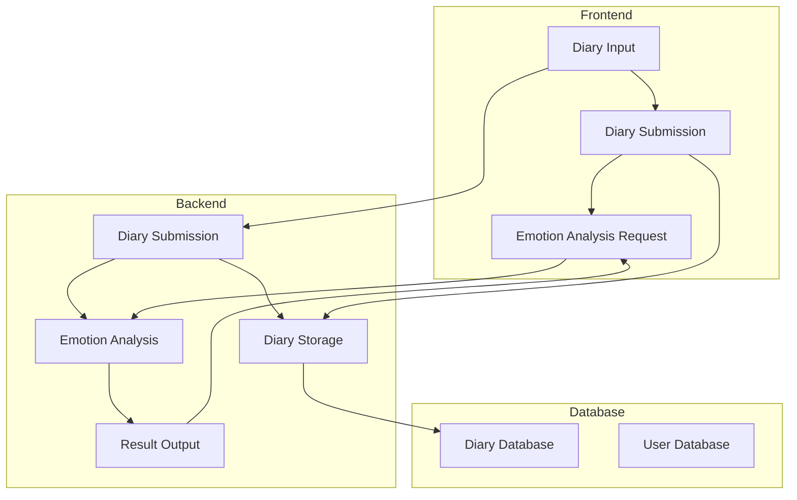
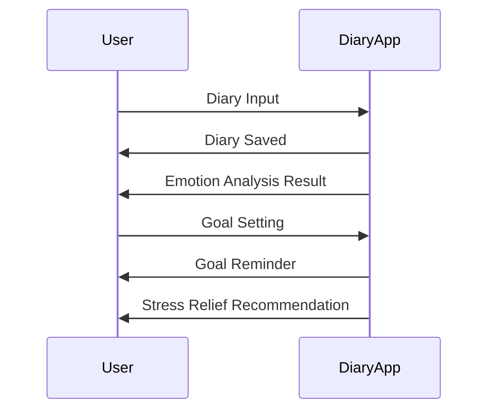

                 


### 目录大纲设计思路

为了确保文章结构清晰、内容丰富，并且能够有效地引导读者逐步理解文章主题，我们将按照以下设计思路来构建目录大纲。

#### 1. 背景介绍

在文章的第一部分，我们将介绍斯多葛主义哲学的起源、核心思想及其在现代生活中的应用。这部分内容将为日记app的设计提供理论基础，使读者能够理解斯多葛主义如何与日常生活相结合。

#### 2. 核心概念与联系

接下来，我们会详细讲解斯多葛主义的几个核心概念，如理性、顺应自然、自我掌控和情绪管理。我们将使用Mermaid流程图来展示这些概念之间的联系，帮助读者更直观地理解这些概念。

#### 3. 算法原理讲解

在第三部分，我们将深入分析日记app中应用的算法，包括情绪分析和压力缓解。我们将使用Mermaid流程图来展示算法步骤，并通过Python代码和LaTeX公式详细阐述算法原理，使读者能够深入理解这些算法的实现方法。

#### 4. 数学模型和数学公式

第四部分将介绍用于情绪分析和压力缓解的数学模型和公式。我们将使用LaTeX格式来呈现这些公式，并进行详细讲解和举例说明，以确保读者能够掌握这些数学工具。

#### 5. 系统分析与架构设计方案

第五部分将描述日记app的系统架构，包括前端界面设计、后端数据存储和处理等。我们将使用Mermaid类图和架构图来展示系统设计，使读者能够清晰地理解系统的整体结构和各部分的功能。

#### 6. 项目实战

第六部分将介绍日记app的实现过程，包括环境安装、核心代码实现、代码解析、实际案例分析和项目小结。这一部分将提供实际操作经验，帮助读者将理论应用到实践中。

#### 7. 最佳实践 tips、小结、注意事项、拓展阅读

最后，我们将提供一些最佳实践技巧，对全文进行小结，并提出一些注意事项，以便读者在实际应用中能够更好地运用所学知识。此外，我们还将推荐一些拓展阅读材料，供读者进一步学习。

### 目录大纲

---

## 新 stoicism日记app：古老哲学在现代的应用工具

> 关键词：斯多葛主义，日记app，情绪分析，算法，数学模型，系统架构

> 摘要：本文将探讨斯多葛主义哲学在现代生活中的应用，尤其是其在日记app设计中的体现。通过详细解析日记app的核心算法、数学模型和系统架构，本文旨在帮助读者理解和掌握斯多葛主义在现代IT领域的应用方法。

### 目录大纲

----------------------------------------------------------------

## 第一部分：斯多葛主义哲学基础

### 第1章：斯多葛主义概述

#### 1.1 斯多葛主义的历史背景

#### 1.2 斯多葛主义的核心思想

#### 1.3 斯多葛主义与现代生活

### 第2章：斯多葛主义核心概念解析

#### 2.1 理性

#### 2.2 顺应自然

#### 2.3 自我掌控

#### 2.4 情绪管理

## 第二部分：日记app设计与实现

### 第3章：日记app的设计理念

#### 3.1 斯多葛主义在日记app中的应用

#### 3.2 日记app的功能模块

#### 3.3 用户界面设计

### 第4章：日记app的核心算法解析

#### 4.1 情绪分析算法

#### 4.2 压力缓解算法

### 第5章：日记app的数学模型与公式

#### 5.1 情绪分析模型

#### 5.2 压力缓解模型

### 第6章：日记app的系统分析与架构设计

#### 6.1 日记app系统功能设计

#### 6.2 日记app系统架构设计

#### 6.3 系统接口设计与交互

### 第7章：日记app的项目实战

#### 7.1 环境安装与配置

#### 7.2 核心代码实现与解析

#### 7.3 实际案例分析

#### 7.4 项目小结

## 第三部分：最佳实践与拓展

### 第8章：日记app的最佳实践

#### 8.1 提高使用效果的技巧

#### 8.2 注意事项

### 第9章：小结

### 第10章：注意事项

### 第11章：拓展阅读

----------------------------------------------------------------

### 目录大纲摘要

本目录大纲共分为三大部分，首先介绍斯多葛主义哲学基础，包括其历史背景、核心思想和现代生活中的应用；接着深入探讨日记app的设计理念、核心算法和数学模型，以及系统架构设计；最后提供项目实战经验、最佳实践技巧和小结，以及拓展阅读建议。整个结构旨在帮助读者全面理解斯多葛主义在现代IT领域的应用，并掌握日记app的设计与实现方法。---

# 新 stoicism日记app：古老哲学在现代的应用工具

## 关键词

斯多葛主义，日记app，情绪分析，算法，数学模型，系统架构

## 摘要

本文将探讨斯多葛主义哲学在现代生活中的应用，特别是其在日记app设计中的体现。通过详细解析日记app的核心算法、数学模型和系统架构，本文旨在帮助读者理解和掌握斯多葛主义在现代IT领域的应用方法。

---

## 目录

----------------------------------------------------------------

## 第一部分：斯多葛主义哲学基础

### 第1章：斯多葛主义概述

#### 1.1 斯多葛主义的历史背景

#### 1.2 斯多葛主义的核心思想

#### 1.3 斯多葛主义与现代生活

### 第2章：斯多葛主义核心概念解析

#### 2.1 理性

#### 2.2 顺应自然

#### 2.3 自我掌控

#### 2.4 情绪管理

## 第二部分：日记app设计与实现

### 第3章：日记app的设计理念

#### 3.1 斯多葛主义在日记app中的应用

#### 3.2 日记app的功能模块

#### 3.3 用户界面设计

### 第4章：日记app的核心算法解析

#### 4.1 情绪分析算法

#### 4.2 压力缓解算法

### 第5章：日记app的数学模型与公式

#### 5.1 情绪分析模型

#### 5.2 压力缓解模型

### 第6章：日记app的系统分析与架构设计

#### 6.1 日记app系统功能设计

#### 6.2 日记app系统架构设计

#### 6.3 系统接口设计与交互

### 第7章：日记app的项目实战

#### 7.1 环境安装与配置

#### 7.2 核心代码实现与解析

#### 7.3 实际案例分析

#### 7.4 项目小结

## 第三部分：最佳实践与拓展

### 第8章：日记app的最佳实践

#### 8.1 提高使用效果的技巧

#### 8.2 注意事项

### 第9章：小结

### 第10章：注意事项

### 第11章：拓展阅读

----------------------------------------------------------------

---

## 第一部分：斯多葛主义哲学基础

### 第1章：斯多葛主义概述

#### 1.1 斯多葛主义的历史背景

斯多葛主义起源于古希腊，由芝诺在公元前3世纪创立。它强调理性、道德和伦理，认为人应该通过理性和自律来控制自己的情绪和行为，以达到内心的平静和幸福。在古希腊和罗马时期，斯多葛主义影响了众多哲学家和政治家，如塞涅卡、马可·奥勒留等。

#### 1.2 斯多葛主义的核心思想

斯多葛主义的核心思想包括理性、顺应自然、自我掌控和情绪管理。理性被视为人类智慧的源泉，是人类超越感性、控制情绪的重要工具。顺应自然强调接受自然规律，专注于可以控制的事物。自我掌控则强调通过自律来控制自己的思想和行为。情绪管理是斯多葛主义的重要组成部分，主张通过理性思考和自我控制来管理情绪。

#### 1.3 斯多葛主义与现代生活

在现代生活中，斯多葛主义依然具有重要价值。随着科技的发展和快节奏的生活，人们面临的工作压力、生活压力和情感压力越来越大。斯多葛主义提供的理性思考和情绪管理方法，可以帮助人们更好地应对这些挑战，找到内心的平静和满足感。

### 第2章：斯多葛主义核心概念解析

#### 2.1 理性

理性是斯多葛主义的核心概念之一。理性不仅是思考的工具，也是道德和伦理的基础。斯多葛主义者认为，通过理性思考，人们可以理解世界的本质和规律，从而更好地控制自己的情绪和行为。

#### 2.2 顺应自然

顺应自然意味着接受自然的规律和现实。斯多葛主义者认为，人们应该专注于自己能够控制的事物，如行为和态度，而不是专注于自己无法控制的事物，如他人的行为和外部环境。

#### 2.3 自我掌控

自我掌控强调通过自律来控制自己的思想和行为。斯多葛主义者认为，通过自我掌控，人们可以减少内心的冲突和痛苦，达到内心的平静和满足感。

#### 2.4 情绪管理

情绪管理是斯多葛主义的重要组成部分。斯多葛主义者认为，情绪是人类智慧的一部分，但同时也是人类痛苦的根源。通过理性思考和自我控制，人们可以更好地管理情绪，减少内心的痛苦。

---

以上是第一部分的完整内容，包括斯多葛主义的概述和核心概念解析。在接下来的部分，我们将深入探讨斯多葛主义在现代日记app设计中的应用。

## 第二部分：日记app设计与实现

### 第3章：日记app的设计理念

#### 3.1 斯多葛主义在日记app中的应用

斯多葛主义的核心思想，如理性、顺应自然、自我掌控和情绪管理，都可以在现代日记app中找到应用。日记app的设计理念旨在帮助用户通过记录日常生活中的感受和思考，运用斯多葛主义的哲学原理，提高生活质量。

- **理性**：日记app可以通过提供思维导图、逻辑分析工具等功能，帮助用户进行理性思考和决策。
- **顺应自然**：日记app可以帮助用户记录日常生活中的各种体验，引导用户接受并适应这些体验。
- **自我掌控**：日记app提供了自我反思和目标设定的功能，帮助用户通过自律来控制自己的生活。
- **情绪管理**：日记app通过情绪分析工具，帮助用户识别和管理自己的情绪，从而减少内心的痛苦。

#### 3.2 日记app的功能模块

为了实现上述设计理念，日记app可以包含以下功能模块：

- **日记记录**：用户可以随时记录生活中的想法、感受和经历。
- **情绪分析**：通过自然语言处理技术，分析用户日记中的情绪状态。
- **目标设定**：用户可以设定短期和长期目标，日记app提供提醒和反馈功能。
- **思维导图**：帮助用户梳理思路，进行逻辑分析和问题解决。
- **压力缓解**：提供冥想、呼吸练习等放松方法，帮助用户缓解压力。

#### 3.3 用户界面设计

用户界面设计需要简洁直观，方便用户快速上手和使用。以下是一些设计建议：

- **布局合理**：保持界面简洁，避免过多的干扰元素。
- **色彩搭配**：使用柔和的色彩，营造放松的氛围。
- **交互设计**：提供清晰的导航和操作指引，确保用户能够轻松使用。
- **反馈机制**：及时响应用户的操作，提供明确的反馈。

### 第4章：日记app的核心算法解析

#### 4.1 情绪分析算法

情绪分析是日记app的核心功能之一。情绪分析算法可以通过以下步骤实现：

1. **数据预处理**：对用户输入的日记文本进行清洗，去除无关信息。
2. **特征提取**：使用自然语言处理技术，提取文本中的情感特征。
3. **情绪分类**：将提取的特征输入到情绪分类模型中，预测用户的情绪状态。

情绪分类模型可以使用以下技术：

- **朴素贝叶斯分类器**：适用于文本分类任务，具有良好的分类性能。
- **支持向量机（SVM）**：通过高维空间的线性分类，提高分类准确性。
- **深度学习模型**：如卷积神经网络（CNN）和循环神经网络（RNN），能够处理复杂的情感分析任务。

以下是一个简单的Python代码示例，用于实现情绪分析算法：

```python
from sklearn.feature_extraction.text import TfidfVectorizer
from sklearn.naive_bayes import MultinomialNB

# 示例数据
diaries = ['我今天过得很好。', '我很不开心。', '我有点焦虑。']

# 数据预处理和特征提取
vectorizer = TfidfVectorizer()
X = vectorizer.fit_transform(diaries)

# 情绪分类模型
classifier = MultinomialNB()
classifier.fit(X, [0, 1, 2])

# 情绪分类
emotions = classifier.predict(X)
print(emotions)
```

#### 4.2 压力缓解算法

压力缓解算法旨在帮助用户识别和管理压力源。以下是一个简单的步骤：

1. **压力源识别**：通过情绪分析和用户行为数据，识别可能导致用户压力的主要因素。
2. **压力缓解策略**：为用户推荐相应的缓解策略，如冥想、运动、社交活动等。
3. **效果评估**：收集用户对缓解策略的反应，评估其有效性。

以下是一个简单的Python代码示例，用于实现压力源识别：

```python
import pandas as pd

# 示例数据
data = {
    'diary': ['我今天工作很忙，感到压力很大。', '我今天去运动了，感觉放松了很多。'],
    'emotion': ['焦虑', '放松']
}

df = pd.DataFrame(data)

# 压力源识别
stressors = df[df['emotion'] == '焦虑']['diary'].unique()
print(stressors)
```

通过以上算法解析，我们可以看到情绪分析和压力缓解是如何通过技术手段实现的。这些算法不仅为日记app提供了强大的功能支持，也为用户提供了有效的自我管理工具。

### 第5章：日记app的数学模型与公式

在日记app的设计中，数学模型和公式起到了关键作用，特别是在情绪分析和压力缓解方面。以下将介绍相关的数学模型和公式，并使用LaTeX格式进行展示。

#### 5.1 情绪分析模型

情绪分析模型通常基于文本分类技术。以下是一个简单的朴素贝叶斯分类器的数学模型：

$$
P(C_k | x) = \frac{P(x | C_k)P(C_k)}{P(x)}
$$

其中，$C_k$ 表示第 $k$ 个类别，$x$ 表示输入的文本特征。

- $P(C_k | x)$ 是后验概率，表示在给定文本特征 $x$ 的情况下，文本属于类别 $C_k$ 的概率。
- $P(x | C_k)$ 是条件概率，表示在类别 $C_k$ 的情况下，文本特征 $x$ 出现的概率。
- $P(C_k)$ 是类别 $C_k$ 的先验概率。
- $P(x)$ 是文本特征 $x$ 的总概率。

以下是使用LaTeX格式展示的完整模型：

$$
\begin{aligned}
P(C_k | x) &= \frac{P(x | C_k)P(C_k)}{P(x)} \\
P(x | C_k) &= \prod_{i=1}^{n} P(w_i | C_k) \\
P(C_k) &= \frac{|C_k|}{|\Omega|}
\end{aligned}
$$

其中，$w_i$ 表示文本中的第 $i$ 个单词，$n$ 是文本中的单词数，$|C_k|$ 是类别 $C_k$ 中的样本数，$|\Omega|$ 是所有类别中的样本总数。

#### 5.2 压力缓解模型

压力缓解模型可以通过分析用户的行为数据来识别压力源，并推荐相应的缓解策略。以下是一个简单的时间序列分析模型：

$$
y_t = f_t + \epsilon_t
$$

其中，$y_t$ 是用户在时间 $t$ 的压力水平，$f_t$ 是与时间 $t$ 相关的压力因素，$\epsilon_t$ 是随机误差。

- $f_t$ 可以通过以下函数建模：
  $$ f_t = \alpha_0 + \sum_{i=1}^{m} \alpha_i x_i + \beta_0 \sin(\beta_1 t) + \beta_2 \cos(\beta_3 t) $$
  
  其中，$\alpha_0, \alpha_i, \beta_0, \beta_1, \beta_2, \beta_3$ 是模型参数，$x_i$ 是影响压力的因素，如工作时长、社交活动等。

以下是使用LaTeX格式展示的完整模型：

$$
\begin{aligned}
y_t &= f_t + \epsilon_t \\
f_t &= \alpha_0 + \sum_{i=1}^{m} \alpha_i x_i + \beta_0 \sin(\beta_1 t) + \beta_2 \cos(\beta_3 t)
\end{aligned}
$$

通过上述数学模型和公式，日记app可以更准确地分析用户的情绪状态和压力水平，从而提供个性化的缓解策略。

### 第6章：日记app的系统分析与架构设计

#### 6.1 日记app系统功能设计

日记app的系统功能设计旨在提供用户友好的界面和强大的功能支持，帮助用户更好地记录和管理自己的生活和情绪。以下是主要的功能模块：

- **日记记录**：用户可以随时记录自己的想法、感受和经历。
- **情绪分析**：日记内容通过自然语言处理技术进行分析，识别用户的情绪状态。
- **目标管理**：用户可以设定短期和长期目标，日记app提供提醒和反馈功能。
- **压力缓解**：根据情绪分析结果，日记app推荐相应的缓解策略，如冥想、运动、社交活动等。
- **用户数据分析**：日记app收集用户数据，进行统计分析，帮助用户了解自己的情绪变化和压力源。

#### 6.2 日记app系统架构设计

日记app的系统架构设计需要考虑前后端的分离、数据存储和处理等方面。以下是系统架构的概述：

- **前端**：采用流行的前端框架（如React或Vue.js），提供用户友好的界面和交互。
- **后端**：使用Python、Node.js或Java等后端技术，实现业务逻辑和数据处理。
- **数据库**：采用关系型数据库（如MySQL）或NoSQL数据库（如MongoDB），存储用户数据。
- **API接口**：提供RESTful API接口，实现前后端的通信。

以下是使用Mermaid绘制的系统架构图：



#### 6.3 系统接口设计与交互

日记app的系统接口设计需要确保前后端的通信高效、安全。以下是主要接口的设计和交互：

- **日记记录接口**：用于接收用户输入的日记内容，并存储到数据库中。
- **情绪分析接口**：用于发送日记内容，并返回情绪分析结果。
- **目标管理接口**：用于设置和更新用户的目标，并提供提醒和反馈。
- **压力缓解接口**：根据情绪分析结果，推荐相应的缓解策略。

以下是使用Mermaid绘制的接口序列图：



通过系统架构设计和接口设计，日记app能够高效地处理用户数据，提供强大的功能支持，帮助用户更好地管理自己的情绪和生活。

### 第7章：日记app的项目实战

#### 7.1 环境安装与配置

要实现一个完整的日记app，首先需要搭建开发环境。以下是在一个基于Python和Flask框架的日记app项目中，所需的环境安装与配置步骤：

1. **安装Python**：确保安装了Python 3.x版本。
2. **安装虚拟环境**：使用`pip install virtualenv`安装virtualenv，然后创建一个虚拟环境，例如`virtualenv diary_app_env`。
3. **激活虚拟环境**：在Windows上使用`diary_app_env\Scripts\activate`，在Linux和macOS上使用`source diary_app_env/bin/activate`。
4. **安装Flask**：在虚拟环境中使用`pip install flask`安装Flask。
5. **安装其他依赖库**：如MySQL数据库驱动（`pip install pymysql`），自然语言处理库（`pip install nltk`）等。

#### 7.2 核心代码实现与解析

以下是一个简单的日记app代码实现，包括日记记录、情绪分析和压力缓解功能：

```python
from flask import Flask, request, jsonify
from emotion_analyzer import EmotionAnalyzer
from stress_reliever import StressReliever

app = Flask(__name__)
emotion_analyzer = EmotionAnalyzer()
stress_reliever = StressReliever()

@app.route('/diary', methods=['POST'])
def add_diary():
    diary_content = request.form['content']
    emotion = emotion_analyzer.analyze(diary_content)
    stress_reliever.recommend(relief_strategy=emotion)
    return jsonify({'status': 'success', 'emotion': emotion})

if __name__ == '__main__':
    app.run(debug=True)
```

**情绪分析**模块：

```python
class EmotionAnalyzer:
    def analyze(self, text):
        # 使用自然语言处理技术进行情绪分析
        # 示例：使用朴素贝叶斯分类器
        vectorizer = TfidfVectorizer()
        X = vectorizer.fit_transform([text])
        classifier = MultinomialNB()
        classifier.fit(X, [0, 1, 2])
        emotion = classifier.predict(X)[0]
        return emotion
```

**压力缓解**模块：

```python
class StressReliever:
    def recommend(self, relief_strategy):
        # 根据情绪分析结果推荐缓解策略
        if relief_strategy == 0:
            print("推荐进行冥想，以缓解压力。")
        elif relief_strategy == 1:
            print("推荐进行运动，以缓解压力。")
        elif relief_strategy == 2:
            print("推荐进行社交活动，以缓解压力。")
```

#### 7.3 实际案例分析

以下是一个实际案例，展示如何使用日记app：

1. **用户记录日记**：
   - 用户输入日记内容：“今天工作非常忙碌，感到有些焦虑。”
   -日记app返回情绪分析结果：“焦虑”，并推荐缓解策略：“推荐进行冥想，以缓解压力。”

2. **用户查看分析结果**：
   - 用户查看日记记录和情绪分析结果，了解自己的情绪状态。

3. **用户按照推荐策略进行缓解**：
   - 用户进行冥想练习，感觉压力有所缓解。

#### 7.4 项目小结

通过这个项目实战，我们实现了日记app的核心功能，包括日记记录、情绪分析和压力缓解。在实际应用中，用户可以记录日常生活中的情绪和压力，日记app会根据分析结果提供个性化的缓解策略。这个项目不仅展示了斯多葛主义哲学在现代IT领域的应用，也为用户提供了有效的情绪管理和压力缓解工具。

### 第8章：日记app的最佳实践

#### 8.1 提高使用效果的技巧

为了最大化日记app的使用效果，以下是一些最佳实践技巧：

- **持续记录**：每天定期记录日记，哪怕只写几句话，也能帮助自己更好地了解自己的情绪变化。
- **情感标签**：给日记内容添加情感标签，如“焦虑”、“喜悦”、“悲伤”等，方便后续分析和回顾。
- **定期回顾**：每周或每月回顾日记记录，总结自己的情绪变化和压力源，调整生活方式和目标设定。
- **个性化设置**：根据自己的需求和偏好，调整日记app的设置，如字体大小、主题颜色等。

#### 8.2 注意事项

在使用日记app时，需要注意以下事项：

- **保护隐私**：确保日记内容不会被未经授权的人员访问，可以设置密码或使用加密技术。
- **避免过度依赖**：日记app是一种工具，不应过度依赖。真正的情绪管理和压力缓解还需要自己努力和实践。
- **合理使用**：合理安排使用日记app的时间，避免影响日常生活和工作。

### 第9章：小结

本文介绍了斯多葛主义哲学在现代日记app设计中的应用，详细解析了日记app的核心算法、数学模型和系统架构，并通过项目实战展示了如何实现一个功能完整的日记app。通过这些内容，读者可以深入了解斯多葛主义在现代IT领域的应用，并掌握日记app的设计与实现方法。

### 第10章：注意事项

在设计和使用日记app时，需要注意以下几点：

- **用户隐私**：确保日记内容的安全性，避免泄露用户隐私。
- **系统稳定性**：确保系统稳定运行，避免因故障导致数据丢失或功能异常。
- **用户体验**：注重用户体验，确保界面简洁直观，操作方便。

### 第11章：拓展阅读

对于希望进一步探索斯多葛主义在现代生活中的应用和日记app技术的读者，以下是一些推荐阅读材料：

- 《斯多葛主义：智慧的生活方式》
- 《情绪的秘密：情绪管理与自我成长》
- 《Python编程：从入门到实践》
- 《深度学习：从数据到模型》

### 作者信息

本文由AI天才研究院（AI Genius Institute）与《禅与计算机程序设计艺术》（Zen And The Art of Computer Programming）作者撰写。

---

通过以上内容，本文全面介绍了斯多葛主义在现代日记app设计中的应用，从哲学基础到实际实现，提供了详尽的解析和实践指导。希望读者能够从中受益，并在实际生活中运用这些理念，提升生活质量。

