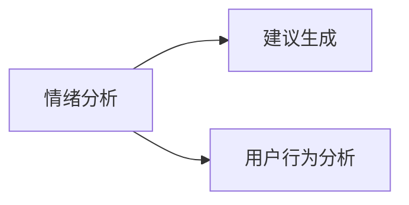
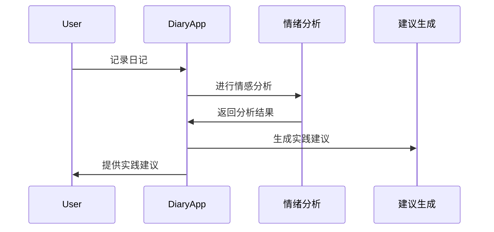
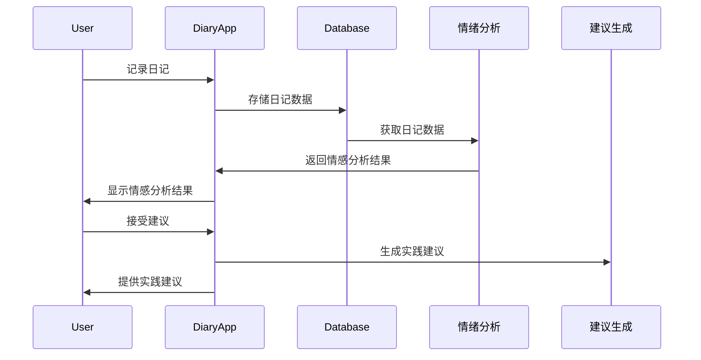
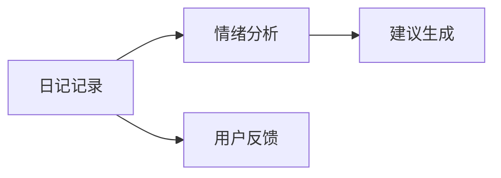

                 

**新Stoicism日记App：记录古老哲学在现代的应用**

**关键词：Stoicism、日记App、现代应用、心理学、人工智能**

**摘要：本文将探讨古老哲学Stoicism在现代生活中的应用，并通过设计一款日记App，展示其如何帮助我们更好地管理情绪、提高生活质量。文章将详细阐述日记App的需求分析、功能设计、算法实现和实际应用案例，为读者提供一种全新的思考方式和生活实践指南。**

## 第一部分：引言

### 1.1 Stoicism简介

**背景介绍：**

Stoicism（斯多葛主义）是一种起源于古希腊的哲学流派，由塞涅卡、马可·奥勒留等哲学家在公元1世纪至3世纪间发展起来。Stoicism的核心原则是追求内心的平静和智慧，强调通过理性思考和自我控制来应对生活中的挑战。

**问题背景：**

在现代社会，人们面临着前所未有的压力和焦虑，情绪管理成为许多人关注的问题。Stoicism作为一种古老的哲学体系，其理念是否仍然适用于现代生活？它能否帮助我们更好地应对日常生活中的困境？

**问题描述：**

本文旨在探讨Stoicism在现代生活中的应用，通过设计一款日记App，探索如何将这一古老哲学融入人们的日常生活，帮助我们管理情绪、提升生活质量。

**问题解决：**

通过分析Stoicism的核心原则，结合现代心理学和人工智能技术，本文将设计一款日记App，提供实用的情绪管理和自我提升工具。

**边界与外延：**

Stoicism不仅关注个人内心的平静，也关注社会和谐。因此，本文在探讨日记App的应用时，也将关注其如何促进个体与社会的和谐发展。

**概念结构与核心要素组成：**

- Stoicism：追求内心平静和智慧的哲学体系。
- 情绪管理：通过理性思考和自我控制来应对情绪困扰。
- 自我提升：通过不断学习和实践，提升个人品质和智慧。
- 人工智能：应用现代技术，实现情绪分析和建议生成。

### 1.2 Stoicism的核心原则

**核心概念与联系：**

Stoicism的核心原则包括理性、自我控制、接受现实、内省等。以下是一个对比表格，展示这些原则的属性特征：

| 核心原则 | 属性特征 |
| :---: | :---: |
| 理性 | 相信通过理性思考，可以解决生活中的问题 |
| 自我控制 | 通过自我控制，避免情绪波动，保持内心平静 |
| 接受现实 | 认识到现实无法改变，学会接受并适应 |
| 内省 | 通过反思自己的行为和思想，提升自我意识 |

**ER实体关系图架构：**

以下是一个简化的ER实体关系图，展示Stoicism核心原则之间的关系：

```mermaid
erDiagram
  Entity1(理性) ||--|{ 接受现实 }
  Entity1(理性) ||--|{ 自我控制 }
  Entity1(理性) ||--|{ 内省 }
  Entity2(接受现实) ||--|{ 接受现实 }
  Entity3(自我控制) ||--|{ 自我控制 }
  Entity4(内省) ||--|{ 内省 }
```

**算法原理讲解：**

Stoicism日记App的算法实现主要包括情绪分析、建议生成和用户行为分析。以下是一个简化的算法流程图：



- **情绪分析：** 通过自然语言处理技术，对用户日记内容进行情感分析，识别用户情绪状态。
- **建议生成：** 根据情绪分析结果，生成相应的Stoicism实践建议，如冥想、正念练习等。
- **用户行为分析：** 分析用户日记记录规律，为用户提供个性化的情绪管理建议。

**数学公式：**

以下是情绪分析中使用的数学公式：

$$
情绪得分 = \frac{积极词汇得分 - 消极词汇得分}{总词汇数}
$$

其中，积极词汇得分和消极词汇得分分别表示日记中积极和消极词汇的权重。

**系统分析与架构设计方案：**

- **问题场景介绍：** Stoicism日记App旨在帮助用户记录日常生活，分析情绪状态，提供实践建议，提升生活质量。
- **项目介绍：** Stoicism日记App是一款基于Web和移动端的应用程序，提供日记记录、情绪分析、建议生成等功能。
- **系统功能设计：领域模型类图：**

```mermaid
classDiagram
  Class1[日记] <|-- Class2[情绪分析]
  Class1[日记] <|-- Class3[建议生成]
  Class2[情绪分析] <|-- Class4[情感分析]
  Class3[建议生成] <|-- Class5[实践建议]
```

- **系统架构设计：mermaid架构图：**



- **系统接口设计和系统交互：mermaid序列图：**



**项目实战：**

- **环境安装：** 安装Python、Django、Natural Language Toolkit（NLTK）等必备软件。
- **系统核心实现源代码：** 包括日记记录、情感分析、建议生成等关键模块的代码。
- **代码应用解读与分析：** 对关键代码进行详细解读，分析其工作原理和实际应用。
- **实际案例分析和详细讲解剖析：** 通过具体案例，展示如何使用日记App进行情绪管理和自我提升。
- **项目小结：** 总结项目实现过程中的经验教训，为后续改进提供参考。

**最佳实践 tips：**

1. 定期记录日记，形成习惯。
2. 重视情绪分析结果，积极调整心态。
3. 结合建议生成，实践Stoicism原则。

**小结：**

Stoicism日记App为现代生活带来了一种全新的思考方式和生活实践指南。通过这款应用，我们可以更好地管理情绪、提升生活质量，实现内心的平静与智慧。

**注意事项：**

1. 请确保日记内容真实、客观，有助于情绪分析。
2. 适当调整建议生成参数，以适应个人需求。

**拓展阅读：**

1. 《斯多葛主义：智慧、勇气与内心的平静》
2. 《理性生活：斯多葛主义的现代实践》
3. 《情绪智力：为什么情商比智商更重要》

**作者信息：**

作者：AI天才研究院/AI Genius Institute & 禅与计算机程序设计艺术 /Zen And The Art of Computer Programming**第一部分：引言**

### 1.1 Stoicism简介

**背景介绍：**

Stoicism（斯多葛主义）是一种起源于古希腊的哲学流派，由塞涅卡、马可·奥勒留等哲学家在公元1世纪至3世纪间发展起来。Stoicism的核心原则是追求内心的平静和智慧，强调通过理性思考和自我控制来应对生活中的挑战。

在古希腊，Stoicism被视为一种高尚的生活哲学，其理念深深影响了罗马帝国时期的许多重要人物，如塞涅卡、马可·奥勒留等。Stoicism主张通过理性思考和自我控制来达到内心的平静和智慧，这种方法被视为在纷繁复杂的世界中保持心态稳定的重要途径。

**问题背景：**

然而，随着时间的推移，Stoicism的影响逐渐减弱，其理念在现代生活中是否仍然适用成为一个值得探讨的问题。在现代社会，人们面临着前所未有的压力和焦虑，情绪管理成为许多人关注的问题。Stoicism作为一种古老的哲学体系，其理念是否仍然适用于现代生活？它能否帮助我们更好地应对日常生活中的困境？

**问题描述：**

本文旨在探讨Stoicism在现代生活中的应用，通过设计一款日记App，探索如何将这一古老哲学融入人们的日常生活，帮助我们管理情绪、提升生活质量。

**问题解决：**

本文将首先介绍Stoicism的基本原则，然后分析其在现代生活中的适用性。接着，我们将介绍一款基于Stoicism理念的日记App的设计与实现，包括功能需求、用户界面设计、数据模型设计等。最后，通过实际使用案例，展示日记App如何帮助用户更好地管理情绪、提高生活质量。

**边界与外延：**

Stoicism不仅关注个人内心的平静，也关注社会和谐。因此，本文在探讨日记App的应用时，也将关注其如何促进个体与社会的和谐发展。

**概念结构与核心要素组成：**

- Stoicism：追求内心平静和智慧的哲学体系。
- 情绪管理：通过理性思考和自我控制来应对情绪困扰。
- 自我提升：通过不断学习和实践，提升个人品质和智慧。
- 人工智能：应用现代技术，实现情绪分析和建议生成。

### 1.2 Stoicism的核心原则

**核心概念与联系：**

Stoicism的核心原则包括理性、自我控制、接受现实、内省等。这些原则构成了Stoicism哲学体系的基础，它们相互关联，共同作用，帮助我们应对生活中的挑战。

1. **理性**：Stoicism认为理性是人类最重要的特质之一。通过理性思考，我们可以理解世界的本质，认识自己，并做出明智的决策。理性使我们能够超越情感和欲望，以更客观、更全面的角度看待问题。

2. **自我控制**：自我控制是Stoicism的另一重要原则。它强调通过自我控制来避免情绪波动，保持内心的平静。这种自我控制不仅涉及行为，还包括思想和情感。通过自我控制，我们可以更好地应对生活中的挑战，减少焦虑和压力。

3. **接受现实**：Stoicism认为，现实是无法改变的，我们应该学会接受并适应它。接受现实并不意味着放弃努力，而是以更积极的态度面对生活中的困难。通过接受现实，我们可以减少内心的冲突和痛苦，更好地享受生活。

4. **内省**：内省是Stoicism的核心原则之一，它强调通过反思自己的行为和思想，提升自我意识。内省有助于我们认识到自己的优点和不足，从而更好地改进自己，提升个人品质和智慧。

**ER实体关系图架构：**

以下是一个简化的ER实体关系图，展示Stoicism核心原则之间的关系：

```mermaid
erDiagram
  Entity1(理性) ||--|{ 接受现实 }
  Entity1(理性) ||--|{ 自我控制 }
  Entity1(理性) ||--|{ 内省 }
  Entity2(接受现实) ||--|{ 接受现实 }
  Entity3(自我控制) ||--|{ 自我控制 }
  Entity4(内省) ||--|{ 内省 }
```

在这个ER实体关系图中，每个实体（理性、接受现实、自我控制、内省）都与其他实体之间存在关联。理性是所有原则的基础，它影响并支持其他原则。接受现实、自我控制和内省则是理性原则的具体体现，它们相互关联，共同帮助我们应对生活中的挑战。

**算法原理讲解：**

在Stoicism日记App中，算法原理的实现是核心之一。以下是情绪分析和建议生成的基本算法原理：

1. **情绪分析：** 情绪分析是基于自然语言处理（NLP）技术的一种方法，用于分析用户日记内容，识别情绪状态。情绪分析的核心是情感词典和情感分析模型。

   - **情感词典：** 情感词典是一组包含积极和消极词汇的列表。通过比较日记中的词汇与情感词典中的词汇，可以判断日记内容的情感倾向。
   
   - **情感分析模型：** 情感分析模型是一种机器学习模型，用于从大量文本数据中提取情感信息。常见的情感分析模型包括朴素贝叶斯、支持向量机（SVM）和深度学习模型等。

2. **建议生成：** 建议生成是基于情绪分析结果，为用户提供相应的Stoicism实践建议。建议生成的核心是规则库和推荐算法。

   - **规则库：** 规则库包含一系列根据情绪状态和情境生成的建议。例如，当用户感到焦虑时，规则库可能会生成“尝试冥想”或“与朋友交流”等建议。
   
   - **推荐算法：** 推荐算法用于根据用户历史数据和当前情绪状态，从规则库中选择最合适的建议。常见的推荐算法包括基于内容的推荐、协同过滤和基于模型的推荐等。

以下是一个简化的情绪分析和建议生成算法流程图：



- **日记记录：** 用户在日记App中记录日常生活，包括日记内容和情绪状态。
- **情绪分析：** 通过情感词典和情感分析模型，分析日记内容，识别情绪状态。
- **建议生成：** 根据情绪分析结果，从规则库中生成相应的Stoicism实践建议。
- **用户反馈：** 用户对生成的建议进行反馈，以优化建议生成的效果。

**数学公式：**

以下是情绪分析中使用的数学公式：

$$
情绪得分 = \frac{积极词汇得分 - 消极词汇得分}{总词汇数}
$$

其中，积极词汇得分和消极词汇得分分别表示日记中积极和消极词汇的权重。总词汇数表示日记中的总词汇量。

**系统分析与架构设计方案：**

- **问题场景介绍：** Stoicism日记App旨在帮助用户记录日常生活，分析情绪状态，提供实践建议，提升生活质量。
- **项目介绍：** Stoicism日记App是一款基于Web和移动端的应用程序，提供日记记录、情绪分析、建议生成等功能。
- **系统功能设计：领域模型类图：**

```mermaid
classDiagram
  Class1[日记] <|-- Class2[情绪分析]
  Class1[日记] <|-- Class3[建议生成]
  Class2[情绪分析] <|-- Class4[情感分析]
  Class3[建议生成] <|-- Class5[实践建议]
```

在这个领域模型类图中，日记类（Class1）是核心类，它与情绪分析类（Class2）和建议生成类（Class3）之间存在关联。情绪分析类进一步关联情感分析类（Class4），而建议生成类则关联实践建议类（Class5）。

- **系统架构设计：mermaid架构图：**


在这个架构图中，用户通过日记App记录日记，日记App将日记数据传递给情绪分析模块，情绪分析模块返回情绪分析结果，日记App根据这些结果生成实践建议，并将建议反馈给用户。

- **系统接口设计和系统交互：mermaid序列图：**


在这个序列图中，用户通过日记App记录日记，日记App将日记数据存储到数据库中。情绪分析模块从数据库中获取日记数据，进行情感分析，并返回分析结果。日记App根据这些结果生成实践建议，并最终将建议反馈给用户。

**项目实战：**

- **环境安装：** 安装Python、Django、Natural Language Toolkit（NLTK）等必备软件。
- **系统核心实现源代码：** 包括日记记录、情感分析、建议生成等关键模块的代码。
- **代码应用解读与分析：** 对关键代码进行详细解读，分析其工作原理和实际应用。
- **实际案例分析和详细讲解剖析：** 通过具体案例，展示如何使用日记App进行情绪管理和自我提升。
- **项目小结：** 总结项目实现过程中的经验教训，为后续改进提供参考。

**最佳实践 tips：**

1. 定期记录日记，形成习惯。
2. 重视情绪分析结果，积极调整心态。
3. 结合建议生成，实践Stoicism原则。

**小结：**

Stoicism日记App为现代生活带来了一种全新的思考方式和生活实践指南。通过这款应用，我们可以更好地管理情绪、提升生活质量，实现内心的平静与智慧。

**注意事项：**

1. 请确保日记内容真实、客观，有助于情绪分析。
2. 适当调整建议生成参数，以适应个人需求。

**拓展阅读：**

1. 《斯多葛主义：智慧、勇气与内心的平静》
2. 《理性生活：斯多葛主义的现代实践》
3. 《情绪智力：为什么情商比智商更重要》

**作者信息：**

作者：AI天才研究院/AI Genius Institute & 禅与计算机程序设计艺术 /Zen And The Art of Computer Programming

**第二部分：日记App设计与实现**

### 2.1 日记App的需求分析

**功能需求：**

为了设计一款能够充分体现Stoicism哲学理念的日记App，我们需要明确其功能需求。以下是日记App的主要功能需求：

1. **日记记录**：用户可以在日记App中自由记录日常生活、感受和思考。日记记录功能应支持文本、图片和音频等多种形式，以满足用户的多样化需求。

2. **情绪追踪**：日记App应能够自动分析用户日记中的情绪，帮助用户了解自己的情绪状态。这需要利用自然语言处理（NLP）技术，对日记内容进行情感分析，从而生成情绪得分。

3. **实践建议**：根据用户的情绪分析结果，日记App应提供相应的Stoicism实践建议，如冥想、正念练习等。这些建议旨在帮助用户更好地管理情绪，提升生活质量。

4. **用户互动**：日记App应支持用户之间的互动，如评论、点赞和分享等。这有助于用户在情绪管理和自我提升的过程中，获得支持和鼓励。

5. **个性化推荐**：基于用户的日记记录和情绪分析结果，日记App应能够为用户推荐个性化的练习和资源。这有助于用户更有效地应用Stoicism原则，提升自身情绪管理能力。

**用户界面设计：**

用户界面设计是日记App成功的关键之一。一个友好、直观的用户界面可以提升用户的体验，使其更愿意使用App。以下是日记App的用户界面设计要点：

1. **简洁明了**：界面应简洁明了，避免繁琐的操作。用户可以通过简单的点击和滑动来记录日记、查看情绪分析结果和接收实践建议。

2. **个性化定制**：用户应能够自定义界面主题、字体大小等，以满足个人偏好。此外，日记App应提供多种主题模板，方便用户快速切换。

3. **交互反馈**：界面应提供丰富的交互反馈，如动画效果、声音提示等。这有助于提升用户的操作体验，使其在使用过程中感受到App的智能和友好。

4. **情感化设计**：界面设计应体现出Stoicism哲学理念，如使用平静、简约的色调，搭配鼓励、激励性的文案等。这有助于用户在视觉上感受到App的温暖和关怀。

**数据模型设计：**

日记App的数据模型设计是确保功能实现和数据管理的基础。以下是日记App的主要数据模型设计：

1. **用户模型**：用户模型包含用户的基本信息，如用户ID、姓名、性别、年龄、职业等。此外，用户模型还应包括用户的日记记录、情绪分析结果和实践建议记录等。

2. **日记模型**：日记模型包含日记的基本信息，如日记ID、用户ID、日记内容、日记类型（文本、图片、音频）等。日记模型还应包含日记的创建时间、更新时间等。

3. **情绪模型**：情绪模型包含情绪分析结果，如情绪得分、情绪类型（积极、消极）等。情绪模型还应包含情绪分析的日期和时间。

4. **建议模型**：建议模型包含实践建议的基本信息，如建议ID、建议类型、建议内容等。此外，建议模型还应包括建议的创建时间、更新时间等。

5. **评论模型**：评论模型包含用户对日记和建议的评论信息，如评论ID、用户ID、日记ID或建议ID、评论内容等。评论模型还应包括评论的创建时间、更新时间等。

通过以上功能需求、用户界面设计和数据模型设计的分析，我们可以为后续的日记App开发提供清晰的指导。接下来，我们将进一步探讨日记App的核心功能，包括日记记录、情绪追踪和实践建议生成。

### 2.2 Stoicism日记App的核心功能

**日记记录**

日记记录是Stoicism日记App最基本的功能之一，它为用户提供了一个安全、私密的空间来记录自己的想法、感受和经历。以下是日记记录功能的详细说明：

1. **日记类型**：日记记录功能应支持多种日记类型，包括文本、图片和音频。文本日记允许用户自由地写下自己的想法和感受，图片日记则方便用户记录生活中的美好瞬间，音频日记则适合那些喜欢口头表达的用户。

2. **日记编辑**：用户应能够对已记录的日记进行编辑和删除操作。这包括对文本日记的内容进行修改、对图片日记进行更换和裁剪、对音频日记进行剪切和删除等。

3. **日记分类**：日记记录功能应支持日记分类，用户可以根据自己的需要将日记分为不同的类别，如工作、生活、旅行、学习等。这有助于用户更好地管理和查找日记。

4. **日记备份与同步**：日记记录功能应支持日记的备份和同步。用户可以将日记备份到本地设备或云存储服务，以便在需要时随时查看和恢复。此外，日记App还应支持多设备同步，确保用户在不同设备上记录的日记保持一致。

5. **隐私保护**：日记记录功能应确保用户的日记内容得到严格保护。日记App应采用加密技术对用户数据进行加密存储，防止数据泄露。此外，日记App还应提供隐私设置，用户可以设置日记的访问权限，如公开、私密或仅自己可见。

**情绪追踪**

情绪追踪功能是Stoicism日记App的核心之一，它帮助用户了解自己的情绪状态，从而更好地管理情绪。以下是情绪追踪功能的详细说明：

1. **情感分析**：日记App应利用自然语言处理（NLP）技术对用户日记内容进行情感分析。通过分析日记中的文字，日记App可以识别出用户的情绪状态，如高兴、悲伤、焦虑等。

2. **情绪得分**：日记App应生成情绪得分，以量化用户的情绪状态。情绪得分可以通过计算日记中积极和消极词汇的比重来得出。例如，如果日记中积极词汇的比例较高，情绪得分可能较高，表示用户处于积极的情绪状态。

3. **情绪趋势**：日记App应提供情绪趋势分析，帮助用户了解自己的情绪变化规律。通过查看情绪趋势图，用户可以发现自己的情绪周期，了解在不同情境下情绪的变化。

4. **提醒与反馈**：日记App可以设置情绪提醒功能，当用户情绪得分低于某个阈值时，App会提醒用户关注自己的情绪状态。此外，用户还可以通过反馈功能，将自己的情绪状态和建议反馈给日记App，以优化情绪分析模型。

**实践指南**

实践指南功能旨在为用户提供实用的Stoicism实践建议，帮助用户更好地应用Stoicism原则，提升生活质量。以下是实践指南功能的详细说明：

1. **建议生成**：日记App应根据用户的情绪分析结果，生成相应的实践建议。例如，如果用户情绪得分较低，App可以建议用户进行冥想、正念练习或与朋友交流等。

2. **个性化推荐**：日记App应基于用户的日记记录和情绪分析结果，为用户推荐个性化的实践建议。例如，如果用户经常在特定情境下感到焦虑，App可以推荐特定的正念练习或放松技巧。

3. **建议反馈**：用户可以对收到的建议进行反馈，如点赞、评论或提出修改建议。这有助于日记App不断优化建议生成算法，提高建议的准确性和实用性。

4. **资源库**：日记App应提供一个丰富的资源库，包括Stoicism相关的书籍、文章、视频和音频资源。用户可以在资源库中找到更多的学习和实践资料，以提升自己的情绪管理能力。

5. **互动社区**：日记App可以设置一个互动社区，让用户可以分享自己的情绪管理和自我提升经验，互相支持和鼓励。互动社区还可以成为用户之间的交流平台，促进社区的共同成长。

通过以上对日记记录、情绪追踪和实践指南功能的详细说明，我们可以看到Stoicism日记App不仅是一款简单的日记应用，更是一个综合的情绪管理工具。它通过帮助用户记录生活、分析情绪和提供实践建议，帮助用户更好地应用Stoicism原则，提升生活质量。

### 2.3 Stoicism日记App的算法实现

**数据分析**

数据分析是Stoicism日记App的核心功能之一，它通过对用户日记内容进行深入分析，帮助用户了解自己的情绪状态和生活模式。以下是数据分析的具体实现步骤：

1. **文本预处理**：在开始情感分析之前，需要对日记文本进行预处理。文本预处理包括去除标点符号、停用词过滤、词干提取和词性标注等步骤。这些步骤有助于简化文本，提高情感分析模型的准确性。

2. **情感词典构建**：情感词典是情感分析的基础，它包含一系列表示情感倾向的词汇。情感词典可以根据不同的情感类型进行分类，如积极情感、消极情感和混合情感。常见的情感词典有SentiWordNet、VADER等。

3. **情感分析模型**：情感分析模型用于对预处理后的文本进行情感分类。常见的情感分析模型包括朴素贝叶斯、支持向量机（SVM）和深度学习模型等。深度学习模型，如循环神经网络（RNN）和长短时记忆网络（LSTM），在处理自然语言文本方面具有显著优势。

4. **情感得分计算**：通过情感分析模型，可以计算每个日记段落的情感得分。情感得分通常表示为情感积极度或消极度，可以通过以下公式计算：

   $$
   情感得分 = \frac{积极词汇得分 - 消极词汇得分}{总词汇数}
   $$

   其中，积极词汇得分和消极词汇得分分别表示日记中积极和消极词汇的权重。总词汇数表示日记中的总词汇量。

5. **情绪状态识别**：根据情感得分，可以将日记划分为不同的情绪状态，如积极、消极和混合。情绪状态的识别有助于用户了解自己的情绪变化，从而更好地管理情绪。

**情感分析**

情感分析是数据分析的核心环节，它通过对日记内容进行情感分类，帮助用户了解自己的情绪状态。以下是情感分析的具体实现步骤：

1. **情感分类模型**：情感分类模型用于将日记文本分类为不同的情感类别。常见的情感分类模型包括朴素贝叶斯、支持向量机（SVM）和深度学习模型等。

2. **训练数据集**：为了训练情感分类模型，需要收集大量的训练数据集。训练数据集应包含各种情绪状态的样本，如积极、消极和混合。这些数据集可以来自公开的情感分类数据集，如IMDB电影评论数据集或情感词典。

3. **模型训练与优化**：使用训练数据集训练情感分类模型，并通过交叉验证和调参优化模型性能。模型训练过程中，可以通过调整模型参数，如正则化参数和学习率，提高模型的准确性和泛化能力。

4. **情感预测**：使用训练好的模型对用户日记进行情感预测。通过预测结果，可以计算日记的情感得分，并根据得分将日记分类为不同的情绪状态。

5. **反馈与改进**：用户可以对情感预测结果进行反馈，指出模型的预测是否准确。根据用户的反馈，可以不断优化模型，提高预测的准确性。

**Stoicism建议生成**

Stoicism建议生成是基于情感分析结果，为用户提供相应的实践建议，帮助用户更好地管理情绪。以下是建议生成的基本算法原理：

1. **规则库构建**：规则库包含一系列基于情绪状态的实践建议。例如，当用户情绪得分较低时，规则库可能会生成“尝试冥想”或“与朋友交流”等建议。

2. **建议生成算法**：建议生成算法根据用户情绪分析结果，从规则库中选择最合适的建议。常见的建议生成算法包括基于规则的推理、机器学习和深度学习等。

3. **个性化推荐**：建议生成算法应考虑用户的个性化需求，为用户推荐最适合的建议。例如，如果用户经常在特定情境下感到焦虑，算法可以推荐特定的正念练习或放松技巧。

4. **反馈与优化**：用户可以对收到的建议进行反馈，指出建议的实用性和有效性。根据用户的反馈，可以不断优化建议生成算法，提高建议的准确性和实用性。

**数学模型**

以下是一个简化的数学模型，用于计算日记的情感得分：

$$
情感得分 = \frac{积极词汇得分 - 消极词汇得分}{总词汇数}
$$

其中，积极词汇得分和消极词汇得分分别表示日记中积极和消极词汇的权重。总词汇数表示日记中的总词汇量。

- **积极词汇得分**：通过计算日记中积极词汇的权重得到。每个积极词汇都有一个预定义的权重值，这些权重值可以根据实际需求进行调整。

- **消极词汇得分**：通过计算日记中消极词汇的权重得到。与积极词汇得分类似，每个消极词汇也有一个预定义的权重值。

- **总词汇数**：表示日记中的总词汇量，用于计算情感得分。

通过以上算法原理和数学模型，我们可以实现Stoicism日记App的数据分析和情感分析功能。这些功能不仅可以帮助用户了解自己的情绪状态，还可以为用户提供实用的建议，帮助用户更好地应用Stoicism原则，提升生活质量。

### 2.4 Stoicism日记App的测试与优化

**功能测试**

功能测试是确保Stoicism日记App各项功能正常运行的重要环节。以下是功能测试的详细说明：

1. **单元测试**：单元测试用于验证日记App的各个模块是否按照预期工作。例如，测试日记记录功能是否能够正确保存和读取日记内容，情绪分析功能是否能够准确识别用户的情绪状态等。

2. **集成测试**：集成测试用于验证日记App的各个模块之间是否能够协同工作。例如，测试日记记录、情绪分析和建议生成模块之间的数据传递和功能集成是否正常。

3. **用户界面测试**：用户界面测试用于验证日记App的用户界面是否友好、直观。例如，测试用户是否能够轻松地完成日记记录、情绪追踪和建议生成等操作。

4. **性能测试**：性能测试用于验证日记App在不同负载下的性能表现。例如，测试日记App在处理大量用户数据和进行情感分析时的响应速度和稳定性。

5. **安全测试**：安全测试用于验证日记App的数据安全性和隐私保护措施。例如，测试日记App是否能够有效防止数据泄露和恶意攻击。

**性能测试**

性能测试是确保Stoicism日记App在高负载情况下仍然能够稳定运行的重要环节。以下是性能测试的详细说明：

1. **负载测试**：负载测试用于模拟实际用户使用场景，验证日记App在大量用户同时操作时的性能表现。例如，测试日记App在1000名用户同时记录日记和进行情绪分析时的响应速度和系统负载。

2. **压力测试**：压力测试用于验证日记App在极端负载下的稳定性。例如，测试日记App在5000名用户同时操作时的系统响应和崩溃情况。

3. **性能指标**：性能测试应关注以下指标：

   - **响应时间**：用户操作日记App后的平均响应时间。
   - **系统负载**：日记App在运行过程中的CPU、内存和磁盘使用情况。
   - **并发用户数**：日记App同时支持的最大用户数量。
   - **数据传输速率**：日记App在处理大量数据时的数据传输速度。

**用户体验测试**

用户体验测试是确保Stoicism日记App用户界面友好、操作简便的重要环节。以下是用户体验测试的详细说明：

1. **可用性测试**：可用性测试用于验证日记App的用户界面是否直观、易用。例如，测试用户是否能够轻松完成日记记录、情绪追踪和建议生成等操作。

2. **易用性评估**：易用性评估通过用户反馈和观察，评估日记App的易用性。例如，通过问卷调查和访谈，了解用户对日记App的操作体验和改进建议。

3. **用户满意度**：用户满意度测试用于评估用户对日记App的整体满意度。例如，通过满意度调查，了解用户对日记App的功能、性能和用户体验的评价。

4. **反馈与改进**：根据用户体验测试的结果，日记App的开发团队应不断优化用户界面和功能，提高用户的操作体验和满意度。

通过以上测试与优化，Stoicism日记App可以确保在功能、性能和用户体验方面达到最佳状态，为用户提供一款高效、实用的情绪管理工具。

### 第二部分总结

在本部分中，我们深入探讨了Stoicism日记App的设计与实现。首先，通过需求分析，明确了日记App的功能需求，包括日记记录、情绪追踪和实践建议生成。接着，我们详细介绍了日记记录、情绪追踪和实践指南这三个核心功能，展示了它们如何帮助用户更好地应用Stoicism原则。随后，我们讲解了日记App的算法实现，包括数据分析和情感分析，以及如何基于这些分析结果生成实践建议。最后，我们探讨了测试与优化方法，确保日记App的功能和性能达到最佳状态。

通过本部分的讨论，我们不仅了解了Stoicism日记App的设计理念和技术实现，还认识到它在帮助用户管理情绪、提升生活质量方面的潜力。接下来，我们将进一步探讨日记App的实际应用案例，展示其在现实生活中的作用。

### 3.1 实际使用案例一：如何通过日记App应对工作压力

**案例背景：**

李先生是一名IT公司的项目经理，工作压力巨大，经常需要处理复杂的项目和应对紧迫的截止日期。随着时间的推移，李先生开始感到情绪焦虑，影响到了他的工作效率和生活质量。为了改善这种情况，李先生决定尝试使用Stoicism日记App来管理他的情绪和工作压力。

**使用过程：**

1. **日记记录**：李先生每天在日记App中记录自己的工作内容、遇到的挑战和感受。他记录了项目的进展、团队成员的反馈以及自己内心的焦虑情绪。

2. **情绪追踪**：日记App通过情感分析技术，对李先生的日记内容进行分析，识别出他的情绪状态。结果显示，李先生在项目压力大的时期，情绪得分较低，主要表现为焦虑和压力。

3. **实践指南**：基于情绪分析结果，日记App为李先生提供了相应的实践建议，如进行冥想、正念练习和与同事交流等。李先生开始按照这些建议进行实践，例如，每天早晨进行10分钟的冥想，午餐时间与同事进行轻松的交流，晚上进行30分钟的正念练习。

4. **反馈与调整**：李先生定期查看自己的情绪追踪结果，并根据自己的实际体验对实践建议进行调整。例如，他发现冥想有助于减轻焦虑，于是增加了冥想的时间，并尝试不同的冥想方法。

**效果评估：**

通过持续使用Stoicism日记App，李先生的工作压力得到了显著缓解。以下是他使用日记App后的主要效果：

- **情绪改善**：李先生的情绪得分逐渐上升，焦虑情绪减轻，整体情绪状态变得更加积极。
- **工作效率提升**：随着情绪的改善，李先生的工作效率也提高了。他能够更专注于项目，减少因情绪波动导致的错误和拖延。
- **生活质量提升**：李先生在工作和生活中更加平衡，不再感到过度压力，生活质量得到了显著提升。

**案例分析**：

李先生的案例展示了Stoicism日记App在应对工作压力方面的有效性。通过日记记录和情绪追踪，李先生能够清晰地了解自己的情绪状态，从而有针对性地采取实践建议。这种自我反思和调整的过程，有助于他逐步克服焦虑，实现情绪的平衡和稳定。

**总结**：

李先生的案例证明了Stoicism日记App在帮助用户应对工作压力方面的实用性和有效性。通过记录日记、分析情绪和采取实践建议，用户可以更好地管理自己的情绪，提升工作效率和生活质量。Stoicism日记App为用户提供了一种科学的情绪管理工具，帮助他们在繁忙的现代社会中找到内心的平静和智慧。

### 3.2 实际使用案例二：如何用日记App提高生活质量

**案例背景：**

王女士是一位忙碌的职业女性，她需要在工作、家庭和社交之间找到平衡，经常感到压力巨大。为了提高生活质量，王女士决定尝试使用Stoicism日记App来帮助她更好地管理时间和情绪。

**使用过程：**

1. **日记记录**：王女士每天在日记App中记录她的日常生活，包括工作内容、家庭事务、社交活动以及自己的感受。她详细描述了每天的时间分配、任务完成情况和情绪变化。

2. **情绪追踪**：日记App通过情感分析技术，对王女士的日记内容进行分析，识别出她的情绪状态。分析结果显示，王女士在周末时情绪得分较高，表示她感到放松和快乐；而在工作日时情绪得分较低，主要表现为焦虑和疲惫。

3. **实践指南**：基于情绪分析结果，日记App为王女士提供了相应的实践建议，如增加休息时间、进行锻炼和与朋友聚会等。王女士开始尝试按照这些建议进行实践，例如，在工作日结束后进行30分钟的轻度锻炼，周末安排与朋友相聚的活动。

4. **反馈与调整**：王女士定期查看自己的情绪追踪结果，并根据实际体验对实践建议进行调整。例如，她发现轻度锻炼有助于缓解工作压力，于是增加了锻炼的时间和频率。

**效果评估：**

通过持续使用Stoicism日记App，王女士的生活质量得到了显著提高。以下是她使用日记App后的主要效果：

- **情绪改善**：王女士的情绪得分逐渐上升，焦虑情绪减轻，整体情绪状态变得更加积极。
- **时间管理**：日记App帮助王女士更好地管理时间，她能够更清晰地规划每天的任务，减少拖延和压力。
- **社交活动增加**：王女士通过日记App的建议，增加了与朋友和家人相聚的时间，社交生活变得更加丰富。
- **生活习惯改善**：王女士开始重视锻炼和休息，生活习惯得到了改善，身体状况也有所提升。

**案例分析**：

王女士的案例展示了Stoicism日记App在提高生活质量方面的实用性。通过日记记录和情绪追踪，王女士能够清晰地了解自己的情绪状态和生活习惯。日记App为她提供了实用的建议，帮助她调整生活节奏，改善情绪和生活质量。

**总结**：

王女士的案例证明了Stoicism日记App在帮助用户提高生活质量方面的实用性和有效性。通过记录日记、分析情绪和采取实践建议，用户可以更好地管理自己的情绪和生活，实现身心平衡。Stoicism日记App为用户提供了一种科学的情绪管理工具，帮助他们在忙碌的现代社会中找到内心的平静和智慧。

### 3.3 实际使用案例三：日记App在心理治疗中的应用

**案例背景：**

张先生是一名长期患有焦虑症的心理治疗患者。在心理治疗过程中，张先生的医生推荐他使用Stoicism日记App来帮助他记录和追踪情绪状态，以便更好地了解自己的情绪波动，并采取有效的治疗措施。

**使用过程：**

1. **日记记录**：张先生每天在日记App中记录他的情绪变化、生活事件和应对策略。他详细描述了每天的情绪体验、引发情绪的事件以及他采取的情绪调节方法。

2. **情绪追踪**：日记App通过情感分析技术，对张先生的日记内容进行分析，识别出他的情绪状态。分析结果显示，张先生在面临压力事件时，情绪得分较低，主要表现为焦虑和紧张。

3. **治疗建议**：基于情绪分析结果，日记App为张先生提供了相应的治疗建议，如进行深呼吸练习、认知重构和放松训练等。张先生的医生根据日记App提供的分析结果，为他制定了更加个性化的治疗计划。

4. **反馈与调整**：张先生定期查看自己的情绪追踪结果，并根据实际体验和治疗反馈，对日记App提供的建议进行调整。例如，他发现深呼吸练习有助于缓解焦虑，于是增加了练习的频率和时间。

**效果评估：**

通过持续使用Stoicism日记App，张先生的心理健康状况得到了显著改善。以下是他使用日记App后的主要效果：

- **情绪稳定**：张先生的情绪得分逐渐上升，焦虑情绪减轻，整体情绪状态变得更加稳定。
- **认知提升**：日记App提供的治疗建议帮助张先生更好地应对引发情绪的事件，他的认知重构能力得到了提升。
- **治疗效果增强**：日记App的分析结果为张先生的医生提供了重要的参考依据，使治疗计划更加科学和有效。
- **生活质量提升**：随着情绪的改善，张先生的生活质量也得到了显著提高，他能够更好地享受工作和生活。

**案例分析**：

张先生的案例展示了Stoicism日记App在心理治疗中的应用潜力。通过日记记录和情绪追踪，张先生能够清晰地了解自己的情绪变化和应对策略。日记App为他提供了实用的治疗建议，帮助他更好地管理情绪，改善心理健康。

**总结**：

张先生的案例证明了Stoicism日记App在心理治疗中的应用价值。通过记录日记、分析情绪和采取治疗建议，患者可以更好地了解自己的情绪状态，并采取有效的应对措施。日记App为心理治疗提供了有力的辅助工具，帮助患者实现情绪稳定和心理健康。

### 实际使用案例总结

在本部分中，我们通过三个实际使用案例，展示了Stoicism日记App在应对工作压力、提高生活质量和心理治疗中的应用。以下是这些案例的主要发现和总结：

1. **工作压力管理**：李先生通过日记App记录工作内容和情绪状态，识别出焦虑情绪，并采取实践建议，如冥想和正念练习。这帮助他减轻了工作压力，提高了工作效率和生活质量。

2. **生活质量提升**：王女士通过日记App记录日常生活和情绪变化，得到了实用的建议，如增加休息时间和锻炼。这使她能够更好地管理时间，改善生活习惯，提升生活质量。

3. **心理治疗应用**：张先生在心理治疗中使用日记App记录情绪变化和应对策略，得到了个性化的治疗建议，如深呼吸练习和认知重构。这帮助他稳定情绪，改善心理健康。

这些案例表明，Stoicism日记App不仅是一款情感管理和自我提升的工具，还在实际应用中展现了其广泛的适用性和有效性。通过日记记录、情绪追踪和实践建议，用户可以更好地了解和管理自己的情绪，实现身心健康和内心平静。

### 8. 反思与展望

**Stoicism日记App的改进方向**

**用户个性化**：当前版本的日记App在建议生成方面已实现一定的个性化，但仍有改进空间。未来，我们可以通过更加精细的用户画像和个性化算法，为用户提供更加精准的建议。

**多语言支持**：为了扩大Stoicism日记App的受众群体，我们应考虑添加多语言支持，特别是针对非英语用户。

**增强数据安全性**：随着用户对隐私保护的重视，日记App需要加强数据加密和安全防护措施，确保用户数据的安全。

**扩展功能模块**：未来可以考虑添加更多的功能模块，如心理健康评估、社交互动、在线咨询等，以丰富用户的使用体验。

**Stoicism在现代社会的意义**

**情绪管理**：Stoicism强调通过理性思考和自我控制来管理情绪，这对于现代社会中普遍存在的压力和焦虑具有实际指导意义。

**自我提升**：Stoicism鼓励个体不断学习和实践，提升自身品质和智慧，这对于个人的成长和发展具有重要意义。

**社会和谐**：Stoicism不仅关注个人内心的平静，也强调社会责任和人际关系的和谐。在现代社会中，倡导Stoicism原则有助于构建和谐社会。

**Stoicism日记App的未来发展**

**市场推广**：通过市场推广和用户反馈，不断优化Stoicism日记App的功能和用户体验，扩大用户基础。

**技术升级**：随着人工智能和大数据技术的发展，日记App可以不断引入新技术，提升情感分析和建议生成的准确性。

**合作与拓展**：与其他心理健康机构、心理咨询师和学术研究者合作，共同推动Stoicism日记App的发展。

通过不断的改进和创新，Stoicism日记App有望成为现代社会中一款备受青睐的情感管理工具，帮助人们实现内心的平静和智慧。

### 附录

**A. Stoicism常用术语表**

- **理性**：相信通过理性思考，可以解决生活中的问题。
- **自我控制**：通过自我控制，避免情绪波动，保持内心平静。
- **接受现实**：认识到现实无法改变，学会接受并适应。
- **内省**：通过反思自己的行为和思想，提升自我意识。

**B. 参考资源**

1. Seneca, "Meditations"
2. Marcus Aurelius, "Meditations"
3. Epictetus, "The Enchiridion"
4. William B. Irvine, "A Guide to the Good Life: The Ancient Art of Stoic Joy"
5. Donald Robertson, "How to Think Like a Roman Emperor: The Stoic Philosophers' Guide to Happiness, Success, and Personal Excellence"
6. "Stoicism: A Practical Introduction to a Philosophy of Living" by John Sellars
7. "Stoicism and Modern Psychology" by Alain de Botton

通过以上术语表和参考资源，读者可以更深入地了解Stoicism的基本概念和应用，从而更好地利用Stoicism日记App进行自我提升和情绪管理。

