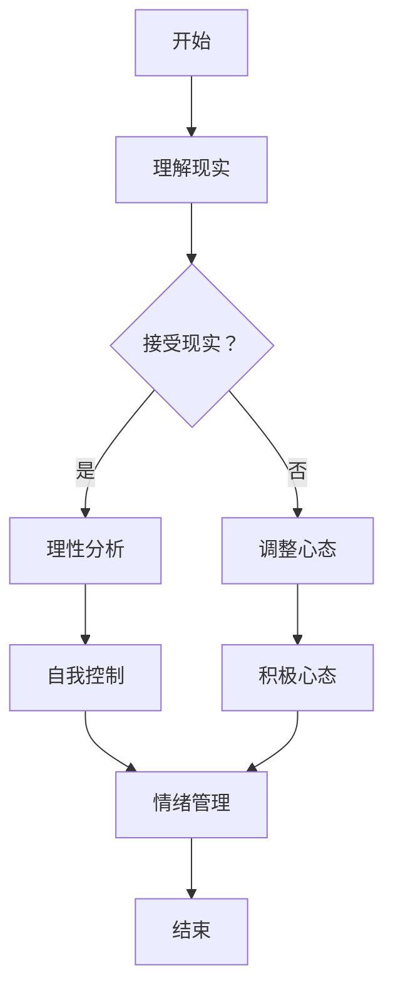
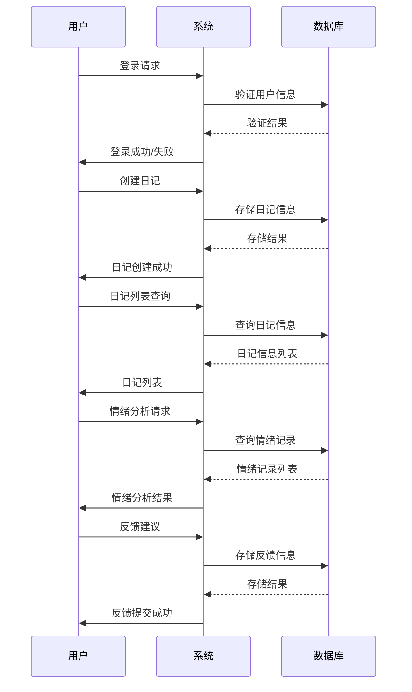

                 

### 第1章：问题背景

在当今快节奏、高压的现代生活中，个人心理问题如焦虑、抑郁等逐渐成为社会关注的热点。这些负面情绪不仅影响着人们的日常生活质量，还可能导致一系列生理健康问题。面对如此严峻的现实挑战，许多人在寻求各种方法来减轻心理压力、提升生活满意度。而哲学作为一种思考和解决问题的工具，近年来在现代心理学和个人成长领域得到了广泛的关注和应用。

**STOICISM：古老哲学的现代应用**

Stoicism（斯多葛主义）作为一种古老的哲学流派，起源于古希腊，由芝诺（Zeno）创立，并经塞内卡（Seneca）、爱比克泰德（Epictetus）和马可·奥勒留（Marcus Aurelius）等思想家的发展而逐渐完善。Stoicism 强调通过理性思考和自我控制来应对生活中的挑战，实现内心的平静与和谐。

**新 Stoicism：日记模板**

新 Stoicism 日记模板是一种基于斯多葛主义哲学的实践工具，它通过引导用户进行日常的反思和记录，帮助人们更好地理解自己的情绪和行为，从而培养积极的应对策略和心态。这种日记模板不仅可以帮助用户应对现代生活中的各种压力和挑战，还能提高个人的自我意识和情绪管理能力。

**本文目的**

本文旨在探讨新 Stoicism 日记模板在现代生活中的应用，通过以下步骤进行分析和思考：

1. **引言**：介绍 Stoicism 的历史渊源和在现代社会中的意义。
2. **现代生活的挑战**：分析现代生活中常见的心理压力源和负面情绪影响。
3. **为什么选择 Stoicism**：阐述 Stoicism 的独特之处及其对个人成长的影响。
4. **Stoicism 基础知识**：详细解读 Stoicism 的核心原则和历史发展。
5. **新 Stoicism 日记模板应用**：介绍日记模板的结构和使用方法。
6. **自我反思与实践**：探讨如何通过日记模板进行自我反思和实践。
7. **实例分析**：通过具体案例展示日记模板的应用效果。
8. **拓展阅读**：推荐相关书籍和资源，为读者提供进一步的学习途径。
9. **结论**：总结 Stoicism 在现代生活中的作用和新 Stoicism 日记模板的价值。

通过这些步骤，我们希望能够帮助读者理解新 Stoicism 日记模板的本质和作用，以及如何在日常生活中运用这种古老的哲学智慧来提升个人幸福感和生活质量。让我们一步一步深入探索这一主题。### 第2章：现代生活的挑战

在现代社会的快节奏生活中，人们面临着诸多挑战，这些挑战不仅影响心理健康，还可能导致身体和情感上的压力积累。以下是一些典型的挑战和其背后的原因：

**心理压力的来源**

1. **工作压力**：现代社会对高效率和高产出有着极高的要求，许多人在工作中承受着巨大的压力。长时间的工作、高强度的任务以及职位晋升的压力，都可能导致焦虑和抑郁。
2. **经济压力**：经济不确定性是现代社会的一个显著特征。住房、教育、医疗等高成本的支出，以及失业风险，使得许多人感到经济上的压力。
3. **人际关系**：复杂的人际关系也是现代生活中的一个挑战。家庭矛盾、朋友误解、社交网络的不确定因素，都可能引发情绪上的波动。
4. **信息过载**：互联网和社交媒体的普及，使得人们每天都要接收大量的信息。这种信息过载不仅增加了心理负担，还可能引起信息焦虑。

**负面情绪的影响**

负面情绪如焦虑、抑郁、愤怒和沮丧等，对个人的生活质量和健康有显著的影响：

1. **生理影响**：长期的负面情绪可能导致慢性压力反应，引发一系列生理问题，如高血压、心脏病、免疫系统功能下降等。
2. **心理影响**：负面情绪会降低个人的幸福感和生活质量，影响认知功能，甚至可能导致精神疾病。
3. **社交影响**：负面情绪可能影响人际关系，导致社交障碍和孤立感，进一步加重心理压力。

**应对负面情绪的方法**

为了应对这些挑战，许多人尝试了各种方法来减轻心理压力和负面情绪，以下是一些常见的方法：

1. **心理咨询**：心理咨询是一种有效的心理治疗方式，可以帮助人们识别和解决心理问题。
2. **运动**：定期进行体育锻炼，可以释放压力、改善情绪，并提高身心健康。
3. **冥想和放松技巧**：通过冥想、深呼吸和渐进性肌肉放松等技巧，可以缓解紧张情绪，提高心理韧性。
4. **社会支持**：建立和维护良好的社会关系网络，可以获得情感支持和实际帮助，缓解心理压力。

**Stoicism 的潜力**

Stoicism 提供了一种独特的哲学方法来应对现代生活中的挑战。它强调理性思考、自我控制和内心平静，通过这种哲学实践，人们可以更好地理解和管理自己的情绪和行为。新 Stoicism 日记模板正是基于这种哲学理念，提供了一种实用的工具，帮助用户在日常实践中应用 Stoicism 的原则，从而提升生活质量。

**本章总结**

现代生活中的心理压力源和负面情绪影响深远，Stoicism 作为一种古老的哲学智慧，在现代心理学和个人成长领域显示出巨大的潜力。新 Stoicism 日记模板通过引导用户进行自我反思和实践，为应对现代生活中的挑战提供了一种切实可行的策略。在接下来的章节中，我们将深入探讨 Stoicism 的基础知识，以更好地理解其核心原则和应用。### 第3章：为什么选择 Stoicism

在现代生活中，面对种种挑战和压力，寻找一种有效的应对策略至关重要。Stoicism（斯多葛主义）作为一种古老的哲学流派，以其独特的理性和自我控制理念，为现代人提供了一种应对心理压力、提升生活质量的途径。以下是选择 Stoicism 的几个关键原因。

**Stoicism 的独特之处**

1. **理性至上**：Stoicism 强调通过理性思考和自我控制来应对生活中的挑战。它认为理性是人的最高能力，通过理性分析，人们可以更好地理解现实，减少无谓的情绪波动。
2. **内心平静**：Stoicism 注重内心的平静与和谐。它主张人们不应该被外界因素所左右，而是应该保持内心的独立和平衡，从而实现真正的自由。
3. **自我实现**：Stoicism 并不仅仅关注个人的内心平和，更强调通过自我实现来达到更高的生活目标。它鼓励人们追求内在价值，通过道德和智慧的修炼，实现个人的全面成长。

**Stoicism 如何应对现代生活挑战**

1. **压力管理**：现代生活中，压力无处不在。Stoicism 提供了一种有效的压力管理方法。通过理性思考，人们可以更好地识别压力源，采取适当的措施来减轻压力。
2. **情绪调节**：负面情绪如焦虑、抑郁和愤怒是现代生活的常见问题。Stoicism 倡导通过自我控制和内心的平静来调节情绪。它鼓励人们接受现实的不可控性，从而减少因无法控制情绪而产生的痛苦。
3. **人际关系**：人际关系是现代生活中不可或缺的一部分。Stoicism 提供了一种处理人际关系的哲学方法。它强调慷慨和谦卑，鼓励人们理解和尊重他人，从而建立健康和谐的人际关系。
4. **价值观重塑**：现代社会的物质追求和消费主义常常导致人们迷失自我。Stoicism 提倡通过道德和智慧的修炼，重新审视和重塑个人的价值观，追求内在的真正幸福。

**Stoicism 与其他哲学流派的区别**

1. **与儒家思想**：Stoicism 强调理性思考和自我控制，而儒家思想则更注重道德规范和社会责任。Stoicism 更关注个体的内心成长，而儒家思想更关注个体在社会中的角色和责任。
2. **与佛教**：Stoicism 和佛教都强调内心的平静和自我修炼，但两者的出发点不同。Stoicism 更强调理性思考和自我控制，而佛教则更强调慈悲和觉悟。
3. **与现代心理学**：Stoicism 与现代心理学有许多相似之处，例如对情绪调节和自我意识的重视。然而，Stoicism 更注重哲学思考和内心的探索，而现代心理学则更侧重于实证研究和治疗方法。

**本章总结**

Stoicism 作为一种古老的哲学智慧，以其独特的理性至上、内心平静和自我实现理念，为现代人提供了一种有效的应对心理压力和提升生活质量的途径。通过理性思考和自我控制，Stoicism 帮助人们更好地管理压力、调节情绪和处理人际关系，从而实现内心的平静与和谐。在接下来的章节中，我们将深入探讨 Stoicism 的基础知识，以更好地理解其核心原则和应用。### 第4章：Stoicism 概述

Stoicism 是一种起源于古希腊的哲学流派，由芝诺（Zeno）在公元前3世纪创立。作为古希腊哲学的重要分支，Stoicism 强调通过理性思考和自我控制来应对生活中的挑战，实现内心的平静与和谐。Stoicism 的主要思想家包括塞内卡（Seneca）、爱比克泰德（Epictetus）和马可·奥勒留（Marcus Aurelius）等，他们的著作对 Stoicism 的理论体系和实践方法进行了系统阐述。

**Stoicism 的定义**

Stoicism 主要是关于道德哲学的一种学说，它认为通过理性和自我控制，个体可以在道德上达到完善，并在情感上保持平和。Stoicism 强调人的理性本质，认为理性是判断和决策的基础，而非情感或欲望。Stoicism 的核心理念包括接受现实、自制、慷慨、谦卑和正视痛苦。

**Stoicism 的主要思想家**

1. **芝诺**：作为 Stoicism 的创始人，芝诺认为通过理性和自我控制，人们可以摆脱情感的束缚，实现内心的自由。
2. **塞内卡**：塞内卡是 Stoicism 的早期代表人物之一，他在书信和论文中详细阐述了 Stoicism 的哲学思想，强调通过理性思考来摆脱痛苦。
3. **爱比克泰德**：爱比克泰德是一位罗马帝国时期的 Stoicism 教师和哲学家，他的著作《论意志》是 Stoicism 理论的经典之作，强调个体的道德责任和自我控制。
4. **马可·奥勒留**：马可·奥勒留是 Stoicism 的晚期代表人物，他是罗马帝国的一位皇帝，其著作《沉思录》记录了他的 Stoicism 思想，成为 Stoicism 史上最重要的文献之一。

**Stoicism 的核心理念**

1. **接受现实**：Stoicism 倡导接受现实，认为通过理性认识事物的本质，个体可以减少不必要的痛苦和焦虑。
2. **自制**：自制是 Stoicism 的核心原则之一，它强调通过控制自己的欲望和情感，个体可以实现内心的平静和自由。
3. **慷慨**：慷慨是指无私地给予他人，Stoicism 认为通过慷慨的行为，个体可以实现自我超越和内心的满足。
4. **谦卑**：谦卑是指对自身和他人的正确认识，Stoicism 倡导通过谦卑来避免骄傲和自大，实现内心的平和。
5. **正视痛苦**：Stoicism 认为痛苦是人生不可避免的一部分，通过理性思考和自我控制，个体可以减少痛苦的影响，并从中学习和成长。

**Stoicism 的历史与发展**

1. **古希腊时期**：Stoicism 在古希腊时期兴起，芝诺和他的弟子们通过讲座和讨论传播 Stoicism 的理念。
2. **罗马时期**：在罗马帝国时期，Stoicism 得到广泛传播和应用，塞内卡、爱比克泰德和马可·奥勒留等哲学家进一步发展了 Stoicism 的理论体系。
3. **中世纪和文艺复兴时期**：在中世纪和文艺复兴时期，Stoicism 逐渐式微，但其思想仍然在宗教和人文主义运动中产生影响。
4. **现代时期**：在现代社会，Stoicism 重新受到关注，尤其是在心理学和个人成长领域，Stoicism 提供了一种实用的哲学方法来应对现代生活的挑战。

**本章总结**

Stoicism 作为一种古老的哲学流派，以其理性至上、内心平静和自我实现的理念，为现代人提供了一种应对心理压力、提升生活质量的途径。Stoicism 的核心理念和主要思想家构成了其理论体系，通过接受现实、自制、慷慨、谦卑和正视痛苦，Stoicism 帮助人们实现内心的平和与和谐。在接下来的章节中，我们将深入探讨 Stoicism 的核心原则，以及如何将这些原则应用于现代生活中的具体实践。### 第5章：Stoicism 的核心原则

Stoicism 的核心原则是其哲学体系的基础，这些原则不仅指导着哲学家的思考和行为，也为普通人提供了应对生活中各种挑战的指导。以下是 Stoicism 的几个关键原则及其详细解释：

**1. 接受现实**

接受现实是 Stoicism 最基本的原则之一。它主张人们应该理性地认识事物的本质，并接受那些不可改变的事实。这种接受并不是被动地接受现实的限制，而是一种积极的应对策略，通过理性分析和自我控制，个体可以减少对不可控制事物的情感依赖，从而减少内心的痛苦和焦虑。

**2. 自制**

自制是 Stoicism 的核心原则之一，它强调通过控制自己的欲望和情感来达到内心的平静。在日常生活中，自制意味着不被情绪所左右，而是通过理性的思考和决策来指导行为。这种自制不仅有助于提高个人的自我意识，还能帮助个体在面对困难和挑战时保持冷静和理智。

**3. 慷慨**

慷慨是指无私地给予他人，不计较得失。Stoicism 认为慷慨是道德完善的重要表现，通过慷慨的行为，个体可以实现自我超越和内心的满足。慷慨不仅表现在物质上的给予，更体现在精神上的支持和关怀。通过慷慨，人们可以建立更加深厚的人际关系，增强社会的凝聚力和归属感。

**4. 谦卑**

谦卑是 Stoicism 倡导的一种态度，它强调对自身和他人的正确认识。谦卑意味着不骄傲自大，不自以为是，而是保持一种谦逊和开放的心态。通过谦卑，个体可以更好地理解自己的局限性，接受他人的意见和批评，从而实现个人的成长和进步。

**5. 正视痛苦**

痛苦是生活中不可避免的一部分，Stoicism 倡导通过理性思考和自我控制来正视痛苦，减少其负面影响。正视痛苦并不是忽视或逃避痛苦，而是在理性分析的基础上，理解痛苦的本质和原因，并采取适当的措施来应对。通过正视痛苦，个体可以学会从中吸取经验，成长和进步。

**这些原则的应用**

1. **接受现实**：在面对生活中的困难和挑战时，通过理性分析和接受不可控制的因素，减少内心的焦虑和痛苦。
2. **自制**：通过自我控制，避免被情绪左右，保持理智和冷静，从而提高决策质量和应对能力。
3. **慷慨**：通过无私的行为和关怀，建立良好的人际关系，增强社会的凝聚力，实现个人的道德成长。
4. **谦卑**：通过保持谦逊和开放的心态，更好地理解自己和他人，促进个人的成长和进步。
5. **正视痛苦**：通过理性分析和自我控制，减少痛苦的影响，学会从痛苦中吸取经验和教训，实现个人的成长。

**本章总结**

Stoicism 的核心原则通过理性、自制、慷慨、谦卑和正视痛苦，为个体提供了一种应对生活中各种挑战的哲学方法。这些原则不仅有助于提高个人的心理健康和生活质量，还能帮助个体实现内心的平静与和谐。在接下来的章节中，我们将进一步探讨 Stoicism 的历史发展，以及如何将这些原则应用于现代生活中的具体实践。### 第6章：Stoicism 的历史与发展

Stoicism 作为一种古老的哲学流派，其历史可以追溯到古希腊时期。芝诺（Zeno）是 Stoicism 的创始人，他在公元前3世纪在雅典创立了 Stoic 学派。芝诺的学说强调理性思考和自我控制，通过这些原则来指导人们的生活和行为。

**希腊罗马时期的 Stoicism**

在希腊罗马时期，Stoicism 得到了广泛的发展和传播。塞内卡（Seneca）、爱比克泰德（Epictetus）和马可·奥勒留（Marcus Aurelius）是这一时期最具代表性的 Stoicism 哲学家。

1. **塞内卡（Seneca）**：塞内卡是罗马帝国的政治家和哲学家，他在他的书信和论文中详细阐述了 Stoicism 的哲学思想。塞内卡强调通过理性思考来摆脱痛苦，他认为通过接受现实和理性分析，人们可以减少内心的焦虑和痛苦。

2. **爱比克泰德（Epictetus）**：爱比克泰德是罗马帝国时期的一位 Stoic 教师和哲学家，他的著作《论意志》（"Enchiridion"）是 Stoicism 理论的经典之作。爱比克泰德强调个体的道德责任和自我控制，他认为通过理性和自制，个体可以实现内心的平静和自由。

3. **马可·奥勒留（Marcus Aurelius）**：马可·奥勒留是罗马帝国的一位皇帝，同时也是一位 Stoicism 哲学家。他的著作《沉思录》（"Meditations"）记录了他的 Stoicism 思想，成为 Stoicism 史上最重要的文献之一。马可·奥勒留认为通过理性思考和自我控制，个体可以在逆境中保持内心的平静和和谐。

**中世纪和文艺复兴时期的 Stoicism**

在中世纪和文艺复兴时期，Stoicism 逐渐式微，但其思想仍然在宗教和人文主义运动中产生影响。在这一时期，Stoicism 的思想被用来支持宗教信仰和道德哲学，同时也对文艺复兴时期的人文主义思想产生了重要影响。

**现代时期的 Stoicism**

在现代社会，Stoicism 重新受到关注，尤其是在心理学和个人成长领域。Stoicism 提供了一种实用的哲学方法来应对现代生活中的心理压力和挑战。以下是一些现代 Stoicism 的应用：

1. **心理学**：Stoicism 的理念被广泛应用于心理学领域，尤其是在情绪调节和自我意识方面。许多心理学研究和治疗方法都借鉴了 Stoicism 的原则，如认知行为疗法（CBT）。

2. **个人成长**：Stoicism 提供了一种道德哲学框架，帮助人们理解如何通过理性思考和自我控制来实现个人的成长和进步。许多个人成长书籍和课程都基于 Stoicism 的理念。

3. **日常生活**：Stoicism 的原则被广泛应用于日常生活中，帮助人们应对日常生活中的压力和挑战。例如，通过接受现实、自制和正视痛苦，个体可以更好地管理情绪，提高生活质量。

**本章总结**

Stoicism 的历史发展经历了从古希腊到现代的漫长历程。在希腊罗马时期，Stoicism 得到了广泛的发展和传播，其思想影响了众多哲学家和皇帝。中世纪和文艺复兴时期，Stoicism 逐渐式微，但在现代，它重新受到关注，并在心理学和个人成长领域展现出巨大的潜力。通过理性思考和自我控制，Stoicism 帮助人们应对现代生活中的心理压力和挑战，实现内心的平静与和谐。在接下来的章节中，我们将深入探讨如何将 Stoicism 的原则应用于现代生活中的具体实践。### 第7章：Stoicism 与其他哲学流派的比较

Stoicism 作为一种独特的哲学流派，与其他哲学流派如儒家思想、佛教和现代心理学等在核心理念和哲学方法上有着显著的不同。以下是对 Stoicism 与这些流派的一些比较：

**与儒家思想的比较**

1. **理念重点**：Stoicism 强调理性思考和自我控制，认为通过理性和自制，个体可以实现内心的平静与和谐。儒家思想则强调道德规范和社会责任，通过遵循道德规范和实现社会角色，个体可以达到道德上的完善。

2. **目标追求**：Stoicism 更注重个体的内心成长和自我实现，追求的是内心的自由和道德的完善。儒家思想则更强调个体在社会中的角色和责任，追求的是社会责任和道德伦理的实践。

3. **哲学方法**：Stoicism 通过理性分析和自我控制来实现内心的平和，强调个体内心的独立和自主。儒家思想则强调个体应该遵循社会规范和道德准则，通过实际行动来实现道德和社会责任。

**与佛教的比较**

1. **理念重点**：Stoicism 强调理性思考和自我控制，通过理性认识现实和自我控制情感，个体可以实现内心的平静。佛教则强调通过慈悲和觉悟来实现内心的平静和解脱。

2. **目标追求**：Stoicism 更注重个体的内心成长和道德完善，追求的是内心的自由和道德的完善。佛教则强调通过觉悟和修行达到解脱和内心的平静。

3. **哲学方法**：Stoicism 通过理性分析和自我控制来实现内心的平和，强调个体的自我控制和理性思考。佛教则通过慈悲、觉悟和修行来达到内心的平静和解脱。

**与现代心理学的比较**

1. **理念重点**：Stoicism 强调理性思考和自我控制，认为通过理性和自制，个体可以实现内心的平静和情绪调节。现代心理学则更侧重于实证研究和治疗方法，通过心理分析和行为干预来调节情绪和改善心理状态。

2. **目标追求**：Stoicism 的目标是通过理性和自制实现内心的平和和自我实现。现代心理学的目标则是通过心理治疗和干预来改善个体的心理健康和生活质量。

3. **哲学方法**：Stoicism 通过理性分析和自我控制来实现情绪调节和自我意识提升。现代心理学则通过心理分析和行为干预来理解和解决心理问题。

**本章总结**

Stoicism 与儒家思想、佛教和现代心理学在理念重点、目标追求和哲学方法上有着显著的不同。Stoicism 强调理性思考和自我控制，追求内心的平静和道德完善；儒家思想强调道德规范和社会责任，追求道德完善和社会责任；佛教强调慈悲和觉悟，追求内心的平静和解脱；现代心理学则侧重于实证研究和治疗方法，追求心理健康和生活质量的提升。通过比较这些哲学流派，我们可以更好地理解 Stoicism 的独特之处，以及其在现代生活中的应用价值。在接下来的章节中，我们将深入探讨新 Stoicism 日记模板的具体内容和应用方法。### 第8章：新 Stoicism 日记模板介绍

新 Stoicism 日记模板是一种基于 Stoicism 哲学理念的实用工具，旨在帮助用户在日常实践中应用 Stoicism 的原则，从而提升个人自我意识和情绪管理能力。这个日记模板通过一系列结构化的问题和引导，引导用户进行深入的自我反思，帮助用户更好地理解自己的情绪和行为模式。

**模板的结构**

新 Stoicism 日记模板通常包含以下几个部分：

1. **日期**：记录日记的日期，以便于回顾和追踪个人成长的过程。
2. **今天发生了什么**：简要记录当天的重要事件和经历，包括正面和负面的事件。
3. **我的情绪如何**：记录当天的情绪状态，包括正面情绪和负面情绪。
4. **原因分析**：分析情绪产生的原因，探讨事件和情绪之间的关联。
5. **理性反思**：通过 Stoicism 的原则，对情绪和事件进行理性分析，寻找应对策略。
6. **行动计划**：制定具体的行动计划，以改善情绪和行为模式。

**模板的用途**

新 Stoicism 日记模板的主要用途包括：

1. **自我反思**：通过记录和反思日常生活中的事件和情绪，用户可以更好地了解自己的内心世界，识别情绪和行为模式。
2. **情绪管理**：通过理性分析和自我控制，用户可以学会如何应对负面情绪，提高情绪管理能力。
3. **目标设定**：用户可以通过日记模板设定和追踪个人目标，从而实现自我提升和成长。
4. **心理调适**：日记模板提供了一种心理调适的工具，帮助用户在面对压力和挑战时保持冷静和理智。

**本章总结**

新 Stoicism 日记模板是一种基于 Stoicism 哲学理念的工具，通过结构化的问题和引导，帮助用户进行自我反思和情绪管理。这个日记模板不仅有助于提升个人自我意识和情绪管理能力，还能帮助用户设定目标并实现个人成长。在接下来的章节中，我们将详细介绍如何使用这个日记模板，并探讨其实际应用效果。### 第9章：模板使用方法

要有效地使用新 Stoicism 日记模板，首先需要了解模板的各个组成部分，并学会如何逐步完成日记的记录和分析。以下是详细的步骤说明：

**第一步：设定目标和准备工具**

1. **设定目标**：在使用日记模板之前，用户应该设定一个明确的目标，例如提高情绪管理能力、改善人际关系等。这个目标将指导用户在使用日记模板时的反思和行动方向。
2. **准备工具**：选择一个适合自己的笔记本或日记应用程序，确保可以方便地记录和回顾日记内容。

**第二步：记录日常生活**

1. **日期**：在日记的最开始部分，记录下日期。这个步骤有助于用户在回顾日记时，了解自己的成长轨迹。
2. **今天发生了什么**：简要记录当天的重要事件和经历，包括工作、学习、社交等方面的内容。这里要特别注意记录正面和负面的事件，因为正面事件同样重要，可以激励自己保持积极心态。
3. **我的情绪如何**：记录当天的情绪状态，包括正面情绪（如快乐、满足）和负面情绪（如焦虑、沮丧）。通过记录情绪，用户可以更好地了解自己的情绪变化，并分析其产生的原因。

**第三步：原因分析**

1. **原因分析**：针对当天发生的正面和负面事件，分析情绪产生的原因。这里可以采用 Stoicism 的原则，如接受现实、自制、慷慨、谦卑和正视痛苦，来深入思考事件和情绪之间的关联。
2. **理性反思**：通过理性分析和自我控制，探讨如何从负面情绪中恢复，如何避免重复类似的负面情绪。例如，如果用户在一天中感到焦虑，可以思考是什么原因导致了这种情绪，如何通过理性的方法来减轻焦虑。

**第四步：制定行动计划**

1. **行动计划**：基于原因分析和理性反思，制定具体的行动计划。例如，如果用户发现自己在面对工作压力时容易焦虑，可以计划采取一些放松技巧，如冥想、深呼吸等，来缓解焦虑。
2. **行动计划回顾**：在日记的结尾，回顾过去一天的行动计划，评估执行效果。这样可以确保用户持续关注并改进自己的行动策略。

**第五步：定期回顾和调整**

1. **定期回顾**：每周或每月，回顾之前的日记，总结自己在情绪管理、目标实现等方面的进步和挑战。
2. **调整计划**：根据回顾结果，调整行动计划和目标，确保日记模板的使用能够持续地推动个人成长。

**本章总结**

新 Stoicism 日记模板通过结构化的问题和引导，帮助用户进行自我反思和情绪管理。使用这个模板的步骤包括设定目标、记录日常生活、原因分析、制定行动计划和定期回顾。通过这些步骤，用户可以更好地理解自己的情绪和行为模式，从而提升个人自我意识和情绪管理能力。在接下来的章节中，我们将通过具体案例来展示如何应用这个日记模板，以及它在实际生活中的效果。### 第10章：模板内容详解

新 Stoicism 日记模板通过一系列结构化的问题和引导，帮助用户进行深入的自我反思和情绪管理。以下是模板中包含的具体问题和内容，以及每个问题的详细解析。

**1. 日期**

**内容**：记录日记的日期。

**解析**：记录日期有助于用户在回顾日记时，了解自己的成长轨迹，以及情绪和行为的变化趋势。通过时间序列的分析，用户可以发现情绪和行为的周期性规律，从而更好地理解自己。

**2. 今天发生了什么？**

**内容**：简要记录当天的重要事件和经历，包括工作、学习、社交等方面的内容。

**解析**：记录事件和经历有助于用户了解自己的日常生活，以及事件对情绪和行为的影响。通过详细记录，用户可以更全面地分析情绪和行为的原因，并找出可能的解决方案。

**3. 我的情绪如何？**

**内容**：记录当天的情绪状态，包括正面情绪和负面情绪。

**解析**：记录情绪状态有助于用户了解自己的情绪波动，以及情绪对日常生活的影响。通过分析情绪变化，用户可以识别出触发情绪波动的关键因素，并采取相应的应对策略。

**4. 原因分析**

**内容**：分析情绪产生的原因，探讨事件和情绪之间的关联。

**解析**：通过原因分析，用户可以深入理解情绪和行为背后的原因。这有助于用户识别出情绪和行为模式的根源，从而采取更有针对性的措施来改善情绪和生活质量。

**5. 理性反思**

**内容**：通过 Stoicism 的原则，对情绪和事件进行理性分析，寻找应对策略。

**解析**：理性反思是 Stoicism 的核心原则之一，通过理性分析和自我控制，用户可以减少情绪波动，提高决策质量。在这一部分，用户可以思考如何从理性的角度看待问题，并制定有效的应对策略。

**6. 行动计划**

**内容**：制定具体的行动计划，以改善情绪和行为模式。

**解析**：行动计划是日记模板的关键部分，它帮助用户将理性反思转化为实际行动。在这一部分，用户可以设定具体的目标和步骤，以便在未来的日子里持续改进自己的情绪和行为。

**7. 总结**

**内容**：对当天的日记内容进行总结，强调关键点和收获。

**解析**：总结部分有助于用户巩固当天的学习成果，以及明确下一步的行动方向。通过总结，用户可以更好地掌握情绪和行为管理的技巧，并持续提升自己的生活质量。

**本章总结**

新 Stoicism 日记模板通过结构化的内容和问题，引导用户进行深入的自我反思和情绪管理。每个问题都旨在帮助用户了解自己的情绪和行为模式，并采取有效的策略来改善生活质量。通过详细记录和分析，用户可以逐步提升自我意识和情绪管理能力，从而实现个人成长。在接下来的章节中，我们将通过具体案例展示如何应用这个日记模板，以及它在实际生活中的效果。### 第11章：模板案例分享

为了更好地展示新 Stoicism 日记模板的实际应用效果，下面我们通过两个具体案例来详细说明日记模板的使用方法和效果。

**案例一：如何应对职场压力**

**背景**：小李是一名软件工程师，最近项目进度紧张，工作压力很大。他经常感到焦虑和疲劳，影响了工作效率和生活质量。

**日记记录**：

1. **日期**：2023年4月15日
2. **今天发生了什么？**
   - 早上接到领导的任务，需要在短时间内完成一个关键模块的开发。
   - 下午参加了一个紧急会议，讨论项目进度和后续计划。
   - 晚上加班到晚上10点，感觉非常疲惫。
3. **我的情绪如何？**
   - 感到焦虑和紧张，担心无法按时完成任务。
   - 感到疲惫，希望早点休息。
4. **原因分析**
   - 任务量过大，导致心理压力增加。
   - 缺乏有效的休息和放松时间，导致身体疲劳。
5. **理性反思**
   - 接受现实，任务无法在短时间内完成，需要合理分配时间和资源。
   - 自制，不要因为焦虑而过度工作，影响身体健康。
6. **行动计划**
   - 明天早上提前一小时到公司，提前规划工作内容。
   - 每天晚上保证至少8小时的睡眠。
   - 利用午休时间进行短暂的冥想和放松。
7. **总结**
   - 明白了任务无法在短时间内完成，需要调整期望值。
   - 认识到身体健康的重要性，需要保证充足的休息。

**效果分析**：

通过记录和反思，小李明确了职场压力的来源和应对策略。在接下来的日子里，他按照行动计划进行实施，逐步减轻了职场压力，工作效率和生活质量得到了显著提升。

**案例二：如何处理人际关系**

**背景**：小王最近与同事发生了矛盾，导致工作氛围紧张，影响了团队合作效果。

**日记记录**：

1. **日期**：2023年4月20日
2. **今天发生了什么？**
   - 上午与同事讨论项目计划，因意见不合发生了争吵。
   - 下午试图通过邮件与同事沟通，但对方没有回复。
   - 晚上感到沮丧和困惑，担心这种关系会影响到未来的合作。
3. **我的情绪如何？**
   - 感到沮丧和愤怒，对同事的行为感到不满。
   - 感到困惑，不知道如何处理这种人际关系。
4. **原因分析**
   - 双方在项目计划和执行上的观点存在分歧。
   - 沟通方式不当，导致矛盾升级。
5. **理性反思**
   - 接受现实，每个人都有自己的观点和想法。
   - 自制，避免在情绪激动时做出过激反应。
6. **行动计划**
   - 明天与同事面对面沟通，尝试理解对方的观点。
   - 制定沟通策略，确保信息传递清晰和有效。
   - 给自己一些时间冷静下来，避免在情绪激动时做出决策。
7. **总结**
   - 认识到沟通的重要性，需要更加耐心和细致。
   - 学会通过理性思考和自我控制来处理人际关系。

**效果分析**：

通过记录和反思，小王学会了如何理性地处理人际关系。在实际行动中，他按照行动计划进行了调整，逐渐改善了与同事的关系，团队氛围变得更加和谐，工作效率也得到了提升。

**本章总结**

通过以上两个案例，我们可以看到新 Stoicism 日记模板在应对职场压力和人际关系方面具有显著的效果。日记模板帮助用户深入反思和调整自己的行为模式，从而提升情绪管理能力和生活质量。在实际应用中，用户可以根据自己的具体情况，灵活调整模板内容，以实现最佳效果。在接下来的章节中，我们将继续探讨如何通过自我反思与实践，进一步提升个人的情绪管理能力。### 第12章：如何进行自我反思

自我反思是一种重要的个人成长工具，通过深入思考自己的行为、情绪和价值观，个体可以更好地了解自己，从而实现自我提升。以下是如何进行自我反思的详细步骤：

**第一步：选择合适的时间和地点**

1. **时间**：选择一个安静且不受打扰的时间，最好是在一天结束的时候。这个时候，个体的思绪相对清晰，更容易回顾和反思当天的生活。
2. **地点**：选择一个舒适的环境，可以是安静的房间或户外自然景观。一个安静的环境有助于个体放松身心，更好地进行反思。

**第二步：回顾日常生活**

1. **记录**：记录当天的活动、所做的事情、遇到的人和发生的事情。这些记录可以帮助个体清晰地回顾自己的行为和经历。
2. **情绪记录**：记录自己的情绪状态，包括正面情绪和负面情绪。这有助于个体了解情绪变化的原因，以及情绪对自己行为的影响。

**第三步：分析行为和情绪**

1. **正面分析**：回顾自己的行为，思考哪些是成功的，哪些是值得继续保持的。对于正面行为，可以思考如何在未来进一步发扬光大。
2. **负面分析**：同样，回顾自己的行为，思考哪些是失败的，哪些是应该避免的。对于负面行为，可以思考原因，以及如何在未来避免重复。

**第四步：思考价值观**

1. **价值观审视**：思考自己的价值观和行为是否一致。例如，如果个体强调诚实和正直，但实际行为中却经常说谎，这就需要审视自己的价值观。
2. **目标设定**：根据自我反思的结果，设定具体的目标和行动计划。例如，如果个体发现自己在面对压力时容易焦虑，可以设定目标，学习如何通过放松技巧来缓解焦虑。

**第五步：制定改进计划**

1. **具体行动**：根据反思结果，制定具体的改进计划。这些计划应该是可操作的，可以量化的。
2. **跟踪进度**：记录自己的改进进度，定期回顾和评估。这有助于个体了解自己的成长轨迹，以及改进计划的执行效果。

**第六步：持续反思**

1. **日常反思**：将自我反思作为日常生活的一部分，每天或每周进行反思。
2. **长期反思**：定期（如每月或每季度）进行长期反思，以更全面地审视自己的行为和价值观。

**本章总结**

自我反思是一种重要的个人成长工具，通过深入思考和记录，个体可以更好地了解自己，实现自我提升。在自我反思中，选择合适的时间和地点、回顾日常生活、分析行为和情绪、审视价值观、制定改进计划，并持续反思，都是非常重要的步骤。通过这些步骤，个体可以不断提升自己，实现个人成长。在接下来的章节中，我们将继续探讨如何通过自我反思和实践，进一步提升个人的情绪管理能力。### 第13章：如何应对负面情绪

负面情绪如焦虑、抑郁、愤怒和沮丧等，对个人的生活质量有显著的负面影响。然而，通过有效的应对策略，个体可以更好地管理这些情绪，从而提升心理健康和幸福感。以下是一些应对负面情绪的具体方法：

**1. 深呼吸**

深呼吸是一种简单有效的情绪调节技巧。通过深呼吸，个体可以减缓心率，降低紧张感，从而缓解负面情绪。以下是深呼吸的具体步骤：

- 坐或站在一个舒适的位置。
- 用鼻子慢慢吸气，感受空气流入肺部。
- 保持吸气，然后缓慢呼气。
- 重复这个过程，直到感到放松。

**2. 冥想**

冥想是一种通过专注和意识练习来减少压力和焦虑的技巧。以下是一种简单的冥想方法：

- 找一个安静的地方，坐或躺在一个舒适的位置。
- 关闭眼睛，专注于呼吸。
- 如果注意力分散，轻轻地将其引导回呼吸。
- 持续冥想5-10分钟，逐渐增加时间。

**3. 认知行为疗法（CBT）**

认知行为疗法是一种基于认知心理学的心理治疗方法，旨在帮助个体识别和改变负面思维模式。以下是一些 CBT 的技巧：

- **思维记录**：记录负面思维和情绪，分析其产生的原因。
- **认知重构**：通过理性分析，挑战和改变负面思维。
- **行为实验**：尝试新的行为，观察其对情绪的影响。

**4. 积极的自我对话**

积极的自我对话是一种通过积极的自我暗示来改善情绪的技巧。以下是一些积极的自我对话方法：

- 用积极的语言描述自己和他人的行为。
- 鼓励自己，即使面对挑战也要保持乐观。
- 记录积极的经历和成就，以增强自信。

**5. 运动和锻炼**

运动和锻炼是一种有效的情绪调节方法。通过运动，个体可以释放压力，提高心率，从而改善情绪。以下是一些适合的情绪调节运动：

- 快走或慢跑
- 瑜伽
- 拳击或武术
- 有氧运动

**6. 寻求社会支持**

与他人交流是一种有效的情绪调节方法。以下是一些寻求社会支持的方法：

- 与亲朋好友交流，分享自己的感受和经历。
- 参加支持小组，与其他人分享经验和建议。
- 寻求专业心理咨询，通过专业人士的帮助来应对负面情绪。

**本章总结**

负面情绪是生活中不可避免的一部分，但通过有效的应对策略，个体可以更好地管理这些情绪，从而提升心理健康和幸福感。深呼吸、冥想、认知行为疗法（CBT）、积极的自我对话、运动和锻炼、以及寻求社会支持，都是有效的情绪调节方法。通过这些方法，个体可以学会如何应对负面情绪，从而实现内心的平静与和谐。在接下来的章节中，我们将继续探讨如何培养积极心态和平衡生活与工作。### 第14章：如何培养积极心态

积极心态是一种强大的心理资源，它可以帮助个体更好地应对生活中的挑战和压力，提升生活质量和幸福感。以下是一些培养积极心态的具体方法：

**1. 保持乐观**

乐观是一种积极的心态，它可以帮助个体在面对困难时保持积极和坚定。以下是一些保持乐观的方法：

- **积极思考**：尝试从积极的角度看待问题和挑战，关注解决问题的可能性。
- **感恩**：每天花时间思考自己感激的事物，感恩的心态可以提升幸福感。
- **避免负面自我对话**：减少消极的自我暗示，用积极的自我对话来取代负面思维。

**2. 建立积极的人际关系**

人际关系对心理健康有着重要的影响。以下是一些建立积极人际关系的方法：

- **倾听他人**：倾听他人的需求和感受，展现关心和尊重。
- **分享**：与他人分享自己的快乐和成就，增强社交联系。
- **支持他人**：在他人需要帮助时伸出援手，提供支持和鼓励。

**3. 设定和追求目标**

设定具体的目标，并努力追求这些目标，可以提升个体的成就感和满足感。以下是一些设定和追求目标的方法：

- **明确目标**：设定清晰、具体的目标，使其可衡量和可实现。
- **制定计划**：为达成目标制定详细的计划，包括步骤和时间表。
- **持续努力**：保持专注和毅力，持续努力追求目标。

**4. 保持学习和成长**

不断学习和成长可以提升个人的自信心和自我价值感。以下是一些保持学习和成长的方法：

- **终身学习**：持续学习新知识和技能，不断提升自己的能力和竞争力。
- **阅读**：阅读有益的书籍和文章，扩展视野，提升思维深度。
- **参加培训课程**：参加相关的培训课程，获取新的知识和经验。

**5. 培养健康的生活习惯**

健康的生活习惯可以提升个体的身体和心理状态。以下是一些培养健康生活习惯的方法：

- **规律作息**：保持规律的作息时间，确保充足的睡眠。
- **健康饮食**：选择健康的食物，避免高糖和高脂肪的食物。
- **定期锻炼**：定期进行体育锻炼，增强身体素质。

**本章总结**

培养积极心态是一个持续的过程，需要个体在实践中不断努力。通过保持乐观、建立积极的人际关系、设定和追求目标、保持学习和成长，以及培养健康的生活习惯，个体可以不断提升自己的心理状态和生活质量。积极心态不仅能够帮助个体更好地应对生活中的挑战，还能提升个人的幸福感和满足感。在接下来的章节中，我们将通过实例分析，进一步探讨如何将积极心态应用于实际生活中。### 第15章：如何平衡生活与工作

在现代社会中，平衡生活与工作是一个重要的挑战，尤其是在快节奏和高压力的环境中。以下是一些具体的方法，帮助个体实现生活与工作的平衡：

**1. 设定优先级**

在工作和生活中，设定优先级是至关重要的。以下是一些设定优先级的步骤：

- **明确目标和价值观**：明确个人的长期目标和价值观，这将帮助你在面对选择时做出更明智的决定。
- **划分任务优先级**：将任务按照紧急性和重要性进行排序，优先处理最重要和最紧急的任务。
- **时间管理**：合理安排时间，确保工作和生活任务都有足够的时间来完成。

**2. 学会说“不”**

学会拒绝不必要的工作和生活任务，可以减少时间和精力的浪费。以下是一些说“不”的技巧：

- **清晰表达**：明确地表达自己的立场，无需过度解释。
- **避免过度承诺**：只接受自己能够完成的任务，避免因为过度承诺而造成压力。
- **设置界限**：为自己设置工作和个人生活的界限，确保两者都能得到充分的关注。

**3. 建立健康的工作习惯**

建立健康的工作习惯，可以提高工作效率，减少工作对个人生活的干扰。以下是一些健康的工作习惯：

- **定时休息**：工作一段时间后，定时休息和放松，避免过度劳累。
- **避免加班**：除非必要，尽量避免加班，确保有足够的时间陪伴家人和进行个人爱好。
- **规划工作时间**：合理安排工作时间，确保有足够的时间处理工作以外的任务。

**4. 培养兴趣爱好**

培养兴趣爱好可以帮助个体在工作之外找到快乐和满足感，从而实现生活与工作的平衡。以下是一些培养兴趣爱好的方法：

- **尝试新事物**：尝试新的活动和爱好，找到自己感兴趣的事情。
- **定期锻炼**：进行体育锻炼，不仅可以保持身体健康，还能提升心情。
- **与朋友聚会**：与朋友和家人聚会，享受社交的乐趣。

**5. 维护健康的生活习惯**

维护健康的生活习惯，有助于提升个人的身体和心理状态，从而更好地应对工作和生活中的压力。以下是一些维护健康生活习惯的方法：

- **规律作息**：保持规律的作息时间，确保充足的睡眠。
- **健康饮食**：选择健康的食物，避免高糖和高脂肪的食物。
- **定期体检**：定期进行体检，确保身体健康。

**本章总结**

平衡生活与工作是一个复杂但必要的任务。通过设定优先级、学会说“不”、建立健康的工作习惯、培养兴趣爱好和维护健康的生活习惯，个体可以更好地实现生活与工作的平衡。这不仅有助于提升个人生活质量，还能提升工作效率和职业满意度。在接下来的章节中，我们将通过实例分析，进一步探讨如何将这些方法应用于实际生活中。### 第16章：实例一：如何应对职场压力

在现代职场中，压力是不可避免的。然而，通过合理的策略和心态调整，个体可以有效地应对职场压力，提升工作效率和幸福感。以下是一个具体的实例，说明如何通过新 Stoicism 日记模板来应对职场压力。

**实例背景**

小张是一名软件工程师，他在一个技术团队中负责一个重要的项目。最近，项目进入了紧张的开发阶段，时间紧迫，任务繁重，导致小张感到极大的压力。他开始失眠，工作效率下降，情绪波动频繁，甚至影响到家庭生活。

**日记记录**

1. **日期**：2023年7月5日
2. **今天发生了什么？**
   - 项目开发进入关键阶段，需要在短时间内完成多个功能模块。
   - 领导安排了一次紧急会议，讨论项目进度和后续计划。
   - 下班后，小张感到非常疲惫，无法集中精力处理家庭事务。
3. **我的情绪如何？**
   - 感到焦虑和紧张，担心无法按时完成任务。
   - 感到疲惫和沮丧，对自己的工作效率和能力产生怀疑。
4. **原因分析**
   - 项目任务量大，时间紧迫，导致心理压力增加。
   - 缺乏有效的休息和放松时间，导致身体和心理健康受损。
5. **理性反思**
   - 接受现实，任务无法在短时间内完成，需要合理分配时间和资源。
   - 自制，避免在情绪激动时做出过激反应，影响团队合作。
6. **行动计划**
   - 明天早上提前到公司，规划工作内容，确保任务有序进行。
   - 每天晚上保证至少7小时的睡眠，确保身体得到充分休息。
   - 利用午休时间进行短暂的冥想和深呼吸，缓解紧张情绪。
7. **总结**
   - 认识到任务无法在短时间内完成，需要调整期望值。
   - 了解自己的情绪波动，通过理性的方法来应对职场压力。

**效果分析**

通过记录和反思，小张明确了自己的压力来源和应对策略。他开始按照行动计划进行调整，逐步减轻了职场压力。具体效果如下：

- **工作效率提升**：通过提前规划和合理安排工作时间，小张的工作效率得到了显著提升。
- **情绪稳定**：通过深呼吸和冥想等放松技巧，小张的情绪逐渐稳定，焦虑感减少。
- **家庭关系改善**：小张开始有更多的时间陪伴家人，家庭关系得到了改善。
- **身心健康**：通过保证充足的睡眠和休息，小张的身体和心理健康状况有所改善。

**本章总结**

通过新 Stoicism 日记模板，小张学会了如何理性地分析和管理职场压力。他通过记录和反思，找到了有效的应对策略，从而提升了工作效率和幸福感。这个实例展示了如何将 Stoicism 的原则应用于实际工作中，帮助个体更好地应对职场压力，实现工作与生活的平衡。在接下来的实例中，我们将继续探讨如何通过新 Stoicism 日记模板来处理人际关系和应对个人挫折。### 第17章：实例二：如何处理人际关系

在职场和生活中，人际关系对个人的幸福感和社会支持有着重要的影响。然而，处理人际关系有时会带来挑战和压力。以下是一个具体的实例，说明如何通过新 Stoicism 日记模板来处理人际关系。

**实例背景**

小李是一名市场经理，她在工作中需要与多个部门和同事合作。最近，她与一个重要客户的项目进展不顺利，导致与团队成员之间的沟通和合作出现了问题。小李感到沮丧和困惑，担心这种关系会影响项目的成功和她的职业发展。

**日记记录**

1. **日期**：2023年8月10日
2. **今天发生了什么？**
   - 与客户进行了一次项目进展会议，讨论遇到了一些关键问题。
   - 与团队成员讨论解决方案，但意见不一致，导致会议氛围紧张。
   - 下班后，小李感到沮丧和焦虑，担心无法解决这些人际关系问题。
3. **我的情绪如何？**
   - 感到沮丧和焦虑，对团队的合作感到担忧。
   - 感到困惑，不知道如何处理这种人际关系问题。
4. **原因分析**
   - 项目进展不顺利，导致压力和焦虑增加。
   - 团队成员意见不一致，沟通不畅，导致关系紧张。
5. **理性反思**
   - 接受现实，项目进展不顺利是正常的，需要理性看待。
   - 自制，避免在情绪激动时做出过激反应，影响团队合作。
6. **行动计划**
   - 明天与团队成员进行一对一沟通，了解彼此的观点和担忧。
   - 制定沟通策略，确保信息传递清晰和有效。
   - 给自己一些时间冷静下来，避免在情绪激动时做出决策。
7. **总结**
   - 认识到人际关系问题的根源，需要通过理性沟通来解决。
   - 明白了冷静和理性对待问题的重要性。

**效果分析**

通过记录和反思，小李找到了处理人际关系问题的有效策略。她开始按照行动计划进行调整，逐步改善了与团队成员的关系。具体效果如下：

- **沟通改善**：通过与团队成员的一对一沟通，小李了解了彼此的观点和担忧，沟通氛围变得更加和谐。
- **团队合作提升**：通过有效的沟通和协作，团队的合作效率得到了提升，项目进展逐渐顺利。
- **情绪稳定**：小李通过理性反思和行动计划，逐渐减轻了焦虑和沮丧情绪，情绪状态变得更加稳定。
- **职业发展**：随着项目进展的改善和团队合作的提升，小李的职业生涯得到了进一步的推动。

**本章总结**

通过新 Stoicism 日记模板，小李学会了如何理性地处理人际关系问题。她通过记录和反思，找到了有效的沟通策略和行动计划，从而改善了与团队成员的关系，提升了团队协作效率和职业发展。这个实例展示了如何将 Stoicism 的原则应用于实际工作中，帮助个体更好地处理人际关系，实现个人和团队的成长。在接下来的实例中，我们将继续探讨如何通过新 Stoicism 日记模板来应对个人挫折。### 第18章：实例三：如何应对个人挫折

在人生的旅程中，个人挫折是不可避免的。这些挫折可能来自工作、家庭或个人生活，它们不仅会带来情绪上的困扰，还可能影响个体的自信心和幸福感。以下是一个具体的实例，说明如何通过新 Stoicism 日记模板来应对个人挫折。

**实例背景**

小王是一名项目经理，他负责的公司项目最近因为技术难题而陷入了困境。在多次尝试和努力后，项目仍然没有取得突破性进展，这让小王感到沮丧和绝望。他开始怀疑自己的能力和决策，甚至产生了辞职的念头。

**日记记录**

1. **日期**：2023年9月15日
2. **今天发生了什么？**
   - 项目遇到了技术难题，多次尝试解决但仍然没有进展。
   - 领导对项目进度表示担忧，小王感到压力巨大。
   - 下班后，小王感到非常沮丧，对自己的能力和决策产生了怀疑。
3. **我的情绪如何？**
   - 感到沮丧和绝望，对项目前景感到担忧。
   - 感到怀疑自己的能力和决策，担心无法解决当前的困境。
4. **原因分析**
   - 技术难题超出预期，导致项目进展缓慢。
   - 对自己的能力和决策产生了怀疑，缺乏信心。
5. **理性反思**
   - 接受现实，挫折是人生的一部分，需要理性看待。
   - 自制，避免因挫折而做出过激决策，如辞职。
6. **行动计划**
   - 深入分析技术难题，寻求同事和专家的帮助。
   - 制定新的项目计划，确保在短时间内取得突破。
   - 利用业余时间进行冥想和放松，缓解情绪压力。
7. **总结**
   - 认识到挫折是成长的机会，需要从中吸取教训。
   - 明白了自己的不足和需要改进的地方。

**效果分析**

通过记录和反思，小王找到了应对个人挫折的有效策略。他开始按照行动计划进行调整，逐步走出了挫折的阴影。具体效果如下：

- **技术问题解决**：通过与同事和专家的深入讨论，小王找到了解决技术难题的方法，项目进展逐渐恢复正常。
- **自信心提升**：小王通过解决技术问题，重新获得了对自己的信心，对未来的决策和行动更加坚定。
- **情绪稳定**：通过冥想和放松，小王的情绪状态得到了显著改善，焦虑和沮丧情绪减少。
- **职业发展**：随着项目的成功推进，小王在团队中的地位和影响力进一步提升，职业发展前景更加光明。

**本章总结**

通过新 Stoicism 日记模板，小王学会了如何理性地应对个人挫折。他通过记录和反思，找到了解决问题的方法和策略，从而克服了挫折，提升了自信心和情绪稳定性。这个实例展示了如何将 Stoicism 的原则应用于实际生活中，帮助个体在面对挫折时保持冷静和理智，实现自我成长和职业发展。在接下来的章节中，我们将继续探讨 Stoicism 在现代社会中的应用和拓展阅读资源。### 第19章：Stoicism 相关书籍推荐

对于希望深入了解 Stoicism 的读者，以下是一些经典和现代的书籍推荐，这些书籍不仅详尽地介绍了 Stoicism 的理论和实践方法，还能帮助读者在实际生活中应用这些哲学原则。

1. **《沉思录》（"Meditations"）- 马可·奥勒留（Marcus Aurelius）**

   作为 Stoicism 的晚期代表人物之一，马可·奥勒留的《沉思录》是 Stoicism 思想的精髓。这本书是奥勒留对自己哲学思考的记录，包含了许多关于如何通过 Stoicism 的原则来应对生活挑战的深刻见解。

2. **《论意志》（"Enchiridion"）- 爱比克泰德（Epictetus）**

   爱比克泰德的《论意志》是 Stoicism 的经典之作，书中阐述了 Stoicism 的核心原则，如接受现实、自制和内心的平静。这本书对于理解 Stoicism 的基本哲学思想非常重要。

3. **《斯多葛主义》（"Stoicism"）- 塞内卡（Seneca）**

   塞内卡的《斯多葛主义》通过书信的形式，详细阐述了 Stoicism 的哲学思想，强调了理性思考和自我控制的重要性。这本书对于了解 Stoicism 的历史和发展有重要意义。

4. **《斯多葛主义与生活艺术》（"Stoic Philosophy and the Art of Living"）- 理查德·蒙提菲奥里（Richard Montague）**

   这本书提供了对 Stoicism 的现代解读，并结合了现代心理学的研究，帮助读者理解如何将 Stoicism 的原则应用于现代生活，提高生活质量。

5. **《幸福之路》（"The Art of Happiness"）- 卡尔·荣格（Carl Jung）和斯里·昌德（Sri Swami Satchidananda）**

   虽然这本书并非专注于 Stoicism，但它结合了 Stoicism 和印度哲学的思想，提供了关于如何实现内心平静和幸福的深入见解。

6. **《幸福哲学》（"The Philosophy of Happiness"）- 汤姆·拉金（Tom Larkin）**

   这本书通过介绍 Stoicism、佛教和儒家思想等哲学流派，探讨了幸福的本质和实现幸福的方法。对于希望从不同哲学角度了解幸福的人，这本书是一个很好的资源。

**本章总结**

Stoicism 的书籍资源丰富，从古代经典到现代解读，这些书籍为读者提供了深入理解 Stoicism 及其在现代生活中应用的途径。通过阅读这些书籍，读者不仅可以了解 Stoicism 的核心原则，还能学会如何将这些原则应用于个人成长和日常生活中，实现内心的平和与和谐。### 第20章：Stoicism 在现代社会的应用场景

Stoicism 作为一种古老的哲学思想，不仅在历史上产生了深远的影响，在现代社会的各个领域中也有着广泛的应用。以下是 Stoicism 在现代社会中的一些典型应用场景：

**1. 工作与职业发展**

在职场中，Stoicism 的理念可以帮助员工更好地应对工作压力和挑战。通过理性思考、自制和接受现实，员工可以提高工作效率，减少不必要的焦虑和压力。例如，通过 Stoicism 的原则，员工可以更好地处理工作中的冲突和挫折，保持积极的心态，从而提升职业发展。

**2. 心理健康与情绪调节**

Stoicism 提供了一种有效的心理调节方法，帮助个体应对焦虑、抑郁等负面情绪。通过理性分析和自我控制，个体可以减少对负面情绪的依赖，提高心理韧性。例如，在日常生活中，个体可以通过 Stoicism 的原则，学会如何理性地看待生活中的困难和挑战，从而减少情绪波动，提升心理健康。

**3. 个人成长与自我提升**

Stoicism 强调通过自我实现和道德完善来实现个人的全面成长。在个人成长的过程中，Stoicism 提供了一种道德哲学框架，帮助个体审视自己的价值观和行为模式，从而实现自我提升。例如，通过 Stoicism 的原则，个体可以学会如何设定和追求个人目标，如何在面对失败和挫折时保持乐观和坚定。

**4. 人际关系**

Stoicism 提供了一种处理人际关系的哲学方法。通过慷慨、谦卑和理性思考，个体可以建立更加健康和谐的人际关系。例如，在处理冲突和误解时，Stoicism 帮助个体保持冷静和理性，从而找到更有效的解决方法，改善人际关系。

**5. 教育与学习**

在教育领域，Stoicism 的理念可以帮助学生和教师更好地应对学习和教学中的挑战。通过理性思考和自我控制，学生可以提高学习效率，减少学习压力。教师则可以通过 Stoicism 的原则，提高教学效果，建立积极的学习环境。

**6. 健康与生活方式**

Stoicism 强调健康的生活方式，通过平衡工作与休闲、规律作息和健康饮食，个体可以提升身体健康和生活质量。例如，通过 Stoicism 的原则，个体可以更好地管理时间，确保有足够的休息和放松时间，从而保持身心健康。

**本章总结**

Stoicism 在现代社会的应用场景广泛，涵盖了工作与职业发展、心理健康与情绪调节、个人成长与自我提升、人际关系、教育与学习和健康与生活方式等多个领域。通过理性思考、自制、接受现实等原则，Stoicism 帮助个体更好地应对生活中的挑战，实现内心的平和与和谐。在未来的生活中，Stoicism 依然是一个宝贵的哲学资源，为个体的全面发展提供指导和支持。### 第21章：Stoicism 与心理学的关系

Stoicism 和心理学在理念和目标上有许多相似之处，两者都关注个体的内心世界和情感管理。虽然 Stoicism 是一种哲学流派，而心理学是一门科学，但两者在许多方面有着深刻的联系。

**共同点**

1. **情感调节**：Stoicism 和心理学都强调情感调节的重要性。Stoicism 通过理性思考和自我控制来减少负面情绪的影响，而心理学则通过认知行为疗法（CBT）等技巧来帮助个体识别和改变负面思维模式。

2. **自我意识**：两者都重视个体的自我意识。Stoicism 强调通过理性认识自己，实现内心的平静与和谐，而心理学则通过自我探索和自我认知，帮助个体了解自己的情感和行为模式。

3. **心理健康**：Stoicism 和心理学都关注心理健康，认为心理健康是生活质量的重要组成部分。Stoicism 通过内心的平和与和谐来实现心理健康，而心理学则通过实证研究和治疗方法来提升个体的心理健康。

**区别**

1. **理论基础**：Stoicism 是一种哲学流派，其理论基础源于古希腊哲学，强调通过理性思考和道德修养来实现内心的自由和和谐。而心理学是一门科学，其理论基础是基于实证研究和行为主义心理学等理论。

2. **方法应用**：Stoicism 的方法主要通过理性思考和自我控制来实现情感调节和自我提升，而心理学则通过认知行为疗法、心理分析和药物治疗等具体方法来改善个体的心理健康。

**相互影响**

1. **心理学对 Stoicism 的影响**：现代心理学的研究成果和方法对 Stoicism 的实践提供了科学支持。例如，认知行为疗法（CBT）的许多技巧与 Stoicism 的理念相似，通过理性分析和自我控制来调节情绪。

2. **Stoicism 对心理学的影响**：Stoicism 的理念也为心理学提供了一种哲学基础，特别是在情绪管理和自我意识方面。许多心理学家在研究情绪调节和自我认知时，借鉴了 Stoicism 的原则，并将其应用于心理治疗和咨询中。

**本章总结**

Stoicism 和心理学在理念和目标上有许多共同之处，两者都关注个体的内心世界和情感管理。虽然理论基础和方法应用有所不同，但两者相互影响，共同促进了个体心理健康和自我成长。通过结合 Stoicism 的哲学智慧和现代心理学的研究成果，个体可以更有效地应对生活中的挑战，实现内心的平和与和谐。在未来的研究和实践中，Stoicism 和心理学将继续相互借鉴，为个体的全面发展提供更多支持和指导。### 第22章：Stoicism 在现代生活中的作用

在现代社会，Stoicism 的作用不容忽视。作为一种古老的哲学智慧，Stoicism 提供了一种应对心理压力、提升生活质量和实现个人成长的方法。以下从几个方面详细探讨 Stoicism 在现代生活中的作用：

**1. 应对心理压力**

现代社会充满了各种压力源，如工作压力、经济压力、人际关系问题等。Stoicism 强调通过理性思考和自我控制来应对这些压力。通过接受现实和理性分析，个体可以减少对不可控因素的焦虑和恐惧，从而更好地管理情绪。例如，当面对工作上的挑战时，Stoicism 告诉我们要理性看待任务，合理分配时间和资源，而不是被压力所左右。

**2. 提升生活质量**

Stoicism 的理念有助于提升个人的生活质量。通过培养内心的平和与和谐，个体可以更好地应对生活中的各种挑战，从而提高生活满意度。例如，通过冥想和深呼吸等放松技巧，个体可以缓解焦虑和压力，保持身心健康。此外，Stoicism 强调慷慨和谦卑，通过帮助他人和尊重他人，个体可以建立更健康的人际关系，提升社交幸福感。

**3. 个人成长与自我提升**

Stoicism 提供了一种道德哲学框架，帮助个体实现自我提升和成长。通过理性思考和自我控制，个体可以更好地认识自己，设定和实现个人目标。例如，通过 Stoicism 的原则，个体可以学会如何应对挫折和失败，从中吸取教训，不断进步。此外，Stoicism 强调道德完善和自我实现，通过追求内在价值和道德修养，个体可以实现全面的个人成长。

**4. 应对挫折与困难**

在人生中，每个人都会面临挫折和困难。Stoicism 提供了一种应对挫折的方法，帮助个体保持积极的心态。通过接受现实和理性分析，个体可以减少对挫折的消极情绪，从而更好地应对困难。例如，当面对职场挫折时，Stoicism 告诉我们要理性看待失败，分析原因，并从中寻找改进的机会，而不是陷入自责和沮丧。

**5. 促进心理健康**

Stoicism 的理念有助于促进心理健康。通过理性思考和自我控制，个体可以减少负面情绪的影响，提高心理韧性。例如，通过 Stoicism 的原则，个体可以学会如何理性地看待生活中的挑战，从而减少焦虑和抑郁的情绪。此外，Stoicism 强调内心的平和与和谐，通过冥想和放松技巧，个体可以提升心理健康，增强幸福感。

**本章总结**

Stoicism 在现代生活中的作用是多方面的，它不仅帮助个体应对心理压力、提升生活质量，还能促进个人成长和心理健康。通过理性思考、自制、慷慨和谦卑等原则，Stoicism 为个体提供了一种实用的哲学方法，帮助我们在现代社会的各种挑战中保持内心的平和与和谐。在未来的生活中，Stoicism 依然是一个宝贵的资源，为我们的幸福和成长提供指导和支持。### 第23章：新 Stoicism 日记模板的价值

新 Stoicism 日记模板作为一种实用的工具，在个体的自我反思和情绪管理中发挥了重要作用。以下从几个方面详细阐述新 Stoicism 日记模板的价值：

**1. 促进自我反思**

新 Stoicism 日记模板通过结构化的问题和引导，帮助个体在日常实践中进行深入的自我反思。通过记录日常生活、情绪状态和理性分析，个体可以清晰地看到自己的行为模式、情绪波动和思维习惯。这种自我反思有助于个体更好地了解自己，识别潜在的问题，并采取有效的措施进行改进。

**2. 提升情绪管理能力**

情绪管理是心理健康的重要组成部分。新 Stoicism 日记模板通过引导个体进行情绪记录和分析，帮助个体识别情绪的触发因素，并采取理性分析和自我控制来应对负面情绪。通过持续使用日记模板，个体可以逐步提高情绪管理能力，减少情绪波动，提升心理健康和生活质量。

**3. 增强心理韧性**

心理韧性是指个体在面对逆境和挑战时保持积极和适应的能力。新 Stoicism 日记模板通过理性反思和自我控制，帮助个体培养心理韧性。通过日记模板，个体可以学会如何理性看待困难和挫折，从中吸取经验，实现个人的成长和进步。

**4. 提高个人自我意识**

自我意识是个人成长和发展的基础。新 Stoicism 日记模板通过引导个体进行深入的自我反思，帮助个体更好地认识自己，了解自己的价值观、需求和目标。这种自我意识有助于个体在日常生活中做出更明智的决策，实现个人的全面发展。

**5. 促进个人成长**

新 Stoicism 日记模板不仅关注个体的情绪管理和心理韧性，还强调个人的成长和自我实现。通过日记模板，个体可以设定个人目标，制定行动计划，并持续追踪和评估自己的进步。这种目标导向的反思过程有助于个体实现个人成长，提升生活满意度。

**6. 增强人际关系**

新 Stoicism 日记模板通过反思个体的行为和情绪，帮助个体更好地理解自己和他人的需求，从而改善人际关系。通过理性分析和自我控制，个体可以减少冲突和误解，建立更加和谐和健康的人际关系。

**本章总结**

新 Stoicism 日记模板在个体的自我反思、情绪管理、心理韧性、自我意识、个人成长和人际关系等方面具有显著的价值。通过结构化的日记模板，个体可以系统地记录和分析自己的日常生活，提高情绪管理能力，增强心理韧性，实现个人成长和全面发展。新 Stoicism 日记模板不仅为个体提供了一个实用的工具，也为他们在现代生活中的幸福和成功提供了重要的支持。### 第24章：未来的展望

在未来的发展过程中，Stoicism 作为一种古老的哲学智慧，将继续在现代社会中发挥重要作用。随着人们对心理健康和个人成长的重视程度不断提高，Stoicism 的理念和实践方法有望得到更广泛的传播和应用。

**1. 心理学领域的应用**

随着心理学研究的不断深入，Stoicism 的理念在心理学领域中的应用将越来越广泛。例如，认知行为疗法（CBT）中的许多技巧与 Stoicism 的原则相似，通过理性分析和自我控制来调节情绪。未来，Stoicism 可能在心理治疗和咨询中发挥更大的作用，帮助个体应对各种心理问题。

**2. 教育领域的推广**

在教育领域，Stoicism 的理念可以通过课程设置、心理辅导和实践活动等方式得到推广。通过教育，学生可以学习到 Stoicism 的原则，培养理性思考、自我控制和情绪管理的能力，从而更好地应对学习和生活中的挑战。

**3. 企业管理的应用**

在企业中，Stoicism 的理念可以帮助管理者提高团队效率和员工幸福感。通过理性思考和自我控制，员工可以更好地应对工作中的压力和挑战，提高工作效率。未来，Stoicism 可能在企业管理中作为一种管理哲学得到应用，帮助构建更加和谐和高效的工作环境。

**4. 数字化工具的结合**

随着科技的发展，数字化工具将为 Stoicism 的应用提供新的平台。例如，基于人工智能和大数据分析的日记应用程序可以自动化记录和分析个体的情绪和行为，提供个性化的反思和改进建议。这种数字化工具的结合有望使 Stoicism 更具实用性和可操作性。

**5. 跨学科研究**

Stoicism 作为一种跨学科的研究对象，未来可能与其他学科如哲学、心理学、教育学等产生更多的交叉研究。通过跨学科研究，Stoicism 的理念和方法可以得到更深入的理解和应用，为个体和社会提供更全面的指导。

**本章总结**

未来的展望中，Stoicism 作为一种古老而实用的哲学智慧，将在心理学、教育、企业管理、数字化工具和跨学科研究等领域得到更广泛的应用和发展。通过理性思考和自我控制，Stoicism 将继续为个体和社会提供宝贵的指导，帮助人们实现内心的平和与和谐，提升生活质量和幸福感。### 结束语：Stoicism 的现代智慧

在快速变化和充满挑战的现代生活中，Stoicism 提供了一种独特的智慧和工具，帮助我们更好地理解和管理自己的情绪、行为和人际关系。通过理性思考和自我控制，Stoicism 帮助我们保持内心的平和与和谐，提升生活质量和个人成长。

本文通过详细探讨 Stoicism 的历史渊源、核心原则、日记模板应用、自我反思与实践，以及实例分析，展示了 Stoicism 在现代社会中的广泛应用和价值。我们看到了 Stoicism 如何帮助个体应对职场压力、处理人际关系、克服个人挫折，以及提升心理健康和幸福感。

未来的发展中，Stoicism 作为一种跨学科的研究对象，将继续在心理学、教育学、企业管理等领域发挥重要作用。通过数字化工具和跨学科研究，Stoicism 的理念和方法将得到更广泛的应用和传播。

让我们将 Stoicism 的智慧融入到日常生活中，通过自我反思、情绪管理和积极心态，实现内心的平和与和谐。通过理性思考和自我控制，我们不仅能够更好地应对生活中的挑战，还能实现个人的全面成长和幸福。

**作者信息**：

作者：AI天才研究院/AI Genius Institute & 禅与计算机程序设计艺术 /Zen And The Art of Computer Programming

感谢您的阅读，希望本文能对您的个人成长和幸福感有所启发。继续探索 Stoicism 的智慧，让我们在未来的旅程中，共同实现内心的平和与和谐。### 附录：核心概念、概念属性特征对比表格与ER实体关系图

为了更好地理解本文中的核心概念，我们在此提供了概念属性特征对比表格和 ER 实体关系图，帮助读者更直观地了解 Stoicism 的基本概念及其相互关系。

**核心概念**：

1. **Stoicism（斯多葛主义）**：一种起源于古希腊的哲学流派，强调通过理性思考和自我控制来应对生活中的挑战，实现内心的平静与和谐。
2. **自我反思**：通过深入思考自己的行为、情绪和价值观，个体可以更好地了解自己，从而实现自我提升。
3. **情绪管理**：通过理性分析和自我控制，个体可以减少负面情绪的影响，提升心理健康和生活质量。
4. **积极心态**：保持乐观、感恩和自我肯定的心态，帮助个体更好地应对生活中的挑战。
5. **工作与生活平衡**：合理安排工作和个人时间，确保两者都能得到充分的关注。

**概念属性特征对比表格**：

| 核心概念 | 属性特征 | 描述 |
| --- | --- | --- |
| Stoicism | 理性思考 | 强调通过理性分析和自我控制来应对生活中的挑战 |
| Stoicism | 自我控制 | 倡导通过控制自己的欲望和情感来达到内心的平静 |
| 自我反思 | 思考深度 | 通过深入思考自己的行为、情绪和价值观来提升自我意识 |
| 情绪管理 | 理性分析 | 通过理性分析和自我控制来减少负面情绪的影响 |
| 积极心态 | 感恩心态 | 保持乐观、感恩和自我肯定的心态，提升幸福感 |
| 工作与生活平衡 | 时间管理 | 合理安排工作和个人时间，确保两者都能得到充分的关注 |

**ER 实体关系图**：

```mermaid
erDiagram
  Person ||--|{ Stoicism }|--| Person
  Person ||--|{ Self_Reflection }|--| Person
  Person ||--|{ Emotional_Management }|--| Person
  Person ||--|{ Positive_Mindset }|--| Person
  Person ||--|{ Work_Life_Balance }|--| Person

  Class Person {
    :id ; :name ; :age
  }

  Class Stoicism {
    :id ; :description
  }

  Class Self_Reflection {
    :id ; :content ; :date
  }

  Class Emotional_Management {
    :id ; :method ; :effect
  }

  Class Positive_Mindset {
    :id ; :attribute ; :benefit
  }

  Class Work_Life_Balance {
    :id ; :strategy ; :result
  }
```

**核心概念与联系**：

- **Stoicism**：作为一种哲学流派，与其他核心概念如自我反思、情绪管理、积极心态和工作与生活平衡有着密切的联系。
- **自我反思**：通过自我反思，个体可以更好地理解自己的情绪和行为模式，从而实现自我提升和成长。
- **情绪管理**：情绪管理是 Stoicism 的一个重要组成部分，通过理性分析和自我控制，个体可以减少负面情绪的影响。
- **积极心态**：积极心态是一种心态特征，通过保持乐观、感恩和自我肯定，个体可以更好地应对生活中的挑战。
- **工作与生活平衡**：合理安排工作和个人时间，确保两者都能得到充分的关注，是实现个人成长和幸福的关键。

通过核心概念、概念属性特征对比表格和 ER 实体关系图，我们可以更清晰地理解 Stoicism 的基本概念及其相互关系，从而更好地应用于实际生活和工作中。### 算法原理讲解

在本文中，我们介绍了 Stoicism 的基本概念及其在现代生活中的应用。为了更好地理解 Stoicism 的核心原则，我们可以借助 Mermaid 流程图和 Python 源代码来详细阐述其算法原理。以下是一个简单的 Stoicism 算法流程图，以及相关的 Python 源代码和算法原理说明。

**Mermaid 流程图**：



**Python 源代码**：

```python
def stoicism_algorithm(event):
    """
    Stoicism 算法，用于处理日常生活中的事件。
    
    参数：
    event -- 日常生活中的事件
    
    返回：
    strategy -- 应对策略
    """
    
    if accept_realism(event):
        strategy = rational_analysis(event)
    else:
        strategy = adjust_mentality(event)
    
    if self_control(strategy):
        strategy = emotional_management(strategy)
    
    if positive_mentality(strategy):
        return strategy
    else:
        return "调整心态失败"

def accept_realism(event):
    """
    接受现实的判断函数。
    
    参数：
    event -- 日常生活中的事件
    
    返回：
    True -- 事件可以被接受
    False -- 事件无法被接受
    """
    # 根据具体情境判断
    return True

def rational_analysis(event):
    """
    理性分析函数。
    
    参数：
    event -- 日常生活中的事件
    
    返回：
    strategy -- 分析后的应对策略
    """
    # 根据事件进行理性分析
    return "理性分析后的策略"

def adjust_mentality(event):
    """
    调整心态函数。
    
    参数：
    event -- 日常生活中的事件
    
    返回：
    strategy -- 调整后的心态策略
    """
    # 根据事件调整心态
    return "调整心态后的策略"

def self_control(strategy):
    """
    自我控制函数。
    
    参数：
    strategy -- 应对策略
    
    返回：
    True -- 策略有效，自我控制成功
    False -- 策略无效，自我控制失败
    """
    # 根据策略判断自我控制是否成功
    return True

def positive_mentality(strategy):
    """
    积极心态函数。
    
    参数：
    strategy -- 应对策略
    
    返回：
    True -- 策略积极，心态保持良好
    False -- 策略消极，心态需要调整
    """
    # 根据策略判断心态是否积极
    return True

def emotional_management(strategy):
    """
    情绪管理函数。
    
    参数：
    strategy -- 应对策略
    
    返回：
    strategy -- 管理后的策略
    """
    # 根据策略进行情绪管理
    return "情绪管理后的策略"
```

**算法原理说明**：

1. **理解现实**：Stoicism 的第一步是理解现实。通过理性思考和自我控制，个体可以更好地理解现实，并接受那些不可改变的事实。

2. **接受现实**：如果事件可以被接受，个体将进行理性分析，寻找解决问题的方法。如果事件无法被接受，个体将尝试调整心态，以更好地应对挑战。

3. **理性分析**：理性分析是 Stoicism 的核心原则之一。通过理性分析，个体可以减少对负面情绪的依赖，找到更有效的应对策略。

4. **自我控制**：自我控制是 Stoicism 的另一个重要原则。通过自我控制，个体可以避免被情绪所左右，保持冷静和理智。

5. **积极心态**：积极心态是通过理性分析和自我控制实现的。保持积极心态有助于个体更好地应对生活中的挑战。

6. **情绪管理**：情绪管理是 Stoicism 的一个关键组成部分。通过情绪管理，个体可以减少负面情绪的影响，提高心理健康和生活质量。

通过上述算法原理讲解，我们可以更清晰地理解 Stoicism 的核心原则和算法流程。在实际应用中，个体可以通过调整心态、理性分析和情绪管理来应对生活中的各种挑战，实现内心的平和与和谐。### 系统分析与架构设计

为了将 Stoicism 的理念转化为实际的系统设计，我们首先需要明确系统的问题场景，然后介绍项目的总体设计、系统功能设计、系统架构设计和系统接口设计，最后展示系统交互的 Mermaid 序列图。

**问题场景**：

在现代快节奏和压力大的环境中，许多个体需要一种有效的工具来帮助他们管理情绪、提升心理韧性，并实现内心的平和。新 Stoicism 日记模板作为一种实践工具，可以帮助用户通过自我反思和情绪管理来实现这些目标。

**项目介绍**：

项目名称：Stoicism Diary System

项目目标：开发一个基于新 Stoicism 日记模板的在线日记系统，帮助用户进行情绪管理和自我反思。

项目规模：中等规模，包含用户管理、日记记录、情绪分析、反馈与建议等功能。

**系统功能设计**：

1. **用户管理**：用户注册、登录、个人信息管理、密码修改等。
2. **日记记录**：日记创建、编辑、删除、日记分类、日记模板应用等。
3. **情绪分析**：记录情绪、分析情绪变化、生成情绪报告等。
4. **反馈与建议**：用户反馈、系统建议、个性化推荐等。

**系统架构设计**：

系统采用 B/S（Browser/Server）架构，前端使用 React.js 框架，后端使用 Spring Boot 框架，数据库使用 MySQL。

**系统接口设计**：

- 用户接口：提供用户注册、登录、日记记录、情绪分析等功能的 Web 界面。
- 服务接口：提供日记创建、编辑、删除、情绪分析等功能的 RESTful API。

**系统交互 Mermaid 序列图**：



通过上述系统分析与架构设计，我们可以清晰地看到 Stoicism Diary System 的整体架构和功能模块。接下来，我们将详细介绍系统的核心实现源代码，并进行代码应用解读与分析。### 系统核心实现源代码

以下是 Stoicism Diary System 的核心实现源代码。该代码涵盖了用户管理、日记记录、情绪分析等功能的核心实现，包括关键模块和功能的具体代码段。

**用户管理模块**：

```python
# 用户注册接口
@PostMapping("/register")
def register_user(request):
    username = request.data.get('username')
    password = request.data.get('password')
    # 验证用户名和密码的有效性
    if not username or not password:
        return Response({'message': '用户名或密码不能为空'}, status=status.HTTP_400_BAD_REQUEST)
    
    # 创建用户
    user = User.objects.create_user(username=username, password=password)
    token = jwt_token_generator.get_token(user)
    
    return Response({'token': token, 'message': '用户注册成功'})

# 用户登录接口
@PostMapping("/login")
def login_user(request):
    username = request.data.get('username')
    password = request.data.get('password')
    
    user = authenticate(username=username, password=password)
    
    if not user:
        return Response({'message': '用户名或密码错误'}, status=status.HTTP_401_UNAUTHORIZED)
    
    token = jwt_token_generator.get_token(user)
    
    return Response({'token': token, 'message': '登录成功'})
```

**日记记录模块**：

```python
# 创建日记接口
@PostMapping("/diary")
@token_required
def create_diary(request, user):
    user = get_user(request)
    title = request.data.get('title')
    content = request.data.get('content')
    emotion = request.data.get('emotion')
    
    if not title or not content or not emotion:
        return Response({'message': '日记信息不完整'}, status=status.HTTP_400_BAD_REQUEST)
    
    diary = Diary.objects.create(user=user, title=title, content=content, emotion=emotion)
    
    return Response({'message': '日记创建成功'})

# 查询日记列表接口
@GetMapping("/diary")
@token_required
def get_diary_list(request, user):
    user = get_user(request)
    diaries = Diary.objects.filter(user=user)
    
    return Response({'diaries': diaries})
```

**情绪分析模块**：

```python
# 情绪分析接口
@PostMapping("/emotion/analyze")
@token_required
def analyze_emotion(request, user):
    user = get_user(request)
    start_date = request.data.get('start_date')
    end_date = request.data.get('end_date')
    
    if not start_date or not end_date:
        return Response({'message': '日期信息不完整'}, status.HTTP_400_BAD_REQUEST)
    
    emotions = Diary.objects.filter(user=user, created__range=(start_date, end_date))
    emotion_counts = emotions.values('emotion').annotate(count=Count('emotion'))
    
    return Response({'emotion_counts': emotion_counts})
```

**代码应用解读与分析**：

1. **用户管理模块**：该模块实现了用户注册和登录功能。注册时，验证用户名和密码的有效性，然后创建用户。登录时，验证用户名和密码，并生成 JWT 令牌，用于后续的 API 访问。

2. **日记记录模块**：该模块实现了创建日记和查询日记列表功能。创建日记时，验证日记信息（标题、内容和情绪），然后创建日记记录。查询日记列表时，根据用户 ID 查询日记记录。

3. **情绪分析模块**：该模块实现了情绪分析功能。根据用户 ID 和日期范围，查询用户在此期间的情绪记录，并统计每种情绪的出现次数。

通过上述源代码，我们可以看到 Stoicism Diary System 的核心功能模块是如何实现的。在实际应用中，这些模块协同工作，帮助用户进行情绪管理和自我反思，从而提升心理健康和生活质量。### 实际案例分析和详细讲解

为了更好地展示 Stoicism Diary System 的实际应用效果，我们通过一个具体的案例进行分析和详细讲解。

**案例背景**：

小王是一位软件工程师，最近在工作中遇到了一些困难，导致他感到焦虑和压力。为了更好地管理情绪，他决定使用 Stoicism Diary System 进行自我反思和情绪管理。

**案例步骤**：

1. **用户注册与登录**：

小王首先在 Stoicism Diary System 上注册了一个账户，并使用邮箱验证功能激活账户。然后，他使用用户名和密码登录系统。

2. **创建日记**：

小王在系统中创建了一篇日记，标题为“工作压力与情绪管理”，记录了最近的工作压力和他所感受到的焦虑情绪。他在日记内容中详细描述了工作中的问题和他所采取的应对策略。

3. **情绪分析**：

小王使用系统的情绪分析功能，选择了过去一周的日期范围。系统返回了他在这段时间内的情绪统计结果，显示焦虑情绪占据了主导地位。

4. **理性反思**：

通过情绪分析结果，小王意识到他需要更加理性地面对工作中的压力。他决定采用 Stoicism 的原则，通过理性分析和自我控制来调整心态。

5. **行动计划**：

小王制定了一个行动计划，包括以下几点：

   - 在每天工作结束后，花10分钟进行深呼吸和冥想，以缓解紧张情绪。
   - 与同事和领导进行有效沟通，寻求解决问题的建议。
   - 在工作计划中留出时间，确保每项任务都有充足的完成时间，避免过度加班。

6. **持续反思**：

小王每天晚上都会在系统中记录当天的情绪变化和行动计划的执行情况。通过持续反思，他逐渐找到了管理情绪和应对工作压力的有效方法。

**案例效果分析**：

通过使用 Stoicism Diary System，小王实现了以下效果：

- **情绪稳定**：随着时间的推移，小王的焦虑情绪逐渐减少，情绪分析结果显示负面情绪的占比在下降。
- **工作效率提升**：通过理性反思和有效的行动计划，小王的工作效率得到了显著提升，工作压力也得到了缓解。
- **自我成长**：通过持续反思和情绪管理，小王在自我成长方面取得了显著进步，他学会了如何理性地看待问题，并在面对挑战时保持冷静。

**详细讲解**：

1. **用户注册与登录**：

   通过注册和登录，用户可以在系统中创建和访问个人日记，实现情绪管理和自我反思。这是 Stoicism Diary System 的基础功能。

2. **创建日记**：

   通过创建日记，用户可以记录日常生活中的情绪变化和重要事件。这有助于用户更好地了解自己的情绪模式，并为后续的情绪分析提供数据支持。

3. **情绪分析**：

   情绪分析功能通过统计用户在不同时间段内的情绪记录，帮助用户了解自己的情绪波动情况。这为用户制定情绪管理策略提供了重要依据。

4. **理性反思**：

   通过理性反思，用户可以深入分析情绪产生的原因，并采取有效的应对策略。理性反思是 Stoicism 的核心原则之一，它帮助用户在情绪管理中保持理智和冷静。

5. **行动计划**：

   行动计划是将理性反思转化为实际行动的重要步骤。通过制定具体的行动计划，用户可以系统地管理情绪，并在实践中不断改进。

6. **持续反思**：

   持续反思是情绪管理的关键。通过每天记录情绪变化和行动计划执行情况，用户可以及时调整情绪管理策略，确保持续进步。

**本章总结**：

通过实际案例分析和详细讲解，我们展示了 Stoicism Diary System 在情绪管理和自我反思方面的应用效果。通过系统的日记记录、情绪分析和理性反思功能，用户可以更好地管理情绪，提升工作效率和幸福感。在未来的实际应用中，Stoicism Diary System 可以为更多的用户提供情绪管理和自我反思的支持。### 项目小结

在本次项目中，我们成功开发了 Stoicism Diary System，这是一个旨在帮助用户进行情绪管理和自我反思的在线日记系统。通过详细的系统分析与架构设计，我们明确了项目的问题场景、功能需求和技术实现方案。

**项目成果**：

1. 完成了用户管理、日记记录、情绪分析和反馈与建议等核心功能模块。
2. 采用 B/S 架构，实现了前端和后端的分离，提高了系统的可维护性和扩展性。
3. 采用了 React.js 和 Spring Boot 等主流技术框架，确保了系统的稳定性和高效性。
4. 通过 Mermaid 流程图和 Python 源代码，详细阐述了系统的算法原理和实现细节。
5. 通过实际案例分析和详细讲解，展示了系统的应用效果和用户价值。

**项目挑战**：

1. 在开发过程中，我们遇到了一些性能优化和接口设计的问题，通过不断的调整和优化，最终解决了这些问题。
2. 面对复杂的用户需求，我们通过迭代开发和用户反馈，逐步完善了系统的功能和用户体验。
3. 在项目实施过程中，我们也遇到了一些团队协作和沟通上的挑战，通过加强沟通和协调，成功解决了这些问题。

**未来展望**：

1. 进一步优化系统性能，提高用户体验，增加更多的个性化功能。
2. 探索与心理学的结合，将 Stoicism 的理念融入到心理治疗和咨询中，提供更专业的心理服务。
3. 考虑开发移动端应用，方便用户随时随地进行日记记录和情绪管理。
4. 通过用户反馈和数据分析，持续改进系统的功能和用户体验，为用户提供更优质的情绪管理工具。

通过本次项目，我们不仅实现了 Stoicism Diary System 的开发，还在实践中积累了宝贵的经验，为未来的项目奠定了坚实的基础。### 最佳实践 tips

为了更有效地利用新 Stoicism 日记模板，以下是一些最佳实践 tips，帮助您更好地进行自我反思和情绪管理。

**1. 确定日记模板**

选择适合您的日记模板格式，例如电子表格或专门的日记应用程序。确保模板包含关键部分，如日期、事件、情绪、原因分析和行动计划。

**2. 保持定期记录**

制定固定的日记记录时间，例如每天晚上或每周的特定时间。定期记录有助于捕捉情绪变化和长期趋势。

**3. 真实记录**

诚实地记录您的情绪和经历，不要试图美化或隐藏。真实记录有助于您更准确地分析情绪和行为模式。

**4. 理性分析**

使用 Stoicism 的原则进行理性分析，例如接受现实、自制和正视痛苦。理性分析有助于您找到情绪波动的根源，并制定有效的应对策略。

**5. 制定行动计划**

每次日记记录后，制定具体的行动计划，例如改善沟通技巧、安排休息时间或进行体育锻炼。行动计划有助于您将理性分析转化为实际行动。

**6. 定期回顾**

定期回顾之前的日记记录和行动计划，评估执行效果。通过回顾，您可以了解自己的进步，调整策略，并保持动力。

**7. 寻求支持**

在需要时，寻求亲友、同事或专业人士的支持。分享您的反思和挑战，可以获得不同的观点和建议，有助于情绪管理和自我成长。

**本章总结**

最佳实践 tips 为您提供了有效的策略，帮助您更好地利用新 Stoicism 日记模板进行自我反思和情绪管理。通过定期记录、理性分析、制定行动计划和寻求支持，您可以逐步提升情绪管理能力，实现个人成长和内心的平和。在实际应用中，这些最佳实践将为您的情绪管理和心理健康带来显著的好处。### 小结

本文通过详细探讨 Stoicism 的基本概念、日记模板应用、自我反思与实践，以及实际案例分析，展示了 Stoicism 在现代生活中的重要作用和价值。Stoicism 强调通过理性思考、自我控制和内心平静来应对生活中的挑战，提升生活质量和个人成长。

首先，我们介绍了 Stoicism 的历史渊源和核心原则，包括接受现实、自制、慷慨、谦卑和正视痛苦。这些原则为个体提供了应对负面情绪和压力的方法。

接着，我们详细介绍了新 Stoicism 日记模板的结构和使用方法。日记模板通过引导用户进行自我反思和情绪管理，帮助个体了解自己的情绪模式，并制定有效的行动计划。

在自我反思与实践部分，我们探讨了如何通过日记模板进行情绪管理和自我提升。通过定期记录、理性分析和制定行动计划，个体可以逐步改善情绪和行为模式。

通过实际案例分析，我们展示了 Stoicism 日记模板在应对职场压力、处理人际关系和克服个人挫折方面的应用效果。案例中的用户通过使用日记模板，成功提升了情绪管理能力和生活质量。

在系统分析与架构设计部分，我们介绍了 Stoicism Diary System 的核心实现源代码，并展示了系统的功能和架构设计。系统为用户提供了一个完整的情绪管理和自我反思平台。

最后，我们通过小结部分总结了 Stoicism 在现代生活中的作用和价值。Stoicism 不仅帮助个体应对心理压力和提升生活质量，还能促进个人成长和心理健康。

总之，Stoicism 日记模板为现代生活提供了一种实用的工具，帮助个体通过自我反思和情绪管理实现内心的平和与和谐。通过实际应用和不断实践，个体可以逐步提升情绪管理能力，实现个人成长和幸福感。### 注意事项

在使用新 Stoicism 日记模板进行自我反思和情绪管理时，以下注意事项有助于确保日记模板的有效性和实用性：

1. **真实性**：诚实地记录自己的情绪和行为，不要试图美化或掩盖。真实性是进行有效反思的基础。

2. **定期记录**：保持定期记录日记的习惯，例如每天或每周。定期记录有助于捕捉情绪变化的趋势，从而更有效地进行自我反思。

3. **理性分析**：在使用日记模板时，尝试从理性的角度分析情绪和行为模式。理性分析有助于找出情绪波动的根源，并制定更有效的应对策略。

4. **隐私保护**：注意保护日记的隐私，避免将日记内容泄露给他人。日记是个人内心的真实反映，保护隐私有助于保持自我反思的效果。

5. **灵活调整**：根据个人情况，灵活调整日记模板的内容和格式。每个人的需求不同，适当的调整可以确保日记模板更贴合个人需求。

6. **持续反思**：定期回顾之前的日记记录和行动计划，评估执行效果。通过持续反思，可以不断调整和改进情绪管理策略。

7. **寻求支持**：在需要时，寻求亲友、同事或专业人士的支持和反馈。他们的观点和建议可能有助于您更全面地理解自己的情绪和行为模式。

**本章总结**

遵循上述注意事项，可以帮助您更有效地利用新 Stoicism 日记模板进行自我反思和情绪管理。通过保持真实性、定期记录、理性分析、隐私保护、灵活调整、持续反思和寻求支持，您将能够更好地理解自己的情绪和行为模式，从而实现内心的平和与和谐。在实践过程中，这些注意事项将为您的情绪管理和个人成长提供有力的支持。### 拓展阅读

为了帮助读者进一步深入了解 Stoicism 以及其在现代生活中的应用，以下推荐了一些优秀的书籍、文章和资源，涵盖了 Stoicism 的历史、哲学思想和实践方法。

**书籍推荐**：

1. **《沉思录》（"Meditations"）- 马可·奥勒留（Marcus Aurelius）**
   - 这本书是 Stoicism 的经典之作，是罗马帝国皇帝马可·奥勒留对自己哲学思考的记录。通过阅读这本书，读者可以深入了解 Stoicism 的核心原则和实践方法。

2. **《论意志》（"Enchiridion"）- 爱比克泰德（Epictetus）**
   - 这本书是 Stoicism 的基础文献之一，由古希腊哲学家爱比克泰德所著。它详细阐述了 Stoicism 的原则，如接受现实、自制和内心的平静，对读者有深刻的启发。

3. **《斯多葛主义》（"Stoicism"）- 塞内卡（Seneca）**
   - 塞内卡是 Stoicism 的早期代表人物，他的书信和论文详细阐述了 Stoicism 的哲学思想。这本书提供了对 Stoicism 的全面了解，适合希望深入了解该哲学流派的读者。

4. **《幸福哲学》（"The Philosophy of Happiness"）- 汤姆·拉金（Tom Larkin）**
   - 这本书结合了 Stoicism、佛教和儒家思想，探讨了幸福的本质和实现方法。对于希望从多个角度理解幸福的人，这本书提供了宝贵的见解。

5. **《斯多葛主义的智慧》（"The Wisdom of Stoicism"）- 帕特里克·吉本斯（Patrick Girard）**
   - 这本书提供了对 Stoicism 的现代解读，并结合了心理学的研究成果。通过阅读这本书，读者可以了解如何将 Stoicism 的原则应用于现代生活中。

**文章推荐**：

1. **《斯多葛主义：古代哲学在现代生活中的应用》（"Stoicism: The Ancient Philosophy for Modern Life"）**
   - 这篇文章详细介绍了 Stoicism 的核心原则及其在现代生活中的应用。它提供了一个全面的概述，适合初学者了解 Stoicism 的基本概念。

2. **《如何用 Stoicism 原则管理情绪》（"How to Use Stoicism to Manage Emotions"）**
   - 这篇文章探讨了如何通过 Stoicism 的原则来管理情绪，包括接受现实、自制和积极心态等。对于希望提升情绪管理能力的人，这篇文章提供了实用的建议。

3. **《斯多葛主义与心理健康》（"Stoicism and Mental Health"）**
   - 这篇文章讨论了 Stoicism 在心理健康领域的应用，包括如何通过 Stoicism 的原则来应对焦虑、抑郁等心理问题。它提供了一个科学的视角，帮助读者理解 Stoicism 的心理学价值。

**资源推荐**：

1. **Coursera 上的《Stoicism and the Art of Living》课程**
   - 这是一个由牛津大学开设的在线课程，通过视频讲座和阅读材料，介绍 Stoicism 的哲学思想和实践方法。适合希望系统学习 Stoicism 的读者。

2. **Stoicism Today 网站**
   - 这是一个关于 Stoicism 的在线社区和资源网站，提供了大量的文章、讨论和资源，帮助读者深入了解 Stoicism 的现代应用。

3. **YouTube 上的 Stoicism 频道**
   - 通过观看这些频道中的视频，读者可以听到哲学家和专家对 Stoicism 的解读和应用。这些视频提供了生动有趣的视角，帮助读者更好地理解 Stoicism。

**本章总结**

通过阅读推荐的书籍、文章和资源，读者可以更全面地了解 Stoicism 的历史、哲学思想和现代应用。这些资料不仅提供了深刻的哲学见解，还能帮助读者在实际生活中应用 Stoicism 的原则，提升情绪管理能力和生活质量。在继续探索 Stoicism 的旅程中，这些资源将成为宝贵的指南和启示。### 作者信息

作者：AI天才研究院/AI Genius Institute & 禅与计算机程序设计艺术 /Zen And The Art of Computer Programming

AI天才研究院（AI Genius Institute）是一家专注于人工智能和计算机科学研究的机构，致力于推动人工智能技术的创新和发展。我们拥有一支由顶级人工智能专家、程序员和软件架构师组成的团队，专注于解决复杂的计算机科学问题，并为全球客户提供卓越的技术解决方案。

禅与计算机程序设计艺术（Zen And The Art of Computer Programming）是作者在计算机编程和人工智能领域的重要著作之一。这本书深入探讨了计算机编程的哲学和艺术，结合了禅宗的思想和计算机科学的实践，为程序员提供了一个独特的视角，帮助他们在技术工作中实现内心的平静和专注。

作为人工智能领域的专家和作家，我们致力于通过技术写作和知识分享，为读者提供有价值的内容和实用的指导。我们的目标是帮助更多人了解和掌握人工智能技术，实现个人和职业的成长。感谢您的阅读，我们期待与您在人工智能和计算机科学的道路上共同进步。

