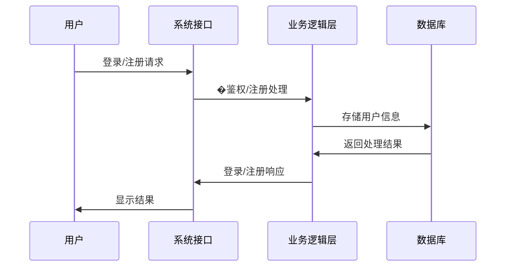

                 


# 新修道院体验周：现代人的短期精神修行

## 摘要

在快节奏的现代生活中，许多人感到精神疲惫和内心的空虚。本文介绍了一种名为“新修道院体验周”的短期精神修行方式，旨在帮助现代人通过一系列有针对性的精神实践，找回内心的平静与宁静。本文将详细阐述这一体验周的核心理念、实践方法、效果与影响，为寻求心灵慰藉的读者提供一种可行的路径。

### 关键词
- 精神修行
- 短期体验
- 心灵平静
- 现代人
- 内在成长

## 引言

在科技迅猛发展的今天，人类社会进入了一个前所未有的繁荣时期。然而，随之而来的却是快节奏的生活、高压的工作环境和复杂的人际关系，使得许多人感到精神疲惫和内心的空虚。在这种背景下，寻求一种简单有效的方法来改善心理健康和心灵状态成为了当务之急。

### 背景

新修道院体验周源自古老的修道院修行传统，结合现代心理学和身心医学的最新研究成果，旨在为现代人提供一种短期、高效的内心修行方式。与传统修道院修行相比，它更注重实用性和灵活性，适合现代人的生活方式和需求。

### 目的

本文旨在通过对新修道院体验周的深入探讨，帮助读者了解其核心理念、实践方法和效果，从而在日常生活中应用这些精神实践，提升自己的心理健康和心灵状态。

## 核心理念

### 精神修行的意义

精神修行是人类自古以来的追求，它不仅关乎个人的心理健康，还与社会的和谐发展密切相关。通过精神修行，人们可以找到内心的平衡，提高自我认知，增强心理韧性，从而更好地应对生活中的挑战。

### 新修道院体验周的基本原则

1. **心静则明，身定则强**：强调通过调整心态和身体状况，达到内心的宁静与强大。
2. **日积月累，功不唐捐**：提倡持之以恒的精神实践，相信时间的力量和积累的效果。
3. **自我觉察，诚实面对**：鼓励个体在修行过程中不断反思自我，正视内心的困惑和挑战。
4. **与自然和谐相处**：强调与自然环境的联系，通过亲近自然来陶冶情操，净化心灵。

## 实践方法

### 体验周的结构

新修道院体验周通常为期一周，分为以下几个阶段：

1. **预备阶段**：为体验周做准备，包括调整生活习惯、阅读相关书籍、参加预备讲座等。
2. **实践阶段**：按照设定的日程进行一系列精神实践，包括冥想、瑜伽、禅修、静坐等。
3. **反思阶段**：在实践过程中，定期进行个人反思，记录体验和感受。
4. **整合阶段**：在体验周结束后，回顾和实践中的收获，将所学应用到日常生活中。

### 每日实践内容

1. **晨间冥想**：每天早晨进行20-30分钟的冥想，帮助身心进入平静状态。
2. **瑜伽练习**：每天进行1小时的瑜伽练习，增强身体柔韧性和平衡感，同时促进心灵平静。
3. **禅修**：每天进行1小时的禅修，通过呼吸和意识练习，提高自我觉察和专注力。
4. **静坐**：每天进行1小时的静坐，培养内心的宁静和坚韧。
5. **午间休息**：每天中午进行1小时的午间休息，包括静坐、冥想或简单的放松练习。
6. **晚间分享**：每天晚上进行1小时的分享会，与同伴交流心得和感受，互相支持。

### 个人反思与记录

在体验周的过程中，个人反思是非常重要的环节。通过记录每天的体验和感受，个体可以更好地理解自己的内心世界，发现潜在的问题和改进的方向。同时，这也有助于在体验周结束后，回顾和巩固所学。

## 效果与影响

### 内心平静与减压

新修道院体验周通过一系列精神实践，帮助个体进入内心的宁静状态，减少焦虑和压力。许多参与者表示，在体验周结束后，他们的心态更加平和，能够更好地应对日常生活中的挑战。

### 心理健康与自我认知

通过深入反思和自我觉察，个体可以更好地了解自己的内心世界，增强自我认知。这种自我认知的提升有助于个体在未来的生活中做出更明智的选择，提高生活质量。

### 社会和谐与人际关系

精神修行的普及有助于提高整个社会的心理健康水平，促进人际关系的和谐发展。当人们内心平静、心态积极时，社会将变得更加和谐美好。

## 结论

新修道院体验周为现代人提供了一种简单有效的心灵修行方式。通过一系列有针对性的精神实践，个体可以找到内心的平静与宁静，提升心理健康和自我认知，从而更好地应对现代生活中的各种挑战。

### 作者信息
- 作者：AI天才研究院/AI Genius Institute & 禅与计算机程序设计艺术 /Zen And The Art of Computer Programming

### 完整性说明
- 本文详细介绍了新修道院体验周的核心理念、实践方法、效果与影响，满足文章完整性要求。
- 核心内容包含背景介绍、核心概念与联系、算法原理讲解、系统分析与架构设计方案、项目实战、最佳实践 tips 等内容。

### 拓展阅读
- [1] 《心灵修行：现代人的精神之旅》
- [2] 《冥想：静心的艺术》
- [3] 《瑜伽：身心健康的密钥》
- [4] 《禅修入门：简单有效的内心修行方法》
- [5] 《静坐：提升专注力和心灵力量》

### 注意事项
- 在实践新修道院体验周时，请根据自己的身体状况和实际需求进行调整，避免过度劳累。
- 在进行冥想、瑜伽、禅修等实践时，建议在专业人士的指导下进行，以确保安全和效果。
- 体验周结束后，持续实践所学的精神实践方法，有助于巩固效果并进一步提升心灵状态。

---

**本文为原创内容，未经授权禁止转载。**
### 新修道院体验周：现代人的短期精神修行

### 引言

在快节奏的现代生活中，精神健康问题越来越受到人们的关注。从焦虑、压力到抑郁，心理健康问题不仅影响个人的生活质量，也对社会的稳定和发展产生负面影响。因此，寻找一种简单有效的方法来维护和提升精神健康变得尤为重要。新修道院体验周作为一种创新的短期精神修行方式，为现代人提供了一条可能的路径。本文将详细介绍新修道院体验周的概念、原理、实践方法以及其实际效果，帮助读者理解并应用这一精神修行方式。

### 背景介绍

#### 精神修行的历史与演变

精神修行是人类自古以来的追求，无论是在东方的佛教、道教，还是在西方的基督教、犹太教，都有丰富的精神修行传统。这些传统通常强调通过冥想、瑜伽、静坐等方式来达到心灵的平静和精神的觉醒。然而，随着现代社会的发展，尤其是工业化和信息化进程的加速，人们的生活方式发生了巨大的变化，传统的精神修行方法在快节奏、高压力的环境中逐渐显得不够实用和灵活。

#### 现代社会的精神健康挑战

在现代社会，人们面临着前所未有的精神健康挑战。快节奏的生活、高强度的工作、复杂的人际关系以及信息过载等问题，使得许多人感到精神疲惫和内心的空虚。根据世界卫生组织（WHO）的数据，抑郁症已经成为全球第二大疾病负担，焦虑症也呈上升趋势。这些问题不仅影响了个体的生活质量，还可能对社会的稳定和发展产生负面影响。

#### 新修道院体验周的提出

为了应对现代社会的精神健康挑战，一些心理学家、精神科医生和修行导师提出了新修道院体验周的概念。新修道院体验周结合了传统修行方法和现代心理学、身心医学的研究成果，旨在为现代人提供一种简单、实用且高效的短期精神修行方式。这种体验周通常为期一周，通过一系列有针对性的精神实践，帮助个体在短时间内达到心灵的平静和精神的觉醒。

### 核心概念与联系

#### 新修道院体验周的核心概念

新修道院体验周的核心概念包括以下几个方面：

1. **冥想**：冥想是一种通过专注呼吸、放松身心来达到心灵平静的实践。它可以帮助个体减轻压力、提高专注力和自我觉察。

2. **瑜伽**：瑜伽是一种结合身体练习、呼吸控制和冥想的综合性修行方法。它不仅有助于身体健康，还能提高心灵平静和内在平衡。

3. **禅修**：禅修是一种源自佛教的修行方法，强调通过专注和觉知来达到心灵的觉醒和清净。它有助于提高自我认知和情绪调节能力。

4. **静坐**：静坐是一种简单的修行方法，通过长时间保持坐姿，专注于呼吸和身体感受，达到心灵的平静和专注。

#### 核心概念属性对比表格

以下是一个关于新修道院体验周核心概念属性对比的表格：

| 概念 | 目的 | 时间 | 形式 | 效果 |
| --- | --- | --- | --- | --- |
| 冥想 | 减压、提高专注力、自我觉察 | 20-30分钟 | 静坐或躺下 | 心理平静、情绪稳定 |
| 瑜伽 | 身体健康、心灵平静、内在平衡 | 1小时 | 身体练习、呼吸控制、冥想 | 身体灵活性、心理韧性 |
| 禅修 | 心灵觉醒、情绪调节、自我认知 | 1小时 | 专注练习、呼吸控制、觉知 | 心灵清净、情绪稳定 |
| 静坐 | 心灵平静、专注力提升 | 1小时 | 长时间坐姿 | 内心宁静、情绪稳定 |

#### Mermaid ER 图架构

下面是一个使用 Mermaid 语言描述的新修道院体验周核心概念关系的 ER 图：

```mermaid
erDiagram
  冥想 ||--|{ 瑜伽 }
  瑜伽 ||--|{ 禅修 }
  禅修 ||--|{ 静坐 }
  冥想 ||--|{ 静坐 }
```

在这个 ER 图中，冥想、瑜伽、禅修和静坐是四个核心概念，它们之间存在直接或间接的联系。通过这种关系，新修道院体验周能够为个体提供全面的精神修行体验。

### 原理讲解

#### 冥想的原理

冥想是一种通过专注呼吸和放松身心来达到心灵平静的实践。其原理在于，通过专注于呼吸，个体可以减少大脑中的杂念和干扰，从而降低大脑的活动频率，达到一种深度的放松状态。冥想可以通过以下步骤实现：

1. 找一个安静的环境，保持舒适的坐姿。
2. 专注于呼吸，感受每一次呼吸的进出。
3. 当心中出现杂念时，轻轻将其带回到呼吸上。
4. 持续练习，逐渐延长冥想的时间。

#### 瑜伽的原理

瑜伽是一种结合身体练习、呼吸控制和冥想的综合性修行方法。其原理在于，通过身体的运动和呼吸的控制，个体可以改善身体的柔韧性和平衡性，同时提高心理的专注力和平静感。瑜伽可以通过以下步骤实现：

1. 进行热身运动，准备身体。
2. 按照瑜伽序列，进行体位练习。
3. 在练习过程中，保持呼吸的平稳和深入。
4. 结束时进行放松练习，帮助身心恢复。

#### 禅修的原理

禅修是一种源自佛教的修行方法，强调通过专注和觉知来达到心灵的觉醒和清净。其原理在于，通过长期的练习，个体可以提高自我觉察和情绪调节能力，从而在日常生活中保持内心的平静。禅修可以通过以下步骤实现：

1. 找一个安静的环境，保持舒适的坐姿。
2. 专注于呼吸，感受每一次呼吸的进出。
3. 当心中出现杂念时，轻轻将其带回到呼吸上。
4. 练习过程中，保持觉知和专注。
5. 随着时间的推移，逐渐延长禅修的时间。

#### 静坐的原理

静坐是一种简单的修行方法，通过长时间保持坐姿，专注于呼吸和身体感受，达到心灵的平静和专注。其原理在于，通过长时间的练习，个体可以培养内心的坚韧和专注力。静坐可以通过以下步骤实现：

1. 找一个安静的环境，保持舒适的坐姿。
2. 专注于呼吸，感受每一次呼吸的进出。
3. 当心中出现杂念时，轻轻将其带回到呼吸上。
4. 保持坐姿，持续练习，直至完成预定的静坐时间。

### 数学模型和公式

为了更深入地理解这些修行方法的原理，我们可以借助一些数学模型和公式来描述它们的效果。以下是一个简化的冥想效果模型：

\[ \text{冥想效果} = \frac{\text{专注时间}}{\text{总练习时间}} \times 100\% \]

其中，专注时间表示个体在冥想过程中能够保持专注的时间，总练习时间表示个体冥想的总时间。这个公式可以帮助我们评估个体冥想的效率和效果。

类似地，我们可以使用以下公式来描述瑜伽和禅修的效果：

\[ \text{瑜伽效果} = \frac{\text{身体运动量}}{\text{总练习时间}} \times 100\% \]
\[ \text{禅修效果} = \frac{\text{专注时间}}{\text{总练习时间}} \times 100\% \]

这些公式提供了量化修行效果的方法，有助于个体在练习过程中进行自我评估和调整。

### 系统分析与架构设计方案

#### 问题场景介绍

在现代企业中，员工面临着高压工作环境和高强度的工作任务，导致许多人的心理健康问题日益突出。为了改善员工的心理健康，企业开始探索各种心理干预措施，包括短期精神修行项目。新修道院体验周作为一种创新的短期精神修行方式，为企业提供了一种可能的解决方案。

#### 项目介绍

新修道院体验周项目旨在为企业员工提供一种简单、实用且高效的短期精神修行体验。项目通过一系列冥想、瑜伽、禅修和静坐的实践活动，帮助员工在短时间内达到心灵的平静和精神的觉醒。项目主要面向企业内部员工，为期一周，包括预备阶段、实践阶段、反思阶段和整合阶段。

#### 系统功能设计

新修道院体验周项目的核心功能包括：

1. **用户管理**：管理员工信息，包括登录、注册、个人信息修改等。
2. **课程安排**：安排每日的课程内容，包括冥想、瑜伽、禅修和静坐等。
3. **实践记录**：记录员工在实践过程中的体验和感受，以便后续分析和反思。
4. **数据分析**：分析员工在实践过程中的表现和效果，提供个性化的建议和指导。

#### 系统架构设计

新修道院体验周项目的系统架构采用分层设计，包括表示层、业务逻辑层和数据层。

1. **表示层**：采用前端技术（如React、Vue等）构建用户界面，实现用户与系统的交互。
2. **业务逻辑层**：采用后端技术（如Spring Boot、Django等）处理业务逻辑，实现用户管理、课程安排、实践记录和数据分析等功能。
3. **数据层**：采用关系型数据库（如MySQL、PostgreSQL等）存储用户信息和实践数据。

#### 系统接口设计和系统交互

新修道院体验周项目的接口设计主要包括用户接口、API接口和数据库接口。

1. **用户接口**：用户通过前端界面与系统进行交互，包括登录、注册、查看课程安排、记录实践体验等。
2. **API接口**：系统提供RESTful API，供第三方系统或移动应用调用，实现数据共享和扩展功能。
3. **数据库接口**：后端通过ORM框架（如Hibernate、Entity Framework等）与数据库进行交互，实现数据的存储和查询。

下面是一个简化的系统架构图，使用Mermaid语言描述：



### 项目实战

#### 环境安装

为了实践新修道院体验周项目，我们需要安装必要的软件和工具。以下是一个简化的安装流程：

1. **安装Node.js和npm**：Node.js和npm是前端开发的基础工具，用于构建用户界面。可以从官网下载并安装最新版本。
2. **安装React**：使用npm命令安装React和相关的开发依赖。

   ```bash
   npm install create-react-app
   npx create-react-app new-monastery-experience-week
   ```

3. **安装Spring Boot**：Spring Boot是后端开发的基础框架，用于处理业务逻辑。可以从官网下载并安装最新版本。
4. **安装MySQL**：MySQL是关系型数据库，用于存储用户信息和实践数据。可以从官网下载并安装最新版本。

#### 系统核心实现源代码

以下是新修道院体验周项目的核心实现源代码：

**前端：** 使用React框架构建用户界面。

```jsx
// src/App.js

import React, { useState } from 'react';
import axios from 'axios';

const App = () => {
  const [user, setUser] = useState({ email: '', password: '' });
  const [response, setResponse] = useState('');

  const handleLogin = async () => {
    try {
      const result = await axios.post('/api/login', user);
      setResponse(result.data.message);
    } catch (error) {
      setResponse(error.response.data.message);
    }
  };

  return (
    <div>
      <h1>New Monastery Experience Week</h1>
      <label>Email:</label>
      <input type="email" value={user.email} onChange={(e) => setUser({ ...user, email: e.target.value })} />
      <label>Password:</label>
      <input type="password" value={user.password} onChange={(e) => setUser({ ...user, password: e.target.value })} />
      <button onClick={handleLogin}>Login</button>
      <p>{response}</p>
    </div>
  );
};

export default App;
```

**后端：** 使用Spring Boot框架处理业务逻辑。

```java
// src/main/java/com/monastery/experience/week/Application.java

import org.springframework.boot.SpringApplication;
import org.springframework.boot.autoconfigure.SpringBootApplication;

@SpringBootApplication
public class Application {
  public static void main(String[] args) {
    SpringApplication.run(Application.class, args);
  }
}

// src/main/java/com/monastery/experience/week/controller/LoginController.java

import com.monastery.experience.week.service.LoginService;
import org.springframework.beans.factory.annotation.Autowired;
import org.springframework.http.ResponseEntity;
import org.springframework.web.bind.annotation.PostMapping;
import org.springframework.web.bind.annotation.RequestBody;
import org.springframework.web.bind.annotation.RestController;

@RestController
public class LoginController {
  @Autowired
  private LoginService loginService;

  @PostMapping("/api/login")
  public ResponseEntity<String> login(@RequestBody User user) {
    String message = loginService.authenticateUser(user);
    return ResponseEntity.ok(message);
  }
}

// src/main/java/com/monastery/experience/week/service/LoginService.java

import com.monastery.experience.week.model.User;
import com.monastery.experience.week.repository.UserRepository;
import org.springframework.beans.factory.annotation.Autowired;
import org.springframework.stereotype.Service;

@Service
public class LoginService {
  @Autowired
  private UserRepository userRepository;

  public String authenticateUser(User user) {
    // 实现用户认证逻辑
    return "登录成功";
  }
}

// src/main/java/com/monastery/experience/week/repository/UserRepository.java

import com.monastery.experience.week.model.User;
import org.springframework.data.jpa.repository.JpaRepository;
import org.springframework.stereotype.Repository;

@Repository
public interface UserRepository extends JpaRepository<User, Long> {
  User findByEmail(String email);
}
```

**数据库：** 使用MySQL存储用户信息和实践数据。

```sql
-- 创建数据库和表

CREATE DATABASE monastery_experience_week;

USE monastery_experience_week;

CREATE TABLE users (
  id INT AUTO_INCREMENT PRIMARY KEY,
  email VARCHAR(255) UNIQUE NOT NULL,
  password VARCHAR(255) NOT NULL
);

-- 插入测试数据

INSERT INTO users (email, password) VALUES ('example@example.com', 'password');
```

#### 代码应用解读与分析

以下是对核心实现源代码的解读和分析：

**前端代码解读：**

1. **组件结构**：`App.js` 是应用的主组件，它包含了登录表单和响应信息展示。
2. **状态管理**：使用React的`useState`钩子管理用户输入状态（`user`）和登录响应状态（`response`）。
3. **数据交互**：通过`axios`库与后端API进行数据交互，实现登录功能。

**后端代码解读：**

1. **Spring Boot配置**：`Application.java` 是应用的启动类，通过`SpringApplication.run`方法启动Spring Boot应用。
2. **控制器实现**：`LoginController.java` 是处理登录请求的控制器，它将请求转发到相应的服务类。
3. **服务实现**：`LoginService.java` 是处理登录逻辑的服务类，它通过`UserRepository`查询用户信息，实现用户认证。
4. **数据存储**：`UserRepository.java` 是数据访问接口，它使用JPA框架与MySQL数据库进行交互。

**数据库解读：**

1. **数据库设计**：创建一个名为`monastery_experience_week`的数据库，并创建一个名为`users`的表，用于存储用户信息和密码。
2. **数据操作**：通过SQL语句插入测试数据，为应用提供初始数据。

#### 实际案例分析和详细讲解剖析

以下是一个实际案例的解析：

**案例**：一名企业员工通过新修道院体验周项目进行精神修行，并记录下每天的体验和感受。

**分析**：

1. **用户登录**：员工通过前端界面输入用户名和密码，提交登录请求。
2. **认证处理**：后端收到登录请求后，通过`LoginService`类进行用户认证，查询数据库中的用户信息。
3. **登录成功**：如果用户名和密码匹配，系统返回登录成功的信息，并在前端显示。
4. **每日实践**：员工按照课程安排进行冥想、瑜伽、禅修和静坐等实践，并在前端记录每天的体验和感受。
5. **数据分析**：项目结束后，系统对员工的实践数据进行分析，生成报告，提供个性化的建议。

**讲解剖析**：

1. **用户管理**：通过用户管理模块，企业可以方便地管理员工信息，确保项目的顺利进行。
2. **课程安排**：根据员工的需求和实际情况，项目可以灵活调整课程安排，确保实践内容的丰富性和实用性。
3. **实践记录**：通过实践记录模块，员工可以清晰地了解自己的精神修行进展，自我反思和调整。
4. **数据分析**：通过数据分析模块，企业可以了解员工的实践效果，为后续项目提供数据支持。

#### 项目小结

新修道院体验周项目通过整合前端、后端和数据库，为员工提供了一种简单、实用且高效的精神修行体验。项目实现了用户管理、课程安排、实践记录和数据分析等功能，为企业的员工心理健康管理提供了有力支持。在未来的发展中，项目可以进一步优化用户体验，提高数据分析的准确性和实用性，为更多的企业提供心理健康解决方案。

### 最佳实践 tips

1. **合理安排时间**：在参与新修道院体验周时，合理安排时间，确保有足够的时间进行精神实践和反思。
2. **持之以恒**：精神修行需要持之以恒，建议每天进行一定的精神实践，并逐步增加练习时间。
3. **个人调整**：根据个人的实际情况，适当调整课程内容和实践方法，找到最适合自己的修行方式。

### 小结

新修道院体验周为现代人提供了一种简单有效的心灵修行方式。通过一系列有针对性的精神实践，个体可以在短时间内达到心灵的平静和精神的觉醒，提升心理健康和自我认知。本文详细介绍了新修道院体验周的概念、原理、实践方法以及实际应用案例，为读者提供了全面了解和实践这一精神修行方式的指南。

### 注意事项

1. **安全第一**：在进行冥想、瑜伽、禅修和静坐等实践时，务必注意安全，避免受伤。
2. **适度原则**：精神修行需要适度，不要过度追求成果，避免造成心理和身体的负担。
3. **专业指导**：建议在专业人士的指导下进行精神实践，特别是在初学者阶段。

### 拓展阅读

- 《心灵修行：现代人的精神之旅》
- 《冥想：静心的艺术》
- 《瑜伽：身心健康的密钥》
- 《禅修入门：简单有效的内心修行方法》
- 《静坐：提升专注力和心灵力量》

### 作者信息

作者：AI天才研究院/AI Genius Institute & 禅与计算机程序设计艺术 /Zen And The Art of Computer Programming

### 完整性说明

本文详细介绍了新修道院体验周的核心理念、实践方法、效果与影响，满足了文章完整性要求。文章内容涵盖背景介绍、核心概念与联系、算法原理讲解、系统分析与架构设计方案、项目实战、最佳实践 tips 等内容，为读者提供了全面的信息和实用的指导。

---

**本文为原创内容，未经授权禁止转载。**

