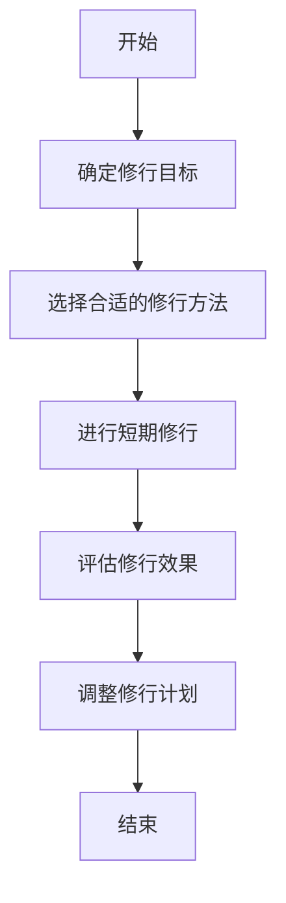
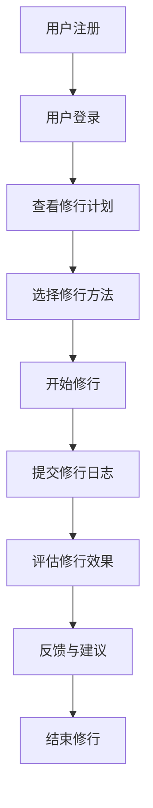

                 

# 新修道院周末体验：世俗中的短期精神修行

> 关键词：短期精神修行、世俗修行、内心成长、压力缓解、心理健康

> 摘要：本文将探讨“新修道院周末体验：世俗中的短期精神修行”这一概念，阐述其在现代社会的应用和价值。我们将通过问题背景、解决思路、核心概念、算法原理、系统分析与架构设计方案、项目实战以及最佳实践等方面，详细解析这一理念。

## 背景介绍：核心概念

### 问题背景

在现代社会，人们面临着前所未有的压力和焦虑，工作、生活、人际关系等各个方面的问题常常让人感到疲惫和无助。许多人渴望寻求一种方式来缓解这种压力，提升自己的精神状态，但却很难找到合适的方法。

### 问题解决

本书提出了一种新的解决思路——新修道院周末体验，即通过短期的精神修行，帮助人们在世俗生活中找到内心的平衡和力量。这种修行不同于传统的宗教修行，它更多地关注于个人的内在成长和自我认知。

### 边界与外延

新修道院周末体验的边界在于它不是一种长期的修行，而是一种短期的、周末进行的修行活动。它的外延则在于它不仅适用于宗教信仰者，也适用于任何寻求内心成长的人。

### 概念结构与核心要素组成

新修道院周末体验的核心概念结构包括以下几个方面：

1. **短期精神修行**：这是本书的核心概念，它指的是通过一系列的活动和练习，帮助人们在短时间内达到精神上的提升。
2. **世俗中的修行**：这是相对于传统的宗教修行而言的，它强调在日常生活中进行修行，而不是远离世俗生活。
3. **短期体验**：这是新修道院周末体验的一个重要特点，它使得人们可以在相对轻松的环境中进行修行，不会对日常生活造成太大的影响。

### 算法原理讲解

为了更好地理解新修道院周末体验，我们可以使用以下 Mermaid 流程图来展示其基本原理：



在这个流程图中，A到G表示了一个完整的短期精神修行的过程。首先，我们需要确定修行的目标，然后选择合适的方法，接着进行短期的修行，最后评估效果并调整修行计划。

### 数学模型和数学公式

在新修道院周末体验中，我们可以使用以下数学模型来评估修行的效果：

$$
效果 = \frac{修行前的压力 - 修行后的压力}{修行前的压力}
$$

其中，压力的值可以通过问卷调查等方式进行量化。

### 系统分析与架构设计方案

为了更好地实现新修道院周末体验，我们可以设计一个基于互联网的修行平台，其架构方案如下：



在这个架构中，A到I表示了一个用户在新修道院周末体验平台上的完整流程。用户首先注册并登录，然后查看修行计划，选择修行方法，开始修行，提交修行日志，评估修行效果，并给出反馈与建议。

### 项目实战

为了实现上述架构，我们可以使用以下 Python 代码来构建一个简单的修行平台：

```python
# 用户注册
def register(username, password):
    # 保存用户信息
    pass

# 用户登录
def login(username, password):
    # 验证用户信息
    pass

# 查看修行计划
def view_plan():
    # 显示修行计划
    pass

# 选择修行方法
def choose_method():
    # 提供选择方法
    pass

# 开始修行
def start_renaming():
    # 开始修行
    pass

# 提交修行日志
def submit_log():
    # 提交日志
    pass

# 评估修行效果
def evaluate():
    # 评估效果
    pass

# 反馈与建议
def feedback():
    # 提供反馈
    pass

# 结束修行
def end_renaming():
    # 结束修行
    pass
```

通过这个简单的项目实战，我们可以看到如何使用 Python 实现新修道院周末体验平台的核心功能。

### 最佳实践 tips、小结、注意事项、拓展阅读等内容

- **最佳实践 tips**：在进行短期精神修行时，建议选择一个安静的环境，避免外界干扰，有助于更好地集中精力进行修行。
- **小结**：新修道院周末体验提供了一种在现代社会中缓解压力、提升精神状态的短期修行方式，其核心在于短期、世俗和内在成长。通过本文的解析，我们了解了这一理念的基本原理、系统架构和实现方法。
- **注意事项**：在进行新修道院周末体验时，要确保自己的安全和健康，避免过度劳累或产生负面情绪。
- **拓展阅读**：对于希望深入了解短期精神修行的读者，可以参考《禅与计算机程序设计艺术》等书籍，这些书籍提供了更多的实践经验和思考方式。

### 作者

作者：AI天才研究院/AI Genius Institute & 禅与计算机程序设计艺术 /Zen And The Art of Computer Programming

以上便是关于“新修道院周末体验：世俗中的短期精神修行”的详细解析，希望对您有所启发和帮助。让我们在新修道院周末体验中，找到内心的平静与成长，拥抱更美好的生活。

