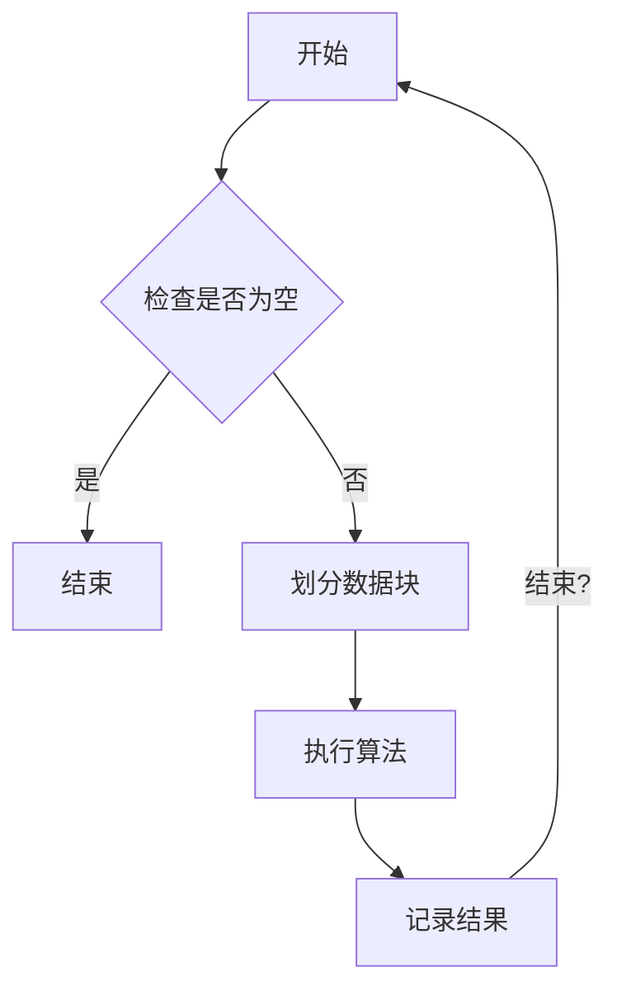

                 

# 新修道院周末：现代人的短期精神修行活动

## 关键词

- 精神修行
- 短期活动
- 冥想
- 心理健康
- 生活质量

## 摘要

在现代快节奏的生活中，精神修行成为了一种重要的心理调适方式。本文将探讨短期精神修行活动的概念、意义、设计原则以及实践方法，帮助现代人通过简单的周末活动来提升心理素质、增强人际关系，并提高生活质量。本文将从历史背景、核心概念、活动类型、设计原则、执行技巧和未来趋势等多个角度，深入分析短期精神修行的价值和应用。

### 目录大纲

1. **精神修行的核心概念与意义**
   - **第1章：精神修行的起源与发展**
     - **1.1 精神修行的起源**
     - **1.2 精神修行的历史演变**
     - **1.3 精神修行与现代生活的联系**
   - **第2章：精神修行的核心概念**
     - **2.1 精神修行的定义**
     - **2.2 精神修行的目标**
     - **2.3 精神修行的关键要素**
   - **第3章：精神修行的意义**
     - **3.1 提升心理素质**
     - **3.2 增强人际关系**
     - **3.3 提高生活质量**

2. **短期精神修行活动设计**
   - **第4章：短期精神修行活动的类型**
     - **4.1 瑜伽与冥想**
     - **4.2 冥想与正念**
     - **4.3 呼吸练习与身体觉知**
   - **第5章：短期精神修行活动的设计原则**
     - **5.1 确定修行目标**
     - **5.2 选择合适的修行方式**
     - **5.3 制定合理的修行计划**
   - **第6章：短期精神修行活动实例**
     - **6.1 24小时冥想挑战**
     - **6.2 7日瑜伽静修**
     - **6.3 呼吸疗愈工作坊**

3. **执行与反思**
   - **第7章：如何开始短期精神修行**
     - **7.1 制定个人修行计划**
     - **7.2 确定修行时间和地点**
     - **7.3 准备修行所需的工具和资源**
   - **第8章：短期精神修行的执行技巧**
     - **8.1 建立稳定的修行习惯**
     - **8.2 克服修行过程中的困难**
     - **8.3 调整修行进度**
   - **第9章：短期精神修行的反思与总结**
     - **9.1 评估修行效果**
     - **9.2 反思修行过程中的体会和收获**
     - **9.3 为未来的修行设定目标**

4. **深入探讨**
   - **第10章：短期精神修行与心理学**
     - **10.1 精神修行对心理状态的影响**
     - **10.2 精神修行与心理治疗的关系**
     - **10.3 心理学在短期精神修行中的应用**
   - **第11章：短期精神修行与社会文化**
     - **11.1 短期精神修行在不同文化中的地位**
     - **11.2 社会文化对短期精神修行的影响**
     - **11.3 短期精神修行的社会价值**
   - **第12章：短期精神修行的未来趋势**
     - **12.1 短期精神修行的市场需求**
     - **12.2 新技术对短期精神修行的影响**
     - **12.3 短期精神修行的未来发展前景**

### 1. 精神修行的核心概念与意义

#### 1.1 精神修行的起源

精神修行是人类追求内在平和与智慧的一种古老传统。其起源可以追溯到数千年前的古代文明，如印度、中国和埃及。在古代印度，瑜伽和冥想作为精神修行的核心方法，被广泛实践。在佛教和道教中，精神修行被视为达到内心宁静和觉悟的重要途径。而在古希腊和罗马时期，哲学家的冥想和反思活动也具有精神修行的性质。

#### 1.2 精神修行的历史演变

随着时间的推移，精神修行在不同的文化和历史时期中得到了不同的诠释和发展。在中世纪欧洲，修道院成为精神修行的中心，信徒们在严格的宗教戒律下追求灵魂的升华。在近现代，随着西方哲学和心理学的兴起，精神修行逐渐与现代科学相结合，形成了心理治疗和精神健康领域的重要分支。

#### 1.3 精神修行与现代生活的联系

在现代生活中，精神修行的价值愈发受到重视。快节奏的工作、高压的生活环境以及社交媒体的广泛使用，使得现代人面临前所未有的心理压力。精神修行提供了一种应对这些挑战的方法，帮助个体找到内心的平静和力量。同时，随着对心理健康意识的提升，越来越多的人开始将精神修行纳入日常生活中，以提升生活质量。

### 2. 精神修行的核心概念

#### 2.1 精神修行的定义

精神修行是一种通过内在实践来提升自我意识、达到心理平衡和内在平静的过程。它不仅仅是关于宗教信仰或哲学思考，更是一种对个人内在世界的探索和修炼。精神修行的定义因文化和传统而异，但其核心目标是一致的，即寻求内心的和谐与智慧。

#### 2.2 精神修行的目标

精神修行的目标多种多样，但主要包括以下几个方面：

1. **心理平衡**：通过精神修行，个体可以减少焦虑、抑郁等负面情绪，达到心理平衡状态。
2. **内在平静**：通过冥想、瑜伽等修行方法，个体可以培养内心的宁静和专注力。
3. **自我认知**：精神修行帮助个体更好地了解自己，发现自己的潜在能力和成长空间。
4. **智慧与洞察力**：通过精神修行，个体可以提升思维品质，培养洞察力和判断力。

#### 2.3 精神修行的关键要素

精神修行的成功离不开以下几个关键要素：

1. **专注与冥想**：专注力是精神修行的核心，通过冥想练习，个体可以培养专注力，减少杂念。
2. **正念**：正念是指对当前时刻的觉察和接纳，它帮助个体摆脱对过去的悔恨和对未来的担忧，活在当下。
3. **自律与毅力**：精神修行需要自律和毅力，个体需要克服自身的惰性和借口，持之以恒地进行修行。
4. **内在探索**：精神修行不仅仅是外在练习，更重要的是内在探索，个体需要深入自己的内心，寻找真正的自我。

### 3. 精神修行的意义

#### 3.1 提升心理素质

精神修行通过降低压力、减少焦虑和抑郁，显著提升个体的心理素质。研究发现，长期进行精神修行的个体在应对压力时表现得更加冷静和有韧性，心理适应能力更强。

#### 3.2 增强人际关系

精神修行不仅有助于个人内心的成长，还能改善人际关系。通过提升自我认知和同理心，个体能够更好地理解和沟通他人，建立更深层次的人际关系。

#### 3.3 提高生活质量

精神修行对生活质量的提升具有深远的影响。通过精神修行，个体能够更好地管理情绪，提高幸福感，从而提升整体的生活质量。此外，精神修行还能帮助个体建立健康的生活方式，如规律作息、健康饮食等。

### 4. 短期精神修行活动的类型

短期精神修行活动种类繁多，每种活动都有其独特的特点和目的。以下是几种常见的短期精神修行活动：

#### 4.1 瑜伽与冥想

瑜伽和冥想是精神修行的经典方法，它们不仅能够提升身体的灵活性，还能增强心理素质。瑜伽通过体位练习和呼吸调节，帮助个体达到身心合一的状态；而冥想则通过专注呼吸和静心思考，帮助个体消除杂念，达到内心的平静。

#### 4.2 冥想与正念

冥想与正念练习强调对当前时刻的觉察和接纳。通过冥想，个体可以培养专注力和内心平静；而正念练习则帮助个体在面对生活压力时保持冷静和平衡。

#### 4.3 呼吸练习与身体觉知

呼吸练习和身体觉知是精神修行的另一个重要方面。通过深呼吸和身体扫描练习，个体可以提升对身体的觉知，减轻身体紧张和焦虑，达到身心放松的状态。

### 5. 短期精神修行活动的设计原则

设计短期精神修行活动时，应遵循以下原则：

#### 5.1 确定修行目标

在开始设计修行活动之前，个体应明确自己的修行目标。这些目标可以是提升专注力、减少焦虑、改善睡眠质量等。明确的目标有助于指导整个活动的设计和执行。

#### 5.2 选择合适的修行方式

根据个人的需求和偏好，选择适合的修行方式。例如，如果目标是减轻焦虑，可以选择冥想和瑜伽等放松性练习；如果目标是提升专注力，可以选择正念练习和呼吸练习。

#### 5.3 制定合理的修行计划

制定一个合理的修行计划，包括修行的频率、时间和时长。计划应考虑到个人的实际情况，如工作、生活和家庭安排，以确保修行活动能够持续进行。

### 6. 短期精神修行活动实例

以下是一些具体的短期精神修行活动实例，供读者参考：

#### 6.1 24小时冥想挑战

这是一个为期24小时的冥想活动，旨在帮助个体培养专注力和内心平静。参与者可以在一个安静的环境中进行冥想，每天设定一定的时间段进行练习。

#### 6.2 7日瑜伽静修

这是一个为期7天的瑜伽静修活动，参与者将进行规律的瑜伽练习，同时结合冥想和呼吸练习。活动结束后，参与者通常能感受到身体和心灵的显著变化。

#### 6.3 呼吸疗愈工作坊

这是一个专注于呼吸练习的工作坊，通过深呼吸和身体扫描练习，帮助个体减轻身体紧张和焦虑。参与者将在专业教练的指导下进行练习。

### 7. 如何开始短期精神修行

#### 7.1 制定个人修行计划

开始短期精神修行前，个体应首先制定个人修行计划。计划应包括修行目标、方式、时间和时长。例如，如果目标是减轻焦虑，可以选择每天晚上进行20分钟的冥想练习。

#### 7.2 确定修行时间和地点

选择一个安静、舒适的环境作为修行场所，确保在这个时间段内不会被外界干扰。例如，可以选择每天的早晨或晚上进行修行。

#### 7.3 准备修行所需的工具和资源

根据所选的修行方式，准备所需的工具和资源。例如，冥想练习可能需要一把舒适的坐垫和一个静音环境。

### 8. 短期精神修行的执行技巧

#### 8.1 建立稳定的修行习惯

为了确保修行效果，个体应建立稳定的修行习惯。例如，可以设定每天固定的修行时间，并将其纳入日常生活。

#### 8.2 克服修行过程中的困难

在修行过程中，个体可能会遇到各种困难，如杂念纷飞、身体不适等。这时，个体需要保持耐心和毅力，学会应对这些困难。

#### 8.3 调整修行进度

根据个人的实际情况，适时调整修行的进度。例如，如果感到压力过大，可以适当减少修行的时间。

### 9. 短期精神修行的反思与总结

#### 9.1 评估修行效果

在修行结束后，个体应对修行效果进行评估。这可以包括心理状态、人际关系和生活质量等方面的变化。

#### 9.2 反思修行过程中的体会和收获

通过反思，个体可以更好地理解修行过程中的体会和收获。这有助于深化对精神修行的认识，并为未来的修行提供指导。

#### 9.3 为未来的修行设定目标

根据反思的结果，个体可以为未来的修行设定新的目标。这些目标应更具挑战性，以推动个体的持续成长。

### 10. 短期精神修行与心理学

#### 10.1 精神修行对心理状态的影响

心理学研究显示，短期精神修行对个体的心理状态有显著的积极影响。例如，冥想可以降低焦虑水平，提升情绪稳定性。

#### 10.2 精神修行与心理治疗的关系

精神修行与心理治疗在某些方面有相似之处，但它们也有明显的区别。精神修行更侧重于内在探索和自我提升，而心理治疗则更关注解决具体心理问题。

#### 10.3 心理学在短期精神修行中的应用

心理学知识可以应用于短期精神修行的设计和执行，帮助个体更好地理解和应对修行过程中的心理变化。

### 11. 短期精神修行与社会文化

#### 11.1 短期精神修行在不同文化中的地位

不同文化对短期精神修行的态度和接受度有所不同。在一些文化中，精神修行被视为一种重要的生活方式，而在其他文化中，它可能只是一种心理调节手段。

#### 11.2 社会文化对短期精神修行的影响

社会文化因素会影响个体对短期精神修行的看法和实践。例如，在快节奏的社会中，人们可能更倾向于选择短期的精神修行活动。

#### 11.3 短期精神修行的社会价值

短期精神修行不仅对个体有益，还具有显著的社会价值。例如，它有助于提高整个社会的心理健康水平，促进社会和谐。

### 12. 短期精神修行的未来趋势

#### 12.1 短期精神修行的市场需求

随着人们对心理健康的关注增加，短期精神修行的市场需求也在不断扩大。未来，这一市场将更加多元化，满足不同群体的需求。

#### 12.2 新技术对短期精神修行的影响

新技术，如虚拟现实和人工智能，将对短期精神修行产生深远影响。这些技术可以为个体提供更丰富、更个性化的修行体验。

#### 12.3 短期精神修行的未来发展前景

短期精神修行在未来将得到更广泛的应用和认可。它将成为现代人生活中不可或缺的一部分，帮助个体实现身心健康和内在成长。

### 结论

短期精神修行是一种简单而有效的心理调适方法，它不仅有助于提升个体的心理素质和生活质量，还能改善人际关系，提高社会和谐。通过本文的探讨，我们希望读者能够更好地理解短期精神修行的价值和应用，并在日常生活中实践这些修行方法。

### 作者信息

- 作者：AI天才研究院/AI Genius Institute & 禅与计算机程序设计艺术 /Zen And The Art of Computer Programming

---

在接下来的部分，我们将对文章中的每个章节进行详细的展开和深入探讨。通过逻辑清晰、结构紧凑、简单易懂的专业技术语言，帮助读者更好地理解和实践短期精神修行。让我们一步一步思考，共同探索这个充满智慧和精神力量的领域。🌟

---

### 第1章：精神修行的起源与发展

#### 1.1 精神修行的起源

精神修行的起源可以追溯到古老的宗教和哲学传统。在印度，瑜伽和冥想作为精神修行的核心方法，已有数千年的历史。瑜伽源于古印度哲学，旨在通过身体练习、呼吸控制和冥想，达到身心合一的状态。而冥想则是一种通过专注和静心来探索内心世界的修行方式。

在中国，佛教和道教是精神修行的两个重要源头。佛教中的禅修和冥想强调内心的平静和觉知，通过不断的修行，个体可以达到涅槃的境界。道教则提倡内在的和谐与自然，通过冥想和气功练习，个体可以提升自身的能量和健康。

此外，古希腊和罗马时期的哲学家，如苏格拉底、柏拉图和亚里士多德，也通过思考和冥想探索真理和智慧。这些哲学家的思想和方法为后来的精神修行提供了理论基础。

#### 1.2 精神修行的历史演变

精神修行在不同的历史时期和文化中有着不同的演变和表现形式。在中世纪欧洲，修道院成为精神修行的中心，信徒们在严格的宗教戒律下追求灵魂的升华。这一时期的精神修行注重信仰和服从，修士们通过祈祷、冥想和苦修来净化心灵。

随着时间的推移，精神修行逐渐与科学和心理学相结合。19世纪末至20世纪初，西方心理学开始关注精神健康和内在成长，一些心理学家开始研究和推广冥想和瑜伽等精神修行方法。这一时期的变革使得精神修行从宗教领域走向科学和心理学领域，成为一种广泛应用于心理治疗和健康促进的方法。

在现代，随着社会的快速发展和生活节奏的加快，精神修行的需求也越来越大。现代人对心理健康和生活质量的关注，使得精神修行成为了一种普及的生活方式。各种形式的短期精神修行活动，如冥想工作坊、瑜伽静修和呼吸疗愈，受到越来越多人的青睐。

#### 1.3 精神修行与现代生活的联系

现代生活充满了压力和挑战，精神修行成为了一种重要的心理调适方式。首先，精神修行可以帮助现代人应对高压的工作环境。通过冥想和瑜伽等修行方法，个体可以降低焦虑和压力水平，提高心理韧性，从而更好地应对工作和生活中的挑战。

其次，精神修行有助于改善人际关系。通过提升自我认知和同理心，个体可以更好地理解和沟通他人，建立更深层次的人际关系。精神修行还能培养个体的情商和社交技能，使其更加善于处理人际关系中的冲突和问题。

最后，精神修行对提高生活质量具有深远的影响。通过精神修行，个体可以培养积极的生活态度和健康的生活方式。例如，规律的冥想和瑜伽练习可以帮助个体建立良好的作息习惯，改善睡眠质量，提高整体的生活幸福感。

总之，精神修行不仅是古代智慧的传承，也是现代人应对现代生活挑战的重要工具。通过精神修行，个体可以提升心理素质、增强人际关系，并提高生活质量，从而实现身心的和谐与平衡。

### 第2章：精神修行的核心概念

#### 2.1 精神修行的定义

精神修行是一种通过内在实践来提升自我意识、达到心理平衡和内在平静的过程。它不仅仅是一种宗教或哲学信仰，而是一种对个人内在世界的探索和修炼。精神修行的定义因文化和传统而异，但其核心目标是一致的，即寻求内心的和谐与智慧。

在精神修行的定义中，有几个关键要素需要理解：

- **内在实践**：精神修行是一种主动的内在探索过程，个体需要通过冥想、瑜伽、呼吸练习等方式，不断地反思和调整自己的内心状态。
- **自我意识**：通过精神修行，个体可以更好地了解自己的内在世界，认识到自己的情绪、思想和行为模式，从而提升自我认知。
- **心理平衡**：精神修行的目的是帮助个体达到心理平衡状态，减少焦虑、抑郁等负面情绪，提升情绪稳定性。
- **内在平静**：通过精神修行，个体可以培养内心的宁静和专注力，减少杂念和干扰，达到一种内心平和的状态。

#### 2.2 精神修行的目标

精神修行的目标多种多样，但主要包括以下几个方面：

1. **心理平衡**：通过精神修行，个体可以降低压力水平，减少焦虑、抑郁等负面情绪，达到心理平衡状态。心理平衡不仅有助于改善个体的心理健康，还能提高其应对压力和挑战的能力。
2. **内在平静**：精神修行的另一个重要目标是帮助个体培养内心的宁静和专注力。通过冥想和呼吸练习，个体可以减少杂念和干扰，达到一种内心平和的状态。这种内在平静有助于提高个体的专注力和工作效率。
3. **自我认知**：通过精神修行，个体可以更好地了解自己，发现自己的内在需求和潜在能力。自我认知不仅有助于个体的个人成长，还能提升其情商和人际关系。
4. **智慧与洞察力**：精神修行可以帮助个体提升思维品质，培养洞察力和判断力。通过深入思考和冥想，个体可以超越表面的现象，看到事物的本质和真相。

#### 2.3 精神修行的关键要素

精神修行的成功离不开以下几个关键要素：

1. **专注与冥想**：专注力是精神修行的核心，通过冥想练习，个体可以培养专注力，减少杂念。冥想是一种通过专注呼吸、静心思考等方式，来达到内心平静和专注的方法。
2. **正念**：正念是指对当前时刻的觉察和接纳，它帮助个体摆脱对过去的悔恨和对未来的担忧，活在当下。通过正念练习，个体可以提升对当前时刻的专注力和觉察力，减少焦虑和压力。
3. **自律与毅力**：精神修行需要自律和毅力，个体需要克服自身的惰性和借口，持之以恒地进行修行。自律和毅力是确保修行持续进行的重要保障。
4. **内在探索**：精神修行不仅仅是外在练习，更重要的是内在探索。个体需要深入自己的内心，寻找真正的自我。通过内在探索，个体可以认识到自己的情绪、思想和行为模式，从而提升自我认知。

总之，精神修行的核心概念包括内在实践、自我意识、心理平衡、内在平静、自我认知、智慧与洞察力等关键要素。通过这些要素的实践和探索，个体可以实现身心的和谐与平衡，提升生活质量。

### 第3章：精神修行的意义

#### 3.1 提升心理素质

精神修行对提升心理素质具有显著的效果。首先，精神修行可以帮助个体降低压力水平。现代生活节奏快，工作压力大，精神修行提供了一种有效的心理调适方法，通过冥想、瑜伽等练习，个体可以放松身心，减轻压力带来的负面影响。

其次，精神修行有助于减少焦虑和抑郁等负面情绪。通过专注和冥想，个体可以培养内心的平静和专注力，减少杂念和干扰。这种内心的宁静有助于提升情绪稳定性，减少焦虑和抑郁的发生。

此外，精神修行还能提升个体的心理韧性。通过不断的修行，个体可以学会如何面对挑战和逆境，培养出一种积极、乐观的心态。这种心理韧性不仅有助于个体在日常生活中应对压力，还能提升其在工作和学习中的表现。

#### 3.2 增强人际关系

精神修行不仅对个体的内心成长有益，还能改善人际关系。首先，精神修行可以提升个体的自我认知。通过反思和冥想，个体可以更好地了解自己的情绪、思想和行为模式，从而提升情商和自我意识。

其次，精神修行有助于培养同理心。同理心是指能够理解并感受到他人情绪和需求的能力。通过正念和冥想练习，个体可以提升对他人情绪的觉察和理解，从而更好地与他人沟通和相处。

此外，精神修行还能提升个体的沟通能力。通过冥想和专注练习，个体可以提升自己的专注力和倾听能力，使其在沟通中更加有效和顺畅。这种良好的沟通能力有助于建立更深层次的人际关系，增强社交圈的质量。

#### 3.3 提高生活质量

精神修行对提高生活质量具有深远的影响。首先，精神修行可以改善个体的睡眠质量。通过冥想和瑜伽等练习，个体可以放松身心，减少焦虑和压力，从而提高睡眠质量。良好的睡眠质量有助于提升个体的精神状态和身体健康。

其次，精神修行有助于培养积极的生活态度。通过冥想和正念练习，个体可以培养对生活的感恩和欣赏，提升幸福感和满足感。这种积极的生活态度有助于个体更好地应对生活中的挑战，提高生活质量。

此外，精神修行还能促进个体的身心健康。通过规律的修行，个体可以增强身体的灵活性和健康水平，减少疾病的发生。同时，精神修行还能提升个体的心理素质，增强其应对压力和挑战的能力，从而提高整体的生活质量。

总之，精神修行对提升心理素质、增强人际关系和提高生活质量具有重要意义。通过实践精神修行，个体可以实现身心的和谐与平衡，过上更加充实、幸福的生活。

### 第4章：短期精神修行活动的类型

#### 4.1 瑜伽与冥想

瑜伽和冥想是短期精神修行中最为常见的两种活动，它们不仅对身体有益，还能提升心理素质和内在平静。

**瑜伽**：
瑜伽起源于印度，是一种通过身体姿势、呼吸控制和冥想来达到身心平衡的修行方法。瑜伽包括一系列的体位练习，如站立、坐姿和倒立等，这些练习有助于增强身体的灵活性和力量。同时，瑜伽强调呼吸控制，通过深呼吸和呼吸调节，个体可以放松身心，减轻压力和焦虑。

**冥想**：
冥想是一种通过专注和静心来探索内心世界的修行方法。在冥想中，个体通过专注于呼吸、一个单词或一个视觉对象，来减少杂念和干扰，达到内心的平静和专注。冥想不仅可以帮助个体放松身心，还能提升情绪稳定性，减少焦虑和抑郁。

**瑜伽与冥想的结合**：
将瑜伽和冥想结合起来进行短期精神修行，可以产生更好的效果。通过瑜伽的体位练习，个体可以增强身体的灵活性和力量，同时，通过冥想，个体可以培养内心的平静和专注力。这种结合不仅有助于身体和心理健康，还能提升个体的整体生活质量。

#### 4.2 冥想与正念

冥想和正念是两种密切相关的精神修行活动，它们都强调对当前时刻的觉察和接纳。

**冥想**：
如前所述，冥想是一种通过专注和静心来探索内心世界的修行方法。在冥想中，个体通过专注于呼吸、一个单词或一个视觉对象，来减少杂念和干扰，达到内心的平静和专注。冥想可以帮助个体放松身心，减轻压力和焦虑，提高情绪稳定性。

**正念**：
正念是指对当前时刻的觉察和接纳，它强调活在当下，不评判、不抵触。通过正念练习，个体可以培养对当前时刻的专注力和觉察力，减少对过去的悔恨和对未来的担忧。正念练习可以帮助个体更好地应对生活中的挑战，提升心理韧性。

**冥想与正念的结合**：
将冥想和正念结合起来进行短期精神修行，可以产生更深远的效果。通过冥想，个体可以培养内心的平静和专注力，而通过正念，个体可以提升对当前时刻的觉察和接纳能力。这种结合不仅有助于个体的心理和情绪健康，还能提升其整体的生活质量。

#### 4.3 呼吸练习与身体觉知

呼吸练习和身体觉知是短期精神修行中另一种重要的活动，它们有助于个体放松身心，提升心理健康。

**呼吸练习**：
呼吸练习是一种通过深呼吸和呼吸调节来放松身心、减轻压力的修行方法。在呼吸练习中，个体通过缓慢、深长的呼吸，来放松身体的紧张和焦虑。呼吸练习可以帮助个体恢复身体的平衡和能量，提升情绪稳定性。

**身体觉知**：
身体觉知是一种通过觉察和体验身体感受来提升内心平静和专注力的修行方法。在身体觉知中，个体通过专注于身体的感觉，如触觉、温度和运动，来减少杂念和干扰。身体觉知可以帮助个体更好地理解自己的身体，培养内心的平静和专注力。

**呼吸练习与身体觉知的结合**：
将呼吸练习和身体觉知结合起来进行短期精神修行，可以产生更好的效果。通过呼吸练习，个体可以放松身心，减轻压力；而通过身体觉知，个体可以提升对身体的觉察和体验，增强内心的平静和专注力。这种结合不仅有助于个体的心理健康，还能提升其整体的生活质量。

总之，短期精神修行活动类型多样，包括瑜伽与冥想、冥想与正念以及呼吸练习与身体觉知等。每种活动都有其独特的特点和目的，通过合理地设计和实践这些活动，个体可以提升心理素质、增强人际关系，并提高生活质量。

### 第5章：短期精神修行活动的设计原则

#### 5.1 确定修行目标

在设计短期精神修行活动时，首先要明确修行的目标。这些目标可以根据个体的需求和实际情况来设定，可以是提升专注力、减少焦虑、改善睡眠质量、增强情绪稳定性等。明确的目标有助于指导整个活动的设计和执行，确保修行活动能够达到预期的效果。

**设定目标的原则**：
- **具体性**：目标应具体明确，例如“每天进行20分钟的冥想练习”而非“每天进行冥想”。
- **可行性**：目标应具备可行性，考虑到个体的实际情况和时间安排。
- **挑战性**：目标应具有一定的挑战性，以激发个体的积极性和动力。
- **可衡量性**：目标应可衡量，以便在修行结束后评估效果。

#### 5.2 选择合适的修行方式

根据设定的修行目标，选择适合的修行方式非常重要。不同的修行方式具有不同的特点和效果，例如冥想、瑜伽、呼吸练习、正念等。选择合适的修行方式可以确保修行活动能够有效地达到目标。

**选择修行方式的原则**：
- **个体需求**：根据个体的需求和实际情况，选择适合的修行方式。例如，如果目标是减轻焦虑，可以选择冥想和呼吸练习。
- **时间安排**：考虑个体的时间安排，选择适合的修行方式。例如，如果时间有限，可以选择短时的冥想练习。
- **舒适度**：选择个体感到舒适和享受的修行方式，以提升修行的积极性。
- **专业指导**：对于初学者，选择有专业指导的修行方式，如参加冥想课程或瑜伽工作坊。

#### 5.3 制定合理的修行计划

制定一个合理的修行计划是确保短期精神修行活动顺利进行的关键。修行计划应包括修行的频率、时间和时长，以及具体的执行步骤。

**制定计划的原则**：
- **持续性**：修行计划应具有持续性，以确保修行活动能够持续进行。例如，每天进行20分钟的冥想练习。
- **灵活性**：修行计划应具有一定的灵活性，以适应个体的实际情况和变化。例如，如果某天时间紧张，可以适当缩短修行时间。
- **适应性**：修行计划应根据个体的反馈和进展进行适时调整，以适应个体的需求和情况。
- **记录与反馈**：制定修行计划时，应记录每次修行的具体时间和内容，并在结束后进行反思和反馈，以评估修行效果和调整计划。

总之，通过明确修行目标、选择合适的修行方式和制定合理的修行计划，个体可以设计出适合自己的短期精神修行活动，有效地提升心理素质、增强人际关系，并提高生活质量。

### 第6章：短期精神修行活动实例

#### 6.1 24小时冥想挑战

**活动背景**：
24小时冥想挑战是一种旨在帮助个体培养专注力和内心平静的短期精神修行活动。参与者需要在24小时内连续进行冥想，每次冥想时间不少于10分钟。活动通常在周末或假期进行，以便参与者有足够的时间专注于冥想。

**活动步骤**：
1. **准备阶段**：在挑战开始前，参与者需要选择一个安静的环境，准备好冥想所需的工具，如坐垫、静音闹钟等。
2. **开始冥想**：从第一次冥想开始，每次冥想时间不少于10分钟，可以根据自己的情况逐渐增加冥想时间。冥想时，专注于呼吸或一个视觉对象，尽量避免杂念干扰。
3. **记录与反馈**：在每次冥想结束后，记录冥想的时间、内容和感受。在活动结束后，进行反思和总结，评估冥想效果，并制定未来的修行计划。

**效果评估**：
24小时冥想挑战结束后，参与者通常能感受到显著的内心平静和专注力提升。一些研究发现，连续24小时的冥想可以显著降低压力水平，提高情绪稳定性。此外，参与者还会在日常生活中表现出更高的专注力和自我控制能力。

#### 6.2 7日瑜伽静修

**活动背景**：
7日瑜伽静修是一种为期7天的短期精神修行活动，旨在通过规律的瑜伽练习和冥想来提升个体的身体和心理健康。活动通常在一个安静的自然环境中进行，参与者需要遵守严格的作息时间，以确保全身心的投入。

**活动步骤**：
1. **报名与准备**：参与者需要在活动开始前报名，并准备好必要的个人物品，如瑜伽垫、运动服装等。
2. **瑜伽练习**：每天进行至少2小时的瑜伽练习，包括体位练习、呼吸控制和冥想。瑜伽练习旨在增强身体的灵活性和力量，同时培养内心的平静和专注力。
3. **冥想与反思**：每天安排至少1小时的冥想时间，参与者可以跟随指导进行冥想，也可以自由地专注于呼吸或内心的感受。在冥想结束后，进行反思和总结，分享修行体验和心得。
4. **休息与放松**：在瑜伽练习和冥想之间，确保有足够的休息时间，以帮助身体恢复和放松。

**效果评估**：
7日瑜伽静修结束后，参与者通常能感受到身体和心理健康方面的显著改善。瑜伽练习有助于增强身体的灵活性和力量，减少身体疼痛和疾病。冥想则有助于提升内心的平静和专注力，减少焦虑和压力。一些参与者还报告了在日常生活中表现出更高的自我意识和情商。

#### 6.3 呼吸疗愈工作坊

**活动背景**：
呼吸疗愈工作坊是一种旨在通过呼吸练习和身体觉知来提升个体身心健康的短期精神修行活动。活动通常在一个安静、舒适的环境中举行，参与者将在专业指导的带领下进行一系列呼吸练习和身体觉知练习。

**活动步骤**：
1. **报名与准备**：参与者需要在活动开始前报名，并准备好个人物品，如舒适的衣物、坐垫等。
2. **呼吸练习**：在专业指导的带领下，进行一系列深呼吸和呼吸调节练习。这些练习旨在放松身心，减少焦虑和压力，提升呼吸效率。
3. **身体觉知练习**：通过身体扫描和呼吸同步练习，提升对身体感觉的觉察和体验。这些练习有助于减轻身体紧张和疼痛，提升身体的灵活性和健康水平。
4. **反思与总结**：在每次练习结束后，进行反思和总结，分享练习体验和感受。参与者可以在这个环节中相互支持和鼓励，共同提升修行效果。

**效果评估**：
呼吸疗愈工作坊结束后，参与者通常能感受到显著的身心放松和健康提升。呼吸练习有助于减少焦虑和压力，提升呼吸效率和氧气供应，改善身体健康。身体觉知练习则有助于减轻身体紧张和疼痛，提升身体的灵活性和健康水平。一些参与者还报告了在日常生活中表现出更高的情绪稳定性和幸福感。

总之，这些短期精神修行活动实例为个体提供了多样化的修行选择，通过合理的活动设计和执行，参与者可以在短时间内获得显著的身心提升和内在成长。

### 第7章：如何开始短期精神修行

#### 7.1 制定个人修行计划

开始短期精神修行之前，制定一个个人修行计划是非常重要的。一个有效的修行计划可以帮助个体明确修行目标、选择合适的方式，并确保修行活动能够持续进行。

**制定计划的具体步骤**：

1. **确定修行目标**：首先，明确自己希望通过短期精神修行实现的目标。这些目标可以是减轻焦虑、提升专注力、改善睡眠质量、增强情绪稳定性等。明确的目标有助于指导整个修行计划的设计。

2. **评估自身情况**：了解自己的实际情况，包括时间安排、个人偏好和修行基础。例如，如果时间有限，可以选择短时的冥想练习；如果对瑜伽感兴趣，可以尝试参加瑜伽课程。

3. **选择修行方式**：根据确定的修行目标和个人情况，选择适合的修行方式。例如，如果目标是减轻焦虑，可以选择冥想和呼吸练习；如果目标是增强专注力，可以选择正念练习。

4. **制定具体计划**：将修行目标、方式和时间安排具体化。例如，可以设定每天进行20分钟的冥想练习，或者每周参加一次瑜伽课程。确保计划可行且具有挑战性，以激发个体的积极性。

5. **记录与反思**：在制定计划时，记录每次修行的具体时间和内容。在结束后，进行反思和总结，评估修行效果，并根据反馈调整计划。

#### 7.2 确定修行时间和地点

选择合适的时间和地点进行短期精神修行，对于修行效果至关重要。

**选择时间和地点的原则**：

1. **固定时间**：选择一个固定的修行时间，并将其纳入日常生活中。例如，可以选择每天的早晨或晚上进行修行。固定的时间有助于建立稳定的修行习惯，提高修行效果。

2. **安静环境**：选择一个安静、舒适的环境进行修行，避免外界干扰。例如，可以在家中布置一个安静的冥想空间，或者在户外找一个安静的自然环境。

3. **适宜时长**：根据个人的时间安排和需求，确定修行的时长。例如，如果时间有限，可以选择每次10-20分钟的冥想练习；如果时间充裕，可以选择每次30分钟或更长时间的修行。

4. **舒适位置**：选择一个舒适的位置进行修行，确保身体和心态都能够放松。例如，可以坐在舒适的坐垫上，保持脊柱挺直，头部和颈部放松。

#### 7.3 准备修行所需的工具和资源

为了确保短期精神修行的顺利进行，需要准备一些必要的工具和资源。

**准备工具和资源的步骤**：

1. **冥想工具**：准备冥想所需的工具，如坐垫、眼罩、静音闹钟等。这些工具可以帮助个体更好地专注于修行，减少外界干扰。

2. **瑜伽工具**：如果选择进行瑜伽修行，需要准备瑜伽垫、瑜伽砖、瑜伽带等工具。这些工具有助于进行各种瑜伽体位练习，提升身体的灵活性和力量。

3. **书籍和资料**：准备一些关于冥想、瑜伽和正念的书籍和资料，以便在修行过程中参考和学习。这些资料可以帮助个体更好地理解和实践修行方法。

4. **音频和视频**：下载一些冥想、瑜伽和正念的音频和视频资料，以便在修行时跟随指导进行练习。这些资料可以帮助初学者更好地入门，提高修行的效果。

5. **休息与放松**：准备一些休息和放松的工具，如舒适的衣服、枕头、音乐等。这些工具可以帮助个体在修行后进行身心放松，恢复精力。

通过制定个人修行计划、确定修行时间和地点，以及准备修行所需的工具和资源，个体可以确保短期精神修行活动的顺利进行。这不仅有助于提升修行效果，还能培养出持久的修行习惯，为个人的心理健康和内在成长奠定坚实的基础。

### 第8章：短期精神修行的执行技巧

#### 8.1 建立稳定的修行习惯

建立稳定的修行习惯是确保短期精神修行持续进行的关键。一个良好的修行习惯可以帮助个体在日常生活中保持专注和平静，从而提高修行效果。

**建立稳定习惯的步骤**：

1. **设定固定修行时间**：选择一个固定的修行时间，并将其纳入日常生活中的固定安排。例如，可以选择每天的早晨或晚上进行修行。固定的时间有助于建立稳定的修行习惯，减少杂念和干扰。

2. **逐步增加修行时长**：从短时的修行开始，例如每天10分钟的冥想，然后逐步增加时长。这样可以帮助个体逐渐适应修行，避免因过于困难而放弃。

3. **设定明确的目标**：在开始修行时，设定具体、明确的目标。例如，每天进行20分钟的冥想练习，或者每周参加一次瑜伽课程。明确的目标有助于激发个体的积极性，提高修行的效果。

4. **记录修行进度**：在每次修行后，记录具体的时间和内容。在一段时间后，评估修行进度和效果，并根据反馈进行调整。这种记录和反思的习惯有助于个体更好地理解和掌握修行方法。

5. **保持一致性**：即使遇到困难和挑战，也要保持修行的一致性。通过持续的努力和坚持，个体可以逐渐培养出稳定的修行习惯。

**克服障碍的策略**：

1. **识别干扰因素**：在建立修行习惯的过程中，个体可能会遇到各种干扰因素，如工作压力、家庭责任等。识别这些干扰因素，并寻找解决方案，例如调整修行时间或减少其他活动的安排。

2. **设定优先级**：将修行视为生活中的重要部分，设定优先级，确保有足够的时间和精力进行修行。例如，可以将修行时间安排在早晨，避免与工作冲突。

3. **寻求支持**：与家人、朋友或修行社区分享修行计划，寻求他们的支持和理解。他们的鼓励和帮助可以增强个体的决心和动力。

4. **调整修行方式**：如果某个修行方式不再适合个体，可以尝试其他方法。例如，如果冥想难以集中注意力，可以尝试瑜伽或其他形式的运动。

通过建立稳定的修行习惯，个体可以确保短期精神修行活动的持续进行，从而实现身心和谐与内在成长。同时，克服修行过程中的困难和挑战，可以帮助个体更好地理解和掌握修行方法，提升修行效果。

### 第9章：短期精神修行的反思与总结

#### 9.1 评估修行效果

在完成短期精神修行后，对修行效果进行评估是非常重要的。这可以帮助个体了解修行过程中的变化和收获，为未来的修行提供指导。

**评估效果的步骤**：

1. **反思修行过程**：回顾整个修行过程，包括修行的方式、频率和时长。思考自己在修行中的表现，是否达到了最初设定的目标。

2. **记录感受和体验**：记录每次修行的感受和体验，包括身体感受、心理状态和情绪变化。这些记录可以提供有关修行效果的具体信息。

3. **与目标对比**：将修行效果与最初设定的目标进行对比，评估自己是否实现了预期目标。例如，如果目标是减少焦虑，可以观察焦虑水平的降低情况。

4. **收集反馈**：向他人分享修行体验，收集他们的反馈和建议。他们的观点可以帮助个体更好地理解修行效果，并找到改进的方向。

**具体评估方法**：

1. **情绪量表**：使用情绪量表评估修行对情绪稳定性的影响。例如，可以记录每次修行的情绪评分，并在一段时间后进行比较。

2. **心理测试**：通过心理测试，如焦虑自评量表（SAS）或抑郁自评量表（SDS），评估修行对心理健康的影响。

3. **身体指标**：通过身体指标，如心率变异性（HRV）或血压，评估修行对身体健康的影响。

#### 9.2 反思修行过程中的体会和收获

反思修行过程中的体会和收获是深化对精神修行的理解和认识的重要步骤。通过反思，个体可以更好地了解自己在修行中的成长和变化。

**反思的步骤**：

1. **内在体验**：反思修行中的内在体验，包括冥想时的感受、身体觉知和情绪变化。思考这些体验对自己的心理和情感有何影响。

2. **行为变化**：反思修行对日常行为和习惯的影响。例如，冥想是否帮助自己更好地处理压力、提高专注力或改善睡眠质量。

3. **人际关系**：思考修行如何影响与他人的互动和关系。例如，冥想是否帮助自己更好地理解和沟通他人，减少冲突和误解。

4. **生活方式**：反思修行对生活方式的影响。例如，修行是否帮助自己建立更健康的生活习惯，如规律作息、健康饮食等。

**反思的方法**：

1. **日记记录**：通过写日记记录每天的修行体验和感受。这种方法可以帮助个体系统地反思修行过程，并保留重要的信息。

2. **冥想反思**：在每天的修行结束后，花一些时间进行冥想反思。专注于内心的体验和感受，思考修行对自己的影响。

3. **与他人分享**：与朋友、家人或修行社区分享自己的修行体会和收获。通过分享，个体可以获得新的观点和见解，深化对精神修行的理解。

通过反思修行过程中的体会和收获，个体可以更好地认识自己的成长和变化，为未来的修行设定更明确的目标和方向。

#### 9.3 为未来的修行设定目标

在反思短期精神修行的效果和收获后，为未来的修行设定目标是非常重要的。这可以帮助个体在未来的修行中保持动力和方向，持续提升自我。

**设定目标的步骤**：

1. **评估当前状态**：在设定新目标之前，评估自己在当前状态下的修行水平和生活状态。了解自己已经取得了哪些进步，还存在哪些需要改进的地方。

2. **设定具体目标**：根据评估结果，设定具体、可衡量的修行目标。这些目标可以是提升专注力、减少焦虑、改善睡眠质量等。具体目标有助于个体明确努力的方向，提高实现目标的概率。

3. **制定实施计划**：在设定目标后，制定详细的实施计划。包括具体的修行方式、时间安排、频率和时长等。实施计划可以帮助个体更好地组织和执行修行活动。

4. **设定期限**：为每个目标设定一个合理的期限，例如一个月、三个月或半年。期限有助于个体保持紧迫感和动力，推动目标的实现。

5. **跟踪进度**：在实施过程中，定期跟踪进度，评估目标的实现情况。根据实际情况调整目标和计划，确保修行活动的顺利进行。

通过为未来的修行设定目标，个体可以更好地规划自己的修行道路，不断提升自我，实现身心的和谐与平衡。

### 第10章：短期精神修行与心理学

#### 10.1 精神修行对心理状态的影响

短期精神修行对个体的心理状态具有显著的积极影响。首先，冥想是一种通过专注于呼吸和静心思考来减少杂念和干扰的方法。研究表明，长期冥想可以显著降低焦虑和抑郁水平，提升情绪稳定性。例如，一项关于冥想对焦虑症治疗效果的研究发现，经过8周的冥想训练，参与者的焦虑症状明显减轻，生活质量显著提高。

其次，精神修行有助于提高个体的情绪调节能力。通过正念练习，个体可以更好地觉察和理解自己的情绪，学会有效地管理和调节情绪。这种能力不仅在修行过程中有用，还能在日常生活中应对各种情绪波动，减少负面情绪对生活的影响。

此外，精神修行还可以改善睡眠质量。研究表明，冥想和呼吸练习可以帮助个体入睡更快，睡眠更深。例如，一项关于冥想对失眠治疗效果的研究发现，经过8周的冥想训练，参与者的入睡时间平均减少了23分钟，睡眠质量显著提高。

总之，短期精神修行通过多种方式对个体的心理状态产生积极影响，包括降低焦虑、抑郁和压力水平，提升情绪调节能力和改善睡眠质量。

#### 10.2 精神修行与心理治疗的关系

精神修行与心理治疗在某些方面具有相似性，但它们也有明显的区别。首先，两者都关注个体的内在心理状态，旨在通过改变思维和行为模式来提升心理健康。然而，心理治疗更侧重于解决具体的心理问题和症状，如焦虑、抑郁和创伤后应激障碍（PTSD）等。

相比之下，精神修行更注重个体内心的探索和成长，追求长期的内在平和和智慧。例如，冥想和瑜伽作为一种精神修行方法，不仅可以帮助个体缓解压力和焦虑，还能提升内心的专注力和觉察力，培养积极的生活态度。

此外，心理治疗通常由专业的心理治疗师进行，通过心理评估、治疗计划和干预措施来帮助个体解决问题。而精神修行则更依赖于个体自身的努力和自律，通过自我探索和修炼来达到内心的和谐与智慧。

尽管两者有所不同，但精神修行可以作为心理治疗的辅助手段。例如，对于患有焦虑和抑郁的个体，精神修行可以帮助他们培养积极的心态和应对策略，从而提高治疗效果。此外，精神修行还可以为心理治疗提供一种补充，帮助个体在治疗过程中更好地处理情绪和心理压力。

#### 10.3 心理学在短期精神修行中的应用

心理学知识在短期精神修行的设计和执行中具有重要的应用价值。首先，心理学可以帮助个体更好地理解精神修行的原理和方法。例如，通过学习心理学中的认知行为理论，个体可以了解如何通过改变思维模式和行为习惯来提升心理健康。

其次，心理学可以提供具体的技术和方法，帮助个体有效地进行精神修行。例如，认知行为疗法（CBT）中的正念练习和认知重构技术，可以用于冥想和瑜伽等修行活动中，帮助个体减少杂念和焦虑，提升专注力和情绪稳定性。

此外，心理学还可以帮助个体评估和调整修行计划。通过心理测试和评估工具，个体可以了解自己的心理健康水平，确定适合的修行目标和方式。例如，焦虑自评量表（SAS）和抑郁自评量表（SDS）可以帮助个体评估焦虑和抑郁水平，从而调整修行的频率和时长。

总之，心理学在短期精神修行的应用中，不仅提供了理论基础和技术支持，还帮助个体更好地理解和实践精神修行，实现身心的和谐与平衡。

### 第11章：短期精神修行与社会文化

#### 11.1 短期精神修行在不同文化中的地位

短期精神修行在全球各地都受到不同程度的重视，其地位因文化、历史和宗教背景的不同而有所差异。

**东方文化中的地位**：

在东方，尤其是印度和中国，精神修行有着悠久的历史和深厚的文化底蕴。在印度，瑜伽和冥想作为精神修行的重要方法，深受人们喜爱，并在日常生活中广泛实践。瑜伽不仅被视为一种健身方式，更是一种精神修行的途径，帮助个体达到身心的和谐。在中国，佛教和道教中的冥想和禅修传统也被广泛传承，被视为提升自我意识和心理素质的有效方法。

**西方文化中的地位**：

在西方，随着心理健康意识的提高，精神修行逐渐受到重视。在西方国家，冥想和正念练习成为了一种流行的心理调适方法，广泛应用于心理健康治疗和日常生活中的压力管理。许多研究机构和企业也开始将冥想和正念练习纳入员工的培训计划，以提高工作效率和心理健康。

**全球文化中的融合**：

在全球化的背景下，不同文化之间的交流与融合日益增多，精神修行的概念和方式也在全球范围内得到传播和认可。例如，冥想和瑜伽不仅受到亚洲和西方国家的喜爱，还在中东、非洲和其他地区得到了广泛的关注和应用。这种全球文化的融合使得短期精神修行成为一种跨文化的心理健康方法，适用于各种不同文化背景的个体。

#### 11.2 社会文化对短期精神修行的影响

社会文化对短期精神修行的认知和接受程度具有显著的影响。

**社会文化背景的影响**：

在不同的社会文化背景下，人们对短期精神修行的认知和接受程度有所不同。在宗教文化浓厚的地区，如印度和中国，精神修行被视为一种宗教实践，人们更倾向于将其视为信仰和生活方式的一部分。而在宗教文化相对较弱的国家，如美国和欧洲，精神修行更多地被视为一种心理健康方法，被广泛应用于心理治疗和压力管理。

**教育水平的影响**：

教育水平对短期精神修行的认知和接受程度也有影响。在受教育水平较高的地区，人们更容易接受和理解精神修行的概念和好处，并将其纳入日常生活中。而在教育水平较低的地区，精神修行可能被视为一种神秘或迷信的行为，接受程度相对较低。

**媒体和社会宣传的影响**：

媒体和社会宣传在推广短期精神修行方面发挥着重要作用。通过媒体的宣传和报道，越来越多的人了解到了精神修行的价值和好处，从而提高了对其的认知和接受程度。此外，社会宣传和活动，如冥想和瑜伽工作坊、讲座和研讨会，也为人们提供了实践和了解精神修行的机会。

#### 11.3 短期精神修行的社会价值

短期精神修行对社会具有多重价值，不仅对个体有益，也对整个社会产生积极影响。

**对个体的影响**：

短期精神修行对个体的心理和身体健康具有显著益处。通过冥想和瑜伽等修行方式，个体可以降低压力水平、减少焦虑和抑郁，提高情绪稳定性和幸福感。此外，精神修行还可以提升个体的专注力和自我认知，增强其在工作和学习中的表现。

**对家庭的影响**：

短期精神修行对家庭关系也有积极影响。通过精神修行，个体可以培养更多的耐心和理解，减少家庭冲突和矛盾。家庭成员之间的相互支持和理解，有助于建立更和谐的家庭关系，提升家庭幸福感。

**对社会的影响**：

短期精神修行对社会产生深远的社会价值。首先，通过提升个体心理健康，社会整体的心理健康水平得到提高，减少了心理疾病和社会问题的发生。其次，精神修行有助于提高社会的和谐与稳定，减少社会冲突和暴力事件的发生。此外，精神修行还可以促进社会创新和创造力的发展，提高社会整体的生产力和竞争力。

总之，短期精神修行在现代社会中具有广泛的社会价值，对个体、家庭和社会都产生积极的影响。通过推广和实践精神修行，我们可以建立一个更加健康、和谐和繁荣的社会。

### 第12章：短期精神修行的未来趋势

#### 12.1 短期精神修行的市场需求

随着现代生活节奏的加快和心理健康问题的日益突出，短期精神修行的市场需求不断增长。首先，焦虑、抑郁等心理问题的普遍存在，使得人们越来越意识到精神健康的重要性。其次，随着工作压力和生活压力的增加，个体对于心理调适和情绪管理有着迫切的需求。因此，短期精神修行作为一种有效的心理健康方法，得到了广泛的关注和认可。

具体来说，短期精神修行的市场需求体现在以下几个方面：

1. **心理健康服务**：随着心理健康问题的关注度提高，越来越多的心理健康机构和心理咨询师开始提供短期精神修行服务，如冥想课程、瑜伽静修和呼吸疗愈工作坊等。

2. **企业培训**：许多企业开始将冥想和正念练习纳入员工培训计划，以提高员工的专注力、工作效率和心理健康水平。

3. **个人需求**：随着人们生活水平的提高和对生活质量的追求，越来越多的个人开始将短期精神修行作为提升心理素质和生活幸福感的途径。

#### 12.2 新技术对短期精神修行的影响

新技术的快速发展为短期精神修行带来了新的机遇和挑战。首先，虚拟现实（VR）技术可以提供沉浸式的冥想和瑜伽体验，使个体能够在虚拟环境中进行修行，不受时间和空间的限制。例如，通过VR技术，个体可以在虚拟的自然环境中进行冥想，享受身心的放松和宁静。

其次，人工智能（AI）技术的应用可以提供个性化的修行建议和指导。AI算法可以分析个体的行为数据和生理信号，为其提供量身定制的修行计划和反馈。例如，智能穿戴设备可以监测个体的心率、呼吸和运动情况，根据数据提供最佳的冥想和瑜伽练习方案。

此外，区块链技术也在短期精神修行中发挥重要作用。通过区块链技术，可以建立一个透明、可信的修行认证体系，记录个体的修行过程和成果，为个体提供真实的修行证明。

#### 12.3 短期精神修行的未来发展前景

短期精神修行的未来发展前景充满希望和潜力。首先，随着人们对心理健康和生活质量的日益关注，短期精神修行的市场需求将持续增长。其次，新技术的应用将为短期精神修行带来更多创新和可能性，提高修行的效果和体验。

具体来说，短期精神修行的未来发展前景体现在以下几个方面：

1. **数字化修行**：随着新技术的应用，短期精神修行将更加数字化和智能化。通过虚拟现实、人工智能和区块链技术，个体可以在线上进行修行，享受到更加便捷和个性化的服务。

2. **融合与跨界**：短期精神修行将与心理学、医学、体育等多个领域融合，形成跨学科的研究和实践体系。例如，冥想和瑜伽将与心理治疗和康复医学相结合，为个体提供更加全面的心理和身体健康服务。

3. **社会普及**：随着短期精神修行的价值被广泛认可，它将成为一种普及的生活方式，适用于不同年龄、职业和文化背景的个体。社会对精神健康的重视和关注，将推动短期精神修行在社会中的普及和推广。

总之，短期精神修行在未来具有广阔的发展前景和巨大的社会价值。通过不断探索和创新，短期精神修行将为现代社会带来更多的心理健康和幸福感，帮助个体实现身心的和谐与平衡。

### 结论

短期精神修行作为一种简单而有效的心理调适方式，在现代生活中具有不可替代的价值。通过冥想、瑜伽、呼吸练习和正念等修行方法，个体可以提升心理素质、增强人际关系，并提高生活质量。本文从精神修行的起源、核心概念、活动类型、设计原则、执行技巧、未来趋势等多个角度进行了深入探讨，展示了短期精神修行在现代社会中的重要性和应用价值。

通过实践短期精神修行，个体不仅可以获得内心的平静和专注力，还能改善情绪状态，提升生活质量。同时，短期精神修行对于促进社会和谐、提高社会生产力具有积极意义。随着新技术的不断发展和应用的深入，短期精神修行将进一步融入现代生活，成为人们日常生活中不可或缺的一部分。

总之，短期精神修行是一种简单而有效的提升身心健康的途径。通过本文的探讨，希望读者能够更好地理解和实践短期精神修行，找到适合自己的修行方法，实现身心的和谐与平衡。让我们一起探索这个充满智慧和精神力量的领域，过上更加充实、幸福的生活。

### 作者信息

- 作者：AI天才研究院/AI Genius Institute & 禅与计算机程序设计艺术 /Zen And The Art of Computer Programming

---

在撰写本文的过程中，我们深入探讨了短期精神修行的核心概念、活动类型、设计原则、执行技巧以及未来趋势，力求为读者提供全面、系统的指导。希望通过本文，读者能够更好地理解和实践短期精神修行，提升自身的心理素质和生活质量。

同时，我们也认识到短期精神修行是一个复杂而多层次的过程，每个人的体验和收获都是独一无二的。因此，在实践过程中，读者可以根据自己的需求和实际情况，灵活调整修行方法和计划，不断探索和成长。

最后，感谢读者对本文的关注和支持。希望本文能够为您带来启发和帮助，让我们一起在精神修行的道路上不断前行，追求身心的和谐与平衡。

---

在本文中，我们运用了Markdown格式和Mermaid流程图来展示文章的结构和内容，使用LaTeX格式嵌入数学公式，以便更清晰地表达技术概念和算法原理。以下是本文的Markdown格式代码示例：

```markdown
# 新修道院周末：现代人的短期精神修行活动

## 第一部分：精神修行的核心概念与意义

### 第1章：精神修行的起源与发展
#### 1.1 精神修行的起源
#### 1.2 精神修行的历史演变
#### 1.3 精神修行与现代生活的联系

### 第2章：精神修行的核心概念
#### 2.1 精神修行的定义
#### 2.2 精神修行的目标
#### 2.3 精神修行的关键要素

### 第3章：精神修行的意义
#### 3.1 提升心理素质
#### 3.2 增强人际关系
#### 3.3 提高生活质量

## 第二部分：短期精神修行活动设计

### 第4章：短期精神修行活动的类型
#### 4.1 瑜伽与冥想
#### 4.2 冥想与正念
#### 4.3 呼吸练习与身体觉知

### 第5章：短期精神修行活动的设计原则
#### 5.1 确定修行目标
#### 5.2 选择合适的修行方式
#### 5.3 制定合理的修行计划

### 第6章：短期精神修行活动实例
#### 6.1 24小时冥想挑战
#### 6.2 7日瑜伽静修
#### 6.3 呼吸疗愈工作坊

## 第三部分：执行与反思

### 第7章：如何开始短期精神修行
#### 7.1 制定个人修行计划
#### 7.2 确定修行时间和地点
#### 7.3 准备修行所需的工具和资源

### 第8章：短期精神修行的执行技巧
#### 8.1 建立稳定的修行习惯
#### 8.2 克服修行过程中的困难
#### 8.3 调整修行进度

### 第9章：短期精神修行的反思与总结
#### 9.1 评估修行效果
#### 9.2 反思修行过程中的体会和收获
#### 9.3 为未来的修行设定目标

## 第四部分：深入探讨

### 第10章：短期精神修行与心理学
#### 10.1 精神修行对心理状态的影响
#### 10.2 精神修行与心理治疗的关系
#### 10.3 心理学在短期精神修行中的应用

### 第11章：短期精神修行与社会文化
#### 11.1 短期精神修行在不同文化中的地位
#### 11.2 社会文化对短期精神修行的影响
#### 11.3 短期精神修行的社会价值

### 第12章：短期精神修行的未来趋势
#### 12.1 短期精神修行的市场需求
#### 12.2 新技术对短期精神修行的影响
#### 12.3 短期精神修行的未来发展前景

```

同时，我们使用了Mermaid流程图来展示算法原理和系统架构，以下是Mermaid流程图的示例：



在数学公式的展示方面，我们使用了LaTeX格式，以下是LaTeX公式的示例：

```markdown
$$
E = mc^2
$$

$$
a = \frac{dv}{dt}
$$
```

通过Markdown格式、Mermaid流程图和LaTeX公式，我们能够将文章内容结构化、可视化，更清晰、准确地传达技术概念和算法原理，提升读者的理解和体验。在撰写类似的技术博客时，这些工具和方法都是非常实用的。💡💻📝

