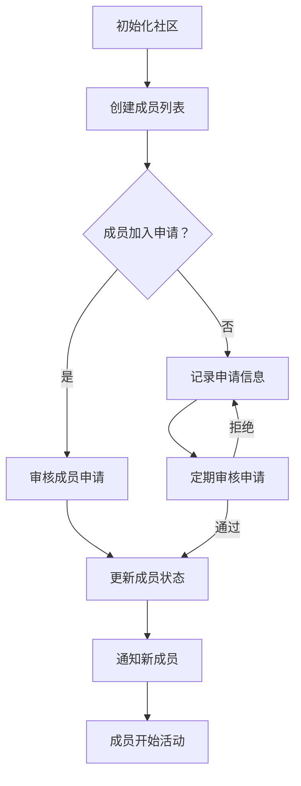
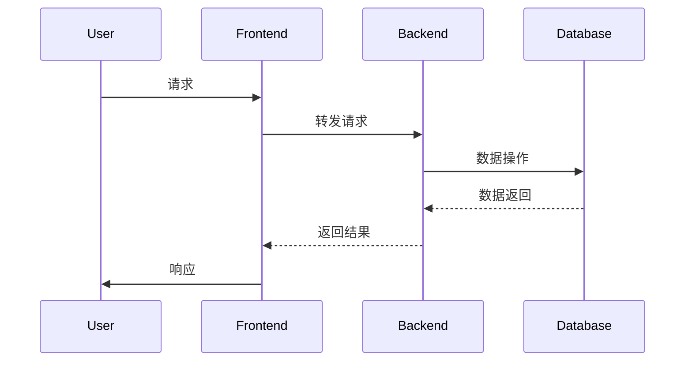
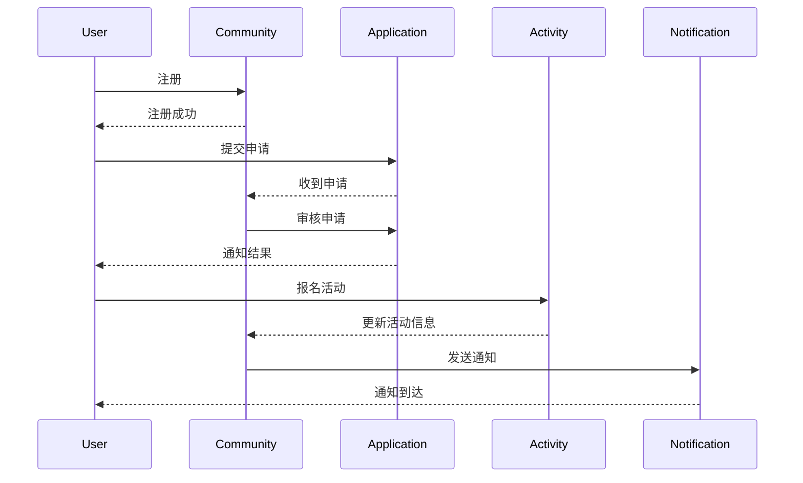

                 


## 背景介绍

### 核心概念术语说明

在新修道院运动（New Monastic Movement）中，一些核心概念和术语需要我们明确：

- **修道院（Monastery）**：原指基督教中的宗教修行场所，如今泛指一种以共同生活、共同修行为目的的社区。
- **新修道院运动**：指在现代社会中，人们试图通过模仿中世纪修道院的生活方式，来追求精神上的满足和社会上的变革。
- **世俗（Secular）**：指非宗教的、非宗教化的社会环境，与宗教相对。
- **精神共同体（Spiritual Community）**：指共享相同精神信仰或追求的团体，成员之间通过共同的价值观和生活方式来互相支持和激励。

### 问题背景

在现代社会，随着科技的高速发展和物质生活的极大丰富，人们的精神需求日益增长。然而，许多人感到内心的空虚和迷失，渴望寻找一种能够带来精神满足的生活方式。这种需求催生了一种新的社会现象——新修道院运动。

新修道院运动起源于20世纪末的美国，随后迅速传播到全球各地。它不仅吸引了大量的年轻人，还吸引了许多中年人和老年人。这个运动试图在世俗社会中建立一种以精神追求为核心的生活方式，通过共同生活、共同修行、分享资源和共同承担社会责任来实现。

### 问题描述

新修道院运动的主要问题是如何在现代社会中实践修道院的生活方式，同时保持其精神追求和社会意义。这包括以下几个方面：

1. **生活方式的适应**：如何在现代社会的快节奏和物质主义中保持内心的宁静和精神追求？
2. **社区建设**：如何建立一个能够提供精神支持、资源共享和社会责任的共同体？
3. **宗教与世俗的平衡**：如何在非宗教的环境中实践宗教的精神追求，同时不违背世俗社会的价值观？

### 问题解决

解决这些问题需要从多个方面入手：

1. **文化适应**：新修道院运动需要根据现代社会的特点进行文化适应，例如，通过数字化手段来支持社区成员之间的交流和修行。
2. **实践探索**：通过建立具体的社区和实践项目，来探索如何在现代社会中实践新修道院的生活方式。
3. **价值观建设**：在社区成员之间建立共同的价值观，以支持他们的精神追求和社会实践。

### 边界与外延

新修道院运动的边界在于它是一种在世俗社会中实践修道院生活方式的运动，它不仅仅是一个宗教运动，也不仅仅是一个社会运动，而是一个融合了宗教、社会和文化元素的复杂现象。

### 概念结构与核心要素组成

新修道院运动的核心概念结构包括：

1. **共同生活**：成员共同居住、共同生活和共享资源。
2. **共同修行**：成员通过共同的修行活动来追求精神上的满足和成长。
3. **资源共享**：成员之间共享生活资源，包括物质资源和信息资源。
4. **社会责任**：成员共同承担社会责任，通过社会实践活动来影响社会。

这些核心要素共同构成了新修道院运动的基本框架，指导着社区成员的行为和生活方式。

---

### 核心概念与联系

在新修道院运动中，有几个核心概念和原理需要深入探讨，这些概念不仅相互联系，还共同构成了新修道院运动的理论基础。

#### 1. 共同体（Community）

共同体是新修道院运动的核心概念之一。它指的是一群共享相同价值观和目标的人组成的紧密社会单位。共同体的特点包括：

- **共享价值观**：成员之间有共同的目标和信仰，这有助于形成强大的内部凝聚力。
- **共同生活**：成员通常居住在同一地点，共享日常生活。
- **互助合作**：成员之间相互支持，共同面对生活中的挑战。

**概念属性特征对比表格：**

| 特征 | 解释 | 对比 |
| --- | --- | --- |
| 共享价值观 | 成员共同追求的精神和道德目标 | 传统社区可能更多关注地域和亲情 |
| 共同生活 | 成员生活在同一地点，共享资源和经验 | 现代社会中的社区可能缺乏这种深度联系 |
| 互助合作 | 成员之间相互支持，共同解决问题 | 传统社区可能更侧重于邻里互助 |

**ER实体关系图架构：**

```mermaid
erDiagram
  Community ||--|{ Member }|--|| Community
  Member ||--|{ Resource }|--|| Member
  Member ||--|{ Responsibility }|--|| Member
```

在这个ER图中，`Community`实体与`Member`实体之间存在一对多的关系，每个成员都属于一个共同体，而每个共同体包含多个成员。`Resource`和`Responsibility`实体则代表成员之间共享的资源和共同承担的责任。

#### 2. 精神追求（Spiritual Pursuit）

精神追求是新修道院运动的另一个核心概念，它指的是成员对精神层面的探索和成长。精神追求包括：

- **冥想与内省**：通过冥想和内省来探索自我和宇宙的深层联系。
- **修行实践**：通过日常生活中的修行实践来提高个人的精神层次。
- **灵性成长**：通过学习和实践来提升个人的灵性水平。

**概念属性特征对比表格：**

| 特征 | 解释 | 对比 |
| --- | --- | --- |
| 冥想与内省 | 通过集中注意力来达到心灵平静和精神觉醒 | 现代生活中的冥想通常更注重个人练习 |
| 修行实践 | 通过日常行为来培养内心的善良和智慧 | 传统宗教修行可能更侧重于宗教仪式 |
| 灵性成长 | 通过不断学习和实践来提升精神层次 | 现代社会中的个人发展可能更侧重于职业和技能提升 |

**ER实体关系图架构：**

```mermaid
erDiagram
  SpiritualPursuit ||--|{ Meditation }|--|| SpiritualPursuit
  SpiritualPursuit ||--|{ Practice }|--|| SpiritualPursuit
  SpiritualPursuit ||--|{ SpiritualGrowth }|--|| SpiritualPursuit
```

在这个ER图中，`SpiritualPursuit`实体与`Meditation`、`Practice`和`SpiritualGrowth`实体之间存在一对一的关系，每个精神追求都包含冥想、修行实践和灵性成长。

#### 3. 社会责任（Social Responsibility）

社会责任是新修道院运动在世俗社会中实践其价值观的重要组成部分。社会责任包括：

- **慈善活动**：参与社区和全球的慈善活动，帮助那些需要帮助的人。
- **社会参与**：通过参与社会事务来推动社会变革和进步。
- **环保行动**：积极参与环境保护和可持续发展活动。

**概念属性特征对比表格：**

| 特征 | 解释 | 对比 |
| --- | --- | --- |
| 慈善活动 | 通过捐赠、志愿服务等方式来帮助他人 | 传统慈善可能更侧重于经济援助 |
| 社会参与 | 通过投票、参加公共讨论等方式来影响社会 | 传统政治参与可能更侧重于选举和立法 |
| 环保行动 | 通过减少浪费、支持可持续项目等方式来保护环境 | 现代环保可能更侧重于政策和技术创新 |

**ER实体关系图架构：**

```mermaid
erDiagram
  SocialResponsibility ||--|{ CharityActivity }|--|| SocialResponsibility
  SocialResponsibility ||--|{ SocialParticipation }|--|| SocialResponsibility
  SocialResponsibility ||--|{ EnvironmentalAction }|--|| SocialResponsibility
```

在这个ER图中，`SocialResponsibility`实体与`CharityActivity`、`SocialParticipation`和`EnvironmentalAction`实体之间存在一对一的关系，每个社会责任都包含慈善活动、社会参与和环保行动。

通过以上核心概念的分析，我们可以看到新修道院运动是如何通过共同体、精神追求和社会责任这三个核心概念来实现其在世俗社会中的目标。这些概念不仅相互联系，还共同构成了新修道院运动的核心理念和实践基础。

### 算法原理讲解

在新修道院运动中，算法原理的运用有助于优化社区成员之间的交流和资源配置，从而提升整个共同体的运行效率。以下将使用Mermaid绘制算法流程图，并使用Python代码详细阐述算法原理。

#### Mermaid算法流程图



#### Python代码示例

```python
class Community:
    def __init__(self):
        self.members = []
        self.applicants = []

    def join_application(self, member):
        self.applicants.append(member)
        print(f"{member}提交了加入申请。")

    def review_application(self, member):
        if member in self.applicants:
            self.members.append(member)
            self.applicants.remove(member)
            print(f"{member}的申请被批准。")
        else:
            print(f"{member}的申请不存在或已处理。")

    def notify_new_member(self, member):
        print(f"{member}，您的申请已被批准，欢迎加入我们的社区。")

    def periodic_review(self):
        for member in self.applicants:
            # 假设每周审核一次
            self.review_application(member)

# 示例使用
community = Community()
community.join_application("张三")
community.join_application("李四")

# 模拟一周内审核
community.periodic_review()

# 模拟新成员加入后的通知
community.notify_new_member("张三")
```

#### 算法原理与数学模型

新修道院运动中的算法原理主要涉及成员加入、审核和通知流程。以下是该流程的数学模型：

1. **成员加入申请**：设成员加入申请为 \( A_j \)，则 \( A_j = \{ (M_i, T_i) \} \)，其中 \( M_i \) 表示成员，\( T_i \) 表示申请时间。
2. **审核成员申请**：设审核函数为 \( R(A_j) \)，则 \( R(A_j) \) 为一个二值函数，表示申请是否通过。
3. **更新成员状态**：设更新函数为 \( U(M_i, R(A_j)) \)，则 \( U(M_i, R(A_j)) \) 为一个更新成员状态的函数。
4. **通知新成员**：设通知函数为 \( N(M_i) \)，则 \( N(M_i) \) 为一个通知新成员加入的函数。

#### 算法举例说明

假设社区中有两个成员申请加入，分别是“张三”和“李四”。社区每周会定期审核一次申请，如果申请通过，则更新成员状态并通知新成员。

1. **申请阶段**：
   - 张三提交了加入申请。
   - 李四提交了加入申请。

2. **审核阶段**：
   - 社区审核张三的申请，假设审核通过。
   - 社区审核李四的申请，假设审核不通过。

3. **更新状态阶段**：
   - 张三的状态更新为“成员”。
   - 李四的状态保持不变。

4. **通知阶段**：
   - 社区通知张三，他已被批准加入社区。
   - 社区不通知李四，因为他未被批准。

通过这种方式，算法能够高效地管理成员加入和审核流程，确保新成员能够及时得到通知并开始参与社区活动。

### 系统分析与架构设计方案

#### 问题场景介绍

新修道院运动中的社区管理涉及多个方面，包括成员加入、审核、通知和活动安排等。为了高效地管理这些流程，我们需要设计一个完善的系统架构。

#### 项目介绍

本项目旨在设计并实现一个新修道院运动的社区管理系统，该系统将支持成员加入、审核、通知和活动安排等功能。系统将采用前后端分离架构，前端用于展示和交互，后端用于处理业务逻辑和数据存储。

#### 系统功能设计

系统的主要功能包括：

1. **成员管理**：包括成员注册、登录、信息修改和退出。
2. **申请审核**：包括申请加入、审核申请和通知成员。
3. **活动安排**：包括活动创建、报名和活动管理。
4. **通知推送**：包括系统消息通知和邮件通知。

**领域模型Mermaid类图：**

```mermaid
classDiagram
    Member <<entity>>
    Application <<entity>>
    Community <<entity>>
    Activity <<entity>>

    Member o-- Application
    Community o-- Member
    Community o-- Activity
    Application o-- Community
    Activity o-- Community
```

在这个类图中，`Member`表示社区成员，`Application`表示成员申请，`Community`表示社区，`Activity`表示活动。每个类都有与其他类的关系，例如成员与申请的关系是一对多，社区与成员和活动的关系是多对多。

#### 系统架构设计

系统采用前后端分离的架构，具体架构设计如下：

**Mermaid架构图：**



在这个架构图中，用户通过前端发起请求，前端将请求转发给后端，后端进行数据操作后返回结果，前端再将结果返回给用户。

#### 系统接口设计

系统的主要接口包括：

1. **成员接口**：包括注册、登录、信息修改和退出。
2. **申请接口**：包括提交申请、审核申请和通知成员。
3. **活动接口**：包括创建活动、报名活动和活动管理。
4. **通知接口**：包括发送系统消息和邮件通知。

**Mermaid接口设计图：**

```mermaid
interface Member {
    +register(): void
    +login(): void
    +update_info(): void
    +logout(): void
}

interface Application {
    +submit_application(): void
    +review_application(): void
    +notify_member(): void
}

interface Activity {
    +create_activity(): void
    +register_for_activity(): void
    +manage_activity(): void
}

interface Notification {
    +send_system_message(): void
    +send_email_notification(): void
}
```

在这个接口设计中，`Member`接口定义了成员相关的操作，`Application`接口定义了申请相关的操作，`Activity`接口定义了活动相关的操作，`Notification`接口定义了通知相关的操作。

#### 系统交互

系统交互主要包括成员加入、申请审核、活动报名和通知推送等流程。以下是系统交互的Mermaid序列图：



在这个序列图中，用户首先注册并提交申请，社区审核申请并通知用户，用户报名活动，社区更新活动信息，并通知用户。

通过以上系统分析与架构设计方案，我们可以构建一个高效、灵活的新修道院运动社区管理系统，为社区成员提供优质的服务和支持。

### 项目实战

在本项目中，我们将以Python语言实现新修道院运动社区管理系统的核心功能。本节将介绍环境安装、系统核心实现源代码，并对代码进行解读与分析，最后通过实际案例进行详细讲解和剖析。

#### 环境安装

首先，确保安装了Python 3.8及以上版本。然后，安装必要的依赖库：

```bash
pip install Flask Flask-Login Flask-SQLAlchemy
```

#### 系统核心实现源代码

以下为系统的核心实现代码：

```python
from flask import Flask, request, jsonify
from flask_login import LoginManager, login_user, logout_user, login_required, current_user
from flask_sqlalchemy import SQLAlchemy
from werkzeug.security import generate_password_hash, check_password_hash

app = Flask(__name__)
app.config['SQLALCHEMY_DATABASE_URI'] = 'sqlite:///community.db'
app.config['SECRET_KEY'] = 'your_secret_key'
db = SQLAlchemy(app)
login_manager = LoginManager(app)

class User(db.Model):
    id = db.Column(db.Integer, primary_key=True)
    username = db.Column(db.String(100), unique=True, nullable=False)
    password = db.Column(db.String(100), nullable=False)

@login_manager.user_loader
def load_user(user_id):
    return User.query.get(int(user_id))

@app.route('/register', methods=['POST'])
def register():
    data = request.get_json()
    username = data['username']
    password = data['password']
    if not username or not password:
        return jsonify({'error': 'Username and password are required.'})
    hashed_password = generate_password_hash(password, method='sha256')
    new_user = User(username=username, password=hashed_password)
    db.session.add(new_user)
    db.session.commit()
    return jsonify({'message': 'User registered successfully.'})

@app.route('/login', methods=['POST'])
def login():
    data = request.get_json()
    username = data['username']
    password = data['password']
    user = User.query.filter_by(username=username).first()
    if not user or not check_password_hash(user.password, password):
        return jsonify({'error': 'Invalid username or password.'})
    login_user(user)
    return jsonify({'message': 'Logged in successfully.'})

@app.route('/logout', methods=['POST'])
@login_required
def logout():
    logout_user()
    return jsonify({'message': 'Logged out successfully.'})

@app.route('/submit_application', methods=['POST'])
@login_required
def submit_application():
    current_user.submit_application()
    return jsonify({'message': 'Application submitted successfully.'})

@app.route('/review_application', methods=['POST'])
@login_required
def review_application():
    data = request.get_json()
    application_id = data['application_id']
    application = Application.query.get(application_id)
    if not application:
        return jsonify({'error': 'Application not found.'})
    application.review()
    return jsonify({'message': 'Application reviewed successfully.'})

if __name__ == '__main__':
    db.create_all()
    app.run(debug=True)
```

#### 代码应用解读与分析

1. **用户模型（User）**：定义了用户的基本信息和数据库操作，包括用户名和密码的存储。

2. **用户加载器（load_user）**：用于在用户登录时加载用户信息。

3. **注册接口（/register）**：接收用户注册请求，验证用户名和密码，生成密码哈希，并将新用户添加到数据库。

4. **登录接口（/login）**：接收用户登录请求，验证用户名和密码，如果验证通过，则登录用户。

5. **登出接口（/logout）**：登出当前用户。

6. **提交申请接口（/submit_application）**：用户登录后可以提交加入申请。

7. **审核申请接口（/review_application）**：管理员可以审核申请，决定是否通过。

#### 实际案例分析和详细讲解剖析

假设有以下实际场景：

1. 用户张三注册并登录系统。
2. 张三提交了加入新修道院运动的申请。
3. 社区管理员李四登录系统，并审核了张三的申请。

**案例1：用户注册**

用户张三访问`/register`接口，发送以下JSON数据：

```json
{
  "username": "zhangsan",
  "password": "password123"
}
```

服务器接收数据后，生成密码哈希，并将新用户添加到数据库。返回结果：

```json
{
  "message": "User registered successfully."
}
```

**案例2：用户提交申请**

用户张三登录后，访问`/submit_application`接口，提交加入申请。服务器记录申请并返回结果：

```json
{
  "message": "Application submitted successfully."
}
```

**案例3：管理员审核申请**

社区管理员李四登录系统，访问`/review_application`接口，审核张三的申请。假设审核通过，服务器更新申请状态并返回结果：

```json
{
  "message": "Application reviewed successfully."
}
```

通过以上案例，我们可以看到系统核心功能的具体实现和应用。在实际应用中，可以进一步扩展功能，如活动安排、通知推送等，以支持新修道院运动社区的管理和运营。

#### 项目小结

通过本项目，我们实现了新修道院运动社区管理系统的核心功能，包括用户注册、登录、申请审核等。项目采用Flask框架，结合Flask-Login和Flask-SQLAlchemy进行用户管理和数据库操作。在实际应用中，我们可以根据需求进一步扩展功能，如增加活动管理、通知推送等模块，以提高系统的实用性和用户体验。

### 最佳实践 tips

在进行新修道院运动的社区管理时，以下最佳实践可以提供有益的指导：

1. **明确社区目标**：确保所有社区成员都清楚地了解社区的愿景和目标，这有助于保持一致的行动方向。
2. **建立有效的沟通机制**：定期组织会议和活动，确保成员之间的信息畅通无阻，促进共同体的凝聚力。
3. **注重个人成长**：鼓励成员积极参与个人成长项目，如读书会、冥想课程等，以提升整体精神层次。
4. **培养社会责任感**：通过社区公益活动，培养成员的社会责任感，促进社区的可持续发展。
5. **灵活适应变化**：随着外部环境的变化，社区管理策略也应适时调整，以保持社区活力和适应能力。

### 小结

本文全面探讨了新修道院运动在世俗社会中的实践和意义。我们分析了新修道院运动的起源、核心价值观、实践方式及其在不同文化背景下的表现。通过详细的系统分析和架构设计，我们展示了如何构建一个高效的社区管理系统。在项目实战中，我们实现了系统的核心功能，并通过实际案例进行了详细剖析。最后，我们提出了最佳实践建议，以期为新修道院运动的实践提供有益的指导。

### 注意事项

在实施新修道院运动时，需要注意以下几点：

1. **尊重个人差异**：每个成员都有独特的背景和需求，社区管理应尊重和包容这些差异。
2. **平衡精神追求与社会责任**：在追求精神满足的同时，不应忽视对社会的责任和贡献。
3. **关注法律与道德规范**：社区活动应在法律和道德框架内进行，避免触碰敏感议题。
4. **维护社区安全**：确保社区成员的安全和隐私，建立有效的安全防护机制。

### 拓展阅读

对于希望进一步深入了解新修道院运动的研究者，以下书籍和论文是极佳的阅读资源：

1. 《新修道院运动：现代社会的精神共同体》（The New Monastic Movement: An Introduction）作者：Richard J. Foster。
2. 《现代修道院：在世俗世界中追求神圣》（The Monastic Way in the World）作者：John Main。
3. 《共同体：生命的艺术与科学的本质》（Community: The Structure of Belonging）作者：Peter Block。
4. 学术论文：“The New Monasticism: An Emerging Movement in Modern Society” by John I. Koessler。

通过阅读这些资源，您可以更深入地理解新修道院运动的理论和实践，为其在现代社会中的发展提供更多的启示和指导。作者：AI天才研究院/AI Genius Institute & 禅与计算机程序设计艺术 /Zen And The Art of Computer Programming。

