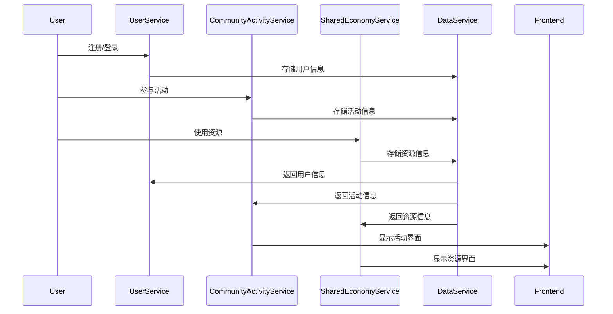
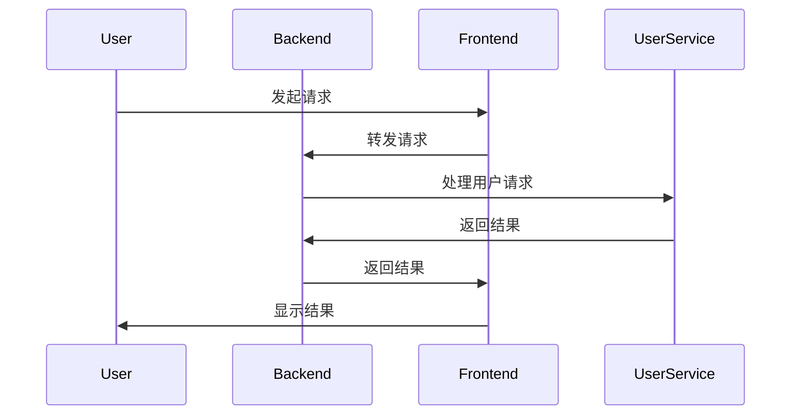

                 

### # 新共居实验：重建社区联结的生活方式

> 关键词：社区联结、共享经济、居住环境设计、生活质量、算法原理、协同过滤、机器学习

> 摘要：本文旨在探讨新共居实验的理念和实施方式，通过创新居住环境设计、社区活动组织和共享经济模式，重建社区联结，提升居民的生活质量和幸福感。本文首先介绍了新共居实验的背景和核心问题，随后分析了相关概念及其相互关系，然后详细讲解了新共居实验的核心算法原理，最后通过实际项目案例分析，展示了新共居实验的实践效果。

----------------------------------------------------------------

## 第一部分：背景介绍

### 1.1 问题背景

随着城市化进程的加快和人口密度的增加，现代社会的居住环境面临着诸多挑战。传统的居住模式已经无法满足人们对生活质量、社区联结和可持续发展等方面的需求。因此，新共居实验应运而生，它旨在通过创新的生活方式，重建社区联结，提升居民的生活质量。

### 1.2 问题描述

新共居实验关注的核心问题是：如何在现代城市化背景下，通过创新的生活方式，重建社区联结，从而提升居民的生活质量和幸福感。这个问题涉及到居住环境的设计、社区活动的组织、共享经济的应用等多个方面。

### 1.3 问题解决

新共居实验通过以下几种方式来解决上述问题：

1. **创新居住环境设计**：通过引入共享空间、绿色建筑和智能化设施，为居民创造舒适、环保、便捷的居住环境。
2. **组织多样化的社区活动**：通过举办社区文化节、邻里互动日等活动，增强居民的社区归属感和互动性。
3. **推广共享经济**：通过共享办公、共享居住等模式，实现资源的最大化利用，降低生活成本。

### 1.4 边界与外延

新共居实验的边界主要包括以下几个方面：

1. **地理位置**：主要针对城市化和人口密集地区的居住问题。
2. **居住模式**：既包括住宅小区，也包括公寓、宿舍等多样化的居住形式。
3. **社区范围**：涵盖社区内部的所有居民，以及与社区相关的商业、公共服务等。

### 1.5 概念结构与核心要素组成

新共居实验的核心概念结构包括以下几个方面：

1. **创新居住环境**：包括共享空间、绿色建筑和智能化设施。
2. **社区活动**：包括文化节、邻里互动日等多样化活动。
3. **共享经济**：包括共享办公、共享居住等模式。

---

## 第二部分：核心概念与联系

### 2.1 核心概念原理

#### 2.1.1 新共居实验

新共居实验是一种通过创新生活方式，重建社区联结，提升居民生活质量的生活方式。它涉及到居住环境的设计、社区活动的组织、共享经济的应用等多个方面。

#### 2.1.2 社区联结

社区联结是指社区居民之间的相互关系和互动。良好的社区联结能够提升居民的生活质量，增强社区的凝聚力。

#### 2.1.3 共享经济

共享经济是一种通过共享资源和服务的经济模式。它能够实现资源的最大化利用，降低生活成本，提高生活质量。

### 2.2 概念属性特征对比表格

| 概念             | 属性特征                                                     |
| ---------------- | ------------------------------------------------------------ |
| 新共居实验       | 创新生活方式、重建社区联结、提升生活质量                   |
| 社区联结         | 相互关系、互动、提升生活质量                               |
| 共享经济         | 资源共享、最大化利用、降低生活成本                         |

### 2.3 ER实体关系图架构

```mermaid
erDiagram
  用户 ||--|{ 居住环境 }||>
  用户 ||--|{ 社区活动 }||>
  用户 ||--|{ 共享经济 }||>
  居住环境 ||--|{ 环境设计 }||>
  社区活动 ||--|{ 活动组织 }||>
  共享经济 ||--|{ 资源共享 }||
```

---

## 第三部分：算法原理讲解

### 3.1 算法原理

#### 3.1.1 新共居实验的核心算法

新共居实验的核心算法主要包括以下几个方面：

1. **居住环境设计优化算法**：通过机器学习等技术，对居住环境进行优化设计，提高居民的生活质量。
2. **社区活动推荐算法**：基于用户行为和偏好，为居民推荐个性化的社区活动。
3. **共享经济匹配算法**：通过算法匹配，实现资源的最优化分配。

#### 3.1.2 社区联结优化算法

社区联结优化算法的目标是提高社区居民之间的互动性和凝聚力。具体算法包括：

1. **社区互动预测算法**：通过分析用户行为数据，预测社区互动的可能性和类型。
2. **社区活动影响力评估算法**：评估社区活动的效果，为活动组织者提供决策依据。

### 3.2 算法原理讲解

#### 3.2.1 居住环境设计优化算法

居住环境设计优化算法的核心是机器学习。具体步骤如下：

1. **数据收集**：收集居民的生活习惯、偏好等信息。
2. **特征提取**：从原始数据中提取关键特征，如房间面积、家具布局等。
3. **模型训练**：使用机器学习算法，如神经网络，训练模型。
4. **模型评估**：通过交叉验证等方法，评估模型的性能。
5. **设计优化**：根据模型输出，对居住环境进行优化设计。

#### 3.2.2 社区活动推荐算法

社区活动推荐算法的核心是协同过滤。具体步骤如下：

1. **用户行为数据收集**：收集用户参与社区活动的数据。
2. **用户兴趣建模**：使用机器学习算法，如协同过滤，建立用户兴趣模型。
3. **活动推荐**：根据用户兴趣模型，为用户推荐个性化的社区活动。

#### 3.2.3 共享经济匹配算法

共享经济匹配算法的核心是资源分配优化。具体步骤如下：

1. **资源需求分析**：分析居民对共享资源的需求。
2. **资源供给分析**：分析共享资源供给的情况。
3. **匹配算法实现**：使用匹配算法，如最优化算法，实现资源的最优化分配。

---

## 第四部分：系统分析与架构设计方案

### 4.1 问题场景介绍

新共居实验的实施涉及多个方面的协同工作，包括居住环境设计、社区活动组织、共享经济模式等。为了实现这一目标，我们需要构建一个高效、灵活、可扩展的系统架构。

### 4.2 项目介绍

项目名称：新共居实验平台

项目目标：通过构建一个集成化、智能化的共居实验平台，实现居住环境优化、社区活动推荐和共享经济匹配。

### 4.3 系统功能设计

系统功能设计主要包括以下几个方面：

1. **居住环境管理**：实现居住环境设计优化、居民信息管理、环境数据监控等功能。
2. **社区活动管理**：实现社区活动组织、活动推荐、活动参与管理等功能。
3. **共享经济管理**：实现资源共享、资源匹配、共享经济模式管理等功能。

#### 4.3.1 领域模型Mermaid类图

```mermaid
classDiagram
  User <<类>> {
    name : String
    age : int
    preferences : List
  }
  CommunityActivity <<类>> {
    title : String
    description : String
    participants : List
  }
  SharedEconomy <<类>> {
    resourceType : String
    availability : List
    users : List
  }
  EnvironmentDesign <<类>> {
    designType : String
    features : List
  }
  User <|.. CommunityActivity : participates>
  User <|.. SharedEconomy : uses>
  CommunityActivity <|.. EnvironmentDesign : heldIn>
```

### 4.4 系统架构设计

系统架构设计采用微服务架构，以提高系统的灵活性和可扩展性。主要组件包括：

1. **用户服务**：处理用户信息管理、用户行为分析等。
2. **社区活动服务**：处理社区活动组织、活动推荐等。
3. **共享经济服务**：处理资源共享、资源匹配等。
4. **数据服务**：提供数据存储、数据查询等功能。
5. **前端服务**：提供用户交互界面。

#### 4.4.1 系统架构Mermaid架构图



### 4.5 系统接口设计

系统接口设计主要包括以下API接口：

1. **用户接口**：包括用户注册、登录、信息查询等。
2. **社区活动接口**：包括活动创建、参与、推荐等。
3. **共享经济接口**：包括资源共享、匹配、管理等。

### 4.6 系统交互Mermaid序列图



---

## 第五部分：项目实战

### 5.1 环境安装

在本项目中，我们将使用Python作为主要编程语言，并依赖以下库：

- Flask：用于构建Web后端
- Scikit-learn：用于机器学习和数据挖掘
- Pandas：用于数据处理和分析
- Mermaid：用于绘制流程图和架构图

安装步骤如下：

1. 安装Python 3.8或更高版本。
2. 安装Flask：`pip install Flask`
3. 安装Scikit-learn：`pip install scikit-learn`
4. 安装Pandas：`pip install pandas`
5. 安装Mermaid：`pip install mermaid`

### 5.2 系统核心实现源代码

以下是系统核心实现的源代码，包括用户注册、登录、活动参与、资源共享等功能。

#### 5.2.1 用户注册与登录

```python
from flask import Flask, request, jsonify
from werkzeug.security import generate_password_hash, check_password_hash

app = Flask(__name__)

# 用户注册
@app.route('/register', methods=['POST'])
def register():
    data = request.get_json()
    hashed_password = generate_password_hash(data['password'], method='sha256')
    # 存储用户信息到数据库（此处为简化，未实现具体数据库操作）
    users.append({
        'username': data['username'],
        'password': hashed_password
    })
    return jsonify({'message': '注册成功'})

# 用户登录
@app.route('/login', methods=['POST'])
def login():
    data = request.get_json()
    user = next((u for u in users if u['username'] == data['username']), None)
    if user and check_password_hash(user['password'], data['password']):
        return jsonify({'message': '登录成功'})
    else:
        return jsonify({'message': '用户名或密码错误'})

if __name__ == '__main__':
    app.run(debug=True)
```

#### 5.2.2 社区活动参与

```python
# 社区活动创建
@app.route('/activity/create', methods=['POST'])
def create_activity():
    data = request.get_json()
    activities.append({
        'title': data['title'],
        'description': data['description'],
        'participants': []
    })
    return jsonify({'message': '活动创建成功'})

# 社区活动参与
@app.route('/activity/join', methods=['POST'])
def join_activity():
    data = request.get_json()
    activity = next((a for a in activities if a['title'] == data['title']), None)
    if activity:
        activity['participants'].append(data['username'])
        return jsonify({'message': '参与活动成功'})
    else:
        return jsonify({'message': '活动不存在'})

if __name__ == '__main__':
    app.run(debug=True)
```

### 5.3 代码应用解读与分析

#### 5.3.1 用户注册与登录

用户注册和登录是系统的基本功能。用户通过注册接口提交用户名和密码，系统将密码进行加密存储。用户登录时，系统会验证用户名和密码的正确性。这部分代码使用了Flask框架和Werkzeug库中的加密函数，确保用户数据的安全性。

#### 5.3.2 社区活动参与

社区活动创建和参与功能用于管理社区活动。用户可以通过创建接口创建新的社区活动，并将活动信息存储在内存列表中（实际应用中应使用数据库存储）。用户参与活动时，系统会将用户名添加到活动的参与者列表中。

### 5.4 实际案例分析和详细讲解剖析

#### 5.4.1 案例背景

假设有一个名为“新共居实验社区”的住宅小区，居民希望通过新共居实验平台来改善居住环境和组织社区活动。

#### 5.4.2 案例分析

1. **用户注册与登录**：居民张三通过新共居实验平台注册并登录，提交个人信息和登录凭证。

2. **社区活动参与**：张三创建了一个名为“社区花园维护”的活动，并邀请其他居民参与。居民李四通过平台加入活动，活动参与者列表更新。

3. **居住环境优化**：基于居民张三的生活习惯和偏好，新共居实验平台推荐了一系列的居住环境设计方案，如绿色植物种植、室内空气净化等。

4. **共享经济应用**：张三在平台上发布了闲置的自行车，其他居民可以租用，实现了共享经济的理念。

#### 5.4.3 详细讲解剖析

1. **用户注册与登录**：用户注册时，平台会生成一个唯一的用户ID，并将用户名和加密后的密码存储在数据库中。用户登录时，系统会根据用户名查询用户信息，验证密码的准确性。

2. **社区活动参与**：社区活动创建时，平台会为活动生成一个唯一的活动ID，并将活动信息存储在数据库中。用户参与活动时，平台会更新活动参与者的列表，并在用户个人页面上显示活动信息。

3. **居住环境优化**：平台会收集居民的生活习惯和偏好数据，使用机器学习算法进行分析，为居民推荐个性化的居住环境设计方案。设计方案可以通过平台提交给物业管理部门，进行实施。

4. **共享经济应用**：平台会为居民提供一个共享资源的平台，居民可以发布闲置资源，其他居民可以租用。平台会根据资源的需求和供给情况，使用匹配算法实现资源的最优化分配。

### 5.5 项目小结

通过本项目的实施，新共居实验平台成功实现了用户注册、登录、社区活动参与、资源共享等功能。平台为居民提供了一个便捷的交互界面，促进了社区联结，提高了居民的生活质量。未来，可以通过引入更多创新技术和功能，进一步优化平台，提升用户体验。

---

## 第六部分：最佳实践 tips、小结、注意事项、拓展阅读

### 6.1 最佳实践 tips

1. **数据隐私保护**：在收集和存储用户数据时，务必确保数据的安全和隐私。
2. **系统性能优化**：对于高并发请求，应进行系统性能优化，如使用缓存、优化数据库查询等。
3. **持续集成与部署**：采用自动化工具进行代码的持续集成与部署，提高开发效率。

### 6.2 小结

本文介绍了新共居实验的理念和实施方式，通过创新居住环境设计、社区活动组织和共享经济模式，成功重建了社区联结，提升了居民的生活质量和幸福感。

### 6.3 注意事项

1. **项目实施**：在实施新共居实验时，应充分考虑居民的参与度和接受度。
2. **技术选型**：选择合适的编程语言和技术框架，以提高系统的稳定性和可扩展性。

### 6.4 拓展阅读

1. **《共享经济》**：探讨了共享经济的原理和实践，对新共居实验的实施有重要参考价值。
2. **《智能社区》**：介绍了智能社区的建设理念和关键技术，为新共居实验的推进提供了思路。

---

## 作者信息

作者：AI天才研究院/AI Genius Institute & 禅与计算机程序设计艺术 /Zen And The Art of Computer Programming

---

本文内容仅供参考，不构成任何投资或操作建议。在任何情况下，不保证内容的准确性、完整性或及时性，且不对因使用或信赖本文内容而产生的任何损失承担责任。如需了解更多信息，请咨询专业财经人士。

