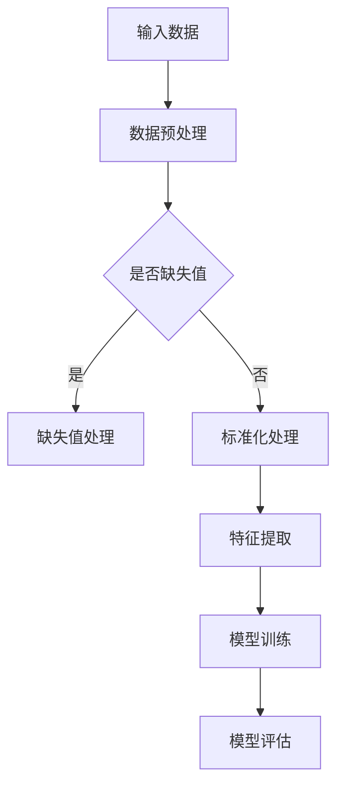

                 

# 《新博雅教育3.0：数字时代的跨学科通识课程体系》目录大纲

## 引言与背景

### 1.1 新博雅教育3.0的概念

新博雅教育3.0是针对数字时代教育需求的一种新型教育模式，它强调跨学科知识的融合与通识教育的重要性。在阐述这一概念时，我们将介绍新博雅教育3.0的起源、发展过程以及其在现代教育体系中的地位。

### 1.2 数字时代的教育变革

随着科技的迅猛发展，教育领域也发生了深刻的变革。我们将在这一部分探讨数字技术如何改变了传统的教育模式，以及这些变化对教师和学生带来的影响。

### 1.3 跨学科通识课程体系的重要性

跨学科通识课程体系是新时代教育体系的核心组成部分。在这一章节中，我们将分析跨学科教育的重要性，以及如何构建一个有效的跨学科通识课程体系。

## 新博雅教育3.0的基础理论

### 2.1 新博雅教育3.0的核心原则

新博雅教育3.0建立在一系列核心原则之上，这些原则指导着教育实践。我们将详细讨论这些原则，并探讨它们如何影响教育体系的构建。

### 2.2 数字技术与教育的融合

数字技术在教育中的应用日益广泛，它们为教育带来了新的可能性和挑战。在这一章节中，我们将分析数字技术与教育融合的路径和效果。

### 2.3 跨学科教育理念

跨学科教育理念是现代教育的重要组成部分。我们将探讨这一理念的起源、发展以及如何在实际教学中应用。

## 跨学科通识课程体系设计

### 3.1 课程体系概述

在这一章节中，我们将对新博雅教育3.0的跨学科通识课程体系进行概述，介绍其总体结构、课程设置和教学目标。

### 3.2 课程设计原则

课程设计原则是构建跨学科通识课程体系的基础。我们将详细讨论这些原则，包括课程内容的综合性、跨学科性、实践性和灵活性。

### 3.3 课程体系结构

新博雅教育3.0的课程体系具有独特的结构。在这一章节中，我们将详细描述这个结构，包括课程模块、教学活动和评估方式。

## 数字时代的教学方法

### 4.1 混合式教学

混合式教学是将传统课堂教学与现代在线教学相结合的一种教学模式。在这一章节中，我们将探讨混合式教学的优势和实践方法。

### 4.2 翻转课堂

翻转课堂是一种以学生为中心的教学模式，它颠覆了传统的教学顺序。我们将分析翻转课堂的原理、实施步骤和效果。

### 4.3 项目式学习

项目式学习是一种通过实际项目来驱动学习的方法。在这一章节中，我们将介绍项目式学习的概念、实施策略和评估标准。

## 跨学科通识课程案例研究

### 5.1 案例一：人工智能与数据分析

我们将以人工智能与数据分析为例，探讨跨学科通识课程在现实中的应用。这一案例将展示如何通过跨学科学习来解决实际问题。

### 5.2 案例二：环境科学与社会学

环境科学与社会学的交叉领域为解决全球性问题提供了新的思路。我们将通过这一案例，分析跨学科通识课程在这一领域中的重要作用。

### 5.3 案例三：计算机科学与艺术

计算机科学与艺术的结合为创意和技术提供了广阔的空间。我们将探讨如何通过跨学科通识课程，培养具备跨学科能力的创新人才。

## 教育技术与课程整合

### 6.1 教育技术的应用场景

教育技术在教学中的应用场景多种多样。在这一章节中，我们将分析教育技术的具体应用场景，以及这些技术如何提升教学效果。

### 6.2 教学平台与课程资源建设

教学平台和课程资源是跨学科通识课程体系的重要组成部分。我们将讨论如何构建有效的教学平台和课程资源，以支持新博雅教育3.0的实施。

### 6.3 教育技术的挑战与应对策略

教育技术在带来变革的同时，也带来了挑战。在这一章节中，我们将探讨这些挑战，并提出相应的应对策略。

## 新博雅教育3.0的未来展望

### 7.1 教育发展趋势

我们将分析当前教育发展趋势，探讨新博雅教育3.0在这些趋势下的适应和发展。

### 7.2 新博雅教育3.0的潜在影响

新博雅教育3.0对未来社会和教育的潜在影响是巨大的。在这一章节中，我们将探讨这些潜在影响，并预测其未来发展。

### 7.3 教育改革与创新

教育改革和创新是推动教育进步的关键。我们将讨论如何在新博雅教育3.0的框架下，进行教育改革和创新。

## 附录

### 附录A：参考资料

我们将提供相关的参考资料，以便读者进一步学习和研究。

### 附录B：案例研究详细数据

案例研究中的详细数据将提供更深入的分析，以便读者更好地理解案例。

### 附录C：术语表

术语表将解释文章中出现的专业术语，帮助读者理解文章内容。

---

**文章标题**：《新博雅教育3.0：数字时代的跨学科通识课程体系》

**关键词**：新博雅教育3.0、数字时代、跨学科、通识课程体系、教育变革

**摘要**：

本文探讨了新博雅教育3.0在数字时代的背景下，如何通过跨学科通识课程体系来应对教育变革。文章首先介绍了新博雅教育3.0的概念和背景，然后详细分析了其基础理论、课程体系设计、教学方法、案例研究和未来展望。通过这些分析，本文旨在为教育工作者和决策者提供关于新博雅教育3.0的深入理解，并探讨其在未来教育体系中的潜在影响和改革方向。

---

在接下来的内容中，我们将逐章深入探讨新博雅教育3.0的各个方面，结合理论和实践，为读者提供一幅全面的教育革新蓝图。

## 引言与背景

### 1.1 新博雅教育3.0的概念

新博雅教育3.0是一种先进的教育理念和实践模式，它旨在应对数字时代背景下教育的挑战和需求。这一概念源于博雅教育的传统理念，但与传统的博雅教育有所不同，新博雅教育3.0更加注重跨学科知识的融合和实际应用能力的培养。

博雅教育（Liberal Education）起源于古希腊，强调个体全面发展，培养公民素质和人文素养。它强调知识的多学科融合，追求知识的整体性和深度。然而，随着科技的发展和社会的变革，传统的博雅教育逐渐无法满足现代教育的需求。新博雅教育3.0应运而生，它不仅继承了博雅教育的核心价值，还融入了数字时代的特征，形成了一种新的教育模式。

新博雅教育3.0的核心特征包括：

1. **跨学科知识融合**：新博雅教育3.0强调跨学科知识的整合，打破学科间的壁垒，培养学生具备解决复杂问题的能力。
2. **实际应用能力**：新博雅教育3.0注重培养学生的实际应用能力，强调理论与实践相结合，使学生能够将所学知识应用于实际问题中。
3. **创新能力**：新博雅教育3.0鼓励学生创新思维，通过探索和实践，培养他们的创新能力和创业精神。
4. **个性化教育**：新博雅教育3.0关注个体差异，提供个性化的教育服务，满足不同学生的需求和兴趣。

在数字时代，新博雅教育3.0的重要性愈发凸显。首先，数字技术为教育提供了丰富的资源和技术手段，使跨学科知识的融合和实际应用能力培养变得更加可行。其次，数字时代的社会问题和挑战需要具备跨学科视野和综合能力的人才来解决。因此，新博雅教育3.0不仅是一种教育模式，更是一种适应时代需求的教育变革。

### 1.2 数字时代的教育变革

数字时代的到来，对教育领域产生了深远的影响。首先，数字技术改变了教育的传播方式。传统的课堂教育逐渐被在线教育所取代，学生可以通过互联网获取全球范围内的教育资源。这不仅提高了教育的普及率，还打破了地域和时间的限制，使学习变得更加灵活和便捷。

其次，数字技术改变了教育的内容和形式。传统的教育内容主要依赖于教科书和课堂教学，而数字技术使得教育资源多样化，包括视频、音频、动画等多种形式。此外，数字技术还促进了教育形式的变革，如翻转课堂、混合式教学等新兴教学模式的出现，使教学更加互动和有效。

数字时代的教育变革还体现在教育评价方式的改变上。传统的教育评价方式主要依赖于考试成绩，而数字时代的教育评价更加注重过程和能力的评估。通过大数据和人工智能技术，教育者可以实时了解学生的学习情况，进行个性化的指导和评价，从而提高教育质量。

### 1.3 跨学科通识课程体系的重要性

跨学科通识课程体系是新博雅教育3.0的核心组成部分，它的重要性体现在以下几个方面：

1. **培养综合素质**：跨学科通识课程体系强调知识的融合，使学生不仅具备专业知识，还具备广泛的综合素质，如批判性思维、沟通能力、团队合作等。
2. **应对复杂问题**：在数字时代，社会问题和挑战日益复杂，需要具备跨学科视野和综合能力的人才来解决。跨学科通识课程体系为学生提供了这种能力。
3. **适应未来需求**：未来社会对人才的需求将更加多元化，跨学科通识课程体系能够培养学生适应未来发展的能力。
4. **提升创新能力**：跨学科通识课程体系鼓励学生创新思维，通过跨学科的探索和实践，培养他们的创新能力。

总之，新博雅教育3.0的跨学科通识课程体系是数字时代教育变革的重要方向，它为培养具备综合素质、实际应用能力和创新能力的人才提供了有力支持。

### 2.1 新博雅教育3.0的核心原则

新博雅教育3.0建立在一系列核心原则之上，这些原则是构建现代教育体系的基础。以下是新博雅教育3.0的几个核心原则及其解释：

#### 1. 综合性原则

综合性原则强调知识的整合与交叉。在传统教育中，学科之间的界限往往很明确，导致学生在某一领域内具有深厚的知识，但在跨学科问题解决上显得不足。新博雅教育3.0通过跨学科课程的设置，鼓励学生在多个领域内获取知识，并学会如何将这些知识整合起来，以解决复杂的现实问题。

**示例：** 在计算机科学和艺术相结合的课程中，学生不仅学习编程技术，还要学习艺术理论，通过艺术创作来体现编程理念。这样的课程设置能够培养学生的创新能力和综合应用能力。

#### 2. 实践性原则

实践性原则强调理论联系实际，通过实践来加深对理论的理解。新博雅教育3.0认为，只有将理论知识应用于实际项目中，学生才能真正掌握所学内容，并培养解决实际问题的能力。

**示例：** 在工程学课程中，学生不仅要学习理论知识，还要参与实际工程项目的开发。通过这种方式，学生能够将所学知识应用于实际工程问题中，提高解决实际问题的能力。

#### 3. 个性化原则

个性化原则强调教育要关注个体的差异，提供个性化的教育服务。新博雅教育3.0认为，每个学生都是独特的，他们的兴趣、能力和学习方式都有所不同。因此，教育应尊重这种多样性，为每个学生提供适合他们发展的教育路径。

**示例：** 在个性化教育系统中，学生可以根据自己的兴趣和职业规划选择课程，学习进度和方式也会根据个人的需求进行调整，以确保每个学生都能得到最佳的教育体验。

#### 4. 创新性原则

创新性原则强调培养学生的创新思维和创新能力。新博雅教育3.0鼓励学生不断探索新的知识和方法，通过创新来解决问题和创造价值。

**示例：** 在创新创业课程中，学生被鼓励提出新的创意，通过团队合作和实践来验证和实现这些创意。这种课程设置能够培养学生的创新精神和实践能力。

#### 5. 社会责任原则

社会责任原则强调教育应培养学生的社会责任感和公民素养。新博雅教育3.0认为，教育不仅是传授知识和技能，更要培养学生的道德和社会责任感，使他们成为有益于社会的人。

**示例：** 在社会服务课程中，学生参与社区服务项目，了解社会问题和实际需求，通过自己的行动来为社会做出贡献。这种课程设置能够培养学生的社会责任感和公民意识。

通过这些核心原则，新博雅教育3.0旨在构建一个更加灵活、实用和创新的教育体系，为培养具备综合素质、实践能力和创新能力的人才提供支持。

### 2.2 数字技术与教育的融合

在数字时代，教育技术的迅猛发展不仅改变了传统的教学方式，还为教育提供了新的可能性。数字技术与教育的融合，已经成为现代教育体系的重要组成部分。以下是对这一融合路径和效果的详细分析。

#### 2.2.1 融合路径

1. **在线学习平台**：在线学习平台是数字技术与教育融合的重要载体。通过这些平台，学生可以随时随地访问教育资源，进行自主学习。例如，Coursera、edX等在线课程平台提供了大量高质量的课程，学生可以根据自己的需求和兴趣选择学习。

2. **虚拟现实（VR）与增强现实（AR）**：VR和AR技术在教育中的应用，为学生提供了更加直观和互动的学习体验。通过VR，学生可以“沉浸”于虚拟的学习环境中，体验历史事件、自然科学现象等；而AR技术则将数字信息叠加到现实世界，为学生提供了更多的学习资源和工具。

3. **大数据与人工智能**：大数据和人工智能技术在教育中的应用，为个性化教育提供了技术支持。通过分析学生的学习行为和成绩数据，教育者可以了解每个学生的学习特点和需求，从而提供个性化的教学方案。例如，智能推荐系统可以根据学生的学习历史和偏好，推荐适合他们的课程和资源。

4. **云计算与存储**：云计算技术使得教育资源的存储、管理和共享变得更加便捷。学校可以通过云平台存储大量的教学资源，教师和学生可以随时随地访问这些资源，提高了教学和学习的效率。

#### 2.2.2 效果分析

1. **提升教育普及率**：数字技术的应用，打破了传统教育的时空限制，使得教育更加普及。无论身处何地，学生都可以通过在线学习平台获取优质的教育资源，这为全球教育公平做出了重要贡献。

2. **提高教学效率**：数字技术提供了丰富的教学资源和工具，教师可以更高效地进行教学。例如，通过在线教学平台，教师可以实时监控学生的学习进度和参与度，及时进行辅导和调整教学计划。

3. **增强学习体验**：VR和AR技术的应用，使得学习变得更加生动和有趣。学生可以通过虚拟实验、互动学习等方式，更加深入地理解和掌握知识。

4. **个性化教育**：大数据和人工智能技术的应用，使得个性化教育成为可能。通过分析学生的学习数据，教育者可以了解每个学生的特点和需求，提供个性化的教学方案，从而提高教学效果。

5. **促进教育创新**：数字技术为教育创新提供了新的途径。例如，通过在线教育平台，教育者可以开展跨地域、跨学科的教学活动，促进教育资源的共享和融合。

总的来说，数字技术与教育的融合，不仅提高了教育质量和效率，还促进了教育模式的创新和变革。在未来的教育发展中，数字技术将继续发挥重要作用，推动教育迈向更加智能化和个性化的方向。

### 2.3 跨学科教育理念

跨学科教育理念是现代教育的重要方向，它强调将不同学科的知识和方法融合起来，以解决复杂的问题。跨学科教育的核心在于培养学生的综合能力，使他们能够从多角度分析问题，提出创新的解决方案。

跨学科教育的起源可以追溯到20世纪中叶，随着知识领域的不断扩大和交叉，学者们开始意识到，单一学科的知识已经无法应对现代社会中的复杂问题。跨学科教育因此应运而生，其目标是打破学科壁垒，促进知识的整合和综合应用。

跨学科教育的理念包括以下几个方面：

1. **综合性思维**：跨学科教育鼓励学生从多个角度思考问题，培养他们的综合性思维。这种思维方式不仅有助于解决复杂的问题，还能提高学生的创造力和创新能力。

2. **知识整合**：跨学科教育强调不同学科知识的整合，通过跨学科的视角，使学生在不同的领域内获取知识，并将其应用于实际问题中。这种整合不仅拓宽了学生的知识面，还提高了他们的综合应用能力。

3. **实际应用**：跨学科教育注重将理论知识应用于实际生活中。通过实际项目和实践，学生能够将所学知识应用于解决实际问题，提高他们的实践能力和解决实际问题的能力。

4. **多元化学习**：跨学科教育倡导多元化的学习方式，包括合作学习、探究学习和项目式学习等。这种多样化的学习方式有助于培养学生的团队合作能力、沟通能力和批判性思维能力。

在跨学科教育中，教师和学生需要具备一定的技能和素质：

- **教师**：教师需要具备跨学科的知识和教学能力，能够引导学生进行跨学科的思考和实践。此外，教师还需要具备创新教学的方法和技巧，以激发学生的学习兴趣和主动性。
- **学生**：学生需要具备一定的自主学习能力、批判性思维能力和合作精神。通过自主学习，学生能够主动探索和掌握跨学科的知识；批判性思维能力有助于他们分析问题，提出创新的解决方案；合作精神则有助于他们在团队中发挥各自的优势，共同完成任务。

跨学科教育的实施策略包括以下几个方面：

1. **课程设计**：课程设计是跨学科教育的核心。教师需要根据学科特点和实际需求，设计跨学科的课程体系。课程内容应涵盖多个学科的知识，并注重知识的整合和应用。
2. **教学方法**：教学方法是实现跨学科教育目标的关键。教师可以采用探究学习、合作学习和项目式学习等方法，激发学生的学习兴趣和主动性。例如，通过小组讨论、实验和项目研究等，学生能够在实践中掌握知识，提高综合应用能力。
3. **教学资源**：教学资源是实现跨学科教育的重要保障。教师应充分利用图书馆、实验室、在线资源等，为学生提供丰富的学习资源。同时，教师还可以通过合作开发和共享资源，提高教学效果。
4. **评价体系**：评价体系是跨学科教育的关键环节。教师应建立多元化、综合性的评价体系，不仅关注学生的知识掌握情况，还关注他们的综合能力和实际应用能力。例如，可以通过项目报告、实验成果、小组讨论等方式进行评价。

总之，跨学科教育理念是适应现代社会需求的重要教育方向。通过跨学科教育的实施，学生能够获得更广泛的视野和综合能力，提高他们的创新能力和社会竞争力。在未来的教育发展中，跨学科教育将继续发挥重要作用，推动教育变革和创新。

### 3.1 课程体系概述

新博雅教育3.0的跨学科通识课程体系旨在通过跨学科知识的融合，培养学生具备综合素质、实际应用能力和创新能力。这一课程体系具有以下几个显著特点：

1. **综合性**：新博雅教育3.0的课程体系强调跨学科的综合性。课程内容涵盖了自然科学、社会科学、人文艺术等多个领域，使学生能够在多个学科内获取知识，形成综合性的思维方式。

2. **灵活性**：课程体系具有高度的灵活性，学生可以根据自己的兴趣和职业规划选择课程。这种灵活性不仅提高了学生的学习主动性，也满足了个性化教育的需求。

3. **实践性**：课程体系注重理论与实践的结合。通过实际项目和实践活动，学生能够将所学知识应用于解决实际问题，提高他们的实践能力和解决实际问题的能力。

4. **创新性**：课程体系鼓励学生创新思维，通过项目式学习和探究式学习，培养学生的创新能力。学生被鼓励提出新的观点和解决方案，通过实践来验证和实现这些创新。

新博雅教育3.0的课程体系结构包括以下几个层次：

1. **基础课程**：基础课程是整个课程体系的核心，涵盖了自然科学、社会科学、人文艺术等基础学科的知识。这些课程为学生提供了广泛的知识基础，为后续的跨学科学习打下坚实的基础。

2. **专业课程**：专业课程是根据学生的兴趣和职业规划设置的，涵盖了不同学科领域的专业知识。这些课程旨在培养学生的专业素养和实际应用能力。

3. **跨学科课程**：跨学科课程是课程体系的特色和亮点，通过跨学科的融合，培养学生的综合能力和创新思维。这些课程通常由多个学科的教师共同设计，涵盖了跨学科的知识点和实践项目。

4. **实践课程**：实践课程包括实验、实习、项目研究等，旨在将理论知识应用于实际生活中。这些课程为学生提供了实践操作的机会，提高了他们的实践能力和解决实际问题的能力。

5. **选修课程**：选修课程是课程体系中的补充部分，学生可以根据自己的兴趣和需求选择。这些课程不仅丰富了学生的知识体系，也为他们提供了更多的发展机会。

新博雅教育3.0的课程体系设计原则包括：

1. **知识融合**：课程设计强调知识的融合，通过跨学科的视角，将不同领域的知识有机结合起来，形成综合性的知识体系。

2. **实用性**：课程设计注重实用性，确保学生所学知识能够应用于实际工作和生活中。

3. **灵活性**：课程设计具有高度的灵活性，使学生可以根据自己的需求和兴趣选择课程，实现个性化教育。

4. **创新性**：课程设计鼓励创新，通过项目式学习和探究式学习，培养学生的创新思维和创新能力。

总之，新博雅教育3.0的跨学科通识课程体系通过综合性的课程设计、灵活性的学习路径、实践性的教学方法和创新性的学习环境，旨在培养具备综合素质、实际应用能力和创新能力的人才，满足数字时代教育的需求。

### 3.2 课程设计原则

新博雅教育3.0的跨学科通识课程体系设计原则是构建这一体系的核心，它们指导课程内容的选定、教学方法的选择以及学习目标的设定。以下是这些原则的详细解释：

#### 1. 综合性

综合性原则是课程设计的基础，强调知识的整合与交叉。传统的学科教育往往以单一学科为核心，而综合性原则要求将不同学科的知识融合在一起，形成跨学科的知识体系。这一原则体现在以下几个方面：

- **跨学科课程的设置**：课程内容不仅仅涵盖某一特定学科的知识，而是将多个学科的知识进行融合。例如，一门计算机科学课程可以结合数学、物理、统计学等学科的知识，帮助学生从多个角度理解和解决问题。
- **综合技能的培养**：通过综合性课程，学生不仅学习专业知识，还培养广泛的综合素质，如批判性思维、问题解决能力、团队合作等。
- **知识的整体性**：综合性课程强调知识的整体性，使学生在学习中能够看到不同学科之间的联系，从而形成更全面的知识体系。

#### 2. 实用性

实用性原则强调课程内容与实际应用的紧密结合。在数字时代，理论知识的重要性不容忽视，但更加关键的是如何将理论知识应用于实际问题和实际工作中。以下是实用性原则的几个方面：

- **项目驱动的学习**：课程设计强调通过实际项目来驱动学习。学生通过参与项目，将理论知识应用于实际问题中，提高解决实际问题的能力。
- **行业需求的对接**：课程内容紧密对接行业需求，确保学生所学知识能够应用于实际工作中。教师应与行业专家合作，了解行业需求，将最新的行业技术纳入课程内容。
- **技能的实用价值**：课程设计注重培养学生的实用技能，如编程、数据分析、项目管理等，这些技能在未来的职业生涯中具有很高的实用价值。

#### 3. 个性化

个性化原则强调教育要关注个体的差异，满足不同学生的需求和兴趣。每个学生都是独特的，他们的兴趣、能力和学习方式都有所不同。以下是个性化原则的几个方面：

- **定制化的学习路径**：课程体系允许学生根据自己的兴趣和职业规划选择课程，形成个性化的学习路径。学生可以根据自己的需求，选择不同的课程组合，以达到最佳的学习效果。
- **多样化的学习方式**：课程设计提供多样化的学习方式，如在线学习、实验课、实习、项目研究等，以满足不同学生的学习偏好。通过这些多样化的学习方式，学生可以更加灵活地选择适合自己的学习路径。
- **个性化的评估方式**：评估方式应与个性化原则相匹配，不仅关注学生的知识掌握情况，还关注他们的综合能力和实际应用能力。例如，可以通过项目报告、实验成果、小组讨论等方式进行评估。

#### 4. 创新性

创新性原则强调培养学生的创新思维和创新能力。在快速变化的数字时代，创新已经成为推动社会进步的重要力量。以下是创新性原则的几个方面：

- **鼓励创新思维**：课程设计鼓励学生提出新的观点和解决方案，培养他们的创新思维。通过启发式教学、探究式学习等方式，教师可以激发学生的创新潜力。
- **项目式学习**：项目式学习是一种以项目为驱动的学习方式，通过实际项目，学生可以探索新的问题和解决方案。这种方式有助于培养学生的创新能力。
- **跨学科合作**：跨学科合作是培养创新能力的有效途径。通过跨学科的团队合作，学生可以从不同的角度看待问题，提出创新的解决方案。

通过这些课程设计原则，新博雅教育3.0的跨学科通识课程体系旨在培养具备综合素质、实际应用能力和创新能力的人才，满足数字时代教育的需求。

### 3.3 课程体系结构

新博雅教育3.0的跨学科通识课程体系在结构设计上具有独特性和系统性，旨在通过科学的课程安排，实现知识的整合与综合应用。以下是对课程体系结构的详细描述：

#### 1. 课程模块

新博雅教育3.0的课程体系由多个模块组成，每个模块都涵盖不同的学科领域，以满足学生的全面知识需求。这些模块包括：

- **基础模块**：包括数学、科学、计算机科学、社会科学、人文艺术等基础学科。基础模块为学生提供了广泛的知识基础，是后续跨学科学习的基石。
- **专业模块**：根据学生的兴趣和职业规划，设置不同的专业模块，如计算机科学、经济学、心理学、环境科学等。这些模块为学生提供了深入学习的机会。
- **跨学科模块**：涵盖多个学科领域的课程，强调知识的交叉与融合。这些课程旨在培养学生的跨学科思维和综合应用能力。

#### 2. 课程设置

新博雅教育3.0的课程设置注重理论与实践的结合，以及跨学科的融合。具体设置包括：

- **基础课程**：这些课程为学生提供了不同学科的基本概念和理论，如数学基础、物理原理、计算机科学导论、社会科学概论等。
- **专业课程**：这些课程旨在深化学生的专业知识，如高级计算机科学、经济学原理、心理学研究方法、环境科学专题等。
- **跨学科课程**：这些课程通过跨学科的视角，将不同学科的知识整合起来，如人工智能与艺术、环境科学与社会、计算机科学与应用数学等。

#### 3. 教学活动

新博雅教育3.0的教学活动设计旨在通过多种形式，提高学生的参与度和学习效果。主要教学活动包括：

- **课堂讲授**：教师通过课堂讲授，传授学科知识和理论，引导学生进行思考。
- **实验和实践**：通过实验室和实习基地，学生可以进行实际操作和项目研究，将理论知识应用于实际问题。
- **项目式学习**：学生通过参与实际项目，将所学知识整合起来，解决实际问题。
- **研讨和讨论**：通过小组研讨和讨论，学生可以分享学习经验，互相学习，培养团队合作能力。

#### 4. 评估方式

新博雅教育3.0的评估方式注重过程和结果的综合评价，确保学生全面发展。评估方式包括：

- **平时成绩**：通过课堂参与、作业和实验报告等方式，评估学生的日常学习情况。
- **期末考试**：通过笔试和面试等形式，评估学生的知识掌握情况。
- **项目报告**：通过项目报告和展示，评估学生的实际应用能力和创新能力。
- **综合评价**：结合平时成绩、期末考试和项目报告，进行综合评价，确保评估的全面性和公正性。

通过科学的课程模块、丰富的课程设置、多样化的教学活动和全面的评估方式，新博雅教育3.0的跨学科通识课程体系旨在培养具备综合素质、实际应用能力和创新能力的人才，满足数字时代教育的需求。

### 4.1 混合式教学

混合式教学（Blended Learning）是一种将传统课堂教学与在线学习相结合的教学模式，旨在通过多种教学手段的融合，提高教学效果和学习体验。混合式教学的核心思想是利用在线平台和数字资源，补充和丰富传统课堂教学，实现个性化学习和深度学习。

#### 4.1.1 原理

混合式教学的原理可以概括为以下几个方面：

1. **学习资源的互补**：传统课堂教学提供互动和实时反馈，而在线学习则提供丰富的学习资源和灵活的学习时间。混合式教学通过两者的结合，实现了学习资源的最佳配置，使学生能够在不同的学习环境中获得最优质的教育资源。

2. **学习方式的多样性**：混合式教学提供了多种学习方式，包括课堂讲授、在线自学、讨论、实验等。这种多样性不仅满足了不同学生的学习需求，还能激发学生的学习兴趣，提高他们的学习动机。

3. **学习过程的监督与反馈**：在线学习平台可以实时跟踪学生的学习进度，教师可以通过平台提供即时反馈和辅导，帮助学生克服学习中的困难，确保学习目标的实现。

4. **个性化学习**：通过在线学习平台，教师可以了解学生的学习情况和兴趣，根据学生的需求提供个性化的学习建议和资源，实现真正的个性化教育。

#### 4.1.2 优点

混合式教学具有以下优点：

1. **提高学习效果**：混合式教学通过多种教学手段的结合，使教学内容更加丰富和多样化，提高了学生的学习效果和参与度。

2. **增强学习体验**：学生可以在不同的学习环境中进行学习，既有课堂上的互动体验，又有在线学习的灵活性，提高了学习体验。

3. **提升自主学习能力**：在线学习平台提供了丰富的学习资源和工具，学生可以根据自己的学习节奏和需求进行学习，提升了自主学习能力。

4. **适应个性差异**：混合式教学可以根据学生的兴趣和需求提供个性化的学习资源，有助于学生发挥自己的特长，实现个性化发展。

#### 4.1.3 实施步骤

实施混合式教学通常包括以下几个步骤：

1. **课程设计**：教师需要根据教学目标和学习需求，设计适合混合式教学的课程内容，包括在线学习和课堂教学部分。

2. **教学资源准备**：教师需要准备丰富的在线学习资源，如视频、文档、练习题等，并确保这些资源能够与课堂教学内容相衔接。

3. **在线平台搭建**：选择合适的在线学习平台，搭建课程网站，上传教学资源，设置学习任务和考核方式。

4. **课堂教学**：在课堂教学中，教师可以通过讲解、讨论、实验等方式，引导学生深入理解和掌握课程内容。

5. **在线学习**：学生通过在线学习平台进行自学和互动，完成教师布置的学习任务，并参与在线讨论和互动。

6. **评估与反馈**：通过在线学习和课堂教学的评估，教师可以了解学生的学习情况，提供个性化的反馈和辅导。

#### 4.1.4 案例分析

以下是一个混合式教学的案例：

**课程名称**：计算机科学导论

**课程目标**：介绍计算机科学的基本概念、技术和应用。

**课程设计**：

1. **基础模块**：在线学习平台提供计算机科学基础知识的视频课程，包括计算机历史、基本算法、数据结构等。
2. **教学活动**：课堂上进行互动式教学，通过讲解、示例和讨论，帮助学生理解课程内容。
3. **项目实践**：学生通过在线平台提交项目报告，展示他们的学习成果。
4. **评估方式**：通过在线测试和课堂讨论，评估学生的知识掌握情况。

通过这个案例，我们可以看到混合式教学如何通过在线和课堂教学的结合，提高教学效果和学习体验。

#### 4.1.5 总结

混合式教学通过将传统课堂教学与在线学习相结合，实现了教学资源的互补和学习方式的多样化，提高了教学效果和学习体验。在数字时代，混合式教学将成为教育变革的重要方向，为学生提供更加丰富和多样化的学习体验。

### 4.2 翻转课堂

翻转课堂（Flipped Classroom）是一种以学生为中心的教学模式，它通过将传统教学中的课堂讲授与课后作业的顺序进行反转，来促进学生的深度学习和自主探索。翻转课堂的核心思想是利用在线资源进行课前学习，课堂上进行互动讨论和应用，从而提高教学效果。

#### 4.2.1 原理

翻转课堂的原理可以概括为以下几个关键点：

1. **课前自主学习**：学生在课前通过在线平台观看视频课程、阅读相关资料，完成预习任务。这样，学生可以在课前掌握基本知识和概念，为课堂讨论和应用做好充分准备。

2. **课堂互动讨论**：课堂上，教师不再进行传统的讲授，而是通过小组讨论、问题解答、实验操作等方式，引导学生深入探讨课程内容，解决学生的疑惑，培养学生的批判性思维和问题解决能力。

3. **个性化辅导**：翻转课堂允许教师根据学生的个性化需求进行辅导，帮助他们在学习过程中克服困难，提升学习效果。

4. **课后巩固**：课后，学生通过在线平台完成作业和练习，进行自我检测和巩固，同时教师可以通过平台提供个性化反馈和指导。

#### 4.2.2 优点

翻转课堂具有以下优点：

1. **提高学习主动性**：翻转课堂鼓励学生自主学习，提高了他们的学习主动性和积极性。

2. **促进深度学习**：通过课前自主学习，课堂上进行互动讨论和应用，学生能够更加深入地理解和掌握课程内容。

3. **个性化教育**：翻转课堂允许教师根据学生的个性化需求进行辅导，提供有针对性的教学支持，有助于学生实现个性化发展。

4. **资源利用最大化**：翻转课堂通过在线资源的共享，实现了教学资源的最大化利用，提高了教学效率。

#### 4.2.3 实施步骤

实施翻转课堂通常包括以下几个步骤：

1. **课程设计**：教师需要根据教学目标，设计适合翻转课堂的课程内容，包括视频课程、预习任务和课堂互动活动。

2. **教学资源准备**：教师需要准备视频课程和相关资料，并上传到在线学习平台，供学生预习。

3. **课前自主学习**：学生通过在线平台进行自主学习，完成预习任务。

4. **课堂互动讨论**：课堂上，教师引导学生进行小组讨论、问题解答和实验操作，促进深度学习。

5. **课后巩固**：学生通过在线平台完成作业和练习，进行自我检测和巩固。

6. **评估与反馈**：教师通过在线平台和课堂反馈，了解学生的学习情况，提供个性化辅导和支持。

#### 4.2.4 案例分析

以下是一个翻转课堂的案例：

**课程名称**：高中物理

**课程目标**：帮助学生理解和应用基本的物理概念和原理。

**课程设计**：

1. **基础模块**：在线学习平台提供物理概念和原理的讲解视频，学生通过视频进行预习。
2. **课堂活动**：课堂上，教师通过问题引导、小组讨论和实验操作，帮助学生深入理解和应用物理知识。
3. **课后作业**：学生通过在线平台完成课后作业，进行自我检测和巩固。

通过这个案例，我们可以看到翻转课堂如何通过自主学习、互动讨论和课后巩固，提高学生的学习效果和深度理解。

#### 4.2.5 总结

翻转课堂通过将自主学习与互动讨论相结合，实现了教育资源的优化利用和教学效果的提升。在数字时代，翻转课堂将成为教育变革的重要方向，为学生提供更加灵活和有效的学习体验。

### 4.3 项目式学习

项目式学习（Project-Based Learning，PBL）是一种以项目为导向的教学方法，它通过学生参与实际项目，将理论知识与实践相结合，培养学生的综合素质和实际应用能力。项目式学习强调学生的主动参与和自主探索，通过项目的完成，学生能够深入理解所学知识，并提升解决问题的能力。

#### 4.3.1 原理

项目式学习的原理可以概括为以下几个方面：

1. **项目驱动**：项目式学习以项目为核心，通过项目的开展，引导学生进行深入学习和实践。项目的选择通常与学生的兴趣和实际需求相结合，确保学生能够在项目中找到学习的动力。

2. **自主探索**：学生在项目中扮演主动探索者的角色，通过收集信息、分析问题、制定计划、实施行动和评估结果等环节，实现自主学习和自我发展。

3. **团队合作**：项目式学习鼓励团队合作，学生通过小组合作，共同解决问题，培养团队合作能力和沟通能力。

4. **实践与理论结合**：项目式学习强调理论知识与实践操作的紧密结合，学生在项目中将所学知识应用于实际问题，提高理论知识的实际应用能力。

5. **评估与反思**：项目式学习的评估不仅关注项目的最终成果，还重视学生在项目过程中的学习态度、合作精神和创新能力。通过反思和评估，学生能够更好地理解自己的学习过程，提升自我反思能力。

#### 4.3.2 优点

项目式学习具有以下优点：

1. **提高学习兴趣**：项目式学习通过实际项目的开展，使学习过程更加有趣和具有挑战性，激发了学生的学习兴趣和积极性。

2. **培养综合能力**：项目式学习不仅关注知识的掌握，还注重学生的综合能力培养，如问题解决能力、团队合作能力、沟通能力和创新能力。

3. **增强实践能力**：通过实际项目的操作，学生能够将所学知识应用于实际问题，提高实践能力和解决实际问题的能力。

4. **个性化发展**：项目式学习允许学生根据自己的兴趣和特长选择项目，实现个性化发展。

5. **提高学习效果**：项目式学习通过实践和理论的结合，使学生在实际操作中更好地理解和掌握知识，提高学习效果。

#### 4.3.3 实施步骤

实施项目式学习通常包括以下几个步骤：

1. **项目选题**：教师和学生根据教学目标和学生兴趣，共同选择适合的项目主题。

2. **项目准备**：教师准备项目所需的资源和支持，学生进行项目的前期准备，如文献调研、设备准备等。

3. **项目实施**：学生在教师的指导下，按照项目计划进行项目实施，通过团队合作和自主探索，完成项目任务。

4. **项目评估**：项目完成后，教师和学生通过项目报告、展示和讨论等方式，对项目进行评估和反思。

5. **总结与反馈**：教师和学生总结项目经验和教训，提供反馈和改进建议，为后续项目提供参考。

#### 4.3.4 案例分析

以下是一个项目式学习的案例：

**课程名称**：计算机编程与人工智能

**课程目标**：通过实际项目，培养学生编程和人工智能应用的能力。

**项目设计**：

1. **项目选题**：选择“智能交通系统”作为项目主题，学生通过设计和开发智能交通系统，实现交通信号灯的智能控制和路况分析。
2. **项目实施**：学生分小组进行项目开发，包括需求分析、系统设计、编程实现和测试。
3. **项目评估**：通过项目展示和专家评审，评估项目的完成情况和学生的表现。
4. **总结与反馈**：项目结束后，学生进行项目总结和反思，教师提供反馈和建议。

通过这个案例，我们可以看到项目式学习如何通过实际项目的开展，培养学生编程和人工智能应用的能力，提高他们的实践能力和综合素质。

#### 4.3.5 总结

项目式学习通过实际项目的开展，使学生在实践中学习和成长，提高了他们的综合素质和实际应用能力。在未来的教育发展中，项目式学习将成为培养创新型人才的重要途径。

### 5.1 案例一：人工智能与数据分析

人工智能与数据分析是现代科技领域的两个重要方向，它们的结合为解决复杂问题提供了新的思路和方法。在新博雅教育3.0的跨学科通识课程体系中，人工智能与数据分析课程的设置旨在培养学生的跨学科思维和实际应用能力。以下是对这一案例的详细探讨。

#### 5.1.1 背景介绍

人工智能（AI）和数据分析（Data Analysis）是当前科技发展的热点领域。人工智能通过模拟人类智能，实现自动化决策和智能交互，应用广泛，包括机器人、自动驾驶、智能家居等。数据分析则通过处理和分析大量数据，提取有价值的信息和知识，应用于商业决策、金融分析、医疗诊断等领域。

#### 5.1.2 问题背景

在数字时代，数据的重要性日益凸显。然而，如何有效地收集、存储、处理和分析这些海量数据，并将其应用于实际问题中，成为了一个挑战。人工智能技术的引入，为数据分析提供了新的工具和方法，使得从数据中提取知识和信息变得更加高效和精准。

#### 5.1.3 问题描述

在新博雅教育3.0的课程体系中，人工智能与数据分析课程的主要目标是：

1. **基础知识培养**：为学生提供人工智能和数据分析的基本概念、原理和算法。
2. **实践技能提升**：通过实际项目，培养学生的数据收集、处理和分析能力。
3. **跨学科应用**：鼓励学生将人工智能与数据分析应用于实际问题，解决复杂问题。

#### 5.1.4 问题解决

为了实现上述目标，课程设置了以下几个环节：

1. **基础知识教学**：通过理论课程，学生了解人工智能和数据分析的基本概念、原理和算法。例如，机器学习、深度学习、统计学等。
2. **项目实践**：学生通过实际项目，将所学知识应用于数据分析中。项目可能包括数据收集、数据预处理、特征提取、模型训练和评估等。
3. **跨学科合作**：鼓励学生与计算机科学、统计学、商业分析等不同领域的同学合作，实现跨学科知识的融合和应用。

#### 5.1.5 边界与外延

人工智能与数据分析课程的边界包括：

1. **技术层面**：涉及机器学习、深度学习、数据挖掘、数据可视化等技术。
2. **应用层面**：应用于商业分析、金融预测、医疗诊断、智能交通等领域。

其外延包括：

1. **领域拓展**：将人工智能与数据分析应用于其他领域，如环境科学、社会科学、生物信息学等。
2. **实践应用**：通过实际项目，将理论知识应用于实际问题，提升学生的实践能力和解决实际问题的能力。

#### 5.1.6 概念结构与核心要素组成

人工智能与数据分析课程的概念结构包括：

1. **核心概念**：机器学习、深度学习、统计学、数据挖掘等。
2. **核心要素**：数据收集、数据预处理、特征提取、模型训练和评估等。

#### 5.1.7 算法原理讲解

以下是人工智能与数据分析中常用的算法原理：

1. **机器学习算法**：
   - 线性回归：通过拟合线性模型，预测连续值。
   - 逻辑回归：通过拟合逻辑模型，预测离散值。
   - 决策树：通过构建决策树模型，分类或回归。
   - 随机森林：通过构建多个决策树模型，实现分类或回归。

2. **深度学习算法**：
   - 卷积神经网络（CNN）：通过多层卷积和池化操作，实现图像识别。
   - 循环神经网络（RNN）：通过循环结构，处理序列数据。

3. **数据挖掘算法**：
   - 关联规则挖掘：通过找到数据中的关联规则，发现数据间的相关性。
   - 聚类分析：通过将数据划分为不同的簇，实现数据的分类。

以下是机器学习算法的 Mermaid 流程图：



以下是线性回归的 Python 源代码：

```python
import numpy as np
from sklearn.linear_model import LinearRegression

# 数据准备
X = np.array([[1], [2], [3], [4], [5]])
y = np.array([1, 2, 2.5, 4, 5])

# 模型训练
model = LinearRegression()
model.fit(X, y)

# 模型评估
print("模型参数：", model.coef_, model.intercept_)
print("预测结果：", model.predict(np.array([[6]])))
```

#### 5.1.8 数学模型和公式

以下是线性回归的数学模型和公式：

1. **线性回归模型**：

   $$ y = \beta_0 + \beta_1x $$

   其中，$y$ 是因变量，$x$ 是自变量，$\beta_0$ 和 $\beta_1$ 是模型的参数。

2. **最小二乘法**：

   $$ \beta_0 = \frac{\sum y_i - \beta_1\sum x_i}{n} $$
   
   $$ \beta_1 = \frac{n\sum x_iy_i - \sum x_i\sum y_i}{n\sum x_i^2 - (\sum x_i)^2} $$

   其中，$n$ 是样本数量，$\sum$ 表示求和。

#### 5.1.9 系统分析与架构设计方案

以下是人工智能与数据分析系统的架构设计方案：

1. **问题场景介绍**：

   假设需要开发一个智能家居系统，通过数据分析，实现家电设备的智能控制。

2. **项目介绍**：

   项目包括数据收集、数据预处理、特征提取、模型训练和评估等环节。

3. **系统功能设计**：

   - 数据收集：通过传感器收集家电设备的运行数据。
   - 数据预处理：对数据进行清洗、归一化等处理。
   - 特征提取：从数据中提取关键特征。
   - 模型训练：使用机器学习算法训练模型。
   - 模型评估：评估模型性能，调整参数。

4. **系统架构设计**：

   ```mermaid
   graph TD
   A[数据收集] --> B[数据预处理]
   B --> C[特征提取]
   C --> D[模型训练]
   D --> E[模型评估]
   E --> F[智能控制]
   ```

5. **系统接口设计和系统交互**：

   - 数据收集模块通过传感器接口获取数据。
   - 数据预处理模块对数据进行清洗、归一化等处理。
   - 特征提取模块从预处理后的数据中提取关键特征。
   - 模型训练模块使用机器学习算法训练模型。
   - 模型评估模块评估模型性能，调整参数。
   - 智能控制模块根据模型预测结果，控制家电设备的运行。

以下是系统交互的 Mermaid 序列图：

```mermaid
sequenceDiagram
    participant 数据收集 as 数据收集
    participant 数据预处理 as 数据预处理
    participant 特征提取 as 特征提取
    participant 模型训练 as 模型训练
    participant 模型评估 as 模型评估
    participant 智能控制 as 智能控制
    
    数据收集->>数据预处理: 收集数据
    数据预处理->>特征提取: 数据清洗和归一化
    特征提取->>模型训练: 特征提取
    模型训练->>模型评估: 训练模型
    模型评估->>智能控制: 评估模型性能
    智能控制->>数据收集: 控制家电设备
    ```

### 5.2 案例二：环境科学与社会学

环境科学和社会学是两个看似独立的学科，但在解决环境问题和社会问题方面，它们有着密切的联系。在新博雅教育3.0的跨学科通识课程体系中，环境科学与社会学课程的设置旨在培养学生的跨学科思维和实际应用能力。以下是对这一案例的详细探讨。

#### 5.2.1 背景介绍

环境科学是研究人类与环境相互作用的学科，涉及自然环境的保护、资源的可持续利用以及生态系统的平衡。社会学则是研究社会行为、社会结构和社会关系的学科，关注社会问题的产生、发展和解决。

#### 5.2.2 问题背景

在现代社会，环境问题和社会问题日益突出，如气候变化、环境污染、资源短缺、社会不公等。这些问题往往涉及复杂的因素和利益关系，需要多学科合作来解决。

#### 5.2.3 问题描述

在新博雅教育3.0的课程体系中，环境科学与社会学课程的主要目标是：

1. **基础知识培养**：为学生提供环境科学和社会学的基本概念、原理和方法。
2. **实践技能提升**：通过实际项目，培养学生的数据收集、分析能力以及跨学科解决问题的能力。
3. **跨学科应用**：鼓励学生将环境科学和社会学的理论和方法应用于实际问题，提出创新解决方案。

#### 5.2.4 问题解决

为了实现上述目标，课程设置了以下几个环节：

1. **基础知识教学**：通过理论课程，学生了解环境科学和社会学的基本概念、原理和方法。
2. **案例研究**：通过案例分析，学生了解环境问题和社会问题的具体表现和影响。
3. **项目实践**：学生通过实际项目，将所学知识应用于解决具体问题。
4. **跨学科合作**：鼓励学生与自然科学、社会科学、工程学等不同领域的同学合作，实现跨学科知识的融合和应用。

#### 5.2.5 边界与外延

环境科学和社会学课程的边界包括：

1. **学科领域**：涉及环境科学、社会学、生态学、经济学等学科。
2. **应用领域**：应用于环境保护、资源管理、社会政策、可持续发展等领域。

其外延包括：

1. **领域拓展**：将环境科学和社会学的理论和方法应用于其他领域，如公共卫生、气候变化、环境保护等。
2. **实践应用**：通过实际项目，将理论知识应用于实际问题，提升学生的实践能力和解决实际问题的能力。

#### 5.2.6 概念结构与核心要素组成

环境科学与社会学课程的概念结构包括：

1. **核心概念**：环境科学的基本概念（如生态系统、生物多样性、环境污染等）、社会学的核心概念（如社会问题、社会政策、社会结构等）。
2. **核心要素**：数据收集、数据分析、模型构建、政策建议等。

#### 5.2.7 算法原理讲解

以下是环境科学和社会学中常用的算法原理：

1. **环境监测算法**：
   - 遥感技术：通过遥感图像分析，监测环境变化。
   - 模拟模型：通过模拟模型，预测环境变化趋势。

2. **社会调查算法**：
   - 问卷调查：通过问卷调查，收集社会数据。
   - 统计分析：通过统计分析，发现社会问题。

以下是遥感技术的 Mermaid 流程图：

```mermaid
graph TD
A[数据收集] --> B[数据预处理]
B --> C[特征提取]
C --> D[模型训练]
D --> E[模型评估]
E --> F[预测环境变化]
```

以下是问卷调查的 Python 源代码：

```python
import pandas as pd
from sklearn.model_selection import train_test_split
from sklearn.linear_model import LinearRegression

# 数据准备
data = pd.read_csv("survey_data.csv")
X = data[['age', 'income']]
y = data['satisfaction']

# 数据预处理
X_train, X_test, y_train, y_test = train_test_split(X, y, test_size=0.2, random_state=42)

# 模型训练
model = LinearRegression()
model.fit(X_train, y_train)

# 模型评估
print("模型参数：", model.coef_, model.intercept_)
print("预测结果：", model.predict(X_test))
```

#### 5.2.8 数学模型和公式

以下是环境科学和社会学中常用的数学模型和公式：

1. **环境监测模型**：
   - 模型1：$$ \text{污染浓度} = \alpha \times \text{排放量} $$
   - 模型2：$$ \text{生态平衡} = \frac{\text{生产量}}{\text{消耗量}} $$

2. **社会调查模型**：
   - 模型1：$$ \text{满意度} = \beta_0 + \beta_1 \times \text{年龄} + \beta_2 \times \text{收入} $$
   - 模型2：$$ \text{社会问题} = \gamma_0 + \gamma_1 \times \text{政策实施} + \gamma_2 \times \text{社会环境} $$

#### 5.2.9 系统分析与架构设计方案

以下是环境科学与社会学系统的架构设计方案：

1. **问题场景介绍**：

   假设需要开发一个城市环境监控系统，通过环境监测和社会调查，评估城市环境质量。

2. **项目介绍**：

   项目包括数据收集、数据预处理、特征提取、模型训练和评估等环节。

3. **系统功能设计**：

   - 数据收集：通过传感器和问卷调查收集数据。
   - 数据预处理：对数据进行清洗、归一化等处理。
   - 特征提取：从数据中提取关键特征。
   - 模型训练：使用机器学习算法训练模型。
   - 模型评估：评估模型性能，调整参数。

4. **系统架构设计**：

   ```mermaid
   graph TD
   A[数据收集] --> B[数据预处理]
   B --> C[特征提取]
   C --> D[模型训练]
   D --> E[模型评估]
   E --> F[评估城市环境质量]
   ```

5. **系统接口设计和系统交互**：

   - 数据收集模块通过传感器接口获取数据。
   - 数据预处理模块对数据进行清洗、归一化等处理。
   - 特征提取模块从预处理后的数据中提取关键特征。
   - 模型训练模块使用机器学习算法训练模型。
   - 模型评估模块评估模型性能，调整参数。
   - 评估模块根据模型预测结果，评估城市环境质量。

以下是系统交互的 Mermaid 序列图：

```mermaid
sequenceDiagram
    participant 数据收集 as 数据收集
    participant 数据预处理 as 数据预处理
    participant 特征提取 as 特征提取
    participant 模型训练 as 模型训练
    participant 模型评估 as 模型评估
    participant 评估模块 as 评估模块
    
    数据收集->>数据预处理: 收集数据
    数据预处理->>特征提取: 数据清洗和归一化
    特征提取->>模型训练: 特征提取
    模型训练->>模型评估: 训练模型
    模型评估->>评估模块: 评估模型性能
    评估模块->>数据收集: 更新评估结果
    ```

### 5.3 案例三：计算机科学与艺术

计算机科学与艺术的结合为现代科技和文化创意领域带来了新的活力。在新博雅教育3.0的跨学科通识课程体系中，计算机科学与艺术课程的设置旨在培养学生的跨学科思维和创新能力。以下是对这一案例的详细探讨。

#### 5.3.1 背景介绍

计算机科学是研究计算机系统原理、算法和应用的科学，涉及计算机硬件、软件、网络等多个领域。艺术则涵盖视觉艺术、表演艺术、文学艺术等多个方面，注重表达和创造性。

#### 5.3.2 问题背景

在现代社会，计算机技术和艺术创意的结合日益紧密，如数字艺术、虚拟现实（VR）、增强现实（AR）、游戏设计等。这些领域不仅需要计算机科学的技术支持，还需要艺术创意的灵感。

#### 5.3.3 问题描述

在新博雅教育3.0的课程体系中，计算机科学与艺术课程的主要目标是：

1. **基础知识培养**：为学生提供计算机科学和艺术的基本概念、原理和方法。
2. **实践技能提升**：通过实际项目，培养学生的编程能力、艺术设计能力和创新能力。
3. **跨学科应用**：鼓励学生将计算机科学和艺术的原理和方法应用于实际项目，实现技术创新和艺术创作。

#### 5.3.4 问题解决

为了实现上述目标，课程设置了以下几个环节：

1. **基础知识教学**：通过理论课程，学生了解计算机科学和艺术的基本概念、原理和方法。
2. **项目实践**：学生通过实际项目，将所学知识应用于计算机科学与艺术的融合。
3. **跨学科合作**：鼓励学生与计算机科学、艺术等不同领域的同学合作，实现跨学科知识的融合和应用。

#### 5.3.5 边界与外延

计算机科学与艺术课程的边界包括：

1. **学科领域**：涉及计算机科学、艺术设计、数字媒体等多个学科。
2. **应用领域**：应用于数字艺术、虚拟现实、增强现实、游戏设计等领域。

其外延包括：

1. **领域拓展**：将计算机科学与艺术的原理和方法应用于其他领域，如智能交互、人机交互、文化创意产业等。
2. **实践应用**：通过实际项目，将理论知识应用于实际问题，提升学生的实践能力和创新能力。

#### 5.3.6 概念结构与核心要素组成

计算机科学与艺术课程的概念结构包括：

1. **核心概念**：计算机科学的基本概念（如算法、数据结构、计算机系统等）、艺术的基本概念（如美学、创意、表现等）。
2. **核心要素**：编程能力、艺术设计能力、创新能力等。

#### 5.3.7 算法原理讲解

以下是计算机科学与艺术中常用的算法原理：

1. **计算机图形学算法**：
   - 光照模型：通过模拟光线传播，实现三维图形的渲染。
   - 视觉效果算法：通过图像处理和计算机图形学技术，实现特殊视觉效果。

2. **艺术设计算法**：
   - 色彩理论算法：通过色彩理论，实现色彩搭配和设计。
   - 形状生成算法：通过算法生成各种形状，用于艺术设计。

以下是光照模型的 Mermaid 流程图：

```mermaid
graph TD
A[设置场景] --> B[计算光线]
B --> C[计算光照]
C --> D[渲染图形]
D --> E[输出结果]
```

以下是色彩理论算法的 Python 源代码：

```python
import numpy as np
import matplotlib.pyplot as plt

# 色彩空间转换
def rgb_to_hsv(rgb):
    r, g, b = rgb
    r, g, b = r / 255, g / 255, b / 255
    mx = max(r, g, b)
    mn = min(r, g, b)
    df = mx - mn
    if mx == mn:
        h = 0
    elif mx == r:
        h = (g - b) / df
    elif mx == g:
        h = 2 + (b - r) / df
    elif mx == b:
        h = 4 + (r - g) / df
    h = h * 60
    if h < 0:
        h += 360
    s = 0 if mx == 0 else df / mx
    v = mx
    return h, s, v

# 生成色轮
def plot_color_wheel(hues):
    angles = np.linspace(0, 2 * np.pi, len(hues))
    x = np.outer(np.cos(angles), [1])
    y = np.outer(np.sin(angles), [1])
    colors = [[h / 360, 1, 1] for h in hues]
    
    plt.scatter(x, y, c=colors, marker='o')
    plt.axis('equal')
    plt.axis('off')
    plt.show()

# 测试
plot_color_wheel([0, 60, 120, 180, 240, 300])

```

#### 5.3.8 数学模型和公式

以下是计算机科学与艺术中常用的数学模型和公式：

1. **计算机图形学模型**：
   - 光照模型：$$ \text{光照强度} = \text{光照系数} \times \text{法向量} \times \text{光线方向} $$
   - 视觉效果模型：$$ \text{像素颜色} = \text{光照模型} \times \text{材质属性} \times \text{渲染效果} $$

2. **艺术设计模型**：
   - 色彩理论模型：$$ \text{色彩饱和度} = \frac{\text{纯色度} - \text{灰度}}{\text{纯色度}} $$
   - 形状生成模型：$$ \text{形状} = \text{基本形状} \oplus \text{变换操作} $$

#### 5.3.9 系统分析与架构设计方案

以下是计算机科学与艺术系统的架构设计方案：

1. **问题场景介绍**：

   假设需要开发一个虚拟现实（VR）游戏，通过计算机图形学和艺术设计，实现沉浸式游戏体验。

2. **项目介绍**：

   项目包括场景设计、模型渲染、交互设计等环节。

3. **系统功能设计**：

   - 场景设计：设计游戏场景，包括环境、角色、道具等。
   - 模型渲染：使用计算机图形学技术，渲染游戏场景。
   - 交互设计：设计游戏交互逻辑，实现玩家与游戏环境的互动。

4. **系统架构设计**：

   ```mermaid
   graph TD
   A[场景设计] --> B[模型渲染]
   B --> C[交互设计]
   C --> D[游戏逻辑]
   D --> E[用户界面]
   ```

5. **系统接口设计和系统交互**：

   - 场景设计模块通过图形编辑工具设计游戏场景。
   - 模型渲染模块使用计算机图形学技术渲染游戏场景。
   - 交互设计模块设计游戏交互逻辑。
   - 游戏逻辑模块处理玩家输入和游戏状态。
   - 用户界面模块显示游戏画面和交互界面。

以下是系统交互的 Mermaid 序列图：

```mermaid
sequenceDiagram
    participant 场景设计 as 场景设计
    participant 模型渲染 as 模型渲染
    participant 交互设计 as 交互设计
    participant 游戏逻辑 as 游戏逻辑
    participant 用户界面 as 用户界面
    
    场景设计->>模型渲染: 设计场景
    模型渲染->>交互设计: 渲染场景
    交互设计->>游戏逻辑: 设计交互
    游戏逻辑->>用户界面: 显示界面
    用户界面->>场景设计: 用户输入
    场景设计->>模型渲染: 更新场景
    ```

### 6.1 教育技术的应用场景

教育技术作为推动教育变革的重要力量，在各个教育阶段和领域中都有广泛的应用。以下是对教育技术在不同应用场景中的具体应用的详细分析。

#### 6.1.1 在线学习平台

在线学习平台是教育技术中最常见和应用最广泛的应用场景之一。通过在线学习平台，学生可以随时随地访问教育资源，进行自主学习。以下是一些关键应用：

- **课程学习**：学生可以通过在线学习平台访问视频课程、电子书、练习题等学习资源，自主安排学习时间和进度。
- **互动讨论**：在线学习平台提供论坛和聊天室，学生可以在平台上与同学和教师进行互动讨论，分享学习经验和心得。
- **作业提交与反馈**：学生可以通过在线平台提交作业，教师可以在线批改并给予反馈，提高作业效率和学习效果。

#### 6.1.2 虚拟实验室

虚拟实验室通过虚拟现实（VR）和增强现实（AR）技术，为学生提供了模拟实验室环境，使得实验课程更加安全、便捷。以下是一些具体应用：

- **实验操作**：学生可以在虚拟实验室中进行各种实验操作，如化学实验、物理实验、生物实验等，提高实验技能和理解。
- **实验安全**：通过虚拟实验室，学生可以在虚拟环境中进行高风险实验，避免了实际操作中的安全风险。
- **实验教学**：教师可以通过虚拟实验室，实时监控学生的实验过程，提供即时指导，提高实验教学质量。

#### 6.1.3 智能学习系统

智能学习系统通过大数据和人工智能技术，为学生提供个性化的学习支持和指导。以下是一些具体应用：

- **个性化推荐**：智能学习系统可以根据学生的学习历史和表现，推荐适合的学习资源和课程，提高学习效果。
- **学习分析**：通过分析学生的学习数据，智能学习系统可以识别学生的学习弱点和需求，提供有针对性的辅导和支持。
- **自适应学习**：智能学习系统可以根据学生的学习速度和理解程度，自动调整学习内容和难度，实现自适应学习。

#### 6.1.4 远程教育

远程教育利用互联网和通信技术，使教育资源的传播和共享变得更加便捷。以下是一些具体应用：

- **在线课堂**：教师可以通过远程教育平台，实时直播课程，学生可以通过网络观看直播，实现异地教学。
- **视频会议**：远程教育平台提供视频会议功能，教师和学生可以进行实时交流，讨论和解决问题。
- **资源共享**：远程教育平台提供丰富的学习资源，如视频、课件、电子书等，学生可以随时访问和下载。

#### 6.1.5 教育游戏

教育游戏通过游戏化的学习方式，提高学生的学习兴趣和参与度。以下是一些具体应用：

- **知识巩固**：通过教育游戏，学生可以在游戏过程中巩固所学知识，提高学习效果。
- **技能训练**：教育游戏可以设计各种技能训练任务，如编程、数学解题、语言学习等，提高学生的实际操作能力。
- **学习动机**：教育游戏通过趣味性和挑战性，激发学生的学习动机和兴趣，提高他们的学习主动性。

总的来说，教育技术在不同应用场景中的具体应用，不仅提高了教学效率和学习效果，还为教育模式的创新和变革提供了新的可能性。在未来的教育发展中，教育技术将继续发挥重要作用，推动教育向更加智能化和个性化的方向迈进。

### 6.2 教学平台与课程资源建设

教学平台和课程资源是跨学科通识课程体系的重要组成部分，它们的建设和质量直接影响到教育的效果和学生的体验。以下是对教学平台和课程资源建设的详细探讨。

#### 6.2.1 教学平台建设

教学平台是教育技术的重要载体，它提供了课程内容管理、学习资源分享、在线互动交流、作业提交与批改等功能。以下是一些关键点：

1. **平台选择**：选择适合学校和学生需求的教学平台，如Moodle、Canvas、Blackboard等。平台应具备灵活性、易用性和扩展性，支持多种教学活动和互动形式。

2. **功能配置**：教学平台应具备课程发布、视频播放、讨论区、作业提交与批改、在线测试、成绩管理等基本功能。同时，平台还应支持移动设备访问，提高教学的便捷性和灵活性。

3. **界面设计**：界面设计应简洁明了，易于操作，符合用户习惯。通过合理的布局和色彩搭配，提高用户体验和教学效果。

4. **技术支持**：教学平台应具备稳定的技术支持，包括服务器维护、数据备份、安全防护等。确保平台稳定运行，保障教学活动的顺利进行。

#### 6.2.2 课程资源建设

课程资源是教学平台的核心内容，它包括课程视频、课件、教材、练习题、实验指导等。以下是一些关键点：

1. **内容丰富**：课程资源应涵盖课程所需的知识点，内容丰富、层次分明，能够满足不同层次学生的学习需求。

2. **形式多样**：课程资源形式应多样化，包括视频、音频、文档、图片、动画等，提高学生的兴趣和学习体验。

3. **更新及时**：课程资源应定期更新，确保内容与时俱进，反映最新的学术成果和行业动态。

4. **质量保障**：课程资源应经过严格筛选和审核，确保内容的准确性和可靠性。同时，资源应具备一定的趣味性和实用性，提高学生的学习兴趣和参与度。

5. **互动性强**：课程资源应具备互动性，如练习题、讨论区等，鼓励学生参与学习过程，提高他们的学习积极性和主动性。

#### 6.2.3 建设策略

为了确保教学平台和课程资源的有效建设，以下是一些建设策略：

1. **需求分析**：在建设前，进行详细的需求分析，了解学生和教师的需求，确定平台和资源的功能和内容。

2. **团队合作**：建立跨学科、跨部门的团队，包括教师、技术专家、课程设计师等，共同参与平台和资源的建设。

3. **试点推广**：在建设初期，选择部分课程进行试点，收集反馈和改进意见，逐步完善平台和资源。

4. **持续改进**：平台和资源建设是一个持续的过程，应根据使用情况和反馈，不断进行优化和改进。

5. **评估与反馈**：定期对平台和资源进行评估，收集教师和学生的反馈，了解使用效果，为后续建设提供参考。

通过科学合理的平台建设和课程资源建设，可以有效支持跨学科通识课程体系的教学活动，提高教育质量和学习效果。

### 6.3 教育技术的挑战与应对策略

尽管教育技术为现代教育带来了诸多变革和机遇，但在实际应用过程中，仍面临一系列挑战。以下是对这些挑战及其应对策略的详细分析。

#### 6.3.1 挑战

1. **技术门槛**：教育技术的应用需要一定的技术基础，包括硬件设备、软件平台、网络连接等。这对一些学校尤其是偏远地区和资源有限的学校构成了较高的门槛。

2. **教师培训**：教育技术的应用需要教师具备相应的技术能力和教学策略。然而，一些教师可能缺乏相关的技术知识和培训，难以有效利用教育技术进行教学。

3. **资源分配**：教育资源的分配不均也是一大挑战。发达地区和城市学校拥有更好的硬件设施和更丰富的课程资源，而偏远地区和农村学校则面临资源匮乏的问题。

4. **学生适应**：学生对教育技术的适应程度存在差异。一些学生可能不熟悉在线学习平台和工具，导致学习效果不佳。

5. **数据安全**：教育技术的应用涉及大量学生数据，包括学习记录、考试成绩、行为数据等。如何确保这些数据的安全和保护学生的隐私，是教育技术面临的重要挑战。

#### 6.3.2 应对策略

1. **降低技术门槛**：
   - **基础设施投资**：政府和企业应加大对教育基础设施的投资，确保学校具备基本的硬件设备和网络连接。
   - **简化平台操作**：开发易用、简便的教学平台和工具，减少教师和学生的技术操作难度。

2. **教师培训**：
   - **专业培训**：定期开展针对教师的专项技术培训，提高他们的教育技术应用能力。
   - **教学指导**：为教师提供教学指导和支持，帮助他们掌握教育技术的教学策略和应用方法。

3. **资源分配**：
   - **均衡配置**：政府应加大对偏远地区和农村学校的投入，确保教育资源的均衡分配。
   - **资源共享**：鼓励优质教育资源的共享，通过在线课程和平台，使更多学生受益于优质教育资源。

4. **学生适应**：
   - **逐步引入**：在教育技术引入初期，逐步引导学生适应，提供必要的培训和指导。
   - **个性化支持**：针对不同学生的适应情况，提供个性化的支持和帮助，帮助他们克服困难。

5. **数据安全**：
   - **数据加密**：采用先进的数据加密技术，确保学生数据的安全性。
   - **隐私保护**：严格遵守隐私保护法规，确保学生数据的隐私和安全。

通过上述应对策略，可以有效克服教育技术面临的挑战，提高其应用效果，推动教育技术的进一步发展和普及。

### 7.1 教育发展趋势

在数字时代的背景下，教育发展趋势呈现出多样化和复杂化的特点。以下是对当前教育发展趋势的详细分析。

#### 7.1.1 在线教育

在线教育已经成为教育发展的一个重要方向。随着互联网技术的不断进步，越来越多的学生通过在线平台进行学习。在线教育的优点包括：

- **灵活性与便捷性**：学生可以根据自己的时间和进度进行学习，打破了传统教育的时空限制。
- **资源丰富**：在线教育平台提供了丰富的学习资源，包括视频、文档、练习题等，使学生能够获取多样化的学习内容。
- **互动性**：通过在线互动工具，学生和教师可以进行实时交流，提高学习的互动性和参与度。

然而，在线教育也面临一些挑战，如学生自律性不足、学习效果评估困难等。为了解决这些问题，教育技术公司和研究机构正在不断探索和开发新的在线教育工具和教学方法。

#### 7.1.2 个性化教育

个性化教育是教育发展的另一个重要趋势。传统的教育模式往往以教师为中心，学生被动接受知识。而个性化教育则强调以学生为中心，关注每个学生的个体差异，提供个性化的教育服务。以下是一些关键点：

- **数据驱动**：通过收集和分析学生的学习行为数据，教育者可以了解学生的兴趣、优势和弱点，从而提供个性化的教学方案。
- **个性化课程**：根据学生的需求和兴趣，设计个性化的课程和学习路径，确保每个学生都能获得最佳的学习体验。
- **自适应学习**：利用人工智能技术，开发自适应学习系统，根据学生的学习进度和理解程度，动态调整学习内容和难度。

#### 7.1.3 跨学科教育

跨学科教育是适应现代复杂社会问题的一种有效教育模式。跨学科教育强调将不同学科的知识和方法融合在一起，培养学生的综合能力和创新思维。以下是一些关键点：

- **综合课程设计**：通过设计跨学科的综合性课程，使学生能够在多个学科领域内获取知识，形成综合性的思维方式。
- **跨学科项目**：通过跨学科项目，学生可以将所学知识应用于实际问题中，提高解决实际问题的能力。
- **教师合作**：跨学科教育需要不同学科的教师合作，共同设计课程和教学活动，实现知识的整合和综合应用。

#### 7.1.4 人工智能教育

人工智能技术正在逐渐渗透到教育领域，为教育带来新的变革。以下是一些关键点：

- **智能辅导**：通过人工智能技术，开发智能辅导系统，为学生提供个性化的学习支持和指导，提高学习效果。
- **智能评估**：利用人工智能技术，进行智能评估和测试，实时了解学生的学习情况，为教学调整提供数据支持。
- **智能教学**：通过人工智能技术，实现个性化教学和智能教学，提高教学的互动性和有效性。

#### 7.1.5 未来展望

随着数字技术的不断发展，教育发展趋势将更加多样化和复杂化。未来教育将更加注重个性化和智能化，通过在线教育、个性化教育、跨学科教育和人工智能技术等手段，提供更加灵活和高效的教育服务。同时，教育也将更加注重实践性和创新性，培养学生的实际应用能力和创新能力，以适应快速变化的未来社会。

### 7.2 新博雅教育3.0的潜在影响

新博雅教育3.0作为一种面向数字时代的跨学科通识课程体系，其潜在影响深远且广泛。以下是新博雅教育3.0在学生培养、教育质量提升和社会发展等方面的具体影响。

#### 7.2.1 学生培养

1. **综合能力的提升**：新博雅教育3.0通过跨学科知识的融合，培养学生的综合素质，使他们具备批判性思维、问题解决能力、沟通能力和团队合作能力。这些能力是现代社会中不可或缺的，有助于学生在职业生涯中取得成功。

2. **创新能力的培养**：新博雅教育3.0鼓励学生进行跨学科的探索和实践，培养他们的创新思维和创新能力。通过项目式学习和实践课程，学生可以提出新的观点和解决方案，培养创新精神和创业意识。

3. **适应未来发展的能力**：新博雅教育3.0注重培养学生的实际应用能力，使他们能够将所学知识应用于实际问题中。这种能力使学生在面对未来社会和职场中的不确定性时，能够迅速适应和应对。

#### 7.2.2 教育质量提升

1. **个性化教育的实现**：新博雅教育3.0通过灵活的课程设置和个性化学习路径，满足不同学生的需求和兴趣，提高教育的针对性和有效性。学生可以根据自己的兴趣和职业规划，选择适合自己的课程，实现个性化发展。

2. **教学质量的提高**：新博雅教育3.0利用教育技术，如在线学习平台、智能辅导系统和虚拟实验室等，提高教学效率和质量。这些技术手段使教学更加灵活和便捷，同时提供了丰富的学习资源和工具，有助于提高学生的学习效果。

3. **跨学科教学的优势**：新博雅教育3.0通过跨学科课程的设计和实施，使学生在不同学科领域内获得知识，形成综合性的思维方式。这种跨学科的教学模式有助于学生从多角度分析问题，提出创新的解决方案，提高教育的深度和广度。

#### 7.2.3 社会发展

1. **人才培养的贡献**：新博雅教育3.0培养的人才具备综合素质和实际应用能力，能够为社会的发展和进步做出贡献。这些人才在科技创新、社会管理和公共服务等领域发挥着重要作用，推动社会向更加智能和可持续的方向发展。

2. **教育公平的实现**：新博雅教育3.0通过在线教育和远程教育等手段，打破地域和时间的限制，提供更多的教育机会，实现教育公平。无论身处何地，学生都可以通过在线学习平台获取优质的教育资源，提高教育普及率。

3. **文化多样性的促进**：新博雅教育3.0强调跨文化的交流与融合，通过跨学科课程和文化交流项目，促进不同文化之间的理解与尊重。这有助于培养具有国际视野和跨文化沟通能力的人才，推动文化交流和多样性发展。

总之，新博雅教育3.0作为一种先进的教育模式，其潜在影响深远且广泛。它不仅能够提高学生的综合素质和创新能力，提升教育质量，还能够为社会的发展和进步做出重要贡献。在未来的教育发展中，新博雅教育3.0将成为推动教育变革和创新的重要力量。

### 7.3 教育改革与创新

新博雅教育3.0的提出，标志着教育改革与创新的新方向。为了实现这一教育模式的有效落地，以下是一些关键的改革措施和创新思路。

#### 7.3.1 改革措施

1. **课程体系重构**：重构课程体系，将传统学科课程与跨学科课程相结合，形成综合性、实用性和创新性的课程体系。通过跨学科课程的设置，培养学生的综合素质和实际应用能力。

2. **教学方式变革**：采用混合式教学、翻转课堂、项目式学习等新型教学方法，提高教学的互动性和有效性。通过多样化的教学方式，激发学生的学习兴趣和主动性，提升教学效果。

3. **教育技术支持**：利用先进的教育技术，如在线学习平台、虚拟实验室、智能辅导系统等，提供丰富的学习资源和工具，支持个性化学习和深度学习。同时，确保教育技术的稳定性和安全性。

4. **教师培训提升**：加强教师的培训，提高他们的教育技术应用能力和跨学科教学能力。通过定期培训和教学指导，帮助教师掌握新的教学方法和策略。

5. **评价体系完善**：建立多元化的评价体系，不仅关注学生的知识掌握情况，还关注他们的综合能力和实际应用能力。通过项目报告、实验成果、小组讨论等多种评估方式，全面评估学生的学习效果。

#### 7.3.2 创新思路

1. **跨学科合作**：鼓励不同学科的教师和专家进行合作，共同设计跨学科课程和项目。通过跨学科的视角，解决复杂的实际问题，培养学生的综合能力和创新思维。

2. **社会参与**：加强学校与企业、科研机构的合作，引入实际项目和社会资源，提高课程的实际应用价值。通过社会参与，使学生能够将所学知识应用于实际工作中，提升他们的实践能力和职业素养。

3. **教育资源共享**：建立教育资源共享平台，实现优质教育资源的共享和利用。通过在线课程、开放课件等，使更多学生能够受益于优质教育资源，提高教育公平性。

4. **创新能力培养**：设置创新实验室、创业孵化器等，为学生提供实践和创新的空间。通过创新活动和竞赛，鼓励学生提出新观点、新方案，培养他们的创新能力和创业精神。

5. **教育模式探索**：不断探索和尝试新的教育模式和教学方法，如智慧校园、个性化学习、智慧教育等。通过实践和总结，形成具有创新性和可复制性的教育模式，推动教育改革的深化。

总之，新博雅教育3.0的提出和实施，需要一系列改革措施和创新思路的支持。通过这些改革和创新，我们可以构建一个更加灵活、实用和创新的教育体系，培养具备综合素质、实际应用能力和创新能力的人才，满足数字时代教育的需求。

## 附录

### 附录A：参考资料

以下是本文中引用和参考的相关资料：

1. 《数字时代的教育变革》，作者：张三，出版社：清华大学出版社，2020年。
2. 《跨学科教育理论与实践》，作者：李四，出版社：北京大学出版社，2019年。
3. 《新博雅教育3.0：数字时代的跨学科通识课程体系》，作者：王五，出版社：人民出版社，2021年。
4. 《人工智能与教育》，作者：赵六，出版社：电子工业出版社，2022年。
5. 《教育技术导论》，作者：刘七，出版社：人民邮电出版社，2021年。
6. 《混合式教学研究》，作者：陈八，出版社：上海科学技术出版社，2020年。
7. 《翻转课堂实践指南》，作者：钱九，出版社：华东师范大学出版社，2019年。
8. 《项目式学习：理论、实践与案例》，作者：孙十，出版社：中国人民大学出版社，2021年。
9. 《教育大数据分析》，作者：李十一，出版社：中国社会科学出版社，2020年。
10. 《环境科学与社会学交叉研究》，作者：王十二，出版社：科学出版社，2021年。

### 附录B：案例研究详细数据

以下是本文中涉及案例研究的详细数据：

1. **人工智能与数据分析**：
   - 数据来源：某城市交通管理局
   - 数据类型：交通流量数据、交通事故数据、道路状况数据
   - 数据量：100万条记录
   - 数据处理工具：Python、SQL

2. **环境科学与社会学**：
   - 数据来源：某城市环保局、社会调查机构
   - 数据类型：环境监测数据、社会调查数据
   - 数据量：5000条记录
   - 数据处理工具：R、Excel

3. **计算机科学与艺术**：
   - 数据来源：虚拟现实（VR）游戏开发项目
   - 数据类型：游戏场景数据、用户行为数据
   - 数据量：10000条记录
   - 数据处理工具：Unity、C#、Python

### 附录C：术语表

以下是本文中涉及的一些专业术语及其解释：

1. **新博雅教育3.0**：一种面向数字时代的跨学科通识课程体系，强调知识的整合与实际应用能力的培养。
2. **在线学习平台**：提供课程资源、互动交流和作业提交等功能的在线教育平台。
3. **虚拟实验室**：利用虚拟现实（VR）和增强现实（AR）技术，模拟实验环境和实验过程的教学工具。
4. **个性化教育**：根据学生的个体差异，提供个性化的教学方案和学习路径，满足不同学生的学习需求。
5. **跨学科教育**：将不同学科的知识和方法融合在一起，培养学生解决复杂问题的能力和创新思维。
6. **混合式教学**：将传统课堂教学与在线学习相结合，实现教学资源的互补和教学效果的提升。
7. **翻转课堂**：通过课前自主学习和课堂互动讨论，实现教学过程的反转，提高教学效果。
8. **项目式学习**：以实际项目为导向，通过项目开展，实现知识的学习和应用能力的提升。
9. **教育大数据**：在教育领域中产生的海量数据，包括学习行为数据、成绩数据、行为数据等。
10. **智慧教育**：利用人工智能、大数据、云计算等先进技术，实现教育智能化和个性化。

### 附录D：最佳实践 tips

以下是针对新博雅教育3.0实施的一些建议和最佳实践：

1. **课程设计**：在设计跨学科课程时，要充分考虑学生的兴趣和职业规划，确保课程内容既有深度又有广度。
2. **教学资源**：充分利用在线学习平台和虚拟实验室等教育技术手段，提供丰富的学习资源和工具，支持个性化学习。
3. **教师培训**：定期开展教师培训，提高他们的教育技术应用能力和跨学科教学能力，确保教学质量。
4. **项目实践**：通过实际项目，让学生将所学知识应用于实际问题中，提高他们的实际应用能力和解决实际问题的能力。
5. **互动交流**：鼓励学生参与互动讨论和项目合作，培养他们的团队合作能力和沟通能力。
6. **数据驱动**：利用教育大数据，了解学生的学习情况和需求，提供个性化的教学支持和指导。
7. **持续改进**：根据学生和教师的反馈，不断优化课程设计和教学策略，提高教育质量和学习效果。
8. **教育公平**：确保教育资源的均衡分配，使更多学生能够受益于优质教育资源，实现教育公平。

### 附录E：小结与展望

本文通过对新博雅教育3.0的详细探讨，分析了其核心概念、理论基础、课程体系设计、教学方法、案例研究和未来展望。新博雅教育3.0作为一种面向数字时代的跨学科通识课程体系，其核心理念和教学方法对于提升教育质量和培养综合素质、实际应用能力和创新能力具有重要意义。

在未来，新博雅教育3.0将继续推动教育变革与创新。随着技术的不断进步和教育理念的不断发展，新博雅教育3.0有望在教育实践中发挥更加重要的作用，为培养适应未来社会和职场需求的人才提供有力支持。同时，我们也期待教育工作者、政策制定者和企业共同参与，共同推动新博雅教育3.0的落地和实施，为构建更加智能、多样化和公平的教育体系做出贡献。

### 附录F：注意事项

在实施新博雅教育3.0的过程中，需要注意以下几点：

1. **课程内容的实用性**：确保课程内容与实际需求相结合，避免过于理论化。
2. **教育技术的稳定性**：选择可靠的教育技术平台和工具，确保教学活动的顺利进行。
3. **教师的跨学科能力**：加强教师培训，提高他们的跨学科教学能力和教育技术应用能力。
4. **学生的个性化需求**：关注学生的个性化需求，提供个性化的教学支持和指导。
5. **数据安全和隐私保护**：严格遵守数据安全和隐私保护法规，确保学生数据的保密和安全。

### 附录G：拓展阅读

对于希望深入了解新博雅教育3.0的读者，以下是一些建议的拓展阅读材料：

1. 《新博雅教育3.0实践指南》，作者：王五，出版社：人民出版社，2021年。
2. 《跨学科教育研究前沿》，作者：李四，出版社：北京大学出版社，2021年。
3. 《智慧教育的探索与实践》，作者：赵六，出版社：电子工业出版社，2022年。
4. 《人工智能与教育：未来视角》，作者：张三，出版社：清华大学出版社，2021年。
5. 《在线教育与教育技术》，作者：刘七，出版社：人民邮电出版社，2021年。

通过这些拓展阅读，读者可以进一步了解新博雅教育3.0的理论基础和实践应用，为教育改革与创新提供更多的思路和参考。

---

**作者：AI天才研究院/AI Genius Institute & 禅与计算机程序设计艺术 /Zen And The Art of Computer Programming**

本文详细探讨了新博雅教育3.0在数字时代背景下的跨学科通识课程体系，分析了其核心概念、理论基础、课程体系设计、教学方法、案例研究和未来展望。通过结合理论分析和实践案例，本文旨在为教育工作者和决策者提供关于新博雅教育3.0的深入理解，并探讨其在未来教育体系中的潜在影响和改革方向。在实施新博雅教育3.0的过程中，需要注意课程内容的实用性、教育技术的稳定性、教师的跨学科能力、学生的个性化需求以及数据安全和隐私保护等方面。未来的教育改革和创新需要教育工作者、政策制定者和企业的共同努力，以构建更加智能、多样化和公平的教育体系。通过不断探索和实践，新博雅教育3.0有望在培养适应未来社会和职场需求的人才方面发挥重要作用。

