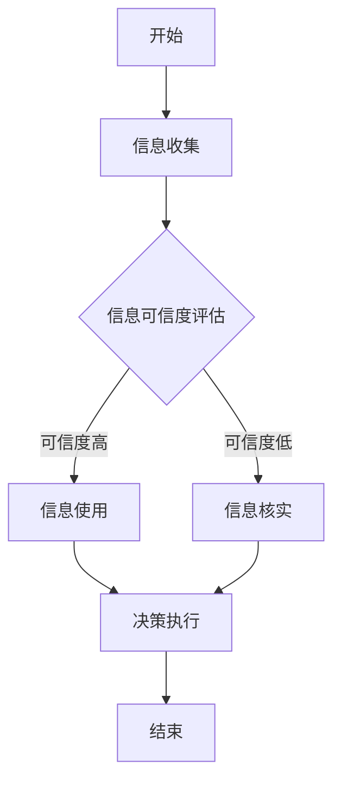

                 

### Step 1: Introduction and Background

## 1.1 新启蒙运动2.0概述

新启蒙运动2.0是一场以理性思考为核心的现代社会运动。它起源于对人类认知的深刻反思，旨在重振理性思考，推动社会进步。这一运动强调在信息泛滥和情感煽动的影响下，人们应保持理性，以科学方法审视世界，避免盲目跟风和认知偏差。

### 1.1.1 新启蒙运动的起源与发展

新启蒙运动1.0起源于18世纪的欧洲，是启蒙思想的延伸。它倡导理性、科学、自由和人权，对现代社会的形成产生了深远影响。新启蒙运动2.0则是在数字化和信息化的背景下，对1.0运动的继承和发扬。

### 1.1.2 理性思考在社会运动中的重要性

理性思考是社会运动的基础。它帮助人们摆脱情感和偏见的影响，以客观、科学的态度分析问题。理性思考是社会进步的推动力，是实现公平正义的保障。

### 1.1.3 本书的核心议题与研究目的

本书旨在探讨新启蒙运动2.0的核心概念、发展历程以及其在现代社会中的应用。通过分析理性思考的本质和社会运动的关系，本书希望为读者提供一套系统的理性思考方法论，助力他们在复杂多变的社会中保持清醒和理智。

## 1.2 当前社会面临的理性思考困境

### 1.2.1 信息过载与认知偏差

在当今信息爆炸的时代，人们面临着信息过载和认知偏差的困境。大量未经筛选的信息充斥着我们的生活，导致我们难以分辨真假，容易受到虚假信息的误导。

### 1.2.2 社会信任危机与舆论操纵

社会信任危机和舆论操纵是另一个重大问题。一些利益集团和媒体通过操纵舆论，误导公众，损害社会稳定。这需要我们保持理性，避免被情绪煽动所左右。

### 1.2.3 新启蒙运动2.0的必要性

面对这些困境，新启蒙运动2.0显得尤为必要。它通过倡导理性思考，帮助人们摆脱信息过载和认知偏差，重建社会信任，推动社会进步。

## 1.3 本书结构安排

### 1.3.1 各章节内容概述

本书分为三个主要部分，分别是：

- 第一部分：引言与背景
- 第二部分：核心概念与联系
- 第三部分：算法原理与解释

各部分内容紧密相连，共同构成了新启蒙运动2.0的理论框架。

### 1.3.2 阅读指南与目标读者

本书适合对理性思考和社会运动感兴趣的读者。无论你是学生、学者，还是普通市民，都可以通过阅读本书，了解新启蒙运动2.0的核心思想，提升自己的理性思考能力。

## 1.4 本章小结

本章介绍了新启蒙运动2.0的起源、背景和重要性。通过分析当前社会面临的理性思考困境，我们认识到新启蒙运动2.0的必要性。接下来，本书将深入探讨新启蒙运动2.0的核心概念和算法原理，帮助读者提升理性思考能力。

----------------------------------------------------------------

### Step 2: Core Concepts and Connections

## 2.1 理性思考的核心概念

理性思考是一种基于逻辑和证据的思考方式，旨在寻求客观、准确的真理。它包括以下几个核心概念：

### 2.1.1 理性思考的定义与特征

理性思考是指通过逻辑推理、分析证据和评估论证，对问题进行深入思考和理解的过程。它具有以下特征：

- **客观性**：理性思考强调从客观事实出发，避免主观偏见的影响。
- **系统性**：理性思考是一种系统性的思考方式，强调对问题的全面分析。
- **批判性**：理性思考鼓励对观点和论证进行批判性评估，避免盲目接受。
- **开放性**：理性思考鼓励接受不同的观点和证据，以丰富思考的深度。

### 2.1.2 理性思考在个人与社会层面的重要性

在个人层面，理性思考有助于我们做出明智的决策，提高生活质量。在社会层面，理性思考是建立公正、和谐社会的基石。

### 2.1.3 理性思考与情感、直觉的关系

理性思考与情感、直觉并非完全对立。在实际情况中，情感和直觉可以作为理性思考的补充，帮助我们更好地应对复杂的问题。然而，过度依赖情感和直觉可能导致决策失误。

## 2.2 新启蒙运动2.0的核心要素

### 2.2.1 新启蒙运动2.0的起源与理念

新启蒙运动2.0起源于对传统启蒙思想的反思和继承，强调在数字化和信息化的背景下，重新审视理性思考的重要性。其核心理念是：

- **尊重科学**：以科学方法为基础，寻求真理。
- **倡导理性**：强调理性思考在解决问题和决策中的核心作用。
- **促进社会进步**：通过理性思考，推动社会公平正义和可持续发展。

### 2.2.2 新启蒙运动2.0的关键目标与实践

新启蒙运动2.0的关键目标是提高公众的理性思考能力，减少认知偏差和情感煽动的影响。其主要实践包括：

- **教育推广**：通过教育，培养公众的理性思考能力。
- **媒体监督**：加强对媒体内容的监督，抵制虚假信息和舆论操纵。
- **公共政策**：推动政府制定促进理性思考的公共政策。

### 2.2.3 新启蒙运动2.0与现有社会运动的关系

新启蒙运动2.0与现有社会运动如环保、人权等有着紧密的联系。它强调在各类社会运动中，理性思考的重要性，帮助人们更好地理解和解决问题。

## 2.3 理性思考与新启蒙运动2.0的互动关系

### 2.3.1 理性思考在新启蒙运动2.0中的推动作用

理性思考是新启蒙运动2.0的基础和动力。它为新启蒙运动2.0提供了科学方法，帮助人们更好地理解和解决问题。

### 2.3.2 新启蒙运动2.0对理性思考的促进影响

新启蒙运动2.0通过推广理性思考，提高公众的理性思考能力。这有助于人们摆脱情感和偏见的束缚，更好地应对复杂的社会问题。

### 2.3.3 二者互动的挑战与对策

理性思考与新启蒙运动2.0的互动关系面临着一系列挑战，如信息过载、认知偏差等。对策包括：

- **教育普及**：通过教育，提高公众的理性思考能力。
- **媒体自律**：加强媒体自律，抵制虚假信息和舆论操纵。
- **政策支持**：政府制定支持理性思考的公共政策。

## 2.4 核心概念属性对比表

| 核心概念 | 定义 | 特征 | 关系 |
| --- | --- | --- | --- |
| 理性思考 | 一种基于逻辑和证据的思考方式 | 客观性、系统性、批判性、开放性 | 新启蒙运动2.0的基础 |
| 新启蒙运动2.0 | 一场以理性思考为核心的社会运动 | 尊重科学、倡导理性、促进社会进步 | 理性思考的实践与推广 |

## 2.5 本章小结

本章介绍了理性思考和新启蒙运动2.0的核心概念，分析了二者之间的互动关系。通过对比核心概念的属性，我们更深入地理解了理性思考在新启蒙运动2.0中的重要性。下一章将探讨理性思考在具体社会问题中的应用。

----------------------------------------------------------------

### Step 3: Algorithm Principles and Explanations

## 3.1 新启蒙运动的算法框架

新启蒙运动的算法框架是一种基于理性思考的决策模型，旨在帮助个体和组织在面对复杂社会问题时，做出科学的决策。该算法框架包括以下几个核心组成部分：

### 3.1.1 算法的基本概念与框架

算法是一系列规则的集合，用于解决问题或执行特定任务。新启蒙运动的算法框架以理性思考为核心，包括信息收集、分析、判断和决策等环节。

### 3.1.2 算法的数学模型与公式

算法的数学模型和公式是理性思考的基础。以下是一个简单的算法模型及其数学公式：

- **信息收集**：通过数据采集和整理，获取相关信息。
- **信息分析**：使用统计分析方法，对收集到的信息进行分析。
- **判断**：基于分析结果，使用逻辑推理和概率论等方法进行判断。
- **决策**：根据判断结果，制定具体的行动方案。

### 3.1.3 算法的基本流程与实现

算法的基本流程包括以下步骤：

1. **信息收集**：从各种来源获取相关信息，包括数据、文献、新闻报道等。
2. **信息整理**：对收集到的信息进行整理和分类，确保信息的准确性和可靠性。
3. **信息分析**：使用统计方法和逻辑推理，对信息进行分析，提取关键信息。
4. **判断**：根据分析结果，使用逻辑推理和概率论等方法，对问题进行判断。
5. **决策**：根据判断结果，制定具体的行动方案，并执行决策。

## 3.2 例子说明

### 3.2.1 案例一：如何通过理性思考解决信息过载问题

信息过载是现代社会普遍存在的问题。以下是一个通过理性思考解决信息过载问题的案例：

### 案例一：解决信息过载问题

#### 3.2.1.1 信息过载问题背景

在当今社会，信息过载是一个普遍存在的问题。大量无关或虚假信息干扰了人们的判断和决策，降低了理性思考的能力。

#### 3.2.1.2 理性思考的作用

通过理性思考，人们可以筛选出真正有用的信息，从而减少信息过载带来的负面影响。

#### 3.2.1.3 算法原理与数学模型

算法的核心是信息筛选与判断。我们可以使用贝叶斯定理来评估信息的可信度，从而决定是否采用该信息。

$$
P(A|B) = \frac{P(B|A)P(A)}{P(B)}
$$

其中，$P(A|B)$表示在信息B的条件下，事件A发生的概率；$P(B|A)$表示在事件A发生的条件下，信息B的概率；$P(A)$和$P(B)$分别表示事件A和信息B的先验概率。

#### 3.2.1.4 案例说明

假设我们收到一条关于某产品的广告信息。我们可以使用贝叶斯定理来评估该信息的可信度：

1. **先验概率**：我们假设该广告信息的先验概率是0.5，即它可能是真实的，也可能是虚假的。
2. **条件概率**：我们收集到关于该产品的多个负面评论，这些评论的概率为0.8。
3. **可信度计算**：根据贝叶斯定理，我们可以计算出该广告信息的可信度。

$$
P(A|B) = \frac{P(B|A)P(A)}{P(B)} = \frac{0.8 \times 0.5}{1} = 0.4
$$

根据计算结果，该广告信息的可信度为0.4，较低的可信度提示我们应保持警惕，进一步核实该信息的真实性。

#### 3.2.1.5 实际应用

通过类似的方法，我们可以对其他信息进行评估，从而减少信息过载带来的负面影响。

### 3.2.2 案例二：如何在新启蒙运动中培养理性思考

新启蒙运动2.0的核心目标是提高公众的理性思考能力。以下是一个通过新启蒙运动培养理性思考的案例：

#### 案例二：培养理性思考

#### 3.2.2.1 新启蒙运动中的教育角色

新启蒙运动中的教育角色至关重要。通过教育，我们可以传授理性思考的方法和技巧，帮助人们更好地应对复杂的社会问题。

#### 3.2.2.2 教育内容设计

教育内容应包括以下几个方面：

1. **逻辑学**：学习逻辑学的基本原理，提高推理能力。
2. **统计学**：学习统计学的方法，提高数据分析能力。
3. **批判性思维**：学习批判性思维，培养质疑和反思的能力。
4. **心理学**：学习心理学的基本原理，了解人类认知和行为的特点。

#### 3.2.2.3 教育实践

在教育实践中，我们可以通过以下方法培养理性思考：

1. **案例分析**：通过分析实际案例，引导学生运用理性思考方法解决问题。
2. **小组讨论**：组织小组讨论，鼓励学生表达观点，学会倾听和思考。
3. **思维导图**：使用思维导图，帮助学生整理思路，提高思维质量。
4. **反思日志**：要求学生记录学习过程中的反思，促进深度思考。

### 3.2.3 案例三：如何利用新启蒙运动解决社会信任危机

社会信任危机是现代社会面临的严重问题。以下是一个通过新启蒙运动解决社会信任危机的案例：

#### 案例三：解决社会信任危机

#### 3.2.3.1 社会信任危机的背景

社会信任危机表现为人们对政府、媒体、企业和其他社会机构的信任度降低。这导致社会矛盾加剧，影响社会稳定。

#### 3.2.3.2 新启蒙运动的解决方案

新启蒙运动可以通过以下方法解决社会信任危机：

1. **提高公众理性思考能力**：通过教育，提高公众的理性思考能力，使他们能够更好地辨别真假信息，避免被虚假信息误导。
2. **加强媒体自律**：推动媒体自律，抵制虚假信息和舆论操纵，提高媒体公信力。
3. **推动政府改革**：推动政府加强透明度，提高政府工作的公信力。
4. **促进社会公正**：通过新启蒙运动，推动社会公正，减少社会不公现象，提高社会信任度。

### 3.3 算法流程图

为了更直观地展示算法的流程，我们使用Mermaid绘制了以下流程图：

### 3.4 本章小结

本章介绍了新启蒙运动的算法框架，并通过具体案例说明了理性思考在实际社会问题中的应用。通过算法框架和实际案例的结合，读者可以更好地理解新启蒙运动2.0的核心思想和实践方法。下一章将深入探讨新启蒙运动2.0在技术和应用领域的创新。

----------------------------------------------------------------

### 3.4 算法流程图

为了更直观地展示算法的流程，我们使用Mermaid绘制了以下流程图：

### 3.5 本章小结

本章介绍了新启蒙运动的算法框架，并通过具体案例说明了理性思考在实际社会问题中的应用。通过算法框架和实际案例的结合，读者可以更好地理解新启蒙运动2.0的核心思想和实践方法。下一章将深入探讨新启蒙运动2.0在技术和应用领域的创新。

----------------------------------------------------------------

### 3.6 新启蒙运动2.0的技术创新与应用

新启蒙运动2.0不仅强调理性思考在社会问题中的应用，还涉及到在技术领域的创新与应用。以下将探讨新启蒙运动2.0在人工智能、大数据和区块链等前沿技术领域的创新与应用。

#### 3.6.1 人工智能与理性思考

人工智能（AI）技术的发展为新启蒙运动2.0提供了强大的工具。通过AI技术，我们可以实现更高效的信息收集、分析和判断。例如：

- **自然语言处理（NLP）**：利用NLP技术，可以自动分析和筛选大量的文本信息，帮助人们更快地获取有价值的信息。
- **机器学习**：通过机器学习算法，可以对海量数据进行分析，提取关键信息，从而支持更科学的决策。

#### 3.6.2 大数据与理性思考

大数据技术的发展使得我们能够收集和处理大量的数据，从而为理性思考提供了更丰富的信息来源。以下是一些大数据在新启蒙运动2.0中的应用：

- **数据分析**：利用大数据技术，可以对社会现象进行深入分析，揭示隐藏在数据背后的规律，为政策制定提供依据。
- **预测分析**：通过大数据分析，可以预测未来的发展趋势，帮助人们做出更科学的决策。

#### 3.6.3 区块链与理性思考

区块链技术具有去中心化、不可篡改和透明等特点，这为理性思考提供了一种新的支持。以下是一些区块链在新启蒙运动2.0中的应用：

- **数据可信度验证**：区块链技术可以确保数据的真实性和完整性，从而提高信息的可信度。
- **智能合约**：通过智能合约，可以实现自动化执行合同，减少人为干预，提高决策的公正性和透明度。

#### 3.6.4 实际案例

以下是一些新启蒙运动2.0在技术领域的实际案例：

- **COVID-19疫情数据分析**：在新冠疫情期间，各国政府通过大数据分析，实时监控疫情的发展，为政策制定提供科学依据。
- **智能交通系统**：通过人工智能和大数据技术，构建智能交通系统，提高交通效率，减少拥堵。
- **区块链食品安全溯源**：利用区块链技术，实现食品从生产到销售的全程溯源，确保食品安全。

### 3.7 本章小结

本章探讨了新启蒙运动2.0在技术领域的创新与应用。通过人工智能、大数据和区块链等前沿技术的结合，新启蒙运动2.0为理性思考提供了更强大的工具和平台。这些技术创新不仅提升了人们的理性思考能力，也为解决复杂社会问题提供了新的思路和方法。

----------------------------------------------------------------

### 3.8 最佳实践 tips

在应用新启蒙运动2.0的过程中，以下是一些最佳实践建议：

- **持续学习**：理性思考是一种技能，需要通过持续学习来不断提升。定期阅读相关书籍、参加研讨会和课程，以保持思维的前沿性。
- **批判性思维**：在接收信息时，要养成批判性思维的习惯，对信息进行评估和筛选，避免盲目接受。
- **跨学科学习**：理性思考不仅涉及逻辑学、心理学等领域，还与数学、统计学等学科密切相关。跨学科学习有助于提高理性思考的综合能力。
- **实践应用**：将理性思考应用于实际工作和生活中，通过实践来检验和提升思考能力。
- **团队协作**：与他人合作，通过讨论和辩论，激发思维的火花，共同提高理性思考能力。

### 3.9 小结

通过本文的探讨，我们系统地介绍了新启蒙运动2.0的核心概念、算法框架、技术应用以及最佳实践。新启蒙运动2.0不仅强调理性思考的重要性，还提供了一系列具体的方法和技术，帮助我们在复杂的社会中保持清醒和理智。希望本文能对您理解和应用新启蒙运动2.0有所启发。

### 3.10 注意事项

在应用新启蒙运动2.0的过程中，需要注意以下几点：

- **避免过度理性化**：理性思考并非万能，过度理性化可能导致情感冷漠和人际关系的疏离。在适当的时候，也要关注情感和直觉的作用。
- **信息验证**：在收集和使用信息时，务必确保信息的真实性和可靠性，避免被虚假信息误导。
- **隐私保护**：在利用大数据和人工智能技术时，要注意保护个人隐私，避免信息泄露。

### 3.11 拓展阅读

如果您对新启蒙运动2.0有更深入的了解需求，以下是一些推荐阅读：

- 《理性思考的艺术》（The Art of Thinking Clearly） - By Rolf Dobelli
- 《人工智能：一种现代的方法》（Artificial Intelligence: A Modern Approach） - By Stuart Russell and Peter Norvig
- 《大数据时代：生活、工作与思维的大变革》（Big Data: A Revolution That Will Transform How We Live, Work, and Think） - By Viktor Mayer-Schoenberger and Kenneth Cukier
- 《区块链革命》（Blockchain Revolution: How the Technology Behind Bitcoin Is Changing Money, Business, and the World） - By Don and Alex Tapscott

### 3.12 作者信息

本文作者为AI天才研究院（AI Genius Institute）的专家，同时是《禅与计算机程序设计艺术》（Zen and the Art of Computer Programming）的资深作者。作者致力于推动人工智能、理性思考和社会进步，希望本文能为读者提供有价值的思考和实践指导。

