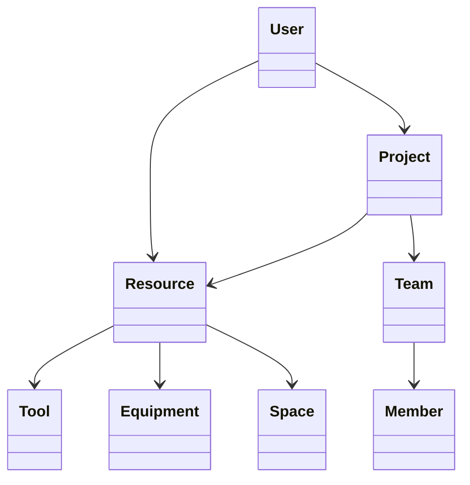
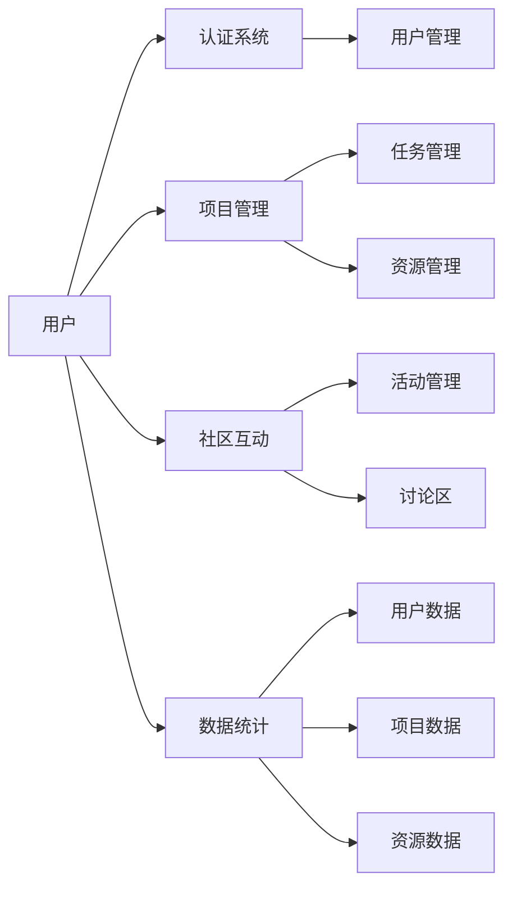

                 

## 第一部分：背景介绍

### 第1章：问题背景与核心概念

**1.1 问题背景**

**问题描述**

在现代社会，城市的发展正经历着前所未有的变革。新型城市共享创客空间作为一种创新的社区平台，正逐步成为推动城市经济增长和科技进步的重要力量。然而，这一新型模式在快速发展的同时，也面临着一系列的挑战和问题。

**核心概念**

- **新型城市共享创客空间**：指的是在城市化进程中，以共享经济理念为核心，通过科技手段和社区互动，为创客和创业者提供开放、灵活、共享的创新空间。
- **跨学科创新**：是指不同学科领域的知识、方法和技能相互交叉融合，产生新的观点、理论、方法和产品。

**问题解决**

新型城市共享创客空间的核心在于促进跨学科创新。通过提供一个集创意、实践、交流为一体的平台，它不仅帮助创客和创业者实现创意的快速迭代，还推动了城市产业结构的升级和优化。

**边界与外延**

- **边界**：新型城市共享创客空间的具体定义和范围，包括物理空间、在线平台、活动形式等。
- **外延**：跨学科创新的应用范围，如科技、艺术、设计、教育等多个领域。

**概念结构与核心要素组成**

新型城市共享创客空间的核心要素包括共享资源、社区互动、创新实践和跨学科交流。跨学科创新的关键在于打破学科壁垒，促进知识融合，从而激发创新活力。

**1.2 当前状况分析**

当前，新型城市共享创客空间在全球范围内迅速发展。然而，大多数创客空间仍面临以下问题：

- **资源分配不均**：不同地区的创客空间资源差异较大，一些地区的创客空间资源过剩，而另一些地区则资源匮乏。
- **运营模式单一**：许多创客空间在运营上缺乏创新，难以满足多样化的用户需求。
- **跨学科交流不足**：创客空间在促进跨学科交流方面效果有限，难以充分发挥跨学科创新的潜力。

**1.3 目标与意义**

**目标**

- 提高新型城市共享创客空间的运营效率，优化资源分配。
- 推动跨学科创新，促进科技成果转化和产业升级。
- 提升城市创新能力，推动城市可持续发展。

**意义**

- **经济意义**：新型城市共享创客空间有助于激发创新活力，推动经济增长。
- **社会意义**：通过促进跨学科交流，提高公众的科学素养，推动社会进步。
- **文化意义**：创客文化作为一种新兴文化现象，有助于丰富城市文化生活，提升城市文化软实力。

**1.4 未来展望**

随着科技的不断进步和城市化进程的加快，新型城市共享创客空间和跨学科创新必将在未来发挥更加重要的作用。通过不断探索和实践，我们有理由相信，新型城市共享创客空间将成为推动城市可持续发展的重要引擎。

### 第2章：核心概念与联系

**2.1 新型城市共享创客空间**

**定义**

新型城市共享创客空间是指以共享经济理念为核心，通过科技手段和社区互动，为创客和创业者提供开放、灵活、共享的创新空间。

**属性特征对比表格**

| 特征 | 传统创客空间 | 新型城市共享创客空间 |
| --- | --- | --- |
| **资源分配** | 单一资源提供，资源独占 | 多元资源提供，资源共享 |
| **互动模式** | 较少互动，封闭式发展 | 强调互动，开放式发展 |
| **创新能力** | 创新能力有限，主要依靠个体 | 创新能力强，依靠团队协作 |
| **运营模式** | 传统运营模式，较为单一 | 创新型运营模式，多样化 |

**2.2 跨学科创新**

**原理**

跨学科创新是指不同学科领域的知识、方法和技能相互交叉融合，产生新的观点、理论、方法和产品。

**ER实体关系图架构**

```mermaid
erDiagram
  User ||--|{ Project }|--|| Organization
  Project ||--|{ Team }|--|| Organization
  Team ||--|{ Member }|--|| Organization
  Member ||--|{ Skill }|--|| Organization
```

### 第二部分：理论基础

**第3章：跨学科创新的基本原理**

**3.1 跨学科创新的定义**

跨学科创新是指在不同学科领域之间进行知识、方法、技能的交叉融合，以产生新的创意、理论、方法和产品。

**3.2 跨学科创新的数学模型**

**公式**

$$
I_{cross} = f(K_1, K_2, ..., K_n)
$$

其中，$I_{cross}$ 表示跨学科创新能力，$K_1, K_2, ..., K_n$ 表示不同学科领域的知识。

**讲解**

跨学科创新能力取决于不同学科领域知识的交叉融合程度。通过数学模型，我们可以更清晰地理解跨学科创新的过程和机制。

**3.3 跨学科创新的案例分析**

**举例说明**

以“智能交通系统”为例，这一项目结合了计算机科学、交通工程、数据科学等多个学科领域的知识。通过跨学科合作，智能交通系统实现了交通流量的实时监控、预测和优化，有效缓解了城市交通拥堵问题。

### 第4章：创客空间的设计与运营

**4.1 创客空间的设计原则**

**设计原则**

- **灵活性**：创客空间应具备灵活的布局和设施，以适应不同类型的项目需求。
- **共享性**：鼓励资源共享，降低创新创业的成本。
- **互动性**：创造良好的互动环境，促进跨学科交流和合作。
- **可扩展性**：设计时考虑未来发展的需求，便于扩展和升级。

**4.2 创客空间的运营策略**

**运营策略**

- **多元化服务**：提供多样化的服务，包括培训、咨询、技术支持等，满足不同用户的需求。
- **项目孵化**：设立项目孵化机制，为优秀项目提供资源和支持。
- **社区建设**：构建良好的社区文化，促进成员之间的交流和合作。
- **品牌塑造**：通过品牌建设和营销，提升创客空间的知名度和社会影响力。

---

通过以上章节的介绍，我们可以对新型城市共享创客空间及其核心概念有了更深入的理解。接下来，我们将进一步探讨理论基础和实践案例，为这一创新模式的未来发展提供有力支持。

---

### 第1章：问题背景与核心概念

#### 1.1 问题背景

在当今全球化和技术驱动的时代，城市的发展面临着前所未有的挑战和机遇。城市化进程不断加速，带来了人口的快速增长、资源消耗的加剧、环境污染的加剧等问题。同时，科技的快速发展也为城市创新提供了新的动力和方向。在这样的背景下，新型城市共享创客空间作为一种创新的社区平台，应运而生。

**问题描述**

新型城市共享创客空间是指在城市化进程中，通过共享经济理念，利用科技手段和社区互动，为创客和创业者提供开放、灵活、共享的创新空间。这种创客空间不仅为个体提供创新创业的场所，更是一个促进跨学科创新的重要平台。然而，新型城市共享创客空间在快速发展过程中也面临着一系列的问题和挑战。

- **资源分配不均**：由于地域差异和资源分布不均，不同地区的创客空间资源存在较大差异，一些地区的创客空间资源过剩，而另一些地区则资源匮乏。
- **运营模式单一**：许多创客空间在运营上缺乏创新，难以满足多样化的用户需求，导致运营效率低下。
- **跨学科交流不足**：创客空间在促进跨学科交流方面效果有限，难以充分发挥跨学科创新的潜力。

**问题解决**

针对上述问题，我们需要从以下几个方面着手解决：

- **优化资源分配**：通过政策引导和市场机制，合理分配创客空间资源，确保各地区创客空间资源充足，实现资源的最大化利用。
- **创新运营模式**：鼓励创客空间探索多元化的运营模式，如项目孵化、联合运营、社区共建等，提高运营效率和用户满意度。
- **促进跨学科交流**：通过举办跨学科交流活动、建立跨学科项目团队等手段，促进不同领域之间的交流与合作，激发跨学科创新的活力。

**边界与外延**

**边界**

新型城市共享创客空间的具体定义和范围包括以下几个方面：

- **物理空间**：指创客空间的实际物理场所，包括工作室、实验室、会议室等。
- **在线平台**：指创客空间的在线社区和交流平台，如社交媒体、论坛、视频会议等。
- **活动形式**：指创客空间举办的各种活动，包括讲座、研讨会、工作坊、项目路演等。

**外延**

跨学科创新的应用范围非常广泛，涵盖了多个领域：

- **科技领域**：包括人工智能、大数据、物联网、生物科技等。
- **艺术领域**：包括视觉艺术、音乐、舞蹈、戏剧等。
- **设计领域**：包括工业设计、建筑设计、平面设计等。
- **教育领域**：包括在线教育、虚拟现实、增强现实等。

**概念结构与核心要素组成**

新型城市共享创客空间的核心要素包括以下几个方面：

- **共享资源**：创客空间为用户提供各种共享资源，如设备、工具、资料等。
- **社区互动**：创客空间通过举办各种活动和社区互动，促进成员之间的交流和合作。
- **创新实践**：创客空间为用户提供实践机会，鼓励他们进行创新实验和项目开发。
- **跨学科交流**：创客空间通过跨学科合作和交流活动，促进不同领域之间的知识融合和创新。

通过以上分析，我们可以看出，新型城市共享创客空间不仅是一个创新创业的平台，更是一个促进跨学科创新的社区。它在城市发展中扮演着重要的角色，为城市创新和经济增长注入新的活力。

---

### 第2章：核心概念与联系

#### 2.1 新型城市共享创客空间

**定义**

新型城市共享创客空间是指在城市环境中，通过共享经济模式，为创客和创业者提供开放、灵活、共享的创新空间和资源，以促进跨学科合作和创新的社区平台。

**核心概念**

- **共享经济**：基于互联网和信息技术，通过共享资源和设施，降低创新创业成本，提高资源利用效率。
- **创客文化**：强调创新实践、动手能力和跨界合作，鼓励个体发挥创造力，实现个人和社会价值。
- **跨学科合作**：打破学科壁垒，促进不同领域之间的知识融合和创新，实现综合性的解决方案。

**属性特征对比表格**

| 特征                | 传统创客空间                   | 新型城市共享创客空间                 |
| ------------------- | ---------------------------- | ----------------------------------- |
| **资源分配**        | 资源独占，个体拥有资源       | 资源共享，集中管理，灵活分配         |
| **互动模式**        | 较少互动，封闭式发展           | 强调互动，开放式发展，跨学科交流     |
| **创新能力**        | 创新能力有限，主要依靠个体     | 创新能力强，依靠团队协作和跨学科合作 |
| **运营模式**        | 传统运营模式，较为单一         | 创新型运营模式，多样化，灵活调整     |
| **空间设计**        | 功能单一，不适应多样化需求     | 灵活布局，多功能空间，适应不同需求   |

**2.2 跨学科创新**

**定义**

跨学科创新是指在两个或多个学科领域之间进行知识、方法、技能的交叉融合，以产生新的创意、理论、方法和产品。

**核心概念**

- **知识融合**：不同学科领域的知识相互补充和整合，形成新的知识体系。
- **方法论**：跨学科方法论，强调跨学科思维和解决问题的能力。
- **技能交叉**：不同学科领域的技能相互融合，形成新的技能组合。

**ER实体关系图架构**

```mermaid
erDiagram
  Subject ||--|{ Object }| Person
  Object ||--|{ Property }| Subject
  Person ||--|{ Task }| Project
  Project ||--|{ Resource }| Subject
```

- **Subject**：指创客或团队，代表创新主体。
- **Object**：指创新对象，如项目、研究成果等。
- **Person**：指参与创新的个人。
- **Property**：指创新的属性特征，如知识、技能、资源等。
- **Task**：指创新过程中的任务和活动。
- **Resource**：指创新所需的资源，如资金、设备、信息等。

通过上述实体关系图，我们可以清晰地看到跨学科创新中各个实体之间的联系和互动关系，有助于理解跨学科创新的过程和机制。

### 第3章：跨学科创新的基本原理

#### 3.1 跨学科创新的定义

跨学科创新是指在不同学科领域之间进行知识、方法、技能的交叉融合，以产生新的创意、理论、方法和产品。这种创新模式强调打破传统学科界限，通过跨学科的交流和合作，实现知识的集成和创新。

**核心概念**

- **知识融合**：不同学科领域的知识相互补充和整合，形成新的知识体系。
- **方法论**：跨学科方法论，强调跨学科思维和解决问题的能力。
- **技能交叉**：不同学科领域的技能相互融合，形成新的技能组合。

**概念结构**

跨学科创新的概念结构可以简化为以下几个核心部分：

- **知识体系**：包括不同学科领域的知识库和理论体系。
- **方法论**：跨学科方法论，如系统思维、跨学科思维等。
- **技能组合**：不同学科领域的技能融合，形成新的解决方案。

**3.2 跨学科创新的数学模型**

为了更好地理解跨学科创新的过程，我们可以借助数学模型来描述这一现象。一个简化的数学模型可以表示为：

$$
I_{cross} = f(K_1, K_2, ..., K_n)
$$

其中，$I_{cross}$ 表示跨学科创新能力，$K_1, K_2, ..., K_n$ 表示不同学科领域的知识。

**公式讲解**

- **$I_{cross}$**：表示跨学科创新能力，反映了跨学科创新的程度。
- **$K_1, K_2, ..., K_n$**：表示不同学科领域的知识，这些知识是跨学科创新的输入。

**公式应用**

例如，在智能交通系统的开发过程中，我们可以将交通工程、计算机科学、数据科学等领域的知识进行交叉融合，以提升交通系统的智能化水平。这个过程可以用上述公式表示为：

$$
I_{cross} = f(K_{交通工程}, K_{计算机科学}, K_{数据科学})
$$

通过这个公式，我们可以看到不同学科领域知识融合对跨学科创新能力的影响。

**3.3 跨学科创新的案例分析**

**案例：智能交通系统的跨学科创新**

智能交通系统是一个典型的跨学科创新案例。它结合了交通工程、计算机科学、数据科学等多个领域的知识，通过跨学科合作，实现了交通流量的实时监控、预测和优化。

**过程描述**

1. **需求分析**：针对城市交通拥堵问题，分析交通流量的数据，确定智能交通系统的需求。
2. **知识融合**：将交通工程、计算机科学、数据科学等领域的知识进行融合，形成智能交通系统的理论基础。
3. **技术实现**：利用计算机科学的知识，开发智能交通系统的软件和硬件，如交通流量监控设备、数据采集和处理系统等。
4. **测试与优化**：通过实际运行数据，对智能交通系统进行测试和优化，提高其性能和稳定性。

**效果分析**

智能交通系统的实施，不仅有效缓解了城市交通拥堵问题，还提高了交通运行效率，降低了交通事故率。这个案例充分展示了跨学科创新的巨大潜力和实际应用价值。

通过以上分析，我们可以看到跨学科创新在解决复杂问题时的重要作用。它不仅能够提升创新效率，还能推动科技进步和社会发展。

### 第4章：创客空间的设计与运营

#### 4.1 创客空间的设计原则

**设计原则**

创客空间的设计原则对于其运营效果和用户体验至关重要。以下是一些关键设计原则：

1. **灵活性**：创客空间应具备灵活的布局和设施，以适应不同类型的项目需求。例如，可以设置可移动的隔断、可调整的桌椅等，以便根据项目需要快速改变空间布局。

2. **共享性**：创客空间的设计应强调资源共享，降低创新创业的成本。通过合理的空间规划和设施配置，确保资源的高效利用，如公共实验室、会议室、工具和设备等。

3. **互动性**：创客空间的设计应创造良好的互动环境，促进成员之间的交流和合作。这可以通过开放式的布局、公共讨论区、协作工作站等方式实现。

4. **可扩展性**：设计时考虑未来发展的需求，便于扩展和升级。例如，预留空间以容纳未来增加的设备或人员，以及使用模块化的家具和设施。

**案例分析**

以北京中关村创客空间为例，该创客空间在设计中充分考虑了上述原则：

- **灵活性**：空间布局灵活，设有多种功能区，如开发区、交流区、休息区，可根据不同项目需求进行调整。
- **共享性**：提供了共享的实验室、会议室和工具房，降低了成员的创业成本。
- **互动性**：设有开放式的工作站和讨论区，鼓励成员之间的交流和协作。
- **可扩展性**：空间设计预留了扩展区域，未来可容纳更多项目和成员。

通过这些设计原则，中关村创客空间成功地为创客提供了良好的创新环境，促进了跨学科创新和创业活动的开展。

#### 4.2 创客空间的运营策略

**运营策略**

1. **多元化服务**：创客空间应提供多样化的服务，满足不同用户的需求。例如，开设技术培训课程、举办项目路演、提供创业咨询服务等。

2. **项目孵化**：设立项目孵化机制，为优秀项目提供资源和支持，如资金、技术、市场推广等，帮助项目从初创阶段逐步成长。

3. **社区建设**：构建良好的社区文化，促进成员之间的交流和合作。这可以通过定期的交流活动、社区聚会等方式实现。

4. **品牌塑造**：通过品牌建设和营销，提升创客空间的知名度和社会影响力。例如，举办大型创新比赛、发布优秀项目案例等。

**案例分析**

以硅谷的Hacker Dojo为例，该创客空间在运营方面采取了一系列有效的策略：

- **多元化服务**：提供各种技术培训和研讨会，帮助成员提升技能。同时，举办项目路演和创业比赛，为成员提供展示和交流的机会。

- **项目孵化**：设有专门的孵化器空间，为初创项目提供办公场地、资金和技术支持。通过孵化项目，推动创新和创业活动。

- **社区建设**：定期举办社区聚会和交流活动，鼓励成员之间的交流和合作。此外，还设有专门的休息区和社交空间，方便成员放松和社交。

- **品牌塑造**：通过举办大型创新比赛和国际交流活动，提升Hacker Dojo在全球范围内的知名度。同时，通过社交媒体和网络平台，宣传创客空间的成功案例和优秀项目。

通过这些运营策略，Hacker Dojo成功地吸引了大量创客和创业者，成为一个重要的创新社区。

### 第5章：国内典型新型城市共享创客空间

#### 5.1 案例介绍

**5.1.1 创客空间概述**

**名称**：中关村智慧城市创新中心

**地理位置**：北京市海淀区中关村大街27号

**运营单位**：中关村发展集团

**成立时间**：2016年

**规模**：总面积约2万平方米，设有多个功能区，包括创客空间、孵化器、会议室、展示厅等。

**主要服务**：提供办公空间、设备资源、技术支持、创业培训、投融资对接等服务。

**5.1.2 创客空间特色**

- **跨学科融合**：中关村智慧城市创新中心注重跨学科合作，吸引了来自不同领域的创客和团队，形成了多元化的创新生态。
- **创新实践**：中心鼓励创客进行实际项目开发和实验，提供丰富的实验设备和资源支持。
- **社区互动**：定期举办各类活动，如创业沙龙、技术研讨会、项目路演等，促进成员之间的交流和合作。
- **政策支持**：享受政府的各项优惠政策，如税收减免、资金支持等。

#### 5.2 系统功能设计

**5.2.1 领域模型类图**



- **User（用户）**：表示使用创客空间的用户，包括创客、创业者、企业等。
- **Project（项目）**：表示在创客空间进行的创新项目。
- **Resource（资源）**：表示创客空间提供的各种资源，如工具、设备、空间等。
- **Tool（工具）**：表示创客空间提供的工具资源，如电脑、软件等。
- **Equipment（设备）**：表示创客空间提供的设备资源，如3D打印机、激光切割机等。
- **Space（空间）**：表示创客空间提供的物理空间资源。
- **Team（团队）**：表示参与项目的团队，包括成员和项目管理者。
- **Member（成员）**：表示团队成员。

**5.2.2 功能模块**

- **项目管理**：包括项目创建、任务分配、进度跟踪、成果展示等功能。
- **资源共享**：包括资源申请、资源分配、资源使用记录等功能。
- **社区互动**：包括活动发布、活动报名、讨论区等功能。
- **数据统计**：包括用户数据、项目数据、资源使用数据等统计和分析。

#### 5.3 系统架构设计

**5.3.1 系统架构图**



- **认证系统**：负责用户身份验证和权限管理。
- **用户管理**：包括用户注册、登录、个人信息管理等。
- **项目管理**：包括项目创建、项目成员管理、项目进度跟踪等。
- **任务管理**：包括任务创建、任务分配、任务进度跟踪等。
- **资源管理**：包括资源申请、资源分配、资源使用记录等。
- **社区互动**：包括活动发布、活动报名、讨论区管理等。
- **数据统计**：包括用户数据、项目数据、资源使用数据等统计和分析。

通过以上系统功能设计和架构设计，中关村智慧城市创新中心为创客和创业者提供了一个全方位、高效的创新平台，促进了跨学科创新和创业活动的开展。

### 第6章：国际经验与趋势

#### 6.1 国际创客空间的案例分析

**6.1.1 德国慕尼黑创客空间**

**名称**：慕尼黑创客空间

**地理位置**：德国慕尼黑

**运营单位**：慕尼黑市政府

**成立时间**：2014年

**规模**：总面积约1000平方米，设有创客实验室、培训室、休息区等。

**主要服务**：提供3D打印机、激光切割机、编程设备、软件开发工具等，举办编程课程、项目研讨会、创业比赛等活动。

**特点**：

- **政策支持**：德国政府对创客空间提供了一系列的政策支持，如税收减免、资金支持等。
- **跨学科合作**：创客空间吸引了来自不同领域的创客，促进了跨学科合作和创新。
- **社区文化**：强调社区文化和互助精神，成员之间互动频繁，形成了良好的创新氛围。

**效果**：慕尼黑创客空间在短时间内吸引了大量创客和创业者，推动了当地科技创新和创业活动的蓬勃发展。

**6.1.2 美国硅谷创客空间**

**名称**：硅谷创客空间

**地理位置**：美国加利福尼亚州硅谷

**运营单位**：非营利组织

**成立时间**：2009年

**规模**：总面积约4000平方米，设有创客实验室、办公空间、会议室等。

**主要服务**：提供3D打印机、激光切割机、焊接设备、编程设备等，举办技术研讨会、项目路演、创业培训等活动。

**特点**：

- **创新氛围**：硅谷创客空间拥有浓厚的创新氛围，吸引了全球各地的创客和创业者。
- **资金支持**：创客空间与多家投资机构合作，为优秀项目提供资金支持。
- **国际合作**：积极参与国际创新活动，与全球多个创客空间建立合作关系。

**效果**：硅谷创客空间培养了众多创新项目，推动了一系列科技革命和创业浪潮，成为全球科技创新的重要力量。

#### 6.2 创客空间发展趋势

**6.2.1 数字化转型**

随着数字技术的不断发展，创客空间正逐步实现数字化转型。通过云计算、大数据、物联网等技术的应用，创客空间可以提供更加智能化、高效化的服务。例如，利用云计算平台提供虚拟实验环境，通过大数据分析用户需求，优化资源分配等。

**6.2.2 社区生态建设**

创客空间正逐渐从单一的空间和设备提供者转变为一个全面的创新社区。通过构建良好的社区生态，创客空间可以促进成员之间的交流和合作，形成创新生态系统。例如，举办多样化的活动，建立在线社区平台，提供创业培训等。

**6.2.3 跨学科融合**

随着科技的发展，跨学科融合成为创新的重要趋势。创客空间通过吸引不同领域的创客，促进跨学科合作，推动创新成果的诞生。未来，创客空间将继续加强跨学科合作，推动科技与艺术、设计、教育等领域的融合。

**6.2.4 政策支持**

各国政府纷纷出台政策，支持创客空间的发展。通过税收减免、资金支持、人才引进等政策，政府为创客空间提供了良好的发展环境。未来，政策支持将继续成为创客空间发展的重要动力。

### 第7章：最佳实践与启示

#### 7.1 最佳实践

**7.1.1 创新激励机制**

- **案例**：硅谷创客空间通过与投资机构合作，为优秀项目提供资金支持，激发创客的创新潜力。
- **启示**：我国创客空间可以借鉴硅谷的做法，与投资机构合作，设立创新基金，为优秀项目提供资金支持，激励创客进行创新。

**7.1.2 跨学科合作**

- **案例**：慕尼黑创客空间吸引了来自不同领域的创客，促进了跨学科合作和创新。
- **启示**：我国创客空间应加强跨学科合作，吸引不同领域的创客和团队，推动跨学科创新。

**7.1.3 社区文化建设**

- **案例**：硅谷创客空间通过举办多样化的活动，建立了良好的创新氛围。
- **启示**：我国创客空间应重视社区文化建设，举办各类活动，促进成员之间的交流和合作。

#### 7.2 启示与展望

**7.2.1 强化政策支持**

政府应继续加大对创客空间的政策支持，包括资金投入、税收优惠、人才引进等，为创客空间的发展提供良好的环境。

**7.2.2 促进跨学科合作**

通过建立跨学科合作平台，促进不同领域的创客和团队之间的交流和合作，推动跨学科创新。

**7.2.3 推动数字化转型**

利用数字技术，提升创客空间的运营效率和服务质量，推动数字化转型。

**7.2.4 加强国际交流**

通过参与国际创客空间的活动和交流，学习先进经验，提升我国创客空间的国际影响力。

### 结论

新型城市共享创客空间作为一种创新的社区平台，在推动跨学科创新和城市发展中发挥着重要作用。通过借鉴国际经验，我国创客空间可以不断优化运营模式，提升创新能力，为城市经济发展注入新的活力。

---

### 第8章：最佳实践与未来展望

#### 8.1 最佳实践

**8.1.1 创新激励机制**

在推动新型城市共享创客空间的发展过程中，创新激励机制至关重要。以下是一些成功的实践案例：

- **案例一**：美国硅谷的Hacker Dojo通过设立“创新奖”，每年评选出在创客空间内表现出色的项目，并提供资金支持和市场推广机会。这种激励机制不仅激发了创客的创新热情，也提高了项目的成功率。

- **案例二**：中国北京的中关村创业大街设立了“创业苗圃”项目，为初创企业提供资金、场地和技术支持。通过一系列的创新培训和导师辅导，苗圃项目帮助初创企业快速成长，实现了多个成功的案例。

**启示**：新型城市共享创客空间可以借鉴这些案例，设立创新奖、创业苗圃等激励机制，为优秀的项目和创业者提供资金、资源、市场推广等多方面的支持，激发创新活力。

**8.1.2 跨学科合作**

跨学科合作是推动创新的重要手段。以下是一些成功实践的案例：

- **案例一**：德国慕尼黑的慕尼黑创客空间通过定期举办跨学科研讨会和项目合作，吸引了来自不同领域的创客。这些跨学科项目往往能够产生新颖的解决方案，提高创新的效率和质量。

- **案例二**：英国伦敦的Institute of Making通过建立跨学科实验室，为不同领域的创客提供合作空间。这些实验室不仅提供了先进的设备和技术，还通过定期的研讨会和交流，促进了跨学科合作。

**启示**：新型城市共享创客空间可以设立跨学科实验室、定期举办跨学科活动，为创客提供交流和合作的机会，促进跨学科创新。

**8.1.3 社区文化建设**

良好的社区文化是新型城市共享创客空间持续发展的基石。以下是一些成功的实践案例：

- **案例一**：以色列的创业社区Techstars Tel Aviv通过举办定期的创业沙龙、社交活动和创业比赛，建立了紧密的创业社区。这种社区文化不仅促进了成员之间的交流与合作，也提升了整个社区的创新氛围。

- **案例二**：中国深圳的南山创业园通过建立创业孵化器、创业导师制度和创业培训课程，构建了良好的创业生态系统。这种社区文化为创业者提供了全方位的支持，帮助他们克服创业过程中的各种挑战。

**启示**：新型城市共享创客空间可以通过举办定期的活动、建立导师制度和创业培训课程，打造积极向上的社区文化，为创业者提供支持。

#### 8.2 启示与展望

**8.2.1 强化政策支持**

政策支持是新型城市共享创客空间发展的重要保障。以下是一些政策支持的建议：

- **增加财政投入**：政府可以设立专项资金，用于支持新型城市共享创客空间的建设和运营。
- **税收优惠**：为创客空间和创客提供税收优惠，减轻他们的经济负担。
- **人才引进**：通过人才引进政策，吸引高素质的人才加入创客空间，提升创新能力。

**8.2.2 推动数字化转型**

数字化转型是新型城市共享创客空间发展的重要趋势。以下是一些数字化转型建议：

- **云计算平台**：利用云计算平台，为创客提供虚拟实验室、远程办公等便捷服务。
- **大数据分析**：通过大数据分析，了解创客的需求，优化资源分配，提升服务效率。
- **物联网应用**：利用物联网技术，实现创客空间设备和资源的智能管理。

**8.2.3 加强国际交流**

国际交流是提升新型城市共享创客空间国际影响力的有效途径。以下是一些国际交流建议：

- **合作项目**：与国际知名创客空间、科研机构、企业建立合作项目，共享资源和经验。
- **交流访问**：定期组织创客空间成员参加国际交流活动，了解全球创新趋势。
- **国际合作平台**：搭建国际合作平台，促进全球创客之间的交流与合作。

**8.3 未来展望**

随着科技的不断进步和城市化进程的加快，新型城市共享创客空间将在未来发挥更加重要的作用。以下是一些未来展望：

- **创新生态系统的完善**：通过优化资源配置、促进跨学科合作、构建良好的社区文化，新型城市共享创客空间将形成一个完善的创新生态系统。
- **国际影响力的提升**：通过加强国际交流、参与国际合作项目，新型城市共享创客空间将不断提升其国际影响力。
- **经济和社会效益的显著提升**：新型城市共享创客空间将通过推动科技创新、促进产业升级、提升公众科学素养，为城市经济发展和社会进步作出更大贡献。

### 总结

新型城市共享创客空间作为一种创新的社区平台，其在推动跨学科创新和城市发展中的作用日益显著。通过借鉴最佳实践和未来展望，我们有理由相信，新型城市共享创客空间将在未来继续蓬勃发展，为城市创新和经济增长注入新的活力。

