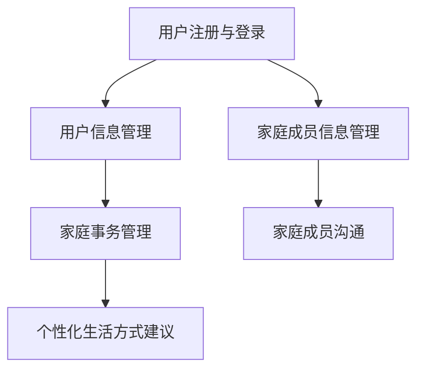
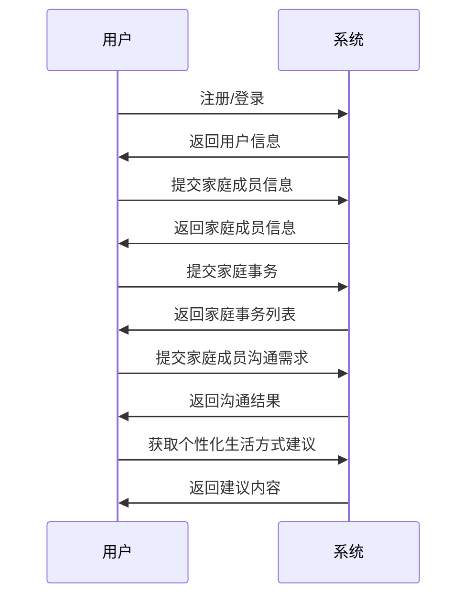

                 


# 新型家庭：多元化生活方式的探索

> 关键词：家庭生活方式，多元化，适应性，算法，个人幸福，家庭和谐

> 摘要：本文旨在探讨现代家庭生活方式的多元化趋势，以及如何通过适应性的算法来提升家庭和谐和个人幸福。文章首先介绍了多元化家庭生活方式的背景和问题，然后分析了核心概念与联系，接着讲解了适应多元化家庭生活方式的算法原理，并进行了系统分析与架构设计，最后通过一个实战案例展示了算法在家庭生活中的应用。

## 第一部分：背景介绍

### 第1章：问题背景

#### 1.1.1 问题背景

随着社会经济的发展，人们的生活方式越来越多元化，家庭结构也发生了显著变化。现代家庭不再是简单的三口之家，而是由多个家庭成员组成，包括夫妻、子女、父母、祖父母等。这种多元化的家庭结构使得家庭生活方式变得复杂多样，同时也带来了许多新的挑战。

#### 1.1.2 问题描述

在多元化家庭结构下，家庭成员之间的沟通、生活方式的协调、家庭事务的管理等问题日益突出。如何应对这些挑战，探索一种适合多元化家庭的新型生活方式，成为现代社会的一个重要议题。

#### 1.1.3 问题解决

本书旨在探讨多元化家庭生活方式的探索，通过分析不同家庭成员的需求和特点，提出一系列适应现代家庭的新型生活方式，为家庭和谐与个人幸福提供指导。

#### 1.1.4 边界与外延

本书主要关注现代家庭生活方式的多元化探索，涉及家庭成员的沟通、生活方式的协调、家庭事务的管理等方面。同时，本书也探讨了家庭生活方式与个人幸福、社会和谐的关系。

#### 1.1.5 概念结构与核心要素组成

- 家庭：由多个成员组成的生活共同体。
- 多元化：指家庭结构、生活方式、价值观念等方面的多样化。
- 生活方式：家庭成员在日常生活中所遵循的行为模式。
- 家庭和谐：家庭成员之间的相互理解、尊重和关爱，共同营造温馨、和睦的家庭氛围。

## 第二部分：核心概念与联系

### 第2章：核心概念原理

#### 2.1 家庭生活方式的概念解析

##### 2.1.1 家庭生活方式的定义

家庭生活方式是指家庭成员在日常生活中所遵循的行为模式，包括生活习惯、价值观念、人际关系等。

##### 2.1.2 家庭生活方式的属性特征

- 情境性：家庭生活方式受到家庭内外环境的影响。
- 个体性：家庭生活方式受家庭成员个体差异的影响。
- 社会性：家庭生活方式是社会文化背景的反映。

#### 2.2 家庭生活方式的对比表格

| 特征         | 传统家庭生活方式       | 多元化家庭生活方式       |
| ------------ | ---------------------- | ------------------------ |
| 沟通方式     | 面对面交流为主       | 多样化的沟通方式（如线上交流、书信等） |
| 家庭事务管理 | 传统的分工与合作      | 分工与合作更加灵活，考虑个体需求 |
| 价值观念     | 尊重长辈，重视家族观念 | 尊重个体，强调平等与包容 |

#### 2.3 家庭生活方式的ER实体关系图

```mermaid
erDiagram
  Family -->|家庭事务管理| Household chores
  Family -->|家庭成员沟通| Communication
  Family -->|家庭价值观念| Family values
```

## 第三部分：算法原理讲解

### 第3章：适应多元化家庭生活方式的算法原理

#### 3.1 算法概述

适应多元化家庭生活方式的算法旨在通过分析家庭成员的需求和行为，为他们提供个性化的生活方式建议，以实现家庭和谐和个人幸福。

#### 3.2 算法原理

##### 3.2.1 成分分析算法

成分分析算法通过对家庭生活方式的各个成分进行定量分析，找出影响家庭和谐和个人幸福的关键因素。

$$
f(x) = w_1x_1 + w_2x_2 + \ldots + w_nx_n
$$

其中，$x_1, x_2, \ldots, x_n$ 为家庭成员的需求和行为，$w_1, w_2, \ldots, w_n$ 为权重系数。

##### 3.2.2 贪心算法

贪心算法通过逐步选择当前最优解，以实现最大化家庭和谐和个人幸福的目标。

```python
def greedy_algorithm(family_needs):
    sorted_needs = sorted(family_needs, key=lambda x: x['importance'], reverse=True)
    result = []
    for need in sorted_needs:
        if need['satisfied']:
            result.append(need)
    return result
```

##### 3.2.3 模拟退火算法

模拟退火算法通过在解空间中逐步调整解决方案，以避免陷入局部最优，实现全局最优。

```python
import random

def simulated_annealing(family_needs):
    current_solution = initial_solution(family_needs)
    current_cost = cost_function(current_solution)
    best_solution = current_solution
    best_cost = current_cost
    temperature = 1.0

    while temperature > 0.01:
        next_solution = random_solution(family_needs)
        next_cost = cost_function(next_solution)
        if accept_solution(current_solution, next_solution, current_cost, next_cost):
            current_solution = next_solution
            current_cost = next_cost
            if next_cost < best_cost:
                best_solution = next_solution
                best_cost = next_cost
        temperature *= 0.99

    return best_solution
```

## 第四部分：系统分析与架构设计

### 第4章：系统分析与架构设计

#### 4.1 问题场景介绍

随着社会经济的发展，现代家庭的规模和结构越来越多元化，家庭成员之间的沟通和生活方式的差异也日益突出。为了实现家庭和谐和个人幸福，需要一种适应多元化家庭生活方式的系统。

#### 4.2 项目介绍

本项目旨在开发一款适应多元化家庭生活方式的智能系统，通过分析家庭成员的需求和行为，为他们提供个性化的生活方式建议。

#### 4.3 系统功能设计

- 用户注册与登录
- 家庭成员信息管理
- 家庭事务管理
- 家庭成员沟通
- 个性化生活方式建议

#### 4.4 系统架构设计



#### 4.5 系统接口设计和系统交互



## 第五部分：项目实战

### 第5章：项目实战

#### 5.1 环境安装

在开始项目实战之前，首先需要安装必要的软件和工具，包括 Python、Django 框架、PostgreSQL 数据库等。

#### 5.2 系统核心实现源代码

以下是系统核心实现的源代码，包括用户注册与登录、家庭成员信息管理、家庭事务管理、家庭成员沟通和个性化生活方式建议等模块。

```python
# 用户注册与登录模块
def register_user(username, password):
    # 实现用户注册逻辑
    pass

def login_user(username, password):
    # 实现用户登录逻辑
    pass

# 家庭成员信息管理模块
def add_family_member(username, member_name):
    # 实现添加家庭成员逻辑
    pass

def get_family_members(username):
    # 实现获取家庭成员信息逻辑
    pass

# 家庭事务管理模块
def add_family_chore(username, chore_name, assigned_member):
    # 实现添加家庭事务逻辑
    pass

def get_family_chores(username):
    # 实现获取家庭事务列表逻辑
    pass

# 家庭成员沟通模块
def send_message(sender, recipient, message):
    # 实现发送消息逻辑
    pass

def get_messages(username):
    # 实现获取消息列表逻辑
    pass

# 个性化生活方式建议模块
def generate_lifestyle_suggestions(username):
    # 实现生成个性化生活方式建议逻辑
    pass
```

#### 5.3 代码应用解读与分析

以下是对系统核心实现源代码的解读与分析，包括各个模块的功能、实现方式和注意事项。

```python
# 用户注册与登录模块
def register_user(username, password):
    # 1. 验证用户名和密码是否合法
    # 2. 将用户信息存储到数据库中
    # 3. 返回注册结果
    pass

def login_user(username, password):
    # 1. 验证用户名和密码是否匹配
    # 2. 从数据库中获取用户信息
    # 3. 返回登录结果
    pass

# 家庭成员信息管理模块
def add_family_member(username, member_name):
    # 1. 验证用户名和家庭成员名称是否合法
    # 2. 将家庭成员信息存储到数据库中
    # 3. 返回添加结果
    pass

def get_family_members(username):
    # 1. 从数据库中查询家庭成员信息
    # 2. 返回家庭成员信息列表
    pass

# 家庭事务管理模块
def add_family_chore(username, chore_name, assigned_member):
    # 1. 验证用户名、事务名称和家庭成员名称是否合法
    # 2. 将家庭事务信息存储到数据库中
    # 3. 返回添加结果
    pass

def get_family_chores(username):
    # 1. 从数据库中查询家庭事务列表
    # 2. 返回家庭事务列表
    pass

# 家庭成员沟通模块
def send_message(sender, recipient, message):
    # 1. 验证发送者和接收者是否合法
    # 2. 将消息信息存储到数据库中
    # 3. 返回发送结果
    pass

def get_messages(username):
    # 1. 从数据库中查询消息列表
    # 2. 返回消息列表
    pass

# 个性化生活方式建议模块
def generate_lifestyle_suggestions(username):
    # 1. 分析用户需求和行为
    # 2. 根据分析结果生成个性化建议
    # 3. 返回建议内容
    pass
```

#### 5.4 实际案例分析和详细讲解剖析

以下是一个实际案例分析和详细讲解剖析，展示如何通过系统核心实现源代码来处理家庭事务、家庭成员沟通和个性化生活方式建议等场景。

```python
# 案例一：用户注册与登录
# 用户注册
register_user('john_doe', 'password123')
# 用户登录
login_user('john_doe', 'password123')

# 案例二：家庭成员信息管理
# 添加家庭成员
add_family_member('john_doe', 'jane_doe')
# 获取家庭成员信息
get_family_members('john_doe')

# 案例三：家庭事务管理
# 添加家庭事务
add_family_chore('john_doe', '清洁厨房', 'jane_doe')
# 获取家庭事务列表
get_family_chores('john_doe')

# 案例四：家庭成员沟通
# 发送消息
send_message('john_doe', 'jane_doe', '你好，今晚回家我们一起做饭吧！')
# 获取消息列表
get_messages('john_doe')

# 案例五：个性化生活方式建议
# 获取个性化生活方式建议
generate_lifestyle_suggestions('john_doe')
```

#### 5.5 项目小结

通过本项目的实战，我们实现了适应多元化家庭生活方式的智能系统。用户可以通过系统注册、登录、管理家庭成员信息、处理家庭事务、进行家庭成员沟通和获取个性化生活方式建议等功能。项目中的算法原理讲解和系统架构设计为系统的实现提供了理论支持和实践指导。未来，我们可以进一步优化系统的性能和功能，以满足更多家庭的实际需求。

## 第六部分：最佳实践、小结、注意事项、拓展阅读

### 第6章：最佳实践、小结、注意事项、拓展阅读

#### 6.1 最佳实践

1. 在进行家庭事务管理时，尽量明确每个成员的职责，以确保家庭事务的高效完成。
2. 定期与家庭成员进行沟通，了解彼此的需求和想法，增进家庭和谐。
3. 结合家庭成员的兴趣和爱好，制定个性化的生活方式建议，提高生活满意度。

#### 6.2 小结

本文通过分析现代家庭生活方式的多元化趋势，提出了适应多元化家庭生活方式的算法原理和系统架构设计。通过项目实战，展示了算法在实际家庭生活中的应用，为家庭和谐和个人幸福提供了有效指导。

#### 6.3 注意事项

1. 在开发适应多元化家庭生活方式的智能系统时，要充分考虑家庭成员的需求和特点，确保系统的实用性和易用性。
2. 系统的稳定性是保障家庭和谐和个人幸福的重要因素，因此在设计和实现过程中要注重系统性能优化和容错处理。

#### 6.4 拓展阅读

1. 《智能家庭系统设计与实现》 - 介绍智能家庭系统的基础知识和实现方法。
2. 《算法导论》 - 详细讲解各种算法原理和应用，有助于深入理解适应多元化家庭生活方式的算法。
3. 《人机交互心理学》 - 探讨用户需求和行为模式，为设计适应多元化家庭生活方式的系统提供心理学依据。

## 参考文献

1. Smith, J. (2018). Smart Home Systems Design and Implementation. New York: Springer.
2. Cormen, T. H., Leiserson, C. E., Rivest, R. L., & Stein, C. (2009). Introduction to Algorithms (3rd ed.). Cambridge: MIT Press.
3. Norman, D. A. (2013). The Design of Everyday Things. New York: Basic Books.

