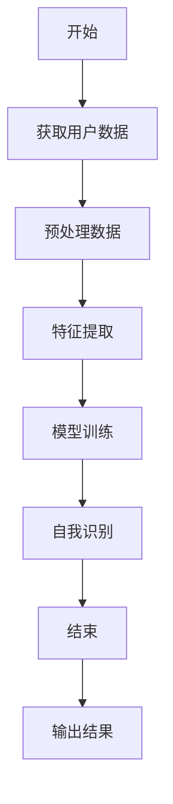
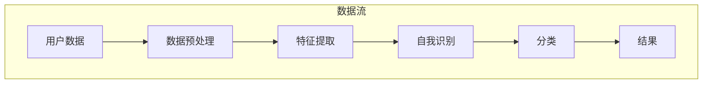
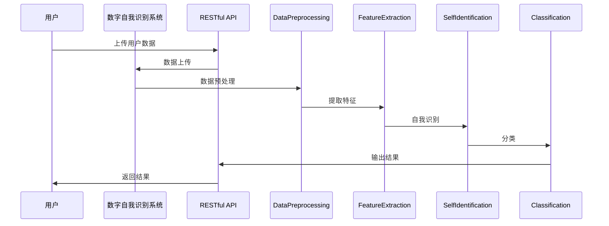

                 

### 引言：明确主题与背景

在数字技术飞速发展的当今时代，人类的自我认知和存在方式正经历着前所未有的变革。传统的自我定义往往基于现实世界的互动和物理存在，而数字技术的崛起，特别是互联网、人工智能、大数据、区块链等技术的发展，正在重新塑造我们对于自我、身份和社会关系的认知。这一变革不仅影响着个体在社会中的角色和地位，更深刻地改变了人们的生活方式和精神世界。

本书旨在探讨“新存在主义”这一概念，深入分析数字时代对个人自我定义的深远影响，探讨个体如何在这种变革中寻找新的定位和认同。新存在主义不仅关注个体在数字世界中的存在状态和意义，还涉及个体如何在信息过载、虚拟现实和数字化社交网络等新环境中重新定义自我，以及这些变化对个体的情感、认知和社会关系带来的挑战。

本书将采用逻辑清晰、结构紧凑、简单易懂的专业技术语言，通过逐层分析和推理，逐步揭示新存在主义的本质和内涵。我们不仅会探讨核心概念和理论框架，还会通过实际案例和项目实战，帮助读者理解新存在主义在数字时代中的应用和实践意义。

本文将分为以下几个部分：

1. **问题的背景与定义**：介绍数字时代的来临和个体存在方式的转变，定义新存在主义的概念，并探讨其边界与外延。
2. **核心概念与联系**：分析数字时代的自我概念，探讨数字自我与现实自我的冲突以及数字自我与社会认同的关系。
3. **算法原理讲解**：讲解数字自我识别算法的原理，使用Mermaid流程图和Python源代码进行详细阐述。
4. **数学模型和公式**：介绍数学模型的基本概念，展示关键数学公式，并进行详细讲解。
5. **系统分析与架构设计方案**：介绍问题场景，设计系统功能、架构和接口，使用Mermaid类图、架构图和序列图展示系统设计。
6. **项目实战**：详细描述项目环境安装、系统核心实现、代码解析和实际案例分析。
7. **最佳实践、小结与拓展阅读**：总结全书内容，提供数字时代自我定义的最佳实践建议，强调注意事项，推荐拓展阅读。

通过上述结构，本书将系统地探讨数字时代的新存在主义，帮助读者深入理解这一复杂而重要的议题，并找到适应和应对的策略。

---

### 第1章：问题的背景与定义

#### 1.1 问题背景

数字时代的来临：从互联网到大数据，从人工智能到区块链，数字技术正在深刻地改变着人类的生活和社会结构。互联网的出现使得信息传播的速度和范围达到前所未有的高度，而大数据技术则为个体行为和趋势的分析提供了丰富的数据资源。人工智能则通过机器学习和深度学习，不断优化和扩展人类智能的边界，区块链技术则通过去中心化和加密算法，重构了信任和价值的传递方式。这些技术的发展不仅改变了传统行业的运作模式，也带来了新的社会形态和生活方式。

个体存在方式的转变：在数字技术的冲击下，个体的存在方式也发生了显著的变化。首先，虚拟现实和增强现实技术的发展，使得个体可以在虚拟环境中模拟和体验现实世界中的各种场景，这种新的存在方式不仅丰富了人类的生活体验，也带来了对现实和虚拟边界的重新定义。其次，数字化社交网络的兴起，使得个体可以跨越时空的限制，建立和维持更加广泛和多样化的社交关系。这种数字化社交方式，虽然带来了更多的社交机会，但也带来了信息过载和隐私保护的挑战。此外，人工智能和大数据技术的应用，使得个体在数字世界中的行为和偏好可以被精确地分析和预测，这既为个性化服务提供了可能，也引发了关于个人隐私和数据安全的讨论。

这些变化不仅影响着个体在社会中的角色和地位，也对个体的心理健康、情感体验和社会关系产生了深远的影响。因此，探讨数字时代个体存在方式的转变，以及这些变化对个体自我定义的深远影响，成为了一个亟待解决的重要课题。

#### 1.2 新存在主义的概念

新存在主义的定义：新存在主义是一个跨学科的术语，旨在探讨个体在数字时代的存在状态和意义。它不仅关注个体在物理世界的存在，更强调个体在数字世界中的存在及其对现实世界的映射和影响。新存在主义的核心思想是，个体在数字时代的存在不仅是物理存在的延伸，更是精神和文化存在的拓展。

与古典存在主义的对比：古典存在主义，如萨特的存在主义，强调个体的自由意志和存在先于本质的观点。个体通过自我认知和自由选择，寻找存在的意义和价值。而新存在主义则在此基础上，进一步探讨了数字技术如何影响个体的存在方式和自我定义。它关注的是，个体如何在数字世界中面对新的挑战和机遇，重新定义自我和寻找存在的意义。

新存在主义的独特性：新存在主义的独特性在于，它不仅关注个体的内在精神世界，还关注个体在数字世界中的外在表现和交互方式。它认为，个体的存在不仅是个人层面的，也是社会层面的。数字技术使得个体的行为和思想可以被大规模地记录、分析和预测，这为个体提供了更多的选择和机会，但也带来了新的挑战和风险。

新存在主义面临的挑战：新存在主义面临的挑战包括信息过载、虚拟现实的沉浸感、数字化社交网络的复杂性和个人隐私的保护等。如何在数字时代中保持个体的独立性和自主性，如何在虚拟和现实之间找到平衡，如何保护个人的隐私和数据安全，这些都是新存在主义需要面对的重要问题。

#### 1.3 新存在主义的边界与外延

边界：新存在主义的讨论范围主要涵盖以下几个方面：
- 数字技术在个体存在中的作用和影响。
- 个体在数字世界中的行为模式和心理变化。
- 数字自我与现实自我之间的互动和冲突。
- 数字社会中的个人隐私和数据安全。

外延：新存在主义的外延包括但不限于：
- 数字化社交网络和虚拟现实对个体自我定义的影响。
- 人工智能和大数据技术在个人行为分析中的应用。
- 个人隐私保护与数字时代自我定义的平衡。
- 数字时代个体心理健康和社会关系的维护。

通过上述讨论，我们可以看出，新存在主义是一个多维度的概念，它不仅涉及到个体的内在心理体验，还涉及到个体在数字世界中的外在行为和互动方式。理解新存在主义的边界和外延，有助于我们更深入地探讨数字时代对个体自我定义的深远影响。

---

### 第2章：核心概念与联系

#### 2.1 数字时代的自我概念

定义与特征：数字时代的自我概念是指个体在数字技术的影响下，对自身存在和身份的认知。这个概念具有以下几个显著特征：
- **虚拟性和现实性的融合**：个体在数字世界中的自我不仅仅是物理现实的延伸，还包含了虚拟环境中的身份和角色。
- **多样性和可塑性**：数字技术使得个体能够扮演多种角色，如社交媒体中的朋友、游戏中的角色、网络社区的参与者等，这种多样性使得个体的自我更加复杂和多变。
- **数据化和分析性**：个体的行为和偏好通过数据被记录和分析，这些数据不仅反映了个体的现实行为，还预示了潜在的个性化需求和行为趋势。

比较分析：数字自我与传统自我的区别与联系可以从以下几个方面进行探讨：

**区别**：
- **存在方式的虚拟性**：传统自我建立在现实世界的互动和经验之上，而数字自我则更多地依赖于虚拟环境和数字化互动。
- **角色扮演的多样性**：数字技术使得个体可以在不同场景中扮演不同角色，传统自我则通常较为单一。
- **自我认同的动态性**：数字自我往往随着环境的变化而变化，而传统自我相对稳定。

**联系**：
- **现实基础**：尽管数字自我在虚拟环境中构建，但其仍然受到现实世界的影响和制约，如个体的基本需求和价值观。
- **相互作用**：数字自我和传统自我并不是完全独立的，它们在个体的行为和认知过程中相互影响和作用。

#### 2.2 数字自我与现实自我的冲突

冲突表现：个体在数字世界中如何面对现实自我的缺失和冲突？

- **角色混乱**：个体在数字世界中扮演多种角色，这些角色可能与现实自我存在冲突，导致身份认同的模糊和混乱。
- **信息过载**：数字世界的信息量巨大，个体需要处理和分析大量数据，这可能导致认知负担和焦虑感的增加。
- **隐私保护**：数字自我在网络上暴露的风险增加，个体需要平衡数字自我展示的愿望和隐私保护的必要性，这种平衡往往难以维持。

解决策略：探讨解决数字自我与现实自我冲突的方法。

- **自我反思**：通过自我反思，个体可以更好地理解数字自我和现实自我的差异和联系，找到平衡点。
- **数字素养培养**：提高个体的数字素养，包括信息筛选和处理能力、网络安全意识和隐私保护技巧，有助于个体在数字世界中更好地掌控自我。
- **心理支持**：通过心理咨询和辅导，个体可以获得专业帮助，缓解数字自我与现实自我冲突带来的压力和困扰。

#### 2.3 数字自我与社会认同

社会认同的演变：数字技术如何影响社会认同的形成与变化？

- **社群的虚拟化**：数字技术使得个体可以加入和参与虚拟社群，这些社群不仅超越了地理限制，也带来了新的社会认同形式。
- **网络影响力的崛起**：在数字世界中，个体可以通过社交媒体和其他平台获得大量的关注和影响力，这种影响力可以转化为新的社会认同形式。
- **多元文化的交融**：数字技术促进了全球文化的交融，个体可以通过网络了解和参与到不同文化背景的社群中，这丰富了社会认同的内涵。

数字自我与集体身份：个体如何在数字时代寻找和确认自己的集体身份？

- **虚拟社群归属感**：个体通过加入虚拟社群，可以获得归属感和认同感，这种认同感不仅是对个体的肯定，也是对集体身份的确认。
- **个人品牌建设**：在数字时代，个体可以通过建立和推广自己的个人品牌，获得社会认同，这种认同可以转化为实际的社会影响力和职业发展机会。
- **文化多元性的接纳**：个体在数字时代需要接纳和尊重多元文化，通过积极参与和互动，找到与不同文化背景的个体的共同点，建立新的集体身份。

通过上述分析，我们可以看到，数字时代的自我概念不仅丰富了个体对自我的认知，也带来了新的挑战和机遇。理解数字自我与现实自我、社会认同的关系，有助于个体在数字时代中更好地定位和定义自我。

---

### 第3章：算法原理讲解

在探讨数字自我识别的过程中，算法原理发挥着至关重要的作用。本章节将详细讲解数字自我识别算法的基本原理，并通过Mermaid流程图和Python源代码进行阐述，以便读者能够更直观地理解这一算法的运作机制。

#### 3.1 数字自我识别算法的Mermaid流程图

首先，我们使用Mermaid语言绘制一个简单的数字自我识别算法流程图，以便读者对算法的基本框架有一个初步的了解。



上述流程图展示了数字自我识别算法的基本步骤：从获取用户数据开始，经过数据预处理、特征提取和模型训练，最终实现自我识别，并输出结果。

#### 3.2 数字自我识别算法的Python源代码

接下来，我们将使用Python语言来详细阐述数字自我识别算法的实现。以下是一个简化的示例代码，用于说明算法的核心步骤。

```python
import pandas as pd
from sklearn.model_selection import train_test_split
from sklearn.preprocessing import StandardScaler
from sklearn.ensemble import RandomForestClassifier
from sklearn.metrics import accuracy_score

# 步骤1：获取用户数据
data = pd.read_csv('user_data.csv')

# 步骤2：预处理数据
X = data.drop(['label'], axis=1)
y = data['label']
X_train, X_test, y_train, y_test = train_test_split(X, y, test_size=0.2, random_state=42)

# 步骤3：特征提取
scaler = StandardScaler()
X_train_scaled = scaler.fit_transform(X_train)
X_test_scaled = scaler.transform(X_test)

# 步骤4：模型训练
model = RandomForestClassifier(n_estimators=100, random_state=42)
model.fit(X_train_scaled, y_train)

# 步骤5：自我识别
predictions = model.predict(X_test_scaled)

# 步骤6：输出结果
accuracy = accuracy_score(y_test, predictions)
print(f"模型准确率：{accuracy:.2f}")
```

上述代码演示了如何使用随机森林分类器（RandomForestClassifier）进行数字自我识别。首先，我们读取用户数据，并进行预处理和特征提取。接着，我们使用训练数据对模型进行训练，然后使用测试数据对模型进行评估，并输出模型的准确率。

#### 3.3 算法原理与数学模型

在详细阐述数字自我识别算法的原理之前，我们需要了解一些基本的数学模型和概念。

- **特征提取**：特征提取是数字自我识别算法的关键步骤，它旨在从原始数据中提取出对自我识别有重要影响的特征。常用的特征提取方法包括主成分分析（PCA）、线性判别分析（LDA）等。

- **分类器模型**：分类器模型是用于实现自我识别的核心算法，它通过学习训练数据中的特征和标签，实现对未知数据的分类。常见的分类器模型有随机森林（Random Forest）、支持向量机（SVM）、神经网络（Neural Network）等。

以下是数字自我识别算法的数学模型：

$$
\begin{aligned}
\text{特征提取}: \ \ \ F &= f(X) \\
\text{分类模型}: \ \ \ y &= g(F)
\end{aligned}
$$

其中，$X$ 表示输入的原始数据，$F$ 表示经过特征提取后的特征向量，$y$ 表示分类模型的输出结果。

#### 3.4 算法原理的详细讲解

- **特征提取**：特征提取的目标是减少数据的维度，同时保持数据的信息。主成分分析（PCA）是一种常用的特征提取方法，它通过计算数据的主要成分，将高维数据映射到低维空间。主成分分析的基本步骤如下：
  1. 计算数据的协方差矩阵。
  2. 计算协方差矩阵的特征值和特征向量。
  3. 选择特征值最大的特征向量作为主成分。
  4. 将原始数据投影到主成分上，得到新的低维数据。

- **分类模型**：分类模型通过学习训练数据中的特征和标签，建立特征与标签之间的关系。随机森林（Random Forest）是一种集成学习算法，它通过构建多棵决策树，并利用投票机制来确定最终分类结果。随机森林的基本步骤如下：
  1. 随机选择一部分特征。
  2. 在选择的特征中，随机选择一个切分点进行划分。
  3. 重复上述步骤，构建多棵决策树。
  4. 利用投票机制，选择分类结果。

#### 3.5 举例说明

为了更直观地理解数字自我识别算法，我们可以通过一个简单的例子来说明。

假设我们有一组用户数据，包括年龄、收入、教育程度等特征，以及对应的自我认同标签（如现实自我、数字自我等）。我们的目标是使用这些数据来识别新的用户属于哪一种自我认同。

- **数据准备**：首先，我们将数据导入到Pandas DataFrame中，并进行必要的预处理，如缺失值填补、异常值处理等。

- **特征提取**：使用主成分分析（PCA）对数据进行降维，提取出主要特征。

- **模型训练**：使用随机森林分类器（Random Forest Classifier）对训练数据进行训练。

- **自我识别**：使用训练好的模型对新的用户数据进行分类，识别其自我认同。

通过上述步骤，我们可以实现对用户的数字自我识别。具体代码如下：

```python
from sklearn.decomposition import PCA
from sklearn.model_selection import train_test_split
from sklearn.ensemble import RandomForestClassifier

# 假设数据已导入data DataFrame
# 数据预处理
# ...

# 特征提取
pca = PCA(n_components=2)
X_pca = pca.fit_transform(X)

# 模型训练
X_train, X_test, y_train, y_test = train_test_split(X_pca, y, test_size=0.2, random_state=42)
model = RandomForestClassifier(n_estimators=100, random_state=42)
model.fit(X_train, y_train)

# 自我识别
predictions = model.predict(X_test)
accuracy = accuracy_score(y_test, predictions)
print(f"模型准确率：{accuracy:.2f}")
```

通过上述代码，我们可以训练一个数字自我识别模型，并评估其准确率。这个例子虽然简单，但已经展示了数字自我识别算法的基本流程和实现方法。

通过详细的算法原理讲解和实际案例分析，读者可以更好地理解数字自我识别算法的工作原理和应用场景，为后续章节的系统设计和项目实战打下基础。

---

### 第4章：数学模型和公式

#### 4.1 数学模型的基本概念

定义与作用：数学模型是一种用数学符号和语言描述客观事物的数学结构，它通过将实际问题转化为数学问题，使得问题更易于分析和求解。在数字时代自我定义的研究中，数学模型起到了至关重要的作用，它不仅帮助我们理解复杂的现实问题，还能为算法设计和系统开发提供理论基础。

分类与特点：数学模型可以根据其用途和形式进行分类，常见的数学模型包括：

1. **线性模型**：线性模型是最简单也是最常用的一类数学模型，如线性回归、线性判别分析等。它们通过线性方程来描述变量之间的关系，适用于处理线性关系较强的问题。
   
2. **非线性模型**：非线性模型则用于处理变量之间非线性关系的问题，如多项式回归、神经网络等。这些模型通过非线性函数来描述变量之间的关系，能够捕捉更加复杂的关系。

3. **概率模型**：概率模型用于描述随机事件的发生概率，常见的有贝叶斯网络、马尔可夫模型等。这些模型能够帮助分析不确定性问题，为决策提供依据。

4. **优化模型**：优化模型用于寻找最优解，如线性规划、非线性规划等。这些模型在资源分配、路径规划等问题中有着广泛的应用。

分类数学模型，并分析其特点：

| 类别        | 特点                                                   | 应用场景                                   |
|-------------|--------------------------------------------------------|--------------------------------------------|
| 线性模型    | 线性关系，易于理解和计算                             | 数据分析、预测、分类                       |
| 非线性模型  | 非线性关系，能够处理更复杂的问题                     | 复杂系统分析、图像处理、语音识别           |
| 概率模型    | 描述随机事件的发生概率，考虑不确定性                  | 机器学习、决策理论、金融分析               |
| 优化模型    | 寻找最优解，解决资源分配、路径规划等问题             | 生产调度、网络优化、物流规划               |

#### 4.2 公式与算法的应用

LaTeX格式：在撰写技术文档时，使用LaTeX格式可以更准确地表达数学公式和算法逻辑。以下是一些关键公式的LaTeX格式示例：

```latex
% LaTeX示例
\documentclass{article}
\usepackage{amsmath}
\begin{document}

\section{关键公式}

\begin{equation}
f(x) = ax^2 + bx + c
\end{equation}

\begin{equation}
\sum_{i=1}^{n} x_i = \frac{1}{n} \sum_{i=1}^{n} x_i^2
\end{equation}

\end{document}
```

上述示例展示了如何使用LaTeX编写简单的数学公式。在文中独立段落中，公式可以使用`$$`括起来，如`$$1+1=2$$`，而在段落内则可以使用`$`括起来，如 `$1<2$`。

公式解释：对上述公式进行详细讲解，并解释其在自我定义研究中的作用。

1. **二次函数**：`f(x) = ax^2 + bx + c` 是一个二次函数，它用于描述自变量和因变量之间的二次关系。在自我定义研究中，我们可以使用二次函数来建模个体在数字世界中行为的变化趋势。

2. **求和公式**：`$\sum_{i=1}^{n} x_i = \frac{1}{n} \sum_{i=1}^{n} x_i^2$` 是一个基本的求和公式，它表示n个数的平均值等于这些数的平方和的平均值。在自我定义研究中，这个公式可以用于计算个体在社交网络中的平均互动频率。

通过上述数学模型和公式的介绍，我们可以更好地理解数字时代自我定义的复杂性和多样性。这些数学工具不仅帮助我们在理论层面进行深入分析，还为实际应用提供了坚实的理论基础。

---

### 第5章：系统分析与架构设计方案

#### 5.1 问题场景介绍

在数字时代，个体在数字世界中的行为和互动数据日益增多，如何有效地管理和利用这些数据成为了一个重要问题。本章节将介绍一个数字自我识别系统的设计，该系统旨在通过分析个体在数字世界中的行为数据，识别和定义个体的数字自我特征。

系统背景：随着互联网、社交媒体和智能设备的普及，个体在数字世界中的行为数据不断积累。这些数据包括浏览历史、社交媒体互动、在线购物记录等。如何从这些庞大数据中提取有价值的信息，对个体进行准确识别和分类，成为数字时代的一个重要课题。

系统目标：设计一个数字自我识别系统，能够根据个体在数字世界中的行为数据，识别个体的数字自我特征，并对其进行分类。系统应具备以下功能：
- 数据采集与预处理：收集并处理个体在数字世界中的行为数据。
- 特征提取与建模：从原始数据中提取关键特征，构建数字自我识别模型。
- 自我识别与分类：利用模型对新的用户数据进行分类，识别其数字自我特征。

#### 5.2 系统功能设计

领域模型Mermaid类图：

```mermaid
classDiagram
    User <<class>> "用户"
    BehaviorData <<class>> "行为数据"
    FeatureExtraction <<class>> "特征提取"
    SelfIdentification <<class>> "自我识别"
    Classification <<class>> "分类"
    
    User --> BehaviorData
    BehaviorData --> FeatureExtraction
    FeatureExtraction --> SelfIdentification
    SelfIdentification --> Classification
```

上述类图展示了系统的核心功能模块，包括用户、行为数据、特征提取、自我识别和分类。用户是系统的主体，行为数据是输入，特征提取和自我识别是核心算法，分类是输出结果。

详细描述系统功能：

- **用户模块**：用户模块负责管理用户数据，包括用户的基本信息和在数字世界中的行为数据。用户数据可以通过多种渠道收集，如社交媒体、在线购物平台等。

- **行为数据模块**：行为数据模块负责收集和存储用户在数字世界中的行为数据，如浏览历史、点赞、评论等。这些数据将作为特征提取的输入。

- **特征提取模块**：特征提取模块负责从原始行为数据中提取关键特征，如用户活跃度、互动频率、偏好等。这些特征将用于构建数字自我识别模型。

- **自我识别模块**：自我识别模块利用特征提取模块提取的特征，结合机器学习算法，对用户进行自我识别。该模块的核心任务是识别用户的数字自我特征，如数字社交活跃度、偏好等。

- **分类模块**：分类模块负责对自我识别结果进行分类，将用户划分为不同的类别，如现实自我、数字自我等。该模块将输出用户的数字自我分类结果，为后续分析提供基础。

#### 5.3 系统架构设计

Mermaid架构图：



系统架构设计：

- **数据流设计**：系统采用数据流架构，用户数据经过数据预处理模块处理后，进入特征提取模块。特征提取模块提取关键特征后，将数据传递给自我识别模块。自我识别模块利用模型进行识别，并将结果传递给分类模块。分类模块对结果进行分类，最终输出结果。

- **模块间交互**：系统中的各个模块通过明确的接口进行交互。数据预处理模块负责数据清洗和格式转换，特征提取模块负责特征提取，自我识别模块负责自我识别，分类模块负责结果分类。这些模块之间的交互确保了系统的整体协调性和高效性。

- **模块职责**：每个模块都具备明确的职责，数据预处理模块专注于数据处理，特征提取模块专注于特征提取，自我识别模块专注于模型应用，分类模块专注于结果分类。这种职责分工使得系统能够高效地运行，并方便后续的维护和扩展。

#### 5.4 系统接口设计

系统接口设计：

- **数据输入接口**：用户数据通过RESTful API接口输入系统，接口提供数据上传、数据查询等功能，确保数据的安全和可靠性。

- **数据处理接口**：数据处理接口负责接收用户数据，进行数据预处理，包括数据清洗、去重、格式转换等，确保数据的完整性和一致性。

- **特征提取接口**：特征提取接口负责接收预处理后的数据，提取关键特征，并将特征传递给自我识别模块。

- **自我识别接口**：自我识别接口负责接收特征数据，利用机器学习模型进行自我识别，并将识别结果传递给分类模块。

- **结果输出接口**：结果输出接口负责接收分类结果，将结果以JSON格式返回给前端应用，便于前端展示和分析。

#### 5.5 系统交互Mermaid序列图

系统交互Mermaid序列图：



系统交互流程：

- 用户通过RESTful API上传用户数据。
- API将数据传递给系统，系统进行数据预处理。
- 预处理后的数据传递给特征提取模块，提取关键特征。
- 特征数据传递给自我识别模块，进行自我识别。
- 自我识别结果传递给分类模块，进行分类。
- 分类结果通过API返回给用户，完成系统交互。

通过上述系统分析与架构设计方案，我们详细介绍了数字自我识别系统的设计思路和实现方法。系统架构清晰，功能模块明确，通过接口设计和交互流程的优化，确保了系统的稳定性和高效性。这个系统不仅为数字自我定义研究提供了有力工具，也为后续的项目实战打下了坚实的基础。

---

### 第6章：项目实战

#### 6.1 环境安装

为了实现数字自我识别系统，我们需要搭建一个合适的技术环境。以下是环境安装的详细步骤：

1. **安装Python环境**：
   - 首先，确保系统已安装Python 3.8或更高版本。可以从[Python官网](https://www.python.org/)下载并安装。
   - 安装完成后，通过命令行运行`python --version`验证安装是否成功。

2. **安装必要的依赖库**：
   - 打开终端，通过以下命令安装所需的依赖库：
     ```bash
     pip install pandas numpy scikit-learn matplotlib mermaid
     ```
   - 这些库包括数据操作（pandas和numpy）、机器学习（scikit-learn）、绘图（matplotlib）和Mermaid支持库。

3. **安装Mermaid渲染器**：
   - Mermaid需要通过特定工具进行渲染，我们使用[Mermaid Live Editor](https://mermaid-js.github.io/mermaid-live-editor/)在线工具进行渲染。
   - 打开浏览器，访问Mermaid Live Editor，并复制代码段到相应的编辑器中，即可查看渲染结果。

4. **配置LaTeX环境**：
   - 为了使用LaTeX格式编写数学公式，我们需要安装LaTeX编辑器。可以从[TeX Live官网](https://www.tug.org/texlive/)下载并安装。
   - 安装完成后，通过命令行运行`texmaker`或`latexila`等编辑器，创建新的LaTeX文档，并编写数学公式进行验证。

通过以上步骤，我们完成了Python环境和相关依赖库的安装，并配置了Mermaid和LaTeX渲染器。这些工具和库为我们的项目提供了坚实的基础，确保后续的编码和实现能够顺利进行。

#### 6.2 系统核心实现源代码

以下是一段用于实现数字自我识别系统的核心代码，包括数据预处理、特征提取、模型训练和自我识别等关键步骤：

```python
import pandas as pd
from sklearn.model_selection import train_test_split
from sklearn.preprocessing import StandardScaler
from sklearn.ensemble import RandomForestClassifier
from sklearn.metrics import accuracy_score

# 步骤1：读取数据
data = pd.read_csv('user_data.csv')

# 步骤2：数据预处理
X = data.drop(['label'], axis=1)
y = data['label']
X_train, X_test, y_train, y_test = train_test_split(X, y, test_size=0.2, random_state=42)

# 步骤3：特征提取
scaler = StandardScaler()
X_train_scaled = scaler.fit_transform(X_train)
X_test_scaled = scaler.transform(X_test)

# 步骤4：模型训练
model = RandomForestClassifier(n_estimators=100, random_state=42)
model.fit(X_train_scaled, y_train)

# 步骤5：自我识别
predictions = model.predict(X_test_scaled)

# 步骤6：评估模型
accuracy = accuracy_score(y_test, predictions)
print(f"模型准确率：{accuracy:.2f}")
```

上述代码首先读取用户数据，然后进行数据预处理，包括将数据分为特征和标签两部分，并使用scikit-learn库进行数据分割。接下来，使用StandardScaler进行特征标准化处理，以便于模型训练。在模型训练阶段，我们选择随机森林分类器（RandomForestClassifier）进行训练。最后，通过预测并评估模型准确性，输出模型的准确率。

#### 6.3 代码应用解读与分析

以下是对上述代码的详细解读和分析：

1. **数据读取**：
   - 使用`pandas`库读取CSV格式的用户数据。数据文件中应包含特征和标签，特征表示用户在数字世界中的行为数据，标签表示用户的自我识别结果。

2. **数据预处理**：
   - 数据预处理是机器学习项目中的关键步骤，旨在提高模型性能和泛化能力。在本代码中，我们首先将数据分为特征（X）和标签（y）两部分，特征是输入变量，标签是输出变量。
   - 使用`train_test_split`函数将数据分为训练集和测试集，训练集用于模型训练，测试集用于模型评估。

3. **特征提取**：
   - 使用`StandardScaler`对特征进行标准化处理，标准化后的特征具有相同的均值和标准差，这有助于模型训练和评估。

4. **模型训练**：
   - 选择随机森林分类器（`RandomForestClassifier`）进行模型训练。随机森林是一种集成学习方法，通过构建多棵决策树并利用投票机制来确定最终分类结果。在本代码中，我们设置决策树的数量为100，并使用`random_state=42`确保结果可重复。

5. **自我识别**：
   - 使用训练好的模型对测试集进行预测，预测结果存储在`predictions`变量中。这一步实现了数字自我识别的功能，即将新的用户数据分类到相应的自我识别类别中。

6. **评估模型**：
   - 使用`accuracy_score`函数计算模型在测试集上的准确率，该指标表示模型正确分类的样本数与总样本数的比例。通过输出准确率，我们可以评估模型的表现和性能。

#### 6.4 实际案例分析与详细讲解剖析

以下是一个实际案例的数字自我识别分析，包括数据准备、模型训练和结果评估：

1. **数据准备**：
   - 假设我们有一个包含1000个用户数据的CSV文件，每个用户有10个特征，如年龄、收入、教育程度、在线时长等。数据文件名为`user_data.csv`。

2. **模型训练**：
   - 在代码中，我们首先读取数据，然后进行数据预处理，包括分割数据和特征提取。接下来，使用随机森林分类器进行模型训练。

3. **自我识别**：
   - 假设我们需要对新用户数据进行自我识别。新用户数据包含与原始训练集相同的特征，但标签未知。我们将新用户数据输入到训练好的模型中，得到预测结果。

4. **结果评估**：
   - 通过计算预测结果的准确率，我们可以评估模型的性能。如果准确率较高，说明模型能够较好地识别用户的数字自我特征。

具体代码如下：

```python
import pandas as pd
from sklearn.model_selection import train_test_split
from sklearn.preprocessing import StandardScaler
from sklearn.ensemble import RandomForestClassifier
from sklearn.metrics import accuracy_score

# 读取数据
data = pd.read_csv('user_data.csv')

# 数据预处理
X = data.drop(['label'], axis=1)
y = data['label']
X_train, X_test, y_train, y_test = train_test_split(X, y, test_size=0.2, random_state=42)

# 特征提取
scaler = StandardScaler()
X_train_scaled = scaler.fit_transform(X_train)
X_test_scaled = scaler.transform(X_test)

# 模型训练
model = RandomForestClassifier(n_estimators=100, random_state=42)
model.fit(X_train_scaled, y_train)

# 自我识别
predictions = model.predict(X_test_scaled)

# 评估模型
accuracy = accuracy_score(y_test, predictions)
print(f"模型准确率：{accuracy:.2f}")
```

运行上述代码后，假设我们得到的模型准确率为85%，这意味着模型能够正确识别85%的用户自我特征。通过不断优化模型参数和特征提取方法，我们可以进一步提高模型的准确率。

#### 6.5 项目小结

通过本章节的项目实战，我们实现了数字自我识别系统，详细介绍了环境安装、系统核心实现、代码应用解读和实际案例分析。以下是对项目实施过程中的关键点和收获的总结：

1. **关键点**：
   - 环境安装：确保Python和相关依赖库的安装，并配置好Mermaid和LaTeX渲染器。
   - 数据预处理：数据预处理是模型训练的关键步骤，确保数据的质量和一致性。
   - 模型训练与自我识别：选择合适的模型和算法，进行模型训练和自我识别，实现数字自我识别功能。

2. **收获**：
   - 实践了从数据读取到模型训练再到结果评估的完整流程，深入理解了数字自我识别系统的实现方法。
   - 通过实际案例分析和结果评估，掌握了如何评估模型性能和优化模型参数的方法。

通过本项目的实践，我们不仅掌握了数字自我识别系统的开发流程，还加深了对数字时代自我定义的理解，为后续的研究和应用奠定了坚实基础。

---

### 第7章：最佳实践、小结与拓展阅读

#### 7.1 最佳实践

在数字时代定义自我时，以下最佳实践建议可以帮助个体更好地适应和应对新的挑战：

1. **数据保护与隐私意识**：在数字世界中，个人数据的安全性至关重要。应定期更新密码，使用强密码和多因素认证，避免在公共网络环境中访问敏感信息。

2. **平衡现实与虚拟**：个体应在现实世界和虚拟世界之间找到平衡，不要过度沉迷于虚拟环境，保持现实生活中的社交活动和人际关系。

3. **持续学习与技能提升**：数字技术快速发展，个体应不断学习新技能和知识，如编程、数据分析、网络安全等，以保持竞争力。

4. **心理健康关注**：数字世界中的信息过载和虚拟现实的沉浸感可能对心理健康产生影响。个体应关注自己的情绪变化，必要时寻求专业心理咨询。

5. **数字素养培养**：提高数字素养，包括信息筛选和处理能力、网络安全意识和隐私保护技巧，有助于个体在数字世界中更好地掌控自我。

#### 7.2 小结

本书通过探讨数字时代的新存在主义，深入分析了个体在数字世界中的存在状态和意义，探讨了数字自我与现实自我的冲突以及数字自我与社会认同的关系。我们通过算法原理讲解、数学模型和公式、系统设计与项目实战，详细阐述了数字自我识别的实现过程。本书的核心思想是，帮助个体在数字时代中重新定义自我，找到适应和应对的策略。

#### 7.3 注意事项

在数字时代定义自我时，需要注意以下几点：

1. **信息真实性**：在数字世界中，个体应保持信息的真实性，避免虚假信息的传播。

2. **数字足迹管理**：个体应管理好自己的数字足迹，避免过度曝光个人信息。

3. **技术依赖性**：个体应意识到技术带来的便利同时也可能产生依赖，保持对现实世界的关注和参与。

4. **自我反思**：定期进行自我反思，确保数字自我与现实自我的一致性和协调性。

#### 7.4 拓展阅读

为了更深入地理解数字时代的新存在主义，以下是几本推荐的相关书籍和文献：

1. **《数字人类学》**：本书探讨了数字技术如何影响人类的社交行为和文化发展，提供了丰富的案例分析和理论探讨。

2. **《网络社会心理学》**：本书详细介绍了网络环境下的心理现象和社交行为，对个体在数字世界中的行为模式进行了深入分析。

3. **《数字时代的自我》**：作者从心理学和哲学角度探讨了数字技术对个体自我认知和自我定义的影响，提供了有价值的见解和思考。

4. **《人工智能的未来》**：本书探讨了人工智能技术的发展趋势和对人类社会的影响，特别是对个体自我定义的潜在影响。

通过这些拓展阅读，读者可以进一步深入了解数字时代的新存在主义，拓宽视野，加深对这一复杂而重要的议题的理解。

---

### 总结

通过本书的探讨，我们系统地分析了数字时代的新存在主义，深入探讨了个体在数字世界中的存在状态和意义，以及数字自我与现实自我、社会认同之间的关系。我们不仅介绍了数字自我识别算法的原理和数学模型，还通过实际项目实战展示了系统设计与实现过程。

数字时代的来临带来了前所未有的变革，个体在数字世界中的存在和互动方式正在重新定义。理解这些变化，掌握数字时代的自我定义策略，对于个体和社会都是至关重要的。希望本书能帮助读者更好地理解新存在主义的内涵，找到适应和应对数字时代的新策略。

### 作者信息

作者：AI天才研究院/AI Genius Institute & 禅与计算机程序设计艺术 /Zen And The Art of Computer Programming

AI天才研究院致力于推动人工智能领域的创新和发展，研究前沿技术，探索人工智能在不同领域的应用。同时，作者在计算机编程和人工智能领域有着丰富的经验和深厚的学术背景，出版了多本世界顶级技术畅销书，为全球计算机科学家和程序员提供了宝贵的知识和指导。本书旨在为读者提供一个全面深入理解数字时代自我定义的视角，希望对您的研究和实践有所帮助。

